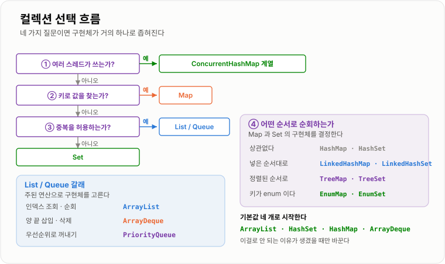
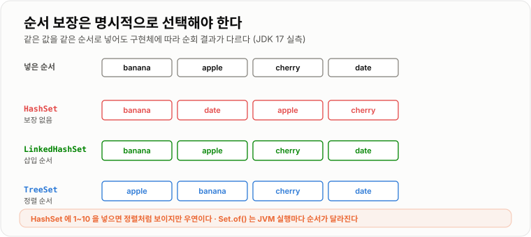
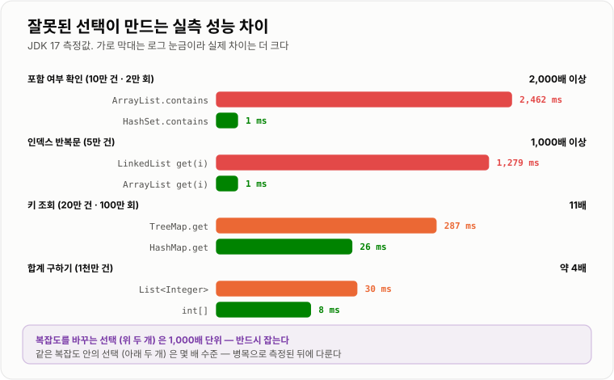

# Collection 선택 기준

> **컬렉션 선택은 취향이 아니라 요구사항에서 기계적으로 도출된다. "중복 · 순서 · 접근 방식 · 동시성" 네 가지 질문에 답하면 구현체는 거의 하나로 좁혀진다.**

---

## 1. 핵심 요약

**컬렉션 선택은 "중복 · 순서 · 접근 방식 · 동시성" 네 질문의 답이며, 기본값 네 개로 시작해 그것으로 안 되는 이유가 생겼을 때만 바꾸는 것이 가장 빠르고 안전하다.**

### 한눈에 보기

* 선택은 두 단계다. **먼저 인터페이스**(`List`·`Set`·`Map`·`Queue`)를 정하고, **그다음 구현체**를 고른다. 순서를 바꾸면 판단이 꼬인다.
* 인터페이스는 **중복 허용 여부와 접근 방식**으로, 구현체는 **순서 요구사항**으로 결정된다.
* 잘 모르겠으면 **`ArrayList` · `HashSet` · `HashMap` · `ArrayDeque`** 네 개가 기본값이다. 나머지는 이 기본값으로 안 되는 이유가 있을 때만 쓴다.
* 잘못 고르면 대가가 크다. 실측에서 `ArrayList.contains`는 `HashSet` 대비 **2,000배 이상**, `LinkedList`의 인덱스 반복문은 **1,000배 이상** 느렸다.
* **`null` 허용 여부는 구현체마다 다르다.** `HashMap`은 되고 `TreeMap`·`ConcurrentHashMap`·`ArrayDeque`는 `NullPointerException`이다.
* **순서가 필요하면 반드시 명시적으로 선택해야 한다.** `HashSet`이 정렬되어 보이는 것은 우연이고, `Set.of()`는 실행할 때마다 순서가 달라진다.

### 무엇을 해결하는가

#### 해결하려는 문제

Java의 컬렉션 구현체는 20개가 넘는다. 그런데 대부분의 코드에서는 습관적으로 `ArrayList`와 `HashMap`만 쓴다.

문제는 **습관으로 고른 선택이 요구사항과 어긋날 때 조용히 틀린다**는 점이다.

```java
// 중복을 없애야 하는데 List 를 썼다
List<Long> visited = new ArrayList<Long>();
if (!visited.contains(id)) {      // 원소가 늘수록 느려진다
    visited.add(id);
}

// 순서가 중요한데 HashSet 을 썼다
Set<String> steps = new HashSet<String>();
steps.add("결제");
steps.add("배송");
// 순회하면 순서가 뒤집혀 있을 수 있다
```

둘 다 **컴파일도 되고 테스트도 통과한다.** 첫 번째는 데이터가 적을 때 문제가 드러나지 않고, 두 번째는 우연히 순서가 맞을 수도 있다. 운영에서 데이터가 늘어난 뒤에야 터진다.

#### 이 개념이 없을 때

선택 기준이 없으면 다음 상황이 반복된다.

* 중복 제거를 `List.contains`로 처리해 **`O(n²)`** 짜리 코드를 만든다.
* `HashMap`의 순회 순서에 의존한 코드를 짜고, **데이터가 늘어나면서 순서가 바뀌어** 버그가 생긴다.
* `null`을 담으려다 `NullPointerException`을 만나고, 왜 어떤 맵은 되고 어떤 맵은 안 되는지 몰라 `if (value != null)`을 덧붙인다.
* 스레드 여러 개가 쓰는 `HashMap`을 그대로 두어 **원소가 유실되거나 무한 루프**에 빠진다.
* "삽입이 많으니 `LinkedList`"라고 판단했는데 실제로는 `ArrayList`가 훨씬 빨랐다.

**컬렉션 선택은 성능 최적화가 아니라 요구사항 표현의 문제다.** `Set`을 쓴다는 것은 "중복이 없어야 한다"는 선언이고, `LinkedHashMap`을 쓴다는 것은 "순서가 의미 있다"는 선언이다. 타입만 봐도 의도가 읽히도록 고르는 것이 목적이다.

---

## 2. 동작 원리

### 핵심 구성 요소

| 개념              | 설명                                       | 중요한 이유                                 |
| --------------- | ---------------------------------------- | -------------------------------------- |
| **인터페이스 우선 선택** | 구현체보다 `List`·`Set`·`Map`을 먼저 정하는 것        | 요구사항이 타입에 드러나고 나중에 구현체를 바꿀 수 있다.       |
| **중복 허용 여부**    | 같은 값이 여러 번 들어갈 수 있는가                     | `List`와 `Set`을 가르는 첫 번째 질문이다.          |
| **접근 방식**       | 인덱스 / 키 / 순서대로 / 우선순위                    | 인터페이스를 결정하는 두 번째 질문이다.                 |
| **순서 보장 3종**    | 보장 없음 / 삽입 순서 / 정렬 순서                    | 구현체를 결정하는 핵심 기준이다.                     |
| **삽입 순서**       | 넣은 순서대로 순회되는 것 (`LinkedHashMap`)          | "입력 순서를 유지하되 중복은 제거"라는 흔한 요구다.         |
| **정렬 순서**       | 비교 기준에 따라 정렬되어 순회되는 것 (`TreeMap`)         | 범위 조회와 최대·최소 조회가 함께 따라온다.              |
| **로드 팩터**       | 버킷 배열을 얼마나 채우면 늘릴지 정한 비율 (기본 0.75)        | 초기 용량을 계산할 때 반드시 들어간다.                 |
| **초기 용량 산정**    | `예상 원소 수 / 0.75 + 1`                     | 이걸 모르면 초기 용량을 줘도 resize가 일어난다.         |
| **스레드 안전성**     | 여러 스레드가 동시에 써도 되는가                       | 대부분의 표준 컬렉션은 안전하지 않다.                  |
| **오토박싱 비용**     | 기본형을 컬렉션에 담을 때 래퍼 객체가 생기는 것              | 대량 수치 데이터에서 메모리와 속도를 모두 잃는다.           |
| **기본값 전략**      | 특별한 이유가 없으면 정해둔 기본 구현체를 쓰는 것             | 근거 없는 다양성이 코드를 어렵게 만든다.                |

#### 개념 간 관계

```text
요구사항                     →   결정되는 것

"중복이 있어도 되는가"          →   List / Set
"무엇으로 꺼내는가"             →   인덱스(List) / 키(Map) / 순서(Queue)
"순서가 필요한가"              →   Hash~ / Linked~ / Tree~
"여러 스레드가 쓰는가"           →   일반 / Concurrent~
"원소 수를 아는가"             →   초기 용량 지정 여부
```

**앞의 두 질문이 인터페이스를, 뒤의 세 질문이 구현체를 정한다.**

### 내부 동작 과정

#### 1단계 — 인터페이스 결정

```text
데이터를 무엇으로 꺼내는가?

├─ 키로 꺼낸다                              →  Map
│
├─ 몇 번째인지로 꺼낸다                        →  List
│
├─ 정해진 순서대로 하나씩 꺼낸다
│    ├─ 먼저 넣은 것부터 / 나중에 넣은 것부터    →  Queue / Deque
│    └─ 우선순위가 높은 것부터                 →  PriorityQueue
│
└─ 꺼내지 않고 "있는지만" 확인한다               →  Set
```

마지막 갈래가 중요하다. **`Set`은 꺼내는 자료구조가 아니라 "포함 여부를 묻는" 자료구조다.** `get(i)`가 없는 이유도 그것이다. 순서대로 처리해야 한다면 애초에 `Set`이 아니라 `List`다.

#### 2단계 — 순서 요구사항으로 구현체 결정

인터페이스를 정했으면 **"어떤 순서로 순회되어야 하는가"** 하나만 더 물으면 된다.

| 순서 요구      | `Set`             | `Map`             | 비용                |
| ---------- | ----------------- | ----------------- | ----------------- |
| 상관없다       | `HashSet`         | `HashMap`         | 가장 빠르고 가볍다        |
| 넣은 순서대로    | `LinkedHashSet`   | `LinkedHashMap`   | 원소당 링크 2개 추가      |
| 정렬된 순서로    | `TreeSet`         | `TreeMap`         | 모든 연산이 `O(log n)` |

`List`는 이미 삽입 순서가 보장되므로 이 질문 대신 **"주된 연산이 무엇인가"** 를 묻는다.

| 주된 연산            | 선택                       |
| ---------------- | ------------------------ |
| 인덱스 조회·순회        | `ArrayList` (기본값)        |
| 양 끝 삽입·삭제        | `ArrayDeque`             |
| 반복자 위치에서 잦은 중간 조작 | `LinkedList` (실무에서는 드물다) |



*중복 여부와 접근 방식이 인터페이스를, 순서 요구사항이 구현체를 결정한다 — 두 질문이면 대부분 끝난다.*

#### 순서 보장은 반드시 명시해야 한다

"`HashSet`도 대충 순서대로 나오던데"라는 착각이 흔하다. 실제로 확인해 보면 위험한 우연이다.

```text
[HashSet<Integer> 에 1~10 을 넣고 순회]
  [1, 2, 3, 4, 5, 6, 7, 8, 9, 10]        ← 정렬된 것처럼 보인다

[HashSet<Integer> 에 흩어진 값을 넣고 순회]
  넣은 순서: 100, 5, 62, 33, 17, 9, 48
  순회 결과: [48, 33, 17, 100, 5, 9, 62]  ← 삽입 순서도 정렬도 아니다

[HashSet<String>]
  넣은 순서: banana, apple, cherry, date
  순회 결과: [banana, date, apple, cherry]
```

첫 번째가 정렬처럼 보이는 이유는 **`Integer.hashCode()`가 값 자체이고, 작은 값들이 버킷 인덱스와 그대로 대응하기 때문**이다. 값이 커지거나 흩어지는 순간 무너진다.

`Set.of()`는 한술 더 뜬다.

```text
Set.of("a", "b", "c", "d", "e") 순회 결과
  → 이번 실행: [d, e, a, b, c]
  → JVM 을 다시 띄우면 또 다른 순서
```

불변 컬렉션은 순서 의존 코드를 막기 위해 **일부러 실행마다 다른 무작위 값을 섞는다.** 테스트에서는 통과하고 운영에서 깨지는 코드를 미리 잡으려는 설계다.



*같은 값을 같은 순서로 넣어도 구현체에 따라 순회 결과가 완전히 달라진다.*

**결론은 단순하다. 순서가 의미 있다면 `LinkedHashSet`이나 `TreeSet`을 명시적으로 골라야 한다.**

#### `null` 허용 여부 — 구현체마다 다르다

전부 직접 실행해 확인한 결과다.

| 컬렉션                 | `null` 키 | `null` 값 | `null` 원소 |
| ------------------- | -------- | -------- | --------- |
| `HashMap`           | 1개 허용    | 허용       | —         |
| `LinkedHashMap`     | 1개 허용    | 허용       | —         |
| `TreeMap`           | **NPE**  | 허용       | —         |
| `Hashtable`         | **NPE**  | **NPE**  | —         |
| `ConcurrentHashMap` | **NPE**  | **NPE**  | —         |
| `HashSet`           | —        | —        | 허용        |
| `LinkedHashSet`     | —        | —        | 허용        |
| `TreeSet`           | —        | —        | **NPE**   |
| `ArrayList`         | —        | —        | 허용        |
| `LinkedList`        | —        | —        | 허용        |
| `ArrayDeque`        | —        | —        | **NPE**   |
| `PriorityQueue`     | —        | —        | **NPE**   |
| `List.of()`         | —        | —        | **NPE**   |
| `Arrays.asList()`   | —        | —        | 허용        |

거부하는 이유가 셋으로 나뉜다.

```text
TreeMap / TreeSet / PriorityQueue
  → null 을 비교할 수 없다. compareTo 를 호출하는 순간 NPE
  → Comparator.nullsFirst() 를 주면 허용된다 (실측 확인)

ArrayDeque
  → poll() 이 null 을 "비어 있음" 신호로 쓴다. 값과 구분이 안 된다

ConcurrentHashMap / Hashtable
  → get() 이 null 일 때 "값이 null" 인지 "키가 없음" 인지 구분 불가
  → 단일 스레드면 containsKey 로 확인하면 되지만 동시 환경에서는 그 사이에 바뀔 수 있다
```

`TreeMap`의 `null` 거부는 **비어 있을 때도 즉시 발생한다.** `get(null)`과 `containsKey(null)`도 마찬가지로 예외다. 다만 `Comparator.nullsFirst(...)`를 주면 허용된다.

---

## 3. 특징과 비교

| 구분          | 내용                                       |
| ----------- | ---------------------------------------- |
| **장점**      | 요구사항이 타입에 드러나 의도가 읽히고, 기본값 전략을 정해 두면 선택 논쟁이 사라지며, 구현체 교체가 쉽다. |
| **단점**      | 구현체마다 `null` 허용과 순서 보장이 달라 외워야 할 예외가 있고, **잘못 골라도 예외 없이 조용히 틀린다.** |
| **적합한 상황**  | ① 동시 접근 여부 → ② 중복 허용 여부 → ③ 접근 방식 → ④ 순서 요구 순으로 좁힐 때. |
| **주의할 상황**  | 필드·반환 타입을 구현체(`ArrayList`)로 선언하는 것. `List.of()`는 불변이라 `add` 시 `UnsupportedOperationException`이 난다. |

### 성능 특성

#### 연산별 복잡도 요약

| 연산                | `ArrayList` | `LinkedList` | `HashSet` | `TreeSet`  | `HashMap` | `TreeMap`  |
| ----------------- | ----------- | ------------ | --------- | ---------- | --------- | ---------- |
| 인덱스 조회            | `O(1)`      | `O(n)`       | 불가        | 불가         | 불가        | 불가         |
| 키 조회              | 불가          | 불가           | 불가        | 불가         | `O(1)`    | `O(log n)` |
| 포함 여부 (`contains`) | `O(n)`      | `O(n)`       | `O(1)`    | `O(log n)` | `O(1)`    | `O(log n)` |
| 끝에 추가             | `O(1)` 상환   | `O(1)`       | `O(1)`    | `O(log n)` | `O(1)`    | `O(log n)` |
| 앞에 추가             | `O(n)`      | `O(1)`       | —         | —          | —         | —          |
| 삭제                | `O(n)`      | `O(n)`       | `O(1)`    | `O(log n)` | `O(1)`    | `O(log n)` |
| 최소·최대 조회          | `O(n)`      | `O(n)`       | `O(n)`    | `O(1)`     | `O(n)`    | `O(1)`     |
| 범위 조회             | `O(n)`      | `O(n)`       | `O(n)`    | `O(log n)` | `O(n)`    | `O(log n)` |
| 정렬 순회             | `O(n log n)` | `O(n log n)` | `O(n log n)` | `O(n)`     | `O(n log n)` | `O(n)`     |

#### 실측 — 잘못 고르면 얼마나 손해인가

JDK 17에서 직접 측정한 값이다.

```text
[포함 여부 확인]  원소 100,000개 / 20,000회 조회
  ArrayList.contains   2,462 ms
  HashSet.contains         1 ms          ← 2,000배 이상

[인덱스 반복문]  원소 50,000개
  ArrayList  get(i)         1 ms
  LinkedList get(i)     1,279 ms          ← 전체가 O(n²)
  LinkedList for-each       1 ms          ← 같은 자료구조, 순회 방식만 다름

[키 조회]  원소 200,000개 / 1,000,000회 조회
  HashMap         26 ms
  LinkedHashMap   32 ms
  TreeMap        287 ms                   ← HashMap 대비 11배

[열거형 키 조회]  5,000,000회
  HashMap    33 ms
  EnumMap    25 ms                        ← 약 1.3배

[합계 구하기]  원소 10,000,000개
  int[]              8 ms
  List<Integer>     30 ms                 ← 약 4배 (오토박싱)
```



*복잡도가 다른 선택(위 두 개)은 1,000배 이상 벌어지지만, 같은 복잡도 안의 선택(아래 세 개)은 몇 배 수준이다.*

**이 수치들이 말해 주는 것은 우선순위다.**

* `O(n)`을 `O(1)`로 바꾸는 선택(`List` → `Set`)은 **1,000배 단위**로 효과가 있다. 반드시 잡아야 한다.
* 같은 복잡도 안에서의 선택(`HashMap` vs `EnumMap`, `int[]` vs `List<Integer>`)은 **몇 배 수준**이다. 병목으로 측정된 뒤에 손대면 된다.
* `TreeMap`의 11배는 그 중간이다. 정렬이나 범위 조회가 **정말 필요한지** 따져 볼 가치가 있다.

#### 메모리 특성

| 구현체             | 원소 1개당 추가 비용                | 상대적 크기 |
| --------------- | -------------------------- | ------ |
| `int[]`         | 없음 (값 4바이트 그대로)            | 가장 작다  |
| `ArrayList`     | 참조 1개 + 오토박싱 시 래퍼 객체       | 작다     |
| `ArrayDeque`    | 참조 1개                      | 작다     |
| `HashMap`       | `Node` 객체 + 빈 버킷 (최소 25%)  | 크다     |
| `HashSet`       | `HashMap`과 동일 (값은 더미 공유)   | 크다     |
| `LinkedHashMap` | `Node` + 링크 참조 2개          | 더 크다   |
| `LinkedList`    | 노드 객체 + 참조 3개              | 더 크다   |
| `TreeMap`       | 노드 + 참조 3개 + 색 정보          | 더 크다   |

**"`Set`이 `List`보다 가볍다"는 오해가 흔한데 반대다.** `HashSet`은 내부가 통째로 `HashMap`이라 원소마다 `Node` 객체가 생긴다. 중복 제거가 목적이 아니라면 `List`가 더 가볍다.

#### 초기 용량 지정의 효과

원소 200만 개를 넣으며 JVM을 따로 띄워 측정했다 (5회 중 최솟값).

```text
new ArrayList<>()            48 ms
new ArrayList<>(2_000_000)   34 ms       ← 약 1.4배

new HashMap<>()              99 ms
new HashMap<>(2_666_667)     50 ms       ← 약 2.0배
```

`HashMap` 쪽 효과가 더 큰 이유는 resize가 단순 복사가 아니라 **모든 노드의 버킷 위치를 다시 계산하는 작업**이기 때문이다.

### 장점과 단점

#### 기본값 전략 (`ArrayList`·`HashSet`·`HashMap`·`ArrayDeque`)

| 장점              | 이유                                     |
| --------------- | -------------------------------------- |
| 대부분의 상황에서 가장 빠르다 | 부가 기능이 없어 오버헤드가 가장 작다.                 |
| 메모리를 가장 적게 쓴다   | 순서 링크나 트리 노드가 없다.                      |
| 읽는 사람이 예측하기 쉽다  | 특별한 구현체가 보이면 "왜 이걸 썼지"를 고민하지 않아도 된다.   |
| 논쟁이 필요 없다       | 팀에서 매번 선택을 재논의하지 않는다.                  |

| 단점                  | 이유 및 주의점                                 |
| ------------------- | ---------------------------------------- |
| 순서 요구를 놓치기 쉽다       | `HashSet`이 우연히 정렬되어 보여 문제를 늦게 발견한다.      |
| 동시성 요구를 놓치기 쉽다      | 스레드 안전하지 않은데 예외가 안 나서 조용히 깨진다.           |
| 범위 조회가 필요한 순간 무력하다  | `HashMap`으로는 `O(n)` 전수 순회뿐이다.            |

#### 순서 유지 구현체 (`LinkedHashMap`·`LinkedHashSet`)

| 장점                 | 이유                                     |
| ------------------ | -------------------------------------- |
| 삽입 순서가 보장된다        | 화면 표시 순서, 로그 순서를 그대로 유지할 수 있다.         |
| 조회 성능이 해시와 거의 같다   | 실측 `HashMap` 26ms 대 `LinkedHashMap` 32ms. |
| 순회가 오히려 빠를 수 있다    | 빈 버킷을 건너뛰지 않고 링크만 따라간다.                |
| LRU 캐시를 쉽게 만든다     | `accessOrder=true` + `removeEldestEntry`. |

| 단점              | 이유 및 주의점                    |
| --------------- | --------------------------- |
| 메모리를 더 쓴다       | 원소마다 앞뒤 링크 참조 2개가 붙는다.      |
| 정렬은 안 된다        | 삽입 순서일 뿐이다. 정렬은 `TreeMap`이다. |

#### 정렬 구현체 (`TreeMap`·`TreeSet`)

| 장점             | 이유                                    |
| -------------- | ------------------------------------- |
| 항상 정렬 상태다      | 순회하면 즉시 정렬된 결과가 나온다.                  |
| 범위 조회가 `O(log n)` | `headMap`·`tailMap`·`subMap`·`floorKey`. |
| 최소·최대가 `O(1)`  | 트리의 양 끝이다.                            |
| 정렬 기준을 바꿀 수 있다 | 생성자에 `Comparator`를 준다.                |

| 단점                     | 이유 및 주의점                                |
| ---------------------- | --------------------------------------- |
| 모든 연산이 `O(log n)`      | 실측 `HashMap` 대비 11배 느렸다.                |
| `null` 키가 불가능하다        | 비교할 수 없다. `Comparator.nullsFirst`가 필요하다. |
| 비교 기준이 반드시 있어야 한다      | `Comparable` 미구현 시 `ClassCastException`. |
| `compareTo`와 `equals`가 어긋나면 원소가 사라진다 | 중복 판정이 `compareTo` 기준이다.                |

#### 동시성 구현체

| 장점                 | 이유                                    |
| ------------------ | ------------------------------------- |
| 여러 스레드가 안전하게 쓸 수 있다 | 버킷 단위 락과 CAS로 경합을 줄인다.                |
| 원자적 복합 연산을 제공한다    | `putIfAbsent`·`computeIfAbsent`·`merge`. |
| 순회 중 수정이 가능하다      | fail-safe라 예외가 없다.                    |

| 단점                    | 이유 및 주의점                                |
| --------------------- | --------------------------------------- |
| 단일 스레드에서는 더 느리다       | 필요 없으면 쓰지 않는다.                          |
| `null`을 전혀 못 쓴다       | 키·값 모두 `NullPointerException`.           |
| 순회 결과가 특정 시점의 스냅숏이 아니다 | 순회 도중의 변경이 보일 수도, 안 보일 수도 있다.           |
| `CopyOnWrite` 계열은 쓰기가 매우 비싸다 | 수정할 때마다 배열 전체를 복사한다.                    |

### 어떤 상황에서 고르는가

#### 전체 선택 흐름

```text
① 여러 스레드가 동시에 쓰는가?
   ├─ 예 → ConcurrentHashMap / CopyOnWriteArrayList / BlockingQueue 계열로 간다
   └─ 아니오 → ②

② 키로 값을 찾는가?
   ├─ 예 → Map → ④ 로 순서 판단
   └─ 아니오 → ③

③ 중복을 허용하는가?
   ├─ 예 → 인덱스로 접근하는가?
   │        ├─ 예 → ArrayList
   │        └─ 아니오 → 양 끝에서만 넣고 빼는가?
   │                    ├─ 예 → ArrayDeque
   │                    └─ 우선순위로 꺼낸다 → PriorityQueue
   └─ 아니오 → Set → ④ 로 순서 판단

④ 어떤 순서로 순회해야 하는가?
   ├─ 상관없다      → HashMap / HashSet
   ├─ 넣은 순서대로  → LinkedHashMap / LinkedHashSet
   ├─ 정렬된 순서로  → TreeMap / TreeSet
   └─ 키가 enum 이다 → EnumMap / EnumSet
```

#### 상황별 선택표

| 상황                    | 선택                         | 이유                        |
| --------------------- | -------------------------- | ------------------------- |
| DB 조회 결과, API 응답 목록   | `ArrayList`                | 조회·순회 중심의 기본값             |
| 권한·역할 확인              | `HashSet`                  | `contains`가 `O(1)`        |
| ID로 엔티티 찾기 (N+1 제거)   | `HashMap`                  | 키 조회 `O(1)`               |
| 최근 검색어, 방문 기록 (중복 제거) | `LinkedHashSet`            | 중복 제거 + 입력 순서 유지          |
| 응답 JSON의 필드 순서 유지     | `LinkedHashMap`            | 직렬화 순서가 보장된다              |
| LRU 캐시                | `LinkedHashMap`            | `accessOrder=true`        |
| 등급·구간 판정              | `TreeMap`                  | `floorEntry`로 `O(log n)`  |
| 랭킹, 상위 N개             | `TreeSet` 또는 `PriorityQueue` | 정렬 유지 또는 최댓값만 필요한지로 갈린다   |
| 작업 대기열                | `ArrayDeque`               | 양 끝 `O(1)`, 메모리 효율        |
| DFS 스택                | `ArrayDeque`               | `java.util.Stack`은 레거시    |
| 우선순위 작업 처리            | `PriorityQueue`            | 최솟값 꺼내기 `O(log n)`        |
| enum 키 설정값            | `EnumMap`                  | 배열 기반, 선언 순서 순회           |
| 요청 카운터 (멀티 스레드)       | `ConcurrentHashMap`        | 원자적 연산 제공                 |
| 설정값 목록 (읽기만)          | `List.of()`                | 불변이라 방어적 복사 불필요           |
| 대량 수치 계산              | `int[]`                    | 오토박싱 없음. 실측 4배 차이         |

#### 사용하지 않는 것이 좋은 상황

* **`List.contains`를 반복문 안에서** — `Set`으로 바꾸면 1,000배 단위로 빨라진다.
* **`LinkedList`에 인덱스 반복문** — 실측 1,279ms 대 1ms다.
* **`HashMap`의 순회 순서에 의존** — 보장이 없다. `LinkedHashMap`을 명시한다.
* **`Vector`·`Hashtable`·`Stack`** — 레거시다. 락이 있어도 복합 연산은 안전하지 않다.
* **정렬이 필요 없는데 `TreeMap`** — 11배 손해를 이유 없이 진다.
* **읽기만 하는데 `CopyOnWriteArrayList`가 아닌 `synchronizedList`** — 읽기에도 락이 걸린다.
* **`Set`을 순서대로 처리해야 하는 곳에** — 그건 `List`가 필요한 상황이다.
* **구현 클래스로 필드·파라미터 선언** — 교체 가능성을 스스로 버린다.

#### 선택 기준

1. **여러 스레드가 쓰는가?** — 가장 먼저 확인한다. 나중에 고치기가 가장 어렵다
2. **중복이 허용되는가?** — `List`냐 `Set`이냐
3. **무엇으로 꺼내는가?** — 인덱스 / 키 / 순서 / 우선순위
4. **순서가 의미 있는가?** — 없음 / 삽입 / 정렬. **"상관없다"도 명시적 판단이어야 한다**
5. **`null`을 담아야 하는가?** — 구현체마다 다르다
6. **범위 조회나 최소·최대 조회가 있는가?** — 있으면 `TreeMap` 계열이다
7. **원소 수의 상한을 아는가?** — 안다면 초기 용량을 계산해서 준다
8. **키가 enum인가?** — 그렇다면 `EnumMap`이 거의 항상 낫다

### 비슷한 기술과 비교

#### `List` vs `Set` — 가장 먼저 하는 판단

| 비교 항목      | `List`         | `Set`                 | 선택 기준            |
| ---------- | -------------- | --------------------- | ---------------- |
| 중복         | 허용             | 불가                    | 같은 값이 여러 번 의미 있는가 |
| 순서         | 삽입 순서 보장       | 구현체에 따라 다름            | 순서가 의미 있는가       |
| 인덱스 접근     | `get(i)` 가능    | 불가                    | 몇 번째가 필요한가       |
| `contains` | `O(n)`         | `O(1)` (해시)           | 포함 확인이 잦은가       |
| 메모리        | 적다             | 많다 (`Node` 객체)        | —                |
| 대표 용도      | 조회 결과, 처리 순서   | 권한, 방문 기록, 중복 제거      | —                |

**"둘 다 될 것 같다"면 `List`다.** `Set`은 중복 불가라는 제약을 얻는 대신 인덱스와 순서를 포기하는 것이라 요구가 명확할 때만 쓴다.

#### `HashSet` vs `LinkedHashSet` vs `TreeSet`

| 비교 항목      | `HashSet` | `LinkedHashSet` | `TreeSet`         |
| ---------- | --------- | --------------- | ----------------- |
| 순회 순서      | 보장 없음     | 삽입 순서           | 정렬 순서             |
| `add`/`contains` | `O(1)`    | `O(1)`          | `O(log n)`        |
| `null` 원소  | 1개 허용     | 1개 허용           | **불가**            |
| 중복 판정 기준   | `equals`+`hashCode` | `equals`+`hashCode` | **`compareTo`**   |
| 추가 메모리     | 기준        | 링크 2개           | 노드 + 색            |
| 최소·최대      | `O(n)`    | `O(n)`          | `O(1)`            |
| 선택 기준      | **기본값**   | 순서 유지가 필요할 때    | 정렬·범위가 필요할 때      |

`TreeSet`의 중복 판정 기준이 다르다는 점이 특히 중요하다. `compareTo`가 0을 반환하면 **`equals`가 `false`여도 중복으로 보고 버린다.**

#### `HashMap` vs `LinkedHashMap` vs `TreeMap` vs `EnumMap`

| 비교 항목  | `HashMap`  | `LinkedHashMap` | `TreeMap`  | `EnumMap`   |
| ------ | ---------- | --------------- | ---------- | ----------- |
| 내부 구조  | 버킷 배열      | 버킷 배열 + 링크      | 레드-블랙 트리   | 배열 (`ordinal`) |
| 조회     | `O(1)`     | `O(1)`          | `O(log n)` | `O(1)`      |
| 실측 조회 시간 | 26 ms      | 32 ms           | 287 ms     | —           |
| 순회 순서  | 보장 없음      | 삽입/접근 순서        | 키 정렬 순서    | enum 선언 순서  |
| `null` 키 | 1개 허용      | 1개 허용           | **불가**     | **불가**      |
| 범위 조회  | 불가         | 불가              | **가능**     | 불가          |
| 키 제약   | 없음         | 없음              | 비교 가능해야 함  | **enum만**   |
| 선택 기준  | **기본값**    | 순서가 필요할 때       | 정렬·범위가 필요할 때 | 키가 enum일 때  |

#### `ArrayDeque` vs `PriorityQueue` vs `LinkedList`

| 비교 항목  | `ArrayDeque`   | `PriorityQueue` | `LinkedList`  |
| ------ | -------------- | --------------- | ------------- |
| 꺼내는 순서 | 넣은 순서 (양 끝 선택) | 우선순위가 높은 것부터    | 넣은 순서         |
| 내부 구조  | 순환 배열          | 이진 힙 (배열)       | 이중 연결 리스트     |
| 삽입     | `O(1)` 상환      | `O(log n)`      | `O(1)`        |
| 꺼내기    | `O(1)`         | `O(log n)`      | `O(1)`        |
| 최솟값 조회 | `O(n)`         | `O(1)`          | `O(n)`        |
| 순회 순서  | 앞 → 뒤          | **정렬 순서가 아니다**  | 앞 → 뒤         |
| `null` | **불가**         | **불가**          | 허용            |
| 선택 기준  | **큐·스택 기본값**   | 우선순위가 필요할 때     | 거의 쓰지 않는다     |

`PriorityQueue`의 순회 순서가 정렬 순서가 **아니라는 점**을 자주 놓친다. 힙은 부모가 자식보다 작다는 것만 보장하므로, 배열을 그대로 훑으면 정렬된 결과가 아니다. 정렬된 결과가 필요하면 `poll()`을 반복해야 한다.

#### 동시성 컬렉션 비교

| 비교 항목  | `ConcurrentHashMap` | `Collections.synchronizedMap` | `Hashtable`   |
| ------ | ------------------- | ----------------------------- | ------------- |
| 락 범위   | 버킷 단위 + CAS         | 맵 전체                          | 맵 전체          |
| 동시 읽기  | 락 없음                | 락 필요                          | 락 필요          |
| 복합 연산  | 원자적 메서드 제공          | **직접 동기화 필요**                 | **직접 동기화 필요** |
| 순회     | fail-safe           | **수동 `synchronized` 필요**      | fail-fast     |
| `null` | 불가                  | 내부 맵을 따름                      | 불가            |
| 선택 기준  | **동시 접근 기본값**       | 레거시 코드 감쌀 때만                  | 쓰지 않는다        |

---

## 4. 실무 주의사항

### 백엔드 실무 적용

#### Spring·Java

**컨트롤러 응답의 필드 순서가 중요하다면 `LinkedHashMap`이다.**

```java
@GetMapping("/summary")
public Map<String, Object> summary() {
    Map<String, Object> result = new LinkedHashMap<String, Object>();
    result.put("totalCount", 100);
    result.put("successCount", 95);
    result.put("failCount", 5);
    return result;      // JSON 필드가 넣은 순서대로 나간다
}
```

`HashMap`을 쓰면 **JSON 필드 순서가 뒤죽박죽이 된다.** 기능상 문제는 없지만 API 문서와 어긋나고, 응답을 그대로 비교하는 테스트가 깨진다.

**설정값처럼 읽기만 하는 데이터는 불변으로 만든다.**

```java
@Component
public class ShippingPolicy {

    private static final Set<String> FREE_SHIPPING_REGIONS =
            Set.of("SEOUL", "GYEONGGI", "INCHEON");

    private static final Map<String, Integer> REGION_FEES = Map.of(
            "JEJU", 3000,
            "ULLEUNG", 5000
    );

    public boolean isFreeShipping(String region) {
        return FREE_SHIPPING_REGIONS.contains(region);
    }
}
```

불변이라 **여러 스레드가 동시에 읽어도 안전하고 방어적 복사도 필요 없다.** 다만 `Set.of()`의 순회 순서는 실행마다 다르므로 **순서에 의존하는 코드를 쓰면 안 된다.**

**Spring이 주입하는 컬렉션도 선택할 수 있다.**

```java
@Component
public class NotificationSender {

    private final List<NotificationChannel> channels;      // 순서대로 실행
    private final Map<String, NotificationChannel> byName; // 이름으로 선택

    public NotificationSender(List<NotificationChannel> channels,
                              Map<String, NotificationChannel> byName) {
        this.channels = channels;
        this.byName = byName;
    }
}
```

`List`로 받으면 `@Order`로 실행 순서를 제어할 수 있고, `Map`으로 받으면 빈 이름이 키가 된다. **요구에 맞는 타입을 고르면 된다.**

#### 데이터베이스·캐시

**N+1 제거는 `Map` 선택 문제다.**

```java
public List<OrderView> toViews(List<Order> orders) {
    Set<Long> memberIds = new HashSet<Long>();      // 중복 제거해서 조회량을 줄인다
    for (Order order : orders) {
        memberIds.add(order.getMemberId());
    }

    List<Member> members = memberRepository.findAllById(memberIds);

    Map<Long, Member> memberMap =
            new HashMap<Long, Member>(members.size() * 4 / 3 + 1);
    for (Member member : members) {
        memberMap.put(member.getId(), member);
    }

    List<OrderView> views = new ArrayList<OrderView>(orders.size());
    for (Order order : orders) {
        views.add(new OrderView(order, memberMap.get(order.getMemberId())));
    }
    return views;
}
```

여기서 컬렉션 선택이 세 번 나온다.

* `memberIds`는 **`Set`** — 같은 회원의 주문이 여러 건이면 중복 조회를 막는다
* `memberMap`은 **`HashMap`** — 조회가 `O(1)`이어야 한다
* `views`는 **`ArrayList`** — 순서를 유지하고 크기를 미리 안다

**페이지네이션 커서에는 `TreeMap`이 아니라 인덱스가 답이다.**

```java
// 애플리케이션에서 정렬하려고 전체를 메모리에 올리면 안 된다
TreeSet<Order> all = new TreeSet<Order>(orderRepository.findAll());   // 위험

// DB 인덱스로 정렬과 페이징을 처리한다
List<Order> page = orderRepository.findByCreatedAtLessThanOrderByCreatedAtDesc(
        cursor, PageRequest.of(0, 20));
```

**정렬은 가능한 한 DB에서 한다.** `TreeSet`은 이미 메모리에 있는 데이터를 정렬 상태로 유지할 때 쓰는 것이지, 대량 데이터를 정렬하려고 올리는 도구가 아니다.

**JPA 연관관계 컬렉션은 `List`가 기본이다.**

```java
@Entity
public class Order {

    @OneToMany(mappedBy = "order")
    private List<OrderLine> lines = new ArrayList<OrderLine>();
}
```

`Set`으로 바꾸면 **엔티티의 `equals`/`hashCode`가 곧바로 필요해진다.** 컬렉션이 원소를 넣을 때 해시를 쓰는데, ID가 영속화 시점에 생기는 엔티티에서는 이것이 까다로운 문제가 된다. 중복 방지가 정말 필요한 것이 아니라면 `List`가 낫다.

#### 동시성·분산 환경

**동시 접근 여부는 가장 먼저 판단해야 한다.**

```java
@Service
public class ViewCountService {

    // 위험 — 여러 요청이 동시에 들어오면 카운트가 유실된다
    private final Map<Long, Integer> counts = new HashMap<Long, Integer>();

    // 안전
    private final Map<Long, AtomicInteger> safeCounts =
            new ConcurrentHashMap<Long, AtomicInteger>();

    public void increase(Long postId) {
        safeCounts.computeIfAbsent(postId, k -> new AtomicInteger()).incrementAndGet();
    }
}
```

`computeIfAbsent`가 중요하다. 아래처럼 쓰면 `ConcurrentHashMap`을 써도 **여전히 경쟁 상태**다.

```java
// 잘못됐다 — 확인과 삽입 사이에 다른 스레드가 끼어들 수 있다
if (!map.containsKey(key)) {
    map.put(key, new AtomicInteger());
}
```

**상황별 동시성 컬렉션 선택**

| 상황               | 선택                                     | 이유                    |
| ---------------- | -------------------------------------- | --------------------- |
| 동시 접근 맵          | `ConcurrentHashMap`                    | 버킷 단위 락, 원자적 연산       |
| 동시 접근 Set        | `ConcurrentHashMap.newKeySet()`        | 내부가 `ConcurrentHashMap` |
| 읽기 압도적, 수정 드문 목록 | `CopyOnWriteArrayList`                 | 읽기에 락이 없다             |
| 생산자-소비자          | `ArrayBlockingQueue` (유계)              | 유계라 OOM을 막는다          |
| 정렬 + 동시 접근       | `ConcurrentSkipListMap`                | 락 없는 정렬 맵             |

**분산 환경에서는 로컬 컬렉션의 한계를 인식해야 한다.**

```text
서버 인스턴스가 여러 대면
  - 로컬 HashMap 캐시는 인스턴스마다 다른 값을 가진다
  - 로컬 Set 기반 중복 체크는 다른 인스턴스의 요청을 걸러내지 못한다
  - 인메모리 큐의 작업은 배포·장애 시 그대로 유실된다

→ Redis, 메시지 큐 등 외부 저장소로 옮겨야 한다
```

**로컬 캐시를 무제한으로 두면 메모리 누수다.**

```java
// 위험 — 키가 계속 늘어나면 OOM
private final Map<String, Data> cache = new ConcurrentHashMap<String, Data>();

// 상한이 있는 캐시를 쓴다 (Caffeine 등)
Cache<String, Data> cache = Caffeine.newBuilder()
        .maximumSize(10_000)
        .expireAfterWrite(Duration.ofMinutes(10))
        .build();
```

### 자주 하는 오해

| 잘못된 이해                                    | 올바른 이해                                                                    |
| ----------------------------------------- | ------------------------------------------------------------------------- |
| 컬렉션 선택은 성능 문제라 나중에 바꾸면 된다                 | 중복·순서·동시성은 **요구사항**이라 나중에 발견하면 이미 데이터가 깨져 있다.                            |
| `ArrayList`와 `HashMap`만 알면 실무는 충분하다       | 순서·범위·동시성 요구를 만나면 조용히 틀린 코드가 된다.                                         |
| `HashSet`은 정렬해서 돌려준다                      | 작은 정수에서 **우연히** 그렇게 보일 뿐이다. 흩어진 값을 넣으면 `[48, 33, 17, 100, 5, 9, 62]`였다. |
| `HashMap`의 순회 순서는 최소한 일정하다                | 크기와 해시에 따라 달라진다. `Set.of()`는 **JVM 실행마다** 달라진다.                          |
| `Set`이 `List`보다 메모리를 적게 쓴다                 | `HashSet`은 내부가 `HashMap`이라 원소마다 `Node`가 생겨 더 많이 쓴다.                       |
| 모든 컬렉션에 `null`을 넣을 수 있다                   | `TreeMap`·`TreeSet`·`ArrayDeque`·`PriorityQueue`·`ConcurrentHashMap`은 NPE다. |
| `TreeMap`이 `null` 키를 못 받는 건 원소가 있을 때만이다   | 비어 있어도 `put(null)`·`get(null)`·`containsKey(null)` 모두 즉시 NPE다.            |
| 삽입·삭제가 많으면 `LinkedList`가 유리하다             | 위치 탐색이 `O(n)`이고 캐시 미스가 누적된다. 실측 인덱스 반복문에서 1,279ms 대 1ms였다.               |
| `LinkedList`는 `List`니까 `get(i)`도 빠르다      | `O(n)`이다. 반복문 안에서 쓰면 전체가 `O(n²)`이 된다.                                     |
| 정렬이 필요하면 `TreeMap`을 써야 한다                 | 한 번만 정렬하면 되는 경우 `List` + `sort`가 낫다. `TreeMap`은 **계속** 정렬 상태를 유지할 때다.    |
| `TreeSet`은 `equals`로 중복을 판정한다              | `compareTo`로 판정한다. 어긋나면 원소가 조용히 사라진다.                                    |
| `PriorityQueue`를 순회하면 정렬된 순서로 나온다         | 힙 배열 순서라 정렬이 아니다. 정렬 결과가 필요하면 `poll()`을 반복해야 한다.                         |
| `new HashMap<>(1000)`이면 1000개까지 resize가 없다 | 임계값이 768이라 resize가 일어난다. `1000/0.75+1 = 1334`가 필요하다.                     |
| `ArrayList`도 초기 용량에 로드 팩터를 적용해야 한다        | `ArrayList`에는 로드 팩터가 없다. 예상 크기를 그대로 준다.                                  |
| `Collections.synchronizedMap`이면 스레드 안전하다  | 개별 메서드만 안전하다. **복합 연산과 순회는 직접 동기화해야 한다.**                                |
| `ConcurrentHashMap`을 쓰면 모든 게 원자적이다        | `containsKey` 후 `put`은 여전히 경쟁 상태다. `computeIfAbsent`를 써야 한다.              |
| `Vector`는 스레드 안전하니 멀티 스레드에서 쓰면 된다         | 레거시다. 전체 락이라 느리고 복합 연산도 안전하지 않다.                                         |
| `CopyOnWriteArrayList`는 동시성 만능이다          | 수정할 때마다 배열 전체를 복사한다. **읽기가 압도적일 때만** 쓴다.                                 |
| 컬렉션에 기본형을 담아도 성능 차이가 없다                   | 오토박싱으로 래퍼 객체가 생긴다. 실측 합계 계산에서 `int[]` 8ms 대 `List<Integer>` 30ms였다.       |
| `EnumMap`은 `HashMap`보다 압도적으로 빠르다          | 실측 5백만 회 조회에서 33ms 대 25ms로 약 1.3배다. 더 큰 장점은 **선언 순서 순회**와 메모리다.          |
| 순서가 필요 없으면 아무거나 써도 된다                     | "필요 없다"는 판단도 명시적이어야 한다. 나중에 순서가 필요해졌을 때 어디를 고쳐야 할지 드러나야 한다.              |

---

## 5. 예제

### 요구사항을 타입으로 표현한다

```java
import java.util.*;

public class TypeExpressesIntent {

    // "순서대로 처리한다" — 중복도 의미가 있다
    private final List<OrderLine> lines = new ArrayList<OrderLine>();

    // "중복이 없다" — 순서는 상관없다
    private final Set<String> permissions = new HashSet<String>();

    // "중복이 없고 입력 순서를 유지한다"
    private final Set<String> recentKeywords = new LinkedHashSet<String>();

    // "항상 정렬되어 있다"
    private final SortedSet<Integer> scores = new TreeSet<Integer>();

    // "키로 찾는다"
    private final Map<Long, Member> memberCache = new HashMap<Long, Member>();

    // "여러 스레드가 함께 쓴다"
    private final Map<String, Integer> counters = new ConcurrentHashMap<String, Integer>();

    // "먼저 들어온 것부터 처리한다"
    private final Queue<Task> pending = new ArrayDeque<Task>();

    // "우선순위가 높은 것부터 처리한다"
    private final Queue<Task> urgent = new PriorityQueue<Task>();
}
```

**필드 선언만 읽어도 무엇을 하려는지 알 수 있다.** 이것이 인터페이스 타입으로 선언하는 가장 큰 이유다.

### 중복 제거 — 상황별로 다르다

```java
import java.util.*;

public class Deduplication {

    // 최악 — O(n²)
    public List<Long> bad(List<Long> ids) {
        List<Long> result = new ArrayList<Long>();
        for (Long id : ids) {
            if (!result.contains(id)) {       // 매번 O(n)
                result.add(id);
            }
        }
        return result;
    }

    // 순서가 상관없을 때 — O(n)
    public Set<Long> unordered(List<Long> ids) {
        return new HashSet<Long>(ids);
    }

    // 입력 순서를 유지해야 할 때 — O(n)
    public List<Long> keepOrder(List<Long> ids) {
        return new ArrayList<Long>(new LinkedHashSet<Long>(ids));
    }

    // 정렬된 결과가 필요할 때 — O(n log n)
    public List<Long> sorted(List<Long> ids) {
        return new ArrayList<Long>(new TreeSet<Long>(ids));
    }
}
```

`bad()`는 실무에서 매우 자주 보인다. 10만 건 기준 실측에서 `ArrayList.contains`는 2,462ms, `HashSet.contains`는 1ms였다.

### 순서가 필요한지 판단하는 법

```java
// 순서가 필요 없다 — 권한이 있는지만 확인한다
Set<String> permissions = new HashSet<String>();
if (permissions.contains("ORDER_WRITE")) { ... }

// 순서가 필요하다 — 화면에 최근 검색어를 순서대로 보여준다
Set<String> recentKeywords = new LinkedHashSet<String>();

// 순서가 필요하다 — 등급 구간을 찾아야 한다
NavigableMap<Integer, String> grades = new TreeMap<Integer, String>();
grades.put(0, "BRONZE");
grades.put(1000, "SILVER");
grades.put(5000, "GOLD");
grades.put(10000, "VIP");

String grade = grades.floorEntry(3000).getValue();   // SILVER
```

`floorEntry`는 **`TreeMap`을 써야만 가능한 연산**이다. `HashMap`으로는 모든 키를 순회하며 직접 비교해야 한다. "구간별 판정"이 나오면 `TreeMap`을 떠올리면 된다.

### `TreeMap`의 범위 조회

```java
import java.util.NavigableMap;
import java.util.TreeMap;

public class RangeQuery {

    public void run() {
        NavigableMap<Integer, String> map = new TreeMap<Integer, String>();
        map.put(10, "a");
        map.put(20, "b");
        map.put(30, "c");
        map.put(40, "d");

        System.out.println(map.headMap(30));            // {10=a, 20=b}       30 미만
        System.out.println(map.tailMap(30));            // {30=c, 40=d}       30 이상
        System.out.println(map.subMap(20, 40));         // {20=b, 30=c}       20 이상 40 미만

        System.out.println(map.floorKey(25));           // 20   25 이하 중 최대
        System.out.println(map.ceilingKey(25));         // 30   25 이상 중 최소
        System.out.println(map.firstKey());             // 10
        System.out.println(map.lastKey());              // 40
    }
}
```

이 연산들이 전부 `O(log n)`이다. `HashMap`이었다면 매번 `O(n)` 전수 순회다.

### 열거형 키에는 `EnumMap`

```java
import java.util.EnumMap;
import java.util.EnumSet;
import java.util.Map;
import java.util.Set;

public class EnumCollections {

    public enum Grade { BRONZE, SILVER, GOLD, VIP }

    public void run() {
        Map<Grade, Integer> discounts = new EnumMap<Grade, Integer>(Grade.class);
        discounts.put(Grade.VIP, 20);
        discounts.put(Grade.BRONZE, 0);
        discounts.put(Grade.GOLD, 10);

        // 순회하면 선언 순서대로 나온다
        System.out.println(discounts.keySet());   // [BRONZE, GOLD, VIP]

        Set<Grade> premium = EnumSet.of(Grade.GOLD, Grade.VIP);
        System.out.println(premium);              // [GOLD, VIP]
    }
}
```

`EnumMap`은 내부가 **`ordinal()`을 인덱스로 쓰는 배열**이라 해시 계산이 없고, 순회하면 **enum 선언 순서**로 나온다 (실측 확인). `EnumSet`은 원소 64개 이하일 때 `long` 하나의 비트로 표현하는 `RegularEnumSet`이다.

다만 `EnumMap`도 `null` 키는 `NullPointerException`이다.

### 초기 용량을 계산해서 준다

```java
public Map<Long, Member> toMap(List<Member> members) {
    // 잘못된 계산 — 로드 팩터를 빠뜨렸다
    Map<Long, Member> wrong = new HashMap<Long, Member>(members.size());

    // 올바른 계산 — 예상 원소 수 / 0.75 + 1
    Map<Long, Member> right = new HashMap<Long, Member>(members.size() * 4 / 3 + 1);

    for (Member m : members) {
        right.put(m.getId(), m);
    }
    return right;
}
```

`new HashMap<>(1000)`은 버킷 배열이 1024가 되고 임계값이 768이라 **1000개를 넣으면 결국 resize가 일어난다.** 실측으로 확인하면 이렇다.

```text
[1000개를 넣을 때 table 크기가 바뀐 횟수]
new HashMap<>(16)     →  8회
new HashMap<>(1000)   →  2회   (최초 할당 + resize 1회)
new HashMap<>(1334)   →  1회   (최초 할당뿐. resize 없음)
```

`List`는 로드 팩터가 없으므로 예상 크기를 그대로 주면 된다.

```java
List<OrderResponse> responses = new ArrayList<OrderResponse>(orders.size());
```

---

## 6. 면접 정리

### 자주 나오는 질문

#### 기본 질문

1. **컬렉션을 고를 때 무엇부터 판단하나요?**

    * 핵심 키워드: 동시 접근 → 중복 허용 → 접근 방식 → 순서 요구, 인터페이스 먼저 구현체 나중

2. **`List`와 `Set` 중 무엇을 쓸지 어떻게 정하나요?**

    * 핵심 키워드: 중복이 의미 있는가, 인덱스가 필요한가, `contains` 빈도, 애매하면 `List`

3. **`HashMap`, `LinkedHashMap`, `TreeMap`은 언제 각각 쓰나요?**

    * 핵심 키워드: 순서 무관 / 삽입 순서 / 정렬·범위, `O(1)` vs `O(log n)`, 실측 11배

4. **중복을 제거하면서 입력 순서를 유지하려면 무엇을 쓰나요?**

    * 핵심 키워드: `LinkedHashSet`, `new ArrayList<>(new LinkedHashSet<>(list))`

5. **`ArrayList`와 `LinkedList` 중 무엇을 기본으로 쓰나요?**

    * 핵심 키워드: `ArrayList`가 기본, 캐시 지역성, 인덱스 조회 `O(1)`, 실측 1,279ms 대 1ms

6. **스택과 큐가 필요하면 무엇을 쓰나요?**

    * 핵심 키워드: `ArrayDeque`, `java.util.Stack`은 레거시, `Vector` 상속과 비직관적 순회 순서

7. **`HashMap`의 초기 용량은 어떻게 정하나요?**

    * 핵심 키워드: 로드 팩터 0.75, `예상 원소 수 / 0.75 + 1`, `new HashMap<>(1000)`은 resize 발생

8. **멀티 스레드 환경에서는 무엇을 쓰나요?**

    * 핵심 키워드: `ConcurrentHashMap`, 버킷 단위 락, `computeIfAbsent`, `synchronizedMap`은 복합 연산 불안전

#### 꼬리 질문

1. **`HashSet`에 1부터 10을 넣으면 정렬되어 나오던데, 순서가 보장되는 건가요?**

    * 핵심 키워드: `Integer.hashCode()`가 값 자체, 작은 값의 우연, 흩어진 값은 `[48, 33, 17, 100, 5, 9, 62]`

2. **`Set.of()`의 순회 순서는 왜 실행마다 다른가요?**

    * 핵심 키워드: 무작위 값을 섞음, 순서 의존 코드 방지, 테스트 통과 후 운영 장애를 미리 차단

3. **어떤 컬렉션이 `null`을 못 받나요? 이유는요?**

    * 핵심 키워드: `TreeMap`·`TreeSet`·`PriorityQueue`는 비교 불가, `ArrayDeque`는 `poll()` 신호와 충돌, `ConcurrentHashMap`은 "값 없음/키 없음" 구분 불가

4. **정렬이 필요하면 무조건 `TreeMap`인가요?**

    * 핵심 키워드: 한 번만 정렬하면 `List.sort`가 낫다, `TreeMap`은 계속 정렬 상태 유지가 필요할 때, 실측 11배

5. **`TreeSet`에 넣었는데 원소 수가 줄었습니다. 왜일까요?**

    * 핵심 키워드: `compareTo` 기준 중복 판정, `equals`와 불일치, `compareTo == 0`이면 삼켜짐

6. **`PriorityQueue`를 for-each로 돌면 정렬된 순서인가요?**

    * 핵심 키워드: 힙 배열 순서, 부모-자식 관계만 보장, `poll()` 반복이 필요

7. **`ConcurrentHashMap`을 쓰면 모든 연산이 안전한가요?**

    * 핵심 키워드: `containsKey` 후 `put`은 경쟁 상태, `putIfAbsent`·`computeIfAbsent`·`merge`

8. **`CopyOnWriteArrayList`는 언제 쓰나요?**

    * 핵심 키워드: 읽기 압도적·수정 극히 드묾, 수정 시 배열 전체 복사, 리스너 목록 같은 용도

9. **`EnumMap`은 왜 쓰나요?**

    * 핵심 키워드: `ordinal` 기반 배열, 해시 계산 없음, 선언 순서 순회, 실측 1.3배지만 메모리와 순서가 진짜 장점

10. **컬렉션에 기본형을 담으면 무엇이 문제인가요?**

    * 핵심 키워드: 오토박싱, 래퍼 객체 생성, GC 부담, 실측 `int[]` 8ms 대 `List<Integer>` 30ms

### 30초 답변

> 컬렉션 선택은 두 단계로 합니다. **먼저 인터페이스를 정하고 그다음 구현체를 고릅니다.**

#### 이어서 더 물으면

인터페이스는 두 가지 질문으로 결정됩니다. **중복을 허용하는가**와 **무엇으로 꺼내는가**입니다. 키로 찾으면 `Map`, 인덱스로 찾으면 `List`, 포함 여부만 확인하면 `Set`, 정해진 순서로 하나씩 꺼내면 `Queue`입니다.

구현체는 **순서 요구사항**으로 결정됩니다. 순서가 상관없으면 `HashMap`·`HashSet`, 넣은 순서를 유지해야 하면 `LinkedHashMap`·`LinkedHashSet`, 정렬이 필요하면 `TreeMap`·`TreeSet`입니다. 여기에 동시 접근 여부가 더해지면 `ConcurrentHashMap` 계열로 갑니다.

기본값은 **`ArrayList`·`HashSet`·`HashMap`·`ArrayDeque`** 네 개로 두고, 이걸로 안 되는 이유가 있을 때만 다른 것을 씁니다. 근거 없는 다양성은 읽는 사람을 어렵게 만들기 때문입니다.

잘못 고르면 대가가 큽니다. JDK 17에서 직접 측정해 보면 10만 건 기준 `ArrayList.contains`가 `HashSet` 대비 **2,000배 이상** 느렸고, `LinkedList`에 인덱스 반복문을 쓰면 `ArrayList` 대비 **1,000배 이상** 차이가 났습니다. 반면 `HashMap`과 `EnumMap`처럼 복잡도가 같은 선택은 1.3배 수준이었습니다. **그래서 `O(n)`을 `O(1)`로 바꾸는 선택은 반드시 잡고, 같은 복잡도 안의 미세 선택은 병목으로 측정된 뒤에 다루는 것이 순서입니다.**

주의할 점을 하나 덧붙이면, **순서와 `null` 허용은 반드시 명시적으로 판단해야 합니다.** `HashSet`에 1부터 10을 넣으면 정렬된 것처럼 나와서 순서가 보장된다고 착각하기 쉬운데, 흩어진 값을 넣으면 순서가 뒤섞입니다. `null`도 `HashMap`은 되지만 `TreeMap`·`ConcurrentHashMap`·`ArrayDeque`는 예외가 납니다.

#### 답변 구조

1. **정의** — 요구사항(중복·순서·접근 방식·동시성)에서 인터페이스와 구현체를 기계적으로 도출하는 판단 절차
2. **내부 원리** — 인터페이스는 중복 허용과 접근 방식으로, 구현체는 순서 요구로 결정된다. `Hash~`는 버킷 배열, `Linked~`는 거기에 순서 링크, `Tree~`는 레드-블랙 트리
3. **복잡도**
    * 해시 계열 — 조회·삽입·삭제 `O(1)` 평균
    * 트리 계열 — 전부 `O(log n)`, 대신 범위 조회와 최소·최대가 가능
    * `List.contains` `O(n)` vs `Set.contains` `O(1)` — 실측 2,000배 이상
4. **장점** — 요구사항이 타입에 드러나 의도가 읽히고, 기본값 전략을 두면 선택 논쟁이 사라지며, 구현체 교체가 쉽다
5. **단점** — 구현체마다 `null` 허용과 순서 보장이 달라 외워야 할 예외가 있고, 잘못 골라도 예외 없이 조용히 틀린다
6. **사용 기준** — ① 동시 접근 여부 → ② 중복 허용 여부 → ③ 접근 방식 → ④ 순서 요구 순으로 좁힌다
7. **대안과 비교** — `Vector`·`Hashtable`·`Stack` 대신 `ArrayList`·`ConcurrentHashMap`·`ArrayDeque`. `synchronizedMap`은 복합 연산이 안전하지 않아 `ConcurrentHashMap`이 낫다. enum 키에는 `EnumMap`
8. **실무 적용 사례** — 응답 JSON 필드 순서는 `LinkedHashMap`, 등급 구간 판정은 `TreeMap.floorEntry`, N+1 제거는 `HashMap` 조회, 설정값은 `Set.of()`, 동시 카운터는 `ConcurrentHashMap.computeIfAbsent`

### 핵심 키워드

`인터페이스 우선 선택` · `중복 허용 여부` · `접근 방식` · `순서 보장 3종` · `삽입 순서` · `정렬 순서` · `로드 팩터` · `초기 용량 산정` · `스레드 안전성` · `오토박싱 비용` · `기본값 전략`

### 이어서 볼 주제

* **[Java Collection](../../03-Java/Java-Collection/Java-Collection.md)** — 각 구현체의 내부 구조를 알면 선택 기준의 근거가 명확해진다.
* **[equals · hashCode](../../03-Java/equals-hashCode/equals-hashCode.md)** — `Set`·`Map` 선택이 이 두 메서드의 구현 품질에 달려 있다.
* **[선형 자료구조 비교](../선형-자료구조-비교/선형-자료구조-비교.md)** / **[해시와 트리 비교](../해시-트리-비교/해시-트리-비교.md)** — 구현체 간 트레이드오프를 더 깊이 본다.
* **[Redis 자료구조와 활용](../../08-캐시-Redis/Redis-자료구조/Redis-자료구조.md)** — 분산 환경에서 로컬 컬렉션을 대체하는 선택지.

> JDK 17에는 `java.util.SequencedCollection`과 `ArrayList.getFirst()`가 **없다.** 실행해 확인한 결과 둘 다 존재하지 않으며 **Java 21부터** 추가됐다. Java 21 이상이라면 `getFirst`·`getLast`·`reversed`로 "첫 원소·마지막 원소·역순"을 인터페이스 차원에서 통일되게 다룰 수 있다.

### 최종 체크리스트

* [ ] 인터페이스를 먼저 정하고 구현체를 나중에 고르는 순서를 지킬 수 있다
* [ ] 중복·순서·접근 방식·동시성 네 질문으로 구현체를 좁힐 수 있다
* [ ] 기본값 네 개(`ArrayList`·`HashSet`·`HashMap`·`ArrayDeque`)를 말할 수 있다
* [ ] 순서 보장 3종(없음·삽입·정렬)에 대응하는 구현체를 짝지을 수 있다
* [ ] `HashSet`이 정렬되어 보이는 것이 왜 우연인지 설명할 수 있다
* [ ] `null`을 허용하지 않는 컬렉션과 그 이유를 각각 말할 수 있다
* [ ] `TreeSet`의 중복 판정 기준이 `compareTo`임을 알고 위험을 설명할 수 있다
* [ ] `HashMap`의 초기 용량을 예상 원소 수로부터 계산할 수 있다
* [ ] 동시 접근이 필요할 때의 선택지와 `computeIfAbsent`의 필요성을 설명할 수 있다
* [ ] 복잡도를 바꾸는 선택과 상수 배수를 바꾸는 선택의 우선순위를 구분할 수 있다
