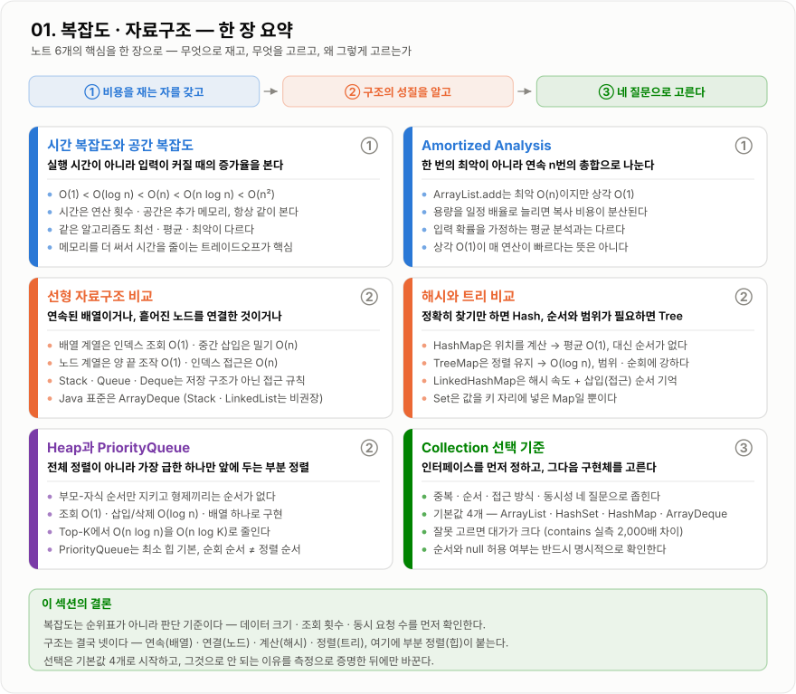

# 01. 복잡도 · 자료구조 — 한 장 요약

이 섹션의 노트 6개를 그림 한 장으로 압축한 것이다. 처음 훑을 때는 지도로, 복습할 때는 체크리스트로 쓴다.
각 카드의 오른쪽 위 번호(①②③)는 맨 위 흐름 띠의 단계와 이어진다.

*비용을 재는 자를 갖고(①) → 구조의 성질을 알고(②) → 네 질문으로 고른다(③) 순서로 읽는다.*

## 노트별로 한 줄씩

| 단계 | 노트 | 한 줄 핵심 |
| --- | --- | --- |
| ① | [시간 복잡도와 공간 복잡도](시간-공간-복잡도/시간-공간-복잡도.md) | 실행 시간이 아니라 입력이 커질 때의 **증가율**을 본다 |
| ① | [Amortized Analysis](Amortized-Analysis/Amortized-Analysis.md) | 한 번의 최악이 아니라 **연속 n번의 총합**으로 나눈다 |
| ② | [선형 자료구조 비교](선형-자료구조-비교/선형-자료구조-비교.md) | 연속된 배열이거나, 흩어진 노드를 연결한 것이거나 |
| ② | [해시와 트리 비교](해시-트리-비교/해시-트리-비교.md) | 정확히 찾기만 하면 Hash, 순서와 범위가 필요하면 Tree |
| ② | [Heap과 PriorityQueue](Heap-PriorityQueue/Heap-PriorityQueue.md) | 전체 정렬이 아니라 **가장 급한 하나**만 앞에 두는 부분 정렬 |
| ③ | [Collection 선택 기준](Collection-선택-기준/Collection-선택-기준.md) | 인터페이스를 먼저 정하고, 그다음 구현체를 고른다 |

## 면접 직전에 이것만

!!! note "세 문장으로"

    1. 복잡도는 순위표가 아니라 판단 기준이다. 데이터 크기 · 조회 횟수 · 동시 요청 수를 먼저 확인하고 어느 쪽 비용을 낼지 정한다.
    2. 구조는 결국 넷이다. 연속(배열) · 연결(노드) · 계산(해시) · 정렬(트리), 여기에 부분 정렬(힙)이 붙는다.
    3. 선택은 기본값 4개(`ArrayList` · `HashSet` · `HashMap` · `ArrayDeque`)로 시작하고, 그것으로 안 되는 이유를 측정으로 증명한 뒤에만 바꾼다.
