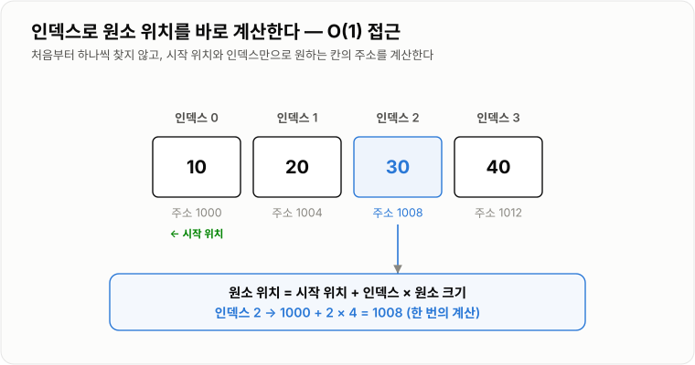
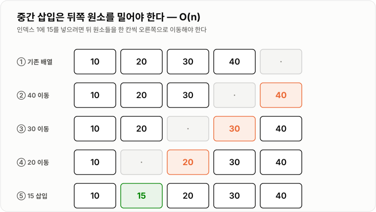
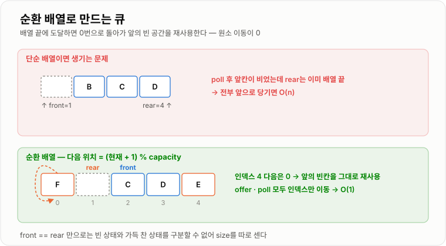

# 선형 자료구조 비교

> **Array, ArrayList, LinkedList, Stack, Queue, Deque는 모두 데이터를 한 줄로 저장하지만, 어디를 빠르게 접근할 수 있게 만들었는지가 서로 다르다.**

---

## 1. 핵심 요약

**선형 자료구조 선택은 "인덱스로 찾는가, 양 끝에서 꺼내는가"라는 질문 하나로 대부분 끝난다 — 인덱스면 `ArrayList`, 양 끝이면 `ArrayDeque`가 기본이고, 나머지는 측정으로 증명된 뒤에 바꾼다.**

### 한눈에 보기

* 선형 자료구조는 결국 **연속된 배열**이거나 **흩어진 노드를 연결한 것** 둘 중 하나다.
* 배열 계열은 **인덱스 조회가 `O(1)`**, 노드 계열은 **양 끝 조작이 `O(1)`**이다.
* Stack·Queue·Deque는 저장 구조가 아니라 **접근 규칙(LIFO·FIFO·양방향)** 을 정한 추상 자료형이다.
* Java에서는 Stack과 Queue 모두 **`ArrayDeque`** 를 쓰는 것이 표준에 가깝다. `Stack`과 `LinkedList`는 권장되지 않는다.
* 복잡도가 같아도 **캐시 지역성과 객체 오버헤드** 때문에 실제 성능은 크게 벌어진다.

### 무엇을 해결하는가

#### 해결하려는 문제

데이터를 순서대로 저장해야 하는 상황은 계속 나온다. 회원 목록, 주문 내역, 처리 대기 작업, 실행 취소 기록 등이다.

그런데 "순서대로 저장한다"는 요구 안에는 서로 다른 질문이 섞여 있다.

```text
3번째 데이터를 바로 꺼내야 하는가?          → 인덱스 접근
앞뒤로 자주 넣고 빼야 하는가?               → 양 끝 조작
가장 최근에 넣은 것부터 처리해야 하는가?      → LIFO
먼저 들어온 것부터 처리해야 하는가?          → FIFO
```

하나의 자료구조가 모든 요구를 잘 처리할 수는 없다. 인덱스 접근을 빠르게 하려면 메모리를 연속으로 붙여야 하고, 그러면 중간 삽입이 느려진다. 중간 삽입을 빠르게 하려면 노드를 흩어놓고 연결해야 하고, 그러면 인덱스 접근이 느려진다.

**선형 자료구조가 여러 개인 이유는 이 트레이드오프 때문이다.**

#### 이 개념이 없을 때

구조별 특성을 모르고 아무거나 쓰면 다음 문제가 생긴다.

* `LinkedList`에 인덱스로 접근하는 반복문을 써서 전체가 `O(n²)`이 된다.
* "삽입이 많으니 LinkedList"라고 판단했는데 실제로는 `ArrayList`가 몇 배 빨랐다.
* `java.util.Stack`을 써서 불필요한 동기화 비용을 지불한다.
* 큐를 무계(unbounded)로 두어 소비가 밀리는 순간 `OutOfMemoryError`가 난다.
* `ArrayList` 중간 삭제를 반복문에서 호출해 매번 뒤쪽 원소를 전부 당긴다.

---

## 2. 동작 원리

### 핵심 구성 요소

| 개념               | 설명                                       | 중요한 이유                                   |
| ---------------- | ---------------------------------------- | ---------------------------------------- |
| **선형 자료구조**      | 데이터를 앞뒤 관계가 있는 한 줄로 저장하는 구조              | 트리·그래프와 달리 순서가 하나뿐이라 탐색 방향이 단순하다.        |
| **Array (배열)**   | 크기가 고정되고, 원소가 메모리에 연속으로 붙어 있는 구조         | 인덱스로 주소를 계산할 수 있어 조회가 `O(1)`이다.          |
| **동적 배열**        | 공간이 부족하면 더 큰 배열을 만들어 복사하는 배열             | `ArrayList`의 실체이며, 확장 비용이 상각된다.          |
| **노드(Node)**     | 데이터와 다음(이전) 노드의 참조를 함께 담은 객체             | 연결 리스트의 최소 단위다.                          |
| **연결 리스트**       | 노드를 참조로 이어 붙인 구조                         | 연결만 바꾸면 되므로 양 끝 삽입·삭제가 `O(1)`이다.         |
| **LIFO**         | Last In First Out. 마지막에 넣은 것을 먼저 꺼낸다.    | 실행 취소, 재귀, 괄호 검사의 규칙이다.                  |
| **FIFO**         | First In First Out. 먼저 넣은 것을 먼저 꺼낸다.     | 작업 대기열, 메시지 처리의 규칙이다.                    |
| **추상 자료형(ADT)**  | 저장 방식이 아니라 **동작 규칙**만 정의한 것               | Stack·Queue·Deque는 ADT이며 구현체는 여러 개다.     |
| **capacity와 size** | 내부 배열이 담을 수 있는 최대 개수와 실제 저장된 개수          | 둘을 혼동하면 메모리 사용량을 잘못 판단한다.                |
| **캐시 지역성**       | 가까운 메모리를 함께 읽어두는 CPU 특성                  | 같은 `O(n)`이라도 배열이 노드보다 몇 배 빠른 이유다.         |
| **분할 상환 `O(1)`** | 가끔 `O(n)`이 발생해도 전체 평균은 `O(1)`인 것         | 동적 배열의 뒤쪽 삽입 비용을 설명한다. |
| **순환 배열**        | 인덱스를 배열 길이로 나눈 나머지로 순환시키는 방식             | 원소 이동 없이 앞쪽 공간을 재사용해 양 끝 조작을 `O(1)`로 만든다. |

#### 개념 간 관계

```text
저장 방식 (어떻게 담는가)
├─ 연속된 배열
│   ├─ Array        고정 크기
│   └─ ArrayList    자동 확장
│
└─ 흩어진 노드 + 연결
    └─ LinkedList   양방향 연결

접근 규칙 (어떻게 꺼내는가)
├─ Stack   LIFO   ─┐
├─ Queue   FIFO   ─┼─→ 모두 ArrayDeque 하나로 구현 가능
└─ Deque   양방향  ─┘
```

**중요한 구분점은 이것이다.**

* Array, ArrayList, LinkedList → **데이터를 어떻게 저장하는가** (구현)
* Stack, Queue, Deque → **데이터를 어떤 순서로 꺼내는가** (규칙)

그래서 "Stack vs ArrayList" 같은 비교는 성립하지 않는다. Stack은 규칙이고, ArrayList는 저장 방식이다.

### 내부 동작 과정

#### 배열 — 주소를 계산한다

```text
int[] numbers = {10, 20, 30, 40};

시작 주소 100
┌──────┬──────┬──────┬──────┐
│  10  │  20  │  30  │  40  │
└──────┴──────┴──────┴──────┘
 [0]    [1]    [2]    [3]
 100    104    108    112

numbers[2] 의 주소 = 시작 주소 + (2 × 원소 크기)
                  = 100 + (2 × 4) = 108
```



*시작 위치와 인덱스만으로 원소의 위치를 한 번에 계산하므로 인덱스 조회는 O(1)이다.*

**탐색하는 것이 아니라 계산하는 것**이라서 배열 크기와 무관하게 `O(1)`이다.

대신 중간에 값을 넣으려면 뒤쪽 원소를 전부 밀어야 한다.



*삽입 위치 이후의 원소를 모두 밀어야 하므로 중간 삽입은 O(n)이다.*

#### ArrayList — 가득 차면 갈아탄다

`ArrayList`는 배열을 감싸고 확장 로직을 붙인 것이다.

```text
1. add(e) 호출
       ↓
2. size == capacity 인가?
       ↓ 아니다               ↓ 맞다
3. elementData[size++] = e   3'. 약 1.5배 새 배열 생성
   → O(1)                        기존 원소 전부 복사
                                 → O(n)
```


*확장이 일어나는 그 호출만 O(n)이고, 비용이 전체 삽입에 분산되어 평균은 O(1)이 된다.*

Java의 `ArrayList`는 2배가 아니라 **약 1.5배(`old + old/2`)** 로 늘린다. 최종 크기를 알고 있다면 `new ArrayList<>(예상크기)`로 확장을 아예 없앨 수 있다.

#### LinkedList — 연결만 바꾼다

```text
head                                        tail
 ↓                                            ↓
┌────┬───┬────┐   ┌────┬───┬────┐   ┌────┬───┬────┐
│prev│ A │next│──→│prev│ B │next│──→│prev│ C │next│
└────┴───┴────┘←──└────┴───┴────┘←──└────┴───┴────┘
```

B와 C 사이에 X를 넣는 작업은 **참조 4개만 고치면 끝**이라 `O(1)`이다.

문제는 **"B와 C 사이"를 찾는 비용**이다. 인덱스로 위치를 지정하면 head나 tail에서부터 노드를 따라가야 하므로 `O(n)`이 든다.

```text
list.add(500, x)  →  탐색 O(n) + 연결 변경 O(1) = O(n)
iterator.add(x)   →  이미 위치를 알고 있음      = O(1)
```


*배열은 한 번의 읽기로 여러 원소가 캐시에 올라오지만, 노드는 매번 다른 위치라 캐시 미스가 누적된다.*

#### Stack — 접근 지점을 하나로 제한한다

```text
push(A) → push(B) → push(C) → pop()

  │   │     │   │     │ C │ ← top     │   │
  │   │     │ B │     │ B │           │ B │ ← top
  │ A │     │ A │     │ A │           │ A │
  └───┘     └───┘     └───┘           └───┘
                                    C 를 반환
```


*접근 지점을 top 하나로 제한했기 때문에 이동이나 탐색 없이 모든 연산이 O(1)로 끝난다.*

#### Queue — 앞에서 빼고 뒤에서 넣는다

단순 배열로 큐를 만들면 `poll()` 때마다 원소를 앞으로 당겨야 해서 `O(n)`이 된다. 그래서 **순환 배열**을 쓴다.

```text
front 인덱스와 rear 인덱스만 이동시킨다.
배열 끝에 닿으면 나머지 연산으로 처음으로 돌아온다.

rear = (rear + 1) % capacity
```



*인덱스를 배열 길이로 나눈 나머지로 이동시키면 원소를 하나도 옮기지 않고 앞의 빈 공간을 재사용한다.*

#### Deque — 양 끝을 모두 연다

```text
addFirst ──→ ┌───┬───┬───┬───┐ ←── addLast
pollFirst ←─ │ A │ B │ C │ D │ ──→ pollLast
             └───┴───┴───┘───┘
```


*앞쪽만 쓰면 LIFO(스택), 뒤로 넣고 앞에서 빼면 FIFO(큐)가 된다 — 자료구조는 하나다.*

`ArrayDeque`도 내부는 순환 배열이다. 그래서 **앞쪽 삽입도 `head` 인덱스만 옮기면 되므로 `O(1)`** 이다. "배열이니까 앞쪽 삽입은 `O(n)`"이라는 생각은 틀렸다.

---

## 3. 특징과 비교

| 구분          | 내용                                       |
| ----------- | ---------------------------------------- |
| **장점**      | 배열 계열은 인덱스 조회·순회가 빠르고 메모리가 작다. 연결 계열은 확장 비용이 없다. ADT를 쓰면 의도가 코드에 드러난다. |
| **단점**      | 배열은 중간 삽입·삭제가 `O(n)`이다. 연결 리스트는 노드 오버헤드와 캐시 미스 손해가 크다. |
| **적합한 상황**  | 인덱스 조회가 많으면 `ArrayList`, 양끝 삽입·삭제면 `ArrayDeque`, 선입선출이면 `Queue` 인터페이스. |
| **주의할 상황**  | `LinkedList`를 인덱스로 접근하는 것(`O(n)`). `Stack`·`Vector`는 동기화 비용 때문에 신규 코드에 쓰지 않는다. |

### 성능 특성

#### 연산별 시간 복잡도

| 연산                | Array  | ArrayList        | LinkedList | ArrayDeque       |
| ----------------- | ------ | ---------------- | ---------- | ---------------- |
| **인덱스 조회 `get(i)`** | `O(1)` | `O(1)`           | `O(n)`     | 미지원              |
| **인덱스 수정 `set(i)`** | `O(1)` | `O(1)`           | `O(n)`     | 미지원              |
| **값 검색 `contains`** | `O(n)` | `O(n)`           | `O(n)`     | `O(n)`           |
| **앞쪽 삽입**         | `O(n)` | `O(n)`           | `O(1)`     | `O(1)` (분할 상환)   |
| **앞쪽 삭제**         | `O(n)` | `O(n)`           | `O(1)`     | `O(1)`           |
| **뒤쪽 삽입**         | `O(1)`\* | `O(1)` (분할 상환)   | `O(1)`     | `O(1)` (분할 상환)   |
| **뒤쪽 삭제**         | `O(1)`\* | `O(1)`           | `O(1)`     | `O(1)`           |
| **중간 삽입·삭제**      | `O(n)` | `O(n)`           | `O(n)`\*\* | 미지원              |
| **전체 순회**         | `O(n)` | `O(n)`           | `O(n)`     | `O(n)`           |

\* 논리적 크기를 별도로 관리하는 경우
\*\* 탐색 `O(n)` + 연결 변경 `O(1)`. 반복자로 위치를 이미 알고 있다면 `O(1)`

#### Stack·Queue 연산

| 연산                 | 평균     | 최악     | 설명                       |
| ------------------ | ------ | ------ | ------------------------ |
| `push` / `offer`   | `O(1)` | `O(n)` | 배열 기반에서 확장이 일어나는 순간만     |
| `pop` / `poll`     | `O(1)` | `O(1)` | 인덱스만 이동하고 참조를 끊는다        |
| `peek`             | `O(1)` | `O(1)` | 해당 위치를 읽기만 한다            |
| `size` / `isEmpty` | `O(1)` | `O(1)` | 카운터나 인덱스 차이로 즉시 판단한다     |
| `contains`         | `O(n)` | `O(n)` | 스택과 큐는 검색용 자료구조가 아니다     |

#### 메모리 구조와 사용량

| 자료구조           | 메모리 구조             | 원소 1개당 추가 비용                     | 여유 공간              |
| -------------- | ------------------ | ------------------------------- | ------------------ |
| **배열 (기본형)**   | 연속된 값              | 없음 (`int` 4바이트 그대로)             | 없음 (고정 크기)         |
| **배열 (참조형)**   | 연속된 참조 + 흩어진 객체    | 참조 1개                           | 없음                 |
| **ArrayList**  | 연속된 참조             | 참조 1개 + 오토박싱 시 `Integer` 객체     | 최대 약 33% 빈 칸       |
| **LinkedList** | 흩어진 노드 객체          | 노드 헤더 + `item` + `prev` + `next` (64비트 JVM에서 대략 24~40바이트) | 없음                 |
| **ArrayDeque** | 연속된 참조 (순환 배열)     | 참조 1개                           | Java 9부터 크게 줄어듦    |

```text
int[] 1000개          →  값 4바이트 × 1000  ≈ 4KB
List<Integer> 1000개  →  참조 + Integer 객체 헤더 + 값
                          → 대략 20KB 내외 (환경에 따라 다름)
LinkedList<Integer> 1000개 → 위에 노드 객체까지 추가
```

**같은 `O(n)` 공간이라도 실제 메모리는 몇 배 차이가 난다.**

#### 순차 접근 성능 — 복잡도가 말해주지 않는 것

```text
ArrayList 순회   →  원소가 연속 → 한 번의 메모리 읽기로 여러 개가 캐시에 올라옴
LinkedList 순회  →  노드가 흩어짐 → 매번 캐시 미스 → 메인 메모리 접근
```

둘 다 `O(n)`이지만 **`ArrayList`가 몇 배 빠른 것이 일반적이다.** 이것이 "삽입·삭제가 많으면 `LinkedList`"라는 통념이 실무에서 자주 뒤집히는 이유다.

`LinkedList`는 다음 조건이 **모두** 맞을 때만 유리하다.

1. 위치를 인덱스가 아니라 **반복자로 이미 알고 있다**
2. 그 위치에서의 삽입·삭제가 **매우 빈번하다**
3. 인덱스 조회는 거의 하지 않는다

#### 구현체별 실제 비용

| 기준       | `ArrayDeque` | `LinkedList`      | `java.util.Stack` |
| -------- | ------------ | ----------------- | ----------------- |
| 원소당 메모리  | 참조 1개        | 노드 객체 + 참조 3개     | 참조 1개             |
| 캐시 지역성   | 좋음 (연속 배열)   | 나쁨 (노드 흩어짐)       | 좋음                |
| 객체 생성 비용 | 없음           | 원소마다 노드 객체 생성     | 없음                |
| 동기화 비용   | 없음           | 없음                | 모든 메서드에 락         |
| GC 부담    | 낮음           | 높음 (객체 수 = 원소 수)  | 낮음                |

#### 큐 길이는 곧 지연 시간이다

큐는 시간 복잡도만으로 설명되지 않는 비용이 있다.

| 기준       | 설명                                |
| -------- | --------------------------------- |
| 메모리 사용량  | 무계 큐는 소비가 느리면 무한히 쌓여 OOM 위험이 있다   |
| 대기 시간    | 큐가 길수록 마지막에 들어온 작업의 대기 시간이 길어진다   |
| 처리량      | 큐가 완충 역할을 해 순간 부하를 평탄화한다          |
| 락 경합     | 여러 스레드가 같은 큐를 쓰면 락 경합이 병목이 될 수 있다 |

```text
처리량이 초당 200건인데 10,000건이 쌓이면
마지막 작업은 50초를 기다린다.

생산 속도 > 소비 속도가 지속되면
무계 큐 →  메모리 계속 증가 → OutOfMemoryError (전체 서버 다운)
유계 큐 →  가득 참 → 거절 또는 생산자 대기 (일부 실패, 서버는 생존)
```

**"큐가 있으니 괜찮다"가 아니라 "큐가 계속 자라면 결국 터진다"** 가 정확한 이해다.

### 장점과 단점

#### 배열 계열 (Array, ArrayList, ArrayDeque)

| 장점               | 이유                                   |
| ---------------- | ------------------------------------ |
| 인덱스 조회가 `O(1)`이다 | 주소를 계산하므로 탐색이 필요 없다.                 |
| 순회가 빠르다          | 원소가 연속되어 있어 CPU 캐시 효율이 높다.           |
| 메모리 오버헤드가 작다     | 원소마다 참조 1개만 저장한다.                    |
| GC 부담이 낮다        | 객체 수가 원소 수만큼 늘어나지 않는다.               |

| 단점               | 이유 및 주의점                             |
| ---------------- | ------------------------------------ |
| 중간 삽입·삭제가 `O(n)` | 뒤쪽 원소를 전부 이동해야 한다.                   |
| 확장 시 큰 비용이 한 번 발생 | 전체 복사가 일어나므로 그 호출만 오래 걸린다.           |
| 연속된 메모리가 필요하다    | 아주 큰 배열은 확보가 어렵고 메모리 단편화 영향을 받는다.    |
| 여유 공간이 낭비될 수 있다  | `ArrayList`는 최대 약 33%가 빈 칸일 수 있다.    |

#### 연결 리스트 계열 (LinkedList)

| 장점               | 이유                              |
| ---------------- | ------------------------------- |
| 양 끝 삽입·삭제가 `O(1)` | 연결만 바꾸면 되고 원소 이동이 없다.           |
| 확장 비용이 없다        | 노드를 하나씩 붙이므로 전체 복사가 발생하지 않는다.   |
| 크기 예측이 필요 없다     | 미리 용량을 잡을 필요가 없다.               |

| 단점               | 이유 및 주의점                                     |
| ---------------- | -------------------------------------------- |
| 인덱스 조회가 `O(n)`   | head나 tail에서부터 노드를 따라가야 한다.                  |
| 메모리를 훨씬 많이 쓴다    | 노드 객체 헤더와 참조 2개가 원소마다 붙는다.                   |
| 순회가 느리다          | 노드가 흩어져 있어 캐시 미스가 누적된다.                      |
| GC 부담이 크다        | 추적해야 할 객체 수가 원소 수만큼 늘어난다.                    |

#### Stack·Queue·Deque (추상 자료형)

| 장점                 | 이유                                    |
| ------------------ | ------------------------------------- |
| 의도가 코드에 드러난다       | `Deque<Integer> stack` 은 LIFO를 쓰겠다는 선언이다. |
| 모든 핵심 연산이 `O(1)`이다 | 접근 지점을 제한했기 때문에 탐색이 없다.               |
| 잘못된 사용을 막아준다       | 인덱스 접근 API가 없어 규칙을 어기기 어렵다.           |

| 단점            | 이유 및 주의점                                 |
| ------------- | ---------------------------------------- |
| 검색이 `O(n)`이다  | 중간 원소를 찾아야 한다면 애초에 잘못된 선택이다.             |
| 인덱스 접근이 불가능하다 | `Deque`에는 `get(i)`가 없다.                  |
| 큐는 무한하지 않다    | 무계 큐도 힙 한계까지다. 상한과 모니터링이 필요하다.           |

### 어떤 상황에서 고르는가

#### 선택 흐름도

```text
인덱스로 조회해야 하는가?
├─ 예 → 크기가 고정인가?
│        ├─ 예 → Array (또는 int[] 같은 기본형 배열)
│        └─ 아니오 → ArrayList
│
└─ 아니오 → 어느 쪽에서 넣고 빼는가?
             ├─ 한쪽 끝만 (최근 것부터) → Deque를 Stack으로 (ArrayDeque)
             ├─ 뒤로 넣고 앞에서 뺀다   → Deque를 Queue로 (ArrayDeque)
             ├─ 양쪽 모두             → ArrayDeque
             └─ 중간을 반복자로 조작    → LinkedList
```

#### 사용하기 좋은 상황

| 자료구조           | 이럴 때 쓴다                                          |
| -------------- | ------------------------------------------------ |
| **Array**      | 크기가 고정이고 기본형 데이터를 다룰 때, 메모리를 최소로 써야 할 때          |
| **ArrayList**  | 조회 중심의 목록, DB 조회 결과, API 응답 목록 — **기본 선택지**      |
| **LinkedList** | 반복자로 위치를 알고 있는 상태에서 삽입·삭제가 매우 빈번할 때 (실무에서는 드물다)  |
| **Stack**      | 실행 취소, 괄호·수식 검사, DFS, 뒤로 가기 기록                   |
| **Queue**      | 작업 대기열, 이벤트 처리, BFS, 요청 버퍼링                      |
| **Deque**      | 슬라이딩 윈도우 최댓값, 최근 N개 기록, 스택·큐가 모두 필요한 경우          |

#### 사용하지 않는 것이 좋은 상황

* **`LinkedList`를 인덱스로 접근**하는 코드 — 반복문 안의 `get(i)`는 `O(n²)`를 만든다.
* **`java.util.Stack`** — `Vector` 상속, 불필요한 동기화, 비직관적 순회 순서.
* **큐를 `LinkedList`로 생성** — `ArrayDeque`가 더 빠르고 메모리도 적게 쓴다.
* **무계 큐에 중요한 작업 적재** — 서버 재시작·배포·장애 시 그대로 유실된다.
* **스택·큐에 `contains` 사용** — 검색이 필요하면 `Set`이나 `Map`을 함께 써야 한다.
* **`ArrayDeque`에 `null` 저장** — `NullPointerException`이 발생한다. `null`을 "비어 있음" 신호로 쓰기 때문이다.

#### 선택 기준

1. **인덱스로 조회하는가?** — 그렇다면 배열 계열이 사실상 유일한 답이다
2. **조회와 삽입 중 무엇이 더 많은가?**
3. **삽입·삭제가 일어나는 위치는 어디인가?** (앞·중간·뒤)
4. **위치를 인덱스로 지정하는가, 반복자로 이미 알고 있는가?**
5. **데이터 개수의 상한이 있는가?** — 큐라면 유계로 만들어야 하는가
6. **여러 스레드가 접근하는가?** — 그렇다면 동시성 컬렉션이 필요하다
7. **메모리가 제한적인가?** — 기본형 배열이 가장 작다

### 비슷한 기술과 비교

#### ArrayList vs LinkedList

| 비교 항목  | ArrayList              | LinkedList                | 선택 기준                     |
| ------ | ---------------------- | ------------------------- | ------------------------- |
| 목적     | 인덱스 기반 목록 관리           | 양 끝·연결 기반 조작              | 인덱스 접근이 필요한가              |
| 저장 구조  | 연속된 내부 배열              | 흩어진 양방향 노드                | —                         |
| 인덱스 조회 | `O(1)`                 | `O(n)`                    | 조회가 있으면 ArrayList          |
| 앞쪽 삽입  | `O(n)`                 | `O(1)`                    | 앞쪽 조작만 있으면 ArrayDeque가 더 낫다 |
| 메모리    | 참조 1개 + 여유 공간          | 노드 객체 + 참조 3개             | 메모리 제한 시 ArrayList         |
| 순회 속도  | 빠름 (캐시 친화적)            | 느림 (캐시 미스)                | 대부분 ArrayList             |
| 적합한 상황 | 조회 중심, 대부분의 목록         | 반복자 기반 빈번한 중간 조작          | **의심스러우면 ArrayList**      |

> 실무 결론: **`ArrayList`를 기본으로 쓰고, 성능 측정으로 문제가 확인됐을 때만 다른 구조를 검토한다.**

#### ArrayDeque vs LinkedList vs Stack

| 비교 항목  | ArrayDeque       | LinkedList     | java.util.Stack |
| ------ | ---------------- | -------------- | --------------- |
| 목적     | 양 끝 조작 전용        | 목록 + 양 끝 조작    | (레거시) LIFO      |
| 내부 구조  | 순환 배열            | 양방향 연결 리스트     | `Vector` 상속 배열  |
| 양 끝 조작 | `O(1)` (분할 상환)   | `O(1)`         | `O(1)`          |
| 메모리    | 작음               | 큼              | 작음              |
| 동기화    | 없음               | 없음             | 모든 메서드에 락       |
| 순회 순서  | 앞 → 뒤            | 앞 → 뒤          | **삽입 순서** (비직관적) |
| 선택 기준  | **스택·큐 기본 선택지**  | 특수한 경우만        | 사용하지 않는다        |

#### Stack vs Queue

| 비교 항목  | Stack                | Queue               | 선택 기준                    |
| ------ | -------------------- | ------------------- | ------------------------ |
| 목적     | 마지막 것부터 처리           | 먼저 온 것부터 처리         | 처리 순서가 무엇인가              |
| 규칙     | LIFO                 | FIFO                | —                        |
| 접근 지점  | 한쪽 끝 (top)           | 양쪽 끝 (front, rear)  | —                        |
| 대표 용도  | 실행 취소, 재귀, DFS, 괄호 검사 | 작업 대기열, 이벤트, BFS    | —                        |
| 공정성    | 없음 (나중 것이 먼저)        | 있음 (순서 보장)          | 순서 공정성이 필요하면 Queue        |
| 적합한 상황 | 되돌아가야 하는 문제          | 순서대로 소비해야 하는 문제     | "되돌리기"인가 "줄 서기"인가        |

#### 배열 vs ArrayList

| 비교 항목  | 배열              | ArrayList              | 선택 기준            |
| ------ | --------------- | ---------------------- | ---------------- |
| 목적     | 고정 크기 저장        | 가변 크기 목록               | 크기를 미리 아는가       |
| 크기     | 생성 시 고정         | 자동 확장                  | —                |
| 기본형 저장 | `int[]` 직접 저장   | 오토박싱으로 `Integer` 객체 생성 | 메모리·성능 민감하면 배열   |
| 편의 기능  | 거의 없음           | `add`, `remove`, 반복자 등 | 대부분 ArrayList     |
| 적합한 상황 | 크기 고정, 대량 기본형 수치 | 일반적인 목록 처리             | 특별한 이유 없으면 ArrayList |

---

## 4. 실무 주의사항

### 백엔드 실무 적용

#### Spring·Java

**API 응답과 DB 조회 결과는 `ArrayList`가 기본이다.**

```java
@Service
public class OrderService {

    public List<OrderResponse> findOrders(Long memberId) {
        List<Order> orders = orderRepository.findByMemberId(memberId);

        List<OrderResponse> responses = new ArrayList<OrderResponse>(orders.size());
        for (Order order : orders) {
            responses.add(OrderResponse.from(order));
        }

        return responses;
    }
}
```

* 결과 크기를 알고 있으므로 `new ArrayList<>(orders.size())`로 확장을 없앤다.
* 조회 후 순회만 하므로 `ArrayList`가 최적이다.

**인터페이스 타입으로 선언한다.**

```java
List<String> names = new ArrayList<String>();      // 구현 교체 가능
Deque<Integer> stack = new ArrayDeque<Integer>();  // 스택으로 쓰겠다는 선언
Queue<Task> queue = new ArrayDeque<Task>();        // 큐로 쓰겠다는 선언
```

`Deque`로 선언하면 인덱스 접근 API가 없으므로 **규칙을 어기는 코드가 아예 컴파일되지 않는다.**

**주의할 API들**

```java
List<Integer> list = new ArrayList<Integer>(List.of(10, 20, 30));

list.remove(1);                      // 인덱스 1 삭제 → 20 이 지워진다
list.remove(Integer.valueOf(10));    // 값 10 삭제
```

```java
// 반복 중 삭제 — ConcurrentModificationException
for (String name : list) {
    if (name.isEmpty()) {
        list.remove(name);           // 예외
    }
}

// 올바른 방법
Iterator<String> iterator = list.iterator();
while (iterator.hasNext()) {
    if (iterator.next().isEmpty()) {
        iterator.remove();           // 안전
    }
}
```

```java
List<String> fixed = Arrays.asList("A", "B");   // 크기 고정 배열 뷰 → add 시 예외
List<String> immutable = List.of("A", "B");     // 불변 → set/add/remove 모두 예외
```

`remove()`를 호출해도 **내부 배열 용량은 줄지 않는다.** `size`만 줄어든다. 메모리를 실제로 줄이려면 `trimToSize()`를 호출해야 한다.

#### 데이터베이스·캐시

**대량 조회는 목록 크기가 곧 메모리다.**

```java
List<User> users = userRepository.findAll();   // n개 Entity가 Heap에 올라온다
```

`ArrayList` 자체는 참조만 담지만, 참조가 가리키는 Entity가 전부 살아 있다. 페이지네이션이나 커서 기반 조회로 목록 크기의 상한을 정해야 한다.

**JDBC 배치와 청크**

```java
List<Order> chunk = new ArrayList<Order>(1000);
// 1000건 채워지면 flush 후 clear() — 목록 크기를 상한으로 고정
```

**Redis의 List는 사실 Deque에 가깝다.**

```text
LPUSH / RPUSH   → 양 끝 삽입
LPOP  / RPOP    → 양 끝 삭제
LINDEX          → 인덱스 접근 O(n)
```

Redis List도 인덱스 접근이 `O(n)`이라 `LinkedList`와 성격이 같다. 큐로 쓰는 것이 자연스럽고, 랜덤 접근용으로 쓰면 안 된다.

#### 동시성·분산 환경

**여기 나온 자료구조는 전부 스레드 안전하지 않다.**

`ArrayList`, `LinkedList`, `ArrayDeque` 모두 동기화되지 않는다. 여러 스레드가 동시에 수정하면 원소 유실, 인덱스 오류, 심하면 무한 루프가 발생한다.

`java.util.Stack`은 모든 메서드에 `synchronized`가 있지만, 그것으로 안전해지지 않는다.

```java
// 개별 메서드는 동기화되어 있지만 이 조합은 여전히 경쟁 상태다
if (!stack.isEmpty()) {
    stack.pop();          // 그 사이 다른 스레드가 비웠을 수 있다
}
```

동시 접근이 필요하면 목적에 맞는 구현체를 쓴다.

| 상황               | 선택                                        |
| ---------------- | ----------------------------------------- |
| 읽기 위주, 수정이 드문 목록 | `CopyOnWriteArrayList`                    |
| 생산자-소비자 큐        | `ArrayBlockingQueue` (유계), `LinkedBlockingQueue` |
| 락 없는 큐           | `ConcurrentLinkedQueue`                   |
| 유계 덱             | `LinkedBlockingDeque`                     |

**스레드 풀의 큐는 크기가 곧 정책이다.**

```text
큐를 크게 잡으면
→ maximumPoolSize 가 무력화된다 (큐가 안 차서 스레드가 안 늘어남)
→ 대기 시간만 길어진다

큐를 작게 잡으면
→ 스레드가 빨리 늘어나고, 넘치면 거절 정책이 동작한다
```

"큐를 크게 잡으면 안정적"이라는 생각은 틀렸다. **거절되는 것이 무한정 기다리는 것보다 나은 경우가 많다.**

**분산 환경의 큐는 다른 문제를 만든다.**

* 메시지 큐를 써도 재시도·ACK 유실로 **중복 처리**가 발생한다. 소비자를 멱등하게 설계해야 한다.
* Kafka는 **파티션 단위로만** 순서를 보장한다. 전역 순서를 원하면 파티션이 하나여야 한다.
* 인메모리 큐의 작업은 서버 재시작·배포·장애 시 그대로 유실된다.

### 자주 하는 오해

| 잘못된 이해                            | 올바른 이해                                                              |
| --------------------------------- | ------------------------------------------------------------------- |
| 배열은 모든 조회가 `O(1)`이다               | 인덱스를 알고 있는 조회만 `O(1)`이고, 값 검색은 `O(n)`이다.                            |
| 배열 중간에 값을 대입하면 삽입된다               | 기존 값을 덮어쓸 뿐이다. 삽입하려면 원소를 이동해야 한다.                                   |
| 배열은 공간이 부족하면 자동으로 늘어난다            | 배열 크기는 고정이다. 더 큰 배열을 만들고 복사해야 한다.                                   |
| 배열 변수끼리 대입하면 원소가 복사된다             | 참조만 복사되어 두 변수가 같은 배열 객체를 가리킨다.                                      |
| 객체 배열을 생성하면 객체도 자동 생성된다           | 참조를 저장할 공간만 생기며 각 원소는 `null`이다.                                     |
| `ArrayList`는 배열과 완전히 다른 구조다       | 내부 저장소가 배열이며, 확장 로직을 감싼 것이다.                                        |
| `size()`는 내부 배열의 길이다              | `size()`는 저장된 원소 수이고, 내부 배열은 보통 더 길다.                               |
| `ArrayList` 확장은 2배씩 일어난다          | Java는 약 1.5배(`old + old/2`)로 늘린다.                                   |
| 맨 뒤 추가는 항상 `O(1)`이다               | 확장이 일어나는 호출은 `O(n)`이며, 평균이 `O(1)`(분할 상환)이다.                         |
| `remove()`를 하면 메모리도 바로 줄어든다       | `size`만 줄고 내부 배열 용량은 그대로다. `trimToSize()`가 필요하다.                    |
| `remove(1)`은 값 1을 지운다             | `List<Integer>`에서는 인덱스 1을 지운다. 값 삭제는 `remove(Integer.valueOf(1))`.  |
| for-each 안에서 `list.remove()`를 써도 된다 | 구조 변경이 감지되어 `ConcurrentModificationException`이 발생한다. 반복자의 `remove()`를 쓴다. |
| `Arrays.asList()`는 `ArrayList`다   | 크기가 고정된 배열 뷰이며 `add`/`remove` 시 `UnsupportedOperationException`이다.  |
| `List.of()`의 결과는 수정할 수 있다         | 불변 리스트라 `set`, `add`, `remove` 모두 예외를 던진다.                          |
| 삽입·삭제가 많으면 무조건 `LinkedList`가 빠르다  | 탐색 비용과 캐시 효율까지 보면 `ArrayList`가 빠른 경우가 많다.                           |
| `LinkedList`는 삽입·삭제가 항상 `O(1)`이다  | 연결 변경만 `O(1)`이고, 인덱스로 위치를 찾으면 `O(n)`이 든다.                           |
| `LinkedList`는 메모리를 덜 쓴다           | 노드 객체 헤더와 참조 2개 때문에 오히려 몇 배 더 쓴다.                                   |
| `LinkedList`의 `size()`도 `O(n)`이다  | 개수를 필드로 관리하므로 `O(1)`이다.                                             |
| 연결 리스트는 실무에서 안 쓰인다                | 직접 쓰는 일은 드물지만 `LinkedHashMap`, 큐 구현, B+Tree 리프 등 내부에 광범위하게 쓰인다.     |
| Java에서 스택은 `java.util.Stack`을 써야 한다 | `Vector` 상속·불필요한 동기화·비직관적 순회 때문에 `ArrayDeque`가 권장된다.                |
| `Stack`이 `synchronized`이니 스레드 안전하다 | 개별 메서드만 안전할 뿐 "확인 후 꺼내기" 같은 복합 연산은 여전히 경쟁 상태가 생긴다.                  |
| `StackOverflowError`는 힙이 부족해서 발생한다 | 힙이 아니라 **스레드 호출 스택**이 한계를 넘어 발생한다. 힙 부족은 `OutOfMemoryError`다.       |
| 재귀와 스택은 다른 것이다                    | 재귀는 JVM 호출 스택을 암묵적으로 쓰는 것이며, 명시적 스택으로 바꿔 쓸 수 있다.                    |
| DFS는 반드시 재귀로 짜야 한다                | `Deque`로 명시적 스택을 쓰면 깊이 제한 없이 같은 결과를 낼 수 있다.                         |
| `ArrayDeque`는 배열이라 앞쪽 삽입이 `O(n)`이다 | 순환 배열이라 `head` 인덱스만 옮기면 되므로 `O(1)`이다.                               |
| `ArrayDeque`에 `null`을 넣을 수 있다     | `NullPointerException`이 발생한다. `null`을 "비어 있음" 신호로 쓰기 때문이다.          |
| `ArrayDeque`의 `push`는 뒤에 넣는다      | `push`는 `addFirst`, 즉 **앞**에 넣는다. `offer`가 뒤에 넣는다.                  |
| `Deque`도 인덱스로 접근할 수 있다            | `get(i)` API가 없다. 인덱스가 필요하면 `ArrayList`를 쓴다.                        |
| `add`와 `offer`는 같다                | 가득 찼을 때 `add`는 예외, `offer`는 `false`를 반환한다.                          |
| 큐를 쓰면 처리 속도가 빨라진다                 | 전체 처리량은 그대로다. 순간 부하를 시간에 걸쳐 분산할 뿐이다.                                |
| 큐가 있으면 트래픽이 몰려도 안전하다              | 소비가 계속 느리면 큐가 무한히 자라 결국 터진다. 유계 큐와 모니터링이 필요하다.                      |
| 스레드 풀 큐를 크게 잡으면 안정성이 올라간다         | 오히려 지연만 길어지고 `maximumPoolSize`가 무력화된다.                              |
| 이 자료구조들은 스레드 안전하다                 | 전부 동기화되지 않는다. 동시 수정 시 원소 유실이나 무한 루프가 발생할 수 있다.                      |

---

## 5. 예제

### 배열과 ArrayList

```java
public class ArrayExample {

    public void run() {
        // 배열 — 크기 고정
        int[] numbers = new int[3];
        numbers[0] = 10;
        numbers[1] = 20;
        numbers[2] = 30;
        // numbers[3] = 40;  → ArrayIndexOutOfBoundsException

        // ArrayList — 자동 확장
        List<Integer> list = new ArrayList<Integer>();
        list.add(10);
        list.add(20);
        list.add(30);
        list.add(40);   // 내부 배열이 부족하면 더 큰 배열로 교체

        int first = list.get(0);   // O(1)
    }
}
```

* 배열은 크기를 넘기면 예외가 난다. `ArrayList`는 내부에서 새 배열로 복사한다.
* 둘 다 `get(i)`는 `O(1)`이다. `ArrayList`도 결국 배열이기 때문이다.

### LinkedList에서 절대 하면 안 되는 것

```java
public class LinkedListPitfall {

    public void bad(LinkedList<String> list) {
        for (int i = 0; i < list.size(); i++) {
            String value = list.get(i);   // 매번 O(n) 탐색
            System.out.println(value);
        }
        // 전체 O(n²)
    }

    public void good(LinkedList<String> list) {
        for (String value : list) {       // 반복자가 현재 노드를 기억
            System.out.println(value);
        }
        // 전체 O(n)
    }
}
```

`get(i)`는 배열처럼 보이지만 **head에서부터 노드를 따라간다.** 반복문 안에서 쓰면 전체가 `O(n²)`이 된다.

### Stack — ArrayDeque로 구현

```java
import java.util.ArrayDeque;
import java.util.Deque;

public class BracketChecker {

    public boolean isValid(String input) {
        Deque<Character> stack = new ArrayDeque<Character>();

        for (int i = 0; i < input.length(); i++) {
            char c = input.charAt(i);

            if (c == '(') {
                stack.push(c);            // addFirst — 앞에 넣는다
            } else if (c == ')') {
                if (stack.isEmpty()) {
                    return false;         // 닫는 괄호가 더 많다
                }
                stack.pop();              // pollFirst — 앞에서 뺀다
            }
        }

        return stack.isEmpty();           // 남아 있으면 여는 괄호가 더 많다
    }
}
```

입력 `"(()"` 의 처리 과정은 다음과 같다.

```text
'(' → push → [ ( ]
'(' → push → [ (, ( ]
')' → pop  → [ ( ]
종료 → 스택이 비어 있지 않음 → false
```

`Deque` 타입으로 선언하고 `ArrayDeque`로 생성하는 것이 Java의 권장 방식이다. `java.util.Stack`은 `Vector`를 상속해 모든 메서드에 락이 걸리고, 순회 순서도 LIFO가 아니라 삽입 순서라 직관과 어긋난다.

### Queue — 작업 대기열

```java
import java.util.ArrayDeque;
import java.util.Queue;

public class TaskQueue {

    private final Queue<String> queue = new ArrayDeque<String>();

    public void submit(String task) {
        queue.offer(task);          // 뒤에 넣는다
    }

    public String take() {
        return queue.poll();        // 앞에서 뺀다. 비어 있으면 null
    }
}
```

`add`/`remove`와 `offer`/`poll`의 차이는 **실패했을 때의 동작**이다.

| 상황       | 예외를 던지는 메서드          | 특수 값을 반환하는 메서드         |
| -------- | -------------------- | ---------------------- |
| 넣기       | `add()` → 예외          | `offer()` → `false`     |
| 빼기       | `remove()` → 예외       | `poll()` → `null`       |
| 앞쪽 확인    | `element()` → 예외      | `peek()` → `null`       |

### Deque — 하나로 스택과 큐 모두

```java
import java.util.ArrayDeque;
import java.util.Deque;

public class DequeExample {

    public void asStack() {
        Deque<Integer> stack = new ArrayDeque<Integer>();
        stack.push(1);      // addFirst
        stack.push(2);
        System.out.println(stack.pop());   // 2  (LIFO)
    }

    public void asQueue() {
        Deque<Integer> queue = new ArrayDeque<Integer>();
        queue.offer(1);     // addLast
        queue.offer(2);
        System.out.println(queue.poll());  // 1  (FIFO)
    }
}
```

**같은 `ArrayDeque` 인스턴스가 어느 쪽 끝을 쓰느냐에 따라 스택도 되고 큐도 된다.**

주의할 점은 `push`가 **뒤가 아니라 앞**(`addFirst`)에 넣는다는 것이다. `offer`는 뒤(`addLast`)에 넣는다. 이 둘을 섞어 쓰면 의도한 순서가 나오지 않는다.

---

## 6. 면접 정리

### 자주 나오는 질문

#### 기본 질문

1. **`ArrayList`와 `LinkedList`의 차이는 무엇인가요?**

    * 핵심 키워드: 연속 배열 vs 연결 노드, 인덱스 조회 `O(1)`/`O(n)`, 양 끝 조작, 캐시 지역성, 메모리 오버헤드

2. **배열의 인덱스 조회가 `O(1)`인 이유는 무엇인가요?**

    * 핵심 키워드: 연속된 메모리, 시작 주소 + 인덱스 × 원소 크기, 탐색이 아닌 계산

3. **`ArrayList`의 `add()`는 `O(1)`인가요, `O(n)`인가요?**

    * 핵심 키워드: 분할 상환 `O(1)`, 확장 순간만 `O(n)`, 1.5배 증가, 전체 복사

4. **Stack과 Queue의 차이는 무엇인가요?**

    * 핵심 키워드: LIFO vs FIFO, 접근 지점 1개 vs 2개, 실행 취소·DFS vs 대기열·BFS

5. **Java에서 스택을 쓸 때 `java.util.Stack`을 권장하지 않는 이유는 무엇인가요?**

    * 핵심 키워드: `Vector` 상속, 모든 메서드 동기화, 순회 순서가 삽입 순서, `ArrayDeque` 권장

6. **`ArrayDeque`는 배열인데 왜 앞쪽 삽입이 `O(1)`인가요?**

    * 핵심 키워드: 순환 배열, `head` 인덱스 이동, 나머지 연산, 원소 이동 없음

7. **`size`와 `capacity`의 차이는 무엇인가요?**

    * 핵심 키워드: 저장된 원소 수 vs 내부 배열 길이, 여유 공간, `trimToSize()`

8. **Stack, Queue, Deque는 자료구조인가요, 인터페이스인가요?**

    * 핵심 키워드: 추상 자료형(ADT), 동작 규칙, 구현체는 여러 개, `ArrayDeque`로 모두 구현 가능

#### 꼬리 질문

1. **삽입·삭제가 많으면 `LinkedList`가 항상 빠른가요?**

    * 핵심 키워드: 위치 탐색 `O(n)`, 캐시 미스, 노드 객체 생성, 반복자로 위치를 아는 경우만 유리

2. **`LinkedList`에서 `for (int i=0; i<size; i++) get(i)` 의 전체 복잡도는?**

    * 핵심 키워드: 매 호출마다 `O(n)` 탐색, 전체 `O(n²)`, 반복자·for-each로 해결

3. **`ArrayList`에서 `remove()`를 호출하면 메모리가 줄어드나요?**

    * 핵심 키워드: `size`만 감소, 내부 배열 용량 유지, `trimToSize()`

4. **for-each 안에서 원소를 삭제하면 왜 예외가 나나요?**

    * 핵심 키워드: `modCount`, 구조 변경 감지, `ConcurrentModificationException`, `Iterator.remove()`

5. **`StackOverflowError`와 `OutOfMemoryError`는 무엇이 다른가요?**

    * 핵심 키워드: 스레드 호출 스택 vs 힙, 재귀 깊이, 명시적 `Deque`로 회피

6. **무계 큐의 위험은 무엇인가요?**

    * 핵심 키워드: 생산 속도 > 소비 속도, 무한 증가, OOM, 유계 큐와 거절 정책, 큐 길이 모니터링

7. **스레드 풀의 큐를 크게 잡으면 안정적인가요?**

    * 핵심 키워드: `maximumPoolSize` 무력화, 대기 시간 증가, 거절이 나은 경우

8. **`ArrayDeque`에 `null`을 못 넣는 이유는 무엇인가요?**

    * 핵심 키워드: `poll()`이 `null`을 "비어 있음" 신호로 사용, 구분 불가, `NullPointerException`

9. **`Arrays.asList()`와 `List.of()`와 `new ArrayList<>()`는 무엇이 다른가요?**

    * 핵심 키워드: 배열 뷰(크기 고정), 불변 리스트, 가변 리스트, `UnsupportedOperationException`

10. **여러 스레드가 `ArrayList`를 동시에 수정하면 어떻게 되나요?**

    * 핵심 키워드: 동기화 없음, 원소 유실, 인덱스 오류, `CopyOnWriteArrayList`, `Collections.synchronizedList`

### 30초 답변

> 선형 자료구조는 데이터를 한 줄로 저장하는 구조이고, 크게 두 갈래로 나뉩니다.

### 핵심 키워드

`선형 자료구조` · `Array (배열)` · `동적 배열` · `노드(Node)` · `연결 리스트` · `LIFO` · `FIFO` · `추상 자료형(ADT)` · `capacity와 size` · `캐시 지역성` · `분할 상환 O(1)` · `순환 배열`

### 이어서 볼 주제

* **[해시와 트리 비교](../해시-트리-비교/해시-트리-비교.md)** — 순서가 아니라 키로 찾아야 할 때의 선택지.
* **[Heap과 PriorityQueue](../Heap-PriorityQueue/Heap-PriorityQueue.md)** — FIFO가 아니라 우선순위로 꺼내야 할 때의 구조.
* **[Amortized Analysis](../Amortized-Analysis/Amortized-Analysis.md)** — `ArrayList`·`ArrayDeque` 확장이 평균 `O(1)`인 이유.
* **[Thread와 동기화](../../04-동시성/Thread-동기화/Thread-동기화.md)** — 생산자-소비자 구조와 `BlockingQueue`, 큐 크기가 스레드 풀 동작을 바꾸는 방식.
* **[Redis 자료구조와 활용](../../08-캐시-Redis/Redis-자료구조/Redis-자료구조.md)** — 분산 환경에서 큐를 구현할 때의 선택지.
