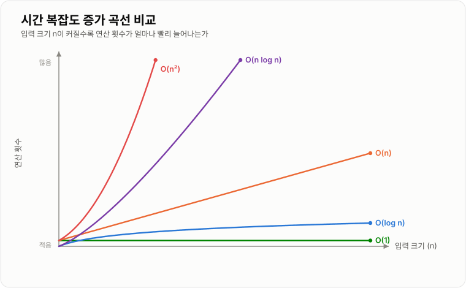
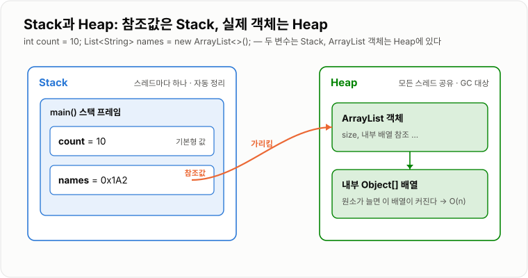
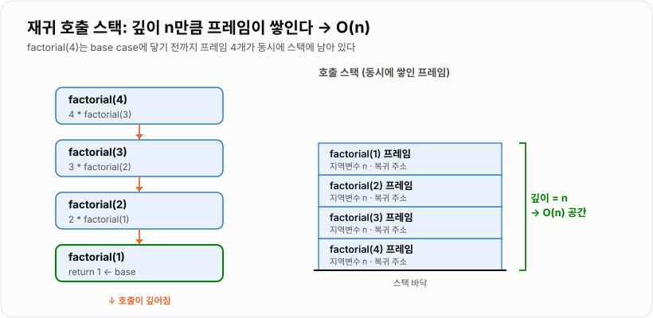
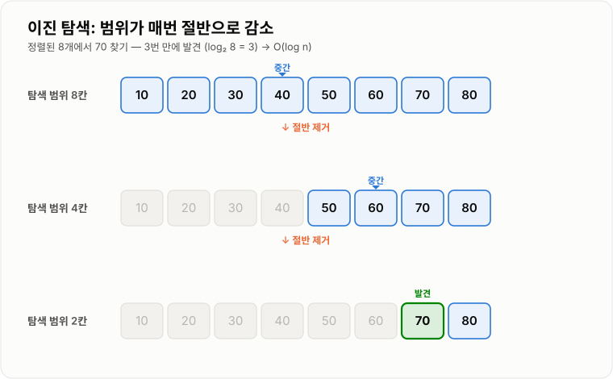

# 시간 복잡도와 공간 복잡도

> **Big-O는 입력 데이터의 크기가 증가할 때 알고리즘의 실행 시간과 추가 메모리 사용량이 어떤 비율로 증가하는지를 표현하는 표기법이다.**

---

## 1. 핵심 요약

**시간 복잡도와 공간 복잡도는 둘 중 낮은 쪽을 고르는 기준이 아니라, 데이터 크기·반복 조회 횟수·동시 요청 수를 확인한 뒤 어느 쪽 비용을 내줄지 결정하기 위한 기준이다.**

### 한눈에 보기

* **Big-O는 실제 실행 시간을 측정하는 방법이 아니라, 입력 크기에 따른 비용의 증가율을 표현한다.**
* 대표적인 시간 복잡도는 `O(1)`, `O(log n)`, `O(n)`, `O(n log n)`, `O(n²)`이다.
* 시간 복잡도는 **연산 횟수**, 공간 복잡도는 **추가 메모리**를 본다. 둘은 항상 함께 판단해야 한다.
* 같은 알고리즘도 입력에 따라 **최선·평균·최악**이 다르므로, 어느 기준으로 말하는지 명확히 해야 한다.
* 실행 시간을 줄이기 위해 메모리를 더 쓰는 **시간-공간 트레이드오프**가 성능 개선의 핵심 판단 지점이다.
* 같은 Big-O라도 실제 성능은 CPU, 메모리, 네트워크, DB 호출 비용에 따라 크게 달라진다.

### 무엇을 해결하는가

#### 해결하려는 문제

같은 문제를 해결하는 코드라도 데이터의 크기가 커지면 성능 차이가 크게 벌어진다.

예를 들어 회원 목록에서 특정 회원을 찾는다고 가정한다.

```text
회원 10명
→ 처음부터 찾아도 큰 문제가 없음

회원 1,000만 명
→ 매 요청마다 전체를 순회하면 응답 시간이 크게 증가함
```

단순히 실행 시간을 초 단위로 측정하면 컴퓨터 성능, JVM 상태, 운영체제, 네트워크 등 실행 환경의 영향을 많이 받는다.

Big-O는 이런 환경 차이를 제외하고 다음 두 질문에 답하기 위해 사용한다.

```text
데이터가 증가할 때
필요한 연산 횟수는 어떤 비율로 증가하는가?   → 시간 복잡도

데이터가 증가할 때
추가로 필요한 메모리는 어떤 비율로 증가하는가? → 공간 복잡도
```

메모리 관점이 별도로 필요한 이유는 서버와 JVM이 사용할 수 있는 메모리가 제한되어 있기 때문이다.

입력이 작을 때 잘 동작하던 코드도 데이터가 늘어나면 다음 문제가 생긴다.

* Heap 메모리 사용량이 급격하게 증가한다.
* 가비지 컬렉션이 자주 실행되어 응답이 느려진다.
* `OutOfMemoryError`가 발생한다.
* 재귀 호출이 깊어져 `StackOverflowError`가 발생한다.

#### 이 개념이 없을 때

복잡도 관점 없이 코드를 작성하면 작은 테스트 데이터에서는 정상 동작하지만, 실제 데이터가 많아졌을 때 성능 문제가 발생한다.

**시간 쪽에서 자주 생기는 문제**

* 반복문 안에서 다시 전체 목록을 탐색한다.
* 같은 데이터를 찾기 위해 List를 계속 순회한다.
* DB 인덱스 없이 대량 데이터를 조회한다.
* 반복문 안에서 DB나 외부 API를 호출한다.

예를 들어 주문과 회원을 연결하기 위해 두 목록을 중첩 반복하면 비교 횟수가 급격히 증가한다.

```text
주문 100,000건
회원 100,000명

100,000 × 100,000
= 최대 10,000,000,000번 비교
```

**공간 쪽에서 자주 생기는 문제**

* `findAll()`로 수백만 건의 데이터를 한 번에 조회한다.
* 큰 파일 전체를 `byte[]`로 메모리에 올린다.
* 캐시 데이터를 만료 없이 계속 저장한다.
* 재귀 호출의 최대 깊이를 고려하지 않는다.
* 요청 하나의 메모리만 확인하고 동시 요청 수를 고려하지 않는다.

이런 문제는 개발 환경에서는 드러나지 않다가 데이터와 트래픽이 증가한 운영 환경에서 장애로 이어진다.

---

## 2. 동작 원리

### 핵심 구성 요소

| 개념                        | 설명                                                       | 중요한 이유                                     |
| ------------------------- | -------------------------------------------------------- | ------------------------------------------ |
| **입력 크기 `n`**             | 처리해야 하는 데이터의 개수다. 배열 길이, 회원 수, 주문 수 등이 될 수 있다.           | 어떤 값을 기준으로 비용이 증가하는지 정하기 위해 필요하다.          |
| **연산 횟수**                 | 입력을 처리하면서 비교, 조회, 삽입, 계산이 수행되는 횟수다.                      | 실제 시간 대신 알고리즘 구조를 객관적으로 비교할 수 있다.          |
| **시간 복잡도**                | 입력 크기가 증가할 때 실행 연산 수가 증가하는 형태다.                          | 데이터가 많아졌을 때 처리 시간이 얼마나 증가할지 판단할 수 있다.      |
| **공간 복잡도**                | 입력 크기가 증가할 때 추가로 필요한 메모리의 증가 형태다.                        | 속도를 높이기 위해 메모리를 얼마나 사용하는지 판단할 수 있다.        |
| **전체 공간 복잡도**             | 입력 데이터와 알고리즘이 사용하는 추가 공간을 모두 포함한다.                       | 프로그램 전체가 사용하는 메모리를 판단할 때 필요하다.             |
| **보조 공간 복잡도**             | 입력 데이터를 제외하고 알고리즘이 추가로 사용하는 메모리다.                        | 알고리즘 면접에서 주로 묻는 공간 복잡도 기준이다.               |
| **상수 시간 `O(1)`**          | 입력 크기와 무관하게 일정한 횟수·메모리로 처리한다.                            | 데이터가 증가해도 비용이 증가하지 않는다.                    |
| **로그 시간 `O(log n)`**      | 한 번 처리할 때마다 탐색 범위를 절반 정도로 줄인다.                           | 데이터가 많아져도 연산 횟수가 천천히 증가한다.                 |
| **선형 시간 `O(n)`**          | 입력 데이터의 개수만큼 처리한다.                                       | 전체 탐색, 전체 합계 계산 등에서 자주 나타난다.               |
| **선형 로그 시간 `O(n log n)`** | 전체 데이터를 여러 단계에 걸쳐 처리한다.                                  | 효율적인 정렬 알고리즘에서 자주 나타난다.                    |
| **제곱 시간 `O(n²)`**         | 입력 크기만큼 반복하면서 내부에서 다시 입력 크기만큼 반복한다.                      | 데이터 증가 시 연산 수가 매우 빠르게 늘어난다.                |
| **최선의 경우**                | 가장 유리한 입력에서 발생하는 최소 비용이다.                                | 알고리즘이 가장 빨리 끝나는 상황을 설명한다.                  |
| **평균적인 경우**               | 일반적인 입력에서 기대되는 비용이다.                                     | 실제 사용 상황에 가까운 성능을 판단할 때 사용한다.              |
| **최악의 경우**                | 가장 불리한 입력에서 발생하는 최대 비용이다.                                | 서비스의 성능 한계와 장애 가능성을 판단할 때 중요하다.            |
| **상수 제거**                 | `O(2n)`을 `O(n)`으로 표현하는 것이다.                              | 상수보다 입력 증가에 따른 전체 증가 형태가 더 중요하기 때문이다.      |
| **낮은 차수 제거**              | `O(n² + n + 10)`을 `O(n²)`으로 표현하는 것이다.                    | 데이터가 커질수록 가장 빠르게 증가하는 항이 전체 비용을 지배하기 때문이다. |
| **호출 스택**                 | 메서드 호출 정보와 지역 변수를 저장하는 Stack 영역이다.                       | 재귀 호출 시 호출 깊이만큼 스택 프레임이 쌓인다.               |
| **Heap**                  | Java 객체, 배열, 컬렉션이 주로 생성되는 메모리 영역이다.                      | 대용량 객체 생성은 Heap 부족과 GC 증가로 이어진다.           |
| **In-place 알고리즘**         | 입력 데이터를 직접 수정해 추가 공간을 거의 사용하지 않는 알고리즘이다.                 | 메모리를 줄일 수 있지만 원본 데이터가 변경된다.                |
| **시간-공간 트레이드오프**          | 실행 시간을 줄이기 위해 추가 메모리를 사용하거나, 메모리를 줄이기 위해 연산을 더 수행하는 관계다. | 성능 최적화에는 항상 비용과 대가가 함께 존재하기 때문이다.          |

개념 간 관계는 다음과 같다.

```text
입력 크기 n
    ↓
주요 연산이 몇 번 수행되는지 분석
    ↓
시간 복잡도 계산
    ↓
추가로 만들어지는 배열·컬렉션·스택 프레임 분석
    ↓
공간 복잡도 계산
    ↓
데이터 증가 시 확장 가능성 판단
```

예를 들어 List에서 값을 찾으면 최대 `n`개의 원소를 확인하므로 시간 복잡도는 `O(n)`, 추가 메모리는 `O(1)`이다.

반면 List를 HashMap으로 변환하면 Map 생성에 `O(n)` 시간과 `O(n)` 메모리가 필요하지만, 이후 키 조회는 평균 `O(1)`이 된다.

이 교환 관계가 곧 **시간-공간 트레이드오프**다.

### 내부 동작 과정

#### 복잡도를 계산하는 과정

Big-O는 JVM 내부에서 실행되는 기능이나 라이브러리가 아니다. 개발자가 코드의 연산 구조를 분석하기 위한 수학적 표현이다.

```text
입력 데이터 크기 확인
        ↓
반복문·재귀·조회 연산 분석
        ↓
입력 크기에 따른 연산 횟수 계산
        ↓
추가로 생성되는 자료구조·스택 프레임 확인
        ↓
상수와 낮은 차수 제거
        ↓
시간 복잡도와 공간 복잡도 표현
```

실제 분석 순서는 다음과 같다.

1. **입력 데이터가 무엇인지 정한다.** — 배열 길이, 회원 수, 주문 수, 문자열 길이
2. **입력 크기에 따라 반복되는 연산을 찾는다.** — 반복문, 중첩 반복문, 재귀 호출, List 조회, Map 조회
3. **주요 연산이 몇 번 수행되는지 식으로 표현한다.** — 한 번 수행 `1`, 전체 순회 `n`, 중첩 순회 `n²`
4. **상수와 낮은 차수를 제거한다.** — `O(2n)` → `O(n)`, `O(n² + n)` → `O(n²)`
5. **추가 메모리 사용량을 분석한다.** — 변수 몇 개만 사용하면 `O(1)`, 입력 크기만큼 배열·Map을 만들면 `O(n)`
6. **재귀가 있다면 최대 호출 깊이를 공간 복잡도에 포함한다.**
7. **실제 시스템 비용과 함께 판단한다.** — CPU 연산, DB 호출, 네트워크 왕복, 락 경합, 디스크 I/O

#### 반복문 복잡도 계산 규칙

코드를 보고 복잡도를 빠르게 읽어내는 규칙은 다음 네 가지다.

**규칙 1 — 순차 실행은 더한다**

```java
for (int i = 0; i < n; i++) { /* ... */ }   // O(n)
for (int j = 0; j < n; j++) { /* ... */ }   // O(n)
```

```text
O(n) + O(n) = O(2n) = O(n)
```

**규칙 2 — 중첩 반복은 곱한다**

```java
for (int i = 0; i < n; i++) {
    for (int j = 0; j < m; j++) { /* ... */ }
}
```

```text
O(n) × O(m) = O(n × m)
n과 m이 같으면 O(n²)
```

**규칙 3 — 반복 횟수가 고정이면 상수다**

```java
for (int i = 0; i < 7; i++) { /* ... */ }   // O(1)
```

입력 크기와 무관하게 항상 7번이므로 `O(1)`이다. 반복문이 있다고 무조건 `O(n)`이 아니다.

**규칙 4 — 매번 절반씩 줄면 `O(log n)`이다**

```java
while (n > 1) {
    n = n / 2;
}
```

`n`이 1,000,000이어도 약 20번만 실행된다.

**자주 헷갈리는 형태**

```java
for (int i = 0; i < n; i++) {
    for (int j = i + 1; j < n; j++) { /* ... */ }
}
```

안쪽 반복이 `n-1`, `n-2`, …, `1`번 실행되므로 총 연산은 `n(n-1)/2`다.

```text
n(n-1)/2 = (n² - n)/2
→ 상수와 낮은 차수 제거
→ O(n²)
```

절반만 도는 것처럼 보여도 상수 `1/2`를 제거하므로 `O(n²)`다.

```java
for (int i = 0; i < n; i++) {
    if (list.contains(target)) { /* ... */ }   // List.contains 는 O(n)
}
```

반복문은 하나지만 안에서 `O(n)` 연산을 호출하므로 전체는 `O(n²)`다. **반복문의 개수가 아니라 반복문 안에서 일어나는 일의 비용을 봐야 한다.**

#### 복잡도 증가 형태



*입력 크기 `n`이 커질수록 각 복잡도의 연산 횟수가 벌어지는 형태. 같은 시작점에서 출발해도 `O(n²)`은 급격히, `O(log n)`·`O(1)`은 거의 평평하게 증가한다.*

```text
O(1)
  ↓
O(log n)
  ↓
O(n)
  ↓
O(n log n)
  ↓
O(n²)
  ↓
O(2ⁿ)
  ↓
O(n!)
```

#### 메모리는 어디에 쌓이는가

Java 메모리는 개념적으로 다음과 같이 나눌 수 있다.

```text
Java 애플리케이션
│
├─ Stack
│   ├─ 메서드 호출 정보
│   ├─ 지역 변수
│   ├─ 매개변수
│   └─ 객체를 가리키는 참조값
│
└─ Heap
    ├─ 객체
    ├─ 배열
    ├─ ArrayList 내부 배열
    ├─ HashMap 내부 구조
    └─ 요청·응답 DTO
```



*기본형 변수와 객체 참조값은 Stack 프레임에, `new`로 만든 실제 객체와 내부 배열은 Heap에 저장된다.*

동작 과정은 다음과 같다.

1. 메서드가 호출되면 해당 스레드의 Stack에 스택 프레임이 생성된다.
2. 기본형 지역 변수와 객체 참조값이 스택 프레임에 저장된다.
3. `new`로 생성한 객체와 배열은 Heap에 저장된다.
4. 배열이나 컬렉션에 데이터가 추가되면 Heap 사용량이 증가한다.
5. 메서드가 종료되면 해당 스택 프레임은 제거된다.
6. Heap 객체를 더 이상 참조하지 않으면 가비지 컬렉션 대상이 된다.

재귀 호출에서는 메서드가 끝나기 전에 자기 자신을 다시 호출하므로 스택 프레임이 동시에 쌓인다.

```text
┌──────────────────┐
│ factorial(1)     │
├──────────────────┤
│ factorial(2)     │
├──────────────────┤
│ factorial(3)     │
├──────────────────┤
│ factorial(4)     │
└──────────────────┘
```



*재귀는 base case에 닿기 전까지 호출 프레임이 동시에 스택에 남으므로, 최대 호출 깊이가 곧 공간 복잡도가 된다.*

재귀 깊이가 `n`이면 최대 `n`개의 스택 프레임이 필요하므로 공간 복잡도는 `O(n)`이다.

---

## 3. 특징과 비교

| 구분          | 내용                                       |
| ----------- | ---------------------------------------- |
| **장점**      | 실행 환경과 무관하게 확장성을 비교할 수 있고, 자료구조 선택의 근거가 되며, OOM·지연을 사전에 예측한다. |
| **단점**      | 실제 실행 시간과 바이트 수는 알 수 없다. **상수 배수와 I/O·네트워크 비용이 반영되지 않는다.** |
| **적합한 상황**  | 데이터 상한이 크고, 같은 로직을 반복 호출하며, 대안 알고리즘을 비교해야 할 때. |
| **주의할 상황**  | 평균과 최악을 혼동하는 것. `n`이 작으면 상수가 큰 `O(log n)`이 `O(n)`보다 느릴 수 있다. |

### 성능 특성

#### 대표 복잡도 비교

| 복잡도          | 시간 관점 대표 동작                 | 공간 관점 대표 예시           | 데이터 증가 시 변화            |
| ------------ | --------------------------- | -------------------- | ---------------------- |
| `O(1)`       | 배열 인덱스 접근, 평균적인 HashMap 조회  | 변수 몇 개, In-place 알고리즘 | 비용이 거의 일정하다.           |
| `O(log n)`   | 이진 탐색, 균형 트리 탐색             | 균형 잡힌 재귀 탐색의 호출 스택   | 비용이 매우 천천히 증가한다.       |
| `O(n)`       | 전체 순회, 선형 탐색                | 배열 복사, HashSet, HashMap | 데이터가 10배면 비용도 약 10배다.  |
| `O(n log n)` | 효율적인 정렬                     | 병합 정렬의 보조 배열         | 선형보다 느리지만 확장성이 좋다.     |
| `O(n²)`      | 동일 크기 중첩 반복문                | 인접 행렬, `n × n` 배열    | 데이터가 10배면 비용은 약 100배다. |
| `O(2ⁿ)`      | 모든 부분집합 탐색                  | 모든 부분집합을 저장하는 경우     | 실무에서 사실상 사용 불가능하다.     |

#### 입력 크기에 따른 연산 횟수

| 입력 크기 `n` | `O(1)` | `O(log₂ n)` |    `O(n)` | `O(n log₂ n)` |           `O(n²)` |
| --------: | -----: | ----------: | --------: | ------------: | ----------------: |
|        10 |      1 |         약 3 |        10 |          약 33 |               100 |
|       100 |      1 |         약 7 |       100 |         약 664 |            10,000 |
|     1,000 |      1 |        약 10 |     1,000 |       약 9,966 |         1,000,000 |
| 1,000,000 |      1 |        약 20 | 1,000,000 |  약 20,000,000 | 1,000,000,000,000 |

#### Java 컬렉션 성능

| 자료구조·연산                |  평균 시간 복잡도 |        최악 시간 복잡도 | 설명                        |
| ---------------------- | ---------: | ---------------: | ------------------------- |
| `ArrayList` 인덱스 조회     |     `O(1)` |           `O(1)` | 인덱스로 메모리 위치를 계산해 직접 접근한다. |
| `ArrayList` 값 검색       |     `O(n)` |           `O(n)` | 앞에서부터 원소를 비교해야 한다.        |
| `ArrayList` 마지막 삽입     |  평균 `O(1)` |           `O(n)` | 공간이 부족하면 더 큰 배열로 복사해야 한다. |
| `ArrayList` 중간 삽입·삭제   |     `O(n)` |           `O(n)` | 뒤쪽 원소를 이동해야 한다.           |
| `LinkedList` 인덱스 조회    |     `O(n)` |           `O(n)` | 노드를 순서대로 따라가야 한다.         |
| `LinkedList` 처음·마지막 삽입 |     `O(1)` |           `O(1)` | 기존 노드의 연결 정보만 변경한다.       |
| `HashMap` 조회·삽입·삭제     |  평균 `O(1)` | 구현과 충돌 상태에 따라 증가 | 키의 해시 값을 이용해 버킷을 찾는다.     |
| `TreeMap` 조회·삽입·삭제     | `O(log n)` |       `O(log n)` | 균형 트리의 높이를 따라 탐색한다.       |

#### Big-O가 같아도 메모리는 다르다

다음 두 구조는 모두 공간 복잡도 `O(n)`이다.

```java
int[] numbers = new int[1000000];
```

```java
List<Integer> numbers = new ArrayList<Integer>();
```

하지만 `List<Integer>`는 다음 오버헤드가 추가된다.

* `ArrayList` 객체
* 내부 `Object[]` 배열
* 각 원소를 가리키는 참조값
* 각 `Integer` 객체 (박싱)

Big-O는 증가 추세를 비교하는 도구이며 정확한 바이트 수를 알려주지 않는다.

#### 실무 메모리·부하 계산

```text
전체 메모리 사용량
≈ 요청당 메모리 사용량
× 동시 요청 수
+ 캐시 사용량
+ 스레드 Stack
+ JVM 기본 메모리
```

요청 하나가 100MB를 사용하고 동시에 50개가 처리되면 중간 데이터만 약 5GB가 필요하다.

시간 쪽도 같은 방식으로 계산한다.

```text
요청당 연산 비용
× 초당 요청 수
× 서버 인스턴스 수
= 전체 시스템 처리 비용
```

### 어떤 상황에서 고르는가

**복잡도 분석이 특히 필요한 경우** — 데이터 크기가 계속 증가하는 기능, 같은 목록을 반복 검색하는 로직, 컬렉션·인덱스·캐시 적용 여부를 정하는 순간, 동시 요청이 많은 API 설계.

**분석보다 실측이 먼저인 경우** — 데이터 크기가 작고 고정된 단순 로직(예: 요일 7개 순회), 병목이 이미 DB 락·외부 API·네트워크로 확인된 경우. 이럴 때 복잡도를 낮추는 리팩터링은 헛수고다.

**추가 메모리를 써서 시간을 사는 것이 유리한 경우** — 같은 조회가 반복되고, HashMap·HashSet으로 탐색을 크게 줄일 수 있을 때. 반대로 조회가 1회뿐이면 Map 생성 비용이 오히려 손해다.

**입력 전체를 메모리에 올리면 안 되는 경우** — 입력 크기에 상한이 없거나, `findAll()`로 대량 데이터를 조회하거나, 캐시에 만료·최대 크기 정책이 없을 때. 재귀 깊이를 예측할 수 없을 때도 마찬가지다.

**선택 기준을 한 줄로 압축하면** — *입력이 얼마나 커질 수 있는가, 같은 데이터를 몇 번 다시 보는가, 추가 메모리를 써도 되는가, 원본 변경이 허용되는가.* 이 네 가지 답이 정해지면 자료구조는 거의 결정된다.

### 비슷한 기술과 비교

#### Big-O, Big-Theta, Big-Omega

| 비교 항목      | Big-O                      | Big-Theta              | Big-Omega               |
| ---------- | -------------------------- | ---------------------- | ----------------------- |
| 목적         | 증가율의 상한을 표현한다.             | 정확한 증가 차수를 표현한다.       | 증가율의 하한을 표현한다.          |
| 의미         | 이보다 더 빠르게 증가하지 않는 범위       | 상한과 하한이 같은 증가 형태       | 최소한 이 정도는 증가하는 범위       |
| 주로 설명하는 상황 | 최악의 경우나 성능 한계              | 알고리즘의 정확한 증가율          | 최선의 경우나 최소 비용           |
| 장점         | 실무와 면접에서 가장 널리 사용된다.       | 성능 증가 형태를 더 정확하게 표현한다. | 최소한 필요한 비용을 설명할 수 있다.   |
| 단점         | 실제 증가율보다 넓은 상한으로 표현될 수 있다. | 초반 학습에서는 이해가 복잡할 수 있다. | 실무에서 단독으로 자주 사용되지는 않는다. |

현재 단계에서는 **Big-O의 목적과 대표 복잡도를 정확히 이해하는 것**이 우선이다.

**Big-O와 실제 벤치마크는 경쟁 관계가 아니다.** Big-O로 구조적 위험을 먼저 골라내고, 벤치마크·모니터링으로 실제 병목을 확인하는 두 단계로 쓴다. Big-O가 낮아도 실제로 느리면 원인은 대개 I/O·락·GC처럼 Big-O가 안 보는 곳에 있다.

---

## 4. 실무 주의사항

### 백엔드 실무 적용

#### Spring·Java

##### Java 컬렉션 선택

```text
인덱스로 빠르게 조회      → ArrayList
키로 반복 조회           → HashMap
중복 제거와 포함 여부 확인  → HashSet
정렬된 키 유지           → TreeMap
```

```java
List<String> roles = List.of("USER", "ADMIN", "MANAGER");
boolean admin = roles.contains("ADMIN");   // O(n)
```

```java
Set<String> roles = Set.of("USER", "ADMIN", "MANAGER");
boolean admin = roles.contains("ADMIN");   // 평균 O(1)
```

다만 권한이 3개뿐이라면 실제 성능 차이는 거의 없다. 이 경우 Set은 성능보다 **중복 없는 집합과 포함 여부 확인이라는 의미를 더 잘 표현한다는 점**이 중요하다.

##### 반복문 안의 DB 호출

```java
for (Long memberId : memberIds) {
    memberRepository.findById(memberId);
}
```

형식적인 반복 횟수는 `O(n)`이지만 원소마다 DB를 호출하므로 실제 비용은 매우 크다.

```text
반복 n번 × DB 네트워크 왕복 × SQL 실행 × 커넥션 사용
```

이 경우 Big-O만이 아니라 쿼리 실행 횟수, 네트워크 왕복, 커넥션 풀 사용량, N+1 문제 가능성을 함께 봐야 한다.

```java
List<Member> members = memberRepository.findAllById(memberIds);
```

##### 요청 하나가 만드는 메모리

Spring MVC에서는 요청 하나를 처리하는 과정에서도 여러 객체가 생성된다.

```text
HTTP 요청 바이트
        ↓
서버 입력 버퍼
        ↓
Jackson JSON 파싱
        ↓
Request DTO 생성
        ↓
Service 처리 객체 생성
        ↓
Response DTO 생성
        ↓
JSON 직렬화 → HTTP 응답
```

요청 JSON이 크면 입력 버퍼, 파싱 데이터, Request DTO, Entity, Response DTO, 직렬화 결과가 모두 함께 커진다.

대용량 데이터를 다룰 때는 다음 방식을 사용한다.

* 페이지네이션 / 커서 기반 조회
* Spring Batch Chunk
* 스트리밍 처리
* 필요한 컬럼만 DTO·Projection으로 조회

#### 데이터베이스·캐시

##### DB 전체 탐색과 인덱스

```sql
SELECT *
FROM member
WHERE email = 'user@example.com';
```

인덱스가 없으면 DB는 테이블 전체를 확인할 수 있다. 개념적으로 전체 탐색은 `O(n)`과 유사하다.

```sql
CREATE INDEX idx_member_email
ON member(email);
```

트리 기반 탐색은 개념적으로 `O(log n)`과 연결된다. 다만 실제 DB 성능은 디스크 I/O, 버퍼 캐시, 반환 행 수, 인덱스 선택도, 실행 계획의 영향도 받는다. **인덱스를 만들었다고 항상 빠른 것은 아니므로 실행 계획을 함께 확인해야 한다.**

##### findAll()의 메모리 비용

```java
List<User> users = userRepository.findAll();
```

```text
DB 조회 → ResultSet 생성 → User Entity n개 생성
→ 영속성 컨텍스트에 등록 → List에 참조 저장 → 응답 객체 생성
```

사용자가 `n`명이면 최대 `n`개의 Entity가 Heap에 올라온다. **조회 시간뿐 아니라 메모리도 데이터 수에 비례한다.**

##### Redis와 캐시

Redis의 키 기반 단일 조회(`GET member:1001`)는 대부분 `O(1)`이다. 하지만 모든 명령이 `O(1)`은 아니다. `KEYS *`처럼 전체 키 공간을 탐색하는 명령은 데이터 수에 비례하며, 운영 환경에서 다른 요청 처리를 방해할 수 있다.

캐시는 대표적인 시간-공간 트레이드오프다.

| 얻는 것        | 대가                     |
| ----------- | ---------------------- |
| DB 조회 횟수 감소 | 메모리 사용량 증가             |
| 반복 계산 제거    | TTL·최대 크기·삭제 정책 관리 필요  |
| 응답 시간 단축    | 원본 데이터와의 정합성 문제, 장애 대응 |

캐시에는 최소한 최대 저장량, TTL, 메모리 부족 시 제거 정책이 필요하다.

#### 동시성·분산 환경

##### 락 경합

Big-O가 낮더라도 여러 스레드가 같은 락을 획득해야 하면 대기 시간이 증가한다.

```text
스레드 A → 락 획득 → 데이터 수정
스레드 B → 락 대기
스레드 C → 락 대기
```

락 대기 시간, 임계 구역 크기, 동시 요청 수, 컨텍스트 스위칭이 함께 영향을 준다.

##### 동시 요청과 메모리

Java의 각 스레드는 자신만의 Stack을 가지며, 요청마다 큰 리스트를 만들면 Heap 사용량도 동시 요청 수에 비례한다.

```text
요청당 메모리 × 동시 요청 수 × 서버 인스턴스 수
```

**여러 서버로 분산해도 요청 하나의 메모리 문제는 사라지지 않는다.** 각 인스턴스가 동일한 대용량 요청을 처리하면 각 인스턴스에서 OOM이 발생한다.

요청당 1MB를 줄이고 동시에 1,000개를 처리하면 약 1GB의 차이가 발생한다.

##### 로컬 조회와 원격 조회

```text
로컬 HashMap 조회 → 같은 JVM 메모리 접근
원격 Redis 조회   → 네트워크 왕복 + 직렬화 + Redis 처리
```

논리적으로는 둘 다 키 조회지만 실제 비용은 전혀 다르다. 분산 환경에서는 Big-O와 함께 **네트워크 호출 횟수**를 반드시 확인해야 한다.

### 자주 하는 오해

| 잘못된 이해                                | 올바른 이해                                                                    |
| ------------------------------------- | ------------------------------------------------------------------------- |
| **`O(1)`이면 무조건 빠르다.**                 | 입력이 커져도 비용이 늘지 않는다는 뜻일 뿐이다. 외부 API 호출 한 번도 이론상 `O(1)`이지만 느릴 수 있고, 500MB 고정 버퍼도 `O(1)`이다.      |
| **반복문 개수로 시간 복잡도를 판단한다.**             | 반복 횟수가 고정이면 `O(1)`, 두 반복문 크기가 다르면 `O(n×m)`이다. 반복문이 하나여도 안에서 `List.contains()`(`O(n)`)를 부르면 전체는 `O(n²)`다. **반복문 개수가 아니라 그 안에서 일어나는 일의 비용을 봐야 한다.** |
| **재귀·리스트가 있으면 공간도 `O(n)`이다.**          | 시간과 공간은 별개다. 반복 횟수가 `n`이어도 변수를 재사용하면 공간은 `O(1)`이고, 반대로 재귀는 배열을 안 만들어도 호출 깊이만큼 스택 프레임이 쌓여 `O(n)`이다. 재귀를 반복문으로 바꿔도 명시적 Stack을 쓰면 여전히 `O(n)`이다. |
| **`O(n)`은 나쁜 알고리즘이다.**                | 전체 합계처럼 모든 원소를 반드시 봐야 하는 문제에서는 `O(n)`이 최선이다. `HashMap`의 평균 `O(1)`도 해시 충돌 시 늘어날 수 있어 최악을 함께 봐야 한다. |
| **같은 Big-O면 실제 성능·메모리도 같다.**          | 상수 비용, 객체 헤더, 참조, 내부 자료구조에 따라 실제 값은 크게 다르다. 메모리를 더 써서 시간을 크게 줄이는 편이 유리한 경우도 많다. |
| **`findAll()`이나 서버 증설로 메모리 문제가 풀린다.**  | `findAll()`은 조회 시간뿐 아니라 Entity가 전부 Heap에 올라와 메모리 문제도 함께 만든다. 서버를 늘려도 요청 하나가 인스턴스 메모리보다 크면 각 서버에서 동일하게 OOM이 난다. GC도 살아 있는 객체가 많으면 해결하지 못한다. |
| **성능 문제는 복잡도만 낮추면 해결된다.**             | 병목은 DB 락, 네트워크, GC, 커넥션 풀, 외부 API에 있을 수 있다. 실제 측정이 필요하다.                  |

---

## 5. 예제

### `O(1)` — 배열 인덱스 조회

```java
public int getFirst(int[] numbers) {
    return numbers[0];
}
```

배열 크기가 10개든 100만 개든 첫 번째 위치에 한 번 접근한다. `numbers[0]`은 인덱스로 메모리 위치를 계산해 직접 접근한다.

```text
시간 복잡도: O(1)
공간 복잡도: O(1)
```

---

### `O(n)` — 선형 탐색과 최선·평균·최악

```java
public boolean contains(int[] numbers, int target) {
    for (int number : numbers) {
        if (number == target) {
            return true;
        }
    }

    return false;
}
```

코드 역할은 다음과 같다.

* 배열의 첫 번째 원소부터 순서대로 확인한다.
* 원하는 값을 찾으면 즉시 종료한다.
* 값이 없으면 마지막 원소까지 확인한다.

같은 코드라도 입력에 따라 비용이 달라진다.

| 구분     | 상황                      | 연산 횟수     | 복잡도    |
| ------ | ----------------------- | --------- | ------ |
| **최선** | 찾는 값이 첫 번째 원소에 있다       | 1         | `O(1)` |
| **평균** | 찾는 값이 무작위 위치에 있다        | 약 `n / 2` | `O(n)` |
| **최악** | 마지막 원소에 있거나 값이 존재하지 않는다 | `n`       | `O(n)` |

평균은 `n / 2`이지만 상수를 제거하므로 `O(n)`이다.

**세 기준을 언제 쓰는가**

```text
최선  → 참고용. 성능 보장의 근거로는 쓰지 않는다.
평균  → 일반적인 처리량과 응답 시간을 예측할 때
최악  → SLA, 타임아웃, 장애 가능성을 판단할 때
```

특히 HashMap 조회는 평균 `O(1)`이지만 해시 충돌이 심하면 훨씬 느려질 수 있다. 응답 시간 상한을 보장해야 하는 기능에서는 **평균이 아니라 최악을 기준으로** 판단해야 한다.

---

### `O(log n)` — 이진 탐색

```java
public int binarySearch(int[] numbers, int target) {
    int left = 0;
    int right = numbers.length - 1;

    while (left <= right) {
        int middle = left + (right - left) / 2;

        if (numbers[middle] == target) {
            return middle;
        }

        if (numbers[middle] < target) {
            left = middle + 1;
        } else {
            right = middle - 1;
        }
    }

    return -1;
}
```

각 변수의 역할은 다음과 같다.

* `left`: 현재 탐색 범위의 시작 위치
* `right`: 현재 탐색 범위의 마지막 위치
* `middle`: 현재 탐색 범위의 중간 위치
* `target`: 찾으려는 값

입력 데이터는 반드시 정렬되어 있어야 한다.

```text
[10, 20, 30, 40, 50, 60, 70, 80]

8개 확인 범위
↓ 절반 제거
4개 확인 범위
↓ 절반 제거
2개 확인 범위
↓
값 발견
```



*매 단계마다 탐색 범위가 절반으로 줄어든다. 8개는 `log₂ 8 = 3`번 만에 발견되며, 데이터가 두 배로 늘어도 확인 횟수는 1번만 증가한다.*

탐색 범위가 반복해서 절반으로 줄어들므로 시간 복잡도는 `O(log n)`, 반복문 방식이므로 공간 복잡도는 `O(1)`이다.

---

### `O(n²)` — 중첩 반복문

```java
public void printPairs(int[] numbers) {
    for (int first : numbers) {
        for (int second : numbers) {
            System.out.println(first + ", " + second);
        }
    }
}
```

입력이 `[1, 2, 3]`이면 처리되는 조합은 다음과 같다.

```text
1,1  1,2  1,3
2,1  2,2  2,3
3,1  3,2  3,3
```

바깥 반복문이 `n`번, 각 반복마다 안쪽 반복문이 `n`번 실행되므로 `n × n = n²`이다.

---

### 보조 공간 `O(1)` vs `O(n)`

```java
public class MaxFinder {

    public int findMax(int[] numbers) {
        int max = numbers[0];

        for (int i = 1; i < numbers.length; i++) {
            if (numbers[i] > max) {
                max = numbers[i];
            }
        }

        return max;
    }
}
```

* `max`, `i` 두 변수만 추가로 사용한다.
* 입력이 커져도 변수 개수는 변하지 않는다.
* 시간 `O(n)`, 보조 공간 `O(1)`

```java
public class ArrayCopier {

    public int[] copy(int[] numbers) {
        int[] copied = new int[numbers.length];

        for (int i = 0; i < numbers.length; i++) {
            copied[i] = numbers[i];
        }

        return copied;
    }
}
```

* `copied`는 입력 배열과 같은 크기로 생성된다.
* 입력이 2배가 되면 복사 배열도 2배가 된다.
* 시간 `O(n)`, 보조 공간 `O(n)`

---

### 시간-공간 트레이드오프 — 중복 검사

추가 자료구조 없이 모든 쌍을 비교하는 방법이다.

```java
public class DuplicateChecker {

    public boolean hasDuplicate(int[] numbers) {
        for (int i = 0; i < numbers.length; i++) {
            for (int j = i + 1; j < numbers.length; j++) {
                if (numbers[i] == numbers[j]) {
                    return true;
                }
            }
        }

        return false;
    }
}
```

* 시간 복잡도: `O(n²)`
* 보조 공간 복잡도: `O(1)`

HashSet을 사용하면 메모리를 더 쓰는 대신 시간을 줄일 수 있다.

```java
import java.util.HashSet;
import java.util.Set;

public class DuplicateChecker {

    public boolean hasDuplicateUsingSet(int[] numbers) {
        Set<Integer> visited = new HashSet<Integer>();

        for (int i = 0; i < numbers.length; i++) {
            if (visited.contains(numbers[i])) {
                return true;
            }

            visited.add(numbers[i]);
        }

        return false;
    }
}
```

동작 과정은 다음과 같다.

```text
입력: [3, 7, 2, 7]

3 확인 → visited = {3}
7 확인 → visited = {3, 7}
2 확인 → visited = {3, 7, 2}
7 확인 → 이미 존재 → 중복 발견
```

* 시간 복잡도: 평균 `O(n)`
* 보조 공간 복잡도: `O(n)` — 최악의 경우 모든 값이 서로 달라 `n`개가 저장된다

```text
        시간      공간
이중 반복  O(n²)  ←→  O(1)
HashSet   O(n)   ←→  O(n)
```

**메모리를 내주고 시간을 산 것**이 이 트레이드오프의 본질이다.

---

### 시간-공간 트레이드오프 — 반복 조회

두 목록을 중첩 반복해 연결하는 코드다.

```java
public void assignMembers(
        List<Order> orders,
        List<Member> members
) {
    for (Order order : orders) {
        for (Member member : members) {
            if (order.getMemberId().equals(member.getId())) {
                order.assignMember(member);
            }
        }
    }
}
```

주문 수를 `n`, 회원 수를 `m`이라 하면 시간 복잡도는 `O(n × m)`, 추가 공간은 `O(1)`이다.

회원 목록을 Map으로 바꾸면 다음과 같이 개선된다.

```java
public void assignMembers(
        List<Order> orders,
        List<Member> members
) {
    Map<Long, Member> memberMap = new HashMap<Long, Member>();

    for (Member member : members) {
        memberMap.put(member.getId(), member);
    }

    for (Order order : orders) {
        Member member = memberMap.get(order.getMemberId());

        if (member != null) {
            order.assignMember(member);
        }
    }
}
```

코드 역할은 다음과 같다.

* 회원 목록을 ID를 키로 사용하는 `HashMap`으로 변환한다. — `O(m)` 시간, `O(m)` 공간
* 각 주문에서 회원을 평균 `O(1)`로 조회한다.
* 주문 전체 순회에는 `O(n)`이 필요하다.

```text
시간: O(m) + O(n) = O(n + m)
공간: O(m)
```

조회가 한 번뿐이면 Map 생성 비용이 오히려 손해다. **조회가 반복될수록 Map이 유리하다.** (재귀 호출이 스택 프레임을 쌓아 `O(n)` 공간을 쓰는 원리는 앞의 `factorial(4)` 도식에서 이미 다뤘다 — 반복문으로 바꾸면 같은 변수를 재사용해 `O(1)`이 된다.)

---

### In-place 배열 뒤집기

```java
public class ArrayReverser {

    public void reverse(int[] numbers) {
        int left = 0;
        int right = numbers.length - 1;

        while (left < right) {
            int temp = numbers[left];
            numbers[left] = numbers[right];
            numbers[right] = temp;

            left++;
            right--;
        }
    }
}
```

새 배열을 만들지 않고 입력 배열을 직접 수정한다. 추가 변수는 `left`, `right`, `temp` 세 개뿐이므로 보조 공간은 `O(1)`이다.

단, **원본 배열의 순서가 변경된다.** 여러 곳에서 공유하는 데이터라면 부작용이 생길 수 있다.

---

## 6. 면접 정리

### 자주 나오는 질문

#### 기본 질문

1. **Big-O 표기법이 무엇인가요?**

    * 핵심 키워드: 입력 크기, 증가율, 시간 복잡도, 공간 복잡도, 실제 실행 시간과의 차이

2. **`O(1)`과 `O(n)`의 차이는 무엇인가요?**

    * 핵심 키워드: 입력 크기와 무관, 데이터 수에 비례, 배열 인덱스, 선형 탐색

3. **`O(log n)`은 어떤 상황에서 나타나나요?**

    * 핵심 키워드: 탐색 범위 절반 감소, 정렬된 데이터, 이진 탐색, 균형 트리

4. **중첩 반복문의 시간 복잡도는 어떻게 계산하나요?**

    * 핵심 키워드: 바깥 반복 횟수, 안쪽 반복 횟수, 곱셈, `O(n²)`, `O(n × m)`

5. **`for (i=0..n) for (j=i+1..n)` 형태의 복잡도는 무엇인가요?**

    * 핵심 키워드: `n(n-1)/2`, 상수 제거, `O(n²)`

6. **최선·평균·최악 복잡도는 각각 언제 사용하나요?**

    * 핵심 키워드: 입력에 따른 차이, 평균은 처리량 예측, 최악은 SLA·타임아웃 판단

7. **Big-O에서 상수와 낮은 차수를 제거하는 이유는 무엇인가요?**

    * 핵심 키워드: 데이터 증가, 증가율, 지배적인 항, 확장성

8. **시간 복잡도와 공간 복잡도의 차이는 무엇인가요?**

    * 핵심 키워드: 연산 횟수, 추가 메모리, 시간-공간 트레이드오프

9. **전체 공간 복잡도와 보조 공간 복잡도의 차이는 무엇인가요?**

    * 핵심 키워드: 입력 포함 여부, 추가 메모리, 분석 기준 명시

10. **재귀 호출의 공간 복잡도는 어떻게 계산하나요?**

    * 핵심 키워드: 호출 스택, 스택 프레임, 최대 재귀 깊이, `StackOverflowError`

#### 꼬리 질문

1. **List를 HashMap으로 변환하면 항상 성능이 좋아지나요?**

    * 핵심 키워드: Map 생성 `O(n)`, 조회 횟수, 추가 메모리 `O(n)`, 단일 조회 vs 반복 조회

2. **두 알고리즘이 모두 `O(n)`이면 실제 성능도 같나요?**

    * 핵심 키워드: 상수 비용, 메모리 접근, DB 호출, 네트워크, I/O

3. **공간 복잡도가 모두 `O(n)`이면 실제 메모리 사용량도 같나요?**

    * 핵심 키워드: 객체 헤더, 참조값, 박싱, 내부 자료구조, Big-O의 한계

4. **반복문이 `n`번 실행되는데 공간 복잡도가 `O(1)`일 수 있는 이유는 무엇인가요?**

    * 핵심 키워드: 시간과 공간 구분, 동일 변수 재사용, 추가 저장 공간 없음

5. **반복문이 하나인데 서비스가 매우 느린 이유는 무엇일 수 있나요?**

    * 핵심 키워드: 반복문 내부 연산 비용, DB 쿼리, 외부 API, 커넥션, N+1

6. **In-place 알고리즘의 장점과 단점은 무엇인가요?**

    * 핵심 키워드: 보조 공간 `O(1)`, 원본 데이터 변경, 부작용, 공유 데이터

7. **DB 인덱스 조회를 왜 `O(log n)`과 연결해서 설명하나요?**

    * 핵심 키워드: B-Tree, 트리 높이, 탐색 범위 감소, 실제 I/O 비용

8. **평균 `O(1)`과 최악 `O(n)`의 차이는 실무에서 왜 중요한가요?**

    * 핵심 키워드: 평균 성능, 해시 충돌, 최악 응답 시간, SLA, 안정성

9. **1GB 파일을 `byte[]`로 읽는 API에 동시 요청이 20개 들어오면 어떤 문제가 생기나요?**

    * 핵심 키워드: 요청당 파일 크기만큼 메모리, 동시 요청과의 곱, OOM, 스트리밍

10. **서버 메모리가 충분하면 공간 복잡도를 신경 쓰지 않아도 되나요?**

    * 핵심 키워드: 데이터 증가, 동시 요청, GC 비용, 메모리 상한, 확장성

11. **대용량 트래픽에서는 요청 하나의 Big-O 외에 무엇을 봐야 하나요?**

    * 핵심 키워드: TPS, 요청당 비용, DB 부하, 네트워크, 동시성, 락 경합

12. **Big-O 분석 후 실제로는 어떻게 성능을 검증하나요?**

    * 핵심 키워드: 벤치마크, 프로파일링, 메트릭, 실행 계획, 부하 테스트

### 30초 답변

> 시간 복잡도와 공간 복잡도는 입력 데이터의 크기가 증가할 때 알고리즘이 사용하는 **연산 횟수**와 **추가 메모리**가 어떤 비율로 증가하는지를 Big-O로 표현한 지표입니다.

#### 이어서 더 물으면

예를 들어 배열의 인덱스 접근은 입력 크기와 무관하므로 시간 `O(1)`이고, 전체를 탐색하면 `O(n)`, 정렬된 데이터에서 범위를 절반씩 줄이는 이진 탐색은 `O(log n)`입니다. 공간은 보통 입력을 제외한 보조 공간을 기준으로 보며, 변수 몇 개만 쓰면 `O(1)`, 입력 크기만큼 배열이나 HashSet을 만들면 `O(n)`입니다. 재귀는 호출 깊이만큼 스택 프레임이 쌓이므로 이것도 공간 복잡도에 포함합니다.

두 지표를 함께 봐야 하는 이유는 **시간-공간 트레이드오프** 때문입니다. 두 리스트를 중첩 반복하면 시간 `O(n×m)`에 공간 `O(1)`이지만, 한쪽을 HashMap으로 만들면 시간은 `O(n+m)`으로 줄고 공간은 `O(m)`이 늘어납니다. 조회가 반복될수록 후자가 유리합니다.

다만 Big-O는 실제 실행 시간이나 정확한 바이트 수를 알려주지 않습니다. 그래서 실무에서는 Big-O로 구조적 위험을 분석한 뒤, 모니터링과 벤치마크로 실제 병목을 확인합니다.

#### 답변 구조

1. **정의** — 입력 크기에 따른 시간·공간 비용의 증가율, 보통 보조 공간 기준
2. **내부 원리** — 주요 연산 횟수 계산 → 상수·낮은 차수 제거 → 지배항 표현. 메모리는 Stack(참조·프레임)과 Heap(객체·배열)으로 나뉨
3. **복잡도**
    * 시간 `O(1)` 인덱스 접근 / `O(log n)` 이진 탐색 / `O(n)` 전체 탐색 / `O(n log n)` 정렬 / `O(n²)` 중첩 반복
    * 공간 `O(1)` 변수 재사용·In-place / `O(n)` 배열 복사·HashSet·재귀 깊이 / `O(n²)` `n × n` 배열
4. **장점** — 실행 환경과 무관하게 확장성 비교, 자료구조 선택 근거, OOM·지연 사전 예측
5. **단점** — 실제 실행 시간과 바이트 수를 모름, 상수·I/O 비용 미반영, 평균과 최악 혼동 위험
6. **사용 기준** — 데이터 상한, 반복 조회 횟수, 동시 요청 수, 원본 변경 허용 여부
7. **대안과 비교** — 시간과 공간은 트레이드오프 관계, In-place vs 복사, 일괄 적재 vs 스트리밍, Big-O vs 벤치마크
8. **실무 적용 사례** — 컬렉션 선택, N+1 개선, DB 인덱스, `findAll()` 대신 페이지네이션, 캐시 TTL 설계

### 핵심 키워드

`입력 크기 n` · `연산 횟수` · `시간 복잡도` · `공간 복잡도` · `전체 공간 복잡도` · `보조 공간 복잡도` · `상수 시간 O(1)` · `로그 시간 O(log n)` · `선형 시간 O(n)` · `선형 로그 시간 O(n log n)` · `제곱 시간 O(n²)` · `최선의 경우`

### 이어서 볼 주제

* **[Amortized Analysis](../Amortized-Analysis/Amortized-Analysis.md)** — ArrayList 확장처럼 가끔 비싼 연산이 있어도 평균이 `O(1)`인 이유.
* **[선형 자료구조 비교](../선형-자료구조-비교/선형-자료구조-비교.md)** — 저장 구조에 따라 조회·삽입·삭제 복잡도가 달라지는 이유.
* **[해시와 트리 비교](../해시-트리-비교/해시-트리-비교.md)** — 평균 `O(1)` 조회와 `O(log n)` 탐색의 실제 차이.
* **[Java Collection](../../03-Java/Java-Collection/Java-Collection.md)** — 자료구조별 연산 복잡도를 기준으로 List·Set·Map을 선택하는 방법.
* **[JVM 메모리와 GC](../../03-Java/JVM-메모리-GC/JVM-메모리-GC.md)** — Heap·Stack·Metaspace가 실제 Java 메모리 사용과 연결되는 방식.
* **[인덱스와 실행 계획](../../06-데이터베이스/인덱스-실행계획/인덱스-실행계획.md)** — 전체 탐색과 트리 기반 탐색의 차이를 실제 SQL 성능과 연결한다.

### 최종 체크리스트

* [ ] 개념을 한 문장으로 설명할 수 있다
* [ ] 등장 배경을 설명할 수 있다
* [ ] 내부 동작 과정을 설명할 수 있다
* [ ] 코드의 반복문만 보고 대략적인 복잡도를 계산할 수 있다
* [ ] 최선·평균·최악을 구분해 설명할 수 있다
* [ ] 성능 특성을 설명할 수 있다
* [ ] 장점과 단점을 설명할 수 있다
* [ ] 사용할 상황과 사용하지 않을 상황을 구분할 수 있다
* [ ] 비슷한 기술과 비교할 수 있다
* [ ] Spring 백엔드 실무 사례를 설명할 수 있다
* [ ] 기본 면접 질문에 답할 수 있다
* [ ] 조건이 달라졌을 때 대안을 제시할 수 있다
