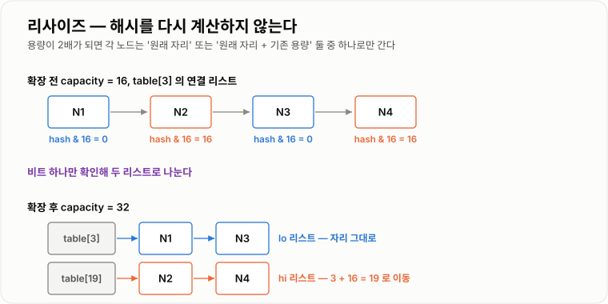

# 해시와 트리 비교

> **Hash 계열은 키의 위치를 "계산"해서 평균 `O(1)`로 찾고, Tree 계열은 키를 "비교"하며 내려가 `O(log n)`으로 찾는 대신 정렬 상태와 범위 검색을 얻는다.**

---

## 1. 핵심 요약

**"키로 정확히 찾기만 하면 되는가, 아니면 순서와 범위가 필요한가" — 이 질문 하나로 Hash와 Tree가 갈리고, 순서만 필요하다면 `LinkedHashMap`이 둘의 중간을 채운다.**

### 한눈에 보기

* **Hash 계열(`HashMap`, `HashSet`)** — 위치를 계산하므로 단건 조회가 평균 `O(1)`이지만 순서가 없다.
* **Tree 계열(`TreeMap`, `TreeSet`)** — 항상 정렬 상태를 유지해 `O(log n)`이지만, 범위 검색과 정렬 순회는 압도적으로 빠르다.
* **`LinkedHashMap`** — 해시의 속도를 그대로 두고 **삽입 순서(또는 접근 순서)** 만 별도의 연결 리스트로 기억한다.
* `Set`은 별도의 자료구조가 아니라 **값을 키 자리에 넣은 Map**이다.
* Hash 계열의 정확성은 전적으로 **`equals`와 `hashCode` 계약**에 달려 있다. 키는 반드시 불변이어야 한다.

### 무엇을 해결하는가

#### 해결하려는 문제

목록에서 특정 데이터를 찾는 가장 단순한 방법은 처음부터 하나씩 비교하는 것이다.

```java
for (Member member : members) {
    if (member.getId().equals(targetId)) {
        return member;
    }
}
```

데이터가 100만 개면 최대 100만 번 비교한다. 이 조회가 요청마다 반복되면 서비스가 버티지 못한다.

여기서 두 가지 전혀 다른 발상이 나온다.

```text
발상 1 — "찾지 말고 계산하자"
   키로 저장 위치를 직접 계산한다.
   → Hash 계열. 평균 O(1). 대신 순서는 포기한다.

발상 2 — "미리 정렬해 두고 절반씩 좁히자"
   키 크기 순으로 정렬된 트리를 유지한다.
   → Tree 계열. O(log n). 대신 정렬 상태와 범위 검색을 얻는다.
```

**두 구조는 경쟁 관계가 아니라 서로 다른 요구에 답한다.**

#### 이 개념이 없을 때

* `List.contains()`를 반복문 안에서 호출해 전체가 `O(n²)`이 된다.
* `equals`만 재정의하고 `hashCode`를 빼먹어 `HashMap`에서 값을 영원히 찾지 못한다.
* `HashMap`에 넣은 키 객체의 필드를 바꿔 데이터가 사라진다.
* "90점 이상 상위 10명"을 구하려고 전체를 꺼내 정렬해 `O(n log n)`을 쓴다.
* 삽입 순서가 유지되길 기대하고 `HashMap`을 쓰다가 리사이즈 후 순서가 뒤바뀐다.

```text
n개의 데이터에서 중복을 제거할 때

List 사용:   O(n²)
   n = 1,000     →  약 50만 번 비교
   n = 100,000   →  약 50억 번 비교      (수십 초~분 단위)

HashSet 사용: O(n)
   n = 100,000   →  100,000번            (밀리초 단위)
```

**"리스트에서 `contains`를 반복문 안에서 호출하고 있다"** 는 성능 문제의 가장 흔한 원인 중 하나다.

---

## 2. 동작 원리

### 핵심 구성 요소

| 개념                   | 설명                                            | 중요한 이유                                    |
| -------------------- | --------------------------------------------- | ----------------------------------------- |
| **해시 함수**            | 임의의 객체를 정수 하나로 변환하는 함수 (`hashCode()`)         | 위치를 탐색하지 않고 계산할 수 있게 만든다.                 |
| **Bucket (버킷)**      | 해시로 계산된 인덱스에 대응하는 저장 칸                        | 실제 데이터가 들어가는 자리이며, 개수가 `capacity`다.       |
| **해시 충돌**            | 서로 다른 키가 같은 버킷 인덱스로 계산되는 것                    | 비둘기집 원리상 **반드시 발생한다.** 처리 방식이 곧 설계다.      |
| **체이닝**              | 같은 버킷의 항목들을 연결 리스트로 잇는 충돌 처리 방식               | Java `HashMap`의 기본 충돌 처리 방법이다.            |
| **트리화 (treeify)**    | 한 버킷의 항목이 8개 이상이고 용량이 64 이상이면 트리로 바꾸는 것       | 나쁜 해시나 공격 상황에서 최악을 `O(log n)`으로 방어한다.     |
| **로드 팩터**            | `size / capacity`가 이 값을 넘으면 확장한다 (기본 `0.75`)  | 시간과 공간의 절충점을 결정한다.                        |
| **리사이즈**             | 용량을 2배로 늘리고 모든 항목을 재배치하는 것                    | 그 호출만 `O(n)`이라 지연이 튄다.                    |
| **`equals()`**       | 두 객체가 논리적으로 같은지 판단하는 메서드                      | 같은 버킷 안에서 최종 동등성을 판단한다.                   |
| **`hashCode()`**     | 객체의 해시값을 반환하는 메서드                             | 버킷을 결정한다. 이것이 틀리면 `equals`는 호출조차 되지 않는다. |
| **불변 키**             | Map·Set에 넣은 뒤 값이 바뀌지 않는 키                     | 해시값이 바뀌면 데이터를 영원히 찾지 못한다.                 |
| **이진 탐색 트리 (BST)**   | 왼쪽은 작은 값, 오른쪽은 큰 값으로 정렬된 트리                   | 비교로 절반씩 좁혀 `O(log n)`을 만든다.               |
| **레드-블랙 트리**         | 색 규칙으로 균형을 유지하는 이진 탐색 트리                      | 정렬된 입력에도 퇴화하지 않아 최악에도 `O(log n)`을 보장한다.   |
| **중위 순회**            | 왼쪽 → 자신 → 오른쪽 순으로 방문하는 트리 순회                  | 이 순서로 읽으면 **정렬 비용 0으로** 정렬 결과가 나온다.       |
| **`Comparable`**     | 객체 스스로 비교 기준을 정의하는 인터페이스 (`compareTo`)        | Tree 계열의 기본 정렬 기준이 된다.                    |
| **`Comparator`**     | 외부에서 비교 기준을 주입하는 인터페이스 (`compare`)            | 정렬 기준을 상황에 따라 바꿀 수 있다.                    |
| **범위 검색**            | "x 이상 y 미만"처럼 구간으로 조회하는 것                     | Tree 계열만 `O(log n + k)`로 처리할 수 있다.        |
| **삽입 순서 유지**         | 넣은 순서대로 순회되는 것                                | `LinkedHashMap`·`LinkedHashSet`만 보장한다.    |

#### 개념 간 관계

```text
Map (키 → 값)                      Set (값만, 중복 없음)
├─ HashMap        순서 없음        ├─ HashSet         내부에 HashMap
├─ LinkedHashMap  삽입 순서        ├─ LinkedHashSet   내부에 LinkedHashMap
└─ TreeMap        키 정렬 순서      └─ TreeSet         내부에 TreeMap

→ Set은 전부 대응하는 Map에 위임한다.
  Map을 이해하면 Set은 자동으로 이해된다.
```

**동등성 판단 경로가 계열별로 다르다.**

```text
Hash 계열:  hashCode() 로 버킷 결정 → 같은 버킷 안에서 equals() 호출
Tree 계열:  compareTo() / compare() 의 반환값이 0이면 같은 키
```

이 차이 때문에 **`TreeMap`은 `equals`를 보지 않는다.** `compareTo`가 0을 반환하면 `equals`가 `false`여도 같은 키로 취급한다.

### 내부 동작 과정

#### HashMap — 위치를 계산한다

```text
HashMap
 ├─ Node<K,V>[] table        (버킷 배열, 길이 = capacity)
 ├─ int size                 (저장된 항목 수)
 ├─ int threshold            (capacity × loadFactor)
 └─ float loadFactor         (기본 0.75)

table:
 index 0  →  null
 index 1  →  [hash|"A"|1|next] → [hash|"Q"|9|null]     ← 충돌 (체이닝)
 index 2  →  null
 index 3  →  [hash|"B"|2|null]
 ...
```

인덱스는 세 단계로 계산된다.

```text
1단계: key.hashCode()          → 32비트 정수 (-21억 ~ 21억)
2단계: 보조 해시  h ^ (h >>> 16) → 상위 비트를 하위에 섞는다
3단계: 버킷 인덱스 (capacity - 1) & hash
```


*위치를 탐색하는 것이 아니라 계산하기 때문에 평균 O(1)이며, 충돌이 쌓이면 트리로 바꿔 최악을 방어한다.*

**왜 보조 해시가 필요한가?**

용량이 16이면 인덱스 계산에 **하위 4비트만** 쓴다. 상위 비트가 아무리 다양해도 하위 4비트가 같으면 전부 같은 버킷에 몰린다.

```text
해시값 A: 0000 0000 0000 0001 0000 0000 0000 0101   → 하위 4비트 = 0101
해시값 B: 1111 1111 1111 1110 0000 0000 0000 0101   → 하위 4비트 = 0101
                                              ↑
                        상위가 완전히 다른데 같은 버킷!
```

한 번의 XOR과 시프트만으로 상위 비트 정보를 하위로 끌어온다. **비용은 거의 없고 효과는 큰** 실용적 최적화다.

**왜 `%` 대신 `&`인가?**

```text
capacity = 16 = 10000(2)
capacity - 1 = 15 = 01111(2)

hash & 15  ==  hash % 16      (하위 4비트만 남김)
```

나눗셈은 비트 연산보다 몇 배 느리다. 그래서 **용량을 항상 2의 거듭제곱으로 강제한다.**

#### put 동작 과정

```text
put(key, value)
      ↓
① 해시 계산: hash = h ^ (h >>> 16)
      ↓
② 인덱스 계산: i = (capacity - 1) & hash
      ↓
③ table[i]가 비었는가? → 예: 새 Node 저장, size++ → ⑦
      ↓ 아니오 (충돌)
④ 그 자리의 항목들을 순회하며 비교
   hash가 같고 && (== 또는 equals가 true) → 값 덮어쓰고 종료
      ↓ 아니면 계속
⑤ 끝까지 같은 키가 없으면 맨 뒤에 새 Node 추가, size++
      ↓
⑥ 그 버킷의 노드가 8개 이상 && table 길이 64 이상 → 트리로 변환
      ↓
⑦ size > threshold → resize() (용량 2배, 전체 재배치)
```

동등성 비교가 **세 단계로 최적화**되어 있다는 점이 중요하다.

```java
if (node.hash == hash && (node.key == key || (key != null && key.equals(node.key))))
```

* 먼저 `hash`(정수) 비교 — 매우 빠르고, 다르면 즉시 탈락
* `==`로 참조 동일성 확인 — 같은 객체면 `equals` 호출조차 생략
* 마지막에 `equals` 호출 — 가장 비싼 연산을 최소한으로

#### 리사이즈 — 비트 하나만 본다



*용량이 2배가 되면 인덱스 계산에 쓰이는 비트가 하나 늘어날 뿐이라, 그 비트만 보면 갈 곳이 정해진다.*

해시는 Node에 저장되어 있으므로 **다시 계산하지 않는다.** `hash & oldCap` 한 비트만 확인해 "제자리"와 "제자리 + oldCap" 두 리스트로 나눈다.

#### HashSet — 값을 키 자리에 넣는다

```java
// HashSet 내부
private transient HashMap<E, Object> map;
private static final Object PRESENT = new Object();

public boolean add(E e) {
    return map.put(e, PRESENT) == null;
}
```


*값을 키 자리에 넣고 값 자리에는 공유 상수를 넣기 때문에, HashMap의 성능 특성을 그대로 물려받는다.*

`PRESENT`는 **모든 원소가 공유하는 단 하나의 객체**라 값 때문에 늘어나는 메모리는 없다.

#### TreeMap — 비교하며 내려간다

```text
              50
            /    \
         30        70
        /  \      /  \
      20    40  60    80

get(40): 50과 비교 → 작다 → 왼쪽
         30과 비교 → 크다 → 오른쪽
         40 발견   → 3번 비교로 종료
```

문제는 **정렬된 데이터를 순서대로 넣으면 트리가 한쪽으로 늘어져 연결 리스트가 된다**는 것이다.

```text
10 → 20 → 30 → 40 을 순서대로 삽입하면

10
  \
   20
     \
      30
        \
         40      ← 높이 = n, 탐색 O(n)
```

레드-블랙 트리는 색 규칙과 회전으로 이것을 막는다.


*색 규칙이 "최장 경로 ≤ 최단 경로 × 2"를 보장하므로, 어떤 입력에도 높이가 O(log n)을 넘지 않는다.*

**정렬 순회에 비용이 들지 않는다는 점**이 Tree 계열의 핵심 가치다.

```text
중위 순회 (왼쪽 → 자신 → 오른쪽)
20 → 30 → 40 → 50 → 60 → 70 → 80

이미 정렬된 상태로 저장되어 있으므로 O(n)에 정렬 결과를 얻는다.
HashMap이라면 전체를 꺼내 정렬해야 하므로 O(n log n)이다.
```

#### LinkedHashMap — 해시에 순서를 덧붙인다

`LinkedHashMap`은 `HashMap`을 상속하고, 모든 엔트리를 **양방향 연결 리스트로 한 번 더 엮는다.**

```text
버킷 배열 (HashMap 그대로)         순회용 연결 리스트 (추가된 부분)
 index 1 → [C]                    head → [A] ⇄ [B] ⇄ [C] ⇄ [D] ← tail
 index 3 → [A] → [D]                     (삽입한 순서 그대로)
 index 7 → [B]
```

* **조회는 여전히 해시로** 하므로 평균 `O(1)`이 유지된다.
* **순회는 연결 리스트를 따라가므로** 삽입 순서가 그대로 나온다.
* 엔트리마다 `before`, `after` 참조 2개가 추가되어 메모리를 조금 더 쓴다.

생성자에 `accessOrder = true`를 주면 **접근 순서**로 바뀐다. 이것이 LRU 캐시를 만드는 방법이다.

---

## 3. 특징과 비교

| 구분          | 내용                                       |
| ----------- | ---------------------------------------- |
| **장점**      | Hash 계열은 단건 조회가 평균 `O(1)`로 가장 빠르다. Tree 계열은 정렬·범위·최솟값 조회를 주고 **최악까지 `O(log n)`** 으로 보장한다. |
| **단점**      | Hash는 순서가 없고 범위 조회가 안 되며 `hashCode` 품질에 좌우된다. Tree는 단건 조회가 느리고 비교 기준이 반드시 필요하다. |
| **적합한 상황**  | 순서가 필요 없으면 `HashMap`, 삽입 순서가 필요하면 `LinkedHashMap`, 크기 순서·범위 조회가 필요하면 `TreeMap`. |
| **주의할 상황**  | 키 객체의 필드를 컬렉션에 넣은 뒤 바꾸는 것 — **조용히 못 찾게 된다.** `equals`와 `hashCode`를 함께 재정의하지 않는 것. |

### 성능 특성

#### Map 계열 연산별 복잡도

| 연산                    | HashMap             | LinkedHashMap       | TreeMap        |
| --------------------- | ------------------- | ------------------- | -------------- |
| `get` / `containsKey` | 평균 `O(1)`, 최악 `O(log n)` | 평균 `O(1)`           | `O(log n)`     |
| `put`                 | 평균 `O(1)`           | 평균 `O(1)`           | `O(log n)`     |
| `remove`              | 평균 `O(1)`           | 평균 `O(1)`           | `O(log n)`     |
| `containsValue`       | `O(n)`              | `O(n)`              | `O(n)`         |
| 전체 순회                 | `O(n + capacity)`   | `O(n)`              | `O(n)`         |
| 최솟값 / 최댓값             | `O(n)`              | `O(n)`              | `O(log n)`     |
| 범위 조회                 | `O(n)`              | `O(n)`              | `O(log n + k)` |
| 정렬 순회                 | `O(n log n)`        | `O(n log n)`        | `O(n)` — 정렬 비용 0 |
| 가까운 키 탐색              | `O(n)`              | `O(n)`              | `O(log n)`     |
| 순서 보장                 | 없음                  | 삽입(또는 접근) 순서        | 키 정렬 순서        |

> **HashMap의 최악이 `O(log n)`인 것은 Java 8 이상 기준**이다. Java 7까지는 트리화가 없어 최악이 `O(n)`이었다. "HashMap 최악 `O(n)`"이라는 설명은 Java 7 시절 이야기다.

> **TreeMap은 평균과 최악이 같다.** 레드-블랙 트리가 균형을 보장하므로 어떤 입력에도 `O(log n)`이 깨지지 않는다. 이것이 HashMap과의 중요한 차이다.

#### Set 계열은 대응 Map과 동일하다

| 연산               | HashSet             | LinkedHashSet | TreeSet        |
| ---------------- | ------------------- | ------------- | -------------- |
| `add` / `contains` / `remove` | 평균 `O(1)` | 평균 `O(1)`     | `O(log n)`     |
| 전체 순회            | `O(n + capacity)`   | `O(n)`        | `O(n)`         |
| `first` / `last` | `O(n)`              | `O(n)`        | `O(log n)`     |
| 범위 조회 (`subSet`) | 불가                  | 불가            | `O(log n + k)` |

집합 연산은 대상 크기에 비례한다.

| 연산                  | 복잡도            | 설명                    |
| ------------------- | -------------- | --------------------- |
| `addAll` (합집합)      | `O(m)`         | 추가할 원소 수 m에 비례        |
| `retainAll` (교집합)   | `O(n)`         | 자기 원소마다 상대 Set을 조회한다  |
| `removeAll` (차집합)   | `O(m)` 또는 `O(n)` | 두 집합 크기에 따라 전략이 달라진다 |

#### 메모리 비교

```text
HashMap의 Node 하나
= hash + key + value + next
→ 참조 3개 + int + 객체 헤더
+ 로드 팩터로 인한 빈 버킷 (평균 25% 이상)

LinkedHashMap의 Entry 하나
= 위 Node + before + after
→ 참조 2개 추가

TreeMap의 Entry 하나
= key + value + left + right + parent + color(boolean)
→ 참조 5개 + boolean + 객체 헤더
   (다만 빈 버킷 부담은 없다)
```

**`TreeMap`이 원소당 메모리를 조금 더 쓰지만, `HashMap`은 빈 버킷 25% 이상을 별도로 부담한다.** 총량은 상황에 따라 달라진다.

#### O(log n)의 실제 의미

```text
n = 1,000          →  log₂n ≈ 10회 비교
n = 1,000,000      →  log₂n ≈ 20회 비교
n = 1,000,000,000  →  log₂n ≈ 30회 비교

데이터가 1000배 늘어도 비교는 10회만 늘어난다.
```

`HashMap`의 `O(1)`과 비교하면 20배 느려 보이지만, **실제 절대 시간은 수십 나노초 수준**이다. 대부분의 웹 애플리케이션에서 이 차이는 DB 쿼리 한 번(수 밀리초)에 비하면 무시할 수 있다.

**진짜 차이가 나는 지점은 범위 검색과 정렬이다.**

#### HashMap 성능을 좌우하는 요인

| 요인             | 영향                                  |
| -------------- | ----------------------------------- |
| `hashCode` 품질  | 나쁘면 한 버킷에 몰려 `O(n)`에 가까워진다          |
| 로드 팩터          | 낮추면 충돌↓ 메모리↑, 높이면 메모리↓ 충돌↑          |
| 초기 용량          | 작으면 리사이즈가 반복되고, 크면 메모리와 순회 비용이 늘어난다 |
| 키의 `equals` 비용 | 긴 문자열 비교 등은 충돌 시 비용을 키운다            |
| 리사이즈 시점        | 그 호출만 `O(n)`으로 지연이 튄다               |

```text
1000개를 넣을 때 (기본 용량 16으로 시작)
16 → 32 → 64 → 128 → 256 → 512 → 1024 → 2048
리사이즈 7회, 누적 재배치 약 2000회

new HashMap<>(2048) 로 시작하면 리사이즈 0회
```

필요한 용량은 `예상 개수 / 0.75`보다 커야 한다. 1000개를 넣으려면 `1000 / 0.75 ≈ 1334` → 2의 거듭제곱인 **2048**이 필요하다. `new HashMap<>(1000)`으로는 부족하다.

#### 데이터가 많아질 때

* **Hash 계열** — 조회 비용은 개수와 무관하게 평균 `O(1)`로 유지된다. 이것이 핵심 가치다. 다만 리사이즈 지연이 커지고, Node 객체 수만큼 GC 부담이 늘어난다.
* **순회는 `size`가 아니라 `capacity`에도 비례한다.** 100만 용량에 항목이 10개면 순회에 100만 번 빈 칸을 지나간다. `LinkedHashMap`은 연결 리스트를 따라가므로 이 문제가 없다.
* **Tree 계열** — 높이가 `log n`이라 데이터가 1000배 늘어도 비교는 10회만 늘어난다. 최악이 보장되므로 응답 시간 편차가 작다.

### 장점과 단점

#### Hash 계열

| 장점                 | 이유                                 |
| ------------------ | ---------------------------------- |
| 단건 조회가 평균 `O(1)`   | 위치를 탐색하지 않고 계산한다.                  |
| 데이터가 늘어도 조회가 느려지지 않음 | 버킷 인덱스 계산 비용이 개수와 무관하다.            |
| 중복 제거가 `O(n)`      | `List`의 `O(n²)`를 `O(n)`으로 바꾼다.     |
| API가 단순하다          | 키만 알면 되고 정렬 기준을 정의할 필요가 없다.        |

| 단점                | 이유 및 주의점                                     |
| ----------------- | -------------------------------------------- |
| 순서를 전혀 보장하지 않는다   | 리사이즈로 언제든 바뀐다. 순서가 필요하면 다른 구현체를 써야 한다.       |
| 범위 검색이 `O(n)`     | 키에 순서 개념이 없어 전체를 훑어야 한다.                     |
| `hashCode` 품질에 의존 | 나쁜 해시는 성능을 `O(n)` 가까이 떨어뜨린다.                 |
| 키가 불변이어야 한다       | 필드를 바꾸면 데이터를 영원히 찾지 못한다.                     |
| 메모리 오버헤드가 크다      | 빈 버킷이 평균 25% 이상, Node 객체가 원소마다 생긴다.          |
| 리사이즈에 지연이 튄다      | 그 호출만 `O(n)`이라 순간 응답 시간이 크게 늘어날 수 있다.        |

#### Tree 계열

| 장점                    | 이유                                |
| --------------------- | --------------------------------- |
| 항상 정렬 상태를 유지한다        | 정렬 순회에 추가 비용이 들지 않는다 (`O(n)`).    |
| 범위 검색이 `O(log n + k)` | 시작점만 찾으면 결과 개수만큼만 읽는다.            |
| 최솟값·최댓값이 `O(log n)`   | 왼쪽 끝·오른쪽 끝까지만 내려간다.               |
| 최악이 보장된다              | 균형 트리라 어떤 입력에도 `O(log n)`이 깨지지 않는다. |
| 가까운 키를 찾을 수 있다        | `ceiling`, `floor`, `higher`, `lower` |

| 단점                   | 이유 및 주의점                                   |
| -------------------- | ------------------------------------------ |
| 단건 조회가 `O(log n)`    | 해시보다 느리다. 단건 조회만 한다면 손해다.                  |
| 비교 기준이 반드시 필요하다      | `Comparable` 구현이나 `Comparator` 주입이 없으면 예외다. |
| `null` 키를 넣을 수 없다    | 비교가 불가능해 `NullPointerException`이 발생한다.      |
| 노드당 참조가 더 많다         | `left`, `right`, `parent`, `color`가 추가된다.  |
| 삽입·삭제에 회전 비용이 붙는다    | 균형을 유지하기 위한 대가다.                           |

#### LinkedHashMap

| 장점                | 이유                                |
| ----------------- | --------------------------------- |
| 해시 속도 + 순서 보장     | 조회는 `O(1)`, 순회는 삽입 순서 그대로다.       |
| 순회가 `capacity`와 무관 | 연결 리스트를 따라가므로 빈 버킷을 지나지 않는다.      |
| LRU 캐시를 쉽게 만든다    | `accessOrder`와 `removeEldestEntry` 조합 |

| 단점             | 이유 및 주의점                       |
| -------------- | ------------------------------ |
| 메모리를 더 쓴다      | 엔트리마다 `before`, `after` 참조 2개 추가 |
| 정렬은 해주지 않는다    | 삽입 순서일 뿐 키 크기 순서가 아니다.         |
| 쓰기 비용이 조금 더 든다 | 연결 리스트도 함께 갱신해야 한다.            |

### 어떤 상황에서 고르는가

#### 선택 흐름도

```text
키로 값을 찾는가?
├─ 아니오 (값만 저장, 중복 제거) → Set 계열로 같은 질문을 반복
│
└─ 예 → 순서가 필요한가?
         ├─ 필요 없다              → HashMap        (가장 빠름, 기본 선택)
         ├─ 넣은 순서대로           → LinkedHashMap
         ├─ 최근 사용 순서 (LRU)     → LinkedHashMap(accessOrder=true)
         └─ 키 크기 순서 / 범위 검색   → TreeMap
```

#### 사용하기 좋은 상황

| 자료구조                | 이럴 때 쓴다                                      |
| ------------------- | -------------------------------------------- |
| **HashMap**         | ID로 객체를 찾는 캐시, 두 목록 연결(N+1 해소), 카운팅 — **기본 선택** |
| **HashSet**         | 중복 제거, 포함 여부 확인, 방문 처리                       |
| **LinkedHashMap**   | 순서가 의미 있는 응답 데이터, LRU 캐시, 설정 값 순서 유지         |
| **LinkedHashSet**   | 중복은 제거하되 입력 순서는 지켜야 하는 목록                    |
| **TreeMap**         | 점수 구간 조회, 날짜 범위 조회, 랭킹, 등급 테이블, 가장 가까운 값 찾기  |
| **TreeSet**         | 정렬된 중복 없는 집합, 범위 필터링                         |

#### 사용하지 않는 것이 좋은 상황

* **순서가 필요한데 `HashMap`을 쓰는 것** — 우연히 유지되어 보여도 리사이즈로 언제든 바뀐다.
* **가변 객체를 키로 쓰는 것** — 필드가 바뀌면 데이터를 잃는다.
* **`equals`만 재정의한 객체를 키로 쓰는 것** — 값을 영원히 찾지 못한다.
* **단건 조회만 하는데 `TreeMap`을 쓰는 것** — `O(log n)`을 지불할 이유가 없다.
* **정렬이 필요한데 데이터가 변하지 않는 경우** — 정렬된 배열 + 이진 탐색이 메모리·캐시 면에서 더 낫다.
* **순회만 하는데 `List`를 `Set`으로 바꾸는 것** — 조회가 많을 때만 이득이다.
* **애플리케이션 `HashSet`으로 중복 요청 방지** — 서버가 여러 대이거나 재시작하면 무력화된다.

#### 선택 기준

1. **정확한 키 조회가 중요한가?** → Hash 계열
2. **정렬된 상태가 필요한가?** → Tree 계열
3. **"이상·이하" 범위 검색이 필요한가?** → Tree 계열 (여기서는 대안이 없다)
4. **삽입 순서를 유지해야 하는가?** → `LinkedHashMap` / `LinkedHashSet`
5. **중복을 제거하면서 정렬도 유지해야 하는가?** → `TreeSet`
6. **키가 불변인가?** — 아니면 어떤 구조도 안전하지 않다
7. **`equals`와 `hashCode`가 계약을 지키는가?**
8. **저장 개수를 알고 있는가?** — 안다면 초기 용량을 지정한다
9. **여러 스레드가 접근하는가?** → `ConcurrentHashMap`

### 비슷한 기술과 비교

#### Hash 계열과 Tree 계열

| 기준        | Hash 계열                     | Tree 계열                | 선택 기준                |
| --------- | --------------------------- | ---------------------- | -------------------- |
| 목적        | 정확한 키로 빠르게 찾기               | 정렬 상태 유지와 범위 조회        | 순서가 필요한가             |
| 내부 구조     | 버킷 배열 + 체이닝(+ 트리화)          | 레드-블랙 트리               | —                    |
| 단건 조회     | 평균 `O(1)`                   | `O(log n)`             | 단건만이면 Hash            |
| 정렬        | 보장 안 됨                      | 항상 유지                  | 정렬이 필요하면 Tree         |
| 범위 검색     | 부적합 (`O(n)`)                | 적합 (`O(log n + k)`)    | 범위가 있으면 Tree (대안 없음) |
| 최악 보장     | 충돌에 좌우됨                     | 항상 `O(log n)`          | 응답 편차가 중요하면 Tree      |
| 동등성 판단    | `hashCode` → `equals`       | `compareTo` 반환값 0      | —                    |
| `null` 키  | 1개 허용                       | 불가 (NPE)               | —                    |
| 메모리       | 빈 버킷 25% 이상 부담              | 노드당 참조가 더 많음           | 상황에 따라 다름            |
| 중복 제거     | `HashSet`                   | `TreeSet`              | 정렬 필요 여부             |

#### HashMap · LinkedHashMap · TreeMap

| 비교 항목  | HashMap    | LinkedHashMap    | TreeMap        |
| ------ | ---------- | ---------------- | -------------- |
| 목적     | 가장 빠른 키 조회 | 순서를 기억하는 키 조회    | 정렬과 범위 조회      |
| 순서     | 없음         | 삽입 순서 또는 접근 순서   | 키 정렬 순서        |
| 조회     | 평균 `O(1)`  | 평균 `O(1)`        | `O(log n)`     |
| 순회 비용  | `O(n + capacity)` | `O(n)`     | `O(n)`         |
| 추가 메모리 | 빈 버킷       | 빈 버킷 + 참조 2개     | 노드당 참조 5개      |
| 대표 용도  | 캐시, 인덱싱    | LRU 캐시, 순서 있는 응답 | 랭킹, 구간 조회, 스케줄 |
| 선택 기준  | 순서가 상관없다   | 순서만 필요하다         | 크기 순서·범위가 필요하다 |

#### Set 계열

| 비교 항목  | HashSet      | LinkedHashSet | TreeSet         |
| ------ | ------------ | ------------- | --------------- |
| 목적     | 빠른 중복 제거     | 순서 유지 + 중복 제거 | 정렬 + 중복 제거      |
| 내부     | HashMap      | LinkedHashMap | TreeMap         |
| 조회     | 평균 `O(1)`    | 평균 `O(1)`     | `O(log n)`      |
| 순서     | 없음           | 삽입 순서         | 정렬 순서           |
| 범위 조회  | 불가           | 불가            | `subSet` 가능     |
| 선택 기준  | 중복 제거만 필요할 때 | 입력 순서를 보여줄 때  | 정렬·범위가 함께 필요할 때 |

#### TreeMap과 정렬된 배열

| 비교 항목  | TreeMap        | 정렬된 배열 + 이진 탐색  | 선택 기준           |
| ------ | -------------- | --------------- | --------------- |
| 목적     | 삽입·삭제가 계속 일어남  | 한 번 만들고 조회만 함   | 데이터가 변하는가       |
| 조회     | `O(log n)`     | `O(log n)`      | 동일              |
| 삽입·삭제  | `O(log n)`     | `O(n)`          | 변경이 있으면 TreeMap  |
| 메모리    | 노드당 참조 5개      | 배열 그대로 (매우 작음)  | 고정 데이터면 배열      |
| 캐시 효율  | 나쁨 (노드 흩어짐)    | 좋음 (연속 메모리)     | 고정 데이터면 배열      |
| 적합한 상황 | 실시간 랭킹, 변하는 구간 | 등급표, 요금표 같은 고정값 | 변경 빈도로 판단       |

---

## 4. 실무 주의사항

### 백엔드 실무 적용

#### Spring·Java

**N+1 조회를 Map으로 해소한다.**

```java
@Service
public class OrderService {

    public void assignMembers(List<Order> orders, List<Member> members) {
        Map<Long, Member> memberMap = new HashMap<Long, Member>(members.size() * 2);

        for (Member member : members) {
            memberMap.put(member.getId(), member);
        }

        for (Order order : orders) {
            Member member = memberMap.get(order.getMemberId());
            if (member != null) {
                order.assignMember(member);
            }
        }
    }
}
```

`O(n × m)`이 `O(n + m)`이 된다. 초기 용량을 지정해 리사이즈를 없앤 것도 함께 봐야 한다.

**응답 순서가 의미 있으면 `LinkedHashMap`을 쓴다.**

```java
Map<String, Integer> summary = new LinkedHashMap<String, Integer>();
summary.put("결제완료", 120);
summary.put("배송중", 45);
summary.put("배송완료", 380);
// JSON 직렬화 시 넣은 순서 그대로 나간다
```

`HashMap`이면 순서가 뒤죽박죽으로 나가 API 응답이 매번 달라 보인다.

**JPA 엔티티의 `equals`/`hashCode`는 주의가 필요하다.**

ID로 만들면 영속화 전후로 ID가 `null` → 값으로 바뀌어 해시가 변한다. 그러면 `Set`에 넣어둔 엔티티를 찾지 못한다. 비즈니스 키를 쓰거나 별도 전략이 필요하다.

**`record`는 `equals`와 `hashCode`를 자동으로 만들어준다.**

```java
public record MemberKey(Long id, String type) { }
```

모든 필드를 기준으로 두 메서드가 생성되고 불변이므로, **Map의 키로 쓰기에 가장 안전한 형태**다.

#### 데이터베이스·캐시

**DB 인덱스도 같은 두 갈래다.**

| DB 인덱스           | 대응 개념   | 특성                             |
| ---------------- | ------- | ------------------------------ |
| B+Tree 인덱스 (기본)  | Tree 계열 | 정렬 유지, 범위 검색(`BETWEEN`, `>`) 가능 |
| Hash 인덱스         | Hash 계열 | 등치 비교(`=`)만 가능, 범위 검색 불가       |

```sql
-- B+Tree 인덱스라서 가능한 쿼리
SELECT * FROM orders WHERE created_at BETWEEN '2026-01-01' AND '2026-01-31';
SELECT * FROM orders ORDER BY created_at DESC LIMIT 10;
```

**대부분의 DB가 B+Tree를 기본으로 쓰는 이유가 여기 있다.** 해시 인덱스는 범위 검색과 정렬을 못 한다.

**Redis도 같은 구분이 있다.**

| Redis 자료구조     | 대응 개념   | 용도               |
| -------------- | ------- | ---------------- |
| `Hash`         | HashMap | 객체 속성 저장         |
| `Set`          | HashSet | 중복 없는 집합, 태그     |
| `Sorted Set`   | TreeMap | 랭킹, 점수 구간 조회     |

Redis `Sorted Set`의 내부는 **스킵 리스트 + 해시 테이블**이다. 레드-블랙 트리가 아니다. 목적은 비슷하지만 구조가 다르다.

**LRU 캐시는 `LinkedHashMap` 하나로 만들 수 있다.** 다만 스레드 안전하지 않으므로 실무에서는 Caffeine이나 Redis를 쓰는 편이 낫다.

#### 동시성·분산 환경

**`HashMap`은 스레드 안전하지 않다.**

```text
Java 7까지: 동시 리사이즈 시 순환 참조 → 무한 루프 (CPU 100%)
Java 8부터: 무한 루프는 해결됐지만
            → 항목 유실, size 불일치는 그대로다
```

**Java 8부터 안전해졌다는 말은 틀렸다.** 무한 루프만 해결됐다.

| 상황           | 선택                                       |
| ------------ | ---------------------------------------- |
| 동시 읽기·쓰기 Map | `ConcurrentHashMap`                      |
| 동시 Set       | `ConcurrentHashMap.newKeySet()`          |
| 정렬 + 동시성     | `ConcurrentSkipListMap` / `ConcurrentSkipListSet` |
| 읽기 위주, 수정 드묾 | `CopyOnWriteArraySet`                    |

`ConcurrentHashMap`을 쓸 때도 **복합 연산은 여전히 위험하다.**

```java
// 위험 — 두 스레드가 모두 null을 보고 둘 다 put 할 수 있다
if (map.get(key) == null) {
    map.put(key, newValue);
}

// 안전 — 원자적으로 처리된다
map.putIfAbsent(key, newValue);
map.computeIfAbsent(key, k -> newValue);
```

**분산 환경에서는 애플리케이션 컬렉션으로 중복을 막을 수 없다.**

```text
서버 A의 HashSet  ←  서로 모른다  →  서버 B의 HashSet

→ 서버가 여러 대이거나 재시작하면 무력화된다
→ DB 유니크 제약, Redis SETNX, 분산 락이 필요하다
```

### 자주 하는 오해

| 잘못된 이해                              | 올바른 이해                                                            |
| ----------------------------------- | ----------------------------------------------------------------- |
| `HashMap` 조회는 항상 `O(1)`이다           | **평균**이 `O(1)`이다. 충돌이 심하면 `O(log n)`(Java 8), Java 7은 `O(n)`까지 떨어졌다. |
| 해시 충돌은 버그이거나 드문 예외 상황이다             | 비둘기집 원리상 반드시 발생한다. 정상 동작의 일부이며 어떻게 처리하느냐가 설계다.                    |
| `hashCode`가 같으면 같은 객체다              | 다른 객체도 같은 해시값을 가질 수 있다. 최종 판단은 `equals`가 한다.                      |
| `equals`만 재정의하면 된다                  | `hashCode`를 재정의하지 않으면 다른 버킷을 보게 되어 값을 찾지 못한다.                     |
| 중복 판단은 `equals`만으로 한다               | 먼저 `hashCode`로 버킷을 찾고, 같은 버킷 안에서만 `equals`를 호출한다.                 |
| `HashMap`은 삽입 순서를 유지한다              | 보장하지 않는다. 우연히 유지되어 보일 수 있으나 리사이즈로 언제든 바뀐다.                        |
| 키의 필드를 바꿔도 값은 잘 찾아진다                | 해시값이 달라져 다른 버킷을 보게 되므로 영원히 못 찾는다. 키는 불변이어야 한다.                    |
| 버킷 수가 곧 저장 가능한 개수다                  | 체이닝으로 한 버킷에 여러 개가 들어간다. 용량은 성능 기준일 뿐이다.                           |
| 로드 팩터를 1.0으로 하면 메모리 효율이 좋다          | 충돌이 급격히 늘어 조회가 느려진다. 0.75가 시간·공간의 실용적 절충점이다.                      |
| 리사이즈 때 모든 키의 해시를 다시 계산한다            | 해시는 Node에 저장해 두고, 비트 하나(`hash & oldCap`)만 확인해 두 리스트로 나눈다.         |
| 트리화는 자주 일어나는 정상 동작이다                | 해시가 고르면 확률이 극히 낮다. 나쁜 해시나 공격에 대비한 안전장치다.                          |
| `new HashMap<>(1000)`은 1000개까지 리사이즈가 없다 | 임계값은 `1024 × 0.75 = 768`이다. 1000개를 넣으려면 `1000/0.75 ≈ 1334` 이상이 필요하다. |
| 항목이 적으면 순회도 빠르다                     | `HashMap` 순회는 `capacity`에도 비례한다. 큰 용량에 항목이 적으면 빈 버킷을 계속 지나간다.     |
| `containsValue`도 `O(1)`이다           | 값에는 인덱스가 없어 전체를 훑는다. `O(n)`이다.                                    |
| Java 8부터 `HashMap`은 스레드 안전하다        | 무한 루프만 해결됐다. 항목 유실과 `size` 불일치는 그대로다.                             |
| `HashSet`은 `HashMap`과 완전히 다른 구조다    | 내부에 `HashMap`을 그대로 갖고 있으며 값 자리에 더미 객체를 넣을 뿐이다.                    |
| `contains` 후 `add`가 더 안전하다          | 해시 계산이 두 번이고, 동시 환경에서는 두 스레드가 모두 통과할 수 있다. `add` 반환값을 쓴다.         |
| `HashSet`은 인덱스로 접근할 수 있다            | 인덱스 개념이 없다. 순회로만 접근한다.                                            |
| `List`를 `Set`으로 바꾸면 항상 빨라진다         | 조회가 많을 때만이다. 순회만 한다면 `List`가 메모리·캐시 면에서 유리하다.                     |
| 애플리케이션 `HashSet`으로 중복 요청을 완전히 막을 수 있다 | 서버가 여러 대이거나 재시작하면 무력화된다. DB 유니크 제약이나 Redis를 써야 한다.                |
| JPA 엔티티의 `equals`/`hashCode`는 ID로 만든다 | 영속화 전후로 ID가 `null`→값으로 바뀌어 해시가 변한다. 비즈니스 키나 별도 전략이 필요하다.          |
| `TreeMap`은 삽입한 순서대로 정렬된다            | **키 값의 크기** 순서다. 삽입 순서가 필요하면 `LinkedHashMap`을 쓴다.                 |
| `TreeMap`은 `HashMap`보다 무조건 느리다      | 단건 조회만 그렇다. 범위 조회·정렬 순회·최솟값 조회는 `TreeMap`이 압도적으로 빠르다.             |
| `TreeMap`은 일반 이진 탐색 트리다             | 레드-블랙 트리라서 균형이 자동 유지되고, 최악에도 `O(log n)`이 보장된다.                    |
| 정렬된 데이터를 넣으면 `TreeMap`도 `O(n)`으로 퇴화한다 | 균형 트리라 퇴화하지 않는다. 퇴화하는 건 균형 잡지 않는 일반 BST다.                         |
| `TreeMap`의 중복 키 판단은 `equals`가 한다    | `compareTo`(또는 `compare`)의 반환값이 0이면 같은 키로 본다.                     |
| `TreeMap`에 `null` 키를 넣을 수 있다        | 비교가 불가능하므로 `NullPointerException`이 발생한다.                          |
| `subMap`은 새 Map을 만들어 반환한다           | 원본을 바라보는 **뷰**다. 수정하면 원본에 반영되고, 메모리도 추가로 쓰지 않는다.                  |
| `ceilingKey`와 `higherKey`는 같다       | `ceiling`은 자기 자신을 포함하고, `higher`는 제외한다. `floor`/`lower`도 마찬가지.    |
| 레드-블랙 트리는 완벽하게 균형 잡힌 트리다            | "가장 긴 경로가 가장 짧은 경로의 2배 이내"만 보장한다. 완벽한 균형은 재조정 비용이 커서 포기한 절충안이다.   |
| Redis ZSET의 내부는 레드-블랙 트리다           | **스킵 리스트 + 해시 테이블**이다. 목적은 비슷하지만 구조가 다르다.                         |
| 정렬이 필요하면 무조건 `TreeMap`이다            | 데이터가 안 변하면 정렬된 배열 + 이진 탐색이 메모리·캐시 면에서 더 낫다.                       |
| `LinkedHashMap`은 정렬해준다              | 삽입 순서(또는 접근 순서)일 뿐 키 크기 순서가 아니다. 정렬은 `TreeMap`이다.                 |

---

## 5. 예제

### equals와 hashCode 계약

```java
public class Member {

    private final Long id;
    private final String email;

    public Member(Long id, String email) {
        this.id = id;
        this.email = email;
    }

    @Override
    public boolean equals(Object o) {
        if (this == o) {
            return true;
        }
        if (o == null || getClass() != o.getClass()) {
            return false;
        }
        Member other = (Member) o;
        return id.equals(other.id);
    }

    @Override
    public int hashCode() {
        return id.hashCode();
    }
}
```

계약은 두 줄이다.

```text
equals 가 true 이면  →  hashCode 도 반드시 같아야 한다   (필수)
hashCode 가 같으면   →  equals 는 false 일 수 있다      (충돌은 정상)
```

`equals`만 재정의하면 다음이 벌어진다.

```java
Map<Member, String> map = new HashMap<Member, String>();
map.put(new Member(1L, "a@x.com"), "값");

// hashCode 를 재정의하지 않으면 객체마다 해시가 달라
// 완전히 다른 버킷을 보게 되어 equals 는 호출조차 되지 않는다
System.out.println(map.get(new Member(1L, "a@x.com")));   // null
```

### 키를 바꾸면 데이터가 사라진다

```java
public class MutableKeyProblem {

    public void run() {
        Set<StringBuilder> set = new HashSet<StringBuilder>();

        StringBuilder key = new StringBuilder("A");
        set.add(key);

        key.append("B");                       // 필드를 바꿨다 → 해시값이 변함

        System.out.println(set.contains(key)); // false — 다른 버킷을 보게 된다
        System.out.println(set.size());        // 1  — 그런데 여전히 안에 있다
    }
}
```

**Map·Set의 키(원소)는 반드시 불변이어야 한다.** 이것이 `String`, `Integer`, `Long` 같은 불변 타입이 키로 선호되는 이유다.

### 범위 검색 — TreeMap이 압도적인 지점

```java
import java.util.NavigableMap;
import java.util.TreeMap;

public class ScoreRanking {

    private final NavigableMap<Integer, String> scores = new TreeMap<Integer, String>();

    public void add(int score, String name) {
        scores.put(score, name);
    }

    public void printHighScores() {
        // 90점 이상만 — 시작점 탐색 O(log n) + 결과 개수 k
        NavigableMap<Integer, String> high = scores.tailMap(90, true);

        for (Integer score : high.keySet()) {
            System.out.println(score + " : " + high.get(score));
        }
    }

    public Integer nearestBelow(int target) {
        return scores.floorKey(target);   // target 이하 중 가장 큰 키
    }
}
```

```text
"90점 이상 상위 10명" 조회 (n = 100만)

HashMap: 전체 100만 개를 훑고 정렬  →  O(n log n)  ≈ 2000만 연산
TreeMap: tailMap(90)으로 시작점 찾고 10개 읽기  →  O(log n + 10)  ≈ 30 연산
```

`subMap`, `headMap`, `tailMap`은 **복사본이 아니라 원본을 바라보는 뷰**다. 생성 자체는 `O(1)`이고 추가 메모리를 쓰지 않는다. 뷰를 수정하면 원본에 반영된다.

```java
scores.headMap(60).clear();   // 60점 미만을 원본에서 실제로 삭제한다
```

### 경계 메서드 구분

```java
TreeMap<Integer, String> map = new TreeMap<Integer, String>();
map.put(10, "A");
map.put(20, "B");
map.put(30, "C");

map.ceilingKey(20);   // 20  — 자기 자신 포함, 이상 중 최솟값
map.higherKey(20);    // 30  — 자기 자신 제외, 초과 중 최솟값
map.floorKey(20);     // 20  — 자기 자신 포함, 이하 중 최댓값
map.lowerKey(20);     // 10  — 자기 자신 제외, 미만 중 최댓값
```

`ceiling`/`floor`는 **포함**, `higher`/`lower`는 **제외**다.

### LinkedHashMap으로 LRU 캐시 만들기

```java
import java.util.LinkedHashMap;
import java.util.Map;

public class LruCache<K, V> extends LinkedHashMap<K, V> {

    private final int maxSize;

    public LruCache(int maxSize) {
        // initialCapacity, loadFactor, accessOrder
        super(16, 0.75f, true);
        this.maxSize = maxSize;
    }

    @Override
    protected boolean removeEldestEntry(Map.Entry<K, V> eldest) {
        return size() > maxSize;
    }
}
```

동작 과정은 다음과 같다.

```text
capacity = 3

put(A) put(B) put(C)  →  [A, B, C]
get(A)                →  [B, C, A]   A가 최근 접근으로 뒤로 이동
put(D)                →  [C, A, D]   가장 오래 안 쓴 B가 제거됨
```

* `accessOrder = true` 이므로 `get`만 해도 순서가 갱신된다.
* `removeEldestEntry`가 `true`를 반환하면 가장 앞 엔트리를 자동으로 제거한다.

### Set 계열 선택

```java
Set<String> hash = new HashSet<String>();        // 순서 없음, 가장 빠름
Set<String> linked = new LinkedHashSet<String>(); // 삽입 순서 유지
Set<String> tree = new TreeSet<String>();         // 정렬 순서 유지

hash.add("C"); hash.add("A"); hash.add("B");
linked.add("C"); linked.add("A"); linked.add("B");
tree.add("C"); tree.add("A"); tree.add("B");

System.out.println(hash);    // 순서 보장 없음 (예: [A, B, C])
System.out.println(linked);  // [C, A, B]  — 넣은 순서
System.out.println(tree);    // [A, B, C]  — 정렬 순서
```

`contains` 후 `add`를 하는 대신 **`add`의 반환값을 쓰는 것**이 낫다.

```java
if (set.add(value)) {
    // 새로 추가됨
} else {
    // 이미 있었음
}
```

해시 계산이 한 번으로 줄고, 동시 환경에서 두 스레드가 모두 통과하는 문제도 줄어든다.

---

## 6. 면접 정리

### 자주 나오는 질문

#### 기본 질문

1. **`HashMap`의 조회가 평균 `O(1)`인 이유는 무엇인가요?**

    * 핵심 키워드: `hashCode`, 보조 해시, `(capacity-1) & hash`, 탐색이 아닌 계산

2. **해시 충돌은 무엇이고 Java는 어떻게 처리하나요?**

    * 핵심 키워드: 비둘기집 원리, 체이닝, 8개 이상 + 용량 64 이상이면 트리화, 최악 `O(log n)`

3. **`equals`와 `hashCode`를 함께 재정의해야 하는 이유는 무엇인가요?**

    * 핵심 키워드: 버킷 결정은 `hashCode`, 최종 판단은 `equals`, 다른 버킷이면 `equals` 호출조차 안 됨

4. **`HashMap`과 `TreeMap`의 차이는 무엇인가요?**

    * 핵심 키워드: 계산 vs 비교, `O(1)` vs `O(log n)`, 순서 없음 vs 정렬 유지, 범위 검색

5. **`HashSet`은 어떻게 중복을 걸러내나요?**

    * 핵심 키워드: 내부 `HashMap`, 값을 키 자리에, `PRESENT` 공유 상수, `hashCode` → `equals`

6. **삽입 순서를 유지하려면 어떤 구현체를 써야 하나요?**

    * 핵심 키워드: `LinkedHashMap`, 양방향 연결 리스트, 조회는 여전히 `O(1)`

7. **`TreeMap`은 왜 최악에도 `O(log n)`이 보장되나요?**

    * 핵심 키워드: 레드-블랙 트리, 색 규칙, 최장 경로 ≤ 최단 경로 × 2, 회전

8. **로드 팩터가 무엇이고 기본값이 0.75인 이유는 무엇인가요?**

    * 핵심 키워드: `size/capacity` 임계값, 낮으면 충돌↓ 메모리↑, 시간·공간의 절충점

9. **범위 검색이 필요할 때 `HashMap`을 쓸 수 없는 이유는 무엇인가요?**

    * 핵심 키워드: 키에 순서 개념 없음, 전체 순회 `O(n)`, `tailMap`/`subMap`

#### 꼬리 질문

1. **`HashMap`에 넣은 키 객체의 필드를 바꾸면 어떻게 되나요?**

    * 핵심 키워드: 해시값 변경, 다른 버킷 조회, 영원히 못 찾음, 불변 키, `String`·`record`

2. **`hashCode`를 항상 같은 값으로 반환하면 어떻게 되나요?**

    * 핵심 키워드: 모든 항목이 한 버킷, 체이닝 → 트리화, `O(log n)`으로 퇴화, 계약 위반은 아님

3. **`new HashMap<>(1000)`으로 1000개를 넣으면 리사이즈가 없나요?**

    * 핵심 키워드: 임계값 `1024 × 0.75 = 768`, 필요 용량 `1000/0.75 ≈ 1334`, 2048 필요

4. **`HashMap` 순회가 느릴 수 있는 이유는 무엇인가요?**

    * 핵심 키워드: `O(n + capacity)`, 빈 버킷도 지나감, `LinkedHashMap`은 연결 리스트라 `O(n)`

5. **`TreeMap`에서 `equals`가 `false`인데 같은 키로 취급될 수 있나요?**

    * 핵심 키워드: `compareTo` 반환값 0이 기준, `equals`와 불일치 가능, `Comparator` 일관성

6. **`subMap`을 수정하면 원본은 어떻게 되나요?**

    * 핵심 키워드: 뷰(view), 원본에 반영, `headMap().clear()`로 실제 삭제, 범위 밖은 예외

7. **`ceilingKey`와 `higherKey`의 차이는 무엇인가요?**

    * 핵심 키워드: `ceiling`은 자기 자신 포함, `higher`는 제외, `floor`/`lower`도 동일

8. **Java 8부터 `HashMap`이 스레드 안전해졌나요?**

    * 핵심 키워드: 무한 루프만 해결, 항목 유실·`size` 불일치는 그대로, `ConcurrentHashMap`

9. **`ConcurrentHashMap`을 쓰면 모든 연산이 안전한가요?**

    * 핵심 키워드: 개별 연산만 원자적, `get` 후 `put`은 위험, `putIfAbsent`·`computeIfAbsent`

10. **LRU 캐시를 `LinkedHashMap`으로 어떻게 만드나요?**

    * 핵심 키워드: `accessOrder = true`, `removeEldestEntry` 오버라이드, 스레드 안전하지 않음

11. **DB 인덱스가 대부분 B+Tree인 이유는 무엇인가요?**

    * 핵심 키워드: 범위 검색(`BETWEEN`), `ORDER BY`, 해시 인덱스는 등치 비교만 가능

12. **정렬이 필요하면 항상 `TreeMap`이 답인가요?**

    * 핵심 키워드: 데이터 변경 빈도, 고정 데이터면 정렬된 배열 + 이진 탐색, 캐시 효율

### 30초 답변

> Java의 Map과 Set은 크게 **Hash 계열과 Tree 계열**로 나뉩니다.

### 핵심 키워드

`해시 함수` · `Bucket (버킷)` · `해시 충돌` · `체이닝` · `트리화 (treeify)` · `로드 팩터` · `리사이즈` · `equals()` · `hashCode()` · `불변 키` · `이진 탐색 트리 (BST)` · `레드-블랙 트리`

### 이어서 볼 주제

* **[equals · hashCode](../../03-Java/equals-hashCode/equals-hashCode.md)** — Hash 계열의 정확성이 전적으로 이 계약에 달려 있다.
* **[Java Collection](../../03-Java/Java-Collection/Java-Collection.md)** — 인터페이스와 구현체 계약, 불변 컬렉션.
* **[Atomic과 Concurrent Collection](../../04-동시성/Atomic-Concurrent-Collection/Atomic-Concurrent-Collection.md)** — 동시 환경에서 Map을 안전하게 쓰는 방법.
* **[인덱스와 실행 계획](../../06-데이터베이스/인덱스-실행계획/인덱스-실행계획.md)** — 애플리케이션의 Hash·Tree 선택이 DB 인덱스와 같은 구조인 이유.
* **[Redis 자료구조와 활용](../../08-캐시-Redis/Redis-자료구조/Redis-자료구조.md)** — `Hash`·`Set`·`Sorted Set`이 각각 무엇에 대응하는지.
* **[캐시 전략과 정합성](../../08-캐시-Redis/캐시-전략-정합성/캐시-전략-정합성.md)** — `LinkedHashMap`의 `accessOrder`가 실제 캐시 설계로 확장되는 방식.
