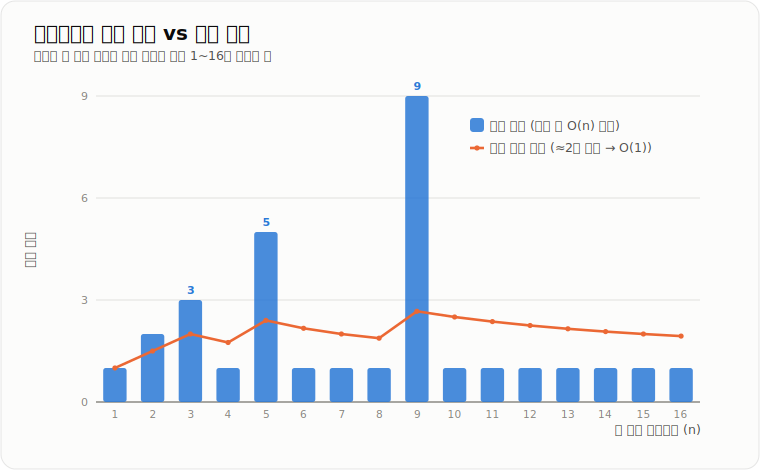
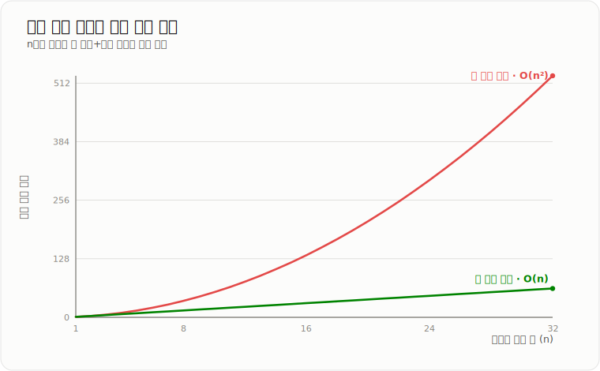

# Amortized 분석

> **여러 연산의 전체 비용을 계산한 뒤, 비싼 연산의 비용을 전체 연산에 나누어 연산당 비용을 분석하는 방법이다.**

---

## 1. 핵심 요약

* **상각 분석**은 한 번의 연산이 아니라 여러 번 연속된 연산의 전체 비용을 분석한다.
* 가끔 `O(n)`인 연산이 발생해도 전체 연산당 비용은 **상각 `O(1)`**일 수 있다.
* `ArrayList`의 마지막 삽입은 배열 확장 시 `O(n)`이지만, 연속 삽입 기준으로는 상각 `O(1)`이다.
* 상각 분석은 입력 확률을 가정하는 **평균 분석**과 다르다.
* 상각 `O(1)`은 모든 개별 연산이 항상 빠르다는 의미가 아니다.

---

## 2. 등장 배경

### 해결하려는 문제

일부 자료구조는 대부분의 연산이 빠르지만, 특정 시점에만 큰 비용이 발생한다.

대표적인 예가 Java의 `ArrayList`이다.

`ArrayList`는 내부적으로 배열을 사용한다.

내부 배열에 빈 공간이 있으면 값을 마지막 위치에 바로 저장할 수 있다.

```text
[A][B][C][ ][ ]
         ↑
      값 추가
```

이 연산은 배열 인덱스에 값을 저장하기만 하므로 `O(1)`이다.

하지만 배열이 가득 차면 더 큰 배열을 새로 만들고, 기존 데이터를 모두 복사해야 한다.

```text
기존 배열
[A][B][C][D]

더 큰 배열 생성
[ ][ ][ ][ ][ ][ ][ ][ ]

기존 데이터 복사
[A][B][C][D][ ][ ][ ][ ]

새 값 추가
[A][B][C][D][E][ ][ ][ ]
```

배열에 원소가 `n`개 있었다면 복사 비용은 `O(n)`이다.

따라서 `ArrayList.add()` 한 번의 최악 시간 복잡도만 보면 `O(n)`이다.

그러나 배열 확장은 매번 발생하지 않는다.

대부분의 추가 연산은 `O(1)`이고, 배열이 가득 찬 시점에만 드물게 `O(n)`이 발생한다.

상각 분석은 이러한 불규칙한 비용을 더 정확하게 설명하기 위해 필요하다.

### 이 개념이 없을 때

최악의 경우만 보고 모든 연산이 항상 비싸다고 판단할 수 있다.

예를 들어 다음처럼 잘못 해석할 수 있다.

```text
ArrayList.add() 한 번의 최악 비용이 O(n)
        ↓
n번 add하면 O(n²)일 것이다
```

하지만 배열 크기를 일정 비율로 증가시키면 `n`번 추가하는 전체 비용은 `O(n)`이다.

따라서 연산 한 번당 상각 비용은 `O(1)`이다.

상각 분석이 없다면 다음 문제가 생길 수 있다.

* 자료구조의 실제 성능을 지나치게 비관적으로 판단한다.
* `ArrayList`, `HashMap`, 동적 버퍼의 성능 특성을 잘못 이해한다.
* 평균 시간 복잡도와 상각 시간 복잡도를 혼동한다.
* 면접에서 `ArrayList.add()`를 단순히 `O(n)` 또는 항상 `O(1)`이라고 잘못 답한다.
* 특정 연산의 최대 지연과 장기적인 평균 처리 비용을 구분하지 못한다.

---

## 3. 핵심 개념

| 개념            | 설명                             | 중요한 이유                               |
| ------------- | ------------------------------ | ------------------------------------ |
| **개별 연산 비용**  | 특정 한 번의 연산에서 발생하는 비용           | 한 번의 최악 비용과 전체 연산당 비용을 구분하기 위해 필요하다. |
| **연산 시퀀스**    | 여러 연산이 연속으로 수행되는 과정            | 상각 분석은 단일 연산이 아니라 연속된 전체 연산을 분석한다.   |
| **전체 비용**     | 연산 시퀀스에서 발생한 모든 비용의 합          | 상각 비용을 계산하는 기준이 된다.                  |
| **상각 비용**     | 전체 연산 비용을 연산 횟수에 나누어 본 비용      | 가끔 발생하는 비싼 연산을 포함한 장기 비용을 표현한다.      |
| **최악 시간 복잡도** | 단 한 번의 연산이 가장 비쌀 때의 비용         | 특정 요청이나 연산의 최대 지연을 이해할 때 필요하다.       |
| **평균 시간 복잡도** | 입력의 확률 분포를 가정해 계산한 기대 비용       | 상각 분석과 자주 혼동되므로 차이를 알아야 한다.          |
| **동적 배열**     | 공간이 부족하면 더 큰 배열로 확장하는 배열 구조    | 상각 분석을 설명하는 대표적인 자료구조이다.             |
| **크기 증가 정책**  | 배열이 가득 찼을 때 용량을 얼마나 늘릴지 정하는 규칙 | 상각 복잡도를 결정하는 핵심 요소이다.                |
| **size**      | 실제로 저장된 원소 개수                  | 내부 배열의 전체 용량과 구분해야 한다.               |
| **capacity**  | 내부 배열이 저장할 수 있는 최대 원소 개수       | 배열 확장이 발생하는 시점을 결정한다.                |

개념 간 관계는 다음과 같다.

```text
여러 개의 개별 연산
        ↓
연산 시퀀스 구성
        ↓
각 연산의 비용을 모두 합산
        ↓
전체 비용 계산
        ↓
전체 비용 ÷ 연산 횟수
        ↓
연산당 상각 비용
```

`ArrayList`의 마지막 삽입은 대부분 `O(1)`이다.

배열이 가득 찬 경우에는 확장이 발생하므로 해당 연산은 `O(n)`이다.

하지만 배열 용량을 일정 비율로 증가시키면 확장 횟수가 점점 줄어든다.

결과적으로 `n`번 삽입의 전체 비용은 `O(n)`이 되고, 한 번당 상각 비용은 `O(1)`이 된다.

---

## 4. 구조와 동작 원리

`ArrayList`를 단순화하면 다음과 같은 구조를 가진다.

```text
ArrayList
 ├── elementData: 실제 데이터를 저장하는 내부 배열
 ├── size: 현재 저장된 원소 수
 └── capacity: 내부 배열 전체 길이
```

예를 들어 다음과 같은 상태가 있을 수 있다.

```text
elementData = [A][B][C][ ][ ]
size        = 3
capacity    = 5
```

값을 추가할 때의 전체 흐름은 다음과 같다.

```text
추가할 데이터 입력
        ↓
size와 capacity 비교
        ↓
빈 공간이 있는지 확인
        ↓
빈 공간이 있으면 현재 마지막 위치에 저장
        ↓
빈 공간이 없으면 더 큰 배열 생성
        ↓
기존 데이터를 새 배열로 복사
        ↓
새 데이터를 마지막 위치에 저장
        ↓
size 증가
        ↓
추가 완료
```

실제 동작 과정은 다음과 같다.

1. `add(value)`가 호출된다.
2. 현재 `size`와 내부 배열 길이인 `capacity`를 비교한다.
3. `size < capacity`이면 `elementData[size]` 위치에 값을 저장한다.
4. 값을 저장한 뒤 `size`를 1 증가시킨다.
5. `size == capacity`이면 내부 배열이 가득 찬 상태이다.
6. 기존 배열보다 큰 새 배열을 생성한다.
7. 기존 배열의 원소를 새 배열로 복사한다.
8. 내부 배열 참조를 새 배열로 변경한다.
9. 새 원소를 마지막 빈 공간에 저장한다.
10. 기존 배열은 더 이상 참조되지 않으면 가비지 컬렉션 대상이 된다.

배열 크기를 두 배씩 증가시킨다고 가정하면 용량은 다음처럼 변한다.

```text
1 → 2 → 4 → 8 → 16
```

원소 8개를 추가하는 경우를 보면 다음과 같다.

| 추가한 원소 | 확장 여부   | 복사한 원소 수 |
| -----: | ------- | -------: |
|      1 | 없음      |        0 |
|      2 | `1 → 2` |        1 |
|      3 | `2 → 4` |        2 |
|      4 | 없음      |        0 |
|      5 | `4 → 8` |        4 |
|      6 | 없음      |        0 |
|      7 | 없음      |        0 |
|      8 | 없음      |        0 |

전체 복사 횟수는 다음과 같다.

```text
1 + 2 + 4 = 7
```

새 값을 저장하는 작업은 8번 발생한다.

```text
새 값 저장 비용: 8
기존 값 복사 비용: 7
전체 작업 비용: 약 15
```

일반화하면 복사 비용은 다음 형태이다.

```text
1 + 2 + 4 + 8 + ... + n / 2
```

이 합은 `n`보다 작다.

```text
1 + 2 + 4 + ... + n / 2 < n
```

따라서 전체 비용은 다음과 같다.

```text
새 값 저장 비용: O(n)
기존 값 복사 비용: O(n)
전체 비용: O(n)
```

`n`번 삽입의 전체 비용이 `O(n)`이므로 연산 한 번당 비용은 상각 `O(1)`이다.



*실제 비용은 확장 시점에만 `O(n)`으로 튀지만, 연산당 상각 평균은 상수(`O(1)`)로 수렴한다.*

---

## 5. 코드 또는 사용 예시

```java
public class SimpleDynamicArray {

    private int[] elements;
    private int size;

    public SimpleDynamicArray() {
        this.elements = new int[1];
        this.size = 0;
    }

    public void add(int value) {
        if (size == elements.length) {
            grow();
        }

        elements[size] = value;
        size++;
    }

    private void grow() {
        int newCapacity = elements.length * 2;
        int[] newElements = new int[newCapacity];

        for (int i = 0; i < elements.length; i++) {
            newElements[i] = elements[i];
        }

        elements = newElements;
    }

    public int get(int index) {
        if (index < 0 || index >= size) {
            throw new IndexOutOfBoundsException();
        }

        return elements[index];
    }

    public int size() {
        return size;
    }

    public int capacity() {
        return elements.length;
    }
}
```

사용 예시는 다음과 같다.

```java
public class Main {

    public static void main(String[] args) {
        SimpleDynamicArray array = new SimpleDynamicArray();

        for (int i = 1; i <= 8; i++) {
            array.add(i);

            System.out.println(
                "value=" + i
                    + ", size=" + array.size()
                    + ", capacity=" + array.capacity()
            );
        }
    }
}
```

실행 결과는 다음과 같은 형태가 된다.

```text
value=1, size=1, capacity=1
value=2, size=2, capacity=2
value=3, size=3, capacity=4
value=4, size=4, capacity=4
value=5, size=5, capacity=8
value=6, size=6, capacity=8
value=7, size=7, capacity=8
value=8, size=8, capacity=8
```

각 부분의 역할은 다음과 같다.

* `elements`는 실제 데이터를 저장하는 내부 배열이다.
* `size`는 현재 저장된 원소 개수이다.
* `add()`는 빈 공간이 있으면 마지막 위치에 값을 저장한다.
* 배열이 가득 차면 `grow()`를 호출한다.
* `grow()`는 기존 크기의 두 배인 새 배열을 만든다.
* `for`문은 기존 데이터를 새 배열로 복사한다.
* `elements = newElements`는 내부 배열 참조를 새 배열로 교체한다.
* `get()`은 배열 인덱스를 이용하므로 `O(1)`로 조회한다.

배열 크기를 1씩 증가시키면 다음과 같이 구현할 수 있다.

```java
private void grow() {
    int[] newElements = new int[elements.length + 1];

    for (int i = 0; i < elements.length; i++) {
        newElements[i] = elements[i];
    }

    elements = newElements;
}
```

이 경우 원소를 추가할 때마다 거의 매번 복사가 발생한다.

```text
첫 번째 확장: 1개 복사
두 번째 확장: 2개 복사
세 번째 확장: 3개 복사
네 번째 확장: 4개 복사
...
```

전체 비용은 다음과 같다.

```text
1 + 2 + 3 + ... + n
```

이는 `O(n²)`이므로 연산당 상각 비용도 `O(n)`이 된다.



*크기를 한 칸씩만 늘리면 전체 비용이 `O(n²)`로 커지지만, 일정 비율(두 배)로 늘리면 `O(n)`에 머문다.*

따라서 동적 배열은 일반적으로 용량을 고정 크기만큼 늘리지 않고 일정 비율로 증가시킨다.

---

## 6. 성능 특성

`ArrayList`를 기준으로 주요 연산의 시간 복잡도는 다음과 같다.

| 연산     | 평균 시간 복잡도 | 최악 시간 복잡도 | 설명                               |
| ------ | --------: | --------: | -------------------------------- |
| 인덱스 조회 |    `O(1)` |    `O(1)` | 배열의 특정 인덱스에 바로 접근한다.             |
| 마지막 삽입 | 상각 `O(1)` |    `O(n)` | 일반적으로 바로 저장하지만 확장 시 전체 복사가 발생한다. |
| 중간 삽입  |    `O(n)` |    `O(n)` | 삽입 위치 뒤의 원소들을 한 칸씩 이동해야 한다.      |
| 값 수정   |    `O(1)` |    `O(1)` | 인덱스를 알고 있다면 해당 위치의 값을 바로 변경한다.   |
| 마지막 삭제 |    `O(1)` |    `O(1)` | 마지막 위치의 참조만 제거하면 된다.             |
| 중간 삭제  |    `O(n)` |    `O(n)` | 삭제 위치 뒤의 원소를 앞으로 이동해야 한다.        |
| 값 검색   |    `O(n)` |    `O(n)` | 앞에서부터 순차적으로 값을 비교해야 한다.          |
| 배열 확장  |    `O(n)` |    `O(n)` | 새 배열을 만들고 기존 원소를 모두 복사한다.        |

상각 분석에서 중요한 성능 관계는 다음과 같다.

```text
n번 마지막 삽입
        ↓
일반 삽입 비용 합계 O(n)
        +
배열 복사 비용 합계 O(n)
        ↓
전체 비용 O(n)
        ↓
연산 한 번당 상각 O(1)
```

공간 복잡도는 `O(n)`이다.

```text
size = 5
capacity = 8

[A][B][C][D][E][ ][ ][ ]
```

실제 데이터는 5개지만 8칸짜리 배열을 사용한다.

이는 빠른 추가 성능을 얻기 위해 여유 메모리를 사용하는 구조이다.

데이터가 많아질수록 배열 확장 한 번의 실제 비용은 커진다.

큰 배열을 확장하면 다음 비용이 발생할 수 있다.

* 더 큰 배열을 위한 힙 메모리 할당
* 기존 원소 참조 복사
* 기존 배열과 새 배열이 동시에 존재하는 일시적 메모리 증가
* 기존 배열의 가비지 컬렉션 대상화
* 특정 요청의 응답 시간 증가
* 메모리 대역폭과 CPU 사용량 증가

상각 `O(1)`은 장기적인 처리 비용을 설명한다.

특정 한 번의 삽입 지연까지 `O(1)`로 보장하는 것은 아니다.

---

## 7. 장점과 단점

| 장점                               | 이유                                       |
| -------------------------------- | ---------------------------------------- |
| 불규칙한 연산 비용을 현실적으로 설명할 수 있다.      | 가끔 발생하는 비싼 연산을 포함한 전체 비용을 분석하기 때문이다.     |
| 최악 분석보다 지나치게 비관적인 판단을 줄일 수 있다.   | 단일 연산의 최악 비용이 아니라 연속된 전체 비용을 본다.         |
| 입력 확률을 가정하지 않아도 된다.              | 평균 분석과 달리 특정 입력 분포를 전제로 하지 않는다.          |
| 동적 배열과 해시 테이블의 성능을 정확히 설명할 수 있다. | 리사이징처럼 드물게 발생하는 큰 비용을 연산 전체에 분산해 볼 수 있다. |
| 자료구조 선택 기준을 제공한다.                | 장기 처리량과 개별 최대 비용을 구분할 수 있다.              |

| 단점                          | 이유 및 주의점                                        |
| --------------------------- | ----------------------------------------------- |
| 개별 연산의 최대 지연을 보장하지 않는다.     | 상각 `O(1)`이어도 특정 확장 연산은 `O(n)`일 수 있다.            |
| 분석 대상의 내부 정책을 알아야 한다.       | 배열 증가 비율이나 리사이징 방식에 따라 결과가 달라진다.                |
| 실제 실행 시간을 직접 알려주지 않는다.      | GC, CPU 캐시, 메모리 할당, 락 경쟁 등의 실제 비용은 별도 측정이 필요하다. |
| 평균 분석과 혼동하기 쉽다.             | 둘 다 연산당 비용을 이야기하지만 계산 근거가 다르다.                  |
| 지연 시간에 민감한 시스템에서는 부족할 수 있다. | 장기 처리량은 좋아도 특정 요청의 지연이 커질 수 있다.                 |

---

## 8. 사용 기준

### 사용하기 좋은 상황

* 대부분의 연산은 저렴하고 가끔 비싼 연산이 발생하는 자료구조를 분석할 때
* 비싼 연산의 발생 빈도에 규칙이 있을 때
* 여러 연산을 연속으로 수행했을 때의 전체 비용을 알고 싶을 때
* 동적 배열의 확장 비용을 분석할 때
* 해시 테이블의 리사이징 비용을 분석할 때
* 동적 버퍼의 증가 비용을 분석할 때
* 장기적인 처리량과 전체 작업 비용이 중요한 경우

### 사용하지 않는 것이 좋은 상황

* 모든 개별 요청의 최대 응답 시간이 반드시 보장되어야 하는 경우
* 비싼 연산이 얼마나 자주 발생하는지 제한할 수 없는 경우
* 단일 연산의 최악 지연이 핵심인 경우
* 실제 밀리초 단위 성능을 확인해야 하는 경우
* GC, 네트워크, DB 락과 같은 시스템 병목을 분석하는 경우
* 단순 평균 실행 시간을 측정하려는 경우

### 선택 기준

다음 조건을 확인한 뒤 상각 분석을 적용해야 한다.

1. 여러 연산을 하나의 연속된 과정으로 볼 수 있는가
2. 대부분의 연산은 저렴하고 일부 연산만 비싼가
3. 비싼 연산이 발생하는 조건이 명확한가
4. 전체 연산 비용의 상한을 계산할 수 있는가
5. 개별 최대 지연보다 장기 처리 비용이 더 중요한가
6. 내부 확장 정책이나 리사이징 규칙을 알고 있는가

개별 요청의 지연 시간이 중요한 시스템이라면 상각 복잡도뿐 아니라 최악 시간 복잡도도 함께 확인해야 한다.

---

## 9. 비슷한 개념 비교

| 비교 항목  | 상각 분석                          | 평균 분석                        | 선택 기준                            |
| ------ | ------------------------------ | ---------------------------- | -------------------------------- |
| 목적     | 연속된 연산 전체의 연산당 비용 분석           | 입력 분포에 따른 기대 비용 분석           | 비싼 연산이 간헐적으로 발생하면 상각 분석을 사용한다.   |
| 계산 기준  | 전체 연산의 총비용                     | 입력이 등장할 확률                   | 확률 분포를 사용할 수 있으면 평균 분석을 고려한다.    |
| 확률 가정  | 필요하지 않음                        | 필요할 수 있음                     | 입력 확률을 신뢰할 수 있는지가 중요하다.          |
| 성능 보장  | 연산 시퀀스 전체 비용의 상한               | 평균적인 입력에 대한 기대 비용            | 더 강한 장기 비용 보장이 필요하면 상각 분석이 적합하다. |
| 장점     | 확률 없이 비싼 연산의 비용을 분산해 설명할 수 있다. | 현실적인 평균 입력 성능을 표현할 수 있다.     | 분석하려는 문제의 입력 특성에 따라 선택한다.        |
| 단점     | 개별 연산의 최대 지연을 보장하지 않는다.        | 입력 분포가 달라지면 분석 결과도 달라질 수 있다. | 최대 지연은 최악 분석을 함께 사용한다.           |
| 적합한 상황 | 동적 배열, 리사이징, 동적 버퍼             | 평균적인 해시 탐색, 확률적 입력           | 내부 상태 변화가 원인인지 입력 분포가 원인인지 구분한다. |

| 비교 항목            | 상각 분석                | 최악 분석                  | 선택 기준                          |
| ---------------- | -------------------- | ---------------------- | ------------------------------ |
| 목적               | 여러 연산의 장기 비용 분석      | 한 번의 최대 비용 분석          | 전체 처리량과 개별 지연 중 무엇이 중요한지 판단한다. |
| 분석 대상            | 연속된 연산               | 단일 연산 또는 가장 불리한 입력     | 실시간 제한이 있으면 최악 분석이 중요하다.       |
| ArrayList 마지막 삽입 | 상각 `O(1)`            | `O(n)`                 | 두 복잡도는 동시에 성립한다.               |
| 장점               | 실제 반복 사용 성능을 잘 설명한다. | 최대 지연을 보수적으로 판단할 수 있다. | 운영 요구사항에 따라 함께 사용한다.           |
| 단점               | 특정 연산의 지연을 숨길 수 있다.  | 실제보다 지나치게 비관적일 수 있다.   | 하나만 사용하지 않고 두 관점을 구분한다.        |
| 적합한 상황           | 대량의 연속 삽입, 전체 처리량 분석 | 응답 제한 시간, 실시간 처리       | 최대 지연이 중요하면 최악 분석을 우선한다.       |

---

## 10. 백엔드 실무 적용

### Spring·Java

Java에서 상각 분석이 가장 직접적으로 연결되는 대상은 컬렉션이다.

#### ArrayList

```java
List<OrderResponse> responses = new ArrayList<>();

for (Order order : orders) {
    responses.add(OrderResponse.from(order));
}
```

리스트 마지막 위치에 추가하는 `add()`는 상각 `O(1)`이다.

조회 결과 개수를 알고 있다면 초기 용량을 지정할 수 있다.

```java
List<OrderResponse> responses = new ArrayList<>(orders.size());

for (Order order : orders) {
    responses.add(OrderResponse.from(order));
}
```

초기 용량을 지정하면 배열 확장과 복사 횟수를 줄일 수 있다.

하지만 필요 이상으로 큰 초기 용량을 설정하면 메모리를 낭비한다.

#### HashMap

`HashMap`도 내부 배열이 일정 수준 이상 차면 더 큰 배열로 확장한다.

```java
Map<Long, User> userMap = new HashMap<>();

for (User user : users) {
    userMap.put(user.getId(), user);
}
```

일반적인 `put()`은 빠르지만 리사이징이 발생하는 시점에는 많은 엔트리를 재배치해야 한다.

연속된 삽입 전체를 보면 일반적으로 상각 `O(1)`로 설명한다.

#### StringBuilder

`StringBuilder`도 내부 저장 공간이 부족하면 더 큰 공간을 확보하고 기존 데이터를 복사한다.

```java
StringBuilder builder = new StringBuilder();

for (String value : values) {
    builder.append(value);
}
```

반복적인 문자열 연결 과정에서도 동적 배열과 유사한 확장 비용이 발생한다.

### 데이터베이스·캐시

상각 분석은 DB 쿼리 자체의 복잡도를 직접 설명하는 개념은 아니다.

하지만 DB에서 가져온 데이터를 Java 컬렉션에 담는 과정과 연결된다.

```text
DB 대량 조회
        ↓
조회 결과를 ArrayList에 저장
        ↓
리스트 확장과 데이터 복사
        ↓
전체 메모리 사용량 증가
        ↓
GC 증가 및 응답 지연
```

`add()`가 상각 `O(1)`이라고 해도 조회한 데이터가 `n`개라면 전체 저장 비용은 `O(n)`이다.

데이터가 매우 많다면 다음 방법을 고려해야 한다.

* 페이징 조회
* 커서 기반 조회
* 스트리밍 처리
* 청크 단위 처리
* Spring Batch
* 한 번에 메모리에 적재하는 데이터 제한

캐시 구현에서도 내부 해시 테이블의 확장이나 만료 데이터 정리 과정에서 비슷한 비용 패턴이 나타날 수 있다.

다만 Redis 서버 내부 구현이나 분산 캐시의 네트워크 비용까지 상각 분석 하나로 설명할 수는 없다.

### 동시성·분산 환경

상각 시간 복잡도와 스레드 안전성은 서로 다른 개념이다.

```java
List<Integer> values = new ArrayList<>();
```

여러 스레드가 같은 `ArrayList`에 동시에 값을 추가하면 다음 문제가 생길 수 있다.

* 같은 배열 위치에 동시에 값을 저장할 수 있다.
* `size` 증가 결과가 유실될 수 있다.
* 배열 확장 과정에서 잘못된 상태가 관찰될 수 있다.
* 데이터가 누락되거나 리스트 상태가 깨질 수 있다.

`ArrayList.add()`가 상각 `O(1)`이라는 것은 동시 접근에 안전하다는 의미가 아니다.

동시성이 필요한 경우 상황에 따라 다음을 고려한다.

* 외부 동기화
* `Collections.synchronizedList`
* `CopyOnWriteArrayList`
* 동시성 컬렉션
* 스레드별 리스트 사용 후 결과 병합

분산 환경에서는 서버마다 별도의 JVM과 메모리를 사용한다.

한 서버의 `ArrayList` 확장 비용은 다른 서버와 공유되지 않는다.

분산 시스템에서 중요한 네트워크 비용, 데이터 정합성, 장애 복구는 상각 분석과 별도의 문제이다.

---

## 11. 자주 하는 오해

| 잘못된 이해                           | 올바른 이해                                         |
| -------------------------------- | ---------------------------------------------- |
| 상각 분석은 여러 번 실행한 시간의 평균이다.        | 상각 분석은 연속된 연산의 총비용을 수학적으로 분석하는 방법이다.           |
| 상각 `O(1)`이면 모든 연산이 항상 `O(1)`이다.  | 특정 연산은 `O(n)`일 수 있지만 전체 연산당 비용이 `O(1)`이다.      |
| 상각 시간 복잡도와 평균 시간 복잡도는 같다.        | 평균 분석은 입력 확률을 사용할 수 있고, 상각 분석은 전체 연산 비용을 분석한다. |
| `ArrayList.add()`는 항상 `O(1)`이다.  | 마지막 삽입은 상각 `O(1)`이지만 배열 확장 시 `O(n)`이다.         |
| `ArrayList`의 모든 삽입은 상각 `O(1)`이다. | 중간 또는 앞 삽입은 원소 이동 때문에 `O(n)`이다.                |
| 상각 `O(1)`이면 데이터가 아무리 많아도 문제가 없다. | 전체 저장 비용은 `O(n)`이고 메모리와 GC 문제가 발생할 수 있다.       |
| 배열 확장은 객체 전체를 복제한다.              | 객체 리스트에서는 일반적으로 객체 자체가 아니라 객체 참조가 새 배열로 복사된다.  |
| 초기 용량은 무조건 크게 설정하는 것이 좋다.        | 예상 크기에 맞는 적절한 용량을 사용해야 하며 과도한 설정은 메모리를 낭비한다.   |
| Big-O가 같으면 실제 실행 성능도 같다.         | 실제 성능은 CPU, 메모리, GC, 캐시 적중률, 구현 방식에 따라 달라진다.   |
| 상각 복잡도가 좋으면 응답 지연도 항상 안정적이다.     | 전체 처리량은 좋아도 확장이 발생한 특정 요청은 느려질 수 있다.           |

---

## 12. 면접 답변

### 기본 답변

상각 분석은 여러 번 연속해서 수행되는 연산의 전체 비용을 계산한 뒤, 이를 연산당 비용으로 나누어 분석하는 방법입니다.

대표적인 예가 `ArrayList`의 마지막 삽입입니다. 대부분은 내부 배열의 빈 공간에 값을 저장하기 때문에 `O(1)`이지만, 배열이 가득 차면 더 큰 배열을 만들고 기존 원소를 복사해야 해서 해당 연산은 `O(n)`이 됩니다.

하지만 배열 크기를 일정 비율로 늘리면 확장이 발생하는 횟수가 점점 줄어듭니다. 따라서 `n`번 삽입의 전체 비용은 `O(n)`이고, 한 번당 상각 시간 복잡도는 `O(1)`이 됩니다.

다만 상각 `O(1)`은 모든 개별 연산이 항상 빠르다는 뜻은 아닙니다. 특정 확장 시점에는 응답 지연과 메모리 할당 비용이 발생할 수 있으므로, 최대 지연이 중요한 시스템에서는 최악 시간 복잡도도 함께 봐야 합니다.

### 답변 구조

* **정의**

    * 여러 연산의 전체 비용을 합산한 뒤 연산당 비용으로 나누어 분석한다.

* **내부 원리**

    * 대부분의 저렴한 연산과 가끔 발생하는 비싼 연산의 비용을 함께 합산한다.
    * 동적 배열은 용량을 일정 비율로 늘려 전체 복사 비용을 `O(n)`으로 제한한다.

* **복잡도**

    * `ArrayList` 마지막 삽입: 상각 `O(1)`, 확장 시점만 `O(n)`
    * `n`번 연속 삽입 전체: `O(n)`
    * 크기를 한 칸씩만 늘리는 경우: 전체 `O(n²)`, 연산당 상각 `O(n)`

* **장점**

    * 반복 연산의 현실적인 장기 성능을 설명할 수 있다.
    * 입력 확률을 가정하지 않는다.

* **단점**

    * 특정 한 번의 최대 지연은 보장하지 않는다.
    * 실제 메모리 할당과 GC 비용은 별도로 확인해야 한다.

* **사용 기준**

    * 대부분의 연산은 저렴하고 일부만 비싸며, 비싼 연산의 발생 조건이 명확할 때 사용한다.

* **대안과 비교**

    * 평균 분석은 입력 확률을 가정하지만, 상각 분석은 확률 없이 전체 연산 비용을 본다.
    * 개별 요청의 최대 지연이 중요하면 최악 분석을 함께 사용한다.

* **실무 적용 사례**

    * `ArrayList`, `HashMap`, `StringBuilder`의 내부 배열 확장 비용을 설명할 때 사용한다.

---

## 13. 예상 면접 질문

### 기본 질문

1. **상각 분석이란 무엇인가요?**

    * 핵심 키워드: 연속된 연산, 전체 비용, 연산당 비용, 확률 가정 없음

2. **`ArrayList.add()`의 시간 복잡도는 무엇인가요?**

    * 핵심 키워드: 마지막 삽입, 일반 `O(1)`, 확장 `O(n)`, 상각 `O(1)`

3. **상각 시간 복잡도와 평균 시간 복잡도의 차이는 무엇인가요?**

    * 핵심 키워드: 입력 확률, 연산 시퀀스, 전체 비용, 기대 비용

4. **동적 배열이 크기를 두 배씩 늘리는 이유는 무엇인가요?**

    * 핵심 키워드: 확장 빈도 감소, 등비수열, 전체 복사 `O(n)`, 상각 `O(1)`

5. **배열 크기를 한 칸씩 증가시키면 어떤 문제가 발생하나요?**

    * 핵심 키워드: 매번 복사, `1 + 2 + ... + n`, 전체 `O(n²)`

6. **상각 `O(1)`은 개별 연산도 항상 `O(1)`이라는 뜻인가요?**

    * 핵심 키워드: 아님, 특정 연산 `O(n)`, 전체 연산당 비용

### 꼬리 질문

1. **`ArrayList`의 중간 삽입도 상각 `O(1)`인가요?**

    * 핵심 키워드: 원소 이동, `O(n)`, 마지막 삽입과 구분

2. **초기 용량을 설정하면 어떤 장단점이 있나요?**

    * 핵심 키워드: 리사이징 감소, 복사 감소, 메모리 낭비, 예상 크기

3. **상각 `O(1)`인데도 특정 요청이 느려질 수 있는 이유는 무엇인가요?**

    * 핵심 키워드: 배열 확장, 새 배열 할당, 데이터 복사, GC, 최대 지연

4. **`ArrayList`에 객체가 들어 있을 때 배열 확장 시 객체 전체가 복사되나요?**

    * 핵심 키워드: 객체 참조 복사, 객체 자체는 동일, 새 배열

5. **`HashMap.put()`과 상각 분석은 어떤 관계가 있나요?**

    * 핵심 키워드: 내부 테이블, 로드 팩터, 리사이징, 엔트리 재배치

6. **대량 데이터를 `ArrayList`에 담을 때 상각 `O(1)`만 보면 안 되는 이유는 무엇인가요?**

    * 핵심 키워드: 전체 `O(n)`, 공간 `O(n)`, 힙 메모리, GC, 페이징, 스트리밍

7. **상각 분석이 실시간 시스템에서 충분하지 않은 이유는 무엇인가요?**

    * 핵심 키워드: 개별 최악 지연, 응답 시간 제한, tail latency

---

## 14. 추가 학습 방향

### 바로 이어서 공부

| 키워드                 | 연결되는 이유                                                |
| ------------------- | ------------------------------------------------------ |
| **Big-O 표기법**       | 상각 비용을 `O(1)`, `O(n)` 등의 형태로 정확하게 표현하기 위해 필요하다.        |
| **동적 배열**           | 상각 분석의 가장 대표적인 적용 대상이다.                                |
| **등비수열**            | `1 + 2 + 4 + 8` 형태의 복사 비용 합계를 이해하는 데 필요하다.             |
| **ArrayList 내부 구조** | `size`, `capacity`, 내부 배열 확장 과정을 실제 Java 구조와 연결할 수 있다. |
| **최선·평균·최악 복잡도**    | 상각 복잡도와 다른 분석 기준을 혼동하지 않기 위해 필요하다.                     |

### 실무 확장

| 키워드                     | 연결되는 이유                                     |
| ----------------------- | ------------------------------------------- |
| **HashMap 리사이징**        | 내부 테이블 확장과 엔트리 재배치에 상각 분석이 적용된다.            |
| **StringBuilder 내부 구조** | 문자열 버퍼 확장이 동적 배열과 유사하게 동작한다.                |
| **컬렉션 초기 용량**           | 리사이징 횟수와 메모리 사용량의 균형을 판단할 수 있다.             |
| **페이징과 스트리밍**           | 상각 `O(1)`과 전체 메모리 `O(n)`의 차이를 실무에 적용할 수 있다. |
| **Spring Batch 청크 처리**  | 대량 데이터를 한 번에 메모리에 올리지 않고 나누어 처리하는 방법이다.     |
| **JMH 벤치마크**            | 이론적인 복잡도와 실제 JVM 실행 성능의 차이를 확인할 수 있다.       |

### 심화 학습

| 키워드              | 연결되는 이유                                       |
| ---------------- | --------------------------------------------- |
| **집계 분석**        | 전체 연산 비용을 직접 합산하는 가장 기본적인 상각 분석 방법이다.         |
| **회계 방법**        | 저렴한 연산에 비용을 미리 부과해 미래의 비싼 연산 비용을 설명한다.        |
| **잠재 함수 방법**     | 자료구조 상태에 저장된 잠재 비용으로 복잡한 상각 분석을 수행한다.         |
| **Union-Find**   | 경로 압축과 랭크 합치기의 상각 복잡도를 학습할 수 있다.              |
| **Tail Latency** | 상각 성능과 개별 요청의 최악 지연 차이를 운영 관점에서 이해할 수 있다.     |
| **JVM 메모리와 GC**  | 대형 배열 할당과 복사가 실제 애플리케이션 지연에 미치는 영향을 이해할 수 있다. |
| **점진적 리사이징**     | 한 번에 발생하는 큰 확장 비용을 여러 연산으로 분산하는 방식을 학습할 수 있다. |

---

## 15. 최종 체크리스트

* [ ] 개념을 한 문장으로 설명할 수 있다
* [ ] 등장 배경을 설명할 수 있다
* [ ] 내부 동작 과정을 설명할 수 있다
* [ ] 성능 특성을 설명할 수 있다
* [ ] 장점과 단점을 설명할 수 있다
* [ ] 사용할 상황과 사용하지 않을 상황을 구분할 수 있다
* [ ] 비슷한 기술과 비교할 수 있다
* [ ] Spring 백엔드 실무 사례를 설명할 수 있다
* [ ] 기본 면접 질문에 답할 수 있다
* [ ] 조건이 달라졌을 때 대안을 제시할 수 있다

---

## 16. 한 줄 결론

**대부분의 연산은 저렴하지만 가끔 비싼 연산이 발생한다면, 단일 최악 비용만 보지 말고 연속된 전체 비용을 기준으로 상각 복잡도를 판단해야 한다.**
