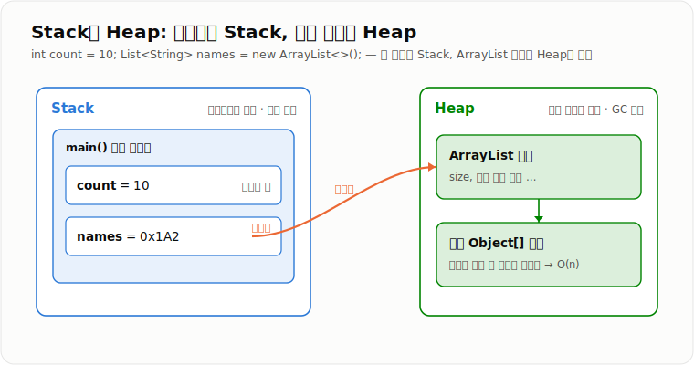
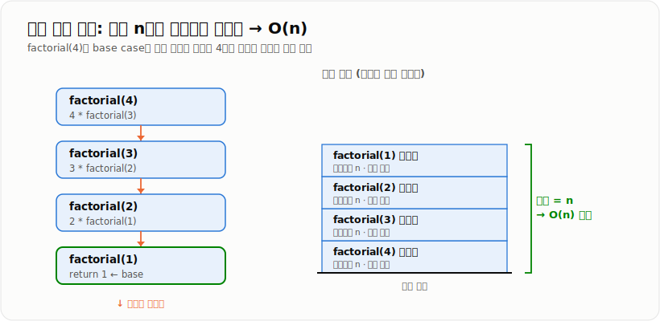

# 공간복잡도

> **공간 복잡도는 입력 데이터의 크기가 증가할 때 알고리즘이 추가로 사용하는 메모리 공간이 어떤 비율로 증가하는지를 나타내는 척도다.**

---

## 1. 핵심 요약

* **공간 복잡도**는 입력 크기 `n`이 증가할 때 메모리 사용량이 어떻게 증가하는지 나타낸다.
* 알고리즘 문제에서는 보통 입력 데이터를 제외한 **보조 공간 복잡도**를 중심으로 계산한다.
* 배열, 리스트, Map, Set 등에 최대 `n`개의 데이터를 저장하면 일반적으로 `O(n)` 공간을 사용한다.
* 재귀 호출은 호출 깊이만큼 **호출 스택**이 쌓이므로 공간 복잡도에 포함해야 한다.
* 실무에서는 공간 복잡도뿐 아니라 **요청당 메모리 × 동시 요청 수**도 함께 고려해야 한다.

---

## 2. 등장 배경

### 해결하려는 문제

프로그램이 실행되려면 변수, 객체, 배열, 컬렉션, 메서드 호출 정보 등을 메모리에 저장해야 한다.

하지만 서버와 JVM이 사용할 수 있는 메모리는 제한되어 있다.

입력 데이터가 작을 때는 정상적으로 동작하던 코드도 데이터가 증가하면 다음 문제가 발생할 수 있다.

* Java 객체가 과도하게 생성된다.
* Heap 메모리 사용량이 급격하게 증가한다.
* 가비지 컬렉션이 자주 실행된다.
* 응답 속도가 느려진다.
* `OutOfMemoryError`가 발생한다.
* 재귀 호출이 깊어져 `StackOverflowError`가 발생한다.

공간 복잡도는 다음 질문에 답하기 위해 필요하다.

> 입력 데이터가 계속 증가해도 이 알고리즘을 제한된 메모리 안에서 실행할 수 있는가?

백엔드 실무에서는 다음 상황에서 공간 복잡도를 고려한다.

* 대용량 데이터베이스 조회
* 대용량 파일 업로드 및 다운로드
* Spring Batch의 데이터 처리
* 캐시와 Redis 데이터 저장
* 재귀 기반 데이터 탐색
* JSON 요청 및 응답 처리
* 동시 요청이 많은 API
* 정렬, 집계, 중복 검사

### 이 개념이 없을 때

공간 사용량을 분석하지 않으면 다음과 같은 문제가 생길 수 있다.

* `findAll()`로 수백만 건의 데이터를 한 번에 조회한다.
* 큰 파일 전체를 `byte[]`로 메모리에 올린다.
* 캐시 데이터를 만료 없이 계속 저장한다.
* 큰 리스트를 여러 번 복사한다.
* 재귀 호출의 최대 깊이를 고려하지 않는다.
* 요청 하나의 메모리만 확인하고 동시 요청 수를 고려하지 않는다.
* Big-O가 같다는 이유로 실제 메모리 사용량도 같다고 판단한다.

이러한 문제는 개발 환경에서는 드러나지 않다가 데이터와 트래픽이 증가한 운영 환경에서 장애로 이어질 수 있다.

---

## 3. 핵심 개념

| 개념                | 설명                                                       | 중요한 이유                                      |
| ----------------- | -------------------------------------------------------- | ------------------------------------------- |
| **입력 크기 `n`**     | 알고리즘이 처리하는 데이터의 크기다. 배열 길이, 회원 수, 주문 수, 파일 크기 등이 될 수 있다. | 공간 복잡도는 `n`이 증가할 때 메모리가 어떻게 증가하는지를 분석한다.    |
| **공간 복잡도**        | 입력 크기에 따른 메모리 사용량의 증가율이다.                                | 데이터가 많아졌을 때 메모리 부족 가능성을 예측할 수 있다.           |
| **Big-O 표기법**     | 메모리 증가 추세를 `O(1)`, `O(n)`, `O(n²)` 등으로 표현하는 방법이다.        | 정확한 바이트보다 데이터 증가에 따른 확장성을 비교하기 쉽다.          |
| **전체 공간 복잡도**     | 입력 데이터와 알고리즘이 사용하는 추가 공간을 모두 포함한다.                       | 프로그램 전체가 사용하는 메모리를 판단할 때 필요하다.              |
| **보조 공간 복잡도**     | 입력 데이터를 제외하고 알고리즘이 추가로 사용하는 메모리다.                        | 알고리즘 면접에서 주로 묻는 공간 복잡도 기준이다.                |
| **고정 공간**         | 입력 크기와 관계없이 일정하게 사용되는 메모리다.                              | 변수 몇 개만 사용하는 경우 `O(1)`로 판단할 수 있다.           |
| **가변 공간**         | 입력 크기에 따라 증가하는 메모리다.                                     | 배열, 리스트, Map처럼 데이터 수에 따라 메모리가 증가한다.         |
| **호출 스택**         | 메서드 호출 정보와 지역 변수를 저장하는 Stack 영역이다.                       | 재귀 호출 시 호출 깊이만큼 스택 프레임이 쌓인다.                |
| **스택 프레임**        | 메서드 한 번의 호출에 필요한 매개변수, 지역 변수, 복귀 위치 등을 저장하는 공간이다.        | 재귀 알고리즘의 공간 복잡도를 계산할 때 반드시 포함해야 한다.         |
| **Heap**          | Java 객체, 배열, 컬렉션이 주로 생성되는 메모리 영역이다.                      | 대용량 객체 생성은 Heap 부족과 GC 증가로 이어질 수 있다.        |
| **In-place 알고리즘** | 입력 데이터를 직접 수정해 추가 공간을 거의 사용하지 않는 알고리즘이다.                 | 추가 메모리를 줄일 수 있지만 원본 데이터가 변경된다.              |
| **시간-공간 트레이드오프**  | 메모리를 더 사용해 실행 시간을 줄이거나, 메모리를 줄이는 대신 계산을 더 수행하는 관계다.      | HashMap, HashSet, 캐시 사용 여부를 결정할 때 중요한 기준이다. |
| **최악의 경우**        | 알고리즘이 사용할 수 있는 최대 메모리 상황이다.                              | 공간 부족 가능성을 보수적으로 판단하기 위해 사용한다.              |

공간 복잡도를 계산할 때는 다음 순서로 판단한다.

1. 입력 크기 `n`이 무엇인지 확인한다.
2. 입력 외에 새 배열, 리스트, Map, Set이 생성되는지 확인한다.
3. 추가 자료구조에 최대 몇 개의 데이터가 저장되는지 확인한다.
4. 재귀 호출이 있다면 최대 호출 깊이를 확인한다.
5. 입력 크기가 증가할 때 추가 메모리가 어떤 비율로 증가하는지 계산한다.

예를 들어 입력 배열의 최댓값만 구하는 코드는 변수 몇 개만 추가로 사용하므로 보조 공간 복잡도가 `O(1)`이다.

반면 입력 배열과 같은 크기의 결과 배열을 새로 만들면 `O(n)`의 보조 공간을 사용한다.

---

## 4. 구조와 동작 원리

```text
입력 데이터 전달
        ↓
입력 크기 n 확인
        ↓
변수·객체·배열·컬렉션 생성
        ↓
Stack 또는 Heap 메모리 사용
        ↓
데이터 처리 및 결과 저장
        ↓
결과 반환
        ↓
더 이상 참조되지 않는 객체는 GC 대상이 됨
```

Java 메모리는 개념적으로 다음과 같이 나눌 수 있다.

```text
Java 애플리케이션
│
├─ Stack
│   ├─ 메서드 호출 정보
│   ├─ 지역 변수
│   ├─ 매개변수
│   └─ 객체를 가리키는 참조값
│
└─ Heap
    ├─ 객체
    ├─ 배열
    ├─ ArrayList 내부 배열
    ├─ HashMap 내부 구조
    └─ 요청·응답 DTO
```

예를 들어 다음 코드가 있다고 가정한다.

```java
int count = 10;
List<String> names = new ArrayList<String>();
```

메모리 구조는 개념적으로 다음과 같다.

```text
Stack
┌──────────────────────┐
│ count = 10           │
│ names = 참조값 ───────────────┐
└──────────────────────┘        │
                                ↓
Heap
┌───────────────────────────────┐
│ ArrayList 객체                │
│ 내부 Object[] 배열            │
└───────────────────────────────┘
```



*기본형 변수와 객체 참조값은 Stack 프레임에, `new`로 만든 실제 객체와 내부 배열은 Heap에 저장된다.*

실제 동작 과정은 다음과 같다.

1. 메서드가 호출되면 해당 스레드의 Stack에 스택 프레임이 생성된다.
2. 기본형 지역 변수와 객체 참조값이 스택 프레임에 저장된다.
3. `new`를 사용해 생성한 객체와 배열은 Heap에 저장된다.
4. 배열이나 컬렉션에 데이터가 추가되면 Heap 사용량이 증가한다.
5. 메서드가 종료되면 해당 스택 프레임은 제거된다.
6. Heap 객체를 더 이상 참조하지 않으면 가비지 컬렉션 대상이 된다.
7. 입력 데이터가 증가하면서 추가 객체 수도 증가하면 공간 복잡도는 `O(n)` 이상이 될 수 있다.

재귀 호출에서는 메서드가 끝나기 전에 자기 자신을 다시 호출한다.

```text
factorial(4)
    ↓
factorial(3)
    ↓
factorial(2)
    ↓
factorial(1)
```

호출 스택에는 다음과 같이 스택 프레임이 쌓인다.

```text
┌──────────────────┐
│ factorial(1)     │
├──────────────────┤
│ factorial(2)     │
├──────────────────┤
│ factorial(3)     │
├──────────────────┤
│ factorial(4)     │
└──────────────────┘
```



*재귀는 base case에 닿기 전까지 호출 프레임이 동시에 스택에 남으므로, 최대 호출 깊이가 곧 공간 복잡도가 된다.*

재귀 깊이가 `n`이면 최대 `n`개의 스택 프레임이 필요하므로 공간 복잡도는 일반적으로 `O(n)`이다.

---

## 5. 코드 또는 사용 예시

### `O(1)` 보조 공간 예제

```java
public class MaxFinder {

    public int findMax(int[] numbers) {
        int max = numbers[0];

        for (int i = 1; i < numbers.length; i++) {
            if (numbers[i] > max) {
                max = numbers[i];
            }
        }

        return max;
    }
}
```

각 부분의 역할은 다음과 같다.

* `numbers`는 입력 배열이다.
* `max`는 현재까지 발견한 최댓값을 저장한다.
* `i`는 배열을 순회하기 위한 인덱스다.
* 입력 데이터가 증가해도 `max`와 `i`의 개수는 변하지 않는다.
* 시간 복잡도는 모든 값을 확인하므로 `O(n)`이다.
* 보조 공간 복잡도는 추가 변수만 사용하므로 `O(1)`이다.

---

### `O(n)` 보조 공간 예제

```java
public class ArrayCopier {

    public int[] copy(int[] numbers) {
        int[] copied = new int[numbers.length];

        for (int i = 0; i < numbers.length; i++) {
            copied[i] = numbers[i];
        }

        return copied;
    }
}
```

각 부분의 역할은 다음과 같다.

* 입력 배열의 크기가 `n`이다.
* `copied`는 입력 배열과 같은 크기로 생성된다.
* 입력 크기가 2배가 되면 복사 배열의 크기도 2배가 된다.
* 시간 복잡도는 `O(n)`이다.
* 보조 공간 복잡도는 `O(n)`이다.

---

### 시간-공간 트레이드오프 예제

추가 자료구조를 사용하지 않고 중복을 검사하는 방법이다.

```java
public class DuplicateChecker {

    public boolean hasDuplicate(int[] numbers) {
        for (int i = 0; i < numbers.length; i++) {
            for (int j = i + 1; j < numbers.length; j++) {
                if (numbers[i] == numbers[j]) {
                    return true;
                }
            }
        }

        return false;
    }
}
```

이 방식은 모든 숫자 쌍을 비교한다.

* 시간 복잡도: `O(n²)`
* 보조 공간 복잡도: `O(1)`

HashSet을 사용하면 메모리를 더 사용하는 대신 시간을 줄일 수 있다.

```java
import java.util.HashSet;
import java.util.Set;

public class DuplicateChecker {

    public boolean hasDuplicateUsingSet(int[] numbers) {
        Set<Integer> visited = new HashSet<Integer>();

        for (int i = 0; i < numbers.length; i++) {
            if (visited.contains(numbers[i])) {
                return true;
            }

            visited.add(numbers[i]);
        }

        return false;
    }
}
```

동작 과정은 다음과 같다.

```text
입력: [3, 7, 2, 7]

3 확인 → visited = {3}
7 확인 → visited = {3, 7}
2 확인 → visited = {3, 7, 2}
7 확인 → 이미 존재 → 중복 발견
```

평균적인 경우:

* 시간 복잡도: `O(n)`
* 보조 공간 복잡도: `O(n)`

HashSet에 최대 `n`개의 값이 저장될 수 있기 때문에 공간 복잡도가 `O(n)`이다.

---

### 재귀와 반복문의 공간 차이

재귀 방식이다.

```java
public class FactorialCalculator {

    public int factorialRecursive(int n) {
        if (n == 1) {
            return 1;
        }

        return n * factorialRecursive(n - 1);
    }
}
```

* 시간 복잡도: `O(n)`
* 공간 복잡도: `O(n)`
* 호출 깊이만큼 스택 프레임이 생성된다.

반복문 방식이다.

```java
public class FactorialCalculator {

    public int factorialLoop(int n) {
        int result = 1;

        for (int i = 1; i <= n; i++) {
            result = result * i;
        }

        return result;
    }
}
```

* 시간 복잡도: `O(n)`
* 공간 복잡도: `O(1)`
* `result`와 `i` 변수만 반복해서 재사용한다.

---

### In-place 배열 뒤집기

```java
public class ArrayReverser {

    public void reverse(int[] numbers) {
        int left = 0;
        int right = numbers.length - 1;

        while (left < right) {
            int temp = numbers[left];
            numbers[left] = numbers[right];
            numbers[right] = temp;

            left++;
            right--;
        }
    }
}
```

이 코드는 새로운 배열을 만들지 않고 입력 배열을 직접 수정한다.

추가로 사용하는 변수는 다음과 같다.

* `left`
* `right`
* `temp`

입력 크기와 상관없이 변수 개수는 일정하므로 보조 공간 복잡도는 `O(1)`이다.

단, 원본 배열의 순서가 변경된다.

---

## 6. 성능 특성

공간 복잡도는 특정 자료구조가 아니라 알고리즘을 분석하는 기준이다.

따라서 조회, 삽입, 수정, 삭제 비용보다 시간 복잡도와 메모리 사용량의 관계를 중심으로 판단한다.

| 처리 방식         |    시간 복잡도 |  공간 복잡도 | 설명                        |
| ------------- | --------: | ------: | ------------------------- |
| 배열 순회로 최댓값 찾기 |    `O(n)` |  `O(1)` | 모든 값을 확인하지만 추가 변수만 사용한다.  |
| 배열 전체 복사      |    `O(n)` |  `O(n)` | 입력 크기와 같은 결과 배열을 생성한다.    |
| 이중 반복문 중복 검사  |   `O(n²)` |  `O(1)` | 메모리는 적게 사용하지만 비교 횟수가 많다.  |
| HashSet 중복 검사 | 평균 `O(n)` |  `O(n)` | 데이터를 저장하는 대신 중복 검사가 빨라진다. |
| 재귀 팩토리얼       |    `O(n)` |  `O(n)` | 호출 깊이만큼 스택 프레임이 쌓인다.      |
| 반복문 팩토리얼      |    `O(n)` |  `O(1)` | 같은 변수를 반복해서 사용한다.         |
| `n × n` 배열 생성 |   `O(n²)` | `O(n²)` | 총 `n²`개의 데이터를 저장한다.       |

대표적인 공간 복잡도는 다음과 같다.

| 공간 복잡도     | 의미                            | 예시                      |
| ---------- | ----------------------------- | ----------------------- |
| `O(1)`     | 입력 크기와 관계없이 일정한 추가 메모리를 사용한다. | 합계, 최댓값, 두 값 교환         |
| `O(log n)` | 입력이 증가해도 메모리가 천천히 증가한다.       | 균형 잡힌 재귀 탐색의 호출 스택      |
| `O(n)`     | 입력 크기에 비례해 메모리가 증가한다.         | 배열 복사, HashSet, HashMap |
| `O(n²)`    | 입력 크기의 제곱만큼 메모리가 증가한다.        | 인접 행렬, `n × n` 배열       |
| `O(2ⁿ)`    | 입력 증가에 따라 메모리가 매우 빠르게 증가한다.   | 모든 부분집합을 저장하는 경우        |

Big-O가 같더라도 실제 메모리 사용량은 다를 수 있다.

예를 들어 다음 구조는 모두 `O(n)`이다.

```java
int[] numbers = new int[1000000];
```

```java
List<Integer> numbers = new ArrayList<Integer>();
```

하지만 `List<Integer>`는 다음 메모리 구조가 추가될 수 있다.

* `ArrayList` 객체
* 내부 `Object[]` 배열
* 각 원소를 가리키는 참조값
* 각 `Integer` 객체

따라서 Big-O는 메모리 증가 추세를 비교하는 도구이며 정확한 바이트 수를 알려주지는 않는다.

실무 메모리 사용량은 다음과 같이 생각할 수 있다.

```text
전체 메모리 사용량
≈ 요청당 메모리 사용량
× 동시 요청 수
+ 캐시 사용량
+ 스레드 Stack
+ JVM 기본 메모리
+ Native Memory
```

예를 들어 요청 하나가 100MB를 사용하고 동시에 50개가 처리되면 중간 데이터만 약 5GB가 필요할 수 있다.

```text
100MB × 50개 요청 = 5,000MB
```

---

## 7. 장점과 단점

공간 복잡도는 기술 자체가 아니라 코드와 알고리즘을 평가하는 기준이다.

따라서 공간을 적게 사용하는 방식과 추가 메모리를 사용하는 방식을 비교한다.

| 장점                      | 이유                                                                |
| ----------------------- | ----------------------------------------------------------------- |
| 메모리 한계를 사전에 예측할 수 있다    | 입력 데이터 증가에 따른 메모리 사용량을 분석할 수 있다.                                  |
| 대용량 데이터 처리 방식을 선택할 수 있다 | 일괄 적재 대신 페이지네이션, Chunk, 스트리밍을 선택할 근거가 된다.                         |
| 동시 요청 상황을 고려할 수 있다      | 요청 하나의 메모리가 전체 서버 메모리에 미치는 영향을 계산할 수 있다.                          |
| 자료구조 선택 기준을 제공한다        | HashMap, HashSet, 배열 등 자료구조의 시간과 공간 비용을 함께 비교할 수 있다.              |
| 메모리 장애를 예방할 수 있다        | `OutOfMemoryError`, `StackOverflowError`, GC 증가 가능성을 미리 판단할 수 있다. |

| 단점                            | 이유 및 주의점                                     |
| ----------------------------- | -------------------------------------------- |
| 정확한 메모리 사용량을 알려주지 않는다         | Big-O는 증가율만 표현하며 객체 헤더, 참조 크기, JVM 구현은 생략한다. |
| 공간 복잡도가 작다고 실제 메모리도 작은 것은 아니다 | 500MB의 고정 버퍼도 이론적으로는 `O(1)`일 수 있다.           |
| 공간만 줄이면 실행 시간이 증가할 수 있다       | Map이나 Set을 사용하지 않으면 동일 계산과 탐색을 반복해야 할 수 있다.  |
| 원본을 직접 수정하면 부작용이 생길 수 있다      | In-place 알고리즘은 메모리를 줄이지만 입력 데이터가 변경된다.       |
| 실무에서는 동시성과 객체 생명주기도 확인해야 한다   | 알고리즘 단위 공간 복잡도만으로 서버 전체 메모리를 판단할 수 없다.       |

---

## 8. 사용 기준

### 사용하기 좋은 상황

공간 복잡도 분석은 다음 상황에서 반드시 필요하다.

* 입력 데이터 크기가 계속 증가할 수 있는 경우
* 데이터베이스에서 대량 데이터를 조회하는 경우
* 대용량 파일을 업로드하거나 다운로드하는 경우
* Spring Batch로 수십만 건 이상을 처리하는 경우
* 요청당 큰 리스트나 Map을 생성하는 경우
* 재귀 호출을 사용하는 경우
* 캐시에 많은 데이터를 저장하는 경우
* 동시 요청이 많은 API를 설계하는 경우
* 서버 메모리가 제한된 환경에서 실행하는 경우

추가 메모리를 사용하는 방식이 적합한 상황은 다음과 같다.

* 데이터 크기가 작고 최대 크기가 명확한 경우
* 실행 속도가 매우 중요한 경우
* 반복 계산 결과를 재사용할 수 있는 경우
* HashMap이나 HashSet으로 탐색 시간을 크게 줄일 수 있는 경우
* 원본 데이터를 보존해야 하는 경우

### 사용하지 않는 것이 좋은 상황

다음 상황에서는 입력 전체를 메모리에 저장하는 방식을 피하는 것이 좋다.

* 입력 크기에 상한이 없는 경우
* 수백 MB 이상의 파일을 처리하는 경우
* 전체 데이터를 `findAll()`로 조회하는 경우
* 요청이 동시에 많이 실행되는 경우
* 캐시에 만료 정책이나 최대 크기가 없는 경우
* 큰 리스트를 반복적으로 복사하는 경우
* 재귀 호출 깊이를 예측할 수 없는 경우

공간을 줄이기 위해 In-place 방식을 사용하지 않는 것이 좋은 상황도 있다.

* 입력 원본을 유지해야 하는 경우
* 여러 객체나 스레드가 입력 데이터를 공유하는 경우
* 데이터 변경으로 인한 부작용을 추적하기 어려운 경우

### 선택 기준

알고리즘이나 자료구조를 선택하기 전에 다음 조건을 확인한다.

1. 입력 크기 `n`의 최대값은 얼마인가?
2. 요청 하나가 만드는 객체와 컬렉션 크기는 얼마인가?
3. 동시에 몇 개의 요청이 실행될 수 있는가?
4. 메모리를 추가로 사용하면 처리 시간을 얼마나 줄일 수 있는가?
5. 원본 데이터 변경이 허용되는가?
6. 데이터 전체를 한 번에 메모리에 올려야 하는가?
7. 페이지네이션, Chunk, 스트리밍으로 나눌 수 있는가?
8. 캐시의 최대 크기와 TTL이 설정되어 있는가?
9. 재귀 호출 깊이를 제한할 수 있는가?
10. 실제 객체 구조의 메모리 오버헤드는 어느 정도인가?

---

## 9. 비슷한 개념 비교

### 시간 복잡도와 공간 복잡도

| 비교 항목  | 공간 복잡도                      | 시간 복잡도                      | 선택 기준                       |
| ------ | --------------------------- | --------------------------- | --------------------------- |
| 목적     | 입력 증가에 따른 메모리 사용량 분석        | 입력 증가에 따른 실행 횟수와 처리 시간 분석   | 메모리 한계와 응답 시간을 함께 고려한다.     |
| 주요 질문  | 얼마나 많은 메모리가 필요한가?           | 얼마나 오래 걸리는가?                | 서버 자원 중 어느 부분이 병목인지 확인한다.   |
| 분석 대상  | 배열, 객체, 컬렉션, 호출 스택          | 반복문, 탐색, 정렬, 비교 횟수          | 자료구조와 알고리즘 전체를 분석한다.        |
| 장점     | OOM과 메모리 확장성을 예측할 수 있다.     | 처리 지연과 확장성을 예측할 수 있다.       | 둘 중 하나만 보지 않고 함께 판단한다.      |
| 단점     | 정확한 바이트와 객체 오버헤드는 표현하지 않는다. | CPU 속도와 실제 실행 시간은 표현하지 않는다. | 실제 측정과 부하 테스트가 추가로 필요하다.    |
| 적합한 상황 | 대용량 데이터, 파일, 캐시, 동시 요청      | 검색, 정렬, API 응답 시간           | 운영 환경의 메모리와 성능 제한에 따라 결정한다. |

### In-place 방식과 복사 방식

| 비교 항목  | In-place 방식             | 복사 방식                          | 선택 기준                        |
| ------ | ----------------------- | ------------------------------ | ---------------------------- |
| 목적     | 입력을 직접 수정해 추가 메모리를 줄인다. | 원본을 유지하며 새로운 결과를 만든다.          | 원본 변경 허용 여부를 먼저 확인한다.        |
| 성능     | 보조 공간이 대체로 `O(1)`이다.    | 입력 크기에 따라 `O(n)` 공간이 필요할 수 있다. | 메모리 제한이 중요하면 In-place를 고려한다. |
| 장점     | 추가 배열과 복사 비용을 줄일 수 있다.  | 원본을 보존하고 변경 영향을 분리할 수 있다.      | 안정성과 불변성이 중요하면 복사 방식을 사용한다.  |
| 단점     | 원본 데이터가 변경된다.           | 메모리와 복사 시간이 추가된다.              | 공유 데이터는 직접 수정하지 않는 것이 안전하다.  |
| 적합한 상황 | 원본 변경이 가능하고 메모리가 제한된 경우 | 원본 보존이 필요하거나 독립된 결과가 필요한 경우    | 데이터 공유 여부와 부작용 가능성을 고려한다.    |

### 일괄 처리와 스트리밍 처리

| 비교 항목  | 일괄 적재                       | 스트리밍 처리                  | 선택 기준                         |
| ------ | --------------------------- | ------------------------ | ----------------------------- |
| 목적     | 전체 데이터를 메모리에 올려 한 번에 처리한다.  | 데이터를 작은 단위로 순차 처리한다.     | 데이터 크기와 메모리 제한을 확인한다.         |
| 성능     | 전체 데이터 연산이 쉽지만 메모리 사용량이 크다. | 메모리 사용량을 일정하게 제한할 수 있다.  | 대용량 데이터는 스트리밍이 유리하다.          |
| 장점     | 구현과 전체 데이터 집계가 단순하다.        | 대용량 파일과 데이터 처리에 안정적이다.   | 데이터가 작으면 일괄 처리가 단순하다.         |
| 단점     | 데이터가 크면 OOM이 발생할 수 있다.      | 재처리와 오류 처리 구조가 복잡할 수 있다. | 장애 처리와 순서 보장이 필요하면 설계를 보완한다.  |
| 적합한 상황 | 크기가 작고 상한이 명확한 데이터          | 크기가 크거나 상한이 불명확한 데이터     | 운영 환경에서 최대 데이터 크기를 기준으로 선택한다. |

---

## 10. 백엔드 실무 적용

### Spring·Java

Java의 객체, 배열, 컬렉션은 주로 Heap에 생성된다.

```java
List<Order> orders = new ArrayList<Order>();
Map<Long, Order> orderMap = new HashMap<Long, Order>();
Set<Long> orderIds = new HashSet<Long>();
```

각 자료구조에 최대 `n`개의 데이터가 저장된다면 공간 복잡도는 일반적으로 `O(n)`이다.

하지만 실제 메모리 사용량은 자료구조별로 다르다.

* 배열은 값 또는 참조를 연속된 공간에 저장한다.
* `ArrayList`는 내부 배열을 사용한다.
* `HashMap`은 버킷 배열과 엔트리 구조를 사용한다.
* `LinkedList`는 각 노드가 데이터와 연결 정보를 저장한다.

따라서 모두 `O(n)`이어도 객체와 참조가 많은 자료구조가 실제 메모리를 더 사용할 수 있다.

Spring MVC에서는 요청 하나를 처리하는 과정에서도 여러 객체가 생성된다.

```text
HTTP 요청 바이트
        ↓
서버 입력 버퍼
        ↓
Jackson JSON 파싱
        ↓
Request DTO 생성
        ↓
Service 처리 객체 생성
        ↓
Response DTO 생성
        ↓
JSON 직렬화
        ↓
HTTP 응답
```

요청 JSON이 크면 다음 메모리가 함께 증가할 수 있다.

* 네트워크 입력 버퍼
* 요청 문자열과 파싱 데이터
* Request DTO
* Entity 또는 Domain 객체
* Response DTO
* 직렬화 결과

따라서 요청 하나의 데이터 크기뿐 아니라 동시 요청 수도 고려해야 한다.

대용량 데이터를 처리할 때는 다음 방식을 사용할 수 있다.

* 페이지네이션
* 커서 기반 조회
* Spring Batch Chunk
* 스트리밍 처리
* 필요한 컬럼만 조회
* DTO 또는 Projection 조회
* 컬렉션 중복 생성 최소화

### 데이터베이스·캐시

다음 코드는 데이터베이스의 모든 사용자 데이터를 조회한다.

```java
List<User> users = userRepository.findAll();
```

조회 과정은 개념적으로 다음과 같다.

```text
DB 조회
   ↓
ResultSet 생성
   ↓
User Entity n개 생성
   ↓
영속성 컨텍스트에 등록
   ↓
List에 Entity 참조 저장
   ↓
응답 객체 생성
```

사용자 수가 `n`명이면 최대 `n`개의 Entity와 리스트 참조가 생성되므로 메모리 사용량도 데이터 수에 비례한다.

대량 조회에서는 다음 방법을 고려한다.

* `Pageable`을 이용한 페이지네이션
* 커서 기반 조회
* 필요한 컬럼만 DTO로 조회
* Spring Batch Chunk 처리
* 일정 단위 처리 후 영속성 컨텍스트 초기화
* 전체 결과를 반환하지 않는 API 설계

캐시는 대표적인 시간-공간 트레이드오프다.

```text
DB 조회 결과
    ↓
Redis 또는 로컬 캐시에 저장
    ↓
다음 요청에서 빠르게 조회
```

캐시의 장점은 다음과 같다.

* DB 조회 횟수를 줄인다.
* 반복 계산을 줄인다.
* API 응답 시간을 줄인다.

그 대가로 다음 비용이 발생한다.

* 메모리 사용량 증가
* TTL 관리
* 최대 크기 제한
* 삭제 정책 관리
* 캐시와 원본 데이터 사이의 정합성 문제

캐시에는 최소한 다음 정책이 필요하다.

* 최대 저장량
* TTL
* 메모리 부족 시 제거 정책
* 캐시할 데이터의 크기
* 캐시 키 개수
* 캐시 무효화 방법

### 동시성·분산 환경

Java의 각 스레드는 자신만의 Stack을 가진다.

```text
Thread 1 → Stack 1
Thread 2 → Stack 2
Thread 3 → Stack 3
```

스레드 수가 증가하면 스레드 Stack이 사용하는 전체 메모리도 증가한다.

요청마다 큰 리스트를 생성하면 동시 요청 수에 비례해 Heap 사용량도 증가할 수 있다.

```text
요청 1 → List 100MB
요청 2 → List 100MB
요청 3 → List 100MB
...
```

따라서 실무에서는 다음과 같이 판단해야 한다.

```text
요청당 메모리
× 동시 요청 수
× 서버 인스턴스 수
```

여러 서버로 분산한다고 해서 요청 하나의 메모리 문제가 사라지는 것은 아니다.

각 서버 인스턴스가 동일한 대용량 요청을 처리하면 각 인스턴스에서 OOM이 발생할 수 있다.

분산 환경에서는 다음 항목을 함께 확인한다.

* 인스턴스당 Heap 크기
* 인스턴스당 최대 동시 요청 수
* 로컬 캐시의 중복 저장량
* Redis와 같은 분산 캐시의 전체 메모리
* 큰 응답이 네트워크 버퍼에 미치는 영향
* 작업 큐에 대기 중인 메시지 크기와 수
* 처리 속도보다 요청이 빠르게 유입되는 상황

대용량 트래픽에서는 요청 하나의 메모리를 조금 줄이는 것도 전체 자원 사용량에 큰 영향을 준다.

예를 들어 요청당 1MB를 줄이고 동시에 1,000개 요청을 처리한다면 약 1GB의 차이가 발생할 수 있다.

```text
1MB × 1,000개 요청 = 1,000MB
```

---

## 11. 자주 하는 오해

| 잘못된 이해                                  | 올바른 이해                                                  |
| --------------------------------------- | ------------------------------------------------------- |
| `O(1)`은 메모리를 전혀 사용하지 않는다는 뜻이다.          | `O(1)`은 입력 크기가 증가해도 추가 메모리 사용량이 일정하다는 뜻이다.              |
| `O(1)`이면 실제 메모리 사용량도 항상 작다.             | 고정 크기 500MB 버퍼도 입력과 무관하다면 이론적으로 `O(1)`일 수 있다.           |
| 반복문이 `n`번 실행되면 공간 복잡도도 `O(n)`이다.        | 반복 횟수는 시간 복잡도와 관련 있다. 같은 변수를 재사용하면 공간은 `O(1)`일 수 있다.    |
| 리스트 변수 하나만 선언했으므로 공간 복잡도는 `O(1)`이다.     | 변수는 참조값 하나지만 리스트 내부에는 최대 `n`개의 데이터 참조가 저장된다.            |
| 입력 데이터는 공간 복잡도에서 항상 제외한다.               | 전체 공간에는 입력을 포함하고, 보조 공간에는 입력을 제외한다. 기준을 명확히 해야 한다.      |
| 재귀 코드에서 배열을 만들지 않으면 공간 복잡도는 `O(1)`이다.   | 재귀 호출마다 스택 프레임이 생성되므로 호출 깊이를 공간 복잡도에 포함해야 한다.           |
| 두 코드가 모두 `O(n)`이면 실제 메모리 사용량도 같다.       | Big-O는 증가 추세만 나타낸다. 객체 헤더, 참조, 내부 자료구조에 따라 실제 사용량은 다르다. |
| 메모리를 적게 사용하는 코드가 항상 더 좋다.               | 메모리를 더 사용해 실행 시간을 크게 줄이는 것이 유리할 수 있다.                   |
| `findAll()`의 문제는 DB 조회 시간이 오래 걸리는 것뿐이다. | 조회 결과가 Entity와 List로 Heap에 올라오기 때문에 메모리 문제도 발생한다.       |
| 서버를 여러 대로 늘리면 메모리 문제는 자동으로 해결된다.        | 요청 하나가 인스턴스 메모리보다 크거나 각 서버에서 동일하게 누적되면 OOM은 계속 발생한다.    |
| GC가 객체를 정리하므로 메모리 사용량은 신경 쓰지 않아도 된다.    | 살아 있는 객체가 많거나 생성 속도가 빠르면 GC로도 해결할 수 없고 응답 지연이 증가한다.     |

---

## 12. 면접 답변

### 기본 답변

공간 복잡도는 입력 데이터의 크기가 증가할 때 알고리즘이 사용하는 메모리가 어떤 비율로 증가하는지를 나타내는 지표입니다.

알고리즘 면접에서는 보통 입력을 제외하고 추가로 사용하는 보조 공간을 기준으로 설명합니다. 예를 들어 배열을 순회하면서 최댓값만 저장하면 추가 변수 개수가 일정하므로 공간 복잡도는 `O(1)`입니다. 반면 입력 크기만큼 새로운 배열이나 HashSet을 만들면 `O(n)`입니다.

또한 재귀 호출은 호출 깊이만큼 스택 프레임이 쌓이므로 공간 복잡도에 포함해야 합니다. 실무에서는 대용량 DB 조회, 파일 처리, 캐시, Spring Batch에서 중요하며, 요청 하나의 공간 복잡도뿐 아니라 동시 요청 수까지 함께 고려해야 합니다.

### 답변 구조

* **정의**

    * 입력 크기에 따른 메모리 사용량의 증가율
    * Big-O 표기법 사용, 보통 입력을 제외한 보조 공간 기준

* **내부 원리**

    * 기본형 변수와 참조값은 Stack에, `new`로 만든 객체·배열은 Heap에 저장
    * 재귀 호출은 호출 깊이만큼 스택 프레임이 누적됨

* **복잡도**

    * `O(1)`: 변수 몇 개만 재사용 (합계, 최댓값, In-place 알고리즘)
    * `O(n)`: 입력 크기만큼 배열·리스트·HashSet 생성
    * `O(n)`: 재귀 호출 깊이만큼 스택 프레임 누적
    * `O(n²)`: `n × n` 배열처럼 데이터를 제곱만큼 저장

* **장점**

    * 데이터 증가에 따른 메모리 한계를 사전에 예측
    * OOM과 StackOverflowError 가능성을 미리 판단
    * 자료구조와 처리 방식 선택 근거 제공

* **단점**

    * 정확한 바이트 수는 알 수 없음 (객체 헤더, 참조 크기 등은 생략)
    * 같은 Big-O라도 실제 메모리 사용량은 자료구조마다 다를 수 있음
    * 공간만 줄이면 처리 시간이 늘어날 수 있음

* **사용 기준**

    * 입력 크기 상한이 있는가, 동시 요청 수는 어느 정도인가
    * 원본 데이터 변경이 허용되는가, 처리 시간을 줄이기 위해 메모리를 더 써도 되는가

* **대안과 비교**

    * 시간 복잡도와 함께 봐야 함 (시간-공간 트레이드오프)
    * In-place 방식 vs 복사 방식, 일괄 적재 vs 스트리밍 처리 중 상황에 맞게 선택

* **실무 적용 사례**

    * `findAll()` 대신 페이지네이션·커서 기반 조회
    * 대용량 파일은 스트리밍, 대량 배치는 Spring Batch Chunk
    * 캐시는 TTL과 최대 크기를 반드시 함께 설계

---

## 13. 예상 면접 질문

### 기본 질문

1. **공간 복잡도란 무엇인가요?**

    핵심 키워드:

    * 입력 크기
    * 메모리 사용량 증가율
    * Big-O
    * 보조 공간

2. **전체 공간 복잡도와 보조 공간 복잡도의 차이는 무엇인가요?**

    핵심 키워드:

    * 입력 포함 여부
    * 추가 메모리
    * 분석 기준 명시

3. **공간 복잡도 `O(1)`은 무엇을 의미하나요?**

    핵심 키워드:

    * 입력 크기와 무관
    * 일정한 추가 메모리
    * 0바이트가 아님

4. **시간 복잡도가 `O(n)`이고 공간 복잡도가 `O(1)`인 예를 들어주세요.**

    핵심 키워드:

    * 배열 순회
    * 합계 또는 최댓값
    * 변수 재사용
    * 추가 자료구조 없음

5. **배열을 복사하는 알고리즘의 공간 복잡도는 어떻게 되나요?**

    핵심 키워드:

    * 입력 크기 `n`
    * 새로운 배열
    * 보조 공간 `O(n)`

6. **HashSet을 사용한 중복 검사의 공간 복잡도가 `O(n)`인 이유는 무엇인가요?**

    핵심 키워드:

    * 최악의 경우
    * 모든 값이 서로 다름
    * 최대 `n`개 저장

7. **재귀 호출의 공간 복잡도는 어떻게 계산하나요?**

    핵심 키워드:

    * 호출 스택
    * 스택 프레임
    * 최대 재귀 깊이
    * StackOverflowError

8. **시간-공간 트레이드오프란 무엇인가요?**

    핵심 키워드:

    * 추가 메모리 사용
    * 계산과 조회 시간 단축
    * HashMap
    * HashSet
    * 캐시

### 꼬리 질문

1. **두 알고리즘의 공간 복잡도가 모두 `O(n)`이면 실제 메모리 사용량도 같나요?**

    핵심 키워드:

    * 상수 차이
    * 객체 헤더
    * 참조값
    * 내부 자료구조
    * Big-O의 한계

2. **반복문이 `n`번 실행되는데 공간 복잡도가 `O(1)`일 수 있는 이유는 무엇인가요?**

    핵심 키워드:

    * 시간과 공간 구분
    * 동일 변수 재사용
    * 추가 저장 공간 없음

3. **In-place 알고리즘의 장점과 단점은 무엇인가요?**

    핵심 키워드:

    * 추가 공간 절약
    * 원본 데이터 변경
    * 부작용
    * 공유 데이터

4. **Spring Data JPA의 `findAll()`이 메모리 문제를 일으킬 수 있는 이유는 무엇인가요?**

    핵심 키워드:

    * Entity 객체 생성
    * List 저장
    * 영속성 컨텍스트
    * 데이터 수에 비례한 Heap 증가

5. **1GB 파일을 `byte[]`로 읽는 API에 동시 요청이 20개 들어오면 어떤 문제가 생길 수 있나요?**

    핵심 키워드:

    * 요청당 파일 크기만큼 메모리
    * 동시 요청과 메모리 곱
    * OOM
    * 스트리밍

6. **Redis 캐시는 공간 복잡도와 어떤 관계가 있나요?**

    핵심 키워드:

    * 시간-공간 트레이드오프
    * 메모리 사용
    * TTL
    * 최대 크기
    * 삭제 정책

7. **서버의 메모리가 충분하다면 공간 복잡도를 신경 쓰지 않아도 되나요?**

    핵심 키워드:

    * 데이터 증가
    * 동시 요청
    * GC 비용
    * 메모리 상한
    * 확장성

8. **재귀를 반복문으로 바꾸면 항상 공간 복잡도가 `O(1)`이 되나요?**

    핵심 키워드:

    * 추가 자료구조 여부
    * 명시적 Stack
    * 반복문 자체가 보장하지 않음
    * 알고리즘 구조 확인

---

## 14. 추가 학습 방향

### 바로 이어서 공부

| 키워드                  | 연결되는 이유                                     |
| -------------------- | ------------------------------------------- |
| **시간 복잡도**           | 알고리즘의 실행 시간과 메모리 사용량을 함께 비교해야 올바른 선택이 가능하다. |
| **Big-O 표기법**        | 공간 복잡도의 증가율을 정확히 표현하려면 상수 제거와 지배항 개념이 필요하다. |
| **배열과 ArrayList**    | 같은 `O(n)` 공간이라도 내부 구조와 실제 메모리 사용량이 다르다.     |
| **HashMap과 HashSet** | 추가 메모리를 사용해 조회와 중복 검사 시간을 줄이는 대표적인 자료구조다.   |
| **재귀와 호출 스택**        | 재귀 깊이가 공간 복잡도와 StackOverflowError에 직접 연결된다. |
| **In-place 알고리즘**    | 입력을 직접 수정해 보조 공간을 줄이는 대표적인 방법이다.            |

### 실무 확장

| 키워드                    | 연결되는 이유                                       |
| ---------------------- | --------------------------------------------- |
| **JVM 메모리 구조**         | Heap, Stack, Metaspace가 실제 Java 메모리 사용과 연결된다. |
| **가비지 컬렉션**            | 객체 생성량과 객체 생명주기가 GC 횟수와 응답 지연에 영향을 준다.        |
| **JPA 영속성 컨텍스트**       | 대량 조회 시 Entity가 1차 캐시에 누적되어 메모리가 증가할 수 있다.    |
| **Spring Batch Chunk** | 전체 데이터를 한 번에 메모리에 올리지 않고 일정 단위로 처리한다.         |
| **페이지네이션**             | 조회 결과의 최대 크기를 제한해 요청당 메모리 사용량을 줄인다.           |
| **파일 스트리밍**            | 파일 전체를 메모리에 적재하지 않고 버퍼 단위로 처리한다.              |
| **캐시 TTL과 제거 정책**      | 캐시 데이터가 무제한으로 증가하지 않도록 메모리 상한을 관리한다.          |
| **부하 테스트**             | 동시 요청이 증가할 때 실제 Heap과 응답 시간이 어떻게 변하는지 확인한다.   |

### 심화 학습

| 키워드                 | 연결되는 이유                                          |
| ------------------- | ------------------------------------------------ |
| **Heap Dump 분석**    | OOM 발생 시 어떤 객체가 메모리를 많이 차지하는지 확인할 수 있다.          |
| **Memory Leak**     | 사용하지 않는 객체가 참조에 남아 GC되지 않는 문제를 이해할 수 있다.         |
| **GC 알고리즘**         | 메모리 할당과 회수 과정이 응답 지연에 미치는 영향을 분석할 수 있다.          |
| **Off-heap Memory** | Java Heap 외부의 메모리를 사용하는 방식과 장단점을 이해할 수 있다.       |
| **DirectBuffer**    | 네트워크와 파일 처리에서 Native Memory를 사용하는 구조를 이해할 수 있다.  |
| **Backpressure**    | 처리 속도보다 데이터 유입 속도가 빠를 때 메모리 누적을 제어할 수 있다.        |
| **분산 캐시 메모리 관리**    | 여러 서버가 공유하는 캐시의 용량과 제거 정책을 설계할 수 있다.             |
| **객체 메모리 구조**       | 객체 헤더, 정렬, 참조 크기 등 실제 Java 객체의 메모리 비용을 분석할 수 있다. |

---

## 15. 최종 체크리스트

* [ ] 개념을 한 문장으로 설명할 수 있다
* [ ] 등장 배경을 설명할 수 있다
* [ ] 내부 동작 과정을 설명할 수 있다
* [ ] 성능 특성을 설명할 수 있다
* [ ] 장점과 단점을 설명할 수 있다
* [ ] 사용할 상황과 사용하지 않을 상황을 구분할 수 있다
* [ ] 비슷한 기술과 비교할 수 있다
* [ ] Spring 백엔드 실무 사례를 설명할 수 있다
* [ ] 기본 면접 질문에 답할 수 있다
* [ ] 조건이 달라졌을 때 대안을 제시할 수 있다

---

## 16. 한 줄 결론

> **공간 복잡도는 입력 크기뿐 아니라 생성되는 객체 수, 재귀 깊이, 동시 요청 수를 함께 고려하여 제한된 메모리 안에서 안정적으로 처리할 수 있는 방식을 선택하는 기준이다.**
