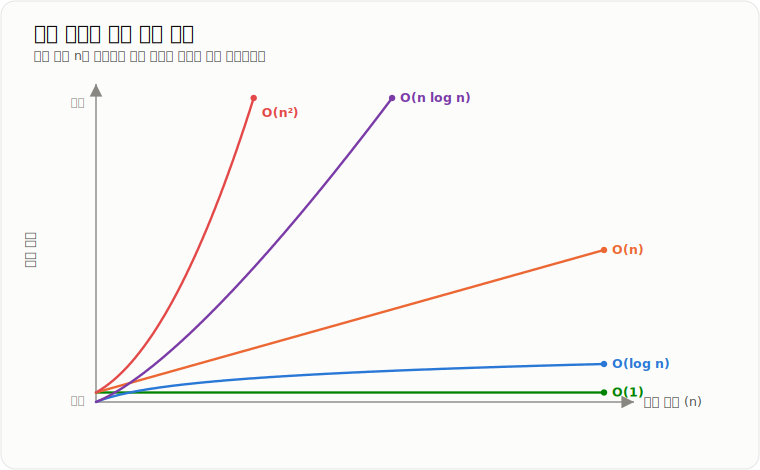
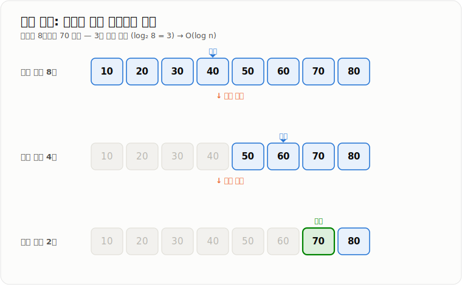

# BIG-O

> **Big-O는 입력 데이터의 크기가 증가할 때 알고리즘의 실행 시간이나 추가 메모리 사용량이 어떤 비율로 증가하는지를 표현하는 표기법이다.**

---

## 1. 핵심 요약

* **Big-O는 실제 실행 시간을 측정하는 방법이 아니라, 입력 크기에 따른 비용의 증가율을 표현한다.**
* 대표적인 시간 복잡도는 `O(1)`, `O(log n)`, `O(n)`, `O(n log n)`, `O(n²)`이다.
* Big-O에서는 상수와 낮은 차수보다 데이터가 커질수록 가장 크게 영향을 주는 항을 중요하게 본다.
* 같은 Big-O라도 실제 성능은 CPU, 메모리, 네트워크, DB 호출 비용에 따라 크게 달라질 수 있다.
* 백엔드에서는 컬렉션 선택, DB 인덱스, 캐시, 반복 조회, 대용량 처리의 성능을 판단할 때 사용한다.

---

## 2. 등장 배경

### 해결하려는 문제

같은 문제를 해결하는 코드라도 데이터의 크기가 커지면 성능 차이가 크게 벌어질 수 있다.

예를 들어 회원 목록에서 특정 회원을 찾는다고 가정한다.

```text
회원 10명
→ 처음부터 찾아도 큰 문제가 없음

회원 1,000만 명
→ 매 요청마다 전체를 순회하면 응답 시간이 크게 증가할 수 있음
```

단순히 실행 시간을 초 단위로 측정하면 컴퓨터 성능, JVM 상태, 운영체제, 네트워크 등 실행 환경의 영향을 많이 받는다.

Big-O는 이런 환경 차이를 제외하고 다음 질문에 답하기 위해 사용한다.

```text
데이터가 증가할 때
필요한 연산 횟수는 어떤 비율로 증가하는가?
```

### 이 개념이 없을 때

Big-O 관점 없이 코드를 작성하면 작은 테스트 데이터에서는 정상적으로 동작하지만, 실제 데이터가 많아졌을 때 성능 문제가 발생할 수 있다.

대표적인 문제는 다음과 같다.

* 반복문 안에서 다시 전체 목록을 탐색한다.
* 같은 데이터를 찾기 위해 List를 계속 순회한다.
* DB 인덱스 없이 대량 데이터를 조회한다.
* 요청마다 전체 데이터를 메모리에 올린다.
* 반복문 안에서 DB나 외부 API를 호출한다.
* 시간 복잡도만 보고 메모리 사용량을 무시한다.

예를 들어 주문과 회원을 연결하기 위해 두 목록을 중첩 반복하면 데이터가 커질수록 비교 횟수가 급격히 증가한다.

```text
주문 100,000건
회원 100,000명

100,000 × 100,000
= 최대 10,000,000,000번 비교
```

---

## 3. 핵심 개념

| 개념                        | 설명                                                       | 중요한 이유                                     |
| ------------------------- | -------------------------------------------------------- | ------------------------------------------ |
| **입력 크기 `n`**             | 처리해야 하는 데이터의 개수다. 배열 길이, 회원 수, 주문 수 등이 될 수 있다.           | 어떤 값을 기준으로 성능이 증가하는지 정하기 위해 필요하다.          |
| **연산 횟수**                 | 입력을 처리하면서 비교, 조회, 삽입, 계산 등이 수행되는 횟수다.                    | 실제 시간 대신 알고리즘 구조를 객관적으로 비교할 수 있다.          |
| **시간 복잡도**                | 입력 크기가 증가할 때 실행 연산 수가 증가하는 형태다.                          | 데이터가 많아졌을 때 처리 시간이 얼마나 증가할지 판단할 수 있다.      |
| **공간 복잡도**                | 입력 크기가 증가할 때 추가로 필요한 메모리의 증가 형태다.                        | 속도를 높이기 위해 메모리를 얼마나 사용하는지 판단할 수 있다.        |
| **상수 시간 `O(1)`**          | 입력 크기와 무관하게 일정한 횟수로 처리한다.                                | 데이터가 증가해도 연산 횟수가 증가하지 않는다.                 |
| **로그 시간 `O(log n)`**      | 한 번 처리할 때마다 탐색 범위를 절반 정도로 줄인다.                           | 데이터가 많아져도 연산 횟수가 천천히 증가한다.                 |
| **선형 시간 `O(n)`**          | 입력 데이터의 개수만큼 처리한다.                                       | 전체 탐색, 전체 합계 계산 등에서 자주 나타난다.               |
| **선형 로그 시간 `O(n log n)`** | 전체 데이터를 여러 단계에 걸쳐 처리한다.                                  | 효율적인 정렬 알고리즘에서 자주 나타난다.                    |
| **제곱 시간 `O(n²)`**         | 입력 크기만큼 반복하면서 내부에서 다시 입력 크기만큼 반복한다.                      | 데이터 증가 시 연산 수가 매우 빠르게 늘어난다.                |
| **최선의 경우**                | 가장 유리한 입력에서 발생하는 최소 비용이다.                                | 알고리즘이 가장 빨리 끝나는 상황을 설명한다.                  |
| **평균적인 경우**               | 일반적인 입력에서 기대되는 비용이다.                                     | 실제 사용 상황에 가까운 성능을 판단할 때 사용한다.              |
| **최악의 경우**                | 가장 불리한 입력에서 발생하는 최대 비용이다.                                | 서비스의 성능 한계와 장애 가능성을 판단할 때 중요하다.            |
| **상수 제거**                 | `O(2n)`을 `O(n)`으로 표현하는 것이다.                              | 상수보다 입력 증가에 따른 전체 증가 형태가 더 중요하기 때문이다.      |
| **낮은 차수 제거**              | `O(n² + n + 10)`을 `O(n²)`으로 표현하는 것이다.                    | 데이터가 커질수록 가장 빠르게 증가하는 항이 전체 비용을 지배하기 때문이다. |
| **시간-공간 트레이드오프**          | 실행 시간을 줄이기 위해 추가 메모리를 사용하거나, 메모리를 줄이기 위해 연산을 더 수행하는 관계다. | 성능 최적화에는 항상 비용과 대가가 함께 존재하기 때문이다.          |

개념 간 관계는 다음과 같다.

```text
입력 크기 n
    ↓
주요 연산이 몇 번 수행되는지 분석
    ↓
시간 복잡도 계산
    ↓
추가 메모리 사용량 분석
    ↓
공간 복잡도 계산
    ↓
데이터 증가 시 확장 가능성 판단
```

예를 들어 List에서 값을 찾으면 최대 `n`개의 원소를 확인하므로 시간 복잡도는 `O(n)`이다.

반면 List를 HashMap으로 변환하면 Map 생성에 `O(n)`이 필요하지만, 이후 키 조회는 평균적으로 `O(1)`에 가능하다.

---

## 4. 구조와 동작 원리

Big-O는 JVM 내부에서 실행되는 기능이나 라이브러리가 아니다.

개발자가 코드의 연산 구조를 분석하기 위한 수학적 표현이다.

```text
입력 데이터 크기 확인
        ↓
반복문·재귀·조회 연산 분석
        ↓
입력 크기에 따른 연산 횟수 계산
        ↓
상수와 낮은 차수 제거
        ↓
시간 복잡도와 공간 복잡도 표현
        ↓
데이터 증가 시 성능 변화 판단
```

실제 분석 과정은 다음과 같다.

1. **입력 데이터가 무엇인지 정한다.**

   * 배열 길이
   * 회원 수
   * 주문 수
   * 문자열 길이

2. **입력 크기에 따라 반복되는 연산을 찾는다.**

   * 반복문
   * 중첩 반복문
   * 재귀 호출
   * List 조회
   * Map 조회

3. **주요 연산이 몇 번 수행되는지 식으로 표현한다.**

   * 한 번 수행: `1`
   * 전체 순회: `n`
   * 두 번 전체 순회: `2n`
   * 중첩 전체 순회: `n²`

4. **상수와 낮은 차수를 제거한다.**

   * `O(2n)` → `O(n)`
   * `O(n² + n)` → `O(n²)`

5. **추가 메모리 사용량을 분석한다.**

   * 변수 몇 개만 사용: `O(1)`
   * 입력 크기만큼 배열이나 Map 생성: `O(n)`

6. **실제 시스템 비용과 함께 판단한다.**

   * CPU 연산
   * DB 호출
   * 네트워크 왕복
   * 메모리 사용
   * 락 경합
   * 디스크 I/O

### 복잡도 증가 형태



*입력 크기 `n`이 커질수록 각 복잡도의 연산 횟수가 벌어지는 형태. 같은 시작점에서 출발해도 `O(n²)`은 급격히, `O(log n)`·`O(1)`은 거의 평평하게 증가한다.*

```text
O(1)
상수 시간
입력 증가와 무관

O(log n)
탐색 범위를 반복해서 절반으로 감소

O(n)
입력 데이터 전체를 한 번 처리

O(n log n)
전체 데이터를 여러 단계로 처리

O(n²)
입력 데이터마다 전체 데이터를 다시 처리
```

일반적인 증가 순서는 다음과 같다.

```text
O(1)
  ↓
O(log n)
  ↓
O(n)
  ↓
O(n log n)
  ↓
O(n²)
  ↓
O(2ⁿ)
  ↓
O(n!)
```

---

## 5. 코드 또는 사용 예시

### `O(1)` 배열 인덱스 조회

```java
public int getFirst(int[] numbers) {
    return numbers[0];
}
```

배열 크기가 10개든 100만 개든 첫 번째 위치에 한 번 접근한다.

```text
시간 복잡도: O(1)
공간 복잡도: O(1)
```

`numbers[0]`은 인덱스를 이용해 메모리 위치를 계산한 뒤 직접 접근한다.

---

### `O(n)` 선형 탐색

```java
public boolean contains(int[] numbers, int target) {
    for (int number : numbers) {
        if (number == target) {
            return true;
        }
    }

    return false;
}
```

코드 역할은 다음과 같다.

* 배열의 첫 번째 원소부터 순서대로 확인한다.
* 원하는 값을 찾으면 즉시 종료한다.
* 값이 없으면 마지막 원소까지 확인한다.

최선의 경우 첫 번째 원소에서 발견한다.

```text
최선: O(1)
```

최악의 경우 마지막 원소에 있거나 값이 존재하지 않는다.

```text
최악: O(n)
```

평균적으로 배열의 중간 정도까지 탐색하더라도 `n / 2`에서 상수를 제거하므로 `O(n)`이다.

---

### `O(n²)` 중첩 반복문

```java
public void printPairs(int[] numbers) {
    for (int first : numbers) {
        for (int second : numbers) {
            System.out.println(first + ", " + second);
        }
    }
}
```

입력이 다음과 같다고 가정한다.

```text
[1, 2, 3]
```

처리되는 조합은 다음과 같다.

```text
1, 1
1, 2
1, 3

2, 1
2, 2
2, 3

3, 1
3, 2
3, 3
```

바깥 반복문이 `n`번 실행되고, 각 반복마다 안쪽 반복문이 `n`번 실행된다.

```text
n × n = n²
```

따라서 시간 복잡도는 `O(n²)`이다.

---

### `O(log n)` 이진 탐색

```java
public int binarySearch(int[] numbers, int target) {
    int left = 0;
    int right = numbers.length - 1;

    while (left <= right) {
        int middle = left + (right - left) / 2;

        if (numbers[middle] == target) {
            return middle;
        }

        if (numbers[middle] < target) {
            left = middle + 1;
        } else {
            right = middle - 1;
        }
    }

    return -1;
}
```

각 변수의 역할은 다음과 같다.

* `left`: 현재 탐색 범위의 시작 위치
* `right`: 현재 탐색 범위의 마지막 위치
* `middle`: 현재 탐색 범위의 중간 위치
* `target`: 찾으려는 값

입력 데이터는 반드시 정렬되어 있어야 한다.

```text
[10, 20, 30, 40, 50, 60, 70, 80]
```

`70`을 찾는 과정은 다음과 같다.

```text
8개 확인 범위
↓ 절반 제거
4개 확인 범위
↓ 절반 제거
2개 확인 범위
↓
값 발견
```



*매 단계마다 탐색 범위가 절반으로 줄어든다. 8개는 `log₂ 8 = 3`번 만에 발견되며, 데이터가 두 배로 늘어도 확인 횟수는 1번만 증가한다.*

탐색 범위가 반복해서 절반으로 줄어들기 때문에 시간 복잡도는 `O(log n)`이다.

---

### List 반복 검색을 HashMap으로 개선

#### 기존 코드

```java
public void assignMembers(
        List<Order> orders,
        List<Member> members
) {
    for (Order order : orders) {
        for (Member member : members) {
            if (order.getMemberId().equals(member.getId())) {
                order.assignMember(member);
            }
        }
    }
}
```

주문 수를 `n`, 회원 수를 `m`이라고 하면 시간 복잡도는 다음과 같다.

```text
O(n × m)
```

#### 개선 코드

```java
public void assignMembers(
        List<Order> orders,
        List<Member> members
) {
    Map<Long, Member> memberMap = new HashMap<Long, Member>();

    for (Member member : members) {
        memberMap.put(member.getId(), member);
    }

    for (Order order : orders) {
        Member member = memberMap.get(order.getMemberId());

        if (member != null) {
            order.assignMember(member);
        }
    }
}
```

코드 역할은 다음과 같다.

* 회원 목록을 ID를 키로 사용하는 `HashMap`으로 변환한다.
* Map 생성에는 회원 수만큼 순회하므로 `O(m)`이 필요하다.
* 각 주문에서 회원을 찾을 때 평균 `O(1)`로 조회한다.
* 주문 전체 순회에는 `O(n)`이 필요하다.

전체 시간 복잡도는 다음과 같다.

```text
O(m) + O(n)
= O(n + m)
```

추가로 회원 수만큼 Map을 생성하므로 공간 복잡도는 `O(m)`이다.

---

## 6. 성능 특성

Big-O는 특정 자료구조가 아니라 성능 증가율을 표현하는 개념이다.

따라서 대표적인 자료구조의 연산 복잡도를 함께 비교한다.

### 주요 복잡도 비교

| 시간 복잡도       | 대표 동작                      | 데이터 증가 시 변화                   |
| ------------ | -------------------------- | ----------------------------- |
| `O(1)`       | 배열 인덱스 접근, 평균적인 HashMap 조회 | 데이터가 증가해도 연산 횟수는 거의 일정하다.     |
| `O(log n)`   | 이진 탐색, 균형 트리 탐색            | 데이터가 크게 증가해도 연산 횟수는 천천히 증가한다. |
| `O(n)`       | 전체 순회, 선형 탐색               | 데이터가 10배 늘면 연산량도 약 10배 증가한다.  |
| `O(n log n)` | 효율적인 정렬                    | 선형보다 느리지만 제곱 시간보다 확장성이 좋다.    |
| `O(n²)`      | 동일한 크기의 중첩 반복문             | 데이터가 10배 늘면 연산량은 약 100배 증가한다. |

### 입력 크기에 따른 증가 예시

| 입력 크기 `n` | `O(1)` | `O(log₂ n)` |    `O(n)` | `O(n log₂ n)` |           `O(n²)` |
| --------: | -----: | ----------: | --------: | ------------: | ----------------: |
|        10 |      1 |         약 3 |        10 |          약 33 |               100 |
|       100 |      1 |         약 7 |       100 |         약 664 |            10,000 |
|     1,000 |      1 |        약 10 |     1,000 |       약 9,966 |         1,000,000 |
| 1,000,000 |      1 |        약 20 | 1,000,000 |  약 20,000,000 | 1,000,000,000,000 |

### Java 컬렉션 성능

| 자료구조·연산                |  평균 시간 복잡도 |        최악 시간 복잡도 | 설명                        |
| ---------------------- | ---------: | ---------------: | ------------------------- |
| `ArrayList` 인덱스 조회     |     `O(1)` |           `O(1)` | 인덱스로 메모리 위치를 계산해 직접 접근한다. |
| `ArrayList` 값 검색       |     `O(n)` |           `O(n)` | 앞에서부터 원소를 비교해야 한다.        |
| `ArrayList` 마지막 삽입     |  평균 `O(1)` |           `O(n)` | 공간이 부족하면 더 큰 배열로 복사해야 한다. |
| `ArrayList` 중간 삽입      |     `O(n)` |           `O(n)` | 삽입 위치 뒤의 원소를 이동해야 한다.     |
| `ArrayList` 중간 삭제      |     `O(n)` |           `O(n)` | 삭제 뒤의 원소를 앞으로 이동해야 한다.    |
| `LinkedList` 인덱스 조회    |     `O(n)` |           `O(n)` | 노드를 순서대로 따라가야 한다.         |
| `LinkedList` 처음·마지막 삽입 |     `O(1)` |           `O(1)` | 기존 노드의 연결 정보만 변경한다.       |
| `LinkedList` 값 검색      |     `O(n)` |           `O(n)` | 노드를 순서대로 탐색해야 한다.         |
| `HashMap` 조회           |  평균 `O(1)` | 구현과 충돌 상태에 따라 증가 | 키의 해시 값을 이용해 버킷을 찾는다.     |
| `HashMap` 삽입           |  평균 `O(1)` | 구현과 충돌 상태에 따라 증가 | 해시 위치에 키와 값을 저장한다.        |
| `HashMap` 수정           |  평균 `O(1)` | 구현과 충돌 상태에 따라 증가 | 동일한 키를 찾아 값을 교체한다.        |
| `HashMap` 삭제           |  평균 `O(1)` | 구현과 충돌 상태에 따라 증가 | 키의 해시 위치를 찾아 제거한다.        |
| `TreeMap` 조회           | `O(log n)` |       `O(log n)` | 균형 트리의 높이를 따라 탐색한다.       |
| `TreeMap` 삽입           | `O(log n)` |       `O(log n)` | 위치 탐색과 트리 균형 유지가 필요하다.    |
| `TreeMap` 삭제           | `O(log n)` |       `O(log n)` | 노드 제거 후 트리 균형을 유지한다.      |

### 시간 복잡도와 공간 복잡도의 관계

List를 그대로 검색하면 추가 메모리는 적지만 조회마다 `O(n)`이 필요하다.

HashMap을 만들면 추가 메모리는 필요하지만 반복 조회 비용을 평균 `O(1)`로 줄일 수 있다.

```text
List 검색
시간: O(n)
추가 공간: O(1)

HashMap 생성 후 검색
생성 시간: O(n)
조회 시간: 평균 O(1)
추가 공간: O(n)
```

조회가 한 번뿐이면 Map 생성 비용이 불필요할 수 있다.

조회가 반복된다면 추가 메모리를 사용하더라도 Map이 유리할 가능성이 높다.

---

## 7. 장점과 단점

| 장점                               | 이유                                             |
| -------------------------------- | ---------------------------------------------- |
| **알고리즘의 확장성을 판단할 수 있다.**         | 데이터가 증가할 때 연산량이 어떻게 변하는지 예측할 수 있다.             |
| **실행 환경과 무관하게 구조를 비교할 수 있다.**    | CPU나 운영체제가 달라도 증가율 기준으로 알고리즘을 비교할 수 있다.        |
| **자료구조 선택에 도움을 준다.**             | 조회, 삽입, 삭제 중 어떤 연산이 중요한지에 따라 적절한 구조를 선택할 수 있다. |
| **성능 위험을 코드 단계에서 발견할 수 있다.**     | 중첩 반복문, 반복 검색, 불필요한 전체 순회를 미리 확인할 수 있다.        |
| **면접과 코드 리뷰에서 공통 언어로 사용할 수 있다.** | `O(n)`, `O(log n)`처럼 짧은 표현으로 성능 특성을 설명할 수 있다.  |

| 단점                              | 이유 및 주의점                                           |
| ------------------------------- | -------------------------------------------------- |
| **실제 실행 시간을 알려주지 않는다.**         | `O(1)`이어도 내부 연산이 무겁거나 네트워크 호출이면 느릴 수 있다.           |
| **상수 비용을 생략한다.**                | 같은 `O(n)`이라도 원소당 연산이 1회인지 1,000회인지에 따라 실제 속도는 다르다. |
| **하드웨어와 I/O 비용을 충분히 반영하지 못한다.** | CPU 캐시, 디스크, DB, 네트워크, JVM 상태는 별도로 측정해야 한다.        |
| **평균과 최악을 구분하지 않으면 오해할 수 있다.**  | HashMap은 평균 `O(1)`이지만 모든 상황에서 절대적인 `O(1)`은 아니다.    |
| **복잡도가 낮다고 좋은 설계가 보장되지는 않는다.**  | 메모리 사용량, 코드 가독성, 정합성, 동시성 비용도 함께 고려해야 한다.          |

---

## 8. 사용 기준

### 사용하기 좋은 상황

* 데이터 크기가 계속 증가할 수 있는 기능
* 대량의 회원, 주문, 로그 데이터를 처리하는 기능
* 같은 목록에서 특정 데이터를 반복 검색하는 경우
* Java 컬렉션을 선택해야 하는 경우
* 중첩 반복문의 성능을 검토하는 경우
* DB 인덱스의 필요성을 판단하는 경우
* 캐시나 Map을 적용할지 결정하는 경우
* 배치 작업의 처리 시간을 예측하는 경우
* 요청당 연산 비용이 큰 API를 개선하는 경우

### 사용하지 않는 것이 좋은 상황

Big-O를 사용하지 말아야 한다기보다, Big-O만 보고 최적화하지 않아야 하는 상황이다.

* 데이터 크기가 매우 작고 고정되어 있는 경우
* 성능보다 코드 가독성과 유지보수가 더 중요한 단순 로직
* 실제 병목이 외부 API, DB 락, 네트워크, 디스크에 있는 경우
* 한 번만 수행하는 작업을 위해 복잡한 자료구조를 추가하는 경우
* 추가 메모리 사용량이 더 큰 문제가 되는 경우

예를 들어 항상 7개인 요일을 순회하는 코드는 형식적으로 반복문이지만 데이터 크기가 고정되어 있다.

```java
for (DayOfWeek day : DayOfWeek.values()) {
    System.out.println(day);
}
```

항상 7번만 수행되므로 실제 시스템에서는 이를 성능 문제로 볼 필요가 거의 없다.

### 선택 기준

기술이나 자료구조를 선택하기 전에 다음 조건을 확인한다.

1. **입력 데이터는 얼마나 커질 수 있는가**
2. **조회, 삽입, 수정, 삭제 중 어떤 연산이 가장 많은가**
3. **같은 데이터를 몇 번 반복 조회하는가**
4. **추가 메모리를 사용해도 되는가**
5. **요청당 실행되는가, 배치에서 한 번 실행되는가**
6. **메모리 연산인가, DB·네트워크 I/O가 포함되는가**
7. **평균 성능과 최악 성능 중 무엇이 더 중요한가**
8. **실제 측정 결과에서 병목이 확인되었는가**

---

## 9. 비슷한 개념 비교

### Big-O, Big-Theta, Big-Omega 비교

| 비교 항목      | Big-O                      | Big-Theta              | Big-Omega               |
| ---------- | -------------------------- | ---------------------- | ----------------------- |
| 목적         | 증가율의 상한을 표현한다.             | 정확한 증가 차수를 표현한다.       | 증가율의 하한을 표현한다.          |
| 의미         | 이보다 더 빠르게 증가하지 않는 범위       | 상한과 하한이 같은 증가 형태       | 최소한 이 정도는 증가하는 범위       |
| 주로 설명하는 상황 | 최악의 경우나 성능 한계              | 알고리즘의 정확한 증가율          | 최선의 경우나 최소 비용           |
| 장점         | 실무와 면접에서 가장 널리 사용된다.       | 성능 증가 형태를 더 정확하게 표현한다. | 최소한 필요한 비용을 설명할 수 있다.   |
| 단점         | 실제 증가율보다 넓은 상한으로 표현될 수 있다. | 초반 학습에서는 이해가 복잡할 수 있다. | 실무에서 단독으로 자주 사용되지는 않는다. |
| 적합한 상황     | 일반적인 알고리즘 성능 설명            | 정확한 수학적 분석             | 최선의 경우나 하한 분석           |

현재 단계에서는 **Big-O의 목적과 대표 복잡도를 정확히 이해하는 것**이 우선이다.

### Big-O와 실제 벤치마크 비교

| 비교 항목  | Big-O                      | 실제 벤치마크                   |
| ------ | -------------------------- | ------------------------- |
| 목적     | 데이터 증가에 따른 구조적 성능 변화 분석    | 실제 환경에서 실행 시간과 처리량 측정     |
| 결과     | `O(1)`, `O(n)`, `O(log n)` | 밀리초, 초, TPS, 메모리 사용량      |
| 장점     | 환경 차이에 덜 의존한다.             | 실제 서비스와 가까운 성능을 확인할 수 있다. |
| 단점     | 실제 실행 시간을 알 수 없다.          | 테스트 환경과 조건에 따라 결과가 달라진다.  |
| 적합한 상황 | 설계와 코드 리뷰 단계               | 구현 이후 성능 검증 단계            |
| 선택 기준  | 구조적으로 확장 가능한지 확인할 때        | 실제 병목을 찾고 개선 효과를 측정할 때    |

두 방법은 경쟁 관계가 아니다.

```text
Big-O로 구조적 위험 분석
        ↓
벤치마크와 모니터링으로 실제 성능 측정
        ↓
병목 구간 개선
```

---

## 10. 백엔드 실무 적용

### Spring·Java

#### Java 컬렉션 선택

Big-O는 `List`, `Set`, `Map`을 선택할 때 중요한 기준이 된다.

```text
인덱스로 빠르게 조회
→ ArrayList

키로 반복 조회
→ HashMap

중복 제거와 포함 여부 확인
→ HashSet

정렬된 키 유지
→ TreeMap
```

예를 들어 사용자 권한 포함 여부를 자주 확인한다고 가정한다.

```java
List<String> roles = List.of(
        "USER",
        "ADMIN",
        "MANAGER"
);

boolean admin = roles.contains("ADMIN");
```

List의 `contains`는 원소를 순서대로 확인하므로 `O(n)`이다.

```java
Set<String> roles = Set.of(
        "USER",
        "ADMIN",
        "MANAGER"
);

boolean admin = roles.contains("ADMIN");
```

HashSet의 포함 여부 확인은 평균적으로 `O(1)`이다.

다만 권한이 3개뿐이라면 실제 성능 차이는 거의 없다.

이 경우 Set은 단순히 성능 때문이 아니라 **중복 없는 집합과 포함 여부 확인이라는 의미를 더 잘 표현한다는 점**도 중요하다.

#### Spring Service의 반복 조회

다음 코드는 각 주문마다 회원 목록을 전체 탐색한다.

```java
@Service
public class OrderService {

    public void connect(
            List<Order> orders,
            List<Member> members
    ) {
        for (Order order : orders) {
            for (Member member : members) {
                if (order.getMemberId().equals(member.getId())) {
                    order.assignMember(member);
                }
            }
        }
    }
}
```

시간 복잡도는 `O(n × m)`이다.

회원 목록을 Map으로 변환하면 다음과 같이 개선할 수 있다.

```java
@Service
public class OrderService {

    public void connect(
            List<Order> orders,
            List<Member> members
    ) {
        Map<Long, Member> memberMap = members.stream()
                .collect(Collectors.toMap(
                        Member::getId,
                        member -> member
                ));

        for (Order order : orders) {
            Member member = memberMap.get(order.getMemberId());

            if (member != null) {
                order.assignMember(member);
            }
        }
    }
}
```

시간 복잡도는 평균적으로 `O(n + m)`이 된다.

대신 회원 수만큼 Map을 저장하므로 추가 공간 복잡도 `O(m)`이 발생한다.

#### 반복문 안의 DB 호출

```java
for (Long memberId : memberIds) {
    memberRepository.findById(memberId);
}
```

형식적인 반복 횟수는 `O(n)`이다.

하지만 원소마다 DB를 호출하기 때문에 실제 비용은 매우 크다.

```text
반복 n번
    ×
DB 네트워크 왕복
    ×
SQL 실행
    ×
커넥션 사용
```

이 경우 Big-O만 보는 것이 아니라 다음을 함께 봐야 한다.

* 쿼리 실행 횟수
* 네트워크 왕복 횟수
* 커넥션 풀 사용량
* DB CPU와 I/O
* N+1 문제 가능성

가능하다면 한 번의 쿼리로 여러 데이터를 가져오는 방식을 검토한다.

```java
List<Member> members = memberRepository.findAllById(memberIds);
```

---

### 데이터베이스·캐시

#### DB 전체 탐색과 인덱스

다음 쿼리를 실행한다고 가정한다.

```sql
SELECT *
FROM member
WHERE email = 'user@example.com';
```

인덱스가 없으면 DB는 조건에 맞는 행을 찾기 위해 테이블 전체를 확인할 수 있다.

```text
첫 번째 행 확인
        ↓
두 번째 행 확인
        ↓
세 번째 행 확인
        ↓
...
        ↓
마지막 행 확인
```

개념적으로 전체 탐색은 `O(n)`과 유사하다.

이메일 컬럼에 B-Tree 계열 인덱스를 생성하면 탐색 범위를 줄일 수 있다.

```sql
CREATE INDEX idx_member_email
ON member(email);
```

트리 기반 탐색은 개념적으로 `O(log n)`과 연결된다.

다만 실제 DB 성능은 다음 요소의 영향도 받는다.

* 디스크 I/O
* 버퍼 캐시
* 반환 행 수
* 인덱스 선택도
* 실행 계획
* 테이블 크기
* 랜덤 접근 비용
* 네트워크 전송량

따라서 인덱스를 만들었다고 항상 빠른 것은 아니다.

실제 쿼리 실행 계획을 함께 확인해야 한다.

#### Redis와 캐시

Redis의 키 기반 단일 조회는 일반적으로 매우 빠르다.

```text
GET member:1001
```

많은 단일 키 명령은 `O(1)`의 복잡도를 가진다.

하지만 Redis의 모든 명령이 `O(1)`은 아니다.

전체 키 공간을 탐색하거나 대량의 요소를 한 번에 처리하는 명령은 데이터 수에 따라 비용이 증가한다.

```text
KEYS *
```

운영 환경에서는 전체 키를 한 번에 조회하는 명령이 Redis의 다른 요청 처리를 방해할 수 있으므로 주의해야 한다.

캐시는 반복되는 DB 조회를 빠른 키 조회로 바꾸는 데 도움을 준다.

```text
DB 조회
네트워크 + SQL + 디스크 또는 버퍼 접근

캐시 조회
키 기반 메모리 접근
```

하지만 캐시를 사용하면 다음 비용이 추가된다.

* 메모리 사용량
* 캐시 갱신
* 데이터 만료
* 원본 DB와 캐시의 정합성
* 캐시 장애 대응

---

### 동시성·분산 환경

Big-O가 낮더라도 여러 스레드나 여러 서버가 동시에 같은 자원을 사용하면 실제 성능이 달라질 수 있다.

#### 락 경합

여러 스레드가 하나의 자료구조를 수정하기 위해 같은 락을 획득해야 한다면 연산 자체는 빠르더라도 대기 시간이 증가할 수 있다.

```text
스레드 A → 락 획득 → 데이터 수정
스레드 B → 락 대기
스레드 C → 락 대기
```

이 경우 성능은 단순한 연산 복잡도뿐 아니라 다음 요소에 영향을 받는다.

* 락 대기 시간
* 임계 구역의 크기
* 동시 요청 수
* 스레드 수
* 컨텍스트 스위칭

#### 대용량 트래픽

요청 한 건이 `O(n)`의 작업을 수행한다고 가정한다.

```text
요청 1건당 데이터 100,000개 순회
초당 요청 1,000건
```

전체 부하는 다음처럼 커진다.

```text
요청당 100,000번 연산
×
초당 1,000요청
=
초당 약 100,000,000번 연산
```

대용량 환경에서는 다음 기준을 함께 봐야 한다.

```text
요청당 연산 비용
×
초당 요청 수
×
서버 인스턴스 수
=
전체 시스템 처리 비용
```

#### 분산 시스템의 네트워크 비용

로컬 메모리의 Map 조회와 다른 서버의 캐시 조회가 모두 논리적으로는 키 조회일 수 있다.

하지만 실제 비용은 다르다.

```text
로컬 HashMap 조회
→ 같은 JVM 메모리 접근

원격 Redis 조회
→ 네트워크 왕복 + 직렬화 + Redis 처리
```

따라서 분산 환경에서는 Big-O와 함께 네트워크 호출 횟수를 반드시 확인해야 한다.

---

## 11. 자주 하는 오해

| 잘못된 이해                                  | 올바른 이해                                                                        |
| --------------------------------------- | ----------------------------------------------------------------------------- |
| **`O(1)`이면 무조건 빠르다.**                   | `O(1)`은 입력 크기가 증가해도 연산 횟수가 증가하지 않는다는 뜻이다. 외부 API 호출처럼 한 번의 연산 자체가 매우 느릴 수 있다. |
| **반복문이 있으면 항상 `O(n)`이다.**               | 반복 횟수가 입력 크기와 무관하게 고정되어 있으면 `O(1)`이다.                                         |
| **중첩 반복문은 항상 `O(n²)`이다.**               | 두 반복문의 크기가 다르면 `O(n × m)`이다. 내부 반복이 고정 횟수라면 전체는 `O(n)`일 수 있다.                 |
| **`O(n)`은 나쁜 알고리즘이다.**                  | 전체 데이터의 합계처럼 모든 원소를 반드시 확인해야 하는 문제에서는 `O(n)`이 최선일 수 있다.                       |
| **HashMap 조회는 어떤 경우에도 `O(1)`이다.**       | HashMap 조회는 평균적으로 `O(1)`이다. 해시 충돌과 내부 상태에 따라 비용이 증가할 수 있다.                    |
| **같은 Big-O면 실제 성능도 같다.**                | 같은 `O(n)`이라도 단순 메모리 조회와 DB 호출은 실제 비용이 전혀 다르다.                                 |
| **복잡도가 가장 낮은 자료구조가 항상 최고다.**            | 성능 외에도 메모리, 순서 보장, 중복 허용, 코드 의미, 생성 비용을 함께 봐야 한다.                             |
| **상수를 제거하므로 상수 비용은 중요하지 않다.**           | Big-O 분석에서는 제거하지만 실제 실행 시간에서는 상수 비용도 중요하다.                                    |
| **DB 인덱스 조회는 무조건 `O(log n)`이고 항상 빠르다.** | 트리 탐색 원리는 로그 시간과 연결되지만, 실제 DB 성능은 반환 건수, 디스크 I/O, 선택도, 실행 계획에 영향을 받는다.        |
| **성능 문제는 복잡도만 낮추면 해결된다.**               | 병목은 DB 락, 네트워크, GC, 커넥션 풀, 외부 API에 있을 수 있다. 실제 측정이 필요하다.                      |

---

## 12. 면접 답변

### 기본 답변

Big-O는 입력 데이터의 크기가 증가할 때 알고리즘의 실행 시간이나 추가 메모리 사용량이 어떤 비율로 증가하는지를 표현하는 표기법입니다.

예를 들어 배열의 특정 인덱스에 접근하는 것은 입력 크기와 무관하므로 `O(1)`이고, 배열 전체를 탐색하면 데이터 수만큼 확인해야 하므로 `O(n)`입니다. 정렬된 데이터에서 탐색 범위를 절반씩 줄이는 이진 탐색은 `O(log n)`입니다.

Big-O의 장점은 실행 환경이 달라도 알고리즘의 확장성을 비교할 수 있다는 점입니다. 다만 실제 실행 시간, 네트워크, DB I/O, 상수 비용까지 표현하지는 못합니다.

백엔드에서는 Java 컬렉션 선택, 반복 조회 개선, DB 인덱스, 캐시, 대량 데이터 처리의 성능을 판단할 때 사용합니다. 실무에서는 Big-O로 구조적 위험을 분석한 뒤 모니터링과 벤치마크로 실제 병목을 확인해야 합니다.

### 답변 구조

* **정의**

  * 입력 크기에 따른 시간 또는 공간 비용의 증가율

* **내부 원리**

  * 주요 연산 횟수를 계산
  * 상수와 낮은 차수를 제거
  * 가장 지배적인 증가 형태를 표현

* **장점**

  * 실행 환경과 무관하게 확장성을 비교
  * 자료구조와 알고리즘 선택에 도움

* **단점**

  * 실제 실행 시간을 알려주지 않음
  * 네트워크, DB, 상수 비용을 충분히 반영하지 않음

* **사용 상황**

  * 컬렉션 선택
  * 반복문 개선
  * DB 인덱스
  * 캐시
  * 대용량 데이터 처리

---

## 13. 예상 면접 질문

### 기본 질문

1. **Big-O 표기법이 무엇인가요?**

    * 핵심 키워드: 입력 크기, 증가율, 시간 복잡도, 공간 복잡도, 실제 실행 시간과의 차이

2. **`O(1)`과 `O(n)`의 차이는 무엇인가요?**

    * 핵심 키워드: 입력 크기와 무관, 데이터 수에 비례, 배열 인덱스, 선형 탐색

3. **`O(log n)`은 어떤 상황에서 나타나나요?**

    * 핵심 키워드: 탐색 범위 절반 감소, 정렬된 데이터, 이진 탐색, 균형 트리

4. **중첩 반복문의 시간 복잡도는 어떻게 계산하나요?**

    * 핵심 키워드: 바깥 반복 횟수, 안쪽 반복 횟수, 곱셈, `O(n²)`, `O(n × m)`

5. **Big-O에서 상수와 낮은 차수를 제거하는 이유는 무엇인가요?**

    * 핵심 키워드: 데이터 증가, 증가율, 지배적인 항, 확장성

6. **시간 복잡도와 공간 복잡도의 차이는 무엇인가요?**

    * 핵심 키워드: 연산 횟수, 추가 메모리, 시간-공간 트레이드오프

7. **HashMap 조회 시간 복잡도는 무엇인가요?**

    * 핵심 키워드: 평균 `O(1)`, 해시, 버킷, 충돌, 최악의 경우

8. **`O(n²)` 알고리즘은 항상 사용하면 안 되나요?**

    * 핵심 키워드: 데이터 크기, 최대 입력, 작은 데이터, 문제 특성, 실제 측정

### 꼬리 질문

1. **List를 HashMap으로 변환하면 항상 성능이 좋아지나요?**

    * 핵심 키워드: Map 생성 `O(n)`, 조회 횟수, 추가 메모리, 단일 조회, 반복 조회

2. **두 알고리즘이 모두 `O(n)`이면 실제 성능도 같나요?**

    * 핵심 키워드: 상수 비용, 메모리 접근, DB 호출, 네트워크, I/O

3. **반복문이 하나인데 서비스가 매우 느린 이유는 무엇일 수 있나요?**

    * 핵심 키워드: 반복문 내부 연산, DB 쿼리, 외부 API, 커넥션, N+1

4. **DB 인덱스 조회를 왜 `O(log n)`과 연결해서 설명하나요?**

    * 핵심 키워드: B-Tree, 트리 높이, 탐색 범위 감소, 실제 I/O 비용

5. **평균 `O(1)`과 최악 `O(n)`의 차이는 실무에서 왜 중요한가요?**

    * 핵심 키워드: 평균 성능, 해시 충돌, 최악 응답 시간, 안정성

6. **시간 복잡도를 낮추기 위해 어떤 비용을 지불할 수 있나요?**

    * 핵심 키워드: 추가 메모리, 전처리 비용, 캐시 정합성, 코드 복잡도

7. **대용량 트래픽에서는 요청 하나의 Big-O 외에 무엇을 봐야 하나요?**

    * 핵심 키워드: TPS, 요청당 비용, DB 부하, 네트워크, 동시성, 락 경합

8. **Big-O 분석 후 실제로는 어떻게 성능을 검증하나요?**

    * 핵심 키워드: 벤치마크, 프로파일링, 메트릭, 실행 계획, 부하 테스트

---

## 14. 추가 학습 방향

### 바로 이어서 공부

| 키워드                       | 연결되는 이유                                      |
| ------------------------- | -------------------------------------------- |
| **ArrayList와 LinkedList** | 저장 구조에 따라 조회, 삽입, 삭제 복잡도가 달라지는 이유를 이해할 수 있다. |
| **HashMap 내부 구조**         | 평균 `O(1)` 조회가 가능한 이유와 해시 충돌을 이해할 수 있다.       |
| **HashSet**               | 중복 제거와 포함 여부 확인이 평균 `O(1)`인 원리를 이해할 수 있다.    |
| **이진 탐색**                 | 탐색 범위를 절반씩 줄여 `O(log n)`이 되는 과정을 익힐 수 있다.    |
| **정렬 알고리즘**               | `O(n²)`과 `O(n log n)` 정렬의 차이를 비교할 수 있다.      |
| **재귀와 호출 스택**             | 재귀 알고리즘의 시간 복잡도와 공간 복잡도를 계산하는 기반이 된다.        |

### 실무 확장

| 키워드                            | 연결되는 이유                                              |
| ------------------------------ | ---------------------------------------------------- |
| **Java Collections Framework** | 자료구조별 연산 복잡도를 기준으로 List, Set, Map을 선택할 수 있다.         |
| **DB 인덱스**                     | 전체 탐색과 트리 기반 탐색의 차이를 실제 SQL 성능과 연결할 수 있다.            |
| **실행 계획**                      | 이론적인 복잡도와 DB가 실제로 선택한 조회 방식을 비교할 수 있다.               |
| **JPA N+1 문제**                 | `O(n)` 반복문 안에서 DB 호출이 수행될 때 실제 비용이 커지는 이유를 이해할 수 있다. |
| **페이지네이션**                     | 한 번에 처리하는 데이터 수를 제한해 DB와 메모리 부하를 줄일 수 있다.            |
| **Redis 자료구조별 복잡도**            | Redis 명령마다 서로 다른 시간 복잡도를 가지는 이유를 이해할 수 있다.           |
| **캐시 전략**                      | 반복 조회 시간을 줄이는 대신 정합성과 메모리 비용이 발생하는 구조를 이해할 수 있다.     |
| **JMH와 프로파일링**                 | Big-O로 설명되지 않는 실제 실행 성능을 측정할 수 있다.                   |

### 심화 학습

| 키워드                      | 연결되는 이유                                               |
| ------------------------ | ----------------------------------------------------- |
| **Big-Theta와 Big-Omega** | 알고리즘의 상한, 하한, 정확한 증가율을 수학적으로 구분할 수 있다.                |
| **상환 분석**                | ArrayList 확장처럼 일부 연산은 비싸지만 장기 평균 비용이 낮은 이유를 이해할 수 있다. |
| **분할 정복**                | 병합 정렬과 이진 탐색에서 `log n`, `n log n`이 나타나는 원리를 이해할 수 있다. |
| **Red-Black Tree**       | TreeMap과 Java HashMap의 트리화 구조를 이해할 수 있다.              |
| **B-Tree와 B+Tree**       | 데이터베이스 인덱스가 디스크 환경에 적합한 이유를 이해할 수 있다.                 |
| **동시성 자료구조**             | Big-O 외에 락 경합과 메모리 가시성이 성능에 미치는 영향을 이해할 수 있다.         |
| **분산 처리**                | 단일 서버 연산 복잡도에 네트워크와 데이터 분산 비용이 추가되는 구조를 이해할 수 있다.     |
| **외부 정렬**                | 메모리보다 큰 데이터를 디스크를 사용해 정렬하는 방법을 학습할 수 있다.              |

---

## 15. 최종 체크리스트

* [ ] 개념을 한 문장으로 설명할 수 있다
* [ ] 등장 배경을 설명할 수 있다
* [ ] 내부 동작 과정을 설명할 수 있다
* [ ] 성능 특성을 설명할 수 있다
* [ ] 장점과 단점을 설명할 수 있다
* [ ] 사용할 상황과 사용하지 않을 상황을 구분할 수 있다
* [ ] 비슷한 기술과 비교할 수 있다
* [ ] Spring 백엔드 실무 사례를 설명할 수 있다
* [ ] 기본 면접 질문에 답할 수 있다
* [ ] 조건이 달라졌을 때 대안을 제시할 수 있다

---

## 16. 한 줄 결론

**Big-O는 단순히 가장 낮은 복잡도를 선택하는 기준이 아니라, 데이터 크기와 연산 빈도, 메모리 비용, DB·네트워크 비용을 함께 고려해 확장 가능한 구현을 선택하기 위한 기준이다.**
