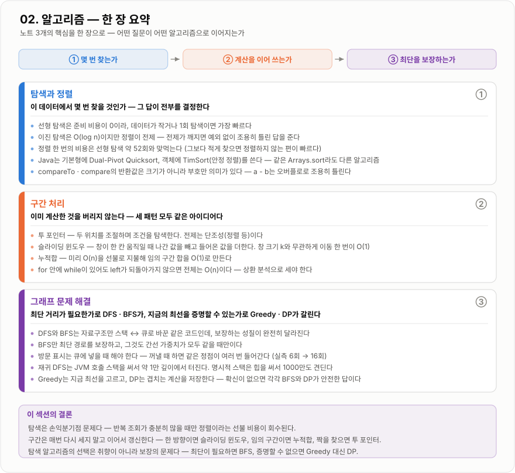

# 02. 알고리즘 — 한 장 요약

이 섹션의 노트 3개를 그림 한 장으로 압축한 것이다. 처음 훑을 때는 지도로, 복습할 때는 체크리스트로 쓴다.
각 카드의 오른쪽 위 번호(①②③)는 맨 위 흐름 띠의 단계와 이어진다.

*몇 번 찾는가(①) → 계산을 이어 쓰는가(②) → 최단을 보장하는가(③) 순서로 읽는다.*

## 노트별로 한 줄씩

| 단계 | 노트 | 한 줄 핵심 |
| --- | --- | --- |
| ① | [탐색과 정렬](탐색-정렬/탐색-정렬.md) | 이 데이터에서 **몇 번 찾을 것인가** — 그 답이 전부를 결정한다 |
| ② | [구간 처리](구간-처리/구간-처리.md) | **이미 계산한 것을 버리지 않는다** — 세 패턴 모두 같은 아이디어다 |
| ③ | [그래프 문제 해결](그래프-문제해결/그래프-문제해결.md) | 최단이 필요한가로 DFS · BFS가, 증명할 수 있는가로 Greedy · DP가 갈린다 |

## 면접 직전에 이것만

!!! note "세 문장으로"

    1. 탐색은 손익분기점 문제다. 반복 조회가 충분히 많을 때만 정렬이라는 선불 비용이 회수된다.
    2. 구간은 매번 다시 세지 말고 이어서 갱신한다. 한 방향이면 슬라이딩 윈도우, 임의 구간이면 누적합, 짝을 찾으면 투 포인터다.
    3. 탐색 알고리즘의 선택은 취향이 아니라 **보장**의 문제다. 최단이 필요하면 BFS, 지금의 최선을 증명할 수 없으면 Greedy 대신 DP다.
