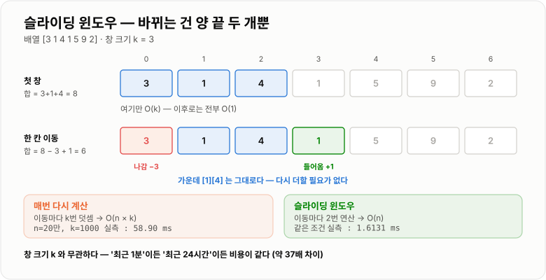

# 구간 처리

> **연속된 구간을 다룰 때 매번 전체를 다시 계산하지 않고, 변화한 부분만 반영해 `O(n²)`을 `O(n)`으로 줄이는 세 가지 패턴이다.**

---

## 1. 핵심 요약

**구간 처리의 핵심은 "이미 계산한 것을 버리지 않는다"이며, 구간이 한 방향으로 움직이면 슬라이딩 윈도우, 아무 구간이나 조회하면 누적합, 두 원소를 짝지으면 투 포인터를 선택한다.**

### 한눈에 보기

* 세 패턴 모두 **"이미 계산한 것을 버리지 않는다"** 는 같은 아이디어에서 나온다.
* **투 포인터** — 두 위치를 조절하며 조건을 탐색한다. 전제는 **단조성**이다.
* **슬라이딩 윈도우** — 연속 구간이 한 칸씩 이동한다. **창 크기 `k`와 무관하게 이동 한 번이 `O(1)`** 이다.
* **누적합** — 미리 `O(n)`을 들여 **임의 구간 합을 `O(1)`** 로 만든다.
* `for` 안에 `while`이 있어도 **`left`가 되돌아가지 않으면 `O(n)`** 이다. 상환 분석으로 세야 한다.

### 무엇을 해결하는가

#### 해결하려는 문제

"최근 5분간 요청 수", "연속된 3일 매출 합이 가장 큰 구간", "합이 목표값이 되는 두 수" 같은 요구는 전부 **연속된 구간**을 다룬다.

가장 단순한 방법은 모든 구간을 만들어 보는 것이다.

```java
for (int i = 0; i + k <= n; i++) {
    int sum = 0;
    for (int j = i; j < i + k; j++) {   // 창마다 처음부터 다시 더한다
        sum += a[j];
    }
    max = Math.max(max, sum);
}
```

`O(n × k)`다. `k`가 커질수록 느려진다. "최근 1분"이면 견딜 만해도 "최근 24시간"이면 무너진다.

여기서 결정적인 관찰이 나온다.

```text
창 [0..2] 를 계산했다면
창 [1..3] 은 처음부터 다시 더할 필요가 없다.

  [1..3] = [0..2] - a[0] + a[3]

  이미 계산한 값을 재활용하면 이동 한 번이 O(1) 이다.
```

**"겹치는 부분은 다시 계산하지 않는다"** 는 이 아이디어가 세 패턴의 공통 뿌리다.

#### 이 개념이 없을 때

* 매 요청마다 최근 N개를 처음부터 다시 집계해 `O(n × k)`가 된다.
* 두 수의 합을 찾으려고 이중 반복문을 써서 `O(n²)`가 된다.
* 구간 합 조회 API가 호출될 때마다 배열을 순회한다.
* 창 크기를 늘리자는 요구가 들어왔는데 성능이 비례해 나빠진다.
* 합을 `int`로 누적해 **예외 없이 그럴듯한 양수**로 오버플로된다.
* 문자열 문제에서 창마다 `substring`을 호출해 `O(n × k)`로 되돌아간다.

---

## 2. 동작 원리

### 핵심 구성 요소

| 개념                | 설명                                    | 중요한 이유                                    |
| ----------------- | ------------------------------------- | ----------------------------------------- |
| **단조성**           | 한쪽을 움직이면 되돌아갈 필요가 없다는 성질              | **투 포인터의 전제다.** 없으면 이 기법을 쓸 수 없다.         |
| **정렬 전제**         | 대부분의 투 포인터는 정렬을 단조성의 근거로 삼는다          | 정렬이 필요하면 전체가 `O(n log n)`이 된다.            |
| **양 끝 좁혀 오기**     | `lo = 0`, `hi = n-1`에서 시작해 서로 다가온다    | 합·넓이 문제의 대표 형태다.                          |
| **같은 방향 따라가기**    | `slow`와 `fast`가 같은 방향으로 이동한다          | 중복 제거·부분 배열 문제에 쓰인다.                      |
| **총 이동 횟수 `n`**   | 두 포인터의 이동을 합쳐도 최대 `n`번이다              | **`O(n)`의 근거**이며, 이중 반복문과 결정적으로 다른 지점이다.  |
| **창(window)**     | 현재 보고 있는 연속 구간 `[left, right]`        | 이 구간의 상태를 유지하는 것이 슬라이딩 윈도우의 전부다.          |
| **증분 갱신**         | 들어온 값을 더하고 나간 값을 빼는 것                 | **`k`에 무관하게 `O(1)`** 이 되는 근거다.            |
| **고정 크기 창**       | 창의 크기 `k`가 항상 같다                      | 이동 평균, 최근 `k`개 집계에 쓴다.                    |
| **가변 크기 창**       | 조건에 따라 창이 늘었다 줄었다 한다                  | "조건을 만족하는 가장 긴/짧은 구간" 문제다.               |
| **역연산 가능성**       | 나간 값의 영향을 되돌릴 수 있는가                   | **합·개수는 가능, 최댓값은 불가능.** 기법 선택을 가른다.       |
| **단조 덱**          | 최댓값·최솟값을 `O(1)`에 유지하는 덱               | 역연산이 안 되는 값을 `O(n)`으로 처리하는 방법이다.          |
| **누적합**           | `prefix[i] = a[0] + ... + a[i-1]`     | **임의 구간 합을 `O(1)`** 로 만든다.                |
| **상환 분석**         | "안쪽이 몇 번 도는가"가 아니라 "전체에서 몇 번 도는가"로 세기 | `for` + `while` 구조가 `O(n)`인 이유를 설명한다.     |
| **오버플로**          | 합을 `int`로 누적하면 넘칠 수 있다                | **예외 없이 그럴듯한 양수**가 나온다.           |

#### 세 패턴의 관계

```text
              "겹치는 계산을 버리지 않는다"
                        │
      ┌─────────────────┼─────────────────┐
      │                 │                 │
  투 포인터          슬라이딩 윈도우        누적합
      │                 │                 │
 두 "원소"를 본다    두 포인터 "사이"를 본다   미리 다 더해 둔다
 단조성 필요        구간이 한 방향 이동      전처리 O(n)
 O(1) 공간          O(1) 공간             O(n) 공간
 순차 접근          순차 접근             임의 접근 O(1)
```

**슬라이딩 윈도우는 투 포인터의 한 형태다.** 두 포인터를 쓴다는 점은 같고, **원소 자체를 보는가(투 포인터) / 사이 구간을 보는가(슬라이딩 윈도우)** 의 차이다.

누적합만 성격이 다르다. 순차 순회가 아니라 **임의 구간을 아무 때나 조회**할 수 있다.

| 패턴          | 적합한 상황           |
| ----------- | ---------------- |
| **투 포인터**   | 두 위치를 조절하며 조건 탐색 |
| **슬라이딩 윈도우** | 연속된 구간이 이동       |
| **누적합**     | 여러 번의 구간 합 조회    |

### 내부 동작 과정

#### 투 포인터 — 양 끝에서 좁혀 오기

```text
정렬된 배열:  [ 2 ][ 4 ][ 7 ][ 11 ][ 15 ]      목표 합: 13
index           0    1    2     3     4

1회차   lo=0(2), hi=4(15)   합 = 17  >  13
        → 큰 쪽을 줄여야 한다   hi = 3
        → 15 는 어떤 값과도 13 을 만들 수 없으므로 영구 제외

2회차   lo=0(2), hi=3(11)   합 = 13  ==  13
        → 찾았다!  (2, 11)

비교 2회.  이중 반복문이면 최대 10회
```


*한 번의 비교로 원소 하나에 얽힌 모든 쌍을 통째로 버리기 때문에 O(n)이 된다.*

#### 왜 되돌아갈 필요가 없는가

이것이 투 포인터의 정확성을 떠받치는 논리다.

```text
현재 lo, hi 에서 합이 목표보다 작다고 하자.

  a[lo] + a[hi] < target

lo 를 그대로 두고 hi 를 줄이면?
  배열이 정렬되어 있으므로 a[hi-1] ≤ a[hi]
  → 합은 더 작아진다 → 목표에서 더 멀어진다 → 의미 없다

따라서 a[lo] 와 짝지어 목표를 만들 수 있는 값은 이미 hi 오른쪽에 없다.
  → a[lo] 는 어떤 값과도 목표를 만들 수 없다
  → lo 를 올려서 a[lo] 를 버리는 것이 유일하게 옳은 선택이다
```

**정렬이 깨지면 이 논리 전체가 무너진다.** 이진 탐색과 정확히 같은 구조의 위험이다. 정렬 안 된 배열에 투 포인터를 쓰면 **예외 없이 틀린 답**이 나온다.

#### 투 포인터 — 같은 방향으로 따라가기

포인터 두 개가 같은 방향으로 가되 **속도가 다른** 형태다.

```text
정렬된 배열:  [ 1 ][ 1 ][ 2 ][ 2 ][ 2 ][ 3 ]

slow = 마지막으로 확정한 위치
fast = 지금 살펴보는 위치

초기      [1][1][2][2][2][3]
           ↑  ↑
         slow fast=1        a[1]=1 == a[slow]=1  →  중복, fast 만 전진

fast=2    a[2]=2 != a[slow]=1  →  새 값!  slow++ 후 a[slow] = 2
          [1][2][2][2][2][3]
              ↑  ↑
            slow fast

fast=3,4  중복이므로 건너뜀

fast=5    a[5]=3 != a[slow]=2  →  새 값!  slow++ 후 a[slow] = 3

결과      [1][2][3] | ...   ← slow+1 = 3 개가 유효
```

**`slow`는 "결과 배열의 끝"이고 `fast`는 "입력 배열의 현재 위치"** 다. 이 해석이 이 패턴의 핵심이다.

#### 총 이동 횟수가 n을 넘지 않는 이유

```text
양 끝 좁혀 오기:
    매 반복마다 lo 가 오르거나 hi 가 내린다 (반드시 하나는 움직인다)
    둘 사이의 거리가 매번 최소 1씩 줄어든다
    처음 거리가 n-1 이므로 반복은 최대 n-1 번

같은 방향 따라가기:
    fast 는 매 반복마다 정확히 1씩 전진한다
    slow 는 전진하거나 제자리다
    fast 가 n 에 도달하면 끝 → 최대 n 번

  → 어느 형태든 O(n)
```

"포인터가 두 개니까 `O(n²)`이 아닌가?"라는 오해에 대한 답이다. **중첩된 반복이 아니라 하나의 반복 안에서 두 인덱스가 각자 전진할 뿐**이다.

#### 슬라이딩 윈도우 — 고정 크기 창

```text
배열:  [ 3 ][ 1 ][ 4 ][ 1 ][ 5 ][ 9 ][ 2 ]      k = 3
index    0    1    2    3    4    5    6

① 첫 창을 만든다 (여기만 O(k))
   창 [0..2] = 3 + 1 + 4 = 8

② 이후로는 한 칸씩 밀면서 O(1) 갱신

   i=3:  합 = 8 - a[0] + a[3] = 8 - 3 + 1 = 6      창 [1..3]
   i=4:  합 = 6 - a[1] + a[4] = 6 - 1 + 5 = 10     창 [2..4]
   i=5:  합 = 10 - a[2] + a[5] = 10 - 4 + 9 = 15   창 [3..5]
   i=6:  합 = 15 - a[3] + a[6] = 15 - 1 + 2 = 16   창 [4..6]

최댓값 = 16

총 연산: 초기 3번 + 이후 (4칸 × 2번) = 11번
매번 다시 계산했다면: 5창 × 3번 = 15번
  → k 가 커질수록 격차가 벌어진다
```



*창 크기 k와 무관하게 이동 한 번이 O(1)이므로 전체가 O(n)이 된다.*

핵심은 **나가는 원소의 인덱스**를 정확히 잡는 것이다.

```text
현재 새로 들어오는 원소가 a[i] 라면
나가는 원소는 a[i - k] 다.

  창 [i-k+1 .. i]  ←  크기 k
      ↑        ↑
   새 left    새 right(=i)

  직전 창은 [i-k .. i-1] 이었으므로 a[i-k] 가 빠진다.
```

`i - k`를 `i - k + 1`이나 `i - k - 1`로 쓰는 **오프바이원 실수**가 이 기법에서 가장 흔한 버그다.

#### 슬라이딩 윈도우 — 가변 크기 창

크기가 정해져 있지 않고 **조건에 따라 늘었다 줄었다** 하는 형태다.

```text
문제: 중복 문자가 없는 가장 긴 부분 문자열

문자열:  a  b  c  a  b  c  b  b
index    0  1  2  3  4  5  6  7

right=0  창 "a"       중복 없음  →  길이 1
right=1  창 "ab"      중복 없음  →  길이 2
right=2  창 "abc"     중복 없음  →  길이 3  ★
right=3  창 "abca"    'a' 중복!  → left 를 올려 "bca"   길이 3
right=4  창 "bcab"    'b' 중복!  → "cab"                길이 3
right=5  창 "cabc"    'c' 중복!  → "abc"                길이 3
right=6  창 "abcb"    'b' 중복!  → "cb"                 길이 2
right=7  창 "cbb"     'b' 중복!  → "b"                  길이 1

정답: 3
```


*`left`와 `right` 모두 뒤로 가지 않기 때문에, 이중 반복문처럼 보여도 전체가 O(n)이다.*

동작 규칙은 단순하다.

```text
1. right 를 한 칸 늘려 새 원소를 창에 넣는다
2. 조건이 깨졌으면, 다시 만족할 때까지 left 를 올려 창을 줄인다
3. 조건을 만족하는 동안 답을 갱신한다
4. right 가 끝에 도달하면 종료
```

#### 왜 이중 반복문인데 O(n)인가

```java
for (int right = 0; right < n; right++) {
    // 창에 넣기
    while (조건이 깨졌으면) {
        // 창에서 빼기
        left++;
    }
}
```

`for` 안에 `while`이 있으니 `O(n²)`처럼 보인다. 하지만 **`O(n)`** 이다.

```text
right 는 0 부터 n-1 까지 정확히 n 번 증가한다
left 는 0 부터 시작해 최대 n-1 까지만 증가한다 (절대 감소하지 않는다)

  → 안쪽 while 의 총 실행 횟수 = left 의 총 증가량 ≤ n
  → 전체 = n(바깥) + n(안쪽 합계) = O(n)
```

**"안쪽 반복이 한 번에 몇 번 도는가"가 아니라 "전체에서 몇 번 도는가"로 세야 한다.** 이를 상환 분석이라고 하며, 투 포인터가 `O(n)`인 이유와 같은 논리다.

#### 역연산이 안 되는 값 — 최댓값 문제

합은 뺄 수 있지만 **최댓값은 뺄 수 없다.**

```text
창 [3, 1, 4] 의 최댓값 = 4

4 가 나가고 2 가 들어오면?
  창 [1, 4] 에서 4 를 빼면... 남은 것 중 최댓값이 무엇인지 모른다
  → 창 안을 전부 다시 봐야 한다 → O(k) → 전체 O(n×k)
```

실측하면 완전탐색 방식이 **175.77ms**다. 해법은 **단조 덱**이다.

```text
단조 감소 덱: 값이 큰 것부터 담되, 자기보다 작은 것은 즉시 버린다

배열: [1, 3, -1, -3, 5, 3, 6, 7]   k = 3

i=0  1 삽입                                덱 [1]
i=1  3 이 들어옴. 뒤의 1 은 3 보다 작다
     → 1 은 앞으로 절대 최댓값이 될 수 없다 (3 이 더 뒤에 있고 더 크다)
     → 버린다                              덱 [3]
i=2  -1 은 3 보다 작지만, 3 이 나간 뒤엔 후보다 → 남긴다   덱 [3, -1]
     창 [1,3,-1] 완성 → 최댓값 = 덱의 맨 앞 = 3
i=3  -3 도 남긴다                          덱 [3, -1, -3]
i=4  5 가 들어옴. -3, -1, 3 전부 5 보다 작다 → 전부 버린다   덱 [5]
     창 [-1,-3,5] → 최댓값 5
...
```

**핵심 논리는 하나다.**

```text
"나보다 앞에 있으면서 나보다 작은 값"은 절대 최댓값이 될 수 없다.
  내가 더 뒤에 있으므로 창에 더 오래 남고, 값도 더 크기 때문이다.
  → 즉시 버려도 안전하다
```

각 원소는 덱에 **한 번 들어가고 최대 한 번 나가므로** 전체가 `O(n)`이다. 실측하면 **175.77ms에서 15.99ms로 약 11배** 빨라진다.

#### 누적합 — 미리 다 더해 둔다

```text
원본 배열:  a = [ 3 ][ 1 ][ 4 ][ 1 ][ 5 ]
index          0    1    2    3    4

누적합:  prefix[0] = 0
        prefix[1] = 3
        prefix[2] = 3+1 = 4
        prefix[3] = 4+4 = 8
        prefix[4] = 8+1 = 9
        prefix[5] = 9+5 = 14

  prefix = [ 0 ][ 3 ][ 4 ][ 8 ][ 9 ][ 14 ]
             0    1    2    3    4    5      ← 길이 n+1

구간 [1..3] 의 합 = a[1]+a[2]+a[3] = 1+4+1 = 6
                  = prefix[4] - prefix[1] = 9 - 3 = 6   ← 뺄셈 한 번!
```

**공식은 하나다.**

```text
구간 [i .. j] 의 합 = prefix[j + 1] - prefix[i]
```

`prefix` 배열의 길이를 `n+1`로 잡고 `prefix[0] = 0`으로 두는 것이 관례다. 그래야 `i = 0`일 때도 `prefix[0]`을 빼면 되어 **조건 분기가 없어진다.**

```text
전처리:   O(n)  한 번
조회:     O(1)  몇 번이든
추가 공간: O(n)
```

**슬라이딩 윈도우와 결정적으로 다른 점은 임의 구간을 아무 순서로나 조회할 수 있다는 것**이다. 슬라이딩 윈도우는 순차적으로만 이동할 수 있다.

---

## 3. 특징과 비교

| 구분          | 내용                                       |
| ----------- | ---------------------------------------- |
| **장점**      | `O(n²)`을 `O(n)`으로 줄이면서 공간은 대부분 `O(1)`이다. **창 크기 `k`에 독립적**이고 순차 접근이라 캐시 친화적이며 스트리밍에도 쓸 수 있다. |
| **단점**      | 투 포인터는 단조성(보통 정렬)이 전제다. 최댓값처럼 **역연산이 안 되는 값**은 단조 덱 같은 별도 구조가 필요하다. |
| **적합한 상황**  | 구간이 한 방향으로 이동하면 슬라이딩 윈도우, 임의 구간을 여러 번 조회하면 누적합, 두 원소를 짝지으면 투 포인터. |
| **주의할 상황**  | 나가는 인덱스 `i - k`의 오프바이원과 `int` 누적 오버플로 — 둘 다 예외 없이 **그럴듯한 값**으로 틀린다. |

### 성능 특성

#### 패턴별 복잡도

| 패턴               | 시간 복잡도       | 공간 복잡도            | 설명                       |
| ---------------- | ------------ | ----------------- | ------------------------ |
| 투 포인터 — 양 끝 좁혀 오기 | **`O(n)`**   | **`O(1)`**        | 두 포인터 이동 합계가 `n` 이하      |
| 투 포인터 — 같은 방향    | **`O(n)`**   | **`O(1)`**        | `fast`가 배열을 한 번 지나간다     |
| 투 포인터 — 정렬 선행 시  | `O(n log n)` | `O(1)`            | **정렬 비용이 지배적이 된다**       |
| 투 포인터 — 세 수의 합   | `O(n²)`      | `O(1)`            | 세 겹 반복문 `O(n³)`에서 한 차수 감소 |
| 슬라이딩 윈도우 — 고정 창  | **`O(n)`**   | **`O(1)`**        | 덧셈·뺄셈 각 1번               |
| 슬라이딩 윈도우 — 가변 창  | **`O(n)`**   | `O(1)` ~ `O(창 크기)` | `left`가 되돌아가지 않아 상환 `O(n)` |
| 슬라이딩 윈도우 — 최댓값   | **`O(n)`**   | **`O(k)`**        | 단조 덱에 최대 `k`개            |
| 슬라이딩 윈도우 — 힙 사용  | `O(n log k)` | `O(k)`            | 제거가 `O(k)`라 단조 덱보다 느리다   |
| **누적합 전처리**      | `O(n)`       | **`O(n)`**        | 한 번만 만든다                 |
| **누적합 조회**       | **`O(1)`**   | —                 | 뺄셈 한 번                   |
| 매번 다시 계산         | `O(n × k)`   | `O(1)`            | `k`에 비례해 느려진다            |

#### k에 대한 독립성 — 슬라이딩 윈도우의 핵심

```text
n = 200,000 기준 덧셈 횟수

k        매번 다시 계산      슬라이딩 윈도우
────     ─────────────      ──────────────
10           200만              40만
100        2,000만              40만
1,000          2억              40만
10,000        20억              40만

  슬라이딩 윈도우는 k 가 커져도 비용이 변하지 않는다.
```

**"최근 1분"을 "최근 1시간"으로 바꿔도 비용이 같다**는 뜻이다. 모니터링·집계 시스템에서 결정적인 특성이다.

#### 투 포인터와 대안 비교

정렬된 배열에서 두 수의 합을 찾는 문제 기준이다.

| 방법           | 시간           | 공간         | 비고                    |
| ------------ | ------------ | ---------- | --------------------- |
| 이중 반복문       | `O(n²)`      | `O(1)`     | 실측 214.50 ms (n=4만)   |
| `HashSet` 사용 | `O(n)`       | **`O(n)`** | 메모리를 쓴다. 정렬 불필요       |
| 각 원소마다 이진 탐색 | `O(n log n)` | `O(1)`     | 정렬 필요                 |
| **투 포인터**    | **`O(n)`**   | **`O(1)`** | 실측 0.0394 ms. 정렬 필요   |

**투 포인터는 시간과 공간을 동시에 최적으로 만드는 유일한 방법**이다. 단, 정렬이라는 전제가 붙는다.

```text
이미 정렬되어 있다   →  O(n)         ← 투 포인터의 진가
정렬해야 한다        →  O(n log n)   ← HashSet 방식(O(n))보다 느릴 수 있다
```

#### 상수 배수 — 캐시 친화성

```text
투 포인터·슬라이딩 윈도우
  배열을 순차적으로 읽는다
  → CPU 캐시 프리페처가 다음 데이터를 미리 가져온다
  → 같은 O(n) 이라도 HashSet 방식보다 상수 배수가 작다

HashSet
  해시값에 따라 메모리 여기저기를 튀어 다닌다
  → 캐시 미스가 계속 발생한다
  → 실측상 boolean[] 대비 약 24배 느리다
```

#### 슬라이딩 윈도우 vs 누적합

| 항목       | 슬라이딩 윈도우     | 누적합 배열          |
| -------- | ------------ | --------------- |
| 전처리      | **없음**       | `O(n)`          |
| 임의 구간 조회 | 불가능 (순차적으로만) | **`O(1)`**      |
| 순차 순회    | **`O(n)`**   | `O(n)`          |
| 추가 메모리   | **`O(1)`**   | `O(n)`          |
| 스트리밍     | **가능**       | 불가능 (전체가 있어야 함) |
| 최댓값 등    | 단조 덱으로 가능    | **불가능** (합·곱만)  |

```text
질문이 "모든 창을 한 번씩 훑어라"       →  슬라이딩 윈도우
질문이 "구간 [3,7] 합은? [10,20] 합은?"  →  누적합 배열
데이터가 실시간으로 들어온다              →  슬라이딩 윈도우
```

#### 공간 복잡도가 달라지는 경우

"공간 `O(1)`"은 창의 상태가 **스칼라 하나**일 때다.

```text
합·개수만 유지     →  O(1)
빈도 맵 유지       →  O(창 안의 고유 원소 수)
단조 덱 유지       →  O(k)
창 전체를 보관      →  O(k)   ← 이러면 이점이 줄어든다
```

### 장점과 단점

| 장점                     | 이유                                   |
| ---------------------- | ------------------------------------ |
| `O(n²)`을 `O(n)`으로 줄인다  | 겹치는 계산을 재활용해 각 원소를 상수 번만 본다.         |
| 대부분 공간이 `O(1)`이다       | 포인터 두 개와 누적값만 유지한다.                  |
| 창 크기 `k`에 독립적이다        | "최근 1분"과 "최근 24시간"의 비용이 같다.          |
| 캐시 친화적이다               | 배열을 순차적으로 읽어 상수 배수가 작다.              |
| 스트리밍 데이터에 쓸 수 있다       | 전체를 메모리에 올릴 필요가 없다.                  |
| 누적합은 임의 구간을 `O(1)`에 준다 | 조회가 많을수록 전처리 비용이 상쇄된다.               |

| 단점                    | 이유 및 주의점                                  |
| --------------------- | ---------------------------------------- |
| 투 포인터는 단조성이 필수다       | 없으면 쓸 수 없고, 정렬이 깨지면 **조용히 틀린 답**이 나온다.   |
| 정렬이 필요하면 `O(n log n)` | `HashSet` 방식의 `O(n)`보다 느려질 수 있다.         |
| 역연산이 안 되는 값이 있다       | 최댓값은 뺄 수 없어 단조 덱 같은 별도 구조가 필요하다.         |
| 오프바이원 실수가 잦다          | 나가는 인덱스 `i - k`, 종료 조건 `lo < hi` 등이 헷갈린다. |
| 오버플로가 조용히 발생한다        | `int` 누적 시 **그럴듯한 양수**가 나와 발견이 어렵다.      |
| 누적합은 임의 갱신에 약하다       | 값이 바뀌면 뒤쪽 전부를 다시 계산해야 한다 (`O(n)`).       |
| 누적합은 `O(n)` 메모리를 쓴다   | 원본과 같은 크기의 배열이 하나 더 필요하다.                 |

### 어떤 상황에서 고르는가

#### 선택 흐름도

```text
연속된 구간을 다루는 문제인가?
├─ 아니오 → 다른 기법 (해시, 정렬, 그래프 등)
│
└─ 예 → 구간이 어떻게 움직이는가?
         │
         ├─ 아무 구간이나 여러 번 조회한다
         │   └─ 누적합            전처리 O(n), 조회 O(1)
         │
         ├─ 구간이 한 방향으로 이동한다
         │   ├─ 크기가 고정        → 고정 슬라이딩 윈도우
         │   └─ 조건에 따라 변함    → 가변 슬라이딩 윈도우
         │       └─ 최댓값이 필요   → + 단조 덱
         │
         └─ 두 "원소"를 짝지어 조건을 찾는다
             └─ 단조성이 있는가?
                 ├─ 있다 (정렬됨)  → 투 포인터   O(n), 공간 O(1)
                 └─ 없다          → HashSet    O(n), 공간 O(n)
```

#### 사용하기 좋은 상황

| 패턴          | 이럴 때 쓴다                                       |
| ----------- | --------------------------------------------- |
| **투 포인터**   | 정렬된 배열에서 두 수의 합, 중복 제거, 두 정렬 목록 병합·교집합, 회문 검사 |
| **슬라이딩 윈도우** | 이동 평균, 최근 N개 집계, 최근 5분 요청 수, Rate Limiter, 조건을 만족하는 최장·최단 구간 |
| **단조 덱**    | 창의 최댓값·최솟값을 `O(n)`으로 구해야 할 때                  |
| **누적합**     | 구간 합 조회가 여러 번, 2차원 영역 합, 통계 API               |

#### 사용하지 않는 것이 좋은 상황

* **정렬 안 된 배열에 투 포인터** — 조용히 틀린 답이 나온다.
* **정렬을 해야 하는데 `HashSet`으로도 풀리는 경우** — 정렬 `O(n log n)`보다 해시 `O(n)`이 낫다.
* **`LinkedList`에 투 포인터** — 인덱스 접근이 `O(n)`이라 전체가 `O(n²)`이 된다.
* **`n`이 수백 이하** — 이중 반복문이 더 단순하고 차이도 없다. `n = 100`이면 5,000번뿐이다.
* **값이 자주 바뀌는데 누적합** — 갱신마다 뒤쪽 전부를 다시 계산해야 한다. Fenwick Tree나 Segment Tree가 필요하다.
* **창마다 `substring` 호출** — `O(n × k)`로 되돌아간다.
* **인스턴스마다 Rate Limiter** — 서버 5대면 실제 제한이 5배가 된다.

#### 선택 기준

1. **연속된 구간을 다루는 문제인가?** — 아니면 이 패턴들이 아니다
2. **구간이 한 방향으로만 이동하는가?** — 아니면 누적합이다
3. **매번 전체 구간을 다시 계산하고 있는가?** — 그렇다면 증분 갱신으로 바꾼다
4. **유지할 값이 역연산 가능한가?** — 합·개수는 가능, 최댓값은 단조 덱이 필요
5. **단조성이 있는가?** — 없으면 투 포인터를 쓸 수 없다
6. **정렬이 이미 되어 있는가?** — 아니면 정렬 비용을 계산에 넣는다
7. **구간 합을 반복해서 조회하는가?** — 그렇다면 누적합
8. **값이 자주 바뀌는가?** — 그렇다면 누적합은 부적합

### 비슷한 기술과 비교

#### 투 포인터 vs 슬라이딩 윈도우

| 비교 항목  | 투 포인터           | 슬라이딩 윈도우          | 선택 기준             |
| ------ | --------------- | ----------------- | ----------------- |
| 보는 대상  | 두 **원소** 자체     | 두 포인터 **사이 구간**   | 원소인가 구간인가         |
| 이동 방향  | 마주 보거나 같은 방향    | 항상 같은 방향          | —                 |
| 전제     | **단조성 (보통 정렬)** | 구간이 한 방향으로 이동     | 정렬 여부             |
| 유지 상태  | 없음 (인덱스만)       | 창의 합·빈도 등         | —                 |
| 대표 문제  | 두 수의 합, 중복 제거   | 최근 N개 집계, 최장 부분구간 | —                 |
| 관계     | 상위 개념           | **투 포인터의 한 형태**   | 별개 기법이 아니다        |

#### 슬라이딩 윈도우 vs 누적합

| 비교 항목  | 슬라이딩 윈도우      | 누적합              | 선택 기준          |
| ------ | ------------- | ---------------- | -------------- |
| 목적     | 모든 창을 순차적으로 훑기 | 임의 구간을 아무 때나 조회  | 조회 패턴이 순차인가    |
| 전처리    | **없음**        | `O(n)`           | 조회가 1~2회면 윈도우   |
| 조회     | 순차적으로만        | **`O(1)` 임의 구간** | —              |
| 메모리    | **`O(1)`**    | `O(n)`           | 메모리 제약 시 윈도우    |
| 스트리밍   | **가능**        | 불가능              | 실시간 데이터면 윈도우    |
| 값 변경   | 자연스럽게 반영      | **뒤쪽 전부 재계산**    | 갱신 있으면 윈도우/트리   |
| 최댓값 등  | 단조 덱으로 가능     | 불가능 (합·곱만)       | —              |

#### 누적합 vs Fenwick/Segment Tree

| 비교 항목  | 누적합        | Fenwick Tree   | 선택 기준        |
| ------ | ---------- | -------------- | ------------ |
| 목적     | 변하지 않는 배열  | 값이 계속 바뀌는 배열   | 갱신이 있는가      |
| 구간 합   | **`O(1)`** | `O(log n)`     | 갱신 없으면 누적합   |
| 값 갱신   | `O(n)`     | **`O(log n)`** | 갱신 있으면 트리    |
| 구현 난도  | **매우 쉬움**  | 보통             | —            |
| 메모리    | `O(n)`     | `O(n)`         | 동일           |
| 적합한 상황 | 통계 스냅샷, 배치 | 실시간 랭킹, 재고     | —            |

#### 투 포인터 vs HashSet

| 비교 항목  | 투 포인터            | HashSet    | 선택 기준       |
| ------ | ---------------- | ---------- | ----------- |
| 시간     | `O(n)` (정렬되어 있으면) | `O(n)`     | 정렬 여부가 가른다  |
| 정렬 필요  | **필요**           | 불필요        | 정렬 안 됐으면 해시 |
| 공간     | **`O(1)`**       | `O(n)`     | 메모리 제약 시 포인터 |
| 캐시 효율  | **좋음 (순차 접근)**   | 나쁨 (임의 접근) | —           |
| 정렬 안 됨 | `O(n log n)`     | **`O(n)`** | 이때는 해시가 유리  |

---

## 4. 실무 주의사항

### 백엔드 실무 적용

#### Spring·Java

**Rate Limiter가 슬라이딩 윈도우의 대표적인 실무 사례다.**

```text
Fixed Window (고정 창) — 단순하지만 경계 문제가 있다
  12:00:00 ~ 12:00:59  →  100회 허용
  12:01:00 ~ 12:01:59  →  100회 허용

  12:00:59 에 100회 + 12:01:00 에 100회 = 1초에 200회 통과!
  → 경계에서 제한의 2배가 통과한다

Sliding Window — 창이 계속 움직여 경계 문제가 없다
  현재 시각 기준 직전 60초를 본다
```

Sliding Window 구현에는 두 방식이 있다.

| 방식                     | 메모리        | 정확도       | 비고               |
| ---------------------- | ---------- | --------- | ---------------- |
| Sliding Window **Log** | `O(요청 수)`  | 정확        | 요청 시각을 전부 기록한다   |
| Sliding Window **Counter** | **`O(1)`** | 근사        | 이전 창의 비율로 추정한다   |

실무에서는 메모리 때문에 **Counter 방식**을 더 많이 쓴다.

**최근 N개 이동 평균**

```java
public class MovingAverage {

    private final int[] buffer;
    private int count = 0;
    private int index = 0;
    private long sum = 0;

    public MovingAverage(int windowSize) {
        this.buffer = new int[windowSize];
    }

    public double add(int value) {
        if (count == buffer.length) {
            sum -= buffer[index];        // 가장 오래된 값이 나간다
        } else {
            count++;
        }

        buffer[index] = value;           // 순환 버퍼
        sum += value;
        index = (index + 1) % buffer.length;

        return (double) sum / count;
    }
}
```

**순환 배열 + 증분 갱신**의 조합이다. 창 크기가 10이든 10만이든 `add` 한 번은 `O(1)`이다.

**오버플로 주의**

```java
int sum = 0;
for (int i = 0; i < 100000; i++) {
    sum += 1000000;           // 10만 × 100만
}
// sum = 1,215,752,192   ← 음수가 아니라 그럴듯한 양수!
```

**음수가 나오면 차라리 낫다.** 그럴듯한 양수라서 검증 로직도 통과한다. 합은 항상 `long`으로 받는다.

#### 데이터베이스·캐시

**Sort Merge Join이 곧 투 포인터다.**

```text
DB가 두 테이블을 조인할 때

  ① 양쪽을 조인 키로 정렬한다        ← O(n log n)
  ② 두 포인터로 훑으며 매칭한다       ← O(n + m)  = 투 포인터

  메모리·정렬 트레이드오프도 애플리케이션과 동일하다.
  Hash Join 은 메모리를 O(n) 쓰는 대신 정렬이 필요 없다.
```

**커서 기반 페이지네이션도 같은 발상이다.**

```sql
-- Offset 방식 — 뒤 페이지로 갈수록 앞을 전부 세어야 한다 O(offset)
SELECT * FROM orders ORDER BY id LIMIT 20 OFFSET 100000;

-- 커서 방식 — 마지막으로 본 위치부터 시작한다 O(log n)
SELECT * FROM orders WHERE id > 100000 ORDER BY id LIMIT 20;
```

"이미 지나온 곳을 다시 보지 않는다"는 점이 투 포인터와 같다.

**누적합은 통계 테이블로 구현된다.**

```sql
-- 매일 매출을 누적해 둔 테이블
CREATE TABLE daily_revenue_cumulative (
    date        DATE PRIMARY KEY,
    cumulative  BIGINT NOT NULL     -- 그날까지의 누적 매출
);

-- 임의 기간 매출을 뺄셈 한 번으로 구한다
SELECT
    (SELECT cumulative FROM daily_revenue_cumulative WHERE date = '2026-03-31')
  - (SELECT cumulative FROM daily_revenue_cumulative WHERE date = '2026-02-28')
    AS revenue;
```

매번 `SUM`으로 집계하면 기간이 길수록 느려지지만, 누적 컬럼을 두면 **기간 길이와 무관하게 조회가 일정**하다.

**Redis Sorted Set으로 시간 기반 창을 만든다.**

```text
ZADD  requests <timestamp> <requestId>       요청 기록
ZREMRANGEBYSCORE requests 0 <now - 60000>    60초 지난 것 제거
ZCARD requests                               현재 창 안의 요청 수
```

이것이 Sliding Window Log 방식의 분산 구현이다.

#### 동시성·분산 환경

**Rate Limiter를 인스턴스마다 두면 안 된다.**

```text
서버 5대 × 각자 "분당 100회" 제한
  → 실제 허용량은 분당 500회

  → Redis 같은 중앙 저장소로 상태를 공유해야 한다
```

**슬라이딩 윈도우 상태는 공유 자원이다.**

```java
// 위험 — 여러 스레드가 동시에 갱신하면 sum 이 깨진다
private long sum = 0;

// 안전 — 동기화하거나 스레드별로 분리한다
private final AtomicLong sum = new AtomicLong();
```

다만 `AtomicLong` 하나로는 부족한 경우가 많다. **"값을 빼고 더하는" 복합 연산**이라 원자성이 깨진다. 락으로 묶거나, 스레드별 창을 두고 나중에 합치는 방식을 쓴다.

**시간 기반 창에서는 시계 문제가 생긴다.**

```text
서버마다 시계가 조금씩 다르면
  → 창의 경계가 서버마다 달라진다
  → NTP 동기화가 필요하다
  → 또는 Redis 서버 시각(TIME 명령)을 기준으로 통일한다
```

### 자주 하는 오해

| 잘못된 이해                            | 올바른 이해                                                             |
| --------------------------------- | ------------------------------------------------------------------ |
| 포인터가 두 개니까 `O(n²)`이다              | **중첩이 아니다.** 하나의 반복 안에서 두 인덱스가 각자 전진하며, 이동 합계가 `n`을 넘지 않아 `O(n)`이다. |
| `for` 안에 `while`이 있으니 `O(n²)`이다   | `left`가 되돌아가지 않아 안쪽 `while`의 **총 실행 횟수가 `n` 이하**다. 상환 분석으로 `O(n)`.  |
| 투 포인터는 항상 정렬이 필요하다                | 대부분 필요하지만 필수는 아니다. **필요한 것은 단조성**이고, 정렬은 그것을 만드는 가장 흔한 방법일 뿐이다.    |
| 정렬 안 된 배열에 투 포인터를 쓰면 예외가 난다        | **예외 없이 조용히 틀린 답**을 준다. 이진 탐색과 같은 위험이다.                            |
| 투 포인터가 `HashSet`보다 항상 빠르다         | 정렬이 필요하면 `O(n log n)`이 되어 `HashSet`의 `O(n)`보다 느릴 수 있다.             |
| `while (lo <= hi)`로 써도 된다         | 같은 원소를 두 번 더하게 된다. "서로 다른 두 원소" 조건이 깨지므로 `lo < hi`여야 한다.           |
| 중복 값은 알아서 처리된다                    | 같은 결과가 여러 번 나온다. **중복 건너뛰기 코드를 명시적으로 넣어야** 한다.                     |
| 세 수의 합도 `O(n)`으로 풀 수 있다           | 바깥 반복문이 붙어 **`O(n²)`** 이다. 세 겹 반복문 `O(n³)`에서 한 차수 줄인 것이다.          |
| `LinkedList`에도 투 포인터를 쓰면 `O(n)`이다 | 인덱스 접근이 `O(n)`이라 전체가 `O(n²)`가 된다.                                  |
| 병합할 때 `<`와 `<=`는 결과가 같다           | 값이 같을 때 어느 쪽을 먼저 넣느냐가 달라진다. **`<=`여야 안정적**이다.                      |
| 투 포인터와 슬라이딩 윈도우는 다른 기법이다          | 슬라이딩 윈도우는 투 포인터의 한 형태다. **두 원소를 보는가, 사이 구간을 보는가**의 차이다.            |
| 슬라이딩 윈도우는 창 크기 `k`에 비례해 느려진다      | **`k`와 무관하다.** 이동 한 번이 항상 `O(1)`이라 "최근 1분"과 "최근 24시간"의 비용이 같다.     |
| 어떤 집계든 슬라이딩 윈도우로 `O(1)` 갱신이 된다    | **역연산이 가능해야** 한다. 합·개수는 되지만 **최댓값은 뺄 수 없다** — 단조 덱이 필요하다.          |
| 창의 최댓값은 힙으로 하면 된다                 | 창 밖 원소 제거가 `O(k)`라 `O(n log k)`다. **단조 덱이 `O(n)`** 으로 더 낫다.        |
| 나가는 인덱스는 `i - k + 1`이다            | `i - k`다. `a[i]`가 들어올 때 직전 창의 왼쪽 끝이 빠진다.                           |
| 합을 `int`로 받아도 오버플로 나면 음수라 알 수 있다  | **그럴듯한 양수가 나온다.** 실측에서 10만×100만이 `1,215,752,192`가 되었다.             |
| 가변 창에서 "가장 긴"과 "가장 짧은"은 코드가 비슷하다  | **축소 조건이 정반대**다. 긴 것은 조건이 깨졌을 때, 짧은 것은 조건을 만족할 때 축소한다.            |
| `left`를 상황에 따라 되돌려도 된다            | `left`가 감소하는 순간 `O(n)` 보장이 깨지고 대개 답도 틀린다.                          |
| 문자열 문제에서 `substring`을 써도 성능은 같다   | **Java 7u6부터 매번 복사**한다. 창마다 호출하면 `O(n×k)`로 되돌아간다 (약 3배).        |
| `substring`은 원본 배열을 공유하니 `O(1)`이다 | Java 7u5까지의 이야기다. 메모리 누수 문제로 **7u6부터 복사 방식**으로 바뀌었다.               |
| 임의 구간 합도 슬라이딩 윈도우로 `O(1)`에 구한다    | 순차적으로만 가능하다. 임의 구간 조회는 **누적합 배열**이 `O(1)`이다.                       |
| 누적합은 값이 바뀌어도 문제없다                 | 값 하나가 바뀌면 **뒤쪽 전부를 다시 계산**해야 한다 (`O(n)`). 갱신이 잦으면 Fenwick Tree를 쓴다. |
| 누적합 배열의 길이는 `n`이면 된다              | `n+1`로 잡고 `prefix[0] = 0`을 두면 `i = 0`일 때의 분기가 사라진다.                |
| Fixed Window Rate Limiter로 충분하다   | 경계에서 **2배가 통과**할 수 있다. 12:00:59에 100회, 12:01:00에 100회가 모두 통과한다.    |
| Rate Limiter를 인스턴스마다 두면 된다        | 서버 5대면 실제 제한이 5배가 된다. **Redis 등 중앙 저장소**로 상태를 공유해야 한다.             |
| Sliding Window Log 방식이 메모리도 효율적이다 | 요청 시각을 전부 기록해 **`O(요청 수)`** 다. 실무에서는 `O(1)`인 Counter 방식을 더 쓴다.     |
| 이중 반복문은 언제나 나쁜 선택이다               | `n`이 수백 이하면 차이가 없고 코드가 더 단순하다. `n = 100`이면 5,000번뿐이다.              |
| DB 조인과 투 포인터는 관계없다                | **`Sort Merge Join`이 곧 투 포인터**다. 메모리·정렬 트레이드오프도 동일하다.              |

---

## 5. 예제

### 투 포인터 — 두 수의 합

```java
public class TwoSum {

    // 정렬된 배열에서 합이 target 인 두 원소의 인덱스를 찾는다
    public int[] find(int[] sorted, int target) {
        int lo = 0;
        int hi = sorted.length - 1;

        while (lo < hi) {                       // <= 가 아니다
            long sum = (long) sorted[lo] + sorted[hi];   // 오버플로 방지

            if (sum == target) {
                return new int[] { lo, hi };
            }

            if (sum < target) {
                lo++;                           // 합을 키워야 한다
            } else {
                hi--;                           // 합을 줄여야 한다
            }
        }

        return new int[] { -1, -1 };
    }
}
```

* **`lo < hi`여야 한다.** `<=`로 쓰면 같은 원소를 두 번 더하게 되어 "서로 다른 두 원소" 조건이 깨진다.
* **합을 `long`으로 받는다.** `int`로 누적하면 오버플로가 나는데, 음수가 아니라 **그럴듯한 양수**가 나와서 발견이 어렵다.
* 반드시 **정렬된 배열**이어야 한다.

### 투 포인터 — 중복 제거

```java
public class Deduplicator {

    // 정렬된 배열에서 중복을 제거하고 유효 길이를 반환한다
    public int removeDuplicates(int[] sorted) {
        if (sorted.length == 0) {
            return 0;
        }

        int slow = 0;

        for (int fast = 1; fast < sorted.length; fast++) {
            if (sorted[fast] != sorted[slow]) {
                slow++;
                sorted[slow] = sorted[fast];
            }
        }

        return slow + 1;
    }
}
```

추가 배열 없이 원본을 직접 고치므로 공간이 `O(1)`이다.

### 슬라이딩 윈도우 — 고정 크기 창

```java
public class FixedWindow {

    // 크기 k 인 연속 구간 합의 최댓값
    public long maxSum(int[] a, int k) {
        if (a.length < k) {
            return 0;
        }

        long sum = 0;
        for (int i = 0; i < k; i++) {        // 첫 창만 O(k)
            sum += a[i];
        }

        long max = sum;

        for (int i = k; i < a.length; i++) { // 이후는 O(1) 씩
            sum = sum + a[i] - a[i - k];     // 들어온 값 더하고, 나간 값 뺀다
            if (sum > max) {
                max = sum;
            }
        }

        return max;
    }
}
```

* `a[i - k]`가 나가는 원소다. `i - k + 1`이 아니다.
* 합은 `long`으로 받는다. 실측에서 10만 개 × 100만이 `1,215,752,192`라는 **그럴듯한 양수**가 되었다.

### 슬라이딩 윈도우 — 가변 크기 창

```java
public class VariableWindow {

    // 합이 target 이상이 되는 가장 짧은 구간의 길이 (양수 배열 전제)
    public int minLength(int[] a, int target) {
        int left = 0;
        long sum = 0;
        int best = Integer.MAX_VALUE;

        for (int right = 0; right < a.length; right++) {
            sum += a[right];                     // 창을 늘린다

            while (sum >= target) {              // 조건을 만족하는 동안 줄인다
                int length = right - left + 1;
                if (length < best) {
                    best = length;
                }

                sum -= a[left];
                left++;
            }
        }

        return best == Integer.MAX_VALUE ? 0 : best;
    }
}
```

**"가장 짧은"과 "가장 긴"은 축소 조건이 정반대**다.

```text
가장 긴 구간  → 조건이 "깨졌을 때" 축소한다   while (조건 위반) { left++; }
가장 짧은 구간 → 조건을 "만족할 때" 축소한다   while (조건 만족) { 갱신; left++; }
```

### 슬라이딩 윈도우 — 문자열 함정

```java
// 나쁜 예 — 창마다 문자열을 새로 만든다
for (int i = 0; i + k <= n; i++) {
    String window = s.substring(i, i + k);   // 매번 k개 복사!
    process(window);
}

// 좋은 예 — 인덱스로 직접 접근한다
for (int i = 0; i + k <= n; i++) {
    char in = s.charAt(i + k - 1);
    char out = (i > 0) ? s.charAt(i - 1) : 0;
    // 창의 상태만 갱신
}
```

**Java 7u6부터 `substring`은 원본 배열을 공유하지 않고 새로 복사한다.**

```text
Java 7u5 이하 : substring 은 O(1) — 원본 char[] 공유 (메모리 누수 위험)
Java 7u6 이상 : substring 은 O(길이) — 새 배열로 복사

  → 창마다 substring 을 호출하면 O(n × k) 로 되돌아간다
```

JDK 17 실측으로 `substring` 반복이 **1.17ms**, `charAt` 직접 접근이 **0.39ms**로 약 3배 차이가 난다. `k`가 클수록 격차가 커진다.

### 단조 덱 — 창의 최댓값

```java
import java.util.ArrayDeque;
import java.util.Deque;

public class WindowMaximum {

    public int[] maxOfEachWindow(int[] a, int k) {
        int[] result = new int[a.length - k + 1];
        Deque<Integer> deque = new ArrayDeque<Integer>();   // 인덱스를 담는다

        for (int i = 0; i < a.length; i++) {
            // ① 창을 벗어난 인덱스를 앞에서 제거
            while (!deque.isEmpty() && deque.peekFirst() <= i - k) {
                deque.pollFirst();
            }

            // ② 나보다 작은 값은 앞으로 절대 최댓값이 될 수 없으므로 뒤에서 제거
            while (!deque.isEmpty() && a[deque.peekLast()] <= a[i]) {
                deque.pollLast();
            }

            deque.offerLast(i);

            // ③ 창이 완성되면 맨 앞이 최댓값
            if (i >= k - 1) {
                result[i - k + 1] = a[deque.peekFirst()];
            }
        }

        return result;
    }
}
```

* 값이 아니라 **인덱스를 담는다.** 창을 벗어났는지 판단해야 하기 때문이다.
* 각 원소가 덱에 한 번 들어가고 최대 한 번 나가므로 전체가 `O(n)`이다.
* **힙을 쓰면 창 밖 원소 제거가 `O(k)`라 `O(n log k)`** 가 된다. 단조 덱이 더 낫다.

### 누적합 — 임의 구간 합

```java
public class PrefixSum {

    private final long[] prefix;

    public PrefixSum(int[] a) {
        prefix = new long[a.length + 1];        // 길이 n+1, prefix[0] = 0

        for (int i = 0; i < a.length; i++) {
            prefix[i + 1] = prefix[i] + a[i];
        }
    }

    // 구간 [from, to] 의 합 (양쪽 포함)
    public long sum(int from, int to) {
        return prefix[to + 1] - prefix[from];
    }
}
```

```java
int[] a = { 3, 1, 4, 1, 5 };
PrefixSum ps = new PrefixSum(a);

ps.sum(1, 3);    // 1 + 4 + 1 = 6
ps.sum(0, 4);    // 전체 합 = 14
ps.sum(2, 2);    // 4
```

* 전처리 `O(n)`, 조회 `O(1)`.
* `prefix[0] = 0`으로 두면 `from = 0`일 때도 분기가 필요 없다.
* `long`으로 잡는다. `int` 배열 100만 개의 합도 `int` 범위를 넘길 수 있다.

---

## 6. 면접 정리

### 자주 나오는 질문

#### 기본 질문

1. **투 포인터가 `O(n)`인 이유를 설명해 주세요.**

    * 핵심 키워드: 중첩 반복이 아님, 두 포인터 이동 합계 `n` 이하, 매 반복마다 거리가 최소 1 감소

2. **투 포인터를 쓰려면 무엇이 전제되어야 하나요?**

    * 핵심 키워드: 단조성, 되돌아갈 필요 없음, 보통 정렬로 확보, 깨지면 조용히 오답

3. **슬라이딩 윈도우가 창 크기 `k`에 무관한 이유는 무엇인가요?**

    * 핵심 키워드: 증분 갱신, 나간 값 빼고 들어온 값 더하기, 이동 한 번 `O(1)`

4. **`for` 안에 `while`이 있는데 왜 `O(n)`인가요?**

    * 핵심 키워드: `left`가 감소하지 않음, 안쪽 총 실행 횟수 ≤ `n`, 상환 분석

5. **누적합은 어떻게 구간 합을 `O(1)`로 만드나요?**

    * 핵심 키워드: `prefix[j+1] - prefix[i]`, 전처리 `O(n)`, 길이 `n+1`과 `prefix[0]=0`

6. **슬라이딩 윈도우와 누적합은 언제 갈리나요?**

    * 핵심 키워드: 순차 이동 vs 임의 조회, 공간 `O(1)` vs `O(n)`, 스트리밍 가능 여부

7. **창의 최댓값을 `O(1)`로 갱신할 수 있나요?**

    * 핵심 키워드: 역연산 불가, 최댓값은 뺄 수 없음, 단조 덱으로 `O(n)`, 힙은 `O(n log k)`

8. **투 포인터와 슬라이딩 윈도우는 어떤 관계인가요?**

    * 핵심 키워드: 슬라이딩 윈도우가 투 포인터의 한 형태, 원소 vs 사이 구간

#### 꼬리 질문

1. **정렬 안 된 배열에 투 포인터를 쓰면 어떻게 되나요?**

    * 핵심 키워드: 예외 없음, 조용히 틀린 답, 단조성 논리 붕괴, 이진 탐색과 같은 위험

2. **투 포인터 대신 `HashSet`을 쓰는 게 나은 경우는 언제인가요?**

    * 핵심 키워드: 정렬이 안 되어 있을 때, `O(n log n)` vs `O(n)`, 공간 `O(n)`을 감수

3. **`while (lo <= hi)`로 쓰면 무슨 문제가 있나요?**

    * 핵심 키워드: 같은 원소를 두 번 사용, "서로 다른 두 원소" 조건 위반

4. **슬라이딩 윈도우에서 나가는 인덱스는 무엇인가요?**

    * 핵심 키워드: `i - k` (not `i - k + 1`), 오프바이원이 가장 흔한 버그

5. **합을 `int`로 누적하면 어떻게 되나요?**

    * 핵심 키워드: 오버플로, **음수가 아니라 그럴듯한 양수**, 실측 `1,215,752,192`, `long` 사용

6. **"가장 긴 구간"과 "가장 짧은 구간"의 코드 차이는 무엇인가요?**

    * 핵심 키워드: 축소 조건이 정반대, 긴 것은 조건 위반 시, 짧은 것은 조건 만족 시

7. **문자열 슬라이딩 윈도우에서 `substring`을 쓰면 안 되는 이유는?**

    * 핵심 키워드: Java 7u6부터 복사, `O(n×k)`로 회귀, `charAt` 직접 접근, 실측 약 3배

8. **누적합을 쓰면 안 되는 경우는 언제인가요?**

    * 핵심 키워드: 값이 자주 바뀔 때, 갱신 `O(n)`, Fenwick Tree / Segment Tree

9. **Fixed Window Rate Limiter의 문제는 무엇인가요?**

    * 핵심 키워드: 경계에서 2배 통과, 12:00:59 + 12:01:00, Sliding Window로 해결

10. **Rate Limiter를 여러 서버에서 어떻게 공유하나요?**

    * 핵심 키워드: 인스턴스마다 두면 제한이 N배, Redis 중앙 저장소, ZSET 또는 Counter

11. **DB의 Sort Merge Join과 투 포인터는 어떤 관계인가요?**

    * 핵심 키워드: 정렬 후 두 포인터로 매칭, `O(n+m)`, Hash Join과의 메모리 트레이드오프

12. **`n`이 작을 때도 투 포인터를 써야 하나요?**

    * 핵심 키워드: `n=100`이면 이중 반복문도 5,000번, 가독성, 복잡도는 선택의 도구

### 30초 답변

> 구간 처리는 **"겹치는 계산을 다시 하지 않는다"** 는 하나의 아이디어에서 나온 세 가지 패턴입니다.

#### 이어서 더 물으면

**투 포인터**는 두 인덱스를 조절하며 조건을 찾습니다. 정렬된 배열에서 합이 목표인 두 수를 찾을 때, 합이 크면 오른쪽을 줄이고 작으면 왼쪽을 올립니다. 핵심은 **한 번 버린 후보로 되돌아갈 필요가 없다**는 것이고, 이 성질을 단조성이라고 합니다. 보통 정렬로 만듭니다. 포인터가 둘이지만 **이동 합계가 `n`을 넘지 않아 `O(n)`** 이고 공간은 `O(1)`입니다.

**슬라이딩 윈도우**는 투 포인터의 한 형태로, 두 포인터 **사이 구간**을 봅니다. 창이 한 칸 이동할 때 나간 값을 빼고 들어온 값만 더하므로 **창 크기 `k`와 무관하게 `O(1)`** 입니다. "최근 1분"을 "최근 24시간"으로 바꿔도 비용이 같다는 뜻이라 모니터링·Rate Limiter에서 결정적입니다. 다만 **역연산이 가능한 값에만 쓸 수 있습니다.** 합이나 개수는 뺄 수 있지만 최댓값은 뺄 수 없어서, 그때는 단조 덱을 씁니다.

**누적합**은 미리 `O(n)`을 들여 앞에서부터의 합을 저장해 두고, 임의 구간을 뺄셈 한 번(`O(1)`)으로 구합니다. 슬라이딩 윈도우와 달리 **순서에 상관없이 아무 구간이나** 조회할 수 있는 대신, 값이 바뀌면 뒤쪽을 전부 다시 계산해야 합니다.

주의할 점 두 가지가 있습니다. 첫째, 정렬 안 된 배열에 투 포인터를 쓰면 **예외 없이 조용히 틀린 답**이 나옵니다. 둘째, 합을 `int`로 누적하면 오버플로가 나는데 음수가 아니라 **그럴듯한 양수**가 나와서 발견이 어렵습니다. 항상 `long`을 씁니다.

실무에서는 DB의 `Sort Merge Join`이 곧 투 포인터이고, Rate Limiter가 슬라이딩 윈도우이며, 누적 통계 테이블이 누적합입니다.

### 핵심 키워드

`단조성` · `정렬 전제` · `양 끝 좁혀 오기` · `같은 방향 따라가기` · `총 이동 횟수 n` · `창(window)` · `증분 갱신` · `고정 크기 창` · `가변 크기 창` · `역연산 가능성` · `단조 덱` · `누적합`

### 이어서 볼 주제

* **탐색과 정렬** — 투 포인터의 전제인 정렬과 단조성이라는 개념을 공유한다.
* **[선형 자료구조 비교](../../01-복잡도-자료구조/선형-자료구조-비교/선형-자료구조-비교.md)** — 단조 덱을 `ArrayDeque`로 구현하는 이유.
* **[Amortized Analysis](../../01-복잡도-자료구조/Amortized-Analysis/Amortized-Analysis.md)** — `for`+`while`이 `O(n)`인 이유가 곧 상환 분석이다.
* **[분산 락과 멱등성](../../08-캐시-Redis/분산락-멱등성/분산락-멱등성.md)** — Rate Limiting과 슬라이딩 윈도우의 실무 적용.
* **[Redis 자료구조와 활용](../../08-캐시-Redis/Redis-자료구조/Redis-자료구조.md)** — 시간 기반 창을 분산 환경에서 구현하는 표준 방법(Sorted Set).
