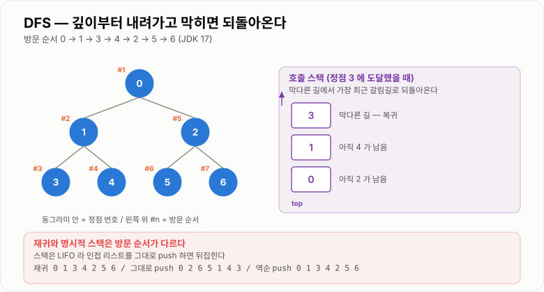
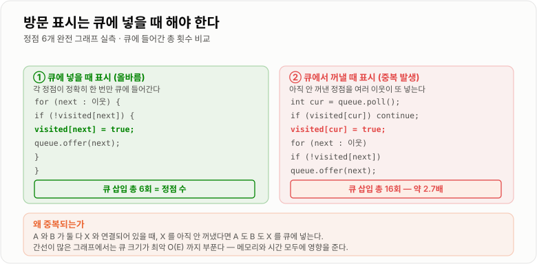
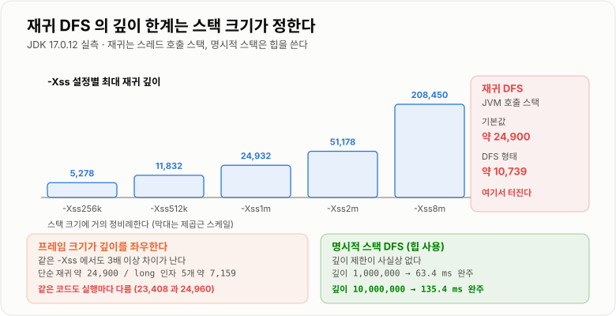

# 그래프 문제 해결

> **관계로 이어진 데이터를 탐색하는 방법(DFS·BFS)과, 선택의 연속으로 답을 만드는 방법(Greedy·DP)을 하나의 문제 해결 흐름으로 본다.**

---

## 1. 핵심 요약

**"최단 거리가 필요한가"로 DFS와 BFS가 갈리고, "지금의 최선이 항상 옳다고 증명할 수 있는가"로 Greedy와 DP가 갈린다 — 확신이 없을 때의 안전한 답은 각각 BFS와 DP다.**

### 한눈에 보기

* DFS와 BFS는 **자료구조만 스택↔큐로 바꾸면 되는 같은 코드**인데, 보장하는 성질이 완전히 달라진다.
* **BFS만 최단 경로를 보장**하고, 그것도 **간선 가중치가 모두 같을 때**만이다.
* 방문 표시는 **큐에 넣을 때** 해야 한다. 꺼낼 때 하면 같은 정점이 여러 번 들어간다 (6회 → 16회).
* 재귀 DFS는 `O(V)`지만 **JVM 호출 스택**을 써서 약 1만 깊이에서 터진다. 명시적 스택은 힙을 써서 1000만도 문제없다.
* **Greedy는 "지금 최선"을 고르고, DP는 "겹치는 계산"을 저장한다.** 둘 다 그래프 탐색의 확장이다.

### 무엇을 해결하는가

#### 해결하려는 문제

현실의 데이터는 대부분 **관계**로 얽혀 있다.

```text
회원 ─ 팔로우 ─ 회원          소셜 네트워크
메뉴 ─ 하위메뉴 ─ 하위메뉴      트리 구조
작업 A → 작업 B → 작업 C      의존 관계
도시 ─ 도로 ─ 도시            경로 탐색
```

배열이나 Map은 "한 줄로 저장"하거나 "키로 찾는" 구조라 **이런 연결 관계를 표현하지 못한다.** 그래서 정점(Vertex)과 간선(Edge)으로 이루어진 **그래프**가 필요하다.

그래프가 생기면 곧바로 질문이 따라온다.

```text
"여기서 갈 수 있는 곳을 전부 찾아라"        → 탐색 (DFS/BFS)
"여기서 저기까지 최단 경로는?"               → BFS / 다익스트라
"순환이 있는가?"                          → DFS + 3색 표시
"최선의 선택을 순서대로 하면 되는가?"          → Greedy
"같은 계산이 계속 반복되는가?"               → DP
```

**이 문서는 이 다섯 가지 질문에 답하는 도구를 한 흐름으로 묶는다.**

#### 이 개념이 없을 때

* 관계 데이터를 탐색하려고 이중·삼중 반복문을 짜서 `O(V²)` 이상이 된다.
* 방문 처리를 빠뜨려 순환 구조에서 **무한 루프**가 돈다.
* DFS로 최단 경로를 구해서 **틀린 답**을 반환한다 (DFS 3, BFS 2).
* 재귀 깊이를 고려하지 않아 운영에서 `StackOverflowError`가 난다.
* 방문 표시를 꺼낼 때 해서 큐가 필요 이상으로 커진다.
* 같은 부분 문제를 반복 계산해 지수 시간이 된다.
* 그리디로 풀리지 않는 문제에 그리디를 써서 국소 최적에 갇힌다.

---

## 2. 동작 원리

### 핵심 구성 요소

| 개념                    | 설명                                     | 중요한 이유                                    |
| --------------------- | -------------------------------------- | ----------------------------------------- |
| **Graph**             | 정점과 간선으로 관계를 표현하는 자료구조                 | 선형 구조로 표현할 수 없는 연결 관계를 다룬다.               |
| **Vertex (정점)**       | 그래프의 각 노드                              | 회원, 도시, 작업 등 개체 하나에 대응한다.                 |
| **Edge (간선)**         | 두 정점을 잇는 연결                            | 방향·가중치 유무에 따라 알고리즘이 갈린다.                  |
| **인접 리스트**            | 각 정점마다 연결된 정점 목록을 두는 표현                | 공간 `O(V+E)`. **희소 그래프의 기본 선택**이다.         |
| **인접 행렬**             | `V × V` 배열로 연결 여부를 저장하는 표현             | 간선 확인이 `O(1)`이지만 공간이 `O(V²)`다.            |
| **DFS**               | 갈 수 있는 데까지 깊이 내려간 뒤 되돌아오는 탐색           | 스택(또는 재귀)을 쓴다. 경로·순환 탐지에 강하다.             |
| **BFS**               | 가까운 정점부터 층별로 넓혀 가는 탐색                  | 큐를 쓴다. **최단 경로를 보장**한다.                   |
| **방문 처리(visited)**    | 이미 본 정점을 기록하는 것                        | 없으면 순환 구조에서 무한 루프가 돈다.                    |
| **방문 표시 시점**          | 큐에 **넣을 때** 표시할 것인가, 꺼낼 때 할 것인가        | BFS에서 넣을 때 해야 각 정점이 큐에 한 번만 들어간다.         |
| **레벨(층)**             | 시작점에서 같은 거리에 있는 정점들의 묶음                | BFS가 최단 거리를 보장하는 근거다.                     |
| **순환 구조**             | 출발점으로 되돌아오는 경로가 있는 형태                  | 방문 처리를 강제하는 이유이며, 위상 정렬의 전제이기도 하다.        |
| **백트래킹**              | DFS로 내려갔다가 되돌아올 때 **방문 표시를 해제**하는 기법   | 모든 경우를 탐색해야 할 때 쓴다. DFS와 결정적으로 다른 지점이다.   |
| **Greedy**            | 매 순간 가장 좋아 보이는 선택을 하는 전략               | 빠르지만 **최적해가 보장되는 문제에만** 쓸 수 있다.           |
| **탐욕적 선택 속성**         | 국소 최적의 연속이 전역 최적이 되는 성질                | Greedy를 쓸 수 있는지 판단하는 기준이다.                |
| **DP (동적 계획법)**       | 겹치는 부분 문제의 결과를 저장해 재사용하는 전략            | 지수 시간을 다항 시간으로 바꾼다.                       |
| **최적 부분 구조**          | 큰 문제의 최적해가 작은 문제의 최적해로 이루어지는 성질        | Greedy와 DP가 **둘 다 요구하는** 전제다.             |
| **중복 부분 문제**          | 같은 부분 문제가 여러 번 나타나는 성질                 | **DP만 요구하는** 전제다. 이것이 있으면 DP를 쓴다.         |
| **메모이제이션 / 타뷸레이션**    | 하향식 캐싱 / 상향식 표 채우기                     | DP의 두 가지 구현 방식이다.                         |

#### 개념 간 관계

```text
관계 데이터를 다뤄야 한다
        ↓
      Graph (정점 + 간선)
        ↓
    어떻게 훑을 것인가?
        │
   ┌────┴────┐
  DFS       BFS
 (스택)     (큐)
   │          │
경로·순환   최단 거리
백트래킹    층 단위 처리
   │
   └──→ 모든 경우를 다 보면 너무 느리다
              ↓
        ┌─────┴─────┐
     Greedy         DP
  "지금 최선"    "겹치는 계산 저장"
   O(n log n)      O(n×상태)
   증명 필요       메모리 필요
```

**DFS·BFS는 "전부 본다"는 전략이고, Greedy·DP는 "전부 보지 않고도 답을 낸다"는 전략이다.**

세 전략의 관계를 정리하면 다음과 같다.

| 전략         | 최적 부분 구조 | 중복 부분 문제 | 속도           | 정확성          |
| ---------- | -------- | -------- | ------------ | ------------ |
| **완전 탐색**  | 불필요      | 불필요      | 지수 시간        | 항상 정확        |
| **DP**     | **필요**   | **필요**   | 다항 시간        | 항상 정확        |
| **Greedy** | **필요**   | 불필요      | `O(n log n)` | **증명해야 정확**  |

### 내부 동작 과정

#### 그래프 표현 — 인접 리스트 vs 인접 행렬

```text
그래프                인접 리스트                 인접 행렬
                                              0 1 2 3
  0 ─ 1                0 → [1, 2]           0 [0 1 1 0]
  │   │                1 → [0, 3]           1 [1 0 0 1]
  2 ─ 3                2 → [0, 3]           2 [1 0 0 1]
                       3 → [1, 2]           3 [0 1 1 0]

  공간 O(V + E)                             공간 O(V²)
  전체 탐색 O(V + E)                         전체 탐색 O(V²)
  간선 확인 O(차수)                           간선 확인 O(1)
```

**대부분의 실제 그래프는 희소하다.** 소셜 네트워크에서 친구가 1억 명일 수는 없다. 그래서 인접 리스트가 기본이다.

```text
V = 10,000,  E = 50,000 일 때 실측 메모리

  인접 리스트 : 약  0.53 MB
  인접 행렬   : 약 95.4 MB      ← 약 179배
```

#### DFS — 깊이 우선

```text
그래프:  0 ─ 1 ─ 3
         │       │
         2 ─────  4

DFS(0) 진행

  0 방문 → 1로 내려감
    1 방문 → 3으로 내려감
      3 방문 → 4로 내려감
        4 방문 → 갈 곳 없음 → 되돌아옴
      3 되돌아옴
    1 되돌아옴 → 다른 이웃 없음
  0 → 2로 내려감
    2 방문 → 이미 다 방문됨 → 되돌아옴

방문 순서: 0 → 1 → 3 → 4 → 2
```



*갈림길을 스택에 쌓아 두었다가 가장 최근 것부터 꺼내 되돌아오는 것이 DFS의 전부다.*

#### BFS — 너비 우선

```text
같은 그래프에서 BFS(0)

  층 0:  [0]                  거리 0
  층 1:  [1, 2]               거리 1   ← 0의 이웃
  층 2:  [3, 4]               거리 2   ← 1, 2의 이웃

방문 순서: 0 → 1 → 2 → 3 → 4
```


*큐가 FIFO이므로 거리 d를 전부 처리한 뒤 d+1로 넘어가고, 그래서 처음 도달이 곧 최단이다.*

**BFS가 최단 거리를 보장하는 논리는 다음과 같다.**

```text
큐는 FIFO 다.
  → 거리 d 인 정점들이 전부 큐에서 빠진 뒤에야 거리 d+1 이 처리된다
  → 어떤 정점에 "처음" 도달했다면, 그보다 짧은 경로는 존재할 수 없다
  → 처음 도달한 거리가 곧 최단 거리다

  그래서 BFS 는 한 번 정한 거리를 절대 갱신하지 않는다.
  갱신하는 것은 다익스트라다.
```

**단, 이 논리는 모든 간선의 비용이 같을 때만 성립한다.**

```text
가중치가 다른 그래프

  A ──(비용 100)── B
  A ──(비용 1)── C ──(비용 1)── D ──(비용 1)── B

  BFS: A→B 가 간선 1개이므로 "최단"이라고 답한다  (실제 비용 100)
  정답: A→C→D→B 가 비용 3 으로 최단

  → BFS 는 "간선 개수"를 세는 것이지 "비용"을 세는 게 아니다
```

#### DFS와 BFS는 같은 코드다

```text
DFS                              BFS
────────────────────────         ────────────────────────
Deque<Integer> stack;            Queue<Integer> queue;
stack.push(start);               queue.offer(start);

while (!stack.isEmpty()) {       while (!queue.isEmpty()) {
    int cur = stack.pop();           int cur = queue.poll();
    ...                              ...
}                                }

  ↑ 가장 최근 것부터              ↑ 가장 먼저 넣은 것부터
    (LIFO)                          (FIFO)
```

**자료구조만 바꾸면 되는데 보장하는 성질이 완전히 달라진다.** 이것이 두 알고리즘을 함께 봐야 하는 이유다.

#### 방문 표시 시점 — BFS의 핵심 함정

```text
6개 정점이 모두 서로 연결된 완전 그래프에서

  큐에 넣을 때 표시   →  큐 삽입 6회
  꺼낼 때 표시       →  큐 삽입 16회
```



*넣을 때 표시하면 각 정점이 큐에 정확히 한 번만 들어간다.*

```text
꺼낼 때 표시하면?
  정점 A 를 처리하며 B 를 큐에 넣는다
  정점 C 를 처리하며 B 를 또 큐에 넣는다   ← B 가 아직 안 꺼내졌으므로
  → B 가 큐에 여러 번 들어간다
  → 최악의 경우 삽입 횟수가 O(E) 까지 늘어난다
```

간선이 많은 그래프에서 **메모리와 시간 모두에 영향을 준다.**

#### 재귀 DFS의 한계



*재귀는 스레드마다 할당된 작은 호출 스택을 쓰고, 명시적 스택은 훨씬 큰 힙을 쓴다.*

```text
재귀 DFS     : O(V) 공간이지만 JVM 호출 스택 사용 (스레드당 약 1MB)
              → 실측 약 10,700 깊이에서 StackOverflowError

명시적 스택   : O(V) 공간이고 힙 사용 (GB 단위 가능)
              → 실측 10,000,000 깊이도 135.4ms 에 완주
```

**복잡도는 같은 `O(V)`인데 실제 한계가 전혀 다르다.** 빅오만 보면 놓치는 지점이다.

재귀 깊이 한계는 여러 요인에 따라 달라진다.

| 요인             | 영향                                     |
| -------------- | -------------------------------------- |
| `-Xss` 스택 크기   | **거의 정비례** (256k→5,278 / 8m→208,450)   |
| 프레임 크기(지역변수)   | 반비례 (단순 24,900 / `long` 5개 7,159)      |
| JIT 컴파일 상태     | **실행마다 달라짐** (같은 코드가 23,408과 24,960)   |
| 스레드 수          | `-Xss`를 키우면 스레드당 메모리가 곱해진다             |

**`-Xss`를 키우는 것은 근본 해결책이 아니다.**

```text
-Xss8m 으로 올리면 깊이가 20만까지 늘지만
  스레드 1,000개 × 8MB = 8GB 가 필요하다

  → 웹 서버에서는 현실적이지 않다
  → 명시적 스택으로 바꾸는 것이 옳은 해결이다
```

#### Greedy — 지금 최선을 고른다

```text
문제: 회의실 하나에 최대한 많은 회의를 배정하라

회의:  A(1~4)  B(3~5)  C(0~6)  D(5~7)  E(8~9)  F(5~9)

전략 후보
  ① 빨리 시작하는 것부터  →  C(0~6) 선택 → E(8~9)  = 2개  ✗
  ② 짧은 것부터          →  A(1~4), D(5~7), E(8~9) = 3개
  ③ 빨리 끝나는 것부터    →  A(1~4), D(5~7), E(8~9) = 3개  ✓ 최적

왜 ③ 이 최적인가?
  빨리 끝날수록 뒤에 남는 시간이 많다
  → 남은 시간이 많을수록 더 많은 회의를 넣을 수 있다
  → 이 논리가 "탐욕적 선택 속성"의 증명이다
```

**Greedy의 핵심은 알고리즘이 아니라 "무엇을 기준으로 고를 것인가"와 "그것이 최적인 이유"다.** 기준을 잘못 잡으면 조용히 틀린 답이 나온다.

#### DP — 겹치는 계산을 저장한다

```text
피보나치를 재귀로 계산하면

              fib(5)
            /        \
        fib(4)        fib(3)
        /    \        /    \
    fib(3)  fib(2) fib(2) fib(1)
    /   \
 fib(2) fib(1)

  fib(3) 이 2번, fib(2) 가 3번 계산된다
  → n 이 커지면 O(2ⁿ)

  fib(50) 을 재귀로 계산하면 약 2^50 번... 사실상 끝나지 않는다
```

**중복 부분 문제가 보이면 DP를 쓴다.**

```text
메모이제이션 (하향식)          타뷸레이션 (상향식)
──────────────────           ──────────────────
재귀 + 캐시                   반복문 + 배열
필요한 것만 계산               전부 계산
호출 스택 깊이 주의             스택 걱정 없음
자연스럽게 작성 가능             점화식을 먼저 세워야 함

  둘 다 O(n) 으로 줄어든다
```

#### Greedy와 DP의 갈림길

```text
동전 [1, 5, 10, 25] 로 30원 만들기 (최소 개수)
  Greedy: 25 + 5 = 2개   ✓ 최적

동전 [1, 3, 4] 로 6원 만들기
  Greedy: 4 + 1 + 1 = 3개   ✗
  최적:   3 + 3     = 2개

  → 같은 문제 유형인데 동전 구성에 따라 그리디가 깨진다
  → 확신이 없으면 DP 를 쓴다
```

**"그리디로 되는가?"는 문제마다 증명해야 한다.** 반례를 못 찾았다고 옳은 것이 아니다.

---

## 3. 특징과 비교

| 구분          | 내용                                       |
| ----------- | ---------------------------------------- |
| **장점**      | BFS는 가중치가 같을 때 최단을 보장하고 깊이 제한이 없다. DFS는 경로·순환 탐지·백트래킹에 자연스럽다. Greedy는 빠르고 DP는 항상 정확하다. |
| **단점**      | DFS는 최단을 보장하지 않고 재귀 깊이 한계가 있다. BFS는 넓은 그래프에서 큐가 폭발한다. Greedy는 정당성 증명이 필요하고 DP는 메모리를 쓴다. |
| **적합한 상황**  | 최단 거리가 필요하고 가중치가 같으면 BFS, 모든 경로·순환 탐지면 DFS, 부분 문제가 겹치면 DP. |
| **주의할 상황**  | **BFS에서 방문 표시를 꺼낼 때 하는 것** — 같은 노드가 큐에 여러 번 들어가 시간과 메모리가 함께 터진다. |

### 성능 특성

#### 그래프 표현별 비용

| 항목                   | 인접 리스트          | 인접 행렬            | 설명                 |
| -------------------- | --------------- | ---------------- | ------------------ |
| 전체 탐색                | **`O(V + E)`**  | `O(V²)`          | 모든 정점과 간선을 한 번씩 본다 |
| 특정 간선 존재 확인          | `O(차수)`         | **`O(1)`**       | 행렬이 유리한 유일한 지점     |
| 메모리                  | **`O(V + E)`**  | `O(V²)`          | 희소 그래프에서 결정적 차이    |
| V=10,000, E=50,000 실측 | **약 0.53 MB**   | **약 95.4 MB**    | **약 179배**         |

#### DFS와 BFS

| 항목       | DFS            | BFS            | 설명                    |
| -------- | -------------- | -------------- | --------------------- |
| 시간       | `O(V + E)`     | `O(V + E)`     | 동일하다                  |
| 공간       | `O(V)`         | `O(V)`         | 복잡도는 같지만 **실제는 다르다**  |
| 최단 경로    | **보장 안 함**     | **보장** (가중치 동일) | 결정적 차이                |
| 자료구조     | 스택 (또는 재귀)     | 큐              | 이것만 바뀐다               |
| 큐/스택 최대치 | 그래프 **깊이**만큼   | 한 **층**의 정점 수  | 그래프 모양에 따라 정반대가 된다    |

#### 메모리는 그래프 모양에 달렸다

```text
깊고 좁은 그래프 (일자형 사슬)
    ●─●─●─●─●─●─●─●─●─●
    DFS : 스택에 깊이만큼 = O(V)   ← 재귀면 StackOverflowError 위험
    BFS : 큐에 한 층 = O(1)        ← 유리

넓고 얕은 그래프 (별 모양, 한 노드에 100만 개 연결)
         ●
    ●●●●●●●●●●●●●  (100만 개)
    DFS : 스택에 깊이 2 = O(1)      ← 유리
    BFS : 큐에 100만 개 = O(V)      ← 메모리 폭발
```

**"BFS가 항상 메모리를 더 쓴다"는 것은 오해다.** 다만 **실무의 그래프는 대체로 넓다.** 소셜 네트워크에서 유명인의 팔로워는 수백만 명일 수 있고, 이 경우 BFS의 큐가 폭발한다.

```text
분기 계수 b, 깊이 d 인 트리에서 BFS 의 큐 최대 크기 ≈ b^d

  b = 10,  d = 6  →  약 100만 개
  b = 100, d = 4  →  약 1억 개    ← 메모리 부족
```

**대응책은 양방향 BFS**다. 분기 10·깊이 8에서 방문 수가 1억에서 2만으로 줄어든다. 단, **도착점을 알아야** 쓸 수 있다.

#### 재귀 vs 명시적 스택

| 구현        | 공간 복잡도  | 실제 사용 영역                 | 실측 한계                 |
| --------- | ------- | ------------------------ | --------------------- |
| 재귀 DFS    | `O(V)`  | **JVM 호출 스택** (약 1MB 제한) | 약 **10,700**에서 오버플로   |
| 명시적 스택 DFS | `O(V)`  | **힙** (GB 단위 가능)         | **10,000,000**도 135.4ms |

**복잡도는 같은 `O(V)`인데 실제 한계가 1000배 차이 난다.**

#### 방문 표시 시점에 따른 큐 크기

| 방문 표시 시점 | 6정점 완전 그래프에서 큐 삽입 횟수 |
| -------- | -------------------: |
| **넣을 때** |                **6** |
| 꺼낼 때     |               **16** |

**넣을 때 표시하면 삽입 횟수가 정확히 `V`가 된다.** 꺼낼 때 표시하면 최악의 경우 `O(E)`까지 늘어난다.

#### 자료구조 선택별 실측

| 항목     | 권장                       | 대안                 | 실측 차이      |
| ------ | ------------------------ | ------------------ | ---------- |
| 큐      | **`ArrayDeque`**         | `LinkedList`       | 약 1.5배     |
| 방문 표시  | **`boolean[]`**          | `HashSet<Integer>` | **약 24배**  |
| 그래프 표현 | **인접 리스트**               | 인접 행렬              | 메모리 약 179배 |
| 거리 저장  | **`int[]` (`-1` 초기화)**   | 별도 `visited` 배열    | 배열 하나로 통합  |

```text
방문 표시 100만 정점 실측
  boolean[]           :   4.71 ms,  약 1 MB
  HashSet<Integer>    : 110.73 ms,  수십 MB      ← 약 24배
```

정점 번호가 연속된 정수라면 `boolean[]`을 쓴다. 문자열 ID라면 **미리 정수로 매핑**해 두는 것을 고려한다.

#### Greedy vs DP vs 완전 탐색

| 전략         | 시간             | 공간          | 정확성        |
| ---------- | -------------- | ----------- | ---------- |
| 완전 탐색      | `O(2ⁿ)`~`O(n!)` | `O(n)`      | 항상 정확      |
| **DP**     | `O(n × 상태)`    | `O(n × 상태)` | 항상 정확      |
| **Greedy** | `O(n log n)`   | `O(1)`      | **증명해야** 정확 |

```text
피보나치 fib(50)
  단순 재귀   : 약 2^50 회 → 사실상 안 끝남
  DP         : 50 회      → 즉시
```

**DP는 시간을 메모리로 산다.** 상태가 많으면 메모리가 문제가 된다.

```text
DP 테이블 크기 = 상태의 가짓수

  1차원 dp[n]           n = 100만  →  8MB (long)
  2차원 dp[n][m]        1000×1000 →  8MB
  2차원 dp[n][m]        10만×10만  →  80GB   ← 불가능
```

### 장점과 단점

#### DFS

| 장점                 | 이유                            |
| ------------------ | ----------------------------- |
| 구현이 짧다 (재귀)        | 스택을 언어가 대신 관리해 준다.            |
| 깊은 그래프에서 메모리가 적다   | 큐에 한 층을 담을 필요가 없다.            |
| 경로 추적이 자연스럽다       | 호출 스택 자체가 현재 경로다.             |
| 순환 탐지·위상 정렬에 적합하다  | 3색 표시로 "지금 가는 길"을 구분할 수 있다.   |
| 백트래킹의 기반이다         | 되돌아올 때 상태를 복원하면 모든 경우를 볼 수 있다. |

| 단점                    | 이유 및 주의점                                  |
| --------------------- | ---------------------------------------- |
| **최단 경로를 보장하지 않는다**   | 먼저 찾은 경로가 최단이라는 보장이 없다.                  |
| 재귀는 깊이 제한이 있다         | 약 1만 깊이에서 `StackOverflowError`가 난다.      |
| 넓은 그래프에서는 이점이 없다      | 깊이가 얕으면 BFS와 차이가 없다.                     |
| 명시적 스택은 방문 순서가 달라진다   | 인접 리스트를 그대로 `push`하면 뒤집힌다.               |

#### BFS

| 장점                | 이유                              |
| ----------------- | ------------------------------- |
| **최단 경로를 보장한다**   | FIFO라 거리 `d`를 다 처리한 뒤 `d+1`로 간다. |
| 층 단위 처리가 가능하다     | `queue.size()`로 한 층을 잘라낼 수 있다.  |
| 깊이 제한이 없다         | 큐를 힙에 두므로 `StackOverflowError`가 없다. |
| 가까운 답을 빨리 찾는다     | 목표가 가까우면 일찍 종료할 수 있다.           |

| 단점                    | 이유 및 주의점                             |
| --------------------- | ------------------------------------ |
| 넓은 그래프에서 큐가 폭발한다      | 분기 계수 `b`, 깊이 `d`면 큐가 `b^d`까지 커진다.   |
| 가중치가 다르면 최단이 아니다      | 간선 **개수**를 셀 뿐 비용을 세지 않는다.           |
| 경로 복원에 별도 배열이 필요하다    | 거리만 나온다. `parent[]`를 따로 둬야 한다.       |
| 방문 표시 시점 실수가 잦다       | 꺼낼 때 표시하면 큐 삽입이 `O(E)`까지 늘어난다.       |

#### Greedy와 DP

| 장점                    | 이유                            |
| --------------------- | ----------------------------- |
| Greedy는 매우 빠르다        | 정렬 한 번 + 순회 한 번이면 끝난다.        |
| Greedy는 메모리가 `O(1)`이다 | 상태를 저장할 필요가 없다.               |
| DP는 지수 시간을 다항으로 바꾼다   | 겹치는 계산을 한 번만 한다.              |
| DP는 항상 최적해를 준다        | 모든 경우를 (효율적으로) 보기 때문이다.       |

| 단점                | 이유 및 주의점                                |
| ----------------- | --------------------------------------- |
| **Greedy는 증명이 필요하다** | 반례를 못 찾았다고 옳은 것이 아니다. 조용히 틀린 답이 나온다.    |
| Greedy는 기준 선택이 전부다 | 기준이 바뀌면 답이 달라진다.                        |
| DP는 메모리를 많이 쓴다    | 상태 공간이 크면 `O(n × m)` 배열이 감당이 안 된다.      |
| DP는 점화식을 세워야 한다   | "어떤 상태를 저장할 것인가"가 가장 어렵다.               |
| 메모이제이션은 재귀 깊이 위험이 있다 | 하향식이라 호출 스택을 쓴다. 깊으면 타뷸레이션으로 바꾼다.       |

### 어떤 상황에서 고르는가

#### 선택 흐름도

```text
관계 데이터를 다루는 문제인가?
├─ 아니오 → 다른 기법
│
└─ 예 → 무엇을 구하는가?
         │
         ├─ 전부 방문 / 연결 요소 세기 → DFS 또는 BFS (아무거나)
         │
         ├─ 최단 거리
         │   ├─ 간선 비용이 모두 같다      → BFS
         │   ├─ 비용이 0과 1뿐이다        → 0-1 BFS (덱)
         │   └─ 비용이 다양하다           → 다익스트라
         │
         ├─ 순환이 있는가 / 위상 정렬      → DFS (3색 표시)
         │
         ├─ 모든 경우의 수를 탐색          → 백트래킹 (DFS + 복원)
         │
         └─ 선택의 연속으로 최적값을 구한다
             ├─ 지금 최선이 항상 옳다고 증명됨 → Greedy
             ├─ 같은 계산이 반복된다         → DP
             └─ 확신이 없다                → DP (안전한 선택)
```

#### 사용하기 좋은 상황

| 방법          | 이럴 때 쓴다                                          |
| ----------- | ------------------------------------------------ |
| **DFS**     | 연결 요소 찾기, 순환 탐지, 위상 정렬, 경로 존재 여부, 깊고 좁은 그래프      |
| **BFS**     | 최단 거리(가중치 동일), 레벨 단위 처리, 친구의 친구 N촌, 격자 탐색        |
| **백트래킹**    | 순열·조합, N-Queens, 스도쿠, 모든 경우를 봐야 하는 문제            |
| **Greedy**  | 회의실 배정, 최소 신장 트리, 허프만 코딩, 거스름돈(동전이 배수 관계일 때)     |
| **DP**      | 피보나치, 배낭 문제, 최장 증가 부분 수열, 편집 거리, 그리디가 깨지는 최적화 문제 |

#### 사용하지 않는 것이 좋은 상황

* **DFS로 최단 경로 구하기** — 보장되지 않는다. 모든 경로를 다 봐야 하는데 이는 지수 시간이다.
* **BFS로 가중치 있는 최단 경로** — 간선 개수만 센다. 다익스트라를 쓴다.
* **가중치를 쪼개서 BFS로 풀기** — 가중치가 1000이면 정점이 1000배가 된다.
* **깊이를 예측할 수 없는 재귀 DFS** — 운영에서 `StackOverflowError`가 난다.
* **넓은 그래프에 BFS** — 유명인의 팔로워 수백만 명이 큐에 들어간다.
* **인접 행렬로 희소 그래프** — 메모리가 실측 179배 더 든다.
* **`HashSet`으로 방문 표시** — 실측 24배 느리다. 번호가 연속이면 `boolean[]`.
* **증명 없는 Greedy** — 반례를 못 찾은 것과 옳은 것은 다르다.
* **상태 공간이 거대한 DP** — `10만 × 10만` 테이블은 80GB다.

#### 선택 기준

1. **관계 데이터를 탐색하는 문제인가?**
2. **최단 거리를 구해야 하는가?** — 그렇다면 BFS 계열이다
3. **간선의 비용이 모두 같은가?** — 다르면 다익스트라
4. **그래프가 깊은가 넓은가?** — 깊으면 BFS 유리, 넓으면 DFS 유리
5. **재귀 깊이를 예측할 수 있는가?** — 없으면 명시적 스택
6. **동일한 계산이 반복되는가?** — 그렇다면 DP
7. **현재 선택이 이후 결과에 어떤 영향을 미치는가?** — 영향이 없으면 Greedy 후보
8. **그리디 기준이 최적임을 증명할 수 있는가?** — 못 하면 DP
9. **상태 공간이 메모리에 들어가는가?**

### 비슷한 기술과 비교

#### DFS vs BFS

| 비교 항목  | DFS               | BFS               | 선택 기준       |
| ------ | ----------------- | ----------------- | ----------- |
| 목적     | 깊이 우선 탐색, 경로·순환   | 너비 우선 탐색, 최단 거리   | 최단이 필요한가    |
| 자료구조   | 스택 (또는 재귀)        | 큐                 | —           |
| 시간     | `O(V + E)`        | `O(V + E)`        | 동일          |
| 최단 경로  | **보장 안 함**        | **보장** (가중치 동일)   | 결정적 차이      |
| 메모리 특성 | 그래프 **깊이**에 비례    | 한 **층**의 크기에 비례   | 그래프 모양에 따라  |
| 깊이 제한  | 재귀면 약 1만          | 없음                | 깊은 그래프면 BFS |
| 적합한 상황 | 순환 탐지, 위상 정렬, 백트래킹 | 최단 거리, 레벨 처리, 격자  | —           |

#### BFS vs 다익스트라 vs 0-1 BFS

| 비교 항목  | BFS        | 0-1 BFS     | 다익스트라              | 선택 기준     |
| ------ | ---------- | ----------- | ------------------ | --------- |
| 간선 가중치 | 모두 동일      | 0 또는 1      | 임의의 양수             | 가중치 형태    |
| 자료구조   | 큐          | 덱           | 우선순위 큐             | —         |
| 시간     | `O(V + E)` | `O(V + E)`  | `O(E log V)`       | —         |
| 거리 갱신  | 없음 (처음이 최단) | 있음          | 있음                 | —         |
| 적합한 상황 | 격자, 친구 N촌  | 벽 뚫기, 방향 전환 | 도로망, 네트워크 지연       | —         |

**0-1 BFS는 덱을 써서 로그 계수 없이 `O(V+E)`를 유지한다.** 비용 0이면 앞에, 1이면 뒤에 넣는다.

#### Greedy vs DP

| 비교 항목    | Greedy         | DP             | 선택 기준         |
| -------- | -------------- | -------------- | ------------- |
| 전략       | 지금 최선을 고른다     | 모든 경우를 효율적으로 본다 | 증명 가능 여부      |
| 최적 부분 구조 | **필요**         | **필요**         | 둘 다 필요        |
| 중복 부분 문제 | 불필요            | **필요**         | 겹치면 DP        |
| 시간       | `O(n log n)`   | `O(n × 상태)`    | 속도가 중요하면 그리디  |
| 공간       | **`O(1)`**     | `O(n × 상태)`    | 메모리 제약 시 그리디  |
| 정확성      | **증명해야 함**     | 항상 정확          | 확신 없으면 DP     |
| 되돌리기     | 불가능 (한 번 고르면 끝) | 가능 (전부 고려)     | —             |
| 적합한 상황   | 회의실, MST, 허프만  | 배낭, LIS, 편집 거리 | —             |

#### DFS vs 백트래킹

| 비교 항목  | DFS             | 백트래킹              | 선택 기준        |
| ------ | --------------- | ----------------- | ------------ |
| 목적     | 각 정점을 **한 번** 방문 | **모든 경우**를 탐색     | 경우의 수가 필요한가  |
| 방문 표시  | 유지한다            | **되돌아올 때 해제한다**   | 이 한 줄이 전부다   |
| 시간     | `O(V + E)`      | 지수 시간             | —            |
| 가지치기   | 없음              | **핵심 최적화**        | —            |
| 적합한 상황 | 연결 요소, 순환 탐지    | 순열·조합, N-Queens   | —            |

#### 메모이제이션 vs 타뷸레이션

| 비교 항목  | 메모이제이션 (하향식)   | 타뷸레이션 (상향식)   | 선택 기준          |
| ------ | -------------- | ------------- | -------------- |
| 구현     | 재귀 + 캐시        | 반복문 + 배열      | 점화식이 명확한가      |
| 계산 범위  | **필요한 것만**     | 전부            | 희소한 상태면 메모이제이션 |
| 스택 위험  | **있음**         | 없음            | 깊으면 타뷸레이션      |
| 작성 난도  | 재귀식 그대로 → 쉬움   | 점화식을 먼저 세워야 함 | —              |
| 공간 최적화 | 어려움            | **쉬움** (슬라이딩) | 메모리 제약 시 타뷸레이션 |

---

## 4. 실무 주의사항

### 백엔드 실무 적용

#### Spring·Java

**조직도·메뉴 트리 탐색이 가장 흔한 사례다.**

```java
// 하위 부서를 전부 찾는다 (DFS)
public List<Department> findAllSubDepartments(Long rootId) {
    List<Department> result = new ArrayList<Department>();
    Deque<Long> stack = new ArrayDeque<Long>();
    Set<Long> visited = new HashSet<Long>();

    stack.push(rootId);

    while (!stack.isEmpty()) {
        Long current = stack.pop();

        if (!visited.add(current)) {       // add 반환값으로 방문 판단
            continue;
        }

        Department dept = departmentRepository.findById(current).get();
        result.add(dept);

        for (Department child : dept.getChildren()) {
            stack.push(child.getId());
        }
    }

    return result;
}
```

**여기에 치명적인 문제가 있다.** 정점마다 쿼리가 나가면 **N+1**이다.

```text
DFS 복잡도가 O(V+E) 라도
  정점마다 DB 쿼리 1번 → 네트워크 왕복 V 번
  → I/O 가 지배적이 되어 복잡도가 무의미해진다
```

**해결은 층 단위 일괄 조회**다.

```java
// BFS + 층 단위 IN 쿼리 — 쿼리 횟수가 "깊이"만큼으로 줄어든다
public List<Department> findAllByLevel(Long rootId) {
    List<Department> result = new ArrayList<Department>();
    List<Long> currentLevel = new ArrayList<Long>();
    currentLevel.add(rootId);

    while (!currentLevel.isEmpty()) {
        List<Department> found = departmentRepository.findAllById(currentLevel);  // 한 번에
        result.addAll(found);

        List<Long> nextLevel = new ArrayList<Long>();
        for (Department dept : found) {
            for (Department child : dept.getChildren()) {
                nextLevel.add(child.getId());
            }
        }

        currentLevel = nextLevel;
    }

    return result;
}
```

**쿼리 횟수가 `O(V)`에서 `O(깊이)`로 줄어든다.** 깊이가 5인 조직도라면 쿼리 5번이다.

**Spring 빈 의존성 순환 탐지도 DFS다.**

```text
BeanCurrentlyInCreationException
  = "지금 만들고 있는 빈"(GRAY)을 또 만들려고 했다
  = 3색 표시의 GRAY 재방문과 정확히 같은 논리
```

**작업 의존성 정렬(위상 정렬)** 도 DFS 기반이다. 배치 작업 순서, 빌드 의존성, 마이그레이션 순서에 쓰인다.

#### 데이터베이스·캐시

**재귀 CTE로 DB에서 직접 탐색할 수 있다.**

```sql
-- 하위 부서 전부 조회 (쿼리 1번)
WITH RECURSIVE sub_dept AS (
    SELECT id, parent_id, name, 0 AS depth
    FROM department
    WHERE id = 1

    UNION ALL

    SELECT d.id, d.parent_id, d.name, s.depth + 1
    FROM department d
    JOIN sub_dept s ON d.parent_id = s.id
)
SELECT * FROM sub_dept;
```

**애플리케이션에서 N번 쿼리하는 것보다 훨씬 낫다.** 다만 깊이 제한을 걸지 않으면 순환 데이터에서 무한 루프가 돈다.

**계층 구조를 미리 펼쳐 두는 방법도 있다.**

| 방식               | 조회        | 갱신        | 비고               |
| ---------------- | --------- | --------- | ---------------- |
| 인접 리스트 (parent_id) | 재귀 필요     | **쉬움**    | 가장 단순            |
| **Path Enumeration** | **`LIKE` 한 번** | 하위 전체 갱신  | `/1/5/12/` 형태    |
| Closure Table    | **조인 한 번** | 행이 많이 생김  | 모든 조상-자손 쌍을 저장   |
| Nested Set       | 빠름        | **매우 어려움** | 읽기 전용에 가까울 때     |

**조회가 압도적으로 많으면 탐색을 미리 해서 저장해 두는 것**이 실무의 정석이다.

**그래프 캐싱**

```text
소셜 그래프의 "친구의 친구"를 매번 BFS 하면 DB 부하가 크다
  → Redis Set 으로 인접 리스트를 캐싱
  → SINTER 로 공통 친구를 O(min(N,M)) 에 구한다
```

#### 동시성·분산 환경

**방문 배열은 공유 자원이다.**

```java
// 위험 — 여러 스레드가 같은 visited 를 쓰면 중복 방문이나 누락이 생긴다
boolean[] visited = new boolean[size];

// 안전 — 스레드별 탐색이면 각자 배열을 가진다
// 또는 원자적 연산으로 "내가 처음 방문했는가"를 판단한다
AtomicIntegerArray visited = new AtomicIntegerArray(size);
if (visited.compareAndSet(v, 0, 1)) {
    // 내가 처음 방문했다
}
```

`ConcurrentHashMap.newKeySet()`의 `add()` 반환값을 쓰는 것도 같은 패턴이다.

**분산 환경에서는 그래프가 서버에 나뉜다.**

```text
정점이 여러 서버에 분산되어 있으면
  → 탐색이 서버 경계를 넘을 때마다 네트워크 호출이 발생한다
  → BFS 의 층 단위 처리가 유리하다 (한 층을 배치로 요청)

  대규모 그래프 처리는 Pregel 모델(정점 중심 반복 계산)이나
  전용 그래프 DB(Neo4j 등)를 쓴다
```

**양방향 BFS로 탐색량을 줄인다.**

```text
"A와 B는 몇 촌인가?"

  단방향 BFS : A 에서 시작해 B 를 만날 때까지 → b^d
  양방향 BFS : A 와 B 에서 동시에 → 2 × b^(d/2)

  b=10, d=8 이면  1억  →  2만    (약 5000배)
```

단, **도착점을 알아야** 쓸 수 있다. 모든 정점까지의 거리를 구할 때는 못 쓴다.

### 자주 하는 오해

| 잘못된 이해                                 | 올바른 이해                                                                    |
| -------------------------------------- | ------------------------------------------------------------------------- |
| DFS로 최단 경로를 구할 수 있다                    | **보장하지 않는다.** 실측에서 DFS는 3, BFS는 2를 반환했다. 모든 경로를 다 봐야 정답이고 이는 지수 시간이다.      |
| BFS는 항상 최단 경로를 보장한다                    | **간선 가중치가 모두 같을 때만**이다. 실측에서 비용 100인 경로를 최단이라고 답했다 (실제 최소 3).             |
| DFS와 BFS는 구현이 많이 다르다                   | **자료구조만 스택↔큐로 바꾸면 된다.** 나머지 코드는 거의 같은데 보장이 완전히 달라진다.                      |
| 재귀 DFS와 명시적 스택 DFS는 방문 순서가 같다          | **다르다.** 인접 리스트를 그대로 `push`하면 뒤집힌다. 실측 `0 1 3 4 2 5 6` vs `0 2 6 5 1 4 3`. |
| 재귀는 대략 만 단계쯤에서 터진다                     | 프레임 크기에 따라 다르다. 실측 단순 재귀 약 24,900 / `long` 인자 5개 약 7,159 — **3배 이상 차이**.   |
| 재귀 최대 깊이는 항상 같은 값이다                    | **실행마다 달라진다.** 같은 코드가 23,408과 24,960으로 측정되었다 (JIT 영향).                    |
| `-Xss`를 키우면 해결된다                       | 스레드 수만큼 곱해진다. 1,000 스레드 × 8MB = 8GB. **명시적 스택으로 바꾸는 것이 옳다.**               |
| 명시적 스택도 깊이 제한이 있다                      | 힙을 쓰므로 사실상 없다. **실측 1,000만 깊이를 135.4ms에 완주**했다.                           |
| `StackOverflowError`는 힙이 부족해서 난다       | **호출 스택**이 한계를 넘어 발생한다. 힙 부족은 `OutOfMemoryError`다.                        |
| `StackOverflowError`를 `catch`해서 처리하면 된다 | `Error`는 복구 불가능한 상황을 뜻한다. 잡아서 넘기지 말고 구조를 바꿔야 한다.                          |
| 방문 표시는 꺼낼 때 해도 된다                      | **넣을 때 해야 한다.** 실측에서 6정점 그래프의 큐 삽입이 6회에서 16회로 늘었다.                        |
| 명시적 스택에서는 꺼낸 뒤 방문 확인이 불필요하다            | **필요하다.** 같은 정점이 여러 번 `push`될 수 있어 `if (visited[cur]) continue;`가 있어야 한다. |
| 방문 배열은 트리에서도 꼭 필요하다                    | 트리는 순환이 없어 없어도 된다. 다만 **"트리인 줄 알았는데 순환이 있는"** 경우가 많아 넣는 편이 안전하다.          |
| 방문 표시는 `HashSet`을 써도 성능이 비슷하다          | 실측 **약 24배 느리다** (4.71ms vs 110.73ms). 번호가 연속이면 `boolean[]`.               |
| 순환 탐지는 `boolean` 방문 배열이면 된다            | **3가지 상태**가 필요하다. "이미 본 곳"과 "지금 가는 길"을 구분해야 한다.                           |
| BFS는 DFS보다 항상 메모리를 많이 쓴다               | **그래프 모양에 달렸다.** 깊고 좁은 사슬형이면 BFS가 `O(1)`, DFS가 `O(V)`다.                   |
| BFS도 재귀로 구현할 수 있다                      | 큐를 명시적으로 관리해야 한다. 재귀는 본질적으로 스택이라 DFS가 된다.                                 |
| 한 번 구한 거리를 나중에 갱신해야 할 수도 있다            | **BFS는 갱신하지 않는다.** 처음이 이미 최단이다. 갱신하는 것은 다익스트라다.                           |
| 레벨 처리에서 `queue.size()`를 반복문 안에 써도 된다   | 처리 중 크기가 변해 다음 층이 섞인다. **밖에서 지역 변수에 담아야** 한다.                             |
| BFS는 큐를 쓰니 `LinkedList`가 자연스럽다         | `ArrayDeque`가 실측 약 1.5배 빠르고 GC 부담도 적다. **JDK 문서도 `ArrayDeque` 권장**.       |
| 가중치가 있어도 간선을 쪼개면 BFS로 풀 수 있다           | 가중치가 크면 정점이 폭발한다. 가중치 1000이면 정점이 1000배가 된다. 다익스트라를 쓴다.                    |
| 가중치가 0과 1이면 다익스트라를 써야 한다               | **0-1 BFS**로 덱을 쓰면 로그 계수 없이 `O(V+E)`를 유지한다.                               |
| 양방향 BFS는 항상 쓸 수 있다                     | **도착점을 알아야** 한다. 모든 정점까지의 거리를 구할 때는 못 쓴다.                                 |
| BFS로 거리를 구하면 경로도 자동으로 나온다              | 거리만 나온다. 경로를 복원하려면 `parent[]` 배열을 따로 둬야 한다.                               |
| 격자 BFS도 재귀 깊이가 걱정된다                    | 큐를 힙에 두므로 `StackOverflowError`가 없다. **1000×1000 격자는 오히려 BFS가 안전**하다.      |
| 인접 행렬이 배열이라 더 빠르다                      | 전체 탐색이 `O(V²)`라 오히려 느리다. 메모리도 실측 **약 179배** 더 쓴다.                         |
| DFS는 백트래킹과 같은 것이다                      | 백트래킹은 DFS의 응용이다. **되돌아올 때 방문 표시를 해제**한다는 결정적 차이가 있다.                      |
| Greedy는 빠르니까 일단 써보면 된다                 | **최적임을 증명해야 한다.** 반례를 못 찾은 것과 옳은 것은 다르다. 조용히 틀린 답이 나온다.                   |
| 거스름돈 문제는 항상 그리디로 풀린다                   | 동전이 `[1,3,4]`면 6원에서 그리디가 3개, 최적이 2개다. **동전 구성에 따라 깨진다.**                  |
| DP는 무조건 재귀보다 빠르다                       | 상태가 많으면 메모리가 문제다. `10만 × 10만` 테이블은 80GB다.                                 |
| 메모이제이션과 타뷸레이션은 성능이 같다                  | 메모이제이션은 **필요한 것만** 계산하고, 타뷸레이션은 전부 계산한다. 상태가 희소하면 메모이제이션이 낫다.             |
| 메모이제이션은 재귀라도 스택 걱정이 없다                 | 하향식이라 호출 스택을 쓴다. 깊으면 `StackOverflowError`가 난다. 타뷸레이션으로 바꾼다.               |
| DFS·BFS 복잡도가 `O(V+E)`이니 실무에서도 빠르다      | JPA 지연 로딩이면 정점마다 쿼리가 나가 **N+1**이 된다. I/O가 지배적이다. **층 단위 일괄 조회**로 줄인다.     |

---

## 5. 예제

### 그래프 표현

```java
import java.util.ArrayList;
import java.util.List;

public class Graph {

    private final List<List<Integer>> adjacency;

    public Graph(int vertexCount) {
        adjacency = new ArrayList<List<Integer>>();

        for (int i = 0; i < vertexCount; i++) {
            adjacency.add(new ArrayList<Integer>());
        }
    }

    public void addEdge(int from, int to) {
        adjacency.get(from).add(to);
        adjacency.get(to).add(from);      // 무방향 그래프
    }

    public List<Integer> neighbors(int vertex) {
        return adjacency.get(vertex);
    }

    public int size() {
        return adjacency.size();
    }
}
```

### 재귀 DFS

```java
public class RecursiveDfs {

    public void dfs(Graph graph, int start) {
        boolean[] visited = new boolean[graph.size()];
        visit(graph, start, visited);
    }

    private void visit(Graph graph, int current, boolean[] visited) {
        visited[current] = true;
        System.out.println(current);

        for (Integer next : graph.neighbors(current)) {
            if (!visited[next]) {
                visit(graph, next, visited);
            }
        }
    }
}
```

* 코드가 짧고 직관적이지만 **깊이가 약 1만을 넘으면 `StackOverflowError`** 가 난다.
* 깊이를 예측할 수 없다면 아래의 명시적 스택 방식을 쓴다.

### 명시적 스택 DFS

```java
import java.util.ArrayDeque;
import java.util.Deque;

public class IterativeDfs {

    public void dfs(Graph graph, int start) {
        boolean[] visited = new boolean[graph.size()];
        Deque<Integer> stack = new ArrayDeque<Integer>();

        stack.push(start);

        while (!stack.isEmpty()) {
            int current = stack.pop();

            if (visited[current]) {
                continue;                 // 반드시 필요하다
            }

            visited[current] = true;
            System.out.println(current);

            for (Integer next : graph.neighbors(current)) {
                if (!visited[next]) {
                    stack.push(next);
                }
            }
        }
    }
}
```

* **`if (visited[current]) continue;`가 반드시 필요하다.** 같은 정점이 여러 번 `push`될 수 있기 때문이다.
* **방문 순서가 재귀와 다르다.** 인접 리스트를 그대로 `push`하면 뒤집힌다 (`0 1 3 4 2 5 6` vs `0 2 6 5 1 4 3`). 순서를 맞추려면 역순으로 넣어야 한다.

### BFS — 최단 거리

```java
import java.util.ArrayDeque;
import java.util.Arrays;
import java.util.Queue;

public class Bfs {

    public int[] shortestDistances(Graph graph, int start) {
        int[] distance = new int[graph.size()];
        Arrays.fill(distance, -1);        // -1 = 아직 도달 못함 (visited 겸용)

        Queue<Integer> queue = new ArrayDeque<Integer>();

        distance[start] = 0;
        queue.offer(start);

        while (!queue.isEmpty()) {
            int current = queue.poll();

            for (Integer next : graph.neighbors(current)) {
                if (distance[next] == -1) {        // 아직 방문 안 함
                    distance[next] = distance[current] + 1;
                    queue.offer(next);             // ★ 넣을 때 표시했다
                }
            }
        }

        return distance;
    }
}
```

* **거리 배열이 방문 배열 역할을 겸한다.** `-1`이면 미방문이다. 배열 하나로 통합할 수 있다.
* `distance[next] = ...`가 `offer` 직전에 있으므로 **넣을 때 표시**하는 형태다.
* `ArrayDeque`가 `LinkedList`보다 실측 약 1.5배 빠르고 GC 부담도 적다.

### BFS — 층 단위 처리

```java
public class LevelBfs {

    public void processByLevel(Graph graph, int start) {
        boolean[] visited = new boolean[graph.size()];
        Queue<Integer> queue = new ArrayDeque<Integer>();

        visited[start] = true;
        queue.offer(start);

        int level = 0;

        while (!queue.isEmpty()) {
            int size = queue.size();       // ★ 반복문 밖에서 담아야 한다

            System.out.println("=== 레벨 " + level + " ===");

            for (int i = 0; i < size; i++) {
                int current = queue.poll();
                System.out.println(current);

                for (Integer next : graph.neighbors(current)) {
                    if (!visited[next]) {
                        visited[next] = true;
                        queue.offer(next);
                    }
                }
            }

            level++;
        }
    }
}
```

**`queue.size()`를 반복문 조건에 직접 쓰면 안 된다.** 처리 중 큐 크기가 변해 다음 층이 섞인다. 반드시 밖에서 지역 변수에 담는다.

### 순환 탐지 — 3색 표시

```java
public class CycleDetector {

    private static final int WHITE = 0;    // 아직 안 봄
    private static final int GRAY = 1;     // 지금 가는 길 (재귀 스택 위)
    private static final int BLACK = 2;    // 다 보고 나옴

    public boolean hasCycle(Graph graph) {
        int[] color = new int[graph.size()];

        for (int i = 0; i < graph.size(); i++) {
            if (color[i] == WHITE && visit(graph, i, color)) {
                return true;
            }
        }

        return false;
    }

    private boolean visit(Graph graph, int current, int[] color) {
        color[current] = GRAY;

        for (Integer next : graph.neighbors(current)) {
            if (color[next] == GRAY) {
                return true;               // 지금 가는 길로 되돌아왔다 = 순환
            }

            if (color[next] == WHITE && visit(graph, next, color)) {
                return true;
            }
        }

        color[current] = BLACK;
        return false;
    }
}
```

**`boolean` 방문 배열로는 순환을 탐지할 수 없다.** "이미 본 곳"과 "지금 가는 길"을 구분해야 하기 때문이다.

### 백트래킹 — DFS와의 결정적 차이

```java
public class Permutation {

    public void permute(int[] numbers) {
        boolean[] used = new boolean[numbers.length];
        int[] current = new int[numbers.length];

        backtrack(numbers, used, current, 0);
    }

    private void backtrack(int[] numbers, boolean[] used, int[] current, int depth) {
        if (depth == numbers.length) {
            System.out.println(Arrays.toString(current));
            return;
        }

        for (int i = 0; i < numbers.length; i++) {
            if (used[i]) {
                continue;
            }

            used[i] = true;                 // 선택
            current[depth] = numbers[i];

            backtrack(numbers, used, current, depth + 1);

            used[i] = false;                // ★ 되돌리기 — 이것이 백트래킹이다
        }
    }
}
```

**DFS는 방문 표시를 유지하고, 백트래킹은 되돌아올 때 해제한다.** 이 한 줄이 "한 번만 방문"과 "모든 경우 탐색"을 가른다.

### Greedy — 회의실 배정

```java
import java.util.Arrays;
import java.util.Comparator;

public class MeetingScheduler {

    public int maxMeetings(int[][] meetings) {
        // 끝나는 시각 기준 오름차순 — 이 기준 선택이 알고리즘의 전부다
        Arrays.sort(meetings, new Comparator<int[]>() {
            @Override
            public int compare(int[] a, int[] b) {
                return Integer.compare(a[1], b[1]);
            }
        });

        int count = 0;
        int lastEnd = Integer.MIN_VALUE;

        for (int i = 0; i < meetings.length; i++) {
            if (meetings[i][0] >= lastEnd) {    // 겹치지 않으면 선택
                count++;
                lastEnd = meetings[i][1];
            }
        }

        return count;
    }
}
```

* 정렬 `O(n log n)` + 순회 `O(n)` = **`O(n log n)`**
* **"빨리 끝나는 것부터"가 최적인 이유를 설명할 수 있어야 한다.** 기준이 바뀌면 답이 틀린다.

### DP — 메모이제이션과 타뷸레이션

```java
public class Fibonacci {

    // 메모이제이션 (하향식) — 재귀 + 캐시
    public long memoized(int n) {
        long[] cache = new long[n + 1];
        Arrays.fill(cache, -1);
        return compute(n, cache);
    }

    private long compute(int n, long[] cache) {
        if (n <= 1) {
            return n;
        }

        if (cache[n] != -1) {
            return cache[n];               // 이미 계산했다
        }

        cache[n] = compute(n - 1, cache) + compute(n - 2, cache);
        return cache[n];
    }

    // 타뷸레이션 (상향식) — 반복문 + 배열
    public long tabulated(int n) {
        if (n <= 1) {
            return n;
        }

        long[] table = new long[n + 1];
        table[0] = 0;
        table[1] = 1;

        for (int i = 2; i <= n; i++) {
            table[i] = table[i - 1] + table[i - 2];
        }

        return table[n];
    }

    // 공간 최적화 — 직전 두 값만 있으면 된다
    public long optimized(int n) {
        if (n <= 1) {
            return n;
        }

        long prev = 0;
        long curr = 1;

        for (int i = 2; i <= n; i++) {
            long next = prev + curr;
            prev = curr;
            curr = next;
        }

        return curr;
    }
}
```

```text
단순 재귀   : O(2ⁿ) 시간, O(n) 공간   ← fib(50)이 사실상 안 끝난다
메모이제이션 : O(n)  시간, O(n) 공간
타뷸레이션   : O(n)  시간, O(n) 공간
공간 최적화  : O(n)  시간, O(1) 공간   ← 직전 값만 필요할 때
```

**"직전 몇 개만 필요한가"를 보면 공간을 줄일 수 있다.** DP 문제에서 자주 나오는 마지막 최적화다.

---

## 6. 면접 정리

### 자주 나오는 질문

#### 기본 질문

1. **DFS와 BFS의 차이는 무엇인가요?**

    * 핵심 키워드: 스택 vs 큐, 깊이 vs 너비, 최단 경로 보장 여부, 코드는 거의 동일

2. **BFS가 최단 경로를 보장하는 이유를 설명해 주세요.**

    * 핵심 키워드: FIFO, 거리 `d` 전부 처리 후 `d+1`, 처음 도달이 곧 최단, 갱신 없음

3. **BFS가 최단을 보장하지 못하는 경우는 언제인가요?**

    * 핵심 키워드: 간선 가중치가 다를 때, 간선 개수만 셈, 다익스트라 필요

4. **방문 처리는 왜 필요한가요?**

    * 핵심 키워드: 순환 구조에서 무한 루프, 중복 방문, 트리는 없어도 되지만 넣는 게 안전

5. **BFS에서 방문 표시는 언제 해야 하나요?**

    * 핵심 키워드: 큐에 **넣을 때**, 꺼낼 때 하면 중복 삽입, 실측 6회 → 16회, 최악 `O(E)`

6. **인접 리스트와 인접 행렬 중 무엇을 쓰나요?**

    * 핵심 키워드: 희소 그래프는 리스트, `O(V+E)` vs `O(V²)`, 실측 메모리 179배

7. **재귀 DFS의 한계는 무엇인가요?**

    * 핵심 키워드: JVM 호출 스택, 약 1만 깊이, `StackOverflowError`, 명시적 스택은 힙 사용

8. **Greedy와 DP의 차이는 무엇인가요?**

    * 핵심 키워드: 둘 다 최적 부분 구조 필요, 중복 부분 문제는 DP만, 증명 필요 여부, `O(n log n)` vs `O(n×상태)`

9. **DP를 언제 쓰나요?**

    * 핵심 키워드: 중복 부분 문제, 최적 부분 구조, 지수 시간을 다항으로, 메모이제이션/타뷸레이션

#### 꼬리 질문

1. **재귀 DFS와 명시적 스택 DFS는 방문 순서가 같나요?**

    * 핵심 키워드: 다르다, 인접 리스트를 그대로 `push`하면 뒤집힘, 역순 삽입으로 맞춤

2. **`-Xss`를 키우면 재귀 깊이 문제가 해결되나요?**

    * 핵심 키워드: 스레드 수만큼 곱해짐, 1000스레드 × 8MB = 8GB, 명시적 스택이 옳은 해결

3. **명시적 스택에서 꺼낸 뒤 방문 확인이 왜 필요한가요?**

    * 핵심 키워드: 같은 정점이 여러 번 `push` 가능, `if (visited[cur]) continue;`

4. **순환을 탐지하려면 방문 배열만으로 충분한가요?**

    * 핵심 키워드: 3색(WHITE/GRAY/BLACK) 필요, "이미 본 곳"과 "지금 가는 길" 구분

5. **BFS가 DFS보다 항상 메모리를 많이 쓰나요?**

    * 핵심 키워드: 그래프 모양에 따라 정반대, 깊고 좁으면 BFS 유리, 넓으면 DFS 유리, `b^d`

6. **레벨 단위로 처리할 때 주의할 점은 무엇인가요?**

    * 핵심 키워드: `queue.size()`를 반복문 밖에서 담기, 안에 쓰면 다음 층이 섞임

7. **가중치가 0과 1뿐이면 다익스트라를 써야 하나요?**

    * 핵심 키워드: 0-1 BFS, 덱 사용, 0이면 앞 1이면 뒤, `O(V+E)` 유지

8. **DFS와 백트래킹의 차이는 무엇인가요?**

    * 핵심 키워드: 되돌아올 때 방문 표시 해제, 한 번 방문 vs 모든 경우, 가지치기

9. **Greedy가 틀리는 예를 들어주세요.**

    * 핵심 키워드: 동전 `[1,3,4]`로 6원, 그리디 3개 vs 최적 2개, 증명 없이 쓰면 위험

10. **메모이제이션과 타뷸레이션 중 무엇을 쓰나요?**

    * 핵심 키워드: 상태가 희소하면 메모이제이션, 깊으면 타뷸레이션(스택 안전), 공간 최적화는 타뷸레이션

11. **DFS 복잡도가 `O(V+E)`인데 왜 실무에서 느린가요?**

    * 핵심 키워드: 정점마다 DB 쿼리 → N+1, I/O가 지배적, 층 단위 일괄 조회로 `O(깊이)`

12. **계층 구조를 DB에서 어떻게 다루나요?**

    * 핵심 키워드: 재귀 CTE, Path Enumeration, Closure Table, 조회 위주면 미리 펼쳐 저장

13. **양방향 BFS는 언제 쓰나요?**

    * 핵심 키워드: 도착점을 알아야 함, `b^d` → `2×b^(d/2)`, 모든 거리 구할 때는 못 씀

### 30초 답변

> 그래프 문제는 크게 **"전부 훑는 것"과 "훑지 않고 답을 내는 것"** 으로 나뉩니다.

#### 이어서 더 물으면

**DFS와 BFS는 전부 훑는 방법**입니다. 놀랍게도 자료구조만 스택↔큐로 바꾸면 되는 거의 같은 코드인데, 보장하는 성질이 완전히 다릅니다. **BFS는 큐가 FIFO라서 거리 `d`인 정점을 전부 처리한 뒤 `d+1`로 넘어가고, 그래서 처음 도달한 거리가 곧 최단**입니다. DFS는 이 보장이 없습니다. 다만 BFS의 최단 보장도 **간선 가중치가 모두 같을 때**만이고, 비용이 다르면 다익스트라를 써야 합니다.

실무에서 자주 실수하는 지점이 셋 있습니다. 첫째, **방문 표시를 큐에 넣을 때 해야 합니다.** 꺼낼 때 하면 같은 정점이 여러 번 들어가 실측으로 삽입이 6회에서 16회로 늘었습니다. 둘째, **재귀 DFS는 JVM 호출 스택을 쓰므로 약 1만 깊이에서 터집니다.** 복잡도는 명시적 스택과 똑같은 `O(V)`인데 실제 한계가 1000배 차이 납니다. 셋째, **방문 배열은 `HashSet`보다 `boolean[]`이 실측 24배 빠릅니다.**

**Greedy와 DP는 전부 보지 않고 답을 내는 방법**입니다. 둘 다 최적 부분 구조를 요구하는데, **중복 부분 문제가 있으면 DP**를 씁니다. Greedy는 `O(n log n)`에 공간도 `O(1)`이라 훨씬 빠르지만 **최적임을 증명해야** 합니다. 동전 `[1,3,4]`로 6원을 만들 때 그리디가 3개, 최적이 2개인 것처럼 조용히 틀리기 때문입니다. 확신이 없으면 DP가 안전합니다.

실무 적용에서 가장 중요한 건 **복잡도가 `O(V+E)`여도 정점마다 DB 쿼리가 나가면 N+1이 된다**는 점입니다. BFS로 층 단위 일괄 조회를 하면 쿼리가 정점 수에서 깊이만큼으로 줄어듭니다.

### 핵심 키워드

`Graph` · `Vertex (정점)` · `Edge (간선)` · `인접 리스트` · `인접 행렬` · `DFS` · `BFS` · `방문 처리(visited)` · `방문 표시 시점` · `레벨(층)` · `순환 구조` · `백트래킹`

### 이어서 볼 주제

* **[선형 자료구조 비교](../../01-복잡도-자료구조/선형-자료구조-비교/선형-자료구조-비교.md)** — DFS의 스택과 BFS의 큐를 `ArrayDeque`로 구현하는 이유.
* **[Heap과 PriorityQueue](../../01-복잡도-자료구조/Heap-PriorityQueue/Heap-PriorityQueue.md)** — 다익스트라가 우선순위 큐로 BFS를 확장한 것임을 이해한다.
* **[시간 복잡도와 공간 복잡도](../../01-복잡도-자료구조/시간-공간-복잡도/시간-공간-복잡도.md)** — `O(V+E)`와 `O(V²)`의 차이, 재귀 깊이가 공간인 이유.
* **JPA · MyBatis** — 그래프 탐색이 실무에서 느려지는 가장 흔한 원인(N+1)으로 이어진다.
* **[IoC · DI와 Bean](../../05-Spring/IoC-DI와-Bean/IoC-DI와-Bean.md)** — 3색 표시 순환 탐지가 스프링 빈 순환 참조 감지에 어떻게 쓰이는지.
