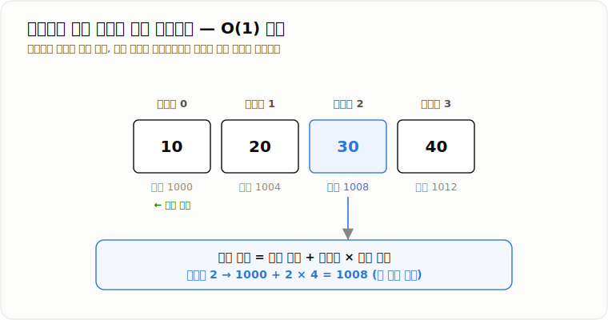
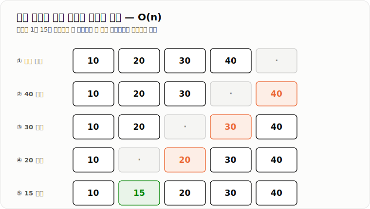

# Array

> **배열(Array)은 같은 타입의 여러 데이터를 고정된 크기의 연속된 저장 공간에 보관하고, 인덱스를 이용해 빠르게 접근하는 자료구조다.**

---

## 1. 핵심 요약

* 배열은 **같은 타입의 데이터**를 하나의 묶음으로 관리한다.
* 배열의 크기는 생성 시 결정되며 이후 변경할 수 없다.
* 특정 인덱스의 원소는 **O(1)** 시간에 조회하고 수정할 수 있다.
* 값 검색과 중간 삽입·삭제는 여러 원소를 확인하거나 이동해야 하므로 **O(n)**이다.
* 데이터 크기가 자주 변하면 배열보다 `ArrayList`가 더 적합한 경우가 많다.

---

## 2. 등장 배경

### 해결하려는 문제

관련된 데이터가 여러 개 있을 때 각각 별도의 변수로 관리하면 코드가 복잡해진다.

```java
int score1 = 90;
int score2 = 80;
int score3 = 70;
int score4 = 100;
```

데이터가 많아질수록 다음 작업이 어려워진다.

* 모든 데이터를 반복 처리하기 어렵다.
* 특정 순번의 데이터를 찾기 어렵다.
* 합계, 평균, 최대값 등을 계산하기 어렵다.
* 데이터 개수가 늘어날 때 변수를 계속 추가해야 한다.

배열을 사용하면 같은 종류의 데이터를 하나의 변수 아래에 모을 수 있다.

```java
int[] scores = {90, 80, 70, 100};
```

이후 인덱스와 반복문을 이용해 데이터를 일관된 방식으로 처리할 수 있다.

### 이 개념이 없을 때

배열이 없다면 다음과 같은 문제가 발생한다.

* 동일한 목적의 변수를 여러 개 선언해야 한다.
* 데이터 수만큼 코드가 반복된다.
* 반복문과 알고리즘을 적용하기 어렵다.
* 정렬, 검색, 통계 계산 같은 일괄 처리가 복잡해진다.
* 파일이나 네트워크의 바이트 데이터를 묶어서 처리하기 어렵다.

배열은 **여러 데이터를 순서대로 저장하고 일괄 처리하기 위한 가장 기본적인 자료구조**다.

---

## 3. 핵심 개념

| 개념           | 설명                                        | 중요한 이유                           |
| ------------ | ----------------------------------------- | -------------------------------- |
| **원소**       | 배열 안에 저장된 각각의 값                           | 배열이 실제로 관리하는 데이터 단위다             |
| **인덱스**      | 원소의 위치를 나타내는 번호                           | 특정 위치의 원소에 빠르게 접근할 수 있다          |
| **길이**       | 배열이 가진 전체 저장 공간의 개수                       | 접근 가능한 인덱스 범위를 결정한다              |
| **고정 크기**    | 생성 후 배열의 길이를 변경할 수 없는 특성                  | 단순하고 빠른 구조를 제공하지만 확장이 불편하다       |
| **같은 타입**    | 하나의 배열에는 동일한 타입의 값만 저장한다                  | 원소의 저장 방식과 처리 규칙을 일정하게 유지한다      |
| **기본형 배열**   | `int`, `long`, `boolean` 등의 값을 직접 저장하는 배열 | 객체 참조 없이 값을 저장해 구조가 단순하다         |
| **참조형 배열**   | 객체 자체가 아니라 객체를 가리키는 참조를 저장하는 배열           | 배열과 실제 객체가 별도로 존재한다              |
| **배열 참조 변수** | 힙에 생성된 배열 객체를 가리키는 변수                     | 배열 변수 대입과 배열 복사의 차이를 이해하는 데 중요하다 |
| **배열 복사**    | 새로운 배열을 만들고 기존 원소를 옮기는 작업                 | 배열 크기 확장이나 독립적인 복사본 생성에 필요하다     |
| **순차 접근**    | 첫 번째 원소부터 마지막 원소까지 차례로 읽는 방식              | 전체 조회, 검색, 합계 계산 등에 사용된다         |

배열의 각 원소는 인덱스와 연결된다.

```text
인덱스:   0     1     2     3
원소:   [10]  [20]  [30]  [40]
```

길이가 `n`인 배열의 유효한 인덱스 범위는 다음과 같다.

```text
0 ~ n - 1
```

배열 변수는 배열의 값을 직접 담는 것이 아니라 배열 객체를 가리킨다.

```text
스택 또는 지역 변수 영역             힙 영역

numbers ─────────────────────────→ [10][20][30]
배열 참조 변수                       배열 객체
```

기본형 배열은 값을 직접 저장한다.

```text
int[] numbers

[10][20][30]
```

참조형 배열은 객체의 참조를 저장한다.

```text
User[] users

[참조 A][참조 B]
    ↓      ↓
 User    User
 객체     객체
```

---

## 4. 구조와 동작 원리

```text
배열 생성 요청
      ↓
원소 타입과 배열 길이 확인
      ↓
배열 객체를 위한 메모리 확보
      ↓
각 원소를 기본값으로 초기화
      ↓
배열 참조를 변수에 저장
      ↓
인덱스를 이용해 조회 또는 수정
```

배열의 특정 원소에 접근하는 과정은 다음과 같다.

```text
인덱스 입력
    ↓
배열 참조 확인
    ↓
인덱스 범위 검사
    ↓
배열 시작 위치를 기준으로 원소 위치 계산
    ↓
원소 조회 또는 값 변경
    ↓
결과 반환
```

실제 동작 과정은 다음과 같다.

1. `new int[4]`를 실행하면 길이가 4인 배열 객체를 생성한다.
2. `int` 배열의 각 원소를 기본값인 `0`으로 초기화한다.
3. 생성된 배열 객체의 참조를 배열 변수에 저장한다.
4. `numbers[2]`처럼 인덱스를 사용하면 해당 위치를 계산한다.
5. 인덱스가 유효한 범위인지 검사한다.
6. 조회라면 값을 반환하고, 수정이라면 기존 값을 새 값으로 덮어쓴다.
7. 범위를 벗어난 인덱스를 사용하면 `ArrayIndexOutOfBoundsException`이 발생한다.

배열의 특정 인덱스를 빠르게 찾을 수 있는 이유는 개념적으로 다음 계산이 가능하기 때문이다.

```text
원소 위치 = 배열 시작 위치 + 인덱스 × 원소 크기
```

예를 들어 각 원소가 4바이트라고 가정하면 다음과 같다.

```text
배열 시작 위치: 1000

인덱스 0 → 1000 + 0 × 4
인덱스 1 → 1000 + 1 × 4
인덱스 2 → 1000 + 2 × 4
```

Java 코드에서 실제 메모리 주소를 직접 계산하지는 않는다. 다만 이 구조 덕분에 처음부터 원소를 하나씩 찾지 않고 원하는 위치에 접근할 수 있다.



*시작 위치와 인덱스만으로 원소의 위치를 한 번에 계산하므로 인덱스 조회는 O(1)이다.*

배열 중간에 데이터를 삽입하려면 기존 원소를 이동해야 한다.

```text
기존 배열

[10][20][30][40][ ]

인덱스 1에 15 삽입

[10][20][30][40][40]
[10][20][30][30][40]
[10][20][20][30][40]
[10][15][20][30][40]
```



*삽입 위치 이후의 원소를 모두 밀어야 하므로 중간 삽입은 O(n)이다.*

삭제할 때도 뒤의 원소를 앞으로 이동해야 한다.

```text
기존 배열

[10][20][30][40]

20 삭제

[10][30][30][40]
[10][30][40][40]

논리적 결과

[10][30][40][빈 공간]
```

---

## 5. 코드 또는 사용 예시

```java
import java.util.Arrays;

public class ArrayExample {

    public static void main(String[] args) {
        int[] scores = {90, 80, 70, 100};

        System.out.println("첫 번째 점수: " + scores[0]);

        scores[1] = 85;

        int sum = 0;

        for (int i = 0; i < scores.length; i++) {
            sum += scores[i];
        }

        int[] copiedScores = Arrays.copyOf(scores, scores.length);

        copiedScores[0] = 50;

        System.out.println("원본: " + Arrays.toString(scores));
        System.out.println("복사본: " + Arrays.toString(copiedScores));
        System.out.println("합계: " + sum);
    }
}
```

`int[] scores`는 정수 값을 저장할 배열 변수를 선언한다.

```java
int[] scores = {90, 80, 70, 100};
```

배열 리터럴을 사용해 원소를 저장한다.

```java
scores[0]
```

인덱스 `0`의 원소를 조회한다.

```java
scores[1] = 85;
```

인덱스 `1`의 기존 값을 `85`로 수정한다.

```java
for (int i = 0; i < scores.length; i++)
```

배열의 첫 번째 원소부터 마지막 원소까지 순회한다. 조건을 `i < scores.length`로 작성해야 배열 범위를 벗어나지 않는다.

```java
Arrays.copyOf(scores, scores.length)
```

새로운 배열을 만들고 기존 원소를 복사한다.

다음 코드는 배열 복사가 아니다.

```java
int[] copiedScores = scores;
```

두 변수가 같은 배열 객체를 가리킨다.

```text
scores ───────┐
              ↓
           [90][85][70][100]
              ↑
copiedScores ─┘
```

Spring에서는 여러 요청 파라미터를 배열로 받을 수 있다.

```java
import org.springframework.web.bind.annotation.GetMapping;
import org.springframework.web.bind.annotation.RequestParam;
import org.springframework.web.bind.annotation.RestController;

@RestController
public class ProductController {

    @GetMapping("/products")
    public Long[] findProducts(@RequestParam Long[] ids) {
        return ids;
    }
}
```

다음과 같은 요청이 들어오면 Spring이 여러 값을 배열로 변환한다.

```text
GET /products?ids=1&ids=2&ids=3
```

```text
ids = [1, 2, 3]
```

실무에서는 데이터 개수가 변할 가능성이 높다면 `Long[]`보다 `List<Long>`을 사용하는 경우도 많다.

---

## 6. 성능 특성

| 연산        | 평균 시간 복잡도 | 최악 시간 복잡도 | 설명                               |
| --------- | --------: | --------: | -------------------------------- |
| 인덱스 조회    |      O(1) |      O(1) | 인덱스를 이용해 원소 위치를 바로 계산한다          |
| 값 검색      |      O(n) |      O(n) | 값의 위치를 모르면 원소를 하나씩 비교해야 한다       |
| 인덱스 수정    |      O(1) |      O(1) | 해당 위치의 값을 바로 덮어쓴다                |
| 마지막 위치 삽입 |      O(1) |      O(1) | 사용 가능한 빈 공간과 논리적 크기를 별도로 관리하는 경우 |
| 중간 삽입     |      O(n) |      O(n) | 삽입 위치 이후의 원소들을 뒤로 이동해야 한다        |
| 중간 삭제     |      O(n) |      O(n) | 삭제 위치 이후의 원소들을 앞으로 이동해야 한다       |
| 전체 순회     |      O(n) |      O(n) | 모든 원소를 한 번씩 확인한다                 |
| 배열 복사     |      O(n) |      O(n) | 기존 원소를 새로운 배열에 모두 옮겨야 한다         |

배열의 공간 복잡도는 원소 개수에 비례하므로 **O(n)**이다.

기본형 배열은 배열 안에 값이 직접 저장된다.

```text
int[] numbers

[10][20][30]
```

참조형 배열은 객체 참조를 저장하고 실제 객체는 별도의 메모리를 사용한다.

```text
User[] users

[참조][참조][참조]
  ↓     ↓     ↓
객체   객체   객체
```

데이터가 많아져도 특정 인덱스의 조회는 `O(1)`이다. 그러나 다음 비용은 증가한다.

* 전체 순회 시간
* 값 검색 시간
* 배열 복사 시간
* 메모리 사용량
* 큰 배열의 생성과 제거에 따른 GC 부담

대용량 파일을 하나의 거대한 `byte[]`로 읽으면 메모리 부족이 발생할 수 있다.

```java
byte[] file = inputStream.readAllBytes();
```

큰 파일에서는 일정 크기의 버퍼를 반복 사용하는 스트리밍 방식이 더 적합할 수 있다.

---

## 7. 장점과 단점

| 장점                  | 이유                                         |
| ------------------- | ------------------------------------------ |
| 인덱스 조회가 빠르다         | 배열의 시작 위치와 인덱스를 이용해 원소 위치를 바로 계산할 수 있다     |
| 구조가 단순하다            | 인덱스와 원소의 관계가 명확하고 반복문을 적용하기 쉽다             |
| 순차 접근 성능이 좋다        | 원소들이 가까운 위치에 저장되어 CPU 캐시를 활용하기 유리하다        |
| 기본형 데이터를 효율적으로 저장한다 | `int[]`는 `Integer` 객체 없이 정수 값을 직접 저장할 수 있다 |
| 메모리 사용량을 예측하기 쉽다    | 생성 시 길이가 결정되므로 필요한 저장 공간을 미리 알 수 있다        |

| 단점                      | 이유 및 주의점                                              |
| ----------------------- | ----------------------------------------------------- |
| 크기를 변경할 수 없다            | 더 큰 공간이 필요하면 새로운 배열을 만들고 전체 원소를 복사해야 한다               |
| 중간 삽입과 삭제가 느리다          | 순서를 유지하기 위해 뒤쪽 원소를 이동해야 한다                            |
| 실제 데이터 개수를 따로 관리해야 한다   | 배열 길이와 실제로 저장된 원소 수는 다를 수 있다                          |
| 편의 기능이 부족하다             | `add`, `remove`, `contains` 같은 기능을 직접 구현해야 한다         |
| 크기를 크게 잡으면 메모리가 낭비된다    | 사용하지 않는 원소 공간도 배열이 유지되는 동안 메모리를 차지한다                  |
| 객체 배열은 `null`을 포함할 수 있다 | 객체를 생성하지 않은 위치에 접근하면 `NullPointerException`이 발생할 수 있다 |

---

## 8. 사용 기준

### 사용하기 좋은 상황

* 데이터 개수가 미리 정해져 있는 경우
* 인덱스를 이용한 조회가 자주 필요한 경우
* 원소 추가와 삭제가 거의 없는 경우
* 기본형 데이터를 대량으로 저장하는 경우
* 파일이나 네트워크 데이터를 `byte[]` 버퍼로 처리하는 경우
* 알고리즘에서 방문 여부, 거리, 점수 등을 순번 기준으로 관리하는 경우
* 월, 요일, 고정 슬롯처럼 데이터 개수가 고정된 경우

### 사용하지 않는 것이 좋은 상황

* 데이터 개수가 계속 증가하거나 감소하는 경우
* 중간 삽입과 삭제가 자주 발생하는 경우
* 사용자 ID나 상품 코드처럼 의미 있는 키로 데이터를 조회해야 하는 경우
* 중복을 자동으로 제거해야 하는 경우
* 대용량 파일 전체를 한 번에 메모리에 저장해야 하는 경우
* 실제 데이터 크기를 예측하기 어려운 경우

### 선택 기준

배열을 선택하기 전 다음 조건을 확인한다.

1. 데이터 개수가 고정되어 있는가?
2. 원소의 순서와 인덱스가 중요한가?
3. 조회와 수정이 많고 삽입·삭제가 적은가?
4. 같은 타입의 데이터를 저장하는가?
5. 크기 변경 기능이 필요한가?
6. 기본형 데이터의 메모리 효율이 중요한가?
7. 키 기반 조회나 중복 제거가 필요한가?

다음 조건이라면 배열이 적합하다.

```text
고정된 크기
+
인덱스 중심 접근
+
삽입과 삭제가 적음
```

다음 조건이라면 다른 자료구조를 검토한다.

```text
가변 크기 → ArrayList
키 기반 조회 → Map
중복 제거 → Set
```

---

## 9. 비슷한 개념 비교

### Array와 ArrayList

| 비교 항목  | Array                | ArrayList                      | 선택 기준                         |
| ------ | -------------------- | ------------------------------ | ----------------------------- |
| 목적     | 고정된 크기의 데이터를 인덱스로 관리 | 개수가 변하는 데이터를 편리하게 관리           | 크기 변경 필요 여부                   |
| 크기     | 생성 후 변경 불가           | 내부 배열을 확장할 수 있음                | 데이터 개수가 고정이면 배열               |
| 인덱스 조회 | O(1)                 | O(1)                           | 조회 성능은 비슷함                    |
| 중간 삽입  | O(n)                 | O(n)                           | 둘 다 원소 이동이 필요함                |
| 중간 삭제  | O(n)                 | O(n)                           | 둘 다 원소 이동이 필요함                |
| 기본형 저장 | 직접 저장 가능             | 래퍼 타입 사용                       | 기본형 대량 저장이면 배열이 유리할 수 있음      |
| 편의 기능  | 부족함                  | `add`, `remove`, `contains` 제공 | 관리 편의성이 중요하면 ArrayList        |
| 장점     | 단순하고 메모리 구조가 효율적     | 동적 크기와 다양한 메서드 제공              | 요구사항에 따라 선택                   |
| 단점     | 크기 변경이 어렵다           | 확장 시 배열 복사와 여유 공간이 발생한다        | 데이터 변화 빈도를 고려                 |
| 적합한 상황 | 고정 크기 데이터            | 일반적인 가변 목록                     | 실무의 목록 데이터는 ArrayList가 자주 사용됨 |

`ArrayList`는 내부적으로 배열을 사용한다.

```text
ArrayList
    ↓
내부 배열에 데이터 저장
    ↓
공간 부족
    ↓
더 큰 배열 생성
    ↓
기존 원소 복사
    ↓
새 배열로 교체
```

### Array와 LinkedList

| 비교 항목  | Array         | LinkedList                | 선택 기준                           |
| ------ | ------------- | ------------------------- | ------------------------------- |
| 목적     | 인덱스 기반 빠른 접근  | 노드 간 연결을 이용한 데이터 관리       | 조회 방식과 수정 방식                    |
| 저장 구조  | 원소가 순서대로 저장됨  | 각 노드가 다음 또는 이전 노드를 참조함    | 메모리 구조 차이                       |
| 인덱스 조회 | O(1)          | O(n)                      | 인덱스 조회가 많으면 배열                  |
| 위치 탐색  | O(1)          | O(n)                      | 순번 접근은 배열이 유리                   |
| 삽입·삭제  | 원소 이동 필요      | 위치를 이미 알고 있다면 연결 변경       | 위치 탐색 비용도 함께 고려                 |
| 메모리    | 원소 중심         | 노드마다 참조 정보 필요             | 메모리 효율은 배열이 유리한 편               |
| 순차 접근  | 캐시 효율이 좋은 편   | 노드가 흩어질 수 있음              | 반복 조회가 많으면 배열 계열                |
| 적합한 상황 | 조회와 순회가 많은 경우 | 특정 노드를 알고 있고 연결 변경이 많은 경우 | 단순히 삽입이 많다고 LinkedList를 선택하지 않음 |

`LinkedList`도 삽입 위치를 인덱스로 찾아야 한다면 위치 탐색에 `O(n)`이 필요하다.

### Array와 Map

| 비교 항목  | Array       | Map                 | 선택 기준             |
| ------ | ----------- | ------------------- | ----------------- |
| 접근 기준  | 정수 인덱스      | 임의의 키               | 데이터 식별 방식         |
| 예시     | `users[0]`  | `users.get(userId)` | 순번인지 의미 있는 키인지 확인 |
| 조회     | 인덱스 조회 O(1) | `HashMap` 평균 O(1)   | 조회 기준이 다름         |
| 값 검색   | O(n)        | 키 조회 평균 O(1)        | ID 기반 조회라면 Map    |
| 순서     | 인덱스로 순서 표현  | 구현에 따라 다름           | 순서가 핵심이면 배열       |
| 적합한 상황 | 연속된 번호로 접근  | 사용자 ID, 상품 코드로 접근   | 키 기반 조회 여부        |

### Array와 Set

| 비교 항목    | Array        | Set               | 선택 기준             |
| -------- | ------------ | ----------------- | ----------------- |
| 목적       | 순서와 위치 기반 관리 | 중복 없는 데이터 관리      | 중복 허용 여부          |
| 중복       | 허용           | 허용하지 않음           | 중복 제거가 필요하면 Set   |
| 인덱스      | 존재           | 일반적으로 없음          | 위치 접근이 필요하면 배열    |
| 포함 여부 검색 | O(n)         | `HashSet` 평균 O(1) | 포함 여부 확인이 많으면 Set |
| 적합한 상황   | 순서와 위치가 중요함  | 중복 방지와 존재 확인이 중요함 | 요구사항에 따라 선택       |

---

## 10. 백엔드 실무 적용

### Spring·Java

Java 배열은 언어 자체에서 제공하는 기본 자료구조다.

다음과 같은 영역에서 사용된다.

* 메서드에 여러 인자를 전달하는 **가변 인자**
* 파일과 네트워크 데이터의 `byte[]`
* 정렬과 탐색 알고리즘
* 리플렉션의 클래스 및 파라미터 정보
* `ArrayList` 내부 저장 공간
* 요청 파라미터와 JSON 배열 바인딩

가변 인자는 내부적으로 배열로 처리된다.

```java
public void printNames(String... names) {
    for (int i = 0; i < names.length; i++) {
        System.out.println(names[i]);
    }
}
```

다음 호출은 개념적으로 문자열 배열을 전달하는 것과 같다.

```java
printNames("Kim", "Lee", "Park");
```

```java
printNames(new String[]{"Kim", "Lee", "Park"});
```

Spring에서는 여러 요청 파라미터를 배열로 받을 수 있다.

```java
@GetMapping("/users")
public Long[] findUsers(@RequestParam Long[] ids) {
    return ids;
}
```

JSON 배열도 Java 배열로 바인딩할 수 있다.

```json
{
  "productIds": [1, 2, 3]
}
```

```java
public class OrderRequest {

    private Long[] productIds;

    public Long[] getProductIds() {
        return productIds;
    }

    public void setProductIds(Long[] productIds) {
        this.productIds = productIds;
    }
}
```

실무 DTO에서는 데이터 개수가 가변적이라는 의미를 명확히 하고 편의 메서드를 활용하기 위해 `List<Long>`을 사용하는 경우가 많다.

파일과 네트워크 데이터는 바이트 배열로 처리할 수 있다.

```java
byte[] buffer = new byte[8192];
```

```text
네트워크 또는 파일 입력
          ↓
고정 크기 byte[] 버퍼
          ↓
읽은 데이터 처리
          ↓
다음 데이터 읽기
```

### 데이터베이스·캐시

여러 ID를 데이터베이스 조회 조건으로 전달할 때 배열이나 리스트를 사용할 수 있다.

```java
Long[] userIds = {1L, 2L, 3L};
```

```sql
SELECT *
FROM users
WHERE id IN (1, 2, 3);
```

배열의 원소가 너무 많으면 거대한 `IN` 쿼리가 만들어질 수 있다.

이 경우 다음 비용이 증가할 수 있다.

* SQL 문자열 길이
* SQL 파싱 비용
* 네트워크 전송량
* 데이터베이스 실행 계획 처리 비용
* 결과 데이터 처리 비용

대량 ID 조회는 배열을 무한히 크게 전달하기보다 배치 단위로 나누거나 다른 처리 방식을 검토해야 한다.

Redis에서는 Java 배열 자체를 저장 구조로 사용하는 것은 아니다. 하지만 여러 키를 애플리케이션에서 묶어 전달할 때 배열이나 리스트를 사용할 수 있다.

```java
String[] keys = {
    "user:1",
    "user:2",
    "user:3"
};
```

캐시는 키 기반 접근이 중요하므로 실제 비즈니스 코드에서는 배열보다 `List`나 `Map`이 더 자연스러운 경우가 많다.

### 동시성·분산 환경

배열은 자체적으로 스레드 안전하지 않다.

```java
int[] requestCounts = new int[10];

requestCounts[0]++;
```

`requestCounts[0]++`는 하나의 동작처럼 보이지만 개념적으로 다음 과정으로 나뉜다.

```text
현재 값 읽기
    ↓
1 더하기
    ↓
결과 저장
```

두 스레드가 동시에 실행하면 증가 결과가 유실될 수 있다.

```text
초기값: 0

스레드 A → 0 읽음
스레드 B → 0 읽음
스레드 A → 1 저장
스레드 B → 1 저장

예상값: 2
실제값: 1
```

여러 스레드가 같은 배열을 수정한다면 다음을 검토해야 한다.

* `synchronized`
* 락을 이용한 동기화
* `AtomicIntegerArray`
* 스레드별 배열 분리
* 변경하지 않는 불변 데이터 사용

여러 서버가 실행되는 분산 환경에서는 서버마다 메모리가 분리되어 있다.

```text
서버 A의 배열 ≠ 서버 B의 배열
```

한 서버의 배열을 수정해도 다른 서버에는 반영되지 않는다.

서버 간에 동일한 상태를 공유해야 한다면 다음과 같은 외부 저장소가 필요할 수 있다.

* 데이터베이스
* Redis
* 메시지 브로커
* 분산 캐시

배열은 한 JVM 내부의 메모리 구조이지, 여러 서버의 상태를 자동으로 공유해주는 구조가 아니다.

---

## 11. 자주 하는 오해

| 잘못된 이해                          | 올바른 이해                                                    |
| ------------------------------- | --------------------------------------------------------- |
| 배열의 길이는 실제 데이터 개수다              | 배열 길이는 전체 저장 공간의 개수다. 실제 저장된 데이터 수와 다를 수 있다               |
| 배열 인덱스는 1부터 시작한다                | Java 배열의 첫 번째 인덱스는 0이다                                    |
| 길이가 `n`이면 인덱스 `n`까지 접근할 수 있다    | 마지막 유효 인덱스는 `n - 1`이다                                     |
| 배열 변수끼리 대입하면 원소가 복사된다           | 참조만 복사되어 두 변수가 같은 배열 객체를 가리킨다                             |
| 배열은 모든 조회가 O(1)이다               | 인덱스를 알고 있는 조회만 O(1)이고 값 검색은 O(n)이다                        |
| 배열 중간에 값을 대입하면 삽입된다             | 기존 값을 덮어쓸 뿐이다. 삽입하려면 원소를 이동해야 한다                          |
| 배열은 공간이 부족하면 자동으로 늘어난다          | 배열 크기는 고정이다. 더 큰 배열을 만들고 복사해야 한다                          |
| 객체 배열을 생성하면 객체도 자동 생성된다         | 객체 참조를 저장할 공간만 생성되며 각 원소는 기본적으로 `null`이다                  |
| ArrayList는 배열과 완전히 다른 구조다       | ArrayList는 내부적으로 배열을 사용하며 부족할 때 더 큰 배열로 교체한다              |
| LinkedList는 중간 삽입이 항상 O(1)이다    | 삽입할 노드를 이미 알고 있을 때 연결 변경이 O(1)이다. 인덱스로 위치를 찾으면 O(n)이 필요하다 |
| 큰 파일은 `byte[]` 하나로 읽는 것이 항상 빠르다 | 큰 배열은 메모리와 GC 부담이 크므로 스트리밍이 더 안전할 수 있다                    |
| 같은 배열을 여러 스레드가 수정해도 문제없다        | 배열은 자동으로 동기화되지 않으며 경쟁 상태가 발생할 수 있다                        |

---

## 12. 면접 답변

### 기본 답변

배열은 같은 타입의 여러 데이터를 고정된 크기의 저장 공간에 순서대로 저장하고, 인덱스로 접근하는 자료구조입니다.

배열은 시작 위치와 인덱스를 이용해 특정 원소의 위치를 바로 찾을 수 있기 때문에 인덱스 조회와 수정은 O(1)입니다. 반면 값의 위치를 모르는 검색은 전체 원소를 확인해야 해서 O(n)이고, 중간 삽입과 삭제도 뒤쪽 원소를 이동해야 해서 O(n)입니다.

장점은 구조가 단순하고 인덱스 접근과 순차 조회가 빠르다는 점입니다. 단점은 생성 후 크기를 변경할 수 없고, 데이터 추가와 삭제를 직접 관리해야 한다는 점입니다.

따라서 데이터 개수가 고정되어 있고 인덱스 기반 조회가 중요한 경우 배열을 사용합니다. 데이터 개수가 자주 변한다면 내부적으로 배열을 사용하면서 크기 확장을 지원하는 `ArrayList`를 주로 선택합니다.

### 답변 구조

* **정의**

    * 같은 타입의 여러 데이터를 고정된 크기로 저장
    * 인덱스로 원소에 접근

* **내부 원리**

    * `배열 시작 위치 + 인덱스 × 원소 크기`로 원소 위치를 바로 계산
    * 처음부터 순차 탐색하지 않고 원하는 위치에 접근

* **복잡도**

    * `O(1)`: 인덱스 조회와 수정 (위치를 바로 계산)
    * `O(n)`: 값 검색(선형 탐색), 중간 삽입·삭제(원소 이동), 전체 순회, 배열 복사
    * 공간 복잡도는 원소 개수에 비례해 `O(n)`

* **장점**

    * 빠른 인덱스 접근
    * 단순한 구조와 좋은 순차 접근(캐시) 효율
    * 기본형 데이터 저장 시 메모리 효율이 좋은 편

* **단점**

    * 생성 후 크기 변경 불가
    * 중간 삽입·삭제 `O(n)`
    * 실제 데이터 수를 별도로 관리해야 함

* **사용 기준**

    * 데이터 개수가 고정되어 있고 인덱스 조회가 많은 경우
    * 삽입·삭제가 적고 원소의 순서·위치가 중요한 경우

* **대안과 비교**

    * 크기가 자주 변하면 내부 배열을 확장하는 `ArrayList`
    * 키 기반 조회는 `Map`, 중복 제거는 `Set`
    * 순번 조회·순회가 많으면 `LinkedList`보다 배열 계열이 유리

* **실무 적용 사례**

    * 파일·네트워크의 고정 크기 `byte[]` 버퍼
    * 가변 인자, 요청 파라미터·JSON 배열 바인딩
    * 정렬·탐색 알고리즘의 기본 저장 구조

---

## 13. 예상 면접 질문

### 기본 질문

1. **배열이란 무엇인가요?**

    * 핵심 키워드: 같은 타입, 고정 크기, 인덱스, 순서, `O(1)` 접근

2. **배열의 인덱스 조회가 O(1)인 이유는 무엇인가요?**

    * 핵심 키워드: 배열 시작 위치, 인덱스, 원소 크기, 위치 계산, 순차 탐색 불필요

3. **배열과 ArrayList의 차이는 무엇인가요?**

    * 핵심 키워드: 고정 크기, 동적 확장, 내부 배열, 편의 메서드, 기본형과 래퍼 타입

4. **배열에서 값 검색은 왜 O(n)인가요?**

    * 핵심 키워드: 값의 위치를 모름, 순차 비교, 최악의 경우 전체 조회, 선형 탐색

5. **배열의 중간 삽입과 삭제가 느린 이유는 무엇인가요?**

    * 핵심 키워드: 순서 유지, 뒤쪽 원소 이동, 최대 n개 이동, `O(n)`

6. **기본형 배열과 참조형 배열의 차이는 무엇인가요?**

    * 핵심 키워드: 값 직접 저장, 객체 참조 저장, 기본값, `null`, 객체 별도 생성

7. **배열 변수 대입과 배열 복사의 차이는 무엇인가요?**

    * 핵심 키워드: 참조 복사, 같은 배열 객체, 변경 공유, `Arrays.copyOf`

### 꼬리 질문

1. **ArrayList의 인덱스 조회도 왜 O(1)인가요?**

    * 핵심 키워드: 내부 배열, 인덱스 접근, 배열 기반 구현

2. **ArrayList의 크기가 부족하면 내부에서 어떤 일이 발생하나요?**

    * 핵심 키워드: 더 큰 배열 생성, 기존 원소 복사, 새 배열 교체, 확장 비용 `O(n)`

3. **배열은 값 검색도 O(1)이라고 할 수 있나요?**

    * 핵심 키워드: 인덱스 조회와 값 검색 구분, 위치를 알고 있는지 여부, 선형 탐색 `O(n)`

4. **객체 배열을 복사하면 내부 객체도 새로운 객체로 복사되나요?**

    * 핵심 키워드: 배열 객체 복사, 원소 참조 복사, 객체 공유, 얕은 복사

5. **대용량 파일을 byte 배열로 한 번에 읽으면 어떤 문제가 생기나요?**

    * 핵심 키워드: 메모리 사용량, 동시 요청, GC 부담, `OutOfMemoryError`, 스트리밍

6. **배열은 스레드 안전한가요?**

    * 핵심 키워드: 자체 동기화 없음, 경쟁 상태, 원자성, 동기화, `AtomicIntegerArray`

7. **LinkedList의 중간 삽입은 항상 배열보다 빠른가요?**

    * 핵심 키워드: 위치 탐색 `O(n)`, 노드를 알고 있을 때 연결 변경 `O(1)`, 캐시 효율, 실제 사용 패턴

8. **배열을 지나치게 크게 생성하면 어떤 문제가 발생하나요?**

    * 핵심 키워드: 메모리 낭비, 큰 연속 공간, GC 부담, `OutOfMemoryError`

---

## 14. 추가 학습 방향

### 바로 이어서 공부

| 키워드              | 연결되는 이유                                  |
| ---------------- | ---------------------------------------- |
| **ArrayList**    | 배열을 내부 저장소로 사용하면서 동적 크기와 편의 메서드를 제공한다    |
| **선형 탐색**        | 배열에서 특정 값을 처음부터 순서대로 찾는 기본 검색 방식이다       |
| **이진 탐색**        | 정렬된 배열에서 인덱스 접근을 활용해 검색 범위를 절반씩 줄인다      |
| **정렬 알고리즘**      | 배열 원소의 순서를 변경하며 시간 복잡도와 데이터 이동을 학습할 수 있다 |
| **얕은 복사와 깊은 복사** | 객체 배열 복사 시 배열과 내부 객체가 어떻게 공유되는지 이해할 수 있다 |

### 실무 확장

| 키워드                            | 연결되는 이유                                    |
| ------------------------------ | ------------------------------------------ |
| **Java Collections Framework** | 배열, List, Set, Map의 목적과 선택 기준을 함께 비교할 수 있다 |
| **Java I/O**                   | 파일 데이터를 `byte[]` 버퍼 단위로 읽고 쓰는 방식을 배운다      |
| **Java NIO Buffer**            | 배열과 버퍼의 차이와 대용량 입출력 처리 방식을 이해할 수 있다        |
| **Jackson JSON 바인딩**           | JSON 배열이 Java 배열이나 List로 변환되는 과정을 학습한다     |
| **Spring 요청 파라미터 바인딩**         | 여러 HTTP 파라미터를 배열 또는 List로 받는 방식을 이해한다      |
| **JPA IN 쿼리**                  | 배열이나 리스트의 ID를 다건 조회 조건으로 사용하는 방식을 배운다      |
| **Bean Validation**            | 요청 배열과 리스트의 크기와 원소 값을 검증할 수 있다             |
| **파일 스트리밍**                    | 거대한 `byte[]`를 만들지 않고 데이터를 나누어 처리하는 방식을 배운다 |

### 심화 학습

| 키워드                    | 연결되는 이유                                   |
| ---------------------- | ----------------------------------------- |
| **CPU 캐시와 지역성**        | 배열의 연속된 저장 구조가 실제 순회 성능에 미치는 영향을 이해한다     |
| **JVM 메모리 구조**         | 배열 객체, 참조 변수, 객체 헤더, 힙 사용량을 더 깊게 학습한다     |
| **Garbage Collection** | 큰 배열을 반복 생성할 때 발생하는 메모리와 GC 비용을 이해한다      |
| **AtomicIntegerArray** | 여러 스레드가 배열 원소를 안전하게 수정하는 방법을 학습한다         |
| **동시성과 원자성**           | `array[index]++`에서 값이 유실되는 이유를 이해한다       |
| **버퍼 풀링**              | 큰 배열이나 버퍼를 재사용해 객체 생성과 GC 비용을 줄이는 방식을 배운다 |
| **분할 처리와 스트리밍**        | 대용량 데이터를 고정 크기 배열로 나누어 안정적으로 처리한다         |
| **Off-heap 메모리**       | JVM 힙 외부에서 대용량 버퍼를 관리하는 개념으로 확장할 수 있다     |

---

## 15. 최종 체크리스트

* [ ] 개념을 한 문장으로 설명할 수 있다
* [ ] 등장 배경을 설명할 수 있다
* [ ] 내부 동작 과정을 설명할 수 있다
* [ ] 성능 특성을 설명할 수 있다
* [ ] 장점과 단점을 설명할 수 있다
* [ ] 사용할 상황과 사용하지 않을 상황을 구분할 수 있다
* [ ] 비슷한 기술과 비교할 수 있다
* [ ] Spring 백엔드 실무 사례를 설명할 수 있다
* [ ] 기본 면접 질문에 답할 수 있다
* [ ] 조건이 달라졌을 때 대안을 제시할 수 있다

---

## 16. 한 줄 결론

**데이터 개수가 고정되어 있고 인덱스 기반 조회가 중요하며 삽입과 삭제가 적을 때 배열을 선택한다.**
