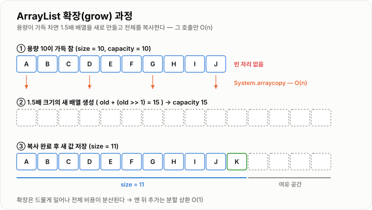

# ArrayList

> **ArrayList는 내부에 배열을 두고, 공간이 부족해지면 더 큰 배열로 옮겨 담아 크기 제한 없이 쓸 수 있게 만든 순서 있는 목록 자료구조다.**

---

## 1. 핵심 요약

* ArrayList는 **내부적으로 배열(`Object[] elementData`)** 을 사용한다.
* 저장된 원소 개수(`size`)와 배열의 용량(`capacity`)은 **서로 다른 값**이다.
* 인덱스 조회와 수정은 **O(1)**, 중간 삽입·삭제와 값 검색은 **O(n)** 이다.
* 공간이 부족하면 **1.5배 크기의 새 배열을 만들고 복사**하며, 이 비용을 나눠 보면 맨 뒤 추가는 **분할 상환 O(1)** 이다.
* 스레드 안전하지 않으며, 순회 중 구조를 바꾸면 `ConcurrentModificationException`이 발생한다.

---

## 2. 등장 배경

### 해결하려는 문제

배열은 생성할 때 크기가 정해지고 이후 바꿀 수 없다.

```java
int[] scores = new int[4];
```

그런데 실무 데이터는 개수를 미리 알 수 없는 경우가 대부분이다.

* 검색 결과가 몇 건일지 모른다.
* 장바구니에 담기는 상품 수가 계속 변한다.
* 요청마다 처리할 항목 수가 다르다.

배열만 쓴다면 개발자가 매번 다음 작업을 직접 해야 한다.

```java
if (size == array.length) {
    int[] newArray = new int[array.length * 2];
    System.arraycopy(array, 0, newArray, 0, array.length);
    array = newArray;
}
array[size++] = value;
```

이 코드가 목록을 쓰는 모든 곳에 중복된다. ArrayList는 **이 확장 로직과 개수 관리를 자료구조 안으로 감춘 것**이다.

### 이 개념이 없을 때

* 배열 크기 확장 코드를 곳곳에 중복 작성해야 한다.
* 실제 데이터 개수(`size`)를 별도 변수로 직접 관리해야 한다.
* 중간 삽입·삭제 시 원소 이동 코드를 직접 써야 한다.
* 크기를 넉넉히 잡으면 메모리가 낭비되고, 작게 잡으면 자주 복사가 일어난다.
* `add`, `remove`, `contains`, `indexOf` 같은 기본 기능을 매번 구현해야 한다.

---

## 3. 핵심 개념

| 개념                     | 설명                                             | 중요한 이유                                           |
| ---------------------- | ---------------------------------------------- | ------------------------------------------------ |
| **elementData**        | 실제 값을 담는 내부 배열 (`Object[]`)                    | ArrayList의 모든 성능 특성이 이 배열에서 나온다                  |
| **size**               | 실제로 저장된 원소의 개수                                 | `size()`가 반환하는 값이며 배열 길이와 다르다                    |
| **capacity(용량)**       | 내부 배열의 실제 길이                                   | 용량이 가득 차야 확장이 일어난다                               |
| **확장(grow)**           | 용량이 부족할 때 더 큰 배열을 만들고 원소를 복사하는 동작              | 삽입 비용이 갑자기 O(n)이 되는 지점이다                         |
| **1.5배 증가 정책**         | `newCapacity = oldCapacity + (oldCapacity>>1)` | 복사 횟수와 메모리 낭비 사이의 절충안이다                          |
| **기본 용량 10**           | 첫 `add` 시점에 배열을 길이 10으로 만드는 규칙                 | 생성만 하고 안 쓰는 리스트의 메모리를 아끼기 위해 **지연 생성**된다          |
| **분할 상환(Amortized)**   | 가끔 발생하는 큰 비용을 전체 연산 수로 나눠 평가하는 방식              | 맨 뒤 추가가 평균적으로 O(1)인 이유다                          |
| **modCount**           | 구조가 바뀐 횟수를 세는 카운터                              | 반복자가 "순회 중 변경"을 감지하는 근거다                         |
| **fail-fast 반복자**      | 순회 중 구조 변경을 감지하면 즉시 예외를 던지는 반복자                | 조용히 잘못된 결과를 내는 대신 즉시 실패하게 만든다                    |
| **오토박싱**               | `int` 값을 `Integer` 객체로 자동 변환하는 동작              | `List<Integer>`가 `int[]`보다 메모리를 많이 쓰는 원인이다       |
| **`List` 인터페이스**       | ArrayList가 구현한 "순서 있는 목록" 규약                   | 변수 타입을 `List`로 두면 구현체를 바꿔 끼울 수 있다                |

개념 간 관계는 다음과 같다.

```text
List (인터페이스 · 규약)
        ↑ 구현
   ArrayList
        │ 내부에 보유
        ↓
  Object[] elementData   ←── capacity(배열 길이)
        │
        └── 앞에서부터 size개만 유효한 데이터
```

`size`와 `capacity`의 차이는 다음 그림이 핵심이다.

```text
capacity = 10
size     = 4

[A][B][C][D][ ][ ][ ][ ][ ][ ]
 └──── size ────┘└─ 아직 안 쓴 여유 공간 ─┘
```

---

## 4. 구조와 동작 원리

```text
new ArrayList<>()
        ↓
빈 배열만 참조 (아직 크기 0, 메모리 거의 안 씀)
        ↓
첫 add() 호출
        ↓
길이 10짜리 배열 생성
        ↓
elementData[size++] = value
        ↓
size == capacity 가 되는 순간
        ↓
capacity * 1.5 크기의 새 배열 생성 → 전체 복사 → 참조 교체
```

맨 뒤에 값을 추가하는 실제 동작 과정은 다음과 같다.

1. `add(value)`를 호출한다.
2. `size + 1`이 현재 배열 길이보다 큰지 확인한다.
3. 크지 않으면 `elementData[size] = value`로 바로 저장하고 `size`를 1 늘린다. → **O(1)**
4. 크다면 `oldCapacity + (oldCapacity >> 1)` 크기의 새 배열을 만든다.
5. `System.arraycopy`로 기존 원소를 전부 새 배열로 옮긴다. → **O(n)**
6. `elementData` 참조를 새 배열로 교체한다. 기존 배열은 GC 대상이 된다.
7. 새 배열에 값을 저장하고 `size`를 1 늘린다.
8. `modCount`를 1 증가시킨다.

용량 변화는 다음과 같이 진행된다.

```text
10 → 15 → 22 → 33 → 49 → 73 → 109 → ...
     (직전 용량 + 직전 용량 / 2)
```



*확장이 일어나는 그 호출만 O(n)이고, 비용이 전체 삽입에 분산되어 평균은 O(1)이 된다.*

중간 삽입은 뒤쪽 원소를 한 칸씩 밀어야 한다.

```text
add(1, X)

[A][B][C][D][ ]
       ↓ 뒤에서부터 한 칸씩 이동
[A][B][C][D][D]
[A][B][C][C][D]
[A][B][B][C][D]
[A][X][B][C][D]
```

중간 삭제는 뒤쪽 원소를 앞으로 당긴다.

```text
remove(1)

[A][B][C][D]
       ↓
[A][C][C][D]
[A][C][D][D]
[A][C][D][null]   ← 마지막 칸은 null로 비워 GC를 돕는다
size: 4 → 3
```

> **왜 마지막 칸을 `null`로 만드나?**
> 배열에 남은 참조가 있으면 그 객체가 계속 살아 있는 것으로 취급되어 GC가 회수하지 못한다. 이런 현상을 **메모리 누수(leak)** 라고 하며, ArrayList는 이를 막기 위해 명시적으로 `null`을 넣는다.

---

## 5. 코드 또는 사용 예시

```java
import java.util.ArrayList;
import java.util.List;

public class ArrayListExample {

    public static void main(String[] args) {
        List<String> names = new ArrayList<>();

        names.add("Kim");
        names.add("Lee");
        names.add("Park");

        System.out.println("첫 번째: " + names.get(0));

        names.set(1, "Choi");

        names.add(1, "Jung");

        names.remove("Park");

        for (int i = 0; i < names.size(); i++) {
            System.out.println(i + " : " + names.get(i));
        }

        System.out.println("포함 여부: " + names.contains("Kim"));
        System.out.println("크기: " + names.size());
    }
}
```

각 부분의 역할은 다음과 같다.

```java
List<String> names = new ArrayList<>();
```

변수 타입을 `List`로 선언했다. 나중에 다른 구현체로 교체하기 쉬워진다.

```java
names.add("Kim");
```

맨 뒤에 추가한다. 용량이 남아 있으면 O(1)이다.

```java
names.set(1, "Choi");
```

인덱스 1의 값을 덮어쓴다. 원소 개수는 변하지 않으므로 O(1)이다.

```java
names.add(1, "Jung");
```

인덱스 1에 **끼워 넣는다.** 뒤쪽 원소가 모두 밀리므로 O(n)이다.

```java
names.remove("Park");
```

값으로 삭제한다. 먼저 위치를 찾아야 하므로 검색 O(n) + 이동 O(n)이다.

### 반드시 알아야 할 함정 — 순회 중 삭제

```java
import java.util.ArrayList;
import java.util.Iterator;
import java.util.List;

public class RemoveWhileIterating {

    public static void main(String[] args) {
        List<String> names = new ArrayList<>();
        names.add("Kim");
        names.add("Lee");
        names.add("Park");

        Iterator<String> iterator = names.iterator();
        while (iterator.hasNext()) {
            String name = iterator.next();
            if (name.equals("Lee")) {
                iterator.remove();
            }
        }

        System.out.println(names);
    }
}
```

`for (String name : names) { names.remove(name); }` 처럼 리스트를 직접 건드리면 `ConcurrentModificationException`이 발생한다. 순회 중 삭제는 **반복자의 `remove()`** 를 써야 한다.

### `remove(int)`와 `remove(Object)` 구분

```java
List<Integer> numbers = new ArrayList<>();
numbers.add(10);
numbers.add(20);
numbers.add(30);

numbers.remove(1);                    // 인덱스 1 삭제 → 20이 지워짐
numbers.remove(Integer.valueOf(10));  // 값 10 삭제
```

`List<Integer>`에서 `remove(1)`은 **값 1이 아니라 인덱스 1**을 지운다. 실무에서 자주 나오는 버그다.

---

## 6. 성능 특성

| 연산                      |     평균 시간 복잡도 |  최악 시간 복잡도 | 설명                        |
| ----------------------- | ------------: | --------: | ------------------------- |
| `get(i)` / `set(i, v)`  |          O(1) |      O(1) | 내부 배열의 인덱스로 바로 접근한다       |
| `add(e)` (맨 뒤)          | O(1) (분할 상환) |      O(n) | 용량이 가득 찬 순간에만 전체 복사가 일어난다 |
| `add(i, e)` (중간)        |          O(n) |      O(n) | 삽입 위치 이후 원소를 모두 뒤로 민다     |
| `remove(i)`             |          O(n) |      O(n) | 삭제 위치 이후 원소를 모두 앞으로 당긴다   |
| `remove(마지막 인덱스)`       |          O(1) |      O(1) | 이동할 원소가 없다                |
| `contains` / `indexOf`  |          O(n) |      O(n) | 앞에서부터 하나씩 `equals`로 비교한다  |
| 전체 순회                   |          O(n) |      O(n) | 모든 원소를 한 번씩 방문한다          |

공간 복잡도는 **O(n)** 이다. 다만 두 가지 추가 비용이 있다.

* **여유 공간**: 용량이 `size`보다 크므로 최대 약 33%까지 빈 칸이 남을 수 있다.
* **오토박싱**: `List<Integer>`는 각 값이 `Integer` 객체가 되어 `int[]`보다 몇 배의 메모리를 쓴다.

```text
int[] 1000개        →  값 4바이트 × 1000  ≈ 4KB
List<Integer> 1000개 →  참조 + Integer 객체 헤더 + 값
                       → 대략 20KB 내외 (환경에 따라 다름)
```

데이터가 많아질 때 나타나는 변화는 다음과 같다.

* 인덱스 조회는 여전히 O(1)로 변하지 않는다.
* 확장 시 복사해야 할 원소 수가 늘어나 한 번의 `add`가 오래 걸릴 수 있다.
* 큰 배열을 위한 **연속된 메모리 공간**을 확보해야 해서 GC 부담이 커진다.
* 최종 크기를 알고 있다면 `new ArrayList<>(예상크기)`로 생성해 확장을 아예 없앨 수 있다.

---

## 7. 장점과 단점

| 장점                | 이유                                            |
| ----------------- | --------------------------------------------- |
| 인덱스 조회가 빠르다       | 내부가 배열이라 위치를 바로 계산한다                          |
| 크기를 신경 쓰지 않아도 된다  | 확장 로직이 자료구조 안에 숨겨져 있다                         |
| 순차 순회 성능이 좋다      | 원소가 연속된 공간에 있어 CPU 캐시 적중률이 높다                 |
| 맨 뒤 추가가 사실상 O(1)다 | 확장이 드물게 일어나고 그 비용이 전체에 분산된다                   |
| 편의 메서드가 풍부하다      | `add`, `remove`, `contains`, `sort` 등을 바로 쓴다  |

| 단점                    | 이유 및 주의점                                            |
| --------------------- | --------------------------------------------------- |
| 중간 삽입·삭제가 느리다         | 순서 유지를 위해 원소를 이동해야 한다 (O(n))                        |
| 확장 순간 지연이 튄다          | 전체 복사가 일어나 그 호출만 O(n)이 된다                           |
| 여유 공간만큼 메모리를 낭비한다     | 용량이 항상 `size` 이상이라 빈 칸이 남는다                         |
| 기본형을 담으면 메모리가 커진다     | 오토박싱으로 값마다 래퍼 객체가 생긴다                               |
| 스레드 안전하지 않다           | 여러 스레드가 동시에 수정하면 데이터가 깨지거나 예외가 발생한다                 |
| 값 검색이 느리다             | 키 기반 조회가 아니라 앞에서부터 비교한다 (O(n))                      |

---

## 8. 사용 기준

### 사용하기 좋은 상황

* 데이터 개수가 미리 정해지지 않고 변하는 경우
* 인덱스 조회와 전체 순회가 많은 경우
* 주로 맨 뒤에 데이터를 추가하는 경우 (조회 결과 누적, 로그 수집 등)
* 순서가 의미를 갖는 목록 (검색 결과, 장바구니, 응답 DTO 리스트)
* 정렬 후 순차 처리해야 하는 경우

### 사용하지 않는 것이 좋은 상황

* 맨 앞이나 중간에서의 삽입·삭제가 매우 잦은 경우 → `ArrayDeque`, `LinkedList` 검토
* ID 같은 키로 조회해야 하는 경우 → `HashMap`
* 중복을 자동으로 제거해야 하는 경우 → `HashSet`
* 항상 정렬 상태를 유지해야 하는 경우 → `TreeSet`, `TreeMap`
* 수백만 개의 기본형 숫자를 다루는 경우 → `int[]` 등 기본형 배열
* 여러 스레드가 동시에 수정하는 경우 → `CopyOnWriteArrayList` 또는 외부 동기화

### 선택 기준

1. 데이터 개수가 변하는가? → 변하면 배열보다 ArrayList
2. 접근 방식이 인덱스인가, 키인가? → 키면 Map
3. 삽입·삭제 위치가 주로 어디인가? → 앞·중간이 잦으면 Deque 계열
4. 중복을 허용하는가? → 허용 안 하면 Set
5. 담는 값이 기본형이고 개수가 매우 큰가? → 기본형 배열 검토
6. 최종 크기를 예상할 수 있는가? → 가능하면 초기 용량을 지정

```text
가변 크기 + 인덱스 접근 + 뒤쪽 추가 위주  →  ArrayList
앞/뒤 양쪽 삽입·삭제                     →  ArrayDeque
키로 조회                               →  HashMap
중복 제거                               →  HashSet
```

---

## 9. 비슷한 개념 비교

### ArrayList와 배열(Array)

| 비교 항목  | ArrayList          | 배열(Array)         | 선택 기준             |
| ------ | ------------------ | ----------------- | ----------------- |
| 목적     | 개수가 변하는 목록 관리      | 고정 크기 데이터 관리      | 크기 변경 필요 여부       |
| 크기     | 자동 확장              | 생성 후 고정           | 개수가 고정이면 배열       |
| 기본형 저장 | 래퍼 객체로 박싱          | 값 직접 저장           | 대량 기본형이면 배열       |
| 편의 기능  | 풍부함                | 없음                | 관리 편의가 중요하면 ArrayList |
| 메모리    | 여유 공간 + 객체 오버헤드    | 딱 필요한 만큼          | 메모리 민감하면 배열       |
| 적합한 상황 | 일반적인 목록 데이터        | 버퍼, 알고리즘 내부 저장    | 실무 DTO는 대부분 List  |

### ArrayList와 LinkedList

| 비교 항목    | ArrayList      | LinkedList             | 선택 기준                     |
| -------- | -------------- | ---------------------- | ------------------------- |
| 목적       | 인덱스 기반 목록      | 노드 연결 기반 목록            | 접근 방식                     |
| 내부 구조    | 배열             | 양방향 연결 노드              | 메모리 배치 차이                 |
| 인덱스 조회   | O(1)           | O(n)                   | 조회가 많으면 ArrayList         |
| 맨 뒤 추가   | 분할 상환 O(1)     | O(1)                   | 큰 차이 없음                   |
| 맨 앞 추가   | O(n)           | O(1)                   | 앞쪽 조작이 잦으면 LinkedList 계열  |
| 중간 삽입    | O(n) (이동)      | 위치 탐색 O(n) + 연결 변경 O(1) | 실제로는 둘 다 O(n)             |
| 메모리      | 여유 공간 낭비       | 노드마다 참조 2개 추가          | 대체로 ArrayList가 유리         |
| 캐시 효율    | 좋음             | 나쁨 (노드가 흩어짐)           | 순회가 많으면 ArrayList         |
| 적합한 상황   | 대부분의 목록 처리     | 큐·덱처럼 양 끝 조작이 핵심인 경우   | 실무 기본값은 ArrayList         |

> **자주 나오는 오답 주의**
> "삽입·삭제가 많으면 LinkedList"는 절반만 맞는 말이다. 인덱스로 위치를 찾아야 한다면 LinkedList도 탐색에 O(n)이 든다. 게다가 실제 벤치마크에서는 캐시 효율 덕분에 ArrayList가 이기는 경우가 많다. 양 끝 조작이 목적이라면 LinkedList보다 **`ArrayDeque`** 가 더 나은 선택이다.

### ArrayList와 CopyOnWriteArrayList

| 비교 항목  | ArrayList     | CopyOnWriteArrayList     | 선택 기준             |
| ------ | ------------- | ------------------------ | ----------------- |
| 목적     | 단일 스레드 목록     | 읽기가 압도적으로 많은 동시 접근 목록    | 동시성 필요 여부         |
| 쓰기 비용  | O(1)~O(n)     | 항상 O(n) (배열 전체 복사)       | 쓰기가 잦으면 부적합       |
| 읽기 비용  | O(1)          | O(1), 락 없음               | 읽기 성능은 둘 다 좋음     |
| 순회 중 변경 | 예외 발생         | 예외 없음 (스냅샷을 순회)          | 안전한 순회가 필요하면 COW  |
| 적합한 상황 | 일반적인 경우       | 이벤트 리스너 목록, 설정 목록        | 쓰기 빈도로 판단         |

---

## 10. 백엔드 실무 적용

### Spring·Java

ArrayList는 Spring 애플리케이션에서 가장 많이 쓰이는 컬렉션이다.

* **응답 DTO**: `List<OrderResponse>` 형태로 여러 건을 담아 반환한다.
* **JPA 조회 결과**: `findAll()`, `findByStatus()` 등이 `List`를 반환한다.
* **요청 바디 바인딩**: JSON 배열이 `List<Long>`으로 변환된다.
* **`@OneToMany` 컬렉션**: 엔티티의 자식 목록 기본 타입이 `List`다.

```java
import java.util.ArrayList;
import java.util.List;

public class OrderService {

    private final OrderRepository orderRepository;

    public OrderService(OrderRepository orderRepository) {
        this.orderRepository = orderRepository;
    }

    public List<OrderResponse> findOrders(Long userId) {
        List<Order> orders = orderRepository.findByUserId(userId);

        List<OrderResponse> responses = new ArrayList<>(orders.size());

        for (int i = 0; i < orders.size(); i++) {
            Order order = orders.get(i);
            responses.add(new OrderResponse(order.getId(), order.getAmount()));
        }

        return responses;
    }
}
```

`new ArrayList<>(orders.size())`처럼 **최종 크기를 미리 알려주면 확장과 복사가 한 번도 일어나지 않는다.** 반복 횟수가 큰 변환 로직에서 의미 있는 최적화다.

`Arrays.asList`와 `List.of`는 ArrayList가 아니다.

```java
List<String> a = Arrays.asList("A", "B");  // 크기 고정, set은 가능, add는 예외
List<String> b = List.of("A", "B");        // 완전 불변, set·add 모두 예외
List<String> c = new ArrayList<>(b);       // 수정 가능한 진짜 ArrayList
```

### 데이터베이스·캐시

조회 결과 건수를 제한하지 않으면 ArrayList가 무한정 커진다.

```java
List<Order> orders = orderRepository.findAll(); // 수백만 건이면 OOM
```

* 목록 조회에는 **페이징(`Pageable`)** 을 강제한다.
* 대량 처리에는 **커서·청크 단위 조회**를 쓴다.
* JPA `@OneToMany` 컬렉션을 여러 개 fetch join 하면 결과가 곱해져 리스트가 폭증한다(카테시안 곱). 하나만 join 하거나 `@BatchSize`를 쓴다.

캐시에 리스트를 통째로 넣을 때는 크기를 확인해야 한다. 몇 MB짜리 리스트를 Redis에 넣으면 직렬화·역직렬화 비용과 네트워크 비용이 함께 커진다.

### 동시성·분산 환경

ArrayList는 스레드 안전하지 않다.

```text
스레드 A: size 읽음(4) → elementData[4] = X
스레드 B: size 읽음(4) → elementData[4] = Y   ← A의 값이 덮어써짐
두 스레드 모두 size를 5로 만듦 → 실제로는 1개만 저장됨
```

확장 도중 동시 접근이 겹치면 `ArrayIndexOutOfBoundsException`이나 `null` 원소가 생기기도 한다.

대응 방법은 다음과 같다.

* `Collections.synchronizedList(new ArrayList<>())` — 모든 메서드에 락, 순회는 직접 동기화 필요
* `CopyOnWriteArrayList` — 읽기 위주일 때
* 스레드마다 별도 리스트를 만들고 마지막에 합치기
* 애초에 공유 상태로 만들지 않기 (가장 좋은 해법)

Spring의 싱글톤 빈에 `List` 필드를 두고 요청마다 값을 담는 코드는 **거의 항상 버그**다. 여러 요청이 같은 리스트를 동시에 건드리기 때문이다. 상태는 메서드 지역 변수에 두어야 한다.

분산 환경에서는 서버마다 JVM 메모리가 분리되어 있어 한 서버의 리스트는 다른 서버와 공유되지 않는다. 공유가 필요하면 DB, Redis 같은 외부 저장소를 쓴다.

---

## 11. 자주 하는 오해

| 잘못된 이해                             | 올바른 이해                                                                |
| ---------------------------------- | --------------------------------------------------------------------- |
| ArrayList는 배열과 완전히 다른 구조다          | 내부 저장소가 배열이며, 확장 로직을 감싼 것이다                                           |
| `size()`는 내부 배열의 길이다               | `size()`는 저장된 원소 수이고, 내부 배열은 보통 더 길다                                  |
| ArrayList는 크기가 무한이다                | 필요할 때마다 더 큰 배열로 복사할 뿐이며 힙 메모리 한계는 그대로다                                |
| 확장은 2배씩 일어난다                       | Java의 ArrayList는 약 1.5배(`old + old/2`)로 늘린다                           |
| 맨 뒤 추가는 항상 O(1)이다                  | 확장이 일어나는 호출은 O(n)이며, 평균이 O(1)(분할 상환)이다                                |
| 삽입·삭제가 많으면 무조건 LinkedList가 빠르다     | 위치 탐색 비용과 캐시 효율까지 보면 ArrayList가 빠른 경우가 많다                             |
| `remove(1)`은 값 1을 지운다              | `List<Integer>`에서는 인덱스 1을 지운다. 값 삭제는 `remove(Integer.valueOf(1))`     |
| for-each 안에서 `list.remove()`를 써도 된다 | 구조 변경이 감지되어 `ConcurrentModificationException`이 발생한다. 반복자의 `remove()`를 쓴다 |
| `Arrays.asList()`는 ArrayList다      | 크기가 고정된 배열 뷰이며 `add`/`remove` 시 `UnsupportedOperationException`이다     |
| `List.of()`의 결과는 수정할 수 있다          | 불변 리스트라 `set`, `add`, `remove` 모두 예외를 던진다                             |
| ArrayList는 동기화되어 있다                | 동기화되지 않는다. `Vector`가 동기화 버전이지만 지금은 권장되지 않는다                           |
| `remove()`를 하면 메모리도 바로 줄어든다        | `size`만 줄고 내부 배열 용량은 그대로다. 줄이려면 `trimToSize()`를 호출한다                  |

---

## 12. 면접 답변

### 기본 답변

ArrayList는 내부에 배열을 두고 크기가 부족하면 더 큰 배열로 복사해 옮기는 방식으로 동적 크기를 지원하는 `List` 구현체입니다.

내부에는 값을 담는 `Object[]` 배열과 실제 원소 개수를 나타내는 `size`가 있습니다. 배열 기반이라 인덱스 조회와 수정은 O(1)이고, 중간 삽입·삭제는 뒤쪽 원소를 밀거나 당겨야 하므로 O(n)입니다. 맨 뒤 추가는 용량이 남아 있으면 O(1)이고, 가득 차면 기존 용량의 1.5배 배열을 만들어 전체를 복사하므로 그 호출만 O(n)입니다. 다만 확장이 드물게 일어나기 때문에 전체 평균으로 보면 분할 상환 O(1)입니다.

장점은 조회와 순회가 빠르고 크기 관리를 신경 쓰지 않아도 된다는 점입니다. 단점은 중간 삽입·삭제 비용, 여유 공간으로 인한 메모리 낭비, 스레드 안전하지 않다는 점입니다.

그래서 인덱스 조회와 순회가 많고 주로 뒤쪽에 데이터를 추가하는 일반적인 목록에는 ArrayList를 쓰고, 양 끝 삽입·삭제가 핵심이면 `ArrayDeque`, 키 기반 조회면 `HashMap`을 선택합니다.

### 답변 구조

* **정의**

    * 내부 배열 기반의 동적 크기 `List` 구현체
    * 용량이 부족하면 더 큰 배열로 복사해 확장

* **내부 원리**

    * `Object[] elementData` + `size` 관리
    * 첫 `add`에 길이 10 배열 생성 (지연 초기화)
    * 부족하면 `old + old/2` 크기로 `System.arraycopy` 복사

* **복잡도**

    * `O(1)`: `get`, `set`, 맨 뒤 `add`(분할 상환), 마지막 원소 삭제
    * `O(n)`: 중간 삽입·삭제, `contains`/`indexOf`, 확장이 일어나는 `add`
    * 공간 복잡도 `O(n)` + 여유 공간(최대 약 33%) + 박싱 오버헤드

* **장점**

    * 인덱스 조회 O(1), 캐시 친화적인 순차 순회
    * 크기 관리 자동화, 풍부한 편의 메서드

* **단점**

    * 중간 삽입·삭제 O(n), 확장 시 지연 튐
    * 여유 공간·오토박싱으로 인한 메모리 낭비, 스레드 안전하지 않음

* **사용 기준**

    * 개수가 변하고, 인덱스 조회·순회가 많고, 뒤쪽 추가 위주일 때

* **대안과 비교**

    * 양 끝 조작 위주 → `ArrayDeque` (LinkedList보다 대체로 우수)
    * 키 조회 → `HashMap`, 중복 제거 → `HashSet`, 정렬 유지 → `TreeMap`
    * 읽기 위주 동시 접근 → `CopyOnWriteArrayList`

* **실무 적용 사례**

    * JPA 조회 결과와 응답 DTO 목록
    * JSON 배열 바인딩, `@OneToMany` 컬렉션
    * 변환 로직에서 `new ArrayList<>(size)`로 확장 제거

---

## 13. 예상 면접 질문

### 기본 질문

1. **ArrayList는 내부적으로 어떻게 구현되어 있나요?**

    * 핵심 키워드: `Object[] elementData`, `size`, 용량, 확장, 복사

2. **`size`와 `capacity`의 차이는 무엇인가요?**

    * 핵심 키워드: 실제 원소 수, 배열 길이, 여유 공간, `trimToSize`

3. **ArrayList의 맨 뒤 추가가 O(1)이라고 하는 이유는 무엇인가요?**

    * 핵심 키워드: 분할 상환, 확장 빈도, 1.5배 증가, 전체 비용을 연산 수로 나눔

4. **ArrayList의 중간 삽입·삭제가 느린 이유는 무엇인가요?**

    * 핵심 키워드: 순서 유지, `System.arraycopy`, 원소 이동, O(n)

5. **ArrayList와 LinkedList 중 무엇을 언제 쓰나요?**

    * 핵심 키워드: 인덱스 조회 O(1) vs O(n), 캐시 지역성, 양 끝 조작이면 ArrayDeque

6. **`ConcurrentModificationException`은 언제 발생하나요?**

    * 핵심 키워드: `modCount`, fail-fast 반복자, 순회 중 구조 변경, `Iterator.remove()`

7. **`List<Integer>`와 `int[]`의 메모리 차이는 왜 생기나요?**

    * 핵심 키워드: 오토박싱, `Integer` 객체 헤더, 참조 저장, 캐시 지역성

### 꼬리 질문

1. **ArrayList의 확장 비율이 2배가 아니라 1.5배인 이유는 무엇일까요?**

    * 핵심 키워드: 복사 횟수와 메모리 낭비의 절충, 해제된 공간 재활용 가능성

2. **원소를 삭제하면 내부 배열 크기도 줄어드나요?**

    * 핵심 키워드: `size`만 감소, 용량 유지, `trimToSize()`, 마지막 칸 `null` 처리

3. **삭제할 때 마지막 칸을 `null`로 만드는 이유는 무엇인가요?**

    * 핵심 키워드: 남은 참조, GC 회수 불가, 메모리 누수 방지

4. **ArrayList를 여러 스레드가 동시에 수정하면 어떤 일이 생기나요?**

    * 핵심 키워드: 값 덮어쓰기, `size` 불일치, 확장 중 충돌, `ArrayIndexOutOfBoundsException`

5. **`Collections.synchronizedList`와 `CopyOnWriteArrayList`의 차이는 무엇인가요?**

    * 핵심 키워드: 메서드 단위 락 vs 쓰기 시 전체 복사, 읽기 성능, 순회 안전성

6. **최종 크기를 알고 있을 때 어떤 최적화를 할 수 있나요?**

    * 핵심 키워드: 초기 용량 지정, 확장·복사 제거, GC 부담 감소

7. **`Arrays.asList()`로 만든 리스트에 `add`를 하면 어떻게 되나요?**

    * 핵심 키워드: 고정 크기 배열 뷰, `UnsupportedOperationException`, `new ArrayList<>(...)`로 감싸기

8. **JPA에서 `List`를 반환할 때 주의할 점은 무엇인가요?**

    * 핵심 키워드: 전체 조회 금지, 페이징, fetch join 카테시안 곱, `@BatchSize`

---

## 14. 추가 학습 방향

### 바로 이어서 공부

| 키워드                   | 연결되는 이유                                       |
| --------------------- | --------------------------------------------- |
| **Amortized 분석**      | 맨 뒤 추가가 왜 평균 O(1)인지 수학적으로 설명할 수 있다            |
| **LinkedList**        | 배열 기반과 노드 기반의 트레이드오프를 비교할 수 있다                |
| **ArrayDeque**        | 앞뒤 삽입·삭제가 잦을 때의 실질적인 대안이다                     |
| **List 인터페이스**        | 구현체를 바꿔 끼우는 설계 습관의 기반이 된다                     |
| **오토박싱과 래퍼 클래스**      | `List<Integer>`의 메모리·성능 특성을 이해할 수 있다          |

### 실무 확장

| 키워드                       | 연결되는 이유                                     |
| ------------------------- | ------------------------------------------- |
| **Java Collections 선택 기준** | 목록·집합·맵 중 무엇을 쓸지 판단하는 기준을 정리한다              |
| **fail-fast와 modCount**   | 순회 중 변경 예외의 원인과 안전한 처리 방법을 익힌다              |
| **JPA 컬렉션 매핑**            | `@OneToMany`의 `List` 사용과 N+1, fetch join을 배운다 |
| **Spring 페이징(Pageable)**  | 조회 결과 리스트가 커지는 문제를 구조적으로 막는다                |
| **Jackson 직렬화**           | `List` DTO가 JSON 배열로 변환되는 과정을 이해한다          |
| **불변 컬렉션**                | `List.of`, `Collections.unmodifiableList`의 목적을 익힌다 |

### 심화 학습

| 키워드                        | 연결되는 이유                                |
| -------------------------- | -------------------------------------- |
| **CPU 캐시와 지역성**            | ArrayList가 LinkedList보다 빠른 실제 이유를 이해한다 |
| **CopyOnWriteArrayList**   | 읽기 위주 동시 접근 목록의 설계 방식을 배운다             |
| **GC와 대형 객체**              | 큰 배열의 반복 생성이 GC에 주는 부담을 이해한다           |
| **`System.arraycopy` 내부 동작** | 배열 복사가 왜 반복문보다 빠른지(네이티브·인트린식) 이해한다     |
| **JMH 벤치마크**               | "이론상 빠름"과 "실제로 빠름"의 차이를 직접 측정한다        |

---

## 15. 최종 체크리스트

* [ ] 개념을 한 문장으로 설명할 수 있다
* [ ] 등장 배경을 설명할 수 있다
* [ ] 내부 동작 과정을 설명할 수 있다
* [ ] 성능 특성을 설명할 수 있다
* [ ] 장점과 단점을 설명할 수 있다
* [ ] 사용할 상황과 사용하지 않을 상황을 구분할 수 있다
* [ ] 비슷한 기술과 비교할 수 있다
* [ ] Spring 백엔드 실무 사례를 설명할 수 있다
* [ ] 기본 면접 질문에 답할 수 있다
* [ ] 조건이 달라졌을 때 대안을 제시할 수 있다

---

## 16. 한 줄 결론

**개수가 변하는 데이터를 인덱스로 조회하고 주로 뒤쪽에 추가한다면 ArrayList를 선택하고, 양 끝 조작이나 키 기반 조회가 중심이면 다른 구현체를 고른다.**
