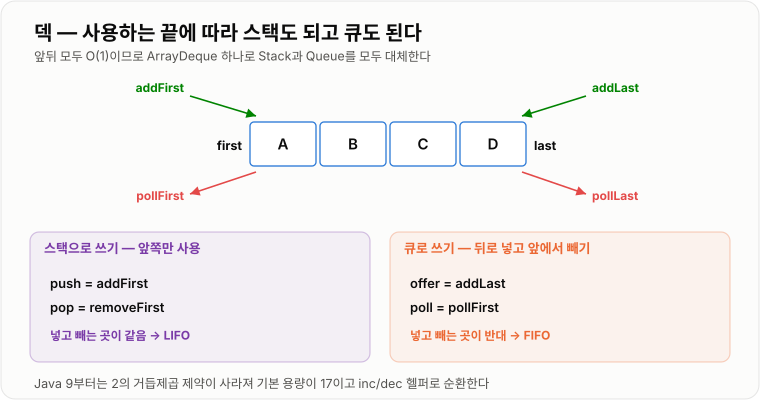

# Deque

> **덱(Deque, Double-Ended Queue)은 앞과 뒤 양쪽 끝에서 모두 데이터를 넣고 뺄 수 있는 자료구조로, 스택과 큐를 하나로 합친 것이다.**

---

## 1. 핵심 요약

* 덱은 **양쪽 끝(first, last)에서 삽입·삭제가 모두 O(1)** 인 자료구조다.
* 한쪽 끝만 쓰면 **스택(LIFO)**, 넣는 곳과 빼는 곳을 다르게 쓰면 **큐(FIFO)** 가 된다.
* Java의 `ArrayDeque`는 **순환 배열** 기반이며, `Stack`과 `LinkedList`를 대체하는 실질적 표준이다.
* `ArrayDeque`는 **`null` 저장을 금지**한다. `null`을 "비어 있음" 신호로 쓰기 때문이다.
* 슬라이딩 윈도우 최댓값 같은 **모노토닉 덱** 알고리즘의 핵심 도구다.

---

## 2. 등장 배경

### 해결하려는 문제

스택과 큐는 각각 접근 지점이 제한되어 있다.

```text
스택: 한쪽 끝에서만 넣고 뺀다
   push ↓ ↑ pop
   [ A ][ B ][ C ]

큐: 뒤로 넣고 앞에서 뺀다
   poll ↑              ↓ offer
   [ A ][ B ][ C ][    ]
```

그런데 현실의 문제 중에는 **양쪽 끝을 모두 써야 하는 것**이 있다.

* 브라우저의 앞으로 가기 / 뒤로 가기
* 최근 항목 목록 — 앞에 추가하고 오래된 것은 뒤에서 제거
* 슬라이딩 윈도우 — 오른쪽에서 새 값이 들어오고 왼쪽에서 오래된 값이 나간다
* 작업 훔치기(work-stealing) 스케줄러 — 자기 작업은 앞에서, 남의 작업은 뒤에서 가져간다

스택과 큐를 각각 두 개 쓰면 데이터가 두 곳에 나뉘어 관리가 복잡해진다. **하나의 구조에서 양 끝을 모두 열어 주면** 이 모든 문제가 자연스럽게 풀린다.

또 하나의 실용적 배경이 있다. **Java의 `Stack`과 `LinkedList`에는 각각 문제가 있었다.**

* `java.util.Stack`: `Vector` 상속 → 불필요한 동기화, 중간 접근 노출, LIFO가 아닌 순회 순서
* `java.util.LinkedList`: 노드마다 객체 오버헤드, 캐시 효율 나쁨

`ArrayDeque`는 이 둘을 순환 배열 하나로 깔끔하게 대체하기 위해 Java 6에서 추가되었다.

### 이 개념이 없을 때

* 앞뒤 양쪽 조작이 필요할 때 스택 두 개 또는 큐 두 개로 흉내 내야 한다.
* 배열이나 `ArrayList`로 앞쪽 삽입·삭제를 하면 매번 O(n)의 이동 비용이 든다.
* 스택 용도로는 레거시 `Stack`을, 큐 용도로는 `LinkedList`를 쓰며 각각의 단점을 감수해야 한다.
* 슬라이딩 윈도우 최댓값 같은 문제를 O(n)에 풀 방법이 마땅치 않다.

---

## 3. 핵심 개념

| 개념                       | 설명                                       | 중요한 이유                                  |
| ------------------------ | ---------------------------------------- | --------------------------------------- |
| **양방향 접근**               | 앞(first)과 뒤(last) 모두에서 삽입·삭제 가능          | 덱의 정체성이며 스택·큐를 모두 대체할 수 있는 이유다          |
| **`addFirst` / `addLast`** | 앞 또는 뒤에 넣는 연산                            | 어느 쪽에 넣느냐로 스택인지 큐인지가 결정된다               |
| **`pollFirst` / `pollLast`** | 앞 또는 뒤에서 꺼내며 제거                          | 넣는 쪽과 빼는 쪽 조합이 자료구조의 성격을 만든다            |
| **`peekFirst` / `peekLast`** | 제거하지 않고 양 끝을 확인                          | 조건 판단 후 제거 여부를 결정할 때 쓴다                 |
| **순환 배열**                | 배열의 끝과 시작을 이어 붙여 인덱스를 돌려 쓰는 방식           | 앞쪽 삽입도 이동 없이 O(1)로 만드는 핵심 기법이다          |
| **head / tail 인덱스**      | `ArrayDeque` 내부가 유지하는 두 개의 위치 표시         | 원소를 옮기지 않고 논리적 앞뒤만 바꾼다                  |
| **여유 슬롯 1칸**             | 배열에 항상 빈 자리를 하나 남겨 둔다                     | `head == tail`을 "가득 참"의 신호로 쓸 수 있어 크기 판별이 단순해진다 |
| **`null` 금지**            | `ArrayDeque`는 `null` 저장을 허용하지 않음         | `null` 반환을 "비어 있음"의 신호로 쓰기 때문이다         |
| **스택으로서의 덱**             | `push` = `addFirst`, `pop` = `removeFirst` | 앞쪽만 쓰면 LIFO가 된다                         |
| **큐로서의 덱**               | `offer` = `addLast`, `poll` = `pollFirst` | 뒤로 넣고 앞에서 빼면 FIFO가 된다                   |
| **모노토닉 덱**               | 값이 단조 증가·감소하도록 유지하는 덱 활용 기법              | 슬라이딩 윈도우 최댓값을 O(n)에 푸는 방법이다             |

개념 간 관계는 다음과 같다.

```text
addFirst ↓                      ↓ addLast
        ┌───────┬───────┬───────┐
        │   A   │   B   │   C   │
        └───────┴───────┴───────┘
pollFirst ↑                      ↑ pollLast
peekFirst                     peekLast


앞쪽만 사용            →  Stack (LIFO)
뒤로 넣고 앞에서 뺌     →  Queue (FIFO)
양쪽 모두 사용         →  Deque 고유 활용
```

---

## 4. 구조와 동작 원리

### `ArrayDeque`의 내부 구조

```text
elements: [ ][ ][A][B][C][ ][ ][ ]     capacity = 8
                 ↑        ↑
               head     tail
             (첫 원소)  (다음에 넣을 자리)
```

`head`가 0이 아니어도 된다는 점이 핵심이다. 앞에 공간이 남아 있으면 `addFirst`가 그냥 `head`를 왼쪽으로 한 칸 옮긴다.

### `addFirst` 동작

```text
초기       [ ][ ][A][B][C][ ][ ][ ]   head=2, tail=5

addFirst(X)
   head = dec(head) = 1
   elements[1] = X
           [ ][X][A][B][C][ ][ ][ ]   head=1, tail=5

addFirst(Y)
   head = 0
           [Y][X][A][B][C][ ][ ][ ]   head=0, tail=5

addFirst(Z)
   head = dec(0) = 7                 ← 배열 끝으로 순환!
           [Y][X][A][B][C][ ][ ][Z]   head=7, tail=5
```

원소를 **단 하나도 이동하지 않았다.** 이것이 `ArrayList`의 앞쪽 삽입(O(n))과 결정적으로 다른 점이다.

원형으로 그리면 이해가 쉽다.

```text
              0:[Y]
        7:[Z]      1:[X]
      ┌──────────────────┐
      │                  │
  6:[ ]                 2:[A]
      │      Deque       │
  5:[ ]                 3:[B]
      └──────────────────┘
              4:[C]

  head=7 에서 시계 방향으로 Z → Y → X → A → B → C
```



*앞쪽만 쓰면 LIFO(스택), 뒤로 넣고 앞에서 빼면 FIFO(큐)가 된다 — 자료구조는 하나다.*

### 순환 인덱스 계산 — Java 8과 Java 9 이후가 다르다

이 부분은 **JDK 버전에 따라 구현이 바뀌었다.** 면접에서 오래된 블로그 내용을 그대로 말하면 틀리기 쉬운 지점이다.

**Java 8 이하** — 용량을 항상 2의 거듭제곱으로 맞추고 비트 마스크를 썼다.

```text
capacity = 8 = 1000(2)
capacity - 1 = 7 = 0111(2)

head = (head - 1) & (capacity - 1)

(0 - 1) & 7  =  (-1) & 7  =  7    ← 음수도 자동으로 끝으로 순환
```

나머지 연산(`%`)보다 비트 AND(`&`)가 빠르고 음수 처리도 공짜라서 택한 방식이다. 대신 용량이 2의 거듭제곱으로 강제되어 **낭비되는 공간이 최대 2배 가까이** 생겼다.

**Java 9 이후** — 2의 거듭제곱 제약을 버리고 명시적 증감 헬퍼로 바꿨다.

```java
static final int inc(int i, int modulus) {
    if (++i >= modulus) {
        i = 0;
    }
    return i;
}

static final int dec(int i, int modulus) {
    if (--i < 0) {
        i = modulus - 1;
    }
    return i;
}
```

분기 하나가 늘었지만 분기 예측이 거의 항상 맞으므로 실질적인 손해가 없고, **용량을 원하는 크기로 잡을 수 있어 메모리 낭비가 크게 줄었다.**

JDK 17에서 실제로 확인한 용량 변화는 다음과 같다.

```text
new ArrayDeque<>()      →  17     (16 + 1)
new ArrayDeque<>(10)    →  11     (10 + 1)
new ArrayDeque<>(100)   →  101    (100 + 1)

원소를 계속 넣을 때:
17 → 36 → 74 → 111 → 166 → 249 → 373 → 559
```

2의 거듭제곱이 전혀 아니다. `+1`이 붙는 이유는 **빈 자리를 한 칸 남겨 두기 위해서**다.

```text
head == tail 일 때
  빈 칸을 안 남기면  →  "비었음"인지 "가득 참"인지 구분 불가
  한 칸 남기면      →  head == tail 은 언제나 "가득 참" 신호
```

### 확장(grow)

```text
head == tail 이 되는 순간 = 가득 참
        ↓
새 용량 = 기존 용량 + jump
   기존 용량 < 64  →  jump = 기존 용량 + 2   (대략 2배)
   기존 용량 ≥ 64  →  jump = 기존 용량 / 2   (1.5배)
        ↓
head부터 끝까지 복사 → 0부터 head 이전까지 복사 (순서를 펴서 정리)
        ↓
head = 0, tail = 원소 개수
```

작을 때는 공격적으로, 커지면 완만하게 늘린다. 작은 덱의 잦은 복사를 줄이면서 큰 덱의 메모리 낭비도 막는 절충이다. (`PriorityQueue`도 같은 전략을 쓴다.)

```text
확장 전   [C][D][ ][A][B]    head=3, tail=2  (가득 참)
확장 후   [A][B][C][D][ ][ ][ ][ ]   head=0, tail=4
```

확장은 O(n)이지만 드물게 일어나므로 **분할 상환 O(1)** 이다.

### 전체 동작 순서

1. `new ArrayDeque<>()`는 길이 17(= 16 + 여유 1칸)인 배열과 `head = tail = 0`을 만든다.
2. `addLast(e)`는 `elements[tail] = e` 후 `tail = inc(tail, length)`.
3. `addFirst(e)`는 `head = dec(head, length)` 후 `elements[head] = e`.
4. `pollFirst()`는 `elements[head]`를 읽고 `null`로 비운 뒤 `head`를 오른쪽으로 이동.
5. `pollLast()`는 `tail`을 왼쪽으로 이동한 뒤 그 위치의 값을 읽고 `null`로 비움.
6. `head == tail`이 되면 가득 찬 것으로 보고 위 규칙대로 확장한다.
7. `null` 값을 넣으려 하면 `NullPointerException`을 던진다.

---

## 5. 코드 또는 사용 예시

### 기본 사용 — 스택, 큐, 덱

```java
import java.util.ArrayDeque;
import java.util.Deque;

public class DequeUsage {

    public static void main(String[] args) {
        // 1) 스택으로 사용 — 앞쪽만 쓴다 (LIFO)
        Deque<String> stack = new ArrayDeque<>();
        stack.push("A");            // addFirst
        stack.push("B");
        stack.push("C");
        System.out.println("스택 pop: " + stack.pop());   // C
        System.out.println("스택 상태: " + stack);         // [B, A]

        // 2) 큐로 사용 — 뒤로 넣고 앞에서 뺀다 (FIFO)
        Deque<String> queue = new ArrayDeque<>();
        queue.offer("A");           // addLast
        queue.offer("B");
        queue.offer("C");
        System.out.println("큐 poll: " + queue.poll());   // A
        System.out.println("큐 상태: " + queue);           // [B, C]

        // 3) 덱으로 사용 — 양쪽 모두
        Deque<Integer> deque = new ArrayDeque<>();
        deque.addFirst(2);
        deque.addFirst(1);
        deque.addLast(3);
        deque.addLast(4);
        System.out.println("덱 상태: " + deque);           // [1, 2, 3, 4]
        System.out.println("앞: " + deque.pollFirst());    // 1
        System.out.println("뒤: " + deque.pollLast());     // 4
    }
}
```

각 부분의 역할은 다음과 같다.

```java
stack.push("A");   // 내부적으로 addFirst("A")
stack.pop();       // 내부적으로 removeFirst()
```

`push`/`pop`이 **앞쪽**을 쓴다는 점이 중요하다. 그래서 순회하면 최근에 넣은 것부터 나오고, 이는 LIFO 순서와 일치한다. (`java.util.Stack`은 반대로 오래된 것부터 나온다.)

```java
queue.offer("A");  // 내부적으로 addLast("A")
queue.poll();      // 내부적으로 pollFirst()
```

넣는 쪽과 빼는 쪽이 반대라서 FIFO가 된다.

### 메서드 이름 대응표

| 목적       | Deque 표준 메서드     | 스택 스타일  | 큐 스타일     |
| -------- | ---------------- | ------- | --------- |
| 앞에 넣기    | `addFirst`/`offerFirst` | `push`  | —         |
| 뒤에 넣기    | `addLast`/`offerLast`   | —       | `add`/`offer` |
| 앞에서 빼기   | `removeFirst`/`pollFirst` | `pop`   | `remove`/`poll` |
| 뒤에서 빼기   | `removeLast`/`pollLast`   | —       | —         |
| 앞 확인     | `getFirst`/`peekFirst`    | `peek`  | `element`/`peek` |
| 뒤 확인     | `getLast`/`peekLast`      | —       | —         |

`add*`/`remove*`/`get*` 계열은 **실패 시 예외**, `offer*`/`poll*`/`peek*` 계열은 **실패 시 `false`/`null`** 을 반환한다. 흐름 제어에는 후자가 편하다.

### 실전 — 슬라이딩 윈도우 최댓값 (모노토닉 덱)

크기 `k`인 창을 오른쪽으로 밀면서 각 창의 최댓값을 구한다. 매번 창을 다 훑으면 O(n×k)지만, 덱을 쓰면 **O(n)** 이다.

```java
import java.util.ArrayDeque;
import java.util.Deque;

public class SlidingWindowMaximum {

    public static int[] maxOfWindows(int[] numbers, int k) {
        int[] result = new int[numbers.length - k + 1];

        // 값이 큰 순서(내림차순)를 유지하는 "인덱스" 덱
        Deque<Integer> deque = new ArrayDeque<>();

        for (int i = 0; i < numbers.length; i++) {

            // 1) 창을 벗어난 인덱스를 앞에서 제거
            if (!deque.isEmpty() && deque.peekFirst() <= i - k) {
                deque.pollFirst();
            }

            // 2) 새 값보다 작은 값들은 뒤에서 제거 (최댓값이 될 가능성이 없음)
            while (!deque.isEmpty() && numbers[deque.peekLast()] <= numbers[i]) {
                deque.pollLast();
            }

            // 3) 현재 인덱스를 뒤에 추가
            deque.addLast(i);

            // 4) 창이 완성되면 앞이 곧 최댓값
            if (i >= k - 1) {
                result[i - k + 1] = numbers[deque.peekFirst()];
            }
        }

        return result;
    }

    public static void main(String[] args) {
        int[] numbers = {1, 3, -1, -3, 5, 3, 6, 7};
        int[] result = maxOfWindows(numbers, 3);

        for (int i = 0; i < result.length; i++) {
            System.out.print(result[i] + " ");
        }
        // 출력: 3 3 5 5 6 7
    }
}
```

동작 과정을 값과 함께 따라가면 다음과 같다. (덱에는 **인덱스**가 들어간다)

```text
numbers = [1, 3, -1, -3, 5, 3, 6, 7],  k = 3

i=0 (1)   덱: [0]                     창 미완성
i=1 (3)   1 <= 3 이므로 0 제거 → 덱: [1]
i=2 (-1)  -1 < 3 이므로 그대로 → 덱: [1,2]     최댓값 = numbers[1] = 3
i=3 (-3)  덱: [1,2,3]                          최댓값 = numbers[1] = 3
i=4 (5)   -3,-1,3 모두 <= 5 → 전부 제거 → 덱: [4]  최댓값 = 5
i=5 (3)   3 < 5 → 덱: [4,5]                    최댓값 = 5
i=6 (6)   3,5 모두 <= 6 → 제거 → 덱: [6]        최댓값 = 6
i=7 (7)   6 <= 7 → 제거 → 덱: [7]              최댓값 = 7
```

**앞에서는 창을 벗어난 것을 빼고, 뒤에서는 쓸모없어진 것을 뺀다.** 양쪽을 모두 써야 하므로 스택이나 큐만으로는 불가능하다. 이것이 덱이 반드시 필요한 대표 사례다.

각 원소는 덱에 최대 한 번 들어가고 한 번 나오므로 전체가 **O(n)** 이다.

### 최근 조회 목록 (크기 제한)

```java
import java.util.ArrayDeque;
import java.util.Deque;

public class RecentViewHistory {

    private final Deque<String> history = new ArrayDeque<>();
    private final int maxSize;

    public RecentViewHistory(int maxSize) {
        this.maxSize = maxSize;
    }

    public void view(String productId) {
        history.remove(productId);        // 이미 있으면 제거 (중복 방지)
        history.addFirst(productId);      // 최신을 앞에

        if (history.size() > maxSize) {
            history.pollLast();           // 가장 오래된 것을 뒤에서 제거
        }
    }

    public static void main(String[] args) {
        RecentViewHistory h = new RecentViewHistory(3);
        h.view("상품A");
        h.view("상품B");
        h.view("상품C");
        h.view("상품D");                   // 상품A가 밀려남
        h.view("상품C");                   // 상품C가 다시 맨 앞으로

        System.out.println(h.history);     // [상품C, 상품D, 상품B]
    }
}
```

앞에 넣고 뒤에서 버리는 전형적인 덱 활용이다. 다만 `remove(Object)`는 O(n)이므로 목록이 크면 `LinkedHashMap`을 쓰는 편이 낫다.

---

## 6. 성능 특성

| 연산                             |     평균 시간 복잡도 | 최악 시간 복잡도 | 설명                       |
| ------------------------------ | ------------: | -------: | ------------------------ |
| `addFirst` / `addLast`         | O(1) (분할 상환) |     O(n) | 확장이 일어나는 순간만 전체 복사       |
| `pollFirst` / `pollLast`       |          O(1) |     O(1) | 인덱스만 이동하고 참조를 끊는다        |
| `peekFirst` / `peekLast`       |          O(1) |     O(1) | 해당 위치를 읽기만 한다            |
| `size` / `isEmpty`             |          O(1) |     O(1) | 인덱스 차이로 계산한다             |
| `contains` / `remove(Object)`  |          O(n) |     O(n) | 전체를 훑어야 한다               |
| 인덱스 접근 (`get(i)`)              |           미지원 |      미지원 | `Deque`는 인덱스 API를 제공하지 않는다 |
| 전체 순회                          |          O(n) |     O(n) | 배열 기반이라 캐시 효율이 좋다        |

공간 복잡도는 **O(n)** 이다. Java 8까지는 용량이 2의 거듭제곱으로 강제되어 최대 2배 가까이 낭비됐지만, Java 9부터는 필요한 크기에 맞춰 잡을 수 있어 여유 공간이 크게 줄었다.

구현체별 실제 비용 비교는 다음과 같다.

| 기준       | `ArrayDeque` | `LinkedList`    | `java.util.Stack` |
| -------- | ------------ | --------------- | ----------------- |
| 원소당 메모리  | 참조 1개        | 노드 객체 + 참조 3개   | 참조 1개             |
| 캐시 지역성   | 좋음 (연속 배열)   | 나쁨 (노드 흩어짐)     | 좋음                |
| 객체 생성 비용 | 없음           | 원소마다 노드 객체 생성   | 없음                |
| 동기화 비용   | 없음           | 없음              | 모든 메서드에 락         |
| GC 부담    | 낮음           | 높음 (객체 수 = 원소 수) | 낮음                |

데이터가 많아질 때의 변화는 다음과 같다.

* 양 끝 조작 비용은 개수와 무관하게 O(1)로 유지된다.
* 확장 시 복사할 원소가 늘어나지만 확장 자체가 드물다.
* `contains`나 `remove(Object)`는 개수에 비례해 느려진다. 덱을 검색용으로 쓰면 안 된다.
* 큰 연속 배열이 필요해 아주 큰 덱은 메모리 단편화 영향을 받을 수 있다.

---

## 7. 장점과 단점

| 장점                          | 이유                                        |
| --------------------------- | ----------------------------------------- |
| 양 끝 삽입·삭제가 모두 O(1)이다        | 순환 배열로 인덱스만 옮기고 원소를 이동하지 않는다              |
| 스택과 큐를 하나로 대체한다             | 사용하는 끝만 바꾸면 LIFO도 FIFO도 된다                |
| `LinkedList`보다 빠르고 가볍다      | 노드 객체가 없어 메모리가 적고 캐시 지역성이 좋다              |
| `java.util.Stack`보다 안전하다    | 불필요한 동기화가 없고 중간 접근이 노출되지 않는다              |
| 순회 순서가 직관적이다                | `push`한 순서의 역순(LIFO)으로 나와 예상과 일치한다        |
| 모노토닉 덱 알고리즘을 가능하게 한다        | 양쪽에서 제거할 수 있어야 O(n) 슬라이딩 윈도우가 성립한다        |

| 단점                       | 이유 및 주의점                                            |
| ------------------------ | --------------------------------------------------- |
| 인덱스 접근을 지원하지 않는다         | `get(i)` 같은 API가 없다. 필요하면 `ArrayList`를 쓴다           |
| `null`을 저장할 수 없다         | `NullPointerException`이 발생한다. `null` 반환을 비어있음 신호로 쓰기 때문 |
| 중간 삽입·삭제·검색이 느리다         | `contains`, `remove(Object)`가 O(n)이다                |
| 스레드 안전하지 않다              | 동시 접근 시 `ConcurrentLinkedDeque`나 외부 동기화가 필요하다       |
| 여유 공간으로 메모리를 더 쓴다        | 확장 시 미리 넉넉히 잡으므로 빈 칸이 남는다 (Java 8까지는 2의 거듭제곱 제약으로 더 심했다) |
| 크기 제한 기능이 없다             | 무계 구조라 무한히 자란다. 상한이 필요하면 직접 관리하거나 `LinkedBlockingDeque` |

---

## 8. 사용 기준

### 사용하기 좋은 상황

* **스택이 필요한 모든 경우** (Java에서는 `Stack` 대신 항상 이것)
* **단일 스레드 큐가 필요한 모든 경우** (`LinkedList` 대신)
* 앞뒤 양쪽에서 데이터를 넣고 빼야 하는 경우
* 슬라이딩 윈도우 최댓값·최솟값 같은 모노토닉 덱 알고리즘
* 최근 항목 목록처럼 앞에 넣고 뒤에서 버리는 경우
* 브라우저 히스토리처럼 양방향 이동이 필요한 경우
* BFS/DFS 구현 (덱 하나로 둘 다 커버된다)

### 사용하지 않는 것이 좋은 상황

* 인덱스로 임의 접근이 필요한 경우 → `ArrayList`
* `null`을 값으로 저장해야 하는 경우 → `LinkedList`
* 값으로 검색·삭제가 잦은 경우 → `HashSet`, `LinkedHashMap`
* 여러 스레드가 동시에 접근하는 경우 → `ConcurrentLinkedDeque`, `LinkedBlockingDeque`
* 크기를 반드시 제한해야 하는 경우 → `LinkedBlockingDeque`(유계) 또는 직접 관리
* 우선순위대로 꺼내야 하는 경우 → `PriorityQueue`

### 선택 기준

1. 데이터를 넣고 빼는 위치가 **양 끝**인가? → 맞으면 덱
2. 인덱스 접근이 필요한가? → 필요하면 `ArrayList`
3. `null`을 저장할 일이 있는가? → 있으면 `ArrayDeque` 불가
4. 여러 스레드가 공유하는가? → 동시성 구현체로 교체
5. 크기 상한이 필요한가? → 유계 구현체 또는 직접 제어

```text
스택·큐가 필요하다        →  ArrayDeque (거의 항상 정답)
양 끝 모두 쓴다           →  ArrayDeque
인덱스가 필요하다          →  ArrayList
스레드 공유 + 블로킹 필요  →  LinkedBlockingDeque
```

---

## 9. 비슷한 개념 비교

### Deque와 Stack, Queue

| 비교 항목  | Deque         | Stack       | Queue       | 선택 기준       |
| ------ | ------------- | ----------- | ----------- | ----------- |
| 목적     | 양 끝 삽입·삭제     | 한쪽 끝만 사용    | 뒤로 넣고 앞에서 뺌 | 접근 지점 수     |
| 규칙     | 제한 없음         | LIFO        | FIFO        | 요구되는 처리 순서  |
| 유연성    | 스택·큐 모두 표현 가능 | 스택만         | 큐만          | 덱이 상위 개념    |
| 성능     | 양 끝 O(1)      | O(1)        | O(1)        | 차이 없음       |
| Java에서 | `ArrayDeque`  | `Deque`로 대체 | `Deque`로 대체 | 실무는 Deque 하나 |

### `ArrayDeque`와 `LinkedList`

| 비교 항목    | `ArrayDeque` | `LinkedList`   | 선택 기준            |
| -------- | ------------ | -------------- | ---------------- |
| 목적       | 덱 전용 (스택·큐)  | 목록 + 덱         | 인덱스 접근 필요 여부     |
| 내부 구조    | 순환 배열        | 양방향 연결 노드      | 메모리 배치           |
| 양 끝 조작   | 분할 상환 O(1)   | O(1)           | 둘 다 빠름           |
| 인덱스 조회   | 미지원          | O(n)           | 인덱스가 꼭 필요하면 LinkedList |
| 메모리      | 참조 1개 + 여유 공간 | 노드 객체 + 참조 3개  | ArrayDeque가 훨씬 적음 |
| 캐시 효율    | 좋음           | 나쁨             | 순회가 많으면 ArrayDeque |
| `null` 저장 | 불가           | 가능             | `null` 필요하면 LinkedList |
| 실제 속도    | 빠름           | 느림             | 대부분 ArrayDeque   |
| 적합한 상황   | 스택·큐·덱 전반    | `null` 저장이나 인덱스가 꼭 필요할 때 | **기본값은 ArrayDeque** |

### `ArrayDeque`와 `java.util.Stack`

| 비교 항목  | `ArrayDeque`  | `java.util.Stack`   | 선택 기준        |
| ------ | ------------- | ------------------- | ------------ |
| 목적     | 현대적 덱·스택      | 레거시 스택              | 신규 코드는 ArrayDeque |
| 상속     | 없음 (`Deque` 구현) | `Vector` 상속         | 캡슐화 수준       |
| 동기화    | 없음            | 모든 메서드 `synchronized` | 단일 스레드면 오버헤드 |
| 순회 순서  | top부터 (LIFO)  | 바닥부터 (LIFO 아님)      | 직관성          |
| 중간 접근  | 불가            | `get(i)` 등 노출       | 오용 방지        |
| 성능     | 빠름            | 락 비용으로 느림           | ArrayDeque 우세 |
| 적합한 상황 | 모든 새 코드       | 기존 레거시 유지           | JDK 문서도 Deque 권장 |

### `ArrayDeque`와 동시성 덱

| 비교 항목  | `ArrayDeque` | `ConcurrentLinkedDeque` | `LinkedBlockingDeque` | 선택 기준       |
| ------ | ------------ | ----------------------- | --------------------- | ----------- |
| 스레드 안전 | 아니오          | 예 (논블로킹, CAS)           | 예 (락 기반)              | 동시 접근 여부    |
| 블로킹    | 없음           | 없음                      | 있음 (`put`/`take`)     | 대기 필요 여부    |
| 크기 제한  | 무계           | 무계                      | 유계 지정 가능              | 메모리 보호 필요 여부 |
| 성능     | 가장 빠름        | 빠름                      | 락 비용 있음               | 단일 스레드면 ArrayDeque |
| 적합한 상황 | 단일 스레드       | 고빈도 동시 읽기·쓰기            | 생산자·소비자 패턴            | 상황별         |

---

## 10. 백엔드 실무 적용

### Spring·Java

`ArrayDeque`는 애플리케이션 코드에서 **스택·큐가 필요한 모든 자리의 기본 선택**이다.

```java
import java.util.ArrayDeque;
import java.util.Deque;
import java.util.List;

public class CategoryTreeTraversal {

    // 카테고리 트리를 DFS로 순회 — 재귀 대신 명시적 스택 사용
    public void traverse(Category root) {
        Deque<Category> stack = new ArrayDeque<>();
        stack.push(root);

        while (!stack.isEmpty()) {
            Category current = stack.pop();
            System.out.println(current.getName());

            List<Category> children = current.getChildren();
            for (int i = children.size() - 1; i >= 0; i--) {
                stack.push(children.get(i));
            }
        }
    }
}
```

재귀 대신 명시적 스택을 쓰면 **깊이 제한(`StackOverflowError`)에서 자유롭다.** JVM 호출 스택은 보통 512KB~1MB지만, `ArrayDeque`는 힙을 쓰므로 훨씬 깊게 갈 수 있다.

`push` 순서를 뒤집은 이유도 중요하다. 스택은 마지막에 넣은 것이 먼저 나오므로, 자식을 순서대로 방문하려면 역순으로 넣어야 한다.

* **Spring의 `TransactionSynchronizationManager`**: 중첩 트랜잭션의 리소스를 스택형으로 관리한다.
* **인터셉터·필터 체인**: 요청 전 처리와 응답 후 처리가 역순으로 실행되는 구조 자체가 스택이다.

```text
요청 →  FilterA → FilterB → FilterC → Controller
응답 ←  FilterA ← FilterB ← FilterC ←
        (등록 역순으로 되돌아옴 = LIFO)
```

* **`@Transactional` 전파**: `REQUIRES_NEW`로 새 트랜잭션이 시작되면 기존 트랜잭션을 보류했다가 나중에 복원한다.
* **재시도 이력, 실행 취소 기능**: 최근 상태부터 되돌려야 하므로 덱이 적합하다.

### 데이터베이스·캐시

* **Redis List = 사실상 덱**이다. `LPUSH`/`RPUSH`로 양쪽에 넣고 `LPOP`/`RPOP`으로 양쪽에서 뺀다. 모두 O(1)이다.

```text
LPUSH recent:user:1 "상품A"     ← 최신을 앞에 추가
LTRIM recent:user:1 0 9        ← 앞에서 10개만 남기고 뒤를 버림

→ "최근 본 상품 10개" 구현 완료
```

`LTRIM`은 덱의 "뒤에서 버리기"를 한 번에 처리해 준다. 실무에서 매우 자주 쓰이는 패턴이다.

* Redis 내부적으로 List는 작을 때는 `listpack`(압축된 연속 구조), 커지면 `quicklist`(연결 리스트 + 배열 혼합)로 저장된다. 양 끝 접근이 O(1)인 이유다.
* **커넥션 풀**: HikariCP는 커넥션을 반납할 때 방금 쓴 것을 다시 앞에서 꺼내는(LIFO) 전략을 쓴다. 최근에 쓰인 커넥션이 살아 있을 확률이 높고, 오래 안 쓰인 커넥션은 자연스럽게 정리되기 때문이다.

### 동시성·분산 환경

* `ArrayDeque`는 스레드 안전하지 않다. 동시 접근 시 `head`/`tail`이 꼬여 데이터가 유실되거나 무한 루프에 빠질 수 있다.

```text
스레드 A: head 읽음(3) → elements[3] 읽기 준비
스레드 B: head 읽음(3) → elements[3] 읽고 head=4로 변경
스레드 A: elements[3] 읽음 → 같은 원소를 두 번 처리, head는 5가 됨 (원소 유실)
```

* 대안:
    * `ConcurrentLinkedDeque` — CAS 기반 논블로킹, 락 없음
    * `LinkedBlockingDeque` — 유계 + 블로킹, 생산자·소비자에 적합
    * 외부 `synchronized` 또는 `ReentrantLock`

* **작업 훔치기(work-stealing)**: `ForkJoinPool`은 스레드마다 덱을 하나씩 두고, 자기 작업은 **앞에서** 꺼내고 남의 작업은 **뒤에서** 훔친다. 양쪽 끝을 쓰기 때문에 락 경합이 크게 줄어든다. Java의 병렬 스트림과 `CompletableFuture` 기본 풀이 이 구조다.

```text
스레드1의 덱:  [작업A][작업B][작업C]
                 ↑                ↑
            자기가 꺼냄        다른 스레드가 훔침
            (경합 없음 — 서로 다른 끝을 쓰므로)
```

* 분산 환경에서는 각 서버의 `ArrayDeque`가 분리되어 있다. 서버 간 공유가 필요하면 Redis List나 메시지 브로커를 쓴다.

---

## 11. 자주 하는 오해

| 잘못된 이해                                   | 올바른 이해                                                             |
| ---------------------------------------- | ------------------------------------------------------------------ |
| 덱은 큐의 한 종류라서 FIFO만 된다                    | 양 끝을 모두 쓸 수 있어 스택·큐·덱 어느 쪽으로든 동작한다                                 |
| `ArrayDeque`는 배열이라 앞쪽 삽입이 O(n)이다         | 순환 배열이라 `head` 인덱스만 옮기면 되므로 O(1)이다                                 |
| `ArrayDeque`에 `null`을 넣을 수 있다            | `NullPointerException`이 발생한다. `null`을 "비어 있음" 신호로 쓰기 때문이다          |
| Java에서 스택은 `Stack` 클래스를 써야 한다            | `Vector` 상속·불필요한 동기화·비직관적 순회 때문에 `ArrayDeque`가 권장된다                |
| 큐는 `LinkedList`로 만드는 게 정석이다              | `ArrayDeque`가 더 빠르고 메모리도 적게 쓴다                                     |
| `ArrayDeque`의 `push`는 뒤에 넣는다             | `push`는 `addFirst`, 즉 **앞**에 넣는다. `offer`가 뒤에 넣는다                  |
| `Deque`도 인덱스로 접근할 수 있다                   | `get(i)` API가 없다. 인덱스가 필요하면 `ArrayList`를 쓴다                        |
| `ArrayDeque`는 크기 제한을 걸 수 있다              | 무계 구조다. 상한이 필요하면 직접 관리하거나 `LinkedBlockingDeque`를 쓴다                |
| `ArrayDeque`의 용량은 항상 2의 거듭제곱이다           | **Java 8까지만** 그렇다. Java 9부터는 제약이 사라져 기본 용량이 17이고 `17→36→74→111`처럼 늘어난다 |
| 덱은 스레드 안전하다                              | `ArrayDeque`는 동기화되지 않는다. 동시 접근 시 원소 유실이나 무한 루프가 발생할 수 있다           |
| `contains`도 O(1)이다                       | 전체를 훑으므로 O(n)이다. 덱은 검색용 자료구조가 아니다                                  |

---

## 12. 면접 답변

### 기본 답변

덱은 앞과 뒤 양쪽 끝에서 모두 삽입과 삭제가 가능한 자료구조입니다. 앞쪽만 쓰면 스택이 되고, 뒤로 넣고 앞에서 빼면 큐가 되기 때문에 스택과 큐를 모두 포함하는 상위 개념입니다.

Java의 `ArrayDeque`는 순환 배열로 구현되어 있습니다. `head`와 `tail` 인덱스를 유지하고, 인덱스가 배열 끝에 도달하면 0으로 돌아가게 만들어 원소를 전혀 이동시키지 않습니다. 그래서 앞쪽 삽입도 O(1)입니다.

순환 인덱스를 계산하는 방식은 JDK 버전에 따라 다릅니다. Java 8까지는 용량을 2의 거듭제곱으로 강제하고 `index & (capacity - 1)` 비트 마스크를 썼습니다. Java 9부터는 그 제약을 버리고 `inc`/`dec`라는 명시적 증감 헬퍼로 바꿨는데, 분기 하나가 늘어도 예측이 거의 맞아 손해가 없는 대신 용량을 필요한 크기로 잡을 수 있어 메모리 낭비가 줄었습니다. 실제로 JDK 17에서 기본 용량은 16이 아니라 17이고, `17 → 36 → 74 → 111`처럼 2의 거듭제곱이 아니게 늘어납니다. 1칸을 더 두는 이유는 `head == tail`을 "가득 참"의 신호로 쓰기 위해서입니다.

장점은 양 끝 연산이 모두 O(1)이고, `LinkedList`처럼 노드 객체를 만들지 않아 메모리가 적고 캐시 효율이 좋다는 점입니다. 단점은 인덱스 접근을 지원하지 않고, `null` 저장이 불가능하며, 스레드 안전하지 않다는 점입니다.

그래서 Java에서 스택이나 단일 스레드 큐가 필요하면 `Stack`이나 `LinkedList`가 아니라 `ArrayDeque`를 씁니다. `Stack`은 `Vector`를 상속해 불필요한 동기화가 있고 순회 순서가 LIFO가 아니며, `LinkedList`는 노드 오버헤드가 크기 때문입니다. 실무에서는 재귀 대신 명시적 스택으로 트리를 순회하거나, 슬라이딩 윈도우 최댓값을 O(n)에 구하는 모노토닉 덱, Redis List로 최근 본 상품 목록을 만드는 데 활용합니다.

### 답변 구조

* **정의**

    * 양 끝에서 삽입·삭제가 가능한 자료구조
    * 스택과 큐를 모두 표현할 수 있는 상위 개념

* **내부 원리**

    * `ArrayDeque`는 순환 배열 + `head`/`tail` 인덱스
    * `head = dec(head, length)` — 원소 이동 없이 앞쪽 삽입
    * 순환 계산: Java 8은 `& (capacity-1)` 비트 마스크(2의 거듭제곱 강제), Java 9+는 `inc`/`dec` 헬퍼(제약 없음)
    * 확장: 용량 64 미만은 약 2배, 이상은 1.5배

* **복잡도**

    * `O(1)`: `addFirst`/`addLast`/`pollFirst`/`pollLast`/`peek`/`size` (분할 상환)
    * `O(n)`: `contains`, `remove(Object)`, 확장이 일어나는 삽입
    * 공간 `O(n)`, 확장 시 미리 잡는 만큼 여유 공간 발생

* **장점**

    * 양 끝 O(1), 스택·큐 통합
    * `LinkedList`보다 메모리 적고 캐시 효율 좋음
    * `Stack`보다 안전하고 순회 순서가 직관적

* **단점**

    * 인덱스 접근 불가, `null` 저장 불가
    * 검색 O(n), 스레드 안전하지 않음, 크기 제한 없음

* **사용 기준**

    * 접근 지점이 양 끝일 때, 인덱스가 필요 없을 때
    * Java에서 스택·큐가 필요한 거의 모든 상황

* **대안과 비교**

    * 인덱스 필요 → `ArrayList`, `null` 저장 → `LinkedList`
    * 동시 접근 → `ConcurrentLinkedDeque`, 유계·블로킹 → `LinkedBlockingDeque`
    * 우선순위 → `PriorityQueue`

* **실무 적용 사례**

    * 재귀 대신 명시적 스택으로 트리·그래프 순회 (스택 깊이 제한 회피)
    * 슬라이딩 윈도우 최댓값 (모노토닉 덱, O(n))
    * Redis List + `LTRIM`으로 최근 본 상품 목록
    * `ForkJoinPool`의 작업 훔치기(work-stealing) 덱

---

## 13. 예상 면접 질문

### 기본 질문

1. **덱이란 무엇이고 스택·큐와 어떤 관계인가요?**

    * 핵심 키워드: 양 끝 삽입·삭제, 스택·큐의 상위 개념, 사용하는 끝에 따라 성격 결정

2. **`ArrayDeque`는 배열인데 어떻게 앞쪽 삽입이 O(1)인가요?**

    * 핵심 키워드: 순환 배열, `head` 인덱스 감소, 원소 이동 없음, `dec` 헬퍼

3. **`ArrayDeque`의 순환 인덱스 계산은 JDK 버전에 따라 어떻게 다른가요?**

    * 핵심 키워드: Java 8은 2의 거듭제곱 + `& (capacity-1)`, Java 9+는 `inc`/`dec` 헬퍼, 메모리 낭비 감소, 기본 용량 17

4. **`ArrayDeque`에 `null`을 넣을 수 없는 이유는 무엇인가요?**

    * 핵심 키워드: `poll`/`peek`의 `null` 반환이 "비어 있음" 신호, 의미 모호성 제거

5. **Java에서 스택이 필요할 때 무엇을 쓰나요?**

    * 핵심 키워드: `ArrayDeque`, `Stack`의 `Vector` 상속·동기화·순회 순서 문제

6. **`ArrayDeque`와 `LinkedList` 중 무엇이 나은가요?**

    * 핵심 키워드: 노드 객체 오버헤드, 캐시 지역성, 메모리, 실측 성능

7. **덱을 스택으로 쓸 때와 큐로 쓸 때 어떤 메서드를 쓰나요?**

    * 핵심 키워드: `push`/`pop`(앞쪽), `offer`/`poll`(뒤로 넣고 앞에서 뺌)

### 꼬리 질문

1. **슬라이딩 윈도우 최댓값을 O(n)에 구하려면 왜 덱이 필요한가요?**

    * 핵심 키워드: 앞에서 만료 제거, 뒤에서 무용 원소 제거, 모노토닉 유지, 원소당 1회 삽입·삭제

2. **재귀 대신 `ArrayDeque`로 DFS를 구현하면 어떤 이점이 있나요?**

    * 핵심 키워드: 호출 스택 대신 힙 사용, `StackOverflowError` 회피, 깊이 제한 완화

3. **`ArrayDeque`를 여러 스레드가 쓰면 어떤 문제가 생기나요?**

    * 핵심 키워드: `head`/`tail` 경쟁, 원소 유실·중복 처리, `ConcurrentLinkedDeque`

4. **`ForkJoinPool`의 작업 훔치기에서 덱을 쓰는 이유는 무엇인가요?**

    * 핵심 키워드: 자기 작업은 앞에서, 훔칠 때는 뒤에서, 서로 다른 끝 → 경합 최소화

5. **Redis List로 "최근 본 상품 10개"를 어떻게 구현하나요?**

    * 핵심 키워드: `LREM`으로 중복 제거, `LPUSH`로 앞에 추가, `LTRIM 0 9`로 뒤 잘라내기

6. **`ArrayDeque`의 크기를 제한하고 싶으면 어떻게 하나요?**

    * 핵심 키워드: 무계 구조, 직접 `size` 체크 후 `pollLast`, `LinkedBlockingDeque`

7. **`ArrayDeque`가 확장될 때 내부에서 무슨 일이 일어나나요?**

    * 핵심 키워드: 64 미만은 약 2배·이상은 1.5배, 두 구간 복사로 순서 정리, `head=0`, 분할 상환 O(1)

8. **HikariCP가 커넥션을 LIFO로 반환하는 이유는 무엇인가요?**

    * 핵심 키워드: 최근 사용 커넥션의 생존 확률, 유휴 커넥션 자연 정리, 캐시 효과

---

## 14. 추가 학습 방향

### 바로 이어서 공부

| 키워드                | 연결되는 이유                              |
| ------------------ | ------------------------------------ |
| **Stack**          | 덱의 앞쪽만 사용한 특수 형태다                    |
| **Queue**          | 덱에서 넣는 곳과 빼는 곳을 다르게 쓴 형태다            |
| **순환 배열**          | 덱이 O(1)을 달성하는 핵심 기법이다                |
| **BFS · DFS**      | 덱 하나로 두 탐색을 모두 구현할 수 있다              |
| **슬라이딩 윈도우**       | 모노토닉 덱이 필요한 대표 문제 유형이다               |

### 실무 확장

| 키워드                       | 연결되는 이유                            |
| ------------------------- | ---------------------------------- |
| **Redis List 명령어**        | `LPUSH`/`RPOP`/`LTRIM`이 덱 연산 그 자체다 |
| **`ForkJoinPool`**        | 작업 훔치기 덱으로 병렬 처리 경합을 줄이는 구조를 배운다   |
| **`LinkedBlockingDeque`** | 유계 + 블로킹 덱으로 생산자·소비자를 구현한다         |
| **필터·인터셉터 체인**            | 요청·응답이 역순으로 흐르는 스택 구조를 이해한다        |
| **커넥션 풀 전략**              | LIFO 반환이 성능에 미치는 영향을 이해한다          |

### 심화 학습

| 키워드                         | 연결되는 이유                          |
| --------------------------- | -------------------------------- |
| **모노토닉 스택·덱**               | 다음 큰 원소, 히스토그램 최대 직사각형 등으로 확장된다  |
| **`ConcurrentLinkedDeque`** | CAS 기반 논블로킹 덱의 동작 원리를 배운다        |
| **work-stealing 스케줄러**      | 병렬 처리에서 부하 분산을 어떻게 하는지 이해한다      |
| **CPU 캐시와 지역성**             | 배열 기반 덱이 연결 리스트보다 빠른 실제 이유다      |
| **Redis quicklist 구조**      | 연결 리스트와 배열을 섞어 메모리를 절약한 실제 구현이다  |

---

## 15. 최종 체크리스트

* [ ] 개념을 한 문장으로 설명할 수 있다
* [ ] 등장 배경을 설명할 수 있다
* [ ] 내부 동작 과정을 설명할 수 있다
* [ ] 성능 특성을 설명할 수 있다
* [ ] 장점과 단점을 설명할 수 있다
* [ ] 사용할 상황과 사용하지 않을 상황을 구분할 수 있다
* [ ] 비슷한 기술과 비교할 수 있다
* [ ] Spring 백엔드 실무 사례를 설명할 수 있다
* [ ] 기본 면접 질문에 답할 수 있다
* [ ] 조건이 달라졌을 때 대안을 제시할 수 있다

---

## 16. 한 줄 결론

**양 끝에서 데이터를 넣고 빼야 하거나 Java에서 스택·큐가 필요하다면, `Stack`이나 `LinkedList` 대신 `ArrayDeque`를 선택한다.**
