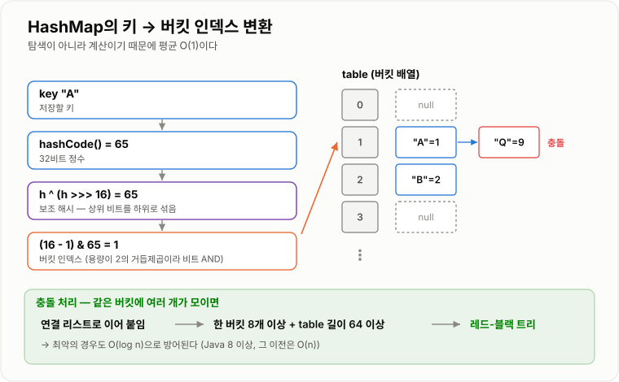

# HashMap

> **HashMap은 키(key)를 해시 함수로 배열의 위치로 바꿔, 키에 대응하는 값(value)을 평균 O(1)에 저장하고 조회하는 자료구조다.**

---

## 1. 핵심 요약

* HashMap은 **키를 해시값으로 바꾸고, 그 값으로 배열 인덱스를 계산해** 데이터를 저장한다.
* 서로 다른 키가 같은 인덱스에 오는 **해시 충돌**은 피할 수 없으며, 같은 버킷에 **연결 리스트(또는 트리)** 로 이어 붙여 해결한다.
* 조회·저장·삭제 모두 **평균 O(1)**, 충돌이 심한 최악의 경우에도 트리화 덕분에 **O(log n)** 이다.
* 저장된 개수가 `용량 × 0.75`를 넘으면 **용량을 2배로 늘리고 전부 재배치(resize)** 한다.
* 키로 쓰는 객체는 **`equals`와 `hashCode`를 함께 올바르게 재정의**해야 하며, 저장 후 키의 필드를 바꾸면 값을 영영 찾지 못한다.

---

## 2. 등장 배경

### 해결하려는 문제

배열은 **인덱스(정수 순번)** 로만 접근할 수 있다.

```java
users[0]   // 0번째 사용자 — 그런데 "회원번호 100392번"은 몇 번째지?
```

실무 데이터는 대부분 **의미 있는 키**로 식별된다.

* 회원 ID로 회원 정보를 찾는다.
* 상품 코드로 재고를 찾는다.
* 세션 ID로 로그인 정보를 찾는다.

리스트에 담아 두고 찾으면 어떻게 될까?

```java
for (int i = 0; i < users.size(); i++) {
    if (users.get(i).getId().equals(targetId)) {
        return users.get(i);
    }
}
```

데이터가 100만 건이면 최대 100만 번 비교한다. **O(n)** 이다. 조회가 초당 수천 번 일어나는 서버에서는 감당할 수 없다.

여기서 발상을 바꾼다. **키를 보고 저장 위치를 바로 계산할 수 있다면?**

```text
"user:100392"  →  해시 함수  →  숫자 1847592  →  배열 인덱스 8
                                                     ↓
                                            바로 그 자리를 읽는다 (O(1))
```

찾는 게 아니라 **계산**하는 것이다. 이것이 해시 테이블의 핵심 아이디어다.

### 이 개념이 없을 때

* 키로 데이터를 찾을 때마다 전체를 순회해야 한다 (O(n)).
* 데이터가 늘어날수록 조회가 선형으로 느려진다.
* 중복 키를 방지하려면 매번 전체를 확인해야 한다.
* 정렬된 구조(`TreeMap`)를 쓰면 O(log n)까지는 되지만, 정렬이 필요 없는 상황에서 불필요한 비용을 낸다.
* 캐시, 세션 저장소, 인덱스처럼 "키로 즉시 찾기"가 본질인 시스템을 만들 수 없다.

---

## 3. 핵심 개념

| 개념                 | 설명                                        | 중요한 이유                                     |
| ------------------ | ----------------------------------------- | ------------------------------------------ |
| **해시 함수**          | 임의의 객체를 고정된 크기의 정수로 바꾸는 함수                | 키를 배열 인덱스로 바꾸는 출발점이다                       |
| **`hashCode()`**   | Java 객체가 자신의 해시값을 반환하는 메서드                | 이 값이 나쁘면 HashMap 전체 성능이 무너진다               |
| **버킷(bucket)**     | 해시값이 같은 항목들이 모이는 배열의 한 칸                  | HashMap의 저장 단위다                            |
| **`Node`**         | `hash`, `key`, `value`, `next`를 담은 항목 객체  | 버킷 안에서 연결 리스트를 이루는 단위다                     |
| **해시 충돌**          | 서로 다른 키가 같은 버킷 인덱스를 갖는 현상                 | 피할 수 없으므로 **어떻게 처리하느냐**가 설계의 핵심이다          |
| **체이닝(chaining)**  | 같은 버킷의 항목들을 연결 리스트로 잇는 충돌 처리 방식           | Java HashMap이 채택한 방식이다                     |
| **트리화(treeify)**   | 한 버킷의 항목이 너무 많아지면 레드-블랙 트리로 바꾸는 최적화       | 최악의 경우를 O(n)에서 O(log n)으로 낮춘다              |
| **용량(capacity)**   | 내부 배열 `table`의 길이 (항상 2의 거듭제곱)            | 인덱스 계산과 확장 방식을 결정한다                        |
| **로드 팩터**          | 확장을 시작할 밀도 기준 (기본 0.75)                   | 충돌 확률과 메모리 낭비의 절충점이다                       |
| **임계값(threshold)** | `용량 × 로드 팩터`. 이 값을 넘으면 확장한다               | 확장 시점을 결정한다                                |
| **리사이즈(resize)**   | 용량을 2배로 늘리고 모든 항목을 재배치하는 동작               | 순간적으로 O(n) 비용이 드는 지점이다                     |
| **`equals` 계약**    | 같은 객체는 같은 `hashCode`를 반환해야 한다는 규칙         | 이 규칙이 깨지면 저장한 값을 찾지 못한다                    |

개념 간 관계는 다음과 같다.

```text
      key
       ↓  hashCode()
   원본 해시값
       ↓  보조 해시 (h ^ (h >>> 16))
   퍼뜨린 해시값
       ↓  (capacity - 1) & hash
   버킷 인덱스
       ↓
   table[인덱스]  →  Node → Node → Node   (충돌 시 체이닝)
                     │
                     └─ 8개 이상 + 용량 64 이상 → 레드-블랙 트리로 변환
```

**핵심 관계**: `hashCode`의 품질 → 충돌 빈도 → 버킷당 항목 수 → 실제 조회 성능. 이 연쇄가 HashMap 성능의 전부다.

---

## 4. 구조와 동작 원리

### 전체 구조

```text
HashMap
 ├─ Node<K,V>[] table        (버킷 배열, 길이 = capacity)
 ├─ int size                 (저장된 항목 수)
 ├─ int threshold            (capacity × loadFactor)
 └─ float loadFactor         (기본 0.75)

table:
 index 0  →  null
 index 1  →  [hash|"A"|1|next] → [hash|"Q"|9|null]     ← 충돌 (체이닝)
 index 2  →  null
 index 3  →  [hash|"B"|2|null]
 ...
 index 15 →  [hash|"C"|3|null]
```

### 인덱스 계산 — 왜 두 단계인가

```text
1단계: key.hashCode()
   "user1".hashCode()  →  111578566
   (32비트 정수, 범위가 -21억 ~ 21억)

2단계: 보조 해시 (spread)
   h ^ (h >>> 16)
   111578566 ^ (111578566 >>> 16)  →  111577952
   → 상위 16비트를 하위 16비트에 섞어 넣는다

3단계: 버킷 인덱스
   (capacity - 1) & hash
   capacity = 16 이면  15 & hash  =  하위 4비트만 사용
```

**왜 보조 해시가 필요한가?**

용량이 16이면 인덱스 계산에 **하위 4비트만** 쓴다. 상위 비트가 아무리 다양해도 하위 4비트가 같으면 전부 같은 버킷에 몰린다.

```text
해시값 A: 0000 0000 0000 0001 0000 0000 0000 0101   → 하위 4비트 = 0101
해시값 B: 1111 1111 1111 1110 0000 0000 0000 0101   → 하위 4비트 = 0101
                                              ↑
                        상위가 완전히 다른데 같은 버킷!

보조 해시 적용 후 (h ^ (h >>> 16)):
해시값 A: ... 0000 0001 0000 0101   → 상위 정보가 하위에 섞임
해시값 B: ... 1111 1110 1111 1011   → 다른 버킷으로 분산됨
```

한 번의 XOR과 시프트만으로 상위 비트 정보를 살려낸다. **비용은 거의 없고 효과는 큰** 실용적 최적화다.

**왜 `%` 대신 `&`인가?**

용량이 항상 2의 거듭제곱이므로 다음이 성립한다.

```text
capacity = 16 = 10000(2)
capacity - 1 = 15 = 01111(2)

hash & 15  ==  hash % 16      (하위 4비트만 남김)
```

나눗셈(`%`)은 비트 연산(`&`)보다 몇 배 느리다. 그래서 용량을 2의 거듭제곱으로 강제한다.

### `put` 동작 과정

```text
put(key, value)
      ↓
① 해시 계산: h = key.hashCode(),  hash = h ^ (h >>> 16)
      ↓
② 인덱스 계산: i = (capacity - 1) & hash
      ↓
③ table[i]가 비었는가?
   예 → 새 Node를 만들어 저장, size++ → ⑦
      ↓ 아니오 (충돌 발생)
④ 그 자리의 항목들을 순회하며 비교
   같은 키인가? → hash가 같고 && (== 또는 equals가 true)
      ↓ 예                        ↓ 아니오
   기존 value를 덮어쓰고 종료      계속 다음 노드로
      ↓
⑤ 끝까지 같은 키가 없으면 맨 뒤에 새 Node 추가, size++
      ↓
⑥ 그 버킷의 노드가 8개 이상인가?
   예 → table 길이가 64 이상이면 트리로 변환, 아니면 resize
      ↓
⑦ size > threshold 인가?
   예 → resize() 실행 (용량 2배, 전체 재배치)
```

**동등성 비교가 두 단계인 점**이 중요하다.

```java
if (node.hash == hash && (node.key == key || (key != null && key.equals(node.key))))
```

* 먼저 `hash`(정수)를 비교한다 — 매우 빠르고, 다르면 즉시 탈락
* `==`로 참조 동일성을 확인 — 같은 객체면 `equals` 호출조차 생략
* 마지막에 `equals` 호출 — 가장 비싼 연산을 최소한으로

### `get` 동작 과정

```text
get(key)
   ↓
해시 계산 → 인덱스 계산 → table[i] 확인
   ↓
비었으면 null 반환
   ↓
첫 노드가 찾는 키인가? → 예: 값 반환 (대부분 여기서 끝남, O(1))
   ↓ 아니오
트리인가? → 예: 트리 탐색 O(log n)
   ↓ 아니오
연결 리스트를 따라가며 비교 → 찾으면 반환, 없으면 null
```

### 실제 값으로 따라가 보기

용량 16, `put("A", 1)`, `put("B", 2)`를 저장한다고 하자.

```text
"A".hashCode() = 65
보조 해시: 65 ^ (65 >>> 16) = 65 ^ 0 = 65
인덱스: 15 & 65 = 15 & 0100_0001 = 0000_0001 = 1

"B".hashCode() = 66
보조 해시: 66
인덱스: 15 & 66 = 15 & 0100_0010 = 0000_0010 = 2

table:
 [0] null
 [1] → ("A", 1)
 [2] → ("B", 2)
 ...
```

만약 인덱스가 겹치는 키 `"Q"`(hashCode 81, 81 & 15 = 1)를 넣으면 다음과 같다.

```text
 [1] → ("A", 1) → ("Q", 9)     ← 체이닝
```

이제 `get("Q")`는 인덱스 1로 간 뒤 두 개를 비교한다. 충돌이 늘수록 이 사슬이 길어진다.



*위치를 탐색하는 것이 아니라 계산하기 때문에 평균 O(1)이며, 충돌이 쌓이면 트리로 바꿔 최악을 방어한다.*

### 트리화 (treeify)

```text
버킷 하나에 노드가 8개 이상 쌓임
        ↓
table.length >= 64 인가?
        ↓ 예                          ↓ 아니오
레드-블랙 트리로 변환               resize() 먼저 실행
(탐색 O(log n))                    (용량을 늘리면 자연히 분산되므로)
        ↓
resize로 노드가 6개 이하로 줄면 다시 연결 리스트로 되돌림
```

**왜 8과 6으로 다른가?** 임계값이 하나면 7개↔8개를 오갈 때 변환이 반복되며 성능이 낭비된다. 임계값을 벌려 두면(히스테리시스) 이런 진동을 막는다.

**왜 하필 8인가?** 해시가 고르게 분산될 때 한 버킷에 8개가 쌓일 확률은 포아송 분포상 약 0.00000006이다. 사실상 "해시 함수가 심각하게 나쁘거나 공격받는 중"이라는 신호다. 즉 트리화는 **정상 상황을 위한 최적화가 아니라 최악의 경우를 막는 안전장치**다.

### 리사이즈 (resize)

```text
size > threshold (= capacity × 0.75)
        ↓
새 배열 생성 (용량 2배)
        ↓
모든 노드를 새 위치로 재배치
        ↓
threshold 갱신 (새 용량 × 0.75)
```

Java 8의 재배치는 영리하다. 용량이 2배가 되면 각 노드는 **원래 자리** 아니면 **원래 자리 + 기존 용량** 둘 중 하나로만 간다.

```text
capacity 16 → 32

인덱스 계산: hash & 15  →  hash & 31
차이는 5번째 비트(값 16)뿐

hash & 16 == 0  →  그대로 인덱스 i
hash & 16 != 0  →  인덱스 i + 16
```

```text
확장 전 table[3]:  N1 → N2 → N3 → N4

hash & 16 결과:    0    16    0    16

확장 후:
  table[3]  :  N1 → N3      (lo 리스트)
  table[19] :  N2 → N4      (hi 리스트)
```


*용량이 2배가 되면 인덱스 계산에 쓰이는 비트가 하나 늘어날 뿐이라, 그 비트만 보면 갈 곳이 정해진다.*

**해시를 다시 계산하지 않고 비트 하나만 확인해서** 두 리스트로 나눈다. 그래서 확장이 빠르다.

---

## 5. 코드 또는 사용 예시

### 기본 사용

```java
import java.util.HashMap;
import java.util.Map;

public class HashMapExample {

    public static void main(String[] args) {
        Map<String, Integer> stock = new HashMap<>();

        stock.put("apple", 10);
        stock.put("banana", 5);
        stock.put("cherry", 8);

        System.out.println("apple 재고: " + stock.get("apple"));
        System.out.println("없는 키: " + stock.get("durian"));          // null
        System.out.println("기본값 사용: " + stock.getOrDefault("durian", 0));

        stock.put("apple", 20);                       // 같은 키 → 덮어쓰기
        System.out.println("apple 재고: " + stock.get("apple"));

        System.out.println("포함 여부: " + stock.containsKey("banana"));

        stock.remove("banana");
        System.out.println("크기: " + stock.size());

        for (Map.Entry<String, Integer> entry : stock.entrySet()) {
            System.out.println(entry.getKey() + " = " + entry.getValue());
        }
    }
}
```

각 부분의 역할은 다음과 같다.

```java
stock.put("apple", 20);
```

같은 키가 이미 있으면 **값만 덮어쓴다.** 항목 수는 늘지 않는다.

```java
stock.getOrDefault("durian", 0);
```

`get`이 `null`을 반환할 때의 `NullPointerException`을 막는다. 특히 `int`로 받을 때 안전하다.

```java
for (Map.Entry<String, Integer> entry : stock.entrySet())
```

키와 값을 동시에 쓸 때는 `entrySet()`이 가장 효율적이다. `keySet()`을 돌면서 `get()`을 부르면 해시 계산을 두 번 하게 된다.

### 반드시 알아야 할 — `equals`와 `hashCode`

```java
import java.util.HashMap;
import java.util.Map;
import java.util.Objects;

public class HashCodeExample {

    static class UserId {
        private final String value;

        UserId(String value) {
            this.value = value;
        }

        @Override
        public boolean equals(Object o) {
            if (this == o) {
                return true;
            }
            if (o == null || getClass() != o.getClass()) {
                return false;
            }
            UserId other = (UserId) o;
            return Objects.equals(value, other.value);
        }

        @Override
        public int hashCode() {
            return Objects.hash(value);
        }
    }

    static class BadUserId {
        private final String value;

        BadUserId(String value) {
            this.value = value;
        }

        @Override
        public boolean equals(Object o) {
            if (this == o) {
                return true;
            }
            if (o == null || getClass() != o.getClass()) {
                return false;
            }
            return Objects.equals(value, ((BadUserId) o).value);
        }
        // hashCode를 재정의하지 않았다!
    }

    public static void main(String[] args) {
        Map<UserId, String> good = new HashMap<>();
        good.put(new UserId("u1"), "정상");
        System.out.println("정상: " + good.get(new UserId("u1")));      // 정상

        Map<BadUserId, String> bad = new HashMap<>();
        bad.put(new BadUserId("u1"), "위험");
        System.out.println("위험: " + bad.get(new BadUserId("u1")));    // null!
    }
}
```

왜 `null`이 나오는지 그림으로 보면 명확하다.

```text
BadUserId("u1")  →  hashCode() 재정의 안 함 → 객체 주소 기반 값
                    put 시:  hashCode = 12345 → 인덱스 9에 저장
                    get 시:  새 객체이므로 hashCode = 67890 → 인덱스 3을 봄
                             인덱스 3은 비어 있음 → null 반환
                             (equals는 호출조차 되지 않는다)
```

**`equals`를 재정의하면 반드시 `hashCode`도 재정의한다.** Java에서 가장 유명한 규칙 중 하나이며, 지키지 않으면 데이터가 조용히 사라진다.

### 가변 키의 함정

```java
import java.util.HashMap;
import java.util.Map;
import java.util.Objects;

public class MutableKeyProblem {

    static class MutableKey {
        String name;

        MutableKey(String name) {
            this.name = name;
        }

        @Override
        public boolean equals(Object o) {
            if (this == o) {
                return true;
            }
            if (o == null || getClass() != o.getClass()) {
                return false;
            }
            return Objects.equals(name, ((MutableKey) o).name);
        }

        @Override
        public int hashCode() {
            return Objects.hash(name);
        }
    }

    public static void main(String[] args) {
        Map<MutableKey, String> map = new HashMap<>();

        MutableKey key = new MutableKey("A");
        map.put(key, "값");

        System.out.println("변경 전: " + map.get(key));   // 값

        key.name = "B";                                   // 키의 필드를 바꿈!

        System.out.println("변경 후: " + map.get(key));   // null
        System.out.println("크기: " + map.size());        // 1 (사라지지 않았지만 못 찾음)
    }
}
```

```text
put 시점:  name="A" → hashCode 계산 → 인덱스 5에 저장
필드 변경: name="B" → hashCode가 달라짐
get 시점:  name="B" → 인덱스 12를 봄 → 없음 → null

객체는 인덱스 5에 그대로 있지만 영원히 찾을 수 없다 (메모리 누수)
```

**키로 쓰는 객체는 불변(immutable)이어야 한다.** `String`, `Integer`, `Long`이 좋은 키인 이유다.

### 편리한 메서드들

```java
import java.util.ArrayList;
import java.util.HashMap;
import java.util.List;
import java.util.Map;

public class HashMapMethods {

    public static void main(String[] args) {
        // 1) 단어 개수 세기
        Map<String, Integer> count = new HashMap<>();
        String[] words = {"a", "b", "a", "c", "a"};

        for (int i = 0; i < words.length; i++) {
            count.merge(words[i], 1, Integer::sum);
        }
        System.out.println(count);   // {a=3, b=1, c=1}

        // 2) 그룹핑
        Map<String, List<String>> grouped = new HashMap<>();
        String[] names = {"Kim", "Lee", "Kang", "Park"};

        for (int i = 0; i < names.length; i++) {
            String initial = names[i].substring(0, 1);
            grouped.computeIfAbsent(initial, new java.util.function.Function<String, List<String>>() {
                @Override
                public List<String> apply(String k) {
                    return new ArrayList<String>();
                }
            }).add(names[i]);
        }
        System.out.println(grouped);   // {P=[Park], K=[Kim, Kang], L=[Lee]}

        // 3) 없을 때만 넣기
        Map<String, String> config = new HashMap<>();
        config.putIfAbsent("timeout", "30");
        config.putIfAbsent("timeout", "60");    // 무시됨
        System.out.println(config);             // {timeout=30}
    }
}
```

`merge`와 `computeIfAbsent`는 "값이 있으면 갱신, 없으면 초기화" 패턴을 한 줄로 만든다. 실무에서 매우 자주 쓰인다.

---

## 6. 성능 특성

| 연산                | 평균 시간 복잡도 |  최악 시간 복잡도 | 설명                          |
| ----------------- | -------: | --------: | --------------------------- |
| `get(key)`        |     O(1) | O(log n) | 해시로 위치 계산 후 버킷 안에서 비교       |
| `put(key, value)` |     O(1) | O(log n) | 리사이즈가 일어나는 호출만 O(n)         |
| `remove(key)`     |     O(1) | O(log n) | 조회와 같은 경로로 찾은 뒤 연결을 끊는다     |
| `containsKey`     |     O(1) | O(log n) | `get`과 동일한 경로              |
| `containsValue`   |     O(n) |      O(n) | 값에는 인덱스가 없어 전체를 훑는다         |
| 전체 순회             |     O(n + capacity) | O(n + capacity) | 빈 버킷도 지나가야 한다 |
| `resize`          |     O(n) |      O(n) | 모든 항목을 재배치한다                |

> **최악이 O(log n)인 것은 Java 8 이상 기준**이다. Java 7까지는 트리화가 없어 최악이 **O(n)** 이었다. "HashMap 최악 O(n)"이라는 설명은 Java 7 시절 이야기다.

공간 복잡도는 **O(n)** 이며, 실제로는 다음이 더해진다.

```text
실제 메모리 = 버킷 배열(capacity × 참조 크기)
            + Node 객체 n개 (hash, key, value, next 4개 필드 + 객체 헤더)
            + 로드 팩터로 인한 빈 버킷 (평균 25% 이상)
```

같은 데이터를 담아도 `ArrayList`보다 훨씬 많은 메모리를 쓴다.

### 성능을 좌우하는 요인

| 요인               | 영향                                       |
| ---------------- | ---------------------------------------- |
| `hashCode` 품질    | 나쁘면 한 버킷에 몰려 O(n)에 가까워진다                 |
| 로드 팩터            | 낮추면 충돌↓ 메모리↑, 높이면 메모리↓ 충돌↑               |
| 초기 용량            | 작으면 리사이즈가 반복되고, 크면 메모리와 순회 비용이 늘어난다      |
| 키의 `equals` 비용   | 긴 문자열 비교 등은 충돌 시 비용을 키운다                 |
| 리사이즈 시점          | 그 호출만 O(n)으로 지연이 튄다                      |

### 초기 용량 지정의 효과

```text
1000개를 넣을 때 (기본 용량 16으로 시작)
16 → 32 → 64 → 128 → 256 → 512 → 1024 → 2048
리사이즈 7회, 누적 재배치 약 2000회

new HashMap<>(2048) 로 시작하면
리사이즈 0회
```

필요한 용량은 `예상 개수 / 0.75`보다 커야 한다. 1000개를 넣으려면 `1000 / 0.75 ≈ 1334` → 2의 거듭제곱인 **2048**이 필요하다.

### 데이터가 많아질 때

* 조회 비용은 개수와 무관하게 평균 O(1)로 유지된다. 이것이 HashMap의 핵심 가치다.
* 리사이즈 시 재배치할 항목이 늘어나 그 호출의 지연이 커진다.
* 노드 객체 수가 항목 수만큼 늘어 GC 부담이 커진다.
* 큰 연속 배열(버킷)이 필요해 메모리 확보 압박이 생긴다.
* **순회는 `size`가 아니라 `capacity`에도 비례한다.** 100만 용량에 항목이 10개면 순회에 100만 번 빈 칸을 지나간다.

---

## 7. 장점과 단점

| 장점                | 이유                                     |
| ----------------- | -------------------------------------- |
| 키 기반 조회가 평균 O(1)다 | 위치를 탐색하는 게 아니라 해시로 계산하기 때문이다           |
| 데이터가 많아져도 느려지지 않는다 | 조회 비용이 항목 수와 무관하다                      |
| 최악의 경우도 방어된다      | 버킷이 길어지면 트리로 바꿔 O(log n)을 보장한다         |
| 중복 키를 자동으로 처리한다   | 같은 키는 덮어쓰므로 별도 검사가 필요 없다               |
| `null` 키와 값을 허용한다 | 값이 없는 상태를 표현할 수 있다 (다만 모호함은 주의)        |
| 편의 메서드가 강력하다      | `merge`, `computeIfAbsent`로 집계·그룹핑이 간결해진다 |

| 단점                    | 이유 및 주의점                                          |
| --------------------- | ------------------------------------------------- |
| 순서를 보장하지 않는다          | 버킷 순서대로 순회하므로 삽입 순서와 무관하다. 순서가 필요하면 `LinkedHashMap` |
| 메모리를 많이 쓴다            | 노드 객체 오버헤드 + 빈 버킷(로드 팩터)                          |
| 리사이즈 순간 지연이 튄다        | 전체 재배치로 그 호출만 O(n)이 된다                            |
| `hashCode`에 성능이 종속된다  | 나쁜 해시 함수면 O(n)까지 떨어진다                             |
| 키가 변하면 값을 잃는다         | 저장 후 키의 필드를 바꾸면 영원히 찾지 못한다                        |
| 값으로는 검색할 수 없다         | `containsValue`는 O(n)이다                           |
| 스레드 안전하지 않다           | 동시 수정 시 데이터 유실이나 무한 루프(Java 7)가 발생한다              |
| 범위 조회를 못 한다           | "10~20 사이 키"를 찾을 수 없다. 필요하면 `TreeMap`             |

---

## 8. 사용 기준

### 사용하기 좋은 상황

* 키로 값을 즉시 찾아야 하는 경우 (ID → 객체)
* 중복 키를 자동으로 걸러야 하는 경우
* 조회 빈도가 매우 높은 경우 (캐시, 조회 인덱스)
* 개수를 세거나 그룹으로 묶는 집계 작업
* 코드 값을 이름으로 바꾸는 매핑 테이블
* 이미 처리한 항목을 기억해 중복 처리를 막을 때

### 사용하지 않는 것이 좋은 상황

* 순서가 중요한 경우 → `LinkedHashMap`
* 정렬 상태를 유지하거나 범위 조회가 필요한 경우 → `TreeMap`
* 값으로 검색해야 하는 경우 → 역방향 맵을 별도로 만들거나 다른 구조
* 여러 스레드가 동시에 수정하는 경우 → `ConcurrentHashMap`
* 키가 변할 수 있는 객체인 경우 (애초에 설계를 바꿔야 한다)
* 데이터가 적고(수십 개) 메모리가 극도로 중요한 경우 → 배열 순회가 나을 수도 있다

### 선택 기준

1. 접근 방식이 **키 기반**인가? → 아니면 `List`
2. 순서를 유지해야 하는가? → 삽입 순서면 `LinkedHashMap`, 정렬이면 `TreeMap`
3. 범위 조회가 필요한가? → 필요하면 `TreeMap`
4. 여러 스레드가 접근하는가? → `ConcurrentHashMap`
5. 키 객체가 불변이고 `equals`/`hashCode`가 올바른가?
6. 예상 크기를 알고 있는가? → 초기 용량 지정

```text
키 기반 조회만            →  HashMap
삽입/접근 순서 유지        →  LinkedHashMap
정렬·범위 조회            →  TreeMap
동시 접근                →  ConcurrentHashMap
값만 필요 (중복 제거)       →  HashSet
```

---

## 9. 비슷한 개념 비교

### HashMap과 다른 Map 구현체

| 비교 항목  | HashMap        | LinkedHashMap       | TreeMap          | 선택 기준        |
| ------ | -------------- | ------------------- | ---------------- | ------------ |
| 목적     | 빠른 키 조회        | 조회 + 순서 유지          | 조회 + 정렬          | 순서 요구사항      |
| 내부 구조  | 해시 테이블         | 해시 테이블 + 양방향 연결 리스트 | 레드-블랙 트리         | 구조 차이        |
| 조회     | 평균 O(1)        | 평균 O(1)             | O(log n)         | 조회 성능        |
| 순서     | 보장 없음          | 삽입 순서 또는 접근 순서      | 키 정렬 순서          | 핵심 차이        |
| 범위 조회  | 불가             | 불가                  | 가능 (`subMap` 등)  | 범위 필요 여부     |
| 메모리    | 보통             | 링크 2개 추가            | 노드당 참조 3개 + 색    | HashMap이 가장 적음 |
| 장점     | 가장 빠름          | 순서 유지 + O(1) 조회     | 정렬·범위 조회         | 요구사항 우선      |
| 단점     | 순서 없음          | 메모리 조금 더 사용         | 조회가 느림           | 트레이드오프      |
| 적합한 상황 | 일반적인 키-값 조회    | LRU 캐시, 순서 있는 응답    | 랭킹, 구간 조회, 정렬 출력 | 순서·범위 필요 여부  |

### HashMap과 ConcurrentHashMap

| 비교 항목    | HashMap         | ConcurrentHashMap        | 선택 기준        |
| -------- | --------------- | ------------------------ | ------------ |
| 목적       | 단일 스레드 키-값 저장   | 여러 스레드의 안전한 동시 접근        | 동시성 필요 여부    |
| 스레드 안전   | 아니오             | 예                        | 핵심 차이        |
| 동기화 방식   | 없음              | 버킷 단위 CAS + `synchronized` | 락 범위         |
| 읽기 성능    | 가장 빠름           | 거의 락 없이 읽음 (근접)          | 차이 작음        |
| 쓰기 성능    | 가장 빠름           | 버킷 단위 락으로 경합 최소화         | 단일 스레드면 HashMap |
| `null` 허용 | 키·값 모두 가능       | 키·값 모두 불가                | 모호성 제거 목적    |
| 적합한 상황   | 지역 변수, 단일 스레드   | 싱글톤 빈 필드, 공유 캐시          | 공유 여부로 판단    |

### HashMap과 HashSet

| 비교 항목  | HashMap   | HashSet          | 선택 기준       |
| ------ | --------- | ---------------- | ----------- |
| 목적     | 키에 값을 대응  | 중복 없는 값의 모음      | 값이 필요한가     |
| 내부 구조  | 해시 테이블    | **내부에 HashMap 보유** | 사실상 같은 구조   |
| 저장 방식  | key → value | key → 더미 상수 객체   | 값 자리가 비어 있음 |
| 조회     | 평균 O(1)   | 평균 O(1)          | 동일          |
| 적합한 상황 | ID → 객체 매핑 | 중복 제거, 존재 여부 확인  | 값 필요 여부     |

### HashMap과 Java 7 HashMap

| 비교 항목    | Java 7            | Java 8 이상            | 의미            |
| -------- | ----------------- | -------------------- | ------------- |
| 충돌 처리    | 연결 리스트만           | 연결 리스트 + 레드-블랙 트리    | 최악 성능 개선      |
| 최악 조회    | O(n)              | O(log n)             | 해시 충돌 공격 방어   |
| 리사이즈 삽입  | head 삽입 (순서 뒤집힘)  | tail 삽입 (순서 유지)      | 동시성 무한 루프 해결  |
| 동시 리사이즈  | 무한 루프 가능 (CPU 100%) | 무한 루프는 없지만 데이터 유실은 여전 | 여전히 스레드 안전 아님 |

> **주의**: Java 8에서 무한 루프가 사라졌다고 해서 HashMap이 스레드 안전해진 것은 **아니다.** 동시 수정 시 항목 유실, `size` 불일치는 그대로 발생한다.

---

## 10. 백엔드 실무 적용

### Spring·Java

HashMap은 Spring 애플리케이션 어디에나 있다.

* **`@RequestParam Map<String, String>`**, `@RequestBody Map<String, Object>` — 요청 파라미터 바인딩
* **JSON 역직렬화**: Jackson이 JSON 객체를 `LinkedHashMap`으로 변환한다 (순서 유지를 위해)
* **Spring 빈 저장소**: `DefaultListableBeanFactory`가 빈 이름 → 빈 정의를 `ConcurrentHashMap`으로 관리한다
* **`ModelAndView`의 모델**: 뷰에 전달할 데이터를 맵으로 담는다
* **설정 프로퍼티**: `@ConfigurationProperties`로 `Map` 타입 설정을 받는다

집계·그룹핑 작업의 표준 도구다.

```java
import java.util.ArrayList;
import java.util.HashMap;
import java.util.List;
import java.util.Map;

public class OrderStatistics {

    // 주문 목록을 사용자별로 묶는다 — O(n)
    public Map<Long, List<Order>> groupByUser(List<Order> orders) {
        Map<Long, List<Order>> result = new HashMap<>();

        for (int i = 0; i < orders.size(); i++) {
            Order order = orders.get(i);
            Long userId = order.getUserId();

            List<Order> userOrders = result.get(userId);
            if (userOrders == null) {
                userOrders = new ArrayList<Order>();
                result.put(userId, userOrders);
            }
            userOrders.add(order);
        }

        return result;
    }
}
```

**N+1 문제를 해결하는 대표 패턴**이기도 하다.

```java
// 나쁨 — 주문마다 사용자를 개별 조회 (쿼리 N번)
for (Order order : orders) {
    User user = userRepository.findById(order.getUserId());   // N번 쿼리
    ...
}

// 좋음 — 한 번에 조회 후 맵으로 만들어 O(1) 조회
List<Long> userIds = extractUserIds(orders);
List<User> users = userRepository.findAllById(userIds);       // 쿼리 1번

Map<Long, User> userMap = new HashMap<>();
for (int i = 0; i < users.size(); i++) {
    userMap.put(users.get(i).getId(), users.get(i));
}

for (int i = 0; i < orders.size(); i++) {
    User user = userMap.get(orders.get(i).getUserId());       // O(1)
    ...
}
```

쿼리 N+1번을 2번으로 줄인다. **HashMap의 O(1) 조회가 있어야 성립하는 최적화**다.

### 데이터베이스·캐시

* **로컬 캐시**: 자주 조회되는 코드 테이블을 HashMap에 올려 DB 조회를 없앤다. 단, 여러 서버면 서버마다 캐시가 달라 정합성 문제가 생긴다.
* **DB 해시 인덱스**: MySQL MEMORY 엔진의 HASH 인덱스는 등호 조회만 가능하고 범위 조회는 못 한다. HashMap과 정확히 같은 이유다.
* **DB 조인 알고리즘**: Hash Join은 작은 테이블로 메모리에 해시 테이블을 만들고 큰 테이블을 훑으며 매칭한다. HashMap의 원리 그대로다.
* **Redis Hash 타입**: `HSET key field value`로 필드 단위 저장·조회를 O(1)에 한다. 하나의 객체를 필드별로 나눠 저장할 때 쓴다.

```text
HSET user:1000 name "김철수" age "30" grade "GOLD"
HGET user:1000 name        → "김철수"  (필드 하나만 조회, O(1))
```

문자열 하나로 저장하면 필드 하나 바꿀 때도 전체를 읽고 쓰지만, Hash면 필드만 바꾼다.

### 동시성·분산 환경

HashMap을 여러 스레드가 동시에 수정하면 다음이 발생한다.

```text
[동시 put — 항목 유실]
스레드 A: table[5]가 비었음을 확인 → 새 Node 생성 준비
스레드 B: table[5]가 비었음을 확인 → 새 Node 생성 후 저장
스레드 A: table[5]에 자기 Node 저장  ← B의 데이터가 사라짐

[동시 resize — Java 7]
두 스레드가 같은 버킷의 연결 리스트를 동시에 옮기면
head 삽입 방식 때문에 순환 참조가 생겨 get()이 무한 루프
→ CPU 100% 고정, 서버 응답 불가
```

Java 8에서 무한 루프는 해결됐지만 **항목 유실과 `size` 불일치는 여전하다.**

가장 위험한 실무 패턴은 다음과 같다.

```java
@Service
public class BadCacheService {
    // 싱글톤 빈의 필드 = 모든 요청이 공유
    private final Map<String, String> cache = new HashMap<>();   // 위험!

    public void put(String key, String value) {
        cache.put(key, value);   // 여러 요청이 동시에 실행됨
    }
}
```

Spring 빈은 기본이 싱글톤이므로 이 맵은 **모든 요청 스레드가 공유**한다. `ConcurrentHashMap`으로 바꿔야 한다.

```java
private final Map<String, String> cache = new ConcurrentHashMap<>();
```

분산 환경에서는 서버마다 HashMap이 따로 있다.

```text
서버 A의 로컬 캐시:  {user:1 → "이름 변경 전"}
서버 B의 로컬 캐시:  {user:1 → "이름 변경 후"}

같은 사용자가 요청할 때마다 다른 값을 본다
```

여러 서버가 같은 데이터를 봐야 하면 Redis 같은 외부 캐시를 쓰거나, 로컬 캐시에 짧은 TTL을 걸고 불일치를 감수해야 한다.

---

## 11. 자주 하는 오해

| 잘못된 이해                              | 올바른 이해                                                                    |
| ----------------------------------- | ------------------------------------------------------------------------- |
| HashMap 조회는 항상 O(1)이다               | **평균**이 O(1)이다. 충돌이 심하면 O(log n)(Java 8), Java 7은 O(n)까지 떨어졌다             |
| 해시 충돌은 버그이거나 드문 예외 상황이다             | 비둘기집 원리상 반드시 발생한다. 정상 동작의 일부이며 어떻게 처리하느냐가 설계다                             |
| `hashCode`가 같으면 같은 객체다              | 다른 객체도 같은 해시값을 가질 수 있다. 최종 판단은 `equals`가 한다                               |
| `equals`만 재정의하면 된다                  | `hashCode`를 재정의하지 않으면 다른 버킷을 보게 되어 값을 찾지 못한다                              |
| HashMap은 삽입 순서를 유지한다                | 보장하지 않는다. 우연히 유지되어 보일 수 있으나 리사이즈로 언제든 바뀐다                                 |
| 키의 필드를 바꿔도 값은 잘 찾아진다                | 해시값이 달라져 다른 버킷을 보게 되므로 영원히 못 찾는다. 키는 불변이어야 한다                             |
| 버킷 수가 곧 저장 가능한 개수다                  | 체이닝으로 한 버킷에 여러 개가 들어간다. 용량은 성능 기준일 뿐이다                                    |
| 로드 팩터를 1.0으로 하면 메모리 효율이 좋다          | 충돌이 급격히 늘어 조회가 느려진다. 0.75가 시간·공간의 실용적 절충점이다                               |
| 리사이즈 때 모든 키의 해시를 다시 계산한다            | 해시는 Node에 저장해 두고, 비트 하나(`hash & oldCap`)만 확인해 두 리스트로 나눈다                  |
| Java 8부터 HashMap은 스레드 안전하다          | 무한 루프만 해결됐다. 항목 유실과 `size` 불일치는 그대로다                                      |
| `containsValue`도 O(1)이다             | 값에는 인덱스가 없어 전체를 훑는다. O(n)이다                                               |
| 트리화는 자주 일어나는 정상 동작이다                | 해시가 고르면 확률이 극히 낮다. 트리화는 나쁜 해시나 공격에 대비한 안전장치다                              |
| 항목이 적으면 순회도 빠르다                     | 순회는 `capacity`에도 비례한다. 큰 용량에 항목이 적으면 빈 버킷을 계속 지나간다                        |
| `new HashMap<>(1000)`은 1000개까지 리사이즈가 없다 | 임계값은 `1024 × 0.75 = 768`이다. 1000개를 넣으려면 `1000/0.75 ≈ 1334` 이상이 필요하다       |

---

## 12. 면접 답변

### 기본 답변

HashMap은 키를 해시 함수로 정수로 바꾸고, 그 값으로 내부 배열의 인덱스를 계산해 값을 저장하는 자료구조입니다. 위치를 탐색하는 게 아니라 계산하기 때문에 조회·저장·삭제가 평균 O(1)입니다.

내부에는 `Node` 배열인 `table`이 있습니다. `put`을 하면 먼저 `key.hashCode()`를 구하고, 상위 16비트를 하위에 XOR로 섞는 보조 해시를 적용한 뒤, `(capacity - 1) & hash`로 인덱스를 구합니다. 용량이 항상 2의 거듭제곱이라 나머지 연산 대신 빠른 비트 AND를 쓸 수 있고, 보조 해시는 하위 비트만 쓰는 인덱스 계산에서 상위 비트 정보가 버려지는 문제를 막습니다.

서로 다른 키가 같은 인덱스에 오는 해시 충돌은 반드시 발생합니다. Java는 같은 버킷의 항목들을 연결 리스트로 잇는 체이닝 방식을 쓰고, 한 버킷에 8개 이상 쌓이면서 배열 길이가 64 이상이면 레드-블랙 트리로 바꿉니다. 그래서 Java 8부터는 최악의 경우에도 O(log n)이 보장됩니다. Java 7까지는 트리화가 없어 최악이 O(n)이었습니다.

저장 개수가 용량의 75%를 넘으면 용량을 2배로 늘리고 전체를 재배치합니다. 이때 해시를 다시 계산하지 않고 비트 하나만 확인해서 "원래 자리"와 "원래 자리 + 기존 용량" 두 곳으로만 나눕니다.

가장 중요한 주의점은 두 가지입니다. 첫째, 키로 쓰는 객체는 `equals`와 `hashCode`를 반드시 함께 재정의해야 합니다. `hashCode`를 빠뜨리면 저장할 때와 조회할 때 다른 버킷을 보게 되어 값을 못 찾습니다. 둘째, 키는 불변이어야 합니다. 저장한 뒤 키의 필드를 바꾸면 해시값이 달라져 영원히 찾을 수 없게 됩니다.

HashMap은 스레드 안전하지 않습니다. 동시 수정 시 항목이 유실되므로, 공유되는 상황에서는 `ConcurrentHashMap`을 씁니다. 순서가 필요하면 `LinkedHashMap`, 정렬이나 범위 조회가 필요하면 `TreeMap`을 선택합니다.

### 답변 구조

* **정의**

    * 키를 해시로 배열 인덱스로 변환해 값을 저장하는 자료구조
    * 탐색이 아니라 계산이므로 평균 O(1)

* **내부 원리**

    * `Node[] table` + `size` + `threshold`(= capacity × 0.75)
    * `hashCode()` → 보조 해시 `h ^ (h >>> 16)` → `(capacity-1) & hash`
    * 충돌은 체이닝, 8개 이상 + 용량 64 이상이면 레드-블랙 트리
    * 임계값 초과 시 용량 2배 + `hash & oldCap`으로 두 리스트 분할 재배치

* **복잡도**

    * `O(1)`: `get`, `put`, `remove`, `containsKey` (평균)
    * `O(log n)`: 트리화된 버킷에서의 최악 (Java 8+, Java 7은 O(n))
    * `O(n)`: `containsValue`, 리사이즈, 순회 (+ capacity에도 비례)
    * 공간 `O(n)` + 빈 버킷 25% + Node 객체 오버헤드

* **장점**

    * 데이터가 많아져도 조회 성능이 유지됨
    * 중복 키 자동 처리, 트리화로 최악 방어
    * `merge`, `computeIfAbsent` 등 집계 메서드가 강력

* **단점**

    * 순서 없음, 메모리 오버헤드 큼, 리사이즈 시 지연
    * `hashCode` 품질에 성능이 종속됨
    * 스레드 안전하지 않음, 범위 조회 불가

* **사용 기준**

    * 키 기반 조회가 핵심이고 순서·범위가 필요 없을 때
    * 키가 불변이고 `equals`/`hashCode`가 올바를 때

* **대안과 비교**

    * 순서 유지 → `LinkedHashMap` (LRU 캐시)
    * 정렬·범위 조회 → `TreeMap` (O(log n))
    * 동시 접근 → `ConcurrentHashMap`
    * 값만 필요 → `HashSet` (내부가 HashMap)

* **실무 적용 사례**

    * N+1 문제 해결: 일괄 조회 후 `Map`으로 만들어 O(1) 매칭
    * 집계·그룹핑, 코드 테이블 로컬 캐시
    * Redis Hash로 객체 필드 단위 저장, DB Hash Join의 원리

---

## 13. 예상 면접 질문

### 기본 질문

1. **HashMap은 어떻게 O(1)에 값을 찾나요?**

    * 핵심 키워드: 해시 함수, 인덱스 계산, 탐색이 아닌 계산, 버킷 직접 접근

2. **해시 충돌이란 무엇이고 Java는 어떻게 처리하나요?**

    * 핵심 키워드: 서로 다른 키의 같은 인덱스, 체이닝, 연결 리스트, 트리화

3. **HashMap의 용량이 2의 거듭제곱인 이유는 무엇인가요?**

    * 핵심 키워드: `(capacity-1) & hash`, 나머지 연산 대체, 비트 마스킹, 리사이즈 분할

4. **보조 해시(`h ^ (h >>> 16)`)는 왜 필요한가요?**

    * 핵심 키워드: 하위 비트만 사용, 상위 비트 정보 손실, 분산 개선, 저비용 고효율

5. **`equals`만 재정의하고 `hashCode`를 빠뜨리면 어떻게 되나요?**

    * 핵심 키워드: 다른 버킷 탐색, `equals` 미호출, `get`이 `null` 반환, 데이터 유실

6. **로드 팩터가 무엇이고 왜 0.75인가요?**

    * 핵심 키워드: 확장 시점 기준, 충돌 확률 vs 메모리, 시간·공간 절충

7. **HashMap과 TreeMap의 차이는 무엇인가요?**

    * 핵심 키워드: 해시 vs 레드-블랙 트리, O(1) vs O(log n), 정렬·범위 조회 가능 여부

8. **HashMap은 스레드 안전한가요?**

    * 핵심 키워드: 아니오, 동시 put 시 유실, Java 7 무한 루프, `ConcurrentHashMap`

### 꼬리 질문

1. **한 버킷에 8개가 쌓이면 왜 트리로 바꾸나요? 왜 하필 8인가요?**

    * 핵심 키워드: 최악 O(n) 방지, 포아송 분포상 극히 낮은 확률, 해시 충돌 공격 대비

2. **트리화 임계값은 8인데 되돌리는 기준은 왜 6인가요?**

    * 핵심 키워드: 히스테리시스, 경계에서 변환 반복 방지, 성능 진동 억제

3. **버킷이 8개를 넘었는데 트리화가 안 되는 경우가 있나요?**

    * 핵심 키워드: `MIN_TREEIFY_CAPACITY`(64), 용량이 작으면 resize 우선, 자연 분산

4. **리사이즈할 때 해시를 다시 계산하나요?**

    * 핵심 키워드: Node에 hash 저장, `hash & oldCap` 한 비트 확인, lo/hi 두 리스트 분할

5. **Java 7에서 HashMap 동시 접근 시 무한 루프가 났던 이유는 무엇인가요?**

    * 핵심 키워드: 리사이즈 중 head 삽입으로 순서 역전, 순환 참조 생성, `get` 무한 루프, CPU 100%

6. **Java 8에서 그 문제가 해결됐으면 이제 스레드 안전한가요?**

    * 핵심 키워드: 무한 루프만 해결, tail 삽입, 항목 유실·`size` 불일치는 여전

7. **키로 쓰는 객체가 가변이면 어떤 문제가 생기나요?**

    * 핵심 키워드: 해시값 변경, 다른 버킷 탐색, 조회 불가, 사실상 메모리 누수

8. **1000개를 넣을 걸 안다면 초기 용량을 얼마로 줘야 하나요?**

    * 핵심 키워드: `1000 / 0.75 ≈ 1334`, 2의 거듭제곱 2048, 리사이즈 제거

9. **HashMap을 순회할 때 `keySet`과 `entrySet` 중 무엇이 나은가요?**

    * 핵심 키워드: `entrySet`은 한 번 접근, `keySet` + `get`은 해시 계산 두 번

10. **N+1 문제를 HashMap으로 어떻게 해결하나요?**

    * 핵심 키워드: 일괄 조회(`findAllById`), `Map`으로 변환, O(1) 매칭, 쿼리 N+1 → 2

11. **`ConcurrentHashMap`이 `null`을 허용하지 않는 이유는 무엇인가요?**

    * 핵심 키워드: `get`이 `null` 반환 시 "없음"인지 "null 저장"인지 모호, 동시 환경에서 재확인 불가

---

## 14. 추가 학습 방향

### 바로 이어서 공부

| 키워드                   | 연결되는 이유                                 |
| --------------------- | --------------------------------------- |
| **equals · hashCode** | HashMap이 올바르게 동작하기 위한 전제 조건이다           |
| **HashSet**           | 내부가 HashMap이며 값 자리만 비어 있는 구조다           |
| **LinkedHashMap**     | 해시 테이블에 순서를 더한 확장이며 LRU 캐시의 기반이다        |
| **TreeMap**           | 해시 대신 정렬 트리를 쓰는 대안이다                    |
| **레드-블랙 트리**          | 트리화된 버킷의 내부 구조다                         |

### 실무 확장

| 키워드                       | 연결되는 이유                          |
| ------------------------- | -------------------------------- |
| **ConcurrentHashMap**     | 공유 상태를 안전하게 다루는 실무 표준이다          |
| **N+1 문제와 일괄 조회**         | Map 변환으로 쿼리 수를 줄이는 핵심 최적화 패턴이다   |
| **로컬 캐시 vs 분산 캐시**        | 서버가 여러 대일 때 생기는 정합성 문제를 이해한다     |
| **Redis Hash 타입**         | 필드 단위 저장·조회로 네트워크 비용을 줄인다        |
| **Jackson JSON 바인딩**      | JSON 객체가 Map으로 변환되는 과정을 이해한다     |
| **DB Hash Join**          | 조인 알고리즘이 해시 테이블을 쓰는 방식을 배운다      |

### 심화 학습

| 키워드                     | 연결되는 이유                          |
| ----------------------- | -------------------------------- |
| **해시 충돌 공격(DoS)**       | 같은 버킷으로 몰리는 키를 대량 전송해 서버를 마비시키는 공격 |
| **오픈 어드레싱**             | 체이닝 대신 빈 자리를 찾아가는 다른 충돌 처리 방식이다  |
| **일관된 해싱(Consistent Hashing)** | 분산 캐시·샤딩에서 노드 증감 시 재배치를 최소화한다    |
| **블룸 필터**                | 해시로 "확실히 없음"을 O(1)에 판단하는 확률적 구조다 |
| **`ConcurrentHashMap` 내부 구조** | CAS와 버킷 단위 락으로 동시성을 확보하는 방식을 배운다 |
| **GC와 대형 맵**            | 수백만 항목의 맵이 GC에 주는 부담을 이해한다       |

---

## 15. 최종 체크리스트

* [ ] 개념을 한 문장으로 설명할 수 있다
* [ ] 등장 배경을 설명할 수 있다
* [ ] 내부 동작 과정을 설명할 수 있다
* [ ] 성능 특성을 설명할 수 있다
* [ ] 장점과 단점을 설명할 수 있다
* [ ] 사용할 상황과 사용하지 않을 상황을 구분할 수 있다
* [ ] 비슷한 기술과 비교할 수 있다
* [ ] Spring 백엔드 실무 사례를 설명할 수 있다
* [ ] 기본 면접 질문에 답할 수 있다
* [ ] 조건이 달라졌을 때 대안을 제시할 수 있다

---

## 16. 한 줄 결론

**키로 값을 즉시 찾아야 하고 순서나 범위 조회가 필요 없다면 HashMap을 쓰되, 키는 반드시 불변이고 `equals`·`hashCode`가 함께 올바르게 구현되어야 한다.**
