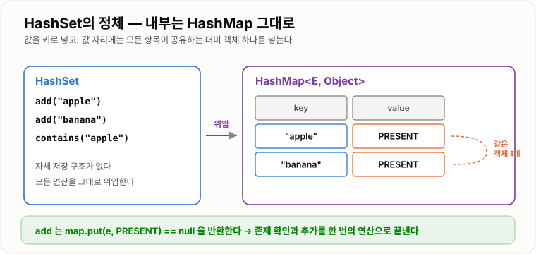

# HashSet

> **HashSet은 중복을 허용하지 않는 값의 모음으로, 해시를 이용해 "이 값이 이미 있는가"를 평균 O(1)에 판단하는 자료구조다.**

---

## 1. 핵심 요약

* HashSet은 **중복 없는 값의 집합**이며, 순서를 보장하지 않는다.
* 내부적으로 **HashMap을 그대로 사용**한다. 값을 키로 넣고, 값 자리에는 의미 없는 더미 객체를 넣는다.
* `add`, `remove`, `contains` 모두 **평균 O(1)** 이다.
* `add`의 반환값이 **"새로 추가되었는가"** 를 알려 준다. 중복 판단을 한 번의 호출로 끝낼 수 있다.
* 키와 마찬가지로 저장할 객체는 **`equals`와 `hashCode`를 함께 재정의**해야 하고 **불변**이어야 한다.

---

## 2. 등장 배경

### 해결하려는 문제

"이 값이 이미 있는가?"는 프로그래밍에서 가장 자주 던지는 질문 중 하나다.

* 이미 방문한 노드인가?
* 이미 처리한 주문 번호인가?
* 중복 신청한 사용자인가?
* 이미 발송한 알림인가?

리스트로 확인하면 다음과 같다.

```java
if (!visited.contains(node)) {     // List.contains → O(n)
    visited.add(node);
}
```

`List.contains`는 앞에서부터 하나씩 `equals`로 비교한다. **O(n)** 이다. 이 검사가 반복문 안에 있으면 전체가 O(n²)이 된다.

```text
100만 개의 데이터에서 중복을 제거한다면

List 사용:  1 + 2 + 3 + ... + 1,000,000 ≈ 5,000억 번 비교
Set 사용:   100만 번 (각각 O(1))
```

**차이가 수십만 배**다. 데이터가 커질수록 이 선택이 성공과 실패를 가른다.

또 하나의 문제가 있다. 리스트는 중복을 **막아 주지 않는다.** 개발자가 매번 검사 코드를 넣어야 하고, 한 곳이라도 빠뜨리면 중복 데이터가 들어간다. Set은 **자료구조 자체가 중복을 보장**한다.

### 이 개념이 없을 때

* 중복 확인이 O(n)이라 데이터가 많아지면 급격히 느려진다.
* 중복 방지 로직을 사용하는 모든 곳에 직접 작성해야 하고, 누락되면 버그가 된다.
* 두 집합의 교집합·차집합 같은 연산을 직접 구현해야 한다.
* 그래프 탐색에서 방문 여부 확인이 병목이 된다.

---

## 3. 핵심 개념

| 개념                | 설명                                     | 중요한 이유                                 |
| ----------------- | -------------------------------------- | -------------------------------------- |
| **집합(Set)**       | 중복이 없고 순서 개념이 없는 값의 모음                 | 수학의 집합 개념을 자료구조로 옮긴 것이다               |
| **중복 판단 기준**      | `hashCode()`가 같고 `equals()`가 `true`이면 같은 값 | 두 메서드를 함께 재정의해야 하는 이유다                 |
| **내부 HashMap**    | HashSet이 실제 저장을 위임하는 대상                | HashSet의 모든 성능 특성이 HashMap과 동일한 이유다    |
| **더미 값(PRESENT)** | 모든 항목의 값 자리에 넣는 하나의 공유 상수 객체           | 값이 필요 없으므로 객체 하나를 재사용해 메모리를 아낀다        |
| **`add`의 반환값**    | 새로 추가되면 `true`, 이미 있으면 `false`         | 중복 확인과 추가를 한 번에 처리할 수 있다               |
| **`contains`**    | 값의 존재 여부를 평균 O(1)에 판단                  | Set의 존재 이유이자 가장 많이 쓰이는 연산이다            |
| **순서 없음**         | 저장 순서나 정렬 순서를 보장하지 않음                  | 순서가 필요하면 `LinkedHashSet`이나 `TreeSet`을 쓴다 |
| **집합 연산**         | 합집합·교집합·차집합                            | `addAll`, `retainAll`, `removeAll`로 제공된다 |
| **불변 키 원칙**       | 저장한 객체의 필드를 바꾸면 안 된다는 규칙               | 해시값이 변하면 영원히 찾지 못하게 된다                 |

개념 간 관계는 다음과 같다.

```text
HashSet
   │
   │ 내부에 보유
   ↓
HashMap<E, Object>
   │
   ├─ key   ←  HashSet이 저장하는 값
   └─ value ←  PRESENT (모든 항목이 공유하는 더미 객체 하나)
```

**핵심 관계**: HashSet = HashMap의 키 집합. 그래서 HashMap의 모든 성질(O(1) 조회, 순서 없음, `equals`/`hashCode` 의존, 스레드 비안전)을 그대로 물려받는다.

---

## 4. 구조와 동작 원리

### 실제 구현

`java.util.HashSet`의 핵심은 놀랄 만큼 단순하다.

```java
public class HashSet<E> {

    private transient HashMap<E, Object> map;

    // 모든 항목이 공유하는 단 하나의 더미 객체
    private static final Object PRESENT = new Object();

    public HashSet() {
        map = new HashMap<>();
    }

    public boolean add(E e) {
        return map.put(e, PRESENT) == null;
    }

    public boolean contains(Object o) {
        return map.containsKey(o);
    }

    public boolean remove(Object o) {
        return map.remove(o) == PRESENT;
    }

    public int size() {
        return map.size();
    }
}
```

`add`의 한 줄이 핵심이다.

```java
return map.put(e, PRESENT) == null;
```

`HashMap.put`은 **기존 값**을 반환한다. 처음 넣는 키면 `null`을 반환하므로 `== null`이 `true` → "새로 추가됨". 이미 있던 키면 기존 값 `PRESENT`를 반환하므로 `false` → "중복". 별도의 검사 없이 한 번의 연산으로 끝난다.

### 저장 구조

```text
HashSet에 "A", "B", "C"를 넣으면 내부 HashMap은 이렇게 된다.

table:
 [0] null
 [1] → ("A", PRESENT)
 [2] → ("B", PRESENT)
 ...
 [7] → ("C", PRESENT)

PRESENT는 항목 수와 관계없이 단 하나의 객체
 → 100만 개를 넣어도 더미 객체는 1개
```



*값을 키 자리에 넣고 값 자리에는 공유 상수를 넣기 때문에, HashMap의 성능 특성을 그대로 물려받는다.*

### `add` 동작 과정

```text
add(value)
    ↓
value.hashCode() 계산
    ↓
보조 해시 적용 → 버킷 인덱스 계산
    ↓
그 버킷이 비었는가?
    ↓ 예                              ↓ 아니오
새 Node 저장                    같은 값이 있는지 비교
반환: true (새로 추가)           (hash 같고 equals true?)
                                    ↓ 있음            ↓ 없음
                              값만 덮어씀        체인 끝에 추가
                              반환: false        반환: true
```

### 실제 값으로 따라가 보기

```java
Set<String> set = new HashSet<>();
set.add("apple");    // true  — 새로 추가
set.add("banana");   // true  — 새로 추가
set.add("apple");    // false — 이미 있음
```

```text
add("apple")
  "apple".hashCode() = 93029210
  보조 해시 → 인덱스 계산 → 버킷 6
  버킷 6 비어 있음 → 저장
  map.put 반환값 = null → add 반환 true

add("banana")
  다른 해시 → 버킷 11
  저장 → true

add("apple")  (두 번째)
  같은 해시 → 버킷 6
  기존 항목과 hash 비교 → 같음
  equals("apple", "apple") → true
  → 같은 키로 판단, 값(PRESENT)만 덮어씀
  map.put 반환값 = PRESENT (null 아님) → add 반환 false

최종 size = 2
```

### 중복 판단이 두 단계인 이유

```text
① hash 비교 (int 비교, 매우 빠름)
      다르면  →  다른 값 확정, equals 호출 안 함
      같으면  →  ②로
② equals 비교 (비쌀 수 있음)
      true   →  같은 값 → 중복
      false  →  해시 충돌일 뿐, 다른 값 → 체인에 추가
```

`hashCode`가 같아도 `equals`가 다르면 **다른 값**이다. 해시 충돌은 흔히 일어나므로 이 2단계 검증이 필수다.

### 집합 연산

```text
A = {1, 2, 3, 4}      B = {3, 4, 5, 6}

A.addAll(B)     합집합  →  {1, 2, 3, 4, 5, 6}
A.retainAll(B)  교집합  →  {3, 4}
A.removeAll(B)  차집합  →  {1, 2}
A.containsAll(B) 부분집합 판단  →  false
```

```text
       A                    B
   ┌───────┐          ┌───────┐
   │ 1   2 │          │       │
   │    ┌──┼──────────┼──┐    │
   │    │  3    4     │  │    │
   │    └──┼──────────┼──┘    │
   └───────┘          │ 5   6 │
                      └───────┘
        ↑ retainAll (교집합) 결과
```

---

## 5. 코드 또는 사용 예시

### 기본 사용

```java
import java.util.HashSet;
import java.util.Set;

public class HashSetExample {

    public static void main(String[] args) {
        Set<String> visited = new HashSet<>();

        System.out.println(visited.add("A"));      // true  — 새로 추가
        System.out.println(visited.add("B"));      // true
        System.out.println(visited.add("A"));      // false — 이미 있음

        System.out.println("포함 여부: " + visited.contains("A"));   // true
        System.out.println("크기: " + visited.size());               // 2

        visited.remove("A");
        System.out.println("삭제 후 크기: " + visited.size());       // 1

        for (String value : visited) {
            System.out.println(value);
        }
    }
}
```

각 부분의 역할은 다음과 같다.

```java
if (visited.add("A")) {
    // 처음 방문한 경우에만 실행
}
```

`contains` 후 `add`를 하는 대신 **`add`의 반환값만 보면 된다.** 해시 계산이 한 번만 일어나 더 효율적이고, 동시성 관점에서도 검사와 추가 사이의 틈이 없다.

```java
// 비효율 — 해시 계산 두 번
if (!visited.contains(node)) {
    visited.add(node);
    process(node);
}

// 효율 — 해시 계산 한 번
if (visited.add(node)) {
    process(node);
}
```

### 중복 제거

```java
import java.util.ArrayList;
import java.util.HashSet;
import java.util.LinkedHashSet;
import java.util.List;
import java.util.Set;

public class DeduplicationExample {

    public static void main(String[] args) {
        List<String> names = new ArrayList<>();
        names.add("Kim");
        names.add("Lee");
        names.add("Kim");
        names.add("Park");
        names.add("Lee");

        // 순서 상관없이 중복 제거
        Set<String> unique = new HashSet<>(names);
        System.out.println(unique);            // 순서 보장 안 됨

        // 원래 순서를 유지하며 중복 제거
        Set<String> ordered = new LinkedHashSet<>(names);
        System.out.println(ordered);           // [Kim, Lee, Park]

        // 다시 List로
        List<String> result = new ArrayList<>(ordered);
        System.out.println(result);
    }
}
```

**입력 순서를 유지하며 중복을 제거해야 한다면 `LinkedHashSet`을 써야 한다.** 실무에서 매우 자주 필요한 요구사항인데, `HashSet`을 쓰면 순서가 뒤섞여 버그로 이어진다.

### `equals`와 `hashCode`

```java
import java.util.HashSet;
import java.util.Objects;
import java.util.Set;

public class SetEqualsHashCode {

    static class Product {
        private final String code;
        private final String name;

        Product(String code, String name) {
            this.code = code;
            this.name = name;
        }

        @Override
        public boolean equals(Object o) {
            if (this == o) {
                return true;
            }
            if (o == null || getClass() != o.getClass()) {
                return false;
            }
            Product other = (Product) o;
            return Objects.equals(code, other.code);   // 코드가 같으면 같은 상품
        }

        @Override
        public int hashCode() {
            return Objects.hash(code);                 // equals가 쓰는 필드와 동일하게
        }

        @Override
        public String toString() {
            return code + "(" + name + ")";
        }
    }

    public static void main(String[] args) {
        Set<Product> products = new HashSet<>();

        products.add(new Product("P001", "노트북"));
        products.add(new Product("P001", "노트북 (수정됨)"));   // 코드가 같음 → 중복
        products.add(new Product("P002", "마우스"));

        System.out.println(products.size());   // 2
        System.out.println(products);
    }
}
```

핵심 규칙 두 가지가 있다.

```text
① equals가 참조하는 필드와 hashCode가 참조하는 필드는 같아야 한다
   → equals는 code만 보는데 hashCode가 code+name을 보면?
     같은 code, 다른 name인 두 객체가 서로 다른 버킷에 들어가
     중복 판단 자체가 이루어지지 않는다

② 그 필드는 불변이어야 한다
   → 저장 후 code를 바꾸면 해시값이 달라져 영원히 찾지 못한다
```

### 가변 객체를 넣었을 때의 사고

```java
import java.util.HashSet;
import java.util.Objects;
import java.util.Set;

public class MutableElementProblem {

    static class Tag {
        String name;

        Tag(String name) {
            this.name = name;
        }

        @Override
        public boolean equals(Object o) {
            if (this == o) {
                return true;
            }
            if (o == null || getClass() != o.getClass()) {
                return false;
            }
            return Objects.equals(name, ((Tag) o).name);
        }

        @Override
        public int hashCode() {
            return Objects.hash(name);
        }
    }

    public static void main(String[] args) {
        Set<Tag> tags = new HashSet<>();

        Tag tag = new Tag("java");
        tags.add(tag);

        System.out.println(tags.contains(tag));   // true

        tag.name = "spring";                       // 필드 변경!

        System.out.println(tags.contains(tag));   // false — 자기 자신도 못 찾음
        System.out.println(tags.size());          // 1     — 여전히 들어는 있음
        System.out.println(tags.remove(tag));     // false — 삭제도 안 됨
    }
}
```

```text
저장 시: name="java"   → hash 3254818 → 버킷 2에 저장
변경 후: name="spring" → hash 이 값이 달라짐 → 버킷 9를 탐색
         버킷 9는 비어 있음 → 못 찾음

객체는 버킷 2에 영원히 남아 있고, 꺼낼 방법도 없다.
```

**JPA 엔티티를 Set에 넣을 때 특히 위험하다.** ID가 `null`인 상태(영속화 전)로 Set에 넣고, 저장 후 ID가 채워지면 해시값이 바뀐다. 그래서 JPA 엔티티의 `equals`/`hashCode`는 ID가 아니라 비즈니스 키로 만들거나, `hashCode`를 상수로 고정하는 전략을 쓴다.

### 실전 — 그래프 탐색의 방문 처리

```java
import java.util.ArrayDeque;
import java.util.Deque;
import java.util.HashSet;
import java.util.List;
import java.util.Set;

public class GraphTraversal {

    public void bfs(Node start) {
        Set<Node> visited = new HashSet<>();
        Deque<Node> queue = new ArrayDeque<>();

        queue.offer(start);
        visited.add(start);

        while (!queue.isEmpty()) {
            Node current = queue.poll();
            System.out.println("방문: " + current.getName());

            List<Node> neighbors = current.getNeighbors();
            for (int i = 0; i < neighbors.size(); i++) {
                Node next = neighbors.get(i);

                // add가 true면 처음 보는 노드
                if (visited.add(next)) {
                    queue.offer(next);
                }
            }
        }
    }
}
```

`visited`가 `List`였다면 `contains`가 O(n)이라 전체가 O(V²)이 된다. `HashSet`이면 O(V+E)로 끝난다.

---

## 6. 성능 특성

| 연산            | 평균 시간 복잡도 |  최악 시간 복잡도 | 설명                     |
| ------------- | -------: | --------: | ---------------------- |
| `add`         |     O(1) | O(log n) | HashMap의 `put`에 위임     |
| `contains`    |     O(1) | O(log n) | HashMap의 `containsKey` |
| `remove`      |     O(1) | O(log n) | HashMap의 `remove`      |
| `size`        |     O(1) |      O(1) | 카운터를 유지한다              |
| 전체 순회         |     O(n + capacity) | 동일 | 빈 버킷도 지나간다             |
| `addAll`(합집합) |     O(m) |      O(m) | 추가할 원소 수 m에 비례         |
| `retainAll`(교집합) | O(n) |      O(n) | 자기 원소 수만큼 상대 Set을 조회한다 |
| `removeAll`(차집합) | O(m) 또는 O(n) | 동일 | 두 집합 크기에 따라 전략이 달라진다   |

> 최악이 O(log n)인 것은 **Java 8 이상**의 트리화 덕분이다. Java 7까지는 O(n)이었다.

공간 복잡도는 **O(n)** 이며, 실제로는 HashMap과 동일한 오버헤드가 있다.

```text
HashSet 원소 1개의 실제 비용
= HashMap Node 객체 (헤더 + hash + key + value + next)
+ 버킷 배열의 참조
+ 로드 팩터로 인한 빈 버킷 (평균 25% 이상)

→ ArrayList에 같은 데이터를 담을 때보다 몇 배의 메모리
```

값 자리는 `PRESENT` 하나를 공유하므로 **값 때문에 늘어나는 메모리는 없다.** 다만 Node 객체의 `value` 필드 자체(참조 4~8바이트)는 원소마다 존재한다.

### 데이터가 많아질 때

* `contains` 비용은 개수와 무관하게 평균 O(1)로 유지된다. 이것이 HashSet의 전부다.
* 리사이즈가 일어나는 `add`만 O(n)이 되며, 전체로 보면 분할 상환된다.
* Node 객체 수가 원소 수만큼 늘어 GC 부담이 커진다.
* 순회는 `capacity`에도 비례하므로, 큰 Set에서 원소를 다 지워도 순회는 여전히 느리다.

### `List.contains`와의 실제 차이

```text
n개의 데이터에서 중복을 제거할 때

List 사용:  O(n²)
   n = 1,000     →  약 50만 번 비교
   n = 100,000   →  약 50억 번 비교      (수십 초~분 단위)

HashSet 사용: O(n)
   n = 1,000     →  1,000번
   n = 100,000   →  100,000번            (밀리초 단위)
```

**"리스트에서 `contains`를 반복문 안에서 호출하고 있다"** 는 성능 문제의 가장 흔한 원인 중 하나다.

---

## 7. 장점과 단점

| 장점                    | 이유                                      |
| --------------------- | --------------------------------------- |
| 존재 여부 확인이 평균 O(1)이다   | 해시로 위치를 계산하므로 원소 수와 무관하다                |
| 중복을 자료구조가 보장한다        | 개발자가 검사 코드를 작성할 필요가 없어 누락 버그가 없다        |
| `add` 하나로 검사와 추가를 끝낸다 | 반환값이 "새로 추가되었는지"를 알려 준다                 |
| 집합 연산을 바로 쓸 수 있다      | 합집합·교집합·차집합이 메서드 한 번으로 처리된다             |
| 중복 제거가 한 줄이다          | `new HashSet<>(list)`로 끝난다              |
| `null`을 하나 저장할 수 있다   | "값 없음"도 원소로 표현할 수 있다                    |

| 단점                   | 이유 및 주의점                                          |
| -------------------- | ------------------------------------------------- |
| 순서를 보장하지 않는다         | 삽입 순서도 정렬 순서도 아니다. 필요하면 `LinkedHashSet`/`TreeSet` |
| 인덱스 접근이 불가능하다        | "3번째 원소"를 가져올 수 없다. 순회로만 접근한다                     |
| 메모리를 많이 쓴다           | 내부 HashMap의 Node 오버헤드와 빈 버킷을 그대로 부담한다             |
| 중복 판단 기준이 값이 아니라 코드다 | `equals`/`hashCode`를 잘못 만들면 중복이 걸러지지 않는다          |
| 가변 객체를 넣으면 잃어버린다     | 필드가 바뀌면 해시값이 달라져 찾지도 지우지도 못한다                     |
| 범위 조회가 불가능하다         | "10~20 사이의 값"을 찾을 수 없다. 필요하면 `TreeSet`            |
| 스레드 안전하지 않다          | 동시 수정 시 원소가 유실될 수 있다                              |

---

## 8. 사용 기준

### 사용하기 좋은 상황

* 중복을 제거해야 하는 경우
* "이미 있는가"를 자주 확인해야 하는 경우 (방문 처리, 중복 요청 차단)
* 두 목록의 교집합·차집합을 구해야 하는 경우
* 화이트리스트·블랙리스트 검사
* 권한이나 태그처럼 순서가 의미 없는 집합
* 이미 처리한 메시지 ID를 기억해 중복 처리를 막을 때

### 사용하지 않는 것이 좋은 상황

* 순서가 중요한 경우 → `LinkedHashSet`(삽입 순서), `TreeSet`(정렬)
* 인덱스로 접근해야 하는 경우 → `List`
* 중복 자체가 의미 있는 경우 (같은 상품 3개 주문 등)
* 값에 대응하는 정보가 필요한 경우 → `Map`
* 범위 조회가 필요한 경우 → `TreeSet`
* 여러 스레드가 동시에 수정하는 경우 → `ConcurrentHashMap.newKeySet()`
* 원소가 가변 객체인 경우 (설계를 바꿔야 한다)

### 선택 기준

1. 중복을 허용하는가? → 허용하면 `List`
2. 순서가 필요한가? → 삽입 순서면 `LinkedHashSet`, 정렬이면 `TreeSet`
3. 값에 딸린 정보가 필요한가? → 필요하면 `Map`
4. 범위 조회가 필요한가? → 필요하면 `TreeSet`
5. 원소가 불변이고 `equals`/`hashCode`가 올바른가?
6. 여러 스레드가 접근하는가? → 동시성 구현체

```text
중복 제거만               →  HashSet
중복 제거 + 입력 순서 유지  →  LinkedHashSet
중복 제거 + 정렬·범위      →  TreeSet
값도 필요                →  HashMap
동시 접근                →  ConcurrentHashMap.newKeySet()
```

---

## 9. 비슷한 개념 비교

### Set 구현체 비교

| 비교 항목  | HashSet    | LinkedHashSet       | TreeSet          | 선택 기준       |
| ------ | ---------- | ------------------- | ---------------- | ----------- |
| 목적     | 빠른 중복 제거   | 순서 유지 + 중복 제거       | 정렬 + 중복 제거       | 순서 요구사항     |
| 내부 구조  | HashMap    | LinkedHashMap       | TreeMap(레드-블랙 트리) | 구조 차이       |
| `add`/`contains` | 평균 O(1) | 평균 O(1)          | O(log n)         | 성능 차이       |
| 순서     | 보장 없음      | 삽입 순서               | 정렬 순서            | 핵심 차이       |
| 범위 조회  | 불가         | 불가                  | 가능 (`subSet` 등)  | 범위 필요 여부    |
| 메모리    | 가장 적음      | 링크 2개 추가            | 노드당 참조 3개 + 색    | HashSet이 유리 |
| `null` 저장 | 1개 가능     | 1개 가능               | 불가 (비교 불가)       | `null` 필요 여부 |
| 적합한 상황 | 일반적인 중복 제거 | 순서 있는 중복 제거, 응답 목록 | 랭킹, 구간 조회        | 요구사항 우선     |

### HashSet과 List

| 비교 항목    | HashSet      | List (ArrayList) | 선택 기준        |
| -------- | ------------ | ---------------- | ------------ |
| 목적       | 중복 없는 집합     | 순서 있는 목록         | 중복 허용 여부     |
| 중복       | 허용 안 함       | 허용               | 요구사항         |
| 순서       | 없음           | 삽입 순서 유지         | 순서 필요 여부     |
| 인덱스 접근   | 불가           | O(1)             | 위치 접근 필요 여부  |
| `contains` | 평균 O(1)      | O(n)             | **검색 빈도가 핵심** |
| 메모리      | 많음 (Node 오버헤드) | 적음               | 메모리 민감도      |
| 적합한 상황   | 존재 확인, 중복 제거 | 순서·인덱스가 중요한 데이터  | 용도로 판단       |

> **실무 판단**: 반복문 안에서 `list.contains(...)`를 호출하고 있다면 거의 항상 `Set`으로 바꿔야 한다.

### HashSet과 HashMap

| 비교 항목  | HashSet     | HashMap       | 선택 기준       |
| ------ | ----------- | ------------- | ----------- |
| 목적     | 값의 존재 여부    | 키에 값을 대응      | 값이 필요한가     |
| 내부 구조  | HashMap을 보유 | 해시 테이블 자체     | 사실상 같은 구조   |
| 저장     | 값 → PRESENT | 키 → 값         | 값 자리 사용 여부  |
| 성능     | 평균 O(1)     | 평균 O(1)       | 동일          |
| 메모리    | 거의 같음       | 값 객체만큼 더 사용   | 값이 필요 없으면 Set |
| 적합한 상황 | 방문 여부, 중복 제거 | ID → 객체 조회    | 값 필요 여부     |

### HashSet과 동시성 Set

| 비교 항목  | HashSet   | `ConcurrentHashMap.newKeySet()` | `CopyOnWriteArraySet` | 선택 기준     |
| ------ | --------- | ------------------------------- | --------------------- | --------- |
| 스레드 안전 | 아니오       | 예                               | 예                     | 동시 접근 여부  |
| 내부 구조  | HashMap   | ConcurrentHashMap               | CopyOnWriteArrayList  | 구조 차이     |
| 쓰기 비용  | O(1)      | O(1)                            | O(n) (전체 복사)          | 쓰기 빈도     |
| 읽기 비용  | O(1)      | O(1)                            | O(n) (선형 탐색)          | 읽기 성능     |
| 적합한 상황 | 지역 변수, 단일 스레드 | 일반적인 동시 Set                     | 원소가 매우 적고 읽기만 많을 때    | 상황별       |

> `Collections.synchronizedSet(new HashSet<>())`도 있지만, 모든 연산에 전역 락이 걸려 경합이 심하다. 보통 `ConcurrentHashMap.newKeySet()`이 낫다.

---

## 10. 백엔드 실무 적용

### Spring·Java

**중복 요청 차단 (멱등성 처리)**

```java
import java.util.Set;
import java.util.concurrent.ConcurrentHashMap;

public class DuplicateRequestFilter {

    // 싱글톤 빈이므로 동시성 Set을 사용
    private final Set<String> processedRequestIds = ConcurrentHashMap.newKeySet();

    public boolean tryProcess(String requestId) {
        // add가 true를 반환하면 처음 보는 요청
        if (!processedRequestIds.add(requestId)) {
            return false;   // 이미 처리한 요청 → 무시
        }
        return true;
    }
}
```

`add`의 반환값을 쓰면 **"확인 후 추가" 사이의 틈이 없어** 동시 요청에도 안전하다. `contains` 후 `add`로 나누면 두 스레드가 동시에 통과할 수 있다.

```text
[위험] contains 후 add
스레드 A: contains("req1") → false
스레드 B: contains("req1") → false   ← 둘 다 통과!
스레드 A: add("req1")
스레드 B: add("req1")
→ 중복 처리 발생

[안전] add 반환값 활용
스레드 A: add("req1") → true   (처리)
스레드 B: add("req1") → false  (차단)
→ 원자적으로 한 번만 통과
```

단, 이 메모리 Set은 서버 재시작 시 사라지고 서버가 여러 대면 공유되지 않는다. 실제 멱등성 보장은 **DB 유니크 제약**이나 **Redis `SETNX`** 로 해야 한다.

**JPA 연관관계 컬렉션**

```java
@Entity
public class Post {

    @OneToMany(mappedBy = "post")
    private Set<Tag> tags = new HashSet<>();   // 중복 태그 방지
}
```

`Set`을 쓰면 같은 태그가 두 번 붙는 것을 자료구조가 막아 준다. 단, 엔티티의 `equals`/`hashCode`를 반드시 신경 써야 한다.

```java
@Entity
public class Tag {

    @Id
    @GeneratedValue
    private Long id;

    private String name;

    @Override
    public boolean equals(Object o) {
        if (this == o) {
            return true;
        }
        if (!(o instanceof Tag)) {
            return false;
        }
        Tag other = (Tag) o;
        // ID가 아니라 비즈니스 키(name)로 비교 — 영속화 전후 일관성 유지
        return name != null && name.equals(other.name);
    }

    @Override
    public int hashCode() {
        return name != null ? name.hashCode() : 0;
    }
}
```

**ID로 `equals`/`hashCode`를 만들면 위험한 이유**:

```text
new Tag("java")  →  id = null  →  hashCode = 0  →  Set에 넣음 (버킷 0)
저장(persist)    →  id = 42    →  hashCode 변경 →  버킷 5를 찾게 됨
                                                  → 자기 자신도 못 찾음
```

**Spring Security 권한**

```java
Set<GrantedAuthority> authorities = new HashSet<>();
authorities.add(new SimpleGrantedAuthority("ROLE_USER"));
```

권한은 중복이 의미 없고 순서도 없으므로 Set이 정확한 선택이다.

**컬렉션 비교**

```java
import java.util.HashSet;
import java.util.List;
import java.util.Set;

public class PermissionDiff {

    // 기존 권한과 새 권한을 비교해 추가/삭제할 항목을 구한다
    public void updatePermissions(List<String> current, List<String> requested) {
        Set<String> currentSet = new HashSet<>(current);
        Set<String> requestedSet = new HashSet<>(requested);

        Set<String> toAdd = new HashSet<>(requestedSet);
        toAdd.removeAll(currentSet);          // 새로 추가할 것

        Set<String> toRemove = new HashSet<>(currentSet);
        toRemove.removeAll(requestedSet);     // 제거할 것

        System.out.println("추가: " + toAdd);
        System.out.println("삭제: " + toRemove);
    }
}
```

전체를 지우고 다시 넣는 대신 **차이만 반영**한다. DB 쓰기를 크게 줄이는 실무 패턴이다.

### 데이터베이스·캐시

* **`IN` 절 파라미터**: 중복 ID를 그대로 보내면 쿼리가 길어지고 파싱 비용이 늘어난다. Set으로 한 번 걸러 보낸다.

```java
Set<Long> uniqueIds = new HashSet<>(orderIds);
List<Order> orders = orderRepository.findAllById(uniqueIds);
```

* **DB의 UNIQUE 제약**이 Set의 개념을 데이터베이스에 구현한 것이다. 내부적으로 유니크 인덱스로 중복을 O(log n)에 검사한다.

```sql
CREATE TABLE coupon_issue (
    id         BIGINT AUTO_INCREMENT PRIMARY KEY,
    coupon_id  BIGINT NOT NULL,
    user_id    BIGINT NOT NULL,
    UNIQUE KEY uk_coupon_user (coupon_id, user_id)   -- 1인 1매 보장
);
```

**애플리케이션의 HashSet은 여러 서버에서 동작하지 않는다.** 진짜 중복 방지는 DB 제약이 담당해야 한다.

* **Redis Set 타입**: 분산 환경에서 쓰는 진짜 공유 Set이다.

```text
SADD event:2024:participants 1001    → 1 (새로 추가)
SADD event:2024:participants 1001    → 0 (이미 있음)
SISMEMBER event:2024:participants 1001  → 1
SCARD event:2024:participants           → 참가자 수

SINTER set:a set:b     → 교집합
SDIFF  set:a set:b     → 차집합
```

`SADD`의 반환값이 HashSet의 `add`와 정확히 같은 의미다. 선착순 이벤트 중복 참여 방지에 자주 쓰인다.

* **HyperLogLog**: 정확한 Set 대신 오차 약 0.81%로 **고유 개수만** 세는 확률적 구조다. 메모리를 12KB로 고정한다. UV(순 방문자) 집계처럼 정확도보다 메모리가 중요할 때 쓴다.

```text
정확한 Set:      1억 명 저장 → 수 GB
HyperLogLog:    1억 명 집계 → 12KB (오차 ~0.81%)
```

### 동시성·분산 환경

* `HashSet`은 스레드 안전하지 않다. 동시 `add` 시 원소가 유실된다.
* 싱글톤 빈의 필드로 `HashSet`을 두는 것은 위험하다. `ConcurrentHashMap.newKeySet()`으로 바꾼다.
* 분산 환경에서는 서버마다 Set이 따로 있다.

```text
서버 A의 processedIds: {req1, req2}
서버 B의 processedIds: {req3}

req1이 서버 B로 들어오면 → 중복인 줄 모르고 다시 처리
```

**중복 방지가 비즈니스적으로 중요하면 반드시 공유 저장소를 쓴다.**

```text
1순위: DB UNIQUE 제약     — 가장 확실 (트랜잭션 보장)
2순위: Redis SADD/SETNX  — 빠르지만 Redis 장애 시 취약
3순위: 애플리케이션 Set    — 보조 수단일 뿐, 단독으로 신뢰 금지
```

---

## 11. 자주 하는 오해

| 잘못된 이해                                | 올바른 이해                                                     |
| ------------------------------------- | ---------------------------------------------------------- |
| HashSet은 삽입 순서를 유지한다                  | 보장하지 않는다. 순서가 필요하면 `LinkedHashSet`을 쓴다                     |
| HashSet은 정렬된 상태로 저장된다                 | 정렬과 무관하다. 정렬이 필요하면 `TreeSet`을 쓴다                           |
| HashSet은 HashMap과 완전히 다른 구조다          | 내부에 HashMap을 그대로 갖고 있으며 값 자리에 더미 객체를 넣을 뿐이다                |
| 중복 판단은 `equals`만으로 한다                 | 먼저 `hashCode`로 버킷을 찾고, 같은 버킷 안에서만 `equals`를 호출한다           |
| `hashCode`만 같으면 중복으로 본다               | `hashCode`가 같아도 `equals`가 `false`면 다른 값으로 취급한다             |
| `equals`만 재정의하면 중복이 걸러진다              | `hashCode`가 다르면 다른 버킷에 들어가 `equals`가 호출조차 되지 않는다           |
| Set에 넣은 객체의 필드를 바꿔도 된다                | 해시값이 달라져 찾지도 지우지도 못하게 된다. 원소는 불변이어야 한다                     |
| `contains` 후 `add`가 더 안전하다            | 해시 계산이 두 번이고, 동시 환경에서는 두 스레드가 모두 통과할 수 있다. `add` 반환값을 쓴다   |
| HashSet은 인덱스로 접근할 수 있다                | 인덱스 개념이 없다. 순회로만 접근한다                                      |
| `HashSet.contains`는 항상 O(1)이다         | **평균**이 O(1)이다. 충돌이 심하면 O(log n)까지 늘어난다                    |
| 애플리케이션 HashSet으로 중복 요청을 완전히 막을 수 있다   | 서버가 여러 대이거나 재시작하면 무력화된다. DB 유니크 제약이나 Redis를 써야 한다          |
| JPA 엔티티의 `equals`/`hashCode`는 ID로 만든다 | 영속화 전후로 ID가 `null`→값으로 바뀌어 해시가 변한다. 비즈니스 키를 쓰거나 별도 전략이 필요하다 |
| `List`를 `Set`으로 바꾸면 항상 빨라진다           | 조회가 많을 때만이다. 순회만 한다면 `List`가 메모리·캐시 면에서 유리하다               |

---

## 12. 면접 답변

### 기본 답변

HashSet은 중복을 허용하지 않는 값의 집합이며, 어떤 값이 이미 존재하는지를 평균 O(1)에 판단할 수 있는 자료구조입니다.

내부 구현이 특이한데, HashSet은 자체적인 저장 구조를 갖지 않고 **내부에 HashMap을 그대로 사용**합니다. 저장할 값을 HashMap의 키로 넣고, 값 자리에는 `PRESENT`라는 의미 없는 더미 객체 하나를 공유해서 넣습니다. 그래서 `add`, `contains`, `remove` 모두 HashMap의 연산에 그대로 위임되고, 성능 특성도 완전히 동일합니다.

`add` 메서드가 잘 설계되어 있습니다. 내부적으로 `map.put(e, PRESENT) == null`을 반환하는데, HashMap의 `put`이 기존 값을 반환하므로 처음 넣는 값이면 `null`이 나와 `true`, 이미 있으면 `PRESENT`가 나와 `false`가 됩니다. 그래서 존재 확인과 추가를 한 번의 연산으로 처리할 수 있습니다. `contains` 후 `add`로 나누면 해시 계산이 두 번 일어나고, 동시 환경에서는 두 스레드가 모두 통과할 수 있어 위험합니다.

주의할 점은 HashMap과 같습니다. 저장하는 객체는 `equals`와 `hashCode`를 함께 올바르게 재정의해야 하고, 두 메서드가 참조하는 필드가 일치해야 합니다. 그리고 그 필드는 불변이어야 합니다. Set에 넣은 뒤 필드를 바꾸면 해시값이 달라져 자기 자신도 찾지 못하게 됩니다.

실무에서는 그래프 탐색의 방문 처리, 중복 요청 차단, 두 목록의 차이 계산에 씁니다. 다만 서버가 여러 대인 환경에서는 각 서버의 Set이 분리되므로, 진짜 중복 방지는 DB 유니크 제약이나 Redis의 `SADD`로 해야 합니다. 순서가 필요하면 `LinkedHashSet`, 정렬이나 범위 조회가 필요하면 `TreeSet`을 씁니다.

### 답변 구조

* **정의**

    * 중복 없는 값의 집합, 순서 보장 없음
    * 존재 여부 판단이 핵심 용도

* **내부 원리**

    * 내부에 `HashMap<E, Object>` 보유
    * 값을 키로, 값 자리에는 공유 상수 `PRESENT`
    * `add`는 `map.put(e, PRESENT) == null`을 반환 → 중복 판단이 한 연산

* **복잡도**

    * `O(1)`: `add`, `contains`, `remove`, `size` (평균)
    * `O(log n)`: 트리화된 버킷의 최악 (Java 8+)
    * `O(n)`: 순회 (+ capacity에 비례), 집합 연산
    * 공간 `O(n)` + HashMap Node 오버헤드

* **장점**

    * 존재 확인 O(1) — `List.contains`의 O(n) 대비 결정적 차이
    * 중복을 자료구조가 보장, 집합 연산 내장
    * `add` 반환값으로 검사·추가를 원자적으로 처리

* **단점**

    * 순서 없음, 인덱스 접근 불가, 범위 조회 불가
    * 메모리 오버헤드, `equals`/`hashCode` 의존
    * 가변 객체를 넣으면 잃어버림, 스레드 안전하지 않음

* **사용 기준**

    * 중복 제거·존재 확인이 목적이고 순서·범위가 필요 없을 때
    * 원소가 불변이고 `equals`/`hashCode`가 올바를 때

* **대안과 비교**

    * 입력 순서 유지 → `LinkedHashSet`
    * 정렬·범위 조회 → `TreeSet` (O(log n))
    * 동시 접근 → `ConcurrentHashMap.newKeySet()`
    * 값도 필요 → `HashMap`

* **실무 적용 사례**

    * 그래프 탐색 방문 처리 (`if (visited.add(node))`)
    * 권한·태그 집합, 두 목록의 차이 계산으로 DB 쓰기 최소화
    * Redis `SADD`로 분산 환경 중복 참여 방지
    * 대규모 고유 카운트는 HyperLogLog로 대체

---

## 13. 예상 면접 질문

### 기본 질문

1. **HashSet은 내부적으로 어떻게 구현되어 있나요?**

    * 핵심 키워드: 내부 HashMap 보유, 값을 키로 저장, `PRESENT` 더미 객체 공유

2. **HashSet은 중복을 어떻게 판단하나요?**

    * 핵심 키워드: `hashCode`로 버킷 결정, 같은 버킷에서 `equals` 비교, 2단계 검증

3. **`add` 메서드의 반환값은 무엇을 의미하나요?**

    * 핵심 키워드: 새로 추가면 `true`, 중복이면 `false`, `map.put` 반환값 활용

4. **`List.contains`와 `Set.contains`의 차이는 무엇인가요?**

    * 핵심 키워드: O(n) 순차 비교 vs O(1) 해시 계산, 반복문 안에서 치명적 차이

5. **HashSet, LinkedHashSet, TreeSet의 차이는 무엇인가요?**

    * 핵심 키워드: 순서 없음 / 삽입 순서 / 정렬 순서, O(1) vs O(log n), 범위 조회

6. **HashSet에 담은 객체가 갖춰야 할 조건은 무엇인가요?**

    * 핵심 키워드: `equals`·`hashCode` 함께 재정의, 같은 필드 사용, 불변

7. **HashSet은 스레드 안전한가요?**

    * 핵심 키워드: 아니오, 동시 `add` 시 유실, `ConcurrentHashMap.newKeySet()`

### 꼬리 질문

1. **`contains` 후 `add`를 하면 어떤 문제가 있나요?**

    * 핵심 키워드: 해시 계산 두 번, 검사-추가 사이 경쟁 상태, `add` 반환값이 원자적

2. **Set에 넣은 객체의 필드를 바꾸면 어떻게 되나요?**

    * 핵심 키워드: 해시값 변경, 다른 버킷 탐색, `contains`/`remove` 실패, 사실상 메모리 누수

3. **`equals`는 `code`만 보는데 `hashCode`는 `code`와 `name`을 보면 어떻게 되나요?**

    * 핵심 키워드: 논리적으로 같은 값이 다른 버킷, 중복 판단 실패, 필드 일치 원칙

4. **JPA 엔티티를 Set에 넣을 때 주의할 점은 무엇인가요?**

    * 핵심 키워드: ID가 `null`→값으로 변경, 해시값 변화, 비즈니스 키 사용, 프록시 `getClass()` 주의

5. **애플리케이션 HashSet으로 중복 요청을 막으면 어떤 한계가 있나요?**

    * 핵심 키워드: 서버 재시작 시 소멸, 여러 서버 간 미공유, DB 유니크 제약·Redis 필요

6. **Redis Set과 HashSet의 관계를 설명해 보세요.**

    * 핵심 키워드: `SADD` 반환값 = `add` 반환값, 분산 환경 공유, `SINTER`/`SDIFF`

7. **1억 명의 순 방문자 수를 세야 한다면 어떻게 하나요?**

    * 핵심 키워드: 정확한 Set은 메모리 폭발, HyperLogLog 12KB 고정, 오차 ~0.81% 허용

8. **두 목록의 차이를 구해 DB 반영을 최소화하려면 어떻게 하나요?**

    * 핵심 키워드: `removeAll`로 추가·삭제 대상 분리, 전체 삭제 후 재삽입 회피

9. **`HashSet`을 순회하면 왜 원소 수보다 느릴 수 있나요?**

    * 핵심 키워드: 버킷 배열 전체 스캔, `capacity`에 비례, 원소를 지워도 용량은 유지

---

## 14. 추가 학습 방향

### 바로 이어서 공부

| 키워드                   | 연결되는 이유                              |
| --------------------- | ------------------------------------ |
| **HashMap**           | HashSet의 실제 구현체이며 모든 성능 특성의 근원이다     |
| **equals · hashCode** | 중복 판단이 성립하기 위한 필수 전제다                |
| **LinkedHashSet**     | 입력 순서를 유지해야 할 때의 대안이다                |
| **TreeSet**           | 정렬과 범위 조회가 필요할 때의 대안이다               |
| **집합 연산**             | 합집합·교집합·차집합의 활용을 익힌다                 |

### 실무 확장

| 키워드                      | 연결되는 이유                          |
| ------------------------ | -------------------------------- |
| **멱등성 처리**               | 중복 요청 차단의 실무 설계 패턴이다             |
| **DB UNIQUE 제약**         | 분산 환경에서 중복을 진짜로 막는 수단이다          |
| **Redis Set (`SADD`)**   | 여러 서버가 공유하는 집합을 만든다              |
| **JPA 연관관계 컬렉션**         | `Set` 사용 시 `equals`/`hashCode` 함정을 이해한다 |
| **`ConcurrentHashMap.newKeySet()`** | 동시 환경에서 안전한 Set 사용법을 익힌다         |

### 심화 학습

| 키워드                  | 연결되는 이유                            |
| -------------------- | ---------------------------------- |
| **블룸 필터**            | 메모리를 크게 아끼며 "확실히 없음"을 판단하는 확률적 구조다 |
| **HyperLogLog**      | 대규모 고유 개수 집계를 12KB로 처리한다           |
| **비트셋(BitSet)**      | 정수 범위가 좁을 때 Set을 비트로 표현해 메모리를 아낀다  |
| **일관된 해싱**           | 분산 Set을 여러 노드에 나눌 때의 재배치 문제를 다룬다   |
| **해시 충돌 공격**         | 같은 버킷으로 몰리게 만드는 입력으로 Set 성능을 무너뜨린다 |

---

## 15. 최종 체크리스트

* [ ] 개념을 한 문장으로 설명할 수 있다
* [ ] 등장 배경을 설명할 수 있다
* [ ] 내부 동작 과정을 설명할 수 있다
* [ ] 성능 특성을 설명할 수 있다
* [ ] 장점과 단점을 설명할 수 있다
* [ ] 사용할 상황과 사용하지 않을 상황을 구분할 수 있다
* [ ] 비슷한 기술과 비교할 수 있다
* [ ] Spring 백엔드 실무 사례를 설명할 수 있다
* [ ] 기본 면접 질문에 답할 수 있다
* [ ] 조건이 달라졌을 때 대안을 제시할 수 있다

---

## 16. 한 줄 결론

**중복을 제거하거나 "이미 있는가"를 자주 확인해야 한다면 HashSet을 쓰되, 원소는 불변이어야 하고 분산 환경의 진짜 중복 방지는 DB나 Redis가 담당해야 한다.**
