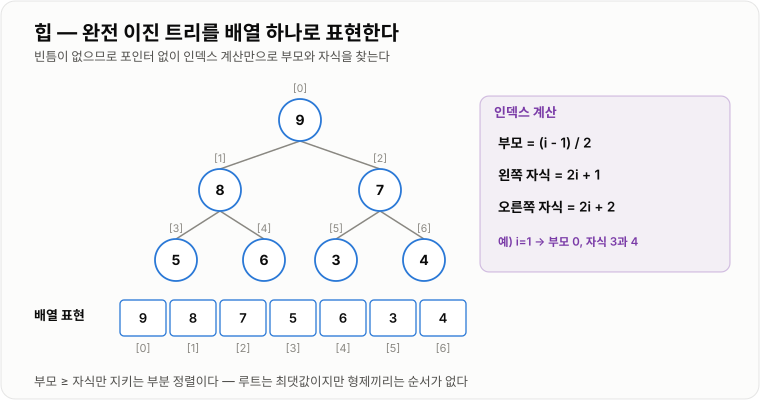

# Heap과 PriorityQueue

> **Heap은 최댓값 또는 최솟값 하나만 항상 맨 위에 있도록 유지하는 완전 이진 트리이고, PriorityQueue는 그 Heap을 이용해 "우선순위가 가장 높은 것부터 꺼낸다"는 규칙을 제공하는 큐다.**

---

## 1. 핵심 요약

* Heap은 **부분 정렬**이다. 부모-자식 순서만 지키고 형제끼리는 순서가 없다.
* 그 대가로 **최댓값·최솟값 조회가 `O(1)`, 삽입·삭제가 `O(log n)`** 이다.
* 완전 이진 트리라 **포인터 없이 배열 하나**로 구현된다. 메모리가 가볍고 캐시 효율이 좋다.
* **Top-K 문제에서 전체 정렬 `O(n log n)`을 `O(n log K)`로 줄인다.** 이것이 Heap의 실무 가치다.
* Java `PriorityQueue`는 **최소 힙이 기본**이고, **순회 순서는 정렬 순서가 아니다.**

---

## 2. 등장 배경

### 해결하려는 문제

"가장 급한 작업부터 처리한다", "가장 점수가 높은 사람을 뽑는다" 같은 요구는 흔하다.

가장 단순한 방법은 **전체를 정렬**하는 것이다.

```java
Collections.sort(tasks);       // O(n log n)
Task next = tasks.get(0);
```

문제는 **데이터가 계속 들어온다**는 것이다. 작업 하나가 추가될 때마다 다시 정렬하면 `O(n log n)`을 반복해야 한다.

기존 자료구조로는 다음과 같이 어느 한쪽이 항상 느리다.

| 방법        | 최댓값 조회  | 삽입     | 문제                    |
| --------- | ------- | ------ | --------------------- |
| 정렬된 배열    | `O(1)`  | `O(n)` | 넣을 때마다 원소를 밀어야 한다     |
| 정렬 안 된 배열 | `O(n)`  | `O(1)` | 꺼낼 때마다 전체를 훑어야 한다     |
| 균형 이진 탐색 트리 | `O(log n)` | `O(log n)` | 조회가 `O(1)`이 아니고 무겁다 |

여기서 발상의 전환이 나온다.

```text
전체를 정렬할 필요가 있는가?

우리가 필요한 건 "가장 큰 것 하나"뿐이다.
나머지 순서는 알 필요가 없다.

→ 완전한 정렬을 포기하고
  "맨 위에 최댓값이 있다"는 조건만 지키자
```

**이 절충이 Heap이다.** 필요한 만큼만 정렬하기 때문에 삽입과 삭제가 `O(log n)`으로 끝난다.

### 이 개념이 없을 때

* 상위 10명을 구하려고 100만 개를 전부 정렬한다. — `O(n log n)`을 `O(n log K)`로 줄일 수 있었다.
* 작업이 추가될 때마다 대기열 전체를 다시 정렬한다.
* 스케줄러에서 다음 실행 시각이 가장 이른 작업을 찾기 위해 매번 전체를 순회한다.
* 두 정렬된 목록을 병합할 때 매번 최솟값을 찾느라 `O(n × k)`를 쓴다.

---

## 3. 핵심 개념

| 개념                | 설명                                          | 중요한 이유                               |
| ----------------- | ------------------------------------------- | ------------------------------------ |
| **완전 이진 트리**      | 마지막 레벨을 제외하고 모두 채워져 있고, 마지막 레벨은 왼쪽부터 채운 트리  | 빈 자리가 없어 **배열로 표현할 수 있다.**           |
| **힙 속성**          | 모든 부모가 자식보다 우선순위가 높다(또는 낮다)는 조건             | 루트가 항상 최댓값(또는 최솟값)임을 보장한다.           |
| **Max Heap**      | 부모가 자식보다 **크거나 같은** 힙                       | 최댓값을 반복해서 꺼낼 때 쓴다.                   |
| **Min Heap**      | 부모가 자식보다 **작거나 같은** 힙                       | 최솟값을 반복해서 꺼낼 때 쓴다. Java의 기본값이다.      |
| **부분 정렬**         | 부모-자식 관계만 정렬되고 형제 간에는 순서가 없는 상태             | 이것이 Heap이 빠른 이유이자 검색이 `O(n)`인 이유다.   |
| **`siftUp`**      | 삽입한 값을 부모와 비교하며 위로 올리는 과정                   | 삽입 후 힙 속성을 복구한다. `O(log n)`          |
| **`siftDown`**    | 루트에 놓인 값을 자식과 비교하며 아래로 내리는 과정               | 삭제 후 힙 속성을 복구한다. `O(log n)`          |
| **`heapify`**     | 정렬 안 된 배열 전체를 한 번에 힙으로 만드는 것                | 하나씩 넣는 `O(n log n)`이 아니라 **`O(n)`이다.** |
| **PriorityQueue** | 우선순위가 가장 높은 원소부터 꺼내는 추상 자료형                 | Heap은 구현, PriorityQueue는 규칙이다.       |
| **Top-K**         | 전체 중 상위(또는 하위) K개만 구하는 문제                   | Heap의 크기를 K로 고정해 `O(n log K)`로 해결한다. |
| **기아 상태**         | 낮은 우선순위 작업이 영원히 처리되지 않는 현상                  | 우선순위 큐를 실무에 쓸 때 반드시 대비해야 한다.         |
| **에이징(aging)**    | 대기 시간에 비례해 우선순위를 올려주는 기법                    | 기아 상태를 막는 표준 해법이다.                   |

### 개념 간 관계

```text
완전 이진 트리 (모양 조건)
        +
힙 속성 (값 조건)
        ↓
      Heap
        ↓
   배열로 구현
        ↓
  PriorityQueue (Java)
```

**Heap과 PriorityQueue의 관계는 이렇게 정리된다.**

| 구분    | Heap             | PriorityQueue         |
| ----- | ---------------- | --------------------- |
| 무엇인가  | 자료구조 (구현)        | 추상 자료형 (규칙)           |
| 정의    | 완전 이진 트리 + 힙 속성  | 우선순위가 높은 것부터 꺼낸다      |
| 관계    | PriorityQueue의 재료 | 보통 Heap으로 구현된다        |
| 다른 구현 | —                | 정렬된 배열, 스킵 리스트로도 가능하다 |

**완전 이진 트리는 "모양" 조건일 뿐 값의 정렬과는 무관하다.** 두 조건이 함께 지켜져야 Heap이다.

---

## 4. 구조와 동작 원리

### 왜 배열 하나로 되는가

완전 이진 트리는 빈 자리가 없으므로, 위에서 아래로 왼쪽에서 오른쪽으로 번호를 매기면 배열 인덱스와 정확히 대응한다.

```text
          [0] 90
         /        \
     [1] 70      [2] 80
     /    \      /
 [3] 50 [4] 60 [5] 75

배열: [90, 70, 80, 50, 60, 75]

부모 → 자식:  왼쪽 = 2i + 1,  오른쪽 = 2i + 2
자식 → 부모:  (i - 1) / 2
```



*빈 자리가 없다는 완전 이진 트리의 성질 덕분에 포인터 없이 인덱스 계산만으로 부모와 자식을 찾는다.*

**포인터가 없으므로 메모리가 가볍고, 연속 배열이라 캐시 효율도 좋다.**

```text
힙 (배열 기반)
  원소 1개 = 값만 저장, 포인터 없음

이진 탐색 트리 (TreeMap)
  원소 1개 = 값 + left + right + parent + color
  참조 3~4개 추가
```

### 삽입 — siftUp

```text
[90, 70, 80, 50, 60, 75] 에 85를 넣는다

① 배열 맨 뒤에 붙인다
   [90, 70, 80, 50, 60, 75, 85]
                             ↑ index 6

② 부모(index 2, 값 80)와 비교 → 85 > 80 → 교환
   [90, 70, 85, 50, 60, 75, 80]

③ 부모(index 0, 값 90)와 비교 → 85 < 90 → 멈춤

완료: [90, 70, 85, 50, 60, 75, 80]
```


*부모보다 크지 않으면 즉시 멈추므로, 항상 루트까지 올라가는 것은 아니다.*

최악의 경우 루트까지 올라가므로 트리 높이만큼, 즉 `O(log n)`이다.

### 삭제 — siftDown

루트(최댓값)를 꺼내는 과정이다.

```text
[90, 70, 85, 50, 60, 75, 80]

① 루트 90을 반환값으로 빼둔다
② 배열 맨 뒤 원소(80)를 루트로 올린다
   [80, 70, 85, 50, 60, 75]

③ 자식들(70, 85) 중 큰 쪽(85)과 비교 → 80 < 85 → 교환
   [85, 70, 80, 50, 60, 75]

④ 자식(75)과 비교 → 80 > 75 → 멈춤

완료: [85, 70, 80, 50, 60, 75]
```

**반드시 우선순위가 높은 쪽 자식과 교환해야 한다.** 아무 자식과 바꾸면 힙 속성이 다시 깨진다.

### heapify — 배열을 한 번에 힙으로

정렬 안 된 배열을 힙으로 만들 때, 하나씩 넣으면 `O(n log n)`이다. 하지만 **아래에서 위로 `siftDown`** 하면 `O(n)`이다.

```text
마지막 부모 노드부터 루트까지 거꾸로 siftDown

이유: 아래쪽 노드일수록 개수는 많지만 내려갈 거리가 짧다
      n/2개는 0단계, n/4개는 1단계, n/8개는 2단계...
      → 전체 합이 O(n)으로 수렴한다
```

이미 데이터가 있다면 **하나씩 넣지 말고 생성자에 넘기는 것**이 빠르다.

### 순회 순서는 정렬 순서가 아니다


*내부 배열은 부모-자식 관계만 정렬된 부분 정렬 상태라, 정렬된 결과를 얻으려면 `poll`을 반복해야 한다.*

```text
내부 배열:  [1, 3, 5, 9, 7]     ← for-each, toString 이 보여주는 것
poll 순서:  1 → 3 → 5 → 7 → 9   ← 실제 우선순위 순서
```

**`toString()`으로 정렬을 확인하려 하면 안 된다.** 원소가 적으면 우연히 정렬로 보일 수 있어 오히려 더 위험하다.

---

## 5. 코드 또는 사용 예시

### 최소 힙과 최대 힙

```java
import java.util.PriorityQueue;
import java.util.Queue;

public class HeapBasic {

    public void run() {
        // 최소 힙 — Java의 기본
        Queue<Integer> minHeap = new PriorityQueue<Integer>();
        minHeap.offer(5);
        minHeap.offer(1);
        minHeap.offer(9);
        minHeap.offer(3);

        System.out.println(minHeap.peek());   // 1  — 꺼내지 않고 확인
        System.out.println(minHeap.poll());   // 1  — 꺼내면서 제거
        System.out.println(minHeap.poll());   // 3

        // 최대 힙 — Comparator 를 뒤집는다
        Queue<Integer> maxHeap = new PriorityQueue<Integer>(
                new Comparator<Integer>() {
                    @Override
                    public int compare(Integer a, Integer b) {
                        return Integer.compare(b, a);   // 순서를 뒤집음
                    }
                }
        );

        maxHeap.offer(5);
        maxHeap.offer(1);
        maxHeap.offer(9);

        System.out.println(maxHeap.poll());   // 9
    }
}
```

* **Java `PriorityQueue`는 최소 힙이 기본**이다. 최대 힙이 필요하면 `Comparator`를 뒤집어야 한다.
* `Comparator`에서 **`a - b`를 반환하면 안 된다.** 정수 오버플로로 부호가 뒤집힐 수 있다. `Integer.compare`를 쓴다.

### 컬렉션으로 만들면 O(n)

```java
List<Integer> list = Arrays.asList(5, 1, 9, 3, 7);

// O(n log n) — 하나씩 offer
Queue<Integer> slow = new PriorityQueue<Integer>();
for (Integer value : list) {
    slow.offer(value);
}

// O(n) — 생성자에서 heapify
Queue<Integer> fast = new PriorityQueue<Integer>(list);
```

> 단, `Comparator`가 필요하면 이 방법을 쓸 수 없다. `new PriorityQueue<>(comparator)` 후 `addAll`을 하면 `O(n log n)`이다.

### Top-K — Heap이 빛나는 지점

100만 개 점수 중 **상위 10명**을 구한다고 하자.

```java
import java.util.Comparator;
import java.util.PriorityQueue;
import java.util.Queue;

public class TopKFinder {

    public List<Integer> findTopK(List<Integer> scores, int k) {
        // 최소 힙을 크기 K로 유지한다
        Queue<Integer> heap = new PriorityQueue<Integer>();

        for (Integer score : scores) {
            heap.offer(score);

            if (heap.size() > k) {
                heap.poll();      // 가장 작은 값을 버린다
            }
        }

        List<Integer> result = new ArrayList<Integer>();
        while (!heap.isEmpty()) {
            result.add(heap.poll());
        }

        return result;            // 오름차순. 내림차순이 필요하면 뒤집는다
    }
}
```

**핵심은 최대 힙이 아니라 최소 힙을 쓴다는 것이다.**

```text
크기 K인 최소 힙의 루트 = "지금까지 본 상위 K개 중 가장 작은 값"

새 값이 루트보다 크면  →  루트를 버리고 새 값을 넣는다
새 값이 루트보다 작으면 →  상위 K개에 못 들어가므로 무시

→ 항상 상위 K개만 힙에 남는다
```

동작 과정을 작은 입력으로 보면 다음과 같다.

```text
입력: [5, 1, 9, 3, 7],  K = 2

5 → 힙 [5]
1 → 힙 [1, 5]
9 → 힙 [1, 5, 9] → 크기 초과 → poll(1) → [5, 9]
3 → 힙 [3, 5, 9] → 크기 초과 → poll(3) → [5, 9]
7 → 힙 [5, 7, 9] → 크기 초과 → poll(5) → [7, 9]

결과: 상위 2개 = 7, 9
```

성능 차이는 다음과 같다.

```text
n = 1,000,000,  K = 10

전체 정렬:  O(n log n) ≈ 2,000만 연산,  메모리 O(n)
Top-K 힙:   O(n log K) ≈  330만 연산,  메모리 O(K) = 10개

→ 연산은 6배, 메모리는 10만 배 차이
```

**메모리가 `O(K)`로 고정된다는 점이 대용량 처리에서 특히 중요하다.**

### 작업 스케줄링

```java
public class Task implements Comparable<Task> {

    private final String name;
    private final int priority;      // 낮을수록 급함
    private final long sequence;     // 삽입 순번 — 동일 우선순위의 FIFO 보장

    public Task(String name, int priority, long sequence) {
        this.name = name;
        this.priority = priority;
        this.sequence = sequence;
    }

    @Override
    public int compareTo(Task other) {
        int result = Integer.compare(this.priority, other.priority);

        if (result != 0) {
            return result;
        }

        return Long.compare(this.sequence, other.sequence);
    }

    public String getName() {
        return name;
    }
}
```

```java
public class Scheduler {

    private final Queue<Task> queue = new PriorityQueue<Task>();
    private long counter = 0;

    public void submit(String name, int priority) {
        queue.offer(new Task(name, priority, counter++));
    }

    public Task next() {
        return queue.poll();
    }
}
```

**`sequence`를 비교 기준에 넣은 이유가 중요하다.** Heap은 불안정하므로 우선순위가 같으면 넣은 순서가 보장되지 않는다. FIFO가 필요하면 **직접 삽입 순번을 비교 기준에 넣어야 한다.**

### 우선순위 변경은 자동으로 반영되지 않는다

```java
Task task = new Task("A", 5, 1);
queue.offer(task);

// task 의 우선순위 필드를 바꿔도 힙은 알지 못한다
// 반드시 remove 후 다시 offer 해야 한다
queue.remove(task);      // O(n) — 위치를 찾기 위해 전체를 훑는다
queue.offer(newTask);    // O(log n)
```

---

## 6. 성능 특성

### 연산별 복잡도

| 연산                  | 평균 시간 복잡도    | 최악 시간 복잡도    | 설명                             |
| ------------------- | ------------ | ------------ | ------------------------------ |
| `peek` (최댓값/최솟값 조회) | `O(1)`       | `O(1)`       | 루트는 항상 배열의 0번이다                |
| `offer` / `add`     | `O(log n)`   | `O(log n)`   | `siftUp`이 최대 트리 높이만큼 이동        |
| `poll` / `remove()` | `O(log n)`   | `O(log n)`   | `siftDown`이 최대 트리 높이만큼 이동      |
| `heapify` (배열 → 힙)  | `O(n)`       | `O(n)`       | 아래에서 위로 `siftDown` — log가 안 붙는다 |
| `remove(Object)`    | `O(n)`       | `O(n)`       | 위치를 찾기 위해 배열 전체를 훑는다           |
| `contains(Object)`  | `O(n)`       | `O(n)`       | 부분 정렬이라 이진 탐색이 불가능하다           |
| `size` / `isEmpty`  | `O(1)`       | `O(1)`       | 필드를 읽는다                        |
| 전체 순회 (정렬 아님)       | `O(n)`       | `O(n)`       | 배열을 그대로 읽는다                    |
| 전체를 꺼내 정렬 (힙 정렬)    | `O(n log n)` | `O(n log n)` | 힙 구성 `O(n)` + n번의 `poll`       |

**평균과 최악이 같다.** 완전 이진 트리라 높이가 항상 `⌊log₂n⌋`로 고정되기 때문이다. 퀵 정렬처럼 최악에 무너지는 일이 없다.

### 트리 높이

```text
n = 1,000          →  높이 약 10
n = 1,000,000      →  높이 약 20
n = 1,000,000,000  →  높이 약 30

100만 개에서도 삽입·삭제에 20번만 비교하면 된다.
```

### 다른 구조와의 비교

| 목적       | 정렬된 배열     | 정렬 안 된 배열    | TreeMap    | **Heap**     |
| -------- | ---------- | ------------ | ---------- | ------------ |
| 최댓값 조회   | `O(1)`     | `O(n)`       | `O(log n)` | **`O(1)`**   |
| 삽입       | `O(n)`     | `O(1)`       | `O(log n)` | **`O(log n)`** |
| 최댓값 삭제   | `O(1)`     | `O(n)`       | `O(log n)` | **`O(log n)`** |
| 임의 값 검색  | `O(log n)` | `O(n)`       | `O(log n)` | `O(n)`       |
| 범위 조회    | 가능         | 불가           | 가능         | **불가**       |
| 정렬 순회    | `O(n)`     | `O(n log n)` | `O(n)`     | `O(n log n)` |
| 메모리      | 적음         | 적음           | 참조 오버헤드    | **적음**       |

**Heap은 "최댓값 조회 + 삽입 + 최댓값 삭제" 조합에만 특화**되어 있다. 그 대가로 검색과 범위 조회를 포기했다.

### 전체 정렬과의 차이

| 목적            | 전체 정렬        | Heap                 |
| ------------- | ------------ | -------------------- |
| 전체 순서가 필요한가   | 필요할 때 쓴다     | 얻으려면 `poll`을 반복해야 한다 |
| 상위 K개만 필요할 때  | `O(n log n)` | **`O(n log K)`**     |
| 메모리           | `O(n)`       | **`O(K)`** (크기 고정 시) |
| 데이터가 계속 추가될 때 | 매번 재정렬       | **삽입마다 `O(log n)`**  |
| 중간 순위 조회      | `O(1)`       | 불가                   |

```text
"전체 정렬이 필요한가?"
  예   → 정렬 알고리즘
  아니오 → "최댓값/최솟값만 반복해서 꺼내면 되는가?"
            예 → Heap
```

### 시스템 관점의 비용

| 기준    | 설명                                            |
| ----- | --------------------------------------------- |
| 메모리   | **무계 큐**라 소비가 느리면 무한히 자라 OOM 위험이 있다           |
| 지연 시간 | 최우선 원소는 즉시 나오지만, 낮은 우선순위는 **기아 상태**가 될 수 있다   |
| 락 경합  | `PriorityBlockingQueue`는 전체 락이라 경합이 심할 수 있다   |
| 캐시 효율 | 배열 기반이라 좋은 편이지만, `siftDown`이 멀리 점프해 미스가 난다    |

### 기아 상태 대응

```text
우선순위 1 작업이 계속 들어오면
우선순위 5 작업은 영원히 처리되지 않는다

대응:
  - 대기 시간에 비례해 우선순위를 올리는 에이징(aging)
  - 우선순위별로 처리 비율을 정하기 (예: 8:2)
  - 낮은 우선순위 전용 워커 분리
```

---

## 7. 장점과 단점

| 장점                   | 이유                                     |
| -------------------- | -------------------------------------- |
| 최댓값·최솟값 조회가 `O(1)`   | 루트가 항상 배열의 0번이다.                       |
| 삽입·삭제가 `O(log n)`    | 트리 높이만큼만 이동하면 힙 속성이 복구된다.              |
| 평균과 최악이 같다           | 완전 이진 트리라 높이가 항상 고정된다.                 |
| 메모리가 가볍다             | 포인터 없이 배열 하나만 쓴다.                      |
| 캐시 효율이 좋다            | 연속된 배열이라 트리 기반 구조보다 미스가 적다.            |
| Top-K를 `O(K)` 메모리로 푼다 | 힙 크기를 K로 고정하면 데이터가 아무리 많아도 메모리가 일정하다.  |
| `heapify`가 `O(n)`이다  | 이미 있는 배열을 한 번에 힙으로 만들 수 있다.            |

| 단점                     | 이유 및 주의점                                        |
| ---------------------- | ----------------------------------------------- |
| 임의 값 검색이 `O(n)`        | 형제 간 순서가 없어 이진 탐색이 불가능하다.                       |
| 범위 조회를 할 수 없다          | 부분 정렬이라 "이상·이하" 개념이 없다. `TreeMap`이 필요하다.        |
| 순회 순서가 정렬 순서가 아니다      | `toString()`이나 for-each로 확인하면 오해한다.             |
| 불안정하다                  | 같은 우선순위의 원래 순서가 보장되지 않는다.                       |
| 우선순위 변경을 감지하지 못한다      | `remove` 후 다시 `offer` 해야 하며, `remove`는 `O(n)`이다. |
| 무계 구조다                 | 크기 제한이 없어 소비가 느리면 OOM이 난다.                      |
| 기아 상태가 발생할 수 있다        | 높은 우선순위가 계속 들어오면 낮은 것은 영원히 처리되지 않는다.            |

---

## 8. 사용 기준

### 선택 흐름도

```text
전체 데이터의 순서가 모두 필요한가?
├─ 예 → 정렬 (Collections.sort)
│
└─ 아니오 → 최댓값 또는 최솟값만 반복해서 꺼내면 되는가?
             ├─ 예 → 상위 K개만 필요한가?
             │        ├─ 예 → Heap 크기를 K로 고정  (O(n log K), 메모리 O(K))
             │        └─ 아니오 → PriorityQueue
             │
             └─ 아니오 → 범위 조회가 필요한가?
                          ├─ 예 → TreeMap / TreeSet
                          └─ 아니오 → HashMap / HashSet
```

### 사용하기 좋은 상황

* **작업 스케줄링** — 우선순위나 실행 시각이 가장 이른 작업부터 처리
* **Top-K** — 상위 N개 랭킹, 가장 가까운 K개 좌표, 최근 인기 검색어
* **다익스트라 최단 경로** — 가장 가까운 정점부터 확장
* **여러 정렬 목록 병합** — 각 목록의 첫 원소만 힙에 넣고 하나씩 꺼낸다
* **중앙값 실시간 계산** — 최대 힙과 최소 힙 두 개로 절반씩 관리
* **이벤트 시뮬레이션** — 발생 시각이 가장 이른 이벤트부터 처리

### 사용하지 않는 것이 좋은 상황

* **전체 정렬 결과가 필요할 때** — 그냥 정렬하는 것이 낫다.
* **특정 값을 찾아야 할 때** — 검색이 `O(n)`이다. `HashMap`이나 `TreeMap`을 쓴다.
* **범위 조회가 필요할 때** — Heap에는 순서 개념이 없다. `TreeMap`을 쓴다.
* **FIFO가 필요할 때** — `PriorityQueue`는 큐 인터페이스를 구현할 뿐 FIFO가 아니다. `ArrayDeque`를 쓴다.
* **중간 순위를 조회해야 할 때** — 2등, 3등을 바로 알 수 없다.
* **원소의 우선순위가 자주 바뀔 때** — 매번 `remove`(`O(n)`) + `offer`가 필요하다.
* **분산 환경에서 전역 우선순위가 필요할 때** — 서버마다 별도의 힙이라 전역 순서가 없다.

### 선택 기준

1. **전체 데이터를 정렬해야 하는가?** — 그렇다면 Heap이 아니다
2. **가장 작은 값 또는 큰 값만 반복해서 꺼내면 되는가?**
3. **상위 K개만 필요한가?** — 그렇다면 힙 크기를 K로 고정한다
4. **작업 우선순위에 따라 처리 순서를 정해야 하는가?**
5. **동일 우선순위의 순서가 중요한가?** — 그렇다면 삽입 순번을 비교 기준에 넣는다
6. **낮은 우선순위가 밀려도 되는가?** — 아니라면 에이징이 필요하다
7. **큐의 상한이 필요한가?** — `PriorityQueue`는 무계다
8. **여러 서버에서 우선순위를 공유해야 하는가?** — 그렇다면 Redis ZSET이나 브로커가 필요하다

---

## 9. 비슷한 개념 비교

### Heap과 이진 탐색 트리(TreeMap)

| 비교 항목  | Heap                | TreeMap (레드-블랙 트리)   | 선택 기준             |
| ------ | ------------------- | ------------------- | ----------------- |
| 목적     | 최댓값·최솟값 반복 조회       | 정렬 유지와 범위 조회        | 하나만 필요한가, 순서가 필요한가 |
| 정렬 정도  | 부분 정렬 (부모-자식만)      | 완전 정렬 (좌우 순서 모두)    | —                 |
| 최댓값 조회 | `O(1)`              | `O(log n)`          | 반복 조회면 Heap        |
| 삽입·삭제  | `O(log n)`          | `O(log n)`          | 동일                |
| 임의 값 검색 | `O(n)`              | `O(log n)`          | 검색이 있으면 TreeMap    |
| 범위 조회  | 불가                  | `O(log n + k)`      | 범위가 있으면 TreeMap    |
| 메모리    | 값만 (배열)             | 참조 5개 + 색           | Heap이 훨씬 가볍다       |
| 적합한 상황 | 스케줄러, Top-K, 다익스트라  | 랭킹 구간 조회, 등급 테이블    | —                 |

### Heap과 전체 정렬

| 비교 항목  | Heap              | 전체 정렬              | 선택 기준           |
| ------ | ----------------- | ------------------ | --------------- |
| 목적     | 최우선 원소만 반복 추출     | 전체 순서 확보           | 전체 순서가 필요한가     |
| Top-K  | `O(n log K)`      | `O(n log n)`       | K가 작으면 Heap      |
| 메모리    | `O(K)` (크기 고정 시)  | `O(n)`             | 대용량이면 Heap       |
| 동적 추가  | 삽입마다 `O(log n)`   | 매번 재정렬             | 계속 들어오면 Heap     |
| 중간 순위  | 불가                | `O(1)`             | 필요하면 정렬          |
| 적합한 상황 | 실시간 스트림, 대용량 Top-K | 한 번에 전체를 다뤄야 하는 경우 | —               |

### PriorityQueue와 다른 Queue

| 비교 항목  | PriorityQueue   | ArrayDeque (FIFO) | PriorityBlockingQueue |
| ------ | --------------- | ----------------- | --------------------- |
| 꺼내는 순서 | 우선순위 순          | 넣은 순서 (FIFO)      | 우선순위 순                |
| 내부 구조  | 배열 기반 힙         | 순환 배열             | 힙 + 락                 |
| 삽입     | `O(log n)`      | `O(1)` (분할 상환)    | `O(log n)` + 락        |
| 스레드 안전 | 아니오             | 아니오               | 예 (전체 락)              |
| 크기 제한  | 무계              | 무계                | 무계                    |
| 선택 기준  | 급한 것부터 처리해야 할 때 | 공정한 순서가 필요할 때     | 동시 환경 + 우선순위          |

---

## 10. 백엔드 실무 적용

### Spring·Java

**스케줄러의 핵심 자료구조가 우선순위 큐다.**

Spring의 `ThreadPoolTaskScheduler`는 내부적으로 `ScheduledThreadPoolExecutor`를 쓰고, 그 안의 `DelayedWorkQueue`가 **힙 기반 우선순위 큐**다.

```text
작업 A: 10초 후 실행
작업 B:  3초 후 실행
작업 C: 30초 후 실행

→ 힙의 루트에는 항상 "가장 빨리 실행할 작업"이 있다
→ 워커 스레드는 루트만 보면 되므로 O(1)
```

`@Scheduled` 애노테이션이 붙은 메서드가 정확한 시각에 실행되는 이유가 여기 있다.

**Top-K를 쿼리 대신 애플리케이션에서 처리해야 할 때**

```java
@Service
public class RankingService {

    public List<Score> topK(Stream<Score> stream, int k) {
        Queue<Score> heap = new PriorityQueue<Score>(
                Comparator.comparingInt(Score::getValue)
        );

        stream.forEach(score -> {
            heap.offer(score);
            if (heap.size() > k) {
                heap.poll();
            }
        });

        List<Score> result = new ArrayList<Score>(heap);
        result.sort(Comparator.comparingInt(Score::getValue).reversed());
        return result;
    }
}
```

전체를 메모리에 올리지 않고 **K개만 유지**하므로, 스트림 데이터나 배치 처리에서 특히 유용하다.

**커스텀 스레드 풀에 우선순위를 넣을 때 주의**

```java
// 위험 — PriorityBlockingQueue 는 무계다
new ThreadPoolExecutor(
        10, 50, 60L, TimeUnit.SECONDS,
        new PriorityBlockingQueue<Runnable>()
);
```

무계 큐를 쓰면 **`maximumPoolSize`가 무력화된다.** 큐가 가득 차지 않으니 스레드가 `corePoolSize` 이상으로 늘어나지 않고, 큐만 무한히 자란다.

### 데이터베이스·캐시

**DB로 해결할 수 있으면 DB가 낫다.**

```sql
SELECT * FROM scores ORDER BY value DESC LIMIT 10;
```

인덱스가 있으면 DB가 상위 10개만 읽고 끝낸다. **애플리케이션 힙은 DB로 처리할 수 없을 때의 대안**이다.

* 여러 데이터 소스를 합쳐야 할 때
* 계산된 값으로 순위를 매겨야 할 때
* 스트림 데이터를 실시간으로 처리할 때

**Redis Sorted Set이 분산 환경의 우선순위 큐다.**

```text
ZADD  ranking 100 "user1"     점수와 함께 저장
ZRANGE ranking 0 9            상위 10개 조회
ZPOPMIN ranking               최솟값 꺼내기
```

Redis ZSET의 내부는 **스킵 리스트 + 해시 테이블**이다. 레드-블랙 트리도 힙도 아니다. 목적은 비슷하지만 구조가 다르다.

| 상황               | 선택                        |
| ---------------- | ------------------------- |
| 단일 서버, 메모리 내 처리  | `PriorityQueue`           |
| 여러 서버가 공유하는 랭킹   | Redis Sorted Set          |
| 지연 실행이 필요한 작업 큐  | Redis ZSET (실행 시각을 score로) |
| 영속성이 필요한 우선순위 작업 | DB 테이블 + 인덱스, 또는 메시지 브로커  |

### 동시성·분산 환경

**`PriorityQueue`는 스레드 안전하지 않다.**

동시 접근이 필요하면 `PriorityBlockingQueue`를 쓰지만, **전체 락이라 경합이 심할 수 있다.** 처리량이 중요하면 우선순위별로 큐를 나누고 각각을 별도 워커가 소비하는 구조가 나을 수 있다.

**분산 환경에서는 전역 우선순위가 지켜지지 않는다.**

```text
서버 A의 힙: [우선순위 1, 3, 5]
서버 B의 힙: [우선순위 2, 4]

→ 서버 A가 3을 처리할 때 서버 B는 2를 처리한다
→ 전역으로 보면 순서가 뒤바뀐다
```

전역 우선순위가 필요하면 **Redis ZSET이나 우선순위를 지원하는 메시지 브로커**를 써야 한다.

**기아 상태는 운영에서 실제로 발생한다.**

```text
장애 알림(우선순위 1)이 계속 들어오는 동안
정기 리포트(우선순위 9)는 며칠째 처리되지 않는다

→ 대기 시간을 모니터링하고
→ 일정 시간이 지나면 우선순위를 올리거나
→ 낮은 우선순위 전용 워커를 분리한다
```

---

## 11. 자주 하는 오해

| 잘못된 이해                                    | 올바른 이해                                                        |
| ----------------------------------------- | ------------------------------------------------------------- |
| 힙은 정렬된 자료구조다                              | **부분 정렬**이다. 부모-자식 순서만 지키고 형제끼리는 순서가 없다.                      |
| 힙을 순회하면 정렬 순서로 나온다                        | 배열을 그냥 읽으면 뒤죽박죽이다. 정렬 순서를 얻으려면 하나씩 `poll`해야 한다.               |
| `toString()`으로 정렬 확인이 가능하다                | 원소가 적으면 우연히 정렬로 보일 수 있어 **더 위험하다.** 절대 믿으면 안 된다.              |
| 힙은 이진 탐색 트리의 일종이다                         | 규칙이 완전히 다르다. BST는 좌우 순서가 있지만 힙은 부모-자식 관계만 본다.                 |
| 힙에서 임의의 값을 `O(log n)`에 찾을 수 있다            | 형제 간 순서가 없어 이진 탐색이 불가능하다. 검색은 `O(n)`이다.                       |
| 힙에서 두 번째로 큰 값은 배열의 1번이다                   | 1번이거나 2번이다. 두 자식 중 큰 쪽을 비교해야 한다.                              |
| 배열을 힙으로 만드는 데 `O(n log n)`이 든다            | 아래에서 위로 `siftDown`하면 **`O(n)`** 이다. 하나씩 insert할 때만 `O(n log n)`이다. |
| `siftDown`에서 아무 자식과 교환해도 된다               | **우선순위가 높은 쪽 자식**과 교환해야 한다. 아니면 힙 속성이 다시 깨진다.                 |
| 힙은 항상 완전 이진 트리이므로 정렬도 잘 된다                | 완전 이진 트리는 **모양** 조건일 뿐, 값의 정렬과는 무관하다.                         |
| Java `PriorityQueue`는 최대 힙이다              | **최소 힙**이 기본이다. 최대 힙이 필요하면 `Comparator`를 뒤집어야 한다.             |
| `PriorityQueue`는 큐니까 FIFO로 동작한다           | `Queue` 인터페이스를 구현할 뿐 **우선순위 순서**로 나온다. FIFO가 필요하면 `ArrayDeque`. |
| 같은 우선순위면 먼저 넣은 것이 먼저 나온다                  | 보장하지 않는다(불안정). FIFO가 필요하면 삽입 순번을 비교 기준에 넣어야 한다.               |
| 상위 K개를 구할 때 최대 힙을 쓴다                      | **최소 힙**을 크기 K로 유지한다. 루트가 "상위 K개 중 최솟값"이라 그것만 버리면 된다.         |
| `remove(Object)`도 `O(log n)`이다            | 위치를 찾기 위해 배열 전체를 훑으므로 **`O(n)`** 이다.                          |
| `contains`가 `O(log n)`이다                  | 부분 정렬이라 이진 탐색이 불가능해 **`O(n)`** 이다.                            |
| `Comparator`에서 `a - b`를 반환해도 된다           | 정수 오버플로로 부호가 뒤집힐 수 있다. `Integer.compare`를 쓴다.                 |
| `PriorityQueue`는 크기 제한을 걸 수 있다            | **무계**다. 소비가 느리면 무한히 자라 OOM이 난다.                              |
| `new PriorityQueue<>(10)`의 10은 우선순위 개수다   | **초기 배열 용량**이다. 우선순위와 무관하다.                                   |
| 원소의 우선순위 필드를 바꾸면 큐가 알아서 재정렬한다             | 힙은 변경을 감지하지 못한다. `remove` 후 다시 `offer`해야 한다.                  |
| 컬렉션을 넣어 만들든 하나씩 넣든 성능이 같다                 | 생성자에 넘기면 `heapify`로 **`O(n)`**, 하나씩 `offer`하면 `O(n log n)`이다.  |
| 우선순위 큐를 쓰면 모든 작업이 언젠가는 처리된다               | 높은 우선순위가 계속 들어오면 낮은 것은 **영원히 기아 상태**가 된다. 에이징이 필요하다.          |
| `PriorityBlockingQueue`를 스레드 풀에 쓰면 안전하다   | 무계라 `maximumPoolSize`가 무력화되고 큐만 무한히 자란다.                      |
| 여러 서버에서 `PriorityQueue`를 쓰면 전역 우선순위가 지켜진다 | 서버마다 별도의 힙이라 전역 순서가 없다. Redis ZSET이나 브로커가 필요하다.               |
| 힙 정렬은 퀵 정렬보다 빠르다                          | 최악은 힙 정렬이 낫지만(`O(n log n)` 보장), 평균 실측은 캐시 효율 때문에 퀵 정렬이 보통 더 빠르다. |
| 힙 정렬은 안정 정렬이다                             | 안정 정렬이 아니다. 같은 값의 원래 순서가 뒤바뀔 수 있다.                            |

---

## 12. 면접 답변

### 기본 답변

Heap은 **완전 이진 트리이면서, 모든 부모가 자식보다 우선순위가 높다는 조건을 지키는 자료구조**입니다. 형제끼리는 순서가 없는 **부분 정렬** 상태라서, 전체를 정렬하는 것보다 유지 비용이 훨씬 쌉니다.

완전 이진 트리는 빈 자리가 없으므로 **포인터 없이 배열 하나**로 표현됩니다. 자식은 `2i+1`, `2i+2`, 부모는 `(i-1)/2`로 계산합니다. 덕분에 메모리가 가볍고 캐시 효율도 좋습니다.

덕분에 **루트 조회가 `O(1)`, 삽입과 삭제가 `O(log n)`** 입니다. 삽입은 맨 뒤에 붙이고 부모와 비교하며 올라가는 `siftUp`, 삭제는 맨 뒤 원소를 루트로 올리고 자식과 비교하며 내려가는 `siftDown`으로 힙 속성을 복구합니다. 완전 이진 트리라 높이가 항상 `log n`으로 고정되어 **평균과 최악이 같습니다.**

`PriorityQueue`는 "우선순위가 높은 것부터 꺼낸다"는 규칙을 정의한 추상 자료형이고, Java에서는 이것을 Heap으로 구현합니다. **기본이 최소 힙**이고, 최대 힙이 필요하면 `Comparator`를 뒤집습니다.

실무에서 가장 큰 가치는 **Top-K 문제**입니다. 100만 개 중 상위 10개를 구할 때 전체 정렬은 `O(n log n)`에 메모리 `O(n)`이 필요하지만, 크기 10짜리 최소 힙을 유지하면 `O(n log K)`에 메모리 `O(K)`로 끝납니다. Spring의 스케줄러 내부 큐, 다익스트라 알고리즘도 같은 구조를 씁니다.

주의할 점은 **순회 순서가 정렬 순서가 아니라는 것**과, **무계 구조라 기아 상태와 OOM에 대비해야 한다는 것**입니다.

### 답변 구조

1. **정의** — 완전 이진 트리 + 힙 속성. 부분 정렬. PriorityQueue는 규칙, Heap은 구현
2. **내부 원리** — 배열 인덱스 대응(`2i+1`, `2i+2`, `(i-1)/2`), `siftUp`으로 삽입, `siftDown`으로 삭제, `heapify`는 `O(n)`
3. **복잡도**
    * `peek` `O(1)`, `offer`·`poll` `O(log n)`, 평균과 최악이 같음
    * `heapify` `O(n)` — 하나씩 넣는 `O(n log n)`보다 빠름
    * `contains`·`remove(Object)` `O(n)` — 부분 정렬이라 검색 불가
    * Top-K `O(n log K)`, 메모리 `O(K)`
4. **장점** — 최우선 원소 조회 `O(1)`, 최악 보장, 배열이라 가볍고 캐시 친화적
5. **단점** — 검색·범위 조회 불가, 불안정, 순회 순서가 정렬이 아님, 무계
6. **사용 기준** — 전체 정렬이 필요 없고 최댓값·최솟값만 반복해서 꺼낼 때. 상위 K개만 필요할 때
7. **대안과 비교** — 전체 정렬(`O(n log n)`), TreeMap(범위 조회 가능하지만 최댓값이 `O(log n)`), Redis ZSET(분산)
8. **실무 적용 사례** — Spring 스케줄러의 `DelayedWorkQueue`, 다익스트라, 실시간 랭킹 Top-K, 여러 정렬 목록 병합

---

## 13. 예상 면접 질문

### 기본 질문

1. **Heap이 무엇이고 어떤 조건을 만족해야 하나요?**

    * 핵심 키워드: 완전 이진 트리(모양), 힙 속성(값), 부분 정렬, 루트가 최댓값 또는 최솟값

2. **Heap을 왜 배열로 구현할 수 있나요?**

    * 핵심 키워드: 완전 이진 트리라 빈 자리 없음, `2i+1`·`2i+2`·`(i-1)/2`, 포인터 불필요

3. **Heap의 삽입과 삭제 과정을 설명해 주세요.**

    * 핵심 키워드: 맨 뒤에 추가 후 `siftUp`, 루트 제거 후 맨 뒤를 올리고 `siftDown`, 트리 높이만큼 `O(log n)`

4. **Heap과 이진 탐색 트리는 무엇이 다른가요?**

    * 핵심 키워드: 부모-자식만 vs 좌우 순서, 최댓값 `O(1)` vs `O(log n)`, 검색 `O(n)` vs `O(log n)`, 범위 조회 불가

5. **Java `PriorityQueue`는 최대 힙인가요, 최소 힙인가요?**

    * 핵심 키워드: 최소 힙이 기본, `Comparator` 뒤집기, `Integer.compare` 사용

6. **전체 정렬 대신 Heap을 쓰면 무엇이 좋아지나요?**

    * 핵심 키워드: Top-K `O(n log K)`, 메모리 `O(K)`, 동적 추가 시 재정렬 불필요

7. **상위 K개를 구할 때 최대 힙과 최소 힙 중 무엇을 쓰나요?**

    * 핵심 키워드: 크기 K짜리 **최소** 힙, 루트가 상위 K 중 최솟값, 그것만 버림

8. **`heapify`가 `O(n)`인 이유는 무엇인가요?**

    * 핵심 키워드: 아래에서 위로 `siftDown`, 아래쪽일수록 개수 많고 이동 거리 짧음, 합이 `O(n)`으로 수렴

### 꼬리 질문

1. **`PriorityQueue`를 for-each로 순회하면 왜 정렬 순서가 아닌가요?**

    * 핵심 키워드: 내부 배열 그대로 읽음, 부분 정렬, `poll` 반복해야 정렬 순서

2. **같은 우선순위 작업의 처리 순서를 보장하려면 어떻게 하나요?**

    * 핵심 키워드: 힙은 불안정, 삽입 순번(sequence)을 비교 기준에 추가, 2차 정렬 키

3. **Heap에서 임의의 값을 삭제하는 비용은 얼마인가요?**

    * 핵심 키워드: 위치 탐색 `O(n)` + `siftDown` `O(log n)` = `O(n)`, 부분 정렬이라 검색 불가

4. **큐에 넣은 원소의 우선순위가 바뀌면 어떻게 되나요?**

    * 핵심 키워드: 힙이 감지 못함, `remove` 후 재삽입, `remove`가 `O(n)`이라 비쌈

5. **`Comparator`에서 `a - b`를 반환하면 무슨 문제가 있나요?**

    * 핵심 키워드: 정수 오버플로, 부호 뒤집힘, `Integer.compare` / `Long.compare`

6. **우선순위 큐를 스레드 풀에 쓸 때 주의할 점은 무엇인가요?**

    * 핵심 키워드: `PriorityBlockingQueue`는 무계, `maximumPoolSize` 무력화, 큐만 무한 증가

7. **기아 상태는 무엇이고 어떻게 대응하나요?**

    * 핵심 키워드: 낮은 우선순위가 영원히 밀림, 에이징, 처리 비율 분배, 전용 워커 분리

8. **여러 서버에서 우선순위를 공유하려면 어떻게 하나요?**

    * 핵심 키워드: 서버마다 별도 힙, 전역 순서 없음, Redis ZSET, 우선순위 지원 브로커

9. **Top-K를 DB 쿼리로 하는 것과 애플리케이션 Heap으로 하는 것은 언제 갈리나요?**

    * 핵심 키워드: `ORDER BY ... LIMIT` + 인덱스가 우선, 여러 소스 병합·계산 값·스트림이면 Heap

10. **힙 정렬은 왜 실무에서 잘 안 쓰이나요?**

    * 핵심 키워드: `O(n log n)` 보장은 좋지만 캐시 효율이 나쁨, 불안정 정렬, 퀵 정렬이 평균 더 빠름

---

## 14. 추가 학습 방향

### 바로 이어서 공부

| 키워드                        | 연결되는 이유                                     |
| -------------------------- | ------------------------------------------- |
| **해시와 트리 비교**              | 검색·범위 조회가 필요할 때 Heap 대신 무엇을 쓰는지 알 수 있다.     |
| **선형 자료구조 비교**             | `PriorityQueue`가 왜 FIFO가 아닌지, `ArrayDeque`와 어떻게 다른지 안다. |
| **Comparable과 Comparator** | 우선순위 기준을 정의하는 방법이며, 오버플로 함정도 함께 다룬다.        |
| **정렬 알고리즘**                | 힙 정렬과 퀵·병합 정렬을 비교하며 안정성과 캐시 효율을 이해할 수 있다.   |
| **시간 복잡도와 공간 복잡도**         | Top-K에서 `O(n log K)`와 `O(K)`가 왜 중요한지 계산할 수 있다. |

### 실무 확장

| 키워드                      | 연결되는 이유                                     |
| ------------------------ | ------------------------------------------- |
| **다익스트라 알고리즘**           | 우선순위 큐 없이는 `O(n²)`인 알고리즘이 `O(E log V)`가 된다. |
| **Spring TaskScheduler** | 내부 `DelayedWorkQueue`가 힙 기반임을 확인할 수 있다.     |
| **ThreadPool과 작업 큐**     | 무계 큐가 `maximumPoolSize`를 무력화하는 구조를 이해한다.    |
| **Redis Sorted Set**     | 분산 환경에서 우선순위와 랭킹을 다루는 표준 방법이다.             |
| **메시지 브로커 우선순위**         | 영속성이 필요한 우선순위 작업을 처리하는 방법을 배운다.             |
| **Rate Limiting과 스케줄링**  | 실행 시각 기반 큐가 실무에서 어떻게 쓰이는지 볼 수 있다.           |

### 심화 학습

| 키워드                | 연결되는 이유                                    |
| ------------------ | ------------------------------------------ |
| **Fibonacci Heap** | 다익스트라의 이론적 복잡도를 개선하는 고급 힙 구조다.             |
| **Indexed Heap**   | 원소 위치를 Map으로 추적해 우선순위 변경을 `O(log n)`으로 만든다. |
| **스킵 리스트**         | Redis ZSET의 내부 구조이며 힙과 다른 접근이다.            |
| **외부 정렬**          | 메모리보다 큰 데이터를 K-way 병합할 때 힙을 쓴다.            |
| **중앙값 스트리밍**       | 최대 힙과 최소 힙 두 개로 실시간 중앙값을 유지하는 기법이다.        |
| **에이징과 스케줄링 정책**   | OS 스케줄러가 기아 상태를 어떻게 막는지 이해할 수 있다.          |

---

## 15. 최종 체크리스트

* [ ] Heap의 두 조건(완전 이진 트리, 힙 속성)을 구분해 설명할 수 있다
* [ ] Heap이 왜 배열로 구현되는지 인덱스 공식과 함께 설명할 수 있다
* [ ] `siftUp`과 `siftDown` 과정을 예시 배열로 따라갈 수 있다
* [ ] `heapify`가 `O(n)`인 이유를 설명할 수 있다
* [ ] Heap이 부분 정렬이라는 것과 그 결과(검색 `O(n)`)를 설명할 수 있다
* [ ] Top-K에 최소 힙을 쓰는 이유를 설명할 수 있다
* [ ] 전체 정렬과 Heap의 복잡도·메모리 차이를 수치로 말할 수 있다
* [ ] Java `PriorityQueue`가 최소 힙이고 순회가 정렬이 아님을 설명할 수 있다
* [ ] 동일 우선순위 FIFO 보장 방법을 설명할 수 있다
* [ ] 기아 상태와 무계 큐의 위험, 그 대응책을 설명할 수 있다
* [ ] 분산 환경에서 전역 우선순위를 어떻게 다루는지 설명할 수 있다

---

## 16. 한 줄 결론

**전체 순서가 아니라 "가장 급한 하나"만 반복해서 필요하다면 Heap이 정답이고, 상위 K개만 필요할 때 힙 크기를 K로 고정하는 것이 이 자료구조의 가장 큰 실무 가치다.**
