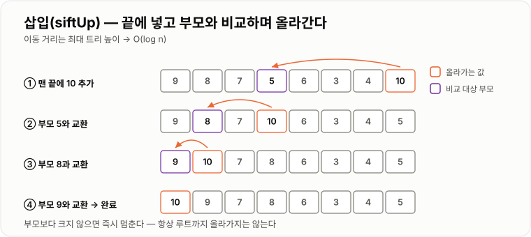

# Heap

> **힙(Heap)은 "부모가 자식보다 항상 크거나(또는 작거나) 같다"는 규칙만 지키는 완전 이진 트리로, 최댓값 또는 최솟값을 O(1)에 확인하고 O(log n)에 꺼낼 수 있는 자료구조다.**

---

## 1. 핵심 요약

* 힙은 **완전 이진 트리(complete binary tree)** 이면서 **힙 속성(부모 ≥ 자식 또는 부모 ≤ 자식)** 을 만족하는 구조다.
* **전체 정렬이 아니라 부분 정렬**이다. 루트만 최댓값(또는 최솟값)이고, 형제끼리는 순서가 없다.
* 완전 이진 트리라서 **포인터 없이 배열 하나로 표현**할 수 있다. 부모·자식 위치는 인덱스 계산으로 구한다.
* `peek`은 **O(1)**, `insert`와 `extract`는 **O(log n)** 이다.
* 이미 있는 배열을 힙으로 만드는 **`heapify`는 O(n log n)이 아니라 O(n)** 이다.

---

## 2. 등장 배경

### 해결하려는 문제

"가장 중요한 것부터 처리한다"는 요구는 어디에나 있다.

* 응급실에서 위중한 환자부터
* 작업 대기열에서 우선순위 높은 작업부터
* 다익스트라 알고리즘에서 가장 가까운 노드부터
* 실시간 랭킹에서 최고 점수부터

이 문제를 기존 자료구조로 풀면 어떻게 될까?

```text
[방법 1] 정렬된 배열 유지
   최댓값 조회: O(1)  ✔ 좋음
   삽입:       O(n)  ✘ 자리를 찾아 원소를 밀어야 함

[방법 2] 정렬 안 된 배열
   삽입:       O(1)  ✔ 좋음
   최댓값 조회: O(n)  ✘ 전부 훑어야 함

[방법 3] 매번 정렬
   삽입 후 정렬: O(n log n)  ✘ 최악

[방법 4] 균형 이진 탐색 트리 (TreeMap)
   삽입:       O(log n) ✔
   최댓값 조회: O(log n) ✔
   → 나쁘지 않지만, 전체 정렬을 유지하느라 불필요한 비용을 낸다
```

여기서 핵심 통찰이 나온다.

> **우리는 "전체 순서"가 필요한 게 아니다. "가장 큰 것 하나"만 알면 된다.**

전체를 정렬하는 것은 **과잉 스펙**이다. 필요한 만큼만 정렬하면 훨씬 싸게 끝낼 수 있다. 그 "필요한 만큼"이 바로 **부모-자식 관계만 지키는 것**이다.

```text
전체 정렬 (과잉)            힙 (필요한 만큼만)
─────────────────────────────────────────────
9 8 7 6 5 4 3                       9
모든 쌍의 순서를 앎          →      /   \
비용이 큼                          8     7
                                  / \   / \
                                 6   5 4   3

                            루트가 최댓값임만 보장
                            8과 7의 순서는 모름 (알 필요 없음)
                            → 유지 비용이 훨씬 싸다
```

### 이 개념이 없을 때

* 우선순위 처리를 하려면 삽입이나 조회 중 하나가 O(n)이 된다.
* 상위 K개를 뽑으려면 전체를 정렬해야 해서 O(n log n)이 든다.
* 다익스트라, 프림 같은 그래프 알고리즘의 시간 복잡도가 크게 나빠진다.
* 스트리밍 데이터에서 실시간으로 상위 항목을 유지할 방법이 없다.
* 정렬 알고리즘 중 하나인 힙 정렬(O(n log n), 추가 메모리 O(1))을 만들 수 없다.

---

## 3. 핵심 개념

| 개념                | 설명                                            | 중요한 이유                              |
| ----------------- | --------------------------------------------- | ----------------------------------- |
| **완전 이진 트리**      | 마지막 레벨을 제외하고 꽉 차 있고, 마지막 레벨은 왼쪽부터 채워진 트리      | 빈틈이 없어 배열로 표현할 수 있는 근거다             |
| **힙 속성**          | 모든 노드에서 `부모 ≥ 자식`(최대 힙) 또는 `부모 ≤ 자식`(최소 힙)    | 루트가 최댓값(최솟값)임을 보장하는 유일한 규칙이다        |
| **최대 힙(Max Heap)** | 부모가 자식보다 크거나 같은 힙                             | 루트가 최댓값이다                           |
| **최소 힙(Min Heap)** | 부모가 자식보다 작거나 같은 힙                             | 루트가 최솟값이다. Java `PriorityQueue`의 기본 |
| **배열 표현**         | 트리를 인덱스 계산으로 배열에 담는 방식                        | 포인터 없이 메모리를 절약하고 캐시 효율을 얻는다         |
| **`siftUp`(상향 조정)** | 새로 넣은 원소를 부모와 비교하며 위로 올리는 동작                  | 삽입 시 힙 속성을 복구한다                     |
| **`siftDown`(하향 조정)** | 루트로 옮긴 원소를 자식과 비교하며 아래로 내리는 동작                | 삭제 시 힙 속성을 복구한다                     |
| **`heapify`**     | 임의의 배열을 힙으로 만드는 동작                            | 하나씩 넣는 O(n log n)보다 빠른 **O(n)** 이다  |
| **부분 정렬**         | 부모-자식 관계만 정렬되고 형제는 무순서인 상태                    | 힙이 싼 이유이자 순회하면 정렬 순서가 안 나오는 이유다     |
| **힙 정렬**          | 힙에서 최댓값을 하나씩 꺼내 정렬하는 알고리즘                     | 추가 메모리 없이 O(n log n) 정렬이 가능하다       |

개념 간 관계는 다음과 같다.

```text
완전 이진 트리 (모양 규칙)
        +
    힙 속성 (값 규칙)
        ↓
       힙
        ↓ 완전 이진 트리라서 빈틈이 없음
   배열로 표현 가능
        ↓
  포인터 없음 → 메모리 절약 + 캐시 효율
```

**핵심 관계**: "완전 이진 트리"는 **모양**에 대한 조건이고 "힙 속성"은 **값**에 대한 조건이다. 두 조건은 별개이며, 둘 다 만족해야 힙이다.

---

## 4. 구조와 동작 원리

### 배열로 트리를 표현하기

완전 이진 트리는 빈 자리가 없으므로 위에서 아래로, 왼쪽에서 오른쪽으로 번호를 매길 수 있다.

```text
             0:[9]
           /       \
       1:[8]       2:[7]
       /   \       /   \
   3:[5] 4:[6] 5:[3] 6:[4]

배열:  [9][8][7][5][6][3][4]
인덱스:  0  1  2  3  4  5  6
```

인덱스만으로 부모·자식을 계산할 수 있다.

```text
0부터 시작하는 배열 기준

부모 인덱스     = (i - 1) / 2      (정수 나눗셈)
왼쪽 자식 인덱스  = 2i + 1
오른쪽 자식 인덱스 = 2i + 2
```

검증해 보자.

```text
i=1 (값 8)의 부모  = (1-1)/2 = 0  →  값 9 ✔
i=1 (값 8)의 왼쪽 자식 = 2×1+1 = 3 →  값 5 ✔
i=1 (값 8)의 오른쪽 자식 = 2×1+2 = 4 → 값 6 ✔

i=2 (값 7)의 왼쪽 자식 = 2×2+1 = 5 →  값 3 ✔
```


*빈 자리가 없다는 완전 이진 트리의 성질 덕분에 포인터 없이 인덱스 계산만으로 부모와 자식을 찾는다.*

**왜 이게 가능한가?** 완전 이진 트리는 중간에 빈 자리가 없기 때문이다. 일반 이진 트리라면 빈 자리 때문에 인덱스가 어긋나 이 계산이 성립하지 않는다.

```text
[일반 이진 트리 — 배열 표현이 낭비됨]
        A
       /
      B
     /
    C

배열: [A][B][ ][C][ ][ ][ ]
       0  1  2  3  4  5  6
       → 빈 칸이 계속 늘어남 (최악 O(2^h))
```

### 삽입 (`siftUp`)

```text
현재 최대 힙:  [9][8][7][5][6][3][4]

               9
            /     \
           8       7
          / \     / \
         5   6   3   4

10을 삽입한다.
```

```text
① 배열의 맨 끝(트리의 마지막 자리)에 넣는다
   [9][8][7][5][6][3][4][10]
                          ↑ i=7

               9
            /     \
           8       7
          / \     / \
         5   6   3   4
        /
      10                    ← 힙 속성 위반! (부모 5 < 자식 10)

② 부모와 비교해 크면 교환 (siftUp)
   부모 = (7-1)/2 = 3 → 값 5
   10 > 5 → 교환

   [9][8][7][10][6][3][4][5]

               9
            /     \
           8       7
          / \     / \
        10   6   3   4
        /
       5

③ 계속 위로
   부모 = (3-1)/2 = 1 → 값 8
   10 > 8 → 교환

   [9][10][7][8][6][3][4][5]

               9
            /     \
          10       7
          / \     / \
         8   6   3   4
        /
       5

④ 계속 위로
   부모 = (1-1)/2 = 0 → 값 9
   10 > 9 → 교환

   [10][9][7][8][6][3][4][5]

              10
            /     \
           9       7
          / \     / \
         8   6   3   4
        /
       5

⑤ 루트에 도달 → 종료
```



*부모보다 크지 않으면 즉시 멈추므로, 항상 루트까지 올라가는 것은 아니다.*

이동 횟수는 최대 **트리 높이 = O(log n)** 이다.

### 삭제 (`siftDown`)

최댓값(루트)을 꺼낸다.

```text
현재:  [10][9][7][8][6][3][4][5]

① 루트 값 10을 반환값으로 저장
② 배열의 마지막 원소 5를 루트로 옮긴다 (구멍을 메움)
   [5][9][7][8][6][3][4]

               5              ← 힙 속성 위반!
            /     \
           9       7
          / \     / \
         8   6   3   4

③ 두 자식 중 큰 쪽과 비교해 교환 (siftDown)
   자식 = 인덱스 1(값 9), 2(값 7) → 큰 쪽은 9
   5 < 9 → 교환

   [9][5][7][8][6][3][4]

               9
            /     \
           5       7
          / \     / \
         8   6   3   4

④ 계속 아래로
   i=1의 자식 = 인덱스 3(값 8), 4(값 6) → 큰 쪽은 8
   5 < 8 → 교환

   [9][8][7][5][6][3][4]

               9
            /     \
           8       7
          / \     / \
         5   6   3   4

⑤ i=3은 자식이 없음 → 종료
```

**왜 "큰 쪽 자식"과 교환해야 하는가?** 작은 쪽과 교환하면 그 자식이 부모가 되는데, 다른 형제보다 작을 수 있어 힙 속성이 또 깨진다.

```text
   5              작은 쪽(7)과 교환하면
  / \                    ↓
 9   7                   7        ← 7 < 9, 여전히 위반!
                        / \
                       9   5
```

### 동작 순서 요약

```text
insert(값)
   ↓
배열 맨 끝에 추가
   ↓
부모와 비교 → 순서가 잘못되었으면 교환
   ↓
루트에 닿거나 순서가 맞을 때까지 반복 (siftUp)
   ↓
완료 — O(log n)


extract()
   ↓
루트 값을 반환값으로 저장
   ↓
마지막 원소를 루트로 이동, 크기 1 감소
   ↓
두 자식 중 우선순위 높은 쪽과 비교 → 잘못되었으면 교환
   ↓
리프에 닿거나 순서가 맞을 때까지 반복 (siftDown)
   ↓
저장한 값 반환 — O(log n)
```

### `heapify` — 왜 O(n)인가

임의의 배열을 힙으로 만드는 두 가지 방법이 있다.

```text
[방법 A] 하나씩 insert
   n번의 insert × 각 O(log n) = O(n log n)

[방법 B] 아래에서 위로 siftDown
   마지막 부모 노드부터 루트까지 siftDown
   → O(n)  ← 더 빠르다!
```

방법 B가 왜 O(n)인지 직관적으로 보면 다음과 같다.

```text
높이가 h인 트리에서

리프 노드     (전체의 약 1/2)  →  siftDown 비용 0
높이 1 노드   (전체의 약 1/4)  →  비용 최대 1
높이 2 노드   (전체의 약 1/8)  →  비용 최대 2
...
루트 1개                      →  비용 최대 h

총합 = n×(0/2 + 1/4 + 2/8 + 3/16 + ...)
     = n × (약 1)
     = O(n)
```

**핵심**: 노드의 절반은 리프라서 비용이 0이고, 비용이 큰 노드는 개수가 극히 적다. `insert` 방식은 반대로 **비용이 큰 위치(깊은 곳)에 원소가 많이 들어가서** 더 비싸다.

```text
[방법 A] 아래→위로 올라감
   깊은 곳의 노드(개수 많음)가 먼 거리를 이동  →  비쌈

[방법 B] 위→아래로 내려감
   깊은 곳의 노드(개수 많음)는 이동 거리 0     →  쌈
```

### 힙 정렬

```text
[힙 구성]  heapify로 최대 힙 만들기  →  O(n)

[정렬]
반복 n번:
   루트(최댓값)와 마지막 원소를 교환
   힙 크기를 1 줄임 (교환된 최댓값은 정렬 완료 구역에 고정)
   새 루트를 siftDown  →  O(log n)

총 O(n) + O(n log n) = O(n log n)
추가 메모리 O(1) — 배열 안에서 처리
```

```text
힙:  [9][8][7][5][6]     정렬 완료: []

9와 6 교환 → [6][8][7][5] | [9]
siftDown  → [8][6][7][5] | [9]

8과 5 교환 → [5][6][7] | [8][9]
siftDown  → [7][6][5] | [8][9]

... 반복

결과: [5][6][7][8][9]
```

---

## 5. 코드 또는 사용 예시

### 최대 힙 직접 구현

```java
public class MaxHeap {

    private int[] elements;
    private int size;

    public MaxHeap(int capacity) {
        this.elements = new int[capacity];
        this.size = 0;
    }

    public void insert(int value) {
        if (size == elements.length) {
            grow();
        }

        elements[size] = value;
        siftUp(size);
        size++;
    }

    public int peek() {
        if (size == 0) {
            throw new IllegalStateException("힙이 비어 있습니다.");
        }
        return elements[0];
    }

    public int extractMax() {
        if (size == 0) {
            throw new IllegalStateException("힙이 비어 있습니다.");
        }

        int max = elements[0];

        elements[0] = elements[size - 1];
        size--;
        siftDown(0);

        return max;
    }

    private void siftUp(int index) {
        while (index > 0) {
            int parent = (index - 1) / 2;

            if (elements[index] <= elements[parent]) {
                break;
            }

            swap(index, parent);
            index = parent;
        }
    }

    private void siftDown(int index) {
        while (true) {
            int left = index * 2 + 1;
            int right = index * 2 + 2;
            int largest = index;

            if (left < size && elements[left] > elements[largest]) {
                largest = left;
            }
            if (right < size && elements[right] > elements[largest]) {
                largest = right;
            }

            if (largest == index) {
                break;
            }

            swap(index, largest);
            index = largest;
        }
    }

    private void swap(int a, int b) {
        int temp = elements[a];
        elements[a] = elements[b];
        elements[b] = temp;
    }

    private void grow() {
        int[] newElements = new int[elements.length * 2];
        for (int i = 0; i < elements.length; i++) {
            newElements[i] = elements[i];
        }
        elements = newElements;
    }

    public int size() {
        return size;
    }

    public static void main(String[] args) {
        MaxHeap heap = new MaxHeap(10);

        heap.insert(5);
        heap.insert(3);
        heap.insert(9);
        heap.insert(1);
        heap.insert(7);

        System.out.println("최댓값: " + heap.peek());   // 9

        while (heap.size() > 0) {
            System.out.print(heap.extractMax() + " ");
        }
        // 9 7 5 3 1
    }
}
```

각 부분의 역할은 다음과 같다.

```java
int parent = (index - 1) / 2;
```

포인터 없이 부모를 찾는다. 이 한 줄이 배열 기반 힙의 핵심이다.

```java
if (elements[index] <= elements[parent]) { break; }
```

부모보다 크지 않으면 이미 힙 속성을 만족하므로 즉시 멈춘다. 끝까지 올라갈 필요가 없다.

```java
int largest = index;
if (left < size && elements[left] > elements[largest]) { largest = left; }
if (right < size && elements[right] > elements[largest]) { largest = right; }
```

**두 자식 중 큰 쪽**을 고른다. 작은 쪽과 교환하면 힙 속성이 다시 깨진다.

```java
if (left < size)
```

`size`로 범위를 검사한다. 배열 길이가 아니라 실제 원소 수여야 한다. 삭제 후 남은 쓰레기 값을 자식으로 오인하지 않기 위해서다.

### `heapify` — O(n) 버전

```java
public class HeapifyExample {

    private int[] elements;
    private int size;

    // 임의의 배열을 O(n)에 힙으로 만든다
    public HeapifyExample(int[] input) {
        this.elements = new int[input.length];
        for (int i = 0; i < input.length; i++) {
            this.elements[i] = input[i];
        }
        this.size = input.length;

        // 마지막 부모 노드부터 루트까지 거꾸로 siftDown
        for (int i = size / 2 - 1; i >= 0; i--) {
            siftDown(i);
        }
    }

    private void siftDown(int index) {
        while (true) {
            int left = index * 2 + 1;
            int right = index * 2 + 2;
            int largest = index;

            if (left < size && elements[left] > elements[largest]) {
                largest = left;
            }
            if (right < size && elements[right] > elements[largest]) {
                largest = right;
            }
            if (largest == index) {
                break;
            }

            int temp = elements[index];
            elements[index] = elements[largest];
            elements[largest] = temp;

            index = largest;
        }
    }

    public void print() {
        for (int i = 0; i < size; i++) {
            System.out.print(elements[i] + " ");
        }
        System.out.println();
    }

    public static void main(String[] args) {
        int[] input = {3, 1, 6, 5, 2, 4};
        HeapifyExample heap = new HeapifyExample(input);
        heap.print();   // 6 5 4 3 2 1  (부분 정렬 상태, 루트가 최댓값)
    }
}
```

```java
for (int i = size / 2 - 1; i >= 0; i--)
```

`size / 2 - 1`이 **마지막 부모 노드의 인덱스**다. 그 뒤는 전부 리프라서 `siftDown`할 필요가 없다. 이 최적화 덕분에 전체가 O(n)이 된다.

### 힙 정렬

```java
public class HeapSort {

    public static void sort(int[] array) {
        int n = array.length;

        // 1) 최대 힙 구성 — O(n)
        for (int i = n / 2 - 1; i >= 0; i--) {
            siftDown(array, i, n);
        }

        // 2) 최댓값을 뒤로 보내며 정렬 — O(n log n)
        for (int end = n - 1; end > 0; end--) {
            swap(array, 0, end);
            siftDown(array, 0, end);   // 힙 크기를 end로 줄여서 처리
        }
    }

    private static void siftDown(int[] array, int index, int size) {
        while (true) {
            int left = index * 2 + 1;
            int right = index * 2 + 2;
            int largest = index;

            if (left < size && array[left] > array[largest]) {
                largest = left;
            }
            if (right < size && array[right] > array[largest]) {
                largest = right;
            }
            if (largest == index) {
                break;
            }

            swap(array, index, largest);
            index = largest;
        }
    }

    private static void swap(int[] array, int a, int b) {
        int temp = array[a];
        array[a] = array[b];
        array[b] = temp;
    }

    public static void main(String[] args) {
        int[] array = {5, 3, 9, 1, 7, 2, 8};
        sort(array);

        for (int i = 0; i < array.length; i++) {
            System.out.print(array[i] + " ");
        }
        // 1 2 3 5 7 8 9
    }
}
```

추가 배열을 전혀 쓰지 않는다. **공간 복잡도 O(1)** 인 O(n log n) 정렬이다.

### 실전 — 상위 K개 뽑기

100만 건 중 상위 10개만 필요하다면 전체 정렬은 낭비다.

```java
import java.util.PriorityQueue;

public class TopK {

    // 크기 k의 "최소 힙"을 유지하면 상위 k개가 남는다
    public static int[] topK(int[] numbers, int k) {
        PriorityQueue<Integer> minHeap = new PriorityQueue<>();   // 기본이 최소 힙

        for (int i = 0; i < numbers.length; i++) {
            minHeap.offer(numbers[i]);

            if (minHeap.size() > k) {
                minHeap.poll();      // 가장 작은 것을 버린다
            }
        }

        int[] result = new int[minHeap.size()];
        for (int i = 0; i < result.length; i++) {
            result[i] = minHeap.poll();
        }
        return result;
    }

    public static void main(String[] args) {
        int[] numbers = {5, 1, 9, 3, 7, 2, 8, 6};
        int[] top3 = topK(numbers, 3);

        for (int i = 0; i < top3.length; i++) {
            System.out.print(top3[i] + " ");
        }
        // 7 8 9  (오름차순으로 나옴)
    }
}
```

**"상위 K개인데 왜 최소 힙인가?"** 가 핵심 포인트다.

```text
크기 3의 최소 힙 유지 과정

offer(5) → [5]
offer(1) → [1, 5]
offer(9) → [1, 5, 9]
offer(3) → [1, 3, 5, 9] → 크기 4 → poll() → 1 제거 → [3, 5, 9]
offer(7) → [3, 5, 7, 9] → poll() → 3 제거 → [5, 7, 9]
offer(2) → [2, 5, 7, 9] → poll() → 2 제거 → [5, 7, 9]
offer(8) → [5, 7, 8, 9] → poll() → 5 제거 → [7, 8, 9]
offer(6) → [6, 7, 8, 9] → poll() → 6 제거 → [7, 8, 9]

최소 힙의 루트 = 현재 상위 3개 중 가장 작은 값
→ 새 값이 이보다 작으면 상위 3개에 못 들어감
→ 루트만 버리면 자동으로 상위 3개가 유지됨
```

```text
성능 비교 (n = 100만, k = 10)

전체 정렬 후 앞 10개:  O(n log n) ≈ 2000만 연산, 메모리 100만
크기 k 힙 유지:        O(n log k) ≈ 330만 연산,  메모리 10

→ 연산 6배, 메모리 10만 배 차이
```

**스트리밍 데이터에서도 동작한다**는 게 더 중요하다. 전체를 메모리에 담을 수 없어도 상위 K개는 계속 유지할 수 있다.

---

## 6. 성능 특성

| 연산                    | 평균 시간 복잡도 | 최악 시간 복잡도 | 설명                          |
| --------------------- | -------: | -------: | --------------------------- |
| `peek` (최댓값/최솟값 조회)   |     O(1) |     O(1) | 루트는 항상 배열의 0번이다             |
| `insert`              | O(log n) | O(log n) | `siftUp`이 최대 트리 높이만큼 이동     |
| `extract` (루트 제거)     | O(log n) | O(log n) | `siftDown`이 최대 트리 높이만큼 이동   |
| `heapify` (배열 → 힙)    |     O(n) |     O(n) | 아래에서 위로 `siftDown` — log가 안 붙는다 |
| 임의 값 검색               |     O(n) |     O(n) | 형제 간 순서가 없어 이진 탐색이 불가능하다    |
| 임의 값 삭제               |     O(n) |     O(n) | 위치 탐색 O(n) + `siftDown` O(log n) |
| 힙 정렬                  | O(n log n) | O(n log n) | 힙 구성 O(n) + n번의 extract     |
| 전체 순회 (정렬 순서 아님)      |     O(n) |     O(n) | 배열을 그냥 훑는다                  |

**평균과 최악이 같다.** 완전 이진 트리라 높이가 항상 `⌊log₂n⌋`로 고정되기 때문이다. 퀵 정렬처럼 최악에 무너지는 일이 없다.

공간 복잡도는 **O(n)** 이며, 다음 이유로 매우 효율적이다.

```text
힙 (배열 기반)
  원소 1개 = 값만 저장
  포인터 없음

이진 탐색 트리 (TreeMap)
  원소 1개 = 값 + left + right + parent + color
  참조 3~4개 추가

→ 같은 데이터를 담아도 힙이 훨씬 가볍고
   연속 메모리라 CPU 캐시 효율도 좋다
```

### 트리 높이

```text
n = 1,000        →  높이 약 10
n = 1,000,000    →  높이 약 20
n = 1,000,000,000 →  높이 약 30

100만 개에서도 삽입·삭제에 20번만 비교하면 된다.
```

### 다른 방식과의 비교

| 목적                | 정렬된 배열 | 정렬 안 된 배열 | TreeMap    | 힙            |
| ----------------- | ------ | --------- | ---------- | ------------ |
| 최댓값 조회            | O(1)   | O(n)      | O(log n)   | **O(1)**     |
| 삽입                | O(n)   | O(1)      | O(log n)   | **O(log n)** |
| 최댓값 삭제            | O(1)   | O(n)      | O(log n)   | **O(log n)** |
| 임의 값 검색           | O(log n) | O(n)    | O(log n)   | O(n)         |
| 범위 조회             | 가능     | 불가        | 가능         | **불가**       |
| 정렬 순회             | O(n)   | O(n log n) | O(n)       | O(n log n)   |
| 메모리               | 적음     | 적음        | 참조 오버헤드    | **적음**       |

**힙은 "최댓값 조회 + 삽입 + 최댓값 삭제" 조합에만 특화**되어 있다. 그 대가로 검색과 범위 조회를 포기했다.

### 데이터가 많아질 때

* 삽입·삭제 비용은 `log n`이라 매우 완만하게 증가한다.
* 배열 기반이라 확장 시 복사가 일어나지만 분할 상환된다.
* 연속 메모리를 쓰므로 트리 기반 구조보다 캐시 미스가 적다.
* **상위 K개만 필요하다면 힙 크기를 K로 고정**해 메모리를 O(K)로 묶을 수 있다. 이것이 대용량 처리에서 힙이 빛나는 지점이다.

---

## 7. 장점과 단점

| 장점                        | 이유                                     |
| ------------------------- | -------------------------------------- |
| 최댓값·최솟값 조회가 O(1)이다        | 항상 배열의 0번 자리에 있다                       |
| 삽입·삭제가 O(log n)이다         | 트리 높이만큼만 이동하면 힙 속성이 복구된다               |
| 최악의 경우에도 성능이 보장된다         | 완전 이진 트리라 높이가 항상 log n으로 고정된다          |
| 포인터 없이 배열로 표현된다           | 메모리가 적고 연속 배치라 캐시 효율이 좋다               |
| `heapify`가 O(n)이다         | 아래에서 위로 처리하면 비싼 노드가 극소수다               |
| 추가 메모리 없는 정렬이 가능하다        | 힙 정렬은 공간 복잡도 O(1)의 O(n log n) 정렬이다     |
| 상위 K개를 메모리 O(K)로 처리한다     | 전체를 담지 않아도 되어 스트리밍·대용량에 적합하다           |

| 단점                    | 이유 및 주의점                                     |
| --------------------- | ----------------------------------------- |
| 임의 값 검색이 O(n)이다       | 형제 간 순서가 없어 이진 탐색을 할 수 없다                     |
| 범위 조회를 할 수 없다         | 정렬 상태가 아니므로 "10~20 사이"를 찾을 수 없다               |
| 순회해도 정렬 순서가 아니다       | 부분 정렬이라 배열을 그냥 읽으면 뒤죽박죽이다                     |
| 두 번째로 큰 값을 바로 알 수 없다  | 두 자식 중 하나이므로 비교가 필요하다 (O(1)이긴 하다)             |
| 중간 원소의 우선순위 변경이 어렵다   | 위치를 찾는 데 O(n)이 든다. 별도 인덱스 맵이 필요하다             |
| 안정 정렬이 아니다            | 힙 정렬은 같은 값의 원래 순서를 보장하지 않는다                   |
| 동일 우선순위의 순서를 보장하지 않는다 | FIFO가 필요하면 삽입 순번을 우선순위에 함께 넣어야 한다             |

---

## 8. 사용 기준

### 사용하기 좋은 상황

* 최댓값 또는 최솟값을 반복해서 꺼내야 하는 경우
* 우선순위에 따라 처리해야 하는 작업 대기열
* 상위 K개 / 하위 K개를 뽑아야 하는 경우 (특히 데이터가 클 때)
* 다익스트라, 프림 같은 그래프 최단 경로·최소 신장 트리 알고리즘
* 스트리밍 데이터에서 실시간으로 상위 항목을 유지해야 하는 경우
* 추가 메모리 없이 O(n log n) 정렬이 필요한 경우
* 중앙값을 실시간으로 유지해야 하는 경우 (최대 힙 + 최소 힙 조합)

### 사용하지 않는 것이 좋은 상황

* 임의의 값을 검색해야 하는 경우 → `HashMap`, `TreeMap`
* 범위 조회가 필요한 경우 → `TreeMap`
* 전체를 정렬된 순서로 순회해야 하는 경우 → `TreeMap` 또는 정렬된 배열
* 들어온 순서대로 처리해야 하는 경우 → `Queue`
* 중간 원소의 우선순위를 자주 바꿔야 하는 경우 (별도 설계 필요)
* 원소 수가 매우 적은 경우 (수십 개면 그냥 정렬해도 무방)

### 선택 기준

1. **최댓값/최솟값만 반복해서 꺼내는가?** → 맞으면 힙
2. 전체 정렬이 정말 필요한가? → 필요 없으면 힙이 더 싸다
3. 임의 검색이나 범위 조회가 필요한가? → 필요하면 `TreeMap`
4. 상위 K개만 필요한가? → 크기 K 힙으로 메모리를 고정한다
5. 동일 우선순위의 처리 순서가 중요한가? → 삽입 순번을 함께 관리한다
6. 여러 스레드가 접근하는가? → `PriorityBlockingQueue`

```text
최댓값/최솟값 반복 추출      →  힙 (PriorityQueue)
정렬 + 범위 조회            →  TreeMap
들어온 순서대로              →  Queue (ArrayDeque)
상위 K개 (대용량·스트리밍)    →  크기 K 힙
분산 환경 랭킹              →  Redis ZSET
```

---

## 9. 비슷한 개념 비교

### 힙과 이진 탐색 트리(TreeMap)

| 비교 항목  | 힙                | 이진 탐색 트리(TreeMap) | 선택 기준         |
| ------ | ---------------- | ----------------- | ------------- |
| 목적     | 최댓값·최솟값 추출       | 정렬·검색·범위 조회       | 필요한 연산        |
| 규칙     | 부모 ≥ 자식 (부분 정렬)  | 왼쪽 < 부모 < 오른쪽 (전체 정렬) | **정렬 범위가 핵심 차이** |
| 최댓값 조회 | **O(1)**         | O(log n)          | 힙이 유리         |
| 임의 검색  | O(n)             | **O(log n)**      | 트리가 유리        |
| 범위 조회  | 불가               | **가능**            | 트리가 유리        |
| 정렬 순회  | O(n log n)       | **O(n)**          | 트리가 유리        |
| 메모리    | **배열, 포인터 없음**   | 노드당 참조 3~4개       | 힙이 유리         |
| 캐시 효율  | **좋음 (연속 배치)**   | 나쁨 (포인터 추적)       | 힙이 유리         |
| 적합한 상황 | 우선순위 큐, 상위 K개    | 랭킹 조회, 구간 매칭      | 요구 연산으로 판단    |

> **핵심 통찰**: 힙은 "전체 정렬을 포기하는 대신" 더 싸고 가벼워진 구조다. 최댓값만 필요한데 TreeMap을 쓰는 것은 과잉 스펙이다.

### 힙과 정렬된 배열

| 비교 항목  | 힙            | 정렬된 배열          | 선택 기준        |
| ------ | ------------ | --------------- | ------------ |
| 최댓값 조회 | O(1)         | O(1)            | 동일           |
| 삽입     | **O(log n)** | O(n) (원소 이동)    | 삽입이 잦으면 힙    |
| 최댓값 삭제 | O(log n)     | **O(1)** (끝 제거) | 삭제만이면 배열     |
| 임의 검색  | O(n)         | **O(log n)**    | 검색이면 배열      |
| 적합한 상황 | 삽입·삭제가 계속 발생 | 한 번 만들고 조회만     | **변경 빈도가 핵심** |

### 최대 힙과 최소 힙

| 비교 항목  | 최대 힙        | 최소 힙          | 선택 기준           |
| ------ | ----------- | ------------- | --------------- |
| 루트     | 최댓값         | 최솟값           | 무엇을 먼저 꺼낼 것인가   |
| 규칙     | 부모 ≥ 자식     | 부모 ≤ 자식       | 비교 방향만 반대       |
| Java 기본 | 없음 (Comparator 필요) | `PriorityQueue` 기본 | 기본값 주의          |
| 상위 K개  | 사용하지 않음     | **크기 K 유지**   | 반직관적이지만 최소 힙이 맞다 |
| 하위 K개  | **크기 K 유지** | 사용하지 않음       | 반대로 생각한다        |
| 적합한 상황 | 큰 값부터 처리    | 작은 값부터 처리     | 우선순위 정의에 따라     |

> **혼동 포인트**: "상위 K개"에 최대 힙이 아니라 **최소 힙**을 쓴다. 최소 힙의 루트가 "현재 상위 K개 중 가장 작은 값"이므로, 그것만 버리면 상위 K개가 자동으로 유지되기 때문이다.

### 힙과 Redis Sorted Set

| 비교 항목  | 힙 (PriorityQueue) | Redis ZSET     | 선택 기준     |
| ------ | ----------------- | -------------- | --------- |
| 범위     | 단일 JVM 메모리        | 여러 서버 공유       | 분산 여부     |
| 내부 구조  | 배열 기반 이진 힙        | 스킵 리스트 + 해시 테이블 | 구조 차이     |
| 최댓값 조회 | O(1)              | O(log n)       | 힙이 빠름     |
| 임의 원소 점수 변경 | O(n)              | **O(log n)**   | ZSET이 유리  |
| 순위 조회  | 불가                | **O(log n)**   | ZSET만 가능  |
| 영속성    | 없음                | 있음             | 유실 허용 여부  |
| 적합한 상황 | 알고리즘, 단일 프로세스 작업 큐 | 실시간 랭킹, 리더보드   | 공유 필요 여부  |

---

## 10. 백엔드 실무 적용

### Spring·Java

Java에서 힙은 **`PriorityQueue`** 로 제공된다. 직접 구현할 일은 거의 없다.

```java
import java.util.Comparator;
import java.util.PriorityQueue;

public class TaskScheduler {

    static class Task {
        final String name;
        final int priority;      // 숫자가 작을수록 급함
        final long sequence;     // 동일 우선순위의 FIFO 보장용

        Task(String name, int priority, long sequence) {
            this.name = name;
            this.priority = priority;
            this.sequence = sequence;
        }
    }

    public static void main(String[] args) {
        PriorityQueue<Task> queue = new PriorityQueue<>(new Comparator<Task>() {
            @Override
            public int compare(Task a, Task b) {
                if (a.priority != b.priority) {
                    return Integer.compare(a.priority, b.priority);
                }
                // 우선순위가 같으면 먼저 들어온 것부터
                return Long.compare(a.sequence, b.sequence);
            }
        });

        long seq = 0;
        queue.offer(new Task("일반 알림", 5, seq++));
        queue.offer(new Task("결제 실패 처리", 1, seq++));
        queue.offer(new Task("리포트 생성", 5, seq++));
        queue.offer(new Task("서버 장애 알림", 1, seq++));

        while (!queue.isEmpty()) {
            Task task = queue.poll();
            System.out.println(task.priority + " : " + task.name);
        }
        // 1 : 결제 실패 처리
        // 1 : 서버 장애 알림
        // 5 : 일반 알림
        // 5 : 리포트 생성
    }
}
```

**`sequence` 필드가 중요하다.** 힙은 동일 우선순위의 순서를 보장하지 않는다. 안정성이 필요하면 삽입 순번을 비교 기준에 추가해야 한다.

* **`ScheduledThreadPoolExecutor`**: 내부 `DelayedWorkQueue`가 힙이다. 실행 시각이 가장 이른 작업이 루트에 온다. `@Scheduled`가 이 위에서 동작한다.
* **`PriorityBlockingQueue`**: 스레드 안전한 우선순위 큐. 생산자·소비자 패턴에서 우선순위 처리가 필요할 때 쓴다.
* **Netty의 타이머**: 타임아웃 관리에 힙을 쓴다.

### 데이터베이스·캐시

**DB의 `ORDER BY ... LIMIT k`** 최적화가 힙과 같은 원리다.

```sql
SELECT * FROM orders
ORDER BY amount DESC
LIMIT 10;
```

옵티마이저는 전체를 정렬하지 않는다. **크기 10짜리 힙(priority queue)을 유지하며 한 번만 훑는다.** MySQL 실행 계획에서 이를 확인할 수 있다.

```text
전체 정렬:  O(n log n), 메모리 O(n)
힙 방식:    O(n log 10), 메모리 O(10)
```

**Redis ZSET이 분산 환경의 우선순위 큐 역할**을 한다.

```text
ZADD delayed:tasks 1735689600 "task:1"    # 실행 시각을 점수로
ZADD delayed:tasks 1735689700 "task:2"

# 지금 실행할 작업 꺼내기
ZRANGEBYSCORE delayed:tasks 0 <현재시각> LIMIT 0 10
ZREM delayed:tasks "task:1"
```

지연 작업 큐(delayed queue)를 이렇게 만든다. 힙과 달리 **여러 서버가 공유**하고 **재시작에도 살아남는다.**

**실시간 랭킹**도 마찬가지다.

```text
ZADD game:ranking 15000 "player1"
ZINCRBY game:ranking 500 "player1"     # 점수 증가 O(log n)
ZREVRANGE game:ranking 0 9 WITHSCORES  # 상위 10명
ZREVRANK game:ranking "player1"        # 내 순위
```

힙으로는 **"특정 원소의 점수를 바꾸기"** 와 **"순위 조회"** 를 O(log n)에 할 수 없다. ZSET은 스킵 리스트 + 해시 테이블 조합으로 둘 다 지원한다.

### 대용량 처리 — 상위 K개

```java
import java.util.PriorityQueue;

public class LogAnalyzer {

    // 수억 건의 로그에서 응답 시간이 가장 느린 100건을 찾는다
    public PriorityQueue<LogEntry> findSlowest(Iterable<LogEntry> logs, int k) {
        PriorityQueue<LogEntry> heap = new PriorityQueue<>(k,
                new java.util.Comparator<LogEntry>() {
                    @Override
                    public int compare(LogEntry a, LogEntry b) {
                        return Long.compare(a.getDuration(), b.getDuration());
                    }
                });

        for (LogEntry log : logs) {
            heap.offer(log);
            if (heap.size() > k) {
                heap.poll();     // 가장 빠른 것을 버린다
            }
        }

        return heap;
    }
}
```

전체를 메모리에 담을 필요가 없다. **메모리는 O(k)로 고정**되고, 스트리밍으로 들어오는 데이터에도 그대로 동작한다.

```text
수억 건 전체 정렬 → 메모리 부족(OOM), 시간 폭발
크기 100 힙       → 메모리 100개분, 한 번의 순회로 완료
```

### 동시성·분산 환경

* `PriorityQueue`는 **스레드 안전하지 않다.** 동시 `offer`/`poll` 시 힙 구조가 깨져 잘못된 값이 나온다.
* 대안:
    * `PriorityBlockingQueue` — 락 기반, 무계(크기 제한 없음)
    * `DelayQueue` — 지연 시간이 지난 원소만 꺼낼 수 있는 특수 힙
* 분산 환경에서는 서버마다 힙이 따로 있다. 전역 우선순위가 필요하면 Redis ZSET이나 메시지 브로커의 우선순위 큐를 쓴다.

```text
서버 A의 힙: [우선순위 1, 3, 5]
서버 B의 힙: [우선순위 2, 4]

→ 서버 A가 우선순위 3을 처리할 때 서버 B에 있는 2가 대기 중
→ 전역 우선순위가 지켜지지 않는다
```

* **주의**: `PriorityBlockingQueue`는 무계 큐다. 소비가 느리면 무한히 쌓여 OOM이 난다. `ThreadPoolExecutor`에 쓸 때는 특히 조심해야 한다.

---

## 11. 자주 하는 오해

| 잘못된 이해                                | 올바른 이해                                                                 |
| ------------------------------------- | ---------------------------------------------------------------------- |
| 힙은 정렬된 자료구조다                          | **부분 정렬**이다. 부모-자식 순서만 지키고 형제끼리는 순서가 없다                                |
| 힙을 순회하면 정렬 순서로 나온다                    | 배열을 그냥 읽으면 뒤죽박죽이다. 정렬 순서를 얻으려면 하나씩 `poll`해야 한다                        |
| 힙은 이진 탐색 트리의 일종이다                     | 규칙이 완전히 다르다. BST는 좌우 순서가 있지만 힙은 부모-자식 관계만 본다                           |
| 힙에서 임의의 값을 O(log n)에 찾을 수 있다          | 형제 간 순서가 없어 이진 탐색이 불가능하다. 검색은 O(n)이다                                   |
| 힙에서 두 번째로 큰 값은 배열의 1번이다               | 1번이거나 2번이다. 두 자식 중 큰 쪽을 비교해야 한다                                        |
| 배열을 힙으로 만드는 데 O(n log n)이 든다          | 아래에서 위로 `siftDown`하면 **O(n)** 이다. 하나씩 insert할 때만 O(n log n)이다          |
| `siftDown`에서 아무 자식과 교환해도 된다           | **우선순위가 높은 쪽 자식**과 교환해야 한다. 아니면 힙 속성이 다시 깨진다                           |
| 힙은 항상 완전 이진 트리이므로 정렬도 잘 된다            | 완전 이진 트리는 **모양** 조건일 뿐, 값의 정렬과는 무관하다                                   |
| Java `PriorityQueue`는 최대 힙이다          | **최소 힙**이 기본이다. 최대 힙이 필요하면 `Comparator`를 뒤집어야 한다                       |
| `PriorityQueue`를 `toString`하면 정렬되어 보인다 | 내부 배열 순서라 정렬이 아니다. 우연히 맞아 보일 수 있어 더 위험하다                               |
| 같은 우선순위면 먼저 넣은 것이 먼저 나온다              | 보장하지 않는다. FIFO가 필요하면 삽입 순번을 비교 기준에 넣어야 한다                              |
| 상위 K개를 구할 때 최대 힙을 쓴다                  | **최소 힙**을 크기 K로 유지한다. 루트가 "상위 K개 중 최솟값"이라 그것만 버리면 된다                   |
| 힙 정렬은 퀵 정렬보다 빠르다                      | 최악은 힙 정렬이 낫지만(O(n log n) 보장), 평균 실측은 캐시 효율 때문에 퀵 정렬이 보통 더 빠르다          |
| 힙 정렬은 안정 정렬이다                         | 안정 정렬이 아니다. 같은 값의 원래 순서가 뒤바뀔 수 있다                                      |

---

## 12. 면접 답변

### 기본 답변

힙은 "부모가 자식보다 크거나 같다"(최대 힙) 또는 "작거나 같다"(최소 힙)는 규칙만 지키는 완전 이진 트리입니다. 이 규칙 덕분에 루트가 항상 최댓값 또는 최솟값이 되어 O(1)에 확인할 수 있습니다.

핵심은 **전체 정렬이 아니라 부분 정렬**이라는 점입니다. 이진 탐색 트리는 모든 노드의 좌우 순서를 지켜야 하지만, 힙은 부모-자식 관계만 봅니다. 형제끼리는 순서가 없어도 됩니다. 우리가 필요한 건 "가장 큰 것 하나"이지 전체 순서가 아니기 때문에, 딱 그만큼만 정렬해서 유지 비용을 낮춘 구조입니다.

완전 이진 트리라서 중간에 빈 자리가 없고, 그래서 포인터 없이 배열 하나로 표현할 수 있습니다. 인덱스 i의 부모는 `(i-1)/2`, 자식은 `2i+1`과 `2i+2`로 계산합니다. 포인터가 없으니 메모리가 적고 연속 배치라 캐시 효율도 좋습니다.

삽입은 배열 맨 끝에 넣고 부모와 비교하며 위로 올리는 `siftUp`으로, 삭제는 마지막 원소를 루트로 옮기고 자식과 비교하며 내리는 `siftDown`으로 처리합니다. 둘 다 트리 높이만큼만 이동하므로 O(log n)입니다. 완전 이진 트리라 높이가 항상 log n으로 고정되어 **평균과 최악이 같습니다.**

한 가지 중요한 특징은 임의의 배열을 힙으로 만드는 `heapify`가 O(n log n)이 아니라 **O(n)** 이라는 점입니다. 아래에서 위로 `siftDown`을 하면, 이동 거리가 긴 노드는 개수가 극히 적고 절반인 리프는 비용이 0이라 전체가 O(n)으로 수렴합니다.

실무에서는 우선순위 작업 큐, 다익스트라 같은 그래프 알고리즘, 그리고 특히 **상위 K개 추출**에 씁니다. 100만 건에서 상위 10개를 뽑을 때 전체를 정렬하면 O(n log n)에 메모리도 100만 개분이 필요하지만, 크기 10짜리 최소 힙을 유지하면 O(n log 10)에 메모리는 10개분이면 됩니다. 여기서 최대 힙이 아니라 최소 힙을 쓰는 게 포인트인데, 최소 힙의 루트가 "현재 상위 10개 중 가장 작은 값"이라 그것만 버리면 자동으로 상위 10개가 유지되기 때문입니다.

한계도 명확합니다. 임의 값 검색과 범위 조회가 안 됩니다. 형제 간 순서가 없어 이진 탐색을 할 수 없기 때문입니다. 그런 게 필요하면 TreeMap을 씁니다. 그리고 Java의 `PriorityQueue`는 스레드 안전하지 않고, 여러 서버가 전역 우선순위를 공유해야 하면 Redis Sorted Set을 씁니다.

### 답변 구조

* **정의**

    * 완전 이진 트리 + 힙 속성(부모 ≥ 자식 또는 부모 ≤ 자식)
    * 전체 정렬이 아닌 **부분 정렬** — 루트만 최댓값(최솟값) 보장

* **내부 원리**

    * 완전 이진 트리라 빈틈이 없어 배열로 표현 (`부모=(i-1)/2`, `자식=2i+1, 2i+2`)
    * 삽입: 끝에 추가 후 `siftUp` (부모와 비교하며 위로)
    * 삭제: 마지막 원소를 루트로 옮기고 `siftDown` (**큰 쪽 자식**과 교환)
    * `heapify`: 아래에서 위로 `siftDown` → **O(n)**

* **복잡도**

    * `O(1)`: `peek` (루트 = 배열 0번)
    * `O(log n)`: `insert`, `extract` — **평균과 최악이 동일** (높이 고정)
    * `O(n)`: `heapify`, 임의 값 검색
    * `O(n log n)`: 힙 정렬 (추가 메모리 **O(1)**)
    * 공간 `O(n)`, 포인터 없어 트리 구조보다 가볍고 캐시 효율 좋음

* **장점**

    * 최댓값·최솟값 O(1), 삽입·삭제 O(log n), 최악 보장
    * 배열 기반이라 메모리 효율·캐시 효율 우수
    * 상위 K개를 메모리 O(K)로 처리 (스트리밍 가능)

* **단점**

    * 임의 검색·범위 조회 불가 (형제 간 순서 없음)
    * 순회해도 정렬 순서 아님, 안정 정렬 아님
    * 동일 우선순위 순서 미보장, 원소의 우선순위 변경이 O(n)

* **사용 기준**

    * 최댓값·최솟값을 반복 추출할 때, 상위 K개가 필요할 때
    * 전체 정렬이 불필요하다면 TreeMap보다 힙이 싸다

* **대안과 비교**

    * 검색·범위 조회 → `TreeMap` (O(log n) 검색, 범위 지원)
    * 들어온 순서대로 → `Queue`
    * 동시 접근 → `PriorityBlockingQueue` (단, 무계라 OOM 주의)
    * 분산 랭킹·점수 변경·순위 조회 → Redis ZSET

* **실무 적용 사례**

    * `ScheduledThreadPoolExecutor`의 `DelayedWorkQueue` (`@Scheduled` 기반)
    * 우선순위 작업 큐 (동일 우선순위는 삽입 순번으로 FIFO 보장)
    * 대용량 로그에서 상위 K개 추출, DB의 `ORDER BY ... LIMIT k` 최적화
    * Redis ZSET 기반 실시간 랭킹·지연 작업 큐

---

## 13. 예상 면접 질문

### 기본 질문

1. **힙이란 무엇인가요?**

    * 핵심 키워드: 완전 이진 트리, 힙 속성, 부분 정렬, 루트가 최댓값/최솟값

2. **힙과 이진 탐색 트리의 차이는 무엇인가요?**

    * 핵심 키워드: 부모-자식만 vs 좌우 순서까지, 부분 정렬 vs 전체 정렬, 검색 가능 여부

3. **힙을 배열로 표현할 수 있는 이유는 무엇인가요?**

    * 핵심 키워드: 완전 이진 트리, 빈틈 없음, `(i-1)/2`, `2i+1`, `2i+2`

4. **힙에 값을 삽입하는 과정을 설명해 보세요.**

    * 핵심 키워드: 맨 끝에 추가, `siftUp`, 부모와 비교·교환, O(log n)

5. **힙에서 최댓값을 꺼내는 과정을 설명해 보세요.**

    * 핵심 키워드: 루트 반환, 마지막 원소를 루트로, `siftDown`, 큰 쪽 자식과 교환

6. **힙의 모든 연산이 O(log n)인 이유는 무엇인가요?**

    * 핵심 키워드: 완전 이진 트리의 높이 = ⌊log₂n⌋, 이동 거리 = 높이, 최악도 동일

7. **최대 힙과 최소 힙의 차이는 무엇인가요?**

    * 핵심 키워드: 비교 방향, Java `PriorityQueue`는 최소 힙이 기본

8. **힙 정렬은 어떻게 동작하나요?**

    * 핵심 키워드: heapify O(n) + n번 extract, 루트와 마지막 교환, 공간 O(1)

### 꼬리 질문

1. **`heapify`가 O(n)인 이유를 설명해 보세요.**

    * 핵심 키워드: 아래에서 위로 `siftDown`, 리프 절반은 비용 0, 깊은 노드는 이동 거리 짧음, 급수 수렴

2. **하나씩 insert해서 힙을 만들면 왜 더 느린가요?**

    * 핵심 키워드: 위로 올리는 방식, 개수 많은 깊은 노드가 먼 거리 이동, O(n log n)

3. **`siftDown`에서 작은 쪽 자식과 교환하면 어떻게 되나요?**

    * 핵심 키워드: 새 부모가 형제보다 작음, 힙 속성 재위반, 반드시 우선순위 높은 쪽

4. **100만 건에서 상위 10개를 뽑는 가장 효율적인 방법은?**

    * 핵심 키워드: 크기 10 최소 힙, O(n log k), 메모리 O(k), 스트리밍 가능

5. **상위 K개인데 왜 최대 힙이 아니라 최소 힙인가요?**

    * 핵심 키워드: 루트 = 상위 K개 중 최솟값, 그것만 버리면 유지, 새 값과 루트만 비교

6. **힙에서 특정 원소의 우선순위를 바꾸려면 어떻게 하나요?**

    * 핵심 키워드: 위치 탐색 O(n), 별도 인덱스 맵 필요, 또는 ZSET/인덱스 힙 사용

7. **동일한 우선순위의 작업 순서를 보장하려면 어떻게 하나요?**

    * 핵심 키워드: 힙은 안정하지 않음, 삽입 순번(sequence)을 비교 기준에 추가

8. **`PriorityQueue`를 출력하면 왜 정렬되어 보이지 않나요?**

    * 핵심 키워드: 내부 배열 순서, 부분 정렬, `poll`을 반복해야 정렬 순서

9. **`ORDER BY ... LIMIT 10`을 DB는 어떻게 처리하나요?**

    * 핵심 키워드: 전체 정렬 회피, 크기 10 힙 유지, 한 번의 스캔, 메모리 절약

10. **실시간 랭킹을 힙으로 만들면 어떤 문제가 있나요?**

    * 핵심 키워드: 점수 변경 O(n), 순위 조회 불가, 단일 JVM 한계, Redis ZSET 필요

11. **힙 정렬이 퀵 정렬보다 실무에서 덜 쓰이는 이유는 무엇인가요?**

    * 핵심 키워드: 캐시 지역성 나쁨(먼 인덱스 점프), 안정 정렬 아님, 평균 실측 속도

---

## 14. 추가 학습 방향

### 바로 이어서 공부

| 키워드                   | 연결되는 이유                            |
| --------------------- | ---------------------------------- |
| **PriorityQueue**     | Java에서 힙을 실제로 사용하는 클래스다            |
| **완전 이진 트리**          | 배열 표현이 가능한 근거이며 높이 계산의 기반이다        |
| **힙 정렬**              | 힙의 성질을 정렬에 직접 응용한 알고리즘이다           |
| **Comparable · Comparator** | 힙의 우선순위 기준을 정의하는 방법이다              |
| **TreeMap**           | 전체 정렬이 필요할 때의 대안과 트레이드오프를 비교한다     |

### 실무 확장

| 키워드                             | 연결되는 이유                            |
| ------------------------------- | ---------------------------------- |
| **상위 K개 알고리즘**                  | 대용량·스트리밍 데이터 처리의 핵심 패턴이다           |
| **다익스트라 알고리즘**                  | 힙 덕분에 O((V+E) log V)로 동작하는 대표 사례다  |
| **`ScheduledThreadPoolExecutor`** | `@Scheduled`의 내부가 힙 기반임을 이해한다      |
| **`PriorityBlockingQueue`**     | 동시 환경의 우선순위 큐와 무계 큐의 위험을 배운다       |
| **Redis Sorted Set**            | 분산 환경 랭킹·지연 큐의 표준 도구다              |
| **DB `ORDER BY LIMIT` 최적화**     | 옵티마이저가 힙을 쓰는 방식을 실행 계획에서 확인한다      |

### 심화 학습

| 키워드              | 연결되는 이유                            |
| ---------------- | ---------------------------------- |
| **중앙값 유지 알고리즘**  | 최대 힙 + 최소 힙 두 개로 실시간 중앙값을 구한다      |
| **인덱스 힙**        | 원소 위치를 맵으로 관리해 우선순위 변경을 O(log n)로 만든다 |
| **피보나치 힙**       | 감소 연산이 상수 시간인 이론적 개선 구조다           |
| **d-ary 힙**      | 자식을 2개가 아닌 d개로 늘려 캐시 효율을 높인 변형이다   |
| **스킵 리스트**       | Redis ZSET이 힙 대신 선택한 구조와 그 이유를 배운다 |
| **외부 정렬**        | 메모리에 안 들어가는 데이터를 힙으로 병합 정렬하는 기법이다  |

---

## 15. 최종 체크리스트

* [ ] 개념을 한 문장으로 설명할 수 있다
* [ ] 등장 배경을 설명할 수 있다
* [ ] 내부 동작 과정을 설명할 수 있다
* [ ] 성능 특성을 설명할 수 있다
* [ ] 장점과 단점을 설명할 수 있다
* [ ] 사용할 상황과 사용하지 않을 상황을 구분할 수 있다
* [ ] 비슷한 기술과 비교할 수 있다
* [ ] Spring 백엔드 실무 사례를 설명할 수 있다
* [ ] 기본 면접 질문에 답할 수 있다
* [ ] 조건이 달라졌을 때 대안을 제시할 수 있다

---

## 16. 한 줄 결론

**최댓값이나 최솟값만 반복해서 꺼내면 되고 전체 정렬이 필요 없다면, 정렬 트리보다 훨씬 싸고 가벼운 힙을 선택한다.**
