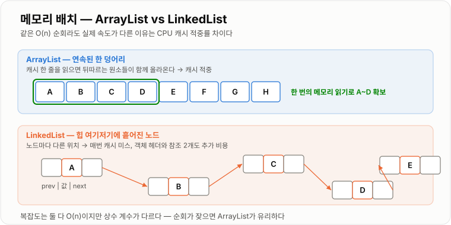

# LinkedList

> **LinkedList는 각 데이터를 노드에 담고 노드끼리 참조로 연결해, 연속된 메모리 없이도 순서를 표현하는 자료구조다.**

---

## 1. 핵심 요약

* LinkedList는 **노드(값 + 다음/이전 노드 참조)** 의 연결로 순서를 표현한다.
* Java의 `java.util.LinkedList`는 **양방향(doubly) 연결 리스트**이며 `List`와 `Deque`를 함께 구현한다.
* 양 끝(맨 앞·맨 뒤) 삽입·삭제는 **O(1)**, 인덱스 조회는 **O(n)** 이다.
* 노드가 메모리 곳곳에 흩어져 있어 **CPU 캐시 효율이 나쁘고 참조 저장 오버헤드**가 있다.
* 실무에서는 "삽입·삭제가 많으니 LinkedList"보다 **`ArrayList` 또는 `ArrayDeque`** 가 더 나은 경우가 대부분이다.

---

## 2. 등장 배경

### 해결하려는 문제

배열 기반 구조는 **연속된 메모리 한 덩어리**를 필요로 한다. 여기서 두 가지 문제가 생긴다.

1. **크기 확장 비용**: 공간이 부족하면 더 큰 배열을 새로 만들고 전체를 복사해야 한다.
2. **중간 삽입·삭제 비용**: 순서를 유지하려면 뒤쪽 원소를 전부 밀거나 당겨야 한다.

```text
배열에서 맨 앞에 삽입

[B][C][D][ ]
  ↓ 전부 한 칸씩 이동 (O(n))
[A][B][C][D]
```

연결 리스트는 발상을 바꾼다. **데이터를 붙여 놓지 않고, 각자 다음 데이터의 위치만 기억하게 한다.**

```text
연결 리스트에서 맨 앞에 삽입

  head
   ↓
  [B] → [C] → [D]

새 노드 A를 만들고 A.next = B, head = A
   ↓
  [A] → [B] → [C] → [D]     (이동 없음, O(1))
```

### 이 개념이 없을 때

* 큐(Queue), 스택, 덱처럼 **양 끝에서 데이터를 넣고 빼는 구조**를 배열만으로 구현하면 이동 비용이 생긴다.
* 큰 연속 메모리를 확보하지 못하는 상황에서도 데이터를 이어 붙일 방법이 필요하다.
* 해시 충돌 처리, LRU 캐시, 그래프 인접 리스트 등 **"중간에서 원소를 자유롭게 떼어내는" 구조**를 만들 수 없다.

연결 리스트는 그 자체로 실무에서 자주 쓰이진 않지만, **다른 자료구조의 재료로 어디에나 들어 있다.**

---

## 3. 핵심 개념

| 개념                | 설명                                 | 중요한 이유                                  |
| ----------------- | ---------------------------------- | --------------------------------------- |
| **노드(Node)**      | 값과 다음(또는 이전) 노드의 참조를 함께 담은 객체      | 연결 리스트의 최소 단위이자 메모리 오버헤드의 원인이다          |
| **head**          | 첫 번째 노드를 가리키는 참조                   | 순회의 시작점이며 맨 앞 삽입·삭제의 기준이다               |
| **tail**          | 마지막 노드를 가리키는 참조                    | 있으면 맨 뒤 추가가 O(1)이 된다                    |
| **단일 연결 리스트**     | 각 노드가 `next`만 갖는 형태                | 구조가 단순하지만 뒤로만 이동할 수 있다                  |
| **양방향 연결 리스트**    | 각 노드가 `prev`와 `next`를 모두 갖는 형태     | 역방향 순회와 임의 노드 삭제가 쉬워진다                  |
| **원형 연결 리스트**     | 마지막 노드가 첫 노드를 가리키는 형태              | 라운드 로빈처럼 순환 처리를 표현할 때 쓴다                |
| **연결 변경(rewire)** | 참조만 바꿔 노드를 끼우거나 빼는 동작              | 원소 이동 없이 삽입·삭제가 되는 이유다                  |
| **위치 탐색**         | 원하는 노드까지 앞에서부터 따라가는 과정             | 삽입·삭제가 O(1)이어도 **탐색 때문에 전체는 O(n)** 이 된다 |
| **캐시 지역성**        | 가까운 메모리를 함께 읽어두는 CPU의 특성           | 노드가 흩어진 연결 리스트가 느린 실제 원인이다              |
| **`Deque` 구현**    | Java `LinkedList`가 양 끝 조작 API를 제공함 | 큐·스택 용도로 쓸 수 있는 근거다                     |

개념 간 관계는 다음과 같다.

```text
LinkedList (객체)
 ├─ head ──→ Node ──next──→ Node ──next──→ Node ←── tail
 │            ↑              ↑              ↑
 │            └──── prev ────┴──── prev ────┘
 └─ size (원소 개수, O(1) 조회용)
```

**핵심 관계**: "삽입·삭제 자체는 O(1)"과 "원하는 위치를 찾는 데 O(n)"은 별개다. 이 둘을 합쳐야 실제 비용이 나온다.

---

## 4. 구조와 동작 원리

노드 하나의 구조는 다음과 같다.

```text
        ┌──────────────────────┐
        │  prev  │ item │ next │
        └──────────────────────┘
          이전 노드  값   다음 노드
           참조           참조
```

전체 구조는 다음과 같다.

```text
null ← [prev|A|next] ⇄ [prev|B|next] ⇄ [prev|C|next] → null
        ↑                                    ↑
      first(head)                         last(tail)
```

### 맨 앞 삽입 (`addFirst`)

```text
1) 새 노드 X 생성
2) X.next = first
3) first.prev = X
4) first = X
5) size++

결과:  [X] ⇄ [A] ⇄ [B] ⇄ [C]
비용:  참조 3~4개만 변경 → O(1)
```

### 인덱스 조회 (`get(i)`)

```text
인덱스 i 입력
     ↓
i가 size/2보다 작은가?
     ↓ 예                    ↓ 아니오
first부터 next로 i번 이동    last부터 prev로 (size-1-i)번 이동
     ↓
노드의 item 반환
```

Java의 `LinkedList`는 **가까운 쪽 끝에서 출발하는 최적화**를 한다. 그래도 평균 이동 횟수는 `n/4`이므로 **여전히 O(n)** 이다.

### 중간 삭제 (`unlink`)

```text
[A] ⇄ [B] ⇄ [C]   에서 B 삭제

1) B의 앞뒤 노드를 찾는다 (A, C)
2) A.next = C
3) C.prev = A
4) B.item = null, B.prev = null, B.next = null   ← GC를 돕기 위해 끊는다
5) size--

결과:  [A] ⇄ [C]
```

```text
삭제 전            삭제 후
 A → B → C          A ───────→ C
 A ← B ← C          A ←─────── C
```

전체 동작 순서를 정리하면 다음과 같다.

1. `new LinkedList<>()`는 `first = null`, `last = null`, `size = 0`인 빈 리스트를 만든다.
2. `add(e)`를 호출하면 새 노드를 만들어 `last` 뒤에 연결하고 `last`를 갱신한다. → **O(1)**
3. `get(i)`를 호출하면 `first` 또는 `last` 중 가까운 쪽에서 노드를 따라간다. → **O(n)**
4. `add(i, e)`는 먼저 위치 노드를 찾고(O(n)), 참조를 바꿔 끼운다(O(1)).
5. `remove(i)`도 마찬가지로 탐색 O(n) + 연결 변경 O(1)이다.
6. 삭제된 노드의 필드를 `null`로 끊어 GC가 회수할 수 있게 한다.
7. 구조가 바뀔 때마다 `modCount`가 증가해 반복자가 변경을 감지한다.

### 메모리 배치 비교

```text
ArrayList (연속)
메모리:  [A][B][C][D]           ← 한 번 읽으면 캐시에 A~D가 함께 들어옴

LinkedList (흩어짐)
메모리:  ...[C]......[A]...[D]......[B]...
         노드마다 별도 위치 → 매번 캐시 미스 가능
```



*배열은 한 번의 읽기로 여러 원소가 캐시에 올라오지만, 노드는 매번 다른 위치라 캐시 미스가 누적된다.*

이것이 "이론상 연결 리스트가 유리해 보이는데 실제로는 배열이 빠른" 가장 큰 이유다.

---

## 5. 코드 또는 사용 예시

### 직접 만들어 보는 단일 연결 리스트

```java
public class SimpleLinkedList {

    private static class Node {
        int value;
        Node next;

        Node(int value) {
            this.value = value;
        }
    }

    private Node head;
    private int size;

    public void addFirst(int value) {
        Node node = new Node(value);
        node.next = head;
        head = node;
        size++;
    }

    public int get(int index) {
        if (index < 0 || index >= size) {
            throw new IndexOutOfBoundsException("범위를 벗어났습니다: " + index);
        }

        Node current = head;
        for (int i = 0; i < index; i++) {
            current = current.next;
        }
        return current.value;
    }

    public boolean removeFirst() {
        if (head == null) {
            return false;
        }
        Node removed = head;
        head = head.next;
        removed.next = null;
        size--;
        return true;
    }

    public int size() {
        return size;
    }

    public static void main(String[] args) {
        SimpleLinkedList list = new SimpleLinkedList();
        list.addFirst(30);
        list.addFirst(20);
        list.addFirst(10);

        for (int i = 0; i < list.size(); i++) {
            System.out.println(i + " : " + list.get(i));
        }
    }
}
```

각 부분의 역할은 다음과 같다.

```java
private static class Node { int value; Node next; }
```

값과 다음 노드 참조를 함께 담는 최소 단위다. **`static` 중첩 클래스**로 만든 이유는 바깥 인스턴스 참조를 갖지 않게 해 메모리를 아끼기 위해서다.

```java
node.next = head;
head = node;
```

맨 앞 삽입의 전부다. 원소를 하나도 이동하지 않으므로 O(1)이다.

```java
for (int i = 0; i < index; i++) { current = current.next; }
```

인덱스 조회는 결국 앞에서부터 따라가는 반복이다. 이 반복문이 O(n)의 정체다.

```java
removed.next = null;
```

떼어낸 노드가 뒤쪽 노드를 계속 참조하지 않게 끊는다. GC가 정리할 수 있게 돕는 습관이다.

### Java `LinkedList` 사용

```java
import java.util.LinkedList;
import java.util.List;
import java.util.Queue;

public class LinkedListUsage {

    public static void main(String[] args) {
        LinkedList<String> tasks = new LinkedList<>();

        tasks.addLast("작업1");
        tasks.addLast("작업2");
        tasks.addFirst("긴급작업");

        System.out.println("첫 작업: " + tasks.peekFirst());
        System.out.println("꺼낸 작업: " + tasks.pollFirst());
        System.out.println("남은 개수: " + tasks.size());

        // List 로도, Queue 로도 쓸 수 있다
        List<String> asList = tasks;
        Queue<String> asQueue = tasks;

        System.out.println(asList);
        System.out.println(asQueue.peek());
    }
}
```

`addFirst`, `pollFirst`, `peekFirst`가 O(1)이라는 점이 `LinkedList`의 유일한 실질적 강점이다.

### 반복자를 이용한 안전한 중간 삭제

```java
import java.util.Iterator;
import java.util.LinkedList;

public class IteratorRemoveExample {

    public static void main(String[] args) {
        LinkedList<Integer> numbers = new LinkedList<>();
        numbers.add(1);
        numbers.add(2);
        numbers.add(3);
        numbers.add(4);

        Iterator<Integer> iterator = numbers.iterator();
        while (iterator.hasNext()) {
            int value = iterator.next();
            if (value % 2 == 0) {
                iterator.remove();
            }
        }

        System.out.println(numbers);
    }
}
```

반복자는 **현재 노드를 이미 알고 있으므로** 삭제가 O(1)이다. 이것이 연결 리스트가 이론적으로 유리한 유일한 시나리오다. 반면 `numbers.remove(index)`를 반복문 안에서 부르면 매번 탐색이 일어나 O(n²)이 된다.

---

## 6. 성능 특성

| 연산                       | 평균 시간 복잡도 | 최악 시간 복잡도 | 설명                                |
| ------------------------ | -------: | -------: | --------------------------------- |
| `addFirst` / `addLast`   |     O(1) |     O(1) | 양 끝 참조를 알고 있어 연결만 바꾼다             |
| `removeFirst` / `removeLast` | O(1) |     O(1) | 마찬가지로 연결만 끊는다                     |
| `get(i)` / `set(i, v)`   |     O(n) |     O(n) | 앞이나 뒤에서 노드를 따라가야 한다               |
| `add(i, e)` (중간)         |     O(n) |     O(n) | 탐색 O(n) + 연결 변경 O(1)              |
| `remove(i)` (중간)         |     O(n) |     O(n) | 탐색 O(n) + 연결 변경 O(1)              |
| `Iterator.remove()`      |     O(1) |     O(1) | 이미 현재 노드를 알고 있다                   |
| `contains` / `indexOf`   |     O(n) |     O(n) | 앞에서부터 하나씩 비교한다                    |
| `size()`                 |     O(1) |     O(1) | 개수를 필드로 따로 관리한다                   |
| 전체 순회                    |     O(n) |     O(n) | 다만 캐시 미스로 상수 계수가 크다               |

공간 복잡도는 **O(n)** 이지만 **노드마다 추가 비용**이 붙는다.

```text
ArrayList의 원소 1개  →  참조 1개 (약 4~8바이트)
LinkedList의 원소 1개 →  Node 객체 헤더 + item + prev + next
                        (일반적인 64비트 JVM에서 대략 24~40바이트)
```

즉 같은 데이터를 담아도 **LinkedList가 몇 배의 메모리를 쓴다.**

데이터가 많아질 때 나타나는 변화는 다음과 같다.

* 인덱스 조회 시간이 개수에 비례해 그대로 늘어난다.
* 노드 객체 수가 많아져 **GC가 추적해야 할 객체 수**가 폭증한다.
* 순회 시 캐시 미스가 누적되어, 같은 O(n)이라도 ArrayList보다 몇 배 느려질 수 있다.
* 양 끝 조작 비용만은 데이터가 아무리 많아져도 O(1)로 유지된다.

---

## 7. 장점과 단점

| 장점                    | 이유                                       |
| --------------------- | ---------------------------------------- |
| 양 끝 삽입·삭제가 항상 O(1)이다  | `first`/`last` 참조를 알고 있어 이동 없이 연결만 바꾼다   |
| 크기 확장 시 복사가 없다        | 노드를 하나 더 만들어 붙이면 되므로 전체 복사가 필요 없다        |
| 연속된 메모리가 필요 없다        | 큰 연속 공간을 확보하지 못하는 상황에서도 데이터를 늘릴 수 있다     |
| 노드를 알고 있으면 삭제가 O(1)이다 | 앞뒤 참조만 바꾸면 되므로 LRU 캐시 같은 구조에 적합하다        |
| 큐·덱·스택으로 바로 쓸 수 있다    | `Deque`를 구현해 `offer`, `poll`, `push` 등을 지원한다 |

| 단점                       | 이유 및 주의점                                              |
| ------------------------ | ----------------------------------------------------- |
| 인덱스 조회가 O(n)이다           | 위치를 계산할 수 없어 앞에서부터 따라가야 한다                            |
| 메모리 오버헤드가 크다             | 값 외에 노드 객체 헤더와 참조 2개를 함께 저장한다                         |
| 캐시 효율이 나쁘다               | 노드가 흩어져 있어 순회할 때마다 캐시 미스가 발생한다                        |
| GC 부담이 크다                | 원소 개수만큼 객체가 생겨 GC가 추적할 대상이 늘어난다                       |
| "삽입이 빠르다"가 오해를 부른다       | 탐색 비용을 빼먹은 설명이며, 인덱스 기반 삽입은 결국 O(n)이다                 |
| 실무에서 쓸 일이 거의 없다          | 양 끝 조작은 `ArrayDeque`가 더 빠르고, 나머지는 `ArrayList`가 더 낫다   |

---

## 8. 사용 기준

### 사용하기 좋은 상황

* **자료구조의 재료로 쓸 때** (해시 충돌 체이닝, LRU 캐시, 인접 리스트)
* 이미 노드 참조를 손에 쥔 상태에서 임의 위치를 자주 떼어내는 경우
* 순회하면서 조건에 맞는 원소를 반복자로 삭제하는 경우
* 알고리즘 학습·면접 대비로 포인터 조작을 이해할 때

### 사용하지 않는 것이 좋은 상황

* 인덱스로 조회하거나 랜덤 접근이 필요한 경우
* 단순히 "삽입·삭제가 많아서" 선택하려는 경우 (탐색 비용을 빼먹은 판단이다)
* 큐나 스택 용도로 쓰려는 경우 → **`ArrayDeque`가 더 빠르다**
* 원소 수가 매우 많고 메모리·GC가 민감한 경우
* 전체 순회 성능이 중요한 경우

### 선택 기준

1. 접근 방식이 인덱스인가, 양 끝인가? → 인덱스면 LinkedList는 탈락
2. 양 끝 조작이 목적인가? → 그렇다면 `ArrayDeque`를 먼저 검토
3. 삭제할 노드를 이미 알고 있는가? → 그렇다면 연결 리스트가 진짜 유리하다
4. 원소 수가 많고 메모리가 중요한가? → 노드 오버헤드를 계산해 본다
5. 순회 성능이 중요한가? → 배열 기반이 유리하다

```text
인덱스 조회 필요        →  ArrayList
양 끝 삽입·삭제만 필요   →  ArrayDeque
노드를 직접 들고 조작     →  연결 리스트 (직접 구현하거나 내부 구조로)
```

---

## 9. 비슷한 개념 비교

### LinkedList와 ArrayList

| 비교 항목  | LinkedList        | ArrayList       | 선택 기준             |
| ------ | ----------------- | --------------- | ----------------- |
| 목적     | 노드 연결 기반 목록       | 인덱스 기반 목록       | 접근 방식             |
| 내부 구조  | 양방향 연결 노드         | 배열              | 메모리 배치            |
| 인덱스 조회 | O(n)              | O(1)            | 조회가 많으면 ArrayList |
| 맨 앞 추가 | O(1)              | O(n)            | 앞쪽 조작이면 LinkedList |
| 맨 뒤 추가 | O(1)              | 분할 상환 O(1)      | 차이 거의 없음          |
| 중간 삽입  | 탐색 O(n) + 연결 O(1) | 이동 O(n)         | 실제로는 둘 다 O(n)     |
| 메모리    | 노드 오버헤드 큼         | 여유 공간 낭비 있음     | 대체로 ArrayList가 유리 |
| 캐시 효율  | 나쁨                | 좋음              | 순회 위주면 ArrayList  |
| 적합한 상황 | 양 끝 조작·노드 직접 조작   | 대부분의 목록 처리      | 기본값은 ArrayList    |

### LinkedList와 ArrayDeque

| 비교 항목    | LinkedList     | ArrayDeque   | 선택 기준             |
| -------- | -------------- | ------------ | ----------------- |
| 목적       | 목록 + 덱         | 덱 전용         | 인덱스 접근 필요 여부      |
| 내부 구조    | 연결 노드          | 순환 배열        | 메모리 배치            |
| 양 끝 조작   | O(1)           | 분할 상환 O(1)   | 둘 다 빠름            |
| 인덱스 조회   | O(n)           | 지원하지 않음      | 인덱스가 필요하면 LinkedList |
| 메모리      | 노드마다 참조 2개     | 배열 한 덩어리     | ArrayDeque가 훨씬 적음 |
| 실제 속도    | 느린 편           | 빠름           | 큐·스택이면 ArrayDeque |
| `null` 저장 | 가능             | 불가           | `null`을 넣어야 하면 주의 |
| 적합한 상황   | 인덱스도 필요한 드문 경우 | 큐·스택·덱 일반    | 대부분 ArrayDeque    |

### 단일 연결 리스트와 양방향 연결 리스트

| 비교 항목  | 단일 연결 리스트     | 양방향 연결 리스트         | 선택 기준           |
| ------ | ------------- | ------------------ | --------------- |
| 목적     | 최소 구조의 순서 표현  | 양방향 이동과 임의 삭제      | 역방향 접근 필요 여부    |
| 노드 크기  | 값 + `next`    | 값 + `prev` + `next` | 메모리가 민감하면 단일    |
| 역방향 순회 | 불가            | 가능                 | 필요하면 양방향        |
| 임의 노드 삭제 | 이전 노드를 알아야 함  | 노드만 알면 됨           | 잦은 삭제면 양방향      |
| 적합한 상황 | 스택, 간단한 큐     | LRU 캐시, `LinkedList` | 대부분 양방향이 실용적    |

---

## 10. 백엔드 실무 적용

### Spring·Java

`java.util.LinkedList`를 직접 쓰는 코드는 드물다. 하지만 **연결 리스트 구조 자체는 JDK 곳곳에 들어 있다.**

* **`HashMap`의 충돌 처리**: 같은 버킷에 들어간 항목들을 연결 리스트로 잇는다. 8개를 넘고 테이블 길이가 64 이상이면 트리로 바꾼다.
* **`LinkedHashMap`**: 항목들을 삽입 순서(또는 접근 순서)대로 잇는 **양방향 연결 리스트**를 별도로 유지한다. LRU 캐시의 기본 재료다.
* **`ConcurrentLinkedQueue`**: 락 없이 동작하는 연결 리스트 기반 큐다.
* **`LinkedBlockingQueue`**: 스레드 풀의 작업 대기열로 쓰이는 연결 리스트 기반 큐다.

LRU 캐시는 연결 리스트의 가장 대표적인 실무 활용이다.

```java
import java.util.LinkedHashMap;
import java.util.Map;

public class LruCache<K, V> extends LinkedHashMap<K, V> {

    private final int maxSize;

    public LruCache(int maxSize) {
        // 세 번째 인자 true = 접근 순서(access order) 모드
        super(16, 0.75f, true);
        this.maxSize = maxSize;
    }

    @Override
    protected boolean removeEldestEntry(Map.Entry<K, V> eldest) {
        return size() > maxSize;
    }

    public static void main(String[] args) {
        LruCache<String, String> cache = new LruCache<>(2);
        cache.put("A", "1");
        cache.put("B", "2");
        cache.get("A");        // A가 최근 사용으로 이동
        cache.put("C", "3");   // 가장 오래된 B가 제거됨

        System.out.println(cache.keySet());
    }
}
```

내부 동작은 다음과 같다.

```text
접근 순서 리스트:  [B] ⇄ [A]        (오래됨 ← → 최신)
get("A") 호출
     ↓
A 노드를 리스트에서 떼어내고(O(1)) 맨 뒤에 다시 붙인다(O(1))
     ↓
접근 순서 리스트:  [B] ⇄ [A]  →  put("C") 시 맨 앞 B를 제거
```

**임의 노드를 O(1)에 떼어내고 다시 붙일 수 있다**는 연결 리스트의 성질이 없으면 LRU를 이렇게 효율적으로 만들 수 없다.

### 데이터베이스·캐시

* **B+Tree의 리프 노드**는 서로 연결 리스트로 이어져 있다. 그래서 범위 조회(`BETWEEN`, `ORDER BY`)가 빠르다.
* **Redis의 List 타입**은 작은 데이터에서는 압축 리스트, 커지면 quicklist(연결 리스트와 배열의 혼합) 구조를 쓴다. 양 끝 push/pop(`LPUSH`, `RPOP`)이 O(1)인 이유다.
* **InnoDB의 LRU 리스트**가 버퍼 풀에서 어떤 페이지를 제거할지 결정한다.

### 동시성·분산 환경

연결 리스트는 스레드 안전하지 않다. 두 스레드가 동시에 노드를 끼우면 연결이 끊길 수 있다.

```text
초기:  [A] → [C]

스레드 1: B를 넣으려 함 → B.next = C, A.next = B
스레드 2: D를 넣으려 함 → D.next = C, A.next = D

결과:  [A] → [D] → [C]      ← B가 통째로 사라짐
```

동시 환경에서는 다음을 쓴다.

* `ConcurrentLinkedQueue` — CAS 기반 논블로킹 큐
* `LinkedBlockingQueue` — 락 기반, 생산자·소비자 패턴에 적합
* `Collections.synchronizedList(...)` — 단순 래핑 (순회는 직접 동기화)

분산 환경에서는 한 JVM 안의 연결 리스트를 여러 서버가 공유할 수 없다. 서버 간 큐가 필요하면 Redis List, Kafka, RabbitMQ 같은 외부 메시지 저장소를 쓴다.

---

## 11. 자주 하는 오해

| 잘못된 이해                              | 올바른 이해                                                        |
| ----------------------------------- | ------------------------------------------------------------- |
| LinkedList는 삽입·삭제가 항상 O(1)이다        | 연결 변경만 O(1)이고, 위치를 인덱스로 찾으면 탐색에 O(n)이 든다                      |
| 삽입·삭제가 많으면 무조건 LinkedList가 빠르다      | 캐시 효율과 탐색 비용 때문에 실제로는 ArrayList가 빠른 경우가 많다                    |
| LinkedList는 메모리를 덜 쓴다               | 노드 객체 헤더와 참조 2개 때문에 오히려 몇 배 더 쓴다                              |
| `get(i)`는 배열처럼 바로 접근한다              | 앞이나 뒤에서 노드를 하나씩 따라가야 하므로 O(n)이다                               |
| 큐·스택은 LinkedList로 만드는 게 정석이다        | `ArrayDeque`가 더 빠르고 메모리도 적게 쓴다. `Stack` 클래스도 권장되지 않는다         |
| Java `LinkedList`는 단일 연결 리스트다       | 양방향 연결 리스트이며 `Deque`도 함께 구현한다                                 |
| `size()`도 O(n)이다                    | 개수를 필드로 관리하므로 O(1)이다                                          |
| 연결 리스트는 실무에서 안 쓰인다                  | 직접 쓰는 일은 드물지만 `LinkedHashMap`, 큐 구현, B+Tree 리프 등 내부에 광범위하게 쓰인다 |
| 노드를 삭제하면 자동으로 메모리가 정리된다             | 떼어낸 노드가 여전히 다른 노드를 참조하면 GC에 방해가 될 수 있어 참조를 끊어준다               |
| 반복문 안에서 `list.remove(i)`를 써도 성능이 같다 | 매번 탐색이 일어나 전체가 O(n²)이 된다. 반복자의 `remove()`를 써야 O(n)이다          |

---

## 12. 면접 답변

### 기본 답변

LinkedList는 각 데이터를 노드에 담고 노드끼리 참조로 연결해 순서를 표현하는 자료구조입니다. Java의 `java.util.LinkedList`는 각 노드가 이전·다음 노드를 모두 가리키는 양방향 연결 리스트이며, `List`와 `Deque`를 함께 구현합니다.

내부적으로 `first`와 `last` 참조를 유지하기 때문에 맨 앞과 맨 뒤의 삽입·삭제는 참조 몇 개만 바꾸면 되어 O(1)입니다. 반면 인덱스로 원소를 찾으려면 앞이나 뒤에서 노드를 하나씩 따라가야 해서 O(n)입니다. 그래서 중간 삽입·삭제도 연결 변경 자체는 O(1)이지만 위치 탐색 때문에 전체적으로는 O(n)이 됩니다.

장점은 양 끝 조작이 빠르고 크기 확장 시 배열 복사가 없다는 점입니다. 단점은 인덱스 조회가 느리고, 노드마다 참조 두 개와 객체 헤더가 붙어 메모리를 많이 쓰며, 노드가 흩어져 있어 CPU 캐시 효율이 나쁘다는 점입니다.

그래서 실무에서 `LinkedList`를 직접 쓰는 일은 드뭅니다. 인덱스 조회가 필요하면 `ArrayList`, 큐나 스택 용도면 `ArrayDeque`가 더 낫습니다. 다만 연결 리스트 구조 자체는 `LinkedHashMap`의 LRU 처리나 `HashMap`의 충돌 체이닝, B+Tree 리프 연결처럼 다른 자료구조의 재료로 널리 쓰입니다.

### 답변 구조

* **정의**

    * 값과 다음(이전) 노드 참조를 담은 노드의 연결로 순서를 표현
    * Java `LinkedList`는 양방향 연결 리스트 + `Deque` 구현

* **내부 원리**

    * `first`/`last` 참조와 `size` 필드를 유지
    * 삽입·삭제는 `prev`/`next` 참조 재연결
    * `get(i)`는 가까운 끝에서 출발하지만 여전히 순차 이동

* **복잡도**

    * `O(1)`: 양 끝 삽입·삭제, `size()`, `Iterator.remove()`
    * `O(n)`: `get(i)`, 인덱스 기반 삽입·삭제, `contains`, 순회
    * 공간 `O(n)` + 노드마다 헤더·참조 2개 오버헤드

* **장점**

    * 양 끝 조작 O(1), 확장 시 전체 복사 없음
    * 노드를 알고 있으면 임의 위치 삭제가 O(1)

* **단점**

    * 인덱스 조회 O(n), 메모리 오버헤드 큼
    * 캐시 지역성 나쁨, GC 대상 객체 수 증가

* **사용 기준**

    * 노드 참조를 직접 다루며 임의 위치를 자주 떼어낼 때
    * 인덱스 접근이 필요 없고 양 끝만 쓸 때 (그마저도 ArrayDeque가 우세)

* **대안과 비교**

    * 인덱스 조회 → `ArrayList`
    * 큐·스택·덱 → `ArrayDeque` (더 빠르고 메모리도 적음)
    * 동시 큐 → `ConcurrentLinkedQueue`, `LinkedBlockingQueue`

* **실무 적용 사례**

    * `LinkedHashMap` 기반 LRU 캐시의 접근 순서 리스트
    * `HashMap` 충돌 체이닝, B+Tree 리프 노드 연결
    * 스레드 풀 작업 대기열(`LinkedBlockingQueue`)

---

## 13. 예상 면접 질문

### 기본 질문

1. **연결 리스트란 무엇이고 배열과 어떻게 다른가요?**

    * 핵심 키워드: 노드, 참조 연결, 비연속 메모리, 인덱스 계산 불가

2. **LinkedList에서 인덱스 조회가 O(n)인 이유는 무엇인가요?**

    * 핵심 키워드: 위치 계산 불가, 순차 이동, 가까운 끝에서 출발 최적화

3. **LinkedList의 삽입이 O(1)이라는 말은 언제 성립하나요?**

    * 핵심 키워드: 노드를 이미 알고 있을 때, 양 끝 조작, 탐색 비용 별도

4. **단일 연결 리스트와 양방향 연결 리스트의 차이는 무엇인가요?**

    * 핵심 키워드: `prev` 유무, 역방향 순회, 임의 노드 삭제 편의, 메모리 차이

5. **LinkedList와 ArrayList 중 무엇을 언제 쓰나요?**

    * 핵심 키워드: 인덱스 조회 빈도, 양 끝 조작, 캐시 지역성, 메모리 오버헤드

6. **LinkedList가 메모리를 더 쓰는 이유는 무엇인가요?**

    * 핵심 키워드: 노드 객체 헤더, `prev`·`next` 참조, 객체 수 증가, GC 부담

7. **큐를 구현할 때 LinkedList와 ArrayDeque 중 무엇이 좋나요?**

    * 핵심 키워드: 순환 배열, 캐시 효율, 메모리, `null` 저장 불가

### 꼬리 질문

1. **삽입·삭제가 많은데 왜 실무에서는 ArrayList를 더 많이 쓰나요?**

    * 핵심 키워드: 탐색 비용 포함, CPU 캐시 미스, `System.arraycopy` 최적화, 실제 벤치마크

2. **반복문 안에서 `list.remove(i)`를 반복하면 어떤 문제가 생기나요?**

    * 핵심 키워드: 매번 탐색, 전체 O(n²), `Iterator.remove()`로 O(n)

3. **LRU 캐시를 연결 리스트로 만드는 이유는 무엇인가요?**

    * 핵심 키워드: 임의 노드 O(1) 분리·재삽입, 접근 순서 유지, `LinkedHashMap`

4. **`LinkedHashMap`은 어떻게 순서를 유지하나요?**

    * 핵심 키워드: 해시 테이블 + 별도 양방향 연결 리스트, 삽입 순서/접근 순서 모드

5. **여러 스레드가 연결 리스트를 동시에 수정하면 어떤 일이 생기나요?**

    * 핵심 키워드: 연결 유실, 노드 사라짐, 무한 루프 가능, `ConcurrentLinkedQueue`

6. **B+Tree의 리프 노드가 연결되어 있는 이유는 무엇인가요?**

    * 핵심 키워드: 범위 조회, `ORDER BY`, 순차 스캔, 리프 순회

7. **연결 리스트에서 사이클(순환)을 어떻게 찾나요?**

    * 핵심 키워드: 느린 포인터·빠른 포인터, 플로이드 순환 탐지, O(n) 시간 O(1) 공간

8. **삭제한 노드의 `next`를 `null`로 만드는 이유는 무엇인가요?**

    * 핵심 키워드: 남은 참조, GC 회수 방해, 메모리 누수 방지

---

## 14. 추가 학습 방향

### 바로 이어서 공부

| 키워드            | 연결되는 이유                                |
| -------------- | -------------------------------------- |
| **Stack**      | 단일 연결 리스트로 가장 간단히 구현되는 LIFO 구조다        |
| **Queue**      | 양 끝 조작 O(1)이라는 연결 리스트의 강점이 그대로 쓰인다     |
| **Deque**      | Java `LinkedList`가 실제로 구현한 인터페이스다      |
| **ArrayDeque** | 같은 목적을 배열로 더 효율적으로 푼 대안이다              |
| **CPU 캐시와 지역성** | 이론상 복잡도와 실제 속도가 왜 다른지 설명해 준다           |

### 실무 확장

| 키워드                          | 연결되는 이유                                |
| ---------------------------- | -------------------------------------- |
| **LinkedHashMap**            | 해시 테이블에 연결 리스트를 얹어 순서를 유지하는 구조를 배운다    |
| **LRU 캐시 설계**                | 임의 노드 O(1) 분리라는 성질의 대표적 실무 응용이다        |
| **HashMap 충돌 처리**            | 버킷 내부의 체이닝이 연결 리스트로 되어 있다              |
| **LinkedBlockingQueue**      | 스레드 풀 작업 대기열의 내부 구조를 이해한다              |
| **B+Tree 리프 연결**             | DB 범위 조회 성능의 근거가 되는 구조다                |

### 심화 학습

| 키워드                         | 연결되는 이유                                 |
| --------------------------- | --------------------------------------- |
| **ConcurrentLinkedQueue**   | CAS 기반 논블로킹 연결 리스트의 동작을 배운다             |
| **스킵 리스트(Skip List)**       | 연결 리스트에 층을 얹어 O(log n) 탐색을 만든 구조다       |
| **Redis quicklist**         | 연결 리스트와 배열을 섞어 메모리와 속도를 절충한 실제 사례다      |
| **플로이드 순환 탐지**              | 연결 리스트 알고리즘 문제의 대표 유형이다                 |
| **GC와 객체 수**                | 노드 객체가 많아질 때 GC에 미치는 영향을 정량적으로 이해한다     |

---

## 15. 최종 체크리스트

* [ ] 개념을 한 문장으로 설명할 수 있다
* [ ] 등장 배경을 설명할 수 있다
* [ ] 내부 동작 과정을 설명할 수 있다
* [ ] 성능 특성을 설명할 수 있다
* [ ] 장점과 단점을 설명할 수 있다
* [ ] 사용할 상황과 사용하지 않을 상황을 구분할 수 있다
* [ ] 비슷한 기술과 비교할 수 있다
* [ ] Spring 백엔드 실무 사례를 설명할 수 있다
* [ ] 기본 면접 질문에 답할 수 있다
* [ ] 조건이 달라졌을 때 대안을 제시할 수 있다

---

## 16. 한 줄 결론

**노드 참조를 직접 들고 임의 위치를 O(1)에 떼어내야 하는 구조가 아니라면, LinkedList 대신 ArrayList나 ArrayDeque를 선택한다.**
