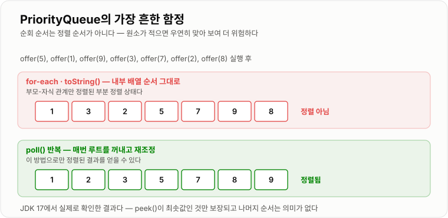

# PriorityQueue

> **PriorityQueue는 들어온 순서가 아니라 우선순위가 가장 높은 원소를 먼저 꺼내는 큐로, Java에서는 배열 기반 이진 최소 힙으로 구현되어 있다.**

---

## 1. 핵심 요약

* `PriorityQueue`는 **FIFO가 아니다.** 우선순위가 가장 높은 원소가 먼저 나온다.
* Java의 기본은 **최소 힙(min-heap)** 이다. 자연 순서상 가장 작은 값이 먼저 나온다.
* `peek`은 **O(1)**, `offer`와 `poll`은 **O(log n)** 이다. 반면 `contains`와 `remove(Object)`는 **O(n)** 이다.
* **순회 순서는 정렬 순서가 아니다.** `toString`이나 `for-each`로 보면 뒤죽박죽이며, 정렬된 결과를 얻으려면 `poll`을 반복해야 한다.
* `null` 저장 불가, 스레드 안전하지 않으며, **동일 우선순위의 순서를 보장하지 않는다.**

---

## 2. 등장 배경

### 해결하려는 문제

일반 큐(FIFO)는 **완벽하게 공정하지만 완전히 유연하지 않다.**

```text
작업 큐 (FIFO)
[일반 리포트][일반 리포트][일반 리포트][서버 장애 알림]
   ↑ 먼저 처리                              ↑ 마지막에 처리

장애 알림이 리포트 3개 뒤에서 기다린다
```

현실에서는 **중요도가 다른 일이 섞여 들어온다.**

* 결제 실패 처리 vs 마케팅 메일 발송
* 서버 장애 알림 vs 일간 통계 리포트
* VIP 고객 요청 vs 일반 요청

이걸 큐로 풀려면 어떻게 해야 할까?

```text
[방법 1] 우선순위별로 큐를 여러 개
   → 우선순위가 3단계면 큐 3개, 10단계면 10개
   → 우선순위가 연속값(예: 예상 소요 시간)이면 불가능

[방법 2] 넣을 때마다 정렬
   → 삽입할 때마다 O(n log n)

[방법 3] 정렬된 리스트에 삽입 위치 찾아 넣기
   → 삽입 O(n) (원소 이동)

[방법 4] 전체를 훑어 최댓값 찾기
   → 꺼낼 때마다 O(n)
```

여기서 **힙**이 답을 준다. 전체를 정렬하지 않고 "부모가 자식보다 우선한다"는 규칙만 지키면, 루트가 항상 최우선 원소가 된다. 삽입도 삭제도 O(log n)이다.

`PriorityQueue`는 이 힙을 **Java의 `Queue` 인터페이스로 감싸서** 쓰기 쉽게 만든 것이다.

### 이 개념이 없을 때

* 중요한 작업이 덜 중요한 작업 뒤에서 계속 밀린다.
* 우선순위 단계가 늘어날 때마다 큐를 추가해야 하고, 연속적인 우선순위는 표현할 수 없다.
* 다익스트라, 프림 같은 알고리즘의 복잡도가 O(V²)로 나빠진다.
* 상위 K개 추출을 위해 전체를 정렬해야 한다.
* 예약 작업을 "실행 시각이 가장 이른 것부터" 꺼내는 스케줄러를 만들 수 없다.

---

## 3. 핵심 개념

| 개념                     | 설명                                     | 중요한 이유                                       |
| ---------------------- | -------------------------------------- | -------------------------------------------- |
| **우선순위 큐**             | 우선순위가 높은 원소가 먼저 나오는 큐                  | FIFO 큐와 근본적으로 다른 계약이다                        |
| **최소 힙 기본**            | Java `PriorityQueue`는 가장 작은 값이 먼저 나옴   | 최대 힙을 원하면 `Comparator`를 뒤집어야 한다              |
| **`Comparable`**       | 원소가 자신의 자연 순서를 정의 (`compareTo`)        | 아무 기준도 없으면 `ClassCastException`이 발생한다        |
| **`Comparator`**       | 우선순위 기준을 외부에서 주입                       | 자연 순서와 다른 기준을 쓸 때 필수다                        |
| **`offer` / `add`**    | 원소를 넣는 연산 (`siftUp` 수행)                | 무계 큐라 둘의 동작이 사실상 같다                          |
| **`poll` / `remove()`** | 최우선 원소를 꺼내며 제거 (`siftDown` 수행)         | 비었을 때 `poll`은 `null`, `remove`는 예외           |
| **`peek`**             | 최우선 원소를 제거하지 않고 확인                     | 배열 0번을 읽기만 하므로 O(1)이다                        |
| **부분 정렬**              | 부모-자식 관계만 정렬된 상태                       | **순회 순서가 정렬이 아닌 이유**다                        |
| **불안정성(instability)** | 동일 우선순위의 원래 순서를 보장하지 않음                | FIFO가 필요하면 삽입 순번을 직접 넣어야 한다                  |
| **무계(unbounded)**      | 크기 제한이 없고 자동으로 확장됨                     | 소비가 느리면 무한히 쌓여 OOM 위험이 있다                    |
| **`null` 금지**          | `null` 저장 시 `NullPointerException`     | 비교가 불가능하고 `poll`의 `null` 반환과 충돌하기 때문이다       |

개념 간 관계는 다음과 같다.

```text
Queue (인터페이스)
   └─ PriorityQueue
          │ 내부 구현
          ↓
      배열 기반 이진 최소 힙
          │ 우선순위 판단
          ↓
   Comparable(compareTo) 또는 Comparator(compare)
          │
          └─ 반환값 < 0 이면 앞쪽(먼저 나옴)
```

**핵심 관계**: `PriorityQueue`는 "인터페이스는 Queue, 구현은 Heap"이다. 그래서 `Queue`의 메서드를 쓰지만 FIFO가 아니고, 힙의 모든 장단점을 그대로 물려받는다.

---

## 4. 구조와 동작 원리

### 내부 구조

```java
transient Object[] queue;              // 힙을 담는 배열
private int size;                      // 원소 개수
private final Comparator<? super E> comparator;   // null이면 자연 순서 사용
transient int modCount;                // 순회 중 변경 감지용
```

배열 하나가 전부다. 완전 이진 트리를 인덱스 계산으로 표현한다.

```text
             0
           /   \
          1     2
         / \   / \
        3   4 5   6

부모     = (i - 1) >>> 1
왼쪽 자식 = 2i + 1
오른쪽 자식 = 2i + 2
```

### `offer` 동작 (`siftUp`)

```text
현재 최소 힙:  [1][3][5][7][9]

               1
            /     \
           3       5
          / \
         7   9

offer(2) 실행
```

```text
① 배열 끝(인덱스 5)에 2를 넣는다
   [1][3][5][7][9][2]

               1
            /     \
           3       5
          / \     /
         7   9   2      ← 부모 5보다 작음, 위반

② 부모 (5-1)/2 = 2 → 값 5
   2 < 5 → 교환
   [1][3][2][7][9][5]

               1
            /     \
           3       2
          / \     /
         7   9   5

③ 부모 (2-1)/2 = 0 → 값 1
   2 > 1 → 멈춤 (힙 속성 만족)

최종: [1][3][2][7][9][5]
```

### `poll` 동작 (`siftDown`)

```text
현재:  [1][3][2][7][9][5]

① 루트 값 1을 반환값으로 저장
② 마지막 원소 5를 루트로 옮기고 크기를 1 줄인다
   [5][3][2][7][9]

               5              ← 위반
            /     \
           3       2
          / \
         7   9

③ 자식 중 작은 쪽과 비교
   자식 = 인덱스 1(값 3), 2(값 2) → 작은 쪽은 2
   5 > 2 → 교환
   [2][3][5][7][9]

               2
            /     \
           3       5
          / \
         7   9

④ 인덱스 2의 자식 = 인덱스 5, 6 → 범위 밖 → 종료

반환: 1
```

### 확장(grow)

```text
초기 용량 11

size == queue.length 이면 확장:
   기존 용량이 64 미만 → 새 용량 = 기존 × 2 + 2
   기존 용량이 64 이상 → 새 용량 = 기존 × 1.5

11 → 24 → 50 → 102 → 153 → 229 → ...
```

**작을 때는 공격적으로, 커지면 완만하게** 늘린다. 작은 큐의 잦은 복사를 줄이면서 큰 큐의 메모리 낭비도 막는 절충이다.

### 왜 순회가 정렬 순서가 아닌가

```text
힙 배열:  [1][3][2][7][9][5]

for-each 또는 toString → 배열 순서 그대로
   1, 3, 2, 7, 9, 5     ← 정렬 아님!

poll 반복 → 매번 루트를 꺼내고 재조정
   1, 2, 3, 5, 7, 9     ← 정렬됨
```

**가장 위험한 오해**다. 원소가 적으면 우연히 정렬되어 보일 때가 있어서 더 위험하다.

```text
offer(1), offer(2), offer(3)  →  [1][2][3]  → 출력이 정렬로 보임
offer(3), offer(2), offer(1)  →  [1][3][2]  → 정렬이 아님
```



*내부 배열은 부모-자식 관계만 정렬된 부분 정렬 상태라, 정렬된 결과를 얻으려면 `poll`을 반복해야 한다.*

테스트에서 통과하고 운영에서 터지는 전형적인 패턴이다.

### 전체 동작 순서

1. `new PriorityQueue<>()`는 용량 11의 배열과 `size = 0`으로 시작한다. `comparator`는 `null`(자연 순서).
2. `offer(e)`는 `null` 검사 후 배열 끝에 넣고 `siftUp`을 수행한다.
3. `siftUp`은 부모와 비교해 우선순위가 더 높으면 교환하며 위로 올라간다. 아니면 즉시 멈춘다.
4. `peek()`은 `queue[0]`을 그대로 반환한다. O(1)이다.
5. `poll()`은 `queue[0]`을 저장하고, 마지막 원소를 루트로 옮긴 뒤 `siftDown`을 수행한다.
6. `siftDown`은 **두 자식 중 우선순위가 높은 쪽**과 비교해 교환하며 내려간다.
7. `size == queue.length`가 되면 배열을 확장한다.
8. 구조가 바뀔 때마다 `modCount`가 증가해 순회 중 변경을 감지한다.

---

## 5. 코드 또는 사용 예시

### 기본 사용 — 최소 힙과 최대 힙

```java
import java.util.Comparator;
import java.util.PriorityQueue;

public class PriorityQueueBasic {

    public static void main(String[] args) {
        // 기본: 최소 힙 — 작은 값이 먼저
        PriorityQueue<Integer> minHeap = new PriorityQueue<>();
        minHeap.offer(5);
        minHeap.offer(1);
        minHeap.offer(9);
        minHeap.offer(3);

        System.out.println("peek: " + minHeap.peek());   // 1

        // 순회는 정렬 순서가 아니다!
        System.out.println("toString: " + minHeap);      // [1, 3, 9, 5]

        // poll을 반복해야 정렬 순서
        StringBuilder sb = new StringBuilder();
        while (!minHeap.isEmpty()) {
            sb.append(minHeap.poll()).append(" ");
        }
        System.out.println("poll 순서: " + sb);          // 1 3 5 9

        // 최대 힙 — Comparator를 뒤집는다
        PriorityQueue<Integer> maxHeap = new PriorityQueue<>(new Comparator<Integer>() {
            @Override
            public int compare(Integer a, Integer b) {
                return b.compareTo(a);
            }
        });
        maxHeap.offer(5);
        maxHeap.offer(1);
        maxHeap.offer(9);

        System.out.println("최대 힙 peek: " + maxHeap.peek());   // 9
    }
}
```

각 부분의 역할은 다음과 같다.

```java
new PriorityQueue<>();
```

`Comparator`가 없으면 원소의 `Comparable`(자연 순서)을 쓴다. 원소가 `Comparable`을 구현하지 않았으면 **첫 `offer` 시점이 아니라 두 번째 `offer`에서** `ClassCastException`이 난다. 원소가 하나일 때는 비교할 상대가 없기 때문이다.

```java
return b.compareTo(a);
```

순서를 뒤집어 최대 힙을 만든다. `Comparator.reverseOrder()`를 써도 같다.

```java
System.out.println(minHeap);   // [1, 3, 9, 5]
```

**정렬이 아니다.** 배열의 내부 순서다.

### `Comparator` 작성 시 주의 — 뺄셈 금지

```java
import java.util.Comparator;
import java.util.PriorityQueue;

public class ComparatorOverflow {

    public static void main(String[] args) {
        // 위험한 방식 — 뺄셈은 오버플로가 난다
        Comparator<Integer> dangerous = new Comparator<Integer>() {
            @Override
            public int compare(Integer a, Integer b) {
                return a - b;
            }
        };

        int a = Integer.MIN_VALUE;   // -2147483648
        int b = 1;
        System.out.println("a - b = " + (a - b));            // 2147483647 (양수!)
        System.out.println("잘못된 결과: " + dangerous.compare(a, b));

        // 안전한 방식
        Comparator<Integer> safe = new Comparator<Integer>() {
            @Override
            public int compare(Integer x, Integer y) {
                return Integer.compare(x, y);
            }
        };
        System.out.println("올바른 결과: " + safe.compare(a, b));   // 음수

        PriorityQueue<Integer> queue = new PriorityQueue<>(safe);
        queue.offer(3);
        queue.offer(1);
        System.out.println(queue.peek());   // 1
    }
}
```

```text
a - b 방식의 문제

a = -2,147,483,648,  b = 1
실제 차이 = -2,147,483,649
int 범위 = -2,147,483,648 ~ 2,147,483,647
   ↓ 오버플로
결과 = 2,147,483,647 (양수)
   ↓
"a가 b보다 크다"고 잘못 판단 → 힙 순서가 깨짐
```

**항상 `Integer.compare`, `Long.compare`, `Double.compare`를 쓴다.** 값 범위가 작다고 방심하면 나중에 데이터가 커졌을 때 터진다.

### 객체 우선순위 처리 — 동일 우선순위의 FIFO 보장

```java
import java.util.Comparator;
import java.util.PriorityQueue;

public class TaskQueueExample {

    static class Task {
        final String name;
        final int priority;     // 낮을수록 급함
        final long sequence;    // 삽입 순번

        Task(String name, int priority, long sequence) {
            this.name = name;
            this.priority = priority;
            this.sequence = sequence;
        }

        @Override
        public String toString() {
            return "[P" + priority + "] " + name;
        }
    }

    public static void main(String[] args) {
        PriorityQueue<Task> queue = new PriorityQueue<>(new Comparator<Task>() {
            @Override
            public int compare(Task a, Task b) {
                int result = Integer.compare(a.priority, b.priority);
                if (result != 0) {
                    return result;
                }
                // 우선순위가 같으면 먼저 들어온 것부터 (FIFO 보장)
                return Long.compare(a.sequence, b.sequence);
            }
        });

        long seq = 0;
        queue.offer(new Task("일간 리포트", 5, seq++));
        queue.offer(new Task("결제 실패 재처리", 1, seq++));
        queue.offer(new Task("마케팅 메일", 5, seq++));
        queue.offer(new Task("서버 장애 알림", 1, seq++));

        while (!queue.isEmpty()) {
            System.out.println(queue.poll());
        }
        // [P1] 결제 실패 재처리
        // [P1] 서버 장애 알림
        // [P5] 일간 리포트
        // [P5] 마케팅 메일
    }
}
```

**`sequence`가 없으면** 같은 우선순위 안에서 순서가 뒤집힐 수 있다.

```text
sequence 없이 P1 두 개를 넣으면

내부 배열: [결제실패][서버장애] 또는 [서버장애][결제실패]
→ siftUp/siftDown 과정에서 어느 쪽이 위로 갈지 보장 안 됨
→ 실행할 때마다 순서가 달라질 수 있다
```

힙은 **안정 정렬이 아니다.** 순서가 중요하면 반드시 명시적으로 만들어야 한다.

### 실전 — 상위 K개

```java
import java.util.Comparator;
import java.util.PriorityQueue;

public class TopKProducts {

    static class Product {
        final String name;
        final long sales;

        Product(String name, long sales) {
            this.name = name;
            this.sales = sales;
        }

        @Override
        public String toString() {
            return name + "(" + sales + ")";
        }
    }

    // 판매량 상위 k개를 O(n log k), 메모리 O(k)로 구한다
    public static PriorityQueue<Product> topK(Product[] products, int k) {
        // 최소 힙: 루트 = 현재 상위 k개 중 가장 적게 팔린 것
        PriorityQueue<Product> heap = new PriorityQueue<>(k, new Comparator<Product>() {
            @Override
            public int compare(Product a, Product b) {
                return Long.compare(a.sales, b.sales);
            }
        });

        for (int i = 0; i < products.length; i++) {
            heap.offer(products[i]);
            if (heap.size() > k) {
                heap.poll();     // 가장 적게 팔린 것을 버린다
            }
        }

        return heap;
    }

    public static void main(String[] args) {
        Product[] products = {
                new Product("A", 500),
                new Product("B", 1200),
                new Product("C", 300),
                new Product("D", 900),
                new Product("E", 1500)
        };

        PriorityQueue<Product> top3 = topK(products, 3);

        while (!top3.isEmpty()) {
            System.out.println(top3.poll());
        }
        // D(900)
        // B(1200)
        // E(1500)
        // → 오름차순으로 나온다. 내림차순이 필요하면 결과를 뒤집는다
    }
}
```

```text
왜 "상위 K개"에 최소 힙인가?

최소 힙의 루트 = 현재 담긴 K개 중 가장 작은 값
→ 새 값이 루트보다 작으면 상위 K개에 못 들어감
→ 크기가 K를 넘으면 루트(가장 작은 것)만 버리면 됨
→ 항상 상위 K개가 유지된다

전체 정렬:  O(n log n), 메모리 O(n)
크기 K 힙:  O(n log k), 메모리 O(k)

n = 100만, k = 10 이면 메모리 10만 배 차이
```

### `remove(Object)`는 O(n)이다

```java
import java.util.PriorityQueue;

public class RemoveIsSlow {

    public static void main(String[] args) {
        PriorityQueue<Integer> queue = new PriorityQueue<>();
        queue.offer(5);
        queue.offer(1);
        queue.offer(9);
        queue.offer(3);

        System.out.println(queue.poll());          // 1     — O(log n)
        System.out.println(queue.remove(9));       // true  — O(n)
        System.out.println(queue.contains(3));     // true  — O(n)
    }
}
```

```text
poll()          → 루트만 꺼냄        → O(log n)
remove(Object)  → 배열 전체를 훑어 위치를 찾음 → O(n) + siftDown/siftUp
contains(o)     → 배열 전체 순회     → O(n)

힙은 부분 정렬이라 임의 값의 위치를 계산할 수 없다.
```

**반복문 안에서 `remove(Object)`를 부르면 O(n²)** 이 된다. 취소 기능이 필요하면 "취소 표시(tombstone)"를 남기고 `poll` 시점에 걸러내는 방식이 낫다.

---

## 6. 성능 특성

| 연산                       | 평균 시간 복잡도 | 최악 시간 복잡도 | 설명                        |
| ------------------------ | -------: | -------: | ------------------------- |
| `peek` / `element`       |     O(1) |     O(1) | 배열 0번을 읽기만 한다             |
| `offer` / `add`          | O(log n) | O(log n) | `siftUp` — 트리 높이만큼 이동     |
| `poll` / `remove()`      | O(log n) | O(log n) | `siftDown` — 트리 높이만큼 이동   |
| `remove(Object)`         |     O(n) |     O(n) | 위치를 찾기 위해 배열 전체를 훑는다      |
| `contains(Object)`       |     O(n) |     O(n) | 배열 전체 순회                  |
| `size` / `isEmpty`       |     O(1) |     O(1) | 필드를 읽는다                   |
| 전체 순회 (정렬 아님)            |     O(n) |     O(n) | 배열을 그대로 읽는다               |
| 컬렉션으로 생성 (`heapify`)     |     O(n) |     O(n) | 하나씩 넣는 O(n log n)보다 빠르다   |
| 전체를 꺼내 정렬                | O(n log n) | O(n log n) | n번의 `poll`                |

공간 복잡도는 **O(n)** 이며, 배열 하나만 쓰므로 트리 기반 구조보다 훨씬 가볍다.

```text
PriorityQueue 원소 1개   →  참조 1개
TreeMap 원소 1개         →  key + value + left + right + parent + color
```

### 컬렉션으로 생성하면 O(n)

```java
List<Integer> list = Arrays.asList(5, 1, 9, 3, 7);

// O(n log n) — 하나씩 offer
PriorityQueue<Integer> slow = new PriorityQueue<>();
for (Integer value : list) {
    slow.offer(value);
}

// O(n) — 생성자에서 heapify
PriorityQueue<Integer> fast = new PriorityQueue<>(list);
```

이미 데이터가 있다면 **생성자에 넘기는 것**이 빠르다. 내부에서 아래→위로 `siftDown`하는 `heapify`를 쓰기 때문이다.

> 단, `Comparator`가 필요한 경우 `new PriorityQueue<>(list)` 형태로는 넘길 수 없다. 이때는 `new PriorityQueue<>(comparator)` 후 `addAll`을 하는데, 이건 O(n log n)이다.

### 시스템 관점의 비용

| 기준       | 설명                                       |
| -------- | ---------------------------------------- |
| 메모리      | **무계 큐**라 소비가 느리면 무한히 자라 OOM 위험이 있다      |
| 지연 시간    | 큐가 길어도 최우선 원소는 즉시 나오지만, 낮은 우선순위는 기아 상태가 될 수 있다 |
| 락 경합     | `PriorityBlockingQueue`는 전체 락이라 경합이 심할 수 있다 |
| 캐시 효율    | 배열 기반이라 좋은 편이지만, `siftDown`이 멀리 점프해 미스가 난다 |

### 기아 상태(starvation) 주의

```text
우선순위 1 작업이 계속 들어오면
우선순위 5 작업은 영원히 처리되지 않는다

대응:
  - 대기 시간에 비례해 우선순위를 올리는 에이징(aging)
  - 우선순위별로 처리 비율을 정하기 (예: 8:2)
  - 낮은 우선순위 전용 워커 분리
```

---

## 7. 장점과 단점

| 장점                     | 이유                                    |
| ---------------------- | ------------------------------------- |
| 최우선 원소 조회가 O(1)이다      | 힙의 루트는 항상 배열 0번이다                     |
| 삽입·삭제가 O(log n)이다      | 트리 높이만큼만 이동하면 힙 속성이 복구된다              |
| 최악의 경우에도 성능이 보장된다      | 완전 이진 트리라 높이가 항상 log n으로 고정된다         |
| 우선순위 기준을 자유롭게 정의한다     | `Comparator`로 어떤 기준이든 표현할 수 있다        |
| 연속적인 우선순위를 다룰 수 있다     | 큐를 여러 개 만드는 방식과 달리 실수·시각도 우선순위가 된다    |
| 상위 K개를 메모리 O(K)로 처리한다  | 전체를 메모리에 담지 않아도 되어 대용량·스트리밍에 적합하다     |
| 배열 기반이라 가볍다            | 포인터가 없어 메모리 사용량이 트리 구조보다 훨씬 적다        |

| 단점                     | 이유 및 주의점                                             |
| ---------------------- | ---------------------------------------------------- |
| 순회 순서가 정렬 순서가 아니다      | 부분 정렬이라 배열을 그냥 읽으면 뒤죽박죽이다. **가장 흔한 버그 원인**           |
| `contains`·`remove`가 O(n)이다 | 임의 값의 위치를 계산할 수 없다. 반복하면 O(n²)이 된다                   |
| 동일 우선순위의 순서를 보장하지 않는다  | 안정 정렬이 아니다. FIFO가 필요하면 삽입 순번을 직접 넣어야 한다              |
| 무계 큐라 메모리 위험이 있다       | 크기 제한이 없어 소비가 느리면 계속 자란다                             |
| 낮은 우선순위가 기아 상태가 된다     | 높은 우선순위가 계속 들어오면 영원히 처리되지 않는다                        |
| `null`을 저장할 수 없다       | 비교가 불가능하며 `poll`의 `null` 반환과 충돌한다                    |
| 스레드 안전하지 않다            | 동시 접근 시 힙 구조가 깨져 잘못된 값이 나온다                          |
| 원소의 우선순위 변경이 어렵다       | 위치 탐색 O(n)이 필요하다. `remove` 후 재삽입해야 한다                |

---

## 8. 사용 기준

### 사용하기 좋은 상황

* 중요도에 따라 처리 순서를 정해야 하는 작업 큐
* 상위 K개 / 하위 K개를 뽑아야 하는 경우 (특히 데이터가 클 때)
* 다익스트라, 프림, A* 같은 그래프 알고리즘
* 실행 시각이 가장 이른 작업부터 꺼내는 스케줄러
* 여러 정렬된 목록을 병합할 때 (K-way merge)
* 실시간 중앙값 유지 (최대 힙 + 최소 힙 조합)
* 스트리밍 데이터에서 상위 항목을 유지해야 하는 경우

### 사용하지 않는 것이 좋은 상황

* 들어온 순서대로 처리해야 하는 경우 → `ArrayDeque`
* 정렬된 결과 전체를 순회해야 하는 경우 → `TreeMap`, 정렬된 `List`
* 임의 원소를 자주 검색·삭제해야 하는 경우 → `HashMap`, `TreeMap`
* 원소의 우선순위가 자주 바뀌는 경우 → 인덱스 힙이나 Redis ZSET
* 범위 조회가 필요한 경우 → `TreeMap`
* 여러 스레드가 동시에 접근하는 경우 → `PriorityBlockingQueue`
* 여러 서버가 전역 우선순위를 공유해야 하는 경우 → Redis ZSET, 메시지 브로커

### 선택 기준

1. **꺼내는 기준이 "들어온 순서"인가 "우선순위"인가?**
2. 전체 정렬이 필요한가? → 필요하면 `TreeMap`이나 정렬
3. 임의 원소 검색·삭제가 잦은가? → 잦으면 힙이 부적합
4. 동일 우선순위의 순서가 중요한가? → 삽입 순번을 함께 관리
5. 낮은 우선순위가 굶지 않는가? → 에이징 전략 검토
6. 큐 크기를 제한해야 하는가? → 직접 관리하거나 다른 구조
7. 여러 스레드·서버가 공유하는가? → `PriorityBlockingQueue` 또는 ZSET

```text
우선순위대로 처리         →  PriorityQueue
들어온 순서대로           →  ArrayDeque
전체 정렬 + 범위 조회      →  TreeMap
상위 K개 (대용량)         →  크기 K PriorityQueue
동시 접근                →  PriorityBlockingQueue
분산 우선순위·랭킹         →  Redis ZSET
```

---

## 9. 비슷한 개념 비교

### PriorityQueue와 일반 Queue(ArrayDeque)

| 비교 항목  | PriorityQueue | ArrayDeque (FIFO) | 선택 기준         |
| ------ | ------------- | ----------------- | ------------- |
| 목적     | 우선순위대로 처리     | 들어온 순서대로 처리       | 처리 순서 요구사항    |
| 내부 구조  | 배열 기반 이진 힙    | 순환 배열             | 구조 차이         |
| 꺼내는 기준 | 우선순위 최고       | 가장 먼저 들어온 것       | **핵심 차이**     |
| `offer` | O(log n)      | **O(1)**          | FIFO면 Deque 빠름 |
| `poll` | O(log n)      | **O(1)**          | FIFO면 Deque 빠름 |
| 공정성    | 낮은 우선순위 기아 가능 | **완전 공정**         | 공정성 필요 여부     |
| 순회 순서  | 무의미           | 정확히 FIFO 순서       | 순회 필요 여부      |
| 적합한 상황 | 중요도 차이가 있는 작업 | 순서 보장이 중요한 작업     | 요구사항으로 판단     |

### PriorityQueue와 TreeMap/TreeSet

| 비교 항목  | PriorityQueue  | TreeMap / TreeSet | 선택 기준          |
| ------ | -------------- | ----------------- | -------------- |
| 목적     | 최우선 원소 추출      | 정렬·검색·범위 조회       | 필요한 연산         |
| 정렬 정도  | 부분 정렬 (루트만 보장) | 전체 정렬             | **핵심 차이**      |
| 최솟값 조회 | **O(1)**       | O(log n)          | 힙이 유리          |
| 임의 검색  | O(n)           | **O(log n)**      | 트리가 유리         |
| 임의 삭제  | O(n)           | **O(log n)**      | 트리가 유리         |
| 범위 조회  | 불가             | **가능**            | 트리가 유리         |
| 정렬 순회  | O(n log n)     | **O(n)**          | 트리가 유리         |
| 중복 허용  | **가능**         | 불가 (Set·Map의 키)   | 중복 필요 여부       |
| 메모리    | **배열, 가벼움**    | 노드당 참조 3~4개       | 힙이 유리          |
| 적합한 상황 | 작업 큐, 상위 K개    | 랭킹 조회, 구간 매칭      | 검색·범위 필요 여부    |

> **중복 허용 여부가 의외로 중요하다.** 같은 우선순위의 작업이 여러 개일 수 있으므로 작업 큐에는 `TreeSet`을 쓸 수 없다.

### PriorityQueue와 PriorityBlockingQueue

| 비교 항목  | PriorityQueue | PriorityBlockingQueue | 선택 기준         |
| ------ | ------------- | --------------------- | ------------- |
| 스레드 안전 | 아니오           | **예** (`ReentrantLock`) | 동시 접근 여부      |
| 블로킹    | 없음            | **있음** (`take`)       | 소비자 대기 필요 여부  |
| 크기 제한  | 무계            | 무계                    | 둘 다 OOM 위험    |
| 성능     | **빠름**        | 락 비용 있음               | 단일 스레드면 PQ    |
| `null` 저장 | 불가            | 불가                    | 동일            |
| 적합한 상황 | 알고리즘, 지역 변수   | 생산자·소비자 우선순위 처리       | 공유 여부         |

> **주의**: `PriorityBlockingQueue`는 **무계**다. `ThreadPoolExecutor`의 작업 큐로 쓰면 `maximumPoolSize`가 무의미해지고 큐만 무한히 자란다.

### PriorityQueue와 DelayQueue

| 비교 항목  | PriorityQueue | DelayQueue      | 선택 기준         |
| ------ | ------------- | --------------- | ------------- |
| 목적     | 우선순위 추출       | 지연 시간이 지난 것만 추출 | 시간 조건 필요 여부   |
| 꺼내기 조건 | 항상 가능         | 지연 시간 경과 후에만    | **핵심 차이**     |
| 원소 조건  | `Comparable` 또는 Comparator | `Delayed` 구현 필수 | 인터페이스         |
| 스레드 안전 | 아니오           | 예               | 동시 접근         |
| 적합한 상황 | 일반 우선순위 처리    | 재시도 스케줄, TTL 만료 | 시간 기반인가       |

### PriorityQueue와 Redis Sorted Set

| 비교 항목  | PriorityQueue | Redis ZSET       | 선택 기준        |
| ------ | ------------- | ---------------- | ------------ |
| 범위     | 단일 JVM        | 여러 서버 공유         | 분산 여부        |
| 내부 구조  | 배열 기반 이진 힙    | 스킵 리스트 + 해시 테이블  | 구조 차이        |
| 최우선 조회 | **O(1)**      | O(log n)         | 힙이 빠름        |
| 원소 점수 변경 | O(n)          | **O(log n)**     | ZSET이 유리     |
| 순위 조회  | 불가            | **O(log n)**     | ZSET만 가능     |
| 임의 삭제  | O(n)          | **O(log n)**     | ZSET이 유리     |
| 영속성    | 없음 (재시작 시 소멸) | 있음               | 유실 허용 여부     |
| 적합한 상황 | 알고리즘, 프로세스 내 작업 | 분산 작업 큐, 랭킹, 지연 큐 | **공유·영속 필요 여부** |

---

## 10. 백엔드 실무 적용

### Spring·Java

**`ScheduledThreadPoolExecutor`의 내부가 힙이다.**

```text
@Scheduled 또는 taskScheduler.schedule(...)
        ↓
ScheduledThreadPoolExecutor
        ↓
DelayedWorkQueue (배열 기반 힙)
        ↓
"실행 시각이 가장 이른 작업"이 루트에 위치
        ↓
워커 스레드가 루트의 시각까지 대기 후 실행
```

작업이 1만 개여도 다음 실행할 작업을 찾는 데 O(1)이다. 리스트로 만들었다면 매번 전체를 훑어야 한다.

**우선순위 알림 발송**

```java
import java.util.Comparator;
import java.util.PriorityQueue;

public class NotificationDispatcher {

    static class Notification {
        final String userId;
        final String message;
        final int priority;     // 1: 긴급, 5: 일반
        final long sequence;

        Notification(String userId, String message, int priority, long sequence) {
            this.userId = userId;
            this.message = message;
            this.priority = priority;
            this.sequence = sequence;
        }
    }

    private final PriorityQueue<Notification> queue = new PriorityQueue<>(
            new Comparator<Notification>() {
                @Override
                public int compare(Notification a, Notification b) {
                    int result = Integer.compare(a.priority, b.priority);
                    if (result != 0) {
                        return result;
                    }
                    return Long.compare(a.sequence, b.sequence);
                }
            });

    private long sequence = 0;

    public void enqueue(String userId, String message, int priority) {
        queue.offer(new Notification(userId, message, priority, sequence++));
    }

    public Notification next() {
        return queue.poll();
    }
}
```

**주의할 점**: 이 클래스를 Spring 싱글톤 빈으로 만들면 여러 요청 스레드가 동시에 접근한다. `PriorityBlockingQueue`로 바꾸거나 외부에서 동기화해야 한다.

**여러 정렬된 목록 병합 (K-way merge)**

```java
import java.util.ArrayList;
import java.util.Comparator;
import java.util.List;
import java.util.PriorityQueue;

public class MergeSortedLists {

    static class Cursor {
        final List<Integer> list;
        int index;

        Cursor(List<Integer> list) {
            this.list = list;
            this.index = 0;
        }

        int current() {
            return list.get(index);
        }

        boolean hasNext() {
            return index < list.size();
        }
    }

    // k개의 정렬된 리스트를 O(N log k)에 병합
    public static List<Integer> merge(List<List<Integer>> lists) {
        PriorityQueue<Cursor> heap = new PriorityQueue<>(new Comparator<Cursor>() {
            @Override
            public int compare(Cursor a, Cursor b) {
                return Integer.compare(a.current(), b.current());
            }
        });

        for (int i = 0; i < lists.size(); i++) {
            if (!lists.get(i).isEmpty()) {
                heap.offer(new Cursor(lists.get(i)));
            }
        }

        List<Integer> result = new ArrayList<>();

        while (!heap.isEmpty()) {
            Cursor cursor = heap.poll();
            result.add(cursor.current());
            cursor.index++;

            if (cursor.hasNext()) {
                heap.offer(cursor);
            }
        }

        return result;
    }
}
```

**여러 샤드에서 정렬된 결과를 합칠 때** 정확히 이 구조를 쓴다. 각 샤드가 정렬된 결과를 주면, 힙으로 전역 순서를 만들면서 필요한 만큼만 읽는다. 전체를 메모리에 올리지 않아도 된다.

### 데이터베이스·캐시

**DB의 `ORDER BY ... LIMIT k`** 가 같은 원리다.

```sql
SELECT * FROM orders ORDER BY amount DESC LIMIT 10;
```

옵티마이저는 전체를 정렬하지 않고 **크기 10의 우선순위 큐**를 유지하며 한 번만 스캔한다.

```text
전체 정렬: O(n log n), 메모리 O(n)
힙 방식:   O(n log 10), 메모리 O(10)
```

**Redis ZSET으로 분산 우선순위 큐 만들기**

```text
# 우선순위를 점수로 저장 (낮을수록 급함)
ZADD task:queue 1 "task:payment-retry:001"
ZADD task:queue 5 "task:report:002"

# 최우선 작업 하나 꺼내기 (원자적)
ZPOPMIN task:queue 1

# 또는 실행 시각을 점수로 → 지연 큐
ZADD delayed:tasks 1735689600 "task:001"
ZRANGEBYSCORE delayed:tasks 0 <현재시각> LIMIT 0 10
```

`PriorityQueue`와의 결정적 차이는 다음과 같다.

```text
PriorityQueue           Redis ZSET
─────────────────────────────────────────────
단일 JVM 메모리          여러 서버 공유
재시작 시 소멸           영속화 가능
점수 변경 O(n)          ZINCRBY로 O(log n)
임의 삭제 O(n)          ZREM으로 O(log n)
순위 조회 불가           ZRANK로 O(log n)
```

**실무에서 분산 작업 큐가 필요하면 거의 항상 ZSET이나 메시지 브로커**를 쓴다. `PriorityQueue`는 한 프로세스 안에서만 유효하다.

**실시간 랭킹**

```text
ZADD ranking 15000 "player1"
ZINCRBY ranking 500 "player1"       # 점수 갱신
ZREVRANGE ranking 0 9 WITHSCORES    # 상위 10명
ZREVRANK ranking "player1"          # 내 순위
```

힙으로는 "특정 플레이어의 점수만 바꾸기"와 "내 순위 조회"를 효율적으로 할 수 없다.

### 동시성·분산 환경

`PriorityQueue`는 스레드 안전하지 않다.

```text
스레드 A: offer 중 — 배열 끝에 값을 넣고 siftUp 시작
스레드 B: 동시에 offer — 같은 인덱스에 값을 씀

→ 원소 유실, size 불일치
→ 힙 속성이 깨져 poll이 최솟값이 아닌 값을 반환
```

대안은 다음과 같다.

| 방법                      | 특징                                    |
| ----------------------- | ------------------------------------- |
| `PriorityBlockingQueue` | 락 기반, `take`로 블로킹 가능. **무계라 OOM 주의**  |
| `DelayQueue`            | 지연 시간 기반 특수 힙. 재시도 스케줄에 적합            |
| 외부 동기화                  | 단순하지만 경합이 심하다                         |

**분산 환경의 근본적 한계**:

```text
서버 A의 힙: [P1, P3, P5]
서버 B의 힙: [P2, P4]

서버 A가 P3을 처리하는 동안 서버 B의 P2가 대기 중
→ 전역 우선순위가 지켜지지 않는다
```

전역 우선순위가 필요하면 **공유 저장소**를 써야 한다.

```text
1순위: Redis ZSET + ZPOPMIN  (원자적 추출)
2순위: RabbitMQ 우선순위 큐
3순위: DB 테이블 + ORDER BY + FOR UPDATE SKIP LOCKED
```

**모니터링 항목**:

* 큐 길이 — 계속 자라면 소비자 부족 신호
* 우선순위별 대기 시간 — 낮은 우선순위의 기아 여부 확인
* 최대 대기 시간 — 에이징 필요 여부 판단

---

## 11. 자주 하는 오해

| 잘못된 이해                                       | 올바른 이해                                                          |
| -------------------------------------------- | --------------------------------------------------------------- |
| `PriorityQueue`는 큐니까 FIFO로 동작한다              | `Queue` 인터페이스를 구현할 뿐 **우선순위 순서**로 나온다. FIFO가 필요하면 `ArrayDeque`  |
| `PriorityQueue`를 순회하면 정렬 순서로 나온다             | 내부 배열 순서(부분 정렬)라 정렬이 아니다. `poll`을 반복해야 정렬 순서다                   |
| `toString()`으로 정렬 확인이 가능하다                   | 원소가 적으면 우연히 정렬로 보일 수 있어 **더 위험하다.** 절대 믿으면 안 된다                 |
| Java `PriorityQueue`는 최대 힙이다                 | **최소 힙**이 기본이다. 최대 힙은 `Comparator`를 뒤집어야 한다                     |
| 동일 우선순위면 먼저 넣은 것이 먼저 나온다                     | 보장하지 않는다(불안정). 삽입 순번을 비교 기준에 넣어야 한다                             |
| `remove(Object)`도 O(log n)이다                 | 위치를 찾기 위해 배열 전체를 훑으므로 **O(n)** 이다                               |
| `contains`가 O(log n)이다                       | 부분 정렬이라 이진 탐색이 불가능해 **O(n)** 이다                                 |
| `Comparator`에서 `a - b`를 반환해도 된다              | 정수 오버플로로 부호가 뒤집힐 수 있다. `Integer.compare`를 쓴다                    |
| `PriorityQueue`는 크기 제한을 걸 수 있다               | **무계**다. 소비가 느리면 무한히 자라 OOM이 난다                                 |
| 우선순위 큐를 쓰면 모든 작업이 언젠가는 처리된다                  | 높은 우선순위가 계속 들어오면 낮은 것은 **영원히 기아 상태**가 된다. 에이징이 필요하다             |
| `new PriorityQueue<>(10)`의 10은 우선순위 개수다       | **초기 배열 용량**이다. 우선순위와 무관하다                                      |
| 원소의 우선순위 필드를 바꾸면 큐가 알아서 재정렬한다                | 힙은 변경을 감지하지 못한다. `remove` 후 다시 `offer`해야 한다                     |
| `PriorityBlockingQueue`를 스레드 풀에 쓰면 안전하다      | 무계라 `maximumPoolSize`가 무력화되고 큐만 무한히 자란다                         |
| 여러 서버에서 `PriorityQueue`를 쓰면 전역 우선순위가 지켜진다    | 서버마다 별도의 힙이라 전역 순서가 없다. Redis ZSET이나 브로커가 필요하다                 |
| 컬렉션을 넣어 만들든 하나씩 넣든 성능이 같다                    | 생성자에 넘기면 `heapify`로 **O(n)**, 하나씩 `offer`하면 O(n log n)이다        |

---

## 12. 면접 답변

### 기본 답변

`PriorityQueue`는 들어온 순서가 아니라 우선순위가 가장 높은 원소를 먼저 꺼내는 큐입니다. `Queue` 인터페이스를 구현하지만 FIFO가 아니라는 점이 가장 중요한 특징입니다.

내부는 배열 기반 이진 힙입니다. Java의 기본은 최소 힙이라 자연 순서상 가장 작은 값이 먼저 나오고, 최대 힙이 필요하면 `Comparator`를 뒤집어야 합니다. 완전 이진 트리를 배열로 표현해서 부모는 `(i-1)/2`, 자식은 `2i+1`과 `2i+2`로 계산합니다. 포인터가 없어 메모리가 가볍습니다.

`offer`는 배열 끝에 넣고 부모와 비교하며 위로 올리는 `siftUp`, `poll`은 마지막 원소를 루트로 옮기고 자식과 비교하며 내리는 `siftDown`으로 처리합니다. 둘 다 트리 높이만큼만 이동하므로 O(log n)이고, `peek`은 배열 0번을 읽기만 하므로 O(1)입니다.

실무에서 조심해야 할 함정이 몇 가지 있습니다.

첫째, **순회 순서가 정렬 순서가 아닙니다.** 힙은 부모-자식 관계만 정렬된 부분 정렬 상태라, `toString`이나 `for-each`로 보면 뒤죽박죽입니다. 원소가 적으면 우연히 정렬처럼 보일 때가 있어 테스트는 통과하고 운영에서 터지는 경우가 있습니다. 정렬된 결과가 필요하면 `poll`을 반복해야 합니다.

둘째, **`contains`와 `remove(Object)`가 O(n)입니다.** 부분 정렬이라 임의 값의 위치를 계산할 수 없어 배열 전체를 훑습니다. 반복문 안에서 쓰면 O(n²)이 됩니다.

셋째, **동일 우선순위의 순서를 보장하지 않습니다.** 힙은 안정 정렬이 아니라서, 같은 우선순위 안에서 FIFO가 필요하면 삽입 순번을 비교 기준에 함께 넣어야 합니다.

넷째, **무계 큐라 크기 제한이 없습니다.** 소비가 느리면 무한히 자라 OOM이 납니다. 그리고 높은 우선순위가 계속 들어오면 낮은 우선순위는 영원히 처리되지 않는 기아 상태가 되므로, 대기 시간에 비례해 우선순위를 올리는 에이징 같은 전략이 필요합니다.

실무 활용으로는 `ScheduledThreadPoolExecutor`의 내부 `DelayedWorkQueue`가 힙이라 `@Scheduled`가 이 위에서 동작하고, 대용량 데이터에서 상위 K개를 뽑을 때 크기 K의 최소 힙을 유지하면 메모리 O(K)로 처리할 수 있습니다. 다만 `PriorityQueue`는 단일 JVM 안에서만 유효하므로, 여러 서버가 전역 우선순위를 공유해야 하면 Redis Sorted Set의 `ZPOPMIN`이나 메시지 브로커의 우선순위 큐를 씁니다.

### 답변 구조

* **정의**

    * 우선순위가 가장 높은 원소를 먼저 꺼내는 큐 (**FIFO 아님**)
    * Java 기본은 **최소 힙**, 최대 힙은 `Comparator` 반전

* **내부 원리**

    * 배열 기반 이진 힙 (`부모=(i-1)/2`, `자식=2i+1, 2i+2`)
    * `offer` → 끝에 추가 후 `siftUp`
    * `poll` → 마지막 원소를 루트로 옮기고 `siftDown` (**우선순위 높은 쪽 자식**과 교환)
    * 용량 확장: 64 미만은 2배+2, 이상은 1.5배

* **복잡도**

    * `O(1)`: `peek`, `size`
    * `O(log n)`: `offer`, `poll` — 평균·최악 동일
    * `O(n)`: `contains`, `remove(Object)`, 순회
    * `O(n)`: 컬렉션으로 생성 시 `heapify` (하나씩 `offer`하면 O(n log n))
    * 공간 `O(n)`, 배열 하나라 트리 구조보다 가벼움

* **장점**

    * 최우선 원소 O(1) 조회, 삽입·삭제 O(log n), 최악 보장
    * 연속적인 우선순위 표현 가능 (큐 여러 개 방식과 대비)
    * 상위 K개를 메모리 O(K)로 처리

* **단점**

    * **순회 순서가 정렬이 아님** (가장 흔한 버그)
    * `contains`/`remove` O(n), 동일 우선순위 순서 미보장
    * 무계 → OOM 위험, 낮은 우선순위 기아 상태
    * `null` 불가, 스레드 안전하지 않음, 우선순위 변경 어려움

* **사용 기준**

    * 꺼내는 기준이 "우선순위"일 때, 임의 검색·삭제가 드물 때
    * 기아 방지 전략과 크기 관리 방안을 함께 결정

* **대안과 비교**

    * 들어온 순서 → `ArrayDeque` (O(1))
    * 전체 정렬·범위 조회·임의 삭제 → `TreeMap` (단, 중복 불가)
    * 동시 접근 → `PriorityBlockingQueue` (무계 주의)
    * 시간 조건부 추출 → `DelayQueue`
    * 분산·영속·점수 변경·순위 조회 → Redis ZSET

* **실무 적용 사례**

    * `ScheduledThreadPoolExecutor`의 `DelayedWorkQueue` (`@Scheduled` 기반)
    * 우선순위 작업 큐 (삽입 순번으로 동일 우선순위 FIFO 보장)
    * 대용량 상위 K개 추출, DB `ORDER BY ... LIMIT k` 최적화
    * 여러 샤드의 정렬 결과 병합(K-way merge)

---

## 13. 예상 면접 질문

### 기본 질문

1. **`PriorityQueue`는 무엇이고 일반 큐와 어떻게 다른가요?**

    * 핵심 키워드: 우선순위 추출, FIFO 아님, `Queue` 인터페이스 구현, 내부는 힙

2. **`PriorityQueue`의 내부 구현은 무엇인가요?**

    * 핵심 키워드: 배열 기반 이진 최소 힙, `siftUp`/`siftDown`, 인덱스 계산

3. **Java `PriorityQueue`는 최소 힙인가요, 최대 힙인가요?**

    * 핵심 키워드: 최소 힙 기본, `Comparator` 반전으로 최대 힙, `reverseOrder`

4. **`offer`와 `poll`의 시간 복잡도는 얼마인가요?**

    * 핵심 키워드: O(log n), 트리 높이만큼 이동, 평균과 최악 동일

5. **`peek`이 O(1)인 이유는 무엇인가요?**

    * 핵심 키워드: 루트가 배열 0번, 힙 속성으로 최우선 원소 보장

6. **`PriorityQueue`를 순회하면 정렬 순서로 나오나요?**

    * 핵심 키워드: 아니오, 부분 정렬, 내부 배열 순서, `poll` 반복 필요

7. **`PriorityQueue`에 `null`을 넣을 수 있나요?**

    * 핵심 키워드: 불가, 비교 불가능, `poll`의 `null` 반환과 충돌

8. **동일한 우선순위의 원소는 어떤 순서로 나오나요?**

    * 핵심 키워드: 보장 없음(불안정), 삽입 순번 필드 추가로 FIFO 구현

### 꼬리 질문

1. **`toString()` 결과가 정렬되어 보이는데 왜 정렬이 아닌가요?**

    * 핵심 키워드: 원소가 적으면 우연히 일치, 부분 정렬, 테스트 통과 후 운영 장애

2. **`contains`와 `remove(Object)`가 O(n)인 이유는 무엇인가요?**

    * 핵심 키워드: 형제 간 순서 없음, 이진 탐색 불가, 배열 전체 스캔

3. **`Comparator`에서 `a - b`를 쓰면 어떤 문제가 생기나요?**

    * 핵심 키워드: 정수 오버플로, 부호 반전, 힙 순서 붕괴, `Integer.compare`

4. **원소의 우선순위 필드를 바꾸면 큐가 재정렬되나요?**

    * 핵심 키워드: 감지 못 함, 힙 속성 깨짐, `remove` 후 재 `offer` 필요, 인덱스 힙

5. **낮은 우선순위 작업이 처리되지 않는 문제를 어떻게 해결하나요?**

    * 핵심 키워드: 기아 상태, 에이징(대기 시간 반영), 처리 비율 분배, 전용 워커 분리

6. **100만 건에서 상위 10개를 뽑는 방법은?**

    * 핵심 키워드: 크기 10 **최소 힙**, O(n log k), 메모리 O(k), 루트만 버림

7. **`PriorityBlockingQueue`를 스레드 풀에 쓰면 어떤 문제가 있나요?**

    * 핵심 키워드: 무계 큐, `maximumPoolSize` 무력화, 큐 무한 증가, OOM

8. **컬렉션으로 `PriorityQueue`를 만들 때와 하나씩 넣을 때 차이는?**

    * 핵심 키워드: 생성자는 `heapify` O(n), `offer` 반복은 O(n log n)

9. **여러 서버에서 전역 우선순위 작업 큐를 만들려면?**

    * 핵심 키워드: 서버마다 별도 힙, Redis ZSET `ZPOPMIN`, 브로커 우선순위 큐, `SKIP LOCKED`

10. **`@Scheduled`는 내부적으로 어떻게 동작하나요?**

    * 핵심 키워드: `ScheduledThreadPoolExecutor`, `DelayedWorkQueue`(힙), 실행 시각이 루트

11. **여러 샤드의 정렬된 결과를 합칠 때 힙을 어떻게 쓰나요?**

    * 핵심 키워드: K-way merge, 각 샤드의 커서를 힙에 넣기, O(N log k), 스트리밍 가능

---

## 14. 추가 학습 방향

### 바로 이어서 공부

| 키워드                        | 연결되는 이유                            |
| -------------------------- | ---------------------------------- |
| **Heap**                   | `PriorityQueue`의 내부 구조 그 자체다       |
| **Comparable · Comparator** | 우선순위 기준을 정의하는 방법이며 오버플로 함정을 포함한다   |
| **Queue**                  | 같은 인터페이스지만 완전히 다른 계약임을 비교한다        |
| **TreeMap**                | 전체 정렬이 필요할 때의 대안과 트레이드오프를 이해한다     |
| **상위 K개 알고리즘**             | 힙의 가장 실용적인 응용이다                    |

### 실무 확장

| 키워드                             | 연결되는 이유                        |
| ------------------------------- | ------------------------------ |
| **`ScheduledThreadPoolExecutor`** | `@Scheduled`의 내부가 힙임을 이해한다     |
| **`PriorityBlockingQueue`**     | 동시 환경 우선순위 처리와 무계 큐의 위험을 배운다   |
| **`DelayQueue`**                | 재시도 스케줄과 TTL 만료 처리에 쓰인다        |
| **Redis Sorted Set**            | 분산 우선순위 큐·랭킹·지연 큐의 표준 도구다      |
| **기아 상태와 에이징**                  | 우선순위 시스템 설계의 필수 고려사항이다         |
| **다익스트라 알고리즘**                  | 우선순위 큐로 복잡도를 크게 개선하는 대표 사례다    |

### 심화 학습

| 키워드                         | 연결되는 이유                           |
| --------------------------- | --------------------------------- |
| **인덱스 힙**                   | 원소 위치를 맵으로 관리해 우선순위 변경을 O(log n)로 |
| **중앙값 유지**                  | 최대 힙 + 최소 힙 조합으로 실시간 중앙값을 구한다     |
| **K-way merge와 외부 정렬**      | 메모리에 안 들어가는 데이터를 힙으로 병합한다         |
| **`FOR UPDATE SKIP LOCKED`** | DB로 분산 작업 큐를 만드는 기법이다             |
| **RabbitMQ 우선순위 큐**         | 브로커 수준의 우선순위 처리 방식과 한계를 배운다       |
| **피보나치 힙**                  | 우선순위 감소 연산이 상수 시간인 이론적 개선 구조다     |

---

## 15. 최종 체크리스트

* [ ] 개념을 한 문장으로 설명할 수 있다
* [ ] 등장 배경을 설명할 수 있다
* [ ] 내부 동작 과정을 설명할 수 있다
* [ ] 성능 특성을 설명할 수 있다
* [ ] 장점과 단점을 설명할 수 있다
* [ ] 사용할 상황과 사용하지 않을 상황을 구분할 수 있다
* [ ] 비슷한 기술과 비교할 수 있다
* [ ] Spring 백엔드 실무 사례를 설명할 수 있다
* [ ] 기본 면접 질문에 답할 수 있다
* [ ] 조건이 달라졌을 때 대안을 제시할 수 있다

---

## 16. 한 줄 결론

**꺼내는 기준이 들어온 순서가 아니라 우선순위이고 임의 검색·삭제가 드물다면 `PriorityQueue`를 쓰되, 순회 순서가 정렬이 아니라는 점과 낮은 우선순위의 기아 상태를 반드시 함께 고려한다.**
