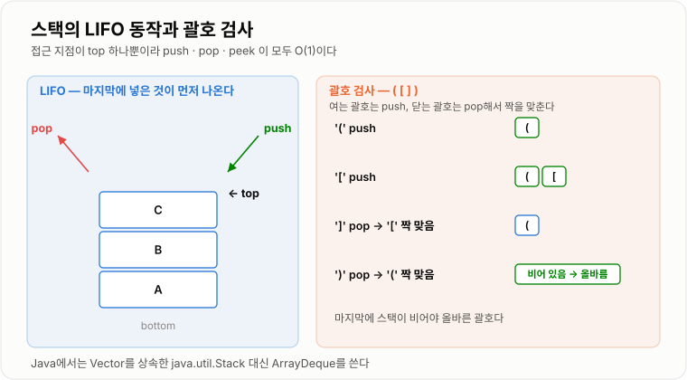

# Stack

> **스택(Stack)은 가장 나중에 넣은 데이터를 가장 먼저 꺼내는(LIFO) 규칙을 가진 자료구조다.**

---

## 1. 핵심 요약

* 스택은 **한쪽 끝(top)에서만** 데이터를 넣고 뺀다. 이를 **LIFO(Last In First Out)** 라고 한다.
* 핵심 연산은 `push`(넣기), `pop`(꺼내기), `peek`(맨 위 확인)이며 모두 **O(1)** 이다.
* "되돌아가야 하는 처리"를 표현하는 데 쓰인다 — 함수 호출, 괄호 검사, 실행 취소, DFS.
* Java의 `java.util.Stack`은 **레거시**다. 실무·코딩테스트 모두 **`ArrayDeque`** 를 쓰는 것이 권장된다.
* JVM의 **호출 스택**과 재귀는 스택 구조 그 자체이며, 너무 깊어지면 `StackOverflowError`가 난다.

---

## 2. 등장 배경

### 해결하려는 문제

프로그램에는 **"지금 하던 일을 잠시 멈추고 다른 일을 한 뒤, 원래 자리로 정확히 돌아와야 하는"** 상황이 매우 많다.

```text
methodA() 실행 중
   → methodB() 호출  (A는 어디까지 했는지 기억해 둬야 함)
       → methodC() 호출  (B도 기억해 둬야 함)
       ← C 종료 → B의 그 자리로 복귀
   ← B 종료 → A의 그 자리로 복귀
```

여기서 중요한 규칙이 하나 있다. **가장 마지막에 미뤄 둔 일이 가장 먼저 처리된다.** C가 끝나면 A가 아니라 B로 돌아가야 한다.

이 "마지막에 넣은 것이 먼저 나온다"는 규칙을 자료구조로 만든 것이 스택이다.

같은 규칙이 필요한 상황들:

* 수식의 괄호가 올바르게 짝지어졌는지 검사
* 웹 브라우저의 뒤로 가기
* 텍스트 편집기의 실행 취소(Undo)
* 깊이 우선 탐색(DFS)에서 갈림길을 기억해 두었다가 되돌아오기

### 이 개념이 없을 때

* 되돌아갈 위치를 담을 변수를 상황마다 직접 만들어야 한다.
* 중첩 깊이가 몇 단계일지 모르면 변수로는 감당할 수 없다.
* 리스트로 흉내 내면 "맨 뒤에서만 넣고 뺀다"는 규칙을 강제할 수 없어 실수가 생긴다.
* 재귀 없이 DFS를 구현할 방법이 마땅치 않다.

스택은 **"규칙을 자료구조가 강제한다"** 는 데 가치가 있다. 아무 데나 접근할 수 없게 막아 버그를 줄인다.

---

## 3. 핵심 개념

| 개념                     | 설명                            | 중요한 이유                                |
| ---------------------- | ----------------------------- | ------------------------------------- |
| **LIFO**               | 마지막에 들어온 것이 먼저 나가는 규칙         | 스택의 정체성이자 모든 활용의 근거다                  |
| **top**                | 데이터를 넣고 빼는 유일한 지점             | 접근 지점을 하나로 제한해 O(1)을 보장한다             |
| **push**               | top 위에 데이터를 쌓는 연산             | 이동 없이 끝 위치에만 저장하므로 O(1)이다             |
| **pop**                | top의 데이터를 꺼내며 제거하는 연산         | 꺼냄과 동시에 제거된다는 점이 `peek`과 다르다          |
| **peek**               | top의 데이터를 제거하지 않고 확인하는 연산     | 조건을 확인만 하고 유지해야 할 때 쓴다                |
| **empty(빈 스택)**        | 원소가 하나도 없는 상태                 | `pop`/`peek` 전에 반드시 확인해야 한다           |
| **스택 오버플로**            | 스택에 담을 수 있는 한계를 넘긴 상태         | 재귀가 너무 깊으면 `StackOverflowError`가 발생한다 |
| **배열 기반 구현**           | 배열과 `top` 인덱스로 구현하는 방식        | 캐시 효율이 좋고 실제 JDK 구현이 택한 방식이다          |
| **연결 리스트 기반 구현**       | 노드를 head 쪽에 붙였다 떼는 방식         | 크기 제한이 없고 확장 복사가 없다                   |
| **호출 스택(Call Stack)**  | JVM이 메서드 호출 정보를 쌓아 두는 영역      | 재귀와 예외 스택트레이스의 근거다                    |

개념 간 관계는 다음과 같다.

```text
   push ↓        ↑ pop / peek
      ┌───────────┐
      │    top    │ ← 유일한 접근 지점
      ├───────────┤
      │           │
      │           │
      ├───────────┤
      │  bottom   │
      └───────────┘
```

`pop`과 `peek`의 차이는 반드시 구분해야 한다.

```text
스택: [A][B][C]   (C가 top)

peek() → C 반환,  스택은 [A][B][C] 그대로
pop()  → C 반환,  스택은 [A][B] 로 변함
```

---

## 4. 구조와 동작 원리

배열 기반 스택의 내부 구조는 다음과 같다.

```text
elements: [A][B][C][ ][ ]
                  ↑
                 top = 2   (다음 push는 인덱스 3에)
size = 3
```

동작 흐름은 다음과 같다.

```text
push(값)
   ↓
공간이 가득 찼는가? → 예: 더 큰 배열로 확장 후 복사
   ↓ 아니오
elements[++top] = 값
   ↓
완료 (O(1))


pop()
   ↓
비어 있는가? → 예: 예외 또는 null 반환
   ↓ 아니오
값 = elements[top]
elements[top--] = null    ← 참조를 끊어 GC를 돕는다
   ↓
값 반환 (O(1))
```

실제 동작 과정을 값과 함께 따라가면 다음과 같다.

1. 빈 스택을 만든다. `top = -1`
2. `push(10)` → `elements[0] = 10`, `top = 0`
3. `push(20)` → `elements[1] = 20`, `top = 1`
4. `push(30)` → `elements[2] = 30`, `top = 2`
5. `peek()` → `elements[2]`인 `30`을 반환하고 `top`은 그대로 2
6. `pop()` → `30`을 반환, `elements[2] = null`, `top = 1`
7. `pop()` → `20`을 반환, `top = 0`
8. `pop()` → `10`을 반환, `top = -1` (빈 상태)
9. 이 상태에서 `pop()`을 또 호출하면 예외가 발생한다

```text
단계별 스택 상태

push(10)   push(20)   push(30)    pop()     pop()
  [10]      [10]       [10]       [10]      [10]
            [20]       [20]       [20]
                       [30]
   ↑          ↑          ↑          ↑         ↑
 top=0      top=1      top=2      top=1     top=0
```

### 괄호 검사 예시로 보는 동작

입력: `( [ ] )`

```text
'(' → push        스택: [ ( ]
'[' → push        스택: [ ( , [ ]
']' → pop → '['   짝 맞음 ✔   스택: [ ( ]
')' → pop → '('   짝 맞음 ✔   스택: [ ]
끝  → 스택이 비었으므로 올바른 괄호
```

입력: `( ] )`

```text
'(' → push        스택: [ ( ]
']' → pop → '('   짝 안 맞음 ✘ → 즉시 실패
```



*접근 지점을 top 하나로 제한했기 때문에 이동이나 탐색 없이 모든 연산이 O(1)로 끝난다.*

### JVM 호출 스택

```text
      ┌──────────────────┐
 top  │ methodC 스택 프레임 │ ← 지역변수, 매개변수, 복귀 주소
      ├──────────────────┤
      │ methodB 스택 프레임 │
      ├──────────────────┤
      │ methodA 스택 프레임 │
      ├──────────────────┤
      │ main 스택 프레임    │
      └──────────────────┘

메서드 호출 = push,  메서드 종료 = pop
스택 크기 한계를 넘기면 StackOverflowError
```

예외의 **스택트레이스**는 바로 이 호출 스택을 위에서부터 출력한 것이다.

---

## 5. 코드 또는 사용 예시

### 직접 만들어 보는 배열 기반 스택

```java
public class ArrayStack {

    private Object[] elements;
    private int top;

    public ArrayStack(int initialCapacity) {
        this.elements = new Object[initialCapacity];
        this.top = -1;
    }

    public void push(Object value) {
        if (top + 1 == elements.length) {
            grow();
        }
        top++;
        elements[top] = value;
    }

    public Object pop() {
        if (isEmpty()) {
            throw new IllegalStateException("스택이 비어 있습니다.");
        }
        Object value = elements[top];
        elements[top] = null;
        top--;
        return value;
    }

    public Object peek() {
        if (isEmpty()) {
            throw new IllegalStateException("스택이 비어 있습니다.");
        }
        return elements[top];
    }

    public boolean isEmpty() {
        return top == -1;
    }

    public int size() {
        return top + 1;
    }

    private void grow() {
        Object[] newElements = new Object[elements.length * 2];
        for (int i = 0; i < elements.length; i++) {
            newElements[i] = elements[i];
        }
        elements = newElements;
    }

    public static void main(String[] args) {
        ArrayStack stack = new ArrayStack(4);
        stack.push("A");
        stack.push("B");
        stack.push("C");

        System.out.println("peek: " + stack.peek());
        System.out.println("pop: " + stack.pop());
        System.out.println("pop: " + stack.pop());
        System.out.println("size: " + stack.size());
    }
}
```

각 부분의 역할은 다음과 같다.

```java
private int top;
```

마지막으로 저장된 위치를 가리킨다. `-1`은 비어 있다는 뜻이다.

```java
top++; elements[top] = value;
```

배열 끝에만 저장하므로 원소 이동이 전혀 없다. 이것이 `push`가 O(1)인 이유다.

```java
elements[top] = null;
```

꺼낸 자리의 참조를 끊는다. 안 그러면 이미 꺼낸 객체가 배열에 남아 GC 대상이 되지 못한다.

```java
if (isEmpty()) { throw ... }
```

빈 스택에서 꺼내려는 시도를 막는다. 스택을 쓸 때 가장 흔한 버그가 이 검사 누락이다.

### 실전 — 괄호 검사

```java
import java.util.ArrayDeque;
import java.util.Deque;

public class BracketChecker {

    public static boolean isValid(String input) {
        Deque<Character> stack = new ArrayDeque<>();

        for (int i = 0; i < input.length(); i++) {
            char c = input.charAt(i);

            if (c == '(' || c == '[' || c == '{') {
                stack.push(c);
            } else if (c == ')' || c == ']' || c == '}') {
                if (stack.isEmpty()) {
                    return false;
                }
                char open = stack.pop();
                if (!isPair(open, c)) {
                    return false;
                }
            }
        }

        return stack.isEmpty();
    }

    private static boolean isPair(char open, char close) {
        if (open == '(' && close == ')') {
            return true;
        }
        if (open == '[' && close == ']') {
            return true;
        }
        return open == '{' && close == '}';
    }

    public static void main(String[] args) {
        System.out.println(isValid("([]{})"));  // true
        System.out.println(isValid("([)]"));    // false
        System.out.println(isValid("(("));      // false
    }
}
```

마지막의 `stack.isEmpty()` 확인이 중요하다. 닫는 괄호가 모자란 `((` 같은 입력을 잡아내는 부분이다.

### 왜 `java.util.Stack`이 아니라 `ArrayDeque`인가

```java
import java.util.ArrayDeque;
import java.util.Deque;
import java.util.Stack;

public class StackVsDeque {

    public static void main(String[] args) {
        Stack<Integer> legacy = new Stack<>();
        legacy.push(1);
        legacy.push(2);
        System.out.println(legacy);   // [1, 2]  ← 아래부터 출력, 순회도 아래부터

        Deque<Integer> modern = new ArrayDeque<>();
        modern.push(1);
        modern.push(2);
        System.out.println(modern);   // [2, 1]  ← top부터 출력, LIFO 순서와 일치
    }
}
```

`java.util.Stack`의 문제는 다음과 같다.

* **`Vector`를 상속**해서 `get(i)`, `add(i, e)` 같은 메서드가 그대로 노출된다. 스택인데 중간에 끼워 넣을 수 있다는 뜻이다.
* **모든 메서드가 `synchronized`** 라 단일 스레드에서도 불필요한 락 비용을 낸다.
* **순회 순서가 LIFO가 아니다.** 아래(가장 오래된 원소)부터 나온다.

그래서 JDK 문서 자체가 `Deque`(`ArrayDeque`) 사용을 권장한다.

---

## 6. 성능 특성

| 연산                | 평균 시간 복잡도 | 최악 시간 복잡도 | 설명                       |
| ----------------- | -------: | -------: | ------------------------ |
| `push`            |     O(1) |     O(n) | 배열 기반에서 확장이 일어나는 순간만 O(n) |
| `pop`             |     O(1) |     O(1) | top 위치의 값을 꺼내고 인덱스를 줄인다  |
| `peek`            |     O(1) |     O(1) | top 위치의 값을 읽기만 한다        |
| `isEmpty` / `size` |     O(1) |     O(1) | 인덱스나 카운터로 즉시 판단한다        |
| `search`(특정 값 찾기) |     O(n) |     O(n) | 스택은 검색용 자료구조가 아니다        |

배열 기반 `push`는 확장 비용이 전체에 분산되므로 **분할 상환 O(1)** 이다. 연결 리스트 기반이라면 확장 자체가 없어 항상 O(1)이지만, 노드 객체 생성 비용과 캐시 미스가 붙는다.

공간 복잡도는 **O(n)** 이다.

| 구현 방식     | 메모리 특성                       |
| --------- | ---------------------------- |
| 배열 기반     | 여유 공간이 남지만 원소당 참조 1개만 저장     |
| 연결 리스트 기반 | 여유 공간은 없지만 원소마다 노드 객체 오버헤드   |

데이터가 많아질 때의 변화는 다음과 같다.

* `push`/`pop` 비용은 개수와 무관하게 O(1)로 유지된다.
* 배열 기반은 확장 시 복사해야 할 원소가 늘어난다.
* **JVM 호출 스택은 크기가 제한적**이다(스레드마다 보통 512KB~1MB). 재귀 깊이가 수만 단계면 `StackOverflowError`가 난다. 반면 힙에 만든 스택 객체는 힙 크기까지 쓸 수 있어 훨씬 깊게 갈 수 있다.

```text
재귀 DFS          →  JVM 호출 스택 사용 → 깊이 수만이면 StackOverflowError
명시적 Deque DFS   →  힙 메모리 사용     → 훨씬 깊은 탐색 가능
```

---

## 7. 장점과 단점

| 장점                    | 이유                                     |
| --------------------- | -------------------------------------- |
| 모든 핵심 연산이 O(1)이다      | 접근 지점이 top 하나뿐이라 탐색이나 이동이 없다           |
| 구조가 단순해 버그가 적다        | 할 수 있는 일이 세 가지뿐이라 오용 여지가 작다            |
| "되돌아가기" 로직을 자연스럽게 표현한다 | 마지막 상태가 먼저 복원되는 규칙이 문제 구조와 정확히 맞아떨어진다  |
| 재귀를 반복문으로 바꿀 수 있다     | 호출 스택 대신 힙의 스택을 써서 깊이 제한을 우회한다         |
| 메모리 사용을 예측하기 쉽다       | 넣은 만큼만 쌓이고 꺼낸 만큼 줄어든다                  |

| 단점                  | 이유 및 주의점                                        |
| ------------------- | ----------------------------------------------- |
| 중간 데이터에 접근할 수 없다    | top이 아닌 원소를 보려면 위에 쌓인 것을 다 꺼내야 한다               |
| 검색이 느리다             | 순서 기반 구조라 값으로 찾으려면 O(n)이다                       |
| 삽입 순서대로 처리할 수 없다    | FIFO가 필요하면 스택이 아니라 큐를 써야 한다                     |
| 재귀로 쓰면 깊이 제한이 있다    | JVM 호출 스택은 크기가 작아 `StackOverflowError`가 날 수 있다  |
| `java.util.Stack`은 함정이 많다 | `Vector` 상속, 불필요한 동기화, LIFO가 아닌 순회 순서           |

---

## 8. 사용 기준

### 사용하기 좋은 상황

* 마지막에 처리한 것부터 되돌려야 하는 경우 (Undo, 뒤로 가기)
* 짝을 맞춰야 하는 검사 (괄호, 태그, 중첩 구조)
* 깊이 우선 탐색(DFS)을 반복문으로 구현할 때
* 수식 계산 (후위 표기법 변환·평가)
* 재귀 알고리즘의 상태를 명시적으로 관리해야 할 때
* 중첩된 컨텍스트를 저장했다가 복원할 때

### 사용하지 않는 것이 좋은 상황

* 들어온 순서대로 처리해야 하는 경우 → **큐**
* 인덱스나 키로 임의 접근이 필요한 경우 → `ArrayList`, `HashMap`
* 우선순위대로 꺼내야 하는 경우 → **힙 / `PriorityQueue`**
* 중간 원소를 자주 조회·수정해야 하는 경우
* 양 끝 모두에서 넣고 빼야 하는 경우 → **덱**

### 선택 기준

1. 꺼내는 순서가 **마지막에 넣은 것 먼저**인가? → 맞으면 스택
2. 접근이 한쪽 끝에서만 일어나는가?
3. 중간 원소를 조회할 필요가 없는가?
4. 재귀 깊이가 너무 깊어질 위험이 있는가? → 명시적 스택으로 전환
5. Java라면 `Stack` 대신 `ArrayDeque`를 쓰고 있는가?

```text
마지막 것부터 처리  →  Stack (ArrayDeque)
처음 것부터 처리    →  Queue (ArrayDeque)
중요한 것부터 처리  →  PriorityQueue
```

---

## 9. 비슷한 개념 비교

### Stack과 Queue

| 비교 항목  | Stack           | Queue            | 선택 기준          |
| ------ | --------------- | ---------------- | -------------- |
| 목적     | 마지막 것을 먼저 처리    | 먼저 온 것을 먼저 처리    | 처리 순서 요구사항     |
| 규칙     | LIFO            | FIFO             | 되돌아가기 vs 순서 보장 |
| 접근 지점  | 한쪽 끝(top)       | 양쪽 끝(넣는 곳·빼는 곳)  | 구조적 차이         |
| 대표 활용  | DFS, 괄호 검사, Undo | BFS, 작업 대기열, 버퍼  | 문제 성격          |
| 성능     | 모든 연산 O(1)      | 모든 연산 O(1)       | 성능 차이는 없음      |
| 적합한 상황 | 중첩·복귀 구조        | 공정한 순서 처리        | 요구사항으로 판단      |

### `java.util.Stack`과 `ArrayDeque`

| 비교 항목    | `java.util.Stack`   | `ArrayDeque`         | 선택 기준             |
| -------- | ------------------- | -------------------- | ----------------- |
| 목적       | 레거시 스택 구현           | 범용 덱 (스택·큐 겸용)       | 신규 코드는 ArrayDeque |
| 내부 구조    | `Vector` 상속(배열)     | 순환 배열                | 오버헤드 차이           |
| 동기화      | 모든 메서드 `synchronized` | 없음                   | 단일 스레드면 ArrayDeque |
| 순회 순서    | 바닥부터 (LIFO 아님)      | top부터 (LIFO)         | 직관성               |
| 캡슐화      | `get(i)` 등 노출됨      | 스택 연산만 노출            | 오용 방지             |
| 성능       | 락 비용으로 느림           | 빠름                   | 사실상 항상 ArrayDeque |
| 적합한 상황   | 기존 코드 유지            | 새로 작성하는 모든 코드        | JDK 문서도 Deque 권장  |

### 재귀와 명시적 스택

| 비교 항목  | 재귀            | 명시적 스택           | 선택 기준             |
| ------ | ------------- | ---------------- | ----------------- |
| 목적     | 코드로 자연스럽게 표현  | 깊이 제한 없이 안전하게 처리 | 데이터 깊이            |
| 사용 메모리 | JVM 호출 스택     | 힙                | 깊이가 크면 명시적 스택     |
| 가독성    | 좋음            | 상태 관리 코드가 늘어남    | 가독성 vs 안전성        |
| 깊이 한계  | 수천~수만 (설정 의존) | 힙 크기까지           | 대용량 그래프면 명시적      |
| 디버깅    | 스택트레이스로 추적 쉬움 | 상태를 직접 찍어봐야 함    | 상황에 따라 다름         |
| 적합한 상황 | 깊이가 얕은 재귀     | 깊이를 예측할 수 없는 탐색  | 입력 크기를 기준으로 결정    |

---

## 10. 백엔드 실무 적용

### Spring·Java

스택은 **직접 쓰기보다 이미 스택으로 동작하는 것들을 이해하는 데** 의미가 있다.

* **JVM 호출 스택**: 모든 메서드 호출이 스택 프레임으로 쌓인다. 예외 스택트레이스가 그 스냅샷이다.
* **`StackOverflowError`**: 잘못된 재귀나 순환 참조가 원인이다. 실무에서 가장 흔한 사례는 **양방향 JPA 연관관계의 `toString()`이나 JSON 직렬화가 서로를 무한 호출하는 경우**다.

```java
// Order.toString() → Member.toString() → Order.toString() → ... 무한 반복
@Entity
public class Order {
    @ManyToOne
    private Member member;

    @Override
    public String toString() {
        return "Order{member=" + member + "}";   // 위험
    }
}
```

해결책은 `toString`에서 연관 엔티티를 빼거나, JSON 직렬화 시 `@JsonIgnore`를 붙이는 것이다.

* **트랜잭션 전파**: `REQUIRES_NEW`로 트랜잭션이 중첩되면 기존 트랜잭션을 잠시 보류했다가 나중에 복원한다. 이 보류·복원이 스택 구조다.
* **Spring Security의 `SecurityContextHolder`**: 인증 컨텍스트를 잠시 바꿨다가 되돌리는 패턴에서 스택형 관리가 쓰인다.
* **MDC(로그 컨텍스트)**: 요청별 컨텍스트를 쌓고 빼는 방식으로 관리한다.

### 데이터베이스·캐시

* **SQL 파서**는 괄호와 중첩 서브쿼리를 해석할 때 스택을 쓴다.
* **트랜잭션 세이브포인트**: `SAVEPOINT`를 여러 개 만들면 마지막 것부터 롤백하는 LIFO 구조다.

```text
BEGIN
  SAVEPOINT s1     → push s1
  SAVEPOINT s2     → push s2
  ROLLBACK TO s2   → s2까지 되돌림
  ROLLBACK TO s1   → s1까지 되돌림
COMMIT
```

* **재귀 CTE(`WITH RECURSIVE`)** 로 계층 구조를 조회할 때 DB 엔진이 내부적으로 스택형 처리를 한다.
* Redis에는 스택 전용 타입이 없지만 List에 `LPUSH`/`LPOP`을 쓰면 스택처럼 동작한다.

### 동시성·분산 환경

* **스레드마다 호출 스택이 따로 있다.** 그래서 지역 변수는 스레드 안전하다. 반면 힙의 공유 객체는 동기화가 필요하다.

```text
스레드 A의 호출 스택   |   스레드 B의 호출 스택
   (지역 변수 · 독립)   |      (지역 변수 · 독립)
              ↓  둘 다 참조  ↓
              ────  힙 (공유)  ────
```

* 여러 스레드가 하나의 스택 객체를 공유하면 `ArrayDeque`는 스레드 안전하지 않다. `ConcurrentLinkedDeque`나 외부 동기화가 필요하다.
* 스레드 풀에서 스레드 스택 크기(`-Xss`)를 크게 잡으면 스레드 수만큼 메모리가 곱해진다. 스레드 1000개 × 1MB = 1GB다.

---

## 11. 자주 하는 오해

| 잘못된 이해                             | 올바른 이해                                                   |
| ---------------------------------- | -------------------------------------------------------- |
| `pop`은 값을 확인만 한다                   | `pop`은 꺼내면서 **제거**한다. 확인만 하려면 `peek`을 쓴다                 |
| Java에서 스택은 `java.util.Stack`을 써야 한다 | `Vector` 상속·불필요한 동기화·비직관적 순회 때문에 `ArrayDeque`가 권장된다      |
| 스택은 메모리 영역 이름이다                    | 자료구조 스택과 JVM 스택 메모리 영역은 다른 개념이다. 다만 같은 LIFO 규칙을 쓴다       |
| `StackOverflowError`는 힙이 부족해서 발생한다 | 힙이 아니라 **스레드 호출 스택**이 한계를 넘어 발생한다. 힙 부족은 `OutOfMemoryError`다 |
| 스택은 중간 원소도 볼 수 있다                  | 규칙상 top만 접근한다. 중간을 봐야 한다면 스택이 맞지 않는 선택이다                 |
| 재귀와 스택은 다른 것이다                     | 재귀는 JVM 호출 스택을 암묵적으로 쓰는 것이며, 명시적 스택으로 바꿔 쓸 수 있다          |
| 스택은 크기가 무한하다                       | 배열 기반은 확장 비용이 있고, JVM 호출 스택은 크기가 고정되어 있다                 |
| `Stack`이 `synchronized`이니 스레드 안전하다 | 개별 메서드만 안전할 뿐 "확인 후 꺼내기" 같은 복합 연산은 여전히 경쟁 상태가 생긴다        |
| 빈 스택에서 `pop`하면 `null`이 나온다         | 구현마다 다르다. `ArrayDeque.pop()`은 예외, `pollFirst()`는 `null`이다 |
| DFS는 반드시 재귀로 짜야 한다                 | `Deque`로 명시적 스택을 쓰면 깊이 제한 없이 같은 결과를 낼 수 있다               |

---

## 12. 면접 답변

### 기본 답변

스택은 마지막에 넣은 데이터를 가장 먼저 꺼내는 LIFO 규칙의 자료구조입니다. 데이터를 넣고 빼는 지점이 top 하나뿐이라, `push`, `pop`, `peek` 모두 O(1)에 동작합니다.

내부적으로는 배열과 top 인덱스로 구현하거나, 연결 리스트의 head 쪽에 붙였다 떼는 방식으로 구현합니다. 배열 기반은 캐시 효율이 좋고 확장 시에만 복사가 일어나 분할 상환 O(1)이며, 연결 리스트 기반은 확장 복사가 없는 대신 노드 오버헤드가 있습니다.

장점은 연산이 모두 O(1)이고 구조가 단순해 오용 가능성이 적다는 점입니다. 단점은 top이 아닌 원소에 접근할 수 없고 검색이 O(n)이라는 점입니다.

그래서 마지막 상태부터 되돌려야 하는 상황 — 괄호 검사, DFS, 실행 취소, 수식 계산 — 에 사용하고, 들어온 순서대로 처리해야 하면 큐를 씁니다. Java에서는 `java.util.Stack`이 `Vector`를 상속해 불필요한 동기화와 비직관적인 순회 순서를 갖기 때문에 `ArrayDeque`를 사용합니다. 실무에서는 JVM 호출 스택이 스택 구조이며, 양방향 연관관계의 무한 재귀로 `StackOverflowError`가 나는 경우를 자주 만납니다.

### 답변 구조

* **정의**

    * 마지막에 넣은 것을 먼저 꺼내는 LIFO 자료구조
    * 접근 지점이 top 하나뿐

* **내부 원리**

    * 배열 + `top` 인덱스, 또는 연결 리스트 head 조작
    * `push`는 끝에 저장, `pop`은 끝에서 제거하고 참조를 `null`로 끊음

* **복잡도**

    * `O(1)`: `push`(분할 상환), `pop`, `peek`, `isEmpty`, `size`
    * `O(n)`: 값 검색, 배열 확장이 일어나는 `push`
    * 공간 `O(n)`

* **장점**

    * 모든 핵심 연산 O(1), 구조가 단순해 버그가 적음
    * 되돌리기·중첩 구조를 자연스럽게 표현

* **단점**

    * 중간 원소 접근 불가, 검색 O(n)
    * 재귀로 쓰면 호출 스택 깊이 제한

* **사용 기준**

    * 꺼내는 순서가 "마지막 것 먼저"이고, 중간 접근이 필요 없을 때

* **대안과 비교**

    * 순서대로 처리 → `Queue`, 우선순위 → `PriorityQueue`
    * Java에서는 `Stack`이 아니라 `ArrayDeque`
    * 깊은 재귀 → 명시적 스택으로 전환(힙 사용)

* **실무 적용 사례**

    * JVM 호출 스택과 예외 스택트레이스
    * 양방향 연관관계 무한 재귀로 인한 `StackOverflowError`
    * DB 세이브포인트 롤백, SQL 파서의 중첩 처리

---

## 13. 예상 면접 질문

### 기본 질문

1. **스택이란 무엇인가요?**

    * 핵심 키워드: LIFO, top, `push`/`pop`/`peek`, O(1)

2. **스택의 모든 연산이 O(1)인 이유는 무엇인가요?**

    * 핵심 키워드: 접근 지점 하나, 원소 이동 없음, 끝 인덱스만 갱신

3. **`pop`과 `peek`의 차이는 무엇인가요?**

    * 핵심 키워드: 제거 여부, 상태 변경, 조건 확인 용도

4. **스택과 큐의 차이는 무엇인가요?**

    * 핵심 키워드: LIFO vs FIFO, DFS vs BFS, 되돌아가기 vs 순서 보장

5. **Java에서 `java.util.Stack`을 권장하지 않는 이유는 무엇인가요?**

    * 핵심 키워드: `Vector` 상속, 전체 `synchronized`, 캡슐화 깨짐, 순회 순서

6. **`StackOverflowError`는 왜 발생하나요?**

    * 핵심 키워드: 호출 스택 한계, 재귀 종료 조건 누락, 스택 프레임, `-Xss`

7. **스택을 배열과 연결 리스트로 각각 구현할 때 차이는 무엇인가요?**

    * 핵심 키워드: 확장 복사 vs 노드 오버헤드, 캐시 효율, 분할 상환

### 꼬리 질문

1. **재귀 DFS가 `StackOverflowError`가 날 때 어떻게 해결하나요?**

    * 핵심 키워드: 명시적 `Deque` 스택, 힙 메모리 사용, 반복문 전환, `-Xss` 조정

2. **`StackOverflowError`와 `OutOfMemoryError`는 어떻게 다른가요?**

    * 핵심 키워드: 호출 스택 vs 힙, 스레드별 스택 영역, 발생 원인 차이

3. **JPA 양방향 연관관계에서 `StackOverflowError`가 나는 이유는 무엇인가요?**

    * 핵심 키워드: `toString`/JSON 직렬화 상호 호출, 무한 재귀, `@JsonIgnore`, DTO 분리

4. **스레드마다 호출 스택이 따로 있다는 게 왜 중요한가요?**

    * 핵심 키워드: 지역 변수 스레드 안전, 힙은 공유, 동기화 필요 범위

5. **스레드 스택 크기를 키우면 어떤 부작용이 있나요?**

    * 핵심 키워드: 스레드 수 × 스택 크기, 메모리 사용량 폭증, 생성 가능한 스레드 수 감소

6. **여러 스레드가 하나의 스택을 공유하면 어떻게 해야 하나요?**

    * 핵심 키워드: `ArrayDeque` 비동기화, `ConcurrentLinkedDeque`, 복합 연산 원자성

7. **후위 표기법 계산에 스택을 쓰는 이유는 무엇인가요?**

    * 핵심 키워드: 피연산자 보관, 연산자 만나면 마지막 두 개 pop, 괄호 불필요

8. **`ArrayDeque`를 스택으로 쓸 때 `null`을 넣으면 어떻게 되나요?**

    * 핵심 키워드: `null` 저장 금지, `NullPointerException`, `null`을 비어있음 신호로 사용

---

## 14. 추가 학습 방향

### 바로 이어서 공부

| 키워드            | 연결되는 이유                             |
| -------------- | ----------------------------------- |
| **Queue**      | 스택과 정반대인 FIFO 규칙을 함께 비교하면 이해가 선명해진다 |
| **Deque**      | 스택과 큐를 하나로 합친 구조이며 실무 권장 구현체다       |
| **ArrayDeque** | Java에서 스택을 만드는 실제 정답이다              |
| **DFS**        | 스택으로 구현하는 대표 알고리즘이다                 |
| **재귀와 호출 스택**  | 스택 구조가 언어 차원에서 어떻게 쓰이는지 이해한다        |

### 실무 확장

| 키워드                     | 연결되는 이유                              |
| ----------------------- | ------------------------------------ |
| **예외와 스택트레이스 읽기**       | 호출 스택 스냅샷을 해석해 장애 원인을 찾는다            |
| **JPA 양방향 연관관계**        | 무한 재귀로 인한 `StackOverflowError`를 예방한다 |
| **트랜잭션 전파와 세이브포인트**     | 중첩 트랜잭션의 보류·복원이 스택 구조다               |
| **JVM 메모리 구조**          | 스택 영역과 힙 영역의 역할 차이를 이해한다             |
| **스레드 스택 크기(`-Xss`) 튜닝** | 스레드 수와 메모리의 트레이드오프를 계산한다             |

### 심화 학습

| 키워드                     | 연결되는 이유                           |
| ----------------------- | --------------------------------- |
| **후위 표기법 변환·평가**        | 스택 두 개로 수식을 처리하는 고전 알고리즘이다        |
| **모노토닉 스택**             | 다음 큰 원소 찾기 등을 O(n)에 푸는 고급 기법이다    |
| **꼬리 재귀 최적화**           | 재귀를 스택 없이 반복으로 바꾸는 원리를 이해한다       |
| **`ConcurrentLinkedDeque`** | 락 없이 동작하는 동시성 스택·덱 구현을 배운다        |
| **JVM 스택 프레임 구조**       | 지역 변수 테이블, 피연산자 스택, 프레임 데이터를 살펴본다 |

---

## 15. 최종 체크리스트

* [ ] 개념을 한 문장으로 설명할 수 있다
* [ ] 등장 배경을 설명할 수 있다
* [ ] 내부 동작 과정을 설명할 수 있다
* [ ] 성능 특성을 설명할 수 있다
* [ ] 장점과 단점을 설명할 수 있다
* [ ] 사용할 상황과 사용하지 않을 상황을 구분할 수 있다
* [ ] 비슷한 기술과 비교할 수 있다
* [ ] Spring 백엔드 실무 사례를 설명할 수 있다
* [ ] 기본 면접 질문에 답할 수 있다
* [ ] 조건이 달라졌을 때 대안을 제시할 수 있다

---

## 16. 한 줄 결론

**마지막에 넣은 것부터 되돌려 처리해야 하고 중간 원소에 접근할 필요가 없다면 스택을 선택하되, Java에서는 `Stack`이 아니라 `ArrayDeque`를 쓴다.**
