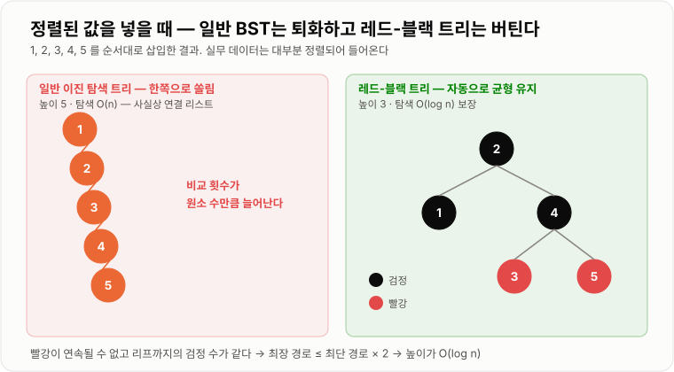

# TreeMap

> **TreeMap은 키를 항상 정렬된 상태로 유지하는 균형 이진 탐색 트리(레드-블랙 트리) 기반의 Map으로, 조회·저장·삭제를 O(log n)에 처리하면서 범위 조회와 순서 기반 탐색을 지원한다.**

---

## 1. 핵심 요약

* TreeMap은 **키가 항상 정렬된 상태**로 유지되는 Map이다.
* 내부는 **레드-블랙 트리(Red-Black Tree)** 라는 스스로 균형을 잡는 이진 탐색 트리다.
* 모든 기본 연산이 **O(log n)** 이다. HashMap의 O(1)보다 느리지만 **정렬과 범위 조회**를 얻는다.
* `firstKey`, `ceilingKey`, `subMap`처럼 **"가장 가까운 키", "구간의 키들"** 을 찾는 연산이 핵심 가치다.
* 정렬 기준은 키의 `Comparable` 또는 생성 시 넘긴 `Comparator`가 결정하며, **`equals`가 아니라 `compareTo`로 중복을 판단**한다.

---

## 2. 등장 배경

### 해결하려는 문제

HashMap은 조회가 O(1)로 빠르지만 **결정적인 한계**가 있다. 해시 함수가 키를 흩뿌려 놓기 때문에 **순서 정보가 완전히 사라진다.**

```text
HashMap에 점수를 저장했다면

{85: "김", 92: "이", 78: "박", 95: "최"}
     ↓ 내부적으로는 해시값 순서로 흩어져 있음
table[3]=92,  table[7]=78,  table[11]=85,  table[14]=95

"가장 높은 점수는?"        → 전부 훑어야 함 O(n)
"80점 이상만 보여줘"        → 전부 훑어야 함 O(n)
"90점에 가장 가까운 점수는?" → 전부 훑어야 함 O(n)
```

이런 질문들은 실무에서 계속 나온다.

* 랭킹에서 상위 10명
* 특정 날짜 구간의 로그
* 요청한 가격 이하의 가장 비싼 상품
* 유효한 요금제 구간 찾기

리스트에 담고 매번 정렬하면 O(n log n)이 반복된다. **애초에 정렬된 상태를 유지하면서 삽입·삭제도 빠르게** 할 수는 없을까?

### 이진 탐색 트리와 그 문제

정렬 상태를 유지하는 자연스러운 구조가 **이진 탐색 트리(BST)** 다.

```text
규칙: 왼쪽 자식 < 부모 < 오른쪽 자식

        50
       /  \
     30    70
    /  \   / \
   20  40 60  80

"40 찾기": 50보다 작음 → 왼쪽 → 30보다 큼 → 오른쪽 → 찾음 (3번 비교)
```

한 번 비교할 때마다 후보가 절반씩 줄어 **O(log n)** 이다. 그런데 치명적인 문제가 있다.

```text
1, 2, 3, 4, 5를 순서대로 삽입하면

  1
   \
    2
     \
      3
       \
        4
         \
          5

→ 사실상 연결 리스트, 탐색이 O(n)으로 퇴화
```

**정렬된 데이터를 넣으면 트리가 한쪽으로 쏠린다.** 그런데 실무 데이터는 대부분 정렬되어 들어온다(ID 순서, 날짜 순서, 시퀀스). 즉 **최악의 경우가 가장 흔한 경우**다.

여기서 **균형 트리**가 등장한다. 삽입·삭제할 때마다 트리 모양을 자동으로 재조정해 높이를 `O(log n)`으로 유지하는 것이다. 레드-블랙 트리가 그중 하나이며, Java의 TreeMap이 채택한 방식이다.

### 이 개념이 없을 때

* "가장 큰 키", "가장 작은 키"를 찾으려면 전체를 훑어야 한다.
* 범위 조회를 하려면 전부 확인하거나 매번 정렬해야 한다.
* "이 값에 가장 가까운 키"를 찾는 연산을 O(log n)에 할 수 없다.
* 정렬된 상태로 순회하려면 매번 O(n log n)의 정렬 비용을 낸다.
* 삽입·삭제가 섞인 상황에서 정렬 상태를 유지하는 비용이 감당 불가능해진다.

---

## 3. 핵심 개념

| 개념                     | 설명                                             | 중요한 이유                               |
| ---------------------- | ---------------------------------------------- | ------------------------------------ |
| **이진 탐색 트리(BST)**      | 왼쪽 < 부모 < 오른쪽 규칙을 지키는 트리                       | 정렬 상태를 유지하며 O(log n) 탐색을 가능하게 한다     |
| **균형(balance)**        | 트리의 높이를 최소로 유지하는 성질                            | 균형이 깨지면 O(n)으로 퇴화한다                  |
| **레드-블랙 트리**           | 각 노드에 빨강/검정 색을 부여해 균형을 유지하는 BST                | TreeMap의 실제 내부 구조다                   |
| **회전(rotation)**       | 부모-자식 관계를 바꿔 트리 모양을 재조정하는 연산                   | 균형을 복구하는 기본 동작이다                     |
| **`Comparable`**       | 객체가 자신의 "자연 순서"를 정의하는 인터페이스 (`compareTo`)      | 키의 기본 정렬 기준이 된다                      |
| **`Comparator`**       | 정렬 기준을 외부에서 주입하는 인터페이스 (`compare`)             | 자연 순서와 다르게 정렬하고 싶을 때 쓴다              |
| **`NavigableMap`**     | 가까운 키 탐색과 범위 조회를 정의한 인터페이스                     | TreeMap의 진짜 존재 이유다                   |
| **`ceiling` / `floor`** | 주어진 키 **이상** 중 가장 작은 키 / **이하** 중 가장 큰 키       | "가장 가까운 값" 탐색의 핵심 연산이다               |
| **`higher` / `lower`** | 주어진 키 **초과** 중 가장 작은 키 / **미만** 중 가장 큰 키       | 경계 포함 여부만 다르다                        |
| **`subMap`**           | 특정 구간의 키-값들만 잘라낸 뷰(view)                       | 범위 조회를 O(log n)에 시작할 수 있게 한다         |
| **중위 순회(in-order)**    | 왼쪽 → 자기 자신 → 오른쪽 순으로 방문하는 순회                   | BST를 중위 순회하면 정렬 순서가 나온다              |
| **뷰(view)**            | 원본을 복사하지 않고 일부를 바라보는 객체                        | `subMap` 수정이 원본에 반영되는 이유다            |

개념 간 관계는 다음과 같다.

```text
Map (인터페이스)
 └─ SortedMap      — 정렬 보장, firstKey/lastKey/subMap
     └─ NavigableMap — ceiling/floor/higher/lower, 역순 뷰
         └─ TreeMap  — 레드-블랙 트리로 구현
                         ↑
                    정렬 기준: Comparable 또는 Comparator
```

**핵심 관계**: "정렬 상태 유지" → "중위 순회로 정렬 순서 획득" + "이진 탐색으로 가까운 키 O(log n) 탐색". 이 두 가지가 TreeMap의 전부다.

---

## 4. 구조와 동작 원리

### 레드-블랙 트리의 규칙

레드-블랙 트리는 다음 5가지 규칙으로 균형을 유지한다.

```text
① 모든 노드는 빨강 또는 검정이다.
② 루트는 검정이다.
③ 모든 리프(NIL, 빈 노드)는 검정이다.
④ 빨강 노드의 자식은 반드시 검정이다. (빨강이 연속될 수 없다)
⑤ 임의의 노드에서 모든 리프까지 가는 경로의 검정 노드 수가 같다.
```

이 규칙들이 만들어 내는 결론이 핵심이다.

```text
규칙 ④ + ⑤ 로부터

가장 짧은 경로: 검정만 있는 경로     → 길이 h
가장 긴 경로: 검정-빨강이 번갈아     → 길이 최대 2h

따라서 가장 긴 경로 ≤ 가장 짧은 경로 × 2
→ 트리 높이가 log n의 상수 배 이내로 보장됨
→ 모든 연산 O(log n)
```

**"완벽한 균형"이 아니라 "대충 균형"이면 충분하다**는 것이 레드-블랙 트리의 실용적 통찰이다. 완벽하게 맞추려면 재조정 비용이 커지는데, 2배 이내만 보장해도 O(log n)이 나오기 때문이다.

### 트리 구조 예시

```text
              (B)50
             /      \
        (R)30        (R)70
        /    \       /    \
   (B)20  (B)40  (B)60  (B)80

(B) = 검정, (R) = 빨강

- 루트 50은 검정 ✔ (규칙 ②)
- 빨강 30, 70의 자식은 모두 검정 ✔ (규칙 ④)
- 어느 리프로 가든 검정 노드 수가 같음 ✔ (규칙 ⑤)
```

### 조회 동작 과정

```text
get(40)
   ↓
루트 50과 비교 → compareTo(40, 50) < 0 → 왼쪽으로
   ↓
30과 비교 → compareTo(40, 30) > 0 → 오른쪽으로
   ↓
40과 비교 → 0 → 찾음! 값 반환

비교 횟수 = 트리 높이 = O(log n)
```

```text
put(key, value)
      ↓
루트부터 비교하며 내려갈 자리를 찾는다
      ↓
같은 키를 만났는가? → 예: 값만 덮어쓰고 종료 (구조 변경 없음)
      ↓ 아니오
빈 자리에 빨강 노드로 삽입
      ↓
규칙 ④ 위반? (부모도 빨강인가)
      ↓ 예
색 변경(recoloring) 또는 회전(rotation)으로 복구
      ↓
루트까지 올라가며 반복 → 최대 O(log n)
```

### 회전(rotation)

균형을 복구하는 기본 동작이다.

```text
왼쪽 회전 (오른쪽으로 쏠렸을 때)

    X                    Y
   / \                  / \
  A   Y      →         X   C
     / \              / \
    B   C            A   B

- Y가 X의 자리로 올라간다
- X는 Y의 왼쪽 자식이 된다
- Y의 왼쪽 자식 B는 X의 오른쪽 자식으로 옮겨진다

BST 규칙(A < X < B < Y < C)은 그대로 유지된다
```

**회전은 O(1)** 이다. 참조 몇 개만 바꾸면 되기 때문이다. 삽입 한 번에 회전은 최대 2번, 삭제는 최대 3번만 일어난다.

### 순차 삽입 시 균형 유지 비교

```text
1, 2, 3, 4, 5를 순서대로 삽입

[일반 BST]              [레드-블랙 트리]
  1                          (B)2
   \                        /     \
    2                   (B)1     (B)4
     \                          /     \
      3                     (R)3      (R)5
       \
        4                  높이 3, 탐색 O(log n)
         \
          5

높이 5, 탐색 O(n) — 퇴화
```



*색 규칙이 "최장 경로 ≤ 최단 경로 × 2"를 보장하므로, 어떤 입력에도 높이가 O(log n)을 넘지 않는다.*

### 중위 순회로 정렬 순서 얻기

```text
        50
       /  \
     30    70
    /  \   / \
   20  40 60  80

중위 순회: 왼쪽 → 자기 자신 → 오른쪽

20 → 30 → 40 → 50 → 60 → 70 → 80
= 정렬된 순서!
```

TreeMap을 `for (key : map.keySet())`으로 순회하면 자동으로 정렬 순서가 나오는 이유다. **별도의 정렬 비용이 0**이다.

### `ceiling` / `floor` 동작

```text
키: 10, 20, 30, 40, 50

ceilingKey(25)  →  25 이상 중 가장 작은 키  →  30
floorKey(25)    →  25 이하 중 가장 큰 키    →  20
higherKey(30)   →  30 초과 중 가장 작은 키  →  40
lowerKey(30)    →  30 미만 중 가장 큰 키    →  20
ceilingKey(30)  →  30 (자기 자신 포함)
higherKey(30)   →  40 (자기 자신 제외)
```

```text
       10    20    25    30    40    50
       │     │     ↑     │     │     │
       │  floor(25)│ ceiling(25)
       │  = 20     │  = 30
```

탐색 과정은 다음과 같다.

```text
ceilingKey(25) 동작

루트 30과 비교 → 25 < 30 → 30은 후보! 기억해 두고 왼쪽으로
   ↓
20과 비교 → 25 > 20 → 20은 후보 아님, 오른쪽으로
   ↓
오른쪽이 없음 → 종료
   ↓
기억해 둔 후보 30 반환

O(log n)
```

---

## 5. 코드 또는 사용 예시

### 기본 사용

```java
import java.util.Map;
import java.util.TreeMap;

public class TreeMapExample {

    public static void main(String[] args) {
        TreeMap<Integer, String> scores = new TreeMap<>();

        scores.put(85, "김철수");
        scores.put(92, "이영희");
        scores.put(78, "박민수");
        scores.put(95, "최지우");

        // 항상 키 정렬 순서로 순회된다
        for (Map.Entry<Integer, String> entry : scores.entrySet()) {
            System.out.println(entry.getKey() + " : " + entry.getValue());
        }
        // 78 : 박민수
        // 85 : 김철수
        // 92 : 이영희
        // 95 : 최지우

        System.out.println("최저점: " + scores.firstKey());        // 78
        System.out.println("최고점: " + scores.lastKey());         // 95
        System.out.println("최고점 항목: " + scores.lastEntry());   // 95=최지우
    }
}
```

`firstKey()`와 `lastKey()`가 **O(log n)** 인 이유는 왼쪽 끝(또는 오른쪽 끝)까지 내려가기만 하면 되기 때문이다. HashMap이라면 전부 훑어야 해서 O(n)이다.

### 가까운 키 찾기 — TreeMap의 핵심

```java
import java.util.TreeMap;

public class NavigationExample {

    public static void main(String[] args) {
        TreeMap<Integer, String> map = new TreeMap<>();
        map.put(10, "A");
        map.put(20, "B");
        map.put(30, "C");
        map.put(40, "D");

        System.out.println(map.ceilingKey(25));   // 30  (25 이상 중 최소)
        System.out.println(map.floorKey(25));     // 20  (25 이하 중 최대)
        System.out.println(map.higherKey(30));    // 40  (30 초과 중 최소)
        System.out.println(map.lowerKey(30));     // 20  (30 미만 중 최대)

        System.out.println(map.ceilingKey(30));   // 30  (자기 포함)
        System.out.println(map.higherKey(40));    // null (없으면 null)

        // Entry 버전도 있다
        System.out.println(map.floorEntry(25));   // 20=B
    }
}
```

### 실전 — 구간 기반 등급 판정

```java
import java.util.Map;
import java.util.TreeMap;

public class GradeCalculator {

    private final TreeMap<Integer, String> gradeTable = new TreeMap<>();

    public GradeCalculator() {
        gradeTable.put(0, "F");
        gradeTable.put(60, "D");
        gradeTable.put(70, "C");
        gradeTable.put(80, "B");
        gradeTable.put(90, "A");
    }

    public String getGrade(int score) {
        // score 이하 중 가장 큰 기준점을 찾는다 — O(log n)
        Map.Entry<Integer, String> entry = gradeTable.floorEntry(score);
        return entry.getValue();
    }

    public static void main(String[] args) {
        GradeCalculator calculator = new GradeCalculator();

        System.out.println(calculator.getGrade(95));   // A
        System.out.println(calculator.getGrade(85));   // B
        System.out.println(calculator.getGrade(72));   // C
        System.out.println(calculator.getGrade(45));   // F
    }
}
```

`if-else`를 잔뜩 쓰는 대신 **구간의 시작점만 저장**하면 된다. 등급 기준이 바뀌어도 데이터만 고치면 되고, 구간이 100개여도 O(log n)이다.

```text
gradeTable:  0 → 60 → 70 → 80 → 90
                          ↑
              score=85 → floorEntry(85) → 80 → "B"
```

같은 패턴이 실무에서 자주 쓰인다.

* 요금제 구간 (사용량에 따른 단가)
* 배송비 구간 (금액대별 배송비)
* 할인율 구간 (구매 수량별 할인)
* IP 대역 → 지역 매핑

### 범위 조회 (`subMap`)

```java
import java.util.Map;
import java.util.TreeMap;

public class RangeQueryExample {

    public static void main(String[] args) {
        TreeMap<Integer, String> map = new TreeMap<>();
        for (int i = 10; i <= 100; i += 10) {
            map.put(i, "값" + i);
        }

        // 30 이상 70 미만
        Map<Integer, String> range = map.subMap(30, 70);
        System.out.println(range);          // {30=값30, 40=값40, 50=값50, 60=값60}

        // 경계 포함 여부 지정
        Map<Integer, String> inclusive = map.subMap(30, true, 70, true);
        System.out.println(inclusive);      // {30=..., 40=..., 50=..., 60=..., 70=...}

        System.out.println(map.headMap(30));      // 30 미만
        System.out.println(map.tailMap(80));      // 80 이상

        // 역순 조회
        System.out.println(map.descendingMap().keySet());   // [100, 90, 80, ...]

        // 상위 3개
        int count = 0;
        for (Integer key : map.descendingKeySet()) {
            System.out.println(key + " : " + map.get(key));
            count++;
            if (count == 3) {
                break;
            }
        }
    }
}
```

**`subMap`은 복사가 아니라 뷰(view)** 다. 원본을 그대로 바라보므로 메모리를 추가로 쓰지 않는다.

```java
Map<Integer, String> range = map.subMap(30, 70);
range.put(50, "수정됨");
System.out.println(map.get(50));    // "수정됨" — 원본에도 반영된다

range.put(200, "범위 밖");           // IllegalArgumentException — 범위를 벗어남
```

### `Comparator`로 정렬 기준 바꾸기

```java
import java.util.Comparator;
import java.util.TreeMap;

public class ComparatorExample {

    public static void main(String[] args) {
        // 내림차순 정렬
        TreeMap<Integer, String> desc = new TreeMap<>(new Comparator<Integer>() {
            @Override
            public int compare(Integer a, Integer b) {
                return b.compareTo(a);          // 순서를 뒤집는다
            }
        });

        desc.put(10, "A");
        desc.put(30, "C");
        desc.put(20, "B");

        System.out.println(desc);               // {30=C, 20=B, 10=A}
        System.out.println(desc.firstKey());    // 30 — Comparator 기준의 "첫 번째"

        // 대소문자 무시 정렬
        TreeMap<String, Integer> ignoreCase = new TreeMap<>(String.CASE_INSENSITIVE_ORDER);
        ignoreCase.put("apple", 1);
        ignoreCase.put("APPLE", 2);             // 같은 키로 취급 → 덮어씀

        System.out.println(ignoreCase.size());  // 1
        System.out.println(ignoreCase);         // {apple=2}
    }
}
```

**주의**: `Comparator`를 주면 `firstKey()`가 "가장 작은 키"가 아니라 **"Comparator 기준의 첫 번째"** 가 된다.

### 중복 판단이 `equals`가 아니라 `compareTo`다

```java
import java.util.Comparator;
import java.util.TreeMap;

public class CompareToNotEquals {

    static class Person {
        final String name;
        final int age;

        Person(String name, int age) {
            this.name = name;
            this.age = age;
        }

        @Override
        public boolean equals(Object o) {
            if (this == o) {
                return true;
            }
            if (!(o instanceof Person)) {
                return false;
            }
            Person other = (Person) o;
            return age == other.age && name.equals(other.name);
        }

        @Override
        public int hashCode() {
            return name.hashCode() * 31 + age;
        }

        @Override
        public String toString() {
            return name + "(" + age + ")";
        }
    }

    public static void main(String[] args) {
        // 나이만으로 비교하는 Comparator
        TreeMap<Person, String> map = new TreeMap<>(new Comparator<Person>() {
            @Override
            public int compare(Person a, Person b) {
                return Integer.compare(a.age, b.age);   // 나이만 본다
            }
        });

        map.put(new Person("김철수", 30), "첫 번째");
        map.put(new Person("이영희", 30), "두 번째");   // equals는 false지만
                                                      // compare가 0 → 같은 키!

        System.out.println(map.size());   // 1
        System.out.println(map);          // {김철수(30)=두 번째}
                                          // 키는 처음 것, 값만 덮어씀
    }
}
```

```text
HashMap  : hashCode + equals 로 중복 판단
TreeMap  : compareTo(또는 compare) 반환값이 0이면 같은 키

→ equals와 compareTo가 일관되지 않으면 예상 밖의 동작이 나온다
→ Comparable 구현 시 "compareTo가 0 ⟺ equals가 true"를 지키는 것이 권장 사항
```

---

## 6. 성능 특성

| 연산                                  | 평균 시간 복잡도 | 최악 시간 복잡도 | 설명                       |
| ----------------------------------- | -------: | -------: | ------------------------ |
| `get` / `containsKey`               | O(log n) | O(log n) | 트리 높이만큼 비교하며 내려간다        |
| `put`                               | O(log n) | O(log n) | 자리 탐색 + 최대 2회 회전         |
| `remove`                            | O(log n) | O(log n) | 자리 탐색 + 최대 3회 회전         |
| `firstKey` / `lastKey`              | O(log n) | O(log n) | 왼쪽 끝 또는 오른쪽 끝까지 내려간다     |
| `ceilingKey` / `floorKey`           | O(log n) | O(log n) | 후보를 기억하며 한 번 내려간다        |
| `higherKey` / `lowerKey`            | O(log n) | O(log n) | 위와 동일                    |
| `subMap` / `headMap` / `tailMap` 생성 |     O(1) |     O(1) | 복사하지 않는 뷰를 만들 뿐이다        |
| `subMap` 순회                         |     O(k) |     O(k) | 결과 개수 k에 비례 (+ 시작점 탐색 log n) |
| 전체 순회 (정렬 순서)                       |     O(n) |     O(n) | 중위 순회, **정렬 비용 0**       |
| `containsValue`                     |     O(n) |     O(n) | 값에는 순서가 없어 전체를 훑는다       |

**최악과 평균이 같다**는 점이 HashMap과의 중요한 차이다. 레드-블랙 트리가 균형을 보장하므로 어떤 입력에도 O(log n)이 깨지지 않는다.

공간 복잡도는 **O(n)** 이며, 노드마다 다음을 저장한다.

```text
TreeMap의 Entry 하나
= key + value + left + right + parent + color(boolean)
→ 참조 5개 + boolean + 객체 헤더

HashMap의 Node 하나
= hash + key + value + next
→ 참조 3개 + int + 객체 헤더

→ TreeMap이 원소당 메모리를 조금 더 쓴다
   (다만 HashMap은 빈 버킷 25% 이상을 별도로 부담한다)
```

### O(log n)의 실제 의미

```text
n = 1,000        →  log₂n ≈ 10회 비교
n = 1,000,000    →  log₂n ≈ 20회 비교
n = 1,000,000,000 →  log₂n ≈ 30회 비교

데이터가 1000배 늘어도 비교는 10회만 늘어난다.
```

HashMap의 O(1)과 비교하면 20배 느려 보이지만, **실제 절대 시간은 수십 나노초 수준**이다. 대부분의 웹 애플리케이션에서 이 차이는 DB 쿼리 한 번(수 밀리초)에 비하면 무시할 수 있다.

**진짜 차이가 나는 지점**은 다음이다.

```text
"90점 이상 상위 10명" 조회

HashMap: 전체 n개를 훑고 정렬  →  O(n log n)
TreeMap: tailMap(90)로 시작점 찾고 10개 읽기  →  O(log n + 10)

n = 100만 이면 → 약 2000만 연산 vs 약 30 연산
```

### 성능 비교 요약

| 기준        | HashMap    | TreeMap        |
| --------- | ---------- | -------------- |
| 단건 조회     | O(1) — 빠름  | O(log n)       |
| 최솟값/최댓값   | O(n)       | O(log n) — 빠름  |
| 범위 조회     | O(n)       | O(log n + k) — 빠름 |
| 정렬 순회     | O(n log n) | O(n) — 빠름      |
| 가까운 키 탐색  | O(n)       | O(log n) — 빠름  |
| 메모리       | 빈 버킷 부담    | 노드당 참조 더 많음    |
| 최악의 경우 보장 | O(log n)   | O(log n) — 항상 보장 |

---

## 7. 장점과 단점

| 장점                    | 이유                                          |
| --------------------- | ------------------------------------------- |
| 항상 정렬된 상태를 유지한다       | BST 규칙을 지키며 삽입하므로 중위 순회가 곧 정렬 순서다           |
| 정렬 순회에 추가 비용이 없다      | 매번 정렬(O(n log n))할 필요 없이 O(n)에 순서대로 읽는다     |
| 범위 조회가 빠르다            | 시작점을 O(log n)에 찾고 필요한 만큼만 읽는다               |
| "가장 가까운 키"를 찾을 수 있다   | `ceiling`/`floor`로 구간 매칭 문제를 O(log n)에 해결한다 |
| 최솟값·최댓값 조회가 빠르다       | 왼쪽 끝·오른쪽 끝으로 내려가면 된다                        |
| 최악의 경우 성능이 보장된다       | 균형 트리라 어떤 입력에도 O(log n)이 깨지지 않는다            |
| 정렬 기준을 바꿀 수 있다        | `Comparator`로 원하는 순서를 주입할 수 있다              |

| 단점                            | 이유 및 주의점                                                    |
| ----------------------------- | ----------------------------------------------------------- |
| 단건 조회가 HashMap보다 느리다          | O(log n)이라 트리 높이만큼 비교해야 한다                                  |
| 키가 비교 가능해야 한다                 | `Comparable`을 구현하지 않고 `Comparator`도 없으면 `ClassCastException` |
| `null` 키를 넣을 수 없다             | 비교가 불가능하므로 `NullPointerException`이 발생한다                     |
| 중복 판단이 `equals`가 아니다          | `compareTo`가 0이면 같은 키로 취급되어 예상 밖의 덮어쓰기가 일어난다                |
| 메모리를 조금 더 쓴다                  | 노드마다 left·right·parent 참조와 색 정보를 저장한다                       |
| 삽입·삭제 시 재조정 비용이 있다            | 회전과 색 변경이 추가로 일어난다 (다만 O(1)씩)                               |
| 스레드 안전하지 않다                   | 동시 수정 시 트리 구조가 깨질 수 있다                                      |
| 순서가 필요 없으면 오버스펙이다             | 정렬을 안 쓴다면 HashMap이 더 빠르고 가볍다                                |

---

## 8. 사용 기준

### 사용하기 좋은 상황

* 키를 정렬된 순서로 순회해야 하는 경우
* 범위 조회가 필요한 경우 (날짜 구간, 점수 구간, 가격대)
* "가장 가까운 값"을 찾아야 하는 경우 (등급표, 요금제, 구간 매칭)
* 최솟값·최댓값을 자주 조회하는 경우
* 상위 N개 / 하위 N개를 뽑아야 하는 경우
* 정렬된 결과를 그대로 응답으로 내려야 하는 경우
* 최악의 경우 성능이 반드시 보장되어야 하는 경우

### 사용하지 않는 것이 좋은 상황

* 단순 키-값 조회만 하는 경우 → `HashMap`
* 삽입 순서만 유지하면 되는 경우 → `LinkedHashMap`
* 데이터가 매우 크고 조회가 압도적으로 많은 경우 → `HashMap`
* 키를 비교할 수 없는 경우 (비교 기준이 없는 객체)
* `null` 키가 필요한 경우
* 여러 스레드가 동시에 수정하는 경우 → `ConcurrentSkipListMap`
* 데이터가 이미 DB에 있고 DB 인덱스로 정렬·범위 조회가 가능한 경우

### 선택 기준

1. **정렬이나 범위 조회가 필요한가?** → 아니면 HashMap
2. 필요한 순서가 "정렬"인가 "삽입 순서"인가? → 삽입 순서면 `LinkedHashMap`
3. 키가 `Comparable`이거나 `Comparator`를 만들 수 있는가?
4. `null` 키를 넣을 일이 없는가?
5. `compareTo`와 `equals`가 일관되는가?
6. 여러 스레드가 접근하는가? → `ConcurrentSkipListMap`

```text
정렬·범위·가까운 키 필요   →  TreeMap
삽입 순서만 유지           →  LinkedHashMap
순서 불필요, 조회만 빠르게   →  HashMap
정렬 + 동시 접근           →  ConcurrentSkipListMap
값 없이 정렬된 집합만       →  TreeSet
```

---

## 9. 비슷한 개념 비교

### TreeMap과 HashMap

| 비교 항목  | TreeMap          | HashMap    | 선택 기준       |
| ------ | ---------------- | ---------- | ----------- |
| 목적     | 정렬 + 범위 조회       | 빠른 단건 조회   | 순서 필요 여부    |
| 내부 구조  | 레드-블랙 트리         | 해시 테이블     | 구조 차이       |
| 단건 조회  | O(log n)         | 평균 O(1)    | 조회만이면 HashMap |
| 최솟값·최댓값 | O(log n)         | O(n)       | TreeMap 압도적 |
| 범위 조회  | O(log n + k)     | O(n)       | TreeMap 압도적 |
| 정렬 순회  | O(n)             | O(n log n) | TreeMap 압도적 |
| 최악 성능  | O(log n) 보장      | O(log n)   | 둘 다 방어됨     |
| `null` 키 | 불가               | 1개 가능      | `null` 필요 여부 |
| 중복 판단  | `compareTo` == 0 | `equals`   | 주의 필요       |
| 메모리    | 참조 5개/노드         | 빈 버킷 25%+  | 상황에 따라 다름   |
| 적합한 상황 | 랭킹, 구간, 정렬 출력    | ID 조회, 캐시  | 요구사항 우선     |

### TreeMap과 LinkedHashMap

| 비교 항목  | TreeMap      | LinkedHashMap       | 선택 기준          |
| ------ | ------------ | ------------------- | -------------- |
| 목적     | 키 정렬 순서 유지   | 삽입(또는 접근) 순서 유지     | **어떤 순서인가**    |
| 내부 구조  | 레드-블랙 트리     | 해시 테이블 + 양방향 연결 리스트 | 구조 차이          |
| 조회     | O(log n)     | 평균 O(1)             | LinkedHashMap 빠름 |
| 순서 기준  | 키 값의 크기      | 넣은 시간 순             | 요구사항이 결정       |
| 범위 조회  | 가능           | 불가                  | 범위 필요하면 TreeMap |
| 적합한 상황 | 랭킹, 구간, 정렬 출력 | LRU 캐시, 응답 순서 보존    | 순서의 의미로 판단     |

> 흔한 혼동: "순서가 필요하다"는 말이 **정렬 순서**인지 **넣은 순서**인지 먼저 구분해야 한다. JSON 응답의 필드 순서를 지키고 싶은 것이라면 `LinkedHashMap`이다.

### TreeMap과 정렬된 List

| 비교 항목  | TreeMap      | 정렬된 ArrayList + 이진 탐색  | 선택 기준        |
| ------ | ------------ | ---------------------- | ------------ |
| 목적     | 동적 정렬 유지     | 고정된 정렬 데이터 조회          | 변경 빈도        |
| 조회     | O(log n)     | O(log n)               | 동일           |
| 삽입     | O(log n)     | O(n) (원소 이동)           | 삽입이 잦으면 TreeMap |
| 삭제     | O(log n)     | O(n)                   | 삭제가 잦으면 TreeMap |
| 순차 접근  | 포인터 추적       | 배열 순회 (캐시 효율 좋음)       | 읽기만이면 List 유리 |
| 메모리    | 노드 참조 오버헤드   | 배열 하나 (효율적)            | List가 유리     |
| 적합한 상황 | 삽입·삭제가 계속 발생 | 한 번 만들고 조회만 (설정 테이블 등) | **변경 여부가 핵심** |

> **실무 판단**: 데이터가 변하지 않는 구간 테이블이라면 정렬된 배열 + `Arrays.binarySearch`가 메모리·캐시 면에서 더 낫다. 계속 변하면 TreeMap이다.

### TreeMap과 ConcurrentSkipListMap

| 비교 항목  | TreeMap  | ConcurrentSkipListMap | 선택 기준     |
| ------ | -------- | --------------------- | --------- |
| 목적     | 단일 스레드 정렬 Map | 동시 접근 가능한 정렬 Map      | 동시성 필요 여부 |
| 내부 구조  | 레드-블랙 트리 | 스킵 리스트 (확률적 계층 구조)    | 구조 차이     |
| 스레드 안전 | 아니오      | 예 (락 없이 CAS)          | 핵심 차이     |
| 조회     | O(log n) | 평균 O(log n)           | 비슷        |
| 메모리    | 적음       | 계층 노드로 더 사용           | 단일 스레드면 TreeMap |
| 적합한 상황 | 지역 변수, 단일 스레드 | 공유되는 정렬 캐시, 랭킹        | 공유 여부     |

---

## 10. 백엔드 실무 적용

### Spring·Java

**구간 기반 정책 테이블**이 가장 대표적인 활용이다.

```java
import java.util.Map;
import java.util.TreeMap;

public class ShippingFeePolicy {

    // 주문 금액 → 배송비 (구간의 시작점만 저장)
    private final TreeMap<Integer, Integer> feeTable = new TreeMap<>();

    public ShippingFeePolicy() {
        feeTable.put(0, 3000);        // 0원 이상    → 3000원
        feeTable.put(30000, 2000);    // 30000원 이상 → 2000원
        feeTable.put(50000, 0);       // 50000원 이상 → 무료
    }

    public int calculateFee(int orderAmount) {
        Map.Entry<Integer, Integer> entry = feeTable.floorEntry(orderAmount);
        return entry.getValue();
    }

    public static void main(String[] args) {
        ShippingFeePolicy policy = new ShippingFeePolicy();

        System.out.println(policy.calculateFee(15000));   // 3000
        System.out.println(policy.calculateFee(35000));   // 2000
        System.out.println(policy.calculateFee(70000));   // 0
    }
}
```

`if-else` 체인 대신 데이터로 표현하면 정책이 바뀌어도 코드를 고칠 필요가 없고, 구간이 아무리 많아도 O(log n)이다.

**시간 구간 조회**

```java
import java.util.Map;
import java.util.TreeMap;

public class TimeSeriesBuffer {

    // 타임스탬프 → 메트릭 값
    private final TreeMap<Long, Double> metrics = new TreeMap<>();

    public void record(long timestamp, double value) {
        metrics.put(timestamp, value);
    }

    // 특정 구간의 데이터만 조회 — O(log n + k)
    public Map<Long, Double> between(long from, long to) {
        return metrics.subMap(from, true, to, true);
    }

    // 오래된 데이터 제거 — 앞에서부터 잘라낸다
    public void evictBefore(long timestamp) {
        metrics.headMap(timestamp).clear();   // 뷰를 clear하면 원본에서 제거된다
    }
}
```

`headMap(...).clear()`가 핵심이다. 뷰이므로 **원본에서 실제로 삭제**된다. 전체를 훑으며 조건 검사할 필요가 없다.

**API 응답의 정렬 보장**

```java
// 월별 매출을 월 순서대로 응답
TreeMap<String, Long> monthlySales = new TreeMap<>();
monthlySales.put("2024-03", 5000L);
monthlySales.put("2024-01", 3000L);
monthlySales.put("2024-02", 4000L);

// JSON 직렬화 시 자동으로 2024-01, 2024-02, 2024-03 순서
```

`yyyy-MM` 형식은 문자열 정렬과 시간 정렬이 일치하므로 그대로 쓸 수 있다.

### 데이터베이스·캐시

**DB 인덱스와 같은 원리다.**

```text
TreeMap                       DB의 B+Tree 인덱스
─────────────────────────────────────────────────
정렬 상태 유지               정렬 상태 유지
O(log n) 탐색                O(log n) 탐색
범위 조회 지원               BETWEEN, >, < 지원
정렬 순회 무비용             ORDER BY 시 정렬 생략 가능
```

```sql
-- 인덱스가 있으면 TreeMap의 subMap과 같은 원리로 동작한다
SELECT * FROM orders
WHERE created_at BETWEEN '2024-01-01' AND '2024-01-31'
ORDER BY created_at;
```

**해시 인덱스는 이게 안 된다.** MySQL MEMORY 엔진의 HASH 인덱스가 등호 조회만 지원하는 이유가 HashMap과 정확히 같다.

**Redis Sorted Set(ZSET)** 이 분산 환경의 TreeMap 역할을 한다.

```text
ZADD ranking 100 "user1"
ZADD ranking 250 "user2"
ZADD ranking 180 "user3"

ZREVRANGE ranking 0 9 WITHSCORES   → 상위 10명 (O(log n + k))
ZRANGEBYSCORE ranking 100 200      → 점수 100~200 구간
ZRANK ranking "user1"              → 특정 사용자의 순위
```

TreeMap은 한 JVM 안에서만 유효하지만, ZSET은 여러 서버가 공유한다. **실시간 랭킹은 거의 항상 ZSET으로 구현한다.**

> ZSET의 내부는 레드-블랙 트리가 아니라 **스킵 리스트 + 해시 테이블**이다. 스킵 리스트로 순위·범위 조회를 O(log n)에 하고, 해시 테이블로 멤버의 점수를 O(1)에 조회한다.

**정렬을 어디서 할 것인가**도 실무 판단 포인트다.

```text
DB에서 정렬 (ORDER BY + 인덱스)
   장점: 인덱스로 정렬 생략 가능, 페이징 가능
   단점: DB 부하

애플리케이션에서 TreeMap 정렬
   장점: DB 부하 없음
   단점: 전체 데이터를 메모리에 올려야 함

→ 데이터가 크면 DB, 작고 반복 조회되면 애플리케이션 캐시
```

### 동시성·분산 환경

TreeMap은 스레드 안전하지 않다. 동시 수정 시 트리 구조 자체가 깨진다.

```text
스레드 A: 회전 중 — 노드 X의 부모를 Y로 변경 중
스레드 B: 같은 영역에 삽입 — 노드 Y의 자식을 변경

→ 부모-자식 참조가 어긋나 순환 참조 발생 가능
→ 조회 시 무한 루프, 데이터 유실
```

대안은 다음과 같다.

| 방법                                     | 특징                                 |
| -------------------------------------- | ---------------------------------- |
| `Collections.synchronizedSortedMap(...)` | 전역 락, 경합 심함, 순회 시 직접 동기화 필요        |
| `ConcurrentSkipListMap`                | **권장.** 스킵 리스트 기반, 락 없이 동시 접근 가능   |
| 읽기 전용으로 만들고 교체                         | 정책 테이블처럼 거의 안 바뀌면 통째로 새 객체로 교체     |

정책 테이블처럼 **초기화 후 변하지 않는** 경우가 실무에서 가장 흔하다. 이때는 생성 시 한 번 채우고 `final`로 두면 동기화가 필요 없다.

```java
private static final TreeMap<Integer, String> GRADE_TABLE;

static {
    TreeMap<Integer, String> table = new TreeMap<>();
    table.put(0, "F");
    table.put(60, "D");
    table.put(90, "A");
    GRADE_TABLE = table;   // 이후 수정하지 않음 → 읽기만 하면 안전
}
```

분산 환경에서는 서버마다 TreeMap이 따로 있다. 랭킹처럼 전역 순서가 필요하면 Redis ZSET이나 DB를 써야 한다.

---

## 11. 자주 하는 오해

| 잘못된 이해                                    | 올바른 이해                                                                |
| ----------------------------------------- | --------------------------------------------------------------------- |
| TreeMap은 삽입한 순서대로 정렬된다                    | **키 값의 크기** 순서다. 삽입 순서가 필요하면 `LinkedHashMap`을 쓴다                      |
| TreeMap은 HashMap보다 무조건 느리다                | 단건 조회만 그렇다. 범위 조회·정렬 순회·최솟값 조회는 TreeMap이 압도적으로 빠르다                    |
| TreeMap은 일반 이진 탐색 트리다                     | 레드-블랙 트리라서 균형이 자동 유지되고, 최악에도 O(log n)이 보장된다                           |
| 정렬된 데이터를 넣으면 TreeMap도 O(n)으로 퇴화한다         | 균형 트리라 퇴화하지 않는다. 퇴화하는 건 균형 잡지 않는 일반 BST다                              |
| 중복 키 판단은 `equals`가 한다                     | `compareTo`(또는 `compare`)의 반환값이 0이면 같은 키로 본다                          |
| `null` 키를 넣을 수 있다                         | 비교가 불가능하므로 `NullPointerException`이 발생한다                               |
| `subMap`은 새 Map을 만들어 반환한다                 | 원본을 바라보는 **뷰**다. 수정하면 원본에 반영되고, 메모리도 추가로 쓰지 않는다                       |
| `subMap` 범위 밖의 키도 넣을 수 있다                 | `IllegalArgumentException`이 발생한다                                      |
| `firstKey()`는 항상 가장 작은 키다                 | `Comparator`를 주면 그 기준의 첫 번째다. 내림차순 Comparator면 가장 큰 키가 나온다            |
| `ceilingKey`와 `higherKey`는 같다             | `ceiling`은 자기 자신을 포함하고, `higher`는 제외한다. `floor`/`lower`도 마찬가지         |
| 레드-블랙 트리는 완벽하게 균형 잡힌 트리다                  | "가장 긴 경로가 가장 짧은 경로의 2배 이내"만 보장한다. 완벽한 균형은 재조정 비용이 커서 포기한 절충안이다        |
| Redis ZSET의 내부는 레드-블랙 트리다                 | **스킵 리스트 + 해시 테이블**이다. 목적은 비슷하지만 구조가 다르다                              |
| `headMap(k).clear()`는 뷰만 비운다              | 뷰이므로 **원본에서 실제로 삭제**된다. 오래된 데이터 정리에 유용하다                              |
| 정렬이 필요하면 무조건 TreeMap이다                    | 데이터가 안 변하면 정렬된 배열 + 이진 탐색이 메모리·캐시 면에서 더 낫다                            |

---

## 12. 면접 답변

### 기본 답변

TreeMap은 키를 항상 정렬된 상태로 유지하는 Map 구현체입니다. 내부는 레드-블랙 트리라는 자가 균형 이진 탐색 트리로 되어 있습니다.

이진 탐색 트리는 왼쪽 자식이 부모보다 작고 오른쪽이 크다는 규칙을 지키기 때문에, 한 번 비교할 때마다 탐색 범위가 절반씩 줄어 O(log n)에 찾을 수 있습니다. 그런데 정렬된 데이터를 순서대로 넣으면 트리가 한쪽으로 쏠려 연결 리스트처럼 되고 O(n)으로 퇴화합니다. 실무 데이터는 ID나 날짜처럼 대부분 정렬되어 들어오기 때문에 이게 최악이 아니라 가장 흔한 경우입니다.

레드-블랙 트리는 각 노드에 빨강·검정 색을 부여하고, "빨강 노드의 자식은 검정이어야 한다", "어느 리프로 가든 검정 노드 수가 같아야 한다"는 규칙을 유지합니다. 이 규칙 덕분에 가장 긴 경로가 가장 짧은 경로의 2배를 넘지 않게 되어, 어떤 입력에도 높이가 O(log n)으로 보장됩니다. 삽입·삭제 시 규칙이 깨지면 색 변경이나 회전으로 복구하는데, 회전은 참조 몇 개만 바꾸는 O(1) 연산이고 삽입당 최대 2번만 일어납니다.

HashMap과 비교하면 단건 조회는 O(1) 대 O(log n)으로 HashMap이 빠릅니다. 하지만 TreeMap의 가치는 다른 데 있습니다. 최솟값·최댓값 조회, 범위 조회, "주어진 값에 가장 가까운 키 찾기"가 모두 O(log n)입니다. HashMap이라면 전부 훑어야 해서 O(n)입니다. 그리고 순회하면 정렬 순서가 그냥 나오기 때문에 정렬 비용이 0입니다.

실무에서는 배송비나 등급처럼 구간별 정책을 `floorEntry`로 매칭하는 데 씁니다. 구간의 시작점만 저장해 두면 if-else 없이 O(log n)에 해결됩니다. 다만 TreeMap은 한 JVM 안에서만 유효하므로, 실시간 랭킹처럼 여러 서버가 공유해야 하는 정렬 데이터는 Redis Sorted Set을 씁니다. 동시 접근이 필요하면 `ConcurrentSkipListMap`을 쓰고요.

주의할 점은 중복 판단이 `equals`가 아니라 `compareTo`라는 것입니다. `compareTo`가 0을 반환하면 `equals`가 `false`여도 같은 키로 취급해 덮어씁니다. 그리고 비교가 불가능하므로 `null` 키를 넣을 수 없습니다.

### 답변 구조

* **정의**

    * 키를 정렬된 상태로 유지하는 Map
    * 내부는 레드-블랙 트리 (자가 균형 이진 탐색 트리)

* **내부 원리**

    * BST 규칙(왼쪽 < 부모 < 오른쪽)으로 O(log n) 탐색
    * 일반 BST는 정렬 입력 시 O(n)으로 퇴화 → 균형 트리가 필요한 이유
    * 색 규칙으로 "가장 긴 경로 ≤ 가장 짧은 경로 × 2" 보장
    * 균형이 깨지면 색 변경 또는 회전(O(1))으로 복구, 삽입당 최대 2회
    * 중위 순회 = 정렬 순서

* **복잡도**

    * `O(log n)`: `get`, `put`, `remove`, `firstKey`, `ceilingKey`, `floorKey` — **평균과 최악이 동일**
    * `O(1)`: `subMap`/`headMap` 생성 (뷰)
    * `O(n)`: 정렬 순회 (정렬 비용 0), `containsValue`
    * 공간 `O(n)`, 노드당 참조 5개 + 색

* **장점**

    * 정렬 유지, 정렬 순회 무비용
    * 범위 조회 O(log n + k), 가까운 키 탐색 O(log n)
    * 최솟값·최댓값 O(log n), 최악 성능 보장

* **단점**

    * 단건 조회는 HashMap보다 느림
    * `null` 키 불가, 키가 비교 가능해야 함
    * 중복 판단이 `compareTo` 기준 (`equals`와 불일치 시 함정)
    * 메모리 오버헤드, 스레드 안전하지 않음

* **사용 기준**

    * 정렬·범위·가까운 키 탐색이 필요할 때
    * 순서가 필요 없으면 HashMap, 삽입 순서면 LinkedHashMap

* **대안과 비교**

    * 단건 조회만 → `HashMap` (O(1))
    * 삽입 순서 → `LinkedHashMap`
    * 데이터가 안 변함 → 정렬된 배열 + 이진 탐색 (메모리·캐시 유리)
    * 동시 접근 → `ConcurrentSkipListMap`
    * 분산 랭킹 → Redis ZSET (스킵 리스트 + 해시 테이블)

* **실무 적용 사례**

    * 배송비·등급·요금제 구간 매칭 (`floorEntry`)
    * 시계열 데이터 구간 조회와 `headMap().clear()`로 오래된 데이터 정리
    * DB B+Tree 인덱스와 같은 원리 (범위 조회, ORDER BY 최적화)

---

## 13. 예상 면접 질문

### 기본 질문

1. **TreeMap은 어떻게 정렬 상태를 유지하나요?**

    * 핵심 키워드: 이진 탐색 트리, 왼쪽<부모<오른쪽, 중위 순회 = 정렬 순서

2. **TreeMap과 HashMap 중 언제 무엇을 쓰나요?**

    * 핵심 키워드: 정렬·범위 필요 여부, O(1) vs O(log n), 최솟값·범위 조회에서 역전

3. **일반 이진 탐색 트리의 문제는 무엇이고 어떻게 해결하나요?**

    * 핵심 키워드: 정렬 입력 시 한쪽 쏠림, O(n) 퇴화, 자가 균형 트리, 회전

4. **레드-블랙 트리의 규칙을 설명해 보세요.**

    * 핵심 키워드: 빨강/검정, 루트는 검정, 빨강 연속 불가, 리프까지 검정 수 동일

5. **레드-블랙 트리가 O(log n)을 보장하는 근거는 무엇인가요?**

    * 핵심 키워드: 최장 경로 ≤ 최단 경로 × 2, 높이 제한, 색 규칙의 결과

6. **`ceiling`과 `floor`는 무엇인가요?**

    * 핵심 키워드: 이상 중 최소 / 이하 중 최대, `higher`/`lower`는 경계 제외

7. **TreeMap에 `null` 키를 넣을 수 없는 이유는 무엇인가요?**

    * 핵심 키워드: 비교 필요, `compareTo` 호출 불가, `NullPointerException`

8. **TreeMap은 중복 키를 어떻게 판단하나요?**

    * 핵심 키워드: `compareTo` 반환값 0, `equals` 아님, 일관성 권장

### 꼬리 질문

1. **`compareTo`와 `equals`가 일치하지 않으면 어떤 문제가 생기나요?**

    * 핵심 키워드: `equals`는 다른데 같은 키로 덮어씀, `Set`에서 원소 유실, 계약 위반

2. **회전(rotation)은 무엇이고 비용은 얼마인가요?**

    * 핵심 키워드: 부모-자식 관계 재배치, 참조 변경만 → O(1), 삽입당 최대 2회

3. **`subMap`이 반환하는 것은 복사본인가요?**

    * 핵심 키워드: 뷰(view), 원본 참조, 수정 시 원본 반영, 범위 밖 삽입 시 예외

4. **오래된 시계열 데이터를 효율적으로 지우려면 어떻게 하나요?**

    * 핵심 키워드: `headMap(cutoff).clear()`, 뷰가 원본에 반영, 전체 순회 불필요

5. **100만 건에서 "상위 10개"를 뽑을 때 TreeMap과 HashMap의 차이는?**

    * 핵심 키워드: `descendingKeySet` O(log n + 10) vs 전체 정렬 O(n log n)

6. **TreeMap과 DB 인덱스는 어떤 관계인가요?**

    * 핵심 키워드: B+Tree도 정렬 유지, 범위 조회·ORDER BY 최적화, 해시 인덱스는 불가

7. **실시간 랭킹을 만든다면 TreeMap을 쓰나요?**

    * 핵심 키워드: 단일 JVM 한계, 서버 간 미공유, Redis ZSET, 스킵 리스트

8. **여러 스레드가 TreeMap을 수정하면 어떻게 되나요?**

    * 핵심 키워드: 회전 중 참조 어긋남, 순환 참조·무한 루프, `ConcurrentSkipListMap`

9. **정렬이 필요한데 데이터가 변하지 않는다면 어떻게 하나요?**

    * 핵심 키워드: 정렬된 배열 + `Arrays.binarySearch`, 캐시 지역성, 메모리 절약

10. **레드-블랙 트리 대신 AVL 트리를 쓰면 어떤 차이가 있나요?**

    * 핵심 키워드: AVL이 더 엄격한 균형 → 조회 유리, 회전 잦음 → 삽입·삭제 불리, 삽입·삭제가 섞이면 RB 유리

---

## 14. 추가 학습 방향

### 바로 이어서 공부

| 키워드                        | 연결되는 이유                          |
| -------------------------- | -------------------------------- |
| **이진 탐색 트리**               | TreeMap의 기본 뼈대이며 퇴화 문제의 출발점이다    |
| **레드-블랙 트리**               | 균형을 유지하는 실제 규칙과 회전을 깊이 이해한다      |
| **Comparable · Comparator** | 정렬 기준을 정의하는 두 방식의 차이를 익힌다        |
| **TreeSet**                | 값 없이 정렬된 집합만 필요할 때의 형태다          |
| **이진 탐색**                  | O(log n) 탐색의 원리를 배열 관점에서 이해한다    |

### 실무 확장

| 키워드                     | 연결되는 이유                            |
| ----------------------- | ---------------------------------- |
| **B-Tree · B+Tree**     | DB 인덱스가 같은 목적을 디스크 환경에서 푼 방식이다     |
| **DB 인덱스와 범위 조회**       | `subMap`과 `BETWEEN`이 같은 원리임을 이해한다  |
| **Redis Sorted Set**    | 분산 환경의 정렬 자료구조이자 랭킹 시스템의 표준이다      |
| **`ConcurrentSkipListMap`** | 동시 접근이 가능한 정렬 Map을 다룬다             |
| **구간 기반 정책 설계**         | if-else 대신 데이터로 정책을 표현하는 패턴을 익힌다   |

### 심화 학습

| 키워드            | 연결되는 이유                             |
| -------------- | ----------------------------------- |
| **AVL 트리**     | 더 엄격한 균형 조건과 그 트레이드오프를 비교한다         |
| **스킵 리스트**     | 확률적으로 O(log n)을 달성하는 다른 접근이다        |
| **B-Tree의 팬아웃** | 디스크 I/O를 줄이기 위해 노드를 크게 만드는 이유를 이해한다 |
| **세그먼트 트리**    | 구간 합·구간 최솟값 같은 구간 질의로 확장된다          |
| **인터벌 트리**     | 구간이 겹치는지 판단하는 문제로 확장된다              |
| **캐시 지역성과 트리** | 포인터 추적이 배열보다 느린 실제 이유를 이해한다         |

---

## 15. 최종 체크리스트

* [ ] 개념을 한 문장으로 설명할 수 있다
* [ ] 등장 배경을 설명할 수 있다
* [ ] 내부 동작 과정을 설명할 수 있다
* [ ] 성능 특성을 설명할 수 있다
* [ ] 장점과 단점을 설명할 수 있다
* [ ] 사용할 상황과 사용하지 않을 상황을 구분할 수 있다
* [ ] 비슷한 기술과 비교할 수 있다
* [ ] Spring 백엔드 실무 사례를 설명할 수 있다
* [ ] 기본 면접 질문에 답할 수 있다
* [ ] 조건이 달라졌을 때 대안을 제시할 수 있다

---

## 16. 한 줄 결론

**단건 조회 속도보다 정렬 순서·범위 조회·가장 가까운 키 탐색이 중요하다면 TreeMap을 선택하고, 그런 요구가 없다면 HashMap이 더 빠르고 가볍다.**
