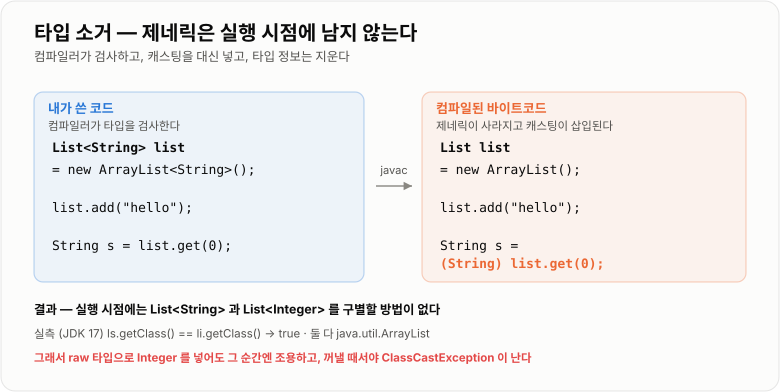
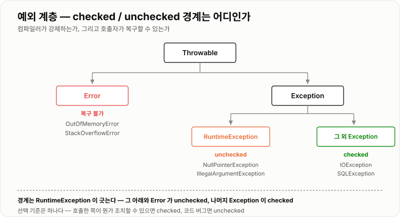
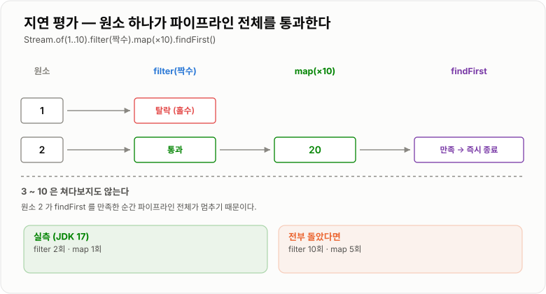

# Generic · Exception · Stream

> **제네릭은 "타입 오류를 실행 전에 잡는 장치", 예외는 "실패를 호출한 쪽에 알리는 장치", 스트림은 "무엇을 할지만 쓰고 어떻게 도는지는 맡기는 장치"다. 셋 다 컴파일러와 런타임에게 일을 떠넘겨 사람이 실수할 자리를 줄인다.**

---

## 1. 핵심 요약

**세 기능 모두 "직접 하지 말고 맡겨라"는 같은 방향이다. 대신 맡긴 대가로 각각 함정이 하나씩 있다 — 제네릭은 실행 시점에 타입이 사라지고, 예외는 `finally`가 예외를 삼킬 수 있고, 스트림은 최종 연산 없이는 아무 일도 하지 않는다.**

### 한눈에 보기

* **제네릭 타입은 실행 시점에 지워진다(타입 소거).** `List<String>`과 `List<Integer>`는 실행 중에 **완전히 같은 클래스**다(실측 `getClass()` 비교 `true`).
* 소거 때문에 **잘못된 타입이 들어가도 넣는 순간에는 조용하고, 꺼낼 때서야 `ClassCastException`** 이 난다(실측 확인).
* 와일드카드는 **PECS**로 외운다. **읽기만 하면 `? extends`(Producer), 쓰기만 하면 `? super`(Consumer)** 다.
* 예외는 **Checked(복구 가능, 컴파일러가 강제)** 와 **Unchecked(프로그래밍 오류)** 로 나뉜다. **`RuntimeException`과 `Error`가 unchecked**다.
* **`finally`에서 `return`하면 예외가 통째로 사라진다.** 예외를 던지는 메서드가 예외 없이 `42`를 반환했다(실측 확인).
* **try-with-resources는 선언의 역순으로 닫고**, 닫다가 난 예외는 **본문 예외를 덮지 않고 `getSuppressed()`에 담긴다**(실측 확인).
* **스트림은 지연 평가(lazy)** 다. 최종 연산이 없으면 **중간 연산은 한 번도 실행되지 않는다**(실측 `filter` 0회).
* 지연 평가 덕분에 원소 10개에서 `findFirst`를 하면 **`filter` 2회, `map` 1회**만 돈다. 전부 돌면 10회·5회였을 것이다(실측).
* **스트림은 `for` 루프보다 느리지 않다.** 1,000만 개 합산에서 `for` **3.9 ms**, `IntStream` **3.6 ms**였다(실측).
* **진짜 비용은 스트림이 아니라 박싱이다.** 100만 개에서 `List<Integer>` 스트림 **1.43 ms** vs `IntStream.range` **0.28 ms**로 **5.1배** 차이가 났다.

> 이 노트의 수치와 동작은 **JDK 17.0.12(6코어)** 에서 직접 실행해 확인했다. 성능 수치는 5회 반복 중 최솟값이다.

### 무엇을 해결하는가

#### 제네릭이 없을 때

Java 5 이전에는 컬렉션에 아무거나 들어갔다.

```java
List list = new ArrayList();
list.add("hello");
list.add(42);                        // 컴파일 통과

String s = (String) list.get(0);     // 꺼낼 때마다 캐스팅
String t = (String) list.get(1);     // 실행하면 ClassCastException
```

문제는 두 가지였다.

```text
① 꺼낼 때마다 사람이 직접 형변환한다          → 코드가 지저분하다
② 잘못 넣어도 컴파일러가 모른다                → 실행 중에 터진다

  "이 리스트에는 String만 들어간다"는 것이
  주석이나 개발자의 기억에만 있었다
```

제네릭은 **그 약속을 타입으로 적어서 컴파일러가 검사하게** 만든다.

```java
List<String> list = new ArrayList<String>();
list.add("hello");
list.add(42);            // 컴파일 에러 — 실행 전에 잡힌다
String s = list.get(0);  // 캐스팅 불필요
```

#### 예외가 없을 때

예외가 없으면 실패를 **반환값**으로 알려야 한다.

```java
// C 스타일 — 실패를 특별한 값으로 표현한다
int result = parseAge(input);
if (result == -1) {          // 검사를 잊으면?
    // 오류 처리
}
```

```text
① 호출하는 쪽이 검사를 빠뜨리면 잘못된 값이 그대로 흘러간다
② 정상 값과 오류 값이 같은 타입에 섞인다 (-1이 진짜 나이일 수도 있다)
③ 오류 원인을 하나의 int 에 담을 수 없다
④ 깊은 호출에서 난 오류를 위로 전달하려면 층층이 검사해야 한다
```

예외는 **정상 흐름과 실패 흐름을 문법으로 분리하고, 처리할 수 있는 곳까지 자동으로 올려 보낸다.**

#### 스트림이 없을 때

```java
// "활성 사용자의 이름을 대문자로 모아라"
List<String> result = new ArrayList<String>();
for (User u : users) {
    if (u.isActive()) {
        result.add(u.getName().toUpperCase());
    }
}
```

읽으려면 **머릿속으로 루프를 돌려야 한다.** 무엇을 하려는지(의도)가 어떻게 도는지(구현)에 묻혀 있다.

```java
List<String> result = users.stream()
        .filter(User::isActive)
        .map(u -> u.getName().toUpperCase())
        .collect(Collectors.toList());
```

**"거른다 → 바꾼다 → 모은다"가 그대로 읽힌다.** 순회 방식은 라이브러리에 맡긴다.

---

## 2. 동작 원리

### 핵심 구성 요소

| 개념                   | 한 문장 정의                                   | 왜 중요한가                              |
| -------------------- | ----------------------------------------- | ----------------------------------- |
| **제네릭**              | 타입을 매개변수로 받아 컴파일 시점에 검사하게 하는 문법          | 실행 중 `ClassCastException`을 컴파일 오류로 옮긴다 |
| **타입 소거**            | 컴파일이 끝나면 제네릭 타입 정보가 지워지는 것                | **제네릭의 거의 모든 제약이 여기서 나온다**          |
| **와일드카드 `?`**        | "어떤 타입인지는 모르지만 하나로 정해져 있다"                | 상속 관계를 제네릭에 반영하려면 필요하다              |
| **PECS**             | Producer는 `extends`, Consumer는 `super`    | 와일드카드 방향을 정하는 유일한 기준                |
| **Checked Exception** | 컴파일러가 처리를 강제하는 예외                         | 복구 가능한 실패를 놓치지 않게 한다                |
| **Unchecked Exception** | `RuntimeException`·`Error` 계열             | 대부분 **코드 버그**라 잡는 게 아니라 고쳐야 한다      |
| **try-with-resources** | `AutoCloseable`을 자동으로 닫는 문법               | `finally`에서 닫다 나는 예외 문제를 없앤다        |
| **suppressed 예외**    | 닫다가 난 예외를 본문 예외에 첨부하는 것                   | 원래 원인이 가려지는 것을 막는다                  |
| **스트림**              | 원소의 흐름에 연산을 이어 붙이는 파이프라인                  | 의도만 쓰고 순회는 맡긴다                      |
| **중간 연산 / 최종 연산**    | `filter`·`map`은 중간, `collect`·`sum`은 최종   | **최종 연산이 없으면 아무것도 실행되지 않는다**        |
| **지연 평가**            | 최종 연산이 요구할 때만 원소를 흘려보내는 것                 | 필요한 만큼만 계산해서 빠르다                    |
| **박싱**               | `int`를 `Integer` 객체로 감싸는 것                | **스트림 성능 논쟁의 진짜 원인**               |

### 내부 동작 과정

#### 타입 소거 — 제네릭은 실행 시점에 사라진다

이것 하나를 이해하면 제네릭의 제약이 전부 설명된다.

```text
내가 쓴 코드                        컴파일 후 실제 바이트코드

List<String> list                   List list
    = new ArrayList<String>();          = new ArrayList();

list.add("hello");                  list.add("hello");

String s = list.get(0);             String s = (String) list.get(0);
                                                 └────┬────┘
                                          컴파일러가 캐스팅을 대신 넣어 준다
```

**제네릭은 컴파일러를 위한 표시일 뿐, 실행할 때는 남지 않는다.**



*내가 안 쓴 캐스팅을 컴파일러가 넣어 준 것뿐이다 — 그래서 실행 중에는 타입 정보가 없다.*

**실측으로 확인한 결과**

```text
List<String>  ls = new ArrayList<String>();
List<Integer> li = new ArrayList<Integer>();

  ls.getClass() == li.getClass()   →  true
  둘 다 java.util.ArrayList

  실행 시점에는 구별할 방법이 아예 없다
```

소거의 결과로 이런 일이 벌어진다.

```java
List raw = ls;        // 제네릭을 뗀 raw 타입
raw.add(42);          // 컴파일 경고만, 실행은 성공

ls.size();            // 1 — String 리스트에 Integer 가 들어갔다
String s = ls.get(0); // 여기서야 ClassCastException
```

**넣는 순간에는 조용하고 꺼낼 때 터진다.** 원인 지점과 발현 지점이 떨어져 있어 디버깅이 어렵다.

**소거 때문에 못 하는 것들**

```text
new T()                    → T가 무엇인지 실행 시점에 모른다
new T[10]                  → 배열은 실행 시점에 원소 타입을 알아야 한다
obj instanceof List<String> → List까지만 확인 가능
static T field             → static은 인스턴스와 무관한데 T는 인스턴스마다 다르다
catch (MyException<T> e)    → 실행 시점에 어느 T인지 구분 못 한다
```

#### 와일드카드 — PECS

제네릭에는 직관과 어긋나는 규칙이 하나 있다.

```java
List<Integer> ints = new ArrayList<Integer>();
List<Number> nums = ints;   // 컴파일 에러!  Integer는 Number인데도
```

**왜 막는가?** 허용했다면 이런 일이 가능해진다.

```text
List<Number> nums = ints;   // 만약 허용된다면
nums.add(3.14);             // Double 을 넣는다 — Number 니까 문법상 정상
Integer i = ints.get(0);    // ints 는 같은 리스트다 → ClassCastException!

  → 제네릭의 존재 이유(실행 중 타입 오류 방지)가 무너진다
  → 그래서 애초에 막는다
```

하지만 이러면 "숫자 리스트면 뭐든 받는 메서드"를 못 만든다. 그 해법이 와일드카드다.

```text
? extends Number    "Number 이거나 그 자식" — 꺼내기만 한다 (Producer)
? super Integer     "Integer 이거나 그 부모" — 넣기만 한다 (Consumer)
```

**왜 각각 한쪽만 되는가**

```text
List<? extends Number> list
    실제로 List<Integer> 일 수도, List<Double> 일 수도 있다
    → 무엇을 넣어도 틀릴 수 있으므로 add 금지
    → 꺼내면 최소한 Number 인 것은 확실하므로 읽기는 허용

List<? super Integer> list
    실제로 List<Integer>, List<Number>, List<Object> 중 하나다
    → 어느 쪽이든 Integer 는 넣을 수 있으므로 add 허용
    → 꺼내면 무엇인지 모르므로 Object 로만 읽힌다
```

**PECS = Producer-Extends, Consumer-Super.** 데이터를 **주는(읽는) 쪽이면 `extends`**, **받는(쓰는) 쪽이면 `super`** 다.

```java
// src 에서 읽어서(Producer) dest 에 쓴다(Consumer)
public static <T> void copy(List<? super T> dest, List<? extends T> src) {
    for (int i = 0; i < src.size(); i++) {
        dest.set(i, src.get(i));
    }
}
```

#### 예외 계층과 checked / unchecked

```text
                    Throwable
                        │
          ┌─────────────┴─────────────┐
          │                           │
        Error                     Exception
    (복구 불가)                        │
    OutOfMemoryError      ┌───────────┴────────────┐
    StackOverflowError    │                        │
                    RuntimeException        그 외 Exception
                     (unchecked)              (checked)
                          │                        │
              NullPointerException          IOException
              IllegalArgumentException      SQLException
              ClassCastException            InterruptedException
```



*경계는 `RuntimeException`이 긋는다 — 그 아래와 `Error`가 unchecked, 나머지 `Exception`이 checked다.*

| 구분            | Checked                   | Unchecked                    |
| ------------- | ------------------------- | ---------------------------- |
| 컴파일러가         | `throws` 또는 `try-catch` 강제 | 아무것도 강제하지 않음                 |
| 의미            | **호출자가 복구할 수 있는 실패**      | **프로그래밍 오류 또는 복구 불가**        |
| 예             | 파일 없음, 네트워크 끊김            | `null` 참조, 인덱스 초과, 잘못된 인자    |
| 대처            | 재시도·대체 경로·사용자 안내          | **잡는 게 아니라 코드를 고친다**         |

#### try-with-resources — 닫는 순서와 suppressed

`finally`로 자원을 닫으면 문제가 생긴다.

```java
// 옛날 방식 — 위험하다
Res a = null;
try {
    a = new Res("A");
    throw new RuntimeException("본문 예외");
} finally {
    a.close();      // close 가 예외를 던지면?
}
```

```text
본문에서 "본문 예외" 발생
   ↓
finally 에서 close() 가 "close 실패" 예외 발생
   ↓
close 의 예외가 본문 예외를 덮어쓴다
   ↓
진짜 원인("본문 예외")이 영원히 사라진다
```

try-with-resources는 이 문제를 해결한다.

```java
try (Res a = new Res("A"); Res b = new Res("B")) {
    throw new RuntimeException("본문 예외");
}
```

**실측 출력**

```text
열림: A
열림: B
닫힘: B          ← 선언의 역순으로 닫는다
닫힘: A

잡힌 예외: 본문 예외              ← 본문 예외가 살아남았다
suppressed: close 실패: B         ← 닫다 난 예외는 첨부된다
suppressed: close 실패: A
```

**역순으로 닫는 이유**는 뒤에 만든 것이 앞의 것에 의존할 수 있기 때문이다. `Connection`을 열고 그 위에 `Statement`를 열었다면 `Statement`를 먼저 닫아야 한다.

#### 스트림 — 지연 평가

스트림의 연산은 **두 종류**다.

```text
중간 연산 (intermediate)   filter, map, sorted, distinct, limit ...
    → Stream 을 반환한다
    → 호출해도 아무 일도 일어나지 않는다. 계획만 쌓인다.

최종 연산 (terminal)       collect, forEach, sum, findFirst, count ...
    → Stream 이 아닌 것을 반환한다
    → 이때 비로소 전체 파이프라인이 실행된다
```

**실측 ①: 최종 연산이 없으면 아무것도 안 한다**

```java
int[] count = {0};
Stream.of(1, 2, 3).filter(n -> { count[0]++; return true; });
// count[0] = 0     ← filter 가 한 번도 실행되지 않았다
```

**실측 ②: 필요한 만큼만 돈다**

```java
Stream.of(1,2,3,4,5,6,7,8,9,10)
      .filter(n -> { filterCount++; return n % 2 == 0; })
      .map(n -> { mapCount++; return n * 10; })
      .findFirst();
```

```text
결과 = 20
filter 호출 2회, map 호출 1회

  전부 다 돌았다면 filter 10회, map 5회였을 것이다
```

**왜 2회·1회인가** — 원소 하나가 파이프라인 전체를 통과한 뒤 다음 원소가 들어가기 때문이다.

```text
원소 1 → filter(1) 홀수, 탈락                      (filter 1회)
원소 2 → filter(2) 통과 → map(2)=20 → findFirst 만족!  (filter 2회, map 1회)
   ↓
여기서 즉시 멈춘다. 3~10은 쳐다보지도 않는다.
```



*단계별로 전부 처리하는 것이 아니라 원소 단위로 흐른다 — 그래서 조기 종료가 가능하다.*

이것이 **무한 스트림이 동작하는 이유**이기도 하다.

```java
Stream.iterate(1, n -> n + 1)   // 무한
      .filter(n -> n % 7 == 0)
      .limit(3)                  // 3개만 필요하다
      .collect(Collectors.toList());   // [7, 14, 21]
```

---

## 3. 특징과 비교

| 구분          | 내용                                       |
| ----------- | ---------------------------------------- |
| **장점**      | 제네릭은 **실행 중 타입 오류를 컴파일 오류로** 옮기고 캐스팅을 없앤다. 예외는 정상 흐름과 실패 흐름을 분리해 처리 지점까지 자동 전파한다. 스트림은 의도를 그대로 읽히게 쓰고 **필요한 만큼만 계산**한다. |
| **단점**      | 제네릭은 **소거 때문에 실행 시점에 타입이 없어** `new T()`·`new T[]`가 안 되고 raw 타입으로 뚫린다. 예외는 `finally`의 `return`이 예외를 삼키고 남용하면 흐름이 숨는다. 스트림은 디버깅과 스택트레이스가 불친절하고 **박싱 비용**이 붙는다. |
| **적합한 상황**  | 제네릭은 컬렉션·유틸리티 등 **타입만 다른 같은 로직**. 예외는 호출자가 복구할 수 있는 실패. 스트림은 **거르고 변환해 모으는** 데이터 가공. |
| **주의할 상황**  | 제네릭 배열, 반복 횟수가 적은데 스트림으로 감싸는 것, **정상 흐름 제어에 예외를 쓰는 것**, `finally`에서 `return`·`throw`하는 것. |

### 성능 특성

#### 스트림은 정말 for 루프보다 느린가

가장 흔한 오해다. **1,000만 개 `int` 합산 실측**(5회 중 최솟값).

| 방식                       | 시간          | 비고                    |
| ------------------------ | ----------- | --------------------- |
| `for` 루프                 | **3.9 ms**  | 기준                    |
| `IntStream`              | **3.6 ms**  | **오히려 근소하게 빠르다**      |
| `IntStream.parallel()`   | **1.8 ms**  | 6코어에서 약 2.2배          |

**결론: 기본형 스트림은 `for`와 사실상 같다.** JIT가 파이프라인을 인라인해서 루프와 거의 같은 코드로 만든다.

#### 진짜 비용은 박싱이다

**100만 개 실측**

| 방식                            | 시간           | 배수         |
| ----------------------------- | ------------ | ---------- |
| `IntStream.range(0, n).sum()` | **0.28 ms**  | 기준         |
| `List<Integer>.stream()...`   | **1.43 ms**  | **5.1배 느림** |

```text
List<Integer> 는 원소마다 Integer 객체가 하나씩 있다
   → 값을 꺼낼 때마다 언박싱
   → 객체가 메모리에 흩어져 있어 캐시 미스
   → 5.1배 차이의 대부분이 여기서 나온다

  느린 것은 "스트림"이 아니라 "박싱"이다
```

**그래서 `IntStream`·`LongStream`·`DoubleStream`이 따로 있다.** 기본형을 다룰 때는 `Stream<Integer>` 대신 이쪽을 쓴다.

```java
list.stream().mapToInt(Integer::intValue).sum();   // 박싱 해제
IntStream.range(0, n).sum();                       // 애초에 박싱 없음
```

#### 병렬 스트림은 언제 이득인가

```text
1,000만 개 합산   순차 3.6 ms → 병렬 1.8 ms   (2.2배, 6코어)

  6코어인데 왜 6배가 아닌가?
    · 작업을 쪼개고 합치는 비용
    · 메모리 대역폭이 한계 (단순 덧셈은 CPU가 아니라 메모리가 병목)
    · 공용 ForkJoinPool 을 다른 작업과 나눠 쓴다
```

**병렬 스트림이 손해인 경우**

```text
원소 수가 적다 (수천 이하)      → 쪼개는 비용이 더 크다
원소당 작업이 매우 가볍다        → 오버헤드가 상대적으로 커진다
분할이 어려운 소스              → LinkedList, Stream.iterate
안에서 I/O 를 한다              → 공용 풀을 막아 다른 병렬 작업까지 멈춘다
순서가 중요하다                 → forEachOrdered 로 이득이 사라진다
```

**웹 애플리케이션에서는 병렬 스트림을 기본으로 쓰지 않는다.** 이미 요청마다 스레드가 따로 도는데, 그 안에서 다시 공용 풀을 나눠 쓰면 서로를 막는다.

#### 예외의 비용

```text
예외 객체 생성 자체는 싸지 않다
   → 대부분의 비용이 스택트레이스 수집(fillInStackTrace)

  정상 흐름에 예외를 쓰면
    · 초당 수만 번 스택을 뜨게 된다
    · 반복문 종료 조건 등에 쓰면 눈에 띄게 느려진다

  → 예외는 "예외적인 상황"에만 쓴다는 원칙이 성능 근거도 갖는다
```

### 장점과 단점

| 장점                        | 이유                                       |
| ------------------------- | ---------------------------------------- |
| 타입 오류를 실행 전에 잡는다          | 컴파일러가 검사하므로 `ClassCastException`이 사라진다.  |
| 캐스팅 코드가 사라진다              | 컴파일러가 대신 넣어 준다.                          |
| 실패 처리를 강제할 수 있다           | Checked 예외는 컴파일러가 놓치지 못하게 만든다.           |
| 원인이 스택트레이스에 남는다           | 어디서 무엇이 실패했는지 추적할 수 있다.                  |
| 자원 해제를 잊을 수 없다            | try-with-resources가 역순으로 자동 처리한다.        |
| 의도가 그대로 읽힌다               | `filter → map → collect`가 문장처럼 읽힌다.      |
| 필요한 만큼만 계산한다              | 지연 평가로 원소 10개 중 2개만 보고 끝냈다(실측).          |
| 병렬화가 한 줄이다                | `.parallel()`만 붙이면 된다(적합할 때).            |

| 단점                        | 이유 및 주의점                                 |
| ------------------------- | ---------------------------------------- |
| 실행 시점에 타입 정보가 없다          | `new T()`, `new T[]`, `instanceof List<String>` 전부 불가. |
| raw 타입으로 뚫린다              | 경고만 나고 컴파일된다. **꺼낼 때서야** `ClassCastException`(실측). |
| **`finally`의 `return`이 예외를 삼킨다** | 예외를 던지는 메서드가 조용히 `42`를 반환했다(실측).         |
| 예외를 남용하면 흐름이 숨는다          | `catch (Exception e) {}` 는 원인을 통째로 지운다.  |
| 스트림 디버깅이 어렵다              | 중단점을 걸 자리가 마땅치 않고 스택트레이스가 길다.           |
| **박싱 비용이 크다**             | `List<Integer>` 스트림이 `IntStream`보다 5.1배 느렸다(실측). |
| 병렬 스트림이 오히려 느릴 수 있다       | 원소가 적거나 I/O가 섞이면 손해다. 공용 풀을 공유한다.        |
| 최종 연산을 빠뜨리면 아무 일도 안 난다    | 예외도 경고도 없이 그냥 실행되지 않는다(실측 `filter` 0회).  |

### 어떤 상황에서 고르는가

#### 예외를 고르는 흐름

```text
실패가 발생했다
│
├─ 호출한 쪽이 뭔가 조치할 수 있는가?
│   ├─ 예 → Checked (또는 명시적으로 문서화된 Unchecked)
│   │        예: 파일 없음 → 기본값 사용 / 네트워크 실패 → 재시도
│   │
│   └─ 아니오 → Unchecked
│              예: null 참조, 잘못된 인자, 있을 수 없는 상태
│
└─ 값이 없는 것이 "정상"인가?
    └─ 예외가 아니라 Optional 이나 빈 컬렉션을 반환한다
```

**"조회 결과가 없다"는 예외가 아니다.** 흔한 실수다.

#### 반복문과 스트림 중 무엇을 쓸까

```text
단순 순회이고 원소가 적다              → for
인덱스가 필요하다                      → for
중간에 break / continue 가 필요하다     → for (스트림은 어색해진다)
루프 안에서 checked 예외를 던진다        → for (람다에서 처리가 지저분해진다)
거르고 · 바꾸고 · 모은다                → 스트림
그룹으로 묶는다 (groupingBy)           → 스트림 (for로 쓰면 훨씬 길다)
무한 시퀀스에서 앞의 몇 개만             → 스트림 (지연 평가)
```

#### 언제 병렬 스트림을 쓰는가

```text
전부 만족할 때만 쓴다

  1. 원소가 최소 수만 개 이상
  2. 원소당 계산이 무겁다
  3. 소스가 쪼개기 쉽다 (배열, ArrayList, IntStream.range)
  4. 안에서 I/O 나 락을 쓰지 않는다
  5. 실제로 재 봤더니 빨라졌다   ← 이게 가장 중요하다
```

### 비슷한 기술과 비교

#### Checked vs Unchecked Exception

| 기준         | Checked Exception     | Unchecked Exception       |
| ---------- | --------------------- | ------------------------- |
| **동작 방식**  | 컴파일러가 처리를 강제          | 아무 강제 없음                  |
| **대표 클래스** | `IOException`, `SQLException` | `RuntimeException` 하위, `Error` |
| **장점**     | 실패 가능성을 놓칠 수 없다       | 코드가 깔끔하고 전파가 자유롭다         |
| **단점**     | `throws`가 전염되고 의미 없는 `try-catch`를 유발 | 문서를 안 보면 어떤 실패가 나는지 모른다   |
| **선택 기준**  | **호출자가 복구할 수 있을 때**   | **프로그래밍 오류이거나 복구 불가일 때**  |

실무에서는 **checked 예외를 잡아서 unchecked로 감싸 올리는 방식**을 많이 쓴다. Spring의 `DataAccessException`이 정확히 이 방식이다(`SQLException`을 감싼다).

#### `Optional` vs `null` vs 예외

| 기준        | `null` 반환          | `Optional` 반환         | 예외 던지기            |
| --------- | ------------------ | --------------------- | ----------------- |
| **의미**    | 값이 없음 (이유 불명)      | **값이 없을 수 있음을 타입으로 표시** | 실패했음              |
| **강제성**   | 검사를 잊어도 컴파일된다      | 꺼내려면 확인해야 한다          | 잡거나 전파해야 한다       |
| **장점**    | 가장 가볍다             | NPE를 구조적으로 줄인다        | 원인과 스택이 남는다       |
| **단점**    | **NPE의 근원**        | 객체 하나가 더 생기고 남용하면 장황  | 비용이 크고 흐름이 숨는다    |
| **선택 기준** | 내부 코드에서 성능이 극히 중요할 때 | **조회 결과가 없을 수 있는 반환값** | **정말 예외적인 실패**    |

**`Optional`을 쓰면 안 되는 자리**

```text
필드              → 직렬화가 안 되고 메모리만 늘어난다
메서드 매개변수     → 호출부가 Optional.of(...) 로 지저분해진다
컬렉션 반환        → 빈 컬렉션을 반환하면 된다. Optional<List> 는 이중 검사다

  Optional 은 "반환값" 자리를 위해 만들어졌다
```

#### 스트림 vs 반복문

| 기준        | 반복문 (`for`)       | 스트림                    |
| --------- | ----------------- | ---------------------- |
| **동작 방식** | 내가 직접 돈다 (외부 반복)  | 라이브러리가 돈다 (내부 반복)      |
| **성능**    | 기준 (3.9 ms)       | **거의 같다 (3.6 ms, 실측)** |
| **가독성**   | 단순 반복은 명확         | **가공 파이프라인에서 압도적**     |
| **중단**    | `break` 자유        | `findFirst`·`anyMatch`로만 |
| **디버깅**   | 중단점이 자연스럽다        | 어렵고 스택트레이스가 길다         |
| **병렬화**   | 직접 구현해야 한다        | `.parallel()` 한 줄      |
| **선택 기준** | 단순 순회·인덱스 필요·중단 필요 | **거르고 변환하고 모을 때**      |

#### 제네릭 vs `Object` vs 배열

| 기준         | 제네릭 `List<T>`  | `Object` 사용        | 배열 `T[]`         |
| ---------- | -------------- | ------------------ | ---------------- |
| **타입 검사**  | **컴파일 시점**     | 없음 (실행 중 캐스팅)      | **실행 시점**        |
| **잘못 넣으면** | 컴파일 에러         | 꺼낼 때 `ClassCastException` | 넣을 때 `ArrayStoreException` |
| **공변성**    | 불공변 (`List<Integer>` ≠ `List<Number>`) | —                  | **공변** (`Integer[]`는 `Number[]`) |
| **선택 기준**  | **거의 항상 이것**   | 레거시 호환             | 성능이 극히 중요하고 기본형일 때 |

배열이 공변인 것은 Java의 오래된 설계 실수로 평가된다. **배열은 실행 중에 오류를 내고, 제네릭은 컴파일 중에 낸다** — 이것이 "배열보다 리스트를 쓰라"는 조언의 근거다.

---

## 4. 실무 주의사항

### 백엔드 실무 적용

#### 예외를 계층별로 어떻게 다룰까

```text
Repository   기술 예외(SQLException)를 도메인 예외로 감싼다
     ↓
Service      비즈니스 규칙 위반은 직접 정의한 예외를 던진다
     ↓
Controller   여기서는 잡지 않는다 (throws 그대로)
     ↓
@RestControllerAdvice   한곳에서 HTTP 응답으로 변환한다
```

```java
// 도메인 예외 — 무엇이 잘못됐는지 이름으로 드러낸다
public class InsufficientStockException extends RuntimeException {

    private final long productId;
    private final int requested;
    private final int available;

    public InsufficientStockException(long productId, int requested, int available) {
        super("재고 부족: productId=" + productId
                + ", 요청=" + requested + ", 재고=" + available);
        this.productId = productId;
        this.requested = requested;
        this.available = available;
    }

    public long getProductId() { return productId; }
    public int getRequested()  { return requested; }
    public int getAvailable()  { return available; }
}
```

```java
@RestControllerAdvice
public class GlobalExceptionHandler {

    private static final Logger log =
            LoggerFactory.getLogger(GlobalExceptionHandler.class);

    @ExceptionHandler(InsufficientStockException.class)
    public ResponseEntity<ErrorResponse> handleStock(InsufficientStockException e) {
        // 예상된 실패다 — 스택트레이스까지 남길 필요는 없다
        log.warn("재고 부족: {}", e.getMessage());
        return ResponseEntity.status(HttpStatus.CONFLICT)
                .body(new ErrorResponse("OUT_OF_STOCK", e.getMessage()));
    }

    @ExceptionHandler(Exception.class)
    public ResponseEntity<ErrorResponse> handleUnexpected(Exception e) {
        // 예상 못 한 실패다 — 스택트레이스를 반드시 남긴다
        log.error("처리되지 않은 예외", e);
        return ResponseEntity.status(HttpStatus.INTERNAL_SERVER_ERROR)
                .body(new ErrorResponse("INTERNAL_ERROR", "잠시 후 다시 시도해 주세요."));
    }
}
```

**두 가지가 핵심이다.**

```text
① 예상된 실패와 예상 못 한 실패의 로그 레벨을 나눈다
   재고 부족을 error 로 찍으면 진짜 장애가 묻힌다

② 내부 예외 메시지를 그대로 클라이언트에 주지 않는다
   SQL 문이나 테이블 이름이 노출된다
```

#### `@Transactional`과 예외의 관계

이 규칙을 모르면 **롤백이 안 되는 사고**가 난다.

```text
기본 동작
    RuntimeException / Error  →  롤백된다
    Checked Exception         →  롤백되지 않는다!  커밋된다

  왜?  checked 는 "예상하고 처리한 상황"이라고 보기 때문이다
```

```java
@Transactional(rollbackFor = Exception.class)   // checked도 롤백하려면 명시
public void process() throws IOException {
    ...
}
```

**더 위험한 경우**

```java
@Transactional
public void order() {
    try {
        paymentService.pay();      // 여기서 예외 발생
    } catch (Exception e) {
        log.error("결제 실패", e);   // 잡아서 로그만 남기면
    }
    // 예외가 밖으로 안 나갔으므로 트랜잭션이 커밋된다
}
```

#### 스트림을 실무에서 쓰는 지점

```java
// 주문 목록을 상태별로 묶고 각 금액 합계를 낸다
Map<OrderStatus, Long> totalByStatus = orders.stream()
        .collect(Collectors.groupingBy(
                Order::getStatus,
                Collectors.summingLong(Order::getAmount)));
```

같은 것을 `for`로 쓰면 `Map`을 만들고 `getOrDefault`로 누적하는 코드가 필요하다. **`groupingBy`는 스트림의 가장 확실한 승리 지점이다.**

```java
// N+1을 피하려고 ID를 모아 한 번에 조회한다
List<Long> ids = orders.stream()
        .map(Order::getUserId)
        .distinct()
        .collect(Collectors.toList());

Map<Long, User> userMap = userRepository.findAllById(ids).stream()
        .collect(Collectors.toMap(User::getId, Function.identity()));
```

**`Collectors.toMap`의 함정** — 키가 중복되면 `IllegalStateException`이 난다.

```java
// 중복 시 나중 값으로 덮어쓴다
.collect(Collectors.toMap(User::getId, Function.identity(), (a, b) -> b));
```

#### 제네릭으로 공통 응답을 만든다

```java
public class ApiResponse<T> {

    private final boolean success;
    private final T data;
    private final String message;

    private ApiResponse(boolean success, T data, String message) {
        this.success = success;
        this.data = data;
        this.message = message;
    }

    public static <T> ApiResponse<T> ok(T data) {
        return new ApiResponse<T>(true, data, null);
    }

    public static <T> ApiResponse<T> fail(String message) {
        return new ApiResponse<T>(false, null, message);
    }

    public boolean isSuccess()  { return success; }
    public T getData()          { return data; }
    public String getMessage()  { return message; }
}
```

```java
ApiResponse<UserDto> response = ApiResponse.ok(userDto);
// 받는 쪽이 캐스팅 없이 UserDto 를 그대로 쓴다
```

### 자주 하는 오해

| 잘못된 이해                                | 올바른 이해                                                            |
| ------------------------------------- | ----------------------------------------------------------------- |
| `List<String>`과 `List<Integer>`는 다른 클래스다 | **실행 시점에는 완전히 같다.** `getClass()` 비교가 `true`다(실측). 타입 소거 때문이다.      |
| 제네릭을 쓰면 실행 중 타입 오류가 없다                | raw 타입으로 뚫린다. **넣을 때는 조용하고 꺼낼 때 `ClassCastException`** 이 난다(실측).   |
| `List<Integer>`는 `List<Number>`에 넣을 수 있다 | **불공변이라 안 된다.** 허용하면 `Double`을 넣어 타입 안전성이 무너진다. 와일드카드로 푼다.        |
| 스트림은 `for`보다 느리다                      | **거의 같다.** 1,000만 합산에서 `for` 3.9 ms, `IntStream` 3.6 ms(실측). 느린 건 박싱이다. |
| 병렬 스트림을 쓰면 코어 수만큼 빨라진다                | 6코어에서 **2.2배**였다(실측). 분할·병합 비용과 메모리 대역폭이 한계다.                     |
| 중간 연산을 호출하면 바로 실행된다                   | **최종 연산이 없으면 한 번도 실행되지 않는다.** 실측에서 `filter` 호출이 0회였다.             |
| `finally`는 무조건 안전하다                   | **`finally`의 `return`이 예외를 통째로 삼킨다.** 예외를 던진 메서드가 `42`를 반환했다(실측).  |
| 자원은 `finally`에서 닫으면 된다                | 닫다 난 예외가 **본문 예외를 덮어쓴다.** try-with-resources는 `getSuppressed()`에 담는다. |
| 예외를 잡으면 트랜잭션이 롤백된다                    | **잡으면 롤백되지 않는다.** 또 checked 예외는 기본적으로 롤백 대상이 아니다.                 |
| `Optional`은 어디에나 쓰면 좋다                | **반환값 자리를 위한 것**이다. 필드·매개변수·컬렉션 반환에는 쓰지 않는다.                      |
| `Optional.of(null)`은 빈 Optional을 준다   | **`NullPointerException`이 난다**(실측). 빈 것이 필요하면 `ofNullable`이다.      |

### 스트림에서 자주 나는 사고

#### 스트림은 한 번만 쓸 수 있다

```java
Stream<String> stream = list.stream();
stream.filter(s -> s.length() > 3).count();
stream.map(String::toUpperCase).count();   // IllegalStateException
```

```text
stream has already been operated upon or closed

  → 최종 연산을 하면 스트림은 소비된다
  → 다시 쓰려면 list.stream() 을 새로 만든다
```

#### 람다 안에서 지역 변수를 바꿀 수 없다

```java
int sum = 0;
list.forEach(n -> sum += n);   // 컴파일 에러: effectively final 이어야 한다
```

```text
람다는 지역 변수의 "값을 복사"해서 가져간다
   → 원본을 바꿔도 반영되지 않으므로 아예 금지한다

  해결: reduce 나 mapToInt().sum() 을 쓴다
        굳이 필요하면 AtomicInteger 를 쓴다 (권장하지 않는다)
```

#### `peek`는 디버깅 전용이다

```java
list.stream().peek(System.out::println).collect(toList());
```

`peek`는 중간 연산이라 **최종 연산이 없으면 실행되지 않고**, 구현에 따라 건너뛸 수도 있다. **로직을 `peek` 안에 넣으면 안 된다.**

---

## 5. 예제

### 제네릭 — 타입 안전한 캐시

```java
import java.util.HashMap;
import java.util.Map;

public class TypedCache {

    private final Map<Class<?>, Object> store = new HashMap<Class<?>, Object>();

    /** 타입을 키로 써서 넣는다. */
    public <T> void put(Class<T> type, T value) {
        store.put(type, value);
    }

    /**
     * 꺼낼 때 캐스팅을 여기 한곳에 가둔다.
     * put 에서 Class<T> 와 T 를 함께 받았으므로 이 캐스팅은 안전하다.
     */
    public <T> T get(Class<T> type) {
        return type.cast(store.get(type));   // (T) 캐스팅 대신 cast()
    }
}
```

```java
TypedCache cache = new TypedCache();
cache.put(String.class, "hello");
cache.put(Integer.class, 42);

String s = cache.get(String.class);    // 캐스팅 불필요
Integer i = cache.get(Integer.class);
```

`type.cast()`를 쓰면 잘못된 타입일 때 **그 자리에서** `ClassCastException`이 난다. `(T)` 캐스팅은 소거되어 아무 검사도 하지 않으므로 나중에 엉뚱한 곳에서 터진다.

### 제네릭 — PECS를 지키는 메서드

```java
import java.util.Collection;
import java.util.List;

public class Numbers {

    /**
     * src 에서 읽기만 한다 → Producer → extends
     * 그래서 List<Integer>, List<Double> 을 모두 받을 수 있다.
     */
    public static double sum(Collection<? extends Number> src) {
        double total = 0;
        for (Number n : src) {
            total += n.doubleValue();
        }
        return total;
    }

    /**
     * dest 에 쓰기만 한다 → Consumer → super
     * List<Integer>, List<Number>, List<Object> 를 모두 받을 수 있다.
     */
    public static void fill(Collection<? super Integer> dest, int count) {
        for (int i = 0; i < count; i++) {
            dest.add(i);
        }
    }
}
```

```java
List<Integer> ints = List.of(1, 2, 3);
List<Double> doubles = List.of(1.5, 2.5);

Numbers.sum(ints);      // 둘 다 된다
Numbers.sum(doubles);

List<Number> nums = new ArrayList<Number>();
Numbers.fill(nums, 3);  // Number 는 Integer 의 부모라 가능
```

### 예외 — 안전한 자원 처리와 재시도

```java
import java.sql.Connection;
import java.sql.PreparedStatement;
import java.sql.ResultSet;
import java.sql.SQLException;
import javax.sql.DataSource;

public class UserJdbcRepository {

    private final DataSource dataSource;

    public UserJdbcRepository(DataSource dataSource) {
        this.dataSource = dataSource;
    }

    public String findNameById(long id) {
        String sql = "SELECT name FROM users WHERE id = ?";

        // 선언 역순(rs → ps → conn)으로 자동으로 닫힌다
        try (Connection conn = dataSource.getConnection();
             PreparedStatement ps = conn.prepareStatement(sql)) {

            ps.setLong(1, id);

            try (ResultSet rs = ps.executeQuery()) {
                if (rs.next()) {
                    return rs.getString("name");
                }
                return null;   // 없는 것은 예외가 아니다
            }

        } catch (SQLException e) {
            // 기술 예외를 도메인 예외로 감싼다 — 원인(e)을 반드시 넘긴다
            throw new DataAccessException("사용자 조회 실패: id=" + id, e);
        }
    }
}
```

```java
public class DataAccessException extends RuntimeException {

    public DataAccessException(String message, Throwable cause) {
        super(message, cause);   // cause 를 빠뜨리면 원인 스택이 사라진다
    }
}
```

**`cause`를 넘기는 것이 결정적이다.**

```java
// 나쁜 예 — 원래 원인이 사라진다
catch (SQLException e) {
    throw new DataAccessException("조회 실패");   // e 가 버려졌다
}
```

### 예외 — finally의 함정과 올바른 재시도

```java
public class RetryTemplate {

    /** finally 에서 return 하지 않는다. 예외가 삼켜진다. */
    public <T> T execute(Supplier<T> action, int maxAttempts) {
        RuntimeException lastError = null;

        for (int attempt = 1; attempt <= maxAttempts; attempt++) {
            try {
                return action.get();

            } catch (RuntimeException e) {
                lastError = e;

                if (attempt == maxAttempts) {
                    break;
                }

                // 지수 백오프 — 즉시 재시도하면 상대를 더 밀어붙인다
                sleep(100L * (1L << (attempt - 1)));
            }
        }

        throw new IllegalStateException(
                maxAttempts + "회 재시도 실패", lastError);
    }

    private void sleep(long millis) {
        try {
            Thread.sleep(millis);
        } catch (InterruptedException e) {
            Thread.currentThread().interrupt();   // 인터럽트 상태를 반드시 복원한다
            throw new IllegalStateException("재시도 대기 중 인터럽트", e);
        }
    }
}
```

**`InterruptedException`을 잡으면 반드시 `interrupt()`로 복원한다.** 잡는 순간 인터럽트 플래그가 지워지기 때문에, 복원하지 않으면 상위 코드가 "취소 요청이 있었다"는 사실을 영영 모른다.

### 스트림 — 지연 평가를 활용한 조기 종료

```java
import java.util.List;
import java.util.Optional;

public class OrderFinder {

    /**
     * 조건에 맞는 첫 주문만 찾는다.
     * 지연 평가 덕분에 찾는 순간 멈추고, 뒤쪽 원소는 보지도 않는다.
     */
    public Optional<Order> findFirstExpensive(List<Order> orders, long threshold) {
        return orders.stream()
                .filter(o -> o.getStatus() == OrderStatus.PAID)
                .filter(o -> o.getAmount() >= threshold)
                .findFirst();
    }
}
```

```text
주문 10만 건이 있어도
  조건에 맞는 것이 3번째에 있으면 3건만 검사하고 끝난다

  for 루프에 break 를 건 것과 동일한 동작인데
  조건이 코드에 그대로 드러난다
```

### 스트림 — 실무에서 가장 자주 쓰는 형태

```java
import java.util.*;
import java.util.function.Function;
import java.util.stream.Collectors;

public class OrderStatistics {

    /** 상태별 주문 건수 */
    public Map<OrderStatus, Long> countByStatus(List<Order> orders) {
        return orders.stream()
                .collect(Collectors.groupingBy(
                        Order::getStatus,
                        Collectors.counting()));
    }

    /** 사용자별 총 결제 금액 (결제 완료 건만) */
    public Map<Long, Long> paidAmountByUser(List<Order> orders) {
        return orders.stream()
                .filter(o -> o.getStatus() == OrderStatus.PAID)
                .collect(Collectors.groupingBy(
                        Order::getUserId,
                        Collectors.summingLong(Order::getAmount)));
    }

    /** ID로 빠르게 찾기 위한 맵 — 키 중복 시 나중 값으로 덮어쓴다 */
    public Map<Long, Order> toMapById(List<Order> orders) {
        return orders.stream()
                .collect(Collectors.toMap(
                        Order::getId,
                        Function.identity(),
                        (existing, replacement) -> replacement));
    }

    /** 기본형 스트림으로 박싱을 피한다 */
    public long totalAmount(List<Order> orders) {
        return orders.stream()
                .mapToLong(Order::getAmount)   // Stream<Long> 이 아니라 LongStream
                .sum();
    }
}
```

### 박싱 비용을 눈으로 확인하는 코드

```java
import java.util.*;
import java.util.stream.IntStream;

public class BoxingCost {

    public static void main(String[] args) {
        int n = 1_000_000;

        List<Integer> boxed = new ArrayList<Integer>(n);
        for (int i = 0; i < n; i++) {
            boxed.add(i);
        }

        long best1 = Long.MAX_VALUE;
        long best2 = Long.MAX_VALUE;

        for (int rep = 0; rep < 5; rep++) {          // JIT 워밍업 포함
            long t = System.nanoTime();
            long a = boxed.stream().mapToLong(Integer::longValue).sum();
            best1 = Math.min(best1, System.nanoTime() - t);

            t = System.nanoTime();
            long b = IntStream.range(0, n).asLongStream().sum();
            best2 = Math.min(best2, System.nanoTime() - t);

            if (a != b) {
                throw new IllegalStateException("합이 다르다");
            }
        }

        System.out.printf("List<Integer> 스트림 %.2f ms%n", best1 / 1e6);
        System.out.printf("IntStream.range      %.2f ms%n", best2 / 1e6);
    }
}
```

```text
실측 (JDK 17)
  List<Integer> 스트림 1.43 ms
  IntStream.range      0.28 ms      → 5.1배

  같은 "스트림"인데 5배 차이가 난다
  → 문제는 스트림이 아니라 박싱이다
```

---

## 6. 면접 정리

### 자주 나오는 질문

#### 기본 질문

1. **제네릭을 왜 쓰나요?**

    * 핵심 키워드: 실행 중 `ClassCastException`을 **컴파일 오류로** 옮김, 캐스팅 제거, 의도를 타입으로 표현

2. **타입 소거가 무엇인가요?**

    * 핵심 키워드: 컴파일 후 제네릭 타입 정보가 지워짐, `List<String>`과 `List<Integer>`가 **실행 시점에 같은 클래스**(실측 `true`)

3. **소거 때문에 못 하는 것은 무엇인가요?**

    * 핵심 키워드: `new T()`, `new T[]`, `instanceof List<String>`, `static T` 필드, 제네릭 예외 catch

4. **`List<Integer>`를 `List<Number>` 자리에 넣을 수 있나요?**

    * 핵심 키워드: **불공변이라 불가**, 허용하면 `Double`을 넣어 타입 안전성 붕괴, 와일드카드로 해결

5. **PECS가 무엇인가요?**

    * 핵심 키워드: Producer-Extends / Consumer-Super, **읽기만 하면 `extends`, 쓰기만 하면 `super`**

6. **Checked와 Unchecked 예외의 차이는 무엇인가요?**

    * 핵심 키워드: 컴파일러 강제 여부, `RuntimeException`·`Error`가 unchecked, **복구 가능성**이 기준

7. **try-with-resources는 무엇을 해결하나요?**

    * 핵심 키워드: 자동 close, **선언 역순으로 닫음**, 닫다 난 예외가 본문 예외를 덮지 않고 `getSuppressed()`에 담김

8. **스트림의 중간 연산과 최종 연산은 무엇이 다른가요?**

    * 핵심 키워드: 중간은 `Stream` 반환·계획만 쌓음, 최종은 그때 실행, **최종 연산 없으면 아무것도 안 함**(실측 0회)

#### 꼬리 질문

1. **제네릭을 쓰는데도 `ClassCastException`이 날 수 있나요?**

    * 핵심 키워드: **난다.** raw 타입으로 뚫으면 넣을 때는 조용하고 **꺼낼 때** 터진다(실측)

2. **`List<?>`와 `List<Object>`는 무엇이 다른가요?**

    * 핵심 키워드: `List<?>`는 **어떤 타입인지 모름**이라 `null` 외에 못 넣음, `List<Object>`는 아무거나 넣을 수 있음

3. **스트림이 `for` 루프보다 느리지 않나요?**

    * 핵심 키워드: **거의 같다.** 1,000만 합산 `for` 3.9 ms vs `IntStream` 3.6 ms(실측). 느린 것은 **박싱**(5.1배)

4. **그럼 병렬 스트림은 항상 쓰면 되나요?**

    * 핵심 키워드: 6코어에서 **2.2배**뿐(실측), 분할·병합 비용과 메모리 대역폭 한계, **웹에서는 공용 풀 공유가 위험**

5. **지연 평가가 실제로 어떤 이득을 주나요?**

    * 핵심 키워드: 원소 10개에서 `findFirst` 시 **`filter` 2회·`map` 1회**(실측), 조기 종료, 무한 스트림 가능

6. **`finally`에서 `return`하면 어떻게 되나요?**

    * 핵심 키워드: **예외가 통째로 사라진다.** 예외를 던지는 메서드가 `42`를 반환했다(실측). 절대 쓰지 않는다

7. **자원을 `finally`에서 닫으면 왜 위험한가요?**

    * 핵심 키워드: `close()` 예외가 **본문 예외를 덮어써** 진짜 원인이 사라짐, try-with-resources는 suppressed로 보존

8. **`@Transactional`에서 예외를 잡으면 롤백되나요?**

    * 핵심 키워드: **안 된다.** 예외가 밖으로 안 나가면 커밋됨. 또 **checked 예외는 기본 롤백 대상이 아님**(`rollbackFor` 필요)

9. **`Optional`을 필드에 써도 되나요?**

    * 핵심 키워드: **반환값 전용.** 필드는 직렬화 문제, 매개변수는 호출부가 지저분, 컬렉션은 빈 컬렉션 반환

10. **`Optional.of(null)`은 어떻게 되나요?**

    * 핵심 키워드: **`NullPointerException`**(실측). 빈 것이 필요하면 `ofNullable`

11. **스트림을 두 번 쓰면 어떻게 되나요?**

    * 핵심 키워드: `IllegalStateException`, "already been operated upon or closed", 최종 연산이 소비함

12. **`InterruptedException`을 잡으면 무엇을 해야 하나요?**

    * 핵심 키워드: **`Thread.currentThread().interrupt()`로 복원**, 잡는 순간 플래그가 지워져 상위가 취소를 모름

### 30초 답변

> 셋 다 **직접 하지 말고 컴파일러와 런타임에 맡기라**는 방향입니다. 제네릭은 "이 리스트엔 String만 들어간다"는 약속을 타입으로 적어 **실행 중 오류를 컴파일 오류로** 옮기고, 예외는 정상 흐름과 실패 흐름을 문법으로 분리해 처리할 수 있는 곳까지 자동으로 올려 보내며, 스트림은 순회 방법 대신 **의도만** 쓰게 합니다. 대신 맡긴 대가로 함정이 하나씩 있는데, 제네릭은 실행 시점에 타입이 지워지고 스트림은 최종 연산이 없으면 아무 일도 하지 않습니다.

#### 이어서 더 물으면

제네릭에서 제일 중요한 건 **타입 소거**입니다. 컴파일이 끝나면 타입 정보가 사라져서 `List<String>`과 `List<Integer>`가 실행 시점에 완전히 같은 클래스가 됩니다. 직접 `getClass()`를 비교해 보니 `true`가 나왔습니다. 그래서 `new T()`나 `new T[]`가 안 되고, raw 타입으로 뚫으면 **넣을 때는 조용하다가 꺼낼 때서야 `ClassCastException`** 이 납니다. 원인 지점과 발현 지점이 떨어져 있어서 이게 제일 까다롭습니다. 와일드카드는 PECS로 정리하는데, **읽기만 하면 `extends`, 쓰기만 하면 `super`** 입니다.

예외에서 실무 사고가 제일 많이 나는 지점은 두 군데입니다. 하나는 **`finally`에서 `return`하면 예외가 통째로 사라지는 것**입니다. 예외를 던지는 메서드가 예외 없이 `42`를 반환하는 걸 직접 확인했습니다. 다른 하나는 **`@Transactional`인데 롤백이 안 되는 경우**인데, 예외를 `catch`해서 로그만 남기면 예외가 밖으로 안 나가서 그대로 커밋되고, checked 예외는 애초에 기본 롤백 대상이 아니라 `rollbackFor`를 줘야 합니다. 자원은 `finally` 대신 try-with-resources를 쓰는데, **선언의 역순으로 닫고 닫다 난 예외를 `getSuppressed()`에 담아** 진짜 원인을 안 지우기 때문입니다.

스트림은 "느리다"는 말이 많은데 재 보면 사실이 아니었습니다. 1,000만 개 합산에서 `for`가 3.9 ms, `IntStream`이 3.6 ms로 오히려 근소하게 빨랐습니다. **진짜 비용은 스트림이 아니라 박싱**이었는데, 100만 개에서 `List<Integer>` 스트림이 1.43 ms, `IntStream.range`가 0.28 ms로 **5.1배** 차이가 났습니다. 그래서 기본형을 다룰 때는 `mapToInt`·`mapToLong`으로 기본형 스트림에 태웁니다. 병렬 스트림은 6코어에서 2.2배밖에 안 나왔고, 웹 애플리케이션에서는 요청 스레드가 이미 도는데 공용 `ForkJoinPool`을 나눠 쓰면 서로를 막아서 기본으로 쓰지 않습니다.

지연 평가는 알아 두면 실제로 쓸모가 있습니다. 원소 10개에 `filter`와 `map`을 걸고 `findFirst`를 했더니 **`filter` 2회, `map` 1회**만 돌았습니다. 전부 돌았다면 10회와 5회였을 겁니다. 원소 하나가 파이프라인 전체를 통과한 뒤 다음 원소가 들어가기 때문이고, 덕분에 조기 종료와 무한 스트림이 가능합니다. 반대로 **최종 연산을 빠뜨리면 경고도 예외도 없이 아무 일도 일어나지 않는** 것도 같은 이유입니다.

#### 답변 구조

1. **정의** — 제네릭은 타입을 매개변수로 받아 컴파일 시점에 검사하게 하는 문법, 예외는 실패를 정상 흐름과 분리해 호출자에게 전파하는 장치, 스트림은 원소의 흐름에 연산을 이어 붙여 순회를 라이브러리에 맡기는 파이프라인이다
2. **내부 원리** — 제네릭은 컴파일 후 타입이 지워지고(소거) 컴파일러가 캐스팅을 대신 삽입한다. 예외는 스택을 거슬러 올라가며 처리할 `catch`를 찾고, try-with-resources는 선언 역순으로 닫으며 닫기 예외를 suppressed로 첨부한다. 스트림은 중간 연산에서 계획만 쌓고 최종 연산에서 원소 단위로 파이프라인을 흘려보낸다
3. **복잡도**
    * 타입 소거: `List<String>.getClass() == List<Integer>.getClass()` → **true**
    * raw 타입 오염: 넣을 때 성공, **꺼낼 때 `ClassCastException`**
    * 지연 평가: 원소 10개 `findFirst` 시 filter **2회**·map **1회** (전량이면 10·5)
    * 최종 연산 없음: 중간 연산 실행 **0회**
    * `for` 3.9 ms vs `IntStream` 3.6 ms vs 병렬 1.8 ms (1,000만 개)
    * 박싱 비용: `List<Integer>` 1.43 ms vs `IntStream` 0.28 ms → **5.1배**
    * try-with-resources: 닫는 순서 B → A, suppressed 2건
4. **장점** — 타입 오류를 실행 전에 잡고 캐스팅을 없앤다. 실패 처리를 강제할 수 있고 원인이 스택트레이스에 남으며 자원 해제를 잊을 수 없다. 스트림은 의도가 그대로 읽히고 필요한 만큼만 계산하며 병렬화가 한 줄이다
5. **단점** — 소거로 실행 시점 타입 정보가 없어 `new T()`·제네릭 배열이 불가하고 raw 타입으로 뚫린다. `finally`의 `return`이 예외를 삼키고, 예외를 잡으면 트랜잭션이 커밋된다. 스트림은 디버깅이 어렵고 박싱 비용이 5.1배까지 나며, 최종 연산을 빠뜨리면 조용히 아무 일도 안 한다
6. **사용 기준** — 제네릭은 타입만 다른 같은 로직에 쓰고 와일드카드는 PECS로 정한다. 예외는 호출자가 복구 가능하면 checked, 프로그래밍 오류면 unchecked, "결과 없음"은 예외가 아니라 `Optional`이나 빈 컬렉션이다. 스트림은 거르고 변환해 모을 때 쓰고, 인덱스·`break`가 필요하면 `for`를 쓴다. 병렬은 원소가 수만 개 이상이고 계산이 무겁고 I/O가 없을 때만, 그것도 재 보고 쓴다
7. **대안과 비교** — 배열은 공변이라 실행 중에 `ArrayStoreException`을 내고 제네릭은 컴파일 중에 잡으므로 리스트가 낫다. `null` 반환은 가볍지만 NPE의 근원이고 `Optional`은 타입으로 부재를 표시하지만 반환값 자리에만 쓴다. checked 예외는 놓칠 수 없지만 전염되므로, Spring처럼 unchecked로 감싸 올리는 방식을 많이 쓴다
8. **실무 적용 사례** — `ApiResponse<T>`로 공통 응답을 만들고, `SQLException`을 도메인 예외로 감싸되 `cause`를 반드시 넘겨 원인 스택을 보존한다. `@RestControllerAdvice`에서 예상된 실패는 `warn`, 예상 못 한 실패는 `error`로 나눠 찍고 내부 메시지를 클라이언트에 노출하지 않는다. 통계는 `groupingBy` + `summingLong`으로 처리하고, N+1을 피하려고 ID를 `distinct`로 모아 한 번에 조회한 뒤 `toMap`으로 인덱싱한다

### 핵심 키워드

`제네릭` · `타입 소거` · `raw 타입` · `와일드카드` · `PECS` · `불공변` · `Checked Exception` · `Unchecked Exception` · `try-with-resources` · `suppressed 예외` · `중간 연산` · `최종 연산` · `지연 평가` · `박싱` · `Optional`

### 이어서 볼 주제

* **[Java Collection](../Java-Collection/Java-Collection.md)** — 제네릭이 실제로 가장 많이 쓰이는 곳이다. `Collection<E>` 설계를 보면 PECS가 왜 필요한지 체감된다.
* **[JVM 메모리와 GC](../JVM-메모리-GC/JVM-메모리-GC.md)** — 박싱이 왜 비싼지(객체 생성과 캐시 미스), `Error`가 왜 복구 불가인지 이어진다.
* **[객체지향과 SOLID](../객체지향-SOLID/객체지향-SOLID.md)** — 제네릭도 결국 "구체 타입에 묶이지 않는" 추상화 도구다.
* **[ThreadPool과 Deadlock](../../04-동시성/ThreadPool-Deadlock/ThreadPool-Deadlock.md)** — 병렬 스트림이 쓰는 공용 `ForkJoinPool`과 스레드 풀의 관계.
* **05-Spring의 Spring Boot와 예외 처리** — `@RestControllerAdvice`로 예외를 응답으로 바꾸는 방법을 자세히 다룬다.
* **`CompletableFuture`** — 스트림이 데이터 파이프라인이라면 이쪽은 비동기 작업 파이프라인이다.
* **Java 17의 `sealed`·`record`·패턴 매칭** — 타입 안전성을 언어 차원에서 더 밀어붙인 최신 문법이다.

### 최종 체크리스트

* [ ] 제네릭이 해결하는 문제를 **"실행 중 오류를 컴파일 오류로 옮긴다"** 로 설명할 수 있다.
* [ ] 타입 소거가 무엇이고 `getClass()` 비교가 왜 `true`인지 설명할 수 있다.
* [ ] 소거 때문에 못 하는 것 네 가지 이상을 말할 수 있다.
* [ ] raw 타입으로 오염되면 **꺼낼 때** 터진다는 것을 실측 근거와 함께 안다.
* [ ] 제네릭이 불공변인 이유를 **`Double`을 넣는 반례**로 설명할 수 있다.
* [ ] PECS를 말하고, `extends`에 왜 `add`가 안 되는지 설명할 수 있다.
* [ ] Checked와 Unchecked의 경계가 **`RuntimeException`** 임을 안다.
* [ ] 예외 선택 기준이 **"호출자가 복구할 수 있는가"** 임을 설명할 수 있다.
* [ ] **`finally`의 `return`이 예외를 삼킨다**는 것을 안다.
* [ ] try-with-resources가 **역순으로 닫고 suppressed에 담는다**는 것을 설명할 수 있다.
* [ ] `@Transactional`에서 **예외를 잡으면 롤백되지 않는다**는 것을 안다.
* [ ] checked 예외가 기본 롤백 대상이 아니라는 것과 `rollbackFor`를 안다.
* [ ] `InterruptedException`을 잡으면 **인터럽트 상태를 복원**해야 하는 이유를 설명할 수 있다.
* [ ] 중간 연산과 최종 연산을 구분하고 **최종 연산 없으면 실행되지 않는다**는 것을 안다.
* [ ] 지연 평가를 **filter 2회 · map 1회** 라는 수치로 설명할 수 있다.
* [ ] **스트림이 `for`보다 느리지 않다**는 것을 수치로 말할 수 있다(3.6 vs 3.9 ms).
* [ ] **진짜 비용이 박싱**임을 5.1배라는 수치와 함께 설명할 수 있다.
* [ ] 병렬 스트림이 코어 수만큼 빨라지지 않는 이유와 웹에서 위험한 이유를 안다.
* [ ] `Optional`을 **반환값에만** 쓰는 이유를 설명할 수 있다.
* [ ] 스트림을 두 번 쓰면 안 되는 이유를 안다.
