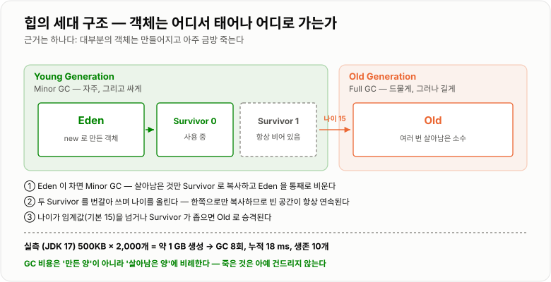
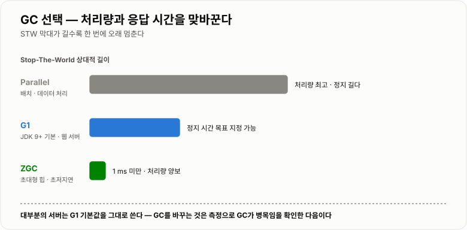

# JVM 메모리와 GC

> **JVM은 메모리를 "스레드마다 따로 쓰는 곳"과 "모두가 나눠 쓰는 곳"으로 나눈다. GC는 후자(힙)에서 아무도 안 쓰는 객체를 치우는 일이고, 그 과정에서 애플리케이션을 잠깐 멈추기 때문에 응답 시간 문제가 생긴다.**

---

## 1. 핵심 요약

**GC는 "메모리가 부족할 때 도는 것"이 아니라 "Eden이 찰 때마다 수시로 도는 것"이다. 그래서 튜닝의 목표는 GC를 안 돌게 만드는 것이 아니라, 도는 시간을 짧게 만들고 오래 사는 객체를 줄이는 것이다.**

### 한눈에 보기

* JVM 메모리는 **스레드마다 따로 갖는 곳(스택 · PC 레지스터)** 과 **모든 스레드가 공유하는 곳(힙 · 메타스페이스)** 으로 나뉜다.
* **객체는 힙에, 그 객체를 가리키는 참조 변수는 스택에** 있다. 이 구분이 GC 이해의 출발점이다.
* GC는 **"참조되지 않는 객체"** 를 치운다. 판단 기준은 참조 횟수가 아니라 **GC Root에서 따라갈 수 있는가**다.
* 힙은 **Young(Eden + Survivor 2개)** 과 **Old**로 나뉜다. 근거는 **"대부분의 객체는 금방 죽는다"** 는 경험칙이다.
* **JDK 9부터 기본 GC는 G1**이다. JDK 17 실측에서도 `G1 Young Generation` / `G1 Old Generation`이 확인됐다.
* **힙 기본 크기는 물리 메모리에 비례한다.** 실측 환경에서 최대 힙 **4,082 MB**(약 1/4), 초기 힙 **256 MB**(약 1/64)였다.
* **GC는 생각보다 자주, 그리고 짧게 돈다.** 500KB 객체 2,000개(약 1GB)를 만들었더니 **GC 8회, 누적 18 ms**였다.
* **Stop-The-World(STW)** 는 GC가 도는 동안 애플리케이션 스레드를 멈추는 것이다. **응답 시간 문제의 주범**이다.
* **메모리 누수는 "쓰지 않지만 참조가 남아 있는" 객체**다. GC는 참조가 있으면 절대 치우지 않는다.
* `String` 리터럴은 **상수 풀에서 공유**되고 `new String()`은 힙에 새로 만든다(`==` 비교로 확인).
* `Integer`는 **-128 ~ 127을 캐싱**한다. `127 == 127`은 `true`, `128 == 128`은 `false`다.
* 스택 깊이는 고정값이 아니다. 실측에서 **23,404 프레임**에서 `StackOverflowError`가 났다.

> 이 노트의 수치는 **JDK 17.0.12 (HotSpot, 6코어)** 에서 `Runtime`과 `ManagementFactory`로 직접 측정한 값이다. 힙 크기와 GC 횟수는 **환경마다 달라지므로 절대값이 아니라 비율과 경향**으로 읽어야 한다.

### 무엇을 해결하는가

#### GC가 없을 때

C나 C++에서는 메모리를 직접 반납한다.

```c
char* buffer = malloc(1024);
// ... 사용 ...
free(buffer);          // 잊으면 메모리 누수
```

여기서 세 가지 사고가 난다.

```text
① 반납을 잊는다              → 메모리 누수 (memory leak)
② 두 번 반납한다             → double free, 프로세스가 죽는다
③ 반납한 뒤에 접근한다        → dangling pointer, 엉뚱한 값이 읽히거나 죽는다

  특히 ③은 "가끔 이상한 값이 나온다" 형태로 나타나
  재현도 안 되고 원인도 못 찾는다
```

**진짜 문제는 "누가 이 메모리의 주인인가"를 사람이 계속 추적해야 한다**는 것이다. 객체가 여러 곳에서 참조되면 마지막 사용자가 누구인지 코드 전체를 봐야 알 수 있다.

GC는 이 판단을 **런타임에 위임**한다.

```java
byte[] buffer = new byte[1024];
// ... 사용 ...
// 반납 코드가 없다. 아무도 참조하지 않게 되면 GC가 알아서 치운다
```

#### 대신 생긴 새로운 문제

공짜는 아니다. GC가 가져온 대가가 있다.

```text
① 언제 치울지 내가 정할 수 없다      → 예측 불가능한 지연
② 치우는 동안 애플리케이션이 멈춘다   → Stop-The-World
③ 여전히 누수가 난다                → "참조가 살아 있는" 객체는 GC가 못 치운다
```

**그래서 "GC가 있으니 메모리를 신경 안 써도 된다"가 아니라, 신경 쓸 지점이 옮겨간 것**이다. 반납을 잊는 문제 대신 **STW 시간**과 **의도치 않은 참조**를 관리하게 됐다.

---

## 2. 동작 원리

### 핵심 구성 요소

#### 메모리 영역

```text
       스레드마다 하나씩                    모든 스레드가 공유
  ┌────────────────────────┐        ┌──────────────────────────┐
  │  JVM 스택               │        │  힙 (Heap)               │
  │  PC 레지스터            │        │  메타스페이스             │
  │  네이티브 메서드 스택    │        │  (+ 코드 캐시)           │
  └────────────────────────┘        └──────────────────────────┘
      동기화 필요 없음                   GC 대상 · 동시성 문제 발생
```


*스택은 스레드마다 따로라 안전하고, 힙은 공유하므로 GC와 동시성 문제가 모두 여기서 생긴다.*

| 영역             | 무엇이 들어가나                        | GC 대상 | 넘치면                     |
| -------------- | ------------------------------- | ----- | ----------------------- |
| **JVM 스택**     | 지역 변수, 매개변수, 참조 변수, 메서드 호출 프레임  | 아니오   | `StackOverflowError`    |
| **PC 레지스터**    | 현재 실행 중인 명령 주소                  | 아니오   | —                       |
| **힙**          | **모든 객체와 배열의 실체**               | **예** | `OutOfMemoryError: Java heap space` |
| **메타스페이스**     | 클래스 메타데이터, `static` 변수, 상수 풀    | 일부    | `OutOfMemoryError: Metaspace` |
| **코드 캐시**      | JIT가 컴파일한 기계어                   | 일부    | 성능 저하 (JIT 중단)          |

**실측으로 본 실제 영역**

```text
G1 Eden Space        Heap      (Young)
G1 Survivor Space    Heap      (Young)
G1 Old Gen           Heap      최대 4,082 MB
Metaspace            Non-heap  최대 무제한
Compressed Class Space  Non-heap  최대 1,024 MB
CodeHeap (3종)       Non-heap  각 5 ~ 117 MB
```

**메타스페이스는 Java 8에서 바뀐 부분이다.** Java 7까지는 힙 안의 **PermGen**에 클래스 정보를 뒀는데, 크기가 고정이라 `OutOfMemoryError: PermGen space`가 자주 났다. Java 8부터 **힙 밖의 네이티브 메모리**로 옮기고 기본 무제한이 되어 이 오류가 사실상 사라졌다.

#### 스택과 힙이 나뉘는 이유

```java
void process() {
    int count = 10;                    // 스택
    User user = new User("kim");       // user는 스택, User 객체는 힙
}
```

```text
       스택 (process 프레임)              힙
  ┌──────────────────────┐        ┌────────────────────┐
  │ count = 10           │        │ User 객체           │
  │ user  = 0x7f3a ──────┼───────→│   name = "kim"      │
  └──────────────────────┘        └────────────────────┘
   메서드가 끝나면 프레임             참조가 사라지면
   통째로 사라진다 (즉시)             GC 대상이 된다 (나중에)
```

**왜 나눴는가**

```text
스택: 크기와 수명이 컴파일 시점에 정해진다
      → 메서드가 끝나면 통째로 버리면 된다 → 매우 빠르다
      → 스레드마다 따로 두면 동기화도 필요 없다

힙:   크기와 수명을 미리 알 수 없다
      → 메서드가 끝나도 객체가 살아 있어야 할 수 있다
      → 그래서 "언제 버릴지"를 판단하는 장치(GC)가 필요하다
```

**실측: 스택은 유한하다**

```text
재귀 호출을 계속하면  →  23,404 프레임에서 StackOverflowError

  고정값이 아니다. -Xss 설정과 프레임 크기(지역 변수 개수)에 따라 달라지고,
  같은 코드도 실행할 때마다 조금씩 다르다.
```

#### GC는 무엇을 쓰레기로 판단하는가

**참조 횟수를 세는 방식은 쓰지 않는다.** 순환 참조를 못 치우기 때문이다.

```text
A ──→ B
↑     │
└─────┘

  A와 B가 서로만 가리키고 아무도 A, B를 안 쓴다
  → 참조 횟수는 각각 1이라 "살아 있다"고 판단한다
  → 영원히 안 치워진다
```

JVM은 **도달 가능성(reachability)** 으로 판단한다.

```text
GC Root 에서 시작해 참조를 따라간다.
    닿는 객체 = 살아 있다
    안 닿는 객체 = 쓰레기

GC Root 가 되는 것
    · 실행 중인 스레드의 스택에 있는 지역 변수·매개변수
    · static 변수
    · JNI 참조
    · 실행 중인 스레드 객체 자체
```

이 방식이면 **순환 참조도 정확히 처리된다.** A와 B가 서로를 가리켜도, GC Root에서 둘 다 못 닿으면 함께 치워진다.

### 내부 동작 과정

#### 힙을 세대로 나누는 이유

세대 구분은 딱 하나의 관찰에서 나왔다.

```text
약한 세대 가설 (Weak Generational Hypothesis)

  "대부분의 객체는 만들어지고 아주 금방 죽는다"

  메서드 안에서 만든 임시 객체, 반복문에서 만든 문자열,
  DTO 변환용 중간 객체 ... 대부분 몇 밀리초 안에 쓸모없어진다
```

```text
그렇다면 전체 힙을 매번 뒤지는 것은 낭비다.
   ↓
새 객체만 모아 두는 좁은 공간을 따로 만들고, 그곳만 자주 뒤지자.
   ↓
거기서 여러 번 살아남은 소수만 넓은 공간으로 옮기자.
```



*새 객체는 Eden에서 태어나 Survivor를 오가며 나이를 먹고, 살아남은 소수만 Old로 승격된다.*

#### 객체 한 개의 일생

```text
① 생성
   new 로 만든 객체는 Eden 에 놓인다

② Eden 이 가득 참  →  Minor GC 발생
   · Eden 에서 살아 있는 객체를 Survivor 0 으로 복사한다
   · 나이(age) = 1
   · Eden 을 통째로 비운다  ← 개별 삭제가 아니라 영역 전체를 버린다

③ 다시 Eden 이 참  →  Minor GC
   · Eden 의 생존자 + Survivor 0 의 생존자를 Survivor 1 로 복사
   · 나이 += 1
   · Eden 과 Survivor 0 을 비운다
   → 두 Survivor 는 항상 한쪽이 비어 있다 (번갈아 쓴다)

④ 나이가 임계값(기본 15)을 넘으면  →  Old 로 승격 (promotion)
   또는 Survivor 가 좁아 못 담으면 즉시 승격

⑤ Old 가 가득 참  →  Major GC (Full GC)
   · 훨씬 오래 걸린다 → STW 가 길다 → 여기가 문제의 지점
```

**Survivor가 두 개인 이유**는 **메모리 단편화를 없애기 위해서**다. 한쪽에서 살아남은 것만 다른 쪽으로 **차곡차곡 복사**하면, 남은 공간이 자동으로 연속된 하나의 빈 영역이 된다. 그래서 새 객체를 할당할 때 **포인터를 앞으로 밀기만 하면 된다**(bump-the-pointer). 이것이 Java의 객체 생성이 생각보다 빠른 이유다.

#### 왜 Minor GC는 빠르고 Full GC는 느린가

```text
Minor GC
    대상: Young 영역만 (전체 힙의 일부)
    특징: 대부분이 쓰레기라 살아남는 것이 적다
          → 복사할 양이 적다
          → Eden 은 통째로 버린다
    결과: 보통 수 밀리초

Full GC
    대상: Old 를 포함한 힙 전체
    특징: Old 에는 오래 살아남은 객체가 많다
          → 살아 있는 것을 전부 표시하고 정리해야 한다
    결과: 힙이 클수록 오래 걸린다 (수백 ms ~ 수 초)
```

**실측**

```text
500KB 객체 2,000개 생성 (총 약 1 GB)
   → GC 실행 8회
   → GC 누적 시간 18 ms
   → 살아남은 객체 10개 (2.5 MB)

  1GB를 만들어 버렸는데 GC 총비용이 18 ms 였다.
  대부분이 Eden 에서 바로 죽어 Minor GC 로 끝났기 때문이다.
```

이 수치가 말하는 것이 중요하다. **"객체를 많이 만들면 GC 때문에 느려진다"는 절반만 맞다.** 금방 죽는 객체는 거의 공짜다. 문제는 **오래 살아남아 Old로 넘어가는 객체**다.

#### GC 종류와 STW

모든 GC는 **Stop-The-World**를 동반한다. 애플리케이션 스레드를 전부 멈춰야 참조 관계가 바뀌지 않기 때문이다.



*처리량을 택할지 응답 시간을 택할지가 GC 선택의 전부다.*

| GC             | 도입     | 특징                                | STW           | 언제 쓰나                    |
| -------------- | ------ | --------------------------------- | ------------- | ------------------------ |
| **Serial**     | 초기     | 스레드 하나로 GC                        | 길다            | 싱글 코어, 수십 MB 힙           |
| **Parallel**   | Java 5 | 여러 스레드로 GC. **처리량 우선**            | 길지만 빈도 낮음     | 배치 작업 (응답 시간 무관)         |
| **CMS**        | Java 5 | 표시 단계를 동시 수행. **Java 14에서 제거됨**   | 짧음            | (더 이상 쓰지 않는다)            |
| **G1**         | Java 7 | 힙을 지역(Region)으로 쪼개 **쓰레기 많은 곳부터** | **목표 시간 설정 가능** | **JDK 9+ 기본. 대부분의 서버**  |
| **ZGC**        | Java 15 | 대부분을 동시 수행                        | **1 ms 미만**   | 힙이 매우 크고 지연에 민감할 때       |
| **Shenandoah** | Java 12 | ZGC와 유사한 목표                       | 매우 짧음         | 저지연 요구                   |

**G1이 기본이 된 이유**

```text
기존 방식: Young / Old 가 물리적으로 고정된 큰 덩어리
   → Full GC 때 전체를 훑어야 한다

G1: 힙을 1~32MB 짜리 Region 수백 개로 쪼갠다
   → 각 Region 이 상황에 따라 Eden / Survivor / Old 역할을 맡는다
   → "쓰레기가 가장 많은 Region 부터" 골라서 치운다  ← Garbage-First
   → 목표 정지 시간(-XX:MaxGCPauseMillis)에 맞춰 치울 양을 조절한다
```

**처리량과 응답 시간은 맞바꾸는 관계다.**

```text
Parallel  전체 처리량은 높지만 한 번 멈추면 길다      → 배치
G1        약간의 처리량을 내주고 정지 시간을 예측 가능하게 → 웹 서버
ZGC       처리량을 더 내주고 정지 시간을 1ms 미만으로   → 초저지연
```

---

## 3. 특징과 비교

| 구분          | 내용                                       |
| ----------- | ---------------------------------------- |
| **장점**      | 메모리 반납을 사람이 추적하지 않아도 되어 **double free·dangling pointer가 원천적으로 사라진다.** 세대 구분과 복사 방식 덕분에 객체 생성이 포인터 이동만큼 싸고, 금방 죽는 객체는 거의 공짜다(1GB 생성에 GC 18 ms). |
| **단점**      | **언제 멈출지 내가 정할 수 없다.** Full GC의 STW는 힙이 클수록 길어져 응답 시간이 튄다. 참조가 남아 있으면 GC가 치우지 않으므로 **누수는 여전히 발생한다.** |
| **적합한 상황**  | 대부분의 서버 애플리케이션. **요청 단위로 짧게 살다 죽는 객체가 많은** 웹 서비스에 세대 구분이 특히 잘 맞는다. |
| **주의할 상황**  | **실시간성이 엄격한 시스템**(STW를 감당 못 함), 힙을 무작정 키우는 것(Full GC가 더 길어진다), `static` 컬렉션에 계속 담는 코드(누수). |

### 성능 특성

#### 힙 기본값은 물리 메모리에 비례한다

**실측 (JDK 17, 6코어)**

| 항목                | 값             | 규칙                |
| ----------------- | ------------- | ----------------- |
| 최대 힙 (`-Xmx` 미지정) | **4,082 MB**  | 물리 메모리의 **약 1/4** |
| 초기 힙 (`-Xms` 미지정) | **256 MB**    | 물리 메모리의 **약 1/64** |
| Compressed Class Space | 1,024 MB | 고정 기본값            |
| Metaspace         | 무제한           | Java 8부터          |

**컨테이너에서 반드시 확인할 것**

```text
Java 8 초기 버전은 컨테이너 메모리 제한을 못 읽고
호스트 전체 메모리의 1/4 을 힙으로 잡았다

  → 컨테이너 제한 512MB 인데 힙을 4GB로 잡음
  → OOM Killer 에게 컨테이너째로 죽는다
  → JVM 로그도 안 남아서 원인 파악이 어렵다

  JDK 10+ 는 UseContainerSupport 가 기본 활성이라 해결됐다.
  그래도 -XX:MaxRAMPercentage=75.0 로 명시하는 것을 권한다.
```

#### GC 비용은 "만든 양"이 아니라 "살아남은 양"에 비례한다

```text
실측: 500KB × 2,000개 = 약 1 GB 생성
      → GC 8회, 누적 18 ms
      → 살아남은 것은 10개 (2.5 MB)

  1GB를 만들었는데 18 ms 였던 이유
    · 복사 방식 GC 는 "살아 있는 것"만 복사한다
    · 죽은 것은 아예 건드리지 않는다
    · Eden 은 통째로 비운다
```

**이 성질이 튜닝의 방향을 정한다.**

```text
객체를 적게 만든다        → 효과 작음 (금방 죽으면 거의 공짜)
오래 사는 객체를 줄인다    → 효과 큼   (Old 로 넘어가면 Full GC 대상)
캐시 크기를 제한한다       → 효과 큼
Old 로 승격되기 전에 죽게 한다 → 효과 큼
```

#### 객체 하나의 메모리 비용

```text
64비트 JVM, 압축 참조(-XX:+UseCompressedOops, 기본) 기준

  객체 헤더        12 바이트  (mark word 8 + class pointer 4)
  8바이트 정렬 패딩  0 ~ 7 바이트

  Integer 객체 = 헤더 12 + int 4 = 16 바이트
  int 원시값   = 4 바이트

  → Integer 는 int 의 4배 + 참조 4바이트 = 실질 5배
  → List<Integer> 가 int[] 보다 훨씬 무거운 이유
```

`Generic · Exception · Stream` 노트에서 `List<Integer>` 스트림이 `IntStream`보다 5.1배 느렸던 이유가 이것이다. **객체가 흩어져 있어 캐시 미스가 나고, GC가 관리할 객체 수도 늘어난다.**

### 장점과 단점

| 장점                    | 이유                                     |
| --------------------- | -------------------------------------- |
| 메모리 반납 실수가 사라진다       | double free, dangling pointer가 문법상 불가능. |
| 순환 참조도 정확히 회수된다       | 참조 카운트가 아니라 **도달 가능성**으로 판단한다.         |
| 객체 생성이 매우 싸다          | 압축된 Eden에서 **포인터를 밀기만** 하면 된다.         |
| 금방 죽는 객체는 거의 공짜다      | 죽은 것은 건드리지 않고 Eden을 통째로 비운다(1GB에 18 ms). |
| 단편화가 생기지 않는다          | 복사하면서 자동으로 압축(compaction)된다.           |
| 정지 시간을 목표로 지정할 수 있다   | G1의 `MaxGCPauseMillis`.                |

| 단점                       | 이유 및 주의점                                     |
| ------------------------ | -------------------------------------------- |
| **STW를 피할 수 없다**         | 참조 관계가 바뀌면 안 되므로 멈춰야 한다. Full GC는 수백 ms 이상.  |
| 언제 도는지 제어할 수 없다          | `System.gc()`는 **요청일 뿐 보장이 아니다.** 호출하지 않는다.  |
| **누수는 여전히 발생한다**         | 참조가 살아 있으면 GC는 절대 안 치운다. `static` 컬렉션이 대표적.  |
| 힙을 키우면 Full GC가 길어진다     | 훑을 대상이 늘어난다. 무작정 키우는 것은 해법이 아니다.             |
| 메모리를 더 쓴다                | 객체 헤더, Survivor 예비 공간, GC 자체의 자료구조.          |
| 컨테이너에서 설정이 어긋나기 쉽다      | 힙 계산이 잘못되면 **OOM Killer에게 조용히 죽는다.**         |

### 어떤 상황에서 고르는가

#### GC 선택 흐름

```text
응답 시간이 중요한가?
├─ 아니오 (배치·데이터 처리)
│   └─ Parallel GC — 처리량이 가장 높다
│
└─ 예 (웹 서버·API)
     └─ 힙이 얼마나 큰가?
          ├─ ~ 수 GB    → G1 (기본값 그대로 쓴다)
          └─ 수십 GB 이상 → ZGC / Shenandoah
                            (정지 시간이 힙 크기와 거의 무관하다)
```

**대부분의 경우 답은 "G1 기본값을 그대로 쓴다"** 이다. GC를 바꾸는 것은 **실제로 측정해서 GC가 병목임을 확인한 뒤**의 이야기다.

#### OOM이 났을 때 무엇부터 보는가

```text
1. 어떤 OOM 인지 메시지를 정확히 읽는다
     "Java heap space"        → 힙 부족 (진짜 누수이거나 힙이 작음)
     "Metaspace"              → 클래스가 계속 로드됨 (동적 프록시·핫 리로드)
     "GC overhead limit"      → GC는 도는데 회수가 안 됨 (누수 유력)
     "unable to create native thread"  → 스레드 과다 (힙과 무관)
     "Direct buffer memory"   → 네이티브 버퍼 (Netty·NIO)

2. 힙 덤프를 뜬다
     -XX:+HeapDumpOnOutOfMemoryError -XX:HeapDumpPath=/dump

3. 덤프를 열어 "무엇이 제일 많은지"와 "왜 참조가 살아 있는지"를 본다
     → MAT 의 Dominator Tree, Path to GC Root
```

#### 언제 GC를 의심하고 언제 아닌가

```text
GC 문제일 가능성이 높다
  · 응답 시간이 주기적으로 튄다 (평소 50ms, 가끔 2초)
  · 시간이 지날수록 Full GC 가 잦아진다
  · 재시작하면 한동안 괜찮다가 다시 느려진다
  · GC 로그의 정지 시간이 실제로 길다

GC 문제가 아닐 가능성이 높다
  · 처음부터 일관되게 느리다          → 쿼리·알고리즘
  · 특정 API 만 느리다                → 그 로직
  · CPU 는 낮은데 느리다              → I/O 대기·락
```

### 비슷한 기술과 비교

#### Minor GC vs Full GC

| 기준        | Minor GC (Young)   | Full GC (전체)          |
| --------- | ------------------ | -------------------- |
| **대상**    | Eden + Survivor    | Young + Old + 메타스페이스 |
| **빈도**    | 매우 잦다              | 드물다                  |
| **소요 시간** | 수 밀리초              | 수백 ms ~ 수 초          |
| **원인**    | Eden이 참            | Old가 참, `System.gc()`, 메타스페이스 부족 |
| **장점**    | 싸다. 대부분 여기서 끝난다    | 힙 전체를 정리한다           |
| **단점**    | Old는 못 치운다         | **STW가 길어 응답 시간이 튄다** |
| **대응**    | 신경 쓸 필요 거의 없다      | **여기가 튜닝의 대상이다**     |

#### 스택 vs 힙

| 기준         | 스택                | 힙                  |
| ---------- | ----------------- | ------------------ |
| **저장 대상**  | 지역 변수, 참조 변수, 프레임 | **객체와 배열의 실체**     |
| **공유 범위**  | 스레드마다 독립          | 모든 스레드가 공유         |
| **정리 방식**  | 메서드 종료 시 자동·즉시    | GC가 나중에            |
| **속도**     | 매우 빠름             | 상대적으로 느림           |
| **크기**     | 작다 (기본 512KB~1MB) | 크다 (4,082 MB)   |
| **넘치면**    | `StackOverflowError` (23,404 프레임) | `OutOfMemoryError` |
| **동시성 문제** | **없다**            | **있다** (동기화 필요)    |

#### G1 vs Parallel vs ZGC

| 기준         | Parallel     | G1                   | ZGC             |
| ---------- | ------------ | -------------------- | --------------- |
| **동작 방식**  | 여러 스레드로 한 번에 | Region 단위로 쓰레기 많은 곳부터 | 대부분을 동시 수행      |
| **STW**    | 길다           | 중간 (목표 설정 가능)        | **1 ms 미만**     |
| **처리량**    | **가장 높다**    | 약간 낮다                | 더 낮다            |
| **힙 크기**   | 중소형          | 중대형                  | **초대형(TB급)**    |
| **선택 기준**  | **배치 작업**    | **웹 서버 기본값**         | 초저지연 요구         |

#### 메타스페이스 vs PermGen

| 기준        | PermGen (~Java 7)      | Metaspace (Java 8~)    |
| --------- | ---------------------- | ---------------------- |
| **위치**    | 힙 내부                   | **힙 밖 네이티브 메모리**       |
| **기본 크기** | 고정 (64~82 MB)          | **무제한**        |
| **문제**    | `OOM: PermGen space` 빈발 | 사실상 사라짐                |
| **주의**    | —                      | 무제한이라 **OS 메모리를 다 먹을 수 있다** |

---

## 4. 실무 주의사항

### 백엔드 실무 적용

#### 운영 서버에 반드시 넣는 JVM 옵션

```bash
# 힙 — 컨테이너에서는 비율로 지정한다
-XX:MaxRAMPercentage=75.0

# 물리 서버라면 최소=최대로 고정한다 (동적 확장 중 Full GC 방지)
-Xms2g -Xmx2g

# OOM 시 자동으로 덤프를 남긴다 — 이게 없으면 원인 분석이 불가능하다
-XX:+HeapDumpOnOutOfMemoryError
-XX:HeapDumpPath=/var/log/app/heapdump.hprof

# OOM 이 나면 그냥 죽인다 (좀비 상태로 사는 것보다 낫다)
-XX:+ExitOnOutOfMemoryError

# GC 로그 — 사고 후에는 켤 수 없다. 미리 켠다
-Xlog:gc*:file=/var/log/app/gc.log:time,uptime:filecount=5,filesize=10M
```

**`-Xms`와 `-Xmx`를 같게 두는 이유**

```text
힙이 동적으로 늘어날 때 JVM 은 Full GC 를 한 번 돌린다
   → 트래픽이 올라가는 순간 정확히 그때 멈춘다
   → 가장 바쁠 때 가장 오래 멈추는 셈이다

  같게 고정하면 이 확장 과정 자체가 없어진다
```

#### 메모리 누수를 만드는 실제 패턴

**① `static` 컬렉션에 계속 담는다 — 가장 흔하다**

```java
public class RequestTracker {
    // static 은 GC Root 다. 여기 담긴 것은 절대 회수되지 않는다
    private static final Map<String, Request> CACHE = new HashMap<String, Request>();

    public void track(Request r) {
        CACHE.put(r.getId(), r);   // 제거하는 코드가 없다 → 무한히 쌓인다
    }
}
```

```text
GC 입장에서는 누수가 아니다. 참조가 살아 있으므로 "쓰는 중"이다.
   → GC 는 끝까지 안 치운다
   → 결국 OutOfMemoryError

  해결: 크기 제한이 있는 캐시를 쓴다 (Caffeine, Guava Cache)
        또는 TTL 을 걸고 주기적으로 비운다
```

**② `ThreadLocal`을 스레드 풀에서 쓰고 안 지운다**

```java
private static final ThreadLocal<UserContext> CONTEXT = new ThreadLocal<UserContext>();

public void handle(Request r) {
    CONTEXT.set(new UserContext(r.getUserId()));
    process();
    // remove() 를 안 했다
}
```

```text
스레드 풀의 스레드는 요청이 끝나도 죽지 않고 재사용된다
   → ThreadLocal 값이 그 스레드에 계속 남는다
   → ① 메모리 누수
   → ② 다음 요청이 이전 사용자의 정보를 본다  ← 보안 사고

  반드시 finally 에서 remove() 한다
```

```java
public void handle(Request r) {
    CONTEXT.set(new UserContext(r.getUserId()));
    try {
        process();
    } finally {
        CONTEXT.remove();      // 빠뜨리면 안 된다
    }
}
```

**③ 리스너·콜백을 등록만 하고 해제하지 않는다**

```java
eventBus.register(this);   // unregister 가 없으면
// eventBus 가 this 를 계속 참조 → this 와 그 아래 전부가 회수 안 됨
```

**④ 캐시 키로 가변 객체를 쓴다**

```text
HashMap 의 키 객체를 나중에 수정하면
   → hashCode 가 바뀌어 그 항목을 영영 찾지 못한다
   → 지우지도 못한다 → 누수
```

이 문제는 [equals · hashCode](../equals-hashCode/equals-hashCode.md) 노트에서 자세히 다룬다.

#### 문자열과 상수 풀

```java
String a = "hello";                 // 상수 풀
String b = "hello";                 // 같은 것을 재사용
String c = new String("hello");     // 힙에 새 객체
String d = c.intern();              // 상수 풀의 것을 가리키게 한다
```

**실측 결과**

```text
a == b   →  true     리터럴은 상수 풀에서 공유된다
a == c   →  false    new 는 무조건 새 객체를 만든다
a == d   →  true     intern() 이 상수 풀의 것을 돌려줬다
a.equals(c) → true   값은 같다
```

```text
실무 교훈
  · 문자열 비교는 언제나 equals() 를 쓴다
  · new String("...") 은 쓸 이유가 거의 없다 (메모리만 낭비)
  · 반복문에서 + 로 문자열을 이으면 매번 새 객체가 생긴다
    → StringBuilder 를 쓴다
```

#### `Integer` 캐시가 만드는 버그

```java
Integer a = 127, b = 127;
Integer c = 128, d = 128;
```

**실측 결과**

```text
a == b  →  true      -128 ~ 127 은 미리 만들어 캐싱한다
c == d  →  false     범위를 벗어나면 새 객체가 생긴다
```

```text
이 때문에 "테스트에서는 되는데 운영에서 안 되는" 버그가 난다

  주문 수량 100 → == 비교가 우연히 통과
  주문 수량 200 → == 비교가 실패

  → 래퍼 타입 비교는 반드시 equals()
  → 또는 언박싱해서 원시 타입으로 비교
```

#### `System.gc()`를 호출하지 않는다

```text
System.gc() 는 "GC 해 주세요" 라는 요청일 뿐 보장이 아니다.
그리고 대부분의 구현에서 이것은 Full GC 를 유발한다.

  → 가장 비싼 GC 를 임의의 시점에 강제하는 셈
  → 라이브러리가 몰래 호출하는 경우도 있어
    -XX:+DisableExplicitGC 로 막기도 한다
```

`finalize()`도 마찬가지다. **Java 9부터 deprecated이고 JDK 18부터 기본 비활성(JEP 421)** 이다. 자원 해제는 `AutoCloseable`과 try-with-resources로 한다.

### 자주 하는 오해

| 잘못된 이해                            | 올바른 이해                                                             |
| --------------------------------- | ------------------------------------------------------------------ |
| GC는 메모리가 부족할 때 돈다                 | **Eden이 찰 때마다 수시로 돈다.** 실측에서 1GB 생성에 8회 돌았다.                       |
| 객체를 많이 만들면 GC 때문에 느려진다            | **금방 죽는 객체는 거의 공짜다.** 1GB 생성에 GC 총 18 ms였다. 문제는 **오래 사는 객체**다.     |
| GC가 있으니 메모리 누수는 없다                | **참조가 살아 있으면 절대 안 치운다.** `static` 컬렉션·`ThreadLocal`이 대표적 누수원이다.    |
| `System.gc()`를 부르면 GC가 실행된다       | **요청일 뿐 보장이 아니다.** 게다가 대개 가장 비싼 Full GC를 유발하므로 호출하지 않는다.           |
| 힙을 크게 잡으면 GC 문제가 해결된다             | **Full GC가 더 길어진다.** 훑을 대상이 늘어나기 때문이다. 원인을 찾는 것이 먼저다.              |
| `null`을 대입하면 즉시 메모리가 해제된다         | 참조만 끊길 뿐이다. **회수 시점은 GC가 정한다.**                                    |
| 모든 객체는 힙에 생성된다                    | 원칙은 맞지만, JIT의 **탈출 분석(escape analysis)** 으로 스택에 할당되기도 한다.          |
| 지역 변수도 GC 대상이다                    | 지역 변수 자체는 **스택**에 있고 메서드 종료 시 프레임째 사라진다. GC 대상은 그것이 가리키던 **힙 객체**다. |
| `String`은 `==`로 비교해도 된다           | 리터럴끼리는 우연히 `true`지만 `new String()`은 `false`다. 항상 `equals()`.    |
| 래퍼 타입도 `==`로 비교해도 된다              | **-128~127만 캐시**되어 `127==127`은 `true`, `128==128`은 `false`다.    |
| Java 8부터 PermGen이 없어져 OOM이 안 난다   | 메타스페이스는 **힙 밖에서 무제한**이라 방치하면 OS 메모리를 다 먹는다. `MaxMetaspaceSize`를 건다. |
| GC 튜닝부터 하면 성능이 좋아진다               | **먼저 측정한다.** 대부분의 느림은 쿼리·I/O·알고리즘이고 GC는 그다음이다.                     |

---

## 5. 예제

### 현재 JVM의 메모리 상태를 확인하는 코드

```java
import java.lang.management.GarbageCollectorMXBean;
import java.lang.management.ManagementFactory;
import java.lang.management.MemoryPoolMXBean;
import java.lang.management.MemoryUsage;

public class MemoryInspector {

    public static void main(String[] args) {
        Runtime runtime = Runtime.getRuntime();

        System.out.println("=== 힙 ===");
        System.out.printf("최대 힙  %.0f MB%n", runtime.maxMemory() / 1024.0 / 1024);
        System.out.printf("현재 힙  %.0f MB%n", runtime.totalMemory() / 1024.0 / 1024);
        System.out.printf("여유     %.0f MB%n", runtime.freeMemory() / 1024.0 / 1024);

        System.out.println("\n=== 사용 중인 GC ===");
        for (GarbageCollectorMXBean gc : ManagementFactory.getGarbageCollectorMXBeans()) {
            System.out.printf("%s  실행 %d회, 누적 %d ms%n",
                    gc.getName(), gc.getCollectionCount(), gc.getCollectionTime());
        }

        System.out.println("\n=== 메모리 영역 ===");
        for (MemoryPoolMXBean pool : ManagementFactory.getMemoryPoolMXBeans()) {
            MemoryUsage usage = pool.getUsage();
            System.out.printf("%-26s %-16s 사용 %5d MB%n",
                    pool.getName(),
                    pool.getType(),
                    usage.getUsed() / 1024 / 1024);
        }
    }
}
```

```text
실측 출력 (JDK 17.0.12, 6코어)

  최대 힙  4082 MB      ← 물리 메모리의 약 1/4
  현재 힙   256 MB      ← 물리 메모리의 약 1/64

  G1 Young Generation
  G1 Old Generation     ← JDK 9부터 기본 GC 는 G1

  G1 Eden Space / G1 Survivor Space / G1 Old Gen
  Metaspace (최대 무제한) / Compressed Class Space (1024 MB)
```

### GC가 실제로 도는 것을 관측하는 코드

```java
import java.lang.management.GarbageCollectorMXBean;
import java.lang.management.ManagementFactory;
import java.util.ArrayList;
import java.util.List;

public class GcObserver {

    public static void main(String[] args) {
        long countBefore = totalGcCount();
        long timeBefore = totalGcTime();

        List<byte[]> survivors = new ArrayList<byte[]>();

        for (int i = 0; i < 2000; i++) {
            byte[] garbage = new byte[512 * 1024];   // 곧바로 버려질 500KB

            if (i % 200 == 0) {
                survivors.add(new byte[256 * 1024]); // 일부만 살려 둔다
            }
        }

        System.out.println("생성한 양   약 1 GB (500KB × 2,000개)");
        System.out.println("GC 실행     " + (totalGcCount() - countBefore) + "회");
        System.out.println("GC 누적     " + (totalGcTime() - timeBefore) + " ms");
        System.out.println("살아남음    " + survivors.size() + "개");
    }

    private static long totalGcCount() {
        long total = 0;
        for (GarbageCollectorMXBean gc : ManagementFactory.getGarbageCollectorMXBeans()) {
            total += gc.getCollectionCount();
        }
        return total;
    }

    private static long totalGcTime() {
        long total = 0;
        for (GarbageCollectorMXBean gc : ManagementFactory.getGarbageCollectorMXBeans()) {
            total += gc.getCollectionTime();
        }
        return total;
    }
}
```

```text
실측 결과

  생성한 양   약 1 GB
  GC 실행     8회
  GC 누적     18 ms          ← 1GB 를 버렸는데 18 ms 다
  살아남음    10개

  → GC 비용은 "만든 양"이 아니라 "살아남은 양"에 비례한다
```

### 누수를 만드는 코드와 고친 코드

**누수 — `ThreadLocal`을 스레드 풀에서 정리하지 않는다**

```java
public class UserContextHolder {

    private static final ThreadLocal<UserContext> CONTEXT =
            new ThreadLocal<UserContext>();

    public static void set(UserContext context) {
        CONTEXT.set(context);
    }

    public static UserContext get() {
        return CONTEXT.get();
    }

    public static void clear() {
        CONTEXT.remove();      // 이것을 부르지 않으면 스레드에 계속 남는다
    }
}
```

```java
// 나쁜 예 — 정리하지 않는다
public void handleRequest(Request request) {
    UserContextHolder.set(new UserContext(request.getUserId()));
    businessLogic();
    // 예외가 나면 clear() 에 도달조차 못 한다
}
```

```java
// 좋은 예 — 인터셉터에서 반드시 정리한다
public class UserContextInterceptor implements HandlerInterceptor {

    @Override
    public boolean preHandle(HttpServletRequest request,
                             HttpServletResponse response,
                             Object handler) {
        String userId = request.getHeader("X-User-Id");
        UserContextHolder.set(new UserContext(userId));
        return true;
    }

    @Override
    public void afterCompletion(HttpServletRequest request,
                                HttpServletResponse response,
                                Object handler,
                                Exception ex) {
        UserContextHolder.clear();   // 예외가 나도 반드시 실행된다
    }
}
```

```text
정리하지 않으면 두 가지가 동시에 터진다

  ① 메모리 누수 — 스레드 풀의 스레드는 죽지 않으므로 계속 쌓인다
  ② 정보 유출 — 재사용된 스레드가 이전 요청의 사용자 정보를 본다  ← 더 위험하다
```

**누수 — 크기 제한 없는 `static` 캐시**

```java
// 나쁜 예
private static final Map<String, Product> CACHE = new HashMap<String, Product>();
```

```java
// 좋은 예 — 크기와 시간을 제한한다
import com.github.benmanes.caffeine.cache.Cache;
import com.github.benmanes.caffeine.cache.Caffeine;

import java.time.Duration;

public class ProductCache {

    private final Cache<String, Product> cache = Caffeine.newBuilder()
            .maximumSize(10_000)                        // 개수 상한
            .expireAfterWrite(Duration.ofMinutes(10))   // 시간 상한
            .build();

    public Product get(String id) {
        return cache.getIfPresent(id);
    }

    public void put(String id, Product product) {
        cache.put(id, product);
    }
}
```

**핵심은 "상한이 있는가"** 다. 상한 없는 컬렉션에 계속 담는 코드는 **언젠가 반드시 OOM이 난다.**

### 문자열·래퍼 타입 비교의 함정

```java
public class EqualityTraps {

    public static void main(String[] args) {
        String a = "hello";
        String b = "hello";
        String c = new String("hello");

        System.out.println("a == b       " + (a == b));        // true
        System.out.println("a == c       " + (a == c));        // false
        System.out.println("a == c.intern() " + (a == c.intern())); // true
        System.out.println("a.equals(c)  " + a.equals(c));     // true

        Integer i1 = 127, i2 = 127;
        Integer i3 = 128, i4 = 128;

        System.out.println("127 == 127   " + (i1 == i2));      // true
        System.out.println("128 == 128   " + (i3 == i4));      // false
        System.out.println("128.equals   " + i3.equals(i4));   // true
    }
}
```

```text
실측 결과 (JDK 17)
  a == b            true
  a == c            false
  a == c.intern()   true
  127 == 127        true
  128 == 128        false      ← 이 한 줄이 운영 버그가 된다

  결론: 객체 비교는 언제나 equals()
```

---

## 6. 면접 정리

### 자주 나오는 질문

#### 기본 질문

1. **JVM 메모리 영역을 설명해 주세요.**

    * 핵심 키워드: **스레드별**(스택·PC 레지스터) vs **공유**(힙·메타스페이스), 힙만 GC 대상

2. **스택과 힙의 차이는 무엇인가요?**

    * 핵심 키워드: 지역·참조 변수 vs **객체 실체**, 메서드 종료 시 즉시 vs GC가 나중에, 스택은 동시성 문제 없음

3. **GC는 무엇을 쓰레기로 판단하나요?**

    * 핵심 키워드: 참조 카운트가 아니라 **도달 가능성**, GC Root에서 못 닿으면 쓰레기, 그래서 **순환 참조도 회수됨**

4. **힙을 세대로 나누는 이유는 무엇인가요?**

    * 핵심 키워드: **약한 세대 가설**("대부분의 객체는 금방 죽는다"), 좁은 곳만 자주 뒤지면 싸다

5. **객체가 생성되고 사라지는 과정을 설명해 주세요.**

    * 핵심 키워드: Eden → Minor GC → Survivor 0/1 번갈아 → 나이 15 → Old 승격 → Full GC

6. **Survivor 영역이 두 개인 이유는 무엇인가요?**

    * 핵심 키워드: **단편화 방지**, 한쪽으로만 복사해 압축, 그래서 할당이 **포인터 밀기**로 끝남

7. **Stop-The-World가 무엇인가요?**

    * 핵심 키워드: GC 중 애플리케이션 스레드 정지, 참조 관계가 바뀌면 안 되므로 필수, **응답 시간 문제의 주범**

8. **JDK 17의 기본 GC는 무엇인가요?**

    * 핵심 키워드: **G1**(JDK 9부터), Region 단위로 **쓰레기 많은 곳부터**, `MaxGCPauseMillis`로 목표 설정

#### 꼬리 질문

1. **GC가 있는데 왜 메모리 누수가 나나요?**

    * 핵심 키워드: **참조가 살아 있으면 GC는 안 치운다**, `static` 컬렉션·`ThreadLocal`·리스너 미해제

2. **`ThreadLocal`이 왜 누수를 만드나요?**

    * 핵심 키워드: **스레드 풀은 스레드를 재사용**, `remove()` 안 하면 남음, 게다가 **다음 요청이 이전 사용자 정보를 봄**(보안)

3. **객체를 많이 만들면 GC 때문에 느려지지 않나요?**

    * 핵심 키워드: **금방 죽으면 거의 공짜.** 1GB 생성에 GC 8회·**18 ms**. 문제는 **오래 사는 객체**

4. **그럼 GC 튜닝은 무엇을 목표로 하나요?**

    * 핵심 키워드: GC를 안 돌게 하는 게 아니라 **Old로 넘어가는 객체를 줄이고 STW를 짧게**

5. **힙을 키우면 해결되나요?**

    * 핵심 키워드: **Full GC가 더 길어진다.** 훑을 대상이 늘어남. 원인 파악이 먼저

6. **Minor GC와 Full GC는 무엇이 다른가요?**

    * 핵심 키워드: Young만 vs 힙 전체, 수 ms vs 수백 ms~수 초, **튜닝 대상은 Full GC**

7. **`System.gc()`를 부르면 되지 않나요?**

    * 핵심 키워드: **요청일 뿐 보장 아님**, 대개 **가장 비싼 Full GC** 유발, `-XX:+DisableExplicitGC`로 막기도 함

8. **OOM이 났습니다. 무엇부터 확인하시겠어요?**

    * 핵심 키워드: **메시지 종류 확인**(heap space / Metaspace / GC overhead / native thread), 힙 덤프, MAT의 Path to GC Root

9. **운영 서버에 반드시 넣는 JVM 옵션이 있나요?**

    * 핵심 키워드: `HeapDumpOnOutOfMemoryError`, GC 로그, `-Xms=-Xmx` 고정, 컨테이너는 `MaxRAMPercentage`

10. **`-Xms`와 `-Xmx`를 같게 두는 이유는 무엇인가요?**

    * 핵심 키워드: 힙 확장 시 **Full GC 발생**, 하필 트래픽이 오르는 순간에 멈춤

11. **컨테이너에서 JVM 메모리 설정을 왜 조심해야 하나요?**

    * 핵심 키워드: 힙 기본값이 **물리 메모리 1/4**(4,082 MB), 제한을 못 읽으면 **OOM Killer에게 조용히 죽음**

12. **`String a = "hello"`와 `new String("hello")`는 무엇이 다른가요?**

    * 핵심 키워드: 상수 풀 공유 vs 힙에 새 객체, `a == b` **true** / `a == c` **false**, 항상 `equals()`

13. **`Integer`를 `==`로 비교하면 왜 위험한가요?**

    * 핵심 키워드: **-128~127만 캐시**, `127==127` true / `128==128` false, 값이 커지면 운영에서만 터짐

14. **Java 8에서 PermGen이 사라진 이유는 무엇인가요?**

    * 핵심 키워드: 고정 크기라 `OOM: PermGen` 빈발 → **힙 밖 네이티브 메모리(메타스페이스)** 로 이동, 기본 무제한

### 30초 답변

> JVM 메모리는 **스레드마다 따로 쓰는 스택**과 **모두가 공유하는 힙**으로 나뉘고, 객체는 힙에 그 객체를 가리키는 참조는 스택에 있습니다. GC는 힙에서 **GC Root로부터 도달할 수 없는 객체**를 치우는데, 참조 카운트가 아니라 도달 가능성으로 판단하기 때문에 순환 참조도 정확히 회수됩니다. 힙을 Young과 Old로 나누는 이유는 **"대부분의 객체는 금방 죽는다"** 는 관찰 때문이고, 그래서 좁은 Young만 자주 뒤지면 대부분이 싸게 끝납니다.

### 핵심 키워드

`힙` · `스택` · `메타스페이스` · `GC Root` · `도달 가능성` · `약한 세대 가설` · `Eden` · `Survivor` · `Old` · `Minor GC` · `Full GC` · `Stop-The-World` · `G1 GC` · `메모리 누수` · `힙 덤프` · `상수 풀`

### 이어서 볼 주제

* **[Generic · Exception · Stream](../Generic-Exception-Stream/Generic-Exception-Stream.md)** — 박싱이 왜 5.1배나 느린지가 이 노트의 객체 비용(16바이트 vs 4바이트)으로 설명된다.
* **[equals · hashCode](../equals-hashCode/equals-hashCode.md)** — 가변 객체를 캐시 키로 쓰면 지울 수도 없는 누수가 되는 이유.
* **[Thread와 동기화](../../04-동시성/Thread-동기화/Thread-동기화.md)** — 힙이 공유 영역이라는 사실이 곧 동시성 문제의 출발점이다.
* **[ThreadPool과 Deadlock](../../04-동시성/ThreadPool-Deadlock/ThreadPool-Deadlock.md)** — `ThreadLocal` 누수가 왜 스레드 풀에서만 문제가 되는지.
* **10-테스트·운영의 장애 분석과 성능 개선** — GC 로그와 힙 덤프를 실제로 읽는 방법.
* **JIT 컴파일과 탈출 분석** — 객체가 힙이 아니라 스택에 할당될 수 있는 경우.
* **MAT(Memory Analyzer) 사용법** — Dominator Tree와 Path to GC Root로 누수 주체를 찾는 실습.
* **JFR(Java Flight Recorder)** — 운영 중인 JVM의 할당과 GC를 낮은 오버헤드로 관측하는 도구.
