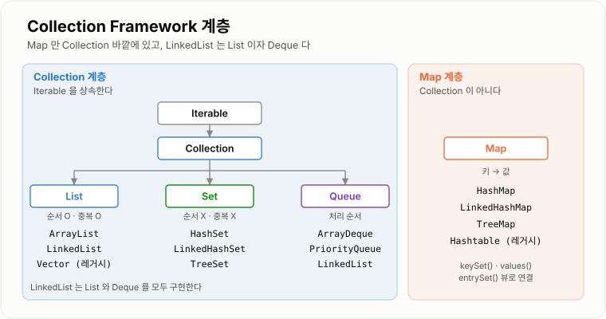
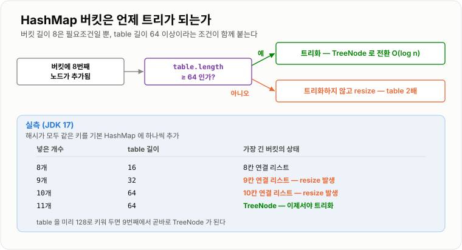
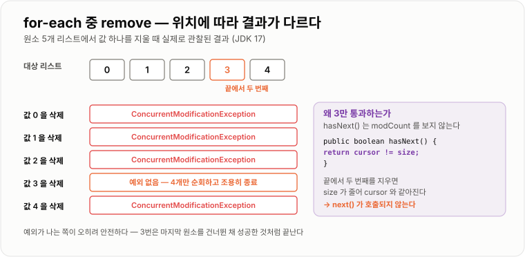

# Java Collection

> **Collection Framework는 "데이터를 담는 방법"을 인터페이스로 표준화하고, 목적이 다른 여러 구현체를 같은 방식으로 쓸 수 있게 만든 것이다.**

---

## 1. 핵심 요약

**Collection Framework는 "무엇을 보장하는가(인터페이스)"와 "어떻게 만들었는가(구현체)"를 분리한 체계이며, 잘 쓰는 사람과 아닌 사람을 가르는 것은 계층을 외우는 것이 아니라 뷰·fail-fast·초기 용량처럼 겉으로 드러나지 않는 동작을 아는 것이다.**

### 한눈에 보기

* Collection Framework는 **인터페이스(계약)와 구현체(방식)를 분리**한 설계다. `List`는 "무엇을 보장하는가"이고 `ArrayList`는 "어떻게 만들었는가"다.
* 최상위는 `Iterable`이며, `Collection` 아래 **`List`·`Set`·`Queue`** 세 갈래가 있다. **`Map`은 `Collection`이 아니다.**
* 구현체 선택은 곧 **내부 자료구조 선택**이다. `ArrayList`는 배열, `LinkedList`는 이중 연결 리스트, `HashMap`은 버킷 배열, `TreeMap`은 레드-블랙 트리다.
* JDK 17 실측 기준 `ArrayList`의 내부 배열은 **`0 → 10`으로 시작해 1.5배씩** 늘고, `HashMap`은 **table 16 · 임계값 12**에서 시작한다.
* `subList`·`keySet`·`Arrays.asList`는 **복사본이 아니라 뷰**다. 한쪽을 고치면 다른 쪽이 함께 바뀐다.
* 순회 중 구조를 바꾸면 `ConcurrentModificationException`이 나는데, **끝에서 두 번째 원소를 지울 때만 예외 없이 조용히 넘어간다** (실측). 이것이 fail-fast가 "보장"이 아닌 이유다.

### 무엇을 해결하는가

#### 해결하려는 문제

Java 1.1까지는 데이터를 담는 표준이 없었다. `Vector`, `Hashtable`, `Properties`, 그리고 배열이 제각각 존재했고 **서로 공통점이 없었다.**

```text
Vector    → addElement(), elementAt(), removeElementAt()
Hashtable → put(), get()
배열       → arr[i]
```

메서드 이름이 다르니 **같은 코드를 자료구조마다 다시 써야 했다.**

#### 이 개념이 없을 때

목록을 받아 출력하는 함수 하나를 만든다고 해보자. 표준 인터페이스가 없으면 이렇게 된다.

```java
// 자료구조마다 별도 메서드가 필요하다
public void print(Vector v) {
    for (int i = 0; i < v.size(); i++) {
        System.out.println(v.elementAt(i));
    }
}

public void print(String[] arr) {
    for (int i = 0; i < arr.length; i++) {
        System.out.println(arr[i]);
    }
}

public void print(Hashtable h) {
    Enumeration e = h.elements();
    while (e.hasMoreElements()) {
        System.out.println(e.nextElement());
    }
}
```

같은 일을 하는 코드가 셋이고, 새 자료구조가 생기면 넷이 된다. 저장 방식을 바꾸는 순간 **그 자료구조를 쓰는 모든 코드를 고쳐야 한다.**

Java 1.2에서 도입된 Collection Framework는 이 문제를 **공통 인터페이스**로 해결했다.

```java
// 구현체가 무엇이든 이 한 메서드로 끝난다
public void print(Collection<String> c) {
    for (String s : c) {
        System.out.println(s);
    }
}
```

이제 `ArrayList`를 `LinkedHashSet`으로 바꿔도 **호출부는 한 글자도 바뀌지 않는다.**

프레임워크가 주는 것은 결국 셋이다.

1. **공통 인터페이스** — 구현체를 바꿔도 사용하는 코드가 그대로다
2. **재사용 가능한 알고리즘** — `Collections.sort()` 하나가 모든 `List`에 동작한다
3. **검증된 구현체** — 직접 만들 필요가 없다

---

## 2. 동작 원리

### 핵심 구성 요소

| 개념                    | 설명                                            | 중요한 이유                                       |
| --------------------- | --------------------------------------------- | -------------------------------------------- |
| **Collection Framework** | 데이터 묶음을 다루는 인터페이스와 구현체의 표준 집합                 | 구현체를 갈아끼워도 사용 코드가 바뀌지 않는다.                   |
| **인터페이스와 구현체 분리**     | `List`는 계약, `ArrayList`는 계약을 지키는 한 가지 방법       | 선언은 인터페이스로, 생성만 구현체로 하는 이유다.                 |
| **`Iterable`**        | `iterator()`를 제공하는 최상위 인터페이스                  | for-each 문법이 동작하는 근거다.                       |
| **`Collection`**      | 원소의 묶음. `add`·`remove`·`contains`·`size`를 정의    | `List`·`Set`·`Queue`의 공통 부모다.                |
| **`List`**            | **순서가 있고 중복을 허용**하는 묶음                        | 인덱스로 접근할 수 있는 유일한 갈래다.                       |
| **`Set`**             | **중복을 허용하지 않는** 묶음                            | 중복 판정을 `equals`/`hashCode`에 위임한다.            |
| **`Queue` / `Deque`** | 처리 순서를 정한 묶음 (FIFO / 양방향)                     | 넣고 빼는 위치가 제한된다.                              |
| **`Map`**             | 키 → 값 대응. **`Collection`을 상속하지 않는다**           | 원소가 하나가 아니라 쌍이라 `Collection` 계약에 맞지 않는다.     |
| **`Iterator`**        | 묶음을 한 번 훑는 커서. `hasNext`·`next`·`remove`       | 순회 중 안전하게 삭제할 수 있는 유일한 통로다.                  |
| **fail-fast**         | 순회 중 구조 변경을 감지하면 즉시 예외를 던지는 방식                | 데이터가 조용히 깨지는 것보다 낫다는 판단이다.                   |
| **`modCount`**        | 구조 변경 횟수를 세는 내부 카운터                           | fail-fast 감지의 실제 구현이다.                       |
| **뷰(view)**           | 원본을 그대로 들여다보는 창. 복사본이 아니다                     | `subList`·`keySet` 수정이 원본을 바꾸는 이유다.          |
| **불변 컬렉션**            | 생성 후 수정할 수 없는 컬렉션 (`List.of`)                 | 방어적 복사 없이 안전하게 넘길 수 있다.                      |
| **제네릭**               | 담을 타입을 컴파일 시점에 고정하는 문법                        | 형변환과 `ClassCastException`을 없앤다.              |

#### 개념 간 관계

```text
Iterable                       ← for-each 가 동작하는 근거
   └─ Collection               ← add / remove / contains / size
        ├─ List                순서 O, 중복 O, 인덱스 O
        │    ├─ ArrayList          동적 배열
        │    ├─ LinkedList         이중 연결 리스트  (Deque 이기도 하다)
        │    └─ Vector             레거시, 전 메서드 동기화
        │
        ├─ Set                 순서 X, 중복 X
        │    ├─ HashSet            내부가 HashMap
        │    ├─ LinkedHashSet      삽입 순서 유지
        │    └─ TreeSet            정렬 (SortedSet)
        │
        └─ Queue               처리 순서가 있는 묶음
             ├─ PriorityQueue      우선순위 (힙)
             └─ Deque              양방향
                  ├─ ArrayDeque        순환 배열
                  └─ LinkedList        연결 리스트

Map                            ← Collection 이 아니다. 완전히 별도 계층
 ├─ HashMap                버킷 배열 + 연결 리스트/트리
 ├─ LinkedHashMap          HashMap + 순서 링크
 ├─ TreeMap                레드-블랙 트리 (SortedMap)
 └─ Hashtable              레거시, 전 메서드 동기화
```



*`Map`만 `Collection` 계층 바깥에 있고, `LinkedList`는 `List`이자 `Deque`인 유일한 구현체다.*

**`Map`이 `Collection`이 아닌 이유**는 계약이 맞지 않기 때문이다. `Collection.add(E e)`는 원소 하나를 받지만 `Map`은 **키와 값 두 개**가 필요하다. 억지로 끼워 맞추면 두 계층 모두 어색해진다.

대신 `Map`은 **뷰 세 개**로 `Collection` 세계와 연결된다.

```text
map.keySet()    → Set<K>
map.values()    → Collection<V>
map.entrySet()  → Set<Map.Entry<K,V>>
```

### 내부 동작 과정

#### ArrayList — 배열을 갈아탄다

`ArrayList`는 내부에 `Object[] elementData`를 두고, 가득 차면 더 큰 배열로 옮긴다.

JDK 17에서 리플렉션으로 내부 배열 길이를 직접 재보면 이렇다.

```text
new ArrayList<>()  직후  →  elementData.length = 0     (빈 배열을 공유한다)
첫 add() 직후           →  elementData.length = 10

이후 증가 수열
10 → 15 → 22 → 33 → 49 → 73 → 109 → 163 → 244 → ...
        (새 용량 = 기존 + 기존/2, 즉 약 1.5배)
```

생성 직후가 `10`이 아니라 **`0`이라는 점이 핵심이다.** `new ArrayList<>()`를 100만 개 만들어도 실제 배열은 하나도 생기지 않는다. 첫 `add()` 시점에야 10짜리 배열이 만들어진다.

용량을 아주 작게 지정하면 1.5배 규칙이 적용되지 않는다.

```text
new ArrayList<>(0)  →  0 → 1 → 2 → 3 ...
```

`기존 + 기존/2`에서 `기존`이 0이나 1이면 증가분이 0이 되므로, 최소 1칸은 늘리도록 되어 있기 때문이다.

**확장이 몇 번 일어나는가**도 계산해 볼 수 있다. 100만 개를 넣을 때까지 확장은 **29회**, 그동안 복사된 원소는 누적 **2,430,972개**로 최종 원소 수의 약 **2.4배**다.

#### HashMap — 해시로 자리를 정한다

`HashMap`은 `Node[] table` 배열을 두고, 키의 해시로 인덱스를 계산해 그 자리에 넣는다.

```text
1. key.hashCode()          →  h
2. h ^ (h >>> 16)          →  확산(spread)
3. (table.length - 1) & 확산값  →  버킷 인덱스
```

2번의 확산이 왜 필요한지는 실측하면 바로 보인다. `table.length`가 16이면 하위 4비트만 쓰이므로 **상위 비트가 아무리 달라도 같은 칸에 몰린다.**

```text
h = 1      → 확산 없이 버킷 1  / 확산 후 버킷 1
h = 65537  → 확산 없이 버킷 1  / 확산 후 버킷 0   ← 갈라졌다
h = 131073 → 확산 없이 버킷 1  / 확산 후 버킷 3   ← 갈라졌다
```

상위 16비트를 하위로 XOR 해 섞어 주면 **상위 비트만 다른 키들이 서로 다른 버킷으로 흩어진다.**

JDK 17 실측 기준 내부 상수는 다음과 같다.

```text
new HashMap<>()  직후  →  table = null       (아직 배열이 없다)
첫 put() 직후          →  table = 16, threshold = 12   (16 × 0.75)

table 확장 시점 (실측)
size 13 → table 32
size 25 → table 64
size 49 → table 128
size 97 → table 256
size 193 → table 512
```

`ArrayList`와 마찬가지로 **생성만으로는 배열이 만들어지지 않는다.**

#### HashMap의 버킷 — 연결 리스트에서 트리로

같은 버킷에 여러 키가 몰리면 연결 리스트로 잇는다. 이 리스트가 길어지면 조회가 `O(n)`으로 나빠지므로 JDK 8부터 **레드-블랙 트리로 전환**한다.

여기서 흔히 "8개가 되면 트리가 된다"고만 외우는데, **조건이 하나 더 있다.**

```text
TREEIFY_THRESHOLD     = 8    버킷 길이가 이 값이 되면 트리화를 시도한다
MIN_TREEIFY_CAPACITY  = 64   단, table 길이가 64 미만이면 트리화 대신 resize 한다
UNTREEIFY_THRESHOLD   = 6    resize 로 쪼개질 때 이 값 이하면 다시 리스트로 되돌린다
```

해시가 전부 같은 키를 하나씩 넣으며 내부를 관찰한 결과다.

```text
[기본 table 16 에서 시작]
 8개 → table 16, 버킷은 8개짜리 연결 리스트    ← 트리가 아니다
 9개 → table 32, 버킷은 9개짜리 연결 리스트    ← 트리화 대신 resize
10개 → table 64, 버킷은 10개짜리 연결 리스트   ← 또 resize
11개 → table 64, 버킷이 TreeNode              ← table 이 64가 되어서야 트리화

[table 을 미리 128로 키워 두면]
 9개 → 버킷이 곧바로 TreeNode
```

**즉 작은 맵에서는 트리화가 일어나지 않는다.** table이 64가 될 때까지는 "리스트가 길면 트리로 바꾸는" 대신 "table을 늘려 흩뿌리는" 쪽을 택한다. 대부분의 충돌은 table이 작아서 생기는 것이고, 늘리는 편이 더 싸기 때문이다.

되돌리는 쪽도 직관과 다르다. 트리가 된 버킷에서 원소를 지워 **4개까지 줄여도 여전히 `TreeNode`였다.** `UNTREEIFY_THRESHOLD`인 6은 `remove()` 때마다 검사하는 값이 아니라 **resize로 버킷이 쪼개질 때** 적용되는 값이기 때문이다.



*버킷 길이 8은 트리화의 필요조건일 뿐이고, table이 64 미만이면 트리 대신 resize가 일어난다.*

#### 구현체별 내부 자료구조 정리

| 구현체              | 내부 구조                  | JDK 17 실측 초기 상태                 |
| ---------------- | ---------------------- | ------------------------------- |
| `ArrayList`      | 동적 배열                  | `0` → 첫 add 시 `10`, 이후 ×1.5     |
| `LinkedList`     | 이중 연결 리스트              | 노드만 생성, 배열 없음                   |
| `ArrayDeque`     | 순환 배열                  | `17` → `36` → `74` → `111` → `166` |
| `PriorityQueue`  | 배열로 표현한 이진 힙           | `11` → `24` → `50` → `102` → `153` |
| `HashMap`        | 버킷 배열 + 리스트/레드-블랙 트리   | `null` → 첫 put 시 `16` (임계값 12)  |
| `LinkedHashMap`  | `HashMap` + 이중 연결 링크   | `HashMap`과 동일                   |
| `TreeMap`        | 레드-블랙 트리               | 노드만 생성                          |
| `HashSet`        | 내부에 `HashMap` 하나 (값은 더미) | `HashMap`과 동일                   |

`ArrayDeque`의 초기 용량은 **버전에 따라 다르다.** Java 8까지는 "2의 거듭제곱"이라 16이었지만, Java 9부터 그 제약이 사라져 JDK 17 실측값은 **17**이고 `17 → 36 → 74 → 111`로 늘어난다.

`HashSet`이 내부적으로 `HashMap`이라는 것도 실제로 확인된다. `HashSet`의 `map` 필드 타입은 `java.util.HashMap`이고, 모든 값은 `PRESENT`라는 더미 객체 하나를 공유한다.

#### Iterator와 fail-fast

for-each 문은 문법 설탕이고, 컴파일하면 `Iterator`를 쓰는 코드가 된다.

```text
for (String s : list) { ... }

     ↓ 컴파일하면

Iterator<String> it = list.iterator();
while (it.hasNext()) {
    String s = it.next();
    ...
}
```

컬렉션은 구조가 바뀔 때마다 `modCount`를 1 올린다. 반복자는 만들어질 때 그 값을 `expectedModCount`에 복사해 두고, `next()` 때마다 둘을 비교한다.

```text
list.add / remove  →  modCount++

it.next()  →  modCount != expectedModCount ?
                  → 다르면 ConcurrentModificationException
```

#### fail-fast는 보장이 아니다

여기서 실측으로 확인한 중요한 사실이 있다. **"for-each 안에서 `remove()`를 하면 예외가 난다"는 항상 참이 아니다.**

원소 5개짜리 리스트에서 위치를 바꿔 가며 삭제해 본 결과다.

```text
[0, 1, 2, 3, 4] 에서 for-each 도중 값 하나를 remove

0 삭제 → ConcurrentModificationException
1 삭제 → ConcurrentModificationException
2 삭제 → ConcurrentModificationException
3 삭제 → 예외 없음. 5개 중 4개만 순회하고 조용히 끝난다  ← 끝에서 두 번째
4 삭제 → ConcurrentModificationException
```

이유는 `hasNext()`의 구현에 있다.

```java
public boolean hasNext() {
    return cursor != size;      // modCount 를 보지 않는다
}
```

끝에서 두 번째 원소를 지우면 `size`가 1 줄어 **`cursor`와 `size`가 같아진다.** `hasNext()`가 `false`를 반환하며 반복이 끝나 버리므로 `next()`가 호출되지 않고, 따라서 `modCount` 검사도 일어나지 않는다.

**이것이 가장 위험한 경우다.** 예외가 났다면 바로 알아챘겠지만, 조용히 마지막 원소를 건너뛰고 끝나므로 **로직이 틀린 채로 배포된다.**



*끝에서 두 번째만 예외 없이 빠져나가고 마지막 원소를 건너뛴다 — fail-fast는 최선 노력일 뿐 보장이 아니다.*

#### 뷰(view) — 복사본이 아니다

컬렉션 API에는 **원본을 그대로 들여다보는 창**을 돌려주는 메서드가 많다. 이름만 봐서는 복사본처럼 보여서 자주 사고가 난다.

```text
list.subList(1, 3)            → 원본 List 의 뷰
map.keySet() / values()       → 원본 Map 의 뷰
Arrays.asList(arr)            → 원본 배열의 뷰
Collections.unmodifiableList(l) → 원본 List 의 읽기 전용 뷰
```

실측으로 확인한 동작이다.

```text
subList 로 값을 바꾸면    → 원본 List 가 바뀐다
keySet 에서 remove 하면   → 원본 Map 에서 키가 사라진다
Arrays.asList 로 set 하면 → 원본 배열이 바뀐다
unmodifiableList 를 만든 뒤 원본에 add 하면 → 읽기 전용 쪽에도 보인다
```

특히 마지막이 중요하다. `Collections.unmodifiableList`는 **"내가 못 고친다"일 뿐 "아무도 못 고친다"가 아니다.** 원본 참조를 쥔 쪽은 얼마든지 바꿀 수 있고 그 변경이 그대로 비친다.

진짜 복사가 필요하면 `List.copyOf()`나 `new ArrayList<>(원본)`을 쓴다.

---

## 3. 특징과 비교

| 구분          | 내용                                       |
| ----------- | ---------------------------------------- |
| **장점**      | 인터페이스와 구현체가 분리되어 교체가 쉽고, 이름 규칙이 통일되어 있으며, `Collections` 알고리즘을 재사용하고 제네릭으로 타입 안전하다. |
| **단점**      | 기본형을 못 담아 오토박싱 비용이 든다. 대부분 스레드 안전하지 않다. 뷰와 복사본이 이름으로 구분되지 않고, **fail-fast는 보장이 아니다.** |
| **적합한 상황**  | 키로 찾으면 `Map`, 중복을 허용하면 `List`, 중복을 막으면 `Set`, 양끝 처리면 `Deque`. |
| **주의할 상황**  | 순회 중 컬렉션을 직접 수정하는 것 — `ConcurrentModificationException`은 **운이 좋을 때만** 난다. `Arrays.asList`는 크기가 고정이다. |

### 성능 특성

#### 인터페이스별 주요 연산

##### List

| 연산            | `ArrayList`      | `LinkedList` | 비고                     |
| ------------- | ---------------- | ------------ | ---------------------- |
| `get(i)`      | `O(1)`           | `O(n)`       | 배열은 주소 계산, 리스트는 노드 추적  |
| `add(e)` 끝    | `O(1)` 분할 상환     | `O(1)`       | 배열은 확장 시점만 `O(n)`      |
| `add(0, e)` 앞 | `O(n)`           | `O(1)`       | 배열은 전체 이동              |
| `remove(i)`   | `O(n)`           | `O(n)`       | 리스트는 탐색이 `O(n)`        |
| `contains(e)` | `O(n)`           | `O(n)`       | 둘 다 전수 비교              |
| 순회            | `O(n)` (캐시 친화적)  | `O(n)` (캐시 미스) | 같은 `O(n)`이라도 차이가 크다    |

##### Set

| 연산            | `HashSet` | `LinkedHashSet` | `TreeSet`  |
| ------------- | --------- | --------------- | ---------- |
| `add`         | `O(1)`    | `O(1)`          | `O(log n)` |
| `contains`    | `O(1)`    | `O(1)`          | `O(log n)` |
| `remove`      | `O(1)`    | `O(1)`          | `O(log n)` |
| 순회 순서         | 보장 없음     | 삽입 순서           | 정렬 순서      |
| 원소당 추가 메모리    | 적음        | 링크 2개 추가        | 트리 노드      |

##### Map

| 연산            | `HashMap` | `LinkedHashMap` | `TreeMap`  |
| ------------- | --------- | --------------- | ---------- |
| `get` / `put` | `O(1)`    | `O(1)`          | `O(log n)` |
| `containsKey` | `O(1)`    | `O(1)`          | `O(log n)` |
| `containsValue` | `O(n)`  | `O(n)`          | `O(n)`     |
| 범위 조회         | 불가        | 불가              | `O(log n)` |

`HashMap`의 `O(1)`은 **평균**이다. 해시가 심하게 몰리면 버킷이 길어져 최악은 `O(n)`이 되고, 트리화된 뒤에는 `O(log n)`으로 완화된다.

#### 실측 — 같은 `O` 표기 안의 큰 차이

JDK 17에서 직접 측정한 값이다.

```text
[contains] 원소 100,000개 / 20,000회 조회
ArrayList  2,462 ms
HashSet        1 ms          ← 2,000배 이상

[인덱스 반복문] 원소 50,000개
ArrayList  get(i)         1 ms
LinkedList get(i)     1,279 ms      ← 전체가 O(n²)
LinkedList for-each       1 ms      ← 같은 자료구조도 순회 방식에 따라 1,000배

[map get] 원소 200,000개 / 1,000,000회 조회
HashMap         26 ms
LinkedHashMap   32 ms
TreeMap        287 ms       ← HashMap 대비 11배
```

`LinkedList` 결과가 특히 인상적이다. **같은 자료구조를 같은 횟수만큼 훑는데 방식만 바꿔 1,000배가 갈린다.** `get(i)`는 매번 head부터 세므로 전체가 `O(n²)`이 되고, for-each는 반복자가 현재 노드를 기억하므로 `O(n)`이다.

#### 초기 용량 지정의 효과

원소 200만 개를 넣으며 JVM을 따로 띄워 측정했다 (5회 중 최솟값).

```text
new ArrayList<>()          48 ms
new ArrayList<>(2_000_000) 34 ms        ← 약 1.4배

new HashMap<>()            99 ms
new HashMap<>(2_666_667)   50 ms        ← 약 2.0배
```

`HashMap` 쪽 효과가 더 큰 이유는 **resize가 단순 복사가 아니기 때문이다.** `ArrayList`는 배열을 통째로 옮기면 끝이지만, `HashMap`은 table이 커지면 **모든 노드의 버킷 위치를 다시 계산해 재배치**해야 한다.

#### `HashMap` 초기 용량은 예상 크기가 아니다

여기서 자주 틀리는 지점이 있다. `new HashMap<>(1000)`은 **1000개를 넣어도 resize가 일어나지 않는다는 뜻이 아니다.**

```text
new HashMap<>(1000)  →  table 1024, threshold 768
                        1000개를 넣으면 768 을 넘으므로 resize 발생

[1000개를 넣을 때 table 변경 횟수 실측]
new HashMap<>(16)    →  8회
new HashMap<>(1000)  →  2회      ← 여전히 resize 가 일어난다
new HashMap<>(1024)  →  2회
new HashMap<>(1334)  →  1회      ← 최초 할당뿐. resize 없음
```

인자는 **버킷 배열의 크기**이지 담을 원소 수가 아니다. 로드 팩터 0.75를 감안하면 필요한 값은 이렇다.

```text
초기 용량 = 예상 원소 수 / 0.75 + 1
          = 1000 / 0.75 + 1 = 1334
```

#### 메모리 특성

| 구현체             | 원소 1개당 추가 비용                       | 여유 공간             |
| --------------- | --------------------------------- | ----------------- |
| `ArrayList`     | 참조 1개                             | 최대 약 33% 빈 칸      |
| `LinkedList`    | 노드 객체 + 참조 3개 (`item`·`prev`·`next`) | 없음                |
| `HashMap`       | `Node` 객체 (`hash`·`key`·`value`·`next`) | 최소 25% 빈 버킷       |
| `LinkedHashMap` | `Node` + 링크 참조 2개                 | `HashMap`과 동일     |
| `TreeMap`       | 트리 노드 (`key`·`value`·`left`·`right`·`parent`·`color`) | 없음 |
| `HashSet`       | `HashMap`의 `Node` 전부 (값은 더미 공유)   | `HashMap`과 동일     |

`HashSet`이 `List`보다 메모리를 훨씬 많이 쓴다는 점을 기억해야 한다. **내부가 통째로 `HashMap`이라 원소 하나마다 `Node` 객체가 생긴다.**

### 장점과 단점

#### Collection Framework 자체

| 장점                | 이유                                          |
| ----------------- | ------------------------------------------- |
| 구현체 교체가 쉽다        | 인터페이스로 선언하면 생성 부분만 바꾸면 된다.                  |
| 학습 비용이 낮다         | `add`·`remove`·`size` 등 이름 규칙이 통일되어 있다.     |
| 알고리즘을 재사용한다       | `Collections.sort`·`reverse`가 모든 `List`에 동작한다. |
| 검증된 구현을 쓴다        | 직접 만든 자료구조보다 훨씬 안정적이고 빠르다.                  |
| 제네릭으로 타입이 안전하다    | 형변환과 `ClassCastException`이 사라진다.            |

| 단점                       | 이유 및 주의점                                       |
| ------------------------ | ---------------------------------------------- |
| 기본형을 담을 수 없다             | 오토박싱으로 `Integer` 객체가 생겨 메모리와 속도를 잃는다.          |
| 대부분 스레드 안전하지 않다          | 동시 수정 시 원소 유실이나 무한 루프가 생길 수 있다.                |
| 뷰와 복사본이 겉으로 구분되지 않는다     | `subList`·`keySet` 수정이 원본을 바꾼다.                |
| fail-fast 가 보장이 아니다      | 끝에서 두 번째 원소 삭제는 예외 없이 통과한다.                   |
| 레거시 클래스가 섞여 있다           | `Vector`·`Hashtable`·`Stack`은 지금 쓰면 안 된다.      |

#### 해시 기반 구현체 (`HashMap`, `HashSet`)

| 장점                | 이유                              |
| ----------------- | ------------------------------- |
| 조회·삽입·삭제가 평균 `O(1)` | 해시로 자리를 계산하므로 탐색이 없다.           |
| 데이터가 많아도 느려지지 않는다 | 100만 건이어도 조회 비용이 거의 같다.         |
| 최악의 경우가 완화되어 있다   | JDK 8부터 긴 버킷을 트리로 바꿔 `O(log n)`이다. |

| 단점                     | 이유 및 주의점                                     |
| ---------------------- | -------------------------------------------- |
| 순서가 전혀 보장되지 않는다        | 버전·크기·삽입 순서에 따라 순회 결과가 달라진다.                 |
| `equals`/`hashCode`에 의존한다 | 잘못 구현하면 넣은 값을 못 찾는다.                          |
| 메모리를 많이 쓴다             | 여유 버킷과 `Node` 객체가 원소마다 붙는다.                  |
| 범위 조회를 못 한다            | "10 이상 20 이하"는 전수 순회뿐이다.                      |

#### 정렬 기반 구현체 (`TreeMap`, `TreeSet`)

| 장점             | 이유                                       |
| -------------- | ---------------------------------------- |
| 항상 정렬 상태를 유지한다 | 순회하면 곧바로 정렬된 결과가 나온다.                    |
| 범위 조회가 가능하다    | `headMap`·`tailMap`·`subMap`을 `O(log n)`에 얻는다. |
| 최대·최소가 즉시 나온다  | `first()`·`last()`가 트리의 양 끝이다.           |

| 단점               | 이유 및 주의점                             |
| ---------------- | ------------------------------------ |
| 모든 연산이 `O(log n)` | 실측에서 `HashMap`보다 11배 느렸다.            |
| 비교 기준이 반드시 필요하다  | `Comparable`이거나 `Comparator`를 줘야 한다. |
| `null` 키를 넣을 수 없다 | 비교할 수 없어 `NullPointerException`이 난다. |

### 어떤 상황에서 고르는가

#### 어느 인터페이스인가

```text
키로 값을 찾는가?
├─ 예 → Map
└─ 아니오 → 중복을 허용하는가?
             ├─ 예 → 인덱스로 접근하는가?
             │        ├─ 예 → List
             │        └─ 아니오 → 넣고 빼는 위치가 정해져 있는가? → Queue / Deque
             └─ 아니오 → Set
```

인터페이스를 먼저 정하고, 그다음 구현체를 고른다. **순서가 반대가 되면 안 된다.**

#### 사용하기 좋은 상황

| 구현체             | 이럴 때 쓴다                                    |
| --------------- | ------------------------------------------ |
| `ArrayList`     | 목록의 기본 선택지. DB 조회 결과, API 응답 목록            |
| `LinkedList`    | 거의 쓰지 않는다. 반복자로 위치를 아는 빈번한 중간 조작에만          |
| `ArrayDeque`    | 스택·큐가 필요할 때의 기본 선택지                        |
| `PriorityQueue` | 우선순위대로 꺼내야 할 때                             |
| `HashSet`       | 중복 제거, 존재 여부 확인의 기본 선택지                    |
| `LinkedHashSet` | 중복은 없애되 **입력 순서를 유지**해야 할 때                |
| `TreeSet`       | 항상 정렬 상태가 필요하거나 범위 조회를 할 때                 |
| `HashMap`       | 키-값 저장의 기본 선택지                             |
| `LinkedHashMap` | 순서가 필요한 맵, LRU 캐시 (`accessOrder=true`)     |
| `TreeMap`       | 정렬된 맵, 범위 조회, 구간별 등급 판정                    |

#### 사용하지 않는 것이 좋은 상황

* **`Vector` / `Hashtable` / `Stack`** — 레거시다. 모든 메서드에 락이 걸리는데 그 락이 안전을 보장하지도 못한다.
* **`ArrayList`에 `contains`를 반복 호출** — `O(n²)`이 된다. `HashSet`으로 바꾼다.
* **`LinkedList`에 인덱스 반복문** — 실측 1,279ms 대 1ms다.
* **`HashMap`의 순회 순서에 의존** — 보장이 없다. 순서가 필요하면 `LinkedHashMap`이다.
* **구현 클래스로 필드·파라미터 선언** — 교체 가능성을 스스로 버리는 것이다.
* **뷰를 복사본으로 착각** — 방어적 복사가 필요하면 `List.copyOf()`를 쓴다.

#### 선택 기준

1. **키로 찾는가, 값의 묶음인가?** — `Map`이냐 `Collection`이냐
2. **중복을 허용하는가?** — `List`냐 `Set`이냐
3. **순서가 필요한가?** — 없음 / 삽입 순서 / 정렬 순서
4. **주된 연산이 조회인가, 삽입·삭제인가?**
5. **`null`을 담아야 하는가?** — 구현체마다 다르다
6. **여러 스레드가 접근하는가?**
7. **원소 수의 상한을 아는가?** — 안다면 초기 용량을 지정한다

### 비슷한 기술과 비교

#### `Collection`과 `Map`

| 비교 항목 | `Collection`            | `Map`                        |
| ----- | ----------------------- | ---------------------------- |
| 저장 단위 | 원소 하나                   | 키-값 쌍                        |
| 상속 관계 | `Iterable`을 상속          | **아무것도 상속하지 않는다**            |
| for-each | 직접 가능                   | 불가. `entrySet()` 등 뷰를 거쳐야 한다 |
| 추가 메서드 | `add(E)`                | `put(K, V)`                  |
| 크기    | `size()` = 원소 수         | `size()` = 쌍의 수              |
| 대표 구현체 | `ArrayList`, `HashSet`  | `HashMap`, `TreeMap`         |

#### `List`와 `Set`

| 비교 항목  | `List`         | `Set`                    | 선택 기준          |
| ------ | -------------- | ------------------------ | -------------- |
| 중복     | 허용             | 불가                       | 중복이 의미가 있는가    |
| 순서     | 삽입 순서 보장       | 구현체에 따라 다름               | 순서가 필요한가       |
| 인덱스 접근 | `get(i)` 가능    | 불가                       | 몇 번째가 필요한가     |
| `contains` | `O(n)`         | `O(1)` (해시 기반)           | 존재 확인이 잦은가     |
| 중복 판정 기준 | 없음             | `equals` + `hashCode`    | —              |
| 대표 용도  | 조회 결과, 응답 목록   | 중복 제거, 권한 집합, 방문 기록      | —              |

#### `HashMap`과 `LinkedHashMap`과 `TreeMap`

| 비교 항목  | `HashMap`   | `LinkedHashMap` | `TreeMap`         |
| ------ | ----------- | --------------- | ----------------- |
| 내부 구조  | 버킷 배열       | 버킷 배열 + 이중 링크   | 레드-블랙 트리          |
| 조회 복잡도 | `O(1)` 평균   | `O(1)` 평균       | `O(log n)`        |
| 실측 조회 속도 | 26 ms       | 32 ms           | 287 ms            |
| 순회 순서  | 보장 없음       | 삽입 순서 (또는 접근 순서) | 키 정렬 순서           |
| `null` 키 | 1개 허용       | 1개 허용           | **불가** (`NullPointerException`) |
| 범위 조회  | 불가          | 불가              | 가능                |
| 메모리    | 기준          | 링크 2개 추가        | 노드마다 참조 3개 + 색    |
| 선택 기준  | **기본 선택지**  | 순서가 필요할 때       | 정렬·범위가 필요할 때      |

#### `HashMap`과 `Hashtable`과 `ConcurrentHashMap`

| 비교 항목    | `HashMap` | `Hashtable`   | `ConcurrentHashMap` |
| -------- | --------- | ------------- | ------------------- |
| 동기화      | 없음        | 모든 메서드에 락     | 버킷 단위 락 + CAS       |
| `null` 키 | 1개 허용     | 불가            | 불가                  |
| `null` 값 | 허용        | 불가            | 불가                  |
| 성능       | 가장 빠름     | 느림 (전체 락)     | 동시 환경에서 우수          |
| 도입       | 1.2       | 1.0 (레거시)     | 1.5                 |
| 선택 기준    | 단일 스레드 기본 | **쓰지 않는다**    | 멀티 스레드 기본           |

`ConcurrentHashMap`이 `null`을 금지하는 이유는 **모호성 때문이다.** `get(key)`가 `null`을 반환했을 때 "값이 `null`"인지 "키가 없음"인지 구분할 수 없는데, 단일 스레드라면 `containsKey()`로 확인하면 되지만 **멀티 스레드에서는 확인하는 사이에 값이 바뀔 수 있다.**

#### fail-fast와 fail-safe

| 비교 항목 | fail-fast              | fail-safe                          |
| ----- | ---------------------- | ---------------------------------- |
| 동작    | 구조 변경을 감지하면 예외를 던진다    | 복사본을 순회하므로 예외가 없다                  |
| 대표 구현체 | `ArrayList`, `HashMap` | `CopyOnWriteArrayList`, `ConcurrentHashMap` |
| 순회 중 변경 | `ConcurrentModificationException` | 허용된다                               |
| 변경 반영 | —                      | 순회 중인 결과에는 반영되지 않는다                |
| 비용    | 거의 없음                  | 복사 비용 (`CopyOnWrite` 계열)           |
| 신뢰성   | **최선 노력. 보장이 아니다**     | 보장된다                               |

---

## 4. 실무 주의사항

### 백엔드 실무 적용

#### Spring·Java

**계층 간 전달은 인터페이스 타입으로 한다.**

```java
@Service
public class MemberService {

    private final MemberRepository memberRepository;

    public MemberService(MemberRepository memberRepository) {
        this.memberRepository = memberRepository;
    }

    public List<MemberResponse> findActiveMembers() {
        List<Member> members = memberRepository.findByActiveTrue();

        List<MemberResponse> responses = new ArrayList<MemberResponse>(members.size());
        for (Member member : members) {
            responses.add(MemberResponse.from(member));
        }
        return responses;
    }
}
```

* 반환 타입은 `List`이고 생성만 `ArrayList`다.
* 결과 크기를 알고 있으므로 `new ArrayList<>(members.size())`로 확장을 없앤다.

**Spring이 컬렉션을 주입해 준다.**

```java
@Component
public class PaymentProcessor {

    private final List<PaymentValidator> validators;
    private final Map<String, PaymentGateway> gateways;

    public PaymentProcessor(List<PaymentValidator> validators,
                            Map<String, PaymentGateway> gateways) {
        this.validators = validators;   // 해당 타입의 모든 빈이 들어온다
        this.gateways = gateways;       // 빈 이름이 키가 된다
    }

    public void process(Payment payment) {
        for (PaymentValidator validator : validators) {
            validator.validate(payment);
        }
        gateways.get(payment.getGatewayName()).send(payment);
    }
}
```

새 `PaymentValidator` 구현체를 빈으로 등록하기만 하면 **이 클래스는 고치지 않아도 목록에 추가된다.**

**응답 DTO의 컬렉션 필드는 방어적으로 다룬다.**

```java
public class OrderResponse {

    private final List<OrderLine> lines;

    public OrderResponse(List<OrderLine> lines) {
        this.lines = List.copyOf(lines);      // 진짜 복사. 이후 원본 변경과 무관하다
    }

    public List<OrderLine> getLines() {
        return lines;                          // 불변이라 그대로 내보내도 안전하다
    }
}
```

`Collections.unmodifiableList(lines)`로는 부족하다. **원본을 쥔 쪽이 계속 바꿀 수 있고 그 변경이 그대로 비친다.**

#### 데이터베이스·캐시

**`in` 절 조회 결과를 맵으로 바꿔 N+1을 없앤다.**

```java
public List<OrderView> toViews(List<Order> orders) {
    List<Long> memberIds = new ArrayList<Long>();
    for (Order order : orders) {
        memberIds.add(order.getMemberId());
    }

    // 쿼리 1번으로 모두 조회한 뒤 Map 으로 만든다
    List<Member> members = memberRepository.findAllById(memberIds);
    Map<Long, Member> memberMap = new HashMap<Long, Member>(members.size() * 4 / 3 + 1);
    for (Member member : members) {
        memberMap.put(member.getId(), member);
    }

    List<OrderView> views = new ArrayList<OrderView>(orders.size());
    for (Order order : orders) {
        views.add(new OrderView(order, memberMap.get(order.getMemberId())));   // O(1)
    }
    return views;
}
```

여기서 `memberMap` 대신 `members` 리스트를 순회하며 찾았다면 **주문 수 × 회원 수만큼 비교**가 일어난다. 실측에서 `ArrayList.contains`가 `HashSet` 대비 2,000배 이상 느렸던 그 차이다.

`new HashMap<>(members.size() * 4 / 3 + 1)`은 앞서 계산한 `예상 크기 / 0.75 + 1`이다.

**JPA 엔티티의 컬렉션 필드는 초기화해 둔다.**

```java
@Entity
public class Order {

    @OneToMany(mappedBy = "order")
    private List<OrderLine> lines = new ArrayList<OrderLine>();   // null 방지
}
```

`@OneToMany`에 `Set`을 쓰면 **엔티티의 `equals`/`hashCode` 구현이 곧바로 문제가 된다.** 컬렉션이 원소를 넣을 때 해시를 쓰기 때문이다.

**`LinkedHashMap`으로 LRU 캐시를 만든다.**

```java
public class LruCache<K, V> extends LinkedHashMap<K, V> {

    private final int capacity;

    public LruCache(int capacity) {
        super(16, 0.75f, true);      // 세 번째 인자 accessOrder = true
        this.capacity = capacity;
    }

    @Override
    protected boolean removeEldestEntry(Map.Entry<K, V> eldest) {
        return size() > capacity;    // 용량을 넘으면 가장 오래된 항목을 버린다
    }
}
```

`accessOrder = true`면 `get()`만 해도 그 항목이 맨 뒤로 이동한다. 실측으로 확인하면 이렇다.

```text
put a, b, c  →  [a, b, c]
get("a")     →  [b, c, a]     ← a 가 뒤로 이동했다
```

#### 동시성·분산 환경

**여기 나온 컬렉션은 대부분 스레드 안전하지 않다.**

```java
// 위험 — 동시 수정 시 원소 유실, 최악의 경우 무한 루프
private final Map<String, Integer> counters = new HashMap<String, Integer>();

// 안전
private final Map<String, Integer> counters = new ConcurrentHashMap<String, Integer>();
```

`Collections.synchronizedMap()`으로 감싸도 **복합 연산은 여전히 안전하지 않다.**

```java
Map<String, Integer> map = Collections.synchronizedMap(new HashMap<String, Integer>());

// 개별 메서드는 동기화되어 있지만 이 "확인 후 실행"은 원자적이지 않다
if (!map.containsKey("key")) {       // ①
    map.put("key", 1);               // ② ①과 ② 사이에 다른 스레드가 끼어들 수 있다
}

// ConcurrentHashMap 은 원자적 메서드를 제공한다
concurrentMap.putIfAbsent("key", 1);
concurrentMap.computeIfAbsent("key", k -> 1);
```

또한 `synchronizedMap`은 **순회할 때 직접 락을 잡아야 한다.**

```java
synchronized (map) {                 // 이 블록이 없으면 CME 가 날 수 있다
    for (String key : map.keySet()) {
        System.out.println(key);
    }
}
```

| 상황               | 선택                                        |
| ---------------- | ----------------------------------------- |
| 동시 접근 맵          | `ConcurrentHashMap`                       |
| 읽기 압도적, 수정 드문 목록 | `CopyOnWriteArrayList`                    |
| 생산자-소비자 큐        | `ArrayBlockingQueue` (유계), `LinkedBlockingQueue` |
| 동시 접근 Set        | `ConcurrentHashMap.newKeySet()`           |
| 정렬 + 동시 접근       | `ConcurrentSkipListMap`                   |

### 자주 하는 오해

| 잘못된 이해                                       | 올바른 이해                                                                       |
| -------------------------------------------- | ---------------------------------------------------------------------------- |
| `Map`은 `Collection`의 일종이다                     | `Map`은 `Collection`도 `Iterable`도 상속하지 않는다. 별도 계층이다.                          |
| `Map`도 for-each로 바로 돌 수 있다                    | `entrySet()`·`keySet()`·`values()` 같은 뷰를 거쳐야 한다.                             |
| `new ArrayList<>()`를 하면 크기 10 배열이 생긴다         | 실측 결과 생성 직후는 **길이 0**이고, 첫 `add()`에서 10이 된다.                                 |
| `ArrayList` 확장은 2배씩 일어난다                      | 약 1.5배(`기존 + 기존/2`)다. 실측 `10 → 15 → 22 → 33 → 49`.                           |
| `new HashMap<>()`를 하면 버킷 16개가 바로 생긴다          | `table`은 `null`이고, 첫 `put()`에서 16이 만들어진다.                                    |
| `new HashMap<>(1000)`이면 1000개까지 resize가 없다    | 임계값이 768이라 resize가 일어난다. `1000/0.75+1 = 1334`가 필요하다.                         |
| `HashMap` 버킷은 8개가 되면 트리가 된다                   | table 길이가 64 이상일 때만이다. 미만이면 트리화 대신 resize 한다 (실측: 기본 상태에서는 11번째에야 트리가 됐다).   |
| 트리가 된 버킷은 6개 이하가 되면 바로 리스트로 돌아온다              | resize로 쪼개질 때 적용된다. 실측에서 4개까지 지워도 `TreeNode`였다.                              |
| for-each 안에서 `remove()`하면 항상 예외가 난다           | **끝에서 두 번째 원소를 지우면 예외 없이 조용히 끝난다.** 마지막 원소를 건너뛰어 더 위험하다.                     |
| fail-fast는 동시 수정을 막아 준다                       | 감지를 시도할 뿐 보장하지 않는다. 스레드 안전과는 무관하다.                                           |
| `ConcurrentModificationException`은 멀티 스레드 예외다 | 단일 스레드에서도 순회 중 구조를 바꾸면 발생한다. 이름이 오해를 부른다.                                    |
| `Arrays.asList()`는 `ArrayList`를 반환한다          | `java.util.Arrays$ArrayList`라는 다른 클래스다. 크기 고정 배열 뷰다.                         |
| `Arrays.asList()`는 수정할 수 없다                   | `set()`은 된다. 심지어 **원본 배열까지 바뀐다.** `add`/`remove`만 막힌다.                       |
| `Collections.unmodifiableList()`는 불변 리스트다     | 원본의 **뷰**다. 원본이 바뀌면 그대로 비친다. 진짜 복사는 `List.copyOf()`다.                        |
| `List.of()`에 `null`을 넣을 수 있다                  | `NullPointerException`이 발생한다. `Arrays.asList()`는 허용한다.                       |
| `subList()`는 새 리스트를 만든다                       | 원본의 뷰다. 수정이 원본에 반영되고, 원본 구조가 바뀌면 접근 시 예외가 난다.                               |
| `keySet()`은 키를 복사해 준다                         | 뷰다. `keySet().remove(k)`는 원본 맵에서 키를 지운다.                                     |
| `HashSet`은 `List`보다 메모리를 적게 쓴다                | 내부가 `HashMap`이라 원소마다 `Node` 객체가 생겨 오히려 많이 쓴다.                                |
| `HashMap`의 순회 순서는 삽입 순서다                      | 보장이 없다. 크기·해시에 따라 달라진다. 순서가 필요하면 `LinkedHashMap`이다.                         |
| `HashSet<Integer>`는 정렬되어 나온다                  | 작은 정수는 해시가 값과 같아 **우연히** 정렬처럼 보일 뿐이다. 흩어진 값을 넣으면 순서가 뒤섞인다.                  |
| `Set.of()`의 순회 순서는 항상 같다                      | JVM 실행마다 달라지도록 무작위 값이 섞여 있다.                                                 |
| `HashMap`의 조회는 항상 `O(1)`이다                    | 평균이 `O(1)`이고, 충돌이 심하면 `O(log n)`(트리화 후) 또는 `O(n)`이다.                        |
| `Hashtable`은 스레드 안전하니 써도 된다                   | 전체 락이라 느리고, 복합 연산은 여전히 안전하지 않다. `ConcurrentHashMap`을 쓴다.                    |
| `Collections.synchronizedMap`이면 순회도 안전하다      | 순회는 직접 `synchronized` 블록으로 감싸야 한다.                                           |
| `ConcurrentHashMap`이 `null`을 막는 건 설계 실수다      | `get()`이 `null`일 때 "값이 없음"인지 "키가 없음"인지 동시 환경에서 확인할 방법이 없어서다.                |
| 컬렉션에 기본형을 담을 수 있다                             | 오토박싱으로 래퍼 객체가 생긴다. 실측 `int[]` 8ms 대 `List<Integer>` 30ms.                    |
| `LinkedList`는 `List`니까 인덱스 접근이 빠르다            | `get(i)`는 `O(n)`이다. 실측 5만 건 반복문에서 1,279ms 대 1ms였다.                           |
| `Vector`와 `Stack`은 지금도 표준이다                   | 레거시다. `ArrayList`와 `ArrayDeque`로 대체됐다.                                       |

---

## 5. 예제

### 선언은 인터페이스로, 생성만 구현체로

```java
import java.util.ArrayList;
import java.util.HashMap;
import java.util.List;
import java.util.Map;

public class DeclarationExample {

    public void good() {
        List<String> names = new ArrayList<String>();
        Map<String, Integer> scores = new HashMap<String, Integer>();
    }

    public void bad() {
        ArrayList<String> names = new ArrayList<String>();
        HashMap<String, Integer> scores = new HashMap<String, Integer>();
    }
}
```

`bad()`처럼 선언하면 `ArrayList` 고유 메서드(`trimToSize`, `ensureCapacity`)를 쓰게 되고, 나중에 구현체를 바꿀 때 **호출부가 전부 따라 바뀐다.** 반환 타입도 마찬가지로 인터페이스가 좋다.

### 세 갈래의 차이를 한눈에

```java
import java.util.*;

public class ThreeBranches {

    public void run() {
        // List — 순서 O, 중복 O
        List<String> list = new ArrayList<String>();
        list.add("A");
        list.add("B");
        list.add("A");
        System.out.println(list);          // [A, B, A]
        System.out.println(list.get(0));   // A  ← 인덱스 접근 가능

        // Set — 순서 X, 중복 X
        Set<String> set = new HashSet<String>();
        set.add("A");
        set.add("B");
        set.add("A");                      // 무시된다
        System.out.println(set.size());    // 2
        // set.get(0);                     → 컴파일 에러. Set 에는 get 이 없다

        // Queue — 처리 순서
        Queue<String> queue = new ArrayDeque<String>();
        queue.offer("A");
        queue.offer("B");
        System.out.println(queue.poll());  // A  ← 먼저 넣은 것부터
    }
}
```

`Set`에 `get(int)`가 없다는 점이 중요하다. **순서를 보장하지 않으므로 인덱스라는 개념 자체가 성립하지 않는다.**

### 순회 중 삭제 — 올바른 세 가지 방법

```java
import java.util.ArrayList;
import java.util.Iterator;
import java.util.List;

public class SafeRemoval {

    // 틀렸다 — 예외가 나거나, 더 나쁘게는 조용히 원소를 건너뛴다
    public void wrong(List<String> list) {
        for (String s : list) {
            if (s.isEmpty()) {
                list.remove(s);
            }
        }
    }

    // 방법 1 — Iterator.remove()
    public void byIterator(List<String> list) {
        Iterator<String> it = list.iterator();
        while (it.hasNext()) {
            if (it.next().isEmpty()) {
                it.remove();          // 반복자가 modCount 를 함께 갱신한다
            }
        }
    }

    // 방법 2 — removeIf (내부에서 안전하게 처리한다)
    public void byRemoveIf(List<String> list) {
        list.removeIf(new java.util.function.Predicate<String>() {
            @Override
            public boolean test(String s) {
                return s.isEmpty();
            }
        });
    }

    // 방법 3 — 남길 것을 새 목록에 모은다
    public List<String> byCopy(List<String> list) {
        List<String> result = new ArrayList<String>();
        for (String s : list) {
            if (!s.isEmpty()) {
                result.add(s);
            }
        }
        return result;
    }
}
```

`Iterator.remove()`가 안전한 이유는 반복자가 삭제를 직접 수행하면서 **`expectedModCount`를 새 `modCount`로 맞춰 주기 때문**이다.

### Map을 순회하는 세 가지 방법

```java
import java.util.HashMap;
import java.util.Map;

public class MapIteration {

    public void run(Map<String, Integer> scores) {

        // 1. entrySet — 키와 값이 모두 필요할 때. 가장 효율적이다
        for (Map.Entry<String, Integer> entry : scores.entrySet()) {
            System.out.println(entry.getKey() + " = " + entry.getValue());
        }

        // 2. keySet — 키만 필요할 때
        for (String key : scores.keySet()) {
            System.out.println(key);
        }

        // 3. keySet 으로 돌면서 get — 비효율적이다
        for (String key : scores.keySet()) {
            System.out.println(scores.get(key));   // 키마다 해시 조회를 다시 한다
        }
    }
}
```

3번은 흔한 실수다. 이미 순회하며 노드를 손에 쥐고 있는데 **`get(key)`으로 해시 계산과 버킷 탐색을 처음부터 다시 한다.** 값이 필요하면 `entrySet()`을 쓴다.

### 뷰가 만드는 사고

```java
import java.util.ArrayList;
import java.util.Arrays;
import java.util.Collections;
import java.util.List;

public class ViewTrap {

    public void arraysAsList() {
        String[] array = {"A", "B"};
        List<String> view = Arrays.asList(array);

        view.set(0, "CHANGED");
        System.out.println(array[0]);   // CHANGED  ← 원본 배열이 바뀐다

        // view.add("C");               → UnsupportedOperationException (크기 고정)
    }

    public void unmodifiableIsNotImmutable() {
        List<String> origin = new ArrayList<String>();
        origin.add("A");

        List<String> readOnly = Collections.unmodifiableList(origin);

        origin.add("B");                        // 원본은 얼마든지 바뀐다
        System.out.println(readOnly.size());    // 2  ← 읽기 전용 쪽에도 반영된다

        List<String> realCopy = List.copyOf(origin);
        origin.add("C");
        System.out.println(realCopy.size());    // 2  ← 진짜 복사본은 영향 없다
    }
}
```

### 불변 컬렉션 세 가지의 차이

```java
List<String> mutable   = new ArrayList<String>(Arrays.asList("A", "B"));
List<String> fixedSize = Arrays.asList("A", "B");
List<String> immutable = List.of("A", "B");
```

| 연산            | `new ArrayList<>()` | `Arrays.asList()`                 | `List.of()`                       |
| ------------- | ------------------- | --------------------------------- | --------------------------------- |
| `get(i)`      | 가능                  | 가능                                | 가능                                |
| `set(i, v)`   | 가능                  | **가능** (원본 배열까지 바뀐다)              | `UnsupportedOperationException`   |
| `add` / `remove` | 가능                  | `UnsupportedOperationException`   | `UnsupportedOperationException`   |
| `null` 원소     | 허용                  | 허용                                | `NullPointerException`            |
| 실제 클래스        | `java.util.ArrayList` | `java.util.Arrays$ArrayList`      | `ImmutableCollections$ListN`      |

`Arrays.asList()`가 `set`만 되고 `add`가 안 되는 이유는 **배열의 뷰**이기 때문이다. 배열은 값을 바꿀 수는 있어도 길이를 바꿀 수 없다.

---

## 6. 면접 정리

### 자주 나오는 질문

#### 기본 질문

1. **Collection Framework가 왜 필요한가요?**

    * 핵심 키워드: 표준 인터페이스, 구현체 교체, `Collections` 알고리즘 재사용, 제네릭 타입 안전성

2. **`Map`이 `Collection`을 상속하지 않는 이유는 무엇인가요?**

    * 핵심 키워드: 원소가 키-값 쌍, `add(E)` 계약 불일치, `entrySet()`·`keySet()`·`values()` 뷰로 연결

3. **`List`와 `Set`의 차이는 무엇인가요?**

    * 핵심 키워드: 중복 허용 여부, 인덱스 접근, `contains` `O(n)` vs `O(1)`, 중복 판정은 `equals`+`hashCode`

4. **`HashMap`의 내부 동작을 설명해 주세요.**

    * 핵심 키워드: `hashCode` → `h ^ (h >>> 16)` 확산 → `(n-1) & hash`, 버킷, 충돌 시 연결 리스트, 로드 팩터 0.75, resize

5. **`ArrayList`는 내부적으로 어떻게 커지나요?**

    * 핵심 키워드: 초기 0 → 첫 `add`에 10, `기존 + 기존/2` (약 1.5배), `Arrays.copyOf`, 분할 상환 `O(1)`

6. **`ConcurrentModificationException`은 왜 발생하나요?**

    * 핵심 키워드: `modCount`와 `expectedModCount`, fail-fast, `Iterator.remove()`, `removeIf()`

7. **`HashMap`, `LinkedHashMap`, `TreeMap`의 차이는 무엇인가요?**

    * 핵심 키워드: 버킷 배열 / 링크 추가 / 레드-블랙 트리, `O(1)` vs `O(log n)`, 순서 없음 / 삽입 순서 / 정렬 순서

8. **`Arrays.asList()`와 `List.of()`의 차이는 무엇인가요?**

    * 핵심 키워드: 배열 뷰(크기 고정, `set` 가능, `null` 허용) vs 완전 불변(`set`도 불가, `null` 금지)

#### 꼬리 질문

1. **`HashMap`의 버킷은 언제 트리로 바뀌나요?**

    * 핵심 키워드: `TREEIFY_THRESHOLD` 8, **`MIN_TREEIFY_CAPACITY` 64**, 64 미만이면 resize 우선, 실측 11번째에 트리화

2. **트리로 바뀐 버킷은 원소가 줄면 다시 리스트가 되나요?**

    * 핵심 키워드: `UNTREEIFY_THRESHOLD` 6, resize 시 분할 과정에서 적용, 실측 4개까지 줄여도 `TreeNode` 유지

3. **for-each 안에서 `remove()`를 하면 반드시 예외가 나나요?**

    * 핵심 키워드: `hasNext()`는 `cursor != size`만 검사, 끝에서 두 번째는 예외 없이 종료, 마지막 원소를 건너뜀

4. **`Collections.unmodifiableList()`로 감싸면 불변인가요?**

    * 핵심 키워드: 원본의 뷰, 원본 변경이 그대로 반영, `List.copyOf()`가 진짜 복사

5. **`HashMap`의 초기 용량을 1000으로 주면 1000개까지 resize가 없나요?**

    * 핵심 키워드: 로드 팩터 0.75, table 1024에 임계값 768, 필요한 값은 `1000/0.75+1 = 1334`

6. **`HashMap`에서 해시를 한 번 더 섞는 이유는 무엇인가요?**

    * 핵심 키워드: `(n-1) & hash`가 하위 비트만 사용, 상위 비트 소실, `h ^ (h >>> 16)`으로 상위 16비트 반영

7. **`HashSet`은 `List`보다 메모리를 적게 쓰나요?**

    * 핵심 키워드: 내부가 `HashMap`, 원소마다 `Node` 객체, 여유 버킷, 오히려 더 많이 씀

8. **`ConcurrentHashMap`이 `null` 키와 값을 금지하는 이유는 무엇인가요?**

    * 핵심 키워드: `get()`이 `null`일 때 "값 없음"과 "키 없음" 구분 불가, 동시 환경에서 `containsKey` 재확인이 원자적이지 않음

9. **`Collections.synchronizedMap`과 `ConcurrentHashMap`은 무엇이 다른가요?**

    * 핵심 키워드: 전체 락 vs 버킷 단위 락+CAS, 복합 연산 안전성, `putIfAbsent`·`computeIfAbsent`, 순회 시 수동 락

10. **`HashMap`의 순회 순서를 신뢰해도 되나요?**

    * 핵심 키워드: 보장 없음, 크기·해시에 따라 변동, `HashSet<Integer>`가 정렬처럼 보이는 것은 우연, `Set.of()`는 실행마다 다름

### 30초 답변

> Collection Framework는 데이터 묶음을 다루는 **인터페이스와 구현체를 표준화한 체계**입니다. 핵심은 계약과 구현의 분리라서, `List`로 선언하고 `ArrayList`로 생성하면 나중에 구현체를 바꿔도 사용하는 코드가 바뀌지 않습니다.

#### 이어서 더 물으면

구조는 최상위 `Iterable` 아래 `Collection`이 있고, 그 아래 **`List`·`Set`·`Queue`** 세 갈래가 있습니다. `List`는 순서와 중복을 허용하고 인덱스 접근이 되며, `Set`은 중복을 허용하지 않고, `Queue`는 넣고 빼는 위치가 제한됩니다. **`Map`은 `Collection`을 상속하지 않습니다.** 원소가 하나가 아니라 키-값 쌍이라 `add(E)` 계약에 맞지 않기 때문이고, 대신 `entrySet()` 같은 뷰로 연결됩니다.

내부를 보면 `ArrayList`는 동적 배열이라 조회가 `O(1)`이고, `HashMap`은 키의 해시로 버킷을 정해 평균 `O(1)`입니다. JDK 17에서 직접 확인해 보면 `ArrayList`는 생성 직후 내부 배열이 **길이 0**이고 첫 `add()`에서 10이 된 뒤 1.5배씩 늘어나며, `HashMap`은 첫 `put()`에서 table 16, 임계값 12로 시작합니다.

주의할 점 두 가지를 덧붙이면, 첫째로 `subList`·`keySet`·`Arrays.asList`는 복사본이 아니라 **뷰**라서 한쪽 수정이 원본에 반영됩니다. 둘째로 fail-fast는 보장이 아닙니다. 실제로 측정해 보면 **끝에서 두 번째 원소를 지울 때만 예외가 나지 않고 마지막 원소를 건너뛴 채 조용히 끝나서**, 오히려 예외가 나는 경우보다 위험합니다. 그래서 순회 중 삭제는 `Iterator.remove()`나 `removeIf()`를 씁니다.

#### 답변 구조

1. **정의** — 데이터 묶음을 다루는 인터페이스와 구현체를 표준화한 체계. 계약(`List`)과 구현(`ArrayList`)의 분리가 핵심
2. **내부 원리** — `Iterable` → `Collection` → `List`/`Set`/`Queue`, `Map`은 별도 계층. `ArrayList`는 동적 배열, `HashMap`은 버킷 배열 + 리스트/레드-블랙 트리, `TreeMap`은 레드-블랙 트리. fail-fast는 `modCount` 비교로 구현
3. **복잡도**
    * `ArrayList` — `get` `O(1)`, 끝 `add` 분할 상환 `O(1)`, 중간 삽입·삭제 `O(n)`
    * `HashMap`/`HashSet` — 평균 `O(1)`, 충돌 심하면 트리화 후 `O(log n)`
    * `TreeMap`/`TreeSet` — 전부 `O(log n)`. 실측 `HashMap` 대비 11배 느림
4. **장점** — 구현체 교체 용이, 이름 규칙 통일, `Collections` 알고리즘 재사용, 제네릭 타입 안전성
5. **단점** — 기본형 불가(오토박싱), 대부분 스레드 안전하지 않음, 뷰와 복사본이 구분되지 않음, fail-fast가 보장이 아님
6. **사용 기준** — 키로 찾는가(`Map`) → 중복 허용하는가(`List`/`Set`) → 순서가 필요한가(없음/삽입/정렬) 순으로 좁힌다
7. **대안과 비교** — `Hashtable`·`Vector`·`Stack` 대신 `ConcurrentHashMap`·`ArrayList`·`ArrayDeque`. `synchronizedMap`은 복합 연산이 안전하지 않아 `ConcurrentHashMap`이 낫다
8. **실무 적용 사례** — 반환 타입은 인터페이스로, `in` 절 조회 결과를 `Map`으로 바꿔 N+1 제거, `LinkedHashMap`으로 LRU 캐시, DTO 컬렉션 필드는 `List.copyOf()`로 방어

### 핵심 키워드

`Collection Framework` · `인터페이스와 구현체 분리` · `Iterable` · `Collection` · `List` · `Set` · `Queue / Deque` · `Map` · `Iterator` · `fail-fast` · `modCount` · `뷰(view)`

### 이어서 볼 주제

#### 바로 이어서 공부

| 키워드                       | 연결되는 이유                                          |
| ------------------------- | ------------------------------------------------ |
| **equals와 hashCode**      | `Set`·`Map`의 중복 판정과 조회가 전부 이 두 메서드에 달려 있다.       |
| **Collection 선택 기준**      | 계층을 알았으니 실제 상황에서 무엇을 고를지 판단할 수 있다.               |
| **제네릭과 와일드카드**            | `List<? extends T>`가 왜 필요한지, 왜 `add`가 막히는지 이해한다. |
| **Comparable과 Comparator** | `TreeMap`·`TreeSet`·`sort`의 정렬 기준을 정하는 방법이다.     |
| **Iterator 패턴**           | 순회 책임을 컬렉션에서 분리한 설계 의도를 이해할 수 있다.                |

#### 실무 확장

| 키워드                    | 연결되는 이유                                    |
| ---------------------- | ------------------------------------------ |
| **Stream API**         | 컬렉션을 선언적으로 다루는 표준 방식이다.                    |
| **Concurrent Collection** | `ConcurrentHashMap`의 버킷 단위 락과 CAS 동작을 배운다. |
| **JPA 컬렉션 매핑**         | `List`와 `Set` 선택이 지연 로딩·N+1과 어떻게 얽히는지 안다.  |
| **불변 객체와 방어적 복사**      | `List.copyOf()`가 필요한 이유를 설계 관점에서 이해한다.     |
| **Guava·Apache Commons** | `Multimap`·`BiMap` 등 표준에 없는 컬렉션을 알 수 있다.   |

#### 심화 학습

| 키워드                        | 연결되는 이유                                        |
| -------------------------- | ---------------------------------------------- |
| **레드-블랙 트리**               | `TreeMap`과 `HashMap` 트리화 버킷의 실제 구현이다.          |
| **오토박싱과 Integer 캐시**       | 컬렉션에 기본형을 담을 때의 숨은 비용을 정량적으로 안다.               |
| **Object Layout과 GC**      | 컬렉션 종류에 따라 GC 부담이 얼마나 달라지는지 계산할 수 있다.          |
| **Java 21 Sequenced Collections** | `getFirst`·`reversed` 등 순서 개념이 어떻게 정리됐는지 본다.   |
| **JMH 벤치마크**               | 컬렉션 성능 주장을 신뢰할 수 있게 측정하는 방법이다.                 |

> JDK 17에는 `java.util.SequencedCollection`과 `ArrayList.getFirst()`가 **없다.** 실행해 확인한 결과 둘 다 존재하지 않으며, **Java 21부터** 추가된 기능이다.

### 최종 체크리스트

* [ ] `Iterable` → `Collection` → `List`/`Set`/`Queue` 계층을 그릴 수 있다
* [ ] `Map`이 `Collection`이 아닌 이유를 설명할 수 있다
* [ ] `ArrayList`의 초기 용량과 1.5배 확장 규칙을 수치로 말할 수 있다
* [ ] `HashMap`의 해시 확산·버킷 계산·로드 팩터를 설명할 수 있다
* [ ] 버킷 트리화에 table 길이 64 조건이 함께 필요하다는 것을 안다
* [ ] fail-fast의 구현(`modCount`)과 그것이 보장이 아닌 이유를 설명할 수 있다
* [ ] 순회 중 삭제의 안전한 방법 세 가지를 제시할 수 있다
* [ ] 뷰(`subList`·`keySet`·`Arrays.asList`)와 복사본을 구분할 수 있다
* [ ] `Arrays.asList`·`List.of`·`unmodifiableList`·`copyOf`의 차이를 말할 수 있다
* [ ] `HashMap` 초기 용량을 예상 원소 수로부터 계산할 수 있다
