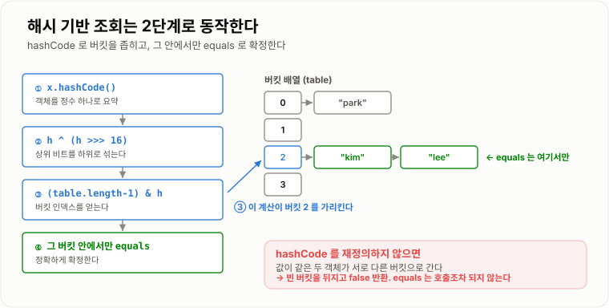
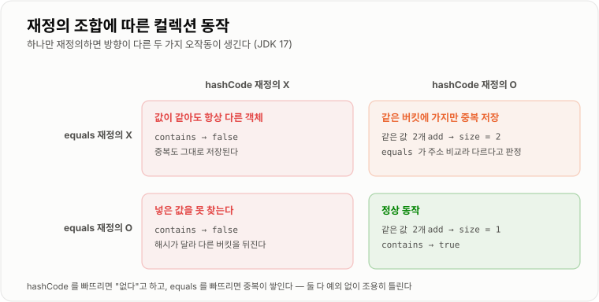
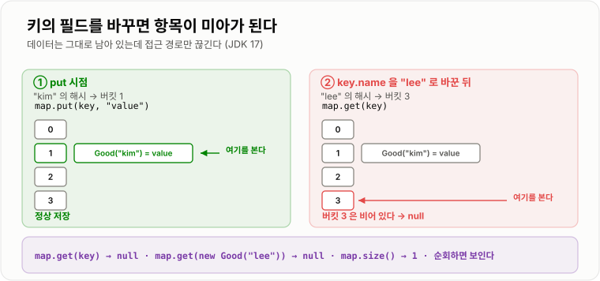

# equals · hashCode

> **`equals`는 "두 객체가 같은가"를 정의하고, `hashCode`는 "어느 칸에 넣을까"를 정한다. 둘 중 하나만 재정의하면 해시 기반 컬렉션이 조용히 오작동한다.**

---

## 1. 핵심 요약

**`hashCode`는 "어디를 뒤질까"이고 `equals`는 "그중 진짜인가"라서 둘 중 하나만 재정의하면 반드시 깨지며, 기준으로 삼을 필드는 자주 바뀌는 상태가 아니라 절대 변하지 않는 비즈니스 키다.**

### 한눈에 보기

* `Object`의 기본 `equals`는 **주소 비교**이고, 기본 `hashCode`는 **객체마다 다른 값**이다. 값이 같아도 다른 객체로 취급된다.
* 해시 기반 컬렉션은 **`hashCode`로 버킷을 찾고 `equals`로 최종 확인**한다. 두 단계라서 둘 다 필요하다.
* `equals`만 재정의하면 **`HashSet`에 넣은 값을 못 찾고**, `hashCode`만 재정의하면 **중복이 그대로 저장된다** (실측 확인).
* 해시 값이 같다고 같은 객체가 아니다. **`"Aa"`와 `"BB"`의 `hashCode`는 둘 다 2112**이고, `Long.valueOf(1)`과 `Integer.valueOf(1)`도 해시가 같지만 `equals`는 `false`다.
* **키로 쓴 객체의 필드를 바꾸면 그 항목은 미아가 된다.** `get()`으로도 못 찾고 지울 수도 없는데 `size()`에는 잡히고 순회에는 보인다.
* 상수 `hashCode`를 반환하면 `HashSet` 삽입이 **2,408배 느려진다** (30,000건 실측 7,224ms 대 3ms).

### 무엇을 해결하는가

#### 해결하려는 문제

Java에서 `==`는 **참조(주소)가 같은지**를 본다. 하지만 우리가 실제로 궁금한 것은 대부분 "**내용이 같은가**"다.

```java
Member a = new Member("kim", "010-1234-5678");
Member b = new Member("kim", "010-1234-5678");

a == b        // false — 서로 다른 객체다
a.equals(b)   // Object 의 기본 구현도 == 이라 false
```

주민번호가 같은 두 회원 객체는 **업무적으로 같은 사람**인데 Java는 다르다고 한다. 이 간극을 메우는 것이 `equals` 재정의다.

`hashCode`는 여기에 성능 문제가 얹힌 것이다. 100만 개 중에 같은 것이 있는지 확인하려면 `equals`를 100만 번 호출해야 한다. **비교하기 전에 후보를 좁힐 방법**이 필요하고, 그것이 해시다.

#### 이 개념이 없을 때

`equals`가 없으면 중복 검사를 직접 짜야 한다.

```java
public boolean contains(List<Member> members, Member target) {
    for (Member m : members) {
        if (m.getName().equals(target.getName())
                && m.getPhone().equals(target.getPhone())) {   // 필드를 하나하나 비교
            return true;
        }
    }
    return false;
}
```

문제가 여럿이다.

* 필드가 추가되면 **이 코드를 찾아 고쳐야 한다.** 놓치면 조용히 틀린 결과가 나온다.
* 같은 비교 로직이 여러 곳에 복사된다.
* `List.contains`, `Set`, `Map` 같은 **표준 API를 전혀 쓸 수 없다.** 전부 `equals`를 호출하기 때문이다.
* 원소가 늘면 `O(n)` 비교가 그대로 비용이 된다.

`equals`와 `hashCode`를 제대로 재정의하면 이 코드는 한 줄이 되고, 게다가 `O(1)`이 된다.

```java
set.contains(target);
```

---

## 2. 동작 원리

### 핵심 구성 요소

| 개념                  | 설명                                                | 중요한 이유                                    |
| ------------------- | ------------------------------------------------- | ----------------------------------------- |
| **동일성 (identity)**  | 같은 객체인가. `==`로 판정한다                               | 주소 비교라 값이 같아도 `false`다.                   |
| **동등성 (equality)**  | 논리적으로 같은 값인가. `equals`로 판정한다                      | 업무에서 "같다"의 의미를 코드로 정의하는 곳이다.             |
| **`Object.equals`** | 기본 구현이 `this == obj`                              | 재정의하지 않으면 동등성이 곧 동일성이 된다.                |
| **`Object.hashCode`** | 객체마다 사실상 고유한 정수. 주소 기반                            | 값이 같아도 다른 값이 나온다.                        |
| **해시 코드**           | 객체를 정수 하나로 요약한 값                                  | 비교 후보를 좁히는 데 쓴다.                          |
| **버킷 (bucket)**     | 해시로 결정되는 저장 칸                                     | 같은 버킷 안에서만 `equals`를 호출한다.               |
| **해시 충돌**           | 서로 다른 객체가 같은 해시를 갖는 것                             | 피할 수 없다. 정수는 42억 개뿐이다.                    |
| **`equals` 규약**     | 반사성·대칭성·추이성·일관성·`null` 비교                         | 어기면 컬렉션 동작이 정의되지 않는다.                     |
| **`hashCode` 규약**   | `equals`가 참이면 해시도 반드시 같아야 한다                      | 이 방향만 강제된다. 역은 아니다.                       |
| **불변 키**            | 키로 쓰는 객체는 필드를 바꾸지 않는 것                            | 바꾸면 해시가 달라져 항목이 미아가 된다.                   |
| **비즈니스 키**          | 업무적으로 대상을 식별하는 필드 (주문번호, 사업자번호 등)                 | `equals` 기준으로 삼기에 가장 안전하다.                |
| **`Objects.equals`** | `null`을 안전하게 비교하는 유틸리티                            | `NullPointerException`을 막는다.              |
| **`Objects.hash`**  | 여러 필드를 묶어 해시를 만드는 유틸리티                            | 가변인자 배열이 생겨 성능이 필요한 곳에는 부적합하다.            |

#### 개념 간 관계

```text
"두 객체가 같은가?" 라는 질문에는 두 층이 있다

  동일성 (==)        →  같은 메모리 주소인가        →  JVM 이 정한다
  동등성 (equals)    →  논리적으로 같은 값인가       →  개발자가 정한다

해시 기반 컬렉션은 이 둘 사이에 hashCode 를 끼워 넣는다

  hashCode  →  "어느 칸을 뒤져야 하는가"   (빠르게 후보를 좁힌다)
  equals    →  "그 칸 안에서 진짜 같은가"   (정확하게 확정한다)
```

**둘의 역할이 다르다는 것이 핵심이다.** `hashCode`는 빠르지만 부정확하고, `equals`는 정확하지만 느리다. 해시 컬렉션은 **빠른 것으로 후보를 좁히고 정확한 것으로 확정**한다.

### 내부 동작 과정

#### 해시 기반 조회의 두 단계

`HashSet.contains(x)`가 실제로 하는 일이다.

```text
1. x.hashCode()  호출              →  h
2. h ^ (h >>> 16)                  →  확산된 해시
3. (table.length - 1) & 확산값      →  버킷 인덱스
4. 그 버킷이 비어 있으면            →  false. equals 는 아예 호출되지 않는다
5. 버킷에 원소가 있으면
      그 안의 원소들과 x.equals(원소) 비교  →  하나라도 true 면 찾은 것
```



*해시가 다르면 다른 버킷을 뒤지므로 `equals`는 호출조차 되지 않는다 — 이것이 `hashCode`만 빠뜨려도 검색이 실패하는 이유다.*

**4번이 결정적이다.** `hashCode`를 재정의하지 않으면 값이 같은 두 객체가 서로 다른 버킷으로 가고, 엉뚱한 빈 칸을 뒤진 뒤 `false`를 반환한다. `equals`가 아무리 정확해도 **호출될 기회 자체가 없다.**

#### 재정의 조합별 실제 동작

네 가지 조합을 실제로 실행해 확인했다.

```text
[equals 만 재정의]
  a.equals(b)                     →  true
  a.hashCode() == b.hashCode()    →  false     ← 다른 버킷으로 간다
  set.add(a); set.contains(b)     →  false     ← 넣은 값을 못 찾는다

[hashCode 만 재정의]
  같은 값 두 개를 add             →  set.size() = 2   ← 중복이 저장된다
  (같은 버킷에는 갔지만 equals 가 주소 비교라 다르다고 판정)

[둘 다 재정의]
  같은 값 두 개를 add             →  set.size() = 1
  set.contains(new Good("kim"))   →  true      ← 정상

[둘 다 재정의 안 함]
  값이 같아도 항상 다른 객체로 취급된다
```



*하나만 재정의하면 방향이 다른 두 가지 오작동이 생긴다 — 못 찾거나, 중복이 쌓이거나.*

**두 오류의 성격이 다르다는 점을 알아 두면 좋다.** `hashCode`를 빠뜨리면 "없다"고 하고, `equals`를 빠뜨리면 "중복이 쌓인다". 둘 다 예외 없이 조용히 틀린다.

#### `equals`의 5가지 규약

`Object.equals`의 문서에 명시된 계약이다. 어기면 컬렉션의 동작이 **정의되지 않는다.**

| 규약      | 의미                                              | 어겼을 때                    |
| ------- | ----------------------------------------------- | ------------------------ |
| **반사성** | `x.equals(x)`는 항상 `true`                        | 컬렉션에서 자기 자신을 못 찾는다       |
| **대칭성** | `x.equals(y)`가 `true`면 `y.equals(x)`도 `true`     | 비교 순서에 따라 결과가 달라진다       |
| **추이성** | `x=y`이고 `y=z`면 `x=z`                            | 상속 구조에서 흔히 깨진다           |
| **일관성** | 값이 안 바뀌면 몇 번 호출해도 같은 결과                         | 가변 필드를 쓰면 깨진다            |
| **`null`** | `x.equals(null)`은 항상 `false`                     | `NullPointerException`   |

대칭성이 깨지는 전형적인 예다.

```java
public class CaseInsensitiveString {
    private final String s;

    @Override
    public boolean equals(Object o) {
        if (o instanceof CaseInsensitiveString) {
            return s.equalsIgnoreCase(((CaseInsensitiveString) o).s);
        }
        if (o instanceof String) {              // String 과도 비교하려는 욕심
            return s.equalsIgnoreCase((String) o);
        }
        return false;
    }
}
```

```text
cis.equals("hello")   →  true
"hello".equals(cis)   →  false     ← String 은 CaseInsensitiveString 을 모른다
```

**한쪽만 참인 관계는 컬렉션이 감당하지 못한다.** `contains`의 결과가 어느 쪽을 기준으로 비교했느냐에 따라 달라진다.

#### `hashCode`의 규약 — 한 방향만 강제된다

```text
반드시 지켜야 하는 것
  a.equals(b) == true   →   a.hashCode() == b.hashCode()   반드시 같아야 한다

지킬 필요 없는 것 (지킬 수도 없다)
  a.hashCode() == b.hashCode()   →   a.equals(b)   같을 필요 없다
```

두 번째가 성립할 수 없는 이유는 단순하다. **`int`는 약 42억 개뿐인데 만들 수 있는 객체는 무한하다.** 충돌은 원리적으로 피할 수 없다.

실측으로 확인한 충돌 사례다.

```text
"Aa".hashCode()  =  2112
"BB".hashCode()  =  2112        ← 같다

"AaAa" = "BBBB" = "AaBB" = "BBAa" = 2031744    ← 4개가 전부 같다

Long.valueOf(1).hashCode()  ==  Integer.valueOf(1).hashCode()   →  true
Long.valueOf(1).equals(Integer.valueOf(1))                      →  false
```

마지막이 특히 좋은 예다. **해시가 같아도 `equals`는 `false`**이고, 이것은 버그가 아니라 정상이다. `Long`과 `Integer`는 타입이 다르므로 같을 수 없다.

`"Aa"`와 `"BB"`가 충돌하는 이유는 `String.hashCode`의 공식에서 나온다.

```text
s[0]*31^(n-1) + s[1]*31^(n-2) + ... + s[n-1]

"Aa" = 'A'*31 + 'a' = 65*31 + 97 = 2015 + 97 = 2112
"BB" = 'B'*31 + 'B' = 66*31 + 66 = 2046 + 66 = 2112
```

`'A'`와 `'B'`의 차이 1에 31을 곱한 31과, `'a'`와 `'B'`의 차이 31이 정확히 상쇄된다.

**31을 쓰는 이유**는 두 가지다. 홀수 소수라서 곱셈 결과의 분포가 좋고, `31 * i`를 컴파일러가 `(i << 5) - i`라는 시프트와 뺄셈으로 최적화할 수 있다.

#### 가변 키 — 가장 위험한 실수

키로 쓴 객체의 필드를 바꾸면 어떻게 되는지 실제로 확인했다.

```text
Good key = new Good("kim");
map.put(key, "value");

[필드를 바꾸기 전]
  map.get(key)              →  "value"

[key.name 을 "lee" 로 바꾼 뒤]
  map.get(key)              →  null       ← 원래 키로도 못 찾는다
  map.get(new Good("lee"))  →  null       ← 새 값으로도 못 찾는다
  map.size()                →  1          ← 그런데 크기는 1이다
  entrySet 순회             →  1개가 보인다  ← 순회하면 나온다
```

**항목은 사라지지 않았다.** 여전히 원래 해시가 가리키던 버킷에 있다. 그런데 이제 `get()`은 바뀐 필드로 해시를 계산해 **다른 버킷을 뒤지므로** 영원히 찾지 못한다.

```text
put 시점                              필드 변경 후 get 시점
  "kim" 의 해시 → 버킷 3               "lee" 의 해시 → 버킷 9
  버킷 3 에 저장                        버킷 9 를 뒤진다 → 비어 있다 → null

  실제 데이터는 버킷 3 에 그대로 있다
```



*저장할 때의 버킷과 찾을 때의 버킷이 달라지면 데이터는 남아 있는데 접근 경로만 끊긴다.*

`remove()`로 지울 수도 없다. 지우려면 먼저 찾아야 하는데 찾을 수가 없기 때문이다. **메모리 누수의 원인**이 되기도 한다.

그래서 규칙은 단순하다. **키로 쓰는 객체는 불변으로 만들거나, 최소한 `equals`/`hashCode`가 참조하는 필드는 바꾸지 않는다.**

#### `compareTo`와의 관계

`TreeSet`·`TreeMap`은 `equals`가 아니라 **`compareTo`(또는 `Comparator`)로 중복을 판정한다.** 둘이 어긋나면 컬렉션마다 결과가 달라진다.

```java
class Money implements Comparable<Money> {
    int amount;
    String currency;

    @Override public boolean equals(Object o) {   // 금액 + 통화
        Money m = (Money) o;
        return amount == m.amount && currency.equals(m.currency);
    }
    @Override public int compareTo(Money o) {     // 금액만
        return Integer.compare(amount, o.amount);
    }
}
```

```text
Money usd = new Money(1000, "USD");
Money krw = new Money(1000, "KRW");

usd.equals(krw)      →  false    (통화가 다르다)
usd.compareTo(krw)   →  0        (금액이 같다)

HashSet 에 둘 다 넣으면  →  size = 2   (equals 기준이라 둘 다 남는다)
TreeSet 에 둘 다 넣으면  →  size = 1   (compareTo 기준이라 하나가 삼켜진다)
```

**1,000달러를 넣었더니 1,000원이 사라졌다.** 예외도 경고도 없다.

그래서 `Comparable`을 구현할 때는 `compareTo`가 0을 반환하는 조건과 `equals`가 `true`인 조건을 **일치시키는 것이 권장된다.**

---

## 3. 특징과 비교

| 구분          | 내용                                       |
| ----------- | ---------------------------------------- |
| **장점**      | 표준 컬렉션을 그대로 쓸 수 있고, 중복 검사가 `O(n)`에서 `O(1)`이 되며, 비교 로직이 한곳에 모인다. |
| **단점**      | 둘을 항상 함께 관리해야 하고, 가변 필드를 넣으면 컬렉션이 깨지며, 상속에서 대칭성이 깨지기 쉽다. **잘못 구현해도 예외 없이 조용히 틀린다.** |
| **적합한 상황**  | `Set`·`Map` 키로 쓰거나 값 객체(VO)일 때. **불변인 비즈니스 키 필드만으로** 구성할 때. |
| **주의할 상황**  | JPA 엔티티에서 자동 생성 ID나 지연 로딩 연관관계를 포함시키는 것. `HashMap`에 넣은 키 객체를 나중에 수정하는 것. |

### 성능 특성

#### 해시 품질이 성능을 결정한다

| 상황                | 버킷 상태          | `contains` 복잡도  |
| ----------------- | -------------- | -------------- |
| 해시가 고르게 분산        | 버킷마다 1~2개      | `O(1)`         |
| 해시가 일부에 몰림        | 몇몇 버킷이 길어짐     | `O(k)`         |
| 해시가 전부 같음 (트리화 전) | 한 버킷에 전부       | `O(n)`         |
| 해시가 전부 같음 (트리화 후) | 한 버킷이 레드-블랙 트리 | `O(log n)`     |

#### 상수 `hashCode`의 대가 — 실측

`hashCode()`가 항상 1을 반환하는 클래스와 정상 클래스를 각각 30,000개 `HashSet`에 넣어 측정했다.

```text
상수 hashCode 반환   →  7,224 ms
정상 hashCode        →      3 ms
                        약 2,408배
```

JDK 8부터 버킷이 트리화되어 `O(log n)`으로 완화되는데도 이만큼 차이가 난다. **트리화가 나쁜 `hashCode`를 구제해 주지는 못한다.** 트리 노드를 만들고 비교하는 비용 자체가 크기 때문이다.

이 클래스는 `Comparable`을 구현하지 않아 트리 정렬 시 `System.identityHashCode`로 순서를 매기는데, 이 경로는 더 느리다. **`hashCode`를 잘못 만들면 O 표기로 설명되지 않는 비용이 붙는다.**

#### `equals` 구현 순서의 영향

`equals`는 비교가 짧게 끝날수록 좋다.

```java
// 좋다 — 싼 검사부터
if (this == o) return true;                       // 참조 비교. 가장 싸다
if (o == null || getClass() != o.getClass()) return false;
Member m = (Member) o;
if (age != m.age) return false;                   // 기본형 비교
return Objects.equals(email, m.email);            // 문자열 비교. 가장 비싸다

// 나쁘다 — 비싼 것부터
return Objects.equals(description, m.description)  // 긴 문자열부터 비교
        && age == m.age;
```

`&&`는 단축 평가라 앞이 `false`면 뒤를 계산하지 않는다. **구분력이 높고 싼 필드를 앞에 두면** 대부분의 비교가 첫 조건에서 끝난다.

#### 해시 계산 비용

| 필드 타입          | `hashCode` 비용         |
| -------------- | --------------------- |
| `int`, `boolean` | 거의 없음                 |
| `long`         | 시프트 + XOR 한 번         |
| `String`       | 최초 1회 `O(길이)`, 이후 캐시됨 |
| 컬렉션 필드         | 원소 수에 비례. **`O(n)`**  |
| 배열 필드          | `Arrays.hashCode`로 `O(n)` |

**컬렉션을 `hashCode`에 포함하면 해시 계산 자체가 `O(n)`이 된다.** 맵의 키로 쓰면 조회마다 이 비용이 든다. 비즈니스 키 하나만 쓰는 것이 좋은 이유다.

#### `Objects.hash`의 숨은 비용

```java
return Objects.hash(email, name, age);
```

이 호출은 내부적으로 **`Object[]` 배열을 만들고 기본형을 박싱한다.** 대부분의 상황에서는 무시할 만하지만, 대량 반복 경로에서는 직접 구현이 유리하다.

### 장점과 단점

#### 제대로 재정의했을 때

| 장점                   | 이유                                           |
| -------------------- | -------------------------------------------- |
| 표준 컬렉션을 그대로 쓸 수 있다   | `Set`·`Map`·`contains`·`distinct`가 모두 동작한다.  |
| 중복 검사가 `O(1)`이 된다    | 전수 비교 대신 버킷 조회 한 번이다.                        |
| 비교 로직이 한곳에 모인다       | 필드가 늘어도 `equals` 한 곳만 고치면 된다.                |
| 테스트 코드가 간결해진다        | `assertEquals(expected, actual)`이 값 비교로 동작한다. |
| 캐시 키로 쓸 수 있다         | Spring Cache, Caffeine 등이 키의 해시에 의존한다.       |

#### 재정의의 부담과 위험

| 단점                  | 이유 및 주의점                                       |
| ------------------- | ---------------------------------------------- |
| 둘을 함께 관리해야 한다       | 필드를 추가하고 한쪽만 고치면 조용히 깨진다.                      |
| 가변 필드를 쓰면 컬렉션이 깨진다  | 키로 쓴 뒤 값을 바꾸면 항목이 미아가 된다.                      |
| 상속에서 대칭성·추이성이 깨지기 쉽다 | `instanceof`와 하위 클래스 조합이 특히 위험하다.              |
| 잘못 구현해도 예외가 없다      | 못 찾거나 중복이 쌓이는 형태로 **조용히** 틀린다.                 |
| 성능에 직접 영향을 준다       | 나쁜 `hashCode` 하나가 실측 2,408배 차이를 만든다.           |
| JPA 엔티티에서는 특히 까다롭다  | ID가 나중에 생기고, 프록시 때문에 `getClass()`가 어긋난다.       |

#### 자동 생성 도구별 특성

| 방법                    | 장점                     | 주의점                                     |
| --------------------- | ---------------------- | --------------------------------------- |
| **`record`**          | 한 줄. 불변이 강제된다          | 모든 컴포넌트가 포함된다. 일부만 쓸 수 없다               |
| **IDE 자동 생성**         | 필드를 골라 넣을 수 있다         | 필드 추가 시 **다시 생성해야 한다**                  |
| **Lombok `@EqualsAndHashCode`** | 어노테이션 한 줄              | 기본이 **전체 필드**다. 연관관계까지 끌고 가 무한 루프가 난다   |
| **Lombok `@Data`**    | 여러 어노테이션을 한 번에         | `@EqualsAndHashCode`가 포함되어 엔티티에는 위험하다   |
| **직접 작성**             | 완전한 제어. 성능 최적화 가능      | 실수하기 쉽고 필드 추가 시 놓치기 쉽다                  |

### 어떤 상황에서 고르는가

#### 재정의 여부 판단

```text
이 객체를 Set 에 넣거나 Map 의 키로 쓰는가?
├─ 예 → 반드시 둘 다 재정의한다
└─ 아니오 → List.contains, remove, distinct, assertEquals 를 쓰는가?
             ├─ 예 → equals 재정의 (hashCode 도 함께 하는 것이 안전하다)
             └─ 아니오 → 값 객체(VO)인가?
                          ├─ 예 → 재정의한다. 값 객체의 정체성은 값이다
                          └─ 아니오 → 재정의하지 않는다 (동일성이 곧 정체성)
```

#### 어떤 필드를 넣을 것인가

| 필드 성격                    | 포함 여부   | 이유                          |
| ------------------------ | ------- | --------------------------- |
| 비즈니스 키 (주문번호, 사업자번호, 이메일) | **포함**  | 업무적으로 대상을 식별하는 값이다          |
| 불변으로 선언된 필드              | **포함**  | 바뀌지 않으므로 안전하다               |
| 자주 바뀌는 상태 (수정일시, 조회수)     | 제외      | 바뀌는 순간 해시가 달라진다             |
| 파생 값 (합계, 캐시)            | 제외      | 원본 필드로 이미 구분된다              |
| 컬렉션 필드                   | 제외      | 해시 계산이 `O(n)`이 되고 순환 참조 위험  |
| 양방향 연관관계 필드              | **반드시 제외** | 무한 재귀로 `StackOverflowError` |

#### 사용하기 좋은 상황

* **값 객체(VO)** — `Money`, `Address`, `Period`. 값이 같으면 같은 객체로 취급하는 것이 자연스럽다.
* **DTO** — 테스트에서 `assertEquals`로 비교할 일이 많다.
* **`Map`의 키** — 애초에 이것 없이는 동작하지 않는다.
* **`Set`으로 중복 제거** — 중복 판정 기준을 정의하는 것이 곧 `equals`다.
* **캐시 키** — 라이브러리가 해시로 조회한다.

#### 사용하지 않는 것이 좋은 상황

* **가변 객체를 키로 쓰는 것** — 필드를 바꾸는 순간 미아가 된다.
* **`equals`와 다른 필드로 `hashCode`를 만드는 것** — 규약 위반이다.
* **부동소수점 `float`/`double`을 직접 비교** — `Float.compare`/`Double.compare`를 쓴다. `NaN`과 `-0.0` 때문이다.
* **Lombok `@Data`를 JPA 엔티티에** — 전체 필드가 들어가 연관관계까지 끌고 간다.
* **`equals`에서 DB 조회나 외부 호출** — 일관성 규약을 정면으로 어긴다.
* **`hashCode`에 난수나 현재 시각** — 호출할 때마다 달라져 아무것도 못 찾는다.

#### 선택 기준

1. **이 객체의 정체성은 값인가, 존재 자체인가?**
2. **해시 기반 컬렉션에 넣는가?** — 넣는다면 선택의 여지가 없다
3. **어떤 필드가 이 객체를 유일하게 식별하는가?**
4. **그 필드는 객체 수명 동안 바뀌지 않는가?**
5. **상속 계층이 있는가?** — `getClass()`와 `instanceof` 중 무엇을 쓸지 갈린다
6. **JPA 엔티티인가?** — 프록시와 ID 생성 시점을 고려해야 한다

### 비슷한 기술과 비교

#### `==`와 `equals`

| 비교 항목  | `==`                | `equals`               |
| ------ | ------------------- | ---------------------- |
| 비교 대상  | 참조(주소) 또는 기본형 값     | 논리적 내용                 |
| 정하는 주체 | JVM                 | 개발자                    |
| 재정의    | 불가 (연산자)            | 가능                     |
| `null` | `null == null`은 `true` | `null.equals()`는 예외    |
| 기본형    | 값 비교                | 쓸 수 없다 (객체 메서드)        |
| 성능     | 가장 빠름               | 구현에 따라 다름              |

```java
String a = "hello";                  // 상수 풀
String b = "hello";                  // 같은 상수를 참조
String c = new String("hello");      // 새 객체

a == b        // true   같은 상수 풀 객체
a == c        // false  다른 객체
a.equals(c)   // true   내용이 같다
```

#### `hashCode`와 `equals`

| 비교 항목  | `hashCode`            | `equals`          |
| ------ | --------------------- | ----------------- |
| 목적     | 후보를 빠르게 좁힌다           | 정확하게 확정한다         |
| 반환     | `int`                 | `boolean`         |
| 정확도    | 부정확 (충돌 가능)           | 정확                |
| 비용     | 보통 매우 싸다              | 필드 수에 비례          |
| 호출 시점  | 버킷을 찾을 때              | 같은 버킷 안에서 비교할 때   |
| 규약 방향  | `equals` 참 → 해시 같아야 함 | 해시 같음 → `equals` 무관 |

#### `equals`와 `compareTo`

| 비교 항목  | `equals`          | `compareTo`             |
| ------ | ----------------- | ----------------------- |
| 반환     | `boolean`         | `int` (음수·0·양수)         |
| 정의하는 것 | 같은가              | 순서                      |
| 사용처    | `HashSet`, `HashMap`, `contains` | `TreeSet`, `TreeMap`, `sort` |
| 필수 여부  | 해시 컬렉션에 필수        | 정렬 컬렉션에 필수              |
| 어긋나면   | —                 | 같은 값이 컬렉션마다 다르게 판정된다    |
| 권장 사항  | —                 | `compareTo == 0`과 `equals`를 일치시킨다 |

#### `Objects.equals` · `Objects.hashCode` · `Objects.hash`

| 메서드                  | 인자        | 동작                       | `null`일 때 |
| -------------------- | --------- | ------------------------ | --------- |
| `Objects.equals(a,b)` | 객체 2개     | `null` 안전 비교             | 둘 다 `null`이면 `true` |
| `Objects.hashCode(o)` | 객체 1개     | `o.hashCode()` 호출        | `0`       |
| `Objects.hash(...)`  | 가변인자      | 배열로 묶어 해시 계산             | `Objects.hash(null)`은 `31` |
| `Objects.requireNonNull(o)` | 객체 1개     | `null`이면 예외              | `NullPointerException` |

**필드 하나만 쓸 때 `Objects.hash(field)`보다 `field.hashCode()`가 낫다.** 배열 생성이 없기 때문이다. 다만 `null`이 가능하면 `Objects.hashCode(field)`를 쓴다.

#### 자동 생성 방식 비교

| 비교 항목      | `record`       | Lombok `@EqualsAndHashCode` | IDE 생성        | 직접 작성  |
| ---------- | -------------- | --------------------------- | ------------- | ------ |
| 코드량        | 가장 적음          | 적음                          | 많음 (생성됨)      | 많음     |
| 필드 선택      | 불가 (전체)        | `of`/`exclude`로 가능          | 가능            | 완전 자유  |
| 필드 추가 시    | 자동 반영          | 자동 반영                       | **수동 재생성 필요** | 수동 수정  |
| 불변 강제      | 강제됨            | 안 됨                         | 안 됨           | 안 됨    |
| JPA 엔티티 적합 | 부적합 (기본 생성자 없음) | 주의 필요                       | 적합            | 가장 적합  |
| 선택 기준      | DTO·값 객체       | 단순 클래스                      | 일반 클래스        | 엔티티·성능 |

---

## 4. 실무 주의사항

### 백엔드 실무 적용

#### Spring·Java

**DTO는 `record`로 만든다.**

```java
public record OrderResponse(Long orderId, String status, int amount) { }
```

`equals`·`hashCode`·`toString`이 자동으로 생기고 불변이라 안전하다. 테스트에서 바로 비교할 수 있다.

```java
@Test
void 주문_응답을_변환한다() {
    OrderResponse expected = new OrderResponse(1L, "PAID", 10000);
    OrderResponse actual = orderService.findOrder(1L);

    assertThat(actual).isEqualTo(expected);   // equals 가 없으면 항상 실패한다
}
```

**값 객체는 값으로 비교한다.**

```java
public record Money(long amount, String currency) {

    public Money {
        if (amount < 0) {
            throw new IllegalArgumentException("금액은 음수일 수 없다");
        }
    }

    public Money plus(Money other) {
        if (!currency.equals(other.currency)) {
            throw new IllegalArgumentException("통화가 다르다");
        }
        return new Money(amount + other.amount, currency);   // 새 객체를 반환한다
    }
}
```

불변이므로 `Map`의 키로 써도 미아가 될 걱정이 없다.

#### JPA 엔티티 — 가장 까다로운 경우

엔티티는 세 가지 문제가 겹친다.

**첫째, ID가 나중에 생긴다.**

```java
Order order = new Order();          // id = null
Set<Order> set = new HashSet<>();
set.add(order);                     // null 기준으로 해시 계산

orderRepository.save(order);        // 이제 id = 1 이 채워진다
set.contains(order);                // false — 해시가 달라졌다
```

영속화 시점에 ID가 채워지면서 **해시가 바뀐다.** 앞에서 본 가변 키 문제가 그대로 재현된다.

**둘째, 프록시 때문에 `getClass()`가 어긋난다.**

```java
Order proxy = orderRepository.getReferenceById(1L);
proxy.getClass();     // Order$HibernateProxy$xYz — Order 가 아니다

order.equals(proxy);  // getClass() 비교라면 false
```

**셋째, Lombok `@Data`는 전체 필드를 넣는다.**

```java
@Entity
@Data                       // 위험하다
public class Order {
    @OneToMany(mappedBy = "order")
    private List<OrderLine> lines;    // equals 가 이 컬렉션까지 비교한다
}
```

연관관계가 양방향이면 `Order.equals` → `OrderLine.equals` → `Order.equals` … 로 **무한 재귀**가 되고, 단방향이어도 지연 로딩 컬렉션을 건드려 **의도치 않은 쿼리**가 나간다.

권장되는 형태는 이렇다.

```java
@Entity
public class Order {

    @Id
    @GeneratedValue
    private Long id;

    @OneToMany(mappedBy = "order")
    private List<OrderLine> lines = new ArrayList<OrderLine>();

    @Override
    public boolean equals(Object o) {
        if (this == o) {
            return true;
        }
        // getClass() 대신 instanceof — 프록시도 통과시킨다
        if (!(o instanceof Order)) {
            return false;
        }
        Order other = (Order) o;
        // id 가 아직 없으면 동일성으로만 판정한다
        return id != null && id.equals(other.id);
    }

    @Override
    public int hashCode() {
        // 상수를 반환한다 — id 가 채워져도 해시가 바뀌지 않는다
        return getClass().hashCode();
    }
}
```

`hashCode()`가 상수라는 점이 이상해 보이지만 **의도된 것이다.** 앞서 본 대로 해시가 바뀌면 컬렉션에서 미아가 되므로, 영속화 전후로 값이 변하지 않는 것이 더 중요하다. 성능 손해는 있지만 **한 영속성 컨텍스트 안의 엔티티 수는 보통 작다.**

더 나은 대안은 **DB가 아니라 애플리케이션이 ID를 만드는 것**이다.

```java
@Entity
public class Order {

    @Id
    private String id = UUID.randomUUID().toString();   // 생성 시점에 확정된다

    @Override
    public boolean equals(Object o) {
        if (this == o) return true;
        if (!(o instanceof Order)) return false;
        return id.equals(((Order) o).id);
    }

    @Override
    public int hashCode() {
        return id.hashCode();       // 절대 바뀌지 않는다
    }
}
```

`@OneToMany`에 `Set`을 쓴다면 이 문제는 **선택이 아니라 필수**가 된다. 컬렉션이 원소를 넣을 때 해시를 쓰기 때문이다.

#### 데이터베이스·캐시

**캐시 키의 `equals`/`hashCode`는 캐시 적중률을 결정한다.**

```java
@Cacheable(value = "products", key = "#condition")
public List<Product> search(SearchCondition condition) { ... }
```

`SearchCondition`에 `equals`/`hashCode`가 없으면 **매번 다른 키로 인식되어 캐시가 전혀 동작하지 않는다.** 호출할 때마다 새 객체를 만들기 때문이다. 예외도 경고도 없이 적중률만 0이 된다.

`record`로 만들면 이 문제가 사라진다.

```java
public record SearchCondition(String keyword, int minPrice, int maxPrice) { }
```

**분산 캐시에서는 `hashCode`를 키로 쓰면 안 된다.**

```text
Redis 키로 hashCode 를 쓰면
  - 서버마다 hashCode 값이 다를 수 있다 (Object 기본 구현은 주소 기반)
  - JDK 버전이 바뀌면 값이 달라질 수 있다
  - 충돌하면 다른 데이터를 덮어쓴다
```

`hashCode`는 **한 JVM 안에서 후보를 좁히는 용도**로만 설계됐다. 영속적인 식별자가 필요하면 비즈니스 키나 UUID를 쓴다.

**대량 데이터 중복 제거는 `Set`으로 한다.**

```java
// 나쁘다 — O(n²)
List<Long> unique = new ArrayList<Long>();
for (Long id : ids) {
    if (!unique.contains(id)) {      // 매번 O(n)
        unique.add(id);
    }
}

// 좋다 — O(n)
Set<Long> unique = new LinkedHashSet<Long>(ids);   // 순서도 유지된다
```

앞 노트에서 측정한 대로 10만 건 기준 `ArrayList.contains`와 `HashSet.contains`는 2,000배 이상 차이가 난다.

#### 동시성·분산 환경

**`hashCode`가 일관되지 않으면 동시 환경에서 더 크게 터진다.**

`ConcurrentHashMap`은 해시로 락 단위(버킷)를 정한다. 해시가 호출마다 달라지면 **다른 락을 잡게 되어** 동기화가 무의미해진다.

```java
// 절대 하면 안 된다
@Override
public int hashCode() {
    return new Random().nextInt();       // 호출할 때마다 달라진다
}
```

**분산 캐시나 샤딩의 키 분배도 해시에 의존한다.**

```text
샤드 번호 = key.hashCode() % 샤드 수
```

`hashCode`가 편향되면 특정 샤드에만 부하가 몰린다. 문자열 키에 공통 접두사가 길면 이런 일이 생기므로, 실무에서는 **MurmurHash나 CRC32 같은 전용 해시 함수**를 쓰는 경우가 많다.

### 자주 하는 오해

| 잘못된 이해                                        | 올바른 이해                                                                     |
| --------------------------------------------- | -------------------------------------------------------------------------- |
| `equals`만 재정의하면 충분하다                          | `HashSet`에 넣은 값을 못 찾는다 (실측 `contains` = `false`). 해시가 달라 다른 버킷을 뒤진다.       |
| `hashCode`만 재정의하면 중복이 걸러진다                    | 같은 버킷에 가지만 `equals`가 주소 비교라 중복이 그대로 저장된다 (실측 `size` = 2).                  |
| `hashCode`가 같으면 같은 객체다                        | `"Aa"`와 `"BB"`가 둘 다 2112다. `Long.valueOf(1)`과 `Integer.valueOf(1)`도 해시가 같다. |
| `hashCode`가 다르면 `equals`도 무조건 `false`다        | 이것은 맞다. 규약상 `equals`가 참이면 해시는 반드시 같아야 하므로 대우가 성립한다.                       |
| 해시 충돌은 버그다                                    | `int`는 42억 개인데 객체는 무한하다. 충돌은 원리적으로 필연이다.                                  |
| `hashCode`는 메모리 주소다                           | 초기 JVM 구현이 그랬을 뿐, 명세는 "객체마다 구분되는 정수"만 요구한다.                               |
| `hashCode` 값은 JVM이 달라도 같다                     | 보장되지 않는다. 영속 저장이나 분산 키로 쓰면 안 된다.                                          |
| `equals`가 참이면 `hashCode`도 자동으로 같아진다           | 자동이 아니다. 개발자가 같은 필드로 구현해야 성립한다.                                           |
| 키로 쓴 객체의 필드를 바꿔도 `Map`이 알아서 처리한다              | 항목이 미아가 된다. `get`도 `remove`도 실패하는데 `size`에는 잡히고 순회에는 보인다.                  |
| `Map`에서 못 찾으면 항목이 삭제된 것이다                     | 데이터는 원래 버킷에 그대로 있다. 접근 경로만 끊긴 것이라 메모리 누수가 된다.                             |
| `TreeSet`도 `equals`로 중복을 판정한다                 | `compareTo`(또는 `Comparator`)로 판정한다. 어긋나면 원소가 조용히 사라진다 (실측 `size` 1 대 2).   |
| `record`의 `hashCode`는 `Objects.hash`와 같다      | 다르다. `Point(1,2)`가 33, `Objects.hash(1,2)`가 994다. 둘 다 규약은 지킨다.            |
| `Objects.hashCode(null)`과 `Objects.hash(null)`은 같다 | 각각 `0`과 `31`이다. 이름은 비슷하지만 다른 메서드다.                                        |
| 배열도 `equals`로 내용을 비교한다                        | `Object`의 `==` 비교라 `false`다. `Arrays.equals`를 써야 한다.                       |
| `getClass()`를 쓰면 항상 안전하다                      | 대칭성은 지켜지지만 JPA 프록시와는 어긋난다. 엔티티에서는 `instanceof`가 낫다.                       |
| `instanceof`가 더 유연하니 항상 낫다                    | 하위 클래스가 필드를 추가하면 대칭성이 깨진다. 상속 계획이 없으면 `getClass()`가 안전하다.                 |
| 상수 `hashCode`는 느리기만 하고 동작은 정상이다               | 동작은 맞지만 실측 2,408배 느려진다. 트리화가 있어도 구제되지 않는다.                                |
| `String`의 `hashCode`는 매번 계산된다                 | 불변이라 첫 호출 후 필드에 캐시된다 (실측 확인).                                             |
| `float`/`double`은 `==`로 비교하면 된다                | `NaN != NaN`이고 `0.0 == -0.0`이다. `Double.compare`를 쓴다.                      |
| Lombok `@Data`를 엔티티에 붙여도 된다                   | 전체 필드가 `equals`에 들어가 연관관계까지 비교한다. 무한 재귀나 불필요한 쿼리가 발생한다.                   |
| `equals`에서 필드를 많이 비교할수록 정확하다                  | 자주 바뀌는 필드가 들어가면 오히려 컬렉션이 깨진다. 비즈니스 키만 넣는다.                               |
| `hashCode`에 컬렉션 필드를 넣어도 된다                    | 해시 계산이 `O(n)`이 되고 양방향 연관에서는 무한 재귀가 난다.                                    |

---

## 5. 예제

### 표준 구현 형태

```java
import java.util.Objects;

public class Member {

    private final String email;      // 비즈니스 키
    private String name;             // equals 대상이 아니다
    private int age;

    public Member(String email, String name, int age) {
        this.email = email;
        this.name = name;
        this.age = age;
    }

    @Override
    public boolean equals(Object o) {
        if (this == o) {                                  // 1. 자기 자신이면 즉시 true
            return true;
        }
        if (o == null || getClass() != o.getClass()) {    // 2. null 과 타입 확인
            return false;
        }
        Member other = (Member) o;                        // 3. 형변환
        return Objects.equals(email, other.email);        // 4. 핵심 필드 비교
    }

    @Override
    public int hashCode() {
        return Objects.hash(email);                       // equals 와 같은 필드만
    }
}
```

네 단계에는 각각 이유가 있다.

1. **`this == o` 검사** — 자기 자신 비교는 흔하고, 이 한 줄로 나머지를 건너뛴다.
2. **`null` 검사** — `x.equals(null)`은 `false`여야 한다는 규약이다.
3. **타입 확인** — `getClass()`는 정확히 같은 클래스만, `instanceof`는 하위 클래스도 허용한다.
4. **`equals`와 `hashCode`가 같은 필드를 써야 한다** — 이것이 규약의 전부다.

### `getClass()`와 `instanceof`

```java
// getClass() — 대칭성이 항상 지켜진다. 하위 클래스와는 절대 같지 않다
if (o == null || getClass() != o.getClass()) return false;

// instanceof — 하위 클래스와도 비교 가능하지만 대칭성이 깨질 수 있다
if (!(o instanceof Member)) return false;
```

`instanceof`가 위험한 경우다.

```text
class Member { String email; }
class VipMember extends Member { int level; }

Member    m = new Member("a@b.com");
VipMember v = new VipMember("a@b.com", 3);

instanceof 로 구현하고 VipMember 가 level 까지 비교하면
  m.equals(v)  →  true    (Member 입장에서는 email 만 본다)
  v.equals(m)  →  false   (VipMember 입장에서는 level 도 봐야 한다)
                             ↑ 대칭성 위반
```

**상속을 쓸 계획이 없다면 `getClass()`가 안전하다.** 다만 JPA처럼 프록시 객체를 만드는 환경에서는 `getClass()`가 문제를 일으키므로 뒤에서 따로 다룬다.

### `record` — 자동으로 만들어 준다

```java
public record Point(int x, int y) { }
```

이 한 줄이 `equals`, `hashCode`, `toString`, 접근자를 모두 만들어 준다.

```text
new Point(1, 2).equals(new Point(1, 2))   →  true
두 객체의 hashCode                          →  같다 (실측 33)
```

`record`의 `hashCode`는 모든 컴포넌트를 조합하지만 **알고리즘이 `Objects.hash`와 다르다.**

```text
new Point(1, 2).hashCode()   =  33
Objects.hash(1, 2)           =  994
```

둘 다 규약은 지키므로 문제는 없다. 다만 **해시 값을 저장하거나 다른 시스템과 맞추는 용도로 쓰면 안 된다**는 것을 보여 준다. `hashCode`의 구체적 값은 명세된 적이 없고 JDK 버전에 따라 바뀔 수 있다.

### 직접 구현할 때의 관용적 형태

```java
@Override
public int hashCode() {
    int result = 17;                              // 0이 아닌 소수로 시작
    result = 31 * result + (email == null ? 0 : email.hashCode());
    result = 31 * result + age;
    result = 31 * result + (active ? 1 : 0);      // boolean
    result = 31 * result + (int) (id ^ (id >>> 32));   // long 은 상하위를 섞는다
    return result;
}
```

`Objects.hash(...)`는 이것을 한 줄로 줄여 주지만 **가변인자 배열을 매번 만든다.** 초당 수십만 번 호출되는 경로라면 위 형태가 낫다. 그 외의 경우에는 `Objects.hash`가 읽기 좋고 충분히 빠르다.

### `Objects` 유틸리티의 `null` 처리

```text
Objects.equals(null, null)     →  true
Objects.equals("a", null)      →  false
Objects.hashCode(null)         →  0
Objects.hash((Object) null)    →  31       ← hashCode(null) 과 다르다
null.hashCode()                →  NullPointerException
```

`Objects.hash(null)`이 31인 이유는 내부적으로 `Arrays.hashCode(배열)`을 호출하기 때문이다. `31 * 1 + 0 = 31`이 나온다. **`Objects.hashCode`와 `Objects.hash`는 이름이 비슷하지만 다른 메서드다.**

### 배열은 `equals`를 재정의하지 않는다

```text
int[] a1 = {1, 2, 3};
int[] a2 = {1, 2, 3};

a1.equals(a2)              →  false    ← Object 의 == 비교
Arrays.equals(a1, a2)      →  true
a1.hashCode() == a2.hashCode()      →  false
Arrays.hashCode(a1) == Arrays.hashCode(a2)   →  true
```

필드에 배열이 있다면 `equals`/`hashCode`에서 반드시 `Arrays.equals`/`Arrays.hashCode`를 써야 한다. 중첩 배열이면 `Arrays.deepEquals`/`deepHashCode`다.

### `String`은 해시를 캐시한다

```text
new String("hello") 직후    →  내부 hash 필드 = 0     (아직 계산 안 함)
hashCode() 호출 후          →  내부 hash 필드 = 99162322
```

`String`은 불변이므로 한 번 계산한 해시를 필드에 저장해 두고 재사용한다. 그래서 **긴 문자열을 맵 키로 반복 조회해도 해시 계산은 한 번뿐이다.**

다만 `hash == 0`을 "아직 계산 안 함"의 표시로 쓰기 때문에, **실제 해시가 0인 문자열**(빈 문자열 등)은 매번 다시 계산하는 문제가 있었다. JDK 13부터 `hashIsZero`라는 별도 플래그가 추가되어 해결됐다 (JDK 17에서 필드 존재 확인).

---

## 6. 면접 정리

### 자주 나오는 질문

#### 기본 질문

1. **`equals`를 재정의할 때 `hashCode`도 재정의해야 하는 이유는 무엇인가요?**

    * 핵심 키워드: 해시 컬렉션의 2단계 조회, 버킷이 달라짐, `equals`가 호출조차 안 됨, `contains`가 `false`

2. **`==`와 `equals`의 차이는 무엇인가요?**

    * 핵심 키워드: 참조 비교 vs 논리적 동등성, JVM이 정함 vs 개발자가 정함, 문자열 상수 풀

3. **`hashCode`의 규약을 설명해 주세요.**

    * 핵심 키워드: `equals` 참이면 해시 동일 (강제), 해시 동일이면 `equals` 무관, 일관성, 충돌 허용

4. **해시 충돌이란 무엇이고 왜 피할 수 없나요?**

    * 핵심 키워드: `int` 42억 개 vs 무한한 객체, 비둘기집 원리, `"Aa"`와 `"BB"`가 2112

5. **`HashMap`에서 키를 찾는 과정을 설명해 주세요.**

    * 핵심 키워드: `hashCode` → `h ^ (h >>> 16)` 확산 → `(n-1) & hash` → 버킷 → 그 안에서 `equals`

6. **`equals` 재정의 시 지켜야 할 규약은 무엇인가요?**

    * 핵심 키워드: 반사성·대칭성·추이성·일관성·`null` 반환 `false`

7. **`record`를 쓰면 무엇이 좋은가요?**

    * 핵심 키워드: `equals`·`hashCode`·`toString` 자동 생성, 불변 강제, 모든 컴포넌트 포함, DTO·값 객체에 적합

8. **`getClass()`와 `instanceof` 중 무엇을 써야 하나요?**

    * 핵심 키워드: `getClass()`는 대칭성 보장, `instanceof`는 하위 클래스 허용하나 대칭성 위험, JPA 프록시는 `instanceof`

#### 꼬리 질문

1. **`hashCode`만 재정의하면 어떻게 되나요?**

    * 핵심 키워드: 같은 버킷에는 감, `equals`가 주소 비교라 중복 저장, 실측 `size` = 2

2. **`Map`의 키로 쓴 객체의 필드를 바꾸면 어떻게 되나요?**

    * 핵심 키워드: 해시 변경, 다른 버킷 탐색, `get`·`remove` 실패, `size`에는 잡힘, 순회에는 보임, 메모리 누수

3. **`hashCode`가 항상 1을 반환하면 동작은 하나요?**

    * 핵심 키워드: 규약 위반은 아님, 모두 한 버킷, `O(n)`, 트리화되어도 실측 2,408배 느림

4. **`TreeSet`에 넣었는데 원소가 사라졌습니다. 왜일까요?**

    * 핵심 키워드: `compareTo`로 중복 판정, `equals`와 불일치, `compareTo == 0`인데 `equals`는 `false`

5. **`Long.valueOf(1)`과 `Integer.valueOf(1)`의 `hashCode`는 같은데 `equals`는 왜 `false`인가요?**

    * 핵심 키워드: 해시 동일은 `equals`를 강제하지 않음, 타입이 다름, 규약의 방향성

6. **JPA 엔티티의 `equals`/`hashCode`는 왜 까다로운가요?**

    * 핵심 키워드: ID가 영속화 시점에 생성, 프록시로 `getClass()` 불일치, Lombok `@Data`의 양방향 무한 재귀

7. **JPA 엔티티에서 `hashCode`가 상수를 반환하는 구현을 본 적 있는데 괜찮은가요?**

    * 핵심 키워드: ID 부여 전후로 해시 불변 보장이 우선, 영속성 컨텍스트 내 엔티티 수가 적음, UUID가 더 나은 대안

8. **`Objects.hash`와 직접 구현 중 무엇이 좋은가요?**

    * 핵심 키워드: 가변인자 배열 생성과 박싱, 가독성 vs 성능, 대량 호출 경로면 직접 구현

9. **`String`의 `hashCode`가 31을 쓰는 이유는 무엇인가요?**

    * 핵심 키워드: 홀수 소수, 분포 품질, `31*i == (i<<5) - i` 시프트 최적화, 해시 캐싱

10. **`hashCode` 값을 DB나 Redis에 저장해도 되나요?**

    * 핵심 키워드: JVM·버전 간 보장 없음, 기본 구현은 주소 기반, 충돌 시 덮어씀, 비즈니스 키나 UUID를 써야 함

### 30초 답변

> `equals`는 두 객체가 **논리적으로 같은지**를 정의하는 메서드이고, `hashCode`는 객체를 **정수 하나로 요약한 값**을 반환하는 메서드입니다. `Object`의 기본 구현은 `equals`가 주소 비교이고 `hashCode`는 객체마다 다른 값이라, 값이 같아도 서로 다른 객체로 취급됩니다.

#### 이어서 더 물으면

둘을 함께 재정의해야 하는 이유는 **해시 기반 컬렉션이 두 단계로 동작하기 때문**입니다. `HashSet.contains`는 먼저 `hashCode`로 버킷을 찾고, 그 버킷 안에서만 `equals`로 비교합니다. 그래서 `equals`만 재정의하면 값이 같은 두 객체가 서로 다른 버킷으로 가고, **`equals`는 호출조차 되지 않은 채** 못 찾았다는 결과가 나옵니다. 실제로 실행해 보면 `contains`가 `false`를 반환합니다. 반대로 `hashCode`만 재정의하면 같은 버킷에는 가지만 `equals`가 주소 비교라 중복이 그대로 쌓입니다.

규약은 한 방향만 강제됩니다. **`equals`가 참이면 `hashCode`는 반드시 같아야 하지만**, 해시가 같다고 `equals`가 참일 필요는 없습니다. `int`는 42억 개인데 객체는 무한하므로 충돌은 필연입니다. 실제로 `"Aa"`와 `"BB"`의 `hashCode`는 둘 다 2112입니다.

실무에서 가장 위험한 실수는 **가변 필드를 `equals` 기준으로 쓰는 것**입니다. 맵의 키로 넣은 뒤 그 필드를 바꾸면 해시가 달라져서, 확인해 보면 `get()`으로도 못 찾고 `remove()`도 안 되는데 `size()`에는 잡히고 순회에는 보이는 상태가 됩니다. 데이터는 원래 버킷에 남아 있는데 접근 경로만 끊긴 것이라 메모리 누수까지 이어집니다. 그래서 키로 쓰는 객체는 불변으로 만들고, `equals`에는 자주 바뀌는 상태가 아니라 **비즈니스 키**를 씁니다.

#### 답변 구조

1. **정의** — `equals`는 논리적 동등성 판정, `hashCode`는 객체를 정수로 요약. `Object` 기본 구현은 각각 주소 비교와 객체별 고유 값
2. **내부 원리** — 해시 컬렉션은 `hashCode`로 버킷을 찾고(`h ^ (h >>> 16)` 확산 후 `(n-1) & hash`) 그 안에서 `equals`로 확정하는 2단계. 그래서 해시가 다르면 `equals`가 호출되지 않는다
3. **복잡도**
    * 해시가 고르면 조회 `O(1)`
    * 충돌이 심하면 `O(n)`, 트리화 후 `O(log n)`
    * 상수 `hashCode`는 실측 2,408배 느림 (30,000건 삽입 7,224ms 대 3ms)
4. **장점** — 표준 컬렉션을 그대로 쓸 수 있고, 중복 검사가 `O(n)`에서 `O(1)`이 되며, 비교 로직이 한곳에 모이고, 테스트·캐시 키로 쓸 수 있다
5. **단점** — 둘을 함께 관리해야 하고, 가변 필드를 쓰면 컬렉션이 깨지며, 상속에서 대칭성이 깨지기 쉽고, **잘못 구현해도 예외 없이 조용히 틀린다**
6. **사용 기준** — `Set`·`Map` 키로 쓰거나 값 객체면 재정의한다. 필드는 불변인 비즈니스 키만 넣고, 자주 바뀌는 상태·컬렉션·양방향 연관관계는 제외한다
7. **대안과 비교** — DTO·값 객체는 `record`가 가장 낫다. Lombok `@Data`는 전체 필드가 들어가 엔티티에 위험하다. `TreeSet`은 `equals`가 아니라 `compareTo`로 판정하므로 둘을 일치시켜야 한다
8. **실무 적용 사례** — JPA 엔티티는 `instanceof` + ID 기반 `equals`에 상수 `hashCode`(또는 UUID를 생성 시점에 부여), 캐시 키는 `record`, 대량 중복 제거는 `LinkedHashSet`

### 핵심 키워드

`동일성 (identity)` · `동등성 (equality)` · `Object.equals` · `Object.hashCode` · `해시 코드` · `버킷 (bucket)` · `해시 충돌` · `equals 규약` · `hashCode 규약` · `불변 키` · `비즈니스 키` · `Objects.equals`

### 이어서 볼 주제

#### 바로 이어서 공부

| 키워드                    | 연결되는 이유                                     |
| ---------------------- | ------------------------------------------- |
| **Java Collection**    | `Set`·`Map`의 내부 구조를 알면 왜 두 메서드가 필요한지 명확해진다. |
| **Collection 선택 기준**   | 해시 기반과 정렬 기반 중 무엇을 고를지 판단할 수 있다.            |
| **Comparable과 Comparator** | `compareTo`와 `equals`의 일관성 문제를 다룬다.         |
| **불변 객체**              | 키를 불변으로 만들어야 하는 이유를 설계 원칙으로 이해한다.           |
| **`toString` 재정의**     | 로그와 디버깅에서 세 메서드가 함께 쓰인다.                    |

#### 실무 확장

| 키워드                    | 연결되는 이유                                    |
| ---------------------- | ------------------------------------------ |
| **JPA 엔티티 동일성**        | 영속성 컨텍스트의 1차 캐시와 `equals`가 어떻게 얽히는지 안다.    |
| **Lombok 어노테이션**       | `@EqualsAndHashCode`의 `of`·`exclude`·`callSuper` 옵션을 정확히 쓴다. |
| **Spring Cache 키 설계**  | 캐시 적중률이 `equals`/`hashCode`에 달려 있다.        |
| **DTO와 값 객체 설계**       | 언제 `record`를 쓰고 언제 클래스를 쓸지 판단한다.           |
| **테스트에서의 객체 비교**       | AssertJ의 `usingRecursiveComparison`이 필요한 상황을 안다. |

#### 심화 학습

| 키워드                | 연결되는 이유                                       |
| ------------------ | --------------------------------------------- |
| **해시 함수 설계**       | MurmurHash·CRC32 등 분산 환경용 해시를 이해한다.           |
| **Bloom Filter**   | 해시를 여러 개 써서 존재 여부를 확률적으로 판정하는 구조다.            |
| **일관된 해싱**        | 분산 캐시에서 노드가 늘고 줄 때의 키 재배치 문제를 다룬다.            |
| **`identityHashCode`와 객체 헤더** | JVM이 해시를 어디에 저장하는지, GC와 어떻게 얽히는지 본다.          |
| **`hashCode` 공격 (Hash DoS)** | 의도적으로 충돌하는 입력을 보내 서버를 마비시키는 공격과 방어를 이해한다.     |

### 최종 체크리스트

* [ ] 동일성과 동등성의 차이를 설명할 수 있다
* [ ] 해시 컬렉션이 `hashCode` → `equals` 2단계로 동작함을 설명할 수 있다
* [ ] `equals`만 재정의했을 때와 `hashCode`만 재정의했을 때의 증상 차이를 안다
* [ ] `equals`의 5가지 규약을 말하고 대칭성이 깨지는 예를 들 수 있다
* [ ] `hashCode` 규약이 한 방향만 강제된다는 것을 설명할 수 있다
* [ ] 해시 충돌이 필연인 이유를 설명할 수 있다
* [ ] 가변 필드를 키로 썼을 때 벌어지는 일을 단계별로 설명할 수 있다
* [ ] `equals`에 어떤 필드를 넣고 무엇을 빼야 하는지 기준을 말할 수 있다
* [ ] `getClass()`와 `instanceof`의 트레이드오프를 설명할 수 있다
* [ ] JPA 엔티티에서 두 메서드를 어떻게 구현해야 하는지 이유와 함께 말할 수 있다
