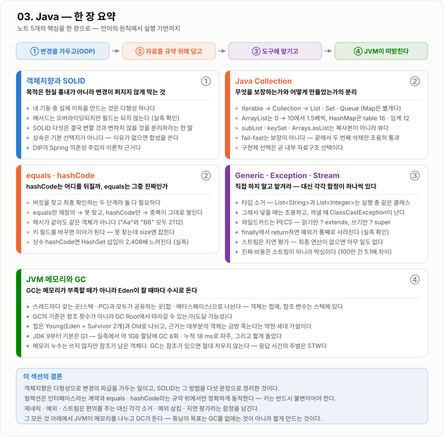

# 03. Java — 한 장 요약

이 섹션의 노트 5개를 그림 한 장으로 압축한 것이다. 처음 훑을 때는 지도로, 복습할 때는 체크리스트로 쓴다.
각 카드의 오른쪽 위 번호(①②③④)는 맨 위 흐름 띠의 단계와 이어진다.

*변경을 가두고(①) → 자료를 규약 위에 담고(②) → 도구에 맡기고(③) → JVM이 떠받친다(④) 순서로 읽는다.*

## 노트별로 한 줄씩

| 단계 | 노트 | 한 줄 핵심 |
| --- | --- | --- |
| ① | [객체지향과 SOLID](객체지향-SOLID/객체지향-SOLID.md) | 목적은 현실 흉내가 아니라 **변경이 퍼지지 않게 막는 것** |
| ② | [Java Collection](Java-Collection/Java-Collection.md) | 무엇을 보장하는가(인터페이스)와 어떻게 만들었는가(구현체)의 분리 |
| ② | [equals · hashCode](equals-hashCode/equals-hashCode.md) | `hashCode`는 어디를 뒤질까, `equals`는 그중 진짜인가 |
| ③ | [Generic · Exception · Stream](Generic-Exception-Stream/Generic-Exception-Stream.md) | 직접 하지 말고 맡겨라 — 대신 각각 함정이 하나씩 있다 |
| ④ | [JVM 메모리와 GC](JVM-메모리-GC/JVM-메모리-GC.md) | GC는 메모리가 부족할 때가 아니라 **Eden이 찰 때마다** 돈다 |

## 면접 직전에 이것만

!!! note "네 문장으로"

    1. 객체지향은 다형성으로 변경의 파급을 가두는 일이고, SOLID는 그 방법을 다섯 문장으로 정리한 것이다.
    2. 컬렉션은 인터페이스라는 **계약**과 `equals` · `hashCode`라는 **규약** 위에서만 정확하게 동작한다. 키는 반드시 불변이어야 한다.
    3. 제네릭 · 예외 · 스트림은 편의를 주는 대신 각각 타입 소거 · 예외 삼킴 · 지연 평가라는 함정을 남긴다.
    4. 그 모든 것 아래에서 JVM이 메모리를 나누고 GC가 돈다. 튜닝의 목표는 GC를 없애는 것이 아니라 **짧게 만드는 것**이다.
