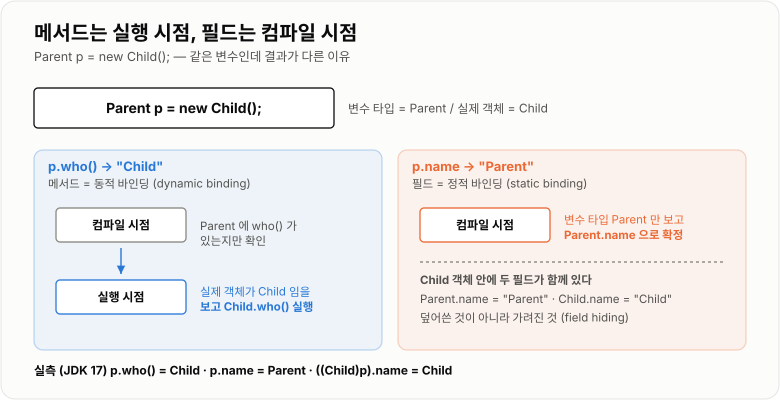
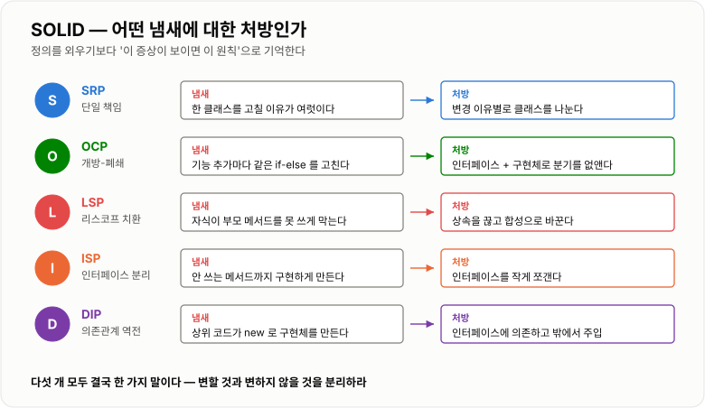
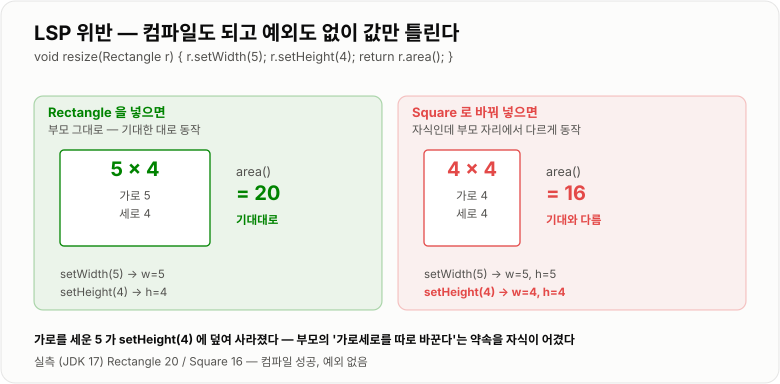

# 객체지향과 SOLID

> **객체지향은 "요구사항이 바뀌었을 때 고쳐야 할 코드의 범위를 좁히는" 기술이고, SOLID는 그 범위를 좁히는 다섯 가지 구체적인 규칙이다.**

---

## 1. 핵심 요약

**객체지향의 목적은 "현실을 흉내 내는 것"이 아니라 "변경이 퍼지지 않게 막는 것"이다. SOLID는 그 목적을 다섯 문장으로 정리한 것이고, 다섯 개 모두 결국 "변할 것과 변하지 않을 것을 분리하라"는 한 가지 말을 다른 각도에서 하고 있다.**

### 한눈에 보기

* 객체지향의 네 기둥은 **캡슐화 · 상속 · 다형성 · 추상화**다. 이 중 **다형성이 실제 이득을 만드는 핵심**이고 나머지는 다형성을 쓰기 위한 준비에 가깝다.
* **다형성은 "어떤 코드가 실행될지 실행 시점에 정해지는 것"** 이다. 그래서 호출하는 쪽 코드를 고치지 않고 동작만 바꿔 끼울 수 있다.
* **메서드는 오버라이딩되지만 필드는 오버라이딩되지 않는다.** `Parent p = new Child()`에서 `p.who()`는 `Child`를, `p.name`은 `Parent`를 준다.
* SOLID는 **SRP · OCP · LSP · ISP · DIP** 다섯 글자다. 외우는 것보다 **각각이 어떤 "코드 냄새"에 대한 처방인지** 아는 것이 중요하다.
* **LSP 위반은 문법 오류가 아니라 조용한 논리 오류다.** 정사각형을 직사각형의 자식으로 만들면 `5×4` 넓이가 **20이 아니라 16**이 된다.
* **상속은 기본 선택지가 아니다.** 부모의 구현에 자식이 묶이므로, 특별한 이유가 없으면 **합성(다른 객체를 필드로 갖기)** 을 쓴다.
* **DIP가 Spring DI의 이론적 근거다.** "구체 클래스가 아니라 인터페이스에 의존하라"를 프레임워크가 대신 해 주는 것이 의존성 주입이다.
* **생성자에서 오버라이딩된 메서드를 호출하면 자식 필드가 아직 `null`이다**. 상속이 만드는 대표적인 함정이다.
* SOLID는 **지킬수록 좋은 것이 아니라 필요한 만큼 지키는 것**이다. 바뀌지 않을 코드에 인터페이스를 씌우는 것은 비용만 늘린다.

> 이 노트의 동작 확인은 **JDK 17.0.12**에서 직접 실행한 결과다. 필드 숨김, 생성자 함정, LSP 위반, `equals` 대칭성 붕괴는 모두 실제 출력으로 확인했다.

### 무엇을 해결하는가

#### 이 개념이 없을 때

객체지향 없이 "할인 금액 계산"을 짜면 보통 이렇게 된다.

```java
public int discount(String type, int price) {
    if (type.equals("FIX")) {
        return price - 1000;
    } else if (type.equals("RATE")) {
        return price - (price / 10);
    }
    return price;
}
```

여기까지는 멀쩡해 보인다. 문제는 **요구사항이 하나 늘 때** 드러난다.

```text
"쿠폰 할인도 추가해 주세요"
   ↓
discount() 에 else if 를 하나 더 붙인다
   ↓
"VIP는 쿠폰과 정률을 중복 적용해 주세요"
   ↓
if 안에 if 가 생긴다
   ↓
반년 뒤 이 메서드는 200줄이 되고, 아무도 손대기 무서워한다
```

진짜 비용은 길이가 아니라 **파급 범위**다.

```text
할인 정책 하나를 추가할 때 열어야 하는 파일

  discount() 가 있는 클래스        ← 고친다
  이 메서드를 호출하는 주문 서비스   ← type 문자열을 넘겨야 하니 고친다
  주문 서비스의 테스트             ← 분기가 늘었으니 고친다
  관리자 화면의 할인 종류 목록       ← 고친다

  → 정책 "추가"인데 기존 코드 네 곳을 "수정"했다
  → 수정한 곳마다 기존 기능이 깨질 위험이 생긴다
```

**기능을 추가할 때 기존 코드를 건드려야 한다는 것** — 이것이 객체지향이 풀려는 문제다.

#### 객체지향은 이것을 어떻게 바꾸는가

```java
public interface DiscountPolicy {
    int discount(int price);
}
```

이제 정책마다 클래스를 하나씩 만들고, 주문 서비스는 **인터페이스만 안다.**

```text
정책을 추가할 때

  새 클래스 하나 만든다              ← 추가
  (끝)

  주문 서비스는 안 고친다
  기존 정책 클래스도 안 고친다
  기존 테스트도 안 깨진다
```

**"추가는 하되 수정은 하지 않는다."** 이것이 뒤에 나올 OCP이고, 객체지향으로 얻는 이득의 대부분이 여기서 나온다.

---

## 2. 동작 원리

### 핵심 구성 요소

#### 네 가지 기둥

| 개념      | 한 문장 정의                             | 이것이 없으면                              |
| ------- | ----------------------------------- | ------------------------------------ |
| **캡슐화** | 데이터를 숨기고 정해진 통로(메서드)로만 건드리게 하는 것    | 아무나 필드를 바꿔서 객체가 말이 안 되는 상태가 된다       |
| **상속**  | 부모의 필드와 메서드를 물려받는 것                 | 공통 코드를 복사해야 한다 (대신 부모에 묶인다)          |
| **추상화** | 공통점만 남기고 구체적인 것을 감추는 것              | 쓰는 쪽이 구현 세부사항을 전부 알아야 한다             |
| **다형성** | **같은 호출이 객체에 따라 다르게 동작하는 것**        | **`if-else`로 타입을 일일이 분기해야 한다**       |

네 개를 나란히 외우면 다형성의 위상을 놓친다. 실제 구조는 이렇다.

```text
캡슐화 · 상속 · 추상화     ← 준비 작업
        │
        └─→ 다형성          ← 실제로 이득을 만드는 지점
                │
                └─→ "호출하는 코드를 고치지 않고 동작을 바꿔 끼운다"
```

#### 다형성이 성립하는 조건

세 가지가 모두 있어야 한다.

```text
1. 상속 또는 인터페이스 구현    → 부모 타입에 자식을 담을 수 있다
2. 메서드 오버라이딩            → 자식이 자기 방식대로 다시 정의한다
3. 부모 타입으로 참조           → 쓰는 쪽이 구체 타입을 모른다
```

셋 중 **3번이 빠지면 다형성의 의미가 없다.** `ArrayList list = new ArrayList()`로 선언하면 구현체를 바꿀 때 선언부까지 고쳐야 하므로, 인터페이스를 만든 이유가 사라진다.

### 내부 동작 과정

#### 어떤 메서드가 실행될지는 언제 정해지는가

이것이 다형성의 심장이다.

```java
Parent p = new Child();   // 변수 타입은 Parent, 실제 객체는 Child
p.who();                  // 무엇이 실행되는가?
```

```text
컴파일 시점 (javac)
    변수 타입인 Parent 에 who() 가 있는지만 확인한다
    → 없으면 컴파일 에러
    → 있으면 "who() 를 호출하라"는 명령만 남긴다

실행 시점 (JVM)
    p 가 가리키는 실제 객체가 Child 임을 확인한다
    → Child 의 who() 를 실행한다

  이것을 동적 바인딩(dynamic binding) 이라 한다
```

**실측 결과**

```text
Parent p = new Child();

  p.who()          → "Child"     ← 실행 시점에 정해짐 (동적 바인딩)
  p.name           → "Parent"    ← 컴파일 시점에 정해짐 (정적 바인딩)
  ((Child) p).name → "Child"
```



*같은 변수 `p`인데 메서드와 필드의 결과가 다른 이유 — 결정 시점이 다르기 때문이다.*

**필드는 오버라이딩되지 않는다.** 자식이 같은 이름의 필드를 선언하면 부모 필드를 덮는 것이 아니라 **가리기만 한다(field hiding).** 두 필드가 메모리에 따로 존재하고, 변수 타입에 따라 어느 쪽을 볼지 정해진다.

```text
Child 객체 하나 안에
    Parent.name = "Parent"    ← Parent 타입으로 보면 이것
    Child.name  = "Child"     ← Child 타입으로 보면 이것

  둘 다 살아 있다. 덮어쓴 것이 아니다.
```

같은 이유로 **`static` 메서드도 오버라이딩되지 않는다.** `static`은 객체가 아니라 클래스에 속하므로 실행 시점에 고를 대상이 없다.

#### SOLID — 다섯 규칙

SOLID는 다섯 원칙의 앞 글자다. **정의를 외우는 것보다 "어떤 증상에 대한 처방인가"를 아는 것이 실전에서 쓰인다.**



*다섯 원칙 모두 "변할 것과 변하지 않을 것을 분리하라"는 한 가지 말의 다른 각도다.*

##### SRP — 단일 책임 원칙

> 클래스를 **바꿔야 할 이유가 하나**여야 한다.

"한 가지 일만 한다"로 외우면 애매해진다. 기준은 **변경 이유**다.

```java
// 나쁜 예 — 바꿔야 할 이유가 셋이다
class UserService {
    void register(User u) { ... }        // ① 가입 정책이 바뀌면
    void sendWelcomeMail(User u) { ... } // ② 메일 양식이 바뀌면
    void writeAuditLog(User u) { ... }   // ③ 감사 로그 형식이 바뀌면
}
```

메일 양식을 바꾸려고 `UserService`를 열면, 가입 로직 테스트까지 다시 돌려야 한다. **관련 없는 것이 함께 묶여 있으면 변경 비용이 서로에게 전가된다.**

##### OCP — 개방-폐쇄 원칙

> **확장에는 열려 있고, 수정에는 닫혀 있어야** 한다.

앞의 할인 예제가 정확히 이것이다.

```text
if-else 로 분기      →  정책 추가 = 기존 메서드 수정   (닫혀 있지 않다)
인터페이스 + 구현체   →  정책 추가 = 새 클래스 추가     (OCP 만족)
```

**핵심은 "분기문을 다형성으로 바꾸는 것"** 이다. `if (type.equals(...))`가 반복되면 OCP 위반 신호로 본다.

##### LSP — 리스코프 치환 원칙

> **부모 타입 자리에 자식을 넣어도 프로그램이 여전히 옳아야** 한다.

컴파일이 되는 것과 옳은 것은 다르다. 유명한 반례가 정사각형이다.

```text
"정사각형은 직사각형이다"  ← 수학적으로는 참
       ↓
class Square extends Rectangle   ← 코드로 옮기면 깨진다
```

```java
class Rectangle {
    protected int w, h;
    void setWidth(int w)  { this.w = w; }
    void setHeight(int h) { this.h = h; }
    int area() { return w * h; }
}

class Square extends Rectangle {
    // 정사각형은 가로를 바꾸면 세로도 같이 바뀌어야 한다
    @Override void setWidth(int w)  { this.w = w; this.h = w; }
    @Override void setHeight(int h) { this.w = h; this.h = h; }
}
```

이제 **부모 타입으로만 쓰는 코드**를 보자.

```java
void resize(Rectangle r) {
    r.setWidth(5);
    r.setHeight(4);
    System.out.println(r.area());   // 20을 기대한다
}
```

**실측 결과**

```text
resize(new Rectangle())  →  20    ✓ 기대대로
resize(new Square())     →  16    ✗ 기대와 다르다

  Square.setHeight(4) 가 가로까지 4로 바꿔 버렸다
  → 4 × 4 = 16
```



*컴파일도 되고 예외도 안 난다. 값만 조용히 틀린다 — LSP 위반이 위험한 이유다.*

**LSP 위반을 알아보는 신호**

```text
자식이 부모 메서드를 오버라이딩해서
  · UnsupportedOperationException 을 던진다
  · 아무것도 안 하고 빈 채로 둔다
  · 부모보다 더 까다로운 조건을 요구한다
  · 부모가 약속한 것보다 덜 보장한다

  → 그 상속은 잘못됐다. 상속이 아니라 합성으로 간다.
```

##### ISP — 인터페이스 분리 원칙

> **쓰지도 않는 메서드에 의존하게 만들지 마라.**

```java
// 나쁜 예 — 구현하는 쪽이 필요 없는 것까지 떠안는다
interface Machine {
    void print();
    void scan();
    void fax();
}

class OldPrinter implements Machine {
    public void print() { ... }
    public void scan() { throw new UnsupportedOperationException(); }  // ← 냄새
    public void fax()  { throw new UnsupportedOperationException(); }  // ← 냄새
}
```

**`UnsupportedOperationException`이 나오면 인터페이스가 너무 크다는 신호**다. `Printable`, `Scannable`로 쪼개면 각 클래스가 필요한 것만 구현한다.

##### DIP — 의존관계 역전 원칙

> **구체적인 것이 아니라 추상적인 것에 의존하라.**

```text
일반적인 흐름
    OrderService  ──→  FixDiscountPolicy      (구체 클래스에 직접 의존)
    상위 모듈이 하위 모듈에 의존한다

의존관계를 뒤집으면
    OrderService  ──→  DiscountPolicy         (인터페이스에 의존)
                            ↑
                    FixDiscountPolicy         (구현체가 인터페이스에 의존)

    화살표가 구현체 쪽에서 위로 뒤집혔다 → "역전"
```

**여기서 Spring이 등장한다.** `OrderService`가 인터페이스만 안다면, **실제 구현체는 누가 넣어 주는가?**

```java
// DIP를 지키면 자기가 직접 만들 수 없다
class OrderService {
    private final DiscountPolicy policy;

    OrderService(DiscountPolicy policy) {   // 밖에서 넣어 준다
        this.policy = policy;
    }
}
```

이 "밖에서 넣어 주는 일"을 프레임워크가 대신 하는 것이 **의존성 주입(DI, Dependency Injection)** 이다. DIP는 원칙이고 DI는 그 원칙을 지키기 위한 수단이다.

---

## 3. 특징과 비교

| 구분          | 내용                                       |
| ----------- | ---------------------------------------- |
| **장점**      | 기능 추가가 기존 코드 수정 없이 **클래스 추가만으로** 끝나고, 구현체를 갈아 끼울 수 있어 테스트가 쉬워지며, 변경의 파급 범위가 좁아진다. |
| **단점**      | 클래스와 인터페이스 개수가 늘어 **처음 읽는 사람이 흐름을 쫓기 어렵고**, 실행 시점에 어느 구현이 도는지 코드만 봐서는 모른다. 잘못된 추상화는 없느니만 못하다. |
| **적합한 상황**  | **같은 종류의 것이 앞으로 늘어날 것이 확실할 때**(결제 수단, 할인 정책, 알림 채널). 구현을 바꿔 가며 테스트해야 할 때. |
| **주의할 상황**  | **변하지 않을 코드에 미리 인터페이스를 씌우는 것.** 구현체가 영원히 하나뿐인 인터페이스는 이득 없이 파일만 늘린다. |

### 성능 특성

객체지향의 비용은 **성능이 아니라 인지 부하**다. 실행 성능 차이는 대부분 무시해도 된다.

| 항목               | 비용                                        |
| ---------------- | ----------------------------------------- |
| 가상 메서드 호출(동적 바인딩) | 구현체가 하나뿐이면 JIT가 **인라인해서 사실상 0**이 된다       |
| 구현체가 2개          | JIT가 이분 분기로 최적화 (bimorphic) — 여전히 매우 저렴   |
| 구현체가 3개 이상       | 가상 호출 테이블 조회 — 그래도 나노초 단위                 |
| 객체 하나 추가         | 헤더 12~16바이트                               |
| **인지 비용**        | **파일 1개 → 인터페이스 1 + 구현체 N개.** 실제로 아픈 것은 여기다 |

**결론: 성능을 이유로 객체지향을 포기할 일은 거의 없다.** 반대로 "혹시 몰라서" 만든 추상화가 코드를 못 읽게 만드는 일은 자주 있다.

### 장점과 단점

| 장점                | 이유                                     |
| ----------------- | -------------------------------------- |
| 기능 추가가 수정이 아닌 추가다 | 새 구현체 클래스만 만들면 된다. 기존 코드와 테스트가 안 깨진다.  |
| 테스트가 쉬워진다         | 실제 DB·외부 API 대신 가짜 구현체를 끼울 수 있다.       |
| 변경의 파급이 좁다        | 인터페이스가 방화벽 역할을 해서 구현 변경이 밖으로 새지 않는다.   |
| 협업이 쉬워진다          | 인터페이스만 먼저 합의하면 양쪽이 동시에 개발할 수 있다.       |
| 의도가 이름에 드러난다      | `DiscountPolicy`가 `if (type == 1)`보다 읽힌다. |

| 단점                     | 이유 및 주의점                                 |
| ---------------------- | ---------------------------------------- |
| 파일과 클래스가 늘어난다          | 정책 5개면 인터페이스 1 + 클래스 5 = 6개 파일이 된다.      |
| 실행 흐름을 따라가기 어렵다        | 인터페이스에서 "구현으로 이동"을 눌러야 실제 코드가 나온다.       |
| 잘못된 추상화는 되돌리기 비싸다      | 공통점을 잘못 뽑으면 모든 구현체가 억지로 그 틀에 맞춰진다.       |
| 상속은 부모 변경에 자식이 끌려간다    | 부모에 메서드가 추가되면 모든 자식의 의미가 바뀔 수 있다.        |
| **LSP 위반은 조용히 틀린다**    | 컴파일도 되고 예외도 없다. 값만 다르다(20 vs 16).     |

### 어떤 상황에서 고르는가

#### 추상화를 도입할지 판단하는 순서

```text
같은 종류의 것이 2개 이상 있는가?
├─ 아니오 → 아직 인터페이스를 만들지 않는다
│           (구현체가 하나뿐인 인터페이스는 비용만이다)
│
└─ 예 → 앞으로 더 늘어날 가능성이 있는가?
         ├─ 아니오 → if-else 두 갈래면 그대로 둬도 된다
         │
         └─ 예 → 인터페이스로 뽑는다
                  │
                  └─ 구현체끼리 공통 코드가 많은가?
                      ├─ 예   → 추상 클래스 (템플릿 메서드)
                      └─ 아니오 → 인터페이스만
```

**"세 번째 같은 것이 나타나면 그때 뽑는다"** 는 경험칙이 실무에서 잘 맞는다. 두 개일 때는 무엇이 진짜 공통점인지 판단하기 이르다.

#### 상속을 쓸지 합성을 쓸지

```text
"자식이 부모의 한 종류인가?" (is-a)
   그리고
"부모가 할 수 있는 모든 것을 자식도 똑같이 할 수 있는가?" (LSP)

  → 둘 다 예라야 상속
  → 하나라도 아니면 합성
```

**"코드를 재사용하고 싶다"는 상속의 이유가 되지 못한다.** 그건 합성으로도 되고, 합성이 더 안전하다.

### 비슷한 기술과 비교

#### 상속 vs 합성

| 기준        | 상속 (`extends`)          | 합성 (필드로 갖기)             |
| --------- | ----------------------- | ----------------------- |
| **동작 방식** | 부모의 구현을 물려받는다           | 다른 객체를 필드로 두고 호출한다      |
| **결합도**   | **강하다.** 부모 변경이 자식에 전파  | 약하다. 인터페이스로만 안다         |
| **바꿀 수 있는 시점** | 컴파일 시점 고정               | **실행 시점에 교체 가능**        |
| **캡슐화**   | 깨진다 (자식이 부모 내부를 안다)     | 유지된다                    |
| **다중 적용** | 클래스는 하나만 상속 가능          | 여러 개를 필드로 둘 수 있다        |
| **장점**    | 공통 코드 재사용이 간결하다         | 유연하고 테스트하기 쉽다           |
| **단점**    | 부모에 묶이고 LSP 위반 위험       | 위임 코드를 직접 써야 한다         |
| **선택 기준** | **is-a가 참이고 LSP를 지킬 때만** | **그 외 전부 (기본 선택지)**     |

#### 인터페이스 vs 추상 클래스

| 기준        | 인터페이스                             | 추상 클래스                      |
| --------- | --------------------------------- | --------------------------- |
| **동작 방식** | 규약(계약)만 정의                        | 공통 구현 + 빈칸(추상 메서드)          |
| **다중 구현** | **가능** (여러 개 implements)          | 불가 (하나만 extends)            |
| **필드**    | `public static final` 상수만         | 인스턴스 필드 가능                  |
| **생성자**   | 없음                                | 있음 (자식이 호출)                 |
| **장점**    | 결합이 약하고 조합이 자유롭다                  | 중복 구현을 없앨 수 있다              |
| **단점**    | 공통 구현을 넣기 어렵다(default 메서드로 일부 해소) | 상속 한 자리를 써 버린다              |
| **선택 기준** | **"할 수 있다"는 능력을 표현할 때**           | **"~의 한 종류"이고 공통 코드가 많을 때** |

Java 8부터 인터페이스에 `default` 메서드가 생겨 경계가 흐려졌지만, **상태(필드)를 가질 수 있는지**가 여전히 결정적인 차이다.

#### 절차지향 vs 객체지향

| 기준        | 절차지향                | 객체지향                 |
| --------- | ------------------- | -------------------- |
| **동작 방식** | 데이터와 처리 로직이 분리      | 데이터와 그 데이터를 다루는 로직이 함께 |
| **분기 처리** | `if-else` / `switch` | 다형성                  |
| **기능 추가** | 기존 함수 수정            | **새 클래스 추가**         |
| **장점**    | 흐름이 위에서 아래로 읽힌다     | 변경 범위가 좁다            |
| **단점**    | 분기가 쌓이면 손댈 수 없어진다   | 파일이 흩어져 흐름 추적이 어렵다   |
| **선택 기준** | 로직이 고정된 단순 배치·스크립트  | **요구사항이 계속 바뀌는 서비스** |

---

## 4. 실무 주의사항

### 백엔드 실무 적용

#### Spring이 곧 DIP의 구현이다

Spring을 쓰면서 별생각 없이 하던 것들이 사실 SOLID다.

```java
@Service
public class OrderService {

    private final DiscountPolicy discountPolicy;   // 인터페이스에 의존 (DIP)

    public OrderService(DiscountPolicy discountPolicy) {   // 생성자 주입
        this.discountPolicy = discountPolicy;
    }
}
```

```text
@Autowired 생성자 주입   → DIP를 지키게 만드는 장치
@Transactional          → 프록시(다형성)로 원본 코드를 안 고치고 기능 추가 (OCP)
JpaRepository 인터페이스  → 구현체는 Spring이 실행 시점에 만들어 넣는다
```

**생성자 주입을 권장하는 이유**도 원칙에서 나온다.

```text
final 로 선언할 수 있다        → 실행 중에 바뀌지 않음이 보장된다
객체 생성 시점에 의존성이 확정   → 누락되면 컴파일·기동 시점에 바로 안다
테스트에서 new 로 주입 가능     → 스프링 없이 단위 테스트가 된다
순환 참조를 기동 시점에 잡는다   → 필드 주입은 런타임까지 숨는다
```

#### 구현체가 여럿일 때 고르는 법

인터페이스 하나에 구현체가 여러 개면 Spring이 어느 것을 넣을지 모른다.

```java
public interface PaymentGateway { boolean pay(long amount); }

@Component("toss")  class TossGateway   implements PaymentGateway { ... }
@Component("kakao") class KakaoGateway  implements PaymentGateway { ... }
```

```java
// 방법 1 — 이름으로 지정
public OrderService(@Qualifier("toss") PaymentGateway gateway) { ... }

// 방법 2 — 전부 받아서 실행 시점에 고른다 (OCP에 더 가깝다)
private final Map<String, PaymentGateway> gateways;   // Spring이 이름→빈으로 채워 준다

public boolean pay(String type, long amount) {
    PaymentGateway gateway = gateways.get(type);
    if (gateway == null) {
        throw new IllegalArgumentException("지원하지 않는 결제 수단: " + type);
    }
    return gateway.pay(amount);
}
```

**방법 2가 중요하다.** 결제 수단을 추가할 때 `@Component`만 붙이면 되고 **이 코드는 안 고친다.** 분기문을 프레임워크에 위임한 형태다.

#### 계층 간 의존 방향을 지킨다

```text
Controller  →  Service  →  Repository        ← 한 방향으로만
                  ↓
              Domain (아무것도 의존하지 않음)

  Repository 가 Service 를 부르면 순환이 생긴다
  Domain 이 JPA·Spring 을 알면 테스트가 무거워진다
```

**도메인 객체가 프레임워크를 모르게 유지하면** 스프링 컨텍스트 없이 순수 단위 테스트가 가능해진다. 테스트가 수 초에서 수십 밀리초로 줄어든다.

### 자주 하는 오해

| 잘못된 이해                        | 올바른 이해                                                          |
| ----------------------------- | --------------------------------------------------------------- |
| 객체지향은 현실 세계를 그대로 코드로 옮기는 것이다  | **변경 범위를 좁히는 것**이 목적이다. 현실과 닮았지만 바꾸기 어려운 설계는 실패한 설계다.           |
| 상속은 코드 재사용을 위한 기본 도구다         | 재사용은 **합성**으로 하는 것이 안전하다. 상속은 is-a와 LSP를 둘 다 만족할 때만 쓴다.        |
| 필드도 오버라이딩된다                   | **필드는 가려질 뿐 오버라이딩되지 않는다.** 두 필드가 함께 존재하고 변수 타입으로 결정된다.      |
| `static` 메서드도 오버라이딩된다         | 클래스에 속하므로 실행 시점에 고를 대상이 없다. 자식에 같은 시그니처를 쓰면 **숨김(hiding)** 이다.  |
| 컴파일되면 상속을 제대로 한 것이다           | **LSP 위반은 컴파일된다.** 정사각형-직사각형은 넓이가 20 대신 16이 나올 뿐 오류가 없다.    |
| SOLID는 많이 지킬수록 좋다             | **필요한 만큼만 지킨다.** 구현체가 하나뿐인 인터페이스는 이득 없이 간접 계층만 늘린다.             |
| 인터페이스를 쓰면 무조건 결합도가 낮아진다       | 인터페이스가 **특정 구현에 맞춰 설계되면** 이름만 인터페이스일 뿐 결합은 그대로다.                |
| DIP와 DI는 같은 말이다               | **DIP는 원칙, DI는 그 원칙을 지키기 위한 수단**이다. DI 없이도 수동 주입으로 DIP를 지킬 수 있다. |

### 상속이 파는 함정 세 가지

#### ① 생성자에서 오버라이딩된 메서드를 호출하면 안 된다

```java
abstract class Base {
    Base() { init(); }             // 위험
    abstract void init();
}

class Derived extends Base {
    private List<String> items = new ArrayList<String>();
    @Override void init() {
        System.out.println(items);  // 무엇이 찍힐까?
    }
}
```

**실측 결과: `null`이 찍힌다.**

```text
객체 생성 순서

  1. Derived 생성자 호출
  2. → 암묵적으로 super() = Base 생성자 실행
  3. →   Base 생성자가 init() 호출
  4. →     Derived.init() 실행           ← 이 시점!
  5. → Base 생성자 끝
  6. Derived 의 필드 초기화 (items = new ArrayList())   ← 여기서야 채워진다

  4번이 6번보다 먼저다 → items 는 아직 null
```

**부모 생성자는 자식 필드가 초기화되기 전에 끝난다.** 이 순서는 바꿀 수 없으므로, 생성자에서는 오버라이딩 가능한 메서드를 부르지 않는다. 부르려면 `final`이나 `private`으로 막는다.

#### ② 상속에서 equals 대칭성이 깨진다

```java
class Point {
    final int x, y;
    @Override public boolean equals(Object o) {
        if (!(o instanceof Point)) return false;
        Point p = (Point) o;
        return p.x == x && p.y == y;
    }
}

class ColorPoint extends Point {
    final String color;
    @Override public boolean equals(Object o) {
        if (!(o instanceof ColorPoint)) return false;      // 색까지 본다
        return super.equals(o) && ((ColorPoint) o).color.equals(color);
    }
}
```

**실측 결과**

```text
Point      pt = new Point(1, 2);
ColorPoint cp = new ColorPoint(1, 2, "red");

  pt.equals(cp)  →  true     Point 입장: 좌표만 같으면 같다
  cp.equals(pt)  →  false    ColorPoint 입장: 색이 없으니 다르다

  → equals 의 대칭성 계약 위반

  set.add(pt);
  set.contains(cp)  →  false    컬렉션이 예상과 다르게 동작한다
```

`a.equals(b)`가 참이면 `b.equals(a)`도 참이어야 한다는 것이 `equals`의 계약이다. **상속으로 필드를 추가하면 이 계약을 지키면서 구현하는 것이 사실상 불가능하다.** 그래서 상속 대신 **합성**을 쓰거나 클래스를 `final`로 막는다. 자세한 내용은 [equals · hashCode](../equals-hashCode/equals-hashCode.md) 노트에 있다.

#### ③ 부모가 바뀌면 자식이 조용히 깨진다

```java
class CountingSet<E> extends HashSet<E> {
    private int addCount = 0;

    @Override public boolean add(E e) {
        addCount++;
        return super.add(e);
    }

    @Override public boolean addAll(Collection<? extends E> c) {
        addCount += c.size();
        return super.addAll(c);     // HashSet.addAll 은 내부에서 add() 를 부른다!
    }
}
```

```text
addAll(List.of("a","b","c")) 를 호출하면

  addCount += 3           ← addAll 에서
  super.addAll() 이 내부적으로 add() 를 3번 호출
  → 오버라이딩된 add() 가 돌아 addCount += 1 을 3번 더 한다

  결과: addCount = 6   (기대는 3)
```

**부모의 내부 구현(자기 메서드를 다시 호출하는지)에 자식이 의존하게 된다.** 이것이 상속이 캡슐화를 깨뜨린다는 말의 실체다. 합성으로 감싸면 이 문제가 사라진다.

---

## 5. 예제

### 분기문을 다형성으로 바꾸기 (OCP · DIP)

**Before — 정책이 늘 때마다 이 메서드를 고쳐야 한다**

```java
public class OrderService {

    public int calculatePrice(String discountType, int price) {
        if ("FIX".equals(discountType)) {
            return price - 1000;
        } else if ("RATE".equals(discountType)) {
            return price - (price / 10);
        } else if ("NONE".equals(discountType)) {
            return price;
        }
        throw new IllegalArgumentException("알 수 없는 할인: " + discountType);
    }
}
```

**After — 정책 추가 시 이 파일은 열지 않는다**

```java
public interface DiscountPolicy {

    /** 할인 금액을 반환한다 (원가가 아니다). */
    int discountAmount(int price);
}
```

```java
public class FixDiscountPolicy implements DiscountPolicy {

    private static final int DISCOUNT_AMOUNT = 1000;

    @Override
    public int discountAmount(int price) {
        return Math.min(DISCOUNT_AMOUNT, price);   // 음수 가격 방지
    }
}
```

```java
public class RateDiscountPolicy implements DiscountPolicy {

    private final int percent;

    public RateDiscountPolicy(int percent) {
        if (percent < 0 || percent > 100) {
            throw new IllegalArgumentException("할인율 범위 오류: " + percent);
        }
        this.percent = percent;
    }

    @Override
    public int discountAmount(int price) {
        return price * percent / 100;
    }
}
```

```java
public class OrderService {

    private final DiscountPolicy discountPolicy;   // 구현체를 모른다 (DIP)

    public OrderService(DiscountPolicy discountPolicy) {
        this.discountPolicy = discountPolicy;
    }

    public int calculatePrice(int price) {
        return price - discountPolicy.discountAmount(price);   // 분기가 사라졌다
    }
}
```

```java
// 쿠폰 할인이 추가돼도 OrderService 는 그대로다
public class CouponDiscountPolicy implements DiscountPolicy {

    private final int couponAmount;

    public CouponDiscountPolicy(int couponAmount) {
        this.couponAmount = couponAmount;
    }

    @Override
    public int discountAmount(int price) {
        return Math.min(couponAmount, price);
    }
}
```

**얻은 것**

```text
정책 추가        새 클래스 1개 (기존 파일 수정 0)
테스트           new OrderService(new FixDiscountPolicy()) — 스프링 불필요
정책 교체        생성자 인자만 바꾸면 된다
```

### 상속 대신 합성 (LSP 함정 피하기)

**Before — HashSet을 상속해서 개수를 센다 (앞에서 본 그 버그)**

```java
public class CountingSet<E> extends HashSet<E> {
    private int addCount = 0;

    @Override
    public boolean addAll(Collection<? extends E> c) {
        addCount += c.size();
        return super.addAll(c);   // 내부에서 add() 를 또 불러 이중 계산
    }
}
```

**After — 감싸서 위임한다**

```java
import java.util.Collection;
import java.util.Set;

public class CountingSet<E> {

    private final Set<E> delegate;   // 상속이 아니라 필드로 갖는다
    private int addCount = 0;

    public CountingSet(Set<E> delegate) {
        this.delegate = delegate;
    }

    public boolean add(E e) {
        addCount++;
        return delegate.add(e);
    }

    public boolean addAll(Collection<? extends E> c) {
        addCount += c.size();
        return delegate.addAll(c);   // delegate 내부에서 무엇을 부르든 상관없다
    }

    public int getAddCount() {
        return addCount;
    }

    public boolean contains(Object o) {
        return delegate.contains(o);
    }

    public int size() {
        return delegate.size();
    }
}
```

```java
CountingSet<String> set = new CountingSet<String>(new HashSet<String>());
set.addAll(List.of("a", "b", "c"));
set.getAddCount();   // 3  (상속 버전은 6이었다)
```

**차이의 핵심**

```text
상속: 부모가 내부에서 자기 메서드를 부르는지 알아야 한다  → 캡슐화 파괴
합성: delegate 안에서 뭘 하든 내 addCount 와 무관하다      → 안전

  대가: 필요한 메서드를 직접 위임해서 써야 한다
```

### LSP를 지키는 설계로 바꾸기

정사각형 문제의 해법은 **상속 관계를 끊는 것**이다.

```java
// 값이 바뀌지 않으면(불변) 애초에 문제가 생기지 않는다
public interface Shape {
    int area();
}

public final class Rectangle implements Shape {

    private final int width;
    private final int height;

    public Rectangle(int width, int height) {
        this.width = width;
        this.height = height;
    }

    @Override
    public int area() {
        return width * height;
    }

    /** 크기를 바꾸는 대신 새 객체를 만든다. */
    public Rectangle withWidth(int newWidth) {
        return new Rectangle(newWidth, height);
    }
}

public final class Square implements Shape {

    private final int side;

    public Square(int side) {
        this.side = side;
    }

    @Override
    public int area() {
        return side * side;
    }
}
```

```text
setWidth / setHeight 라는 "따로 바꿀 수 있다"는 약속이 사라졌으므로
Square 가 그 약속을 어길 일도 없다.

  → LSP 위반은 대부분 "가변 상태 + 상속"의 조합에서 나온다
  → 불변으로 만들면 상당수가 저절로 사라진다
```

---

## 6. 면접 정리

### 자주 나오는 질문

#### 기본 질문

1. **객체지향의 네 가지 특징은 무엇인가요?**

    * 핵심 키워드: 캡슐화·상속·다형성·추상화, 그중 **다형성이 실제 이득**, 나머지는 준비 작업

2. **다형성이 무엇이고 왜 필요한가요?**

    * 핵심 키워드: 같은 호출이 객체에 따라 다르게 동작, 실행 시점 결정, **분기문을 없애 호출부를 안 고치게 함**

3. **오버로딩과 오버라이딩의 차이는 무엇인가요?**

    * 핵심 키워드: 오버로딩은 이름 같고 매개변수 다름(컴파일 시점), 오버라이딩은 부모 메서드 재정의(실행 시점)

4. **`Parent p = new Child()`일 때 `p.who()`와 `p.name`은 무엇을 주나요?**

    * 핵심 키워드: 메서드는 `Child`(동적 바인딩), **필드는 `Parent`(정적 바인딩)**, 필드는 오버라이딩이 아니라 숨김

5. **SOLID 다섯 가지를 설명해 주세요.**

    * 핵심 키워드: SRP(변경 이유 하나) · OCP(추가는 열고 수정은 닫고) · LSP(자식으로 바꿔도 옳게) · ISP(안 쓰는 메서드 강요 금지) · DIP(추상에 의존)

6. **OCP를 코드에서 어떻게 지키나요?**

    * 핵심 키워드: `if-else` 타입 분기를 인터페이스+구현체로, 정책 추가 = 클래스 추가, 기존 파일 수정 0

7. **인터페이스와 추상 클래스는 언제 각각 쓰나요?**

    * 핵심 키워드: 인터페이스는 "할 수 있다"는 능력·다중 구현, 추상 클래스는 "~의 한 종류"·공통 구현·**상태(필드)를 가질 수 있음**

8. **상속과 합성 중 무엇을 기본으로 삼아야 하나요?**

    * 핵심 키워드: **합성이 기본**, 상속은 is-a와 LSP를 둘 다 만족할 때만, 상속은 캡슐화를 깬다

#### 꼬리 질문

1. **LSP를 위반한 예를 들어 주실 수 있나요?**

    * 핵심 키워드: 정사각형-직사각형, `setWidth(5) setHeight(4)`에서 **20 대신 16**, 컴파일도 되고 예외도 없음

2. **그럼 정사각형은 어떻게 설계해야 하나요?**

    * 핵심 키워드: 상속 끊고 `Shape` 인터페이스로 각자 구현, **불변으로 만들면 setter 약속 자체가 사라짐**

3. **상속이 캡슐화를 깬다는 게 무슨 뜻인가요?**

    * 핵심 키워드: `HashSet` 상속 시 `addAll`이 내부에서 `add`를 불러 **카운트가 3이 아닌 6**, 부모 내부 구현을 알아야 함

4. **생성자에서 오버라이딩된 메서드를 부르면 왜 위험한가요?**

    * 핵심 키워드: 부모 생성자가 자식 필드 초기화보다 먼저 끝남, **실측에서 `null`**, `final`·`private`으로 막는다

5. **DIP와 DI는 같은 건가요?**

    * 핵심 키워드: **DIP는 원칙, DI는 수단**, DI 없이 수동 주입으로도 DIP 가능, Spring이 DI를 대신해 줌

6. **Spring에서 생성자 주입을 권장하는 이유는 무엇인가요?**

    * 핵심 키워드: `final` 가능, 누락을 기동 시점에 발견, **스프링 없이 단위 테스트**, 순환 참조 조기 발견

7. **인터페이스 구현체가 여러 개면 Spring은 어떻게 고르나요?**

    * 핵심 키워드: `@Qualifier`·`@Primary`, 또는 **`Map<String, 인터페이스>`로 전부 주입받아 실행 시점 선택**(OCP에 더 가까움)

8. **추상화를 언제 도입해야 하나요? 항상 인터페이스를 만드는 게 좋나요?**

    * 핵심 키워드: **아니다.** 구현체가 하나뿐이면 간접 계층만 늘어남, "세 번째가 나오면 뽑는다"

9. **다형성 때문에 성능이 느려지지 않나요?**

    * 핵심 키워드: 구현체 1~2개면 **JIT가 인라인해서 사실상 0**, 진짜 비용은 성능이 아니라 **인지 부하**

10. **`static` 메서드는 오버라이딩되나요?**

    * 핵심 키워드: **안 된다.** 클래스에 속해서 실행 시점에 고를 대상이 없음, 같은 시그니처는 숨김(hiding)

11. **SRP에서 "책임 하나"를 어떻게 판단하나요?**

    * 핵심 키워드: "한 가지 일"이 아니라 **"바꿔야 할 이유가 하나"**, 메일 양식 변경이 가입 로직 테스트를 건드리면 위반

### 30초 답변

> 객체지향은 **요구사항이 바뀔 때 고쳐야 할 코드의 범위를 좁히는 기술**이고, 그 핵심 도구가 다형성입니다. 타입에 따라 `if-else`로 분기하면 정책이 늘 때마다 그 메서드를 수정해야 하지만, 인터페이스로 뽑으면 **새 구현 클래스를 추가만 하고 호출하는 쪽은 안 고칩니다.** SOLID는 이걸 다섯 규칙으로 정리한 것이고, 다섯 개 모두 결국 **변할 것과 변하지 않을 것을 분리하라**는 같은 말입니다.

### 핵심 키워드

`캡슐화` · `상속` · `다형성` · `추상화` · `동적 바인딩` · `정적 바인딩` · `필드 숨김` · `SRP` · `OCP` · `LSP` · `ISP` · `DIP` · `합성` · `의존성 주입`

### 이어서 볼 주제

* **[equals · hashCode](../equals-hashCode/equals-hashCode.md)** — 상속이 `equals` 대칭성을 어떻게 깨뜨리는지 자세히 다룬다. 이 노트에서 본 `ColorPoint` 문제의 완결편이다.
* **[Java Collection](../Java-Collection/Java-Collection.md)** — 인터페이스와 구현체 분리가 실제 표준 라이브러리에서 어떻게 쓰이는지 볼 수 있다. 객체지향의 가장 좋은 교과서다.
* **05-Spring의 IoC · DI와 Bean** — DIP를 프레임워크가 어떻게 대신 지켜 주는지. 이 노트가 "왜"라면 그 노트는 "어떻게"다.
* **디자인 패턴 (전략·템플릿 메서드·데코레이터)** — SOLID를 지키는 구체적인 형태들이다. 이 노트의 할인 정책 예제가 곧 전략 패턴이다.
* **일급 컬렉션과 값 객체(VO)** — 원시 타입 대신 객체로 감싸 도메인 규칙을 한곳에 모으는 방법이다.
* **`final` 클래스와 불변 객체** — LSP 위반과 `equals` 문제의 상당수가 불변으로 만들면 사라진다.
