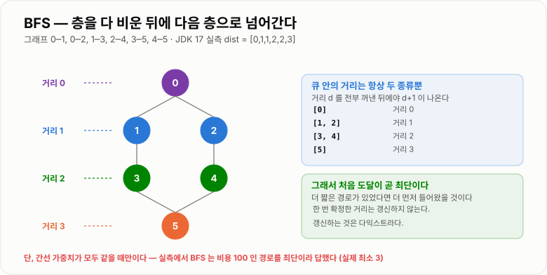

# BFS

> **BFS(Breadth First Search, 너비 우선 탐색)는 가까운 곳부터 층층이 퍼져 나가는 탐색이며, 큐의 FIFO 성질 덕분에 처음 도달한 순간이 곧 최단 거리가 된다.**

---

## 1. 핵심 요약

* 시작점에서 **거리 1인 곳을 전부** 본 뒤 **거리 2인 곳**으로 넘어간다. 이 층별 확장을 **큐**가 만든다.
* 시간 **O(V + E)**, 공간 **O(V)** 다. DFS와 복잡도는 같고 **자료구조만 스택 → 큐**로 다르다.
* **간선 가중치가 모두 같을 때 최단 경로를 보장한다.** 처음 도달한 순간이 최단이므로 다시 갱신할 일이 없다.
* **가중치가 다르면 BFS는 틀린 답을 준다.** 실측에서 BFS가 "간선 1개"라고 답한 경로의 실제 비용은 100이었고, 최소 비용은 3이었다. 이때는 **다익스트라**를 쓴다.
* **방문 표시는 큐에 넣을 때 해야 한다.** 꺼낼 때 표시하면 같은 정점이 여러 번 들어간다. 실측에서 6정점 그래프의 삽입 횟수가 **6회에서 16회**로 늘었다.
* 큐는 **`ArrayDeque`** 를 쓴다. `LinkedList`보다 실측 약 1.5배 빠르다. 방문 배열은 `boolean[]`이 `HashSet`보다 약 24배 빠르다.

---

## 2. 등장 배경

### 해결하려는 문제

DFS는 "연결되어 있는가"에는 답하지만 **"얼마나 가까운가"** 에는 답하지 못한다.

```text
그래프:  0 ── 1 ── 2 ── 5      (0 → 5 : 3칸)
         │              │
         └───── 3 ──────┘      (0 → 3 → 5 : 2칸)

DFS 가 인접 리스트를 [1, 3] 순서로 본다면
  0 → 1 → 2 → 5 에서 5 를 처음 만난다  →  "3칸"이라고 답한다
  실제 최단은 0 → 3 → 5 = 2칸이다
```

JDK 17에서 실제로 돌려 보면 확인된다.

| 방법                 | 결과    | 정확성                |
| ------------------ | ----- | ------------------ |
| DFS — 처음 도달했을 때 반환 | **3** | **틀림**             |
| DFS — 모든 경로를 다 본 뒤 | 2     | 맞지만 지수 시간          |
| BFS                | **2** | **한 번의 순회로 정답**    |

그런데 최단 거리를 묻는 문제는 실무에 널려 있다.

* 소셜 네트워크의 **몇 다리 건너 아는 사이인가** (친구의 친구)
* 미로에서 출구까지 **최소 몇 걸음**인가
* 웹 페이지에서 다른 페이지까지 **최소 몇 번 클릭**인가
* 조직도에서 두 사람 사이의 **최소 보고 단계**는 몇인가
* 상태 변환 퍼즐에서 **최소 몇 번의 조작**이 필요한가

### 핵심 통찰 — 가까운 곳부터 보면 처음이 곧 최단이다

DFS가 틀리는 이유는 **먼 곳을 먼저 다 뒤지기 때문**이다. 그렇다면 순서를 뒤집으면 된다.

```text
"거리 1인 곳을 전부 본 뒤, 거리 2인 곳으로 넘어간다"

  → 거리 2인 곳을 볼 때는 거리 1인 곳을 이미 다 봤다
  → 어떤 정점을 처음 만났다면, 그보다 가까운 경로는 존재할 수 없다
  → 처음 도달한 순간이 곧 최단 거리다
```

이 순서를 만드는 것이 **큐**다.

```text
스택(LIFO): 마지막에 넣은 것부터 꺼냄  →  방금 발견한 먼 곳부터  →  DFS
큐(FIFO)  : 먼저 넣은 것부터 꺼냄      →  먼저 발견한 가까운 곳부터 →  BFS
```

**놀랍게도 코드에서 바꿀 것은 자료구조 하나뿐이다.**

```java
// DFS
Deque<Integer> stack = new ArrayDeque<>();
int current = stack.pop();      // LIFO — 마지막에 넣은 것

// BFS
Deque<Integer> queue = new ArrayDeque<>();
int current = queue.poll();     // FIFO — 먼저 넣은 것
```

나머지 로직은 거의 같은데 **결과의 성질이 완전히 달라진다.** 자료구조 선택이 알고리즘의 보장을 결정하는 대표적인 사례다.

### 이 개념이 없을 때

최단 거리를 구하려고 DFS를 쓰면 **모든 경로를 다 봐야 한다.**

```java
// 모든 경로를 탐색해 최솟값을 찾는다 — 지수 시간
void dfsAll(int current, int target, int depth) {
    if (current == target) {
        best = Math.min(best, depth);
        return;
    }
    visited[current] = true;
    for (int next : graph.get(current)) {
        if (!visited[next]) {
            dfsAll(next, target, depth + 1);
        }
    }
    visited[current] = false;    // 백트래킹 — 다른 경로에서 다시 쓸 수 있게
}
```

경로의 개수는 정점 수에 대해 **지수적으로 늘어난다.** 정점 30개짜리 그래프에서도 감당이 안 될 수 있다.

BFS는 **각 정점을 딱 한 번씩만 보고 O(V + E)** 에 끝낸다. `visited[current] = false`로 되돌리는 백트래킹 자체가 필요 없다. **한 번 확정한 거리는 절대 바뀌지 않기 때문**이다.

---

## 3. 핵심 개념

| 개념                     | 설명                                    | 중요한 이유                                     |
| ---------------------- | ------------------------------------- | ------------------------------------------ |
| **너비 우선**              | 가까운 층부터 전부 본 뒤 다음 층으로 간다              | DFS와 구분되는 정체성이자 최단성의 근거다                   |
| **큐(FIFO)**            | 먼저 발견한 것을 먼저 처리한다                     | 이 성질 하나가 최단 거리를 보장한다                       |
| **층(level, 거리)**       | 시작점으로부터의 간선 개수                        | 큐가 거리 d를 전부 처리한 뒤 d+1로 넘어간다               |
| **최단 거리 보장**           | 처음 도달한 순간이 최단이다                       | **단, 간선 가중치가 모두 같을 때만** 성립한다              |
| **방문 표시 시점**           | **큐에 넣을 때** 표시한다                      | 꺼낼 때 표시하면 중복 삽입이 발생한다 (실측 6회→16회)          |
| **거리 배열**              | `dist[]`로 방문 여부와 거리를 함께 관리            | `-1`을 미방문 표시로 쓰면 배열 하나로 끝난다               |
| **레벨 단위 처리**           | 큐의 현재 크기만큼만 꺼내 한 층을 처리                | "몇 번째 층인지"가 필요할 때 쓴다                       |
| **가중치 그래프에서의 실패**      | BFS는 간선 개수만 센다                        | 가중치가 다르면 **틀린 답**을 준다 (실측 확인)              |
| **0-1 BFS**            | 가중치가 0과 1뿐일 때 덱으로 처리                  | 다익스트라 없이 O(V+E)를 유지한다                     |
| **양방향 BFS**            | 시작점과 도착점 양쪽에서 동시에 확장                  | 탐색 공간을 b^d에서 2·b^(d/2)로 줄인다 (실측 최대 5,000배) |
| **메모리 폭발**             | 한 층의 정점 수만큼 큐에 쌓인다                    | 넓은 그래프에서 DFS보다 훨씬 많은 메모리를 쓴다              |

DFS와의 관계를 한눈에 보면 이렇다.

```text
        0                     DFS (스택)            BFS (큐)
       / \                    ──────────           ─────────
      1   2                   0 1 3 4 2 5 6        0 1 2 3 4 5 6
     / \  / \                 깊이부터               층별로
    3   4 5   6               경로·연결성             최단 거리
                              메모리 O(깊이)          메모리 O(너비)
```

---

## 4. 구조와 동작 원리

### 기본 동작

```text
그래프:        0
             /   \
            1     2
           / \   / \
          3   4 5   6

BFS(0) 진행:

  큐 [0]                     방문 {0}
  0 꺼냄 → 1, 2 를 넣는다
  큐 [1, 2]                  방문 {0,1,2}

  1 꺼냄 → 3, 4 를 넣는다
  큐 [2, 3, 4]               방문 {0,1,2,3,4}

  2 꺼냄 → 5, 6 를 넣는다
  큐 [3, 4, 5, 6]            방문 {0,1,2,3,4,5,6}

  3, 4, 5, 6 을 차례로 꺼냄 → 새로 넣을 것 없음
  큐 []  →  종료

방문 순서: 0 → 1 → 2 → 3 → 4 → 5 → 6
```

JDK 17 실측 결과가 **`0 1 2 3 4 5 6`** 이다. (같은 그래프의 DFS는 `0 1 3 4 2 5 6`)

### 왜 최단 거리가 보장되는가 — 층별 확장 실측

큐의 FIFO 성질이 만드는 결과를 실제로 확인해 보았다.

```text
그래프:  0─1, 0─2, 1─3, 2─4, 3─5, 4─5, 5─6, 6─7, 7─8

BFS 결과를 거리별로 묶으면:

  거리 0 : [0]
  거리 1 : [1, 2]
  거리 2 : [3, 4]
  거리 3 : [5]
  거리 4 : [6]
  거리 5 : [7]
  거리 6 : [8]

  dist = [0, 1, 1, 2, 2, 3, 4, 5, 6]
```

**거리가 뒤섞이지 않는다.** 큐에서 거리 d인 정점을 전부 꺼낸 뒤에야 거리 d+1인 정점이 나온다.

```text
큐에 들어간 순서를 보면

  [0]                거리 0
  [1, 2]             거리 1  ← 0 을 처리하며 넣음
  [3, 4]             거리 2  ← 1, 2 를 처리하며 넣음
  [5]                거리 3
   ...

  거리 d 인 정점을 처리하면서 넣는 것은 전부 거리 d+1 이다.
  큐는 FIFO 이므로 거리 d 가 다 빠진 뒤에 d+1 이 나온다.
  → 큐 안의 거리는 항상 최대 두 종류(d 와 d+1)뿐이다
```

이것이 **정점 5가 처음 큐에 들어간 순간의 거리 3이 곧 최단**인 이유다. 더 짧은 경로가 있었다면 그 경로를 통해 더 먼저 들어왔을 것이다.



*큐가 FIFO이므로 거리 d를 전부 처리한 뒤 d+1로 넘어가고, 그래서 처음 도달이 곧 최단이다.*

### 방문 표시는 넣을 때 해야 한다

BFS에서 가장 흔한 실수다. 언뜻 보면 "꺼낼 때 표시해도 되지 않나?" 싶지만 결과가 다르다.

```java
// 잘못된 방식 — 꺼낼 때 표시
while (!queue.isEmpty()) {
    int current = queue.poll();
    if (visited[current]) {
        continue;
    }
    visited[current] = true;          // ← 여기서 표시
    for (int next : graph.get(current)) {
        if (!visited[next]) {
            queue.offer(next);        // 아직 표시 안 된 정점이 중복으로 들어간다
        }
    }
}

// 올바른 방식 — 넣을 때 표시
while (!queue.isEmpty()) {
    int current = queue.poll();
    for (int next : graph.get(current)) {
        if (!visited[next]) {
            visited[next] = true;     // ← 넣기 직전에 표시
            queue.offer(next);
        }
    }
}
```

**왜 문제가 되는가?**

```text
정점 A 와 B 가 둘 다 정점 X 와 연결되어 있다고 하자.

꺼낼 때 표시하는 경우:
  A 처리 → X 는 아직 미방문 → 큐에 X 삽입
  B 처리 → X 는 여전히 미방문(아직 안 꺼냄) → 큐에 X 또 삽입
  → 큐에 X 가 두 번 들어간다

넣을 때 표시하는 경우:
  A 처리 → X 미방문 → 표시하고 삽입
  B 처리 → X 이미 방문됨 → 삽입 안 함
  → X 는 정확히 한 번만 들어간다
```

JDK 17에서 정점 6개짜리 완전 그래프로 측정한 결과다.

| 방문 표시 시점       | 큐에 들어간 총 횟수 |
| -------------- | ---------: |
| **넣을 때 표시**    |      **6** |
| 꺼낼 때 표시        |     **16** |

**약 2.7배 차이**다. 정점이 6개일 때 이 정도이고, **간선이 많은 큰 그래프에서는 격차가 훨씬 커진다.** 최악의 경우 큐 크기가 O(E)까지 부풀어 메모리 문제로 이어진다.


*넣을 때 표시하면 각 정점이 큐에 정확히 한 번만 들어간다.*

### 가중치가 있으면 BFS는 틀린다

BFS가 보장하는 것은 **"간선 개수의 최솟값"** 이지 **"비용의 최솟값"** 이 아니다.

```text
그래프:
  0 ─────(100)───── 1
  │                 │
 (1)               (1)
  │                 │
  2 ─────(1)─────── 3

BFS(간선 개수 기준):
  0 → 1 은 간선 1개  →  "최단"이라고 답한다
  실제 비용은 100 이다

실제 최소 비용:
  0 → 2 → 3 → 1 = 1 + 1 + 1 = 3   (간선 3개)
```

다익스트라로 확인한 실측 결과다.

```text
다익스트라 dist = [0, 3, 1, 2]

  0 → 1 의 최소 비용은 3 이지 100 이 아니다.
  BFS 는 간선 개수만 세므로 이 차이를 볼 수 없다.
```

**가중치가 있으면 알고리즘을 바꿔야 한다.**

| 상황                | 알고리즘             | 복잡도                |
| ----------------- | ---------------- | ------------------ |
| 가중치가 모두 같음        | **BFS**          | O(V + E)           |
| 가중치가 **0과 1뿐**    | **0-1 BFS** (덱)  | O(V + E)           |
| 가중치가 다양하고 **음수 없음** | **다익스트라**        | O((V + E) log V)   |
| **음수 간선**이 있음     | **벨만-포드**        | O(V × E)           |
| 모든 쌍의 최단 거리       | **플로이드-워셜**      | O(V³)              |

### 레벨 단위로 처리하기

"몇 번째 층인지"가 필요할 때는 **큐의 현재 크기만큼만 꺼내는** 기법을 쓴다.

```text
큐 [1, 2]        ← 거리 1인 정점들, 크기 2
  현재 크기(2)만큼만 꺼낸다
  1 꺼냄 → 3, 4 삽입
  2 꺼냄 → 5, 6 삽입
  → 이 층 처리 완료. 거리 카운터 +1

큐 [3, 4, 5, 6]  ← 거리 2인 정점들, 크기 4
  현재 크기(4)만큼만 꺼낸다
  ...
```

```java
int level = 0;
while (!queue.isEmpty()) {
    int size = queue.size();          // 이 층의 정점 수를 먼저 확정
    for (int i = 0; i < size; i++) {
        int current = queue.poll();
        // ... 이웃을 큐에 넣는다 (큐 크기가 늘어나지만 size 는 고정)
    }
    level++;                          // 한 층 끝
}
```

**`queue.size()`를 반복문 안에서 호출하면 안 된다.** 처리 중에 크기가 계속 변하기 때문이다. 먼저 지역 변수에 담아 두는 것이 핵심이다.

### 양방향 BFS — 탐색 공간 줄이기

시작점과 도착점을 **둘 다 알 때**만 쓸 수 있는 최적화다.

```text
단방향 BFS: 시작점에서 깊이 d 까지 확장  →  약 b^d 개 방문
양방향 BFS: 양쪽에서 깊이 d/2 씩 확장    →  약 2 × b^(d/2) 개 방문

  (b = 분기 계수, d = 최단 거리)
```

분기 계수 10일 때 실제로 계산해 보면 차이가 극적이다.

| 최단 거리 d | 단방향 BFS 방문 수 | 양방향 BFS 방문 수 | 차이         |
| -------: | -----------: | -----------: | ---------- |
|        4 |       10,000 |          200 | **약 50배**  |
|        6 |    1,000,000 |        2,000 | **약 500배** |
|        8 |  100,000,000 |       20,000 | **약 5,000배** |

**"몇 다리 건너 아는 사이인가"** 같은 소셜 네트워크 문제에서 결정적이다. 6단계 분리 이론이 맞다면 단방향으로는 100만 명을 봐야 하지만 양방향이면 2천 명이면 된다.

---

## 5. 코드 또는 사용 예시

### 기본 BFS — 최단 거리

```java
import java.util.ArrayDeque;
import java.util.ArrayList;
import java.util.Arrays;
import java.util.Deque;
import java.util.List;

public class BasicBfs {

    /**
     * start 에서 각 정점까지의 최단 거리를 구한다.
     * 도달할 수 없으면 -1.
     */
    public static int[] shortestDistances(List<List<Integer>> graph, int start) {
        int n = graph.size();
        int[] dist = new int[n];
        Arrays.fill(dist, -1);             // -1 = 미방문

        Deque<Integer> queue = new ArrayDeque<>();
        queue.offer(start);
        dist[start] = 0;                   // 넣을 때 표시

        while (!queue.isEmpty()) {
            int current = queue.poll();

            List<Integer> adjacent = graph.get(current);
            for (int i = 0; i < adjacent.size(); i++) {
                int next = adjacent.get(i);

                if (dist[next] == -1) {          // 아직 안 본 곳만
                    dist[next] = dist[current] + 1;   // 넣을 때 거리 확정
                    queue.offer(next);
                }
            }
        }
        return dist;
    }

    public static void main(String[] args) {
        List<List<Integer>> g = new ArrayList<>();
        for (int i = 0; i < 9; i++) {
            g.add(new ArrayList<Integer>());
        }
        addEdge(g, 0, 1); addEdge(g, 0, 2);
        addEdge(g, 1, 3); addEdge(g, 2, 4);
        addEdge(g, 3, 5); addEdge(g, 4, 5);
        addEdge(g, 5, 6); addEdge(g, 6, 7); addEdge(g, 7, 8);

        System.out.println(Arrays.toString(shortestDistances(g, 0)));
        // [0, 1, 1, 2, 2, 3, 4, 5, 6]
    }

    private static void addEdge(List<List<Integer>> g, int a, int b) {
        g.get(a).add(b);
        g.get(b).add(a);
    }
}
```

각 부분의 의미는 이렇다.

```java
Arrays.fill(dist, -1);
```

**거리 배열 하나가 방문 배열 역할까지 한다.** `-1`이면 미방문, 그 외면 방문 + 거리다. `boolean[] visited`를 따로 두지 않아도 되어 메모리와 코드가 모두 줄어든다.

```java
dist[next] = dist[current] + 1;
queue.offer(next);
```

**거리를 확정하고 큐에 넣는 것이 한 쌍**이다. 이 순서를 지키면 자동으로 "넣을 때 방문 표시"가 된다.

```java
if (dist[next] == -1)
```

**한 번 확정한 거리는 절대 갱신하지 않는다.** BFS의 최단성 덕분에 처음 값이 이미 최적이기 때문이다. 다익스트라가 `if (새 거리 < 기존 거리)`로 갱신하는 것과 대비된다.

### 격자 BFS — 미로 최단 경로

```java
import java.util.ArrayDeque;
import java.util.Arrays;
import java.util.Deque;

public class GridBfs {

    private static final int[] DR = {-1, 1, 0, 0};
    private static final int[] DC = {0, 0, -1, 1};

    /** '1'이 벽인 격자에서 (0,0) 부터 각 칸까지의 최단 거리. */
    public static int[][] distances(String[] grid) {
        int rows = grid.length;
        int cols = grid[0].length();

        int[][] dist = new int[rows][cols];
        for (int i = 0; i < rows; i++) {
            Arrays.fill(dist[i], -1);
        }

        Deque<int[]> queue = new ArrayDeque<>();
        queue.offer(new int[]{0, 0});
        dist[0][0] = 0;

        while (!queue.isEmpty()) {
            int[] current = queue.poll();
            int r = current[0];
            int c = current[1];

            for (int d = 0; d < 4; d++) {
                int nr = r + DR[d];
                int nc = c + DC[d];

                if (nr < 0 || nr >= rows || nc < 0 || nc >= cols) {
                    continue;                       // 범위 밖
                }
                if (grid[nr].charAt(nc) == '1') {
                    continue;                       // 벽
                }
                if (dist[nr][nc] != -1) {
                    continue;                       // 이미 방문
                }

                dist[nr][nc] = dist[r][c] + 1;
                queue.offer(new int[]{nr, nc});
            }
        }
        return dist;
    }

    public static void main(String[] args) {
        String[] grid = {
                "0000",
                "1110",
                "0000",
                "0111",
                "0000",
        };
        int[][] d = distances(grid);
        for (int i = 0; i < d.length; i++) {
            System.out.println(Arrays.toString(d[i]));
        }
        System.out.println("(0,0) → (4,3) 최단 = " + d[4][3]);
    }
}
```

JDK 17에서 실행하면 이런 결과가 나온다.

```text
격자 (1은 벽)         각 칸까지의 최단 거리
  0 0 0 0               0   1   2   3
  1 1 1 0              -1  -1  -1   4
  0 0 0 0               8   7   6   5
  0 1 1 1               9  -1  -1  -1
  0 0 0 0              10  11  12  13

(0,0) → (4,3) 최단 = 13
```

**벽을 돌아가느라 13칸**이 걸린다. 직선 거리는 7칸(4+3)인데 벽 때문에 지그재그로 가야 한다. `-1`인 칸은 도달 불가능한 벽이다.

**격자 BFS는 재귀 깊이 문제가 없다.** 1000×1000 격자를 재귀 DFS로 순회하면 최악의 경우 깊이 100만으로 `StackOverflowError`가 나지만, BFS는 큐를 힙에 두므로 안전하다.

### 레벨 단위 처리 — 몇 단계 만에 도달하는가

```java
import java.util.ArrayDeque;
import java.util.Deque;
import java.util.HashSet;
import java.util.List;
import java.util.Set;

public class LevelBfs {

    /** start 에서 target 까지 최소 몇 단계인지 구한다. 못 가면 -1. */
    public static int minSteps(List<List<Integer>> graph, int start, int target) {
        if (start == target) {
            return 0;
        }

        boolean[] visited = new boolean[graph.size()];
        Deque<Integer> queue = new ArrayDeque<>();
        queue.offer(start);
        visited[start] = true;

        int level = 0;

        while (!queue.isEmpty()) {
            int size = queue.size();        // 이 층의 크기를 먼저 확정한다
            level++;

            for (int i = 0; i < size; i++) {
                int current = queue.poll();

                List<Integer> adjacent = graph.get(current);
                for (int j = 0; j < adjacent.size(); j++) {
                    int next = adjacent.get(j);

                    if (next == target) {
                        return level;       // 이 층에서 찾았다
                    }
                    if (!visited[next]) {
                        visited[next] = true;
                        queue.offer(next);
                    }
                }
            }
        }
        return -1;
    }
}
```

```java
int size = queue.size();
```

**반복문 밖에서 크기를 확정한다.** 안에서 `queue.size()`를 쓰면 처리 중에 늘어난 다음 층까지 같은 층으로 취급된다. BFS 레벨 처리의 대표적인 버그다.

### 양방향 BFS

```java
import java.util.ArrayDeque;
import java.util.Deque;
import java.util.HashSet;
import java.util.List;
import java.util.Set;

public class BidirectionalBfs {

    /**
     * 시작점과 도착점 양쪽에서 동시에 확장한다.
     * 두 탐색이 만나면 그 지점이 최단 경로 위에 있다.
     */
    public static int shortestPath(List<List<Integer>> graph, int start, int end) {
        if (start == end) {
            return 0;
        }

        Set<Integer> forward = new HashSet<>();
        Set<Integer> backward = new HashSet<>();
        forward.add(start);
        backward.add(end);

        Set<Integer> visitedForward = new HashSet<>(forward);
        Set<Integer> visitedBackward = new HashSet<>(backward);

        int steps = 0;

        while (!forward.isEmpty() && !backward.isEmpty()) {
            // 항상 작은 쪽을 확장해야 이득이 크다
            if (forward.size() > backward.size()) {
                Set<Integer> tmp = forward;
                forward = backward;
                backward = tmp;

                Set<Integer> tmpVisited = visitedForward;
                visitedForward = visitedBackward;
                visitedBackward = tmpVisited;
            }

            Set<Integer> nextLevel = new HashSet<>();
            steps++;

            for (Integer current : forward) {
                List<Integer> adjacent = graph.get(current);
                for (int i = 0; i < adjacent.size(); i++) {
                    int next = adjacent.get(i);

                    if (visitedBackward.contains(next)) {
                        return steps;          // 반대쪽과 만났다
                    }
                    if (visitedForward.add(next)) {
                        nextLevel.add(next);
                    }
                }
            }
            forward = nextLevel;
        }
        return -1;
    }
}
```

**"항상 작은 쪽을 확장한다"** 는 부분이 핵심 최적화다. 한쪽이 폭발적으로 커지면 이득이 사라지기 때문이다.

### 큐 구현 선택 — `ArrayDeque` vs `LinkedList`

```java
// 권장
Deque<Integer> queue = new ArrayDeque<>();

// 비권장 (JDK 문서도 ArrayDeque 를 권장한다)
Queue<Integer> queue = new LinkedList<>();
```

JDK 17에서 정점 100만 개를 BFS로 순회한 실측 결과다.

| 큐 구현         | 시간         | 비고                  |
| ------------ | ---------- | ------------------- |
| `ArrayDeque` | **6.5 ms** | 순환 배열, 캐시 친화적       |
| `LinkedList` | 9.6 ms     | **약 1.5배 느림**, 노드 객체 |

차이가 극적이지는 않지만 `ArrayDeque`가 일관되게 빠르다. **노드 객체를 만들지 않아 GC 부담도 적다.** 특별한 이유가 없으면 `ArrayDeque`를 쓴다.

방문 배열도 마찬가지다.

| 방문 표시              | 100만 정점 실측 | 비고           |
| ------------------ | ---------: | ------------ |
| `boolean[]`        | **4.71 ms** | 메모리 약 1MB    |
| `HashSet<Integer>` | 110.73 ms  | **약 24배 느림** |

---

## 6. 성능 특성

| 항목       | 인접 리스트         | 인접 행렬          | 설명                |
| -------- | -------------- | -------------- | ----------------- |
| 전체 탐색    | **O(V + E)**   | O(V²)          | 각 정점 1번, 각 간선 1번  |
| 메모리 (그래프) | **O(V + E)**   | O(V²)          | 실측 V=1만, E=5만에서 약 179배 |
| 큐 최대 크기  | O(V)           | O(V)           | 한 층의 정점 수가 최대치    |
| 거리 배열    | O(V)           | O(V)           | -                 |

### DFS와의 메모리 비교

복잡도는 둘 다 O(V)지만 **실제로 얼마를 쓰는지는 그래프 모양에 달렸다.**

```text
깊고 좁은 그래프 (일자형 사슬)
    ●─●─●─●─●─●─●─●─●─●
    DFS : 스택에 깊이만큼 = O(V)  ← 재귀면 StackOverflowError 위험
    BFS : 큐에 한 층 = O(1)       ← 유리

넓고 얕은 그래프 (별 모양, 한 노드에 100만 개 연결)
         ●
    ●●●●●●●●●●●●●  (100만 개)
    DFS : 스택에 깊이 2 = O(1)     ← 유리
    BFS : 큐에 100만 개 = O(V)     ← 메모리 폭발
```

**"BFS가 항상 메모리를 더 쓴다"는 것은 오해다.** 그래프 모양에 따라 정반대가 될 수 있다.

다만 **실무의 그래프는 대체로 넓다.** 소셜 네트워크에서 유명인의 팔로워는 수백만 명일 수 있다. 이 경우 BFS의 큐가 폭발한다.

```text
분기 계수 b, 깊이 d 인 트리에서 BFS 의 큐 최대 크기 ≈ b^d

  b = 10, d = 6  →  약 100만 개
  b = 100, d = 4 →  약 1억 개   ← 메모리 부족
```

**대응책은 양방향 BFS**다. 실측 계산으로 분기 10·깊이 8에서 방문 수가 1억에서 2만으로 줄어든다.

### 방문 표시 시점에 따른 큐 크기

앞서 본 실측을 성능 관점에서 다시 보면 이렇다.

| 방문 표시 시점   | 6정점 완전 그래프에서 큐 삽입 횟수 |
| ---------- | -------------------: |
| **넣을 때**   |                **6** |
| 꺼낼 때       |               **16** |

**넣을 때 표시하면 삽입 횟수가 정확히 V가 된다.** 꺼낼 때 표시하면 최악의 경우 O(E)까지 늘어난다. 간선이 많은 그래프에서 메모리와 시간 모두에 영향을 준다.

### 자료구조 선택별 실측 정리

| 항목    | 권장                 | 대안                 | 실측 차이       |
| ----- | ------------------ | ------------------ | ----------- |
| 큐     | **`ArrayDeque`**   | `LinkedList`       | 약 1.5배      |
| 방문 표시 | **`boolean[]`**    | `HashSet<Integer>` | **약 24배**   |
| 그래프 표현 | **인접 리스트**         | 인접 행렬              | 메모리 약 179배  |
| 거리 저장 | **`int[]` (`-1` 초기화)** | 별도 `visited` 배열    | 배열 하나로 통합 가능 |

---

## 7. 장점과 단점

| 장점                     | 이유                                    |
| ---------------------- | ------------------------------------- |
| **최단 거리를 보장한다**        | 큐의 FIFO 덕분에 처음 도달이 곧 최단이다 (가중치 동일할 때) |
| 각 정점을 한 번만 본다          | 거리를 갱신할 일이 없어 백트래킹이 불필요하다             |
| 답이 가까울 때 매우 빠르다        | 먼 곳을 뒤지지 않고 가까운 층에서 끝난다               |
| 재귀 깊이 문제가 없다           | 큐를 힙에 두므로 `StackOverflowError`가 없다    |
| 깊고 좁은 그래프에서 메모리가 적다    | 한 층만 담으면 되어 DFS보다 유리할 수 있다            |
| 레벨 단위 처리가 자연스럽다        | 큐 크기를 이용해 "몇 번째 단계"를 쉽게 셀 수 있다        |
| 양방향 확장으로 극적인 최적화가 가능하다 | 실측 계산상 최대 약 5,000배까지 탐색 공간이 줄어든다      |
| 분산 처리에 적합하다            | 층 단위로 나눌 수 있어 Pregel 같은 모델에 맞는다       |

| 단점                       | 이유 및 주의점                                    |
| ------------------------ | ------------------------------------------- |
| **가중치가 다르면 틀린 답을 준다**    | 간선 개수만 센다. 실측에서 비용 100인 경로를 최단이라고 답했다       |
| 넓은 그래프에서 메모리가 폭발한다       | 한 층의 정점 수만큼 큐에 쌓인다. 분기 100·깊이 4면 1억 개       |
| 방문 표시 시점을 틀리기 쉽다         | 꺼낼 때 표시하면 중복 삽입이 발생한다 (실측 6회→16회)           |
| 답이 깊은 곳에 있으면 불리하다        | 얕은 층을 전부 훑고 나서야 깊은 곳에 도달한다                 |
| 재귀로 쓸 수 없다               | 큐를 명시적으로 관리해야 해 DFS보다 코드가 길다                |
| 후위 처리를 표현하기 어렵다          | 위상 정렬·서브트리 계산 같은 작업은 DFS가 자연스럽다             |
| 경로 자체를 복원하려면 추가 배열이 필요하다 | 거리만으로는 경로를 알 수 없어 `parent[]`를 따로 둬야 한다      |
| 레벨 처리에서 `size()` 실수가 잦다  | 반복문 안에서 호출하면 다음 층이 섞인다                      |

---

## 8. 사용 기준

### 사용하기 좋은 상황

* **최단 거리·최소 횟수**를 구할 때 (간선 가중치가 모두 같을 때)
* 답이 **시작점 근처에 있을** 가능성이 높을 때
* **격자·미로**에서 최소 이동 횟수를 구할 때
* **몇 다리 건너**인지 계산할 때 (소셜 네트워크)
* **레벨별 처리**가 필요할 때 (같은 깊이끼리 묶기)
* **깊고 좁은** 그래프를 순회할 때 (DFS는 재귀 깊이 위험)
* 상태 변환 퍼즐에서 **최소 조작 횟수**를 구할 때

### 사용하지 않는 것이 좋은 상황

* **가중치가 다른** 그래프의 최소 비용 → **다익스트라**
* **음수 간선**이 있을 때 → **벨만-포드**
* 그래프가 **매우 넓을** 때 (메모리 폭발) → DFS 또는 양방향 BFS
* **모든 정점 방문**만 필요하고 거리는 상관없을 때 → DFS가 코드가 짧다
* **순환 탐지·위상 정렬**이 목적일 때 → DFS의 후위 처리
* **백트래킹** 문제 (순열·조합) → DFS

### 선택 기준

1. **최단 거리가 필요한가?** — 필요하면 BFS(가중치 동일) 또는 다익스트라(가중치 다름)
2. **가중치가 있는가?** — 모두 같으면 BFS, 0과 1뿐이면 0-1 BFS, 다양하면 다익스트라
3. **그래프가 넓은가 깊은가?** — 넓으면 메모리 주의, 깊으면 BFS가 오히려 유리
4. **시작점과 도착점을 둘 다 아는가?** — 알면 양방향 BFS를 검토한다
5. **답이 가까울 것 같은가?** — 가까우면 BFS가 압도적으로 유리하다

```text
              최단 거리가 필요한가?
                      │
        ┌─────────────┴─────────────┐
      예                          아니오
        │                          │
   가중치는?                    DFS 로 충분
        │                    (코드가 더 짧다)
  ┌─────┼─────┬──────────┐
모두동일  0과1   다양(음수X)   음수 있음
  │       │       │            │
 BFS   0-1 BFS  다익스트라    벨만-포드
        (덱)

  그래프가 매우 넓다면  →  양방향 BFS 검토 (실측 최대 약 5,000배)
```

---

## 9. 비슷한 개념 비교

### BFS와 DFS

| 비교 항목    | BFS                | DFS                | 선택 기준        |
| -------- | ------------------ | ------------------ | ------------ |
| 자료구조     | **큐 (FIFO)**       | **스택 (LIFO)/재귀**   | 코드는 이것만 다르다  |
| 탐색 순서    | 층별(가까운 곳부터)        | 깊이부터               | -            |
| 최단 경로    | **보장** (가중치 동일)    | **보장 안 됨**         | **결정적 차이**   |
| 메모리      | O(최대 너비)           | O(최대 깊이)           | 그래프 모양에 따라   |
| 깊고 좁은 그래프 | **유리**             | 재귀면 `StackOverflowError` | 사슬 형태면 BFS   |
| 넓고 얕은 그래프 | **메모리 폭발**         | **유리**             | 별 모양이면 DFS   |
| 답이 가까울 때 | **유리**             | 불리 (먼 곳부터 뒤짐)      | 위치 예상        |
| 재귀 구현    | 불가능                | **가능** (코드가 짧음)    | DFS가 간결      |
| 후위 처리    | 어려움                | **자연스러움**          | 위상 정렬이면 DFS  |
| 대표 용도    | 최단 거리, 레벨 순회       | 연결 요소, 순환 탐지, 백트래킹 | 문제 성격        |

### BFS와 다익스트라

| 비교 항목  | BFS                | 다익스트라               | 선택 기준       |
| ------ | ------------------ | ------------------- | ----------- |
| 가중치    | **모두 같아야 함**       | **양수면 됨**           | 결정적 차이      |
| 자료구조   | 큐 (`ArrayDeque`)   | 우선순위 큐 (`PriorityQueue`) | 비용 순 처리 여부  |
| 복잡도    | **O(V + E)**       | O((V + E) log V)    | BFS가 더 빠름   |
| 거리 갱신  | **없음** (처음이 최단)    | **있음** (더 짧으면 갱신)   | 구현 차이       |
| 음수 간선  | 해당 없음              | **불가능**             | 음수면 벨만-포드   |
| 방문 확정  | 큐에 넣을 때            | 큐에서 꺼낼 때            | 중요한 구현 차이   |
| 적합한 상황 | 격자, 무가중치 그래프       | 도로망, 네트워크 지연        | 가중치 유무      |

**BFS는 "가중치가 모두 1인 다익스트라"** 로 볼 수 있다. 모든 간선이 같으므로 우선순위 큐가 필요 없고 일반 큐로 충분해지는 것이다.

### BFS와 0-1 BFS

| 비교 항목  | BFS              | 0-1 BFS           | 다익스트라              |
| ------ | ---------------- | ----------------- | ------------------ |
| 가중치    | 모두 같음            | **0 또는 1**        | 임의의 양수             |
| 자료구조   | 큐                | **덱 (양쪽 삽입)**     | 우선순위 큐             |
| 삽입 방식  | 뒤에만              | 0이면 **앞**, 1이면 뒤  | 우선순위대로             |
| 복잡도    | O(V + E)         | **O(V + E)**      | O((V + E) log V)   |
| 적합한 상황 | 격자 이동            | "벽 부수기", 무료 이동 존재 | 일반적인 가중 그래프        |

```java
// 0-1 BFS 의 핵심
if (weight == 0) {
    deque.offerFirst(next);      // 비용이 없으니 지금 층과 같다 → 앞에
} else {
    deque.offerLast(next);       // 비용 1 → 다음 층 → 뒤에
}
```

**로그 계수 없이 O(V+E)를 유지**하는 것이 0-1 BFS의 가치다.

### 단방향 BFS와 양방향 BFS

| 비교 항목  | 단방향 BFS     | 양방향 BFS               | 선택 기준         |
| ------ | ---------- | -------------------- | ------------- |
| 탐색 공간  | 약 b^d      | **약 2 × b^(d/2)**    | 깊이가 클수록 유리    |
| d=8, b=10 | 1억         | **2만**               | **약 5,000배**  |
| 전제 조건  | 시작점만 알면 됨  | **도착점도 알아야 함**       | 결정적 제약        |
| 구현 난이도 | 단순         | 두 집합 관리, 만남 판정       | 복잡도 증가        |
| 경로 복원  | 비교적 쉬움     | 양쪽 경로를 이어 붙여야 함      | 추가 작업         |
| 적합한 상황 | 모든 정점까지 거리 | 특정 두 점 사이 거리         | 목적지가 하나인가     |

---

## 10. 백엔드 실무 적용

### Spring·Java

**추천 시스템의 "몇 다리 건너"** 가 BFS의 대표 적용이다.

```java
import java.util.ArrayDeque;
import java.util.ArrayList;
import java.util.Deque;
import java.util.HashSet;
import java.util.List;
import java.util.Set;

@Service
public class FriendRecommendService {

    /**
     * 2단계 이내의 친구(친구의 친구)를 추천한다.
     * 깊이를 제한하지 않으면 전체 그래프를 다 훑게 된다.
     */
    public List<Long> recommend(Long memberId, int maxDepth) {
        Set<Long> visited = new HashSet<>();
        List<Long> result = new ArrayList<>();

        Deque<Long> queue = new ArrayDeque<>();
        queue.offer(memberId);
        visited.add(memberId);

        int depth = 0;

        while (!queue.isEmpty() && depth < maxDepth) {
            int size = queue.size();          // 이 층의 크기를 확정
            depth++;

            for (int i = 0; i < size; i++) {
                Long current = queue.poll();

                for (Long friendId : friendIdsOf(current)) {
                    if (visited.add(friendId)) {    // 넣을 때 표시
                        queue.offer(friendId);
                        if (depth >= 2) {
                            result.add(friendId);   // 2단계부터가 추천 대상
                        }
                    }
                }
            }
        }
        return result;
    }
}
```

**이 코드에는 두 가지 실무적 함정이 있다.**

**첫째, 깊이 제한이 없으면 전체 그래프를 훑는다.** 소셜 네트워크는 6단계면 사실상 전 세계가 연결된다. `maxDepth`가 필수다.

**둘째, `friendIdsOf()`가 매번 쿼리를 날리면 N+1이 된다.**

```text
1단계 친구가 100명이면
  → friendIdsOf() 가 100번 호출
  → 쿼리 100번

  BFS 자체는 O(V+E) 인데 실제로는 네트워크 왕복 100번이다.
```

해결책은 **층 단위로 한 번에 조회하는 것**이다.

```java
// 한 층의 모든 정점을 모아 IN 절로 한 번에 조회
List<Long> currentLevel = new ArrayList<>();
for (int i = 0; i < size; i++) {
    currentLevel.add(queue.poll());
}
// 쿼리 1번으로 이 층의 모든 친구 관계를 가져온다
Map<Long, List<Long>> friendsMap = friendRepository.findFriendsOf(currentLevel);
```

**BFS의 층 구조가 이 최적화와 딱 맞는다.** 같은 층은 동시에 처리해도 되므로 일괄 조회가 자연스럽다. DFS로는 이렇게 묶기 어렵다.

**조직도 계층 조회**도 마찬가지다.

```java
/** 특정 조직의 하위 조직을 깊이별로 조회한다. */
public Map<Integer, List<Department>> byDepth(Long rootId) {
    Map<Integer, List<Department>> result = new LinkedHashMap<>();
    Deque<Long> queue = new ArrayDeque<>();
    Set<Long> visited = new HashSet<>();

    queue.offer(rootId);
    visited.add(rootId);
    int depth = 0;

    while (!queue.isEmpty()) {
        int size = queue.size();
        List<Long> currentIds = new ArrayList<>();
        for (int i = 0; i < size; i++) {
            currentIds.add(queue.poll());
        }

        // 층 단위 일괄 조회 — 쿼리 1번
        List<Department> children = departmentRepository.findByParentIdIn(currentIds);
        result.put(depth, children);

        for (int i = 0; i < children.size(); i++) {
            Long id = children.get(i).getId();
            if (visited.add(id)) {
                queue.offer(id);
            }
        }
        depth++;
    }
    return result;
}
```

**쿼리 횟수가 조직의 깊이만큼**이다. 조직 깊이가 5단계면 쿼리 5번이다. DFS나 재귀로 하면 조직 개수만큼 쿼리가 나간다.

### 데이터베이스·캐시

**재귀 CTE로도 BFS 형태의 탐색이 가능하다.**

```sql
-- 깊이 제한을 둔 하위 조직 조회
WITH RECURSIVE org_tree AS (
    SELECT id, name, parent_id, 0 AS depth
    FROM departments
    WHERE id = 1

    UNION ALL

    SELECT d.id, d.name, d.parent_id, ot.depth + 1
    FROM departments d
    JOIN org_tree ot ON d.parent_id = ot.id
    WHERE ot.depth < 5          -- 깊이 제한 필수
)
SELECT * FROM org_tree ORDER BY depth, id;
```

**`ORDER BY depth`가 BFS 순서**를 만든다. `UNION ALL`의 재귀는 개념적으로 층별 확장이라 BFS와 잘 맞는다.

**주의할 점**은 DFS 노트와 같다.

```text
1. 깊이 제한이 없으면 순환 시 무한 루프
2. 깊이가 깊으면 단계마다 조인이 발생해 느려진다
3. MySQL 은 8.0 부터 지원
```

**그래프 DB**는 이런 탐색에 특화되어 있다.

```text
Neo4j Cypher:
    MATCH (me:Member {id: 1})-[:FRIEND*2..2]-(fof:Member)
    RETURN DISTINCT fof

  *2..2 가 "정확히 2단계"를 뜻하며 내부적으로 BFS 로 처리된다.
  관계형 DB 의 재귀 CTE 보다 훨씬 빠르다.
```

**Redis로 방문 집합을 관리**하면 분산 BFS가 가능하다.

```text
SADD visited:job123 <정점ID>       ← 반환값이 1이면 새로 추가된 것
SISMEMBER visited:job123 <정점ID>

  SADD 의 반환값으로 "넣을 때 방문 표시"를 원자적으로 구현할 수 있다.
  여러 워커가 동시에 확장해도 중복 처리가 없다.
```

### 동시성·분산 환경

* **`ArrayDeque`는 스레드 안전하지 않다.** 여러 스레드가 큐를 공유하는 병렬 BFS라면 `ConcurrentLinkedQueue`나 `LinkedBlockingQueue`를 써야 한다.
* **BFS는 층 단위로 병렬화하기 좋다.** 같은 층의 정점들은 서로 독립적이므로 나눠서 처리할 수 있다. DFS는 순차 의존성이 커서 이런 분할이 어렵다.
* **방문 표시의 원자성**이 중요하다. 여러 스레드가 동시에 "미방문 확인 후 표시"를 하면 같은 정점을 중복 처리한다. `AtomicIntegerArray`의 `compareAndSet`이나 Redis `SADD`의 반환값을 쓴다.
* **분산 그래프 처리 모델(Pregel, Giraph)** 이 BFS의 층 구조를 그대로 차용했다. 각 **슈퍼스텝**이 한 층에 대응하고, 슈퍼스텝 사이에 노드 간 메시지를 주고받는다.
* **넓은 그래프에서 큐가 메모리를 초과할 수 있다.** 이때는 층 단위로 디스크에 스필하거나, 양방향 BFS로 탐색 공간을 줄인다.

---

## 11. 자주 하는 오해

| 잘못된 이해                                | 올바른 이해                                                                |
| ------------------------------------- | --------------------------------------------------------------------- |
| BFS는 항상 최단 경로를 보장한다                   | **간선 가중치가 모두 같을 때만**이다. 실측에서 비용 100인 경로를 최단이라고 답했다 (실제 최소 3)          |
| BFS와 DFS는 구현이 많이 다르다                  | **자료구조만 큐↔스택**이다. 나머지 코드는 거의 같은데 보장이 완전히 달라진다                        |
| 방문 표시는 꺼낼 때 해도 된다                     | **넣을 때 해야 한다.** 실측에서 6정점 그래프의 큐 삽입이 6회에서 16회로 늘었다                    |
| BFS는 DFS보다 항상 메모리를 많이 쓴다              | **그래프 모양에 달렸다.** 깊고 좁은 사슬형이면 BFS가 O(1), DFS가 O(V)다                   |
| BFS도 재귀로 구현할 수 있다                     | 큐를 명시적으로 관리해야 한다. 재귀는 본질적으로 스택이라 DFS가 된다                             |
| 한 번 구한 거리를 나중에 갱신해야 할 수도 있다           | **BFS는 갱신하지 않는다.** 처음이 이미 최단이다. 갱신하는 것은 다익스트라다                       |
| 레벨 처리에서 `queue.size()`를 반복문 안에 써도 된다  | 처리 중 크기가 변해 다음 층이 섞인다. **밖에서 지역 변수에 담아야** 한다                         |
| BFS는 큐를 쓰니 `LinkedList`가 자연스럽다        | `ArrayDeque`가 실측 약 1.5배 빠르고 GC 부담도 적다. **JDK 문서도 `ArrayDeque` 권장**   |
| 방문 표시는 `HashSet`이 편하니 그걸 쓰면 된다        | 실측 **약 24배 느리다** (4.71ms vs 110.73ms). 번호가 연속이면 `boolean[]`           |
| 가중치가 있어도 간선을 쪼개면 BFS로 풀 수 있다          | 가중치가 크면 정점이 폭발한다. 가중치 1000이면 정점이 1000배가 된다. 다익스트라를 쓴다                |
| 가중치가 0과 1이면 다익스트라를 써야 한다              | **0-1 BFS**로 덱을 쓰면 로그 계수 없이 O(V+E)를 유지한다                             |
| 양방향 BFS는 항상 쓸 수 있다                    | **도착점을 알아야** 한다. 모든 정점까지의 거리를 구할 때는 못 쓴다                             |
| BFS로 거리를 구하면 경로도 자동으로 나온다             | 거리만 나온다. 경로를 복원하려면 `parent[]` 배열을 따로 둬야 한다                           |
| 격자 BFS도 재귀 깊이가 걱정된다                   | 큐를 힙에 두므로 `StackOverflowError`가 없다. **1000×1000 격자는 오히려 BFS가 안전**하다 |
| 실무에서 BFS 복잡도가 O(V+E)이니 빠르다            | 정점마다 쿼리가 나가면 N+1이다. **층 단위 일괄 조회**로 쿼리를 깊이만큼으로 줄여야 한다                |

---

## 12. 면접 답변

### 기본 답변

BFS는 시작점에서 가까운 곳부터 층층이 퍼져 나가는 탐색이며, 이 순서를 **큐**가 만듭니다. 시간 복잡도는 인접 리스트 기준 **O(V + E)**, 공간은 O(V)입니다.

DFS와 코드에서 다른 것은 **자료구조 하나뿐**입니다. 스택 대신 큐를 쓰면 됩니다. 그런데 이 하나로 보장이 완전히 달라집니다. 큐가 FIFO이므로 **거리 d인 정점을 전부 처리한 뒤에야 거리 d+1이 나오고**, 그래서 어떤 정점을 처음 만난 순간이 곧 최단 거리가 됩니다. 실측으로 확인하면 거리별로 `[0]`, `[1,2]`, `[3,4]`처럼 층이 뒤섞이지 않고 나옵니다. 한 번 확정한 거리를 갱신할 일이 없다는 것이 다익스트라와의 차이입니다.

가장 중요한 제약은 **간선 가중치가 모두 같아야 한다**는 점입니다. BFS는 간선 개수만 세기 때문에, 실측에서 비용 100짜리 간선 하나를 "최단"이라고 답했지만 실제 최소 비용은 1짜리 간선 3개를 거치는 3이었습니다. 가중치가 다르면 다익스트라, 음수 간선이 있으면 벨만-포드를 씁니다. 가중치가 0과 1뿐인 특수한 경우에는 **0-1 BFS**로 덱을 써서 로그 계수 없이 O(V+E)를 유지할 수 있습니다.

구현에서 가장 흔한 실수는 **방문 표시 시점**입니다. 큐에서 꺼낼 때 표시하면, 아직 꺼내지 않은 정점을 여러 이웃이 각각 큐에 넣어 중복이 생깁니다. 실측하면 정점 6개짜리 완전 그래프에서 큐 삽입이 6회에서 16회로 늘었습니다. **큐에 넣기 직전에 표시**해야 각 정점이 정확히 한 번만 들어갑니다.

메모리 특성도 알아 둘 만합니다. "BFS가 DFS보다 메모리를 많이 쓴다"는 것은 **그래프 모양에 따라 다릅니다.** 깊고 좁은 사슬형이면 BFS는 한 층만 담아 O(1)인 반면 DFS는 깊이만큼 O(V)를 쓰고 재귀면 `StackOverflowError`까지 납니다. 반대로 넓고 얕은 별 모양이면 BFS의 큐가 폭발합니다. 실무 그래프는 대체로 넓어서 후자가 문제인데, 시작점과 도착점을 둘 다 안다면 **양방향 BFS**로 탐색 공간을 b^d에서 2·b^(d/2)로 줄일 수 있습니다. 분기 10, 깊이 8이면 1억이 2만으로 약 5,000배 줄어듭니다.

자료구조는 큐에 `ArrayDeque`를 씁니다. `LinkedList`보다 실측 약 1.5배 빠르고 노드 객체를 만들지 않아 GC 부담도 적습니다. 방문 표시는 `boolean[]`이 `HashSet<Integer>`보다 약 24배 빠릅니다. 거리 배열을 `-1`로 초기화하면 방문 배열 역할까지 겸할 수 있습니다.

실무에서는 복잡도보다 **I/O가 지배적**인 경우가 많습니다. 친구 추천에서 정점마다 쿼리를 날리면 N+1이 되는데, BFS는 **층 구조 덕분에 같은 층을 `IN` 절로 일괄 조회**할 수 있어 쿼리를 깊이만큼으로 줄일 수 있습니다. 이 최적화가 DFS보다 자연스럽다는 점이 BFS의 실무적 장점입니다.

### 답변 구조

* **정의**

    * 가까운 층부터 퍼져 나가는 탐색, 큐(FIFO)가 순서를 만든다
    * DFS와 자료구조만 다르고(스택↔큐) 나머지 코드는 거의 같다

* **내부 원리**

    * 거리 d를 전부 처리한 뒤 d+1로 넘어감 → 처음 도달이 곧 최단
    * 큐 안의 거리는 항상 d와 d+1 두 종류뿐
    * 한 번 확정한 거리는 **갱신하지 않는다** (다익스트라와의 차이)
    * **방문 표시는 큐에 넣을 때** — 꺼낼 때 하면 중복 삽입 (실측 6회→16회)

* **복잡도**

    * 시간 **O(V + E)** (인접 리스트) / O(V²) (인접 행렬)
    * 공간 O(V) — 큐 최대 크기는 **한 층의 정점 수**
    * 실측: `ArrayDeque` 6.5ms vs `LinkedList` 9.6ms (100만 정점, 약 1.5배)
    * 실측: `boolean[]` 4.71ms vs `HashSet` 110.73ms (약 24배)

* **장점**

    * **최단 거리 보장** (가중치 동일할 때), 각 정점을 한 번만 방문
    * 재귀 깊이 문제 없음 — 큐가 힙에 있어 `StackOverflowError` 없음
    * 레벨 단위 처리가 자연스러워 **층별 일괄 조회**가 가능

* **단점**

    * **가중치가 다르면 틀린 답** (실측: BFS 100 / 실제 최소 3)
    * 넓은 그래프에서 큐 메모리 폭발 (분기 100·깊이 4면 1억 개)
    * 방문 표시 시점 실수가 잦음
    * 답이 깊은 곳이면 불리, 후위 처리 표현이 어려움

* **사용 기준**

    * 최단 거리·최소 횟수, 격자 미로, 몇 다리 건너, 레벨별 처리
    * 깊고 좁은 그래프 (DFS는 재귀 깊이 위험)
    * 답이 시작점 근처에 있을 가능성이 높을 때

* **대안과 비교**

    * 가중치 다양(양수) → **다익스트라** O((V+E) log V)
    * 가중치 0과 1 → **0-1 BFS** (덱, O(V+E) 유지)
    * 음수 간선 → 벨만-포드 / 모든 쌍 → 플로이드-워셜
    * 넓은 그래프 + 도착점 앎 → **양방향 BFS** (실측 계산 최대 약 5,000배)
    * 순환 탐지·위상 정렬·백트래킹 → DFS

* **실무 적용 사례**

    * 친구 추천("몇 다리 건너") — 깊이 제한 필수, 층 단위 `IN` 절 일괄 조회로 N+1 회피
    * 조직도 깊이별 조회 — 쿼리 횟수가 조직 깊이만큼
    * 재귀 CTE + `ORDER BY depth`, Neo4j `[:FRIEND*2..2]`
    * Redis `SADD` 반환값으로 분산 BFS의 원자적 방문 표시
    * Pregel·Giraph의 슈퍼스텝이 BFS 층 구조를 차용

---

## 13. 예상 면접 질문

### 기본 질문

1. **BFS란 무엇이고 복잡도는 어떻게 되나요?**

    * 핵심 키워드: 너비 우선, 큐(FIFO), O(V+E), 공간 O(V), 층별 확장

2. **BFS가 최단 경로를 보장하는 이유는 무엇인가요?**

    * 핵심 키워드: FIFO, 거리 d 전부 처리 후 d+1, 처음 도달이 최단, 갱신 불필요

3. **BFS와 DFS의 차이는 무엇인가요?**

    * 핵심 키워드: 큐 vs 스택, 층별 vs 깊이, **최단 경로 보장 여부**, 자료구조만 다름

4. **방문 표시는 언제 해야 하나요?**

    * 핵심 키워드: **큐에 넣을 때**, 꺼낼 때 하면 중복 삽입, 실측 6회→16회

5. **가중치가 있는 그래프에 BFS를 쓰면 어떻게 되나요?**

    * 핵심 키워드: 간선 개수만 셈, **틀린 답**, 실측 비용 100 vs 최소 3, 다익스트라

6. **BFS의 큐로 `ArrayDeque`와 `LinkedList` 중 무엇을 쓰나요?**

    * 핵심 키워드: `ArrayDeque` 권장, 실측 약 1.5배, 순환 배열, GC 부담 적음

7. **BFS가 DFS보다 메모리를 많이 쓰나요?**

    * 핵심 키워드: **그래프 모양에 따라 다름**, 깊고 좁으면 BFS 유리, 넓고 얕으면 DFS 유리

8. **레벨별로 처리하려면 어떻게 하나요?**

    * 핵심 키워드: `queue.size()`를 **반복문 밖에서** 확정, 그만큼만 꺼내기

### 꼬리 질문

1. **BFS는 왜 거리를 갱신하지 않나요? 다익스트라는 왜 갱신하나요?**

    * 핵심 키워드: BFS는 처음이 최단(가중치 동일), 다익스트라는 더 짧은 경로가 나중에 발견될 수 있음

2. **가중치가 0과 1뿐이면 어떻게 하나요?**

    * 핵심 키워드: **0-1 BFS**, 덱 사용, 0이면 `offerFirst` 1이면 `offerLast`, O(V+E) 유지

3. **가중치가 큰 간선을 여러 개로 쪼개면 BFS로 풀 수 있지 않나요?**

    * 핵심 키워드: 가중치만큼 정점 폭발, 가중치 1000이면 1000배, 다익스트라가 정답

4. **양방향 BFS는 언제 쓰고 얼마나 이득인가요?**

    * 핵심 키워드: 도착점을 알아야 함, b^d → 2·b^(d/2), 분기10·깊이8에서 1억→2만

5. **꺼낼 때 방문 표시하면 정확히 어떤 일이 생기나요?**

    * 핵심 키워드: 여러 이웃이 같은 정점을 중복 삽입, 큐 크기 최악 O(E), 메모리·시간 낭비

6. **BFS로 경로 자체를 복원하려면 어떻게 하나요?**

    * 핵심 키워드: `parent[]` 배열, 도착점부터 역추적, 거리만으로는 불가능

7. **1000×1000 격자 탐색에 BFS와 재귀 DFS 중 무엇을 쓰나요?**

    * 핵심 키워드: 재귀 DFS는 깊이 100만으로 `StackOverflowError`, BFS는 큐가 힙에 있어 안전

8. **친구 추천 BFS에서 N+1 문제를 어떻게 피하나요?**

    * 핵심 키워드: 층 단위 `IN` 절 일괄 조회, 쿼리를 깊이만큼으로, BFS 층 구조와 잘 맞음

9. **깊이 제한을 두지 않으면 어떤 문제가 생기나요?**

    * 핵심 키워드: 6단계면 사실상 전체 연결, 전 그래프 순회, `maxDepth` 필수

10. **분산 환경에서 BFS의 방문 표시를 어떻게 처리하나요?**

    * 핵심 키워드: 원자적 확인-표시 필요, Redis `SADD` 반환값, `compareAndSet`

11. **BFS를 병렬화할 수 있나요?**

    * 핵심 키워드: 같은 층은 독립적이라 분할 가능, DFS보다 유리, Pregel 슈퍼스텝

12. **거리 배열과 방문 배열을 따로 둬야 하나요?**

    * 핵심 키워드: `int[] dist`를 `-1`로 초기화하면 겸용, 메모리·코드 절약

---

## 14. 추가 학습 방향

### 바로 이어서 공부

| 키워드         | 연결되는 이유                          |
| ----------- | -------------------------------- |
| **DFS**     | 자료구조만 바꾼 쌍둥이이며 서로의 한계를 보완한다      |
| **Queue**   | BFS의 층별 확장을 만드는 자료구조다            |
| **Deque**   | `ArrayDeque`가 큐 구현의 표준이며 0-1 BFS의 기반이다 |
| **다익스트라**   | 가중치가 있을 때 BFS를 대체하는 알고리즘이다       |
| **그래프 표현**  | 인접 리스트와 인접 행렬의 트레이드오프를 이해한다      |

### 실무 확장

| 키워드                  | 연결되는 이유                       |
| -------------------- | ----------------------------- |
| **재귀 CTE**           | DB에서 계층 구조를 층별로 조회하는 방법이다     |
| **N+1 문제**           | 층 단위 일괄 조회로 해결하는 대표적인 지점이다    |
| **그래프 DB (Neo4j)**   | 관계 탐색에 특화되어 BFS 성능이 압도적이다     |
| **Redis Set**        | 분산 BFS의 원자적 방문 표시를 제공한다       |
| **소셜 그래프 설계**        | 친구 추천·연결 거리 계산의 실제 사례다        |

### 심화 학습

| 키워드                        | 연결되는 이유                        |
| -------------------------- | ------------------------------ |
| **0-1 BFS**                | 덱으로 로그 계수 없이 가중치를 다루는 기법이다     |
| **양방향 BFS**                | 탐색 공간을 제곱근으로 줄이는 최적화다          |
| **A\* 알고리즘**               | 휴리스틱을 더해 BFS/다익스트라를 가속한다       |
| **다중 소스 BFS**              | 여러 시작점에서 동시에 확장하는 변형이다         |
| **벨만-포드 · 플로이드-워셜**        | 음수 간선과 모든 쌍 최단 거리를 다룬다         |
| **Pregel · Giraph**        | BFS 층 구조를 분산 처리로 확장한 모델이다      |

---

## 15. 최종 체크리스트

* [ ] 개념을 한 문장으로 설명할 수 있다
* [ ] 등장 배경을 설명할 수 있다
* [ ] 내부 동작 과정을 설명할 수 있다
* [ ] 성능 특성을 설명할 수 있다
* [ ] 장점과 단점을 설명할 수 있다
* [ ] 사용할 상황과 사용하지 않을 상황을 구분할 수 있다
* [ ] 비슷한 기술과 비교할 수 있다
* [ ] Spring 백엔드 실무 사례를 설명할 수 있다
* [ ] 기본 면접 질문에 답할 수 있다
* [ ] 조건이 달라졌을 때 대안을 제시할 수 있다

---

## 16. 한 줄 결론

**BFS는 큐의 FIFO 하나로 "처음 도달한 순간이 곧 최단"을 보장하는 탐색이며, 그 보장은 간선 가중치가 모두 같을 때만 성립하므로 가중치가 다르면 다익스트라로 갈아타야 하고, 구현에서는 방문 표시를 반드시 큐에 넣을 때 해야 한다.**
