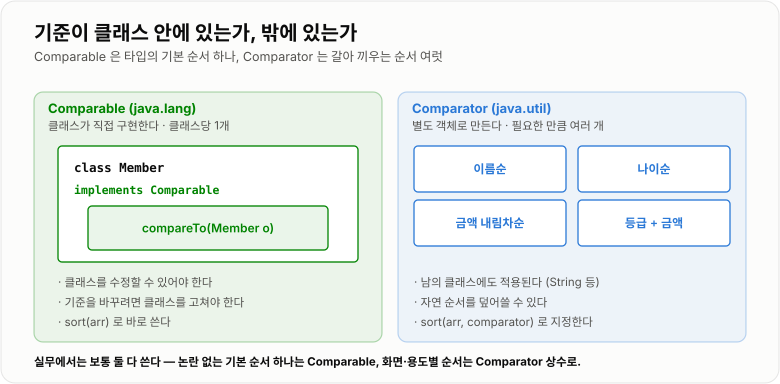
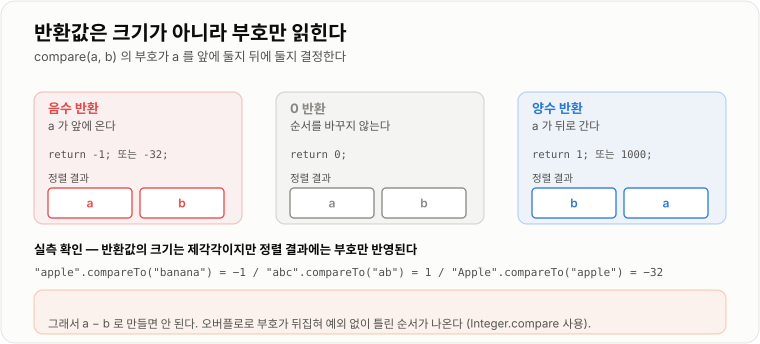

# Comparable · Comparator

> **`Comparable`은 클래스가 스스로 정하는 "기본 순서"이고, `Comparator`는 바깥에서 필요할 때마다 갈아 끼우는 "상황별 순서"다.**

---

## 1. 핵심 요약

* `Comparable`은 **클래스 안에** `compareTo(T o)`를 구현해 **자연 순서(natural ordering)** 하나를 정의한다.
* `Comparator`는 **클래스 밖에서** `compare(T a, T b)`를 구현해 **여러 개의 정렬 기준**을 만든다.
* 두 메서드 모두 **음수 / 0 / 양수**를 반환하며, 이 부호가 정렬 순서를 결정한다. **구체적인 숫자값은 의미가 없다.**
* `Comparable`을 구현하지 않은 객체를 정렬하면 `ClassCastException`이 난다. `TreeMap`에 넣어도 마찬가지다. (JDK 17 실측)
* 비교자를 **`a - b`로 만들면 오버플로**로 조용히 틀린 결과가 나온다. 반드시 `Integer.compare`를 쓴다.
* `compareTo`와 `equals`가 **불일치**하면 `HashSet`과 `TreeSet`이 같은 데이터에 다른 답을 낸다. `BigDecimal`이 대표적이다. (JDK 17 실측)

---

## 2. 등장 배경

### 해결하려는 문제

`Arrays.sort`나 `TreeMap` 같은 라이브러리는 **어떤 타입이 올지 모른 채로** 정렬을 해야 한다.

```java
// 라이브러리 입장에서는 T 가 무엇인지 모른다
public static <T> void sort(T[] a) {
    // ...
    if (a[i] ??? a[j]) {    // 무엇으로 비교해야 하는가?
    }
}
```

`int`라면 `<`를 쓰면 되지만, `Member`나 `Order` 같은 객체는 `<` 연산자를 쓸 수 없다. Java는 **연산자 오버로딩을 지원하지 않기** 때문이다.

그렇다고 라이브러리가 모든 타입의 비교 방법을 알 수도 없다. 해법은 **비교 방법을 객체 쪽에서 알려 주게 하는 것**이다.

```text
라이브러리:  "너희 둘 중 누가 앞이야?"
객체:        "내가 앞이야" (음수) / "같아" (0) / "쟤가 앞이야" (양수)

라이브러리는 부호만 보고 자리를 바꾼다.
어떤 기준으로 비교했는지는 전혀 알 필요가 없다.
```

이것이 `Comparable`이다. **비교 책임을 라이브러리에서 객체로 넘긴 것**이다.

### 그런데 기준이 하나로는 부족하다

`Comparable`은 클래스당 딱 하나의 순서만 정의할 수 있다. `compareTo` 메서드가 하나뿐이기 때문이다.

```java
public class Member implements Comparable<Member> {
    @Override
    public int compareTo(Member o) {
        return this.name.compareTo(o.name);   // 이름순으로 고정
    }
}
```

그런데 실무 요구사항은 이렇다.

* 회원 목록 화면 → **이름순**
* 관리자 화면 → **가입일순**
* 랭킹 화면 → **포인트 높은순**
* 정산 화면 → **등급순, 같으면 금액 높은순**

`compareTo` 하나로는 감당할 수 없다. 그렇다고 화면마다 클래스를 새로 만들 수도 없다.

**게다가 클래스를 수정할 수 없는 경우도 많다.**

```java
// 외부 라이브러리 클래스를 "길이순"으로 정렬하고 싶다면?
// String 은 이미 사전순 Comparable 이고, 소스를 고칠 수도 없다
String[] words = {"banana", "fig", "apple"};
```

`Comparator`는 이 두 문제를 동시에 푼다. **비교 기준을 클래스에서 분리해 별도 객체로 만든 것**이다.

```text
Comparable                        Comparator
──────────────                    ──────────────
클래스 안에 기준이 있다              기준이 별도 객체로 존재한다
클래스당 1개                       필요한 만큼 여러 개
클래스를 고칠 수 있어야 한다          남의 클래스에도 적용 가능
"이 타입의 기본 순서"               "이번에 쓸 순서"
```

### 이 개념이 없을 때

비교 기준을 넘길 방법이 없다면 정렬 함수를 타입마다, 기준마다 따로 만들어야 한다.

```java
public static void sortMembersByName(Member[] a) { /* 정렬 로직 전체 */ }
public static void sortMembersByAge(Member[] a)  { /* 정렬 로직 전체 */ }
public static void sortOrdersByDate(Order[] a)   { /* 정렬 로직 전체 */ }
public static void sortOrdersByAmount(Order[] a) { /* 정렬 로직 전체 */ }
// ... 타입 × 기준 만큼 계속 늘어난다
```

정렬 알고리즘은 똑같은데 **비교하는 한 줄만 다른 코드**가 계속 복제된다. TimSort 같은 복잡한 알고리즘을 이렇게 복제하는 것은 현실적으로 불가능하다.

`Comparable`/`Comparator`는 **"달라지는 부분(비교)만 밖에서 주입받는"** 전략 패턴(Strategy Pattern)의 표준 라이브러리 구현이다.

---

## 3. 핵심 개념

| 개념                             | 설명                                             | 중요한 이유                                    |
| ------------------------------ | ---------------------------------------------- | ----------------------------------------- |
| **`Comparable<T>`**            | 클래스가 직접 구현하는 인터페이스. 메서드는 `compareTo(T o)`      | 이 타입의 **기본 순서**를 정의한다                     |
| **`Comparator<T>`**            | 별도 객체로 만드는 인터페이스. 메서드는 `compare(T a, T b)`     | 기준을 **여러 개** 만들고 **갈아 끼울 수 있다**           |
| **자연 순서(natural ordering)**    | `Comparable`이 정의한 그 타입의 기본 순서                  | `sort(arr)`, `TreeMap` 기본 동작이 이것을 쓴다      |
| **반환값의 부호**                    | 음수 = 앞, 0 = 같음, 양수 = 뒤                         | **크기가 아니라 부호만** 본다. `-1`과 `-32`는 같은 의미다   |
| **반사성(reflexive)**             | `x.compareTo(x) == 0`                          | 자기 자신과 비교하면 항상 같아야 한다                     |
| **대칭성(symmetric)**             | `sgn(x.compareTo(y)) == -sgn(y.compareTo(x))`  | 순서를 바꾸면 부호도 뒤집혀야 한다                       |
| **추이성(transitive)**            | `x > y`이고 `y > z`이면 `x > z`                    | 이것이 깨지면 TimSort가 예외를 던진다                  |
| **`equals`와의 일관성**             | `x.compareTo(y) == 0`이면 `x.equals(y)`가 참인 것을 권장 | 필수는 아니지만 어기면 컬렉션마다 결과가 달라진다               |
| **`ClassCastException`**       | `Comparable`이 아닌 타입을 정렬할 때 발생                  | 컴파일이 아니라 **런타임**에 터진다 (실측 확인)             |
| **계약 위반 예외**                   | `IllegalArgumentException: Comparison method violates its general contract!` | **작은 데이터에서는 검출되지 않는다**                    |
| **`Comparator.nullsFirst`/`nullsLast`** | `null`을 안전하게 다루는 래퍼                            | 자연 순서로 `null`을 비교하면 `NullPointerException`이다 |
| **비교자 조합**                     | 여러 기준을 순서대로 적용하기                               | `.reversed()`를 **어디에 붙이느냐로 결과가 달라진다**     |

두 인터페이스의 위치 관계는 이렇다.

```text
             ┌──────────────────────────────┐
             │        Member 클래스          │
             │                              │
             │  implements Comparable       │
             │  compareTo(Member o)         │  ← 기준이 클래스 "안"에 있다
             │      return name 비교          │     클래스당 1개
             └──────────────────────────────┘
                          ▲
                          │ 이 타입을 정렬해 줘
                          │
             ┌────────────┴─────────────────┐
             │        Arrays.sort           │
             └────────────┬─────────────────┘
                          │ 또는 이 기준으로 정렬해 줘
                          ▼
   ┌──────────────┐  ┌──────────────┐  ┌──────────────┐
   │ 이름 Comparator │  │ 나이 Comparator │  │ 점수 Comparator │  ← 기준이 "밖"에 있다
   └──────────────┘  └──────────────┘  └──────────────┘        필요한 만큼 여러 개
```



*기준이 클래스 안에 있으면 하나뿐이고, 밖에 있으면 원하는 만큼 만들어 갈아 끼울 수 있다.*

---

## 4. 구조와 동작 원리

### 반환값은 부호만 의미가 있다

두 메서드 모두 `int`를 반환하지만, **숫자의 크기는 아무 의미가 없다.**

```text
compare(a, b) 의 반환값

  음수  →  a 가 b 보다 앞에 온다
   0   →  a 와 b 의 순서는 상관없다 (같다)
  양수  →  a 가 b 보다 뒤에 온다

  -1 과 -32 와 -1000000 은 전부 "a가 앞"이라는 같은 뜻이다.
```

JDK 17에서 `String.compareTo`가 실제로 무엇을 반환하는지 확인해 보면 값이 제각각이다.

| 호출                            | 반환값     | 계산 근거                    |
| ----------------------------- | ------- | ------------------------ |
| `"apple".compareTo("banana")` | `-1`    | `'a' - 'b'`              |
| `"abc".compareTo("ab")`       | `1`     | 길이 차이 `3 - 2`            |
| `"Apple".compareTo("apple")`  | `-32`   | `'A'(65) - 'a'(97)`      |

**세 값이 전부 다르지만 정렬 결과에는 부호만 반영된다.** `-1`이든 `-32`이든 "앞에 온다"로 똑같이 처리된다.

이 사실을 모르면 이런 코드를 쓰게 된다.

```java
// 잘못된 이해 — 반환값을 "차이의 크기"로 쓰려는 시도
int diff = a.compareTo(b);
if (diff == -1) {           // 위험! -32 일 수도 있다
    // ...
}

// 올바른 방법 — 부호만 본다
if (a.compareTo(b) < 0) {
    // ...
}
```



*반환값은 크기가 아니라 부호만 읽힌다. 음수면 앞, 양수면 뒤다.*

### 정렬 방향을 결정하는 것

오름차순과 내림차순의 차이는 **비교 대상의 순서를 바꾸는 것**뿐이다.

```java
// 오름차순 — 작은 것이 앞
return Integer.compare(a.getScore(), b.getScore());

// 내림차순 — 큰 것이 앞 (a와 b를 바꾼다)
return Integer.compare(b.getScore(), a.getScore());
```

```text
a=90, b=70 일 때

오름차순: Integer.compare(90, 70) = 양수  →  a(90)가 뒤로  →  [70, 90] ✔
내림차순: Integer.compare(70, 90) = 음수  →  a(90)가 앞으로 →  [90, 70] ✔
```

### 자연 순서 — 표준 타입은 어떻게 정렬되는가

JDK 17에서 실제로 정렬해 확인한 결과다.

| 타입          | 입력                                | 정렬 결과                     | 기준                    |
| ----------- | --------------------------------- | ------------------------- | --------------------- |
| `Integer`   | `3, -1, 10, 2`                    | `[-1, 2, 3, 10]`          | 수의 크기                 |
| `String`    | `"b","A","a","B","10","2"`        | `[10, 2, A, B, a, b]`     | **유니코드 값 순서**         |
| `Character` | `'b','A','1','a'`                 | `[1, A, a, b]`            | 유니코드 값                |
| `Boolean`   | `true, false, true`               | `[false, true, true]`     | `false` < `true`      |

**`String`의 결과가 특히 중요하다.** `"10"`이 `"2"`보다 앞에 온다.

```text
"10" vs "2"  →  첫 글자 '1'(49) 과 '2'(50) 을 비교 → '1'이 작다 → "10"이 앞

  사전순(lexicographic)이지 숫자 순이 아니다.
```

숫자 문자열을 정렬할 때 실무에서 실제로 문제가 되는 지점이다. 파일명 `"item1", "item2", ..., "item10"`을 정렬하면 `item10`이 `item2`보다 앞에 온다.

대문자가 소문자보다 앞에 오는 것도 유니코드 값 때문이다(`'A'`=65, `'a'`=97). 대소문자를 무시하려면 `String.CASE_INSENSITIVE_ORDER`를 써야 한다.

### `Comparable`이 없으면 — 런타임에 터진다

```java
Object[] objs = {new Object(), new Object()};
Arrays.sort(objs);
```

JDK 17에서 실행하면 다음이 나온다.

```text
java.lang.ClassCastException: class java.lang.Object cannot be cast to
    class java.lang.Comparable (java.lang.Object and java.lang.Comparable
    are in module java.base of loader 'bootstrap')
```

**컴파일은 통과한다.** `Arrays.sort(Object[])`의 시그니처가 `Object[]`를 받기 때문이다. 내부에서 `(Comparable) a[i]`로 캐스팅할 때 비로소 터진다.

`TreeMap`도 같다.

```text
new TreeMap<Object, String>().put(new Object(), "x")
    →  ClassCastException

  TreeMap 은 넣을 때마다 키를 비교해 위치를 찾으므로
  Comparable 이 아니면 첫 put 부터 실패한다.
```

`TreeMap`과 `HashMap`의 `null` 키 처리도 여기서 갈린다. **JDK 17 실측**이다.

| 컬렉션        | `null` 키 | 이유                                    |
| ---------- | -------- | ------------------------------------- |
| `HashMap`  | **허용**   | 해시를 계산하지 않고 0번 버킷에 특별 취급해 넣는다         |
| `TreeMap`  | `NullPointerException` | 위치를 찾으려면 비교해야 하는데 `null`은 비교할 수 없다    |

### `a - b`는 왜 안 되는가 — 실제로 틀린 결과가 나온다

```java
return a - b;   // 절대 쓰면 안 된다
```

작은 수에서는 잘 동작해서 문제를 눈치채기 어렵다. 하지만 큰 수가 섞이면 **오버플로로 부호가 뒤집힌다.**

JDK 17에서 실제로 확인한 결과다.

```text
2,000,000,000 - (-2,000,000,000) = -294,967,296

  실제로는 앞의 값이 훨씬 큰데, 뺄셈 결과가 음수라
  "앞의 값이 더 작다"고 잘못 판정한다.
```

이것이 정렬 결과를 실제로 망가뜨리는지 확인해 보았다.

```text
입력            : [2000000000, -2000000000, 1, -1, 1500000000, -1500000000]

a - b 비교자    : [2000000000, -2000000000, -1500000000, -1, 1, 1500000000]
                   ↑ 가장 큰 값이 맨 앞에 있다. 완전히 틀렸다

Integer.compare : [-2000000000, -1500000000, -1, 1, 1500000000, 2000000000]
                   ↑ 정상
```

**예외도 나지 않고 그냥 틀린 순서가 나온다.** 무작위 값 6개로도 반례가 쉽게 나온다.

```text
무작위 반례 입력 : [-1155099828, -1879439976, 304908421, -836442134, 288278256, -1795872892]
a - b   결과    : [-1795872892, -836442134, 288278256, 304908421, -1879439976, -1155099828]
정상    결과    : [-1879439976, -1795872892, -1155099828, -836442134, 288278256, 304908421]
```

`Integer.compare`는 뺄셈 대신 대소 비교를 하므로 오버플로가 없다.

```java
// JDK 내부 구현
public static int compare(int x, int y) {
    return (x < y) ? -1 : ((x == y) ? 0 : 1);
}
```

**나이나 점수처럼 값이 작으면 `a - b`도 동작한다.** 그래서 더 위험하다. 테스트는 통과하고, 나중에 금액이나 타임스탬프에 같은 패턴을 복사해 쓰는 순간 조용히 깨진다.

### 계약을 어기면 — 작은 데이터에서는 안 터진다

`Comparator`는 세 가지 계약을 지켜야 한다.

| 계약      | 조건                                              | 어기는 예                             |
| ------- | ----------------------------------------------- | --------------------------------- |
| **반사성** | `compare(x, x) == 0`                            | `return 1;` 처럼 무조건 값을 반환          |
| **대칭성** | `sgn(compare(x,y)) == -sgn(compare(y,x))`       | `return a > b ? 1 : -1;` (같을 때 -1) |
| **추이성** | `x>y`, `y>z` 이면 `x>z`                           | 오버플로로 부호가 뒤집히는 `a - b`            |

깨지면 TimSort가 병합 중 내부 불변식이 어긋난 것을 감지해 예외를 던진다.

```text
java.lang.IllegalArgumentException: Comparison method violates its general contract!
```

문제는 **언제 검출되느냐**다. JDK 17에서 계약을 어긴 비교자로 크기별 실측한 결과다.

| 배열 크기    | 결과            |
| -------- | ------------- |
| 16 ~ 512 | **예외 없음**     |
| **1024** | **예외 발생**     |
| 4096 이상  | 예외 발생         |

**작은 배열에서는 통과한다.** 크기가 작으면 병합 단계까지 가지 않고 삽입 정렬로 끝나기 때문이다.

```text
개발/테스트 환경: 데이터 수십~수백 건  →  통과 ✔
운영 환경:      데이터 수만 건        →  IllegalArgumentException ✘
```

**"테스트는 다 통과했는데 배포하니 터진다"의 전형적인 원인**이다. 정확한 경계는 비교자가 만드는 모순의 성격에 따라 달라지므로, 특정 크기를 기억하기보다 **계약 자체를 지키는 습관**이 답이다.

### `compareTo`와 `equals`가 다르면 — 컬렉션마다 답이 다르다

`Comparable` 명세는 `x.compareTo(y) == 0`이면 `x.equals(y)`도 참인 것을 **"강력히 권장"** 한다. 필수는 아니다. 하지만 어기면 이런 일이 생긴다.

`BigDecimal`이 대표적으로 이 권장을 어긴다. **JDK 17 실측 결과**다.

```text
new BigDecimal("1.0")  vs  new BigDecimal("1.00")

  equals()     →  false    (값 + 스케일까지 비교. 1.0 과 1.00 은 스케일이 다르다)
  compareTo()  →  0        (값만 비교. 둘 다 1)
```

같은 두 값을 컬렉션에 넣으면 결과가 갈린다.

| 연산                                          | 결과        | 무엇을 쓰는가          |
| ------------------------------------------- | --------- | ---------------- |
| `HashSet` 에 `1.0`, `1.00` 넣기                | **크기 2**  | `equals`+`hashCode` |
| `TreeSet` 에 `1.0`, `1.00` 넣기                | **크기 1**  | `compareTo`      |
| `List.of(1.00).contains(1.0)`               | **false** | `equals`         |
| `TreeSet.of(1.00).contains(1.0)`            | **true**  | `compareTo`      |
| `Collections.binarySearch([1.00], 1.0)`     | **0** (찾음) | `compareTo`      |

**같은 데이터에 같은 질문을 했는데 컬렉션에 따라 답이 다르다.** 금액을 다루는 결제·정산 시스템에서 실제로 버그를 만드는 지점이다.

```text
중복 제거를 HashSet 으로 했더니 1.0 과 1.00 이 둘 다 남고,
TreeSet 으로 바꿨더니 하나만 남는다.
```

`BigDecimal`을 다룰 때는 **스케일을 통일**(`setScale`)하거나 **비교는 항상 `compareTo`로** 하는 규칙을 정해야 한다.

---

## 5. 코드 또는 사용 예시

### `Comparable` 구현

```java
public class Member implements Comparable<Member> {

    private final Long id;
    private final String name;
    private final int age;

    public Member(Long id, String name, int age) {
        this.id = id;
        this.name = name;
        this.age = age;
    }

    public Long getId() { return id; }
    public String getName() { return name; }
    public int getAge() { return age; }

    /**
     * 자연 순서를 정의한다.
     * "이 타입을 그냥 정렬하면 이 순서가 되어야 한다"에 해당하는 기준만 넣는다.
     */
    @Override
    public int compareTo(Member o) {
        return this.name.compareTo(o.name);
    }

    @Override
    public String toString() {
        return name + "(" + age + ")";
    }
}
```

`compareTo`에 무엇을 넣을지는 신중해야 한다. 판단 기준은 **"이 타입에 본질적인 순서인가"** 다.

```text
Comparable 로 넣기 적절한 것
    - 문자열의 사전순
    - 날짜·시간의 시간순
    - 금액·수량의 크기순
    - 식별자(ID)의 순서

Comparable 로 넣기 부적절한 것
    - "이번 화면에서만 쓰는 정렬"
    - 여러 후보 중 하나를 임의로 고른 기준
    - 비즈니스 규칙에 따라 바뀔 수 있는 기준
```

### `Comparator` 구현 — 정통 방식

```java
import java.util.Comparator;

public class MemberComparators {

    /** 나이 오름차순 */
    public static class ByAge implements Comparator<Member> {
        @Override
        public int compare(Member a, Member b) {
            return Integer.compare(a.getAge(), b.getAge());
        }
    }

    /** 나이 내림차순 — a와 b의 자리만 바꾼다 */
    public static class ByAgeDesc implements Comparator<Member> {
        @Override
        public int compare(Member a, Member b) {
            return Integer.compare(b.getAge(), a.getAge());
        }
    }

    /** 나이 오름차순, 같으면 이름 오름차순 */
    public static class ByAgeThenName implements Comparator<Member> {
        @Override
        public int compare(Member a, Member b) {
            int byAge = Integer.compare(a.getAge(), b.getAge());
            if (byAge != 0) {
                return byAge;          // 첫 기준이 결정되면 즉시 반환
            }
            return a.getName().compareTo(b.getName());
        }
    }
}
```

다중 기준 비교자에서 반드시 지켜야 하는 구조가 있다.

```java
int byAge = Integer.compare(a.getAge(), b.getAge());
if (byAge != 0) {
    return byAge;
}
return a.getName().compareTo(b.getName());
```

**첫 기준이 0이 아니면 즉시 반환**해야 한다. 아래처럼 쓰면 계약이 깨진다.

```java
// 잘못된 코드 — 두 번째 기준이 첫 번째를 덮어쓴다
return Integer.compare(a.getAge(), b.getAge())
     + a.getName().compareTo(b.getName());   // 더하면 안 된다
```

나이 차가 `-1`이고 이름 차가 `+5`면 합이 `+4`가 되어 **나이가 어린 쪽이 뒤로 간다.** 추이성이 깨져 `IllegalArgumentException`으로 이어진다.

### 사용하기

```java
import java.util.ArrayList;
import java.util.Arrays;
import java.util.Collections;
import java.util.List;
import java.util.TreeSet;

public class SortUsage {

    public static void main(String[] args) {
        List<Member> members = new ArrayList<>();
        members.add(new Member(1L, "kim", 30));
        members.add(new Member(2L, "lee", 25));
        members.add(new Member(3L, "park", 30));

        // 1. 자연 순서 (Comparable 사용) — 이름순
        Collections.sort(members);
        System.out.println(members);        // [kim(30), lee(25), park(30)]

        // 2. Comparator 지정 — 나이순
        members.sort(new MemberComparators.ByAge());
        System.out.println(members);        // [lee(25), kim(30), park(30)]

        // 3. 자연 순서를 뒤집기
        members.sort(Collections.reverseOrder());
        System.out.println(members);        // [park(30), lee(25), kim(30)]

        // 4. 특정 Comparator 를 뒤집기
        members.sort(Collections.reverseOrder(new MemberComparators.ByAge()));

        // 5. TreeSet 에 Comparator 주입 — 자연 순서 대신 이 기준을 쓴다
        TreeSet<Member> byAge = new TreeSet<>(new MemberComparators.ByAge());
        byAge.addAll(members);
    }
}
```

`TreeSet`에 `Comparator`를 넘긴 5번은 **주의가 필요하다.**

```text
TreeSet/TreeMap 은 "같음"을 equals 가 아니라 compare 로 판단한다.

  ByAge 비교자를 쓰면 kim(30) 과 park(30) 은 compare 결과가 0 이므로
  같은 원소로 취급되어 하나만 남는다.

  → 중복 제거가 목적이 아니라면 비교자에 "동점을 깨는 기준"을 넣어야 한다
```

```java
/** 나이순 + 동점은 ID로 구분 — TreeSet 에서 원소가 사라지지 않는다 */
public static class ByAgeThenId implements Comparator<Member> {
    @Override
    public int compare(Member a, Member b) {
        int byAge = Integer.compare(a.getAge(), b.getAge());
        if (byAge != 0) {
            return byAge;
        }
        return Long.compare(a.getId(), b.getId());   // 유일한 값으로 동점 해소
    }
}
```

### `null` 처리

자연 순서로 `null`이 섞인 컬렉션을 정렬하면 예외가 난다. **JDK 17 실측**이다.

```text
Collections.sort(Arrays.asList("b", null, "a"))
    →  NullPointerException

  compareTo 를 호출하는 순간 null 참조를 건드린다.
```

`Comparator`는 이를 안전하게 감싸는 방법을 제공한다.

```java
import java.util.Comparator;

List<String> list = new ArrayList<>(Arrays.asList("b", null, "a"));

list.sort(Comparator.nullsFirst(Comparator.naturalOrder()));
System.out.println(list);   // [null, a, b]   ← JDK 17 실측 확인

list.sort(Comparator.nullsLast(Comparator.naturalOrder()));
System.out.println(list);   // [a, b, null]
```

`nullsFirst`/`nullsLast`는 **`null` 비교만 가로채고 나머지는 안쪽 비교자에게 위임**하는 래퍼다.

### 비교자 조합 — `.reversed()` 위치가 결과를 바꾼다

정통 방식(익명 클래스)으로 다중 기준을 쓰면 코드가 길어지므로, Java 8부터 조합 메서드가 제공된다. 이 노트의 다른 예시는 익명 클래스를 쓰지만, **`.reversed()`의 위치 문제는 실무에서 자주 틀리는 지점**이므로 여기서 짚는다.

```java
// 점수 내림차순, 같으면 이름 오름차순
list.sort(Comparator.comparingInt(P::getScore).reversed()
                    .thenComparing(P::getName));

// 점수 내림차순, 같으면 이름 내림차순  ← 의도와 다를 수 있다
list.sort(Comparator.comparingInt(P::getScore)
                    .thenComparing(P::getName).reversed());
```

JDK 17에서 실제로 돌린 결과다. 입력은 `kim(90), lee(90), park(80), choi(95)`다.

| 코드                                             | 결과                                        |
| ---------------------------------------------- | ----------------------------------------- |
| 익명 클래스로 직접 작성 (점수↓, 이름↑)                       | `[choi(95), kim(90), lee(90), park(80)]`  |
| `.comparingInt(score).reversed().thenComparing(name)` | `[choi(95), kim(90), lee(90), park(80)]`  |
| `.comparingInt(score).thenComparing(name).reversed()` | `[choi(95), lee(90), kim(90), park(80)]`  |

**세 번째만 `kim`과 `lee`의 순서가 다르다.** `.reversed()`가 **그 앞까지 조합된 비교자 전체**를 뒤집기 때문에 이름 기준까지 내림차순이 된 것이다.

```text
A.reversed().thenComparing(B)   →  A는 뒤집고, B는 그대로
A.thenComparing(B).reversed()   →  (A + B) 전체를 뒤집는다
```

**헷갈린다면 익명 클래스로 직접 쓰는 편이 안전하다.** 의도가 코드에 그대로 드러난다.

### 수정할 수 없는 클래스에 순서 부여하기

`Comparator`의 큰 장점이 여기서 드러난다.

```java
import java.util.Arrays;
import java.util.Comparator;

public class ExternalTypeSort {

    /** String 은 사전순 Comparable 이지만, 길이순으로 정렬하고 싶다 */
    public static class ByLength implements Comparator<String> {
        @Override
        public int compare(String a, String b) {
            int byLength = Integer.compare(a.length(), b.length());
            if (byLength != 0) {
                return byLength;
            }
            return a.compareTo(b);      // 길이가 같으면 사전순
        }
    }

    public static void main(String[] args) {
        String[] words = {"banana", "fig", "apple", "kiwi"};

        Arrays.sort(words);
        System.out.println(Arrays.toString(words));
        // [apple, banana, fig, kiwi]   ← 자연 순서(사전순)

        Arrays.sort(words, new ByLength());
        System.out.println(Arrays.toString(words));
        // [fig, kiwi, apple, banana]   ← 길이순

        Arrays.sort(words, String.CASE_INSENSITIVE_ORDER);
        // 대소문자 무시 사전순 — JDK가 제공하는 표준 Comparator
    }
}
```

`String` 클래스는 한 줄도 고치지 않았다. **비교 기준을 밖으로 분리했기 때문에 가능한 일**이다.

### 불변 리스트는 정렬할 수 없다

```text
List.of(3, 1, 2).sort(null)
    →  UnsupportedOperationException          (JDK 17 실측)

Arrays.asList(3, 1, 2).sort(null)
    →  [1, 2, 3]   정렬은 된다
Arrays.asList(3, 1, 2).add(4)
    →  UnsupportedOperationException          (크기 변경만 불가)
```

`Arrays.asList`는 **고정 크기 리스트**다. 원소 교체(정렬)는 되지만 추가·삭제는 안 된다. `List.of`는 **완전 불변**이라 정렬조차 안 된다. 정렬하려면 새 리스트로 복사해야 한다.

```java
List<Integer> mutable = new ArrayList<>(List.of(3, 1, 2));
mutable.sort(null);   // 정상 동작
```

---

## 6. 성능 특성

`Comparable`과 `Comparator`는 자료구조가 아니라 **인터페이스**이므로 자체 복잡도는 없다. 하지만 **`compare` 구현의 비용이 정렬 전체 비용에 그대로 곱해진다.**

```text
정렬 전체 비용 = O(n log n) × compare() 한 번의 비용

  n = 1,000,000 이면 compare 는 약 2000만 번 호출된다.
  compare 안에서 1 마이크로초를 쓰면 전체가 20초가 된다.
```

| `compare` 안에서 하는 일             | 전체 영향                | 대응                     |
| ----------------------------- | -------------------- | ---------------------- |
| 필드 하나 비교 (`Integer.compare`)  | 무시할 수준               | 기본                     |
| 문자열 비교 (`String.compareTo`)   | 길이에 비례, 보통 문제없음      | 필요시 앞부분만 비교            |
| 문자열 포매팅·연결                    | **매우 큼**             | 미리 계산해 필드로 보관          |
| 정규식 매칭                        | **매우 큼**             | 미리 계산                  |
| DB 조회·네트워크 호출                 | **치명적**              | 절대 금지. 미리 로딩           |
| 컬렉션 순회                        | **큼**                | 미리 집계값을 필드로 보관         |

```java
// 나쁜 예 — compare 마다 문자열을 새로 만든다
public int compare(Order a, Order b) {
    String keyA = a.getYear() + "-" + a.getMonth() + "-" + a.getDay();
    String keyB = b.getYear() + "-" + b.getMonth() + "-" + b.getDay();
    return keyA.compareTo(keyB);        // 2000만 번 호출되면 4000만 개의 문자열
}

// 좋은 예 — 필드를 순서대로 비교한다
public int compare(Order a, Order b) {
    int byYear = Integer.compare(a.getYear(), b.getYear());
    if (byYear != 0) {
        return byYear;
    }
    int byMonth = Integer.compare(a.getMonth(), b.getMonth());
    if (byMonth != 0) {
        return byMonth;
    }
    return Integer.compare(a.getDay(), b.getDay());
}
```

**다중 기준 비교자에서 순서도 성능에 영향을 준다.**

```text
비교자에서 기준을 배치하는 순서

  빨리 판가름 나는 기준을 앞에      →  뒤 기준은 동점일 때만 계산된다
  값이 다양한 기준을 앞에           →  대부분 첫 기준에서 결정된다

예) 등급(3종류) 먼저 vs 금액(다양함) 먼저
    금액을 앞에 두면 대부분 첫 비교에서 끝난다
```

### `Comparable`과 `Comparator` 자체의 성능 차이

```text
Comparable : 정렬 시 (Comparable) 캐스팅 후 compareTo 호출
Comparator : compare 호출 (캐스팅 없음)

  JIT 컴파일 이후에는 사실상 차이가 없다.
  성능이 아니라 설계로 선택한다.
```

다만 **박싱이 개입하면 비용이 크다.**

```java
// Integer 로 박싱 — 객체 생성과 언박싱 비용
return a.getScore().compareTo(b.getScore());     // Integer 필드일 때

// 기본형으로 비교 — 박싱 없음
return Integer.compare(a.getScore(), b.getScore());   // int 필드일 때
```

정렬 노트에서 확인했듯 `int[]`와 `Integer[]` 정렬은 실측 약 **4.6배** 차이가 난다. 비교 대상 필드는 가능하면 기본형으로 두는 것이 좋다.

---

## 7. 장점과 단점

### `Comparable`

| 장점                     | 이유                                      |
| ---------------------- | --------------------------------------- |
| 기본 순서를 한곳에서 정의한다       | 이 타입이 "당연히 어떤 순서인지"가 클래스에 명확히 드러난다      |
| 사용하는 쪽 코드가 간결하다        | `Arrays.sort(arr)`, `new TreeSet<>()` 로 끝난다 |
| 표준 컬렉션이 그대로 동작한다       | `TreeMap`·`TreeSet`·`PriorityQueue`가 별도 설정 없이 작동한다 |
| 정렬 기준을 잊어버릴 수 없다       | 타입 자체에 붙어 있어 매번 지정할 필요가 없다              |

| 단점                     | 이유 및 주의점                                   |
| ---------------------- | ------------------------------------------ |
| 기준이 하나뿐이다              | `compareTo` 메서드가 하나라 다중 기준을 표현할 수 없다       |
| 클래스를 수정할 수 있어야 한다      | 외부 라이브러리 타입에는 적용할 수 없다                     |
| 클래스가 정렬 관심사를 떠안는다      | 도메인 클래스에 화면용 정렬 로직이 섞이면 응집도가 떨어진다          |
| `equals`와 일관성을 지켜야 한다  | 어기면 `TreeSet`과 `HashSet`이 다르게 동작한다 (실측 확인) |

### `Comparator`

| 장점                     | 이유                                    |
| ---------------------- | ------------------------------------- |
| 기준을 원하는 만큼 만들 수 있다     | 화면·용도별로 다른 정렬을 자유롭게 정의한다              |
| 남의 클래스에도 적용된다          | `String`을 길이순으로 정렬하는 것이 가능하다          |
| 자연 순서를 덮어쓸 수 있다        | 기본 순서와 다른 순서가 필요할 때 그때만 지정한다          |
| 관심사가 분리된다              | 도메인 클래스가 정렬 요구사항 변화에 영향받지 않는다         |
| `null` 처리를 안전하게 감쌀 수 있다 | `nullsFirst`/`nullsLast`로 예외를 막는다     |
| 조합이 가능하다               | 여러 기준을 순서대로 이어 붙일 수 있다                |

| 단점                    | 이유 및 주의점                                        |
| --------------------- | ----------------------------------------------- |
| 호출할 때마다 지정해야 한다       | 누락하면 자연 순서로 정렬되어 조용히 다른 결과가 나온다                 |
| 같은 기준이 여러 곳에 복제되기 쉽다  | 상수로 뽑아 재사용하지 않으면 로직이 흩어진다                       |
| 계약 위반을 컴파일러가 잡지 못한다   | 런타임에, 그것도 **큰 데이터에서만** 예외가 난다 (실측 512 통과/1024 예외) |
| `TreeSet`/`TreeMap`에서 원소가 사라질 수 있다 | `compare == 0`이면 같은 원소로 취급된다. 동점 해소 기준이 필요하다    |
| 조합 순서를 틀리기 쉽다         | `.reversed()`를 어디에 붙이느냐로 결과가 달라진다 (실측 확인)       |

---

## 8. 사용 기준

### `Comparable`을 선택하는 경우

* 그 타입에 **본질적이고 유일한 순서**가 존재할 때 (날짜의 시간순, 금액의 크기순)
* **내가 만든 클래스**여서 수정할 수 있을 때
* `TreeMap`·`TreeSet`·`PriorityQueue`에 **별도 설정 없이** 넣고 싶을 때
* 정렬 기준이 **바뀔 일이 없을** 때

### `Comparator`를 선택하는 경우

* 정렬 기준이 **둘 이상** 필요할 때
* **수정할 수 없는 클래스**를 정렬해야 할 때
* 자연 순서와 **다른 순서**가 필요할 때
* 정렬 기준이 **화면·용도별로 다를** 때
* `null`이 섞여 있어 **안전한 처리**가 필요할 때
* 도메인 클래스를 **정렬 관심사에서 분리**하고 싶을 때

### 둘 다 쓰는 경우

가장 흔하고 권장되는 형태다.

```text
Comparable   →  가장 기본적이고 논란 없는 순서 하나 (예: ID순, 생성일순)
Comparator   →  화면별·용도별 순서들 (이름순, 금액순, 등급+금액순 ...)

  "그냥 정렬하면 이 순서"가 있으면 Comparable,
  "이번엔 이 순서로"가 필요하면 Comparator.
```

### 선택 기준

1. **순서가 하나뿐이고 본질적인가?** → `Comparable`
2. **클래스를 수정할 수 있는가?** → 없으면 `Comparator`
3. **기준이 여러 개인가?** → `Comparator`
4. **`TreeSet`/`TreeMap`에 쓰는가?** → 동점 해소 기준을 반드시 넣는다
5. **`null`이 들어올 수 있는가?** → `nullsFirst`/`nullsLast`
6. **`equals`와 일관성을 지킬 수 있는가?** → 못 지키면 문서에 명시한다

```text
              정렬 기준이 하나뿐인가?
                      │
        ┌─────────────┴─────────────┐
      예                            아니오
        │                            │
  클래스를 수정할 수 있는가?        Comparator
        │                       (기준마다 하나씩)
   ┌────┴────┐
  예        아니오
   │          │
Comparable  Comparator

  TreeSet/TreeMap 에 쓴다면 → compare == 0 이 곧 "같은 원소"임을 기억하고
                              동점 해소 기준(ID 등)을 반드시 추가한다
```

---

## 9. 비슷한 개념 비교

### `Comparable`과 `Comparator`

| 비교 항목      | `Comparable`             | `Comparator`                    | 선택 기준          |
| ---------- | ------------------------ | ------------------------------- | -------------- |
| 패키지        | `java.lang`              | `java.util`                     | 언어 핵심 vs 유틸리티  |
| 메서드        | `compareTo(T o)` — 인자 1개 | `compare(T a, T b)` — 인자 2개     | 자기 자신 포함 여부    |
| 위치         | 클래스 **내부**               | 클래스 **외부**                      | 관심사 분리 여부      |
| 개수         | 클래스당 **1개**              | **여러 개**                        | 기준의 개수         |
| 클래스 수정     | **필요**                   | 불필요                             | 남의 클래스인가       |
| 호출 방식      | `sort(arr)`              | `sort(arr, comparator)`         | 매번 지정하는가       |
| 자연 순서      | **이것이 자연 순서다**           | 자연 순서를 덮어쓴다                     | 기본인가 예외인가      |
| `null` 처리  | 직접 구현해야 함                | `nullsFirst`/`nullsLast` 제공     | 안전성            |
| 조합         | 불가능                      | `thenComparing`으로 가능            | 다중 기준          |
| 적합한 상황     | 본질적이고 유일한 순서             | 상황별·용도별 순서                      | 대부분 둘 다 쓴다     |

### `compareTo`와 `equals`

| 비교 항목  | `compareTo`               | `equals`                | 관계               |
| ------ | ------------------------- | ----------------------- | ---------------- |
| 목적     | **순서** 판정                 | **동등성** 판정              | 다른 질문에 답한다       |
| 반환     | `int` (음수/0/양수)           | `boolean`               | 표현력 차이           |
| 사용처    | `TreeSet`·`TreeMap`·정렬·이진 탐색 | `HashSet`·`HashMap`·`List.contains` | **컬렉션마다 다르다**    |
| 짝이 되는 것 | 없음                        | `hashCode`              | 해시 계약            |
| 일관성    | 권장 (필수 아님)                | -                       | `BigDecimal`이 어긴다 |
| 어겼을 때  | 컬렉션마다 답이 달라진다             | 해시 컬렉션이 오작동한다           | 실측으로 확인됨         |

`BigDecimal("1.0")`과 `BigDecimal("1.00")`에 대한 JDK 17 실측 결과가 이 차이를 정확히 보여 준다.

| 컬렉션·연산                        | 결과      | 사용하는 메서드          |
| ----------------------------- | ------- | ----------------- |
| `HashSet` 크기                  | **2**   | `equals`+`hashCode` |
| `TreeSet` 크기                  | **1**   | `compareTo`       |
| `List.contains`               | `false` | `equals`          |
| `TreeSet.contains`            | `true`  | `compareTo`       |
| `Collections.binarySearch`    | 찾음      | `compareTo`       |

### `Comparator`와 전략 패턴

| 비교 항목  | `Comparator`         | 전략 패턴(Strategy)        | 관계             |
| ------ | -------------------- | --------------------- | -------------- |
| 목적     | 비교 방법을 주입한다          | 알고리즘을 주입한다            | **같은 구조**      |
| 인터페이스  | `Comparator<T>`      | `Strategy` 인터페이스      | 역할이 동일         |
| 구현체    | 기준별 비교자              | 알고리즘별 구현              | 교체 가능          |
| 주입 시점  | 메서드 호출 시             | 생성자 또는 setter         | 유연성 차이         |
| 대표적 이점 | 정렬 알고리즘 코드를 복제하지 않는다 | 조건문 분기를 없앤다           | OCP 원칙         |
| 적합한 상황 | 정렬 기준이 바뀔 때          | 동작이 런타임에 바뀔 때         | `Comparator`가 표준 라이브러리 사례다 |

### `Comparator`와 SQL `ORDER BY`

| 비교 항목  | Java `Comparator`  | SQL `ORDER BY`     | 선택 기준         |
| ------ | ------------------ | ------------------ | ------------- |
| 실행 위치  | 애플리케이션 힙           | DB 서버              | 데이터 이동량       |
| 인덱스 활용 | 불가능                | **가능** (정렬 비용 0)   | 대량이면 DB       |
| 표현력    | 임의의 Java 코드        | SQL 표현식 범위         | 복잡한 기준이면 Java |
| 다중 기준  | `thenComparing`    | `ORDER BY a, b`    | 동일            |
| `null` 처리 | `nullsFirst`/`nullsLast` | `NULLS FIRST`/`LAST` (DB 방언) | 동일한 개념        |
| 대소문자   | `CASE_INSENSITIVE_ORDER` | `COLLATE`          | 개념 대응         |
| 페이지네이션 | 전부 가져와서 자름         | `LIMIT`으로 필요한 만큼   | **DB가 압도적**   |
| 적합한 상황 | 이미 메모리에 있는 소량      | 대량 데이터, 페이지네이션     | 기본은 DB        |

---

## 10. 백엔드 실무 적용

### Spring·Java

**엔티티에 `Comparable`을 구현할 때는 `equals`와의 관계를 먼저 정해야 한다.**

```java
@Entity
public class Order implements Comparable<Order> {

    @Id
    @GeneratedValue
    private Long id;

    private LocalDateTime createdAt;

    /** 자연 순서는 생성일순 — 하지만 equals 는 id 기준이다 */
    @Override
    public int compareTo(Order o) {
        return this.createdAt.compareTo(o.createdAt);
    }

    @Override
    public boolean equals(Object o) {
        if (this == o) {
            return true;
        }
        if (!(o instanceof Order)) {
            return false;
        }
        return id != null && id.equals(((Order) o).id);
    }
}
```

이 조합에는 **함정이 있다.** 생성일이 같은 서로 다른 주문 두 건을 `TreeSet`에 넣으면 하나가 사라진다.

```text
order1 (id=1, createdAt=10:00)
order2 (id=2, createdAt=10:00)

  compareTo → 0  →  TreeSet 은 "같은 원소"로 판단
  equals    → false → HashSet 은 "다른 원소"로 판단

  TreeSet.size() = 1   ← order2 가 사라진다
  HashSet.size() = 2
```

해결책은 **동점 해소 기준을 넣는 것**이다.

```java
@Override
public int compareTo(Order o) {
    int byDate = this.createdAt.compareTo(o.createdAt);
    if (byDate != 0) {
        return byDate;
    }
    return Long.compare(this.id, o.id);   // 유일한 값으로 동점 해소
}
```

**엔티티에 `Comparable`을 붙일지 자체를 신중히 결정해야 한다.** 대부분의 경우 정렬은 `Comparator`나 DB `ORDER BY`로 처리하고, 엔티티는 `equals`/`hashCode`만 제대로 구현하는 편이 낫다.

**비교자는 상수로 뽑아 재사용한다.**

```java
public final class OrderComparators {

    private OrderComparators() {
    }

    public static final Comparator<Order> BY_AMOUNT_DESC = new Comparator<Order>() {
        @Override
        public int compare(Order a, Order b) {
            return Integer.compare(b.getAmount(), a.getAmount());
        }
    };

    public static final Comparator<Order> BY_GRADE_THEN_AMOUNT = new Comparator<Order>() {
        @Override
        public int compare(Order a, Order b) {
            int byGrade = a.getGrade().compareTo(b.getGrade());
            if (byGrade != 0) {
                return byGrade;
            }
            return Integer.compare(b.getAmount(), a.getAmount());
        }
    };
}
```

`Comparator`는 **상태가 없으면 스레드 안전**하므로 `static final` 상수로 공유해도 된다. 매번 `new`로 만들 필요가 없다.

반대로 **상태를 가진 비교자는 위험하다.**

```java
// 위험 — 정렬 중에 기준이 바뀔 수 있다
public class ConfigurableComparator implements Comparator<Order> {
    private boolean desc;          // 가변 상태

    public void setDesc(boolean desc) {
        this.desc = desc;          // 다른 스레드가 정렬 중에 호출하면?
    }

    @Override
    public int compare(Order a, Order b) {
        return desc ? Integer.compare(b.getAmount(), a.getAmount())
                    : Integer.compare(a.getAmount(), b.getAmount());
    }
}
```

정렬 도중 `desc`가 바뀌면 **비교 결과가 앞뒤로 모순**되어 `IllegalArgumentException`이 난다. 비교자는 불변으로 만든다.

**Spring Data의 `Sort`** 는 정렬을 DB로 위임하는 표준 방법이다.

```java
// 애플리케이션 Comparator 대신 DB ORDER BY 로
Sort sort = Sort.by(Sort.Order.desc("amount"), Sort.Order.asc("createdAt"));
Page<Order> page = orderRepository.findAll(PageRequest.of(0, 20, sort));
```

**대량 데이터에서는 `Comparator`보다 항상 이쪽이 낫다.** 인덱스를 탈 수 있고, 네트워크로 20건만 오며, 힙에도 20건만 올라온다.

### 데이터베이스·캐시

`Comparator`의 개념은 SQL `ORDER BY`에 그대로 대응된다.

```sql
-- Java: BY_GRADE_THEN_AMOUNT 비교자
-- SQL:
SELECT * FROM orders ORDER BY grade ASC, amount DESC;

-- null 처리 — Comparator.nullsLast 에 해당
SELECT * FROM orders ORDER BY completed_at DESC NULLS LAST;   -- PostgreSQL
SELECT * FROM orders ORDER BY completed_at IS NULL, completed_at DESC;  -- MySQL

-- 대소문자 무시 — String.CASE_INSENSITIVE_ORDER 에 해당
SELECT * FROM members ORDER BY name COLLATE utf8mb4_general_ci;
```

**정렬 기준과 인덱스가 일치해야 정렬 비용이 0이 된다.**

```sql
CREATE INDEX idx ON orders (grade, amount DESC);
SELECT * FROM orders ORDER BY grade ASC, amount DESC;   -- 인덱스를 그대로 읽는다

-- 방향이 어긋나면 실제로 정렬한다
SELECT * FROM orders ORDER BY grade ASC, amount ASC;    -- Using filesort
```

**문자열 정렬은 DB와 Java의 결과가 다를 수 있다.**

```text
Java  : String.compareTo 는 유니코드 코드포인트 순서
        → 대문자가 소문자보다 앞 ("Apple" < "apple", 실측 -32)

MySQL : 기본 콜레이션 utf8mb4_general_ci 는 대소문자 무시
        → "Apple" 과 "apple" 이 같다고 판단

  같은 데이터를 Java 에서 정렬한 결과와 DB 에서 정렬한 결과가 다르다.
  페이지네이션에서 순서가 흔들리는 원인이 되기도 한다.
```

Redis Sorted Set은 **점수(score)라는 단일 `double` 기준**만 지원한다.

```text
ZADD ranking 1500 "userA"

  다중 기준이 필요하면 점수를 하나로 인코딩해야 한다.
  예) 점수 × 10^10 + (10^10 - 타임스탬프)
      → 점수 내림차순, 같으면 먼저 달성한 사람이 앞

  Comparator 처럼 자유롭지 않다는 점을 설계 단계에서 고려해야 한다.
```

### 동시성·분산 환경

* **`Comparator`는 상태가 없으면 스레드 안전**하다. `static final` 상수로 공유하는 것이 표준이다.
* **가변 필드를 정렬 기준으로 삼으면 위험하다.** 정렬 도중 다른 스레드가 값을 바꾸면 비교 결과가 모순되어 `IllegalArgumentException`이 난다. 정렬 전에 스냅샷을 뜨거나 불변 필드를 쓴다.
* **`ConcurrentSkipListMap`/`ConcurrentSkipListSet`** 도 `Comparable` 또는 `Comparator`를 요구한다. 동시성 환경에서도 비교 계약은 동일하게 적용된다.
* **분산 환경의 정렬 일관성**이 중요하다. 여러 노드가 각자 정렬한 결과를 병합할 때 **모든 노드가 같은 비교 기준**을 써야 한다. 노드마다 JDK 버전이나 로케일이 다르면 문자열 정렬 결과가 달라질 수 있다.

---

## 11. 자주 하는 오해

| 잘못된 이해                                     | 올바른 이해                                                                     |
| ------------------------------------------ | -------------------------------------------------------------------------- |
| `compareTo`는 `-1`, `0`, `1`만 반환한다          | 부호만 의미가 있다. `"Apple".compareTo("apple")`은 **`-32`** 다 (실측)                  |
| 반환값의 크기가 "얼마나 차이 나는지"를 뜻한다                 | 부호 외에는 아무 의미가 없다. `-1`과 `-32`는 정렬에서 동일하게 처리된다                              |
| `a - b`로 비교자를 만들어도 된다                      | 오버플로로 **조용히 틀린 순서**가 나온다. `2000000000 - (-2000000000) = -294967296` (실측)   |
| 작은 값에서 `a - b`가 동작하니 괜찮다                   | 나중에 금액·타임스탬프에 같은 패턴을 복사하는 순간 깨진다. 처음부터 `Integer.compare`를 쓴다                |
| `Comparable`을 구현하지 않아도 정렬은 된다              | `ClassCastException`이 난다. **컴파일은 통과하고 런타임에 터진다** (실측)                      |
| `Comparator` 계약을 어기면 바로 예외가 난다             | **작은 데이터에서는 검출되지 않는다.** 실측에서 512개까지 통과, 1024개부터 예외                         |
| 다중 기준은 각 비교 결과를 더하면 된다                     | 부호가 상쇄되어 추이성이 깨진다. 첫 기준이 0이 아니면 **즉시 반환**해야 한다                             |
| `.reversed()`는 어디에 붙여도 같다                  | `A.reversed().thenComparing(B)`와 `A.thenComparing(B).reversed()`는 결과가 다르다 (실측) |
| `compareTo == 0`이면 `equals`도 true여야 한다     | **권장이지 필수가 아니다.** `BigDecimal`이 대표적으로 어긴다                                  |
| 그래서 일관성은 안 지켜도 된다                          | 어기면 `HashSet` 크기 2, `TreeSet` 크기 1처럼 컬렉션마다 답이 달라진다 (실측)                    |
| `TreeSet`은 `equals`로 중복을 판단한다              | **`compare` 결과가 0이면 같은 원소**로 본다. 동점 해소 기준이 없으면 원소가 사라진다                    |
| `String` 정렬은 알파벳 순서다                       | **유니코드 값 순서**다. `["10","2"]`를 정렬하면 `"10"`이 앞이고, 대문자가 소문자보다 앞이다 (실측)        |
| `TreeMap`에도 `null` 키를 넣을 수 있다              | `NullPointerException`이다. `HashMap`은 허용한다 (실측)                             |
| `null`이 섞여도 `Collections.sort`가 알아서 처리한다   | `NullPointerException`이 난다. `Comparator.nullsFirst`로 감싸야 한다 (실측)           |
| `Arrays.asList(...)`는 불변이라 정렬할 수 없다        | **정렬은 된다.** 고정 크기일 뿐이라 `add`만 막힌다. `List.of`는 정렬도 안 된다 (실측)                |
| `Comparator`는 매번 `new`로 만들어야 한다            | 상태가 없으면 스레드 안전하므로 `static final` 상수로 공유하는 것이 표준이다                          |
| Java와 DB의 문자열 정렬 결과는 같다                    | 콜레이션에 따라 다르다. MySQL 기본값은 대소문자를 무시하지만 Java는 구분한다                            |

---

## 12. 면접 답변

### 기본 답변

`Comparable`과 `Comparator`는 둘 다 객체의 순서를 정의하는 인터페이스지만, **기준이 어디에 있는지**가 다릅니다.

`Comparable`은 `java.lang` 패키지에 있고 클래스가 직접 구현합니다. 메서드는 `compareTo(T o)` 하나이고, 이것이 그 타입의 **자연 순서**가 됩니다. 클래스당 하나만 정의할 수 있고 클래스를 수정할 수 있어야 합니다.

`Comparator`는 `java.util` 패키지에 있고 별도 객체로 만듭니다. 메서드는 `compare(T a, T b)`이고, **여러 개를 만들어 상황에 따라 갈아 끼울 수 있습니다.** `String`처럼 수정할 수 없는 클래스도 원하는 기준으로 정렬할 수 있습니다. 비교 방법을 밖에서 주입한다는 점에서 전략 패턴의 표준 라이브러리 구현이라고 볼 수 있습니다.

두 메서드 모두 **음수·0·양수**를 반환하고, **부호만 의미가 있습니다.** 실제로 `"Apple".compareTo("apple")`은 `-1`이 아니라 `-32`를 반환합니다. 크기를 의미로 해석하면 안 됩니다.

실무에서 가장 조심할 것이 세 가지입니다.

첫째, **비교자를 `a - b`로 만들면 안 됩니다.** 오버플로로 부호가 뒤집혀 조용히 틀린 순서가 나옵니다. `2000000000 - (-2000000000)`은 양수가 아니라 `-294967296`입니다. 반드시 `Integer.compare`를 씁니다.

둘째, **계약 위반이 작은 데이터에서는 검출되지 않습니다.** 계약을 어긴 비교자로 실측해 보면 512개까지는 통과하고 1024개부터 `IllegalArgumentException: Comparison method violates its general contract!`가 났습니다. 테스트는 통과하고 운영에서 터지는 전형적인 패턴입니다.

셋째, **`compareTo`와 `equals`의 불일치**입니다. `BigDecimal("1.0")`과 `("1.00")`은 `equals`는 false인데 `compareTo`는 0입니다. 그래서 같은 두 값을 넣으면 `HashSet`은 크기 2, `TreeSet`은 크기 1이 됩니다. `TreeSet`과 `TreeMap`은 `equals`가 아니라 `compare` 결과가 0인지로 중복을 판단하기 때문에, 동점 해소 기준을 넣지 않으면 원소가 조용히 사라집니다.

실무에서는 보통 둘 다 씁니다. 가장 본질적인 순서 하나는 `Comparable`로 두고, 화면별·용도별 순서는 `Comparator` 상수로 만들어 재사용합니다. 다만 대량 데이터라면 애플리케이션 `Comparator`보다 DB `ORDER BY`가 훨씬 낫습니다. 인덱스를 타면 정렬 비용이 0이고 필요한 건수만 네트워크로 오기 때문입니다.

### 답변 구조

* **정의**

    * `Comparable` — 클래스 내부에 `compareTo(T o)`로 자연 순서 정의, 클래스당 1개
    * `Comparator` — 클래스 외부에 `compare(T a, T b)`로 상황별 순서 정의, 여러 개 가능
    * 둘 다 음수/0/양수를 반환하며 **부호만 의미가 있다**

* **내부 원리**

    * 라이브러리는 부호만 보고 자리를 바꾼다. 비교 기준은 알 필요가 없다
    * 오름/내림차순은 `compare(a,b)`와 `compare(b,a)`로 인자 순서만 바꾼다
    * 다중 기준은 첫 기준이 0이 아니면 **즉시 반환**해야 한다 (더하면 추이성 파괴)
    * `TreeSet`/`TreeMap`은 `equals`가 아니라 **`compare == 0`으로 동일성 판단**

* **복잡도**

    * 인터페이스 자체에는 복잡도가 없다
    * `compare` 비용이 정렬 전체에 곱해진다 — O(n log n) × `compare` 비용
    * 100만 개 정렬이면 `compare`가 약 2000만 번 호출된다
    * `compare` 안에서 문자열 생성·정규식·DB 조회는 금지

* **장점**

    * `Comparable` — 기본 순서가 타입에 명시되고, 표준 컬렉션이 그대로 동작
    * `Comparator` — 기준을 여러 개 만들 수 있고, 남의 클래스에도 적용 가능
    * 정렬 알고리즘을 복제하지 않고 비교 로직만 주입 (전략 패턴)

* **단점**

    * `Comparable` — 기준이 하나뿐, 클래스 수정 필요, 도메인에 정렬 관심사 유입
    * `Comparator` — 매번 지정해야 하고 누락 시 조용히 다른 결과
    * **계약 위반을 컴파일러가 못 잡고, 작은 데이터에서는 런타임에도 못 잡는다** (실측 512/1024)
    * `TreeSet`에서 동점 해소 기준이 없으면 원소가 사라진다

* **사용 기준**

    * 본질적이고 유일한 순서 → `Comparable`
    * 기준이 여러 개이거나 클래스를 수정할 수 없음 → `Comparator`
    * 실무에서는 보통 둘 다 — 기본 순서는 `Comparable`, 화면별 순서는 `Comparator` 상수

* **대안과 비교**

    * 대량 데이터 정렬 → DB `ORDER BY` + 인덱스 (정렬 비용 0, 전송량 최소)
    * 정렬 상태 유지 → `TreeMap`, Redis Sorted Set (단일 `double` 점수만 지원)
    * `null` 처리 → `Comparator.nullsFirst`/`nullsLast` (자연 순서로는 `NullPointerException`)
    * 대소문자 무시 → `String.CASE_INSENSITIVE_ORDER` / DB `COLLATE`

* **실무 적용 사례**

    * 비교자를 `static final` 상수로 공유 (상태 없으면 스레드 안전)
    * 엔티티 `compareTo`에 ID 동점 해소를 넣어 `TreeSet` 원소 소실 방지
    * `BigDecimal` 스케일 불일치로 `HashSet`/`TreeSet` 결과가 갈리는 문제
    * Spring Data `Sort`로 정렬을 DB에 위임
    * 가변 필드를 정렬 기준으로 쓰면 정렬 중 계약 위반 예외

---

## 13. 예상 면접 질문

### 기본 질문

1. **`Comparable`과 `Comparator`의 차이는 무엇인가요?**

    * 핵심 키워드: `java.lang` vs `java.util`, 내부 vs 외부, 1개 vs 여러 개, `compareTo` vs `compare`

2. **`compareTo`의 반환값은 무엇을 의미하나요?**

    * 핵심 키워드: 음수=앞, 0=같음, 양수=뒤, **부호만 의미**, `"Apple".compareTo("apple")` = `-32`

3. **내림차순 정렬은 어떻게 만드나요?**

    * 핵심 키워드: `compare(b, a)`로 인자 순서 교체, `Collections.reverseOrder()`, `.reversed()`

4. **`Comparable`을 구현하지 않은 객체를 정렬하면 어떻게 되나요?**

    * 핵심 키워드: `ClassCastException`, 컴파일은 통과, 런타임에 발생, `TreeMap`도 동일

5. **비교자를 `a - b`로 만들면 왜 안 되나요?**

    * 핵심 키워드: 정수 오버플로, `2000000000 - (-2000000000) = -294967296`, 예외 없이 오답, `Integer.compare`

6. **다중 기준 정렬은 어떻게 구현하나요?**

    * 핵심 키워드: 첫 기준이 0이 아니면 즉시 반환, 더하면 추이성 파괴, `thenComparing`

7. **`TreeSet`은 중복을 어떻게 판단하나요?**

    * 핵심 키워드: `equals`가 아니라 `compare == 0`, 동점 해소 기준 필요, 원소 소실

8. **`null`이 섞인 리스트를 정렬하면 어떻게 되나요?**

    * 핵심 키워드: `NullPointerException`, `Comparator.nullsFirst`/`nullsLast`, `[null, a, b]`

### 꼬리 질문

1. **`Comparison method violates its general contract!` 예외는 언제 발생하나요?**

    * 핵심 키워드: 반사성·대칭성·추이성 위반, TimSort 병합 불변식, `a-b` 오버플로, 가변 필드

2. **그 예외가 테스트에서는 안 나고 운영에서만 나는 이유는 무엇인가요?**

    * 핵심 키워드: 작은 배열은 삽입 정렬 경로, 실측 512 통과 / 1024 예외, 데이터 규모 차이

3. **`compareTo`와 `equals`가 불일치하면 어떤 문제가 생기나요?**

    * 핵심 키워드: `BigDecimal("1.0")` vs `("1.00")`, `HashSet` 2개 / `TreeSet` 1개, 컬렉션마다 다른 답

4. **`compareTo`와 `equals`의 일관성은 필수인가요?**

    * 핵심 키워드: 명세는 "강력히 권장", 필수 아님, `BigDecimal`이 어김, 어기면 문서화 필요

5. **`String`의 자연 순서는 정확히 무엇인가요?**

    * 핵심 키워드: 유니코드 코드포인트, `"10" < "2"`, 대문자가 소문자보다 앞, `CASE_INSENSITIVE_ORDER`

6. **`.reversed()`를 붙이는 위치에 따라 결과가 달라지나요?**

    * 핵심 키워드: `A.reversed().thenComparing(B)` vs `A.thenComparing(B).reversed()`, 전체를 뒤집음, 실측 확인

7. **`Comparator`를 `static final`로 공유해도 되나요?**

    * 핵심 키워드: 상태 없으면 스레드 안전, 가변 상태 비교자는 정렬 중 계약 위반 위험

8. **엔티티에 `Comparable`을 구현할 때 주의할 점은 무엇인가요?**

    * 핵심 키워드: `equals`는 ID 기준인데 `compareTo`는 다른 기준, `TreeSet` 원소 소실, ID 동점 해소

9. **`TreeMap`에 `null` 키를 넣을 수 있나요? `HashMap`은요?**

    * 핵심 키워드: `TreeMap`은 `NullPointerException`(비교 필요), `HashMap`은 허용(0번 버킷 특별 취급)

10. **`compare` 안에서 무거운 연산을 하면 어떤 영향이 있나요?**

    * 핵심 키워드: O(n log n)에 곱해짐, 100만 개면 약 2000만 번 호출, 문자열 생성·DB 조회 금지

11. **Java 정렬 결과와 DB 정렬 결과가 다를 수 있나요?**

    * 핵심 키워드: 콜레이션 차이, MySQL 기본은 대소문자 무시, Java는 유니코드 값, 페이지네이션 순서 흔들림

12. **`Arrays.asList(...)`와 `List.of(...)`는 정렬할 수 있나요?**

    * 핵심 키워드: `Arrays.asList`는 정렬 가능·`add` 불가(고정 크기), `List.of`는 `UnsupportedOperationException`

13. **대량 데이터 정렬을 `Comparator`로 해야 할까요?**

    * 핵심 키워드: DB `ORDER BY` + 인덱스, 정렬 비용 0, 전송량·힙·GC 절감, Spring Data `Sort`

---

## 14. 추가 학습 방향

### 바로 이어서 공부

| 키워드                     | 연결되는 이유                             |
| ----------------------- | ----------------------------------- |
| **정렬**                  | `Comparator`가 실제로 어떻게 쓰이는지 보여 주는 무대다 |
| **`equals`·`hashCode`** | `compareTo`와의 일관성 문제가 여기서 시작된다      |
| **`TreeMap`·`TreeSet`** | `compare == 0`을 동일성으로 쓰는 대표 컬렉션이다   |
| **`PriorityQueue`**     | 우선순위 판단에 같은 비교 계약을 사용한다             |
| **이진 탐색**               | `Collections.binarySearch`도 비교 기준을 요구한다 |

### 실무 확장

| 키워드                     | 연결되는 이유                          |
| ----------------------- | -------------------------------- |
| **Spring Data `Sort`**  | 정렬을 DB로 위임하는 표준 방법이다             |
| **SQL `ORDER BY`와 콜레이션** | Java와 DB의 정렬 결과가 갈리는 원인을 이해한다    |
| **복합 인덱스와 정렬 방향**       | `ORDER BY`가 인덱스를 타게 만드는 설계다      |
| **`BigDecimal` 스케일 관리** | 금액 비교에서 `equals`/`compareTo` 차이가 실제 버그가 된다 |
| **Redis Sorted Set 점수 인코딩** | 단일 `double` 기준으로 다중 정렬을 표현하는 기법이다 |

### 심화 학습

| 키워드                            | 연결되는 이유                            |
| ------------------------------ | ---------------------------------- |
| **전체 순서(total order) 이론**      | 반사성·대칭성·추이성이 왜 필요한지 수학적으로 이해한다     |
| **TimSort 병합 불변식**             | 계약 위반 예외가 정확히 어떤 조건에서 발생하는지 파악한다   |
| **전략 패턴**                      | `Comparator`가 표준 라이브러리에 들어온 설계 패턴이다 |
| **`Collator`와 로케일 정렬**         | 언어별 정렬 규칙(한글 자모순 등)을 다루는 표준 API다   |
| **`ConcurrentSkipListMap`**    | 동시성 환경에서도 같은 비교 계약이 적용된다           |
| **레코드(record)와 `Comparable`**  | 값 타입에서 비교와 동등성을 함께 설계하는 방법이다       |

---

## 15. 최종 체크리스트

* [ ] 개념을 한 문장으로 설명할 수 있다
* [ ] 등장 배경을 설명할 수 있다
* [ ] 내부 동작 과정을 설명할 수 있다
* [ ] 성능 특성을 설명할 수 있다
* [ ] 장점과 단점을 설명할 수 있다
* [ ] 사용할 상황과 사용하지 않을 상황을 구분할 수 있다
* [ ] 비슷한 기술과 비교할 수 있다
* [ ] Spring 백엔드 실무 사례를 설명할 수 있다
* [ ] 기본 면접 질문에 답할 수 있다
* [ ] 조건이 달라졌을 때 대안을 제시할 수 있다

---

## 16. 한 줄 결론

**`Comparable`은 타입에 하나뿐인 기본 순서를, `Comparator`는 상황마다 갈아 끼우는 순서를 정의하며, 둘 다 반환값의 부호만이 의미를 가지므로 `a - b` 대신 `Integer.compare`를 쓰고 `compareTo`와 `equals`의 일관성을 지키는 것이 성능보다 훨씬 중요하다.**
