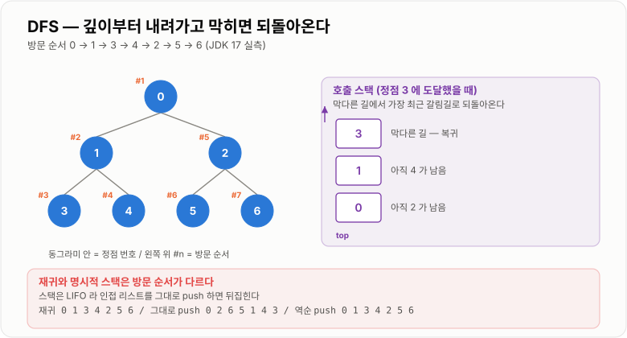

# DFS

> **DFS(Depth First Search, 깊이 우선 탐색)는 갈 수 있는 데까지 끝까지 들어간 뒤 막히면 되돌아오는 탐색이며, 그 "되돌아오기"를 스택이 담당한다.**

---

## 1. 핵심 요약

* 한 갈래를 **끝까지 파고든 뒤** 막히면 **되돌아와서(backtrack)** 다음 갈래로 간다. 이 되돌아오기가 **스택** 구조다.
* 구현은 **재귀**(JVM 호출 스택 사용)와 **명시적 스택**(`ArrayDeque`, 힙 사용) 두 가지다.
* 시간 **O(V + E)**, 공간 **O(V)** 다. 인접 리스트 기준이며, 인접 행렬이면 O(V²)가 된다.
* **재귀 DFS는 깊이 제한이 있다.** JDK 17 실측에서 기본 설정(`-Xss` 약 1MB) 기준 단순 재귀가 **약 24,900단계**, DFS 형태 재귀는 **약 10,700단계**에서 `StackOverflowError`가 났다.
* **명시적 스택은 제한이 사실상 없다.** 같은 환경에서 깊이 **1,000만**을 135.4ms에 완주했다.
* 재귀와 명시적 스택은 **방문 순서가 다르다.** 인접 리스트를 그대로 `push`하면 순서가 뒤집힌다. 같게 하려면 **역순으로 `push`** 해야 한다. (실측 확인)
* **DFS는 최단 경로를 보장하지 않는다.** 처음 도달한 경로가 최단이 아닐 수 있다. 최단 경로는 **BFS**의 몫이다.

---

## 2. 등장 배경

### 해결하려는 문제

"연결된 것들을 빠짐없이 전부 살펴봐야 하는" 상황은 도처에 있다.

* 미로에서 출구까지 가는 길이 있는가
* 파일 시스템의 모든 하위 폴더를 훑기
* 조직도에서 특정 팀의 모든 하위 조직 찾기
* 카테고리 트리 전체 펼치기
* 순환 참조가 있는지 검사하기

문제는 **갈림길**이다. 배열이나 리스트는 다음 원소가 하나뿐이라 순서가 자명하지만, 그래프에서는 한 지점에서 여러 곳으로 갈 수 있다.

```text
       A
      / \
     B   C
    / \   \
   D   E   F

A 에서 B 로 갔다면, C 는 언제 가야 하는가?
B 의 하위(D, E)를 다 본 뒤인가, 아니면 B 다음 바로인가?
```

이 질문에 대한 두 가지 답이 곧 DFS와 BFS다.

```text
DFS: "B 쪽을 끝까지 다 본 뒤에 C 로 간다"     →  A B D E C F
BFS: "같은 깊이인 C 를 먼저 본다"             →  A B C D E F
```

### 왜 스택이 필요한가

DFS를 하려면 **"나중에 돌아와서 봐야 할 갈림길"** 을 기억해야 한다.

```text
A 에 도착 → 갈 곳이 B, C 두 개
  → B 로 간다.  C 는 "나중에 볼 곳"으로 기억해 둔다

B 에 도착 → 갈 곳이 D, E 두 개
  → D 로 간다.  E 는 "나중에 볼 곳"으로 기억해 둔다

D 에 도착 → 갈 곳이 없다 (막다른 길)
  → 되돌아간다. 가장 최근에 기억한 곳이 E 다
  → E 로 간다

E 도 막힘 → 되돌아간다. 그 다음으로 최근에 기억한 곳은 C
  → C 로 간다
```

여기서 **"가장 최근에 기억한 것을 가장 먼저 꺼낸다"** 는 규칙이 나온다. 이것이 정확히 **LIFO**, 즉 스택이다.

**재귀 호출은 이 스택을 언어가 대신 관리해 주는 것**이다. 메서드를 호출하면 현재 위치가 JVM 호출 스택에 쌓이고, 메서드가 끝나면 그 위치로 돌아온다. 우리가 명시적으로 관리할 필요가 없어 코드가 짧아진다.

### 이 개념이 없을 때

갈림길을 기억할 구조가 없으면 이렇게 된다.

```java
// 깊이가 3이라는 걸 미리 알아야만 짤 수 있다
for (Category c1 : root.getChildren()) {
    process(c1);
    for (Category c2 : c1.getChildren()) {
        process(c2);
        for (Category c3 : c2.getChildren()) {   // 4단계가 생기면?
            process(c3);
        }
    }
}
```

**깊이가 미리 정해져 있지 않으면 반복문으로는 표현할 수 없다.** 카테고리 깊이가 5단계로 늘어나는 순간 코드를 고쳐야 한다.

DFS는 깊이를 몰라도 된다.

```java
void dfs(Category c) {
    process(c);
    for (Category child : c.getChildren()) {
        dfs(child);                   // 깊이가 얼마든 상관없다
    }
}
```

**"구조가 스스로 반복되는 문제"를 자연스럽게 표현한다**는 것이 DFS의 본질적 가치다.

### 대가로 무엇을 지불하는가

재귀 DFS는 편하지만 **깊이 제한**이라는 대가가 있다. JDK 17에서 실제로 재 보면 이렇다.

| 재귀 형태               | `StackOverflowError` 발생 깊이 |
| ------------------- | ------------------------: |
| 단순 재귀 (인자 없음)       |     약 23,400 ~ 24,900 |
| 지역변수가 많은 재귀 (`long` 5개) |                 약 7,159 |
| DFS 형태 재귀 (인접 리스트 순회) |                약 10,739 |

**같은 코드도 실행할 때마다 다르다.** 실측에서 단순 재귀가 한 번은 23,408, 한 번은 24,960이 나왔다. JIT 인라이닝 상태에 따라 프레임 크기가 달라지기 때문이다.

**"재귀는 대략 만 단계쯤에서 터진다"는 어림값은 위험하다.** 프레임에 무엇이 들어 있느냐에 따라 3배 이상 차이 난다.

---

## 3. 핵심 개념

| 개념                     | 설명                                | 중요한 이유                                    |
| ---------------------- | --------------------------------- | ----------------------------------------- |
| **깊이 우선**              | 한 갈래를 끝까지 판 뒤 되돌아온다               | BFS와 구분되는 정체성이다                           |
| **백트래킹(backtrack)**    | 막다른 길에서 이전 갈림길로 되돌아오는 것           | DFS의 "되돌아오기"이며 스택이 담당한다                  |
| **방문 배열(visited)**     | 이미 본 정점을 표시해 두는 배열                | **없으면 순환 그래프에서 무한 루프**가 된다               |
| **재귀 구현**              | JVM 호출 스택을 암묵적으로 사용               | 코드가 짧지만 **깊이 제한**이 있다                    |
| **명시적 스택 구현**          | `ArrayDeque`로 직접 스택을 관리 (힙 사용)    | 깊이 제한이 사실상 없다 (실측 1,000만 완주)             |
| **인접 리스트**             | 정점마다 연결된 정점 목록을 보관                | 희소 그래프에서 메모리가 압도적으로 유리하다 (실측 약 179배)     |
| **인접 행렬**              | `V × V` 2차원 배열로 연결 여부를 표현         | 간선 확인이 O(1)이지만 메모리가 O(V²)다                |
| **전위/후위 처리**           | 자식으로 내려가기 **전**과 **후**에 하는 작업     | 위상 정렬·트리 크기 계산이 후위 처리에 해당한다              |
| **`StackOverflowError`** | 호출 스택 한계를 넘었을 때 나는 에러             | `Error`라서 `catch`로 다루면 안 된다               |
| **`-Xss`**             | 스레드 스택 크기 옵션                       | 실측상 크기에 **정비례**해 깊이가 늘어난다                |
| **최단 경로 미보장**          | 처음 도달한 경로가 최단이 아닐 수 있다            | **DFS로 최단 거리를 구하면 틀린다.** BFS를 써야 한다      |
| **방문 순서의 구현 의존성**      | 재귀와 명시적 스택의 순서가 다르다               | 인접 리스트를 그대로 `push`하면 뒤집힌다 (실측 확인)         |

DFS와 BFS의 관계를 한눈에 보면 이렇다.

```text
        A                       DFS (스택, LIFO)      BFS (큐, FIFO)
       / \                      ─────────────         ─────────────
      B   C                     A B D E C F           A B C D E F
     / \   \                    깊이부터                너비부터
    D   E   F                   경로·연결성              최단 거리

  자료구조만 스택 → 큐 로 바꾸면 BFS 가 된다.
  나머지 코드는 거의 동일하다.
```

---

## 4. 구조와 동작 원리

### 기본 동작

```text
그래프:        0
             /   \
            1     2
           / \   / \
          3   4 5   6

인접 리스트:
  0 → [1, 2]
  1 → [0, 3, 4]
  2 → [0, 5, 6]
  3 → [1]      4 → [1]      5 → [2]      6 → [2]

재귀 DFS(0) 진행:

  방문 0    →  1 로 내려감          호출 스택: [0]
  방문 1    →  3 로 내려감          호출 스택: [0, 1]
  방문 3    →  갈 곳 없음, 복귀      호출 스택: [0, 1, 3]
  (복귀)    →  1 로 돌아옴          호출 스택: [0, 1]
  방문 4    →  갈 곳 없음, 복귀      호출 스택: [0, 1, 4]
  (복귀)    →  0 으로 돌아옴        호출 스택: [0]
  방문 2    →  5 로 내려감          호출 스택: [0, 2]
  방문 5    →  복귀
  방문 6    →  복귀
  종료

방문 순서: 0 → 1 → 3 → 4 → 2 → 5 → 6
```

JDK 17에서 실제로 돌려 확인한 결과가 **`0 1 3 4 2 5 6`** 이다.



*갈림길을 스택에 쌓아 두었다가 가장 최근 것부터 꺼내 되돌아오는 것이 DFS의 전부다.*

### 재귀와 명시적 스택은 방문 순서가 다르다

이것이 실무에서 자주 놓치는 부분이다. 같은 그래프에 명시적 스택을 쓰면 순서가 달라진다.

```java
// 인접 리스트를 그대로 push
for (int nx : g.get(cur)) {
    stack.push(nx);
}
```

JDK 17 실측 결과다.

| 구현                     | 방문 순서             |
| ---------------------- | ----------------- |
| 재귀 DFS                 | `0 1 3 4 2 5 6`   |
| 명시적 스택 (그대로 `push`)    | **`0 2 6 5 1 4 3`** |
| 명시적 스택 (**역순** `push`) | `0 1 3 4 2 5 6`   |
| BFS (참고)               | `0 1 2 3 4 5 6`   |

**왜 뒤집히는가?**

```text
0 의 인접 리스트가 [1, 2] 라고 하자.

재귀:      1 을 먼저 호출한다        →  1 부터 방문
스택 push: 1 을 넣고 2 를 넣는다
           스택 = [1, 2]  (2가 위)
           pop 하면 2 가 먼저 나온다  →  2 부터 방문  ← 뒤집힘!

  스택은 LIFO 이므로 마지막에 넣은 것이 먼저 나온다.
  재귀와 같은 순서를 원하면 역순으로 push 해야 한다.
```

```java
// 재귀와 같은 순서를 원한다면
List<Integer> adj = g.get(cur);
for (int i = adj.size() - 1; i >= 0; i--) {
    stack.push(adj.get(i));
}
```

**"둘 다 DFS니까 결과가 같겠지"라고 넘어가면 안 된다.** 순서가 결과에 영향을 주는 문제(첫 번째로 찾은 경로 반환, 사전순 우선 탐색)에서는 답이 달라진다.

### 재귀 깊이의 한계 — 실측

재귀 DFS는 JVM 호출 스택을 쓰므로 **스택 크기가 곧 깊이 제한**이다. JDK 17에서 `-Xss`를 바꿔 가며 최대 재귀 깊이를 측정했다.

| `-Xss` 설정   | 최대 재귀 깊이 (실측) | 배수      |
| ----------- | -----------: | ------- |
| `256k`      |    **5,278** | 기준      |
| `512k`      |   **11,832** | 약 2.2배  |
| `1m`        |   **24,932** | 약 4.7배  |
| **기본값(미지정)** |   **24,956** | ≈ `1m`  |
| `2m`        |   **51,178** | 약 9.7배  |
| `8m`        |  **208,450** | 약 39.5배 |

**깊이가 스택 크기에 거의 정비례한다.** 그리고 이 환경의 기본값이 약 1MB라는 것도 확인된다.

프레임에 무엇이 들어 있느냐도 큰 영향을 준다.

```text
같은 -Xss(기본값) 에서

  단순 재귀 (인자 없음)         : 약 23,400 ~ 24,900
  DFS 형태 (인접 리스트 순회)     : 약 10,739
  지역변수 많음 (long 인자 5개)   : 약  7,159

  → 프레임이 클수록 깊이가 줄어든다. 약 3배 차이가 난다.
```

**실행할 때마다 값이 달라진다는 점도 중요하다.** 실측에서 같은 단순 재귀가 23,408과 24,960으로 나왔다. JIT 컴파일 상태에 따라 프레임 크기가 변하기 때문이다. **"안전한 깊이"를 특정 숫자로 가정하면 안 된다.**

### 명시적 스택은 제한이 없다

같은 환경에서 명시적 스택으로 일자형 그래프를 탐색했다.

| 깊이         | 결과                                       |
| ---------- | ---------------------------------------- |
| 1,000,000  | 전부 방문 완료, 63.4 ms, `StackOverflowError` 없음 |
| 10,000,000 | 전부 방문 완료, 135.4 ms, 에러 없음                |

**재귀로는 2만 5천에서 터지는 것이 명시적 스택으로는 1,000만도 문제없다.** 이유는 사용하는 메모리 영역이 다르기 때문이다.

```text
재귀 DFS       →  JVM 호출 스택 (스레드마다 고정 크기, 기본 약 1MB)
명시적 스택 DFS  →  힙 (JVM 전체 힙 크기까지 사용 가능, 보통 GB 단위)

  스레드 스택은 스레드 수만큼 곱해지므로 크게 잡기 어렵다.
  1000개 스레드 × 8MB = 8GB
```


*재귀는 스레드마다 할당된 작은 호출 스택을 쓰고, 명시적 스택은 훨씬 큰 힙을 쓴다.*

### 방문 배열이 없으면 무한 루프다

```text
순환이 있는 그래프:   0 ─── 1
                      │     │
                      └── 2 ┘

방문 배열 없이 DFS:
  0 → 1 → 2 → 0 → 1 → 2 → 0 → ...  영원히 반복
  → StackOverflowError (재귀) 또는 OutOfMemoryError (명시적 스택)
```

**트리는 순환이 없어서 방문 배열 없이도 되지만, 그래프는 반드시 필요하다.** 실무에서 "트리인 줄 알았는데 순환 참조가 있었다"는 상황이 자주 생기므로 항상 넣는 편이 안전하다.

방문 배열은 **`boolean[]`을 쓴다.** `HashSet<Integer>`도 되지만 훨씬 느리다.

| 방문 표시 방법          | 100만 정점 실측 | 비고            |
| ----------------- | ---------: | ------------- |
| `boolean[]`       | **4.71 ms** | 메모리 약 1MB     |
| `HashSet<Integer>` | 110.73 ms  | **약 24배 느림**  |

박싱 비용과 해시 계산, 캐시 미스가 겹친 결과다. **정점이 0..V-1로 번호가 매겨져 있다면 무조건 `boolean[]`** 이다.

### DFS는 최단 경로를 보장하지 않는다

```text
그래프:  0 ── 1 ── 2 ── 5      (0 → 5 : 3칸)
         │              │
         └───── 3 ──────┘      (0 → 3 → 5 : 2칸)

DFS 가 인접 리스트 [1, 3] 순서로 본다면
  0 → 1 → 2 → 5 에서 5 를 처음 만난다  →  거리 3 이라고 답한다
  하지만 실제 최단은 0 → 3 → 5 = 2 다
```

JDK 17 실측 결과다.

| 방법                 | 결과       | 정확성      |
| ------------------ | -------- | -------- |
| DFS — 처음 도달했을 때 반환 | **3**    | **틀림**   |
| DFS — 모든 경로 탐색 후 최솟값 | 2        | 맞지만 매우 느림 |
| BFS                | **2**    | 한 번의 순회로 정답 |

**DFS로 최단 경로를 구하려면 모든 경로를 다 봐야 하고, 이는 지수 시간이 된다.** 최단 경로는 BFS의 영역이다.

---

## 5. 코드 또는 사용 예시

### 재귀 DFS

```java
import java.util.ArrayList;
import java.util.List;

public class RecursiveDfs {

    private final List<List<Integer>> graph;
    private final boolean[] visited;
    private final StringBuilder order = new StringBuilder();

    public RecursiveDfs(int vertexCount) {
        this.graph = new ArrayList<>();
        for (int i = 0; i < vertexCount; i++) {
            graph.add(new ArrayList<Integer>());
        }
        this.visited = new boolean[vertexCount];
    }

    public void addEdge(int a, int b) {
        graph.get(a).add(b);
        graph.get(b).add(a);          // 무방향 그래프
    }

    public void dfs(int current) {
        visited[current] = true;                  // 전위 처리
        order.append(current).append(' ');

        List<Integer> adjacent = graph.get(current);
        for (int i = 0; i < adjacent.size(); i++) {
            int next = adjacent.get(i);
            if (!visited[next]) {
                dfs(next);
            }
        }
        // 여기가 후위 처리 위치 (모든 자식을 다 본 뒤)
    }

    public String getOrder() {
        return order.toString().trim();
    }

    public static void main(String[] args) {
        RecursiveDfs d = new RecursiveDfs(7);
        d.addEdge(0, 1);
        d.addEdge(0, 2);
        d.addEdge(1, 3);
        d.addEdge(1, 4);
        d.addEdge(2, 5);
        d.addEdge(2, 6);

        d.dfs(0);
        System.out.println(d.getOrder());     // 0 1 3 4 2 5 6
    }
}
```

각 부분의 의미는 이렇다.

```java
visited[current] = true;
```

**함수에 들어오자마자 표시한다.** 자식을 호출하기 전에 해야 순환에서 무한 루프를 막을 수 있다.

```java
if (!visited[next]) {
    dfs(next);
}
```

**호출 전에 확인**한다. 이미 방문한 곳으로 다시 내려가지 않는다.

```java
// 여기가 후위 처리 위치
```

**자식을 모두 처리한 뒤에 실행되는 지점**이다. 트리의 크기를 세거나 위상 정렬 순서를 만들 때 여기를 쓴다.

### 명시적 스택 DFS

```java
import java.util.ArrayDeque;
import java.util.ArrayList;
import java.util.Deque;
import java.util.List;

public class IterativeDfs {

    /**
     * 재귀 없이 DFS 를 수행한다. 깊이 제한이 사실상 없다.
     * 재귀와 같은 방문 순서를 원하면 인접 리스트를 역순으로 push 해야 한다.
     */
    public static String dfs(List<List<Integer>> graph, int start) {
        boolean[] visited = new boolean[graph.size()];
        Deque<Integer> stack = new ArrayDeque<>();
        StringBuilder order = new StringBuilder();

        stack.push(start);

        while (!stack.isEmpty()) {
            int current = stack.pop();

            if (visited[current]) {          // 중복 삽입될 수 있으므로 확인
                continue;
            }
            visited[current] = true;
            order.append(current).append(' ');

            List<Integer> adjacent = graph.get(current);
            for (int i = adjacent.size() - 1; i >= 0; i--) {   // 역순 push
                int next = adjacent.get(i);
                if (!visited[next]) {
                    stack.push(next);
                }
            }
        }
        return order.toString().trim();
    }

    public static void main(String[] args) {
        List<List<Integer>> g = new ArrayList<>();
        for (int i = 0; i < 7; i++) {
            g.add(new ArrayList<Integer>());
        }
        addEdge(g, 0, 1);
        addEdge(g, 0, 2);
        addEdge(g, 1, 3);
        addEdge(g, 1, 4);
        addEdge(g, 2, 5);
        addEdge(g, 2, 6);

        System.out.println(dfs(g, 0));       // 0 1 3 4 2 5 6
    }

    private static void addEdge(List<List<Integer>> g, int a, int b) {
        g.get(a).add(b);
        g.get(b).add(a);
    }
}
```

재귀 버전과 두 가지가 다르다.

```java
if (visited[current]) {
    continue;
}
```

**꺼낸 뒤에 다시 확인해야 한다.** 명시적 스택에서는 같은 정점이 여러 번 스택에 들어갈 수 있기 때문이다. 예를 들어 정점 X가 두 이웃 모두에서 `push`될 수 있다.

```java
for (int i = adjacent.size() - 1; i >= 0; i--)
```

**역순으로 `push`** 한다. 이렇게 해야 재귀와 방문 순서가 같아진다. 실측으로 확인한 대로, 정순으로 넣으면 `0 2 6 5 1 4 3`이 나온다.

### 격자 DFS — 연결 요소 세기

```java
public class IslandCounter {

    private static final int[] DR = {-1, 1, 0, 0};
    private static final int[] DC = {0, 0, -1, 1};

    /** '1'이 땅, '0'이 바다일 때 섬의 개수를 센다. */
    public static int countIslands(char[][] grid) {
        if (grid.length == 0) {
            return 0;
        }
        int rows = grid.length;
        int cols = grid[0].length;
        boolean[][] visited = new boolean[rows][cols];
        int count = 0;

        for (int r = 0; r < rows; r++) {
            for (int c = 0; c < cols; c++) {
                if (grid[r][c] == '1' && !visited[r][c]) {
                    fill(grid, visited, r, c);
                    count++;              // 한 번의 DFS = 하나의 연결 요소
                }
            }
        }
        return count;
    }

    private static void fill(char[][] grid, boolean[][] visited, int r, int c) {
        if (r < 0 || r >= grid.length || c < 0 || c >= grid[0].length) {
            return;
        }
        if (grid[r][c] == '0' || visited[r][c]) {
            return;
        }
        visited[r][c] = true;

        for (int d = 0; d < 4; d++) {
            fill(grid, visited, r + DR[d], c + DC[d]);
        }
    }

    public static void main(String[] args) {
        char[][] grid = {
                {'1', '1', '0', '0'},
                {'1', '1', '0', '0'},
                {'0', '0', '1', '0'},
                {'0', '0', '0', '1'},
        };
        System.out.println(countIslands(grid));   // 3
    }
}
```

**"바깥 반복문에서 DFS를 호출한 횟수 = 연결 요소의 개수"** 라는 것이 핵심 아이디어다.

**주의할 점**이 있다. 격자가 크면 재귀 깊이가 문제가 된다.

```text
1000 × 1000 격자가 전부 땅이라면
  → 최악의 경우 재귀 깊이 1,000,000
  → 실측 한계가 약 10,700 이므로 StackOverflowError 발생

  → 격자가 크면 반드시 명시적 스택이나 BFS 로 구현해야 한다
```

### 순환 탐지 — DFS의 대표 활용

```java
import java.util.ArrayList;
import java.util.List;

public class CycleDetector {

    private static final int UNVISITED = 0;
    private static final int IN_PROGRESS = 1;    // 현재 탐색 경로에 있음
    private static final int DONE = 2;           // 탐색 완료

    /** 방향 그래프에 순환이 있는지 검사한다. */
    public static boolean hasCycle(List<List<Integer>> graph) {
        int[] state = new int[graph.size()];

        for (int i = 0; i < graph.size(); i++) {
            if (state[i] == UNVISITED && visit(graph, i, state)) {
                return true;
            }
        }
        return false;
    }

    private static boolean visit(List<List<Integer>> graph, int current, int[] state) {
        state[current] = IN_PROGRESS;

        List<Integer> adjacent = graph.get(current);
        for (int i = 0; i < adjacent.size(); i++) {
            int next = adjacent.get(i);

            if (state[next] == IN_PROGRESS) {
                return true;             // 지금 가는 길로 되돌아왔다 = 순환
            }
            if (state[next] == UNVISITED && visit(graph, next, state)) {
                return true;
            }
        }

        state[current] = DONE;           // 후위 처리
        return false;
    }
}
```

**상태가 세 가지**여야 한다는 점이 핵심이다.

```text
UNVISITED   : 아직 안 봄
IN_PROGRESS : 현재 탐색 중인 경로 위에 있음  ← 여기로 되돌아오면 순환
DONE        : 탐색이 끝남 (다른 경로에서 다시 만나도 순환이 아님)

  boolean 방문 배열만으로는 "이미 본 곳"과 "지금 가는 길"을 구분할 수 없다.
```

이 알고리즘이 **JPA 양방향 연관관계의 순환 참조 검사**, **의존성 주입의 순환 의존 검사**, **빌드 도구의 순환 의존 검사**에 쓰이는 바로 그것이다.

### 재귀를 명시적 스택으로 바꾸기

깊은 재귀가 위험할 때 쓰는 표준 변환이다.

```java
import java.util.ArrayDeque;
import java.util.Deque;

public class DeepTraversal {

    /**
     * 카테고리 트리가 얼마나 깊을지 모를 때는
     * 재귀 대신 명시적 스택을 쓴다.
     */
    public static int countAll(Category root) {
        Deque<Category> stack = new ArrayDeque<>();
        stack.push(root);
        int count = 0;

        while (!stack.isEmpty()) {
            Category current = stack.pop();
            count++;

            List<Category> children = current.getChildren();
            for (int i = children.size() - 1; i >= 0; i--) {
                stack.push(children.get(i));
            }
        }
        return count;
    }
}
```

**언제 바꿔야 하는가?**

```text
깊이를 예측할 수 있고 수천 이하다        →  재귀로 두어도 된다 (가독성이 낫다)
깊이가 사용자 입력·데이터에 달렸다        →  명시적 스택으로 바꾼다
격자·그래프 크기가 수만 이상이다          →  명시적 스택 또는 BFS
운영 중 StackOverflowError 가 났다       →  즉시 전환
```

---

## 6. 성능 특성

| 항목               | 인접 리스트         | 인접 행렬        | 설명                     |
| ---------------- | -------------- | ------------ | ---------------------- |
| 전체 탐색            | **O(V + E)**   | O(V²)        | 모든 정점과 간선을 한 번씩 본다     |
| 특정 간선 존재 확인      | O(차수)          | **O(1)**     | 행렬이 유리한 유일한 지점         |
| 메모리              | **O(V + E)**   | O(V²)        | 희소 그래프에서 결정적 차이        |
| V=10,000, E=50,000 | **약 0.53 MB**  | **약 95.4 MB** | 실측 기준 **약 179배**       |

**대부분의 실제 그래프는 희소하다.** 소셜 네트워크에서 친구가 1억 명일 수는 없다. 그래서 인접 리스트가 기본이다.

### 공간 복잡도

| 구현        | 공간         | 실제 사용 영역               |
| --------- | ---------- | ---------------------- |
| 재귀 DFS    | O(V)       | **JVM 호출 스택** (약 1MB 제한) |
| 명시적 스택 DFS | O(V)       | **힙** (GB 단위 가능)        |
| 방문 배열     | O(V)       | 힙                      |

**복잡도는 같은 O(V)인데 실제 한계가 전혀 다르다.** 빅오만 보면 놓치는 지점이다.

```text
재귀      : O(V) 지만 실측 약 10,700 에서 StackOverflowError
명시적 스택 : O(V) 이고 실측 10,000,000 도 문제없음
```

### 재귀 깊이 한계 — 정리

JDK 17 실측 결과를 종합하면 이렇다.

| 요인            | 영향                                          |
| ------------- | ------------------------------------------- |
| `-Xss` 스택 크기  | **거의 정비례** (256k→5,278 / 8m→208,450)        |
| 프레임 크기(지역변수)  | 반비례 (단순 24,900 / `long` 5개 7,159)           |
| JIT 컴파일 상태    | **실행마다 달라짐** (같은 코드가 23,408과 24,960)        |
| 스레드 수         | `-Xss`를 키우면 스레드당 메모리가 곱해진다                  |

**`-Xss`를 키우는 것은 근본 해결책이 아니다.**

```text
-Xss8m 으로 올리면 깊이가 20만까지 늘지만
  스레드 1,000개 × 8MB = 8GB 가 필요하다

  → 웹 서버에서는 현실적이지 않다
  → 명시적 스택으로 바꾸는 것이 옳은 해결이다
```

### 방문 배열 구현별 성능

| 구현                       | 100만 정점 실측 | 메모리     |
| ------------------------ | ---------: | ------- |
| `boolean[]`              | **4.71 ms** | 약 1 MB  |
| `HashSet<Integer>`       | 110.73 ms  | 수십 MB   |

**약 24배 차이**다. 정점 번호가 연속된 정수라면 `boolean[]`을 쓴다. 정점이 문자열 ID 같은 형태라면 어쩔 수 없이 `HashSet`을 쓰되, 미리 정수로 매핑해 두는 방법을 고려한다.

---

## 7. 장점과 단점

| 장점                    | 이유                                     |
| --------------------- | -------------------------------------- |
| 재귀로 짜면 코드가 매우 짧다      | 되돌아오기를 언어가 대신 관리해 준다                   |
| 깊이를 몰라도 된다            | 반복문으로는 표현 못 하는 임의 깊이 구조를 자연스럽게 다룬다     |
| 메모리가 경로 길이에만 비례한다     | BFS가 같은 깊이의 모든 정점을 담는 것과 대비된다          |
| 경로·연결성 문제에 자연스럽다      | 백트래킹으로 경로를 만들었다 지웠다 하기 쉽다              |
| 순환 탐지에 적합하다           | "지금 가는 길"이라는 개념이 스택 구조에서 자연스럽다         |
| 후위 처리를 쓸 수 있다         | 위상 정렬, 서브트리 크기 계산 등이 여기서 나온다           |
| 백트래킹 문제의 기반이다         | 순열·조합·N-Queens 등이 전부 DFS 구조다           |

| 단점                     | 이유 및 주의점                                        |
| ---------------------- | ----------------------------------------------- |
| **최단 경로를 보장하지 않는다**    | 처음 도달한 경로가 최단이 아닐 수 있다 (실측: DFS 3 / BFS 2)      |
| **재귀는 깊이 제한이 있다**      | 실측 약 10,700(DFS 형태)에서 `StackOverflowError`      |
| 깊이 한계가 예측 불가능하다        | 프레임 크기와 JIT 상태에 따라 실행마다 달라진다                    |
| 방문 배열을 빠뜨리면 무한 루프다     | 순환 그래프에서 즉시 터진다                                 |
| 재귀와 명시적 스택의 순서가 다르다    | 인접 리스트를 그대로 `push`하면 뒤집힌다 (실측 확인)               |
| 깊은 그래프에서 한쪽으로 치우친다     | 가까운 답이 있어도 먼 곳을 먼저 다 뒤질 수 있다                    |
| 가중치 그래프에 부적합하다         | 최소 비용 경로는 다익스트라의 몫이다                            |
| 명시적 스택은 코드가 길어진다       | 상태 관리를 직접 해야 하고, 후위 처리 구현이 특히 까다롭다              |

---

## 8. 사용 기준

### 사용하기 좋은 상황

* **경로가 존재하는지**만 확인할 때 (최단일 필요 없음)
* **모든 정점을 방문**해야 할 때 (순서는 상관없음)
* **연결 요소의 개수**를 셀 때 (섬 개수, 그룹 분리)
* **순환을 탐지**할 때 (의존성 검사, 참조 검사)
* **위상 정렬**을 할 때 (후위 처리 활용)
* **백트래킹** 문제 (순열·조합·N-Queens·스도쿠)
* **트리 순회** (전위·중위·후위)
* 답이 **깊은 곳에 있을** 가능성이 높을 때
* **메모리가 부족**할 때 (경로 길이만큼만 쓴다)

### 사용하지 않는 것이 좋은 상황

* **최단 경로·최소 횟수**가 필요할 때 → **BFS**
* **가중치**가 있는 그래프의 최소 비용 → **다익스트라**
* 답이 **시작점 근처**에 있을 가능성이 높을 때 → BFS
* 그래프가 **매우 깊을** 때 재귀 구현 → 명시적 스택 또는 BFS
* **레벨별 처리**가 필요할 때 (같은 깊이끼리 묶기) → BFS

### 선택 기준

1. **최단 경로가 필요한가?** — 필요하면 무조건 BFS다. DFS로는 틀린 답이 나온다
2. **가중치가 있는가?** — 있으면 다익스트라
3. **깊이가 얼마나 되는가?** — 수천 이상이면 재귀 대신 명시적 스택
4. **답이 깊은 곳인가 얕은 곳인가?** — 깊으면 DFS, 얕으면 BFS
5. **메모리 제약이 있는가?** — DFS는 경로 길이, BFS는 한 층의 크기만큼 쓴다
6. **후위 처리가 필요한가?** — 필요하면 DFS(재귀)가 압도적으로 편하다

```text
                    최단 경로가 필요한가?
                            │
           ┌────────────────┴────────────────┐
         예                                 아니오
           │                                 │
     가중치가 있는가?                   깊이가 큰가?
           │                                 │
    ┌──────┴──────┐                   ┌──────┴──────┐
   예            아니오               예            아니오
    │              │                   │              │
다익스트라        BFS           명시적 스택 DFS      재귀 DFS
(음수면 벨만-포드)                  또는 BFS         (코드가 짧다)
```

---

## 9. 비슷한 개념 비교

### DFS와 BFS

| 비교 항목    | DFS                 | BFS                | 선택 기준         |
| -------- | ------------------- | ------------------ | ------------- |
| 자료구조     | **스택** (또는 재귀)      | **큐**              | 코드는 이것만 다르다   |
| 탐색 순서    | 깊이부터               | 너비(레벨)부터           | -             |
| 최단 경로    | **보장 안 됨**          | **보장됨** (간선 가중치 동일) | **결정적 차이**    |
| 메모리      | O(최대 깊이)            | O(최대 너비)           | 그래프 모양에 따라    |
| 깊은 그래프   | 메모리 유리, 재귀는 위험      | 메모리 불리             | 깊고 좁으면 DFS    |
| 넓은 그래프   | 메모리 유리              | **메모리 폭발 위험**      | 넓으면 DFS       |
| 답이 가까울 때 | 불리 (먼 곳부터 뒤짐)       | **유리**             | 위치 예상에 따라     |
| 구현       | 재귀로 매우 짧음           | 명시적 큐 필요           | DFS가 짧다       |
| 대표 용도    | 연결 요소, 순환 탐지, 백트래킹  | 최단 거리, 레벨 순회       | 문제 성격         |

**코드 차이는 자료구조 하나뿐이다.**

```java
// DFS
Deque<Integer> stack = new ArrayDeque<>();
int current = stack.pop();      // LIFO

// BFS
Deque<Integer> queue = new ArrayDeque<>();
int current = queue.poll();     // FIFO
```

### 재귀 DFS와 명시적 스택 DFS

| 비교 항목  | 재귀 DFS               | 명시적 스택 DFS         | 선택 기준         |
| ------ | -------------------- | ----------------- | ------------- |
| 사용 메모리 | **JVM 호출 스택**        | **힙**             | 결정적 차이        |
| 깊이 한계  | 실측 약 10,700 (DFS 형태) | 실측 10,000,000 이상  | 깊이가 크면 명시적    |
| 코드 길이  | **매우 짧음**            | 길어짐               | 가독성           |
| 후위 처리  | **자연스러움**            | 매우 까다로움           | 위상 정렬 등이면 재귀  |
| 방문 순서  | 인접 리스트 순서 그대로        | **역순 push 해야 동일** | 실측 확인 필요      |
| 중복 삽입  | 없음                   | 있음 → 꺼낸 뒤 재확인 필요  | 구현 주의점        |
| 디버깅    | 스택트레이스로 추적 가능        | 상태를 직접 출력해야 함     | 재귀가 편함        |
| 적합한 상황 | 깊이가 얕고 예측 가능         | 깊이를 예측할 수 없음      | 데이터 크기로 판단    |

### DFS와 백트래킹

| 비교 항목  | DFS               | 백트래킹              | 관계               |
| ------ | ----------------- | ----------------- | ---------------- |
| 목적     | 그래프의 모든 정점 방문     | 조건을 만족하는 해 찾기     | **백트래킹은 DFS의 응용** |
| 방문 표시  | 한 번 표시하면 유지       | **되돌아올 때 해제**     | 결정적 차이           |
| 가지치기   | 없음                | **조건 위반 시 즉시 중단** | 백트래킹의 핵심         |
| 탐색 공간  | 정점 V개             | 지수적 (순열 n!, 부분집합 2ⁿ) | 규모가 다르다          |
| 대표 문제  | 연결 요소, 순환 탐지      | N-Queens, 스도쿠, 순열 | -                |
| 복잡도    | O(V+E)            | 지수 시간             | 가지치기로 실전 성능 확보   |

```java
// DFS — 방문 표시를 유지한다
visited[current] = true;
for (int next : adjacent) {
    if (!visited[next]) {
        dfs(next);
    }
}

// 백트래킹 — 되돌아올 때 해제한다
visited[current] = true;
path.add(current);
for (int next : adjacent) {
    if (!visited[next]) {
        backtrack(next);
    }
}
visited[current] = false;     // ← 이 한 줄이 백트래킹을 만든다
path.remove(path.size() - 1);
```

### 인접 리스트와 인접 행렬

| 비교 항목  | 인접 리스트          | 인접 행렬            | 선택 기준       |
| ------ | --------------- | ---------------- | ----------- |
| 메모리    | **O(V + E)**    | O(V²)            | 희소하면 리스트    |
| 실측(V=1만, E=5만) | **약 0.53 MB**   | 약 95.4 MB        | **약 179배**  |
| 전체 탐색  | **O(V + E)**    | O(V²)            | 리스트가 유리     |
| 간선 확인  | O(차수)           | **O(1)**         | 행렬의 유일한 장점  |
| 간선 추가  | **O(1)**        | O(1)             | 동일          |
| 밀집 그래프 | 오버헤드 존재         | **유리**           | E ≈ V²이면 행렬 |
| 적합한 상황 | **대부분의 실제 그래프** | 정점 수가 적고 밀집한 경우  | 기본은 리스트     |

---

## 10. 백엔드 실무 적용

### Spring·Java

**계층 구조 순회**가 가장 흔한 적용이다.

```java
import java.util.ArrayDeque;
import java.util.ArrayList;
import java.util.Deque;
import java.util.List;

@Service
public class CategoryService {

    /**
     * 카테고리 트리 전체를 평탄화한다.
     * 깊이를 예측할 수 없으므로 명시적 스택을 쓴다.
     */
    public List<Category> flatten(Category root) {
        List<Category> result = new ArrayList<>();
        Deque<Category> stack = new ArrayDeque<>();
        stack.push(root);

        while (!stack.isEmpty()) {
            Category current = stack.pop();
            result.add(current);

            List<Category> children = current.getChildren();
            for (int i = children.size() - 1; i >= 0; i--) {
                stack.push(children.get(i));
            }
        }
        return result;
    }
}
```

**이 코드에는 숨은 함정이 있다.** JPA 지연 로딩이면 `getChildren()` 호출마다 쿼리가 나간다.

```text
카테고리 1,000개를 순회하면
  → getChildren() 이 1,000번 호출
  → 쿼리 1,000번 (N+1 문제)

  DFS 자체는 O(V+E) 인데 실제로는 네트워크 왕복 1,000번이다.
```

해결책은 **한 번에 다 가져와서 메모리에서 트리를 만드는 것**이다.

```java
public List<Category> flattenEfficiently() {
    List<Category> all = categoryRepository.findAll();      // 쿼리 1번

    Map<Long, List<Category>> childrenMap = new HashMap<>();
    Category root = null;
    for (int i = 0; i < all.size(); i++) {
        Category c = all.get(i);
        if (c.getParentId() == null) {
            root = c;
        } else {
            childrenMap.computeIfAbsent(c.getParentId(),
                    k -> new ArrayList<Category>()).add(c);
        }
    }
    // 이후 childrenMap 으로 DFS — 추가 쿼리 없음
    return traverse(root, childrenMap);
}
```

**알고리즘 복잡도보다 I/O 횟수가 지배적이다.** 실무에서 DFS를 쓸 때 가장 먼저 확인해야 할 부분이다.

**순환 참조 검사**도 DFS의 대표 활용이다.

```java
/**
 * 카테고리의 부모를 변경할 때 순환이 생기는지 검사한다.
 * (자기 자신을 자기 하위로 옮기려는 시도를 막는다)
 */
public void changeParent(Long categoryId, Long newParentId) {
    if (isDescendant(categoryId, newParentId)) {
        throw new IllegalArgumentException("순환 구조를 만들 수 없습니다.");
    }
    // ... 변경 로직
}

private boolean isDescendant(Long ancestorId, Long candidateId) {
    Deque<Long> stack = new ArrayDeque<>();
    stack.push(ancestorId);
    Set<Long> seen = new HashSet<>();

    while (!stack.isEmpty()) {
        Long current = stack.pop();
        if (!seen.add(current)) {
            continue;                      // 이미 본 곳
        }
        if (current.equals(candidateId)) {
            return true;
        }
        for (Long childId : childIdsOf(current)) {
            stack.push(childId);
        }
    }
    return false;
}
```

**Spring 자체도 DFS를 쓴다.**

* **순환 의존성 검사** — 빈 A가 B를, B가 A를 필요로 하면 `BeanCurrentlyInCreationException`이 난다. 생성 중인 빈 이름을 스택처럼 관리하며 DFS로 검사한다.
* **`@Transactional` 전파** — 중첩 트랜잭션의 보류·복원이 스택 구조다.
* **JSON 직렬화의 무한 재귀** — 양방향 연관관계에서 `StackOverflowError`가 나는 것이 DFS가 순환에 빠진 결과다. `@JsonIgnore`나 DTO 분리로 막는다.

### 데이터베이스·캐시

**재귀 CTE**가 DB의 DFS/BFS다.

```sql
-- 특정 카테고리의 모든 하위를 재귀적으로 조회
WITH RECURSIVE category_tree AS (
    -- 시작점 (앵커)
    SELECT id, name, parent_id, 0 AS depth
    FROM categories
    WHERE id = 1

    UNION ALL

    -- 재귀 부분
    SELECT c.id, c.name, c.parent_id, ct.depth + 1
    FROM categories c
    JOIN category_tree ct ON c.parent_id = ct.id
)
SELECT * FROM category_tree ORDER BY depth;
```

**주의할 점이 있다.**

```text
1. 순환이 있으면 무한 루프가 된다
   → depth 제한을 걸거나 경로를 추적해야 한다
   → PostgreSQL 은 CYCLE 절을 지원한다

2. 깊이가 깊으면 매우 느려진다
   → 각 단계마다 조인이 발생한다

3. MySQL 은 8.0 부터 지원한다
   → 그 이전 버전은 애플리케이션에서 처리해야 한다
```

계층 구조를 다루는 대안적 설계도 알아 둘 만하다.

| 방식                     | 하위 전체 조회         | 삽입·이동      | 특징                |
| ---------------------- | ---------------- | ---------- | ----------------- |
| **인접 리스트** (`parent_id`) | 재귀 CTE 또는 N번 쿼리  | **O(1)**   | 가장 단순, 조회가 비쌈     |
| **경로 열거** (`/1/5/12/`) | `LIKE '/1/%'` 1번 | 하위 전체 갱신   | 조회가 빠름, 이동이 비쌈    |
| **중첩 집합** (left/right) | 범위 조회 1번         | 대부분의 행 갱신  | 조회 최적, 쓰기가 매우 비쌈  |
| **클로저 테이블**            | 조인 1번            | 조상 수만큼 삽입  | 균형적, 테이블이 하나 더 필요 |

**읽기가 압도적으로 많으면 경로 열거나 클로저 테이블**을, 쓰기가 잦으면 인접 리스트를 쓴다.

### 동시성·분산 환경

* **재귀 DFS의 깊이 한계는 스레드마다 적용된다.** 웹 요청 스레드는 이미 프레임워크 프레임이 여러 겹 쌓인 상태라, 실제 가용 깊이가 실측값보다 더 작다.
* **`-Xss`를 키우면 스레드 수만큼 메모리가 곱해진다.** 스레드 1,000개 × 8MB = 8GB다. 웹 서버에서는 명시적 스택으로 바꾸는 것이 옳다.
* **DFS는 병렬화가 어렵다.** 다음에 갈 곳이 이전 결과에 달려 있어 순차적이다. 반면 여러 시작점의 연결 요소를 각각 탐색하는 것은 병렬화가 쉽다.
* **분산 그래프 처리**에서는 DFS보다 BFS 계열(Pregel의 슈퍼스텝 모델)이 선호된다. DFS는 노드 간 순차 의존성이 커서 분산에 불리하다.
* **순회 도중 그래프가 변경되면** 결과가 일관되지 않다. 스냅샷을 뜨거나 읽기 락이 필요하다.

---

## 11. 자주 하는 오해

| 잘못된 이해                                 | 올바른 이해                                                                    |
| -------------------------------------- | ------------------------------------------------------------------------- |
| DFS로 최단 경로를 구할 수 있다                    | **보장하지 않는다.** 실측에서 DFS는 3, BFS는 2를 반환했다. 모든 경로를 다 봐야 정답이고 이는 지수 시간이다      |
| DFS와 BFS는 구현이 많이 다르다                   | **자료구조만 스택↔큐로 바꾸면 된다.** 나머지 코드는 거의 같다                                     |
| 재귀 DFS와 명시적 스택 DFS는 방문 순서가 같다          | **다르다.** 인접 리스트를 그대로 `push`하면 뒤집힌다. 실측 `0 1 3 4 2 5 6` vs `0 2 6 5 1 4 3` |
| 재귀는 대략 만 단계쯤에서 터진다                     | 프레임 크기에 따라 다르다. 실측 단순 재귀 약 24,900 / `long` 인자 5개 약 7,159 — **3배 이상 차이**   |
| 재귀 최대 깊이는 항상 같은 값이다                    | **실행마다 달라진다.** 같은 코드가 23,408과 24,960으로 측정되었다 (JIT 영향)                    |
| `-Xss`를 키우면 해결된다                       | 스레드 수만큼 곱해진다. 1,000 스레드 × 8MB = 8GB. **명시적 스택으로 바꾸는 것이 옳다**               |
| 명시적 스택도 깊이 제한이 있다                      | 힙을 쓰므로 사실상 없다. **실측 1,000만 깊이를 135.4ms에 완주**했다                            |
| `StackOverflowError`는 힙이 부족해서 난다       | **호출 스택**이 한계를 넘어 발생한다. 힙 부족은 `OutOfMemoryError`다                         |
| `StackOverflowError`를 `catch`해서 처리하면 된다 | `Error`는 복구 불가능한 상황을 뜻한다. 잡아서 넘기지 말고 구조를 바꿔야 한다                           |
| 방문 배열은 트리에서도 꼭 필요하다                    | 트리는 순환이 없어 없어도 된다. 다만 **"트리인 줄 알았는데 순환이 있는"** 경우가 많아 넣는 편이 안전하다           |
| 방문 표시는 `HashSet`을 써도 성능이 비슷하다          | 실측 **약 24배 느리다** (4.71ms vs 110.73ms). 번호가 연속이면 `boolean[]`               |
| 명시적 스택에서는 꺼낸 뒤 방문 확인이 불필요하다            | **필요하다.** 같은 정점이 여러 번 `push`될 수 있어 `if (visited[cur]) continue;`가 있어야 한다  |
| 순환 탐지는 `boolean` 방문 배열이면 된다            | **3가지 상태**가 필요하다. "이미 본 곳"과 "지금 가는 길"을 구분해야 한다                           |
| DFS는 백트래킹과 같은 것이다                      | 백트래킹은 DFS의 응용이다. **되돌아올 때 방문 표시를 해제**한다는 결정적 차이가 있다                       |
| 인접 행렬이 배열이라 더 빠르다                      | 전체 탐색이 O(V²)라 오히려 느리다. 메모리도 실측 **약 179배** 더 쓴다                            |
| DFS 복잡도가 O(V+E)이니 실무에서도 빠르다            | JPA 지연 로딩이면 정점마다 쿼리가 나가 **N+1**이 된다. I/O가 지배적이다                           |

---

## 12. 면접 답변

### 기본 답변

DFS는 갈 수 있는 데까지 깊이 들어간 뒤 막히면 되돌아오는 탐색으로, 그 되돌아오기를 **스택**이 담당합니다. 시간 복잡도는 인접 리스트 기준 **O(V + E)**, 공간은 O(V)입니다.

구현은 두 가지입니다. **재귀**는 JVM 호출 스택을 암묵적으로 쓰기 때문에 코드가 매우 짧고, **명시적 스택**은 `ArrayDeque`로 직접 관리해 힙을 씁니다. 복잡도는 둘 다 O(V)지만 **실제 한계가 전혀 다릅니다.**

JDK 17에서 실측해 보면 재귀는 기본 `-Xss`(약 1MB) 기준으로 DFS 형태 재귀가 **약 10,700단계**에서 `StackOverflowError`가 났습니다. 반면 명시적 스택은 깊이 **1,000만을 135ms에 완주**했습니다. 사용하는 메모리 영역이 스레드 스택이냐 힙이냐의 차이입니다.

한 가지 주의할 점은 **재귀 깊이 한계가 고정값이 아니라는 것**입니다. `-Xss`에 거의 정비례하고(256k에서 5,278, 8m에서 208,450), 프레임 크기에 반비례하며(단순 재귀 24,900 대 `long` 인자 5개 7,159), **같은 코드도 실행마다 달라집니다**(23,408과 24,960). JIT 인라이닝 때문입니다. 그래서 "안전한 깊이"를 특정 숫자로 가정하면 안 됩니다.

또 하나 놓치기 쉬운 것은 **재귀와 명시적 스택의 방문 순서가 다르다**는 점입니다. 인접 리스트를 그대로 `push`하면 스택이 LIFO라 순서가 뒤집힙니다. 실측하면 재귀는 `0 1 3 4 2 5 6`, 명시적 스택은 `0 2 6 5 1 4 3`이 나옵니다. 같은 순서를 원하면 **역순으로 `push`** 해야 합니다.

가장 중요한 한계는 **DFS가 최단 경로를 보장하지 않는다**는 것입니다. 처음 도달한 경로가 최단이 아닐 수 있어서, 실측에서 DFS는 3, BFS는 2를 반환했습니다. 최단 경로는 BFS의 몫이고, 가중치가 있으면 다익스트라를 씁니다.

그래서 DFS는 **경로 존재 여부, 연결 요소 개수, 순환 탐지, 위상 정렬, 백트래킹**에 씁니다. 특히 순환 탐지는 `boolean` 방문 배열로는 부족하고 "안 봄 / 지금 가는 길 / 완료"의 **3가지 상태**가 필요합니다. 이것이 Spring의 순환 의존성 검사나 빌드 도구의 순환 의존 검사에 쓰이는 알고리즘입니다.

실무에서 DFS를 쓸 때는 복잡도보다 **I/O가 지배적**인 경우가 많습니다. JPA 지연 로딩 상태로 카테고리 트리를 순회하면 정점마다 쿼리가 나가 N+1이 됩니다. 한 번에 전부 조회한 뒤 메모리에서 트리를 구성하는 것이 정석입니다.

### 답변 구조

* **정의**

    * 한 갈래를 끝까지 판 뒤 막히면 되돌아오는(백트래킹) 탐색
    * 되돌아오기를 스택이 담당 — 재귀는 JVM 호출 스택, 명시적 구현은 힙

* **내부 원리**

    * 갈림길을 스택에 쌓고 가장 최근 것부터 꺼낸다 (LIFO)
    * 방문 배열이 없으면 순환 그래프에서 무한 루프
    * 명시적 스택은 **역순 `push`** 해야 재귀와 순서가 같다 (실측 확인)
    * 자료구조를 큐로 바꾸면 그대로 BFS가 된다

* **복잡도**

    * 시간 **O(V + E)** (인접 리스트) / O(V²) (인접 행렬)
    * 공간 O(V) — 단, **실제 한계는 구현마다 전혀 다르다**
    * 재귀 실측: DFS 형태 약 10,700단계에서 `StackOverflowError`
    * 명시적 스택 실측: 1,000만 깊이를 135.4ms에 완주
    * `-Xss` 정비례: 256k→5,278 / 1m→24,932 / 8m→208,450

* **장점**

    * 재귀로 짜면 코드가 매우 짧고 임의 깊이를 자연스럽게 다룸
    * 메모리가 경로 길이에만 비례 (BFS는 한 층 전체)
    * 순환 탐지·위상 정렬·백트래킹의 기반

* **단점**

    * **최단 경로 미보장** (실측 DFS 3 / BFS 2)
    * 재귀는 깊이 제한, 그 한계가 **실행마다 달라짐**
    * 방문 배열 누락 시 무한 루프
    * 가중치 그래프에 부적합

* **사용 기준**

    * 경로 존재 여부, 연결 요소 개수, 순환 탐지, 위상 정렬, 백트래킹
    * 답이 깊은 곳에 있을 가능성이 높을 때
    * 깊이가 수천 이상이면 재귀 대신 명시적 스택

* **대안과 비교**

    * 최단 경로 → **BFS** (가중치 동일할 때)
    * 가중치 있음 → **다익스트라**, 음수 간선 → 벨만-포드
    * 깊은 그래프 → 명시적 스택 (힙 사용)
    * 방문 표시 → `boolean[]` (`HashSet`은 실측 약 24배 느림)
    * 그래프 표현 → 인접 리스트 (인접 행렬은 실측 약 179배 메모리)

* **실무 적용 사례**

    * 카테고리·조직도 계층 순회 — 단, **JPA 지연 로딩이면 N+1**이 되므로 일괄 조회 후 메모리 구성
    * 순환 참조 검사 (3-상태 DFS) — Spring 순환 의존성, JPA 양방향 무한 재귀
    * DB 재귀 CTE (`WITH RECURSIVE`) — 순환 시 무한 루프 주의
    * 계층 구조 설계 대안: 경로 열거 / 중첩 집합 / 클로저 테이블

---

## 13. 예상 면접 질문

### 기본 질문

1. **DFS란 무엇이고 복잡도는 어떻게 되나요?**

    * 핵심 키워드: 깊이 우선, 백트래킹, 스택, O(V+E), 공간 O(V)

2. **DFS와 BFS의 차이는 무엇인가요?**

    * 핵심 키워드: 스택 vs 큐, 깊이 vs 너비, **최단 경로 보장 여부**, 자료구조만 다름

3. **DFS를 재귀와 반복문 중 어떻게 구현하나요?**

    * 핵심 키워드: 재귀는 JVM 호출 스택, 명시적 스택은 힙, 깊이 한계 차이

4. **재귀 DFS는 왜 `StackOverflowError`가 나나요?**

    * 핵심 키워드: 호출 스택 크기 제한, 스레드마다 약 1MB, 실측 약 10,700단계

5. **방문 배열이 없으면 어떻게 되나요?**

    * 핵심 키워드: 순환 그래프에서 무한 루프, `StackOverflowError`/`OutOfMemoryError`

6. **DFS로 최단 경로를 구할 수 있나요?**

    * 핵심 키워드: **보장 안 됨**, 처음 도달이 최단 아님, 모든 경로 탐색은 지수 시간, BFS 사용

7. **인접 리스트와 인접 행렬 중 무엇을 쓰나요?**

    * 핵심 키워드: O(V+E) vs O(V²), 실측 약 179배 메모리, 희소 그래프는 리스트

8. **DFS의 시간 복잡도가 O(V+E)인 이유는 무엇인가요?**

    * 핵심 키워드: 각 정점 1번 방문, 각 간선 1번(무방향은 2번) 확인

### 꼬리 질문

1. **재귀 DFS와 명시적 스택 DFS의 방문 순서는 같나요?**

    * 핵심 키워드: **다르다**, LIFO로 뒤집힘, 역순 `push` 필요, 실측 `0 1 3 4 2 5 6` vs `0 2 6 5 1 4 3`

2. **재귀 최대 깊이는 무엇에 좌우되나요?**

    * 핵심 키워드: `-Xss` 정비례(256k→5,278 / 8m→208,450), 프레임 크기 반비례, **JIT로 실행마다 변동**

3. **`-Xss`를 키우면 문제가 해결되나요?**

    * 핵심 키워드: 스레드 수만큼 곱해짐, 1,000×8MB=8GB, 명시적 스택 전환이 옳음

4. **`StackOverflowError`와 `OutOfMemoryError`의 차이는 무엇인가요?**

    * 핵심 키워드: 호출 스택 vs 힙, 스레드별 vs 전역, `Error`라 잡지 말 것

5. **명시적 스택 DFS에서 꺼낸 뒤 방문 확인이 왜 필요한가요?**

    * 핵심 키워드: 같은 정점이 여러 번 `push` 가능, 중복 처리 방지

6. **순환 탐지에 `boolean` 방문 배열로 충분한가요?**

    * 핵심 키워드: **3가지 상태 필요**, UNVISITED/IN_PROGRESS/DONE, "지금 가는 길" 구분

7. **DFS와 백트래킹의 차이는 무엇인가요?**

    * 핵심 키워드: **되돌아올 때 방문 해제**, 가지치기, 지수 탐색 공간

8. **방문 표시에 `HashSet`을 쓰면 어떤 문제가 있나요?**

    * 핵심 키워드: 박싱·해시 계산·캐시 미스, 실측 약 24배 느림, `boolean[]` 사용

9. **1000×1000 격자를 재귀 DFS로 순회하면 어떻게 되나요?**

    * 핵심 키워드: 최악 깊이 100만, 실측 한계 약 10,700, `StackOverflowError`, 명시적 스택/BFS 전환

10. **JPA로 카테고리 트리를 DFS 순회할 때 주의할 점은 무엇인가요?**

    * 핵심 키워드: 지연 로딩 N+1, 정점마다 쿼리, 일괄 조회 후 메모리 구성, I/O가 지배적

11. **DB에서 계층 구조를 조회하는 방법은 무엇이 있나요?**

    * 핵심 키워드: 재귀 CTE, 경로 열거, 중첩 집합, 클로저 테이블, 읽기/쓰기 비율로 선택

12. **DFS를 병렬화할 수 있나요?**

    * 핵심 키워드: 순차 의존성이 커서 어려움, 연결 요소별 병렬은 가능, 분산은 BFS 계열 선호

13. **Spring에서 DFS가 쓰이는 곳은 어디인가요?**

    * 핵심 키워드: 순환 의존성 검사(`BeanCurrentlyInCreationException`), 트랜잭션 전파, JSON 직렬화 무한 재귀

---

## 14. 추가 학습 방향

### 바로 이어서 공부

| 키워드              | 연결되는 이유                          |
| ---------------- | -------------------------------- |
| **BFS**          | 자료구조만 바꾼 쌍둥이이며 최단 경로를 담당한다       |
| **Stack**        | DFS의 되돌아오기를 담당하는 자료구조다           |
| **재귀와 호출 스택**    | 재귀 DFS의 깊이 한계가 여기서 나온다           |
| **Deque**        | 명시적 스택 구현의 표준 자료구조다              |
| **백트래킹**         | DFS에 방문 해제와 가지치기를 더한 응용이다        |

### 실무 확장

| 키워드                    | 연결되는 이유                        |
| ---------------------- | ------------------------------ |
| **재귀 CTE**             | DB에서 계층 구조를 순회하는 방법이다          |
| **계층 구조 설계 패턴**        | 경로 열거·중첩 집합·클로저 테이블의 트레이드오프다   |
| **N+1 문제**             | DFS 순회에서 I/O가 복잡도를 압도하는 지점이다   |
| **Spring 순환 의존성**      | 3-상태 DFS가 실제로 쓰이는 곳이다          |
| **`-Xss` 튜닝**          | 스레드 수와 깊이의 트레이드오프를 계산한다        |

### 심화 학습

| 키워드                        | 연결되는 이유                        |
| -------------------------- | ------------------------------ |
| **위상 정렬 (Topological Sort)** | DFS의 후위 처리로 구현하는 대표 알고리즘이다     |
| **강연결 요소 (Tarjan · Kosaraju)** | DFS를 두 번 쓰거나 low-link로 찾는 고급 기법이다 |
| **단절점 · 다리 (Articulation Point)** | DFS 트리의 성질을 이용해 O(V+E)에 찾는다    |
| **반복적 깊이 증가 탐색 (IDDFS)**   | DFS의 메모리 이점과 BFS의 최단성을 합친 기법이다 |
| **꼬리 재귀 최적화**              | 재귀를 스택 없이 반복으로 바꾸는 원리다         |
| **Pregel · 분산 그래프 처리**     | 대규모 그래프를 슈퍼스텝으로 나눠 처리한다        |

---

## 15. 최종 체크리스트

* [ ] 개념을 한 문장으로 설명할 수 있다
* [ ] 등장 배경을 설명할 수 있다
* [ ] 내부 동작 과정을 설명할 수 있다
* [ ] 성능 특성을 설명할 수 있다
* [ ] 장점과 단점을 설명할 수 있다
* [ ] 사용할 상황과 사용하지 않을 상황을 구분할 수 있다
* [ ] 비슷한 기술과 비교할 수 있다
* [ ] Spring 백엔드 실무 사례를 설명할 수 있다
* [ ] 기본 면접 질문에 답할 수 있다
* [ ] 조건이 달라졌을 때 대안을 제시할 수 있다

---

## 16. 한 줄 결론

**DFS는 갈림길을 스택에 쌓아 두었다가 되돌아오는 탐색이며, 재귀로 짜면 코드가 짧은 대신 실측 약 만 단계에서 스택이 터지므로 깊이를 예측할 수 없다면 명시적 스택으로 바꾸고, 최단 경로가 필요하다면 애초에 BFS를 써야 한다.**
