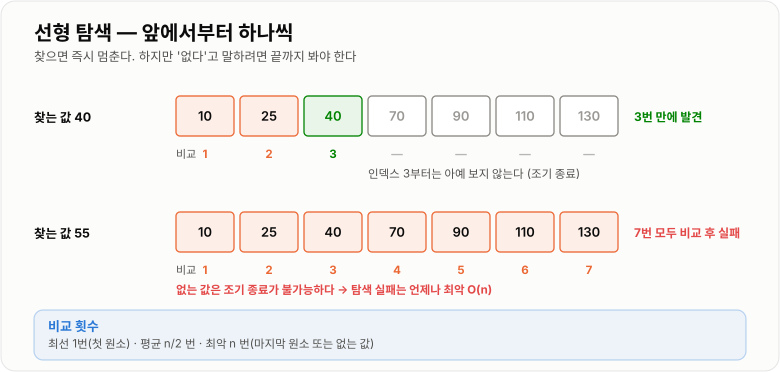
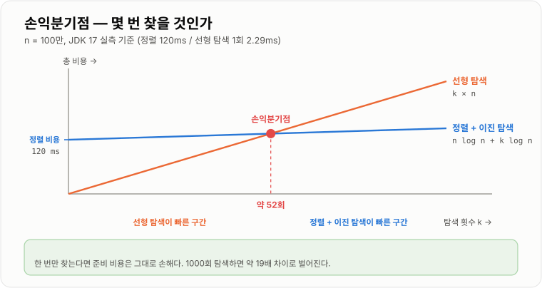

# 선형 탐색

> **선형 탐색(Linear Search)은 처음부터 끝까지 하나씩 확인하며 찾는 방법으로, 데이터에 아무 전제도 요구하지 않는 유일한 탐색이다.**

---

## 1. 핵심 요약

* 앞에서부터 **하나씩 비교**하며 원하는 값을 찾는다. 찾으면 즉시 멈추고, 끝까지 못 찾으면 실패다.
* 시간 복잡도는 **O(n)**, 공간 복잡도는 **O(1)** 이다.
* **정렬·인덱스·해시 같은 사전 준비가 전혀 필요 없다.** 이것이 다른 모든 탐색과 구분되는 유일하고 결정적인 특징이다.
* 데이터가 작거나, 한 번만 찾거나, 조건이 복잡해 인덱스를 못 쓸 때는 **선형 탐색이 정답**이다.
* 실무에서 성능 문제로 자주 지목되는 것들 — DB **풀 테이블 스캔**, 반복문 안의 `List.contains()` — 은 전부 선형 탐색이다. 문제는 선형 탐색 자체가 아니라 **반복 횟수**다.

---

## 2. 등장 배경

### 해결하려는 문제

"이 데이터 안에 내가 찾는 값이 있는가?"는 프로그래밍에서 가장 자주 나오는 질문이다. 그런데 이 질문에 답하려면 보통 조건이 붙는다.

* 이진 탐색을 쓰려면 → **정렬되어 있어야 한다**
* 해시 조회를 쓰려면 → **해시 테이블을 미리 만들어 두어야 한다**
* DB 인덱스를 쓰려면 → **그 컬럼에 인덱스를 걸어 두어야 한다**

문제는 **그 전제를 만드는 비용이 공짜가 아니라는 것**이다. 정렬은 O(n log n)이고, 해시 테이블 구축은 O(n)이며 메모리를 추가로 쓴다. 인덱스는 디스크 공간을 차지하고 쓰기 성능을 떨어뜨린다.

그리고 애초에 **전제를 만들 수 없는 상황**도 많다.

* 데이터가 매 순간 바뀌어서 정렬 상태를 유지할 수 없다
* 찾는 조건이 "이름이 김으로 시작하고 나이가 30 이상이며 마지막 로그인이 7일 이내" 같은 복합 조건이라 어떤 키로도 정렬할 수 없다
* 데이터가 스트림으로 흘러와서 전체를 한 번에 볼 수 없다

선형 탐색은 이 모든 제약에서 자유롭다. **아무 전제 없이, 어떤 조건으로든, 지금 당장 찾을 수 있다.**

### 이 개념이 없을 때

선형 탐색이라는 선택지를 아예 배제하면 이런 일이 벌어진다.

```java
// 리스트에서 id가 3인 회원을 한 번 찾고 싶을 뿐인데...
List<Member> members = repository.findAll();   // 20개

// 이진 탐색을 쓰겠다고 정렬부터 한다
Collections.sort(members, new Comparator<Member>() {
    public int compare(Member a, Member b) {
        return Long.compare(a.getId(), b.getId());
    }
});                                             // O(n log n)
int idx = Collections.binarySearch(members, probe, comparator);
```

20개짜리 리스트를 정렬하는 비용이 그냥 20번 훑는 비용보다 크다. **한 번만 찾을 거라면 준비 비용을 회수할 기회 자체가 없다.**

반대 방향의 문제도 있다.

```java
// 정렬을 안 하고 이진 탐색을 쓰면
int[] data = {50, 40, 30, 20, 10};
int idx = Arrays.binarySearch(data, 10);   // -1  ← 있는데도 못 찾는다
```

이진 탐색은 정렬 전제가 깨져도 **예외를 던지지 않고 조용히 틀린 답을 준다.** (JDK 17 실측) 선형 탐색은 이런 함정이 없다. 전제가 없으니 깨질 전제도 없다.

정리하면 선형 탐색의 가치는 이렇다.

* **준비 비용이 0이다** — 지금 있는 데이터를 그대로 쓴다
* **어떤 조건으로도 찾을 수 있다** — 정렬 키에 묶이지 않는다
* **틀릴 여지가 없다** — 전제가 깨져서 오답이 나오는 일이 없다

---

## 3. 핵심 개념

| 개념                  | 설명                                          | 중요한 이유                                     |
| ------------------- | ------------------------------------------- | ------------------------------------------ |
| **순차 접근**           | 첫 번째 원소부터 순서대로 하나씩 확인한다                     | 인덱스 계산이나 건너뛰기가 없어 어떤 자료구조에도 적용된다           |
| **조기 종료(early exit)** | 찾는 즉시 반복을 멈춘다                               | 평균 비교 횟수를 절반으로 줄이는 실질적인 최적화다               |
| **최선 O(1)**         | 찾는 값이 첫 번째에 있는 경우                           | "O(n)이니까 항상 느리다"가 왜 틀린 말인지 보여준다            |
| **평균 O(n/2)**       | 값이 어디에 있을지 균등하다고 가정할 때                      | 상수 배수는 빅오에서 사라지지만 실제 체감 성능에는 영향을 준다        |
| **최악 O(n)**         | 마지막에 있거나 아예 없는 경우                           | **없는 값을 찾을 때는 항상 최악**이라는 점이 실무에서 중요하다      |
| **탐색 실패**           | 끝까지 갔는데 없는 경우                               | 실패 판정 비용이 성공보다 크다는 비대칭이 존재한다               |
| **전제 조건 없음**        | 정렬·인덱스·해시 어느 것도 요구하지 않는다                    | 선형 탐색의 존재 이유 그 자체다                         |
| **복합 조건 탐색**        | 여러 필드를 동시에 보는 조건으로 찾기                       | 정렬·인덱스로는 표현할 수 없는 조건도 그대로 처리한다             |
| **손익분기점**           | 준비 비용을 회수하려면 몇 번 찾아야 하는가                    | 선형 탐색을 쓸지 말지 결정하는 실제 기준이다                  |
| **캐시 지역성**          | 연속된 메모리를 순서대로 읽는 접근 패턴                      | 같은 O(n)이라도 배열이 연결 리스트보다 훨씬 빠른 이유다          |
| **보초법(sentinel)**   | 끝에 찾는 값을 미리 넣어 범위 검사를 없애는 기법                | 비교 횟수를 줄이는 고전 최적화지만 현대 JVM에서는 효과가 미미하다     |

개념들의 관계는 다음과 같다.

```text
                     찾을 값이 있는가?
                            │
          ┌─────────────────┴─────────────────┐
       있다 (성공)                         없다 (실패)
          │                                   │
   위치에 따라 1 ~ n 번                    항상 n 번 비교
   평균 n/2 번                              (조기 종료 불가)
          │                                   │
          └────────── 둘 다 O(n) ─────────────┘
```

---

## 4. 구조와 동작 원리

### 기본 동작

```text
찾는 값: 40

배열:  [ 10 ][ 25 ][ 40 ][ 70 ][ 90 ]
index     0     1     2     3     4

1회차:  i=0  →  10 == 40 ?  아니오  →  다음
2회차:  i=1  →  25 == 40 ?  아니오  →  다음
3회차:  i=2  →  40 == 40 ?  예     →  인덱스 2 반환, 즉시 종료

비교 횟수: 3회  (i=3, i=4는 아예 보지 않는다)
```

찾는 값이 없을 때는 다르다.

```text
찾는 값: 55

배열:  [ 10 ][ 25 ][ 40 ][ 70 ][ 90 ]

1회차:  10 == 55 ?  아니오
2회차:  25 == 55 ?  아니오
3회차:  40 == 55 ?  아니오
4회차:  70 == 55 ?  아니오
5회차:  90 == 55 ?  아니오
       → 배열 끝 도달 → -1 반환 (없음)

비교 횟수: 5회  ← 끝까지 다 봐야만 "없다"고 말할 수 있다
```

이 **비대칭**이 실무에서 중요하다. 찾기 성공은 평균 n/2에서 끝나지만, **찾기 실패는 언제나 n번을 다 쓴다.** "캐시에 없는 값을 계속 조회하는" 패턴이 유독 느린 이유가 여기에 있다.

### 위치에 따른 비교 횟수

```text
n = 8 인 배열에서 값을 찾을 때

찾는 값의 위치 :  0   1   2   3   4   5   6   7   없음
비교 횟수      :  1   2   3   4   5   6   7   8    8
                 ↑                           ↑    ↑
              최선 O(1)                   최악 O(n)

평균 = (1+2+3+4+5+6+7+8) / 8 = 4.5 ≈ n/2
```



*값을 찾으면 즉시 멈추지만, 없는 값을 찾을 때는 언제나 끝까지 봐야 한다.*

### 손익분기점 — 언제 선형 탐색을 버려야 하는가

선형 탐색을 쓸지 말지는 "O(n)이라서 나쁘다"로 결정하는 게 아니라 **총비용**으로 결정한다.

```text
n개 데이터에서 k번 탐색한다고 하자.

방법 A. 선형 탐색만 사용
    총비용 = k × n

방법 B. 정렬한 뒤 이진 탐색
    총비용 = n log n  (한 번의 준비)  +  k × log n

방법 C. HashMap 구축 후 조회
    총비용 = n  (한 번의 준비)  +  k × 1
```

n = 1,000,000 일 때 대략적인 비교는 다음과 같다.

| 탐색 횟수 k | A. 선형 탐색 | B. 정렬 + 이진 탐색 | C. HashMap | 유리한 쪽 |
| -------: | ---------: | -------------: | ---------: | ----- |
|        1 | 1,000,000 |     20,000,020 |  1,000,001 | **A** |
|       10 | 10,000,000 |     20,000,200 |  1,000,010 | **C** |
|      100 | 100,000,000 |    20,002,000 |  1,000,100 | **C** |
|   10,000 | 10,000,000,000 |   20,200,000 |  1,010,000 | **C** |

결론은 **탐색 횟수 k가 판단 기준**이라는 것이다.

* **k = 1** → 준비 비용을 회수할 기회가 없다. 선형 탐색이 이긴다.
* **k가 크다** → 준비 비용이 분산된다. 해시나 인덱스가 압도적으로 이긴다.



*한 번만 찾는다면 준비 비용이 곧 손해이고, 반복해서 찾는다면 준비 비용은 금방 회수된다.*

### 자료구조에 따른 실제 속도 차이

같은 O(n)이라도 **메모리 접근 패턴** 때문에 실제 속도는 크게 다르다.

```text
int[]        [10][25][40][70][90]        연속된 메모리
                                          → 캐시 라인 하나에 여러 개가 함께 올라온다

LinkedList   [10]→[25]→[40]→[70]→[90]    흩어진 노드
                                          → 원소마다 포인터를 따라가며 캐시 미스
```

JDK 17에서 20만 개를 전부 순회한 실측 결과다.

| 자료구조         | 전체 순회 시간 | 배열 대비 |
| ------------ | -------: | ----: |
| `int[]`      |  0.11 ms |    1배 |
| `ArrayList`  |  1.59 ms |  약 14배 |
| `LinkedList` |  2.24 ms |  약 20배 |

`ArrayList`가 `int[]`보다 느린 이유는 **박싱된 `Integer` 객체를 참조로 따라가야** 하기 때문이고, `LinkedList`가 더 느린 이유는 **노드가 메모리에 흩어져 있어** 캐시 미스가 계속 나기 때문이다.

빅오는 같아도 **상수 배수가 20배 차이 난다.** "복잡도가 같으니 아무거나 써도 된다"가 틀린 말인 대표적인 사례다.

---

## 5. 코드 또는 사용 예시

### 기본 구현

```java
public class LinearSearch {

    /** 값을 찾으면 인덱스를, 없으면 -1을 반환한다. */
    public static int indexOf(int[] array, int target) {
        for (int i = 0; i < array.length; i++) {
            if (array[i] == target) {
                return i;          // 찾는 즉시 종료
            }
        }
        return -1;                 // 끝까지 못 찾음
    }

    public static void main(String[] args) {
        int[] data = {10, 25, 40, 70, 90};

        System.out.println(indexOf(data, 40));   // 2
        System.out.println(indexOf(data, 10));   // 0  (최선)
        System.out.println(indexOf(data, 90));   // 4  (최악 - 마지막)
        System.out.println(indexOf(data, 55));   // -1 (최악 - 없음)
    }
}
```

각 부분의 의미는 다음과 같다.

```java
return i;
```

**조기 종료**다. 이 한 줄이 평균 비교 횟수를 n에서 n/2로 줄인다. 빅오는 그대로 O(n)이지만 실제 실행 시간은 절반이 된다.

```java
return -1;
```

"없음"을 나타내는 관례적인 값이다. Java 표준 라이브러리(`List.indexOf`, `String.indexOf`)도 같은 규약을 쓴다. 이진 탐색이 `-(삽입점)-1`을 반환하는 것과는 다르다.

### 객체를 찾을 때 — `==` 대신 `equals`

```java
import java.util.List;

public class ObjectSearch {

    public static class Member {
        private final Long id;
        private final String name;

        public Member(Long id, String name) {
            this.id = id;
            this.name = name;
        }

        public Long getId() {
            return id;
        }

        public String getName() {
            return name;
        }
    }

    /** id로 회원을 찾는다. 못 찾으면 null. */
    public static Member findById(List<Member> members, Long targetId) {
        for (int i = 0; i < members.size(); i++) {
            Member m = members.get(i);
            if (m.getId().equals(targetId)) {    // == 이 아니라 equals
                return m;
            }
        }
        return null;
    }
}
```

`Long`을 `==`로 비교하면 값이 아니라 **참조**를 비교하게 된다. `Long` 캐시 범위(-128~127)를 벗어나면 같은 값이라도 다른 객체라 `false`가 나온다. 실무에서 자주 나오는 버그다.

### 복합 조건 탐색 — 선형 탐색만 할 수 있는 일

```java
import java.util.ArrayList;
import java.util.List;

public class ComplexConditionSearch {

    public static class Product {
        private final String name;
        private final String category;
        private final int price;
        private final int stock;

        public Product(String name, String category, int price, int stock) {
            this.name = name;
            this.category = category;
            this.price = price;
            this.stock = stock;
        }

        public String getName() { return name; }
        public String getCategory() { return category; }
        public int getPrice() { return price; }
        public int getStock() { return stock; }
    }

    /**
     * "전자제품 카테고리이면서, 가격이 10만원 이하이고, 재고가 남은" 상품.
     * 이런 복합 조건은 어떤 키로 정렬해도 이진 탐색으로 만들 수 없다.
     */
    public static List<Product> findAvailable(List<Product> products) {
        List<Product> result = new ArrayList<>();
        for (int i = 0; i < products.size(); i++) {
            Product p = products.get(i);
            if (p.getCategory().equals("전자제품")
                    && p.getPrice() <= 100000
                    && p.getStock() > 0) {
                result.add(p);
            }
        }
        return result;
    }
}
```

이진 탐색은 **하나의 정렬 기준**을 따라 범위를 좁히는 방법이다. 조건이 세 개면 어떤 순서로 정렬해도 세 조건을 동시에 만족하는 구간을 만들 수 없다. **조건이 복잡해질수록 선형 탐색의 상대적 가치가 올라간다.**

### 최댓값 찾기 — 정렬로 대체하면 손해다

```java
public class MaxFinder {

    public static int max(int[] array) {
        if (array.length == 0) {
            throw new IllegalArgumentException("빈 배열입니다.");
        }
        int best = array[0];
        for (int i = 1; i < array.length; i++) {
            if (array[i] > best) {
                best = array[i];
            }
        }
        return best;
    }
}
```

"최댓값을 구하려고 정렬한 뒤 마지막 원소를 꺼내는" 코드를 실무에서 자주 본다. 이는 O(n)으로 끝날 일을 **O(n log n)으로 만드는 것**이다. 한 번 훑으면 되는 일에 정렬을 쓰면 안 된다.

### 선형 탐색이 이기는 순간 — 실측

앞의 손익분기점 표를 실제로 확인해 보면 이렇다. (JDK 17, 100만 개 `int[]`)

```text
선형 탐색 1회 (최악, 맨 끝)  :   2.29 ms
정렬 1회                     : 120.13 ms
이진 탐색 1000회             :   0.786 ms
```

**정렬 한 번(120ms)이 선형 탐색 52번(2.29ms × 52)과 맞먹는다.** 탐색을 52번 미만으로 할 거라면 정렬하지 않고 그냥 훑는 편이 빠르다는 뜻이다.

반대로 1000번을 탐색한다면 선형 탐색은 2290ms가 걸리는데, 정렬 + 이진 탐색은 121ms다. **약 19배 차이**다.

---

## 6. 성능 특성

| 상황               | 시간 복잡도 | 비교 횟수 | 설명                     |
| ---------------- | -----: | ----: | ---------------------- |
| 최선 (첫 번째 원소)     |   O(1) |     1 | 조기 종료가 바로 발동한다         |
| 평균 (있는 값, 균등 분포) |   O(n) |   n/2 | 상수 배수 1/2는 빅오에서 사라진다   |
| 최악 (마지막 원소)      |   O(n) |     n | 끝까지 가야 찾는다             |
| **탐색 실패 (없는 값)** |   O(n) |     n | **항상 최악이다. 조기 종료가 불가능** |
| 조건에 맞는 것 전부 찾기   |   O(n) |     n | 조기 종료 자체를 쓸 수 없다       |

공간 복잡도는 **O(1)** 이다. 인덱스 변수 하나 외에는 추가 메모리를 전혀 쓰지 않는다. 이진 탐색(O(1))과는 같고, 해시 테이블(O(n))이나 정렬용 임시 배열(O(n))과는 다르다.

### 데이터가 커질 때

선형 탐색은 **n에 정확히 비례한다.** 데이터가 10배 늘면 시간도 10배 늘어난다. 이 선형성이 장점이자 단점이다.

| n            | 대략적인 순회 시간 (`int[]` 기준) | 배수     |
| ------------ | --------------------: | ------ |
| 200,000      |               0.11 ms | 1배     |
| 1,000,000    |               2.29 ms | 약 5배  |
| 100,000,000  |               약 230 ms | 약 500배 |

로그 시간 알고리즘과 비교하면 격차가 극명하다.

```text
n = 1,000,000

선형 탐색   : 최대 1,000,000 번 비교
이진 탐색   : 최대        20 번 비교   (실측 확인)
해시 조회   :             1 번 비교

n = 1,000,000,000 (1000배)

선형 탐색   : 최대 1,000,000,000 번 비교  (1000배 증가)
이진 탐색   : 최대            30 번 비교  (10번만 증가)
해시 조회   :                 1 번 비교  (변화 없음)
```

**n이 1000배가 되어도 이진 탐색은 비교 횟수가 10번밖에 안 늘어난다.** 이것이 대용량에서 선형 탐색을 버려야 하는 이유다.

### 조기 종료의 실제 효과

빅오만 보면 조기 종료는 의미가 없어 보인다. O(n)이든 O(n/2)든 똑같이 O(n)이기 때문이다. 하지만 실무에서는 **절반의 시간**이다.

```text
100만 개에서 값을 찾을 때

조기 종료 있음 : 평균 50만 번 비교  →  약 1.1 ms
조기 종료 없음 : 항상 100만 번 비교  →  약 2.3 ms
```

빅오는 알고리즘을 **선택**할 때 쓰는 도구이고, 상수 배수는 선택한 알고리즘을 **개선**할 때 쓰는 도구다. 둘은 목적이 다르다.

---

## 7. 장점과 단점

| 장점                | 이유                                             |
| ----------------- | ---------------------------------------------- |
| 사전 준비가 전혀 필요 없다   | 정렬·인덱스·해시 테이블 구축 비용이 0이다                       |
| 어떤 조건으로도 찾을 수 있다  | 정렬 키에 묶이지 않아 복합 조건·계산식 조건도 그대로 쓴다              |
| 어떤 자료구조에도 적용된다    | 배열·리스트·스트림·파일 등 순차 접근만 되면 쓸 수 있다               |
| 추가 메모리를 쓰지 않는다    | 공간 복잡도 O(1)이라 메모리 제약이 심한 환경에서 유리하다             |
| 구현이 단순해 버그가 없다    | 반복문 하나라 경계 조건 실수가 나올 여지가 거의 없다                 |
| 전제가 깨져서 틀릴 일이 없다  | 이진 탐색처럼 "정렬이 안 됐는데 조용히 오답"이 나오는 함정이 없다         |
| 데이터가 자주 바뀌어도 괜찮다  | 정렬 상태나 인덱스를 유지하는 비용이 없다                        |
| 작은 데이터에서는 실제로 가장 빠르다 | 상수 배수가 작고 캐시 친화적이라 수십~수백 개 규모에서는 해시보다도 빠를 수 있다 |

| 단점                     | 이유 및 주의점                                    |
| ---------------------- | ------------------------------------------- |
| n에 비례해 선형으로 느려진다       | 데이터가 10배면 시간도 10배다. 대용량에서 치명적이다             |
| 탐색 실패는 항상 최악이다         | 없는 값을 찾을 때는 조기 종료가 불가능해 매번 n번을 다 쓴다         |
| 반복 호출하면 비용이 그대로 곱해진다   | 반복문 안에 `contains()`를 넣으면 O(n²)가 된다          |
| 정렬 정보를 전혀 활용하지 못한다     | 이미 정렬된 데이터라도 이진 탐색보다 훨씬 느리다                 |
| 범위 조회에 부적합하다           | "30 이상 50 이하"를 찾아도 전체를 훑어야 한다               |
| 연결 리스트에서는 상수 배수가 크다    | 캐시 미스 때문에 같은 O(n)이라도 배열보다 20배 가까이 느리다       |
| 조건에 맞는 것을 전부 찾을 때는 최적화 여지가 없다 | 조기 종료를 쓸 수 없어 언제나 n번을 다 쓴다                  |

---

## 8. 사용 기준

### 사용하기 좋은 상황

* 데이터가 **작을 때** (대략 수십~수백 개 이하)
* **한 번만** 찾을 때 — 준비 비용을 회수할 기회가 없다
* 조건이 **복잡하거나 계산식**이라 정렬·인덱스로 표현할 수 없을 때
* 데이터가 **정렬되어 있지 않고**, 정렬할 이유도 없을 때
* 데이터가 **자주 변경**되어 정렬 상태나 인덱스 유지 비용이 클 때
* **조건에 맞는 것을 전부** 찾아야 할 때 (어차피 전체를 봐야 한다)
* 최댓값·최솟값·합계처럼 **한 번의 순회로 끝나는** 집계
* 순차 접근만 가능한 **스트림·파일**을 다룰 때

### 사용하지 않는 것이 좋은 상황

* 데이터가 **크고**(수만 개 이상) 탐색을 **반복**할 때 → `HashMap`
* 정렬된 데이터에서 값이나 범위를 찾을 때 → **이진 탐색**
* 정확히 일치하는 키로 자주 조회할 때 → **`HashMap`** (O(1))
* 범위 조회나 정렬된 순회가 필요할 때 → **`TreeMap`** (O(log n))
* DB에서 대량 데이터를 조건으로 거를 때 → **인덱스**
* 반복문 안에서 매번 찾아야 할 때 → 미리 `Map`으로 만들어 두기

### 선택 기준

1. **탐색을 몇 번 할 것인가?** — 1~수십 번이면 선형 탐색, 수백 번 이상이면 자료구조 전환
2. **n이 얼마나 큰가?** — 수백 개 이하면 선형 탐색으로 충분하다
3. **조건이 정렬 가능한 형태인가?** — 아니면 선형 탐색 외에 선택지가 없다
4. **데이터가 자주 바뀌는가?** — 자주 바뀌면 정렬·인덱스 유지 비용이 손해다
5. **없는 값을 자주 찾는가?** — 그렇다면 매번 최악이므로 반드시 해시로 바꾼다

```text
        탐색 횟수는?
             │
    ┌────────┴────────┐
  1~수십 번          수백 번 이상
    │                  │
 선형 탐색         조건이 정확히 일치?
                       │
              ┌────────┴────────┐
            예                 아니오(범위·복합)
              │                  │
          HashMap        정렬 + 이진 탐색 / TreeMap / DB 인덱스
```

---

## 9. 비슷한 개념 비교

### 선형 탐색과 이진 탐색

| 비교 항목  | 선형 탐색           | 이진 탐색                 | 선택 기준          |
| ------ | --------------- | --------------------- | -------------- |
| 목적     | 전제 없이 찾기        | 정렬을 활용해 빠르게 찾기        | 정렬 여부          |
| 전제 조건  | **없음**          | **반드시 정렬되어 있어야 함**    | 정렬 비용을 감당하는가   |
| 시간 복잡도 | O(n)            | O(log n)              | n의 크기          |
| n=100만 | 최대 100만 번 비교    | 최대 20번 비교 (실측)        | 대용량이면 이진 탐색    |
| 자료구조 제약 | 순차 접근만 되면 됨     | 임의 접근(배열)이 필요         | `LinkedList`면 선형 |
| 복합 조건  | 가능              | 불가능 (정렬 키 하나만)        | 조건의 복잡도        |
| 전제 위반 시 | 해당 없음           | **조용히 틀린 답을 반환**      | 안전성            |
| 데이터 변경 | 영향 없음           | 정렬 상태 유지 비용 발생        | 변경 빈도          |
| 적합한 상황 | 소량·1회·복잡 조건     | 대량·반복·정렬됨             | 손익분기점으로 판단     |

### 선형 탐색과 해시 조회

| 비교 항목    | 선형 탐색     | 해시 조회 (`HashMap`)      | 선택 기준         |
| -------- | --------- | --------------------- | ------------- |
| 목적       | 준비 없이 찾기  | 준비하고 즉시 찾기            | 반복 횟수         |
| 준비 비용    | 0         | O(n) 시간 + O(n) 메모리    | 회수 가능한가       |
| 조회 비용    | O(n)      | O(1) 평균               | 압도적으로 해시      |
| 추가 메모리   | O(1)      | O(n)                  | 메모리 제약        |
| 조건 유연성   | 어떤 조건도 가능 | **키 완전 일치만**          | 조건의 형태        |
| 범위 조회    | 가능        | 불가능                   | 범위가 필요하면 선형/트리 |
| 순서 보존    | 원본 순서 그대로 | 보존 안 됨 (`LinkedHashMap` 필요) | 순서가 중요한가      |
| `null` 처리 | 자유롭다      | 키 `null` 1개만 허용       | 데이터 특성        |
| 적합한 상황   | 소량·1회·복합 조건 | 대량·반복·정확히 일치          | k와 n으로 판단     |

### 선형 탐색과 DB 풀 스캔

| 비교 항목  | 애플리케이션 선형 탐색     | DB 풀 테이블 스캔            | 선택 기준          |
| ------ | ---------------- | ---------------------- | -------------- |
| 대상     | 메모리 위의 컬렉션       | 디스크 위의 테이블             | 데이터 위치         |
| 단위 비용  | 나노초 (메모리 접근)     | 밀리초 (디스크 I/O)          | **약 100만 배 차이** |
| 같은 원리  | 처음부터 끝까지 확인      | 모든 데이터 페이지를 읽음         | 원리는 동일         |
| 개선 방법  | `HashMap`으로 전환   | 인덱스 생성                 | 둘 다 "사전 준비"    |
| 오히려 유리한 경우 | n이 작을 때          | 테이블의 상당 비율을 읽을 때       | 선택도(selectivity) |
| 확인 방법  | 프로파일러            | `EXPLAIN` 실행 계획        | 도구가 다름         |
| 적합한 상황 | 소량 데이터           | 소규모 테이블, 대량 집계         | 원리는 같고 규모만 다르다 |

**DB에서도 풀 스캔이 항상 나쁜 것은 아니다.** 테이블의 20~30% 이상을 읽어야 한다면 인덱스를 타고 랜덤 I/O를 반복하는 것보다 순차적으로 전체를 읽는 편이 빠르다. 옵티마이저가 인덱스를 무시하고 풀 스캔을 고르는 것은 대부분 옳은 판단이다.

---

## 10. 백엔드 실무 적용

### Spring·Java

가장 흔한 성능 문제는 **반복문 안의 선형 탐색**이다.

```java
// 나쁜 예 — O(n × m)
public List<OrderDto> toDto(List<Order> orders, List<Member> members) {
    List<OrderDto> result = new ArrayList<>();
    for (int i = 0; i < orders.size(); i++) {
        Order order = orders.get(i);
        Member found = null;
        for (int j = 0; j < members.size(); j++) {       // ← 매번 전체 순회
            if (members.get(j).getId().equals(order.getMemberId())) {
                found = members.get(j);
                break;
            }
        }
        result.add(new OrderDto(order, found));
    }
    return result;
}
```

주문 1만 건 × 회원 1만 명이면 **최대 1억 번**의 비교가 일어난다.

```java
// 좋은 예 — O(n + m)
public List<OrderDto> toDto(List<Order> orders, List<Member> members) {
    Map<Long, Member> memberMap = new HashMap<>();
    for (int i = 0; i < members.size(); i++) {           // 준비 O(m)
        memberMap.put(members.get(i).getId(), members.get(i));
    }

    List<OrderDto> result = new ArrayList<>();
    for (int i = 0; i < orders.size(); i++) {            // 조회 O(n) × O(1)
        Order order = orders.get(i);
        Member found = memberMap.get(order.getMemberId());
        result.add(new OrderDto(order, found));
    }
    return result;
}
```

1억 번이 **2만 번**으로 줄어든다. 이것이 손익분기점 이론의 실무 버전이다. 탐색을 1만 번 할 것이므로 준비 비용 1만은 즉시 회수된다.

같은 문제가 `List.contains()`로도 나타난다.

```java
// List.contains 는 내부적으로 선형 탐색이다
List<Long> blockedIds = loadBlockedIds();          // 5만 건
for (int i = 0; i < users.size(); i++) {           // 10만 명
    if (blockedIds.contains(users.get(i).getId())) {   // ← O(5만)
        continue;
    }
}
// 총 50억 번 비교

// Set 으로 바꾸면
Set<Long> blockedIds = new HashSet<>(loadBlockedIds());
// 총 10만 번 비교
```

**"리스트를 세트로 바꾸기"는 실무에서 가장 자주 쓰는, 그리고 가장 효과가 큰 최적화다.**

주의할 점도 있다. **작은 데이터에서는 오히려 선형 탐색이 빠르다.**

```text
원소 10개짜리에서 조회할 때
    List.contains  : 평균 5번 비교, 캐시에 다 올라와 있음
    HashSet.contains : 해시 계산 + 버킷 접근 + equals 비교

  → 이 규모에서는 HashSet 을 만드는 비용이 더 크다
```

`HashSet`을 만드는 데도 O(n) 시간과 O(n) 메모리가 든다. **10개짜리 리스트를 `HashSet`으로 바꾸는 것은 최적화가 아니라 오버엔지니어링이다.**

### 데이터베이스·캐시

DB에서 선형 탐색에 해당하는 것이 **풀 테이블 스캔**이다. 실행 계획에서 확인한다.

```text
MySQL EXPLAIN 결과

type: ALL          ← 풀 테이블 스캔 (선형 탐색)
type: index        ← 인덱스 풀 스캔
type: range        ← 인덱스 범위 스캔
type: ref          ← 인덱스로 일치하는 행 찾기
type: const        ← 기본키로 1건 (해시 조회에 해당)

왼쪽으로 갈수록 느리다.
```

인덱스가 있는데도 풀 스캔이 되는 대표적인 원인들이다.

```sql
-- 1. 컬럼에 함수를 씌우면 인덱스를 못 쓴다
SELECT * FROM orders WHERE DATE(created_at) = '2026-07-27';   -- 풀 스캔
SELECT * FROM orders WHERE created_at >= '2026-07-27'
                      AND created_at <  '2026-07-28';         -- 인덱스 사용

-- 2. 앞에 와일드카드가 붙은 LIKE
SELECT * FROM members WHERE name LIKE '%수';                  -- 풀 스캔
SELECT * FROM members WHERE name LIKE '김%';                  -- 인덱스 사용

-- 3. 타입이 다르면 암묵적 형변환이 일어나 인덱스를 못 쓴다
SELECT * FROM members WHERE phone = 01012345678;              -- phone 이 VARCHAR 면 풀 스캔
SELECT * FROM members WHERE phone = '01012345678';            -- 인덱스 사용
```

세 가지 모두 원리는 같다. **인덱스는 컬럼 원래 값으로 정렬되어 있으므로, 값을 변형하는 순간 정렬 순서를 활용할 수 없게 된다.** 이진 탐색의 전제가 깨지는 것과 정확히 같은 이야기다.

캐시 쪽에서도 같은 함정이 있다.

```text
Redis 에서 절대 쓰면 안 되는 명령

KEYS *          → 전체 키를 선형 탐색한다. Redis 는 단일 스레드라
                  이 명령이 도는 동안 다른 모든 요청이 멈춘다.
SCAN 0 COUNT 100 → 커서 기반으로 나눠서 순회한다. 운영 환경에서는 이것을 쓴다.
```

### 동시성·분산 환경

* 여러 스레드가 같은 리스트를 순회하는 도중 다른 스레드가 수정하면 `ConcurrentModificationException`이 난다. 선형 탐색은 순회이므로 항상 이 위험에 노출된다. `CopyOnWriteArrayList`나 외부 동기화가 필요하다.
* 선형 탐색은 **읽기만 하므로 병렬화하기 쉽다.** 배열을 코어 수만큼 나눠 각자 훑으면 거의 선형으로 빨라진다. 다만 조기 종료가 있으면 다른 스레드에게 "찾았으니 멈추라"고 알리는 비용이 붙는다.
* 분산 환경에서 여러 노드에 흩어진 데이터를 찾는 것도 선형 탐색이다. 그래서 **샤딩 키**를 정해 두고 "이 데이터는 몇 번 샤드에 있다"를 계산으로 알아내는 것이다. 이는 분산 시스템 규모의 해시 조회다.

---

## 11. 자주 하는 오해

| 잘못된 이해                         | 올바른 이해                                                            |
| ------------------------------ | ----------------------------------------------------------------- |
| 선형 탐색은 느리니까 항상 피해야 한다          | n이 작거나 탐색이 1회면 가장 빠르다. 준비 비용이 0이기 때문이다                            |
| O(n)이니까 데이터 개수만큼 무조건 비교한다      | 찾으면 즉시 멈춘다. 평균은 n/2이고 최선은 1번이다                                    |
| 탐색 성공과 실패의 비용은 비슷하다            | **실패는 언제나 n번을 다 쓴다.** 조기 종료가 불가능하기 때문이다                           |
| `List`를 `HashSet`으로 바꾸면 항상 빨라진다 | 구축에 O(n) 시간과 O(n) 메모리가 든다. 조회를 몇 번 할 것인지로 판단해야 한다                 |
| 복잡도가 같으면 실제 성능도 비슷하다           | 20만 개 순회에서 `int[]` 0.11ms, `LinkedList` 2.24ms로 약 20배 차이가 난다 (실측) |
| DB 풀 스캔은 무조건 잘못된 쿼리다           | 테이블의 상당 비율을 읽어야 한다면 인덱스보다 풀 스캔이 빠르다. 옵티마이저의 정상적인 판단이다             |
| 인덱스만 만들면 풀 스캔이 사라진다            | 컬럼에 함수를 쓰거나 앞 와일드카드 `LIKE`를 쓰면 인덱스가 있어도 못 탄다                      |
| 선형 탐색은 배열에서만 쓴다                | 순차 접근만 되면 무엇에든 쓴다. 리스트·파일·네트워크 스트림 모두 가능하다                        |
| 조기 종료는 빅오가 같으니 의미 없는 최적화다      | 빅오는 같아도 실행 시간은 절반이다. 빅오는 선택의 도구, 상수는 개선의 도구다                      |
| 최댓값을 구하려면 정렬한 뒤 마지막을 보면 된다     | O(n)으로 끝날 일을 O(n log n)으로 만드는 것이다. 한 번 훑으면 된다                     |
| `Long`을 `==`로 비교해도 값이 같으면 된다   | -128~127 캐시 범위 밖에서는 참조 비교가 되어 `false`가 나온다. `equals`를 써야 한다       |
| 이진 탐색은 항상 선형 탐색보다 낫다           | 정렬 비용(100만 개에서 약 120ms)을 회수하려면 약 52번 이상 탐색해야 한다 (실측)              |

---

## 12. 면접 답변

### 기본 답변

선형 탐색은 처음부터 끝까지 하나씩 비교하며 찾는 방법으로, 시간 복잡도는 O(n), 공간 복잡도는 O(1)입니다.

가장 큰 특징은 **정렬이나 인덱스 같은 사전 전제가 전혀 필요 없다**는 점입니다. 이진 탐색은 정렬을, 해시 조회는 해시 테이블 구축을 요구하지만 선형 탐색은 지금 있는 데이터를 그대로 씁니다. 찾으면 즉시 종료하므로 평균 비교 횟수는 n/2이지만, **없는 값을 찾을 때는 끝까지 봐야 하므로 항상 최악인 n번**이 됩니다.

장점은 준비 비용이 0이고, 정렬 키에 묶이지 않아 복합 조건으로도 찾을 수 있으며, 어떤 자료구조에도 적용된다는 점입니다. 단점은 n에 비례해 느려지고, 반복 호출하면 비용이 그대로 곱해진다는 점입니다.

그래서 판단 기준은 복잡도가 아니라 **총비용**입니다. n개에서 k번 찾는다면 선형 탐색은 k×n이고 해시는 n + k입니다. k가 1이면 선형 탐색이 이기고, k가 크면 해시가 압도적으로 이깁니다. 실측해 보면 100만 개 배열에서 정렬 한 번이 120ms인데 선형 탐색 한 번은 2.3ms라, 약 52번 미만으로 찾을 거라면 정렬하지 않는 편이 빠릅니다.

실무에서는 반복문 안의 `List.contains()`가 O(n²)를 만드는 경우가 가장 흔하며, 미리 `Map`이나 `Set`으로 만들어 두면 O(n)으로 줄어듭니다. DB의 풀 테이블 스캔도 같은 원리이고, 컬럼에 함수를 씌우거나 앞 와일드카드 `LIKE`를 쓰면 인덱스가 있어도 풀 스캔이 됩니다.

### 답변 구조

* **정의**

    * 처음부터 끝까지 순차적으로 비교하며 찾는 탐색
    * 정렬·인덱스·해시 어떤 전제도 요구하지 않는 유일한 탐색

* **내부 원리**

    * 인덱스 0부터 하나씩 비교, 일치하면 즉시 반환(조기 종료)
    * 끝까지 못 찾으면 `-1` 반환
    * 순차 접근만 하므로 배열·리스트·스트림 어디에나 적용

* **복잡도**

    * 시간: 최선 O(1), 평균 O(n/2), 최악 O(n)
    * **탐색 실패는 항상 O(n)** — 조기 종료 불가
    * 공간: O(1)
    * 실측(JDK 17): 20만 개 순회 `int[]` 0.11ms / `LinkedList` 2.24ms

* **장점**

    * 준비 비용 0, 추가 메모리 0
    * 복합 조건·계산식 조건도 그대로 사용 가능
    * 전제가 깨져 오답이 나올 위험이 없음

* **단점**

    * n에 정확히 비례해 느려짐
    * 반복 호출 시 비용이 곱해져 O(n²)가 되기 쉬움
    * 정렬 정보를 활용하지 못함

* **사용 기준**

    * 탐색 횟수 k가 작고(1~수십 회) n이 작을 때
    * 조건이 복합이라 정렬·인덱스로 표현할 수 없을 때
    * 데이터가 자주 바뀌어 정렬·인덱스 유지 비용이 클 때

* **대안과 비교**

    * 정확히 일치 + 반복 조회 → `HashMap`/`HashSet` (O(1))
    * 정렬됨 + 범위 조회 → 이진 탐색 / `TreeMap` (O(log n))
    * DB 대량 조건 → 인덱스
    * 손익분기점: 100만 개에서 정렬 비용 회수에 약 52회 탐색 필요 (실측)

* **실무 적용 사례**

    * 반복문 안 `List.contains()`가 O(n²)를 만드는 문제 → `Set` 전환
    * 두 리스트 조인 시 `Map`으로 만들어 O(n×m)을 O(n+m)으로 개선
    * DB 풀 테이블 스캔(`EXPLAIN type: ALL`)과 인덱스를 못 타는 세 가지 패턴
    * Redis `KEYS *` 금지, `SCAN` 사용

---

## 13. 예상 면접 질문

### 기본 질문

1. **선형 탐색이란 무엇이고 복잡도는 어떻게 되나요?**

    * 핵심 키워드: 순차 비교, O(n), 공간 O(1), 조기 종료, 전제 조건 없음

2. **선형 탐색의 최선·평균·최악은 각각 언제인가요?**

    * 핵심 키워드: 첫 원소 O(1), 평균 n/2, 마지막 원소 O(n), **없는 값은 항상 최악**

3. **탐색 성공과 실패 중 어느 쪽이 더 비싼가요? 왜 그런가요?**

    * 핵심 키워드: 실패가 비쌈, 조기 종료 불가, 끝까지 확인해야 "없다"고 단정 가능

4. **이진 탐색이 훨씬 빠른데 왜 선형 탐색을 쓰나요?**

    * 핵심 키워드: 정렬 전제, 준비 비용, 손익분기점, 복합 조건, 1회 탐색

5. **`List.contains()`와 `HashSet.contains()`의 차이는 무엇인가요?**

    * 핵심 키워드: O(n) vs O(1), 구축 비용 O(n), 메모리 O(n), 작은 n에서는 List가 빠름

6. **같은 O(n)인데 `ArrayList`와 `LinkedList` 순회 속도가 다른 이유는 무엇인가요?**

    * 핵심 키워드: 캐시 지역성, 연속 메모리 vs 흩어진 노드, 상수 배수, 실측 약 20배

7. **선형 탐색의 공간 복잡도가 O(1)인 이유는 무엇인가요?**

    * 핵심 키워드: 인덱스 변수만 사용, 입력 크기와 무관, 해시 O(n)과 대비

### 꼬리 질문

1. **n개 데이터에서 k번 탐색할 때 선형 탐색과 `HashMap` 중 무엇을 고르겠습니까?**

    * 핵심 키워드: k×n vs n+k, 손익분기점, k=1이면 선형, k가 크면 해시

2. **반복문 안의 `contains()`가 왜 문제이고 어떻게 고치나요?**

    * 핵심 키워드: O(n×m), 루프 밖에서 `Map`/`Set` 구축, O(n+m)으로 개선

3. **작은 데이터에서 `HashSet`이 오히려 느릴 수 있는 이유는 무엇인가요?**

    * 핵심 키워드: 구축 비용, 해시 계산 오버헤드, 캐시 친화성, 오버엔지니어링

4. **DB 풀 테이블 스캔은 항상 잘못된 것인가요?**

    * 핵심 키워드: 선택도, 테이블 20~30% 이상이면 풀 스캔이 유리, 랜덤 I/O vs 순차 I/O

5. **인덱스가 있는데도 풀 스캔이 발생하는 경우는 무엇인가요?**

    * 핵심 키워드: 컬럼에 함수 적용, 앞 와일드카드 `LIKE '%x'`, 암묵적 형변환, 정렬 전제 파괴

6. **조기 종료는 빅오를 바꾸지 못하는데 왜 하나요?**

    * 핵심 키워드: 상수 배수 1/2, 빅오는 선택의 도구·상수는 개선의 도구, 실제 응답 시간

7. **최댓값을 구할 때 정렬하면 안 되는 이유는 무엇인가요?**

    * 핵심 키워드: O(n)으로 충분, 정렬은 O(n log n), 불필요한 전체 순서 계산

8. **선형 탐색 중 다른 스레드가 리스트를 수정하면 어떻게 되나요?**

    * 핵심 키워드: `ConcurrentModificationException`, modCount, `CopyOnWriteArrayList`, 외부 동기화

9. **Redis에서 `KEYS *`를 쓰면 안 되는 이유는 무엇인가요?**

    * 핵심 키워드: 전체 키 선형 탐색, 단일 스레드, 전체 요청 블로킹, `SCAN` 커서 방식

10. **`Long` 타입을 `==`로 비교하면 어떤 문제가 생기나요?**

    * 핵심 키워드: 참조 비교, `Long` 캐시 -128~127, 범위 밖에서 `false`, `equals` 사용

---

## 14. 추가 학습 방향

### 바로 이어서 공부

| 키워드            | 연결되는 이유                                |
| -------------- | -------------------------------------- |
| **이진 탐색**      | 정렬이라는 전제를 대가로 O(log n)을 얻는 정반대의 선택지다   |
| **해시 테이블**     | 메모리를 대가로 O(1)을 얻는 또 다른 트레이드오프다         |
| **시간 복잡도**     | O(n)·O(log n)·O(1)의 차이를 수치로 이해하는 기초다   |
| **캐시 지역성**     | 같은 복잡도에서 20배 성능 차이가 나는 이유를 설명한다        |
| **`HashSet`**  | 선형 탐색을 대체하는 가장 흔한 실무 해법이다              |

### 실무 확장

| 키워드                  | 연결되는 이유                            |
| -------------------- | ---------------------------------- |
| **DB 실행 계획(`EXPLAIN`)** | 풀 스캔이 곧 선형 탐색이며, 이를 눈으로 확인하는 방법이다  |
| **인덱스 설계**           | 선형 탐색을 인덱스 탐색으로 바꾸는 사전 준비의 실체다     |
| **N+1 문제**           | 반복문 안의 조회가 비용을 곱하는 같은 패턴이 DB에서 나타난다 |
| **Redis `SCAN`**     | 대량 데이터를 블로킹 없이 순회하는 실무 패턴이다        |
| **프로파일링**            | 어디에서 선형 탐색이 병목인지 실제로 측정하는 방법이다     |

### 심화 학습

| 키워드                       | 연결되는 이유                             |
| ------------------------- | ----------------------------------- |
| **보초법(Sentinel Search)**  | 범위 검사를 없애 비교 횟수를 줄이는 고전 최적화 기법이다    |
| **점프 탐색(Jump Search)**    | 선형과 이진의 중간으로 O(√n)을 달성하는 방식이다       |
| **블룸 필터**                 | "확실히 없음"을 O(1)에 판정해 탐색 실패 비용을 없앤다  |
| **SIMD·벡터화 탐색**           | 한 명령으로 여러 값을 동시에 비교해 상수 배수를 줄인다     |
| **인덱스 스킵 스캔**             | DB가 선형 스캔과 인덱스 탐색을 절충하는 실행 전략이다     |

---

## 15. 최종 체크리스트

* [ ] 개념을 한 문장으로 설명할 수 있다
* [ ] 등장 배경을 설명할 수 있다
* [ ] 내부 동작 과정을 설명할 수 있다
* [ ] 성능 특성을 설명할 수 있다
* [ ] 장점과 단점을 설명할 수 있다
* [ ] 사용할 상황과 사용하지 않을 상황을 구분할 수 있다
* [ ] 비슷한 기술과 비교할 수 있다
* [ ] Spring 백엔드 실무 사례를 설명할 수 있다
* [ ] 기본 면접 질문에 답할 수 있다
* [ ] 조건이 달라졌을 때 대안을 제시할 수 있다

---

## 16. 한 줄 결론

**선형 탐색은 "느린 탐색"이 아니라 "준비 비용이 0인 탐색"이며, 탐색 횟수가 준비 비용을 회수할 만큼 많아지는 순간에만 해시나 이진 탐색으로 바꾼다.**
