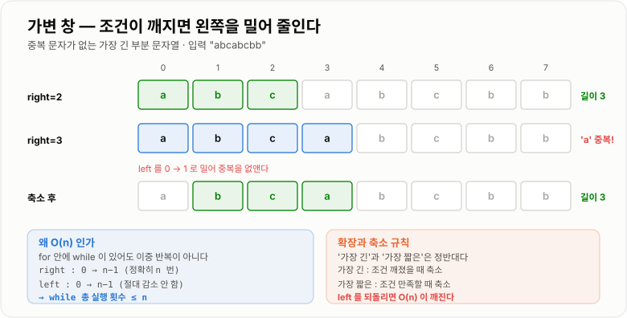

# 슬라이딩 윈도우

> **슬라이딩 윈도우(Sliding Window)는 연속된 구간을 통째로 다시 계산하는 대신, 창이 한 칸 움직일 때 들어온 것과 나간 것만 반영해 O(n×k)를 O(n)으로 줄이는 기법이다.**

---

## 1. 핵심 요약

* 연속된 **구간(창, window)** 을 배열 위에서 밀면서, 매번 다시 계산하지 않고 **차이만 갱신**한다.
* 창이 한 칸 이동할 때 하는 일은 **"들어온 값 더하기 + 나간 값 빼기"** 두 번뿐이다.
* 시간 **O(n)**, 공간 **O(1)** (또는 창 안의 상태를 담는 만큼)이다.
* 실측하면 n=200,000, k=1,000 구간합 문제에서 매번 다시 계산 58.90ms 대 슬라이딩 윈도우 1.6131ms로 **약 37배** 차이가 난다. (JDK 17)
* 창의 크기가 **고정**인 형태와, 조건에 따라 **늘었다 줄었다** 하는 가변 형태가 있다.
* 구간의 **최댓값**처럼 "뺄 수 없는" 값은 **단조 덱(monotonic deque)** 으로 O(n)을 유지한다. 실측 약 **11배** 차이다.
* 문자열 문제에서 `substring`을 창마다 호출하면 **Java 7u6부터 매번 복사**하므로 O(n×k)로 되돌아간다.

---

## 2. 등장 배경

### 해결하려는 문제

"연속된 k개"에 대한 질문은 실무와 알고리즘 모두에서 아주 흔하다.

* 최근 1분간 요청 수 (Rate Limiter)
* 이동 평균 (주가, 센서 값, 모니터링 지표)
* 연속된 7일 매출의 최댓값
* 조건을 만족하는 가장 긴 부분 문자열

가장 먼저 떠오르는 방법은 **모든 시작 위치마다 구간을 통째로 계산하는 것**이다.

```java
long best = Long.MIN_VALUE;
for (int i = 0; i + k <= n; i++) {
    long sum = 0;
    for (int j = i; j < i + k; j++) {   // 매번 k개를 처음부터 다시 더한다
        sum += a[j];
    }
    if (sum > best) {
        best = sum;
    }
}
```

**O(n × k)** 다. n = 200,000이고 k = 1,000이면 **약 2억 번**의 덧셈이다. 실측하면 **58.90ms**가 걸린다.

### 핵심 통찰 — 겹치는 부분을 다시 계산하고 있다

여기서 낭비가 어디인지 보자.

```text
배열:  [ 3 ][ 1 ][ 4 ][ 1 ][ 5 ][ 9 ][ 2 ]     k = 3

i=0 창:  [ 3   1   4 ]                합 = 8
i=1 창:      [ 1   4   1 ]            합 = 6
                 ↑
          1 과 4 는 방금 더했던 값이다. 또 더하고 있다.
```

창이 한 칸 움직일 때 **실제로 바뀌는 것은 양 끝의 두 개뿐**이다. 가운데 k−2개는 그대로다.

```text
i=0 창:  [ 3   1   4 ]  합 = 8
              ↓
         3 이 나가고, 1 이 들어온다
              ↓
i=1 창:  [ 1   4   1 ]  합 = 8 - 3 + 1 = 6

  k개를 다시 더할 필요 없이 덧셈 1번, 뺄셈 1번으로 끝난다.
```

이것이 슬라이딩 윈도우의 전부다. **k에 상관없이 창 이동 한 번이 O(1)** 이 되므로 전체가 O(n)이 된다.

```text
매번 다시 계산 :  n번 이동 × k번 덧셈  =  O(n × k)
슬라이딩 윈도우 :  n번 이동 × 2번 연산  =  O(n)

  k = 1000 이면 약 500배의 연산이 줄어든다.
```

실측하면 **58.90ms에서 1.6131ms**로, 약 37배 빨라진다. (덧셈 자체가 매우 싸고 캐시 효과가 있어 이론상 500배보다는 작게 나온다.)

### 이 개념이 없을 때

k가 커질수록 비용이 정직하게 커진다.

| n = 200,000 | k = 10 | k = 100 | k = 1,000 | k = 10,000 |
| ----------- | -----: | ------: | --------: | ---------: |
| 다시 계산 (덧셈 수) | 200만 | 2,000만 | **2억** | **20억** |
| 슬라이딩 윈도우 | 40만 | 40만 | **40만** | **40만** |

**슬라이딩 윈도우는 k와 무관하다.** 이것이 결정적인 차이다. "최근 1시간"이든 "최근 24시간"이든 비용이 같다.

그리고 구간 합에는 **누적 합 배열(Prefix Sum)** 이라는 다른 해법도 있는데, 둘의 역할이 다르다.

```text
누적 합 배열     : 미리 O(n) 전처리 → 임의 구간을 O(1)에 조회
슬라이딩 윈도우   : 전처리 없이 순차적으로 O(1)씩 갱신

  임의 구간을 여러 번 물어본다        → 누적 합 배열
  창을 순서대로 한 번 훑는다          → 슬라이딩 윈도우
  값이 계속 들어오는 스트림이다        → 슬라이딩 윈도우 (누적 합은 불가)
```

---

## 3. 핵심 개념

| 개념                       | 설명                                    | 중요한 이유                                 |
| ------------------------ | ------------------------------------- | -------------------------------------- |
| **창(window)**            | 현재 보고 있는 연속된 구간 `[left, right]`       | 이 구간의 상태를 유지하는 것이 기법의 전부다              |
| **증분 갱신(incremental update)** | 들어온 값을 더하고 나간 값을 빼는 것                 | k에 무관하게 O(1)이 되는 근거다                   |
| **고정 크기 창**              | 창의 크기 k가 항상 같다                        | 이동 평균, 최근 k개 집계                        |
| **가변 크기 창**              | 조건에 따라 창이 늘었다 줄었다 한다                  | "조건을 만족하는 가장 긴/짧은 구간" 문제              |
| **확장(expand)**           | `right`를 늘려 창을 키운다                    | 가변 창에서 조건을 만족시키려 할 때                   |
| **축소(shrink)**           | `left`를 늘려 창을 줄인다                     | 조건이 깨졌을 때 복구하려 할 때                     |
| **역연산 가능성**              | 나간 값의 영향을 되돌릴 수 있는가                   | **합·개수는 가능, 최댓값은 불가능.** 기법 선택을 가른다     |
| **단조 덱(monotonic deque)** | 최댓값·최솟값을 O(1)에 유지하는 덱                 | 역연산이 안 되는 값을 O(n)으로 처리하는 방법이다          |
| **창 안의 상태**              | 합, 개수, 빈도 맵 등 창을 요약한 값                | 이 상태를 무엇으로 잡느냐가 설계의 핵심이다               |
| **`left`가 되돌아가지 않음**     | `left`와 `right` 모두 단조 증가한다            | 이중 반복문처럼 보여도 O(n)인 이유다                 |
| **오버플로**                 | 합을 `int`로 누적하면 넘친다                    | 예외 없이 그럴듯한 양수가 나온다                     |

두 가지 형태를 그림으로 보면 이렇다.

```text
① 고정 크기 창 (k = 3)                  ② 가변 크기 창

[ ][ ][ ][ ][ ][ ][ ]                   [ ][ ][ ][ ][ ][ ][ ]
 └──창──┘                                └창┘
    └──창──┘                             └──창──┘
       └──창──┘                          └────창────┘
                                            └──창──┘   ← 조건 깨져서 축소

크기가 항상 같다                          조건에 따라 늘었다 줄었다
right 만 움직이면 left 는 따라온다        right 로 늘리고 left 로 줄인다
```

---

## 4. 구조와 동작 원리

### 고정 크기 창 — 구간 합

```text
배열:  [ 3 ][ 1 ][ 4 ][ 1 ][ 5 ][ 9 ][ 2 ]      k = 3
index    0    1    2    3    4    5    6

① 첫 창을 만든다 (여기만 O(k))
   창 [0..2] = 3 + 1 + 4 = 8

② 이후로는 한 칸씩 밀면서 O(1) 갱신

   i=3:  합 = 8 - a[0] + a[3] = 8 - 3 + 1 = 6      창 [1..3]
   i=4:  합 = 6 - a[1] + a[4] = 6 - 1 + 5 = 10     창 [2..4]
   i=5:  합 = 10 - a[2] + a[5] = 10 - 4 + 9 = 15   창 [3..5]
   i=6:  합 = 15 - a[3] + a[6] = 15 - 1 + 2 = 16   창 [4..6]

최댓값 = 16

총 연산: 초기 3번 + 이후 (4칸 × 2번) = 11번
매번 다시 계산했다면: 5창 × 3번 = 15번
  → k 가 커질수록 격차가 벌어진다
```

핵심은 **나가는 원소의 인덱스**를 정확히 잡는 것이다.

```text
현재 새로 들어오는 원소가 a[i] 라면
나가는 원소는 a[i - k] 다.

  창 [i-k+1 .. i]  ←  크기 k
      ↑        ↑
   새 left    새 right(=i)

  직전 창은 [i-k .. i-1] 이었으므로 a[i-k] 가 빠진다.
```

`i - k`를 `i - k + 1`이나 `i - k - 1`로 쓰는 **오프바이원 실수**가 이 기법에서 가장 흔한 버그다.


*창 크기 k와 무관하게 이동 한 번이 O(1)이므로 전체가 O(n)이 된다.*

### 가변 크기 창 — 조건을 만족하는 가장 긴 구간

크기가 정해져 있지 않고 **조건에 따라 늘었다 줄었다** 하는 형태다.

```text
문제: 중복 문자가 없는 가장 긴 부분 문자열

문자열:  a  b  c  a  b  c  b  b
index    0  1  2  3  4  5  6  7

right=0  창 "a"       중복 없음  →  길이 1
right=1  창 "ab"      중복 없음  →  길이 2
right=2  창 "abc"     중복 없음  →  길이 3  ★
right=3  창 "abca"    'a' 중복!
         → left 를 올려 중복을 없앤다
         창 "bca"     중복 없음  →  길이 3
right=4  창 "bcab"    'b' 중복!
         → left 를 올린다
         창 "cab"     중복 없음  →  길이 3
right=5  창 "cabc"    'c' 중복!
         → 창 "abc"   길이 3
right=6  창 "abcb"    'b' 중복!
         → 창 "cb"    길이 2
right=7  창 "cbb"     'b' 중복!
         → 창 "b"     길이 1

정답: 3
```

동작 규칙은 단순하다.

```text
1. right 를 한 칸 늘려 새 원소를 창에 넣는다
2. 조건이 깨졌으면, 다시 만족할 때까지 left 를 올려 창을 줄인다
3. 조건을 만족하는 동안 답을 갱신한다
4. right 가 끝에 도달하면 종료
```



*`left`와 `right` 모두 뒤로 가지 않기 때문에, 이중 반복문처럼 보여도 전체가 O(n)이다.*

### 왜 이중 반복문인데 O(n)인가

가변 창 코드는 이렇게 생겼다.

```java
for (int right = 0; right < n; right++) {
    // 창에 넣기
    while (조건이 깨졌으면) {
        // 창에서 빼기
        left++;
    }
}
```

`for` 안에 `while`이 있으니 O(n²)처럼 보인다. 하지만 **O(n)** 이다.

```text
right 는 0 부터 n-1 까지 정확히 n 번 증가한다
left 는 0 부터 시작해 최대 n-1 까지만 증가한다 (절대 감소하지 않는다)

  → 안쪽 while 의 총 실행 횟수 = left 의 총 증가량 ≤ n
  → 전체 = n(바깥) + n(안쪽 합계) = O(n)
```

**"안쪽 반복이 몇 번 도는가"가 아니라 "전체에서 몇 번 도는가"로 세야 한다.** 이를 상환 분석(amortized analysis)이라고 하며, 투 포인터가 O(n)인 이유와 같은 논리다.

### 역연산이 안 되는 값 — 최댓값 문제

합은 뺄 수 있지만 **최댓값은 뺄 수 없다.**

```text
창 [3, 1, 4] 의 최댓값 = 4

3 이 나가고 5 가 들어오면?
  창 [1, 4, 5] 의 최댓값 = 5     →  새 값이 더 크니 쉽다

창 [3, 1, 4] 에서 4 가 나가고 2 가 들어오면?
  창 [1, 4] 에서 4 를 빼면... 남은 것 중 최댓값이 무엇인지 모른다
  → 창 안을 전부 다시 봐야 한다 → O(k) → 전체 O(n×k)
```

실측하면 완전탐색 방식이 **175.77ms**다. 해법은 **단조 덱**이다.

```text
단조 감소 덱: 값이 큰 것부터 담되, 자기보다 작은 것은 즉시 버린다

배열: [1, 3, -1, -3, 5, 3, 6, 7]   k = 3

i=0  덱 []           → 1 삽입           덱 [1]
i=1  3 이 들어옴. 뒤의 1 은 3 보다 작다
     → 1 은 앞으로 절대 최댓값이 될 수 없다 (3 이 더 뒤에 있고 더 크다)
     → 버린다                            덱 [3]
i=2  -1 은 3 보다 작지만, 3 이 나간 뒤엔 후보다 → 남긴다   덱 [3, -1]
     창 [1,3,-1] 완성 → 최댓값 = 덱의 맨 앞 = 3
i=3  -3 도 남긴다                        덱 [3, -1, -3]
     창 [3,-1,-3] → 최댓값 3
i=4  5 가 들어옴. -3, -1, 3 전부 5 보다 작다 → 전부 버린다   덱 [5]
     창 [-1,-3,5] → 최댓값 5
...
```

**핵심 논리는 하나다.**

```text
"나보다 앞에 있으면서 나보다 작은 값"은 절대 최댓값이 될 수 없다.
  내가 더 뒤에 있으므로 창에 더 오래 남고, 값도 더 크기 때문이다.
  → 즉시 버려도 안전하다
```

각 원소는 덱에 **한 번 들어가고 최대 한 번 나가므로** 전체가 O(n)이다. 실측하면 **175.77ms에서 15.9881ms로 약 11배** 빨라진다.

### 문자열에서의 함정 — `substring`

```java
// 나쁜 예 — 창마다 문자열을 새로 만든다
for (int i = 0; i + k <= n; i++) {
    String window = s.substring(i, i + k);   // 매번 k개 복사!
    process(window);
}
```

**Java 7u6부터 `substring`은 원본 배열을 공유하지 않고 새로 복사한다.** 그 이전에는 원본을 공유해 O(1)이었지만, 작은 조각이 큰 원본을 잡고 있어 메모리 누수를 유발한다는 이유로 바뀌었다.

```text
Java 7u5 이하 : substring 은 O(1) — 원본 char[] 공유 (메모리 누수 위험)
Java 7u6 이상 : substring 은 O(길이) — 새 배열로 복사

  → 창마다 substring 을 호출하면 O(n × k) 로 되돌아간다
```

JDK 17에서 재 보면 `substring` 반복이 **1.17ms**, `charAt` 직접 접근이 **0.3883ms**로 약 3배 차이가 난다. (k가 클수록 격차가 커진다.)

**해법은 인덱스로 직접 접근하는 것**이다.

```java
// 좋은 예 — 문자열을 새로 만들지 않는다
for (int i = 0; i + k <= n; i++) {
    char in = s.charAt(i + k - 1);
    char out = i > 0 ? s.charAt(i - 1) : 0;
    // 창의 상태만 갱신
}
```

---

## 5. 코드 또는 사용 예시

### 고정 크기 창 — 최대 구간 합

```java
public class FixedWindow {

    /** 연속된 k개의 합 중 최댓값을 구한다. */
    public static long maxSum(int[] a, int k) {
        if (a.length < k) {
            throw new IllegalArgumentException("배열이 창보다 작습니다.");
        }

        long sum = 0;
        for (int i = 0; i < k; i++) {       // 첫 창 만들기 O(k)
            sum += a[i];
        }

        long best = sum;
        for (int i = k; i < a.length; i++) {
            sum += a[i];                     // 들어온 값
            sum -= a[i - k];                 // 나간 값
            if (sum > best) {
                best = sum;
            }
        }
        return best;
    }

    public static void main(String[] args) {
        int[] a = {3, 1, 4, 1, 5, 9, 2};
        System.out.println(maxSum(a, 3));    // 16  (5+9+2)
    }
}
```

각 부분의 의미는 이렇다.

```java
long sum = 0;
```

**반드시 `long`이어야 한다.** `int`로 누적하면 오버플로가 나는데, 실측하면 10만 × 100만이 `1,215,752,192`라는 **그럴듯한 양수**가 된다. 음수가 아니라서 발견할 단서가 없다.

```java
sum -= a[i - k];
```

**나가는 인덱스는 `i - k`** 다. 새로 들어오는 것이 `a[i]`이고 창 크기가 k이므로, 직전 창의 왼쪽 끝이 `a[i-k]`다. 여기서 `i-k+1`을 쓰면 창이 한 칸씩 밀린다.

```java
for (int i = 0; i < k; i++)
```

**첫 창만 O(k)** 로 만든다. 이후는 전부 O(1)이다. 전체가 O(n + k) = O(n)이 되는 구조다.

### 가변 크기 창 — 중복 없는 가장 긴 부분 문자열

```java
import java.util.HashMap;
import java.util.Map;

public class VariableWindow {

    /** 중복 문자가 없는 가장 긴 부분 문자열의 길이. */
    public static int longestUnique(String s) {
        Map<Character, Integer> lastIndex = new HashMap<>();
        int best = 0;
        int left = 0;

        for (int right = 0; right < s.length(); right++) {
            char c = s.charAt(right);

            Integer seen = lastIndex.get(c);
            if (seen != null && seen >= left) {
                left = seen + 1;         // 중복 문자 다음으로 창을 줄인다
            }

            lastIndex.put(c, right);

            int length = right - left + 1;
            if (length > best) {
                best = length;
            }
        }
        return best;
    }

    public static void main(String[] args) {
        System.out.println(longestUnique("abcabcbb"));   // 3
        System.out.println(longestUnique("bbbbb"));      // 1
        System.out.println(longestUnique("pwwkew"));     // 3
        System.out.println(longestUnique(""));           // 0
    }
}
```

```java
if (seen != null && seen >= left) {
```

**`seen >= left` 조건이 반드시 필요하다.** 이미 창 밖으로 나간 문자의 기록이 남아 있을 수 있는데, 그것 때문에 `left`를 뒤로 되돌리면 안 된다. `left`가 감소하는 순간 O(n) 보장이 깨지고 답도 틀린다.

### 가변 크기 창 — 합이 target 이상인 가장 짧은 구간

```java
public class MinLengthWindow {

    /** 합이 target 이상이 되는 가장 짧은 연속 구간의 길이. 없으면 0. */
    public static int minLength(int[] a, long target) {
        long sum = 0;
        int left = 0;
        int best = Integer.MAX_VALUE;

        for (int right = 0; right < a.length; right++) {
            sum += a[right];                     // 창 확장

            while (sum >= target) {              // 조건을 만족하는 동안 축소
                int length = right - left + 1;
                if (length < best) {
                    best = length;
                }
                sum -= a[left];
                left++;
            }
        }
        return best == Integer.MAX_VALUE ? 0 : best;
    }

    public static void main(String[] args) {
        int[] a = {2, 3, 1, 2, 4, 3};
        System.out.println(minLength(a, 7));   // 2  ([4,3])
        System.out.println(minLength(a, 100)); // 0
    }
}
```

**"가장 긴"과 "가장 짧은"은 축소 조건이 반대**다.

```text
가장 긴 구간  :  조건이 깨졌을 때 축소하고, 조건을 만족할 때 답을 갱신
가장 짧은 구간 :  조건을 만족할 때 축소하면서 답을 갱신
```

이 둘을 헷갈리는 것이 가변 창의 대표적인 실수다.

### 창의 최댓값 — 단조 덱

```java
import java.util.ArrayDeque;
import java.util.Deque;

public class WindowMaximum {

    /** 크기 k인 모든 창의 최댓값을 구한다. O(n). */
    public static int[] maxOfEachWindow(int[] a, int k) {
        int[] result = new int[a.length - k + 1];
        Deque<Integer> dq = new ArrayDeque<>();   // 값이 아니라 인덱스를 담는다

        for (int i = 0; i < a.length; i++) {
            // 1. 나보다 작은 값은 앞으로 최댓값이 될 수 없다 → 버린다
            while (!dq.isEmpty() && a[dq.peekLast()] <= a[i]) {
                dq.pollLast();
            }
            dq.offerLast(i);

            // 2. 창 밖으로 나간 인덱스를 앞에서 제거한다
            if (dq.peekFirst() <= i - k) {
                dq.pollFirst();
            }

            // 3. 창이 완성되면 맨 앞이 곧 최댓값이다
            if (i >= k - 1) {
                result[i - k + 1] = a[dq.peekFirst()];
            }
        }
        return result;
    }

    public static void main(String[] args) {
        int[] a = {1, 3, -1, -3, 5, 3, 6, 7};
        int[] r = maxOfEachWindow(a, 3);
        for (int i = 0; i < r.length; i++) {
            System.out.print(r[i] + " ");    // 3 3 5 5 6 7
        }
    }
}
```

**값이 아니라 인덱스를 담는 것**이 핵심이다. 창 밖으로 나갔는지 판단하려면 위치를 알아야 하기 때문이다.

각 원소가 덱에 한 번 들어가고 최대 한 번 나가므로 **전체 O(n)** 이다. `while`이 있어도 총 `pollLast` 횟수가 n을 넘지 않는다.

### 실측 비교

JDK 17에서 잰 결과다.

```text
구간 합 최댓값 (n = 200,000,  k = 1,000)
    매번 다시 계산 O(n×k) : 58.90 ms
    슬라이딩 윈도우 O(n)   :  1.6131 ms      →  약 37배

구간 최댓값 (n = 200,000,  k = 1,000)
    완전탐색 O(n×k)      : 175.77 ms
    단조 덱  O(n)        :  15.9881 ms      →  약 11배
```

**단조 덱 쪽의 배수가 더 작은 이유**는 덱 연산(객체 박싱, 포인터 추적)이 단순 덧셈보다 비싸기 때문이다. 그래도 k가 커질수록 격차는 계속 벌어진다.

---

## 6. 성능 특성

| 형태            | 시간 복잡도       | 공간 복잡도            | 설명                     |
| ------------- | ------------ | ----------------- | ---------------------- |
| 고정 창 — 합·개수   | **O(n)**     | **O(1)**          | 덧셈·뺄셈 각 1번             |
| 가변 창 — 조건 만족  | **O(n)**     | O(1) ~ O(창 안 원소 수) | `left`가 되돌아가지 않아 상환 O(n) |
| 가변 창 — 빈도 맵 사용 | **O(n)**     | O(고유 원소 수)        | `HashMap` 유지 비용        |
| 창의 최댓값 — 단조 덱 | **O(n)**     | **O(k)**          | 덱에 최대 k개               |
| 창의 최댓값 — 힙    | O(n log k)   | O(k)              | 제거가 O(k)라 단조 덱보다 느리다   |
| 매번 다시 계산      | O(n × k)     | O(1)              | k에 비례해 느려진다            |

### k에 대한 독립성

슬라이딩 윈도우의 가장 중요한 성질이다.

```text
n = 200,000 기준 덧셈 횟수

k        매번 다시 계산      슬라이딩 윈도우
────     ─────────────      ──────────────
10           200만              40만
100        2,000만              40만
1,000          2억              40만
10,000        20억              40만

  슬라이딩 윈도우는 k 가 커져도 비용이 변하지 않는다.
```

"최근 1분"을 "최근 1시간"으로 바꿔도 비용이 같다는 뜻이다. 모니터링·집계 시스템에서 결정적인 특성이다.

### 누적 합 배열과의 비교

구간 합에 한정하면 **누적 합 배열(Prefix Sum)** 이라는 대안이 있다.

| 항목      | 슬라이딩 윈도우      | 누적 합 배열              |
| ------- | ------------- | -------------------- |
| 전처리     | 없음            | O(n)                 |
| 임의 구간 조회 | 불가능 (순차적으로만)  | **O(1)**             |
| 순차 순회   | **O(n)**      | O(n)                 |
| 추가 메모리  | **O(1)**      | O(n)                 |
| 스트리밍    | **가능**        | 불가능 (전체가 있어야 함)      |
| 창 크기 변경 | 가능            | 가능                   |
| 최댓값 등   | 단조 덱으로 가능     | 불가능 (합·곱만)           |

```text
질문이 "모든 창을 한 번씩 훑어라"      →  슬라이딩 윈도우
질문이 "구간 [3,7] 합은? [10,20] 합은?" →  누적 합 배열
데이터가 실시간으로 들어온다             →  슬라이딩 윈도우
```

### 공간 복잡도가 달라지는 경우

"공간 O(1)"은 창의 상태가 **스칼라 하나**일 때다.

```text
합·개수만 유지        →  O(1)
빈도 맵 유지          →  O(창 안의 고유 원소 수)
단조 덱 유지          →  O(k)
창 전체를 보관         →  O(k)  ← 이러면 이점이 줄어든다
```

---

## 7. 장점과 단점

| 장점                    | 이유                                      |
| --------------------- | --------------------------------------- |
| O(n×k)를 O(n)으로 줄인다    | 창 이동 한 번이 O(1)이라 k에 무관해진다               |
| **창 크기 k와 무관하다**      | "최근 1분"이든 "최근 24시간"이든 비용이 같다            |
| 추가 메모리가 작다            | 대부분 O(1), 단조 덱을 써도 O(k)                 |
| 스트리밍 데이터에 쓸 수 있다      | 전체를 메모리에 올리지 않아도 된다                     |
| 순차 접근이라 캐시 친화적이다      | 배열을 앞에서 뒤로 한 번 읽는다                      |
| 가변 창으로 다양한 조건을 표현한다   | "가장 긴", "가장 짧은", "정확히 k종류" 등            |
| 실시간 집계에 자연스럽다         | Rate Limiter, 이동 평균이 곧 이 구조다            |

| 단점                        | 이유 및 주의점                                          |
| ------------------------- | ------------------------------------------------ |
| **연속된 구간에만 쓸 수 있다**       | 띄엄띄엄한 조합에는 적용할 수 없다                              |
| **역연산이 안 되는 값은 그냥 안 된다**  | 최댓값·중앙값은 뺄 수 없어 단조 덱 같은 별도 장치가 필요하다              |
| 오프바이원 실수가 잦다              | 나가는 인덱스 `i-k`를 틀리면 창이 밀린다                        |
| 가변 창의 축소 조건을 헷갈리기 쉽다      | "가장 긴"과 "가장 짧은"의 조건이 정반대다                        |
| `left`를 되돌리면 O(n)이 깨진다    | 조건 검사에서 이미 창 밖인 기록을 걸러야 한다                       |
| 오버플로가 조용히 발생한다            | `int` 누적 시 그럴듯한 양수가 나온다 (실측 확인)                  |
| 문자열에서 `substring`이 함정이다   | **Java 7u6부터 매번 복사**라 O(n×k)로 되돌아간다              |
| 창 안의 상태 설계가 어렵다           | 무엇을 유지할지 잘못 잡으면 O(1) 갱신이 불가능해진다                  |

---

## 8. 사용 기준

### 사용하기 좋은 상황

* **연속된 k개**에 대한 집계가 필요할 때 (합, 평균, 개수)
* **이동 평균**이나 **최근 N개 통계**를 구할 때
* 조건을 만족하는 **가장 긴/짧은 연속 구간**을 찾을 때
* **실시간 스트림**에서 최근 구간을 집계할 때
* **Rate Limiter**처럼 시간 창 기반 제한을 구현할 때
* 창의 **최댓값·최솟값**이 필요할 때 (단조 덱과 함께)
* 문자열의 **부분 문자열** 조건 문제

### 사용하지 않는 것이 좋은 상황

* 구간이 **연속되지 않을** 때 → 다른 접근
* **임의 구간을 여러 번** 조회할 때 → **누적 합 배열** (O(1) 조회)
* 두 원소의 **조합**을 찾을 때 → **투 포인터**
* 창 안의 **중앙값**이 필요할 때 → 힙 두 개 또는 균형 트리
* 창 크기가 **전체와 비슷할** 때 → 이점이 거의 없다
* 창 안의 **모든 원소를 매번 봐야** 할 때 → O(1) 갱신이 불가능하다

### 선택 기준

1. **구간이 연속되는가?** — 아니면 적용 자체가 안 된다
2. **창이 이동할 때 O(1)로 갱신할 수 있는가?** — 합·개수는 가능, 최댓값은 단조 덱 필요
3. **순차적으로 훑는가, 임의 조회인가?** — 임의 조회면 누적 합 배열
4. **창 크기가 고정인가 가변인가?** — 가변이면 확장·축소 조건을 명확히 정의한다
5. **스트리밍인가?** — 그렇다면 슬라이딩 윈도우가 사실상 유일한 선택이다

```text
                  연속된 구간인가?
                        │
        ┌───────────────┴───────────────┐
      예                              아니오
        │                                │
  조회 방식은?                    투 포인터 / 다른 접근
        │
  ┌─────┴─────┐
순차적       임의 구간
  │             │
창 이동 시    누적 합 배열
O(1) 갱신 가능?   (O(1) 조회)
  │
┌─┴──────────┐
합·개수     최댓값·최솟값
  │            │
단순 증분    단조 덱
 O(1)        O(k) 공간
```

---

## 9. 비슷한 개념 비교

### 슬라이딩 윈도우와 투 포인터

| 비교 항목  | 슬라이딩 윈도우          | 투 포인터            | 선택 기준       |
| ------ | ----------------- | ---------------- | ----------- |
| 관심 대상  | 두 포인터 **사이의 구간**  | 두 포인터가 가리키는 **원소** | 구간인가 원소인가   |
| 정렬 필요  | **대부분 불필요**       | 대부분 필요           | 큰 차이        |
| 이동 방향  | 둘 다 같은 방향         | 주로 마주 보며 좁힘      | -           |
| 상태 유지  | **창의 합·개수를 유지**   | 유지하지 않음          | 상태 관리 여부    |
| 대표 문제  | 부분합, 최장 부분 문자열    | 두 수의 합, 넓이, 병합   | -           |
| 복잡도    | O(n)              | O(n)             | 동일          |
| 관계     | **투 포인터의 특수한 형태** | 상위 개념            | 넓게 보면 같은 계열 |
| 적합한 상황 | 연속 구간 집계          | 정렬된 배열의 조합       | 연속성 요구 여부   |

### 슬라이딩 윈도우와 누적 합 배열

| 비교 항목    | 슬라이딩 윈도우     | 누적 합 배열       | 선택 기준       |
| -------- | ------------ | ------------- | ----------- |
| 전처리      | **없음**       | O(n)          | 한 번만 쓸 거면 창 |
| 임의 구간 조회 | 불가능          | **O(1)**      | 조회 패턴       |
| 순차 전체 순회 | **O(n)**     | O(n)          | 동일          |
| 추가 메모리   | **O(1)**     | O(n)          | 메모리 제약      |
| 스트리밍     | **가능**       | 불가능           | 실시간 데이터     |
| 지원 연산    | 합·개수·최댓값(덱)  | 합·곱 (역연산 가능만) | 최댓값이 필요하면 창 |
| 값 변경 대응  | 자연스러움        | 전체 재계산 필요     | 데이터가 바뀌는가   |
| 적합한 상황   | 순차 순회·실시간    | 반복적인 임의 구간 질의 | 질의 패턴으로 결정  |

### 창의 최댓값 — 단조 덱과 힙

| 비교 항목    | 단조 덱 (`ArrayDeque`) | 힙 (`PriorityQueue`) | 선택 기준       |
| -------- | ------------------- | ------------------- | ----------- |
| 시간       | **O(n)**            | O(n log k)          | 단조 덱이 우세    |
| 공간       | O(k)                | O(k)                | 동일          |
| 원소 제거    | **O(1)** (앞에서)      | O(k) (임의 위치 제거)     | 결정적 차이      |
| 구현 난이도   | 규칙을 이해해야 함          | 직관적                 | 힙이 쉬움       |
| 지연 삭제 기법 | 불필요                 | 필요 (창 밖 원소 무시)      | 힙은 꼼수가 붙는다  |
| 실측 (k=1000) | 15.99 ms            | -                   | 완전탐색 175.77 ms 대비 |
| 적합한 상황   | 창의 최댓값·최솟값          | 상위 k개, 우선순위 처리      | 문제 형태       |

### 애플리케이션 슬라이딩 윈도우와 Rate Limiter 알고리즘

| 비교 항목  | Fixed Window     | Sliding Window Log  | Sliding Window Counter | Token Bucket   |
| ------ | ---------------- | ------------------- | ---------------------- | -------------- |
| 방식     | 고정 구간마다 카운터 리셋   | 모든 요청 시각을 기록        | 이전 창과 현재 창을 가중 평균      | 토큰을 일정 속도로 채움  |
| 메모리    | **O(1)**         | **O(요청 수)**         | O(1)                   | O(1)           |
| 정확도    | 낮음 (경계 문제)       | **정확**              | 근사                     | 근사             |
| 경계 문제  | **있음** (2배 통과 가능) | 없음                  | 크게 완화                  | 없음             |
| 버스트 허용 | 경계에서만            | 안 됨                 | 제한적                    | **설계상 허용**     |
| 구현     | 가장 단순            | 복잡·메모리 부담           | 중간                     | 중간             |
| 적합한 상황 | 대략적인 제한          | 엄격한 제한, 요청 수가 적을 때  | **실무 기본**              | 버스트를 허용하고 싶을 때 |

**Fixed Window의 경계 문제**가 슬라이딩 윈도우가 필요한 이유를 잘 보여 준다.

```text
제한: 1분당 100회

12:00:59 에 100회 요청  →  통과 (12:00~12:01 창)
12:01:00 에 100회 요청  →  통과 (12:01~12:02 창, 카운터 리셋됨)

  실제로는 2초 사이에 200회가 통과했다.
  슬라이딩 윈도우는 "지금부터 1분 전까지"를 보므로 이 문제가 없다.
```

---

## 10. 백엔드 실무 적용

### Spring·Java

**Rate Limiter**가 슬라이딩 윈도우의 가장 직접적인 실무 적용이다.

```java
import java.util.ArrayDeque;
import java.util.Deque;

/**
 * Sliding Window Log 방식 Rate Limiter.
 * 요청 시각을 큐에 담고, 창 밖으로 나간 것을 앞에서 제거한다.
 */
public class SlidingWindowRateLimiter {

    private final int maxRequests;
    private final long windowMillis;
    private final Deque<Long> timestamps = new ArrayDeque<>();

    public SlidingWindowRateLimiter(int maxRequests, long windowMillis) {
        this.maxRequests = maxRequests;
        this.windowMillis = windowMillis;
    }

    public synchronized boolean tryAcquire() {
        long now = System.currentTimeMillis();
        long boundary = now - windowMillis;

        // 창 밖으로 나간 기록을 앞에서 제거 — 슬라이딩 윈도우의 '나간 값'
        while (!timestamps.isEmpty() && timestamps.peekFirst() <= boundary) {
            timestamps.pollFirst();
        }

        if (timestamps.size() >= maxRequests) {
            return false;
        }

        timestamps.offerLast(now);      // '들어온 값'
        return true;
    }
}
```

**이 구현의 한계도 분명하다.** 요청 시각을 전부 기록하므로 **메모리가 O(요청 수)** 다. 초당 수만 건이 들어오면 감당이 안 된다. 그래서 실무에서는 **Sliding Window Counter** 방식을 더 자주 쓴다.

```java
/**
 * Sliding Window Counter — 메모리 O(1).
 * 이전 창과 현재 창의 카운터를 가중 평균으로 근사한다.
 */
public class SlidingWindowCounter {

    private final int limit;
    private final long windowMillis;

    private long currentWindowStart;
    private int currentCount;
    private int previousCount;

    public SlidingWindowCounter(int limit, long windowMillis) {
        this.limit = limit;
        this.windowMillis = windowMillis;
        this.currentWindowStart = System.currentTimeMillis();
    }

    public synchronized boolean tryAcquire() {
        long now = System.currentTimeMillis();
        long elapsed = now - currentWindowStart;

        if (elapsed >= windowMillis) {
            if (elapsed >= windowMillis * 2) {
                previousCount = 0;          // 두 창 이상 지났으면 전부 리셋
            } else {
                previousCount = currentCount;
            }
            currentCount = 0;
            currentWindowStart = now - (elapsed % windowMillis);
            elapsed = now - currentWindowStart;
        }

        // 이전 창이 현재 시각 기준으로 차지하는 비율만큼 가중치를 준다
        double ratio = (double) (windowMillis - elapsed) / windowMillis;
        double estimated = previousCount * ratio + currentCount;

        if (estimated >= limit) {
            return false;
        }
        currentCount++;
        return true;
    }
}
```

**메모리가 O(1)로 줄고 경계 문제도 크게 완화된다.** 정확하지는 않지만 실무에서는 충분하다.

**모니터링 지표의 이동 평균**도 같은 구조다.

```java
/** 최근 N개 값의 이동 평균 — 응답 시간 모니터링 등에 쓴다. */
public class MovingAverage {

    private final int size;
    private final long[] buffer;
    private int index;
    private int count;
    private long sum;                    // long 이어야 오버플로가 없다

    public MovingAverage(int size) {
        this.size = size;
        this.buffer = new long[size];
    }

    public double next(long value) {
        if (count == size) {
            sum -= buffer[index];        // 가장 오래된 값이 나간다
        } else {
            count++;
        }
        buffer[index] = value;           // 새 값이 들어온다
        sum += value;
        index = (index + 1) % size;      // 원형 버퍼

        return (double) sum / count;
    }
}
```

**원형 버퍼(circular buffer)** 를 쓰면 배열 이동 없이 O(1)에 창을 밀 수 있다. `ArrayDeque`가 내부적으로 쓰는 것과 같은 구조다.

### 데이터베이스·캐시

**Redis로 분산 Rate Limiter**를 만들 때 Sorted Set이 슬라이딩 윈도우 역할을 한다.

```text
ZADD    ratelimit:user123  <현재시각ms>  <고유ID>
ZREMRANGEBYSCORE ratelimit:user123  0  <현재시각ms - 60000>   ← 창 밖 제거
ZCARD   ratelimit:user123                                     ← 현재 창의 개수
EXPIRE  ratelimit:user123  60

  점수(score)를 타임스탬프로 두면
  ZREMRANGEBYSCORE 가 곧 "나간 값 빼기"다.
```

이 네 명령을 **Lua 스크립트로 묶어 원자적으로 실행**해야 한다. 따로 실행하면 여러 요청 사이에 경쟁 상태가 생겨 제한을 초과할 수 있다.

**SQL의 윈도우 함수**도 개념적으로 같은 발상이다.

```sql
-- 최근 7일 이동 평균 매출
SELECT
    order_date,
    daily_amount,
    AVG(daily_amount) OVER (
        ORDER BY order_date
        ROWS BETWEEN 6 PRECEDING AND CURRENT ROW
    ) AS moving_avg_7d
FROM daily_sales;

-- ROWS BETWEEN ... 이 곧 창의 정의다
-- DB 엔진이 내부적으로 증분 갱신으로 최적화한다
```

**시계열 DB**에서는 이것이 1급 기능이다.

```text
InfluxDB   : SELECT MEAN(value) FROM cpu GROUP BY time(1m)
Prometheus : rate(http_requests_total[5m])   ← [5m] 이 창
             avg_over_time(cpu_usage[10m])

  Prometheus 의 range vector [5m] 이 슬라이딩 윈도우 그 자체다.
```

### 동시성·분산 환경

* **Rate Limiter는 반드시 동기화가 필요하다.** 위 예제의 `synchronized`를 빼면 여러 스레드가 동시에 카운터를 확인·증가시켜 제한을 초과한다. "확인 후 증가"는 원자적이지 않다.
* **`ArrayDeque`는 스레드 안전하지 않다.** 여러 스레드가 공유한다면 `ConcurrentLinkedDeque`나 외부 동기화가 필요하다.
* **분산 환경에서는 인스턴스별 제한이 무의미하다.** 서버 5대에 각각 100회 제한을 걸면 실제로는 500회가 통과한다. Redis 같은 중앙 저장소로 상태를 공유해야 한다.
* **시계 동기화 문제**가 있다. 분산 노드의 시각이 어긋나면 창의 경계가 서로 달라진다. Redis 서버 시각(`TIME` 명령)을 기준으로 삼는 것이 안전하다.
* **슬라이딩 윈도우 자체는 읽기 위주라 병렬화가 쉽지만**, 창이 겹치므로 단순 분할이 안 된다. 경계 부분을 중복 계산하거나 별도로 처리해야 한다.

---

## 11. 자주 하는 오해

| 잘못된 이해                                       | 올바른 이해                                                                |
| -------------------------------------------- | --------------------------------------------------------------------- |
| `for` 안에 `while`이 있으니 O(n²)이다                | `left`가 되돌아가지 않아 안쪽 `while`의 **총 실행 횟수가 n 이하**다. 상환 분석으로 O(n)          |
| 슬라이딩 윈도우는 창 크기 k에 비례해 느려진다                   | **k와 무관하다.** 이동 한 번이 항상 O(1)이라 "최근 1분"과 "최근 24시간"의 비용이 같다             |
| 어떤 집계든 슬라이딩 윈도우로 O(1) 갱신이 된다                 | **역연산이 가능해야** 한다. 합·개수는 되지만 **최댓값은 뺄 수 없다** — 단조 덱이 필요하다              |
| 창의 최댓값은 힙으로 하면 된다                            | 창 밖 원소 제거가 O(k)라 O(n log k)다. **단조 덱이 O(n)** 으로 더 낫다                  |
| 슬라이딩 윈도우와 투 포인터는 완전히 다른 기법이다                 | 슬라이딩 윈도우는 투 포인터의 한 형태다. **원소를 보는가, 사이 구간을 보는가**의 차이다                 |
| 나가는 인덱스는 `i - k + 1`이다                       | `i - k`다. `a[i]`가 들어올 때 직전 창의 왼쪽 끝이 빠진다                               |
| 합을 `int`로 받아도 오버플로 나면 음수라 알 수 있다             | **그럴듯한 양수가 나온다.** 실측에서 10만×100만이 `1,215,752,192`가 되었다                 |
| 문자열 문제에서 `substring`을 써도 성능은 같다              | **Java 7u6부터 매번 복사**한다. 창마다 호출하면 O(n×k)로 되돌아간다 (실측 약 3배)              |
| `substring`은 원본 배열을 공유하니 O(1)이다              | Java 7u5까지의 이야기다. 메모리 누수 문제로 **7u6부터 복사 방식**으로 바뀌었다                   |
| 가변 창에서 "가장 긴"과 "가장 짧은"은 코드가 비슷하다             | **축소 조건이 정반대**다. 긴 것은 조건이 깨졌을 때, 짧은 것은 조건을 만족할 때 축소한다                |
| `left`를 상황에 따라 되돌려도 된다                       | `left`가 감소하는 순간 O(n) 보장이 깨지고 대개 답도 틀린다                               |
| Fixed Window Rate Limiter로 충분하다               | 경계에서 **2배가 통과**할 수 있다. 12:00:59에 100회, 12:01:00에 100회가 모두 통과한다        |
| Rate Limiter를 인스턴스마다 두면 된다                   | 서버 5대면 실제 제한이 5배가 된다. **Redis 등 중앙 저장소**로 상태를 공유해야 한다                |
| Sliding Window Log 방식이 메모리도 효율적이다            | 요청 시각을 전부 기록해 **O(요청 수)** 다. 실무에서는 O(1)인 Counter 방식을 더 쓴다            |
| 임의 구간 합도 슬라이딩 윈도우로 O(1)에 구한다                 | 순차적으로만 가능하다. 임의 구간 조회는 **누적 합 배열**이 O(1)이다                           |

---

## 12. 면접 답변

### 기본 답변

슬라이딩 윈도우는 연속된 구간을 배열 위에서 밀면서, 매번 구간 전체를 다시 계산하는 대신 **들어온 값을 더하고 나간 값을 빼는 증분 갱신**만 하는 기법입니다. 시간 O(n), 공간은 대부분 O(1)입니다.

핵심은 창이 한 칸 움직일 때 **실제로 바뀌는 것이 양 끝 두 개뿐**이라는 관찰입니다. 그래서 이동 한 번이 창 크기 k와 무관하게 O(1)이 되고, 전체가 O(n × k)에서 O(n)으로 줄어듭니다. 실측하면 n = 200,000, k = 1,000 구간합 문제에서 58.90ms가 1.6131ms로 약 37배 빨라졌습니다.

특히 중요한 성질은 **k와 무관하다**는 점입니다. "최근 1분"이든 "최근 24시간"이든 비용이 같아서, 모니터링이나 집계 시스템에서 결정적입니다.

형태는 두 가지입니다. 크기가 고정인 창은 이동 평균이나 최근 k개 집계에 쓰고, 조건에 따라 늘었다 줄었다 하는 가변 창은 "조건을 만족하는 가장 긴 구간" 같은 문제에 씁니다. 가변 창 코드는 `for` 안에 `while`이 있어 O(n²)처럼 보이지만, **`left`가 절대 되돌아가지 않아 안쪽 반복의 총 횟수가 n을 넘지 않으므로** 상환 분석으로 O(n)입니다.

한 가지 제약은 **역연산이 가능해야 한다**는 것입니다. 합이나 개수는 뺄 수 있지만 **최댓값은 뺄 수 없습니다.** 창에서 최댓값이 빠지면 나머지 중 무엇이 최대인지 알 수 없어 창 전체를 다시 봐야 합니다. 이때는 **단조 덱**을 씁니다. "나보다 앞에 있으면서 나보다 작은 값은 절대 최댓값이 될 수 없다"는 논리로 즉시 버리는 방식이고, 각 원소가 한 번 들어가고 한 번 나가므로 O(n)입니다. 실측하면 완전탐색 175.77ms가 15.99ms로 약 11배 빨라졌습니다.

실무에서는 Rate Limiter가 가장 직접적인 적용입니다. Fixed Window 방식은 경계에서 2배가 통과하는 문제가 있어서, 12시 00분 59초에 100회, 12시 01분 00초에 100회가 모두 통과할 수 있습니다. 슬라이딩 윈도우는 "지금부터 1분 전까지"를 보므로 이 문제가 없습니다. 다만 Sliding Window Log 방식은 요청 시각을 전부 기록해 메모리가 O(요청 수)라, 실무에서는 이전 창과 현재 창을 가중 평균하는 O(1) 메모리의 Counter 방식을 더 씁니다. 분산 환경에서는 인스턴스별로 제한을 두면 서버 수만큼 제한이 배가되므로 Redis Sorted Set으로 상태를 공유하고 Lua 스크립트로 원자성을 보장해야 합니다.

주의할 점으로, 합을 `int`로 누적하면 오버플로가 나는데 음수가 아니라 그럴듯한 양수가 나옵니다. 그리고 문자열 문제에서 창마다 `substring`을 호출하면, **Java 7u6부터 원본을 공유하지 않고 매번 복사**하므로 O(n × k)로 되돌아갑니다. `charAt`으로 직접 접근해야 합니다.

### 답변 구조

* **정의**

    * 연속 구간을 밀면서 증분 갱신만 하는 기법
    * "들어온 값 더하기 + 나간 값 빼기" 두 연산으로 창을 이동

* **내부 원리**

    * 창 이동 시 바뀌는 것은 양 끝 두 개뿐 → 이동이 O(1)
    * 고정 크기 창: 첫 창만 O(k), 이후 O(1)
    * 가변 크기 창: `right`로 확장, `left`로 축소 — 둘 다 단조 증가
    * 나가는 인덱스는 `i - k` (오프바이원 주의)

* **복잡도**

    * 시간 **O(n)** — k에 무관
    * 공간 O(1) (합·개수) / O(k) (단조 덱)
    * `for` 안 `while`이어도 **상환 분석으로 O(n)** (`left`가 되돌아가지 않음)
    * 실측(JDK 17): 구간합 58.90ms → 1.6131ms (약 37배), 최댓값 175.77ms → 15.99ms (약 11배)

* **장점**

    * **창 크기 k와 무관** — "최근 1분"과 "최근 24시간" 비용이 같음
    * 추가 메모리가 작고 스트리밍 데이터에 적용 가능
    * 순차 접근이라 캐시 친화적

* **단점**

    * 연속 구간에만 적용 가능
    * **역연산이 안 되는 값(최댓값·중앙값)은 별도 장치 필요**
    * 오프바이원·축소 조건 실수가 잦음
    * `int` 오버플로가 그럴듯한 양수로 나타남
    * 문자열에서 `substring` 반복 시 O(n×k)로 퇴화

* **사용 기준**

    * 연속된 k개의 집계, 이동 평균, 최근 N개 통계
    * 조건을 만족하는 가장 긴/짧은 구간
    * 실시간 스트림 집계, Rate Limiter

* **대안과 비교**

    * 임의 구간 반복 조회 → **누적 합 배열** (O(1) 조회, 단 O(n) 메모리·스트리밍 불가)
    * 두 원소의 조합 → **투 포인터** (슬라이딩 윈도우의 상위 개념)
    * 창의 최댓값 → **단조 덱** O(n) (힙은 O(n log k), 제거가 O(k))
    * 창의 중앙값 → 힙 두 개 또는 균형 트리

* **실무 적용 사례**

    * Rate Limiter — Fixed Window의 경계 2배 통과 문제를 해결
    * Sliding Window Log(O(요청 수)) vs Counter(O(1)) — 실무는 Counter
    * Redis Sorted Set + Lua로 분산 Rate Limiter (원자성 필수)
    * 이동 평균 모니터링 — 원형 버퍼로 O(1) 갱신
    * SQL 윈도우 함수 `ROWS BETWEEN`, Prometheus `rate(...[5m])`

---

## 13. 예상 면접 질문

### 기본 질문

1. **슬라이딩 윈도우란 무엇이고 복잡도는 어떻게 되나요?**

    * 핵심 키워드: 연속 구간, 증분 갱신, O(n), 공간 O(1), k와 무관

2. **왜 O(n × k)가 O(n)으로 줄어드나요?**

    * 핵심 키워드: 창 이동 시 양 끝 두 개만 변함, 겹치는 부분 재사용, 이동이 O(1)

3. **`for` 안에 `while`이 있는데 왜 O(n²)이 아닌가요?**

    * 핵심 키워드: `left`가 되돌아가지 않음, 총 실행 횟수 n 이하, **상환 분석**

4. **고정 크기 창과 가변 크기 창의 차이는 무엇인가요?**

    * 핵심 키워드: k 고정 vs 조건 기반, 확장·축소, 이동 평균 vs 최장 구간

5. **창의 최댓값은 왜 단순히 뺄 수 없나요?**

    * 핵심 키워드: 역연산 불가, 최댓값이 빠지면 나머지 최대를 모름, O(k) 재탐색

6. **단조 덱은 어떻게 O(n)을 만드나요?**

    * 핵심 키워드: 앞에 있고 작은 값은 후보 불가, 각 원소 1회 삽입·1회 제거, 인덱스 저장

7. **슬라이딩 윈도우와 투 포인터의 차이는 무엇인가요?**

    * 핵심 키워드: 사이 구간 vs 두 원소, 정렬 불필요 vs 필요, 하위 개념

8. **나가는 원소의 인덱스는 무엇인가요?**

    * 핵심 키워드: `i - k`, 새 원소 `a[i]`, 직전 창의 왼쪽 끝, 오프바이원

### 꼬리 질문

1. **슬라이딩 윈도우와 누적 합 배열 중 무엇을 쓰겠습니까?**

    * 핵심 키워드: 순차 순회 vs 임의 구간 조회, O(1) 메모리 vs O(n), 스트리밍 가능 여부

2. **창의 최댓값을 힙으로 구하면 어떤 문제가 있나요?**

    * 핵심 키워드: 창 밖 원소 제거가 O(k), O(n log k), 지연 삭제 꼼수, 단조 덱이 우세

3. **합을 `int`로 누적하면 어떤 일이 생기나요?**

    * 핵심 키워드: 오버플로, **그럴듯한 양수**, 실측 `1,215,752,192`, `long` 사용

4. **문자열 문제에서 `substring`을 쓰면 왜 느려지나요?**

    * 핵심 키워드: **Java 7u6부터 복사**, O(길이), 창마다 호출하면 O(n×k), `charAt` 사용

5. **`substring`이 예전에는 O(1)이었다는데 왜 바뀌었나요?**

    * 핵심 키워드: 원본 `char[]` 공유, 작은 조각이 큰 원본을 붙잡음, 메모리 누수, 7u6에서 변경

6. **가변 창에서 "가장 긴"과 "가장 짧은"은 무엇이 다른가요?**

    * 핵심 키워드: 축소 조건 정반대, 조건 깨졌을 때 vs 만족할 때, 답 갱신 시점

7. **Fixed Window Rate Limiter의 문제는 무엇인가요?**

    * 핵심 키워드: 경계에서 2배 통과, 12:00:59와 12:01:00, 카운터 리셋 시점

8. **Sliding Window Log와 Counter 중 실무에서는 무엇을 쓰나요?**

    * 핵심 키워드: Log는 O(요청 수) 메모리, Counter는 O(1) 근사, 실무는 Counter

9. **분산 환경에서 Rate Limiter를 어떻게 구현하나요?**

    * 핵심 키워드: 인스턴스별이면 서버 수만큼 배가, Redis Sorted Set, `ZREMRANGEBYSCORE`, Lua 원자성

10. **Rate Limiter에서 동기화를 빼면 어떻게 되나요?**

    * 핵심 키워드: "확인 후 증가"가 비원자적, 경쟁 상태, 제한 초과 통과

11. **슬라이딩 윈도우를 병렬화할 수 있나요?**

    * 핵심 키워드: 창이 겹침, 단순 분할 불가, 경계 중복 계산 필요

12. **SQL 윈도우 함수와 슬라이딩 윈도우는 어떤 관계인가요?**

    * 핵심 키워드: `ROWS BETWEEN n PRECEDING AND CURRENT ROW`, DB가 증분 갱신으로 최적화

---

## 14. 추가 학습 방향

### 바로 이어서 공부

| 키워드            | 연결되는 이유                          |
| -------------- | -------------------------------- |
| **투 포인터**      | 슬라이딩 윈도우의 상위 개념이자 같은 상환 분석 논리다   |
| **누적 합 배열**    | 임의 구간 조회를 O(1)로 만드는 대안적 접근이다     |
| **Deque**      | 단조 덱의 기반 자료구조이며 양 끝 O(1)이 필요하다   |
| **Amortized 분석** | `for` 안 `while`이 O(n)인 근거를 설명한다  |
| **`PriorityQueue`** | 창의 최댓값을 구하는 대안이자 왜 더 느린지 이해한다    |

### 실무 확장

| 키워드                    | 연결되는 이유                        |
| ---------------------- | ------------------------------ |
| **Rate Limiting 알고리즘** | Fixed/Sliding/Token Bucket의 트레이드오프다 |
| **Redis Sorted Set**   | 분산 슬라이딩 윈도우의 표준 구현이다           |
| **Redis Lua 스크립트**     | 여러 명령의 원자성을 보장하는 방법이다          |
| **SQL 윈도우 함수**         | DB가 제공하는 슬라이딩 윈도우다             |
| **Prometheus range vector** | `[5m]`이 곧 창이며 모니터링의 기본 단위다     |

### 심화 학습

| 키워드                     | 연결되는 이유                          |
| ----------------------- | -------------------------------- |
| **단조 스택(Monotonic Stack)** | 단조 덱의 자매 기법으로 "다음 큰 원소" 등을 O(n)에 푼다 |
| **창의 중앙값 (힙 두 개)**      | 역연산이 안 되는 또 다른 값을 다루는 기법이다       |
| **원형 버퍼(Ring Buffer)**  | 고정 크기 창을 O(1) 메모리로 구현하는 자료구조다    |
| **Count-Min Sketch**    | 대용량 스트림에서 근사 집계를 O(1) 메모리로 한다    |
| **Token Bucket · Leaky Bucket** | 버스트 허용 정책이 다른 유량 제어 알고리즘이다       |
| **스트림 처리(Flink 윈도우)**   | Tumbling·Sliding·Session 윈도우 개념이다 |

---

## 15. 최종 체크리스트

* [ ] 개념을 한 문장으로 설명할 수 있다
* [ ] 등장 배경을 설명할 수 있다
* [ ] 내부 동작 과정을 설명할 수 있다
* [ ] 성능 특성을 설명할 수 있다
* [ ] 장점과 단점을 설명할 수 있다
* [ ] 사용할 상황과 사용하지 않을 상황을 구분할 수 있다
* [ ] 비슷한 기술과 비교할 수 있다
* [ ] Spring 백엔드 실무 사례를 설명할 수 있다
* [ ] 기본 면접 질문에 답할 수 있다
* [ ] 조건이 달라졌을 때 대안을 제시할 수 있다

---

## 16. 한 줄 결론

**슬라이딩 윈도우는 "창이 움직여도 바뀌는 건 양 끝 두 개뿐"이라는 관찰로 O(n×k)를 창 크기와 무관한 O(n)으로 바꾸는 기법이며, 합처럼 뺄 수 있는 값에는 그대로 쓰고 최댓값처럼 뺄 수 없는 값에는 단조 덱을 얹는다.**
