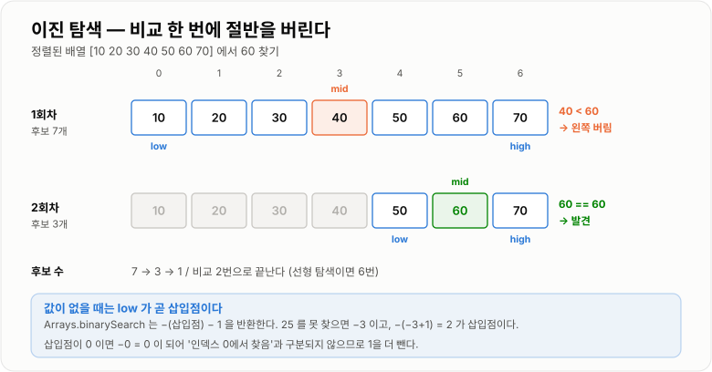

# 이진 탐색

> **이진 탐색(Binary Search)은 정렬되어 있다는 전제를 대가로 탐색 범위를 매번 절반으로 줄여 O(log n)에 값을 찾는 방법이다.**

---

## 1. 핵심 요약

* 정렬된 데이터의 **가운데 값과 비교**해 찾는 값이 왼쪽인지 오른쪽인지 판단하고, 나머지 절반을 **통째로 버린다.**
* 시간 복잡도 **O(log n)**, 공간 복잡도 **O(1)** (반복문 구현 기준)이다. 100만 개에서 최대 **20번**, 10억 개에서도 최대 **30번**이면 끝난다. (JDK 17 실측)
* **반드시 정렬되어 있어야 한다.** 정렬되지 않은 배열에 쓰면 예외 없이 **조용히 틀린 답**을 반환한다.
* `Arrays.binarySearch()`는 못 찾으면 `-(삽입점) - 1`을 반환한다. 이 값에 `-(결과 + 1)`을 하면 **값을 넣어야 할 위치**가 나온다.
* 중복 값이 있으면 **어느 것이 나올지 보장하지 않는다.** 첫 번째나 마지막을 원하면 `lower bound` / `upper bound`를 직접 구현해야 한다.
* 실무에서 이진 탐색이 가장 크게 쓰이는 곳은 배열이 아니라 **DB 인덱스(B+Tree)** 다. 디스크 위에서 같은 원리로 동작한다.

---

## 2. 등장 배경

### 해결하려는 문제

선형 탐색은 데이터가 커질수록 정직하게 느려진다.

```text
n = 1,000        →  최대     1,000 번 비교
n = 1,000,000    →  최대 1,000,000 번 비교
n = 1,000,000,000 → 최대 10억 번 비교
```

데이터가 1000배 늘면 시간도 정확히 1000배 늘어난다. 사용자가 늘고 데이터가 쌓일수록 서비스가 선형으로 느려진다는 뜻이다.

그런데 우리는 일상에서 이미 훨씬 빠른 방법을 쓰고 있다. **사전에서 단어를 찾을 때 첫 장부터 넘기지 않는다.** 중간쯤 펼쳐 보고, 찾는 단어가 앞쪽이면 앞 절반만 다시 본다. 전화번호부, 도서관 서가, 나이 맞히기 게임 모두 같은 방식이다.

이것이 가능한 이유는 단 하나, **정렬되어 있기 때문**이다. 사전이 뒤죽박죽이라면 중간을 펼쳐 봐도 아무 정보를 얻지 못한다.

이진 탐색은 이 직관을 알고리즘으로 옮긴 것이다. **"정렬되어 있다"는 정보 하나로 매번 후보의 절반을 버릴 수 있다.**

### 이 개념이 없을 때

이진 탐색을 모르면 정렬된 데이터를 가지고도 선형 탐색을 하게 된다.

```java
// 정렬된 배열인데도 처음부터 하나씩 확인한다
int[] sorted = {10, 20, 30, ..., 9999990};   // 100만 개
for (int i = 0; i < sorted.length; i++) {
    if (sorted[i] == target) {
        return i;
    }
    if (sorted[i] > target) {                // 정렬을 조금 활용한 최적화
        return -1;                           // 그래도 평균 n/2 번
    }
}
```

정렬을 활용해 "이미 지나쳤으면 없다"는 조기 종료를 넣어도 **평균 50만 번**이다. 이진 탐색은 **20번**이면 끝난다. 2만 5천 배 차이다.

그리고 이진 탐색이 없으면 이런 질문에 답할 방법이 마땅치 않다.

* "이 값을 정렬 상태를 유지하며 넣으려면 어디에 넣어야 하나?" (삽입점)
* "이 값보다 크거나 같은 가장 작은 값은 무엇인가?" (`lower bound`)
* "80점 이상 90점 미만인 학생은 몇 명인가?" (범위 개수)

이 셋은 모두 전체를 훑지 않고 O(log n)에 답할 수 있는 질문이고, 실무 쿼리에서 대단히 자주 나온다.

### 대가로 무엇을 지불하는가

이진 탐색은 공짜가 아니다. **정렬 상태를 만들고 유지해야 한다.**

| 지불하는 비용     | 구체적인 내용                                      |
| ----------- | -------------------------------------------- |
| 최초 정렬       | O(n log n) — 100만 개 `int[]` 기준 약 120ms (실측) |
| 정렬 상태 유지    | 중간에 값을 삽입하면 뒤 원소를 밀어야 해 O(n)                 |
| 임의 접근 자료구조  | `LinkedList`처럼 인덱스 접근이 O(n)이면 이점이 사라진다       |
| 정렬 키 하나에 종속 | 복합 조건이나 다른 기준으로는 탐색할 수 없다                    |

**이 비용을 회수할 만큼 자주 탐색하는가**가 이진 탐색을 쓸지 결정하는 실제 기준이다. 실측으로는 100만 개에서 정렬 비용(120ms)을 선형 탐색(2.29ms)으로 환산하면 **약 52회 이상 탐색해야 본전**이다.

---

## 3. 핵심 개념

| 개념                   | 설명                                        | 중요한 이유                                    |
| -------------------- | ----------------------------------------- | ----------------------------------------- |
| **정렬 전제**            | 데이터가 오름차순(또는 내림차순)으로 정렬되어 있어야 한다          | 이 전제가 깨지면 **예외 없이 오답**이 나온다. 가장 위험한 특성이다  |
| **탐색 구간 `[low, high]`** | 아직 답이 있을 수 있는 후보 범위                       | 이진 탐색의 상태 전부가 이 두 변수에 담긴다                 |
| **중간 지점 `mid`**      | 후보 범위의 가운데 인덱스                            | 이 계산에서 **정수 오버플로 버그**가 가장 자주 난다           |
| **범위 절반 버리기**        | 비교 한 번으로 후보의 절반을 제거한다                     | O(log n)의 근거다                             |
| **종료 조건**            | `low > high`가 되면 후보가 없다는 뜻                | 등호 처리를 틀리면 무한 루프가 된다                      |
| **삽입점(insertion point)** | 값이 없을 때 "정렬을 유지하며 넣어야 할 위치"               | `Arrays.binarySearch`가 이 정보를 음수로 인코딩해 준다  |
| **`-(삽입점) - 1`**     | JDK가 "못 찾음 + 삽입점"을 한 값에 담는 방식             | 삽입점이 0일 때 `-0 = 0`이 되어 성공과 구분이 안 되는 문제 회피 |
| **`lower bound`**    | 찾는 값 **이상**인 첫 번째 위치                      | 중복 값의 시작점을 찾을 때 쓴다                        |
| **`upper bound`**    | 찾는 값 **초과**인 첫 번째 위치                      | `upper - lower`가 곧 값의 개수다                 |
| **매개변수 탐색(Parametric Search)** | "조건을 만족하는 최소/최대값"을 이진 탐색으로 찾기             | 배열이 아닌 **답의 범위**에 이진 탐색을 적용하는 확장이다        |
| **불변식(invariant)**   | 반복이 돌아도 항상 참인 조건 (예: 답은 `[low, high]` 안에 있다) | 이진 탐색 구현이 맞는지 검증하는 유일하게 확실한 방법이다          |

핵심 개념들의 관계는 이렇다.

```text
      정렬되어 있다  ──┐
                      ├──→  중간과 비교하면 절반을 버릴 수 있다
      임의 접근 가능  ──┘              │
                                      ↓
                            매번 후보가 n → n/2 → n/4 → ...
                                      │
                                      ↓
                            1이 될 때까지 log₂(n) 번
```

---

## 4. 구조와 동작 원리

### 기본 동작 — 값을 찾는 경우

```text
정렬된 배열:  [ 10 ][ 20 ][ 30 ][ 40 ][ 50 ][ 60 ][ 70 ]
index           0     1     2     3     4     5     6
찾는 값: 60

1회차   low=0, high=6   mid=(0+6)/2=3   arr[3]=40
        40 < 60  →  왼쪽 절반(0~3)을 전부 버린다   low=4
        남은 후보: [50][60][70]

2회차   low=4, high=6   mid=(4+6)/2=5   arr[5]=60
        60 == 60  →  찾았다! 인덱스 5 반환

비교 횟수: 2회   (선형 탐색이면 6회)
```

한 번 비교할 때마다 **후보가 절반이 된다**는 점이 핵심이다.

```text
7개 → 3개 → 1개     최대 3번
```

### 값이 없는 경우 — 삽입점이 나온다

```text
정렬된 배열:  [ 10 ][ 20 ][ 30 ][ 40 ][ 50 ]
index           0     1     2     3     4
찾는 값: 25

1회차   low=0, high=4   mid=2   arr[2]=30
        30 > 25  →  오른쪽 버림   high=1

2회차   low=0, high=1   mid=0   arr[0]=10
        10 < 25  →  왼쪽 버림    low=1

3회차   low=1, high=1   mid=1   arr[1]=20
        20 < 25  →  왼쪽 버림    low=2

종료    low(2) > high(1)  →  후보 없음

이때 low = 2 가 곧 "삽입점"이다.
   [10][20]  25  [30][40][50]
              ↑
           인덱스 2 에 넣으면 정렬이 유지된다
```

JDK는 이 삽입점을 살려서 반환한다. **JDK 17 실측 결과**다.

| 배열 `{10, 20, 30, 40, 50}` | 반환값  | 삽입점 = `-(반환값 + 1)` | 의미                 |
| ------------------------- | ---: | ----------------: | ------------------ |
| `binarySearch(10)`        |  `0` |                 - | 인덱스 0에서 찾음         |
| `binarySearch(50)`        |  `4` |                 - | 인덱스 4에서 찾음         |
| `binarySearch(5)`         | `-1` |                 0 | 없음. 맨 앞에 넣어야 함     |
| `binarySearch(25)`        | `-3` |                 2 | 없음. 인덱스 2에 넣어야 함   |
| `binarySearch(55)`        | `-6` |                 5 | 없음. 맨 뒤(인덱스 5)에 넣어야 함 |

**왜 `-(삽입점)`이 아니라 `-(삽입점) - 1`인가?** 삽입점이 0인 경우 `-0`은 그냥 `0`이라서 "인덱스 0에서 찾았다"와 구분할 수 없기 때문이다. `-1`을 더 빼서 항상 음수가 되게 만든 것이다.



*비교 한 번에 후보의 절반을 버리기 때문에 100만 개도 20번이면 끝난다.*

### 정렬되어 있지 않으면 — 조용한 오답

이것이 이진 탐색의 가장 위험한 성질이다.

```java
int[] notSorted = {50, 40, 30, 20, 10};
int result = Arrays.binarySearch(notSorted, 10);
// 결과: -1   ← 배열의 인덱스 4에 분명히 있는데도 "없다"고 답한다
```

**JDK 17 실측 확인 결과다.** 예외도, 경고도, 로그도 없다. 그냥 틀린 답을 준다.

이 특성 때문에 실무에서는 다음을 반드시 지켜야 한다.

* 이진 탐색을 쓰는 배열은 **정렬 책임의 소재를 명확히** 한다 (누가, 언제 정렬하는가)
* 정렬 기준과 탐색 기준이 **같은 `Comparator`** 인지 확인한다
* 값을 추가한 뒤 **정렬 상태가 유지되는지** 확인한다

### 중복이 있으면 어느 것이 나오는가 — 보장하지 않는다

```java
int[] dup = {1, 2, 2, 2, 2, 3};
Arrays.binarySearch(dup, 2);   // 결과: 2  (JDK 17 실측)
```

인덱스 1, 2, 3, 4 모두 값이 2인데 그중 2가 나왔다. **어느 것이 나올지는 구현에 달렸고 명세에도 "보장하지 않는다"고 쓰여 있다.**

첫 번째나 마지막이 필요하면 직접 구현해야 한다.

```text
배열:  [ 1 ][ 2 ][ 2 ][ 2 ][ 2 ][ 3 ]
index    0    1    2    3    4    5

lower bound(2) = 1     ← 2 이상인 첫 위치
upper bound(2) = 5     ← 2 초과인 첫 위치

2의 개수 = upper - lower = 5 - 1 = 4
```

이 두 함수를 알면 "특정 값의 개수", "범위 안 원소 개수" 같은 질문을 전부 O(log n)에 답할 수 있다.


*경계 두 개를 구하면 값의 개수와 범위 안 원소 수가 뺄셈 한 번으로 나온다.*

### 정수 오버플로 — 20년간 숨어 있던 버그

```java
int mid = (low + high) / 2;    // 위험
```

`low`와 `high`가 모두 크면 **더하는 순간 `int` 범위를 넘어 음수**가 된다. **JDK 17 실측 결과**다.

```text
low = 1,500,000,000,  high = 2,000,000,000

(low + high) / 2      = -397,483,648   ← 음수! ArrayIndexOutOfBoundsException
low + (high - low) / 2 =  1,750,000,000   ← 정상
(low + high) >>> 1     =  1,750,000,000   ← 정상
```

이 버그는 **JDK의 `Arrays.binarySearch`에도 2006년까지 남아 있었다.** Joshua Bloch가 공개적으로 지적한 유명한 사건이며, 현재 JDK는 `>>> 1`(부호 없는 오른쪽 시프트)을 쓴다.

`>>> 1`이 동작하는 이유는 오버플로로 음수가 되더라도 **비트 패턴 자체는 올바른 합**이고, 부호 없는 시프트가 그 비트를 그대로 2로 나누기 때문이다. 다만 의도가 잘 드러나지 않으므로 실무에서는 `low + (high - low) / 2`를 더 권장한다.

---

## 5. 코드 또는 사용 예시

### 기본 구현 (반복문)

```java
public class BinarySearch {

    /** 정렬된 배열에서 target을 찾아 인덱스를 반환한다. 없으면 -1. */
    public static int search(int[] sorted, int target) {
        int low = 0;
        int high = sorted.length - 1;

        while (low <= high) {
            int mid = low + (high - low) / 2;   // 오버플로 안전

            if (sorted[mid] == target) {
                return mid;
            } else if (sorted[mid] < target) {
                low = mid + 1;                  // 오른쪽 절반만 남긴다
            } else {
                high = mid - 1;                 // 왼쪽 절반만 남긴다
            }
        }
        return -1;
    }

    public static void main(String[] args) {
        int[] data = {10, 20, 30, 40, 50, 60, 70};

        System.out.println(search(data, 60));   // 5
        System.out.println(search(data, 10));   // 0
        System.out.println(search(data, 25));   // -1
    }
}
```

각 부분이 왜 그렇게 생겼는지가 중요하다.

```java
while (low <= high)
```

**등호가 반드시 있어야 한다.** `low < high`로 쓰면 후보가 하나 남은 상태(`low == high`)를 검사하지 않고 끝나 버린다. 원소가 1개인 배열에서 바로 틀린다.

```java
low = mid + 1;    high = mid - 1;
```

**`mid`를 반드시 제외해야 한다.** `low = mid`로 쓰면 후보가 줄지 않아 **무한 루프**에 빠진다. 이진 탐색 버그의 절반이 여기서 나온다.

```java
int mid = low + (high - low) / 2;
```

오버플로를 피한다. `(high - low)`는 항상 배열 크기보다 작으므로 넘칠 수 없다.

### `lower bound` / `upper bound` 직접 구현

```java
public class Bounds {

    /** target 이상인 첫 번째 인덱스. 없으면 배열 길이. */
    public static int lowerBound(int[] sorted, int target) {
        int low = 0;
        int high = sorted.length;          // 주의: length - 1 이 아니다

        while (low < high) {               // 주의: 등호가 없다
            int mid = low + (high - low) / 2;
            if (sorted[mid] < target) {
                low = mid + 1;
            } else {
                high = mid;                // mid 도 후보로 남긴다
            }
        }
        return low;
    }

    /** target 초과인 첫 번째 인덱스. 없으면 배열 길이. */
    public static int upperBound(int[] sorted, int target) {
        int low = 0;
        int high = sorted.length;

        while (low < high) {
            int mid = low + (high - low) / 2;
            if (sorted[mid] <= target) {   // 기본형과 <= 하나만 다르다
                low = mid + 1;
            } else {
                high = mid;
            }
        }
        return low;
    }

    /** target 의 개수 */
    public static int count(int[] sorted, int target) {
        return upperBound(sorted, target) - lowerBound(sorted, target);
    }

    /** low 이상 high 이하인 원소의 개수 */
    public static int countInRange(int[] sorted, int from, int to) {
        return upperBound(sorted, to) - lowerBound(sorted, from);
    }

    public static void main(String[] args) {
        int[] data = {1, 2, 2, 2, 2, 3};

        System.out.println(lowerBound(data, 2));      // 1
        System.out.println(upperBound(data, 2));      // 5
        System.out.println(count(data, 2));           // 4
        System.out.println(countInRange(data, 2, 3)); // 5
    }
}
```

기본형과 달라진 점이 세 가지다. 이 셋은 세트로 움직인다.

| 항목            | 기본 이진 탐색       | `lower`/`upper bound` | 이유                     |
| ------------- | -------------- | --------------------- | ---------------------- |
| `high` 초기값    | `length - 1`   | `length`              | "전부 조건 미달"인 경우를 표현해야 함 |
| 반복 조건         | `low <= high`  | `low < high`          | 답이 구간 밖(=`length`)일 수 있음 |
| 조건 불만족 시 `high` | `mid - 1`      | `mid`                 | `mid` 자체가 답일 수 있어 버리면 안 됨 |

### JDK가 제공하는 것 — 직접 짜기 전에 확인

```java
import java.util.ArrayList;
import java.util.Arrays;
import java.util.Collections;
import java.util.List;
import java.util.TreeMap;

public class JdkBinarySearch {

    public static void main(String[] args) {
        // 1. 배열
        int[] arr = {10, 20, 30, 40, 50};
        System.out.println(Arrays.binarySearch(arr, 30));   // 2
        int notFound = Arrays.binarySearch(arr, 25);
        System.out.println(notFound);                        // -3
        System.out.println(-(notFound + 1));                 // 2  ← 삽입점

        // 2. 리스트
        List<Integer> list = new ArrayList<>(Arrays.asList(10, 20, 30, 40, 50));
        System.out.println(Collections.binarySearch(list, 30));  // 2

        // 3. TreeMap — lower/upper bound 를 메서드로 제공한다
        TreeMap<Integer, String> map = new TreeMap<>();
        map.put(10, "a");
        map.put(20, "b");
        map.put(30, "c");

        System.out.println(map.ceilingKey(15));   // 20  (15 이상 최소) = lower bound
        System.out.println(map.higherKey(20));    // 30  (20 초과 최소) = upper bound
        System.out.println(map.floorKey(25));     // 20  (25 이하 최대)
        System.out.println(map.lowerKey(20));     // 10  (20 미만 최대)
        System.out.println(map.subMap(15, 35));   // {20=b, 30=c}  범위 조회
    }
}
```

**`TreeMap`은 이진 탐색을 자료구조로 감싼 것**이다. `ceilingKey`가 `lower bound`, `higherKey`가 `upper bound`에 해당한다. 정렬 상태를 스스로 유지하므로 삽입이 있어도 O(log n)을 지킨다.

### `LinkedList`에 이진 탐색을 쓰면

```java
List<Integer> linked = new LinkedList<>(...);
Collections.binarySearch(linked, 70);   // 답은 맞게 나온다
```

**결과는 맞다.** (JDK 17 실측 확인) 하지만 내부 동작이 다르다. `Collections.binarySearch`는 리스트가 `RandomAccess`를 구현했는지 확인한다.

```text
ArrayList  instanceof RandomAccess  →  true
LinkedList instanceof RandomAccess  →  false

리스트 크기 < BINARYSEARCH_THRESHOLD(5000)  또는  RandomAccess 구현
    → get(i) 를 직접 호출하는 인덱스 방식

그 외 (큰 LinkedList)
    → ListIterator 로 앞뒤로 이동하는 방식
```

`Collections.BINARYSEARCH_THRESHOLD = 5000`은 JDK 17에서 리플렉션으로 확인한 실제 값이다. 어느 쪽이든 `LinkedList`에서 인덱스 접근은 O(n)이므로 **전체 비용이 O(n)** 이 되어 이진 탐색의 이점이 사라진다.

```text
ArrayList  : O(log n) 번 × O(1) 접근  =  O(log n)
LinkedList : O(log n) 번 × O(n) 접근  =  O(n log n)  (인덱스 방식)
             또는 반복자 이동 비용 합계 O(n)
```

**이진 탐색은 임의 접근이 O(1)인 자료구조에서만 의미가 있다.**

### 매개변수 탐색 — 배열이 아닌 "답"을 이진 탐색한다

이진 탐색은 배열 전용이 아니다. **"조건을 만족하는 최소값"** 형태의 문제에 그대로 적용된다.

```java
public class ParametricSearch {

    /**
     * 길이가 제각각인 랜선 n개를 잘라 k개를 만들 때,
     * 만들 수 있는 랜선의 최대 길이를 구한다.
     *
     * 핵심: "길이 L로 자르면 k개 이상 나오는가?"는 판정하기 쉽다.
     *      그리고 L이 커질수록 개수는 단조 감소한다 → 이진 탐색 가능
     */
    public static int maxLength(int[] cables, int k) {
        int low = 1;
        int high = 0;
        for (int i = 0; i < cables.length; i++) {
            if (cables[i] > high) {
                high = cables[i];
            }
        }

        int answer = 0;
        while (low <= high) {
            int mid = low + (high - low) / 2;

            if (countPieces(cables, mid) >= k) {
                answer = mid;          // 가능하다 → 더 길게 시도
                low = mid + 1;
            } else {
                high = mid - 1;        // 불가능하다 → 짧게
            }
        }
        return answer;
    }

    private static int countPieces(int[] cables, int length) {
        int total = 0;
        for (int i = 0; i < cables.length; i++) {
            total += cables[i] / length;
        }
        return total;
    }

    public static void main(String[] args) {
        int[] cables = {802, 743, 457, 539};
        System.out.println(maxLength(cables, 11));   // 200
    }
}
```

매개변수 탐색이 성립하려면 **단조성(monotonicity)** 이 있어야 한다.

```text
길이 L :   1    50   100   200   201   300
가능?  :  예    예    예    예    아니오  아니오
                              ↑
                        경계를 이진 탐색으로 찾는다

"예 → 아니오"로 한 번만 바뀌어야 한다.
예-아니오-예 처럼 왔다갔다 하면 이진 탐색을 쓸 수 없다.
```

정렬된 배열에서 하는 이진 탐색도 사실 같은 구조다. `arr[i] < target`이라는 조건이 어느 지점을 경계로 참에서 거짓으로 바뀌기 때문에 성립하는 것이다. **정렬 = 단조성**인 셈이다.

---

## 6. 성능 특성

| 연산                      | 시간 복잡도       | 설명                             |
| ----------------------- | ------------ | ------------------------------ |
| 탐색 (배열)                 | O(log n)     | 매 비교마다 후보가 절반이 된다              |
| 탐색 (`LinkedList`)       | O(n)         | 인덱스 접근 비용 때문에 이점이 사라진다         |
| `lower bound` / `upper bound` | O(log n)     | 기본 이진 탐색과 동일한 구조               |
| 범위 개수 세기                | O(log n)     | 경계 두 번을 구해 뺀다                  |
| 정렬 상태 유지하며 삽입           | O(n)         | 배열은 뒤 원소를 밀어야 한다               |
| 사전 정렬 (1회)              | O(n log n)   | 100만 개 `int[]` 기준 약 120ms (실측) |

공간 복잡도는 구현 방식에 따라 다르다.

| 구현 방식     | 공간 복잡도    | 이유                              |
| --------- | --------- | ------------------------------- |
| 반복문       | **O(1)**  | `low`, `high`, `mid` 변수만 쓴다     |
| 재귀        | O(log n)  | 호출 스택이 log n 깊이만큼 쌓인다           |

깊이가 log n이라 재귀로 짜도 `StackOverflowError`가 날 일은 사실상 없다(10억 개여도 30단계). 그래도 **반복문 구현이 표준**이다.

### 비교 횟수 실측

JDK 17에서 최악의 경우 비교 횟수를 직접 세어 본 결과다.

| n             | 최악 비교 횟수 | log₂(n) + 1 |
| ------------- | -------: | ----------: |
| 1,000,000     |   **20** |          21 |
| 1,000,000,000 |   **30** |          31 |

**n이 1000배가 되어도 비교 횟수는 10번밖에 늘지 않는다.** 이것이 로그 시간의 위력이다.

| n             | 선형 탐색 (최악)  | 이진 탐색 (최악) | 배수         |
| ------------- | ----------: | --------: | ---------- |
| 1,000         |       1,000 |        10 | 100배       |
| 1,000,000     |   1,000,000 |        20 | 50,000배    |
| 1,000,000,000 | 1,000,000,000 |        30 | 33,000,000배 |

### 정렬 비용까지 포함한 실제 손익

100만 개 `int[]`에서 JDK 17로 측정한 값이다.

```text
선형 탐색 1회 (최악)    :   2.29 ms
정렬 1회                : 120.13 ms
이진 탐색 1000회        :   0.786 ms   (1회당 약 0.0008 ms)
```

여기서 나오는 결론이 실무적으로 중요하다.

| 탐색 횟수 k | 선형 탐색 총시간   | 정렬 + 이진 탐색 총시간 | 승자        |
| -------: | ----------: | -------------: | --------- |
|        1 |    2.29 ms |     120.13 ms |  **선형 탐색** |
|       52 |   119.1 ms |     120.17 ms | 거의 동일 (손익분기점) |
|    1,000 |  2,290 ms |     120.9 ms | **이진 탐색** (약 19배) |

**정렬 한 번의 비용은 선형 탐색 약 52회와 맞먹는다.** 탐색을 그보다 적게 할 거라면 정렬하지 않는 편이 빠르다.

단, 이 계산에는 중요한 전제가 있다. **정렬을 한 번만 하고 재사용할 수 있어야 한다.** 데이터가 계속 바뀌어 매번 다시 정렬해야 한다면 손익분기점은 훨씬 나빠진다.

---

## 7. 장점과 단점

| 장점                     | 이유                                          |
| ---------------------- | ------------------------------------------- |
| n이 커져도 거의 느려지지 않는다     | 10억 개도 30번이면 끝난다. 데이터 1000배에 비교 10번 증가      |
| 추가 메모리를 쓰지 않는다         | 반복문 구현은 O(1)이라 해시 테이블의 O(n)과 대비된다           |
| 범위 조회를 지원한다            | `lower`/`upper bound`로 "이상·이하·개수"를 O(log n)에 답한다 |
| 값이 없어도 삽입점을 알려 준다      | "없다"에서 끝나지 않고 "어디에 넣어야 하는지"까지 준다            |
| 정렬 순서 기반 질문에 강하다       | 최근접 값, 다음 값, 이전 값 조회가 자연스럽다                 |
| 매개변수 탐색으로 확장된다         | 배열이 아닌 "답의 범위"에도 같은 원리를 적용할 수 있다            |
| 디스크·분산 환경으로 그대로 확장된다   | B+Tree 인덱스, 정렬된 파일 탐색이 모두 같은 원리다            |
| 캐시·페이지 접근 횟수가 적다       | 비교 횟수 자체가 적어 디스크 I/O가 비싼 환경에서 특히 유리하다       |

| 단점                    | 이유 및 주의점                                        |
| --------------------- | ----------------------------------------------- |
| **반드시 정렬되어 있어야 한다**   | 전제가 깨지면 예외 없이 **조용히 오답**을 반환한다 (실측 확인)          |
| 정렬 비용이 선행된다           | O(n log n). 탐색 횟수가 적으면 회수하지 못한다                 |
| 삽입·삭제가 비싸다            | 배열에서 정렬을 유지하려면 O(n)이다                           |
| 임의 접근이 필요하다           | `LinkedList`에서는 O(n)이 되어 이점이 사라진다               |
| 정렬 키 하나에 종속된다         | 복합 조건이나 다른 기준으로는 탐색할 수 없다                       |
| 중복 시 어느 것이 나올지 보장 안 된다 | 첫/마지막이 필요하면 `lower`/`upper bound`를 직접 구현해야 한다   |
| 구현 실수가 잦다             | 등호 위치, `mid` 제외, 오버플로 — 셋 중 하나만 틀려도 무한 루프나 오답이다 |
| 정확히 일치 조회만 보면 해시보다 느리다 | O(log n) vs O(1). 범위가 필요 없다면 `HashMap`이 낫다      |

---

## 8. 사용 기준

### 사용하기 좋은 상황

* 데이터가 **이미 정렬되어 있거나**, 한 번 정렬해 두고 **여러 번 탐색**할 때
* **범위 조회**가 필요할 때 — "80점 이상 90점 미만", "이 날짜 이후"
* **최근접 값**을 찾을 때 — "가장 가까운 시간", "이 값 이상인 첫 값"
* 데이터가 **크고**(수만 개 이상) 변경이 드물 때
* **메모리가 부족해** 해시 테이블을 만들 수 없을 때
* **정렬 순서 자체가 의미**를 가질 때 (시계열, 랭킹, 가격대)
* "조건을 만족하는 최소/최대값"을 찾을 때 → **매개변수 탐색**

### 사용하지 않는 것이 좋은 상황

* 데이터가 **정렬되어 있지 않고** 정렬 비용을 회수할 수 없을 때 → **선형 탐색**
* **정확히 일치**하는 조회만 필요하고 범위가 필요 없을 때 → **`HashMap`** (O(1))
* **삽입·삭제가 잦아** 정렬 상태를 유지하기 어려울 때 → **`TreeMap`** (스스로 유지)
* `LinkedList`처럼 **임의 접근이 O(n)** 인 자료구조일 때
* 데이터가 **작을 때**(수백 개 이하) — 선형 탐색이 더 빠를 수 있다
* **복합 조건**으로 찾아야 할 때 → 선형 탐색이나 DB 인덱스

### 선택 기준

1. **정렬되어 있는가?** 아니면 **정렬 비용을 회수할 만큼 탐색하는가?** (실측 기준 약 52회 이상)
2. **범위 조회가 필요한가?** 필요하면 이진 탐색/`TreeMap`, 아니면 `HashMap`이 더 빠르다
3. **삽입·삭제가 잦은가?** 잦으면 배열 대신 `TreeMap`
4. **임의 접근이 O(1)인가?** 아니면 이진 탐색의 이점이 없다
5. **중복 값의 위치가 중요한가?** 중요하면 `lower`/`upper bound`를 써야 한다

```text
                  정렬되어 있는가?
                        │
        ┌───────────────┴───────────────┐
      아니오                            예
        │                               │
  탐색 횟수가 많은가?              범위 조회가 필요한가?
        │                               │
   ┌────┴────┐                   ┌──────┴──────┐
 아니오      예                  예            아니오
   │         │                   │              │
선형 탐색  정렬 후 이진 탐색   이진 탐색      HashMap 이 더 빠름
           또는 HashMap        / TreeMap        (O(1))

  삽입·삭제가 잦다면  →  배열 대신 TreeMap (정렬 상태 자동 유지)
```

---

## 9. 비슷한 개념 비교

### 이진 탐색과 선형 탐색

| 비교 항목    | 이진 탐색               | 선형 탐색       | 선택 기준        |
| -------- | ------------------- | ----------- | ------------ |
| 전제 조건    | **정렬 필수**           | 없음          | 정렬 비용 회수 여부  |
| 시간 복잡도   | O(log n)            | O(n)        | n의 크기        |
| n=100만   | 20번 (실측)            | 최대 100만 번   | 대량이면 이진      |
| 준비 비용    | O(n log n) 정렬       | 0           | 탐색 횟수 k      |
| 손익분기점    | 약 52회 이상 탐색 시 유리 (실측) | 그 미만이면 유리   | 실측으로 판단      |
| 복합 조건    | 불가능                 | 가능          | 조건의 형태       |
| 자료구조 제약  | 임의 접근 필요            | 순차 접근이면 충분  | `LinkedList`면 선형 |
| 전제 위반 시  | **조용히 오답**          | 해당 없음       | 안전성          |
| 적합한 상황   | 대량·반복·정렬됨·범위 조회     | 소량·1회·복합 조건 | k와 n으로 판단    |

### 이진 탐색과 해시 조회

| 비교 항목     | 이진 탐색               | 해시 조회 (`HashMap`) | 선택 기준         |
| --------- | ------------------- | ----------------- | ------------- |
| 조회 복잡도    | O(log n)            | **O(1) 평균**       | 일치 조회만이면 해시   |
| 추가 메모리    | **O(1)**            | O(n)              | 메모리 제약        |
| 범위 조회     | **가능**              | 불가능               | 범위가 핵심 차이     |
| 정렬 순서 활용  | **가능** (최근접·다음·이전 값) | 불가능               | 순서 질문이 있는가    |
| 최악 복잡도    | **O(log n) 보장**     | O(log n) (트리화 이후) | 안정성           |
| 준비 비용     | O(n log n)          | O(n)              | 해시가 저렴        |
| 정렬 상태 유지  | 삽입 시 O(n)           | 불필요               | 변경 빈도         |
| 키 요구 사항   | `Comparable` 또는 비교자 | `equals`+`hashCode` | 타입 특성         |
| 적합한 상황    | 범위·순서·메모리 제약        | 정확히 일치하는 대량 조회    | 범위 필요 여부로 결정  |

### 이진 탐색과 `TreeMap`

| 비교 항목    | 배열 + 이진 탐색     | `TreeMap` (레드-블랙 트리) | 선택 기준            |
| -------- | -------------- | ------------------- | ---------------- |
| 자료구조     | 정렬된 배열         | 자가 균형 이진 탐색 트리      | 변경 빈도            |
| 탐색       | O(log n)       | O(log n)            | 동일               |
| 삽입·삭제    | **O(n)**       | **O(log n)**        | 변경이 잦으면 `TreeMap` |
| 메모리      | 배열만 (적음)       | 노드마다 포인터 3개+색 (많음)  | 메모리 제약           |
| 캐시 효율    | **좋음** (연속 메모리) | 나쁨 (노드가 흩어짐)        | 읽기 성능            |
| 범위 조회 API | 직접 구현          | `subMap`·`headMap` 제공 | 개발 편의성           |
| 정렬 상태 유지 | 직접 책임          | 자동                  | 실수 가능성           |
| 적합한 상황   | 한 번 만들고 계속 읽기  | 계속 변하는 데이터          | 읽기 전용인가          |

### 이진 탐색과 DB 인덱스(B+Tree)

| 비교 항목  | 메모리 이진 탐색   | DB B+Tree 인덱스        | 관계                  |
| ------ | ----------- | -------------------- | ------------------- |
| 기본 원리  | 절반씩 후보 제거   | 자식이 수백 개인 트리로 후보 제거  | **같은 발상**           |
| 분기 수   | 2개 (이진)     | 수백 개 (다진)            | 디스크 페이지 크기에 맞춘 것    |
| 비교 횟수  | log₂(n) ≈ 20 | log₂₅₆(n) ≈ 3        | 디스크 I/O를 줄이려 분기를 늘림 |
| 비용의 단위 | CPU 비교 (나노초) | 디스크 I/O (밀리초)        | **약 100만 배 차이**     |
| 정렬 유지  | 직접 책임       | DB가 자동 (페이지 분할·병합)   | 운영 부담 차이            |
| 범위 조회  | 경계 두 번 계산   | 리프 노드가 연결 리스트라 바로 순회 | B+Tree가 더 유리        |
| 전제 파괴  | 정렬 안 됨 → 오답 | 컬럼에 함수 적용 → 인덱스 미사용  | **원리가 같다**          |

**DB 인덱스가 이진 탐색의 디스크 버전**이라는 점을 이해하면 실무 감각이 크게 달라진다. `WHERE DATE(created_at) = '2026-07-27'`이 인덱스를 못 타는 이유는 정렬되지 않은 배열에 이진 탐색을 쓸 수 없는 이유와 정확히 같다. **값을 변형하면 정렬 순서가 유지되지 않기 때문이다.**

---

## 10. 백엔드 실무 적용

### Spring·Java

가장 흔한 실수는 **정렬 책임이 불분명한 채로 이진 탐색을 쓰는 것**이다.

```java
// 위험한 코드
public class PriceFinder {
    private List<Price> prices;                    // 정렬되어 있다고 "가정"

    public void addPrice(Price p) {
        prices.add(p);                             // ← 정렬이 깨진다
    }

    public Price findByAmount(int amount) {
        int idx = Collections.binarySearch(prices, probe, comparator);
        return idx >= 0 ? prices.get(idx) : null;  // ← 조용히 틀린 답
    }
}
```

`addPrice` 한 번으로 `findByAmount`가 조용히 망가진다. 예외도 안 나므로 **운영 중에 발견하기 매우 어렵다.**

해결 방법은 세 가지 중 하나다.

```java
// 1. 정렬 상태를 스스로 유지하는 자료구조를 쓴다 (가장 권장)
private TreeMap<Integer, Price> prices = new TreeMap<>();

// 2. 삽입 시 정렬 위치에 넣는다
public void addPrice(Price p) {
    int idx = Collections.binarySearch(prices, p, comparator);
    if (idx < 0) {
        idx = -(idx + 1);          // 삽입점 복원
    }
    prices.add(idx, p);            // O(n) 이지만 정렬은 유지된다
}

// 3. 불변으로 만들어 변경 자체를 막는다
private final List<Price> prices = Collections.unmodifiableList(sorted);
```

**정렬 기준과 탐색 기준이 다른 것**도 자주 나오는 버그다.

```java
// 정렬은 가격순으로 해 놓고
list.sort(priceComparator);

// 탐색은 이름순 비교자로 한다 → 조용히 오답
Collections.binarySearch(list, target, nameComparator);
```

컴파일도 되고 예외도 안 난다. **정렬과 탐색은 반드시 같은 비교자를 써야 한다.**

`equals`와 `compareTo`가 불일치할 때도 예상 밖의 결과가 나온다. `BigDecimal`이 대표적이다. **JDK 17 실측 결과**다.

```text
new BigDecimal("1.0").equals(new BigDecimal("1.00"))     →  false  (스케일까지 비교)
new BigDecimal("1.0").compareTo(new BigDecimal("1.00"))  →  0      (값만 비교)

리스트 [1.00] 에서 1.0 을 찾으면
    list.contains(1.0)                →  false   (equals 사용)
    Collections.binarySearch(1.0)     →  0       (compareTo 사용 → 찾음)
    TreeSet.contains(1.0)             →  true    (compareTo 사용)
    HashSet.contains(1.0)             →  false   (equals+hashCode 사용)
```

**같은 데이터에 같은 값을 물었는데 컬렉션마다 답이 다르다.** 금액을 다루는 실무에서 실제로 문제가 되는 지점이다.

### 데이터베이스·캐시

DB 인덱스는 **B+Tree**이고, 이는 이진 탐색을 디스크에 맞게 변형한 것이다.

```text
메모리 이진 탐색            DB B+Tree 인덱스
─────────────────           ─────────────────
분기 2개                    분기 수백 개 (한 페이지에 키를 최대한 담는다)
비교 20번 (100만 건)         페이지 읽기 3번 (100만 건)
비용 단위: 나노초             비용 단위: 밀리초 (디스크 I/O)

왜 분기를 늘렸나?
  → 디스크는 한 번 읽을 때 페이지(보통 16KB) 단위로 읽는다.
    어차피 16KB를 읽을 거라면 그 안에 키를 최대한 많이 담아
    한 번의 I/O로 최대한 많은 후보를 버리는 것이 이득이다.
```

인덱스를 못 타는 패턴은 전부 **"정렬 순서를 활용할 수 없게 만드는 것"** 으로 설명된다.

```sql
-- 인덱스가 정렬해 둔 것은 created_at 원래 값이다.
-- DATE() 를 씌운 값의 순서는 인덱스가 모른다 → 전부 계산해 봐야 한다
SELECT * FROM orders WHERE DATE(created_at) = '2026-07-27';        -- 풀 스캔
SELECT * FROM orders WHERE created_at >= '2026-07-27 00:00:00'
                      AND created_at <  '2026-07-28 00:00:00';     -- 범위 스캔

-- 인덱스는 앞에서부터 정렬되어 있다. 앞을 모르면 시작점을 못 찾는다
SELECT * FROM members WHERE name LIKE '%수';                        -- 풀 스캔
SELECT * FROM members WHERE name LIKE '김%';                        -- 범위 스캔

-- 복합 인덱스 (a, b, c) 는 a로 정렬, 같은 a 안에서 b로 정렬된다.
-- a 조건이 없으면 b는 전체적으로 정렬되어 있지 않다
CREATE INDEX idx ON orders (member_id, status, created_at);
SELECT * FROM orders WHERE status = 'PAID';                        -- 인덱스 못 씀
SELECT * FROM orders WHERE member_id = 1 AND status = 'PAID';      -- 사용 가능
```

세 경우 모두 **"이진 탐색을 하려면 그 기준으로 정렬되어 있어야 한다"** 는 같은 원리다. 복합 인덱스의 왼쪽 우선(leftmost prefix) 규칙도 여기서 나온다.

**커서 기반 페이지네이션**도 이진 탐색의 발상이다.

```sql
-- OFFSET 방식: 100만 건을 세어서 버린다 (선형 탐색)
SELECT * FROM orders ORDER BY id LIMIT 20 OFFSET 1000000;

-- 커서 방식: 인덱스로 시작점을 바로 찾는다 (이진 탐색)
SELECT * FROM orders WHERE id > 1000000 ORDER BY id LIMIT 20;
```

Redis의 **Sorted Set(ZSET)** 도 정렬된 순서로 범위를 조회한다.

```text
ZADD ranking 1500 "userA"
ZRANGEBYSCORE ranking 1000 2000     ← 점수 범위 조회 = lower/upper bound
ZRANK ranking "userA"                ← 순위 조회

내부적으로는 스킵 리스트(Skip List)를 쓰는데,
이 또한 "여러 단계로 건너뛰며 범위를 좁힌다"는 이진 탐색과 같은 발상이다.
```

### 동시성·분산 환경

* **정렬된 배열에 이진 탐색을 하는 도중 다른 스레드가 값을 추가하면** 정렬 전제가 깨져 오답이 나온다. 예외조차 안 나므로 발견이 어렵다. 읽기 전용으로 만들거나 `ConcurrentSkipListMap`처럼 동시성을 보장하는 정렬 구조를 써야 한다.
* **`ConcurrentSkipListMap`** 은 `TreeMap`의 동시성 버전으로, 락 없이 O(log n) 탐색과 범위 조회를 제공한다.
* **일관된 해싱(Consistent Hashing)** 에서 "해시 링 위에서 이 값보다 크거나 같은 첫 노드"를 찾는 것이 바로 `lower bound`다. 분산 캐시와 샤딩의 핵심 연산이다.
* **로그 기반 시스템**에서 "특정 시각 이후의 로그"를 찾는 것도 시간순 정렬 파일에 대한 이진 탐색이다. Kafka가 오프셋으로 메시지를 찾는 방식이 이와 같다.

---

## 11. 자주 하는 오해

| 잘못된 이해                                | 올바른 이해                                                                     |
| ------------------------------------- | -------------------------------------------------------------------------- |
| 정렬 안 된 배열에 쓰면 예외가 난다                  | **예외 없이 조용히 틀린 답**을 준다. `{50,40,30,20,10}`에서 10을 찾으면 `-1`이 나온다 (실측)         |
| 이진 탐색이 선형 탐색보다 항상 빠르다                 | 정렬 비용(100만 개 약 120ms)을 회수하려면 약 52회 이상 탐색해야 한다 (실측)                         |
| 못 찾으면 `-1`을 반환한다                      | `-(삽입점) - 1`을 반환한다. 25를 못 찾으면 `-3`이고, 삽입점은 2다                              |
| `-(삽입점)` 이면 충분한데 왜 `-1`을 더 빼나         | 삽입점이 0이면 `-0 = 0`이라 "인덱스 0에서 찾음"과 구분이 안 되기 때문이다                            |
| 중복 값이 있으면 첫 번째를 반환한다                  | **보장하지 않는다.** `{1,2,2,2,2,3}`에서 2를 찾으면 인덱스 2가 나온다 (실측)                     |
| `(low + high) / 2`로 써도 문제없다           | 둘 다 크면 오버플로로 음수가 된다. JDK도 2006년까지 이 버그가 있었다                                |
| `mid`를 계산할 때 `>>> 1`은 그냥 나누기의 다른 표현이다 | **부호 없는** 시프트라 오버플로된 비트 패턴도 올바르게 나눈다. `/ 2`와 결과가 다르다                       |
| `LinkedList`에도 이진 탐색을 쓰면 O(log n)이다   | 인덱스 접근이 O(n)이라 전체가 O(n)이 된다. 답은 맞지만 이점이 없다                                 |
| 이진 탐색은 배열에서만 쓴다                       | "조건을 만족하는 최소/최대값" 문제에도 쓴다(매개변수 탐색). 단조성만 있으면 된다                            |
| 재귀로 짜면 스택 오버플로가 날 수 있다                | 깊이가 log n이라 10억 개여도 30단계다. 실질적으로 위험하지 않다                                   |
| `HashMap`이 O(1)이니 이진 탐색은 쓸모없다         | 해시는 **범위 조회와 정렬 순서를 지원하지 않는다.** 메모리도 O(n) 더 쓴다                             |
| `equals`가 같으면 `binarySearch`도 찾는다     | `binarySearch`는 `compareTo`를 쓴다. `BigDecimal("1.0")`과 `("1.00")`은 결과가 다르다 (실측) |
| DB 인덱스는 이진 탐색과 다른 기술이다                | B+Tree는 디스크 I/O에 맞게 분기를 늘린 이진 탐색이다. 원리와 제약이 동일하다                           |
| 정렬 기준과 탐색 기준이 달라도 결과는 나온다             | 결과는 나오지만 **틀린 결과**다. 예외가 없어 발견이 매우 어렵다                                     |

---

## 12. 면접 답변

### 기본 답변

이진 탐색은 정렬된 데이터에서 가운데 값과 비교해 탐색 범위를 매번 절반으로 줄이는 방법으로, 시간 복잡도는 O(log n), 공간 복잡도는 반복문 구현 기준 O(1)입니다. 실측해 보면 100만 개에서 최대 20번, 10억 개에서도 30번이면 끝납니다.

동작은 `low`와 `high`로 후보 구간을 잡고, `mid`와 비교해 절반을 버리는 것을 반복합니다. 이때 `mid`를 `(low + high) / 2`로 계산하면 정수 오버플로가 나므로 `low + (high - low) / 2`를 씁니다. JDK도 2006년까지 이 버그가 있었습니다.

가장 중요한 제약은 **반드시 정렬되어 있어야 한다**는 점이고, 더 위험한 것은 이 전제가 깨져도 **예외 없이 조용히 틀린 답**을 준다는 점입니다. 실제로 내림차순 배열에 `Arrays.binarySearch`를 쓰면 값이 있는데도 `-1`이 나옵니다.

`Arrays.binarySearch`는 못 찾으면 `-(삽입점) - 1`을 반환합니다. `-1`을 더 빼는 이유는 삽입점이 0일 때 `-0`이 0이 되어 "인덱스 0에서 찾음"과 구분되지 않기 때문입니다. 중복 값이 있으면 어느 것이 나올지는 보장하지 않으므로, 첫 번째나 마지막이 필요하면 `lower bound`/`upper bound`를 직접 구현합니다.

판단 기준은 정렬 비용을 회수할 만큼 탐색하는가입니다. 100만 개 기준으로 정렬이 120ms, 선형 탐색이 2.3ms라 약 52회 이상 탐색해야 이득입니다. 정확히 일치하는 조회만 필요하다면 `HashMap`이 O(1)로 더 빠르고, 삽입·삭제가 잦다면 정렬 상태를 스스로 유지하는 `TreeMap`을 씁니다. 이진 탐색이 여전히 의미 있는 이유는 **범위 조회와 정렬 순서 활용**이 가능하다는 점입니다.

실무에서 이진 탐색이 가장 크게 쓰이는 곳은 DB 인덱스입니다. B+Tree는 디스크 I/O를 줄이려고 분기를 수백 개로 늘린 이진 탐색이고, 컬럼에 함수를 씌우거나 앞 와일드카드 `LIKE`를 쓰면 인덱스를 못 타는 이유도 "정렬 순서를 활용할 수 없게 된다"는 같은 원리입니다.

### 답변 구조

* **정의**

    * 정렬된 데이터에서 가운데와 비교해 후보의 절반을 버리는 탐색
    * 정렬이라는 전제를 대가로 O(log n)을 얻는 트레이드오프

* **내부 원리**

    * `[low, high]` 구간을 유지하며 `mid`와 비교해 절반 제거
    * `mid = low + (high - low) / 2` — `(low+high)/2`는 오버플로
    * 종료 조건 `low > high`, 이때 `low`가 곧 삽입점
    * `mid`를 반드시 구간에서 제외해야 무한 루프를 피함

* **복잡도**

    * 시간 O(log n) — 100만 개 20번, 10억 개 30번 (JDK 17 실측)
    * 공간 O(1) (반복문) / O(log n) (재귀)
    * `LinkedList`에서는 인덱스 접근 때문에 O(n)으로 퇴화
    * 사전 정렬 O(n log n) — 100만 개 `int[]` 약 120ms (실측)

* **장점**

    * n이 커져도 비교 횟수가 거의 안 늘어남 (1000배 → 10번 증가)
    * 추가 메모리 O(1)
    * 범위 조회·최근접 값·삽입점을 O(log n)에 제공

* **단점**

    * 정렬 필수, 전제가 깨지면 **예외 없이 오답**
    * 삽입·삭제 시 정렬 유지 비용 O(n)
    * 중복 값에서 어느 것이 나올지 보장 안 됨
    * 임의 접근이 안 되는 자료구조에서는 이점 상실

* **사용 기준**

    * 정렬되어 있고, 탐색을 반복하며(실측 약 52회 이상), 범위 조회가 필요할 때
    * 데이터 변경이 드물고 읽기 위주일 때

* **대안과 비교**

    * 정확히 일치 조회만 → `HashMap` (O(1), 단 범위 조회 불가)
    * 삽입·삭제가 잦음 → `TreeMap` (삽입도 O(log n))
    * 탐색 횟수가 적음 → 선형 탐색 (준비 비용 0)
    * 동시성 필요 → `ConcurrentSkipListMap`

* **실무 적용 사례**

    * DB B+Tree 인덱스 — 분기를 늘린 디스크용 이진 탐색
    * 인덱스를 못 타는 패턴(함수 적용·앞 와일드카드·복합 인덱스 왼쪽 우선)이 모두 같은 원리
    * 커서 기반 페이지네이션 (`WHERE id > ?` vs `OFFSET`)
    * Redis Sorted Set의 `ZRANGEBYSCORE`, 일관된 해싱의 노드 선택

---

## 13. 예상 면접 질문

### 기본 질문

1. **이진 탐색이란 무엇이고 복잡도는 어떻게 되나요?**

    * 핵심 키워드: 정렬 전제, 절반씩 제거, O(log n), 공간 O(1), 100만 개 20번

2. **이진 탐색의 전제 조건은 무엇이고, 지키지 않으면 어떻게 되나요?**

    * 핵심 키워드: 정렬 필수, **예외 없이 조용한 오답**, 임의 접근 필요

3. **`(low + high) / 2`의 문제는 무엇인가요?**

    * 핵심 키워드: 정수 오버플로, 음수 인덱스, `low + (high-low)/2`, `>>> 1`, JDK 2006년 버그

4. **`Arrays.binarySearch`가 못 찾았을 때 반환값의 의미는 무엇인가요?**

    * 핵심 키워드: `-(삽입점)-1`, `-(결과+1)`로 복원, 삽입점 0과 인덱스 0 구분

5. **중복 값이 있을 때 이진 탐색은 어느 것을 반환하나요?**

    * 핵심 키워드: 보장 안 됨, `lower bound`/`upper bound` 직접 구현, 개수는 뺄셈

6. **이진 탐색과 `HashMap` 조회 중 무엇을 쓰겠습니까?**

    * 핵심 키워드: O(log n) vs O(1), **범위 조회 가능 여부**, 메모리 O(1) vs O(n)

7. **`LinkedList`에 이진 탐색을 쓰면 어떻게 되나요?**

    * 핵심 키워드: `RandomAccess` 미구현, 인덱스 접근 O(n), 전체 O(n), 이점 소멸

8. **반복문과 재귀 중 어느 쪽으로 구현하나요?**

    * 핵심 키워드: 반복문 O(1) 공간, 재귀 O(log n) 스택, 깊이 30이라 위험은 없음

### 꼬리 질문

1. **`lower bound`와 `upper bound`는 기본 이진 탐색과 무엇이 다른가요?**

    * 핵심 키워드: `high = length`, `low < high`, `high = mid`(빼지 않음), 세 가지가 세트

2. **이진 탐색과 선형 탐색의 손익분기점을 어떻게 계산하나요?**

    * 핵심 키워드: `k×n` vs `n log n + k log n`, 실측 100만 개 약 52회, 재정렬 빈도

3. **정렬 상태를 유지해야 하는데 삽입이 잦다면 어떻게 하나요?**

    * 핵심 키워드: 배열은 O(n) 밀기, `TreeMap`은 O(log n), 삽입점 계산 후 `add(idx, e)`

4. **DB 인덱스와 이진 탐색은 어떤 관계인가요?**

    * 핵심 키워드: B+Tree, 분기를 수백 개로 늘림, 디스크 페이지 16KB, I/O 3번

5. **`WHERE DATE(created_at) = ?`가 인덱스를 못 타는 이유를 이진 탐색으로 설명해 보세요.**

    * 핵심 키워드: 인덱스는 원래 값으로 정렬, 함수 적용 값의 순서는 모름, 정렬 전제 파괴

6. **복합 인덱스의 왼쪽 우선 규칙은 왜 생기나요?**

    * 핵심 키워드: `(a,b,c)`는 a로 먼저 정렬, a 없이는 b가 전역 정렬 아님, 단조성 소실

7. **매개변수 탐색이란 무엇인가요?**

    * 핵심 키워드: 답의 범위에 이진 탐색, 단조성(예→아니오 한 번만 전환), 판정 함수

8. **`equals`와 `compareTo`가 불일치하면 이진 탐색에 어떤 문제가 생기나요?**

    * 핵심 키워드: `binarySearch`는 `compareTo` 사용, `BigDecimal("1.0")` vs `("1.00")`, `contains`와 결과 상이

9. **정렬 기준과 탐색 기준이 다르면 어떻게 되나요?**

    * 핵심 키워드: 컴파일·실행 모두 통과, 조용한 오답, 같은 `Comparator` 강제

10. **여러 스레드가 정렬된 배열을 공유하면서 이진 탐색을 하면 어떤 문제가 있나요?**

    * 핵심 키워드: 삽입 시 정렬 전제 파괴, 예외 없음, 불변 리스트, `ConcurrentSkipListMap`

11. **커서 기반 페이지네이션이 `OFFSET`보다 빠른 이유는 무엇인가요?**

    * 핵심 키워드: `OFFSET`은 세어서 버림(선형), 커서는 인덱스로 시작점 직행(이진)

---

## 14. 추가 학습 방향

### 바로 이어서 공부

| 키워드                     | 연결되는 이유                              |
| ----------------------- | ------------------------------------ |
| **선형 탐색**               | 전제 없음 대신 O(n)인 정반대의 트레이드오프다          |
| **정렬**                  | 이진 탐색의 전제를 만드는 비용이자 손익분기점의 한 축이다     |
| **`Comparable`·`Comparator`** | 객체 배열에 이진 탐색을 쓰려면 비교 기준이 필요하다        |
| **`TreeMap`**           | 이진 탐색을 자료구조로 감싸 정렬 상태를 자동 유지한다       |
| **`HashMap`**           | O(1)이지만 범위 조회를 못 하는 대안이다             |

### 실무 확장

| 키워드                   | 연결되는 이유                          |
| --------------------- | -------------------------------- |
| **B-Tree · B+Tree**   | 이진 탐색을 디스크에 맞게 변형한 실무의 본체다       |
| **단일 인덱스 · 복합 인덱스**   | 왼쪽 우선 규칙이 이진 탐색의 단조성에서 나온다       |
| **실행 계획(`EXPLAIN`)**  | 인덱스를 실제로 탔는지 확인하는 방법이다           |
| **커서 기반 페이지네이션**      | `OFFSET`의 선형 비용을 이진 탐색으로 대체한다    |
| **Redis Sorted Set**  | 스킵 리스트로 범위 조회를 O(log n)에 처리한다    |

### 심화 학습

| 키워드                        | 연결되는 이유                            |
| -------------------------- | ---------------------------------- |
| **매개변수 탐색(Parametric Search)** | 배열이 아닌 답의 범위에 이진 탐색을 적용하는 문제 유형이다  |
| **회전된 정렬 배열 탐색**           | 부분적으로만 정렬된 데이터에 이진 탐색을 적용하는 변형이다   |
| **보간 탐색(Interpolation Search)** | 값의 분포를 가정해 O(log log n)을 노리는 기법이다  |
| **스킵 리스트(Skip List)**      | 연결 리스트에서 이진 탐색 효과를 내는 확률적 자료구조다    |
| **`ConcurrentSkipListMap`** | 락 없이 정렬·범위 조회를 제공하는 동시성 구현이다       |
| **일관된 해싱(Consistent Hashing)** | 해시 링에서 `lower bound`로 노드를 고르는 분산 기법이다 |

---

## 15. 최종 체크리스트

* [ ] 개념을 한 문장으로 설명할 수 있다
* [ ] 등장 배경을 설명할 수 있다
* [ ] 내부 동작 과정을 설명할 수 있다
* [ ] 성능 특성을 설명할 수 있다
* [ ] 장점과 단점을 설명할 수 있다
* [ ] 사용할 상황과 사용하지 않을 상황을 구분할 수 있다
* [ ] 비슷한 기술과 비교할 수 있다
* [ ] Spring 백엔드 실무 사례를 설명할 수 있다
* [ ] 기본 면접 질문에 답할 수 있다
* [ ] 조건이 달라졌을 때 대안을 제시할 수 있다

---

## 16. 한 줄 결론

**이진 탐색은 "정렬되어 있다"는 정보 하나로 후보의 절반을 버려 O(log n)을 얻는 방법이며, 그 전제가 깨지면 예외 없이 조용히 틀린 답을 준다는 점이 성능보다 더 중요한 특성이다.**
