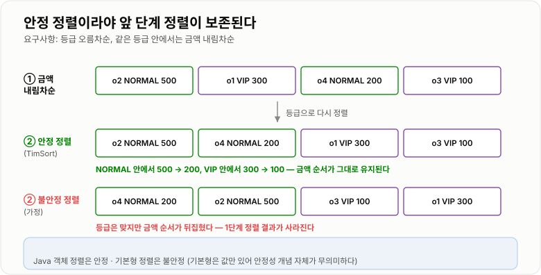

# 정렬

> **정렬(Sorting)은 데이터를 일정한 기준으로 나열하는 것이며, 그 자체가 목적이라기보다 이진 탐색·그룹화·순위 계산 같은 다른 연산을 가능하게 만드는 사전 준비다.**

---

## 1. 핵심 요약

* 비교 기반 정렬의 이론적 하한은 **O(n log n)** 이다. 이보다 빠른 비교 정렬은 존재할 수 없다.
* Java는 **자료형에 따라 완전히 다른 알고리즘**을 쓴다. 기본형은 **Dual-Pivot Quicksort**(불안정), 객체는 **TimSort**(안정)다.
* **JDK 14에서 기본형 정렬이 전면 재작성**되었다. 오래된 자료에 나오는 임계값 47·286은 더 이상 맞지 않으며, **JDK 17 실측값은 44·65**다.
* **안정 정렬(stable sort)** 은 같은 값의 원래 순서를 유지한다. "등급으로 정렬한 뒤 금액으로 정렬" 같은 다단계 정렬에서 결정적으로 중요하다.
* `Comparator` 계약을 어기면 `IllegalArgumentException: Comparison method violates its general contract!`가 난다. 단, **작은 배열에서는 검출되지 않아** 운영에서 갑자기 터진다.
* 정렬은 비싸다. 100만 개 `int[]` 정렬이 약 **120ms**, `Integer[]`는 약 **483ms**다 (JDK 17 실측). **필요 없으면 하지 않는 것이 최고의 최적화다.**

---

## 2. 등장 배경

### 해결하려는 문제

정렬 자체를 원하는 경우는 생각보다 드물다. 화면에 순서대로 보여 주는 것 정도다. **정렬이 진짜 필요한 이유는 정렬된 상태가 다른 연산을 가능하게 만들기 때문**이다.

| 정렬이 없으면            | 정렬이 있으면                       |
| ------------------ | ----------------------------- |
| 탐색은 전부 훑어야 한다 O(n) | 이진 탐색 O(log n)                |
| 중복을 찾으려면 전부 비교 O(n²) | 인접한 것만 비교 O(n)                |
| 상위 10개를 알려면 전부 비교  | 앞에서 10개만 자르면 된다               |
| 같은 값끼리 모으려면 전부 탐색   | 이미 붙어 있다                      |
| 범위 조회가 불가능하다       | 시작점만 찾으면 연속으로 읽으면 된다          |
| 두 목록을 합치면 O(n×m)   | 양쪽을 한 번씩 훑으면 O(n+m) (merge)  |

**정렬은 "한 번 O(n log n)을 지불하고 이후의 모든 연산을 싸게 만드는" 투자**다. DB가 인덱스를 만드는 것, `TreeMap`이 정렬 상태를 유지하는 것 모두 같은 발상이다.

### 이 개념이 없을 때

정렬 라이브러리가 없다면 직접 짜야 하는데, 여기서 두 가지 함정이 있다.

**첫째, 대부분 O(n²) 알고리즘을 짜게 된다.**

```java
// 흔히 처음 떠올리는 방법 — 선택 정렬 O(n²)
for (int i = 0; i < n; i++) {
    int minIdx = i;
    for (int j = i + 1; j < n; j++) {          // 중첩 반복문
        if (arr[j] < arr[minIdx]) {
            minIdx = j;
        }
    }
    int tmp = arr[i]; arr[i] = arr[minIdx]; arr[minIdx] = tmp;
}
```

n = 100만이면 **약 5000억 번**의 비교가 필요하다. `Arrays.sort`는 같은 데이터를 120ms에 끝낸다.

**둘째, 직접 짠 퀵소트는 최악 입력에서 O(n²)로 무너진다.**

```text
이미 정렬된 배열에 "첫 원소를 피벗으로" 하는 퀵소트를 쓰면
    피벗보다 작은 것이 하나도 없다 → 분할이 [0개 | 나머지 전부]
    → 재귀 깊이 n → O(n²) + StackOverflowError
```

JDK의 정렬은 이 문제들을 전부 해결해 두었다. **재귀가 깊어지면 힙 정렬로 전환**해 O(n log n)을 보장하고(JDK 17 기준 `MAX_RECURSION_DEPTH = 384`), 이미 정렬된 구간은 감지해서 그대로 활용한다.

실제로 옛날 퀵소트를 O(n²)로 무너뜨리던 톱니 패턴을 JDK 17에 넣어 봤다.

```text
톱니 패턴 100만 개 정렬 : 14.8 ms   (O(n²)라면 몇 분 단위가 나온다)
```

**정렬은 "아는 알고리즘"이 아니라 "이미 잘 만들어진 것을 쓰는 것"** 이다. 직접 짜서 이길 수 없다.

### 그렇다면 무엇을 알아야 하는가

라이브러리를 쓴다고 몰라도 되는 것은 아니다. 실무에서 실제로 문제가 되는 지점은 따로 있다.

* **안정 정렬인가?** — 다단계 정렬 결과가 달라진다
* **`Comparator`를 제대로 썼는가?** — 계약을 어기면 운영 중에 예외가 터진다
* **정렬이 정말 필요한가?** — 상위 10개만 필요한데 전체를 정렬하고 있지는 않은가
* **어디에서 정렬하는가?** — DB에서 할 일을 애플리케이션 메모리로 끌고 오지 않았는가

---

## 3. 핵심 개념

| 개념                        | 설명                                          | 중요한 이유                                    |
| ------------------------- | ------------------------------------------- | ----------------------------------------- |
| **비교 정렬의 하한 O(n log n)**  | 비교만으로 정렬하면 이보다 빠를 수 없다                      | "더 빠른 정렬 알고리즘"을 찾는 것이 무의미한 이유다            |
| **안정 정렬(Stable)**         | 같은 값의 원래 순서를 유지한다                           | 다단계 정렬의 정확성이 여기에 달려 있다                    |
| **불안정 정렬(Unstable)**      | 같은 값의 순서가 바뀔 수 있다                           | 기본형 정렬은 불안정하지만 값만 있으므로 문제되지 않는다           |
| **제자리 정렬(In-place)**      | 추가 메모리를 O(1)~O(log n)만 쓴다                   | 대용량에서 메모리 사용량을 좌우한다                       |
| **Dual-Pivot Quicksort**  | 피벗 2개로 3구간 분할하는 퀵소트. Java 기본형 정렬            | 중복이 많은 데이터에 강하다                           |
| **TimSort**               | 병합 정렬 + 삽입 정렬 혼합. Java 객체 정렬                | 실제 데이터에 흔한 "부분 정렬"을 활용한다                  |
| **run(정렬된 구간)**           | 이미 오름/내림차순인 연속 구간                           | TimSort와 JDK 14+ 기본형 정렬 모두 이것을 찾아 활용한다    |
| **삽입 정렬 전환 임계값**          | 작은 구간은 삽입 정렬이 더 빠르다                         | JDK 17 기본형 기준 44/65, 객체(TimSort) 기준 32다   |
| **재귀 깊이 제한 → 힙 정렬**       | 퀵소트가 나빠지면 힙 정렬로 갈아탄다                        | 최악에도 O(n log n)을 보장하는 장치다 (introsort 기법)  |
| **`Comparator` 계약**       | 반사성·대칭성·추이성을 만족해야 한다                        | 어기면 `IllegalArgumentException`이 난다        |
| **비교 기반이 아닌 정렬**          | 계수 정렬·기수 정렬. 값의 범위를 알면 O(n)                 | 하한 O(n log n)을 우회하는 유일한 방법이다              |
| **부분 정렬(Partial Sort)**   | 상위 k개만 정렬하기                                 | "인기 상품 10개"에 전체 정렬은 낭비다                   |

개념들의 관계는 이렇다.

```text
                      정렬해야 하는 데이터
                              │
              ┌───────────────┴───────────────┐
         값만 있다 (int, double)         객체다 (Member, Order)
              │                               │
      Dual-Pivot Quicksort              TimSort (안정)
      (불안정, 제자리)                    (안정, 임시 배열 O(n))
              │                               │
      "값이 같으면 구별 불가"            "같은 값의 순서가 의미를 가짐"
      → 안정성 개념 자체가 무의미          → 안정성이 반드시 필요
```

---

## 4. 구조와 동작 원리

### Java는 자료형에 따라 다른 알고리즘을 쓴다

이것이 Java 정렬의 가장 중요한 사실이다. **같은 `Arrays.sort`인데 안에서 하는 일이 완전히 다르다.**

| 호출                             | 내부 구현                                  | 안정성      | 추가 메모리   |
| ------------------------------ | -------------------------------------- | -------- | -------- |
| `Arrays.sort(int[])`           | `DualPivotQuicksort`                   | 불안정      | O(log n) |
| `Arrays.sort(Object[])`        | `ComparableTimSort`                    | **안정**   | O(n)     |
| `Arrays.sort(T[], Comparator)` | `TimSort`                              | **안정**   | O(n)     |
| `Collections.sort(List)`       | `List.sort` → `Arrays.sort(Object[])`  | **안정**   | O(n)     |
| `Arrays.parallelSort(...)`     | 병합 정렬 기반 Fork/Join                     | 타입에 따름   | O(n)     |

**왜 다르게 만들었는가?**

```text
기본형 (int, long, double ...)
    값 자체가 전부다. 3과 3은 구별할 방법이 없다.
    → 안정성이 아무 의미가 없다
    → 안정성을 포기하고 메모리를 아끼는 퀵소트를 쓴다

객체 (Member, Order ...)
    "점수가 같은 두 사람"은 서로 다른 객체다.
    → 원래 순서가 의미를 가진다
    → 메모리를 더 쓰더라도 안정 정렬(TimSort)을 쓴다
```

`Integer[]`처럼 **박싱된 타입은 객체**이므로 TimSort를 탄다. 그래서 `int[]`와 `Integer[]`는 성능이 크게 다르다. **JDK 17 실측**이다.

| 100만 개 무작위 정렬 | 시간         | 비고                     |
| ------------- | ---------- | ---------------------- |
| `int[]`       | **104 ms** | Dual-Pivot Quicksort   |
| `Integer[]`   | **483 ms** | TimSort + 박싱 객체 참조 추적 |

**약 4.6배 차이**다. 박싱은 정렬에서 확실한 비용이다.


*같은 `Arrays.sort` 호출이라도 자료형과 크기에 따라 완전히 다른 알고리즘이 동작한다.*

### 기본형 정렬 — JDK 14에서 완전히 바뀌었다

`Arrays.sort(int[])`가 쓰는 `DualPivotQuicksort`는 **JDK 14에서 전면 재작성**되었다. 그 결과 널리 인용되던 임계값들이 더 이상 맞지 않는다.

JDK 17.0.12에서 리플렉션으로 직접 읽은 상수들이다.

| 상수                                     | JDK 17 실측값  | 의미                             |
| -------------------------------------- | ---------: | ------------------------------ |
| `MAX_INSERTION_SORT_SIZE`              |     **44** | 이 크기 이하는 삽입 정렬                 |
| `MAX_MIXED_INSERTION_SORT_SIZE`        |     **65** | 이 크기 이하는 혼합 삽입 정렬              |
| `MIN_TRY_MERGE_SIZE`                   |      4,096 | 이 크기 이상이면 "이미 정렬됨"인지 먼저 확인한다   |
| `MIN_FIRST_RUN_SIZE`                   |         16 | 정렬된 구간으로 인정할 최소 길이             |
| `MIN_FIRST_RUNS_FACTOR`                |          7 | 병합이 이득인지 판단하는 계수               |
| `MAX_RUN_CAPACITY`                     |      5,120 | 추적할 run 개수의 상한                 |
| `MAX_RECURSION_DEPTH`                  |    **384** | 이 깊이를 넘으면 **힙 정렬로 전환**         |
| `DELTA`                                |          6 | 재귀 1단계마다 더해지는 값 (384/6 = 64단계) |
| `MIN_PARALLEL_SORT_SIZE`               |      4,096 | 병렬 정렬을 시도하는 최소 크기              |
| `MIN_BYTE_COUNTING_SORT_SIZE`          |     **64** | `byte[]`는 이 이상이면 계수 정렬         |
| `MIN_SHORT_OR_CHAR_COUNTING_SORT_SIZE` |  **1,750** | `short[]`/`char[]`는 이 이상이면 계수 정렬 |

!!! warning "오래된 자료를 그대로 옮기면 틀린다"
    "`INSERTION_SORT_THRESHOLD = 47`, `QUICKSORT_THRESHOLD = 286`"이라는 설명은 인터넷에 널리 퍼져 있지만, 이는 **JDK 13 이전 구현**의 값이다. JDK 14에서 `DualPivotQuicksort`가 전면 재작성되면서 상수 이름과 값이 모두 바뀌었다. 위 표는 **JDK 17.0.12에서 직접 읽은 값**이다.

동작 흐름은 이렇게 갈라진다.

```text
Arrays.sort(int[] a)
   │
   ├─ 크기 ≤ 44           →  삽입 정렬 (Insertion Sort)
   │
   ├─ 크기 ≤ 65           →  혼합 삽입 정렬 (핀 삽입 + 짝 삽입)
   │
   ├─ 크기 ≥ 4,096        →  "이미 정렬된 구간(run)"이 있는지 먼저 확인
   │                        └─ 충분히 있으면 → 병합 정렬 (merge)
   │
   ├─ 재귀 깊이 > 384/6=64 →  힙 정렬 (Heap Sort)로 전환
   │                        (퀵소트가 최악으로 흐르는 것을 차단)
   │
   └─ 그 외               →  Dual-Pivot Quicksort (피벗 2개, 3구간 분할)
```

### Dual-Pivot Quicksort — 피벗을 두 개 쓰는 이유

일반 퀵소트는 피벗 하나로 **2구간**으로 나눈다. Dual-Pivot은 피벗 둘로 **3구간**으로 나눈다.

```text
일반 퀵소트 (피벗 1개)
    [ P보다 작음 ][ P ][ P보다 큼 ]

Dual-Pivot (피벗 2개, P1 < P2)
    [ < P1 ][ P1 ][ P1 ≤ x ≤ P2 ][ P2 ][ > P2 ]
                    ↑
              가운데 구간에 P1, P2 와 같은 값이 모두 모인다
              → 이 구간은 더 이상 재귀하지 않아도 된다
```

**중복이 많은 데이터에서 압도적으로 유리하다.** 같은 값들이 가운데 구간에 몰리고, 그 구간은 재귀 대상에서 제외되기 때문이다. **JDK 17 실측**으로 확인된다.

| 200만 개 `int[]` | 정렬 시간       | 비고                    |
| -------------- | ----------- | --------------------- |
| 값이 3종류뿐        | **16.5 ms** | 3구간 분할로 대부분 즉시 정리된다   |
| 전부 다른 값        | 146.6 ms    | 정상적인 O(n log n) 동작    |

**약 9배 차이**다. "상태값이 몇 개뿐인 컬럼"을 정렬할 때 실제로 매우 빠르다.

### TimSort — 실제 데이터는 완전히 무작위가 아니다

객체 정렬이 쓰는 TimSort의 발상은 이렇다. **현실의 데이터는 완전한 무작위가 아니라 이미 부분적으로 정렬되어 있는 경우가 많다.**

```text
예: "최근 주문 목록"은 대체로 시간순이다
    [1일, 2일, 3일, 5일, 4일, 6일, 7일, 8일, 9일]
     └────── 이미 정렬됨 ──────┘      └── 이미 정렬됨 ──┘
                     ↑
              여기 하나만 어긋났다

무작위라고 가정하고 전부 다시 정렬하면 낭비다.
이미 정렬된 구간(run)을 찾아 병합만 하면 훨씬 빠르다.
```

TimSort의 동작은 세 단계다.

```text
1. run 찾기
   배열을 훑으며 이미 오름차순(또는 내림차순)인 연속 구간을 찾는다.
   내림차순이면 뒤집어서 오름차순 run 으로 만든다.

2. 짧은 run 늘리기
   run 이 MIN_MERGE(32)보다 짧으면
   이진 삽입 정렬로 32개까지 채워서 run 을 키운다.

3. run 병합
   스택에 쌓아 두었다가 크기 균형 규칙에 맞춰 병합한다.
   비슷한 크기끼리 병합해야 전체 비용이 최소가 된다.
```

JDK 17에서 확인한 TimSort 상수다.

| 상수                          | JDK 17 실측값 | 의미                            |
| --------------------------- | --------: | ----------------------------- |
| `MIN_MERGE`                 |    **32** | run 최소 길이. 이보다 짧으면 삽입 정렬로 채운다 |
| `MIN_GALLOP`                |     **7** | 갤로핑 모드 진입 임계값                 |
| `INITIAL_TMP_STORAGE_LENGTH` |       256 | 병합용 임시 배열 초기 크기               |

**이미 정렬된 데이터에서 TimSort는 O(n)** 이다. run 하나만 찾으면 끝나기 때문이다. **JDK 17 실측**이다.

| 200만 개 정렬  | `int[]`      | `Integer[]` (TimSort) |
| ---------- | ------------ | --------------------- |
| 무작위 입력     | 227.9 ms     | 1031.1 ms             |
| **정렬된 입력** | **5.9 ms**   | **11.1 ms**           |
| **역순 입력**  | **11.9 ms**  | **25.4 ms**           |

**정렬된 입력은 무작위 대비 약 39~93배 빠르다.** 역순도 마찬가지로 빠른데, TimSort가 내림차순 구간을 발견하면 뒤집어서 하나의 run으로 만들기 때문이다. JDK 14+ 기본형 정렬도 같은 최적화를 갖췄다.

이것이 실무적으로 의미하는 바가 크다. **DB에서 `ORDER BY`로 정렬해 온 데이터를 애플리케이션에서 같은 기준으로 다시 정렬하면 거의 공짜다.** 반면 다른 기준으로 다시 정렬하면 전액을 지불한다.

### 안정 정렬이 왜 중요한가

**안정 정렬은 값이 같은 원소들의 원래 순서를 보존한다.**

```text
정렬 전:   A(1)  B(1)  C(1)  D(0)
                        (괄호 안이 정렬 기준값)

안정 정렬 결과 :  D(0)  A(1)  B(1)  C(1)
                        └─ A,B,C 원래 순서 유지 ─┘

불안정 정렬 결과:  D(0)  C(1)  A(1)  B(1)
                        └─ 순서가 뒤섞일 수 있음 ─┘
```

JDK 17에서 `Arrays.sort(Object[], Comparator)`로 실측한 결과는 **`DABC`** 였다. 동점인 A·B·C의 원래 순서가 그대로 유지되었다. **객체 정렬은 안정 정렬임이 확인된다.**

이것이 실무에서 결정적인 이유는 **다단계 정렬**이다.

```text
요구사항: "등급 오름차순으로 정렬하되, 같은 등급 안에서는 금액 내림차순"

방법 A. 안정 정렬 두 번 (중요도가 낮은 것부터)
    1) 금액 내림차순으로 정렬
    2) 등급 오름차순으로 정렬  ← 안정 정렬이라 금액 순서가 보존된다

방법 B. 비교자 하나로 두 조건을 한 번에
    compare() 안에서 등급을 먼저 비교하고, 같으면 금액을 비교
```

방법 A를 JDK 17에서 실제로 돌린 결과다.

```text
1) 금액 내림차순     : [o2/NORMAL/500, o1/VIP/300, o4/NORMAL/200, o3/VIP/100]
2) 등급으로 재정렬   : [o2/NORMAL/500, o4/NORMAL/200, o1/VIP/300, o3/VIP/100]
                        └── NORMAL: 500 → 200 ──┘  └── VIP: 300 → 100 ──┘

  등급 안에서 금액 내림차순이 그대로 유지되었다.
  불안정 정렬이었다면 이 결과가 깨진다.
```

**둘 다 정답이지만 방법 B가 안전하다.** 방법 A는 "정렬이 안정적"이라는 전제에 의존하는데, 나중에 누군가 `int[]`로 바꾸거나 병렬 정렬로 바꾸면 조용히 깨진다.



*안정 정렬이라야 앞 단계의 정렬 결과가 뒤 단계에서 보존된다.*

### `Comparator` 계약 위반 — 작은 배열에서는 안 터진다

TimSort는 병합 과정에서 비교 결과의 일관성을 가정한다. 비교자가 모순된 답을 주면 내부 상태가 망가지고 예외를 던진다.

```text
java.lang.IllegalArgumentException: Comparison method violates its general contract!
```

**JDK 17에서 무작위 값을 반환하는(계약을 어긴) 비교자로 크기별 실측한 결과다.**

| 배열 크기   | 결과                                                        |
| ------- | --------------------------------------------------------- |
| 16      | 예외 없음                                                     |
| 32      | 예외 없음                                                     |
| 64      | 예외 없음                                                     |
| 128     | 예외 없음                                                     |
| 256     | 예외 없음                                                     |
| 512     | 예외 없음                                                     |
| **1024** | **`IllegalArgumentException: Comparison method violates its general contract!`** |
| 4096    | 동일하게 예외 발생                                                |
| 100,000 | 동일하게 예외 발생                                                |

**이것이 실무에서 가장 무서운 지점이다.** 작은 배열에서는 계약을 어겨도 조용히 통과한다. 테스트 데이터는 대개 작으므로 **테스트는 통과하고, 운영 데이터가 커지는 순간 예외가 터진다.**

(정확한 경계는 비교자가 어떤 모순을 만드는지에 따라 달라진다. 여기서는 무작위 비교자 기준으로 512와 1024 사이에서 갈렸다.)

계약을 어기는 대표적인 코드는 이렇다.

```java
// 1. 뺄셈 — 오버플로로 부호가 뒤집힌다
return a.getValue() - b.getValue();

// 2. 불완전한 비교 — 같은 경우를 0으로 처리하지 않음
return a.getScore() > b.getScore() ? 1 : -1;      // 같을 때도 -1

// 3. 비교 중에 값이 바뀜 — 가변 필드를 기준으로 삼음
return a.getUpdatedAt().compareTo(b.getUpdatedAt());  // 정렬 중 다른 스레드가 수정
```

---

## 5. 코드 또는 사용 예시

### 기본 사용

```java
import java.util.ArrayList;
import java.util.Arrays;
import java.util.Collections;
import java.util.Comparator;
import java.util.List;

public class SortBasics {

    public static void main(String[] args) {
        // 1. 기본형 배열 — Dual-Pivot Quicksort, 불안정
        int[] numbers = {5, 2, 8, 1, 9};
        Arrays.sort(numbers);
        System.out.println(Arrays.toString(numbers));   // [1, 2, 5, 8, 9]

        // 2. 일부 구간만 정렬
        int[] partial = {5, 2, 8, 1, 9};
        Arrays.sort(partial, 1, 4);                     // index 1 이상 4 미만
        System.out.println(Arrays.toString(partial));   // [5, 1, 2, 8, 9]

        // 3. 객체 배열 — TimSort, 안정
        String[] names = {"charlie", "alice", "bob"};
        Arrays.sort(names);
        System.out.println(Arrays.toString(names));     // [alice, bob, charlie]

        // 4. 리스트
        List<Integer> list = new ArrayList<>(Arrays.asList(5, 2, 8, 1, 9));
        Collections.sort(list);                          // 예전 방식
        list.sort(null);                                 // 같은 동작 (자연 순서)
        System.out.println(list);                        // [1, 2, 5, 8, 9]

        // 5. 내림차순
        Integer[] boxed = {5, 2, 8, 1, 9};
        Arrays.sort(boxed, Collections.reverseOrder());
        System.out.println(Arrays.toString(boxed));      // [9, 8, 5, 2, 1]
    }
}
```

기본형 배열에는 **내림차순 정렬 메서드가 없다.** `Arrays.sort(int[], Comparator)` 같은 오버로드가 존재하지 않기 때문이다. 방법은 두 가지다.

```java
// 방법 1. 오름차순 정렬 후 뒤집기 (권장 — int[] 그대로 사용)
int[] arr = {5, 2, 8, 1, 9};
Arrays.sort(arr);
for (int i = 0; i < arr.length / 2; i++) {
    int tmp = arr[i];
    arr[i] = arr[arr.length - 1 - i];
    arr[arr.length - 1 - i] = tmp;
}

// 방법 2. Integer[] 로 바꿔서 비교자 사용 (박싱 비용 발생 — 실측 약 4.6배)
Integer[] boxed = new Integer[arr.length];
for (int i = 0; i < arr.length; i++) {
    boxed[i] = arr[i];
}
Arrays.sort(boxed, Collections.reverseOrder());
```

### 객체 정렬 — 정통 방식

```java
import java.util.ArrayList;
import java.util.Comparator;
import java.util.List;

public class OrderSort {

    public static class Order {
        private final String id;
        private final String grade;
        private final int amount;

        public Order(String id, String grade, int amount) {
            this.id = id;
            this.grade = grade;
            this.amount = amount;
        }

        public String getId() { return id; }
        public String getGrade() { return grade; }
        public int getAmount() { return amount; }

        @Override
        public String toString() {
            return id + "/" + grade + "/" + amount;
        }
    }

    /** 등급 오름차순, 같은 등급이면 금액 내림차순 — 비교자 하나로 처리 */
    public static class OrderComparator implements Comparator<Order> {
        @Override
        public int compare(Order a, Order b) {
            int byGrade = a.getGrade().compareTo(b.getGrade());
            if (byGrade != 0) {
                return byGrade;
            }
            return Integer.compare(b.getAmount(), a.getAmount());   // 내림차순
        }
    }

    public static void main(String[] args) {
        List<Order> orders = new ArrayList<>();
        orders.add(new Order("o1", "VIP", 300));
        orders.add(new Order("o2", "NORMAL", 500));
        orders.add(new Order("o3", "VIP", 100));
        orders.add(new Order("o4", "NORMAL", 200));

        orders.sort(new OrderComparator());
        System.out.println(orders);
        // [o2/NORMAL/500, o4/NORMAL/200, o1/VIP/300, o3/VIP/100]
    }
}
```

핵심 부분을 짚으면 이렇다.

```java
return Integer.compare(b.getAmount(), a.getAmount());
```

**절대 `b.getAmount() - a.getAmount()`로 쓰지 않는다.** 값이 크면 오버플로로 부호가 뒤집힌다. JDK 17에서 실측하면 `Integer.MAX_VALUE - (-1)`은 양수가 아니라 **`-2147483648`** 이 나온다.

```java
if (byGrade != 0) { return byGrade; }
```

**첫 기준이 결정되면 즉시 반환한다.** 이 구조를 지키지 않으면 두 번째 기준이 첫 번째를 덮어써서 계약이 깨진다.

### 상위 k개만 필요할 때 — 전체 정렬은 낭비다

```java
import java.util.ArrayList;
import java.util.Comparator;
import java.util.List;
import java.util.PriorityQueue;

public class TopK {

    /**
     * 100만 개에서 상위 10개만 필요하다면 전체 정렬은 O(n log n) 낭비다.
     * 크기 k인 최소 힙을 유지하면 O(n log k) 로 끝난다.
     */
    public static List<Integer> topK(int[] data, int k) {
        PriorityQueue<Integer> minHeap = new PriorityQueue<>(k);

        for (int i = 0; i < data.length; i++) {
            if (minHeap.size() < k) {
                minHeap.offer(data[i]);
            } else if (data[i] > minHeap.peek()) {
                minHeap.poll();               // 가장 작은 것을 버리고
                minHeap.offer(data[i]);       // 새 값을 넣는다
            }
        }

        List<Integer> result = new ArrayList<>(minHeap);
        result.sort(Comparator.reverseOrder());
        return result;
    }
}
```

```text
n = 1,000,000,  k = 10 일 때

전체 정렬 : O(n log n) = 1,000,000 × 20 = 2천만 번 비교
최소 힙   : O(n log k) = 1,000,000 ×  3.3 = 330만 번 비교

  약 6배 차이. n이 커질수록 격차가 벌어진다.
```

**"상위 N개"라는 요구사항에 `sort()` 후 `subList()`를 쓰고 있다면 개선 여지가 있다.**

### 병렬 정렬 — 언제 이득인가

```java
import java.util.Arrays;

public class ParallelSort {

    public static void main(String[] args) {
        int[] big = new int[10_000_000];
        // ... 데이터 채우기 ...

        Arrays.parallelSort(big);   // Fork/Join 공통 풀을 사용한다
    }
}
```

JDK 17, **6코어 환경에서 1000만 개 `int[]` 실측 결과**다.

| 방식                    | 시간          | 비고                 |
| --------------------- | ----------- | ------------------ |
| `Arrays.sort`         | 846.4 ms    | 단일 스레드             |
| `Arrays.parallelSort` | **236.9 ms** | 약 3.6배 빠름 (6코어 기준) |

효과가 크지만 **아무 때나 쓰면 안 된다.**

```text
parallelSort 를 쓰기 전에 확인할 것

1. 배열이 충분히 큰가?
   JDK 17 실측 Arrays.MIN_ARRAY_SORT_GRAN = 8192
   이보다 작은 조각은 나누지 않고 단일 스레드로 처리한다
   → 작은 배열에서는 오히려 스레드 관리 비용만 든다

2. 공통 ForkJoinPool 을 써도 되는가?
   parallelSort 는 ForkJoinPool.commonPool() 을 사용한다.
   웹 서버에서 여러 요청이 동시에 호출하면 서로 스레드를 뺏는다.
   → 요청당 처리에는 신중해야 한다

3. 메모리 여유가 있는가?
   병합 정렬 기반이라 O(n) 임시 배열이 필요하다
```

**배치 작업처럼 단독으로 도는 대용량 처리에는 적합하고, 요청당 처리에는 부적합하다.**

### 정렬하지 않는 것이 최선인 경우

```java
// 나쁜 예 — 최댓값을 구하려고 정렬한다
int[] copy = data.clone();
Arrays.sort(copy);
int max = copy[copy.length - 1];        // O(n log n)

// 좋은 예 — 한 번 훑으면 된다
int max = data[0];
for (int i = 1; i < data.length; i++) {
    if (data[i] > max) {
        max = data[i];
    }
}                                        // O(n)
```

```java
// 나쁜 예 — 중복 제거를 위해 정렬한다
Arrays.sort(arr);                        // O(n log n)
// ... 인접 비교로 중복 제거 ...

// 좋은 예 — HashSet 이면 O(n)
Set<Integer> unique = new HashSet<>();
for (int i = 0; i < arr.length; i++) {
    unique.add(arr[i]);
}                                        // O(n)
```

**정렬이 필요한지 먼저 묻는 습관이 가장 큰 최적화다.**

---

## 6. 성능 특성

### 주요 정렬 알고리즘 비교

| 알고리즘                     | 평균         | 최악           | 공간       | 안정성 | Java에서의 위치       |
| ------------------------ | ---------- | ------------ | -------- | --- | ---------------- |
| 버블 정렬                    | O(n²)      | O(n²)        | O(1)     | 안정  | 교육용              |
| 선택 정렬                    | O(n²)      | O(n²)        | O(1)     | 불안정 | 교육용              |
| **삽입 정렬**                | O(n²)      | O(n²)        | O(1)     | 안정  | **작은 구간에서 실제 사용** |
| 병합 정렬                    | O(n log n) | O(n log n)   | O(n)     | 안정  | TimSort의 기반      |
| 퀵소트                      | O(n log n) | **O(n²)**    | O(log n) | 불안정 | Dual-Pivot의 기반   |
| 힙 정렬                     | O(n log n) | O(n log n)   | O(1)     | 불안정 | **최악 대비 안전망**    |
| **Dual-Pivot Quicksort** | O(n log n) | O(n log n)\* | O(log n) | 불안정 | **기본형 정렬**       |
| **TimSort**              | O(n log n) | O(n log n)   | O(n)     | 안정  | **객체 정렬**        |
| 계수 정렬                    | O(n + k)   | O(n + k)     | O(k)     | 안정  | `byte`/`short` 내부 |
| 기수 정렬                    | O(d × n)   | O(d × n)     | O(n + k) | 안정  | 라이브러리 미사용        |

\* Dual-Pivot Quicksort 단독의 최악은 O(n²)지만, JDK 14+ 구현은 재귀 깊이가 `MAX_RECURSION_DEPTH`(384)를 넘으면 **힙 정렬로 전환**하므로 전체적으로 O(n log n)이 보장된다.

**삽입 정렬이 O(n²)인데도 실제로 쓰이는 이유**는 작은 데이터에서 상수 배수가 매우 작기 때문이다. 재귀 호출·피벗 선택·임시 배열 할당 같은 오버헤드가 없어 44개 이하에서는 퀵소트보다 빠르다. 그래서 JDK가 명시적으로 전환한다.

### JDK 17 실측 성능

측정 환경: JDK 17.0.12, 6코어.

| 측정 항목                  | 시간          | 해석                       |
| ---------------------- | ----------- | ------------------------ |
| `int[]` 100만 무작위       | 104.0 ms    | 기준선                      |
| `Integer[]` 100만 무작위   | 482.9 ms    | **박싱으로 약 4.6배**          |
| `int[]` 200만 무작위       | 227.9 ms    | n에 대해 거의 선형적으로 증가        |
| `int[]` 200만 **정렬됨**   | **5.9 ms**  | **약 39배 빠름** — run 감지 효과 |
| `int[]` 200만 **역순**    | **11.9 ms** | 역순도 하나의 run으로 인식         |
| `Integer[]` 200만 무작위   | 1031.1 ms   | TimSort + 박싱             |
| `Integer[]` 200만 **정렬됨** | **11.1 ms** | **약 93배 빠름**             |
| `Integer[]` 200만 **역순** | **25.4 ms** | 뒤집어서 run으로 활용            |
| `int[]` 200만 (값 3종류)   | **16.5 ms** | **3구간 분할로 약 9배 빠름**      |
| `int[]` 1000만 단일 스레드   | 846.4 ms    | 기준선                      |
| `int[]` 1000만 병렬       | **236.9 ms** | **6코어에서 약 3.6배**         |
| 톱니 패턴 100만             | 14.8 ms     | O(n²)로 무너지지 않음           |

여기서 얻는 실무 지침은 셋이다.

1. **박싱을 피하라.** `int[]`와 `Integer[]`는 약 4.6배 차이다.
2. **이미 정렬된 데이터는 거의 공짜로 다시 정렬된다.** DB `ORDER BY` 결과를 같은 기준으로 다시 정렬하는 것은 비용이 거의 없다.
3. **중복이 많으면 오히려 빠르다.** 상태값 같은 저카디널리티 컬럼 정렬을 걱정할 필요는 없다.

### 공간 복잡도

| 정렬                          | 추가 메모리       | 100만 개 기준 대략           |
| --------------------------- | ------------ | --------------------- |
| `Arrays.sort(int[])`        | O(log n)     | 수 KB (재귀 스택)          |
| `Arrays.sort(Object[])`     | **O(n)**     | 참조 배열 약 4MB + 원본      |
| `Arrays.parallelSort(...)`  | **O(n)**     | 동일                    |
| `Collections.sort(List)`    | **O(n)**     | 리스트를 배열로 복사한 뒤 다시 채운다 |

`Collections.sort`가 내부적으로 배열을 만든다는 점은 자주 간과된다.

```text
Collections.sort(list)
   → list.sort(null)
       → Object[] a = toArray()          ← O(n) 복사
       → Arrays.sort(a, c)               ← TimSort, 추가로 O(n)
       → ListIterator 로 리스트에 다시 쓴다  ← O(n)

  100만 개 리스트를 정렬하면 순간적으로 배열 2개 분량의 메모리를 더 쓴다.
```

---

## 7. 장점과 단점

| 장점                    | 이유                                              |
| --------------------- | ----------------------------------------------- |
| 이후 모든 연산을 싸게 만든다      | 이진 탐색 O(log n), 중복 제거 O(n), 범위 조회가 가능해진다        |
| 라이브러리가 매우 잘 최적화되어 있다  | 최악 O(n log n) 보장, run 감지, 크기별 알고리즘 전환이 이미 들어 있다 |
| 객체 정렬은 안정 정렬이다        | 다단계 정렬을 안전하게 조합할 수 있다                           |
| 이미 정렬된 데이터에 매우 빠르다    | run을 감지해 O(n)에 가깝게 처리한다 (실측 약 39~93배)           |
| 중복이 많으면 오히려 빠르다       | Dual-Pivot의 3구간 분할 덕분이다 (실측 약 9배)               |
| 병렬화가 쉽다               | `parallelSort`로 코어 수만큼 이득을 볼 수 있다 (실측 약 3.6배)   |
| 결과가 결정적이다             | 같은 입력에 항상 같은 결과가 나와 테스트하기 쉽다                    |

| 단점                       | 이유 및 주의점                                       |
| ------------------------ | ---------------------------------------------- |
| 비교 정렬은 O(n log n)을 못 넘는다 | 이론적 하한이다. 더 빠르려면 계수·기수 정렬로 가야 한다               |
| 절대 비용이 크다                | 100만 개 `int[]` 약 120ms. 요청마다 하면 응답 시간에 직결된다    |
| 객체 정렬은 O(n) 메모리를 쓴다      | 대용량에서 GC 압박과 `OutOfMemoryError` 위험이 있다         |
| 박싱 비용이 크다                | `int[]` 대비 `Integer[]`가 약 4.6배 느리다 (실측)         |
| `Comparator` 계약 위반이 늦게 드러난다 | **작은 배열에서는 예외가 안 난다.** 테스트 통과 후 운영에서 터진다       |
| 기본형은 내림차순 API가 없다        | 뒤집거나 박싱해야 한다                                   |
| 전체 정렬이 과잉인 경우가 많다        | 상위 k개만 필요하면 힙으로 O(n log k)면 된다                 |
| 정렬 기준이 가변 필드면 결과가 깨진다    | 정렬 중 값이 바뀌면 계약 위반이 되어 예외가 나거나 결과가 틀린다          |

---

## 8. 사용 기준

### 정렬해야 하는 상황

* 결과를 **순서대로 보여 줘야** 할 때 (목록 화면, 리포트)
* **이진 탐색**을 반복적으로 수행해야 할 때
* **중복 제거**나 **그룹화**를 해야 하는데 해시를 쓸 수 없을 때
* 두 정렬된 목록을 **병합**해야 할 때 (O(n+m))
* **순위·백분위**를 계산해야 할 때
* 정렬 순서 자체가 **비즈니스 요구사항**일 때

### 정렬하지 않는 것이 좋은 상황

* **최댓값·최솟값만** 필요할 때 → 한 번 순회 O(n)
* **상위 k개만** 필요할 때 → 힙 O(n log k)
* **중복 제거만** 필요할 때 → `HashSet` O(n)
* **존재 여부만** 확인할 때 → `HashSet` O(1)
* **DB에서 이미 정렬**해 올 수 있을 때 → `ORDER BY` + 인덱스
* 데이터가 **계속 변해서** 매번 다시 정렬해야 할 때 → `TreeMap`/`PriorityQueue`

### 선택 기준

1. **정렬이 정말 필요한가?** — 최댓값·상위 k개·중복 제거는 정렬 없이 더 싸게 된다
2. **어디에서 정렬할 것인가?** — DB가 인덱스로 정렬할 수 있으면 DB가 낫다
3. **안정성이 필요한가?** — 다단계 정렬이면 반드시 안정 정렬이어야 한다
4. **기본형인가 객체인가?** — 가능하면 `int[]`를 써서 박싱을 피한다
5. **얼마나 큰가?** — 수백만 개 이상이면 `parallelSort`를, 단 실행 환경을 확인한다
6. **몇 번 정렬하는가?** — 반복해서 정렬한다면 정렬 상태를 유지하는 자료구조로 바꾼다

```text
              정렬이 정말 필요한가?
                      │
      ┌───────────────┴───────────────┐
    아니오                            예
      │                               │
  최댓값 → 순회 O(n)            DB에서 할 수 있는가?
  상위 k → 힙 O(n log k)              │
  중복제거 → HashSet O(n)      ┌──────┴──────┐
  존재확인 → HashSet O(1)     예            아니오
                              │              │
                        ORDER BY      다단계 정렬인가?
                        + 인덱스             │
                                     ┌──────┴──────┐
                                   예            아니오
                                     │              │
                              비교자 하나로      단일 비교자
                              모든 조건 처리      Arrays.sort
                              (안정성 의존 회피)
```

---

## 9. 비슷한 개념 비교

### Dual-Pivot Quicksort와 TimSort

| 비교 항목    | Dual-Pivot Quicksort  | TimSort              | 선택 기준          |
| -------- | --------------------- | -------------------- | -------------- |
| 적용 대상    | 기본형 배열 (`int[]` 등)    | 객체 배열, `List`        | Java가 자동 선택    |
| 안정성      | 불안정                   | **안정**               | 값만 있으면 무의미     |
| 추가 메모리   | **O(log n)**          | O(n)                 | 대용량이면 기본형이 유리  |
| 평균 성능    | 빠름 (100만 개 104ms)     | 느림 (100만 개 483ms)    | 실측 약 4.6배 차이   |
| 정렬된 입력   | **O(n)에 가까움** (JDK 14+) | **O(n)**             | 양쪽 다 매우 빠름     |
| 중복 많은 입력 | **매우 빠름** (3구간 분할)    | 보통                   | 실측 약 9배 차이     |
| 최악 보장    | 힙 정렬 전환으로 O(n log n)  | O(n log n)           | 둘 다 안전         |
| 삽입 정렬 전환 | 44개 / 65개 (JDK 17 실측) | 32개 (`MIN_MERGE`)    | 구현 세부          |

### 안정 정렬과 불안정 정렬

| 비교 항목    | 안정 정렬              | 불안정 정렬            | 선택 기준          |
| -------- | ------------------ | ----------------- | -------------- |
| 같은 값의 순서 | **보존됨**            | 보장 없음             | 다단계 정렬 여부      |
| 대표 알고리즘  | 병합 정렬, 삽입 정렬, TimSort | 퀵소트, 힙 정렬, 선택 정렬  | -              |
| 추가 메모리   | 대체로 O(n) 필요        | O(1)~O(log n)     | 메모리 제약         |
| 속도       | 보통 조금 느림           | 보통 조금 빠름          | 안정성이 필요한가      |
| Java에서   | 객체 정렬 전부           | 기본형 정렬 전부         | 자료형이 결정        |
| 실무 영향    | 다단계 정렬 결과의 정확성     | 값만 있으면 차이 없음      | 객체 정렬이면 안정성 확인 |

### 애플리케이션 정렬과 DB 정렬

| 비교 항목  | 애플리케이션 `sort()` | DB `ORDER BY`      | 선택 기준         |
| ------ | --------------- | ------------------ | ------------- |
| 대상 위치  | JVM 힙 메모리       | DB 서버              | 데이터를 어디까지 옮기나 |
| 네트워크 비용 | 전체 데이터를 가져와야 함  | 필요한 만큼만 가져옴        | **DB가 압도적 유리** |
| 인덱스 활용 | 불가능             | **정렬된 인덱스를 그대로 읽음** | 인덱스가 있으면 DB   |
| 메모리 압박 | 애플리케이션 힙        | DB 서버 (또는 인덱스로 회피) | OOM 위험 관리     |
| 페이지네이션 | 전체를 가져와서 자름     | `LIMIT`으로 필요한 만큼만  | **DB가 압도적 유리** |
| 복잡한 기준 | 자유롭게 표현 가능      | SQL로 표현 가능한 범위     | 기준의 복잡도       |
| 적합한 상황 | 이미 가져온 소량 데이터   | 대량 데이터, 페이지네이션     | **기본은 DB**    |

**"DB에서 전부 가져와서 애플리케이션에서 정렬하고 앞의 20개만 쓰는" 코드**는 실무에서 흔한 성능 문제다. 100만 건을 네트워크로 옮기고 힙에 올린 뒤 999,980건을 버리는 셈이다.

### 전체 정렬과 부분 정렬

| 비교 항목  | 전체 정렬              | 상위 k개 (힙)        | 선택 기준     |
| ------ | ------------------ | ---------------- | --------- |
| 복잡도    | O(n log n)         | **O(n log k)**   | k가 n보다 작으면 힙 |
| 100만/10 | 약 2천만 번 비교         | 약 330만 번 비교      | 약 6배 차이   |
| 메모리    | O(n) (객체 정렬)       | **O(k)**         | k만 유지     |
| 결과     | 전부 정렬됨             | 상위 k개만           | 요구사항에 맞춰  |
| 스트리밍   | 불가능 (전체가 있어야 함)    | **가능** (하나씩 처리)  | 데이터가 흘러올 때 |
| 적합한 상황 | 전체 순서가 필요할 때       | 랭킹, 인기 목록, Top-N | 요구사항 확인   |

---

## 10. 백엔드 실무 적용

### Spring·Java

**가장 흔한 문제는 정렬 위치를 잘못 잡는 것이다.**

```java
// 나쁜 예 — 100만 건을 전부 가져와서 메모리에서 정렬하고 20개만 쓴다
public List<Order> recentOrders() {
    List<Order> all = orderRepository.findAll();          // 100만 건
    all.sort(new Comparator<Order>() {
        public int compare(Order a, Order b) {
            return b.getCreatedAt().compareTo(a.getCreatedAt());
        }
    });
    return all.subList(0, 20);                             // 999,980건 버림
}
```

```java
// 좋은 예 — DB가 인덱스로 정렬하고 20건만 보낸다
public List<Order> recentOrders() {
    return orderRepository.findAll(
            PageRequest.of(0, 20, Sort.by(Sort.Direction.DESC, "createdAt")));
}
```

**차이는 정렬 알고리즘이 아니라 "얼마나 많은 데이터를 옮기고 힙에 올리는가"다.** 네트워크 전송, 객체 생성, GC 압박, 정렬 비용이 전부 사라진다.

**정렬 기준을 가변 필드로 잡는 것**도 위험하다.

```java
// 위험 — 정렬 도중 다른 스레드가 updatedAt 을 바꾸면
//        비교 결과가 앞뒤로 달라져 계약 위반이 된다
orders.sort(new Comparator<Order>() {
    public int compare(Order a, Order b) {
        return a.getUpdatedAt().compareTo(b.getUpdatedAt());
    }
});

// 안전 — 정렬 전에 스냅샷을 뜨거나 불변 필드를 기준으로 삼는다
List<Order> snapshot = new ArrayList<>(orders);
snapshot.sort(new Comparator<Order>() {
    public int compare(Order a, Order b) {
        return Long.compare(a.getId(), b.getId());   // 불변 필드
    }
});
```

JPA에서는 **연관 컬렉션 정렬**에 주의해야 한다.

```java
// @OrderBy — DB에서 ORDER BY 로 정렬해서 가져온다 (권장)
@OneToMany(mappedBy = "order")
@OrderBy("createdAt DESC")
private List<OrderItem> items = new ArrayList<>();

// @OrderColumn — 순서를 저장하는 컬럼을 별도로 관리한다
// 중간 삽입·삭제 시 뒤 항목의 인덱스를 전부 갱신하는 UPDATE 가 발생한다
@OneToMany(mappedBy = "order")
@OrderColumn(name = "item_order")
private List<OrderItem> items = new ArrayList<>();
```

**`@OrderColumn`은 순서 유지 비용이 크다.** 중간에 하나를 지우면 뒤의 모든 행이 갱신된다. 대부분의 경우 `@OrderBy`가 적절하다.

### 데이터베이스·캐시

DB에서 정렬은 **인덱스를 타느냐 아니냐**로 갈린다.

```sql
-- 인덱스가 이미 정렬해 둔 순서를 그대로 읽는다 → 정렬 비용 0
CREATE INDEX idx_created ON orders (created_at);
SELECT * FROM orders ORDER BY created_at DESC LIMIT 20;

-- 실행 계획에 Using filesort 가 뜨면 실제로 정렬하고 있다는 뜻이다
EXPLAIN SELECT * FROM orders ORDER BY amount DESC;
--   Extra: Using filesort   ← amount 에 인덱스가 없다
```

`Using filesort`가 항상 나쁜 것은 아니지만, **정렬 대상이 크면 임시 파일을 디스크에 만들어 성능이 급락한다.**

복합 인덱스와 정렬 방향도 함께 봐야 한다.

```sql
CREATE INDEX idx ON orders (member_id, created_at);

-- 인덱스 순서와 일치 → filesort 없음
SELECT * FROM orders WHERE member_id = 1 ORDER BY created_at;

-- 정렬 방향이 섞이면 인덱스를 그대로 못 읽는다
SELECT * FROM orders ORDER BY member_id ASC, created_at DESC;
--   MySQL 8.0 부터는 내림차순 인덱스를 만들 수 있다
CREATE INDEX idx2 ON orders (member_id ASC, created_at DESC);
```

**정렬과 페이지네이션의 조합**에서는 커서 방식이 훨씬 유리하다.

```sql
-- OFFSET 방식: 100만 건을 정렬해서 세고 버린다
SELECT * FROM orders ORDER BY id LIMIT 20 OFFSET 1000000;

-- 커서 방식: 인덱스로 시작점을 찾고 20건만 읽는다
SELECT * FROM orders WHERE id > 1000000 ORDER BY id LIMIT 20;
```

Redis에서는 **정렬 상태를 자료구조가 유지**한다.

```text
Sorted Set (ZSET)
    ZADD ranking 1500 "userA"     ← 넣을 때 자동으로 정렬 위치에 들어간다
    ZREVRANGE ranking 0 9         ← 상위 10개 조회 O(log n + 10)

  매번 전체를 정렬하는 대신 정렬 상태를 유지한다.
  랭킹·리더보드에 정렬 알고리즘을 쓰지 않는 이유다.

SORT 명령은 피한다
    SORT mylist   ← 매 호출마다 O(n log n). 대량이면 서버가 멈춘다
```

### 동시성·분산 환경

* **`Arrays.parallelSort`는 `ForkJoinPool.commonPool()`을 공유한다.** 웹 요청마다 호출하면 요청들이 서로 스레드를 뺏는다. 배치 작업에는 적합하지만 요청 처리 경로에는 신중해야 한다.
* **정렬 중 컬렉션이 수정되면** `ConcurrentModificationException`이 나거나 `Comparator` 계약 위반 예외가 난다. 정렬 전에 스냅샷을 뜨는 것이 안전하다.
* **분산 정렬**은 각 노드가 부분 정렬한 뒤 병합하는 방식이다. MapReduce의 shuffle 단계, Elasticsearch의 샤드별 정렬 후 코디네이터 병합이 모두 같은 구조다.
* **전역 순위**가 필요한 분산 환경에서는 각 샤드에서 상위 k개씩만 모아 병합하면 된다. 전체를 한곳에 모을 필요가 없다.

---

## 11. 자주 하는 오해

| 잘못된 이해                                          | 올바른 이해                                                                          |
| ----------------------------------------------- | ------------------------------------------------------------------------------- |
| `Arrays.sort`는 항상 퀵소트다                          | **기본형만 퀵소트**다. 객체는 TimSort(병합 정렬 기반)를 쓴다                                        |
| Java 퀵소트의 임계값은 47과 286이다                        | JDK 13 이전 값이다. **JDK 14에서 전면 재작성**되어 JDK 17 실측값은 **44와 65**다                    |
| Java 정렬은 최악에 O(n²)가 될 수 있다                      | 재귀 깊이가 `MAX_RECURSION_DEPTH`(384)를 넘으면 **힙 정렬로 전환**해 O(n log n)을 보장한다           |
| `Arrays.sort(int[])`도 안정 정렬이다                   | 불안정하다. 다만 값만 있으므로 **안정성 개념 자체가 무의미**하다                                          |
| `Integer[]`와 `int[]`는 성능이 비슷하다                  | 실측 약 **4.6배** 차이다 (100만 개 104ms vs 483ms)                                       |
| 이미 정렬된 데이터를 다시 정렬하면 낭비다                         | run을 감지해 거의 공짜다. 실측 200만 개 기준 **약 39~93배** 빠르다                                  |
| 중복이 많으면 정렬이 느려진다                                | Dual-Pivot의 3구간 분할로 **오히려 빠르다**. 실측 약 9배                                        |
| `Comparator` 계약을 어기면 바로 예외가 난다                  | **작은 배열에서는 검출되지 않는다.** 실측에서 512개까지는 통과, 1024개부터 예외가 났다                          |
| `a - b`로 비교자를 만들어도 된다                           | 오버플로로 부호가 뒤집힌다. `Integer.MAX_VALUE - (-1)`은 `-2147483648`이다 (실측)                |
| `parallelSort`는 항상 빠르다                          | `MIN_ARRAY_SORT_GRAN`(8192) 미만 조각은 병렬화하지 않는다. 작은 배열에서는 오버헤드만 늘고 공통 풀을 점유한다      |
| `Collections.sort`는 리스트를 제자리에서 정렬한다             | 내부에서 배열로 복사한 뒤 정렬하고 다시 쓴다. **순간 메모리가 배열 2개 분량 더 필요**하다                          |
| 최댓값을 구할 때 정렬하고 마지막을 보면 된다                       | O(n)으로 끝날 일을 O(n log n)으로 만든다                                                   |
| 상위 10개가 필요하면 정렬 후 자르면 된다                        | 크기 10 힙으로 O(n log k)면 된다. 100만 개 기준 약 6배 차이                                     |
| 정렬은 애플리케이션에서 하는 것이 유연하다                         | 대량 데이터는 **DB가 인덱스로 정렬**하는 편이 훨씬 싸다. 네트워크·힙·GC 비용이 전부 사라진다                       |
| 비교 정렬로 O(n)을 만들 수 있다                            | 비교 정렬의 하한이 O(n log n)이다. O(n)이 되려면 **비교하지 않는** 계수·기수 정렬이어야 한다                   |
| `List.of(...)`도 정렬할 수 있다                        | `UnsupportedOperationException`이 난다 (실측). `Arrays.asList(...)`는 정렬은 되지만 `add`는 안 된다 |

---

## 12. 면접 답변

### 기본 답변

정렬은 데이터를 일정한 기준으로 나열하는 것이며, 비교 기반 정렬의 이론적 하한은 O(n log n)입니다.

Java에서 중요한 것은 **자료형에 따라 완전히 다른 알고리즘을 쓴다**는 점입니다. 기본형 배열은 `DualPivotQuicksort`로 **불안정 정렬**이고 추가 메모리가 O(log n)입니다. 객체 배열과 `List`는 `TimSort`로 **안정 정렬**이며 O(n) 임시 배열이 필요합니다. 기본형은 값이 같으면 구별할 방법이 없어 안정성이 무의미하므로 메모리를 아끼는 쪽을 택했고, 객체는 같은 값이라도 서로 다른 객체이므로 안정성을 위해 메모리를 더 쓴 것입니다.

한 가지 주의할 점은 **JDK 14에서 기본형 정렬이 전면 재작성**되었다는 것입니다. 널리 인용되는 임계값 47과 286은 JDK 13 이전 값이고, JDK 17에서 직접 확인한 값은 삽입 정렬 전환이 44, 혼합 삽입 정렬이 65입니다. 또한 재귀 깊이가 `MAX_RECURSION_DEPTH`인 384를 넘으면 힙 정렬로 전환해 최악에도 O(n log n)을 보장합니다.

TimSort는 실제 데이터가 부분적으로 정렬되어 있다는 점을 활용해, 이미 정렬된 구간(run)을 찾아 병합합니다. 그래서 정렬된 입력에서는 O(n)에 가깝고, 실측하면 200만 개 기준 무작위 대비 약 39~93배 빠릅니다.

실무에서 가장 조심할 것은 **`Comparator` 계약 위반**입니다. 계약을 어기면 `IllegalArgumentException: Comparison method violates its general contract!`가 나는데, **작은 배열에서는 검출되지 않습니다.** 실측하면 512개까지는 통과하고 1024개부터 예외가 났습니다. 테스트는 통과하고 운영에서 터지는 전형적인 패턴입니다. 그래서 비교자는 `a - b` 대신 반드시 `Integer.compare`를 쓰고, 같을 때 0을 반환하도록 작성해야 합니다.

성능 면에서는 정렬 자체를 피하는 것이 최고의 최적화입니다. 최댓값은 O(n) 순회로, 상위 k개는 힙으로 O(n log k)에, 중복 제거는 `HashSet`으로 O(n)에 됩니다. 그리고 대량 데이터는 애플리케이션이 아니라 DB가 인덱스로 정렬하게 해야 네트워크·힙·GC 비용이 사라집니다.

### 답변 구조

* **정의**

    * 데이터를 일정 기준으로 나열하는 연산
    * 비교 기반 정렬의 이론적 하한은 O(n log n)
    * 목적은 정렬 자체가 아니라 이후 연산(이진 탐색·그룹화·순위)을 싸게 만드는 것

* **내부 원리**

    * 기본형: `DualPivotQuicksort` — 피벗 2개로 3구간 분할, 중복에 강함
    * 객체: `TimSort` — 이미 정렬된 구간(run)을 찾아 병합
    * 작은 구간은 삽입 정렬로 전환 (JDK 17 실측: 기본형 44/65, TimSort 32)
    * 재귀 깊이 384 초과 시 힙 정렬로 전환해 최악 O(n log n) 보장
    * **JDK 14에서 기본형 정렬 전면 재작성** — 옛 값 47/286은 더 이상 아님

* **복잡도**

    * 시간: 평균·최악 모두 O(n log n) (JDK 구현 기준)
    * 정렬된 입력: O(n)에 근접 — 실측 200만 개 5.9ms vs 227.9ms
    * 공간: 기본형 O(log n), 객체 O(n)
    * 실측: 100만 개 `int[]` 104ms, `Integer[]` 483ms (약 4.6배)

* **장점**

    * 이후 연산(이진 탐색·중복 제거·범위 조회)을 전부 싸게 만듦
    * 객체 정렬은 안정 정렬이라 다단계 정렬을 안전하게 조합 가능
    * 이미 정렬됨·중복 많음 같은 실제 데이터 패턴에 최적화됨

* **단점**

    * 절대 비용이 큼 — 요청마다 하면 응답 시간에 직결
    * 객체 정렬은 O(n) 메모리 사용, 박싱 비용 약 4.6배
    * **`Comparator` 계약 위반이 작은 배열에서 검출되지 않음** (실측 512 통과 / 1024 예외)

* **사용 기준**

    * 순서가 요구사항이거나, 이진 탐색을 반복하거나, 병합·그룹화가 필요할 때
    * 최댓값·상위 k개·중복 제거만 필요하면 정렬하지 않는다
    * 대량 데이터는 DB `ORDER BY` + 인덱스로 처리한다

* **대안과 비교**

    * 상위 k개 → `PriorityQueue` O(n log k) (100만/10 기준 약 6배 이득)
    * 중복 제거·존재 확인 → `HashSet` O(n)/O(1)
    * 정렬 상태를 계속 유지 → `TreeMap`, Redis Sorted Set
    * 대용량 단독 배치 → `Arrays.parallelSort` (6코어 실측 약 3.6배)
    * 값 범위가 좁음 → 계수 정렬 O(n+k), JDK도 `byte[]`에 내부 적용

* **실무 적용 사례**

    * `findAll()` 후 메모리 정렬 → `PageRequest` + `Sort`로 DB 위임
    * `Using filesort` 제거를 위한 복합 인덱스 설계
    * `@OrderBy` vs `@OrderColumn` — 후자는 중간 삽입 시 전체 인덱스 갱신
    * Redis Sorted Set으로 랭킹 유지 (`SORT` 명령 금지)
    * `parallelSort`가 `commonPool`을 공유하므로 요청 경로에서는 신중

---

## 13. 예상 면접 질문

### 기본 질문

1. **비교 기반 정렬의 시간 복잡도 하한이 O(n log n)인 이유는 무엇인가요?**

    * 핵심 키워드: n!개의 순열, 비교 한 번에 경우의 수 절반, 결정 트리 높이 log(n!) ≈ n log n

2. **Java의 `Arrays.sort`는 어떤 알고리즘을 쓰나요?**

    * 핵심 키워드: 기본형은 `DualPivotQuicksort`(불안정), 객체는 `TimSort`(안정), 자료형에 따라 분기

3. **왜 기본형과 객체에 다른 알고리즘을 쓰나요?**

    * 핵심 키워드: 기본형은 값만 있어 안정성 무의미 → 메모리 절약, 객체는 안정성 필요 → O(n) 감수

4. **안정 정렬이란 무엇이고 왜 중요한가요?**

    * 핵심 키워드: 같은 값의 원래 순서 보존, 다단계 정렬, 실측 `DABC`

5. **TimSort의 동작 원리를 설명해 보세요.**

    * 핵심 키워드: run 탐색, `MIN_MERGE`(32)까지 이진 삽입 정렬, 크기 균형 병합, 갤로핑

6. **퀵소트의 최악은 O(n²)인데 Java는 어떻게 보장하나요?**

    * 핵심 키워드: `MAX_RECURSION_DEPTH`(384), 힙 정렬 전환, introsort 기법

7. **Dual-Pivot Quicksort가 피벗을 두 개 쓰는 이유는 무엇인가요?**

    * 핵심 키워드: 3구간 분할, 같은 값이 가운데로 모임, 재귀 제외, 실측 약 9배

8. **`Collections.sort`와 `List.sort`의 차이는 무엇인가요?**

    * 핵심 키워드: `Collections.sort`가 내부적으로 `List.sort` 호출, 배열 복사 후 정렬, O(n) 추가 메모리

### 꼬리 질문

1. **`Comparison method violates its general contract!` 예외는 왜 발생하나요?**

    * 핵심 키워드: 추이성·대칭성 위반, TimSort 병합 불변식 깨짐, `a-b` 오버플로, 가변 필드

2. **그 예외가 테스트에서는 안 나고 운영에서만 나는 이유는 무엇인가요?**

    * 핵심 키워드: 작은 배열은 삽입 정렬 경로, 실측 512 통과 / 1024 예외, 데이터 규모 차이

3. **비교자를 `a - b`로 쓰면 왜 안 되나요?**

    * 핵심 키워드: 정수 오버플로, `Integer.MAX_VALUE - (-1)` = `-2147483648`, `Integer.compare` 사용

4. **`int[]`와 `Integer[]` 정렬 성능이 왜 다른가요?**

    * 핵심 키워드: 알고리즘 자체가 다름, 박싱 객체 참조 추적, 캐시 미스, 실측 약 4.6배

5. **이미 정렬된 데이터를 다시 정렬하면 얼마나 걸리나요?**

    * 핵심 키워드: run 감지, O(n)에 근접, 실측 200만 개 5.9ms(무작위 227.9ms), DB `ORDER BY` 결과 재정렬은 저렴

6. **100만 개에서 상위 10개만 필요하면 어떻게 하나요?**

    * 핵심 키워드: 크기 10 최소 힙, O(n log k), 약 6배 이득, 스트리밍 가능

7. **`Arrays.parallelSort`는 언제 쓰나요?**

    * 핵심 키워드: `MIN_ARRAY_SORT_GRAN`(8192), `ForkJoinPool.commonPool()` 공유, 배치는 적합·요청 경로는 부적합, 실측 3.6배

8. **정렬을 애플리케이션과 DB 중 어디에서 해야 하나요?**

    * 핵심 키워드: 인덱스 활용, 네트워크 전송량, `LIMIT`, 힙·GC 압박, 기본은 DB

9. **`Using filesort`가 뜨면 어떻게 개선하나요?**

    * 핵심 키워드: 정렬 컬럼에 인덱스, 복합 인덱스 순서 일치, 정렬 방향 일치, MySQL 8.0 내림차순 인덱스

10. **비교 정렬로 O(n)을 달성할 수 있나요?**

    * 핵심 키워드: 불가능(하한), 계수 정렬 O(n+k), 기수 정렬 O(d×n), 값 범위를 알아야 함

11. **JDK가 `byte[]` 정렬에 계수 정렬을 쓰는 이유는 무엇인가요?**

    * 핵심 키워드: 값이 256가지뿐, `MIN_BYTE_COUNTING_SORT_SIZE`(64) 이상이면 전환, O(n+k)

12. **정렬 도중 컬렉션이 수정되면 어떻게 되나요?**

    * 핵심 키워드: `ConcurrentModificationException`, 계약 위반 예외, 스냅샷, 불변 필드 기준

---

## 14. 추가 학습 방향

### 바로 이어서 공부

| 키워드                           | 연결되는 이유                              |
| ----------------------------- | ------------------------------------ |
| **`Comparable`·`Comparator`** | 객체 정렬의 기준을 정의하는 인터페이스이며 계약 위반의 진원지다  |
| **이진 탐색**                     | 정렬이 만들어 내는 가장 큰 이득이다                 |
| **Heap · `PriorityQueue`**    | 상위 k개를 전체 정렬 없이 구하는 대안이다             |
| **시간 복잡도**                    | O(n log n) 하한과 상수 배수의 의미를 이해하는 기초다   |
| **`TreeMap`**                 | 정렬 상태를 매번 만드는 대신 유지하는 접근이다           |

### 실무 확장

| 키워드                     | 연결되는 이유                        |
| ----------------------- | ------------------------------ |
| **실행 계획 · `Using filesort`** | DB가 실제로 정렬하고 있는지 확인하는 방법이다     |
| **복합 인덱스 · 정렬 방향**      | `ORDER BY`가 인덱스를 타게 만드는 설계다    |
| **페이지네이션(커서 방식)**       | 정렬 + `OFFSET`의 비용을 없애는 실무 패턴이다 |
| **JPA `@OrderBy`/`@OrderColumn`** | 연관 컬렉션 정렬의 비용 차이를 이해한다         |
| **Redis Sorted Set**    | 정렬 상태를 유지하는 자료구조로 랭킹을 구현한다     |

### 심화 학습

| 키워드                     | 연결되는 이유                            |
| ----------------------- | ---------------------------------- |
| **계수 정렬 · 기수 정렬**       | 비교하지 않아 O(n log n) 하한을 우회하는 방법이다   |
| **외부 정렬(External Sort)** | 메모리에 안 들어가는 데이터를 디스크에서 정렬하는 기법이다   |
| **Introsort**           | 퀵소트가 나빠지면 힙 정렬로 전환하는 하이브리드 전략이다    |
| **TimSort 병합 불변식**      | 계약 위반 예외가 정확히 어느 조건에서 나는지 이해한다     |
| **분산 정렬 · MapReduce shuffle** | 여러 노드가 부분 정렬한 뒤 병합하는 대규모 구조다       |
| **`ForkJoinPool` 튜닝**   | `parallelSort`가 쓰는 공통 풀의 동작을 이해한다  |

---

## 15. 최종 체크리스트

* [ ] 개념을 한 문장으로 설명할 수 있다
* [ ] 등장 배경을 설명할 수 있다
* [ ] 내부 동작 과정을 설명할 수 있다
* [ ] 성능 특성을 설명할 수 있다
* [ ] 장점과 단점을 설명할 수 있다
* [ ] 사용할 상황과 사용하지 않을 상황을 구분할 수 있다
* [ ] 비슷한 기술과 비교할 수 있다
* [ ] Spring 백엔드 실무 사례를 설명할 수 있다
* [ ] 기본 면접 질문에 답할 수 있다
* [ ] 조건이 달라졌을 때 대안을 제시할 수 있다

---

## 16. 한 줄 결론

**Java 정렬은 기본형이면 불안정한 Dual-Pivot Quicksort, 객체면 안정적인 TimSort로 갈라지며, 실무에서 진짜 중요한 것은 알고리즘을 아는 것이 아니라 정렬을 꼭 해야 하는지, 어디에서 해야 하는지, 비교자가 계약을 지키는지를 판단하는 것이다.**
