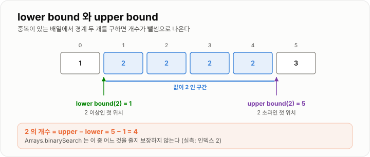
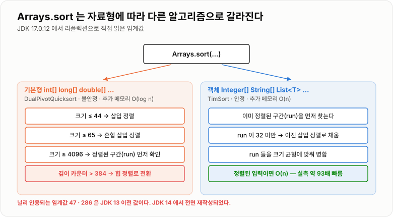

# 탐색과 정렬

> **탐색은 "한 번 찾을 것인가, 반복해서 찾을 것인가"로 갈리고, 정렬은 그 반복 탐색을 위해 미리 지불하는 비용이다.**

---

## 1. 핵심 요약

* **선형 탐색은 준비 비용이 0**이라, 데이터가 작거나 탐색이 1회면 가장 빠르다.
* **이진 탐색은 `O(log n)`이지만 정렬이라는 전제**가 붙는다. 정렬이 깨지면 예외 없이 **조용히 틀린 답**을 준다.
* 정렬 한 번의 비용은 선형 탐색 약 **52회**와 맞먹는다. 그보다 적게 찾을 거면 정렬하지 않는 편이 빠르다.
* Java는 **기본형에 Dual-Pivot Quicksort, 객체에 TimSort**를 쓴다. 같은 `Arrays.sort` 호출이라도 전혀 다른 알고리즘이다.
* `compareTo`/`compare`의 반환값은 **크기가 아니라 부호만** 의미가 있다. `a - b`는 오버플로로 조용히 틀린다.

---

## 2. 등장 배경

### 해결하려는 문제

데이터에서 원하는 값을 찾는 일은 모든 프로그램의 기본이다. 가장 단순한 방법은 처음부터 하나씩 보는 것이다.

```java
for (Member member : members) {
    if (member.getId().equals(targetId)) {
        return member;
    }
}
```

이 코드는 **아무 준비도 필요 없다**는 큰 장점이 있다. 그런데 데이터가 100만 개가 되고, 이 조회가 요청마다 반복되면 버티지 못한다.

여기서 발상이 갈린다.

```text
"찾을 때마다 전부 훑자"
   → 선형 탐색. 준비 비용 0, 탐색당 O(n)

"미리 정렬해 두고 절반씩 좁히자"
   → 정렬 + 이진 탐색. 준비 비용 O(n log n), 탐색당 O(log n)
```

**둘 중 무엇이 빠른지는 "몇 번 찾을 것인가"에 달려 있다.** 이 판단이 이 문서의 핵심이다.

### 이 개념이 없을 때

* 한 번만 찾을 데이터를 굳이 정렬해서 오히려 느려진다.
* 반복 조회하는 목록을 매번 선형 탐색해 `O(n²)`을 만든다.
* 정렬 안 된 배열에 이진 탐색을 써서 **틀린 답이 조용히 반환**된다.
* 최댓값 하나 구하려고 전체를 정렬해 `O(n)`을 `O(n log n)`으로 만든다.
* `Comparator`에서 `a - b`를 써서 큰 값에서 순서가 뒤집힌다.
* 다중 정렬 기준에서 안정 정렬이 아닌 것을 써서 앞 단계 결과가 날아간다.

---

## 3. 핵심 개념

| 개념                     | 설명                                          | 중요한 이유                                     |
| ---------------------- | ------------------------------------------- | ------------------------------------------ |
| **선형 탐색**              | 처음부터 끝까지 하나씩 비교하는 탐색                        | 준비 비용이 0이며, 정렬·해시 없이 어디서든 쓸 수 있다.          |
| **조기 종료**              | 찾는 즉시 멈추는 것                                 | 평균이 `n/2`가 된다. 빅오는 같아도 실제 시간은 절반이다.        |
| **탐색 실패**              | 찾는 값이 없는 경우                                 | **조기 종료가 불가능해 언제나 최악 `n`번**이다.             |
| **이진 탐색**              | 정렬된 데이터에서 범위를 절반씩 줄이는 탐색                    | 비교 한 번에 후보의 절반을 버려 `O(log n)`이 된다.         |
| **단조성**                | 한 방향으로만 판단이 뒤집히는 성질                         | 이진 탐색의 전제다. 정렬은 이것을 만드는 가장 흔한 방법일 뿐이다.     |
| **삽입점(insertion point)** | 값이 없을 때 넣어야 할 위치                            | `Arrays.binarySearch`가 `-(삽입점)-1`로 알려준다.   |
| **lower bound**        | 찾는 값 **이상**이 처음 나오는 위치                      | 중복 값의 시작을 찾거나 범위 개수를 셀 때 쓴다.               |
| **upper bound**        | 찾는 값 **초과**가 처음 나오는 위치                      | `upper - lower`가 곧 값의 개수다.                 |
| **손익분기점**              | 정렬 비용을 탐색 이득으로 회수하는 지점                      | 실측 기준 약 52회. 실무 판단의 기준선이다.                 |
| **비교 정렬의 하한**          | 비교로 정렬하면 `O(n log n)`보다 빠를 수 없다             | `O(n)` 정렬은 비교하지 않는 계수·기수 정렬뿐이다.            |
| **안정 정렬(stable)**      | 같은 값의 원래 순서가 보존되는 정렬                        | **다단계 정렬에서 앞 단계 결과가 살아남는 근거**다.            |
| **TimSort**            | 이미 정렬된 구간(run)을 감지해 활용하는 병합 정렬              | Java의 **객체 정렬** 기본값. 정렬된 데이터에 매우 빠르다.       |
| **Dual-Pivot Quicksort** | 피벗 두 개로 3구간 분할하는 퀵소트                        | Java의 **기본형 정렬** 기본값. 중복이 많으면 더 빠르다.        |
| **`Comparable`**       | 클래스 **내부**에 비교 기준을 두는 인터페이스 (`compareTo`)   | "이 타입의 자연스러운 순서"를 하나 정의한다.                 |
| **`Comparator`**       | 클래스 **외부**에서 비교 기준을 주입하는 인터페이스 (`compare`)  | 기준을 원하는 만큼 만들어 갈아 끼울 수 있다.                 |
| **비교 계약**              | 반사성·대칭성·추이성을 지켜야 한다는 규칙                     | 어기면 정렬이 예외를 던지거나 컬렉션마다 답이 달라진다.            |

### 개념 간 관계

```text
탐색을 몇 번 할 것인가?
│
├─ 1회 ~ 소수      → 선형 탐색 (준비 0)
│
└─ 반복            → 준비를 하자
                     │
                     ├─ 정렬 + 이진 탐색  : O(n log n) 준비, O(log n) 탐색
                     │                     범위 조회·정렬 순서 가능
                     │
                     └─ HashMap/HashSet   : O(n) 준비, O(1) 탐색
                                           범위 조회 불가, 메모리 O(n)
```

정렬과 비교자의 관계는 다음과 같다.

```text
정렬 알고리즘 (어떻게 옮길 것인가)
        +
비교 기준 (무엇이 앞인가)  ← Comparable / Comparator
        ↓
     정렬 결과
```

**정렬 알고리즘은 Java가 정해주고, 비교 기준은 개발자가 정한다.** 실무에서 버그가 나는 쪽은 거의 항상 비교 기준이다.

---

## 4. 구조와 동작 원리

### 선형 탐색 — 준비 없이 훑는다

```text
배열:  [ 7 ][ 3 ][ 9 ][ 1 ][ 5 ]      찾는 값: 9

i=0   7 != 9  →  계속
i=1   3 != 9  →  계속
i=2   9 == 9  →  발견! 즉시 종료

비교 3회
```


*값을 찾으면 즉시 멈추지만, 없는 값을 찾을 때는 언제나 끝까지 봐야 한다.*

**탐색 실패가 언제나 최악인 것**이 중요한 지점이다. 조기 종료는 값이 있을 때만 작동한다.

```text
값이 있을 때   → 최선 1회, 평균 n/2회, 최악 n회
값이 없을 때   → 언제나 n회  (조기 종료 불가능)
조건에 맞는 것 전부 찾기 → 언제나 n회  (조기 종료 자체를 쓸 수 없음)
```

### 이진 탐색 — 절반을 버린다

```text
정렬된 배열:  [10][20][30][40][50][60][70][80]      찾는 값: 70
index          0   1   2   3   4   5   6   7

1회차  low=0, high=7,  mid=3(40)   40 < 70  →  왼쪽 절반 통째로 버림
2회차  low=4, high=7,  mid=5(60)   60 < 70  →  또 절반 버림
3회차  low=6, high=7,  mid=6(70)   70 == 70 →  발견!

비교 3회.  log₂8 = 3
```


*비교 한 번에 후보의 절반을 버리기 때문에 100만 개도 20번이면 끝난다.*

**정렬이 깨지면 이 논리가 통째로 무너진다.**

```text
{50, 40, 30, 20, 10} 에서 10을 찾으면?

mid=2(30)  →  30 > 10  →  "왼쪽에 있겠군"  →  왼쪽으로 간다
             그런데 10은 오른쪽 끝에 있다
             → -1 반환 (실측 확인)

예외는 나지 않는다. 조용히 "없다"고 답한다.
```

이것이 이진 탐색의 가장 위험한 성질이다. **에러가 나면 차라리 낫다.**

### mid 계산의 오버플로 함정

```java
int mid = (low + high) / 2;          // 위험
int mid = low + (high - low) / 2;    // 안전
int mid = (low + high) >>> 1;        // 안전 (JDK 방식)
```

`low`와 `high`가 둘 다 크면 `low + high`가 `int` 범위를 넘어 **음수**가 된다. JDK도 2006년까지 이 버그가 있었다.

`>>> 1`이 안전한 이유는 **부호 없는 시프트**라서 오버플로된 비트 패턴도 올바르게 절반으로 나누기 때문이다. `/ 2`와는 결과가 다르다.

### Arrays.binarySearch의 반환값

```text
찾았을 때   →  해당 인덱스
못 찾았을 때 →  -(삽입점) - 1

배열: [10, 20, 30, 40]

25를 찾으면?  삽입점은 2 (20과 30 사이)
              반환값 = -(2) - 1 = -3

삽입점 복원:  insertionPoint = -(반환값) - 1 = -(-3) - 1 = 2
```

**왜 `-1`을 더 빼는가?** 삽입점이 0이면 `-0 = 0`이 되어 "인덱스 0에서 찾음"과 구분이 안 되기 때문이다.

또 하나 주의할 점은 **중복 값에서 어느 것을 반환할지 보장하지 않는다**는 것이다.

```text
{1, 2, 2, 2, 2, 3} 에서 2를 찾으면 인덱스 2가 나온다 (실측)
→ 첫 번째(인덱스 1)가 아니다
→ 첫 번째가 필요하면 lower bound를 직접 구현해야 한다
```

### lower bound와 upper bound



*경계 두 개를 구하면 값의 개수와 범위 안 원소 수가 뺄셈 한 번으로 나온다.*

```text
배열: [1, 2, 2, 2, 3, 5]
index  0  1  2  3  4  5

lowerBound(2) = 1     ← 2 이상이 처음 나오는 위치
upperBound(2) = 4     ← 2 초과가 처음 나오는 위치

2의 개수 = 4 - 1 = 3
```

### 정렬 — 같은 sort() 호출, 다른 알고리즘



*같은 `Arrays.sort` 호출이라도 자료형과 크기에 따라 완전히 다른 알고리즘이 동작한다.*

```text
Arrays.sort(int[])          →  Dual-Pivot Quicksort
                               작은 구간(44개 이하)은 삽입 정렬
                               재귀 깊이 384 초과 시 힙 정렬로 전환

Arrays.sort(Object[])       →  TimSort (병합 정렬 기반)
Collections.sort(List)      →  내부에서 배열로 복사 후 TimSort
```

**두 알고리즘의 성격이 완전히 다르다.**

| 구분        | Dual-Pivot Quicksort | TimSort            |
| --------- | -------------------- | ------------------ |
| 대상        | 기본형 (`int[]` 등)      | 객체 (`Integer[]` 등) |
| 안정성       | 불안정                  | **안정**             |
| 추가 메모리    | `O(log n)`           | `O(n)`             |
| 정렬된 입력    | 이점 없음                | **run 감지로 매우 빠름**  |
| 중복이 많은 입력 | **3구간 분할로 빠름**       | 보통                 |

**객체 정렬을 안정 정렬로 만든 것은 의도적인 설계**다. 객체는 "같은 값"이어도 서로 구별되는 개체라 원래 순서가 의미를 가지기 때문이다. 기본형은 값만 있으므로 안정성 개념 자체가 무의미하다.

### 안정 정렬이 왜 중요한가


*안정 정렬이라야 앞 단계의 정렬 결과가 뒤 단계에서 보존된다.*

```text
"부서별로 묶되, 부서 안에서는 이름순"을 두 단계로 정렬한다면

① 이름으로 정렬     [김A/영업] [박B/개발] [이C/영업] [최D/개발]
② 부서로 정렬

  안정 정렬:  [박B/개발] [최D/개발] [김A/영업] [이C/영업]
              → 부서 안에서 이름순이 살아 있다 ✓

  불안정 정렬: [최D/개발] [박B/개발] [이C/영업] [김A/영업]
              → 이름순이 날아갔다 ✗
```

### Comparable과 Comparator


*기준이 클래스 안에 있으면 하나뿐이고, 밖에 있으면 원하는 만큼 만들어 갈아 끼울 수 있다.*

```text
Comparable  →  "나는 이렇게 비교된다"          클래스가 스스로 정의. 기준 1개
Comparator  →  "너는 이렇게 비교해라"          외부에서 주입. 기준 여러 개
```

반환값의 의미는 **부호뿐**이다.


*반환값은 크기가 아니라 부호만 읽힌다. 음수면 앞, 양수면 뒤다.*

```text
음수  →  앞에 온다
0     →  같다
양수  →  뒤에 온다

"Apple".compareTo("apple") 은 -32 다 (실측)
  → -1이 아니다. 하지만 정렬에서는 -1과 똑같이 처리된다
```

---

## 5. 코드 또는 사용 예시

### 선형 탐색

```java
public class LinearSearch {

    public int indexOf(int[] numbers, int target) {
        for (int i = 0; i < numbers.length; i++) {
            if (numbers[i] == target) {
                return i;               // 조기 종료
            }
        }

        return -1;                      // 끝까지 갔는데 없음
    }
}
```

* 정렬·해시 등 어떤 준비도 필요 없다.
* 배열이 아니어도 순차 접근만 되면 쓸 수 있다 (리스트·파일·네트워크 스트림).

### 이진 탐색

```java
public class BinarySearch {

    public int search(int[] sorted, int target) {
        int low = 0;
        int high = sorted.length - 1;

        while (low <= high) {
            int mid = low + (high - low) / 2;    // 오버플로 방지

            if (sorted[mid] == target) {
                return mid;
            }

            if (sorted[mid] < target) {
                low = mid + 1;
            } else {
                high = mid - 1;
            }
        }

        return -1;
    }
}
```

* `while (low <= high)` — 등호가 빠지면 원소 하나가 남았을 때 검사하지 못한다.
* `mid + 1`, `mid - 1` — `mid`를 그대로 두면 무한 루프가 된다.
* 반복문 구현이라 공간은 `O(1)`이다. 재귀로 짜면 `O(log n)`이지만 깊이가 30 정도라 위험하지는 않다.

### lower bound 직접 구현

```java
public class BoundSearch {

    // target 이상이 처음 나오는 위치
    public int lowerBound(int[] sorted, int target) {
        int low = 0;
        int high = sorted.length;        // 주의: length (length-1 아님)

        while (low < high) {             // 주의: < (<= 아님)
            int mid = low + (high - low) / 2;

            if (sorted[mid] < target) {
                low = mid + 1;
            } else {
                high = mid;              // 주의: mid (mid-1 아님)
            }
        }

        return low;
    }

    // target 초과가 처음 나오는 위치
    public int upperBound(int[] sorted, int target) {
        int low = 0;
        int high = sorted.length;

        while (low < high) {
            int mid = low + (high - low) / 2;

            if (sorted[mid] <= target) {   // 기본 탐색과 여기만 다르다
                low = mid + 1;
            } else {
                high = mid;
            }
        }

        return low;
    }

    public int countOf(int[] sorted, int target) {
        return upperBound(sorted, target) - lowerBound(sorted, target);
    }
}
```

**기본 이진 탐색과 경계 조건이 미묘하게 다르다.** `high = length`, `low < high`, `high = mid` 세 가지가 모두 바뀐다. 이 셋을 섞어 쓰면 무한 루프나 오프바이원이 난다.

### Comparable — 클래스의 자연스러운 순서

```java
public class Member implements Comparable<Member> {

    private final String name;
    private final int age;

    public Member(String name, int age) {
        this.name = name;
        this.age = age;
    }

    @Override
    public int compareTo(Member other) {
        return Integer.compare(this.age, other.age);   // a - b 금지
    }

    public String getName() {
        return name;
    }

    public int getAge() {
        return age;
    }
}
```

```java
List<Member> members = new ArrayList<Member>();
members.add(new Member("김", 30));
members.add(new Member("박", 25));

Collections.sort(members);      // Comparable 을 쓴다
```

### Comparator — 기준을 갈아 끼운다

```java
import java.util.Comparator;

public class MemberComparators {

    // 나이 오름차순
    public static final Comparator<Member> BY_AGE = new Comparator<Member>() {
        @Override
        public int compare(Member a, Member b) {
            return Integer.compare(a.getAge(), b.getAge());
        }
    };

    // 이름 오름차순 → 나이 내림차순 (다중 기준)
    public static final Comparator<Member> BY_NAME_THEN_AGE_DESC = new Comparator<Member>() {
        @Override
        public int compare(Member a, Member b) {
            int byName = a.getName().compareTo(b.getName());

            if (byName != 0) {
                return byName;          // 첫 기준에서 결정되면 즉시 반환
            }

            return Integer.compare(b.getAge(), a.getAge());   // 내림차순은 순서를 뒤집는다
        }
    };
}
```

* **상태가 없으므로 `static final` 상수로 공유**하는 것이 표준이다. 매번 `new`할 필요가 없다.
* 다중 기준에서 **첫 기준이 0이 아니면 즉시 반환**해야 한다. 결과를 더하면 부호가 상쇄되어 추이성이 깨진다.
* 빨리 판가름 나는 기준을 앞에 두면 뒤 기준은 동점일 때만 계산된다.

### a - b 가 위험한 이유

```java
// 위험
public int compare(Integer a, Integer b) {
    return a - b;
}

// Integer.MAX_VALUE - (-1) = -2147483648  (음수!)
// 2000000000 - (-2000000000) = -294967296 (실측)
// → 큰 값이 작다고 판정된다. 예외 없이 조용히 틀린 순서가 나온다
```

작은 값에서는 잘 동작하기 때문에 더 위험하다. 나중에 금액이나 타임스탬프에 같은 패턴을 복사하는 순간 깨진다. **처음부터 `Integer.compare`를 쓴다.**

### 반복 조회라면 정렬 대신 Map

```java
// 나쁜 예 — 반복문 안의 선형 탐색 → 전체 O(n × m)
for (Order order : orders) {
    for (Member member : members) {
        if (order.getMemberId().equals(member.getId())) {
            order.assignMember(member);
        }
    }
}

// 좋은 예 — Map 구축 O(m) + 조회 O(1) → 전체 O(n + m)
Map<Long, Member> memberMap = new HashMap<Long, Member>(members.size() * 2);
for (Member member : members) {
    memberMap.put(member.getId(), member);
}
for (Order order : orders) {
    Member member = memberMap.get(order.getMemberId());
    if (member != null) {
        order.assignMember(member);
    }
}
```

**정렬 + 이진 탐색보다 Map이 나은 경우가 많다.** 범위 조회나 정렬 순서가 필요 없다면 `O(1)` 조회가 `O(log n)`보다 낫다.

---

## 6. 성능 특성

### 선형 탐색

| 상황               | 시간 복잡도 |  비교 횟수 | 설명                    |
| ---------------- | -----: | -----: | --------------------- |
| 최선 (첫 번째 원소)     | `O(1)` |      1 | 조기 종료가 바로 발동한다        |
| 평균 (있는 값, 균등 분포) | `O(n)` |  `n/2` | 상수 배수 1/2는 빅오에서 사라진다  |
| 최악 (마지막 원소)      | `O(n)` |    `n` | 끝까지 가야 찾는다            |
| **탐색 실패**        | `O(n)` |    `n` | **항상 최악. 조기 종료가 불가능** |
| 조건에 맞는 것 전부 찾기   | `O(n)` |    `n` | 조기 종료 자체를 쓸 수 없다      |

공간 복잡도는 `O(1)`이다. 인덱스 변수 하나 외에 추가 메모리를 쓰지 않는다.

### 이진 탐색

| 연산                            | 시간 복잡도       | 설명                             |
| ----------------------------- | ------------ | ------------------------------ |
| 탐색 (배열)                       | `O(log n)`   | 매 비교마다 후보가 절반이 된다              |
| 탐색 (`LinkedList`)             | `O(n)`       | 인덱스 접근 비용 때문에 이점이 사라진다         |
| `lower bound` / `upper bound` | `O(log n)`   | 기본 이진 탐색과 동일한 구조               |
| 범위 개수 세기                      | `O(log n)`   | 경계 두 번을 구해 뺀다                  |
| 정렬 상태 유지하며 삽입                 | `O(n)`       | 배열은 뒤 원소를 밀어야 한다               |
| 사전 정렬 (1회)                    | `O(n log n)` | 100만 개 `int[]` 기준 약 120ms (실측) |

| 구현 방식 | 공간 복잡도      | 이유                          |
| ----- | ----------- | --------------------------- |
| 반복문   | **`O(1)`**  | `low`, `high`, `mid` 변수만 쓴다 |
| 재귀    | `O(log n)`  | 호출 스택이 `log n` 깊이만큼 쌓인다     |

### 비교 횟수 실측 (JDK 17)

| n             | 이진 탐색 최악 비교 횟수 | `log₂(n) + 1` |
| ------------- | -------------: | ------------: |
| 1,000,000     |         **20** |            21 |
| 1,000,000,000 |         **30** |            31 |

**n이 1000배가 되어도 비교 횟수는 10번밖에 늘지 않는다.**

| n             |    선형 탐색 (최악) | 이진 탐색 (최악) |          배수 |
| ------------- | -----------: | --------: | ----------: |
| 1,000         |        1,000 |        10 |        100배 |
| 1,000,000     |    1,000,000 |        20 |     50,000배 |
| 1,000,000,000 | 1,000,000,00 |        30 | 33,000,000배 |

### 손익분기점 — 정렬은 언제 이득인가

100만 개 `int[]`에서 JDK 17로 측정한 값이다.

```text
선형 탐색 1회 (최악)  :   2.29 ms
정렬 1회             : 120.13 ms
이진 탐색 1000회      :   0.786 ms   (1회당 약 0.0008 ms)
```

| 탐색 횟수 k |    선형 탐색 총시간 | 정렬 + 이진 탐색 총시간 | 승자                |
| -------: | -----------: | -------------: | ----------------- |
|        1 |     2.29 ms |     120.13 ms |  **선형 탐색** (약 52배) |
|       52 |    119.1 ms |     120.17 ms | 거의 동일 (손익분기점)     |
|    1,000 |   2,290 ms |     120.9 ms |  **이진 탐색** (약 19배) |


*한 번만 찾는다면 준비 비용이 곧 손해이고, 반복해서 찾는다면 준비 비용은 금방 회수된다.*

**정렬 한 번의 비용은 선형 탐색 약 52회와 맞먹는다.** 단, 이 계산에는 전제가 있다. **정렬을 한 번만 하고 재사용할 수 있어야 한다.** 데이터가 계속 바뀌어 매번 다시 정렬해야 한다면 손익분기점은 훨씬 나빠진다.

### 정렬 알고리즘 비교

| 알고리즘                     | 평균           | 최악             | 공간         | 안정성 | Java에서의 위치        |
| ------------------------ | ------------ | -------------- | ---------- | --- | ----------------- |
| 버블 정렬                    | `O(n²)`      | `O(n²)`        | `O(1)`     | 안정  | 교육용               |
| 선택 정렬                    | `O(n²)`      | `O(n²)`        | `O(1)`     | 불안정 | 교육용               |
| **삽입 정렬**                | `O(n²)`      | `O(n²)`        | `O(1)`     | 안정  | **작은 구간에서 실제 사용** |
| 병합 정렬                    | `O(n log n)` | `O(n log n)`   | `O(n)`     | 안정  | TimSort의 기반       |
| 퀵소트                      | `O(n log n)` | **`O(n²)`**    | `O(log n)` | 불안정 | Dual-Pivot의 기반    |
| 힙 정렬                     | `O(n log n)` | `O(n log n)`   | `O(1)`     | 불안정 | **최악 대비 안전망**     |
| **Dual-Pivot Quicksort** | `O(n log n)` | `O(n log n)`\* | `O(log n)` | 불안정 | **기본형 정렬**        |
| **TimSort**              | `O(n log n)` | `O(n log n)`   | `O(n)`     | 안정  | **객체 정렬**         |
| 계수 정렬                    | `O(n + k)`   | `O(n + k)`     | `O(k)`     | 안정  | `byte`/`short` 내부 |

\* Dual-Pivot Quicksort 단독의 최악은 `O(n²)`지만, JDK 14+ 구현은 재귀 깊이가 `MAX_RECURSION_DEPTH`(384)를 넘으면 **힙 정렬로 전환**하므로 전체적으로 `O(n log n)`이 보장된다.

**삽입 정렬이 `O(n²)`인데도 실제로 쓰이는 이유**는 작은 데이터에서 상수 배수가 매우 작기 때문이다. 재귀 호출·피벗 선택·임시 배열 할당 같은 오버헤드가 없어 44개 이하에서는 퀵소트보다 빠르다. 그래서 JDK가 명시적으로 전환한다.

### JDK 17 정렬 실측

측정 환경: JDK 17.0.12, 6코어.

| 측정 항목                    | 시간           | 해석                        |
| ------------------------ | ------------ | ------------------------- |
| `int[]` 100만 무작위         | 104.0 ms     | 기준선                       |
| `Integer[]` 100만 무작위     | 482.9 ms     | **박싱으로 약 4.6배**           |
| `int[]` 200만 무작위         | 227.9 ms     | n에 대해 거의 선형적으로 증가         |
| `int[]` 200만 **정렬됨**     | **5.9 ms**   | **약 39배 빠름** — run 감지 효과  |
| `int[]` 200만 **역순**      | **11.9 ms**  | 역순도 하나의 run으로 인식          |
| `Integer[]` 200만 **정렬됨** | **11.1 ms**  | **약 93배 빠름**              |
| `int[]` 200만 (값 3종류)     | **16.5 ms**  | **3구간 분할로 약 9배 빠름**       |
| `int[]` 1000만 단일 스레드     | 846.4 ms     | 기준선                       |
| `int[]` 1000만 병렬         | **236.9 ms** | **6코어에서 약 3.6배**          |
| 톱니 패턴 100만               | 14.8 ms      | `O(n²)`로 무너지지 않음          |

여기서 얻는 실무 지침은 셋이다.

1. **박싱을 피하라.** `int[]`와 `Integer[]`는 약 4.6배 차이다.
2. **이미 정렬된 데이터는 거의 공짜로 다시 정렬된다.** DB `ORDER BY` 결과를 같은 기준으로 다시 정렬하는 것은 비용이 거의 없다.
3. **중복이 많으면 오히려 빠르다.** 상태값 같은 저카디널리티 컬럼 정렬을 걱정할 필요는 없다.

### 정렬의 공간 복잡도

| 정렬                         | 추가 메모리      | 100만 개 기준 대략           |
| -------------------------- | ----------- | --------------------- |
| `Arrays.sort(int[])`       | `O(log n)`  | 수 KB (재귀 스택)          |
| `Arrays.sort(Object[])`    | **`O(n)`**  | 참조 배열 약 4MB + 원본      |
| `Collections.sort(List)`   | **`O(n)`**  | 리스트를 배열로 복사한 뒤 다시 채운다 |

```text
Collections.sort(list)
   → list.sort(null)
       → Object[] a = toArray()          ← O(n) 복사
       → Arrays.sort(a, c)               ← TimSort, 추가로 O(n)
       → ListIterator 로 리스트에 다시 쓴다  ← O(n)

  100만 개 리스트를 정렬하면 순간적으로 배열 2개 분량의 메모리를 더 쓴다.
```

### compare 비용이 정렬 전체에 곱해진다

```text
정렬 전체 비용 = O(n log n) × compare() 한 번의 비용

  n = 1,000,000 이면 compare 는 약 2000만 번 호출된다.
  compare 안에서 1 마이크로초를 쓰면 전체가 20초가 된다.
```

| `compare` 안에서 하는 일            | 전체 영향    | 대응              |
| ---------------------------- | -------- | --------------- |
| 필드 하나 비교 (`Integer.compare`) | 무시할 수준   | 기본              |
| 문자열 비교 (`String.compareTo`)  | 보통 문제없음  | 필요시 앞부분만 비교     |
| 문자열 포매팅·연결                   | **매우 큼** | 미리 계산해 필드로 보관   |
| 정규식 매칭                       | **매우 큼** | 미리 계산           |
| **DB 조회·네트워크 호출**            | **치명적**  | 절대 금지. 미리 로딩    |
| 컬렉션 순회                       | **큼**    | 미리 집계값을 필드로 보관  |

---

## 7. 장점과 단점

### 선형 탐색

| 장점             | 이유                              |
| -------------- | ------------------------------- |
| 준비 비용이 0이다     | 정렬도 해시 구축도 필요 없다.               |
| 어떤 자료구조에나 쓸 수 있다 | 순차 접근만 되면 된다. 리스트·파일·스트림 모두 가능. |
| 공간이 `O(1)`이다   | 인덱스 변수 하나뿐이다.                   |
| 정렬 상태를 요구하지 않는다 | 데이터가 계속 바뀌어도 문제없다.              |
| 구현이 단순해 버그가 없다 | 경계 조건 실수가 날 여지가 거의 없다.          |

| 단점              | 이유 및 주의점                       |
| --------------- | ------------------------------ |
| `n`에 정확히 비례한다   | 데이터가 10배면 시간도 10배다.            |
| 탐색 실패가 항상 최악이다  | 조기 종료가 작동하지 않는다.               |
| 반복 조회에 매우 불리하다  | 반복문 안에 넣으면 `O(n²)`이 된다.        |

### 이진 탐색

| 장점                 | 이유                             |
| ------------------ | ------------------------------ |
| `O(log n)`으로 매우 빠르다 | 10억 개도 30번이면 끝난다.              |
| 공간이 `O(1)`이다       | 반복문 구현이면 변수 3개뿐이다.             |
| 범위 조회가 가능하다        | 경계 두 개로 개수와 구간을 구할 수 있다.       |
| 최악이 보장된다           | 입력에 따라 성능이 무너지지 않는다.           |

| 단점                | 이유 및 주의점                                    |
| ----------------- | ------------------------------------------- |
| 정렬이 반드시 선행되어야 한다  | 정렬 비용 `O(n log n)`을 회수해야 이득이다.              |
| 정렬이 깨지면 조용히 틀린다   | **예외가 나지 않아 발견이 매우 어렵다.**                   |
| 삽입 시 정렬 유지가 `O(n)` | 데이터가 자주 바뀌면 이점이 사라진다.                       |
| 경계 조건 실수가 잦다      | `<=` vs `<`, `mid` vs `mid±1` 실수가 흔하다.      |
| 랜덤 접근이 필요하다       | `LinkedList`에 쓰면 `O(n)`이 되어 이점이 사라진다.       |

### 정렬

| 장점                | 이유                              |
| ----------------- | ------------------------------- |
| 이후 탐색을 `O(log n)`으로 만든다 | 반복 조회가 많을수록 이득이 커진다.            |
| 범위 조회와 순위가 가능해진다   | 해시로는 불가능한 연산이다.                 |
| Java 구현이 매우 정교하다  | run 감지, 3구간 분할, 힙 정렬 전환이 자동이다.  |

| 단점                    | 이유 및 주의점                                |
| --------------------- | --------------------------------------- |
| `O(n log n)` 비용이 선행된다 | 100만 개에서 약 120ms다. 탐색 52회분이다.           |
| 객체 정렬은 메모리를 `O(n)` 쓴다 | `Collections.sort`는 순간 배열 2개 분량이 더 필요하다. |
| 데이터가 바뀌면 다시 해야 한다     | 정렬 상태 유지 비용이 계속 든다.                     |
| 비교자 버그가 조용히 퍼진다       | 작은 데이터에서는 계약 위반이 검출되지 않는다.              |

---

## 8. 사용 기준

### 선택 흐름도

```text
같은 데이터에서 몇 번 찾는가?
│
├─ 1회 ~ 수십 회 → 선형 탐색
│                   (정렬 비용을 회수할 수 없다)
│
└─ 수백 회 이상 → 어떤 조회가 필요한가?
                   │
                   ├─ 정확한 키 조회만 → HashMap / HashSet   O(1)
                   │
                   ├─ 범위 조회·정렬 순서 필요
                   │   ├─ 데이터가 안 변한다 → 정렬된 배열 + 이진 탐색
                   │   └─ 데이터가 자주 변한다 → TreeMap / TreeSet
                   │
                   └─ 애초에 DB에서 할 수 있는가? → 인덱스 + ORDER BY
```

### 사용하기 좋은 상황

| 방법                | 이럴 때 쓴다                                     |
| ----------------- | ------------------------------------------- |
| **선형 탐색**         | n이 수백 이하, 탐색이 1회, 데이터가 계속 바뀜, 조건에 맞는 것 전부 찾기 |
| **정렬 + 이진 탐색**    | 한 번 만들고 반복 조회, 범위 조회 필요, 메모리가 빠듯함           |
| **HashMap/HashSet** | 정확한 키 조회만, 조회가 매우 많음, 메모리 여유 있음             |
| **TreeMap/TreeSet** | 범위 조회 + 데이터가 자주 변경됨                         |
| **`Comparable`**  | 그 타입의 "자연스러운 순서"가 하나로 정해질 때 (`id`, 날짜)      |
| **`Comparator`**  | 화면·API마다 정렬 기준이 다를 때, 남의 클래스를 정렬할 때         |

### 사용하지 않는 것이 좋은 상황

* **한 번만 찾을 데이터를 정렬하는 것** — 정렬 비용이 곧 손해다.
* **최댓값·최솟값 하나 구하려고 정렬하는 것** — `O(n)`으로 끝날 일을 `O(n log n)`으로 만든다.
* **상위 K개를 구하려고 전체 정렬하는 것** — 크기 K 힙으로 `O(n log k)`면 된다. 100만 개 기준 약 6배 차이.
* **정렬 안 된 배열에 이진 탐색** — 조용히 틀린 답이 나온다.
* **`LinkedList`에 이진 탐색** — 인덱스 접근이 `O(n)`이라 전체가 `O(n)`이 된다.
* **`compare` 안에서 DB 조회·문자열 생성** — 2000만 번 호출된다.
* **대량 데이터를 애플리케이션에서 정렬** — DB가 인덱스로 정렬하는 편이 훨씬 싸다.

### 선택 기준

1. **같은 데이터에서 몇 번 찾는가?** — 52회가 대략적인 분기점이다
2. **데이터가 얼마나 자주 바뀌는가?** — 자주 바뀌면 정렬 유지 비용이 계속 든다
3. **범위 조회나 정렬 순서가 필요한가?** — 필요하면 해시는 탈락이다
4. **메모리 여유가 있는가?** — 해시는 `O(n)`을 더 쓴다
5. **정렬 기준이 하나인가, 여러 개인가?** — 하나면 `Comparable`, 여러 개면 `Comparator`
6. **다단계 정렬을 하는가?** — 그렇다면 안정 정렬이어야 한다
7. **DB에서 해결할 수 있는가?** — 인덱스가 있으면 대부분 DB가 낫다

---

## 9. 비슷한 개념 비교

### 선형 탐색 vs 이진 탐색 vs 해시

| 비교 항목  | 선형 탐색       | 정렬 + 이진 탐색      | HashMap        |
| ------ | ----------- | -------------- | -------------- |
| 준비 비용  | **없음**      | `O(n log n)`   | `O(n)`         |
| 탐색 비용  | `O(n)`      | `O(log n)`     | **평균 `O(1)`**  |
| 추가 메모리 | **`O(1)`**  | `O(1)`         | `O(n)`         |
| 범위 조회  | 가능 (`O(n)`) | **`O(log n)`** | **불가능**        |
| 정렬 순서  | 없음          | **유지**         | 없음             |
| 삽입 비용  | **`O(1)`**  | `O(n)`         | 평균 `O(1)`      |
| 적합한 상황 | 탐색 1회, 작은 n | 반복 조회 + 범위 필요  | 반복 조회, 키 조회만   |

### Comparable vs Comparator

| 비교 항목  | `Comparable`             | `Comparator`             | 선택 기준            |
| ------ | ------------------------ | ------------------------ | ---------------- |
| 목적     | 타입의 자연스러운 순서 1개          | 상황별 정렬 기준 여러 개           | 기준이 몇 개인가        |
| 위치     | 클래스 **내부** (`compareTo`) | 클래스 **외부** (`compare`)   | —                |
| 패키지    | `java.lang`              | `java.util`              | —                |
| 클래스 수정 | 필요                       | **불필요**                  | 남의 클래스면 Comparator |
| 사용     | `Collections.sort(list)` | `Collections.sort(list, c)` | —                |
| 적합한 상황 | `id`, 날짜, 금액 같은 명백한 순서   | 화면·API마다 다른 정렬           | —                |

**둘 다 있으면 `Comparator`가 이긴다.** 명시적으로 넘긴 기준이 우선한다.

### Dual-Pivot Quicksort vs TimSort

| 비교 항목  | Dual-Pivot Quicksort | TimSort            | 선택 기준        |
| ------ | -------------------- | ------------------ | ------------ |
| 적용 대상  | 기본형 배열               | 객체 배열, List        | Java가 자동 선택  |
| 안정성    | 불안정                  | **안정**             | 다단계 정렬이면 안정  |
| 추가 메모리 | **`O(log n)`**       | `O(n)`             | 메모리 제약 시 기본형 |
| 정렬된 입력 | 이점 없음                | **run 감지로 39~93배** | —            |
| 중복 많음  | **3구간 분할로 9배**       | 보통                 | —            |
| 최악 대비  | 힙 정렬로 전환 (깊이 384)    | 구조적으로 `O(n log n)` | —            |

---

## 10. 백엔드 실무 적용

### Spring·Java

**정렬은 가능하면 DB에 맡긴다.**

```java
// 애플리케이션 정렬 — 전체를 메모리에 올려야 한다
List<Order> orders = orderRepository.findAll();
Collections.sort(orders, MemberComparators.BY_AGE);

// DB 정렬 — 인덱스를 타고 필요한 만큼만 가져온다
Page<Order> orders = orderRepository.findAll(
        PageRequest.of(0, 20, Sort.by(Sort.Direction.DESC, "createdAt"))
);
```

DB에 인덱스가 있으면 **정렬 비용이 사실상 0**이다. 네트워크 전송량, 힙 사용량, GC 부담이 전부 사라진다.

**애플리케이션 정렬이 필요한 경우**는 다음과 같다.

* 여러 데이터 소스를 합쳐야 할 때
* DB가 계산할 수 없는 값(외부 API 결과 등)으로 정렬할 때
* 이미 메모리에 있는 작은 목록일 때

**`compare` 안에서 절대 하면 안 되는 것**

```java
// 재앙 — compare 가 2000만 번 호출되면 DB 쿼리가 2000만 번 나간다
public int compare(Order a, Order b) {
    Member ma = memberRepository.findById(a.getMemberId()).get();
    Member mb = memberRepository.findById(b.getMemberId()).get();
    return ma.getName().compareTo(mb.getName());
}
```

정렬 전에 필요한 데이터를 전부 로딩해서 필드로 들고 있어야 한다.

**`TreeSet`·`TreeMap`은 `compare`가 0이면 같은 원소로 본다.**

```java
// 위험 — 점수가 같으면 한 명이 사라진다
TreeSet<Member> set = new TreeSet<Member>(BY_SCORE);
set.add(new Member("김", 90));
set.add(new Member("박", 90));
System.out.println(set.size());     // 1  ← 박이 사라졌다
```

동점 해소 기준(`id` 등)을 반드시 마지막에 붙여야 한다.

**주의할 API들**

```java
List.of("b", "a").sort(null);            // UnsupportedOperationException
Arrays.asList("b", "a").sort(null);      // 정렬은 됨 (add 만 막힘)
new ArrayList<>(List.of("b", "a"));      // 정렬·추가 모두 가능
```

`null`이 섞이면 `Collections.sort`는 `NullPointerException`을 던진다. `Comparator.nullsFirst`로 감싸야 한다.

### 데이터베이스·캐시

**DB 인덱스는 이진 탐색의 디스크 버전이다.**

```text
B+Tree 인덱스
  = 디스크 I/O에 맞게 분기를 늘린 이진 탐색

  이진 탐색  : 분기 2개,   높이 log₂ n    (100만 개 → 20단계)
  B+Tree     : 분기 수백 개, 높이 3~4     (100만 개 → 3~4번 디스크 읽기)

  → 원리와 제약(정렬 전제)이 동일하다
```

그래서 **인덱스가 있는 컬럼의 정렬은 공짜**다. 이미 정렬된 상태로 저장되어 있기 때문이다.

```sql
-- 인덱스를 타면 정렬 비용 없이 상위 20개만 읽는다
SELECT * FROM orders ORDER BY created_at DESC LIMIT 20;
```

**풀 스캔이 항상 나쁜 것은 아니다.** 테이블의 상당 비율을 읽어야 한다면 인덱스를 타는 것보다 순차 읽기가 빠르다. 옵티마이저의 정상적인 판단이다.

**인덱스가 있어도 못 타는 경우**

```sql
WHERE YEAR(created_at) = 2026        -- 컬럼에 함수 → 못 탐
WHERE name LIKE '%김%'                -- 앞 와일드카드 → 못 탐
WHERE name LIKE '김%'                 -- 뒤 와일드카드만 → 탈 수 있음
```

**Java와 DB의 문자열 정렬 결과는 다를 수 있다.** MySQL 기본 콜레이션은 대소문자를 무시하지만 Java는 유니코드 값 순서로 구분한다.

```text
Java  : ["Apple", "apple", "Banana"]  →  Apple, Banana, apple  (대문자가 앞)
MySQL : 기본 콜레이션이면              →  Apple, apple, Banana
```

### 동시성·분산 환경

**`Comparator`는 상태가 없으면 스레드 안전하다.**

```java
public static final Comparator<Member> BY_AGE = new Comparator<Member>() { ... };
```

`static final` 상수로 공유하는 것이 표준이다. 반대로 **`compare` 안에서 외부 상태를 읽으면 위험하다.** 정렬 도중 그 값이 바뀌면 계약이 깨져 `IllegalArgumentException`이 난다.

**정렬 중 컬렉션이 수정되면 `ConcurrentModificationException`이 난다.**

```java
// 위험 — 다른 스레드가 list 를 수정하면 정렬이 깨진다
Collections.sort(sharedList);

// 안전 — 복사본을 정렬한다
List<Member> copy = new ArrayList<Member>(sharedList);
Collections.sort(copy);
```

**`parallelSort`는 만능이 아니다.**

```text
Arrays.parallelSort(...)
  MIN_ARRAY_SORT_GRAN(8192) 미만 조각은 병렬화하지 않는다
  ForkJoinPool.commonPool 을 점유한다

  → 작은 배열에서는 오버헤드만 늘고
  → 웹 서버에서는 공통 풀을 다른 작업과 다투게 된다
```

실측으로 1000만 개에서 6코어 기준 약 3.6배 빨라지지만, **그 정도 크기가 아니면 쓸 이유가 없다.**

---

## 11. 자주 하는 오해

| 잘못된 이해                                    | 올바른 이해                                                                    |
| ----------------------------------------- | ------------------------------------------------------------------------- |
| 선형 탐색은 느리니까 항상 피해야 한다                     | n이 작거나 탐색이 1회면 가장 빠르다. 준비 비용이 0이기 때문이다.                                   |
| `O(n)`이니까 데이터 개수만큼 무조건 비교한다               | 찾으면 즉시 멈춘다. 평균은 `n/2`이고 최선은 1번이다.                                         |
| 탐색 성공과 실패의 비용은 비슷하다                       | **실패는 언제나 `n`번을 다 쓴다.** 조기 종료가 불가능하기 때문이다.                                |
| 조기 종료는 빅오가 같으니 의미 없는 최적화다                 | 빅오는 같아도 실행 시간은 절반이다. 빅오는 선택의 도구, 상수는 개선의 도구다.                             |
| 이진 탐색은 항상 선형 탐색보다 낫다                      | 정렬 비용(100만 개 약 120ms)을 회수하려면 약 **52회** 이상 탐색해야 한다 (실측).                   |
| 정렬 안 된 배열에 이진 탐색을 쓰면 예외가 난다               | **예외 없이 조용히 틀린 답**을 준다. `{50,40,30,20,10}`에서 10을 찾으면 `-1`이다 (실측).          |
| `binarySearch`는 못 찾으면 `-1`을 반환한다          | `-(삽입점) - 1`을 반환한다. 25를 못 찾으면 `-3`이고, 삽입점은 2다.                            |
| `-(삽입점)`이면 충분한데 왜 `-1`을 더 빼나              | 삽입점이 0이면 `-0 = 0`이라 "인덱스 0에서 찾음"과 구분이 안 되기 때문이다.                          |
| 중복 값이 있으면 첫 번째를 반환한다                      | **보장하지 않는다.** `{1,2,2,2,2,3}`에서 2를 찾으면 인덱스 2가 나온다 (실측).                   |
| `(low + high) / 2`로 써도 문제없다               | 둘 다 크면 오버플로로 음수가 된다. JDK도 2006년까지 이 버그가 있었다.                              |
| `>>> 1`은 그냥 나누기의 다른 표현이다                  | **부호 없는** 시프트라 오버플로된 비트 패턴도 올바르게 나눈다. `/ 2`와 결과가 다르다.                     |
| `LinkedList`에도 이진 탐색을 쓰면 `O(log n)`이다     | 인덱스 접근이 `O(n)`이라 전체가 `O(n)`이 된다. 답은 맞지만 이점이 없다.                           |
| 이진 탐색은 배열에서만 쓴다                           | "조건을 만족하는 최소/최대값" 문제에도 쓴다(매개변수 탐색). 단조성만 있으면 된다.                          |
| DB 인덱스는 이진 탐색과 다른 기술이다                    | B+Tree는 디스크 I/O에 맞게 분기를 늘린 이진 탐색이다. 원리와 제약이 동일하다.                         |
| `Arrays.sort`는 항상 퀵소트다                    | **기본형만 퀵소트**다. 객체는 TimSort(병합 정렬 기반)를 쓴다.                                 |
| Java 퀵소트의 임계값은 47과 286이다                  | JDK 13 이전 값이다. **JDK 14에서 전면 재작성**되어 JDK 17 실측값은 **44와 65**다.             |
| Java 정렬은 최악에 `O(n²)`가 될 수 있다              | 재귀 깊이가 `MAX_RECURSION_DEPTH`(384)를 넘으면 **힙 정렬로 전환**해 `O(n log n)`을 보장한다.  |
| `Integer[]`와 `int[]`는 성능이 비슷하다            | 실측 약 **4.6배** 차이다 (100만 개 104ms vs 483ms).                                |
| 이미 정렬된 데이터를 다시 정렬하면 낭비다                   | run을 감지해 거의 공짜다. 실측 200만 개 기준 **약 39~93배** 빠르다.                           |
| 중복이 많으면 정렬이 느려진다                          | Dual-Pivot의 3구간 분할로 **오히려 빠르다**. 실측 약 9배.                                 |
| `Collections.sort`는 리스트를 제자리에서 정렬한다       | 내부에서 배열로 복사한 뒤 정렬하고 다시 쓴다. **순간 메모리가 배열 2개 분량 더 필요**하다.                   |
| 최댓값을 구하려면 정렬한 뒤 마지막을 보면 된다                | `O(n)`으로 끝날 일을 `O(n log n)`으로 만든다. 한 번 훑으면 된다.                            |
| 상위 10개가 필요하면 정렬 후 자르면 된다                  | 크기 10 힙으로 `O(n log k)`면 된다. 100만 개 기준 약 6배 차이.                            |
| 비교 정렬로 `O(n)`을 만들 수 있다                    | 비교 정렬의 하한이 `O(n log n)`이다. `O(n)`이 되려면 **비교하지 않는** 계수·기수 정렬이어야 한다.        |
| `parallelSort`는 항상 빠르다                    | 8192 미만 조각은 병렬화하지 않는다. 작은 배열에서는 오버헤드만 늘고 공통 풀을 점유한다.                      |
| `compareTo`는 `-1`, `0`, `1`만 반환한다         | 부호만 의미가 있다. `"Apple".compareTo("apple")`은 **`-32`**다 (실측).                 |
| 반환값의 크기가 "얼마나 차이 나는지"를 뜻한다                | 부호 외에는 아무 의미가 없다. `-1`과 `-32`는 정렬에서 동일하게 처리된다.                            |
| `a - b`로 비교자를 만들어도 된다                     | 오버플로로 **조용히 틀린 순서**가 나온다. `2000000000 - (-2000000000) = -294967296` (실측). |
| 작은 값에서 `a - b`가 동작하니 괜찮다                  | 나중에 금액·타임스탬프에 같은 패턴을 복사하는 순간 깨진다. 처음부터 `Integer.compare`를 쓴다.             |
| `Comparator` 계약을 어기면 바로 예외가 난다            | **작은 데이터에서는 검출되지 않는다.** 실측에서 512개까지 통과, 1024개부터 예외가 났다.                   |
| 다중 기준은 각 비교 결과를 더하면 된다                    | 부호가 상쇄되어 추이성이 깨진다. 첫 기준이 0이 아니면 **즉시 반환**해야 한다.                           |
| `.reversed()`는 어디에 붙여도 같다                 | `A.reversed().thenComparing(B)`와 `A.thenComparing(B).reversed()`는 결과가 다르다. |
| `compareTo == 0`이면 `equals`도 `true`여야 한다  | **권장이지 필수가 아니다.** `BigDecimal`이 대표적으로 어긴다.                                |
| 그래서 일관성은 안 지켜도 된다                         | 어기면 `HashSet` 크기 2, `TreeSet` 크기 1처럼 컬렉션마다 답이 달라진다 (실측).                  |
| `TreeSet`은 `equals`로 중복을 판단한다             | **`compare` 결과가 0이면 같은 원소**로 본다. 동점 해소 기준이 없으면 원소가 사라진다.                  |
| `String` 정렬은 알파벳 순서다                      | **유니코드 값 순서**다. `["10","2"]`를 정렬하면 `"10"`이 앞이고, 대문자가 소문자보다 앞이다 (실측).      |
| `null`이 섞여도 `Collections.sort`가 알아서 처리한다  | `NullPointerException`이 난다. `Comparator.nullsFirst`로 감싸야 한다.              |
| `Comparator`는 매번 `new`로 만들어야 한다           | 상태가 없으면 스레드 안전하므로 `static final` 상수로 공유하는 것이 표준이다.                        |
| Java와 DB의 문자열 정렬 결과는 같다                   | 콜레이션에 따라 다르다. MySQL 기본값은 대소문자를 무시하지만 Java는 구분한다.                          |
| 정렬은 애플리케이션에서 하는 것이 유연하다                   | 대량 데이터는 **DB가 인덱스로 정렬**하는 편이 훨씬 싸다. 네트워크·힙·GC 비용이 전부 사라진다.                |
| DB 풀 스캔은 무조건 잘못된 쿼리다                      | 테이블의 상당 비율을 읽어야 한다면 인덱스보다 풀 스캔이 빠르다. 옵티마이저의 정상적인 판단이다.                    |

---

## 12. 면접 답변

### 기본 답변

탐색 방법을 고르는 기준은 **"같은 데이터에서 몇 번 찾는가"** 입니다.

**선형 탐색**은 처음부터 하나씩 비교합니다. `O(n)`이지만 **준비 비용이 0**이라서, 데이터가 작거나 한 번만 찾을 때는 가장 빠릅니다. 찾으면 즉시 멈추므로 평균은 `n/2`인데, 값이 없을 때는 조기 종료가 불가능해서 **언제나 최악**입니다.

**이진 탐색**은 정렬된 데이터에서 범위를 절반씩 줄여 `O(log n)`입니다. 100만 개도 20번, 10억 개도 30번이면 끝납니다. 다만 **정렬이 전제**이고, 정렬이 깨져 있으면 예외 없이 조용히 틀린 답을 줍니다. 실측하면 100만 개 정렬에 약 120ms, 선형 탐색 1회에 약 2.3ms라서 **약 52회 이상 탐색해야 정렬 비용을 회수**합니다.

**정렬**은 Java가 자료형에 따라 다른 알고리즘을 씁니다. 기본형은 Dual-Pivot Quicksort, 객체는 TimSort입니다. 객체 정렬만 안정 정렬인데, 객체는 같은 값이어도 구별되는 개체라 원래 순서가 의미를 갖기 때문입니다. 다단계 정렬을 할 때 앞 단계 결과가 보존되는 근거가 됩니다.

**비교 기준**은 `Comparable`로 클래스 안에 하나 두거나, `Comparator`로 외부에서 여러 개 주입합니다. 반환값은 **크기가 아니라 부호만** 의미가 있고, `a - b`는 오버플로로 조용히 틀리므로 `Integer.compare`를 씁니다.

실무에서는 **가능하면 DB 인덱스에 맡기는 것**이 가장 낫습니다. B+Tree 인덱스가 곧 디스크에 맞게 만든 이진 탐색이고, 이미 정렬된 상태라 정렬 비용이 사실상 0이기 때문입니다.

### 답변 구조

1. **정의** — 선형 탐색은 순차 비교, 이진 탐색은 정렬 전제로 범위를 절반씩 축소. 정렬은 반복 탐색을 위한 사전 투자
2. **내부 원리** — 이진 탐색은 `mid` 비교로 절반을 버림. Java 정렬은 기본형 Dual-Pivot / 객체 TimSort로 분기, 재귀 깊이 384 초과 시 힙 정렬 전환
3. **복잡도**
    * 선형 `O(n)` (실패는 항상 `n`), 이진 `O(log n)`, 정렬 `O(n log n)`
    * 손익분기점 약 52회 (100만 개 실측 기준)
    * 비교 정렬의 하한이 `O(n log n)`
4. **장점** — 선형은 준비 0·`O(1)` 공간, 이진은 `O(log n)`·범위 조회 가능, 정렬은 이후 조회를 싸게 만듦
5. **단점** — 선형은 반복 조회에 취약, 이진은 정렬 전제와 조용한 오답, 정렬은 `O(n log n)` 선행 비용과 객체 정렬의 `O(n)` 메모리
6. **사용 기준** — 탐색 횟수, 데이터 변경 빈도, 범위 조회 필요 여부, 메모리 여유
7. **대안과 비교** — 키 조회만이면 `HashMap`이 `O(1)`로 더 나음. 범위가 필요하면 `TreeMap`. 상위 K개면 힙
8. **실무 적용 사례** — DB 인덱스 + `ORDER BY`가 최우선, 다중 정렬 기준은 `Comparator` 상수로, `compare` 안의 DB 조회 금지

---

## 13. 예상 면접 질문

### 기본 질문

1. **선형 탐색과 이진 탐색의 차이는 무엇인가요?**

    * 핵심 키워드: 준비 비용 0 vs 정렬 전제, `O(n)` vs `O(log n)`, 순차 접근 vs 랜덤 접근

2. **이진 탐색이 `O(log n)`인 이유를 설명해 주세요.**

    * 핵심 키워드: 비교 한 번에 후보 절반 제거, `log₂n`번이면 1개로 수렴, 100만 개 20번

3. **정렬 안 된 배열에 이진 탐색을 쓰면 어떻게 되나요?**

    * 핵심 키워드: 예외 없음, 조용히 틀린 답, 단조성 전제 붕괴, 발견이 어려움

4. **`Arrays.binarySearch`가 못 찾으면 무엇을 반환하나요?**

    * 핵심 키워드: `-(삽입점) - 1`, 삽입점 0과 인덱스 0의 구분, 복원식

5. **Java의 `Arrays.sort`는 어떤 알고리즘을 쓰나요?**

    * 핵심 키워드: 기본형 Dual-Pivot Quicksort, 객체 TimSort, 작은 구간 삽입 정렬, 힙 정렬 전환

6. **안정 정렬이 왜 필요한가요?**

    * 핵심 키워드: 같은 값의 원래 순서 보존, 다단계 정렬, 앞 단계 결과 유지

7. **`Comparable`과 `Comparator`의 차이는 무엇인가요?**

    * 핵심 키워드: 내부 vs 외부, 기준 1개 vs 여러 개, 클래스 수정 필요 여부, `java.lang` vs `java.util`

8. **`compare`의 반환값은 무엇을 의미하나요?**

    * 핵심 키워드: 부호만 의미 있음, 크기는 무의미, `"Apple".compareTo("apple")`은 `-32`

9. **정렬 비용을 지불할 가치가 있는지 어떻게 판단하나요?**

    * 핵심 키워드: 탐색 횟수, 손익분기점 약 52회, 데이터 변경 빈도, 재사용 가능 여부

### 꼬리 질문

1. **`(low + high) / 2`가 위험한 이유는 무엇인가요?**

    * 핵심 키워드: `int` 오버플로로 음수, `low + (high-low)/2`, `>>> 1`은 부호 없는 시프트

2. **중복 값이 있을 때 첫 번째 위치를 찾으려면 어떻게 하나요?**

    * 핵심 키워드: `binarySearch`는 보장 안 함, lower bound 직접 구현, `high = mid`, `low < high`

3. **`a - b`로 비교자를 만들면 무슨 문제가 있나요?**

    * 핵심 키워드: 오버플로로 부호 뒤집힘, 예외 없이 틀린 순서, `Integer.compare`

4. **`Comparator` 계약을 어기면 항상 예외가 나나요?**

    * 핵심 키워드: 작은 데이터는 검출 안 됨, 실측 512개 통과 1024개 예외, TimSort 병합 단계에서 발견

5. **`int[]`와 `Integer[]` 정렬 성능이 왜 다른가요?**

    * 핵심 키워드: 박싱 객체 생성, 다른 알고리즘(Quicksort vs TimSort), 실측 약 4.6배

6. **이미 정렬된 데이터를 다시 정렬하면 낭비인가요?**

    * 핵심 키워드: TimSort의 run 감지, 실측 39~93배 빠름, DB `ORDER BY` 결과 재정렬은 거의 공짜

7. **`Collections.sort`가 메모리를 많이 쓰는 이유는 무엇인가요?**

    * 핵심 키워드: 배열로 복사 → TimSort `O(n)` → 다시 쓰기, 순간 배열 2개 분량

8. **`TreeSet`에서 원소가 사라지는 경우가 있나요?**

    * 핵심 키워드: `compare` 0이면 같은 원소로 판단, `equals` 무관, 동점 해소 기준 필요

9. **상위 10개를 구할 때 정렬하면 안 되는 이유는 무엇인가요?**

    * 핵심 키워드: `O(n log n)` vs 크기 K 힙 `O(n log k)`, 메모리 `O(n)` vs `O(K)`, 약 6배 차이

10. **정렬을 애플리케이션과 DB 중 어디서 해야 하나요?**

    * 핵심 키워드: 인덱스가 있으면 DB 정렬은 거의 공짜, 네트워크·힙·GC 비용, 여러 소스 병합 시만 애플리케이션

11. **DB 인덱스와 이진 탐색은 어떤 관계인가요?**

    * 핵심 키워드: B+Tree는 분기를 늘린 이진 탐색, 디스크 I/O 최적화, 정렬 전제라는 제약 동일

12. **인덱스가 있는데도 못 타는 경우는 언제인가요?**

    * 핵심 키워드: 컬럼에 함수 적용, 앞 와일드카드 `LIKE '%x'`, 낮은 선택도로 옵티마이저가 풀 스캔 선택

---

## 14. 추가 학습 방향

### 바로 이어서 공부

| 키워드                     | 연결되는 이유                                    |
| ----------------------- | ------------------------------------------ |
| **구간 처리**               | 정렬된 배열 위에서 투 포인터로 `O(n)`에 푸는 문제들로 이어진다.    |
| **해시와 트리 비교**           | `HashMap`의 `O(1)`과 `TreeMap`의 범위 조회를 비교한다. |
| **Heap과 PriorityQueue** | 전체 정렬 없이 Top-K를 `O(n log k)`로 푸는 방법이다.     |
| **시간 복잡도와 공간 복잡도**      | 손익분기점 계산의 기반이 되는 사고방식이다.                   |
| **Amortized Analysis**  | 비교 정렬의 하한과 상수 배수를 이해하는 데 도움이 된다.           |

### 실무 확장

| 키워드                | 연결되는 이유                                     |
| ------------------ | ------------------------------------------- |
| **DB 인덱스와 실행 계획**  | B+Tree가 곧 디스크용 이진 탐색이며, 정렬 비용을 없애는 방법이다.    |
| **커서 기반 페이지네이션**   | `ORDER BY` + 인덱스로 Offset 없이 다음 페이지를 찾는 기법이다. |
| **equals와 hashCode** | `compareTo == 0`과 `equals`의 일관성 문제로 이어진다.   |
| **Spring Data Sort** | `Pageable`과 `Sort`로 DB에 정렬을 위임하는 방법이다.      |
| **JMH 벤치마크**       | 손익분기점을 실제 환경에서 직접 측정할 수 있다.                 |
| **문자열 콜레이션**       | Java와 DB의 정렬 결과가 왜 다른지 이해할 수 있다.            |

### 심화 학습

| 키워드                     | 연결되는 이유                                |
| ----------------------- | -------------------------------------- |
| **매개변수 탐색**             | "조건을 만족하는 최소/최대값"을 이진 탐색으로 푸는 기법이다.    |
| **보간 탐색**               | 값의 분포를 이용해 `O(log log n)`을 노리는 탐색이다.   |
| **계수 정렬과 기수 정렬**        | 비교하지 않아 `O(n)`이 가능한 정렬의 조건을 이해한다.      |
| **외부 정렬**               | 메모리보다 큰 데이터를 디스크로 정렬하는 방법이다.           |
| **TimSort의 galloping 모드** | run 병합을 가속하는 내부 최적화를 볼 수 있다.           |
| **Sort Merge Join**     | DB가 두 정렬된 목록을 합치는 방식이며 투 포인터와 같은 구조다.  |

---

## 15. 최종 체크리스트

* [ ] 선형 탐색과 이진 탐색의 트레이드오프를 한 문장으로 설명할 수 있다
* [ ] 탐색 실패가 왜 항상 최악인지 설명할 수 있다
* [ ] 이진 탐색의 전제(단조성)와 깨졌을 때의 결과를 설명할 수 있다
* [ ] 손익분기점을 수치로 말하고 그 전제를 설명할 수 있다
* [ ] `mid` 계산의 오버플로 문제와 해법을 설명할 수 있다
* [ ] `binarySearch`의 반환값 규칙과 삽입점 복원식을 말할 수 있다
* [ ] lower bound와 upper bound의 차이를 설명하고 구현할 수 있다
* [ ] Java가 기본형과 객체에 다른 정렬을 쓰는 이유를 설명할 수 있다
* [ ] 안정 정렬이 필요한 상황을 예로 들 수 있다
* [ ] `Comparable`과 `Comparator`를 상황에 맞게 선택할 수 있다
* [ ] `a - b`가 위험한 이유를 구체적 수치로 설명할 수 있다
* [ ] 다중 정렬 기준을 올바르게 구현할 수 있다
* [ ] 정렬을 DB에 맡겨야 하는 이유를 설명할 수 있다

---

## 16. 한 줄 결론

**탐색과 정렬의 선택은 "이 데이터에서 몇 번 찾을 것인가"라는 질문 하나로 결정되며, 정렬은 그 답이 충분히 클 때만 회수되는 선불 비용이다.**
