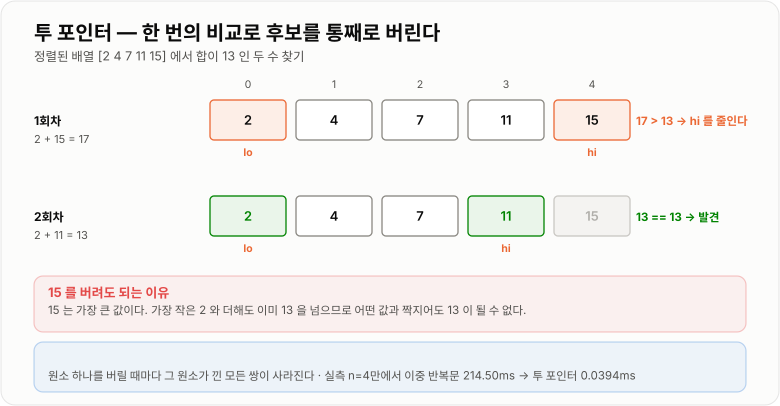

# 투 포인터

> **투 포인터(Two Pointers)는 배열 위에 인덱스 두 개를 두고 조건에 따라 한쪽만 움직여, 이중 반복문으로 O(n²)이 될 탐색을 O(n)으로 줄이는 기법이다.**

---

## 1. 핵심 요약

* 인덱스 **두 개**를 두고, 매번 **조건을 보고 어느 쪽을 움직일지 결정**한다. 두 포인터가 만나면 끝난다.
* 각 포인터가 배열을 **한 번씩만 지나가므로** 전체가 **O(n)** 이고, 추가 메모리는 **O(1)** 이다.
* 성립하려면 **"한쪽을 움직이면 되돌아갈 필요가 없다"** 는 **단조성**이 있어야 한다. 보통 **정렬**이 그 근거다.
* 정렬된 배열에서 두 수의 합을 찾을 때 실측하면 이중 반복문 214.50ms 대 투 포인터 0.0394ms로 **약 5,444배** 차이가 난다. (JDK 17, n=40,000)
* 대표 형태는 **양 끝에서 좁혀 오기**, **같은 방향으로 따라가기**, **두 배열 병합**의 세 가지다.
* 합계를 `int`로 누적하면 **오버플로**로 조용히 틀린다. 실측에서 10만 × 100만이 `1,215,752,192`가 되었다.

---

## 2. 등장 배경

### 해결하려는 문제

"두 원소의 조합"을 찾는 문제는 아주 흔하다.

* 합이 특정 값이 되는 두 수 찾기
* 가장 넓은 넓이를 만드는 두 기둥 찾기
* 두 정렬된 목록을 하나로 합치기
* 중복을 제거해 배열을 압축하기

가장 먼저 떠오르는 방법은 **모든 쌍을 다 보는 것**이다.

```java
for (int i = 0; i < n; i++) {
    for (int j = i + 1; j < n; j++) {
        if (a[i] + a[j] == target) {
            return true;
        }
    }
}
```

쌍의 개수는 `n(n-1)/2`이므로 **O(n²)** 이다. n이 조금만 커져도 감당이 안 된다.

| n       | 확인해야 할 쌍의 수  |
| ------- | ----------: |
| 1,000   |     약 50만 |
| 10,000  |   약 5,000만 |
| 40,000  |   **약 8억** |
| 100,000 |     약 50억 |

실제로 JDK 17에서 n = 40,000으로 재 보면 **214.50ms**가 걸린다. 요청 하나에 0.2초를 쓰는 것이다.

### 핵심 통찰 — 버릴 수 있는 후보가 있다

그런데 배열이 **정렬되어 있다면** 상황이 다르다. 양 끝에 포인터를 두고 보자.

```text
정렬된 배열:  [ 2 ][ 4 ][ 7 ][ 11 ][ 15 ]    찾는 합: 13
               ↑                      ↑
              lo                     hi

합 = 2 + 15 = 17.  목표 13보다 크다.
```

여기서 결정적인 판단이 나온다. **`hi`를 줄여야 한다.** 왜인가?

```text
15 는 배열에서 가장 큰 값이다.
15 와 짝지을 수 있는 가장 작은 값이 2 인데, 그 합이 이미 목표보다 크다.
→ 15 는 어떤 값과 짝지어도 13 을 만들 수 없다
→ 15 를 후보에서 완전히 제거해도 된다
```

한 번의 비교로 **원소 하나에 관련된 모든 쌍을 통째로 버린 것**이다. 이것이 O(n²)이 O(n)으로 줄어드는 이유다.

```text
lo 를 올리면  → lo 가 가리키던 원소가 포함된 모든 쌍이 사라진다
hi 를 내리면  → hi 가 가리키던 원소가 포함된 모든 쌍이 사라진다

각 원소는 최대 한 번 버려지므로 전체 이동 횟수는 n 번이다.
```

실측하면 같은 문제에서 비교 횟수가 **799,980,000회에서 39,999회**로 줄어든다.

### 이 개념이 없을 때

투 포인터를 모르면 대안은 두 가지인데, 둘 다 비용이 있다.

```java
// 대안 1. HashSet 을 쓴다 — O(n) 이지만 메모리 O(n)
Set<Integer> seen = new HashSet<>();
for (int i = 0; i < n; i++) {
    if (seen.contains(target - a[i])) {
        return true;
    }
    seen.add(a[i]);
}
```

시간은 O(n)으로 같지만 **메모리를 O(n) 더 쓴다.** 실측상 `HashSet<Integer>`는 `boolean[]`보다 약 24배 느리고 메모리도 수십 배다.

```java
// 대안 2. 각 원소마다 이진 탐색 — O(n log n)
for (int i = 0; i < n; i++) {
    if (Arrays.binarySearch(a, i + 1, n, target - a[i]) >= 0) {
        return true;
    }
}
```

O(n log n)이라 이중 반복문보다는 낫지만 투 포인터의 O(n)보다 느리고, 코드도 더 복잡하다.

**투 포인터는 추가 메모리 없이 O(n)** 이라는 점에서 이 둘보다 낫다. 정렬만 되어 있다면 말이다.

---

## 3. 핵심 개념

| 개념                    | 설명                                    | 중요한 이유                                |
| --------------------- | ------------------------------------- | ------------------------------------- |
| **두 개의 인덱스**          | 배열 위의 서로 다른 두 위치를 동시에 추적한다            | 상태가 인덱스 두 개뿐이라 공간이 O(1)이다             |
| **단조성(monotonicity)** | 한쪽을 움직이면 되돌아갈 필요가 없다는 성질              | **이 성질이 없으면 투 포인터를 쓸 수 없다.** 가장 중요한 전제 |
| **정렬 전제**             | 대부분의 투 포인터는 정렬을 단조성의 근거로 삼는다          | 정렬이 안 되어 있으면 O(n log n) 정렬 비용이 선행된다   |
| **양 끝 좁혀 오기**         | `lo = 0`, `hi = n-1`에서 시작해 서로 다가온다    | 합·넓이 문제의 대표 형태다                       |
| **같은 방향 따라가기**        | `slow`와 `fast`가 같은 방향으로 이동한다          | 중복 제거·부분 배열 문제에 쓰인다                   |
| **두 배열 병합**           | 서로 다른 배열에 포인터를 하나씩 둔다                 | 병합 정렬의 병합 단계, 교집합·합집합 계산              |
| **포인터 이동 규칙**         | 조건을 보고 어느 쪽을 움직일지 결정한다                | 이 규칙이 곧 알고리즘의 정확성이다                   |
| **종료 조건**             | 보통 `lo < hi` 또는 `fast < n`            | 등호 처리를 틀리면 원소를 빠뜨리거나 무한 루프가 된다        |
| **총 이동 횟수 n**         | 두 포인터의 이동을 합쳐도 최대 n번이다                | O(n)의 근거다. 이중 반복문과 결정적으로 다른 지점        |
| **중복 처리**             | 같은 값이 여러 개일 때 건너뛰는 처리                 | "서로 다른 쌍"을 요구하는 문제에서 반드시 필요하다         |
| **오버플로**              | 합을 `int`로 누적하면 넘칠 수 있다                | 예외 없이 조용히 틀린다 (실측 확인)                 |

세 가지 대표 형태를 그림으로 보면 이렇다.

```text
① 양 끝에서 좁혀 오기          ② 같은 방향으로 따라가기        ③ 두 배열 병합
   [ ][ ][ ][ ][ ][ ]            [ ][ ][ ][ ][ ][ ]           A: [ ][ ][ ]
    ↑              ↑              ↑     ↑                          ↑
   lo             hi            slow  fast                    B: [ ][ ][ ][ ]
                                                                   ↑
   서로 마주 보며 이동           같은 방향, 속도가 다름         각 배열에 하나씩
   합·넓이 문제                  중복 제거·부분 배열            병합·교집합
```

---

## 4. 구조와 동작 원리

### 양 끝에서 좁혀 오기 — 두 수의 합

```text
정렬된 배열:  [ 2 ][ 4 ][ 7 ][ 11 ][ 15 ]      목표 합: 13
index           0    1    2     3     4

1회차   lo=0(2), hi=4(15)   합 = 17  >  13
        → 큰 쪽을 줄여야 한다   hi = 3
        → 15 는 어떤 값과도 13 을 만들 수 없으므로 영구 제외

2회차   lo=0(2), hi=3(11)   합 = 13  ==  13
        → 찾았다!  (2, 11)

비교 횟수: 2회   (이중 반복문이면 최대 10회)
```

값이 없을 때는 두 포인터가 만나면서 끝난다.

```text
목표 합: 14

1회차   lo=0(2),  hi=4(15)   합 17 > 14   →  hi = 3
2회차   lo=0(2),  hi=3(11)   합 13 < 14   →  lo = 1
3회차   lo=1(4),  hi=3(11)   합 15 > 14   →  hi = 2
4회차   lo=1(4),  hi=2(7)    합 11 < 14   →  lo = 2
종료    lo(2) == hi(2)  →  후보 없음

총 이동 4번.  lo 는 0→2, hi 는 4→2.  둘의 이동 합계가 n 을 넘지 않는다.
```



*한 번의 비교로 원소 하나에 얽힌 모든 쌍을 통째로 버리기 때문에 O(n)이 된다.*

### 왜 되돌아갈 필요가 없는가

이것이 투 포인터의 정확성을 떠받치는 논리다.

```text
현재 lo, hi 에서 합이 목표보다 작다고 하자.

  a[lo] + a[hi] < target

lo 를 그대로 두고 hi 를 줄이면?
  배열이 정렬되어 있으므로 a[hi-1] ≤ a[hi]
  → 합은 더 작아진다 → 목표에 더 멀어진다 → 의미 없다

따라서 a[lo] 와 짝지어 목표를 만들 수 있는 값은 이미 hi 오른쪽에 없다.
  → a[lo] 는 어떤 값과도 목표를 만들 수 없다
  → lo 를 올려서 a[lo] 를 버리는 것이 유일하게 옳은 선택이다
```

**정렬이 깨지면 이 논리 전체가 무너진다.** 이진 탐색과 정확히 같은 구조의 위험이다. 정렬 안 된 배열에 투 포인터를 쓰면 예외 없이 틀린 답이 나온다.

### 같은 방향으로 따라가기 — 중복 제거

포인터 두 개가 같은 방향으로 가되 **속도가 다른** 형태다.

```text
정렬된 배열:  [ 1 ][ 1 ][ 2 ][ 2 ][ 2 ][ 3 ]

slow = 마지막으로 확정한 위치
fast = 지금 살펴보는 위치

초기      [1][1][2][2][2][3]
           ↑  ↑
         slow fast=1        a[1]=1 == a[slow]=1  →  중복, fast 만 전진

fast=2    [1][1][2][2][2][3]
           ↑     ↑
         slow  fast         a[2]=2 != a[slow]=1  →  새 값!
                            slow++ 후 a[slow] = 2

          [1][2][2][2][2][3]
              ↑  ↑
            slow fast

fast=3,4  중복이므로 건너뜀

fast=5    a[5]=3 != a[slow]=2  →  새 값!
          slow++ 후 a[slow] = 3

결과      [1][2][3] | 2, 3   ← slow+1 = 3 개가 유효
```

**`slow`는 "결과 배열의 끝"이고 `fast`는 "입력 배열의 현재 위치"** 다. 이 해석이 이 패턴의 핵심이다.

### 두 배열 병합

```text
A: [ 1 ][ 4 ][ 7 ]          i = 0
B: [ 2 ][ 3 ][ 9 ][ 10 ]    j = 0

1회차  A[0]=1 vs B[0]=2  →  1 이 작다  →  결과에 1, i++
2회차  A[1]=4 vs B[0]=2  →  2 가 작다  →  결과에 2, j++
3회차  A[1]=4 vs B[1]=3  →  3 이 작다  →  결과에 3, j++
4회차  A[1]=4 vs B[2]=9  →  4 가 작다  →  결과에 4, i++
5회차  A[2]=7 vs B[2]=9  →  7 이 작다  →  결과에 7, i++
       A 소진 → B 의 남은 것을 그대로 붙인다

결과:  [1][2][3][4][7][9][10]      비교 5번, 총 O(n+m)
```

이것이 **병합 정렬의 병합 단계**이며, TimSort가 run을 합칠 때 하는 일이다. 두 정렬된 목록의 교집합·합집합·차집합도 전부 이 패턴이다.

### 총 이동 횟수가 n을 넘지 않는 이유

```text
양 끝 좁혀 오기:
    매 반복마다 lo 가 오르거나 hi 가 내린다 (반드시 하나는 움직인다)
    lo 와 hi 사이의 거리가 매번 최소 1씩 줄어든다
    처음 거리가 n-1 이므로 반복은 최대 n-1 번

같은 방향 따라가기:
    fast 는 매 반복마다 정확히 1씩 전진한다
    slow 는 전진하거나 제자리다
    fast 가 n 에 도달하면 끝 → 최대 n 번

  → 어느 형태든 O(n)
```

이것이 "포인터가 두 개니까 O(n²)이 아닌가?"라는 흔한 오해에 대한 답이다. **중첩된 반복이 아니라 하나의 반복 안에서 두 인덱스가 각자 전진할 뿐**이다.

---

## 5. 코드 또는 사용 예시

### 두 수의 합 — 양 끝 좁혀 오기

```java
import java.util.Arrays;

public class TwoSum {

    /**
     * 정렬된 배열에서 합이 target 인 두 수의 인덱스를 찾는다.
     * 없으면 null.
     */
    public static int[] find(int[] sorted, int target) {
        int lo = 0;
        int hi = sorted.length - 1;

        while (lo < hi) {
            int sum = sorted[lo] + sorted[hi];

            if (sum == target) {
                return new int[]{lo, hi};
            } else if (sum < target) {
                lo++;              // 합을 키워야 한다
            } else {
                hi--;              // 합을 줄여야 한다
            }
        }
        return null;
    }

    public static void main(String[] args) {
        int[] a = {2, 4, 7, 11, 15};

        System.out.println(Arrays.toString(find(a, 13)));   // [0, 3]
        System.out.println(Arrays.toString(find(a, 9)));    // [0, 2]
        System.out.println(find(a, 14));                     // null
    }
}
```

각 부분의 의미는 이렇다.

```java
while (lo < hi)
```

**등호가 없어야 한다.** `lo <= hi`로 쓰면 `lo == hi`일 때 같은 원소를 두 번 더하게 된다. "서로 다른 두 원소"라는 조건이 깨진다.

```java
} else if (sum < target) {
    lo++;
```

**합이 작으면 왼쪽을 올린다.** 정렬되어 있으므로 `lo`를 올려야 합이 커진다. 이 방향을 반대로 쓰면 영원히 답을 못 찾는다.

```java
int sum = sorted[lo] + sorted[hi];
```

**값이 크면 `int` 오버플로 위험**이 있다. `Integer.MAX_VALUE`에 가까운 값들이 들어올 수 있다면 `long sum = (long) sorted[lo] + sorted[hi];`로 받아야 한다.

### 오버플로 — 실제로 틀린다

합을 누적하는 형태에서는 특히 위험하다. **JDK 17 실측**이다.

```java
int[] a = new int[100_000];
Arrays.fill(a, 1_000_000);

int isum = 0;
long lsum = 0;
for (int i = 0; i < a.length; i++) {
    isum += a[i];
    lsum += a[i];
}
```

```text
100,000 × 1,000,000 = 100,000,000,000 (1000억)

  int  누적 = 1,215,752,192      ← 완전히 틀린 값
  long 누적 = 100,000,000,000    ← 정상
```

**주의할 점은 결과가 음수가 아니라 양수라는 것이다.** "오버플로 나면 음수가 되니까 검사하면 된다"는 생각이 통하지 않는다. 그럴듯한 양수가 나와서 **버그를 발견할 단서가 없다.** 누적 합은 항상 `long`으로 받는 것이 안전하다.

### 세 수의 합 — 투 포인터를 한 겹 감싸기

```java
import java.util.ArrayList;
import java.util.Arrays;
import java.util.List;

public class ThreeSum {

    /** 합이 0 이 되는 서로 다른 세 수의 조합을 모두 찾는다. */
    public static List<int[]> find(int[] nums) {
        Arrays.sort(nums);                       // O(n log n)
        List<int[]> result = new ArrayList<>();

        for (int i = 0; i < nums.length - 2; i++) {
            // 첫 번째 수의 중복 건너뛰기
            if (i > 0 && nums[i] == nums[i - 1]) {
                continue;
            }

            int lo = i + 1;
            int hi = nums.length - 1;

            while (lo < hi) {
                int sum = nums[i] + nums[lo] + nums[hi];

                if (sum == 0) {
                    result.add(new int[]{nums[i], nums[lo], nums[hi]});
                    // 두 번째·세 번째 수의 중복 건너뛰기
                    while (lo < hi && nums[lo] == nums[lo + 1]) {
                        lo++;
                    }
                    while (lo < hi && nums[hi] == nums[hi - 1]) {
                        hi--;
                    }
                    lo++;
                    hi--;
                } else if (sum < 0) {
                    lo++;
                } else {
                    hi--;
                }
            }
        }
        return result;
    }

    public static void main(String[] args) {
        int[] nums = {-1, 0, 1, 2, -1, -4};
        List<int[]> r = find(nums);
        for (int i = 0; i < r.size(); i++) {
            System.out.println(Arrays.toString(r.get(i)));
        }
        // [-1, -1, 2]
        // [-1, 0, 1]
    }
}
```

전체 복잡도는 **O(n²)** 이다. 바깥 반복문 n번 × 안쪽 투 포인터 n번이다. 하지만 이는 세 겹 반복문의 **O(n³)에서 한 차수 줄인 것**이다.

**중복 건너뛰기 세 곳**이 이 코드의 핵심이다. 빠뜨리면 `[-1, 0, 1]`이 여러 번 결과에 들어간다.

### 중복 제거 — 같은 방향 따라가기

```java
public class RemoveDuplicates {

    /**
     * 정렬된 배열에서 중복을 제거하고 유효한 길이를 반환한다.
     * 새 배열을 만들지 않고 제자리에서 처리한다 (공간 O(1)).
     */
    public static int removeDuplicates(int[] sorted) {
        if (sorted.length == 0) {
            return 0;
        }

        int slow = 0;                     // 마지막으로 확정한 위치

        for (int fast = 1; fast < sorted.length; fast++) {
            if (sorted[fast] != sorted[slow]) {
                slow++;
                sorted[slow] = sorted[fast];
            }
            // 같으면 fast 만 전진 (slow 는 그대로)
        }
        return slow + 1;
    }

    public static void main(String[] args) {
        int[] a = {1, 1, 2, 2, 2, 3};
        int len = removeDuplicates(a);

        System.out.println("유효 길이: " + len);        // 3
        for (int i = 0; i < len; i++) {
            System.out.print(a[i] + " ");               // 1 2 3
        }
    }
}
```

### 두 정렬 배열 병합

```java
public class MergeSorted {

    public static int[] merge(int[] a, int[] b) {
        int[] result = new int[a.length + b.length];
        int i = 0, j = 0, k = 0;

        while (i < a.length && j < b.length) {
            if (a[i] <= b[j]) {           // <= 라야 안정적이다
                result[k] = a[i];
                i++;
            } else {
                result[k] = b[j];
                j++;
            }
            k++;
        }

        // 남은 것을 그대로 붙인다
        while (i < a.length) {
            result[k] = a[i];
            i++;
            k++;
        }
        while (j < b.length) {
            result[k] = b[j];
            j++;
            k++;
        }
        return result;
    }

    public static void main(String[] args) {
        int[] a = {1, 4, 7};
        int[] b = {2, 3, 9, 10};
        int[] m = merge(a, b);
        for (int i = 0; i < m.length; i++) {
            System.out.print(m[i] + " ");   // 1 2 3 4 7 9 10
        }
    }
}
```

```java
if (a[i] <= b[j])
```

**`<`가 아니라 `<=`여야 안정적**이다. 값이 같을 때 앞 배열의 것을 먼저 넣어야 원래 순서가 보존된다. TimSort가 안정 정렬인 근거가 바로 이 한 글자다.

### 실측 — 얼마나 빨라지는가

JDK 17에서 n = 40,000인 정렬된 배열에 대해 **없는 값**(최악의 경우)을 찾아 비교했다.

```text
이중 반복문 O(n²) : 214.50 ms    (약 799,980,000회 비교)
투 포인터   O(n)  :   0.0394 ms  (        39,999회 비교)

  → 약 5,444배 차이
```

**비교 횟수가 8억에서 4만으로 줄었다.** n이 커질수록 격차는 더 벌어진다.

---

## 6. 성능 특성

| 패턴             | 시간 복잡도       | 공간 복잡도   | 설명                       |
| -------------- | ------------ | -------- | ------------------------ |
| 양 끝 좁혀 오기      | **O(n)**     | **O(1)** | 두 포인터 이동 합계가 n 이하        |
| 같은 방향 따라가기     | **O(n)**     | **O(1)** | `fast`가 배열을 한 번 지나간다     |
| 두 배열 병합        | **O(n + m)** | O(n + m) | 결과 배열이 필요하면 O(n+m)       |
| 정렬이 선행되는 경우    | O(n log n)   | O(1)     | **정렬 비용이 지배적이 된다**       |
| 세 수의 합 (한 겹 감쌈) | O(n²)        | O(1)     | 세 겹 반복문 O(n³)에서 한 차수 감소  |

**정렬이 필요한 경우 전체 복잡도는 O(n log n)** 이 된다. 투 포인터 부분이 O(n)이어도 정렬이 더 비싸기 때문이다.

```text
이미 정렬되어 있다   →  O(n)         ← 투 포인터의 진가
정렬해야 한다        →  O(n log n)   ← HashSet 방식(O(n))보다 느릴 수 있다
```

**이것이 실무에서 중요한 판단 지점이다.** 정렬되어 있지 않고 메모리 여유가 있다면 `HashSet`이 더 나을 수 있다.

### 대안과의 비교

정렬된 배열에서 두 수의 합을 찾는 문제 기준이다.

| 방법           | 시간         | 공간       | 비고                    |
| ------------ | ---------- | -------- | --------------------- |
| 이중 반복문       | O(n²)      | O(1)     | 실측 214.50 ms (n=4만)   |
| `HashSet` 사용 | O(n)       | **O(n)** | 메모리를 쓴다. 정렬 불필요       |
| 각 원소마다 이진 탐색 | O(n log n) | O(1)     | 정렬 필요                 |
| **투 포인터**    | **O(n)**   | **O(1)** | 실측 0.0394 ms. 정렬 필요   |

**투 포인터는 시간과 공간을 동시에 최적으로 만드는 유일한 방법**이다. 단, 정렬이라는 전제가 붙는다.

### 상수 배수 측면

투 포인터는 **캐시 친화적**이다.

```text
배열을 앞에서 뒤로, 뒤에서 앞으로 순차적으로 읽는다
  → CPU 캐시 프리페처가 다음 데이터를 미리 가져온다
  → 같은 O(n) 이라도 HashSet 방식보다 상수 배수가 작다

HashSet 은 해시값에 따라 메모리 여기저기를 튀어 다닌다
  → 캐시 미스가 계속 발생한다
  → 실측상 boolean[] 대비 약 24배 느리다
```

---

## 7. 장점과 단점

| 장점                | 이유                                      |
| ----------------- | --------------------------------------- |
| O(n²)을 O(n)으로 줄인다 | 한 번의 비교로 원소 하나에 얽힌 모든 쌍을 제거한다           |
| 추가 메모리가 O(1)이다    | 인덱스 두 개만 쓴다. `HashSet` 방식의 O(n)과 대비된다   |
| 캐시 친화적이다          | 배열을 순차적으로 읽어 같은 O(n)이라도 상수 배수가 작다       |
| 제자리 처리가 가능하다      | 중복 제거 같은 작업을 새 배열 없이 할 수 있다             |
| 구현이 짧다            | 반복문 하나에 조건 분기 몇 개면 끝난다                  |
| 결과가 결정적이다         | 해시처럼 순서가 흔들리지 않아 테스트하기 쉽다              |
| 스트리밍에 가까운 접근이 가능하다 | 병합 패턴은 전체를 메모리에 올리지 않고도 처리할 수 있다        |

| 단점                     | 이유 및 주의점                                     |
| ---------------------- | -------------------------------------------- |
| **단조성이 없으면 쓸 수 없다**    | 조건이 왔다갔다 하면 어느 쪽을 움직일지 결정할 수 없다              |
| 대부분 정렬이 선행된다           | O(n log n) 정렬 비용이 붙어 전체가 O(n log n)이 된다      |
| 정렬이 깨지면 조용히 틀린다        | 이진 탐색과 같은 위험이다. 예외가 나지 않는다                   |
| 이동 규칙을 틀리면 답을 못 찾는다    | 부등호 방향 하나만 뒤집혀도 영원히 목표에 도달하지 못한다             |
| 중복 처리를 빠뜨리기 쉽다         | "서로 다른 조합" 요구사항에서 같은 결과가 여러 번 나온다            |
| 오버플로가 조용히 발생한다         | 합을 `int`로 받으면 그럴듯한 양수가 나온다 (실측 확인)           |
| 임의 접근이 필요하다            | `LinkedList`처럼 인덱스 접근이 O(n)이면 이점이 사라진다       |
| 적용 가능한 문제 유형이 한정적이다    | "두 개의 조합"이나 "구간" 형태가 아니면 적용하기 어렵다            |

---

## 8. 사용 기준

### 사용하기 좋은 상황

* 배열이 **이미 정렬되어 있고** 두 원소의 조합을 찾을 때
* **추가 메모리를 쓸 수 없을 때** (`HashSet`을 만들 여유가 없는 대용량)
* 두 개의 **정렬된 목록을 합치거나** 교집합·차집합을 구할 때
* 배열을 **제자리에서 압축**해야 할 때 (중복 제거, 특정 값 제거)
* "가장 넓은 넓이", "가장 긴 구간" 처럼 **양 끝에서 좁혀 오는** 구조일 때
* 세 수 이상의 합처럼 **한 차수를 줄여야** 할 때

### 사용하지 않는 것이 좋은 상황

* 배열이 **정렬되어 있지 않고** 정렬 비용이 아까울 때 → **`HashSet`**
* **단조성이 없을** 때 — 조건이 왔다갔다 하면 적용 자체가 불가능하다
* 원소의 **원래 인덱스**가 필요한데 정렬로 순서가 바뀌면 곤란할 때
* **연속된 구간**의 합·최댓값이 필요할 때 → **슬라이딩 윈도우**
* `LinkedList`처럼 **임의 접근이 O(n)** 인 자료구조일 때
* 조건이 **여러 필드에 걸쳐** 있어 하나의 기준으로 정렬할 수 없을 때

### 선택 기준

1. **정렬되어 있는가?** 아니면 정렬 비용 O(n log n)을 감당할 수 있는가?
2. **단조성이 있는가?** — "한쪽을 움직이면 되돌아갈 필요가 없다"가 성립하는가?
3. **메모리 제약이 있는가?** — 있으면 투 포인터, 없으면 `HashSet`이 더 단순할 수 있다
4. **원래 인덱스가 필요한가?** — 필요하면 정렬 전에 인덱스를 함께 보관해야 한다
5. **연속 구간인가 임의 조합인가?** — 연속 구간이면 슬라이딩 윈도우 쪽이다

```text
              두 원소의 조합을 찾는가?
                       │
        ┌──────────────┴──────────────┐
      예                             아니오
        │                             │
   정렬되어 있는가?              연속된 구간인가?
        │                             │
  ┌─────┴─────┐               ┌───────┴───────┐
 예          아니오          예              아니오
  │            │              │                │
투 포인터   메모리 여유?   슬라이딩 윈도우    다른 접근
  O(n)         │
         ┌─────┴─────┐
        있음        없음
         │            │
      HashSet    정렬 후 투 포인터
       O(n)        O(n log n)
```

---

## 9. 비슷한 개념 비교

### 투 포인터와 슬라이딩 윈도우

| 비교 항목     | 투 포인터                | 슬라이딩 윈도우            | 선택 기준        |
| --------- | -------------------- | ------------------- | ------------ |
| 관심 대상     | 두 포인터가 가리키는 **두 원소**  | 두 포인터 **사이의 구간**    | 원소인가 구간인가    |
| 이동 방향     | 주로 마주 보며 좁혀 옴        | 주로 같은 방향으로 이동       | 문제 구조        |
| 대표 문제     | 두 수의 합, 넓이, 병합       | 부분합, 최장 부분 문자열      | -            |
| 정렬 필요     | **대부분 필요**           | **대부분 불필요**         | 큰 차이         |
| 구간 유지     | 안 함                  | 구간의 상태(합·개수)를 유지    | 상태 관리 여부     |
| 시간 복잡도    | O(n)                 | O(n)                | 동일           |
| 관계        | **슬라이딩 윈도우는 투 포인터의 한 형태다** | 구간에 특화된 변형          | 넓게 보면 같은 계열  |
| 적합한 상황    | 정렬된 배열의 조합 문제        | 연속 구간 문제            | 연속성 요구 여부    |

**슬라이딩 윈도우는 투 포인터의 특수한 경우**로 볼 수 있다. 두 포인터가 같은 방향으로 움직이며 그 사이를 "창"으로 취급하는 형태다.

### 투 포인터와 이진 탐색

| 비교 항목  | 투 포인터          | 이진 탐색          | 선택 기준       |
| ------ | -------------- | -------------- | ----------- |
| 목적     | 두 원소의 조합 찾기    | 하나의 값 찾기       | 찾는 대상       |
| 전제     | 정렬 + 단조성       | 정렬             | 둘 다 정렬 필요   |
| 복잡도    | O(n)           | **O(log n)**   | 단일 값이면 이진 탐색 |
| 포인터 이동 | 매번 1칸씩         | 매번 절반씩         | 이동 폭        |
| 공간     | O(1)           | O(1)           | 동일          |
| 전제 위반 시 | 조용히 오답         | 조용히 오답         | 둘 다 위험      |
| 조합 문제  | **가능**         | 각 원소마다 반복해야 함  | 투 포인터가 유리   |
| 적합한 상황 | 쌍·구간 문제        | 단일 값·삽입점       | 문제 형태       |

### 투 포인터와 `HashSet`

| 비교 항목  | 투 포인터         | `HashSet`      | 선택 기준       |
| ------ | ------------- | -------------- | ----------- |
| 시간     | O(n) (정렬 제외)  | **O(n)**       | 동일          |
| 정렬 필요  | **필요**        | 불필요            | 정렬 안 되어 있으면 해시 |
| 공간     | **O(1)**      | O(n)           | 메모리 제약      |
| 캐시 효율  | **좋음** (순차 접근) | 나쁨 (해시 산포)     | 실측 약 24배 차이 |
| 원래 인덱스 | 정렬로 뒤섞임       | **보존됨**        | 인덱스가 필요하면 해시 |
| 중복 처리  | 건너뛰기 코드 필요    | 자동으로 제거됨       | 요구사항에 따라    |
| 범위 조건  | **가능** (이상·이하) | 불가능 (완전 일치만)   | 범위가 필요하면 포인터 |
| 적합한 상황 | 정렬됨 + 메모리 제약  | 정렬 안 됨 + 인덱스 필요 | 상황으로 판단     |

### 투 포인터와 이중 반복문

| 비교 항목  | 투 포인터    | 이중 반복문       | 선택 기준        |
| ------ | -------- | ------------ | ------------ |
| 복잡도    | O(n)     | O(n²)        | n의 크기        |
| n=4만 실측 | 0.0394 ms | **214.50 ms** | 약 5,444배 차이  |
| 비교 횟수  | 39,999회  | 799,980,000회 | -            |
| 전제     | 정렬 + 단조성 | **없음**       | 전제를 만들 수 있는가 |
| 모든 쌍 필요 | 불가능      | **가능**       | 전부 열거해야 하면 이중 |
| 구현 난이도  | 이동 규칙 설계 필요 | 매우 단순        | n이 작으면 이중도 무방 |
| 적합한 상황 | 대량 + 정렬됨 | 소량 + 전제 없음   | n이 수백 이하면 이중도 괜찮다 |

**n이 작으면 이중 반복문도 충분하다.** n = 100이면 5,000번 비교인데 이는 순식간이다. 투 포인터는 n이 수만 이상일 때 의미가 있다.

---

## 10. 백엔드 실무 적용

### Spring·Java

투 포인터가 실무에서 가장 자주 쓰이는 곳은 **정렬된 두 목록의 병합·비교**다.

```java
import java.util.ArrayList;
import java.util.List;

public class SyncService {

    /**
     * DB의 현재 데이터와 외부 시스템의 데이터를 비교해
     * 추가·수정·삭제 대상을 가려낸다.
     * 양쪽 모두 ID 오름차순으로 정렬되어 있다고 가정한다.
     */
    public static class SyncResult {
        public final List<Item> toInsert = new ArrayList<>();
        public final List<Item> toUpdate = new ArrayList<>();
        public final List<Item> toDelete = new ArrayList<>();
    }

    public static SyncResult diff(List<Item> current, List<Item> incoming) {
        SyncResult result = new SyncResult();
        int i = 0, j = 0;

        while (i < current.size() && j < incoming.size()) {
            Item c = current.get(i);
            Item n = incoming.get(j);
            int cmp = Long.compare(c.getId(), n.getId());

            if (cmp == 0) {
                if (!c.contentEquals(n)) {
                    result.toUpdate.add(n);
                }
                i++;
                j++;
            } else if (cmp < 0) {
                result.toDelete.add(c);      // 현재에만 있다 → 삭제
                i++;
            } else {
                result.toInsert.add(n);      // 외부에만 있다 → 추가
                j++;
            }
        }

        while (i < current.size()) {
            result.toDelete.add(current.get(i));
            i++;
        }
        while (j < incoming.size()) {
            result.toInsert.add(incoming.get(j));
            j++;
        }
        return result;
    }
}
```

**두 목록을 각각 한 번씩만 훑어 O(n + m)** 이다. 흔히 쓰는 방식과 비교하면 차이가 크다.

```java
// 흔한 방식 — O(n × m)
for (Item c : current) {
    boolean found = false;
    for (Item n : incoming) {          // 매번 전체 순회
        if (c.getId() == n.getId()) {
            found = true;
            break;
        }
    }
    if (!found) {
        toDelete.add(c);
    }
}
```

10만 × 10만이면 **100억 번**이다. 투 포인터로 바꾸면 **20만 번**이 된다.

**단, 이미 정렬되어 있어야 한다.** DB에서 가져올 때 `ORDER BY id`를 붙이면 인덱스를 타서 정렬 비용이 0이다. 이것이 실무에서 투 포인터를 쓸 수 있게 만드는 조건이다.

```java
// 정렬 상태를 DB가 보장하게 한다
@Query("SELECT i FROM Item i ORDER BY i.id")
List<Item> findAllOrderById();
```

**대안으로 `Map`을 쓰는 방법**도 있고, 이쪽이 더 자주 쓰인다.

```java
Map<Long, Item> currentMap = new HashMap<>();
for (Item c : current) {
    currentMap.put(c.getId(), c);
}
// 이후 O(1) 조회
```

| 방식        | 시간         | 공간       | 정렬 필요 | 언제 쓰나          |
| --------- | ---------- | -------- | ----- | -------------- |
| 이중 반복문    | O(n×m)     | O(1)     | 불필요   | 데이터가 아주 작을 때   |
| `Map` 구축  | O(n+m)     | **O(n)** | 불필요   | **대부분의 실무 상황** |
| **투 포인터** | O(n+m)     | **O(1)** | 필요    | 대용량 + 메모리 제약   |

**실무에서는 `Map` 방식이 기본이다.** 정렬 전제가 필요 없고 코드가 단순하기 때문이다. 투 포인터는 **데이터가 매우 커서 `Map`을 메모리에 올릴 수 없을 때** 진가를 발휘한다.

### 데이터베이스·캐시

**DB의 조인 알고리즘 중 `Sort Merge Join`이 바로 투 포인터**다.

```text
Nested Loop Join   : 바깥 테이블 각 행마다 안쪽 테이블 탐색 → 이중 반복문
Hash Join          : 한쪽으로 해시 테이블을 만들고 조회 → HashMap 방식
Sort Merge Join    : 양쪽을 정렬한 뒤 포인터 두 개로 병합 → 투 포인터

  실행 계획에서 확인할 수 있다.
  MySQL:      EXPLAIN 의 Extra 컬럼
  PostgreSQL: EXPLAIN 의 Merge Join / Hash Join / Nested Loop
```

옵티마이저가 `Sort Merge Join`을 고르는 상황이 곧 투 포인터가 유리한 상황이다.

```text
Sort Merge Join 이 유리한 경우
  - 양쪽 다 이미 정렬되어 있다 (조인 키에 인덱스가 있다)
  - 양쪽 다 크다 (해시 테이블을 메모리에 못 올린다)
  - 결과도 정렬된 순서로 필요하다

Hash Join 이 유리한 경우
  - 한쪽이 작아서 해시 테이블을 메모리에 올릴 수 있다
  - 정렬되어 있지 않다
```

**메모리와 정렬 사이의 트레이드오프가 애플리케이션 코드와 정확히 같다.**

Redis에서도 정렬된 자료구조를 병합하는 연산이 같은 원리다.

```text
ZUNIONSTORE dest 2 key1 key2      ← 두 Sorted Set 의 합집합
ZINTERSTORE dest 2 key1 key2      ← 두 Sorted Set 의 교집합

  내부적으로 정렬된 순서를 이용해 병합한다.
  단, 대량 키에 쓰면 Redis 가 단일 스레드라 블로킹된다.
```

### 동시성·분산 환경

* **투 포인터는 읽기만 하므로 스레드 안전**하다. 다만 순회 도중 다른 스레드가 리스트를 수정하면 `ConcurrentModificationException`이 나거나 정렬 전제가 깨진다. 스냅샷을 뜨거나 불변 리스트를 쓴다.
* **분산 정렬 병합**에서 각 노드가 정렬된 결과를 내보내면 코디네이터가 투 포인터(정확히는 k-way merge)로 합친다. Elasticsearch가 샤드별 결과를 병합하는 방식이다.
* **k개 목록의 병합**은 포인터 k개를 두고 `PriorityQueue`로 가장 작은 것을 뽑는 형태로 확장된다. 이때 복잡도는 O(N log k)다.
* **로그 병합**처럼 시간순 정렬된 대용량 파일 여러 개를 합칠 때, 전체를 메모리에 올리지 않고 포인터만 유지하면 된다. 공간 O(1)이라는 특성이 여기서 결정적이다.

---

## 11. 자주 하는 오해

| 잘못된 이해                            | 올바른 이해                                                              |
| --------------------------------- | ------------------------------------------------------------------- |
| 포인터가 두 개니까 O(n²)이다                | **중첩이 아니다.** 하나의 반복 안에서 두 인덱스가 각자 전진하며, 이동 합계가 n을 넘지 않아 O(n)이다      |
| 투 포인터는 항상 정렬이 필요하다                | 대부분 필요하지만 필수는 아니다. **필요한 것은 단조성**이고, 정렬은 그것을 만드는 가장 흔한 방법일 뿐이다      |
| 정렬 안 된 배열에 쓰면 예외가 난다              | **예외 없이 조용히 틀린 답**을 준다. 이진 탐색과 같은 위험이다                              |
| 투 포인터가 `HashSet`보다 항상 빠르다         | 정렬이 필요하면 O(n log n)이 되어 `HashSet`의 O(n)보다 느릴 수 있다                  |
| 합을 `int`로 받아도 오버플로 나면 음수라 알 수 있다  | **그럴듯한 양수가 나온다.** 실측에서 10만×100만이 `1,215,752,192`가 되었다               |
| `while (lo <= hi)`로 써도 된다         | 같은 원소를 두 번 더하게 된다. "서로 다른 두 원소" 조건이 깨지므로 `lo < hi`여야 한다             |
| 중복 값은 알아서 처리된다                    | 같은 결과가 여러 번 나온다. **중복 건너뛰기 코드를 명시적으로 넣어야** 한다                       |
| 투 포인터와 슬라이딩 윈도우는 다른 기법이다          | 슬라이딩 윈도우는 투 포인터의 한 형태다. **두 원소를 보는가, 사이 구간을 보는가**의 차이다              |
| 세 수의 합도 O(n)으로 풀 수 있다             | 바깥 반복문이 붙어 **O(n²)** 이다. 세 겹 반복문 O(n³)에서 한 차수 줄인 것이다               |
| `LinkedList`에도 투 포인터를 쓰면 O(n)이다   | 인덱스 접근이 O(n)이라 전체가 O(n²)가 된다. 반복자를 쓰면 가능하지만 양 끝 방식은 어렵다            |
| 병합할 때 `<`와 `<=`는 결과가 같다           | 값이 같을 때 어느 쪽을 먼저 넣느냐가 달라진다. **`<=`여야 안정적**이다                       |
| 이중 반복문은 언제나 나쁜 선택이다               | n이 수백 이하면 차이가 없고 코드가 더 단순하다. n = 100이면 5,000번뿐이다                    |
| DB 조인과 투 포인터는 관계없다                | **`Sort Merge Join`이 곧 투 포인터**다. 메모리·정렬 트레이드오프도 동일하다                |

---

## 12. 면접 답변

### 기본 답변

투 포인터는 배열 위에 인덱스 두 개를 두고, 조건을 보고 어느 쪽을 움직일지 결정하면서 탐색하는 기법입니다. 시간 복잡도는 O(n), 공간 복잡도는 O(1)입니다.

핵심 원리는 **한 번의 비교로 원소 하나에 얽힌 모든 쌍을 통째로 버릴 수 있다**는 것입니다. 정렬된 배열에서 양 끝 합이 목표보다 크면, 가장 큰 값은 어떤 값과 짝지어도 목표를 만들 수 없으므로 영구히 제외할 수 있습니다. 그래서 두 포인터의 이동 합계가 n을 넘지 않고, 이것이 O(n)의 근거입니다.

포인터가 두 개라 O(n²)로 오해하기 쉬운데, **중첩된 반복이 아니라 하나의 반복 안에서 두 인덱스가 각자 전진하는 것**이라 O(n)입니다.

성립 조건은 **단조성**입니다. "한쪽을 움직이면 되돌아갈 필요가 없다"가 보장되어야 하고, 보통 정렬이 그 근거가 됩니다. 정렬이 깨지면 이진 탐색과 마찬가지로 **예외 없이 조용히 틀린 답**이 나옵니다.

실측해 보면 n = 40,000인 정렬 배열에서 두 수의 합을 찾을 때 이중 반복문이 214.50ms에 약 8억 번 비교하는 반면, 투 포인터는 0.0394ms에 4만 번 비교로 끝나 약 5,444배 차이가 났습니다.

대표 형태는 양 끝에서 좁혀 오기, 같은 방향으로 따라가기, 두 배열 병합의 세 가지입니다. 실무에서 가장 자주 만나는 것은 세 번째로, 두 정렬된 목록의 차이를 구하는 동기화 로직이나 DB의 `Sort Merge Join`이 이에 해당합니다.

선택 기준은 메모리입니다. 정렬되어 있지 않다면 `HashSet`이나 `Map`이 O(n)에 더 단순하고, 실무에서는 이쪽이 기본입니다. 투 포인터는 **데이터가 매우 커서 해시 테이블을 메모리에 올릴 수 없을 때** 공간 O(1)이라는 점에서 진가를 발휘합니다. DB 옵티마이저가 `Hash Join`과 `Sort Merge Join` 중에 고르는 판단과 정확히 같은 트레이드오프입니다.

주의할 점으로, 합을 `int`로 누적하면 오버플로가 나는데 **음수가 아니라 그럴듯한 양수**가 나와 발견하기 어렵습니다. 실측에서 10만 × 100만이 `1,215,752,192`가 되었습니다. 누적 합은 `long`으로 받아야 합니다.

### 답변 구조

* **정의**

    * 배열 위의 인덱스 두 개를 조건에 따라 이동시키는 탐색 기법
    * 이중 반복문 O(n²)을 O(n)으로 줄인다

* **내부 원리**

    * 한 번의 비교로 원소 하나에 얽힌 모든 쌍을 제거한다
    * 두 포인터 이동 합계가 n 이하 → 중첩이 아니라 단일 반복
    * 성립 조건은 **단조성** (정렬이 가장 흔한 근거)
    * 형태 3가지: 양 끝 좁혀 오기 / 같은 방향 따라가기 / 두 배열 병합

* **복잡도**

    * 시간 O(n), 공간 **O(1)**
    * 정렬이 선행되면 전체 O(n log n)
    * 세 수의 합처럼 한 겹 감싸면 O(n²)
    * 실측(JDK 17, n=4만): 이중 반복문 214.50ms / 투 포인터 0.0394ms — 약 5,444배

* **장점**

    * 시간과 공간을 동시에 최적화 (O(n) + O(1))
    * 순차 접근이라 캐시 친화적 (`HashSet` 대비 상수 배수 작음)
    * 제자리 처리 가능, 구현이 짧음

* **단점**

    * **단조성이 없으면 적용 불가**
    * 정렬이 선행되면 O(n log n)이 되어 해시 방식보다 느릴 수 있음
    * 정렬 전제가 깨지면 **예외 없이 오답**
    * 중복 처리·오버플로를 빠뜨리기 쉬움

* **사용 기준**

    * 이미 정렬되어 있고 두 원소의 조합·구간을 찾을 때
    * 메모리 제약이 심해 해시 테이블을 만들 수 없을 때
    * 두 정렬 목록의 병합·교집합·차집합

* **대안과 비교**

    * 정렬 안 됨 + 메모리 여유 → `HashSet`/`Map` (O(n), 실무 기본)
    * 단일 값 탐색 → 이진 탐색 (O(log n))
    * 연속 구간 문제 → 슬라이딩 윈도우 (투 포인터의 한 형태)
    * n이 수백 이하 → 이중 반복문도 충분

* **실무 적용 사례**

    * 두 정렬 목록의 동기화 diff — O(n×m)을 O(n+m)으로
    * DB `Sort Merge Join` — 투 포인터 그 자체, `Hash Join`과 같은 트레이드오프
    * 분산 환경의 샤드별 정렬 결과 병합 (k-way merge, O(N log k))
    * 대용량 로그 파일 병합 — 공간 O(1)이라 전체를 메모리에 안 올려도 됨

---

## 13. 예상 면접 질문

### 기본 질문

1. **투 포인터란 무엇이고 복잡도는 어떻게 되나요?**

    * 핵심 키워드: 인덱스 두 개, 조건부 이동, O(n), 공간 O(1)

2. **포인터가 두 개인데 왜 O(n²)이 아닌가요?**

    * 핵심 키워드: 중첩 아님, 단일 반복, 이동 합계가 n 이하, 매번 최소 하나는 전진

3. **투 포인터가 성립하려면 어떤 조건이 필요한가요?**

    * 핵심 키워드: **단조성**, 되돌아갈 필요 없음, 정렬은 단조성을 만드는 수단

4. **정렬된 배열에서 합이 목표보다 클 때 왜 `hi`를 줄이나요?**

    * 핵심 키워드: 가장 큰 값이 최소값과 짝지어도 초과, 어떤 조합도 불가, 영구 제외

5. **정렬 안 된 배열에 투 포인터를 쓰면 어떻게 되나요?**

    * 핵심 키워드: 예외 없이 조용한 오답, 이진 탐색과 같은 위험

6. **투 포인터와 `HashSet` 중 무엇을 쓰겠습니까?**

    * 핵심 키워드: 정렬 여부, 공간 O(1) vs O(n), 원래 인덱스 필요 여부, 캐시 효율

7. **`while (lo < hi)`에서 등호를 넣으면 어떻게 되나요?**

    * 핵심 키워드: 같은 원소를 두 번 사용, "서로 다른 두 원소" 조건 위반

8. **투 포인터와 슬라이딩 윈도우의 차이는 무엇인가요?**

    * 핵심 키워드: 두 원소 vs 사이 구간, 정렬 필요 vs 불필요, 슬라이딩 윈도우가 하위 개념

### 꼬리 질문

1. **세 수의 합은 왜 O(n²)인가요? O(n)으로 만들 수 없나요?**

    * 핵심 키워드: 바깥 반복문 n번 × 투 포인터 n번, O(n³)에서 한 차수 감소, 하한

2. **합을 `int`로 누적하면 어떤 문제가 생기나요?**

    * 핵심 키워드: 오버플로, **음수가 아니라 그럴듯한 양수**, 실측 `1,215,752,192`, `long` 사용

3. **중복 값이 있으면 어떤 처리가 필요한가요?**

    * 핵심 키워드: 명시적 건너뛰기, 세 곳(첫·둘째·셋째 수), 같은 결과 중복 출력 방지

4. **두 배열을 병합할 때 `<`와 `<=` 중 무엇을 쓰나요?**

    * 핵심 키워드: `<=`가 안정적, 같은 값일 때 앞 배열 우선, TimSort 안정성의 근거

5. **`LinkedList`에 투 포인터를 쓰면 어떻게 되나요?**

    * 핵심 키워드: 인덱스 접근 O(n) → 전체 O(n²), 반복자로 같은 방향은 가능, 양 끝은 어려움

6. **두 목록의 차이를 구할 때 투 포인터와 `Map` 중 실무에서는 무엇을 쓰나요?**

    * 핵심 키워드: `Map`이 기본(정렬 불필요·단순), 투 포인터는 대용량+메모리 제약, O(1) 공간

7. **DB의 `Sort Merge Join`과 투 포인터는 어떤 관계인가요?**

    * 핵심 키워드: 같은 알고리즘, `Hash Join`과의 트레이드오프, 정렬 여부·메모리 크기로 옵티마이저가 선택

8. **k개의 정렬된 목록을 병합하려면 어떻게 하나요?**

    * 핵심 키워드: 포인터 k개, `PriorityQueue`로 최솟값 선택, O(N log k), 분산 결과 병합

9. **원래 인덱스가 필요한데 정렬해야 한다면 어떻게 하나요?**

    * 핵심 키워드: 값과 인덱스를 함께 담은 객체로 정렬, 또는 `HashMap` 방식으로 전환

10. **n이 얼마나 커야 투 포인터가 의미가 있나요?**

    * 핵심 키워드: 수만 이상, n=100이면 이중 반복문도 5,000번뿐, 가독성과의 균형

---

## 14. 추가 학습 방향

### 바로 이어서 공부

| 키워드            | 연결되는 이유                            |
| -------------- | ---------------------------------- |
| **슬라이딩 윈도우**   | 투 포인터를 연속 구간에 특화시킨 형태다             |
| **정렬**         | 투 포인터의 전제인 단조성을 만드는 비용이다           |
| **이진 탐색**      | 같은 정렬 전제를 쓰지만 단일 값을 O(log n)에 찾는다  |
| **`HashSet`**  | 메모리를 대가로 정렬 없이 O(n)을 얻는 대안이다       |
| **병합 정렬**      | 병합 단계가 두 배열 투 포인터 그 자체다            |

### 실무 확장

| 키워드                     | 연결되는 이유                          |
| ----------------------- | -------------------------------- |
| **`Sort Merge Join`**   | DB가 투 포인터로 조인하는 실행 전략이다          |
| **`Hash Join`과 실행 계획**  | 옵티마이저의 선택 기준이 애플리케이션 판단과 동일하다    |
| **데이터 동기화 diff 로직**     | 두 정렬 목록 비교가 실무에서 가장 흔한 적용이다      |
| **커서 기반 페이지네이션**        | 정렬된 순서를 전제로 포인터를 옮기는 같은 발상이다     |
| **k-way merge**         | 분산 환경에서 여러 노드의 정렬 결과를 합친다        |

### 심화 학습

| 키워드                          | 연결되는 이유                         |
| ---------------------------- | ------------------------------- |
| **플로이드 순환 탐지(토끼와 거북이)**      | 속도가 다른 두 포인터로 순환을 O(1) 공간에 찾는다  |
| **외부 정렬(External Sort)**     | 메모리에 안 들어가는 데이터를 병합으로 정렬한다      |
| **단조 스택 · 단조 큐**             | 투 포인터와 함께 O(n)을 만드는 자매 기법이다     |
| **구간 합 배열(Prefix Sum)**      | 구간 문제를 O(1) 조회로 바꾸는 다른 접근이다     |
| **매개변수 탐색**                  | 단조성을 이용한다는 점에서 발상이 같다           |

---

## 15. 최종 체크리스트

* [ ] 개념을 한 문장으로 설명할 수 있다
* [ ] 등장 배경을 설명할 수 있다
* [ ] 내부 동작 과정을 설명할 수 있다
* [ ] 성능 특성을 설명할 수 있다
* [ ] 장점과 단점을 설명할 수 있다
* [ ] 사용할 상황과 사용하지 않을 상황을 구분할 수 있다
* [ ] 비슷한 기술과 비교할 수 있다
* [ ] Spring 백엔드 실무 사례를 설명할 수 있다
* [ ] 기본 면접 질문에 답할 수 있다
* [ ] 조건이 달라졌을 때 대안을 제시할 수 있다

---

## 16. 한 줄 결론

**투 포인터는 "한쪽을 움직이면 되돌아갈 필요가 없다"는 단조성 하나로 O(n²)을 O(n)·공간 O(1)로 바꾸는 기법이며, 정렬이 전제되지 않는다면 해시 기반 방식이 더 나은 선택이다.**
