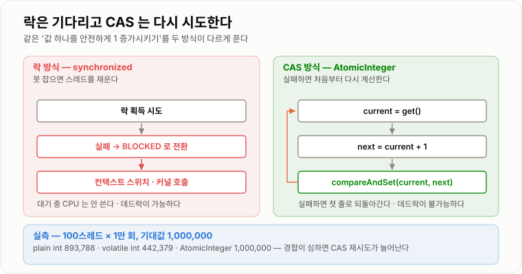
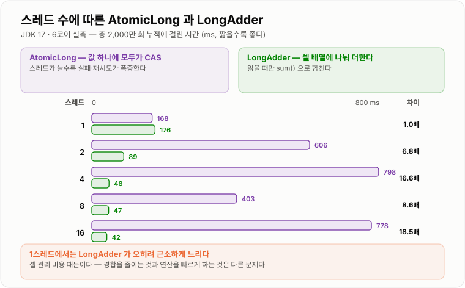
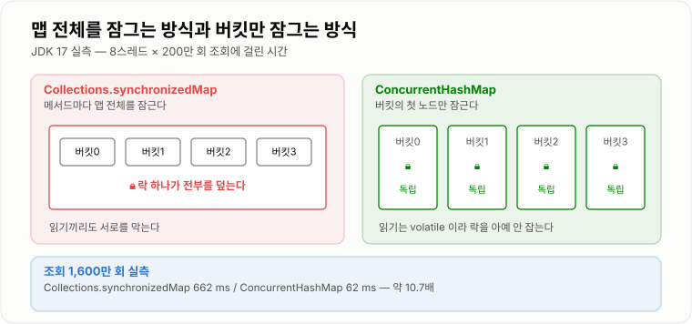

# Atomic과 Concurrent Collection

> **락은 "기다리게 해서" 안전을 만들고 CAS는 "실패하면 다시 해서" 안전을 만든다. 자료구조를 바꾸면 락 없이도 안전해지지만, `ConcurrentHashMap`을 써도 `get` 후 `put`은 여전히 깨진다.**

---

## 1. 핵심 요약

**`Atomic`은 기다리는 대신 다시 시도해서 락을 없애고 `Concurrent` 컬렉션은 락 범위를 버킷까지 좁히지만, `map.get(k)` 후 `map.put(k, v+1)`처럼 두 번 호출하는 순간 그 사이는 어떤 자료구조도 지켜 주지 않는다.**

### 한눈에 보기

* `Atomic` 클래스는 락이 아니라 **CAS(compare-and-swap)** 로 동작한다. 실패하면 대기하지 않고 **다시 시도**한다.
* `ConcurrentHashMap`을 써도 **복합 연산은 원자적이지 않다.** `get` 후 `put`으로 10만 번 세었더니 46,585만 남았다. `merge`나 `computeIfAbsent`를 써야 100,000이 나온다.
* `AtomicLong`은 경합이 심해지면 급격히 느려진다. 총 2,000만 회 기준 1스레드에서는 `LongAdder`와 같지만(168ms 대 176ms), **16스레드에서는 778ms 대 42ms로 18.5배** 차이가 난다.
* 읽기 위주 부하에서 `Collections.synchronizedMap`은 662ms, `ConcurrentHashMap`은 62ms로 **약 10.7배** 차이가 난다.
* `ConcurrentHashMap`은 **`null` 키와 `null` 값을 모두 거부한다** (`NullPointerException`). `HashMap`은 둘 다 허용한다.
* `CopyOnWriteArrayList`는 쓰기가 `O(n)`이라 5만 건 추가에 **1,087ms**가 걸렸다. 같은 작업을 `synchronizedList`는 1ms에 끝낸다. 대신 읽기는 33ms 대 173ms로 **5.2배 빠르다.**
* `AtomicReference`는 **ABA 문제를 잡지 못한다.** A→B→A 후에도 `compareAndSet("A","C")`가 `true`를 반환했다. `AtomicStampedReference`는 같은 상황에서 `false`를 반환했다.
* JDK 17 실측 `ConcurrentHashMap` 상수: `DEFAULT_CAPACITY=16`, `LOAD_FACTOR=0.75`, `TREEIFY_THRESHOLD=8`, `MIN_TREEIFY_CAPACITY=64`.

### 무엇을 해결하는가

#### 해결하려는 문제

앞 노트에서 `synchronized`가 세 가지 동시성 문제를 모두 해결한다는 것을 봤다. 그런데 비용이 있었다.

```text
단일 스레드 1억 회 증가 (실측)
  plain long ++   =    11 ms
  synchronized    = 1,794 ms      163배
```

락의 진짜 비용은 **경합할 때 스레드를 재우고 깨우는 데** 있다.

```text
락을 못 잡으면
  1. 스레드를 BLOCKED 로 전환          (커널 호출)
  2. 다른 스레드로 컨텍스트 스위치      (레지스터·캐시 교체)
  3. 락이 풀리면 다시 깨운다            (커널 호출)
  4. 캐시가 식어 있어 다시 채운다
```

카운터를 1 증가시키는 데 이 절차를 다 밟는 것은 과하다. **"기다리는" 대신 "실패하면 다시 하는" 방식**이 여기서 나왔다.

컬렉션 쪽 문제도 비슷하다. 예전에는 이런 선택지밖에 없었다.

```java
Map<String, Integer> map = Collections.synchronizedMap(new HashMap<String, Integer>());
```

이 래퍼는 **모든 메서드를 하나의 락으로 감싼다.** 읽기끼리도 서로를 막는다. 실측으로 확인했다.

```text
8스레드 x 200만 회 get (원소 1만 개)
  Collections.synchronizedMap  =  662 ms
  ConcurrentHashMap            =   62 ms      10.7배
```

**읽기만 하는데도 8배 넘게 손해**를 보는 구조다. 자료구조 자체를 동시성에 맞게 다시 설계할 이유가 충분했다.

#### 이 개념이 없을 때

동시성 컬렉션이 없다면 직접 락을 걸어야 한다.

```java
public class SafeCounterMap {

    private final Map<String, Integer> map = new HashMap<String, Integer>();

    public synchronized void increment(String key) {
        Integer v = map.get(key);
        map.put(key, v == null ? 1 : v + 1);
    }

    public synchronized Integer get(String key) {
        return map.get(key);
    }

    public synchronized int size() {
        return map.size();
    }
}
```

문제가 여럿이다.

* **읽기끼리도 막힌다.** `get`이 `get`을 기다린다.
* **락을 하나 빠뜨리면 조용히 깨진다.** 새 메서드를 추가할 때마다 기억해야 한다.
* **락 범위가 맵 전체다.** 다른 키를 만지는 스레드끼리도 부딪힌다.
* **복합 연산을 밖에서 조합하면 다시 깨진다.** `if (map.containsKey(k)) map.get(k)`처럼 두 번 호출하는 순간 그 사이가 벌어진다.

`HashMap`을 그냥 쓰면 어떻게 되는지도 확인했다. 10스레드가 각 1만 건씩, 서로 다른 키를 넣었다.

```text
기대 크기 100,000

  HashMap             =  85,970      약 14% 유실
  ConcurrentHashMap   = 100,000
  synchronizedMap     = 100,000
```

**서로 다른 키를 넣는데도 1만 4천 건이 사라졌다.** 리사이즈 도중 다른 스레드가 끼어들어 버킷 배열이 통째로 교체되기 때문이다. 예외도 경고도 없다.

---

## 2. 동작 원리

### 핵심 구성 요소

| 개념 | 설명 | 중요한 이유 |
| --- | --- | --- |
| **CAS (compare-and-swap)** | "값이 아직 X면 Y로 바꿔라"를 CPU 명령 하나로 처리 | 락 없이 원자성을 얻는 기반이다. |
| **락 프리 (lock-free)** | 락 없이도 전체 진행이 보장되는 성질 | 한 스레드가 멈춰도 나머지가 막히지 않는다. |
| **스핀 (spin)** | 실패하면 대기하지 않고 즉시 재시도 | 경합이 짧으면 유리하고 길면 CPU를 낭비한다. |
| **ABA 문제** | A→B→A로 돌아오면 CAS가 변경을 눈치채지 못하는 것 | 값만 보고는 "안 바뀜"과 "바뀌었다 돌아옴"을 구분 못 한다. |
| **`AtomicInteger`·`AtomicLong`** | CAS 기반 원자적 정수 | 카운터·시퀀스의 표준 도구다. |
| **`LongAdder`** | 여러 셀에 나눠 더하고 읽을 때 합치는 카운터 | 경합이 심할 때 `AtomicLong`보다 훨씬 빠르다. |
| **`AtomicReference`** | 참조를 원자적으로 교체 | 불변 객체를 통째로 갈아 끼우는 데 쓴다. |
| **`AtomicStampedReference`** | 값 + 버전(stamp)을 함께 CAS | ABA를 막는 표준 해법이다. |
| **`ConcurrentHashMap`** | 버킷 단위로만 잠그는 해시맵 | 읽기는 사실상 락이 없다. |
| **`CopyOnWriteArrayList`** | 쓸 때마다 배열 전체를 복사 | 읽기가 압도적으로 많을 때만 쓴다. |
| **`BlockingQueue`** | 비어 있으면 대기, 가득 차면 대기하는 큐 | 생산자-소비자의 표준이다. |
| **약한 일관성 (weakly consistent)** | 순회 중 수정을 허용하되 시점 보장은 없는 성질 | `ConcurrentModificationException`이 안 나는 이유다. |
| **스냅샷 순회** | 순회 시작 시점의 복사본을 보는 것 | `CopyOnWriteArrayList`의 방식이다. |
| **복합 연산** | 여러 호출을 조합한 연산 | **각각이 원자적이어도 전체는 원자적이지 않다.** |

#### 개념 간 관계

```text
동시성을 얻는 세 가지 층

  1. 락으로 막는다          synchronized, ReentrantLock
       → 기다리게 한다. 데드락 가능. 경합 시 컨텍스트 스위치 비용

  2. CAS 로 재시도한다      AtomicInteger, LongAdder
       → 기다리지 않는다. 데드락 불가. 경합 시 재시도 비용

  3. 자료구조를 바꾼다      ConcurrentHashMap, CopyOnWriteArrayList
       → 애초에 부딪히는 지점을 줄인다. 내부적으로 1·2를 함께 쓴다

그러나 어느 층도 해결하지 못하는 것이 있다

  복합 연산    map.get(k) 후 map.put(k, v+1)
             → 각 호출은 원자적인데 사이가 벌어진다 (실측 46,585 / 100,000)
```

**세 번째 줄이 이 노트의 핵심이다.** 동시성 컬렉션을 쓴다고 코드가 자동으로 안전해지지 않는다.

### 내부 동작 과정

#### CAS — 락을 쓰지 않는 원자성

CAS는 CPU가 제공하는 명령 하나다. 개념적으로 이렇게 동작한다.

```text
compareAndSet(expected, newValue)

  현재값이 expected 와 같으면  →  newValue 로 바꾸고 true 반환
  다르면                      →  아무것도 안 하고 false 반환

  이 전체가 CPU 명령 하나로 처리되어 중간에 끼어들 수 없다
```

`AtomicInteger.incrementAndGet()`은 이것을 루프로 감싼 것이다.

```java
public final int incrementAndGet() {
    int current;
    int next;
    do {
        current = get();            // 1. 현재값을 읽는다
        next = current + 1;         // 2. 새 값을 계산한다
        // 3. 아직 current 면 next 로 바꾼다. 아니면 처음부터 다시
    } while (!compareAndSet(current, next));
    return next;
}
```



*락은 실패하면 스레드를 재우지만 CAS는 실패하면 즉시 다시 시도한다 — 그래서 데드락이 없는 대신 경합이 심하면 재시도가 늘어난다.*

**핵심은 3번이 원자적이라는 것이다.** 다른 스레드가 값을 바꿨다면 `current`와 달라져 CAS가 실패하고, 루프가 처음부터 다시 돈다. 잘못된 값이 저장되는 일이 없다.

앞 노트에서 깨졌던 카운터를 `AtomicInteger`로 바꿔 확인했다.

```text
100스레드 x 1만 회, 기대값 1,000,000

  plain int        =   893,788
  volatile int     =   442,379
  AtomicInteger    = 1,000,000      정확
```

#### CAS의 대가 — 경합이 심하면 재시도가 늘어난다

CAS가 항상 빠른 것은 아니다. 스레드가 많아질수록 **실패해서 다시 도는 횟수**가 늘어난다.

```text
스레드 8개가 동시에 incrementAndGet() 을 부르면
  1개만 성공하고 7개가 실패한다
  7개가 다시 시도하면 1개 성공, 6개 실패
  ...
```

이것이 다음에 볼 `LongAdder`가 등장한 이유다.

#### `LongAdder` — 경합 자체를 나눈다

`AtomicLong`은 값 하나를 여러 스레드가 두들긴다. `LongAdder`는 **셀 배열을 두고 스레드마다 다른 셀에 더한 뒤**, 읽을 때만 전부 합친다.

```text
AtomicLong                        LongAdder

  [ value ]                        [ base ][ cell0 ][ cell1 ][ cell2 ] ...
     ↑↑↑↑                             ↑        ↑        ↑        ↑
  모든 스레드가 여기로              스레드마다 흩어진다

  increment  →  CAS 경합           increment  →  자기 셀에만 CAS
  get        →  즉시               sum()      →  전부 더한다 (O(셀 수))
```

총 2,000만 회 누적을 스레드 수를 바꿔 가며 측정했다.

| 스레드 | `AtomicLong` | `LongAdder` | 배수 |
| --- | --- | --- | --- |
| 1 | 168 ms | 176 ms | 1.0배 |
| 2 | 606 ms | 89 ms | 6.8배 |
| 4 | 798 ms | 48 ms | 16.6배 |
| 8 | 403 ms | 47 ms | 8.6배 |
| 16 | 778 ms | 42 ms | **18.5배** |



*단일 스레드에서는 차이가 없고, 스레드가 늘수록 `AtomicLong`만 느려진다 — 경합을 줄이는 것과 연산을 빠르게 하는 것은 다른 문제다.*

읽을 것이 두 가지다.

* **1스레드에서는 `LongAdder`가 오히려 근소하게 느리다** (176ms 대 168ms). 셀 관리 비용이 있기 때문이다.
* `LongAdder`는 스레드가 늘어도 **거의 일정하다** (89 → 48 → 47 → 42ms). 경합이 셀로 분산되기 때문이다.

정확성도 확인했다. 100스레드 x 1만 회에서 `LongAdder.sum()`은 정확히 1,000,000이었다.

**`LongAdder`의 한계**는 `sum()`이 정확한 스냅샷이 아니라는 것이다. 합치는 도중 다른 셀이 바뀔 수 있다. 그래서 **누적만 하고 가끔 읽는 통계용**에 맞고, 읽은 값으로 분기하는 로직에는 부적합하다.

#### ABA 문제

CAS는 **값만 본다.** 그래서 A였다가 B가 됐다가 다시 A로 돌아온 것을 "안 바뀜"으로 판단한다.

```text
스레드 1                        스레드 2
  A 를 읽는다
                                A → B 로 바꾼다
                                B → A 로 바꾼다   (값은 A 로 돌아왔지만 상태는 다르다)
  CAS(A, C) 실행  →  성공        ← 그 사이의 변경을 전혀 모른다
```

실제로 확인했다.

```text
AtomicReference          A → B → A 후 compareAndSet("A","C")  =  true    ← 못 잡는다
AtomicStampedReference   같은 절차 후 stamp = 2
                         compareAndSet("A","C", 0, 1)          =  false   ← 잡는다
```

`AtomicStampedReference`는 값과 함께 **stamp(버전 번호)** 를 CAS한다. 값이 A로 돌아와도 stamp가 0에서 2로 올라가 있으므로 옛 stamp를 기대한 CAS가 실패한다.

**단순 카운터에서는 ABA가 문제되지 않는다.** 정수가 같은 값으로 돌아오는 것과 안 바뀐 것이 실질적으로 같기 때문이다. 문제가 되는 것은 **참조를 CAS할 때**다. 락 프리 스택에서 노드가 제거됐다 재사용되면 잘못된 노드를 가리키게 된다.

#### `ConcurrentHashMap` — 락 범위를 버킷으로 좁힌다

```text
Collections.synchronizedMap            ConcurrentHashMap

  ┌───── 락 1개 ─────┐                  버킷0  버킷1  버킷2  버킷3 ...
  │ 버킷0 버킷1 버킷2 │                    ↑      ↑      ↑      ↑
  │ 버킷3 버킷4 ...   │                   락     락     락     락
  └──────────────────┘                  (첫 노드를 synchronized)

  get 도 put 도 전부 이 락           읽기는 락 없이 (volatile 읽기)
                                     쓰기는 해당 버킷의 첫 노드만 잠근다
```



*읽기가 락을 잡지 않기 때문에 조회 위주 부하에서 격차가 벌어진다 — 실측 662ms 대 62ms.*

Java 7까지는 **세그먼트(Segment)** 라는 고정 개수의 하위 맵으로 나누고 각각에 `ReentrantLock`을 뒀다. 기본 16개라 동시성이 16으로 제한됐다.

**Java 8부터 세그먼트가 사라졌다.** 버킷(배열 칸)마다 첫 노드를 `synchronized`로 잠그는 방식으로 바뀌어, 이론상 동시성이 버킷 개수만큼 올라갔다.

```text
JDK 17 실측 내부 상수

  DEFAULT_CAPACITY          =  16
  LOAD_FACTOR               =  0.75
  TREEIFY_THRESHOLD         =  8
  UNTREEIFY_THRESHOLD       =  6
  MIN_TREEIFY_CAPACITY      =  64
  MIN_TRANSFER_STRIDE       =  16
  MAXIMUM_CAPACITY          =  1073741824   (2^30)
  DEFAULT_CONCURRENCY_LEVEL =  16           (하위 호환용. 실제로는 안 쓰인다)
```

`DEFAULT_CONCURRENCY_LEVEL`이 남아 있는 것은 **생성자 인자를 받아 주기 위한 잔재**다. Java 8부터 이 값으로 세그먼트를 나누지 않는다. 생성자에 넘겨도 초기 용량 힌트로만 쓰인다.

`MIN_TRANSFER_STRIDE=16`은 리사이즈를 **여러 스레드가 나눠서** 한다는 뜻이다. 한 스레드가 최소 16개 버킷씩 맡아 옮긴다. `put` 도중 리사이즈를 만난 스레드는 기다리는 대신 이 작업을 거든다.

#### `ConcurrentHashMap`이 `null`을 거부하는 이유

```text
HashMap            null 키 OK, null 값 OK
ConcurrentHashMap  null 키 → NullPointerException
                   null 값 → NullPointerException
synchronizedMap    둘 다 OK (내부 HashMap 에 위임)
```

이유는 **모호함** 때문이다.

```java
Integer v = map.get(key);
if (v == null) {
    // 키가 없는 것인가, 값이 null 인 것인가?
}
```

단일 스레드라면 `containsKey`로 구분하면 된다. 그런데 **동시 환경에서는 `get`과 `containsKey` 사이에 값이 바뀔 수 있어** 구분이 원리적으로 불가능하다. 그래서 아예 `null`을 금지했다.

#### 순회 중 수정 — 세 가지 방식

```text
HashMap             순회 중 put  →  ConcurrentModificationException
ArrayList           순회 중 add  →  ConcurrentModificationException
ConcurrentHashMap   순회 중 put  →  예외 없음, 새 항목이 보였다 (11개 순회)
CopyOnWriteArrayList 순회 중 add →  예외 없음, 스냅샷이라 안 보였다 (3개 순회, 최종 4개)
```

세 가지 정책이 다르다.

| 방식 | 정책 | 순회 중 수정 | 최신성 |
| --- | --- | --- | --- |
| `HashMap`·`ArrayList` | **fail-fast** | 즉시 예외 | — |
| `ConcurrentHashMap` | **약한 일관성** | 허용. 보일 수도 안 보일 수도 | 대체로 최신 |
| `CopyOnWriteArrayList` | **스냅샷** | 허용. 절대 안 보인다 | 순회 시작 시점 |

`CopyOnWriteArrayList`는 스냅샷이라 **반복자를 통한 수정도 막는다.**

```text
cow.iterator().remove()  →  UnsupportedOperationException
```

**`ConcurrentModificationException`은 동시성 예외가 아니다.** 단일 스레드에서 순회 중 컬렉션을 고쳐도 똑같이 난다. `modCount`라는 수정 횟수 필드를 반복자가 기억해 두고 매번 비교하는 방식이다. "동시 수정"이 아니라 "그냥 수정"을 감지한다.

#### `CopyOnWriteArrayList` — 쓸 때마다 통째로 복사

```java
public boolean add(E e) {
    synchronized (lock) {
        Object[] old = getArray();
        int len = old.length;
        Object[] newArray = Arrays.copyOf(old, len + 1);   // 전체 복사
        newArray[len] = e;
        setArray(newArray);                                // 참조 교체 (volatile)
        return true;
    }
}
```

읽기는 `getArray()`로 배열 참조를 한 번 읽는 것이 전부다. **락도 없고 `volatile` 읽기 하나뿐**이라 매우 빠르다.

대신 쓰기가 `O(n)`이다. 실측이 극단적이다.

```text
단일 스레드 add

  10,000건:  CopyOnWriteArrayList    63 ms  /  synchronizedList  1 ms
  50,000건:  CopyOnWriteArrayList 1,087 ms  /  synchronizedList  1 ms
```

**원소가 5배 늘었더니 시간이 17배 늘었다.** `n`번 추가하면 총 복사량이 `1+2+...+n`이라 `O(n²)`이 된다.

읽기는 정반대다.

```text
6스레드 x 100만 회 get (원소 1,000개)

  CopyOnWriteArrayList  =  33 ms
  synchronizedList      = 173 ms      5.2배
```

**용도가 명확히 갈린다.** 거의 안 바뀌고 계속 읽히는 것 — 설정값, 리스너 목록, 화이트리스트 — 에만 쓴다.

---

## 3. 특징과 비교

| 구분          | 내용                                       |
| ----------- | ---------------------------------------- |
| **장점**      | 락을 잡지 않아 데드락이 원리적으로 불가능하고 컨텍스트 스위치가 없다. 읽기에 락이 없어 조회 위주 부하에서 압도적이다. |
| **단점**      | **개별 연산이 원자적일 뿐, 직접 조합한 복합 연산은 그대로 깨진다.** 경합이 심하면 CAS 재시도가 폭증하고, ABA를 감지하지 못하며, `null`을 못 쓴다. |
| **적합한 상황**  | 단일 변수를 읽어 판단하면 `AtomicLong`, 누적만 하면 `LongAdder`, Map은 `ConcurrentHashMap`, 생산자-소비자는 `BlockingQueue`. |
| **주의할 상황**  | `if (map.get(k) == null) map.put(k, v)` 같은 확인 후 실행 — `computeIfAbsent`·`putIfAbsent`로 한 번에 처리한다. |

### 성능 특성

#### 누적 연산 — 스레드 수에 따른 역전

총 2,000만 회 기준이다.

| 스레드 | `AtomicLong` | `LongAdder` | 배수 |
| --- | --- | --- | --- |
| 1 | 168 ms | 176 ms | 1.0배 (`LongAdder`가 근소하게 느림) |
| 2 | 606 ms | 89 ms | 6.8배 |
| 4 | 798 ms | 48 ms | 16.6배 |
| 8 | 403 ms | 47 ms | 8.6배 |
| 16 | 778 ms | 42 ms | 18.5배 |

`AtomicLong`의 수치가 들쭉날쭉한 것(606 → 798 → 403 → 778)은 **CAS 재시도와 스케줄링이 겹쳐 측정 편차가 크기 때문**이다. 반면 `LongAdder`는 89 → 48 → 47 → 42로 안정적이다.

#### 맵 — 읽기 위주 부하

8스레드가 각 200만 번 `get` (원소 1만 개).

| 구현 | 시간 | 배수 |
| --- | --- | --- |
| `ConcurrentHashMap` | 62 ms | 1배 |
| `Collections.synchronizedMap` | 662 ms | **10.7배** |

`ConcurrentHashMap`의 `get`은 **락을 전혀 잡지 않는다.** 노드의 `val`과 `next`가 `volatile`이라 `volatile` 읽기만으로 안전하다.

#### 리스트 — 읽기와 쓰기가 정반대

| 작업 | `CopyOnWriteArrayList` | `synchronizedList` |
| --- | --- | --- |
| 10,000건 순차 add | 63 ms | 1 ms |
| 50,000건 순차 add | **1,087 ms** | 1 ms |
| 6스레드 x 100만 get | **33 ms** | 173 ms |

**쓰기는 1,000배 이상 느리고 읽기는 5배 이상 빠르다.** 중간이 없다.

#### 맵 초기 용량

100만 건 `put`.

```text
기본 생성자 (16에서 시작)   = 175 ms
초기 용량 1,400,000 지정    =  73 ms      2.4배
```

리사이즈가 몇 번 일어나는지 계산하면 이유가 보인다.

```text
16 → 32 → 64 → ... → 2,097,152

  임계값 = 용량 x 0.75 이므로 약 17회 리사이즈
  매번 전체 재배치 + 여러 스레드 동원
```

#### 자료구조별 특성 정리

| 자료구조 | 읽기 | 쓰기 | 순회 | 메모리 |
| --- | --- | --- | --- | --- |
| `ConcurrentHashMap` | 락 없음 | 버킷 단위 락 | 약한 일관성 | 보통 |
| `Collections.synchronizedMap` | 전체 락 | 전체 락 | 수동 동기화 필요 | 작다 |
| `CopyOnWriteArrayList` | 락 없음 | `O(n)` 전체 복사 | 스냅샷 | 쓸 때마다 2배 |
| `Collections.synchronizedList` | 전체 락 | 전체 락 | 수동 동기화 필요 | 작다 |
| `ConcurrentLinkedQueue` | 락 없음 (CAS) | 락 없음 (CAS) | 약한 일관성 | 노드당 오버헤드 |
| `ArrayBlockingQueue` | 락 | 락 | — | 고정 |
| `LinkedBlockingQueue` | 락 (넣기/꺼내기 분리) | 락 | — | 노드당 오버헤드 |

`LinkedBlockingQueue`가 `ArrayBlockingQueue`보다 처리량이 높은 이유는 **넣는 쪽 락과 꺼내는 쪽 락이 분리**되어 있기 때문이다. `ArrayBlockingQueue`는 락 하나를 공유한다.

### 장점과 단점

#### `Atomic` 클래스

| 장점 | 이유 |
| --- | --- |
| 데드락이 불가능하다 | 락을 잡지 않으므로 순환 대기가 생길 수 없다. |
| 컨텍스트 스위치가 없다 | 실패해도 스레드를 재우지 않는다. |
| 경합이 적으면 매우 빠르다 | CAS 명령 하나로 끝난다. |
| 단순한 상태 전이에 알맞다 | `compareAndSet`으로 "딱 한 번"을 보장한다. |

| 단점 | 이유 |
| --- | --- |
| 변수 하나만 보호한다 | 여러 필드를 함께 지켜야 하면 쓸 수 없다. |
| 경합이 심하면 재시도가 폭증한다 | 실측 16스레드에서 `LongAdder` 대비 18.5배 느렸다. |
| ABA를 감지하지 못한다 | 참조를 CAS할 때 문제가 된다. |
| 재시도 중 CPU를 계속 쓴다 | 락과 달리 대기 상태로 가지 않는다. |

#### `ConcurrentHashMap`

| 장점 | 이유 |
| --- | --- |
| 읽기에 락이 없다 | 실측 `synchronizedMap` 대비 10.7배. |
| 쓰기 락 범위가 버킷 하나다 | 다른 키를 만지는 스레드끼리 안 부딪힌다. |
| 순회 중 예외가 나지 않는다 | 약한 일관성 반복자. |
| 원자적 복합 연산을 제공한다 | `merge`·`compute`·`putIfAbsent`. |
| 리사이즈를 여러 스레드가 나눠 한다 | `MIN_TRANSFER_STRIDE=16`. |

| 단점 | 이유 |
| --- | --- |
| **복합 연산을 직접 조합하면 여전히 깨진다** | 실측 `get` 후 `put`이 100,000 중 46,585. |
| `null` 키와 값을 쓸 수 없다 | 모호함 때문에 금지됐다. |
| `size()`가 정확한 스냅샷이 아니다 | 세는 동안 바뀔 수 있다. |
| 순회 결과의 시점이 보장되지 않는다 | 새 항목이 보일 수도 안 보일 수도 있다. |
| 메모리를 더 쓴다 | 노드와 카운터 셀 구조가 있다. |

#### `CopyOnWriteArrayList`

| 장점 | 이유 |
| --- | --- |
| 읽기가 압도적으로 빠르다 | 실측 `synchronizedList` 대비 5.2배. |
| 순회 중 어떤 수정에도 안전하다 | 스냅샷을 본다. |
| 반복자가 예외를 던지지 않는다 | 배열이 불변이라 안전하다. |

| 단점 | 이유 |
| --- | --- |
| 쓰기가 `O(n)`이다 | 실측 5만 건 추가에 1,087ms. |
| 쓸 때마다 메모리가 2배로 튄다 | 새 배열을 만든 뒤 교체한다. |
| 순회가 최신 데이터를 못 본다 | 시작 시점 스냅샷이다. |
| 반복자로 수정할 수 없다 | `UnsupportedOperationException`. |

### 어떤 상황에서 고르는가

#### 무엇을 쓸지 정하는 순서

```text
보호할 대상이 단일 변수인가?
├─ 예 → 값을 읽어서 판단에 쓰는가?
│        ├─ 예 → AtomicInteger / AtomicLong
│        └─ 아니오 (누적만) → LongAdder
└─ 아니오 → 자료구조인가?
             ├─ Map  → ConcurrentHashMap
             ├─ Set  → ConcurrentHashMap.newKeySet()
             ├─ List → 읽기가 압도적인가?
             │          ├─ 예 → CopyOnWriteArrayList
             │          └─ 아니오 → Collections.synchronizedList
             └─ Queue → 생산자-소비자인가?
                        ├─ 예 → BlockingQueue
                        └─ 아니오 → ConcurrentLinkedQueue
```

#### 사용하기 좋은 상황

* **`AtomicInteger`** — ID 발급, 재고 카운트, 상태 전이 플래그. 값을 읽어 판단해야 할 때.
* **`LongAdder`** — 요청 수·에러 수 같은 통계. 쓰기가 잦고 읽기가 드물 때.
* **`AtomicReference`** — 불변 설정 객체를 통째로 교체할 때.
* **`AtomicStampedReference`** — 참조를 CAS하는데 ABA가 실제 위험일 때.
* **`ConcurrentHashMap`** — 로컬 캐시, 세션 저장소, 키별 카운터. 사실상 기본 선택지다.
* **`CopyOnWriteArrayList`** — 리스너 목록, 설정값 목록, 화이트리스트.
* **`BlockingQueue`** — 작업 큐, 이벤트 파이프라인.
* **`Semaphore`** — 외부 API 동시 호출 수 제한.

#### 사용하지 않는 것이 좋은 상황

* **`ConcurrentHashMap`에 `get` 후 `put`** — 실측 절반 이상 유실. `merge`·`compute`를 쓴다.
* **`CopyOnWriteArrayList`에 대량 삽입** — 5만 건에 1,087ms. `O(n²)`이다.
* **`LongAdder`의 `sum()`으로 조건 판단** — 정확한 스냅샷이 아니다.
* **`Collections.synchronizedXxx`를 새로 도입** — 동시성 컬렉션이 대부분 더 낫다.
* **`LinkedBlockingQueue`를 용량 없이 생성** — 무한 큐라 메모리가 터진다.
* **여러 필드를 `Atomic`으로 각각 감싸기** — 필드끼리의 일관성은 여전히 안 지켜진다.
* **`computeIfAbsent` 람다 안에서 같은 맵 수정** — 교착이나 예외가 난다.

#### 선택 기준

1. **보호할 것이 변수 하나인가, 여러 개인가?** — 여러 개면 Atomic으로 안 된다
2. **읽기와 쓰기 비율은?** — 읽기가 압도적이면 `CopyOnWriteArrayList`
3. **경합이 얼마나 심한가?** — 스레드가 많으면 `LongAdder`
4. **값을 읽어서 판단에 쓰는가?** — 그렇다면 `AtomicLong`
5. **복합 연산이 필요한가?** — `merge`·`compute`로 표현 가능한가 확인한다
6. **크기를 미리 아는가?** — 알면 초기 용량을 준다 (실측 2.4배)

### 비슷한 기술과 비교

#### 락과 CAS

| 비교 항목 | 락 (`synchronized`) | CAS (`Atomic`) |
| --- | --- | --- |
| 실패했을 때 | 스레드를 재운다 (`BLOCKED`) | 즉시 재시도 |
| 데드락 | 가능 | 불가능 |
| 컨텍스트 스위치 | 있다 | 없다 |
| 경합이 적을 때 | 상대적으로 느리다 | 빠르다 |
| 경합이 심할 때 | 대기하므로 CPU는 안 쓴다 | 재시도로 CPU를 쓴다 |
| 보호 범위 | 코드 블록 (여러 변수) | 변수 하나 |
| ABA | 해당 없음 | 문제가 된다 |

#### `AtomicLong`과 `LongAdder`

| 비교 항목 | `AtomicLong` | `LongAdder` |
| --- | --- | --- |
| 내부 구조 | 값 하나 | base + 셀 배열 |
| 증가 | 하나의 값에 CAS | 자기 셀에 CAS |
| 읽기 | `get()` 즉시 정확 | `sum()`이 전부 순회 |
| 1스레드 (실측) | 168 ms | 176 ms |
| 16스레드 (실측) | 778 ms | **42 ms** |
| 메모리 | 작다 | 셀 배열만큼 크다 |
| `compareAndSet` | 지원 | **없다** |
| 선택 기준 | 값을 읽어 판단 | 누적만 하고 가끔 읽기 |

#### `ConcurrentHashMap`과 `Collections.synchronizedMap`

| 비교 항목 | `ConcurrentHashMap` | `synchronizedMap` |
| --- | --- | --- |
| 락 범위 | 버킷 하나 | 맵 전체 |
| 읽기 시 락 | 없다 | 있다 |
| 읽기 성능 (실측) | 62 ms | 662 ms |
| `null` 키/값 | **금지** | 허용 |
| 순회 | 약한 일관성, 예외 없음 | **직접 동기화해야 한다** |
| 복합 연산 | `merge`·`compute` 제공 | 없다 (밖에서 `synchronized`) |
| 도입 시기 | Java 5 (Java 8에서 재작성) | Java 2 |

`synchronizedMap`의 순회는 특히 위험하다.

```java
Map<String, String> m = Collections.synchronizedMap(new HashMap<String, String>());

// 이 순회는 안전하지 않다
for (String k : m.keySet()) { }        // ConcurrentModificationException 가능

// 직접 감싸야 한다
synchronized (m) {
    for (String k : m.keySet()) { }
}
```

**각 메서드는 동기화되지만 순회는 여러 번의 호출**이라 보호되지 않는다. 앞서 본 복합 연산 문제와 같은 구조다.

#### `CopyOnWriteArrayList`와 `Collections.synchronizedList`

| 비교 항목 | `CopyOnWriteArrayList` | `synchronizedList` |
| --- | --- | --- |
| 읽기 시 락 | 없다 | 있다 |
| 읽기 (실측 600만 회) | 33 ms | 173 ms |
| 쓰기 (실측 5만 건) | **1,087 ms** | 1 ms |
| 쓰기 복잡도 | `O(n)` | `O(1)` 상각 |
| 순회 | 스냅샷, 예외 없음 | 직접 동기화 필요 |
| 반복자 수정 | 불가 (`UnsupportedOperationException`) | 가능 |
| 선택 기준 | 읽기 >> 쓰기 | 쓰기가 있을 때 |

#### 큐 구현체

| 비교 항목 | `ArrayBlockingQueue` | `LinkedBlockingQueue` | `SynchronousQueue` | `ConcurrentLinkedQueue` |
| --- | --- | --- | --- | --- |
| 저장 구조 | 고정 배열 | 연결 리스트 | **없다** | 연결 리스트 |
| 용량 | 생성 시 고정 | 기본 무한 | 0 | 무한 |
| 블로킹 | 있다 | 있다 | 있다 | **없다** |
| 락 | 하나 공유 | 넣기/꺼내기 분리 | — | 락 없음 (CAS) |
| 공정성 옵션 | 있다 | 없다 | 있다 | — |
| 주 용도 | 크기 제한 작업 큐 | 처리량 우선 작업 큐 | 직접 전달 | 락 없는 큐 |

#### 순회 정책

| 비교 항목 | fail-fast | 약한 일관성 | 스냅샷 |
| --- | --- | --- | --- |
| 대표 | `HashMap`, `ArrayList` | `ConcurrentHashMap` | `CopyOnWriteArrayList` |
| 순회 중 수정 | `ConcurrentModificationException` | 허용 | 허용 |
| 새 항목이 보이나 | — | 보일 수도 있다 (실측 보였다) | **절대 안 보인다** |
| 메모리 | 없음 | 없음 | 배열 복사본 유지 |
| 반복자 `remove()` | 가능 | 가능 | **불가** |

---

## 4. 실무 주의사항

### 백엔드 실무 적용

#### 로컬 캐시

```java
@Component
public class ProductCache {

    private final ConcurrentHashMap<Long, Product> cache =
            new ConcurrentHashMap<Long, Product>();

    private final ProductRepository repository;

    public Product get(Long id) {
        // 없으면 로드해서 넣고, 있으면 그대로 반환한다 — 원자적이다
        return cache.computeIfAbsent(id, key -> repository.findById(key).orElseThrow());
    }
}
```

`computeIfAbsent`를 쓰면 **같은 키에 대해 로딩이 한 번만 일어난다.** 아래처럼 짜면 여러 스레드가 동시에 DB를 때린다.

```java
// 나쁘다 — 캐시 스탬피드가 그대로 일어난다
Product p = cache.get(id);
if (p == null) {
    p = repository.findById(id).orElseThrow();    // 100 스레드가 동시에 여기로
    cache.put(id, p);
}
```

다만 주의할 점이 있다. **`computeIfAbsent`는 버킷을 잠근 채 람다를 실행한다.** DB 조회처럼 오래 걸리는 작업을 넣으면 같은 버킷의 다른 키들이 그동안 막힌다. 실무에서는 Caffeine 같은 전용 캐시 라이브러리를 쓰는 편이 낫다.

#### 키별 카운터 — 조회수·호출 횟수

```java
@Component
public class ViewCounter {

    private final ConcurrentHashMap<Long, LongAdder> counts =
            new ConcurrentHashMap<Long, LongAdder>();

    public void increase(Long postId) {
        counts.computeIfAbsent(postId, k -> new LongAdder()).increment();
    }

    // 주기적으로 DB 에 반영하고 초기화한다
    @Scheduled(fixedDelay = 60_000)
    public void flush() {
        for (Map.Entry<Long, LongAdder> e : counts.entrySet()) {
            long delta = e.getValue().sumThenReset();
            if (delta > 0) {
                repository.addViewCount(e.getKey(), delta);
            }
        }
    }
}
```

**조회수마다 `UPDATE`를 날리면 DB가 먼저 죽는다.** 메모리에 모았다가 주기적으로 한 번에 반영하는 것이 표준이다. `sumThenReset()`이 이 용도로 만들어진 메서드다.

**서버가 여러 대라면 이 방식만으로는 부족하다.** 각 인스턴스가 따로 세므로 Redis `INCR`로 올리는 편이 정확하다. 인스턴스별 집계는 어디까지나 DB 부하를 줄이는 완충 장치다.

#### 중복 실행 방지

```java
@Component
public class PaymentProcessor {

    private final ConcurrentHashMap<String, Boolean> processing =
            new ConcurrentHashMap<String, Boolean>();

    public void process(String orderId) {
        // 이미 있으면 null 이 아닌 값이 반환된다 — 원자적이다
        if (processing.putIfAbsent(orderId, Boolean.TRUE) != null) {
            throw new DuplicateRequestException("이미 처리 중인 주문이다");
        }
        try {
            doProcess(orderId);
        } finally {
            processing.remove(orderId);       // 반드시 제거한다
        }
    }
}
```

**`finally`에서 제거하지 않으면 메모리 누수이자 영구 차단**이 된다. 예외로 빠져나가도 지워지도록 해야 한다.

이 방식은 **단일 인스턴스에서만 유효하다.** 여러 대라면 Redis 분산 락이나 DB 유니크 제약이 필요하다.

#### 애플리케이션 설정 갱신

```java
@Component
public class DynamicConfig {

    // 불변 객체를 통째로 교체한다
    private final AtomicReference<Settings> settings =
            new AtomicReference<Settings>(Settings.defaults());

    public Settings current() {
        return settings.get();        // 락 없이 읽는다
    }

    public void reload(Settings newSettings) {
        settings.set(newSettings);    // 참조 하나만 바꾼다 — 원자적이다
    }
}
```

**필드를 하나씩 바꾸면 중간 상태가 보인다.** 새 객체를 만들어 참조만 교체하면 읽는 쪽은 항상 일관된 스냅샷을 본다. 불변 객체와 `AtomicReference`의 조합이 이 패턴의 핵심이다.

#### 이벤트 리스너 목록

```java
@Component
public class EventPublisher {

    // 등록은 시작 시 몇 번, 발행은 매 요청마다 → CopyOnWriteArrayList 의 자리
    private final List<EventListener> listeners =
            new CopyOnWriteArrayList<EventListener>();

    public void register(EventListener listener) {
        listeners.add(listener);              // 드물다
    }

    public void publish(Event event) {
        for (EventListener l : listeners) {   // 잦다. 락이 없다
            l.onEvent(event);
        }
    }
}
```

순회 중에 리스너가 자기 자신을 제거해도 **`ConcurrentModificationException`이 나지 않는다.** 스냅샷을 보기 때문이다. Spring의 `ApplicationEventMulticaster`도 같은 자료구조를 쓴다.

#### 처리량 제한

```java
@Component
public class ExternalApiClient {

    // 스레드 풀 크기와 무관하게 동시 호출을 10개로 제한한다
    private final Semaphore limiter = new Semaphore(10);

    public Response call(Request request) throws InterruptedException {
        if (!limiter.tryAcquire(500, TimeUnit.MILLISECONDS)) {
            throw new TooManyRequestsException("외부 API 대기 한도 초과");
        }
        try {
            return restClient.send(request);
        } finally {
            limiter.release();
        }
    }
}
```

**외부 시스템을 보호하는 장치다.** 스레드 풀이 200개여도 이 API로는 10개만 나간다. 타임아웃을 걸면 대기가 무한정 쌓이는 것도 막는다.

#### 흔한 실수

```java
// 1. 여러 Atomic 을 조합해도 그들 사이는 원자적이지 않다
private final AtomicInteger total = new AtomicInteger();
private final AtomicInteger success = new AtomicInteger();

total.incrementAndGet();
success.incrementAndGet();       // 이 사이에 다른 스레드가 읽으면 불일치가 보인다

// 2. ConcurrentHashMap 의 값이 가변 객체면 그 내부는 안 지켜진다
ConcurrentHashMap<String, List<String>> map = new ConcurrentHashMap<>();
map.get("k").add("item");        // List 자체는 스레드 안전하지 않다

// 3. size() 로 조건 분기
if (queue.size() < 100) {
    queue.add(item);             // 확인과 추가 사이에 늘어날 수 있다
}
// → offer() 의 반환값을 보거나 용량 제한 큐를 쓴다
```

### 자주 하는 오해

| 잘못된 이해 | 올바른 이해 |
| --- | --- |
| `ConcurrentHashMap`을 쓰면 스레드 안전하다 | 각 메서드만 원자적이다. `get` 후 `put`은 실측 100,000 중 46,585만 남았다. |
| `ConcurrentHashMap`은 `HashMap`을 감싼 것이다 | 완전히 다른 구현이다. 버킷 단위 락과 `volatile` 노드를 쓴다. |
| `ConcurrentHashMap`도 `null`을 넣을 수 있다 | 키·값 모두 `NullPointerException`이다. |
| `synchronizedMap`도 순회는 안전하다 | 순회는 여러 호출이라 보호되지 않는다. 직접 `synchronized`로 감싸야 한다. |
| `ConcurrentModificationException`은 동시성 예외다 | 단일 스레드에서 순회 중 수정해도 난다. `modCount` 비교일 뿐이다. |
| `ConcurrentHashMap`은 순회 중 수정하면 예외가 난다 | 약한 일관성이라 예외가 없다. 실측에서 새 항목까지 보였다. |
| `CopyOnWriteArrayList` 순회는 최신 데이터를 본다 | 시작 시점 스냅샷이다. 실측에서 추가한 원소가 안 보였다. |
| `CopyOnWriteArrayList`는 동시성용이니 어디든 안전하게 쓰면 된다 | 5만 건 추가에 1,087ms. 쓰기가 `O(n)`이라 대량 삽입에 못 쓴다. |
| `LongAdder`가 `AtomicLong`보다 항상 빠르다 | 1스레드에서는 오히려 근소하게 느렸다(176ms 대 168ms). |
| `LongAdder`도 `compareAndSet`을 지원한다 | 없다. 누적 전용이다. |
| `LongAdder.sum()`은 정확한 값이다 | 합치는 도중 다른 셀이 바뀔 수 있다. 조건 판단에 쓰면 안 된다. |
| CAS는 락이 없으니 항상 빠르다 | 경합이 심하면 재시도가 폭증한다. 실측 16스레드에서 18.5배 느렸다. |
| `AtomicReference`가 있으면 ABA는 신경 안 써도 된다 | A→B→A 후 CAS가 `true`를 반환했다. `AtomicStampedReference`가 필요하다. |
| `AtomicInteger`를 두 개 쓰면 두 값이 함께 지켜진다 | 각각만 원자적이다. 둘 사이의 일관성은 없다. |
| `ConcurrentHashMap`의 값으로 `ArrayList`를 넣어도 안전하다 | 맵만 안전하다. 리스트 내부는 전혀 보호되지 않는다. |
| Java 8의 `ConcurrentHashMap`도 세그먼트를 쓴다 | Java 8에서 제거됐다. `DEFAULT_CONCURRENCY_LEVEL=16`은 하위 호환용 잔재다. |
| `ConcurrentHashMap`의 동시성은 16으로 제한된다 | Java 7까지의 이야기다. 지금은 버킷 단위다. |
| `LinkedBlockingQueue`는 기본적으로 크기 제한이 있다 | 인자 없이 만들면 `Integer.MAX_VALUE`다. 사실상 무한이다. |
| `SynchronousQueue`에 넣으면 저장된다 | 저장 공간이 0이다. 실측 `offer` = `false`, `size` = 0. |
| `size()`로 확인하고 추가하면 용량을 지킬 수 있다 | 확인과 추가 사이가 벌어진다. `offer()` 반환값을 봐야 한다. |
| `CountDownLatch`는 다시 쓸 수 있다 | 0이 되면 끝이다. `countDown`을 더 해도 음수가 안 된다. |
| 초기 용량은 성능에 큰 영향이 없다 | 100만 건 기준 175ms 대 73ms로 2.4배 차이가 났다. |

---

## 5. 예제

### `Atomic` 클래스의 기본 연산

```java
AtomicInteger counter = new AtomicInteger(0);

counter.incrementAndGet();          // ++i  → 증가 후 값
counter.getAndIncrement();          // i++  → 증가 전 값
counter.addAndGet(5);               // += 5 후 값
counter.getAndSet(100);             // 값을 바꾸고 이전 값 반환

// CAS 를 직접 쓴다
boolean ok = counter.compareAndSet(100, 200);   // 100 이면 200 으로

// 임의의 계산을 원자적으로 (내부적으로 CAS 루프)
counter.updateAndGet(v -> v > 50 ? v : v + 10);
counter.accumulateAndGet(7, (a, b) -> a * b);
```

`compareAndSet`을 직접 쓰는 전형적인 형태는 **상태 전이**다.

```java
public class Job {

    private final AtomicReference<Status> status =
            new AtomicReference<Status>(Status.READY);

    // 여러 스레드가 동시에 불러도 정확히 하나만 true 를 받는다
    public boolean start() {
        return status.compareAndSet(Status.READY, Status.RUNNING);
    }
}
```

**"딱 한 번만 실행"을 보장하는 표준 관용구다.** 락도 필요 없고, 성공한 스레드만 `true`를 받는다.

### `LongAdder` 사용

```java
public class RequestMetrics {

    private final LongAdder totalRequests = new LongAdder();
    private final LongAdder totalErrors = new LongAdder();

    public void recordRequest() {
        totalRequests.increment();       // 매우 잦다
    }

    public void recordError() {
        totalErrors.increment();
    }

    // 가끔 읽는다 (모니터링 등)
    public long getTotalRequests() {
        return totalRequests.sum();
    }
}
```

**쓰기가 잦고 읽기가 드문 통계**가 정확히 `LongAdder`의 자리다. 반대로 값을 자주 읽어 조건 판단에 쓴다면 `AtomicLong`이 맞다.

### `ConcurrentHashMap` — 복합 연산을 원자적으로

가장 중요한 부분이다. **동시성 컬렉션을 써도 여러 번 호출하면 깨진다.**

```java
// 틀렸다 — get 과 put 사이가 벌어진다
ConcurrentHashMap<String, Integer> map = new ConcurrentHashMap<String, Integer>();
map.put("k", 0);
map.put("k", map.get("k") + 1);
```

100스레드가 1,000번씩 이 코드를 실행했다.

```text
기대 100,000

  get 후 put                     =  46,585      절반 이상 유실
  merge("k", 1, Integer::sum)    = 100,000
  computeIfAbsent + AtomicInteger= 100,000
```

**절반 이상이 사라졌다.** `ConcurrentHashMap`의 `get`도 `put`도 각각은 원자적인데, **두 호출 사이는 아무도 지켜 주지 않는다.**

원자적 복합 연산 메서드를 써야 한다.

```java
// 1. merge — 없으면 초기값, 있으면 병합
map.merge("k", 1, Integer::sum);

// 2. compute — 현재값을 보고 새 값을 만든다
map.compute("k", (key, v) -> v == null ? 1 : v + 1);

// 3. computeIfAbsent — 없을 때만 만든다
Map<String, List<String>> groups = new ConcurrentHashMap<String, List<String>>();
groups.computeIfAbsent("A", k -> new CopyOnWriteArrayList<String>()).add("item");

// 4. putIfAbsent — 없을 때만 넣고, 기존 값을 반환
Integer prev = map.putIfAbsent("k", 1);

// 5. replace — 특정 값일 때만 교체 (CAS 와 같은 의미)
map.replace("k", 1, 2);
```

카운터가 매우 잦다면 값 자체를 `AtomicInteger`로 두는 것이 더 빠르다.

```java
ConcurrentHashMap<String, AtomicInteger> counters =
        new ConcurrentHashMap<String, AtomicInteger>();

counters.computeIfAbsent(key, k -> new AtomicInteger()).incrementAndGet();
```

`merge`는 매번 맵의 버킷을 잠그지만, 이 형태는 **`AtomicInteger`가 이미 있으면 맵을 잠그지 않는다.**

> **주의**: `computeIfAbsent`의 람다 안에서 **같은 맵을 다시 건드리면 안 된다.** 버킷을 잠근 상태에서 재진입하므로 교착이나 `IllegalStateException`이 날 수 있다.

### `ConcurrentHashMap`의 그 외 기능

```java
// Set 이 필요하면
Set<String> set = ConcurrentHashMap.newKeySet();
set.add("a");

// 크기 — mappingCount() 가 권장된다
int size = map.size();            // int. 21억을 넘으면 표현 못 한다
long count = map.mappingCount();  // long. 이쪽이 안전하다

// 초기 용량을 주면 리사이즈를 피할 수 있다
Map<Integer, Integer> big = new ConcurrentHashMap<Integer, Integer>(1_400_000);
```

초기 용량 지정 효과를 측정했다.

```text
100만 건 put

  기본 생성자        = 175 ms
  초기 용량 지정     =  73 ms      2.4배
```

**리사이즈는 동시 환경에서 특히 비싸다.** 여러 스레드가 옮기기 작업에 동원되고 그동안 쓰기가 느려진다. 크기를 알면 미리 주는 것이 좋다. `0.75` 로드 팩터를 감안해 **예상 크기 ÷ 0.75** 정도를 준다.

### `BlockingQueue` — 생산자와 소비자

```java
public class OrderPipeline {

    private final BlockingQueue<Order> queue = new ArrayBlockingQueue<Order>(1000);

    // 생산자
    public void submit(Order order) throws InterruptedException {
        queue.put(order);                  // 가득 차면 대기한다
    }

    public boolean submitOrDrop(Order order) {
        return queue.offer(order);         // 가득 차면 즉시 false
    }

    public boolean submitWithTimeout(Order order) throws InterruptedException {
        return queue.offer(order, 100, TimeUnit.MILLISECONDS);
    }

    // 소비자
    public void consume() throws InterruptedException {
        while (!Thread.currentThread().isInterrupted()) {
            Order order = queue.take();    // 비어 있으면 대기한다
            process(order);
        }
    }
}
```

메서드 이름에 규칙이 있다.

| 동작 | 예외 발생 | 특수값 반환 | 대기 | 시간 제한 대기 |
| --- | --- | --- | --- | --- |
| 넣기 | `add(e)` | `offer(e)` | `put(e)` | `offer(e, t, u)` |
| 꺼내기 | `remove()` | `poll()` | `take()` | `poll(t, u)` |
| 확인 | `element()` | `peek()` | — | — |

실측으로 확인한 큐 특성이다.

```text
ArrayBlockingQueue(10).remainingCapacity()  =  10           고정 용량
LinkedBlockingQueue().remainingCapacity()   =  2147483647   사실상 무한
SynchronousQueue.offer(1)  (소비자 없을 때) =  false, size = 0
```

**`SynchronousQueue`는 저장 공간이 아예 없다.** 넣는 쪽과 꺼내는 쪽이 만나야만 전달된다. 다음 노트에서 볼 `newCachedThreadPool`이 이 큐를 쓴다.

**`LinkedBlockingQueue`를 인자 없이 만들면 무한 큐**가 된다는 것은 반드시 기억해야 한다. 메모리가 터질 때까지 쌓인다.

### 동기화 보조 도구

```java
// CountDownLatch — N 개가 끝날 때까지 기다린다
CountDownLatch latch = new CountDownLatch(3);
for (int i = 0; i < 3; i++) {
    executor.execute(() -> {
        try {
            doWork();
        } finally {
            latch.countDown();          // finally 에서 반드시 감소시킨다
        }
    });
}
boolean done = latch.await(5, TimeUnit.SECONDS);

// Semaphore — 동시 접근 수를 제한한다
Semaphore semaphore = new Semaphore(10);       // 동시 10개까지
semaphore.acquire();
try {
    callExternalApi();
} finally {
    semaphore.release();
}
```

실측으로 확인한 특성이다.

```text
CountDownLatch(3)  3회 countDown 후 await = true, 남은 카운트 = 0
                   0 에서 countDown 을 더 해도 = 0      ← 음수가 되지 않는다
                   한 번 0이 되면 재사용 불가

Semaphore(2)       2회 acquire 후 tryAcquire = false, 가용 permit = 0
                   release 후 가용 permit = 1
```

**`CountDownLatch`는 일회용이다.** 반복해서 쓰려면 `CyclicBarrier`나 새 인스턴스가 필요하다.

`Semaphore`는 **외부 API 호출량 제한**에 특히 유용하다. 스레드 풀 크기와 무관하게 "동시에 10개까지만"을 강제할 수 있다.

---

## 6. 면접 정리

### 자주 나오는 질문

#### 기본 질문

1. **CAS가 무엇이고 어떻게 원자성을 보장하나요?**

    * 핵심 키워드: compare-and-swap, CPU 명령 하나, 기대값 비교 후 교체, 실패 시 재시도 루프

2. **`ConcurrentHashMap`은 어떻게 동시성을 확보하나요?**

    * 핵심 키워드: Java 8에서 세그먼트 제거, 버킷 첫 노드를 `synchronized`, 읽기는 `volatile`이라 락 없음

3. **`ConcurrentHashMap`과 `Collections.synchronizedMap`의 차이는 무엇인가요?**

    * 핵심 키워드: 락 범위(버킷 대 전체), 읽기 락 유무, 실측 62ms 대 662ms, `null` 허용 여부

4. **`AtomicLong`과 `LongAdder` 중 무엇을 써야 하나요?**

    * 핵심 키워드: 셀 분산, 경합 정도, 값을 읽어 판단하면 `AtomicLong`, 실측 16스레드 18.5배

5. **`CopyOnWriteArrayList`는 언제 쓰나요?**

    * 핵심 키워드: 읽기 >> 쓰기, 리스너 목록, 쓰기 `O(n)`, 스냅샷 순회

6. **`ConcurrentModificationException`은 왜 발생하나요?**

    * 핵심 키워드: `modCount` 비교, fail-fast, 단일 스레드에서도 발생, 동시성 예외가 아니다

7. **`BlockingQueue`의 메서드들은 어떻게 구분되나요?**

    * 핵심 키워드: `add`/`offer`/`put`/`offer(t,u)`, 예외·특수값·대기·시간제한

8. **`ConcurrentHashMap`이 `null`을 금지하는 이유는 무엇인가요?**

    * 핵심 키워드: "키 없음"과 "값이 null" 구분 불가, 동시 환경에서 `containsKey`로도 확인 불가

#### 꼬리 질문

1. **`ConcurrentHashMap`을 쓰면 이 코드는 안전한가요? `map.put(k, map.get(k) + 1)`**

    * 핵심 키워드: 복합 연산, 두 호출 사이가 벌어짐, 실측 100,000 중 46,585, `merge`로 해결

2. **CAS는 락이 없는데 왜 경합이 심하면 느려지나요?**

    * 핵심 키워드: 실패 시 처음부터 재시도, 스레드가 많을수록 실패율 증가, CPU를 계속 사용

3. **ABA 문제가 무엇이고 언제 실제 문제가 되나요?**

    * 핵심 키워드: 값만 비교, A→B→A 후 CAS `true`, 참조 CAS와 락 프리 스택, `AtomicStampedReference`

4. **`LongAdder`의 `sum()`을 조건 판단에 써도 되나요?**

    * 핵심 키워드: 합치는 도중 변경 가능, 정확한 스냅샷 아님, 누적 통계용

5. **`CopyOnWriteArrayList`에 5만 건을 넣으면 어떻게 되나요?**

    * 핵심 키워드: 매 add마다 전체 복사, `O(n²)`, 실측 1,087ms 대 1ms

6. **`ConcurrentHashMap`을 순회하는 도중 다른 스레드가 넣으면 어떻게 되나요?**

    * 핵심 키워드: 약한 일관성, 예외 없음, 보일 수도 안 보일 수도, 실측에서는 보였다

7. **`computeIfAbsent` 안에서 DB를 조회해도 되나요?**

    * 핵심 키워드: 버킷을 잠근 채 람다 실행, 같은 버킷의 다른 키가 막힘, 같은 맵 재진입은 금지

8. **`AtomicInteger` 두 개로 두 값을 관리하면 일관성이 보장되나요?**

    * 핵심 키워드: 각각만 원자적, 사이의 중간 상태가 보임, 묶으려면 락이나 불변 객체

9. **`Collections.synchronizedMap`을 순회할 때 주의할 점은 무엇인가요?**

    * 핵심 키워드: 각 메서드만 동기화, 순회는 여러 호출, 직접 `synchronized (map)`으로 감싸야 함

10. **`ConcurrentHashMap`의 초기 용량을 지정하면 얼마나 도움이 되나요?**

    * 핵심 키워드: 리사이즈 약 17회 제거, 실측 175ms → 73ms, 예상 크기 ÷ 0.75

11. **`LinkedBlockingQueue`를 그냥 만들면 무엇이 문제인가요?**

    * 핵심 키워드: 기본 `Integer.MAX_VALUE`, 사실상 무한, 소비가 느리면 OOM

12. **서버가 여러 대로 늘어나면 이 도구들이 그대로 동작하나요?**

    * 핵심 키워드: JVM 안에서만 유효, 인스턴스별 카운터 분리, Redis `INCR`·분산 락·DB 제약으로 이동

### 30초 답변

> 동시성을 확보하는 방법은 크게 **락으로 막는 것**과 **CAS로 재시도하는 것**이 있습니다. `Atomic` 클래스는 후자입니다. `compareAndSet(expected, new)`이라는 CPU 명령을 써서, 값이 아직 기대값이면 바꾸고 아니면 실패를 반환합니다. `incrementAndGet()`은 이것을 실패할 때까지 도는 루프로 감싼 것입니다. 락을 잡지 않으므로 **데드락이 원리적으로 불가능하고 컨텍스트 스위치도 없습니다.**

#### 이어서 더 물으면

다만 CAS도 만능은 아닙니다. 스레드가 많아지면 실패해서 다시 도는 횟수가 폭증합니다. 총 2,000만 회 누적을 측정했을 때 1스레드에서는 `AtomicLong` 168ms, `LongAdder` 176ms로 차이가 없었는데, **16스레드에서는 778ms 대 42ms로 18.5배**까지 벌어졌습니다. `LongAdder`는 값 하나를 두들기는 대신 셀 배열에 나눠 더하고 읽을 때만 합치기 때문입니다. 그래서 통계처럼 쓰기가 잦고 읽기가 드문 경우에 맞습니다.

컬렉션 쪽에서는 `ConcurrentHashMap`이 표준입니다. Java 7까지는 세그먼트 16개로 나눴는데, **Java 8에서 세그먼트가 제거되고 버킷마다 첫 노드를 잠그는 방식**으로 바뀌었습니다. 읽기는 노드가 `volatile`이라 락을 아예 잡지 않습니다. 8스레드가 200만 번씩 조회했을 때 `Collections.synchronizedMap`이 662ms, `ConcurrentHashMap`이 62ms로 약 10.7배 차이가 났습니다.

가장 중요한 것은 **`ConcurrentHashMap`을 써도 복합 연산은 여전히 깨진다는 점**입니다. `map.put(k, map.get(k) + 1)`을 100스레드가 1,000번씩 실행했더니 기대값 100,000에 대해 46,585만 남았습니다. 각 호출은 원자적인데 **두 호출 사이는 아무도 지켜 주지 않기 때문**입니다. `merge`나 `computeIfAbsent` 같은 원자적 복합 연산을 써야 정확히 100,000이 나옵니다.

#### 답변 구조

1. **정의** — `Atomic`은 CAS로 락 없이 원자성을 얻는 클래스, `Concurrent` 컬렉션은 락 범위를 좁히도록 자료구조 자체를 다시 설계한 것
2. **내부 원리** — CAS는 "값이 아직 X면 Y로"를 CPU 명령 하나로 처리하고, 실패하면 스레드를 재우지 않고 재시도한다. `LongAdder`는 셀 배열로 경합을 분산한다. `ConcurrentHashMap`은 Java 8에서 세그먼트를 버리고 버킷 첫 노드를 `synchronized`로 잠근다. 읽기는 `volatile` 노드 덕에 락이 없다
3. **복잡도**
    * 누적 2,000만 회: 1스레드 `AtomicLong` 168ms / `LongAdder` 176ms, 16스레드 778ms / 42ms (18.5배)
    * 맵 조회 1,600만 회: `synchronizedMap` 662ms / `ConcurrentHashMap` 62ms (10.7배)
    * `CopyOnWriteArrayList` 쓰기는 `O(n)` — 5만 건에 1,087ms, `synchronizedList`는 1ms
    * `CopyOnWriteArrayList` 읽기는 33ms 대 173ms로 5.2배 빠르다
    * 초기 용량 지정 시 100만 건 `put`이 175ms → 73ms
4. **장점** — 데드락이 불가능하고 컨텍스트 스위치가 없다. 읽기에 락이 없어 조회 위주 부하에서 압도적이다. 원자적 복합 연산 메서드를 제공한다
5. **단점** — **복합 연산을 직접 조합하면 여전히 깨진다**(실측 46,585). 경합이 심하면 CAS 재시도가 폭증한다. ABA를 감지 못 한다. `null`을 못 쓴다. `CopyOnWriteArrayList`는 쓰기가 `O(n)`이다
6. **사용 기준** — 단일 변수이고 값을 읽어 판단하면 `AtomicLong`, 누적만 하면 `LongAdder`. Map은 `ConcurrentHashMap`이 기본, List는 읽기가 압도적일 때만 `CopyOnWriteArrayList`, 생산자-소비자는 `BlockingQueue`
7. **대안과 비교** — `Collections.synchronizedXxx`는 락 범위가 전체라 읽기끼리도 막힌다. 여러 필드를 함께 지켜야 하면 Atomic으로는 불가능해 `synchronized`가 필요하다. 여러 인스턴스로 확장되면 JVM 안의 어떤 도구도 무의미해져 Redis나 DB 층으로 올라가야 한다
8. **실무 적용 사례** — 로컬 캐시는 `computeIfAbsent`로 중복 로딩을 막고, 조회수는 `ConcurrentHashMap<Long, LongAdder>`에 모았다가 `sumThenReset()`으로 주기 반영한다. 중복 결제 방지는 `putIfAbsent`의 반환값으로 판정하고 `finally`에서 제거한다. 설정은 불변 객체를 `AtomicReference`로 교체하고, 리스너 목록은 `CopyOnWriteArrayList`, 외부 API 동시 호출은 `Semaphore`로 제한한다

### 핵심 키워드

`CAS (compare-and-swap)` · `락 프리 (lock-free)` · `스핀 (spin)` · `ABA 문제` · `AtomicInteger·AtomicLong` · `LongAdder` · `AtomicReference` · `AtomicStampedReference` · `ConcurrentHashMap` · `CopyOnWriteArrayList` · `BlockingQueue` · `약한 일관성 (weakly consistent)`

### 이어서 볼 주제

#### 바로 이어서 공부

| 키워드 | 연결되는 이유 |
| --- | --- |
| **Thread와 동기화** | 락 기반 접근을 이해해야 CAS의 이점이 보인다. |
| **ThreadPool과 Deadlock** | `BlockingQueue`가 스레드 풀의 핵심 부품이다. |
| **Java Collection** | `HashMap`의 버킷·트리화를 알면 `ConcurrentHashMap`이 쉬워진다. |
| **불변 객체** | `AtomicReference`로 통째로 교체하는 패턴의 기반이다. |
| **`equals`·`hashCode`** | 해시가 나쁘면 버킷이 몰려 락 경합도 함께 늘어난다. |

#### 실무 확장

| 키워드 | 연결되는 이유 |
| --- | --- |
| **Caffeine 캐시** | `ConcurrentHashMap` 위에 만료·크기 제한·통계를 얹은 구현이다. |
| **Redis `INCR`과 분산 카운터** | 인스턴스가 여러 대일 때의 정답이다. |
| **분산 락 (Redisson)** | `putIfAbsent` 중복 방지를 클러스터로 확장한다. |
| **Micrometer 메트릭** | 내부적으로 `LongAdder`류 자료구조를 쓴다. |
| **낙관적 락 (`@Version`)** | CAS와 완전히 같은 아이디어를 DB에서 구현한 것이다. |

#### 심화 학습

| 키워드 | 연결되는 이유 |
| --- | --- |
| **`VarHandle`과 `Unsafe`** | JDK 9 이후 CAS의 실제 진입점이다. |
| **`Striped64`** | `LongAdder`의 부모 클래스. 셀 분산과 `@Contended` 패딩을 본다. |
| **락 프리 자료구조** | Michael-Scott 큐 등 CAS만으로 만드는 구조다. |
| **거짓 공유 (false sharing)** | 셀을 캐시 라인 단위로 띄우는 이유다. |
| **메모리 순서와 `acquire`/`release`** | `volatile`과 CAS가 하드웨어에서 무엇으로 번역되는지 본다. |

### 최종 체크리스트

* [ ] CAS의 동작과 재시도 루프를 설명할 수 있다
* [ ] CAS가 경합이 심할 때 느려지는 이유를 말할 수 있다
* [ ] `LongAdder`의 셀 분산 구조와 `AtomicLong`과의 차이를 안다
* [ ] `LongAdder`가 1스레드에서는 이점이 없다는 것을 안다
* [ ] ABA 문제를 설명하고 `AtomicStampedReference`의 역할을 말할 수 있다
* [ ] `ConcurrentHashMap`이 Java 8에서 어떻게 바뀌었는지 안다
* [ ] `ConcurrentHashMap`을 써도 복합 연산이 깨지는 이유를 설명할 수 있다
* [ ] `merge`·`compute`·`putIfAbsent`를 언제 쓰는지 안다
* [ ] `ConcurrentHashMap`이 `null`을 금지하는 이유를 말할 수 있다
* [ ] fail-fast·약한 일관성·스냅샷 세 가지 순회 정책을 구분할 수 있다
* [ ] `CopyOnWriteArrayList`의 쓰기 복잡도와 적합한 용도를 안다
* [ ] `BlockingQueue`의 네 가지 메서드 계열을 구분할 수 있다
