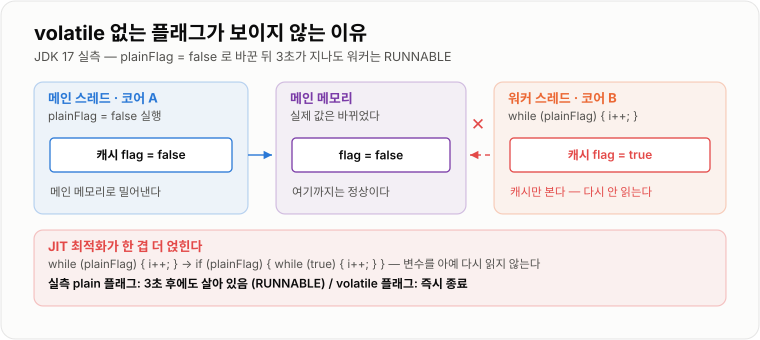
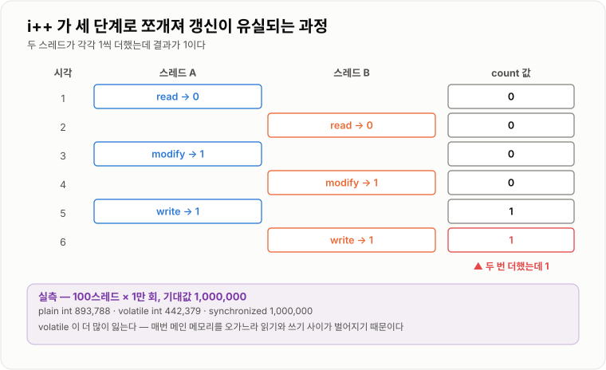
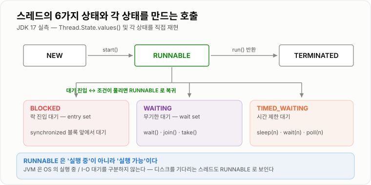
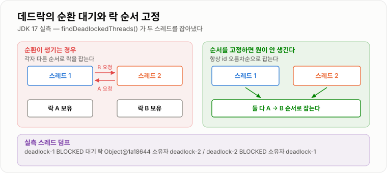

# Thread와 동기화

> **동시성 버그는 "동시에 실행돼서" 생기는 것이 아니라 `i++`가 세 단계로 쪼개지고(원자성), 스레드마다 다른 값을 보기 때문에(가시성) 생긴다. `synchronized`가 필요한 이유는 두 가지가 따로 있다.**

---

## 1. 핵심 요약

**`volatile`은 "최신값을 보게" 하고 `synchronized`는 "한 번에 하나만 들어가게" 하는 서로 다른 도구라서, `volatile int++`가 plain보다 더 많이 유실되는 실측 결과가 나오며, 애초에 공유 상태를 만들지 않는 설계가 어떤 동기화보다 싸다.**

### 한눈에 보기

* 동시성 문제는 **원자성·가시성·순서**의 세 축이다. `synchronized`는 셋을 한 번에 해결하고, `volatile`은 **가시성과 순서만** 해결한다.
* `volatile` 없는 플래그로 루프를 멈추려 하면 **영원히 멈추지 않는다.** 실측에서 `flag = false` 후 3초가 지나도 워커 스레드는 `RUNNABLE` 상태로 살아 있었다.
* `volatile`을 붙여도 `i++`는 여전히 깨진다. 100스레드가 1만 번씩 증가시켰을 때 기대값 1,000,000에 대해 **plain `int`가 893,788, `volatile int`가 442,379**로 오히려 `volatile` 쪽이 더 많이 유실됐다.
* 락 비용은 무경합일 때 크다. 단일 스레드 1억 회 증가가 plain 11ms인데 `synchronized`는 **1,794ms(163배)**다.
* **`-XX:UseBiasedLocking`은 JDK 15에서 폐기되어 JDK 17에서는 기본값이 `false`다.** "무경합 `synchronized`는 편향 락 덕분에 거의 공짜"라는 설명은 JDK 14까지의 이야기다.
* 공정 락(`new ReentrantLock(true)`)은 대가가 크다. 같은 6스레드 경합에서 **비공정 락 600만 회가 154ms인데 공정 락은 60만 회에 6,323ms**였다.
* 데드락은 실행 중에 `ThreadMXBean.findDeadlockedThreads()`로 **탐지만 가능하고 해제는 불가능하다.** 실측에서 두 스레드가 `BLOCKED`로 잡히고 서로를 락 소유자로 가리켰다.
* JDK 17에는 **가상 스레드가 없다.** `Thread.ofVirtual()`이 존재하지 않는다 (JDK 21 정식).

### 무엇을 해결하는가

#### 해결하려는 문제

CPU 코어가 하나뿐이던 시절에는 성능을 올리려면 클럭을 올리면 됐다. 발열 한계로 클럭 경쟁이 끝나자 **코어 수를 늘리는 방향**으로 바뀌었고, 이 실험 환경도 6코어다.

```text
코어 1개 시절          코어 6개 시대
  프로그램을 빨리 짜면    프로그램을 나눠 돌리지 않으면
  그대로 빨라졌다        코어 5개가 논다
```

그런데 여러 스레드가 **같은 데이터를 만지는 순간** 단일 스레드에서는 상상할 수 없던 일이 벌어진다.

```java
public class Counter {
    private int count = 0;

    public void increment() {
        count++;         // 한 줄인데 안전하지 않다
    }
}
```

이 한 줄은 기계어에서 세 단계다.

```text
1. count 를 읽는다        (read)
2. 1을 더한다             (modify)
3. count 에 쓴다          (write)
```

두 스레드가 1번과 2번 사이에 끼어들면 **둘이 같은 값을 읽고 같은 값을 쓴다.** 두 번 증가했는데 결과는 1이다.

#### 이 개념이 없을 때

동기화 장치가 없다면 개발자가 직접 순서를 만들어야 한다. 옛날에는 이런 코드를 짰다.

```java
public class BadLock {
    private boolean locked = false;

    public void enter() {
        while (locked) {          // 누가 쓰고 있으면 기다린다
            // 대기
        }
        locked = true;            // 내가 쓴다고 표시한다
    }

    public void exit() {
        locked = false;
    }
}
```

이 코드는 **두 가지 이유로 반드시 실패한다.**

* `while (locked)` 확인과 `locked = true` 대입 사이에 다른 스레드가 끼어들 수 있다. 둘 다 통과한다. (원자성)
* `locked = false`를 다른 스레드가 **영원히 못 볼 수 있다.** 각 코어가 자기 캐시의 값을 계속 쓰기 때문이다. (가시성)

두 번째가 특히 믿기 어려워서 직접 확인했다.

```java
static boolean plainFlag = true;

Thread w = new Thread(() -> {
    long i = 0;
    while (plainFlag) { i++; }        // volatile 이 없다
    System.out.println("종료");
});
w.start();
Thread.sleep(300);
plainFlag = false;                    // 메인 스레드가 false 로 바꾼다
w.join(3000);
```

```text
plainFlag = false 로 바꾸고 3초 뒤
  워커 스레드 살아있나?  true
  워커 스레드 상태       RUNNABLE      ← 무한 루프를 계속 돌고 있다

같은 코드에 volatile 만 붙이면
  워커 스레드 살아있나?  false         ← 즉시 종료
```

**`false`를 대입했는데 상대가 못 본다.** 이것이 동기화 장치가 필요한 첫 번째 이유이고, `synchronized`와 `volatile`이 언어 차원에서 제공되는 이유다.

---

## 2. 동작 원리

### 핵심 구성 요소

| 개념 | 설명 | 중요한 이유 |
| --- | --- | --- |
| **프로세스** | 실행 중인 프로그램. 독립된 메모리 공간을 갖는다 | 서로 침범할 수 없어 안전하지만 통신 비용이 크다. |
| **스레드** | 프로세스 안의 실행 흐름. 힙과 메서드 영역을 공유한다 | 공유하기 때문에 빠르지만, 그래서 동기화가 필요하다. |
| **경쟁 상태 (race condition)** | 실행 순서에 따라 결과가 달라지는 상태 | 테스트에서 안 나오고 운영에서만 터진다. |
| **원자성 (atomicity)** | 쪼개지지 않고 한 번에 실행되는 성질 | `i++`는 원자적이지 않다. 세 단계다. |
| **가시성 (visibility)** | 한 스레드의 변경을 다른 스레드가 보는 성질 | CPU 캐시 때문에 기본적으로 보장되지 않는다. |
| **순서 (ordering)** | 코드에 쓴 순서대로 실행되는 성질 | 컴파일러와 CPU가 재배치한다. |
| **임계 영역 (critical section)** | 한 번에 한 스레드만 들어가야 하는 코드 구간 | 여기를 최소화하는 것이 성능의 핵심이다. |
| **모니터 (monitor)** | 모든 Java 객체가 하나씩 갖는 잠금 장치 | `synchronized`가 잠그는 대상이다. |
| **재진입 (reentrant)** | 이미 잡은 락을 같은 스레드가 다시 잡을 수 있는 성질 | Java의 락은 전부 재진입 가능하다. |
| **happens-before** | "A가 B보다 먼저 일어났다"고 **보장되는** 관계 | JMM이 가시성을 정의하는 방식이다. |
| **데드락 (deadlock)** | 서로 상대의 락을 기다려 아무도 진행 못 하는 상태 | 스레드가 `BLOCKED`로 멈춘 채 CPU도 안 쓴다. |
| **라이브락 (livelock)** | 계속 양보하다 아무도 진행 못 하는 상태 | CPU는 쓰는데 일은 안 된다. |
| **기아 (starvation)** | 특정 스레드가 계속 자원을 못 얻는 상태 | 비공정 락에서 발생할 수 있다. |
| **컨텍스트 스위치** | CPU가 실행 중인 스레드를 바꾸는 것 | 락 경합의 실제 비용은 대부분 여기서 나온다. |

#### 개념 간 관계

```text
동시성 문제는 하나가 아니라 세 가지다

  원자성  →  "쪼개지지 않는가"        →  i++ 가 3단계로 나뉘는 문제
  가시성  →  "상대가 볼 수 있는가"     →  CPU 캐시에 갇히는 문제
  순서    →  "쓴 순서대로 도는가"      →  컴파일러·CPU 재배치 문제

해결 수단이 각각 커버하는 범위가 다르다

              원자성    가시성    순서
  volatile      ✗        ✓        ✓
  synchronized  ✓        ✓        ✓
  Atomic 클래스  ✓        ✓        ✓
  final          -        ✓        ✓   (생성 완료 후)
```

**`volatile`이 원자성을 못 준다는 것이 표의 핵심이다.** 이것 하나 때문에 수많은 코드가 조용히 틀린다.

### 내부 동작 과정

#### 왜 안 보이는가 — 캐시와 메인 메모리

각 CPU 코어는 자기 캐시를 갖는다. 스레드가 변수를 읽으면 **캐시에 복사본이 생기고**, 이후로는 캐시만 본다.



*메인 메모리에는 `false`가 쓰였는데 워커는 자기 캐시의 `true`를 계속 읽는다 — 실측에서 3초가 지나도 루프가 끝나지 않았다.*

여기에 최적화가 얹힌다. JIT 컴파일러는 `while (plainFlag)` 안에서 `plainFlag`를 아무도 안 바꾸는 것으로 보고 **루프 밖으로 끌어낸다.**

```text
원래 코드                       JIT 가 바꿀 수 있는 형태
  while (plainFlag) {             if (plainFlag) {
      i++;                            while (true) { i++; }
  }                               }
```

이렇게 되면 `plainFlag`를 **아예 다시 읽지 않는다.** 실측에서 나온 `RUNNABLE` 상태의 무한 루프가 바로 이 모습이다.

`volatile`은 이 두 가지를 막는다.

* 읽을 때 캐시가 아니라 **메인 메모리에서 읽는다.**
* 쓸 때 **즉시 메인 메모리에 반영한다.**
* 컴파일러가 이 변수에 대한 **재배치와 캐싱 최적화를 못 하게 한다.**

#### 왜 값이 사라지는가 — `i++`의 세 단계

```text
count = 0 인 상태에서 스레드 A 와 B 가 각각 count++ 를 실행한다

  시각   스레드 A              스레드 B             count
   1     read  → 0                                   0
   2                          read  → 0              0
   3     modify → 1                                  0
   4                          modify → 1             0
   5     write → 1                                   1
   6                          write → 1              1     ← 두 번 더했는데 1
```



*두 스레드가 같은 값을 읽으면 나중 쓰기가 앞 쓰기를 덮어쓴다 — 실측 100만 회 중 10만 회 이상이 이렇게 사라졌다.*

100스레드가 1만 번씩 증가시켜 확인한 결과다.

```text
기대값 1,000,000

  plain int         =   893,788      약 10.6% 유실
  volatile int      =   442,379      약 55.8% 유실
  synchronized      = 1,000,000      정확
```

**`volatile`이 plain보다 더 나쁘다.** 언뜻 이상하지만 이유는 명확하다.

* plain `int`는 각 스레드가 **자기 캐시 안에서** 빠르게 증가시킨다. 다른 스레드와 부딪히는 순간이 상대적으로 적다.
* `volatile int`는 매번 메인 메모리를 오가므로 **읽기와 쓰기 사이의 간격이 길어지고**, 그만큼 다른 스레드가 끼어들 창이 넓어진다.

즉 `volatile`은 "각 스레드가 항상 최신값을 읽게" 만들지만, **읽은 뒤 쓰기 전까지를 보호하지는 않는다.** 유실을 막는 것과는 아무 상관이 없다.

> 이 수치는 실행마다 달라진다. 여러 번 돌리면 plain은 80만~95만, `volatile`은 40만~70만 사이에서 움직인다. **일정하게 틀린다는 것이 아니라 매번 다르게 틀린다**는 점이 동시성 버그의 본질이다.

#### `synchronized`가 잠그는 것

`synchronized`는 코드가 아니라 **객체**를 잠근다. 어떤 객체를 잠그는지가 전부다.

```java
public class Sample {

    public synchronized void inst() { }        // this 를 잠근다

    public static synchronized void stat() { } // Sample.class 를 잠근다

    public void block() {
        synchronized (this) { }                // 위의 inst() 와 같다
    }

    private final Object lock = new Object();
    public void own() {
        synchronized (lock) { }                // 전용 락 객체
    }
}
```

**인스턴스 메서드와 static 메서드는 서로 다른 락이다.** 직접 확인했다.

```text
각각 500ms 걸리는 inst() 와 stat() 을 동시에 호출

  같은 락이라면    →  약 1,000ms (직렬화)
  다른 락이라면    →  약 500ms  (동시 실행)

실측 결과: 800ms 미만 → 동시에 진입했다
```

같은 클래스 안에 `synchronized`가 두 종류 있다고 서로를 막아 주지 않는다. **`static` 상태와 인스턴스 상태를 하나의 `synchronized`로 지킬 수 있다고 착각하면 그대로 버그다.**

#### 모니터의 내부 — 진입·대기·해제

```text
객체 하나마다 붙어 있는 것
  ┌────────────────────────────────┐
  │ 소유 스레드 (owner)             │  누가 락을 쥐고 있나
  │ 재진입 횟수 (recursions)        │  같은 스레드가 몇 겹으로 잡았나
  │ 진입 대기 큐 (entry set)        │  락을 기다리는 스레드들 → BLOCKED
  │ 조건 대기 큐 (wait set)         │  wait() 를 부른 스레드들 → WAITING
  └────────────────────────────────┘

락 획득          owner 가 없으면 자기로 설정. 있으면 entry set 에 들어가 BLOCKED
재진입          owner 가 자기 자신이면 recursions 만 +1
락 해제          recursions 를 -1. 0 이 되면 owner 해제 후 entry set 에서 깨움
wait()          락을 놓고 wait set 으로 이동 → WAITING
notify()        wait set 에서 하나를 entry set 으로 옮긴다 (락은 아직 없다)
```

**`wait()`는 락을 놓고 `sleep()`은 락을 쥔 채로 잔다.** 이 차이가 데드락을 만든다.

#### 스레드의 6가지 상태

`Thread.State` 열거값을 실행해 확인했다.

```text
[NEW, RUNNABLE, BLOCKED, WAITING, TIMED_WAITING, TERMINATED]
```



*어떤 대기냐에 따라 상태가 갈린다 — 락 대기는 `BLOCKED`, `wait()`는 `WAITING`, `sleep()`은 `TIMED_WAITING`이다.*

각 상태를 실제로 만들어 확인한 결과다.

| 만든 방법 | 관측된 상태 |
| --- | --- |
| `Thread` 객체 생성만 하고 `start()` 안 함 | `NEW` |
| 무한 루프 실행 중 | `RUNNABLE` |
| 다른 스레드가 쥔 `synchronized` 블록 앞에서 대기 | `BLOCKED` |
| `obj.wait()` 호출 | `WAITING` |
| `Thread.sleep(5000)` 호출 | `TIMED_WAITING` |
| 빈 `BlockingQueue.take()`에서 대기 | `WAITING` |
| 데드락에 빠진 두 스레드 | 둘 다 `BLOCKED` |

**`RUNNABLE`은 "실행 중"이 아니라 "실행 가능"이다.** JVM은 OS의 실행 중/대기 중을 구분하지 않고 둘 다 `RUNNABLE`로 본다. 그래서 디스크 I/O를 기다리는 스레드도 `RUNNABLE`로 보인다.

#### `volatile`이 실제로 하는 일 — 메모리 배리어

`volatile` 쓰기와 읽기 사이에는 **happens-before 관계**가 생긴다.

```java
class Config {
    private int timeout;                 // 평범한 필드
    private volatile boolean ready;      // volatile

    // 스레드 A
    void publish() {
        timeout = 3000;                  // (1)
        ready = true;                     // (2) volatile 쓰기
    }

    // 스레드 B
    void use() {
        if (ready) {                     // (3) volatile 읽기
            System.out.println(timeout); // (4) 반드시 3000 이 보인다
        }
    }
}
```

`ready`가 `volatile`이면 **(1)이 (2)보다 먼저 일어나도록 강제되고**, (3)이 `true`를 본 순간 (1)의 결과도 보장된다. `timeout`이 `volatile`이 아닌데도 그렇다.

**`volatile` 변수 하나가 그 앞의 모든 쓰기를 함께 밀어낸다.** 이 성질이 없으면 (1)과 (2)가 재배치되어 `ready`가 `true`인데 `timeout`이 0인 상태를 볼 수 있다.

#### happens-before를 만드는 것들

| 규칙 | 내용 |
| --- | --- |
| **프로그램 순서** | 한 스레드 안에서는 코드 순서대로 |
| **모니터 락** | `unlock`이 이후의 `lock`보다 먼저 |
| **`volatile`** | 쓰기가 이후의 읽기보다 먼저 |
| **스레드 시작** | `start()` 이전의 작업이 새 스레드 안의 작업보다 먼저 |
| **스레드 종료** | 스레드 안의 작업이 `join()` 반환보다 먼저 |
| **`final` 필드** | 생성자 완료가 참조 공개보다 먼저 |
| **전이성** | A→B 이고 B→C 면 A→C |

#### 데드락이 만들어지는 조건

```java
Thread d1 = new Thread(() -> {
    synchronized (A) {
        Thread.sleep(100);
        synchronized (B) { }      // B 를 기다린다
    }
});
Thread d2 = new Thread(() -> {
    synchronized (B) {
        Thread.sleep(100);
        synchronized (A) { }      // A 를 기다린다
    }
});
```

`ThreadMXBean`으로 실제로 탐지한 결과다.

```text
findDeadlockedThreads() = [316, 317]

  deadlock-1  state=BLOCKED  대기중인 락=java.lang.Object@1a18644   소유자=deadlock-2
  deadlock-2  state=BLOCKED  대기중인 락=java.lang.Object@1af2d44a  소유자=deadlock-1

d1.getState() = BLOCKED
d2.getState() = BLOCKED
```



*서로가 서로의 락 소유자를 가리키면 순환이 완성된다 — 두 스레드가 항상 같은 순서로 락을 잡으면 순환 자체가 생기지 않는다.*

데드락에는 **네 가지 조건이 동시에 성립**해야 한다.

| 조건 | 의미 | 깨는 방법 |
| --- | --- | --- |
| **상호 배제** | 한 번에 한 스레드만 자원을 쓴다 | 락 자체를 없앤다 (불변 객체, Atomic) |
| **점유와 대기** | 락을 쥔 채로 다른 락을 기다린다 | 필요한 락을 한 번에 다 잡거나, 쥔 채로 대기하지 않는다 |
| **비선점** | 남이 쥔 락을 뺏을 수 없다 | `tryLock(timeout)`으로 포기할 수 있게 만든다 |
| **순환 대기** | 대기 관계가 원을 이룬다 | **락 획득 순서를 전역으로 고정한다** |

**실무에서 가장 현실적인 것은 네 번째다.** 락에 순서를 정하고 항상 그 순서로만 잡으면 원이 생기지 않는다.

```java
public void transfer(Account from, Account to, long amount) {
    // 락을 항상 id 오름차순으로 잡는다
    Account first  = from.getId() < to.getId() ? from : to;
    Account second = from.getId() < to.getId() ? to : from;

    synchronized (first) {
        synchronized (second) {
            from.withdraw(amount);
            to.deposit(amount);
        }
    }
}
```

`transfer(a, b)`와 `transfer(b, a)`가 동시에 실행돼도 **둘 다 id가 작은 계좌를 먼저 잡으므로** 순환이 만들어지지 않는다.

#### JDK 15의 변화 — 편향 락 폐기

많은 자료가 "무경합 `synchronized`는 편향 락(biased locking) 덕분에 거의 비용이 없다"고 설명한다. **JDK 15부터 사실이 아니다.**

```text
$ java -XX:+UseBiasedLocking -version
  VM warning: Option UseBiasedLocking was deprecated in version 15.0
              and will likely be removed in a future release.

$ java -XX:+PrintFlagsFinal -version | grep UseBiasedLocking
  bool UseBiasedLocking = false   {product} {default}      ← JDK 17 기본값
```

폐기 이유는 유지 비용이다. 편향 락은 락을 처음 잡은 스레드에게 객체를 "편향"시켜 두고, 다른 스레드가 접근하면 **모든 스레드를 멈추는 safepoint 작업(revocation)** 으로 되돌린다. 최근 애플리케이션은 스레드 간 객체 공유가 잦아 이 되돌리기가 자주 일어나고, 그때의 비용이 이득을 넘어섰다.

단일 스레드 1억 회 증가 실측이 이 변화를 그대로 보여 준다.

```text
plain long ++      =    11 ms
synchronized       = 1,794 ms      약 163배
AtomicLong         =   579 ms      약 53배
```

**경합이 전혀 없는데도 `synchronized`가 163배 느리다.** JDK 14 이하였다면 편향 락이 걸려 훨씬 작은 차이가 났을 값이다.

---

## 3. 특징과 비교

| 구분          | 내용                                       |
| ----------- | ---------------------------------------- |
| **장점**      | `synchronized`는 원자성·가시성·순서를 한 번에 해결하고 락 해제를 잊을 수 없다. `volatile`은 매우 가볍고 데드락이 불가능하다. `ReentrantLock`은 타임아웃·인터럽트를 지원한다. |
| **단점**      | `synchronized`는 무경합에도 비용이 있고 타임아웃을 걸 수 없다. `volatile`은 원자성이 없어 카운터에 못 쓴다. **동시성 버그는 조용히 틀리고 재현도 안 된다.** |
| **적합한 상황**  | 단순 플래그는 `volatile`, 단일 변수의 읽고-쓰기는 Atomic, 여러 변수를 묶으면 `synchronized`, 타임아웃·취소가 필요하면 `ReentrantLock`. |
| **주의할 상황**  | `count++`에 `volatile`만 걸고 안전하다고 믿는 것. **락 획득 순서가 스레드마다 다른 것** — 데드락의 직접 원인이다. |

### 성능 특성

#### 무경합 상태의 락 비용

단일 스레드에서 1억 회 증가시킨 실측이다.

| 방법 | 시간 | 배수 |
| --- | --- | --- |
| plain `long ++` | 11 ms | 1배 |
| `AtomicLong.incrementAndGet()` | 579 ms | 53배 |
| `synchronized` 메서드 | 1,794 ms | **163배** |

**경합이 없는데도 이만큼 든다.** JDK 15에서 편향 락이 사라지면서 무경합 `synchronized`의 비용이 이전보다 눈에 띄게 됐다.

#### 경합 상태의 락 비용

6스레드가 각 100만 번, 총 600만 회 증가시킨 결과다.

| 방법 | 시간 | 결과 정확도 |
| --- | --- | --- |
| `AtomicInteger` | 113 ms | 6,000,000 |
| `ReentrantLock` (비공정) | 154 ms | 6,000,000 |
| `synchronized` | 212 ms | 6,000,000 |
| `ReentrantLock` (공정) | **6,323 ms (60만 회 기준)** | 600,000 |

공정 락은 **1/10 횟수인데도 40배 이상 걸렸다.** 정규화하면 약 400배다.

**공정 락이 느린 이유**는 순서를 지키기 위해 매번 대기 큐를 확인하고 컨텍스트 스위치를 강제하기 때문이다. 비공정 락은 마침 실행 중인 스레드가 락을 낚아채도록 허용해서 스위치를 줄인다. 기아 문제가 실제로 관측되는 게 아니라면 **기본값(비공정)을 그대로 쓰는 것이 맞다.**

#### 락 분할은 항상 이득이 아니다

락을 여러 개로 쪼개면 경합이 줄어 빨라진다고들 한다. 6스레드가 각 50만 번 증가시키는 상황에서 확인했다.

```text
              시도 1     시도 2
  단일 락        89 ms    116 ms
  락 16개       130 ms    120 ms
  락 16개+패딩   124 ms    138 ms
```

**분할한 쪽이 오히려 느리거나 차이가 없다.** 임계 영역이 `count++` 하나뿐이라 락 자체의 관리 비용이 이득을 넘어선다. 캐시 라인 분리를 위해 패딩을 넣어도 달라지지 않았다.

락 분할이 의미를 갖는 것은 **임계 영역이 충분히 길고 서로 다른 데이터를 만질 때**다. `ConcurrentHashMap`이 버킷 단위로 락을 잡는 것이 그 예다. "락을 쪼개면 빨라진다"를 무조건 적용하면 코드만 복잡해진다.

#### 스레드 생성 비용

```text
플랫폼 스레드 10,000개 생성 + 종료 = 1,471 ms
                                    → 개당 약 0.15 ms
```

여기에 스레드마다 **스택 메모리(64비트 HotSpot 기본 약 1MB)** 가 잡힌다. 1만 개면 산술적으로 약 10GB다. 실제로는 지연 할당이라 이만큼 쓰지 않지만, **플랫폼 스레드를 요청마다 만드는 설계가 왜 불가능한지**는 이 수치가 말해 준다. 스레드 풀이 필요한 이유다.

#### 동기화 범위의 영향

```text
6스레드 x 2만 회, 임계 영역 안팎에 계산이 있는 경우

  계산까지 락 안에서   =  27 ms
  계산은 락 밖에서     =  14 ms       1.9배
```

락 안의 코드가 길어질수록 **직렬화되는 구간이 그만큼 늘어난다.** 암달의 법칙 그대로다.

#### 컨텍스트 스위치 비용

락 경합의 실제 비용은 대부분 여기서 나온다.

```text
락 획득 실패
  → 스레드를 BLOCKED 로 만든다        (커널 호출)
  → 다른 스레드로 컨텍스트 스위치      (레지스터·캐시 교체)
  → 락 해제 후 다시 깨운다             (커널 호출)
  → 캐시가 식어 있어 다시 채운다
```

그래서 **경합이 짧을 것으로 예상되면 CAS 기반(Atomic)이 유리하고**, 대기가 길 것으로 예상되면 블로킹 락이 유리하다.

### 장점과 단점

#### `synchronized`

| 장점 | 이유 |
| --- | --- |
| 문법이 간단하다 | 키워드 하나로 끝난다. |
| 락 해제를 잊을 수 없다 | 블록을 벗어나면 JVM이 자동으로 푼다. 예외가 나도 마찬가지. |
| 원자성·가시성·순서를 한 번에 준다 | 세 문제를 따로 생각하지 않아도 된다. |
| 재진입 가능하다 | 같은 스레드가 중첩 호출해도 안전하다. |
| 스레드 덤프에 잘 드러난다 | 어떤 모니터를 기다리는지 그대로 보인다. |

| 단점 | 이유 |
| --- | --- |
| 무경합에도 비용이 크다 | 실측 163배. 편향 락 폐기 후 더 두드러진다. |
| 타임아웃을 걸 수 없다 | 락을 못 잡으면 무한정 기다린다. |
| 대기 중 인터럽트가 안 된다 | `BLOCKED` 상태는 `interrupt()`로 깨울 수 없다. |
| 공정성을 선택할 수 없다 | 항상 비공정이다. |
| 조건 대기가 하나뿐이다 | `wait set`이 하나라 "생산자만 깨우기"가 불가능하다. |
| 잠금 대상을 실수하기 쉽다 | `Integer`·문자열 리터럴·가변 참조가 전형적인 함정이다. |

#### `volatile`

| 장점 | 이유 |
| --- | --- |
| 매우 가볍다 | 락도 컨텍스트 스위치도 없다. |
| 데드락이 불가능하다 | 대기 자체가 없다. |
| 가시성과 순서를 보장한다 | 앞선 쓰기까지 함께 밀어낸다. |

| 단점 | 이유 |
| --- | --- |
| **원자성이 없다** | 실측에서 plain보다 더 많이 유실됐다(442,379 대 893,788). |
| 참조만 보호한다 | `volatile List`의 내부는 전혀 안전하지 않다. |
| 안전한 경우가 좁다 | 사실상 "한 스레드만 쓰는 플래그"에 한정된다. |
| 읽기·쓰기가 plain보다 느리다 | 매번 메인 메모리를 오간다. |

#### `ReentrantLock`

| 장점 | 이유 |
| --- | --- |
| `tryLock`으로 포기할 수 있다 | 데드락을 시간 제한으로 회피할 수 있다. |
| 대기 중 인터럽트가 가능하다 | `lockInterruptibly()`. |
| 공정 모드를 고를 수 있다 | 기아가 실제 문제일 때만. |
| `Condition`을 여러 개 만들 수 있다 | "생산자만 깨우기"가 가능하다. |
| 경합 상태에서 조금 더 빠르다 | 실측 154ms 대 212ms. |

| 단점 | 이유 |
| --- | --- |
| `unlock()`을 빠뜨릴 수 있다 | `finally`를 잊으면 락이 영원히 잠긴다. |
| 코드가 길어진다 | 매번 `try-finally`가 붙는다. |
| 공정 모드의 비용이 극단적이다 | 실측 약 400배. |

### 어떤 상황에서 고르는가

#### 무엇을 쓸지 정하는 순서

```text
공유 상태를 아예 없앨 수 있는가?
├─ 예 → 불변 객체 / 스레드 로컬 / 값 복사     ← 가장 좋은 답
└─ 아니오 → 단일 변수의 단순 대입인가?
             ├─ 예 → volatile
             └─ 아니오 → 단일 변수의 읽고-쓰기인가?
                          ├─ 예 → Atomic 클래스 (AtomicInteger 등)
                          └─ 아니오 → 여러 변수를 함께 지켜야 하는가?
                                       ├─ 타임아웃·인터럽트가 필요 → ReentrantLock
                                       └─ 그 외 → synchronized
```

**맨 위 분기가 가장 중요하다.** 동시성 문제는 푸는 것보다 만들지 않는 것이 훨씬 싸다.

#### 사용하기 좋은 상황

* **`synchronized`** — 여러 필드를 묶어서 일관되게 바꿔야 할 때. 코드가 짧고 경합이 심하지 않을 때.
* **`volatile`** — 한 스레드만 쓰고 나머지는 읽기만 하는 상태 플래그. 종료 신호, 설정 갱신 여부.
* **`ReentrantLock`** — 타임아웃이 필요하거나, 취소 가능해야 하거나, 조건별로 다르게 깨워야 할 때.
* **`Atomic` 클래스** — 카운터, 시퀀스, 상태 전이 하나.
* **`BlockingQueue`** — 생산자-소비자. `wait`/`notify`를 직접 짜지 않는다.
* **불변 객체** — 아예 동기화가 필요 없다.

#### 사용하지 않는 것이 좋은 상황

* **`volatile`로 카운터** — 실측대로 반드시 유실된다.
* **`synchronized` 안에서 I/O·외부 호출** — 그 시간 내내 다른 스레드가 전부 멈춘다.
* **공정 락을 기본으로** — 실측 약 400배. 기아가 실제로 관측될 때만.
* **`Thread.stop()`·`suspend()`** — 락을 쥔 채 죽어 데이터가 깨진다. JDK 17에서 아직 호출은 되지만 폐기 예정이다.
* **`synchronized (Integer)` 또는 문자열 리터럴** — 남과 락을 공유한다.
* **락을 쥔 채 다른 락 잡기** — 데드락의 직접 원인이다. 순서를 고정할 수 없으면 설계를 바꾼다.
* **`Thread`를 직접 만들어 요청 처리** — 개당 0.15ms + 스택 1MB. 풀을 쓴다.

#### 선택 기준

1. **공유 상태를 없앨 수 있는가?** — 없앨 수 있으면 나머지 질문은 필요 없다
2. **읽기만 하는가, 쓰기도 하는가?**
3. **쓸 값이 읽은 값에 의존하는가?** — 의존하면 `volatile`로는 불가능하다
4. **지켜야 할 변수가 하나인가, 여러 개인가?** — 여러 개면 락이 필요하다
5. **타임아웃이나 취소가 필요한가?** — 필요하면 `ReentrantLock`
6. **경합이 얼마나 심한가?** — 심하면 Atomic·락 분할, 심하지 않으면 `synchronized`

### 비슷한 기술과 비교

#### `synchronized`와 `volatile`

| 비교 항목 | `synchronized` | `volatile` |
| --- | --- | --- |
| 원자성 | 보장 | **보장 안 함** |
| 가시성 | 보장 | 보장 |
| 순서(재배치 금지) | 보장 | 보장 |
| 대상 | 블록·메서드 | 변수 하나 |
| 블로킹 | 있다 (`BLOCKED`) | 없다 |
| 데드락 가능성 | 있다 | 없다 |
| 무경합 비용 | 실측 163배 | 작다 |
| 쓸 수 있는 곳 | 어디든 | 필드에만 (지역 변수 불가) |

#### `synchronized`와 `ReentrantLock`

| 비교 항목 | `synchronized` | `ReentrantLock` |
| --- | --- | --- |
| 락 해제 | 자동 (JVM) | 수동 (`finally` 필수) |
| 타임아웃 | 불가 | `tryLock(t, unit)` |
| 인터럽트 | 불가 | `lockInterruptibly()` |
| 공정성 | 비공정 고정 | 선택 가능 (기본 비공정) |
| 조건 대기 | `wait`/`notify` 하나 | `Condition` 여러 개 |
| 락 상태 조회 | 불가 | `getHoldCount()`, `isLocked()` |
| 경합 시 성능(600만 회) | 212 ms | 154 ms |
| 스레드 덤프 가독성 | 좋다 | 상대적으로 덜하다 |
| 선택 기준 | 기본값 | 특수 기능이 필요할 때 |

#### `wait`/`notify`와 `sleep`/`join`

| 비교 항목 | `wait()` | `sleep()` | `join()` |
| --- | --- | --- | --- |
| 소속 | `Object` | `Thread` (static) | `Thread` |
| 락을 놓는가 | **놓는다** | **쥔 채로 잔다** | 대상 스레드 락은 무관 |
| `synchronized` 필요 | 필수 | 불필요 | 불필요 |
| 깨우는 방법 | `notify`/`notifyAll` | 시간 경과 | 대상 종료 |
| 관측된 상태 | `WAITING` | `TIMED_WAITING` | `WAITING` |
| 인터럽트 | 가능 | 가능 | 가능 |

**`sleep()`이 락을 쥔 채 잔다**는 것이 실무에서 가장 자주 사고를 낸다. 락 안에서 `sleep`을 부르면 그 시간 내내 모두가 멈춘다.

#### 데드락 · 라이브락 · 기아

| 비교 항목 | 데드락 | 라이브락 | 기아 |
| --- | --- | --- | --- |
| 상태 | `BLOCKED`/`WAITING` | `RUNNABLE` | `BLOCKED` |
| CPU 사용 | 없다 | **높다** | 없다 |
| 원인 | 순환 대기 | 계속 양보·재시도 | 우선순위·비공정 락 |
| 자연 해소 | 안 된다 | 될 수도 있다 | 될 수도 있다 |
| 탐지 | `findDeadlockedThreads()` | CPU는 높은데 진행이 없음 | 특정 스레드만 느림 |
| 해결 | 락 순서 고정, `tryLock` | 재시도에 무작위 지연 | 공정 락, 우선순위 조정 |

#### `Thread` 종료 방법

| 방법 | 안전한가 | 설명 |
| --- | --- | --- |
| `run()` 정상 반환 | 안전 | 정석이다. |
| `interrupt()` + 플래그 확인 | 안전 | 협력적 취소. 코드가 확인해야 동작한다. |
| `volatile` 플래그 | 안전 | 블로킹 중에는 안 깨어난다. |
| `Thread.stop()` | **위험** | 락을 쥔 채 죽어 데이터가 깨진다. 폐기 예정. |
| `Thread.suspend()` | **위험** | 락을 쥔 채 멈춰 데드락이 된다. 폐기 예정. |
| `System.exit()` | 상황에 따라 | 프로세스 전체가 죽는다. |

---

## 4. 실무 주의사항

### 백엔드 실무 적용

#### Spring — 빈은 싱글턴이라는 것이 출발점

Spring 빈은 기본이 싱글턴이다. **모든 요청 스레드가 같은 인스턴스를 공유한다.**

```java
// 위험하다 — 필드에 요청별 상태를 담았다
@Service
public class OrderService {

    private Order currentOrder;              // 모든 요청이 공유한다

    public void process(Order order) {
        this.currentOrder = order;           // A 요청이 쓰고
        validate();                          // B 요청이 덮어쓴 뒤
        save();                              // A 가 B 의 주문을 저장한다
    }
}
```

이런 코드는 **개발·테스트에서 절대 안 잡힌다.** 동시 요청이 없기 때문이다. 운영에서 트래픽이 몰릴 때만 주문이 뒤바뀐다.

```java
// 안전하다 — 상태를 지역 변수와 파라미터로만 다룬다
@Service
public class OrderService {

    private final OrderRepository repository;   // 불변 의존성만 필드에 둔다

    public void process(Order order) {
        validate(order);                        // 파라미터로 넘긴다
        repository.save(order);
    }
}
```

**규칙은 단순하다. 싱글턴 빈의 필드에는 상태를 두지 않는다.** 두어야 한다면 그때부터 동기화를 고민해야 하는데, 대부분은 지역 변수로 바꾸는 것이 정답이다.

#### `@Async`와 스레드 컨텍스트

```java
@Service
public class NotificationService {

    @Async
    public void sendAsync(Long orderId) {
        // 주의: 이 메서드는 다른 스레드에서 실행된다
        //   - SecurityContext 가 비어 있다 (기본 설정)
        //   - @Transactional 이 전파되지 않는다
        //   - ThreadLocal 기반 정보(MDC, 요청 정보)가 사라진다
    }
}
```

`ThreadLocal`에 담긴 것은 **스레드가 바뀌는 순간 전부 사라진다.** 로그 추적 ID(MDC), 로그인 정보, 트랜잭션이 모두 여기에 해당한다.

```java
// MDC 를 넘겨 주는 형태
Map<String, String> context = MDC.getCopyOfContextMap();
executor.execute(() -> {
    MDC.setContextMap(context);
    try {
        doWork();
    } finally {
        MDC.clear();             // 풀 스레드는 재사용되므로 반드시 지운다
    }
});
```

**스레드 풀에서 `ThreadLocal`을 정리하지 않으면 다음 요청이 남의 정보를 본다.** 스레드가 재사용되기 때문이다. 보안 사고로 직결된다.

#### 트랜잭션과 락은 다른 층이다

```java
// 이 코드는 동시성 문제를 못 막는다
@Transactional
public synchronized void decreaseStock(Long id, int qty) {
    Product p = repository.findById(id).orElseThrow();
    p.setStock(p.getStock() - qty);
}
```

두 가지 이유로 실패한다.

1. **`@Transactional`은 프록시로 동작한다.** 트랜잭션 커밋은 `synchronized` 블록을 **빠져나온 뒤**에 일어난다. 락을 푼 다음 커밋하므로 그 사이에 다른 스레드가 옛 데이터를 읽는다.
2. **서버가 두 대면 `synchronized`는 아무 의미가 없다.** JVM 안에서만 유효하다.

```java
// DB 락으로 해결한다 (비관적 락)
@Lock(LockModeType.PESSIMISTIC_WRITE)
@Query("select p from Product p where p.id = :id")
Optional<Product> findByIdForUpdate(@Param("id") Long id);
```

```sql
-- 또는 원자적 UPDATE 하나로 끝낸다
UPDATE product SET stock = stock - :qty
 WHERE id = :id AND stock >= :qty
```

**두 번째가 대체로 가장 낫다.** 읽고 계산해서 쓰는 대신 DB가 원자적으로 처리하게 만든다. 애플리케이션의 `i++` 문제를 DB 층에서 없애는 것과 같다.

#### 스레드 덤프로 데드락 잡기

운영 중 응답이 멈췄을 때 가장 먼저 하는 일이다.

```bash
jps                      # PID 확인
jstack <PID> > dump.txt  # 스레드 덤프
```

덤프에서 찾을 것들이다.

```text
"http-nio-8080-exec-3" #45 BLOCKED
   - waiting to lock <0x000000076ab62208> (a com.example.Account)
   - locked <0x000000076ab62240> (a com.example.Account)

"http-nio-8080-exec-7" #49 BLOCKED
   - waiting to lock <0x000000076ab62240>
   - locked <0x000000076ab62208>

Found one Java-level deadlock:   ← JVM 이 직접 알려 준다
```

**`waiting to lock`과 `locked`가 서로 엇갈리면 데드락이다.** JVM이 `Found one Java-level deadlock`으로 명시해 주기도 한다.

코드로 감시하려면 실측에서 쓴 방법을 그대로 쓴다.

```java
ThreadMXBean mx = ManagementFactory.getThreadMXBean();
long[] ids = mx.findDeadlockedThreads();
if (ids != null) {
    for (ThreadInfo ti : mx.getThreadInfo(ids)) {
        log.error("데드락: {} 이 {} 를 기다림 (소유자 {})",
                ti.getThreadName(), ti.getLockName(), ti.getLockOwnerName());
    }
}
```

**탐지만 되고 해제는 안 된다.** 알림을 보내고 재시작하는 것 외에 할 수 있는 일이 없다. 그래서 데드락은 사후 대응이 아니라 **설계로 막아야 하는 문제**다.

#### 실무에서 자주 만드는 동시성 버그

```java
// 1. 체크-액션 사이가 벌어진다
if (!map.containsKey(key)) {
    map.put(key, compute());        // 그 사이 다른 스레드가 넣을 수 있다
}
// → map.computeIfAbsent(key, k -> compute());

// 2. SimpleDateFormat 은 스레드 안전하지 않다
private static final SimpleDateFormat FORMAT =
        new SimpleDateFormat("yyyy-MM-dd");     // 공유하면 날짜가 섞인다
// → DateTimeFormatter 를 쓴다 (불변, 스레드 안전)

// 3. 지연 초기화에 volatile 이 없다
private static Config config;
public static Config get() {
    if (config == null) { config = new Config(); }   // 두 번 만들어질 수 있다
    return config;
}
// → Holder 관용구를 쓴다
```

두 번째가 특히 자주 나온다. `SimpleDateFormat`은 내부에 `Calendar`를 **필드로 재사용**해서, 두 스레드가 동시에 부르면 서로의 중간 상태를 덮어쓴다. 예외 없이 엉뚱한 날짜가 나온다.

### 자주 하는 오해

| 잘못된 이해 | 올바른 이해 |
| --- | --- |
| `volatile`을 붙이면 스레드 안전해진다 | 가시성만 준다. 실측에서 `volatile int++`가 100만 중 442,379만 남았다. |
| `volatile`이 plain보다 안전하니 최소한 더 낫다 | 유실률이 더 높았다(55.8% 대 10.6%). 읽기-쓰기 간격이 벌어지기 때문이다. |
| `synchronized`는 편향 락 덕분에 무경합이면 거의 공짜다 | JDK 15에서 폐기되어 JDK 17 기본값이 `UseBiasedLocking=false`다. 실측 163배. |
| `i++`는 한 줄이니 원자적이다 | read-modify-write 세 단계다. |
| 대입은 전부 원자적이다 | 32비트 환경에서 `long`·`double` 대입은 두 번에 나뉠 수 있다. `volatile`이 이를 막는다. |
| `synchronized` 메서드끼리는 서로 막아 준다 | 인스턴스 메서드와 `static` 메서드는 다른 락이다 (동시 진입 확인). |
| `sleep()`은 락을 놓는다 | 쥔 채로 잔다. `wait()`만 놓는다. |
| `wait()`는 `if`로 확인해도 된다 | 가짜 각성과 조건 재변경 때문에 반드시 `while`이다. |
| `notify()`가 `notifyAll()`보다 효율적이라 낫다 | 엉뚱한 스레드를 깨워 전체가 멈출 수 있다. 기본은 `notifyAll()`이다. |
| `RUNNABLE`이면 CPU를 쓰고 있다 | I/O 대기도 `RUNNABLE`로 보인다. JVM은 구분하지 않는다. |
| `interrupt()`를 부르면 스레드가 죽는다 | 요청일 뿐이다. 플래그를 확인하지 않는 루프는 끝까지 돈다. |
| `InterruptedException`을 잡으면 처리가 끝난 것이다 | 잡히는 순간 플래그가 `false`로 초기화된다. 복원하거나 다시 던져야 한다. |
| 공정 락이 더 안전하니 기본으로 쓰면 좋다 | 실측 약 400배 느리다. 기아가 관측될 때만 쓴다. |
| 락을 여러 개로 쪼개면 항상 빨라진다 | 임계 영역이 짧으면 오히려 느려졌다 (89ms 대 130ms). |
| 데드락은 실행 중에 풀 수 있다 | 탐지만 가능하다. `findDeadlockedThreads()`는 알려 줄 뿐이다. |
| 데드락이면 CPU가 치솟는다 | `BLOCKED`라 CPU를 안 쓴다. CPU가 높으면 라이브락 쪽이다. |
| 싱글턴 빈이라 스레드가 하나씩 쓴다 | 모든 요청 스레드가 같은 인스턴스를 공유한다. |
| `@Transactional`과 `synchronized`를 같이 쓰면 안전하다 | 커밋이 락 해제 뒤에 일어난다. 서버가 여러 대면 아예 무의미하다. |
| `Thread.stop()`은 폐기됐지만 급할 때 쓰면 된다 | 락을 쥔 채 죽어 데이터가 깨진다. JDK 17에서 호출은 되지만 폐기 예정이다. |
| `synchronized ("lock")`처럼 문자열을 락으로 써도 된다 | 상수 풀에서 공유되어 남과 같은 락을 잡는다 (`==` `true`). |
| JDK 17에서도 가상 스레드를 쓸 수 있다 | `Thread.ofVirtual()`이 없다. JDK 21부터 정식이다. |
| 스레드는 가벼우니 요청마다 만들어도 된다 | 실측 개당 0.15ms + 스택 약 1MB. 풀이 필요한 이유다. |

---

## 5. 예제

### 스레드 만들기 — 세 가지 방법

```java
// 1. Thread 상속 — 권장하지 않는다. 상속 자리를 낭비한다
public class MyThread extends Thread {
    @Override
    public void run() {
        System.out.println("실행");
    }
}
new MyThread().start();

// 2. Runnable 구현 — 기본 형태
public class MyTask implements Runnable {
    @Override
    public void run() {
        System.out.println("실행");
    }
}
new Thread(new MyTask()).start();

// 3. ExecutorService — 실무에서는 이것을 쓴다
ExecutorService pool = Executors.newFixedThreadPool(4);
pool.execute(new MyTask());
pool.shutdown();
```

`start()`와 `run()`을 혼동하면 안 된다.

```text
thread.start()   →  새 스레드를 만들고 그 위에서 run() 을 실행한다
thread.run()     →  그냥 메서드 호출. 현재 스레드에서 실행된다 (스레드가 안 생긴다)
```

`start()`는 **두 번 부를 수 없다.** 이미 시작한 스레드에 다시 부르면 `IllegalThreadStateException`이 난다.

### `synchronized` — 세 가지 형태

```java
public class BankAccount {

    private long balance;
    private final Object lock = new Object();

    // 1. 메서드 전체 — 가장 간단하지만 범위가 넓다
    public synchronized void depositAll(long amount) {
        validate(amount);            // 락이 필요 없는 작업까지 들어가 있다
        balance += amount;
        logHistory(amount);          // 파일 I/O 가 락 안에 있다
    }

    // 2. 블록 — 임계 영역만 좁게
    public void deposit(long amount) {
        validate(amount);                        // 락 밖
        synchronized (lock) {
            balance += amount;                   // 락 안 (꼭 필요한 부분만)
        }
        logHistory(amount);                      // 락 밖
    }

    // 3. 전용 락 객체를 쓰는 이유
    //    this 를 잠그면 외부에서 synchronized (account) 로 끼어들 수 있다
}
```

동기화 범위를 좁힌 효과를 측정했다. 6스레드가 각 2만 번, 임계 영역 안팎에 약간의 계산이 있는 상황이다.

```text
계산까지 락 안에서   =  27 ms
계산은 락 밖에서     =  14 ms      약 1.9배
```

**락 안에 넣는 코드가 늘어날수록 그 시간만큼 다른 스레드 전부가 멈춘다.** 계산·검증·로깅·I/O는 밖으로 빼는 것이 원칙이다.

### `volatile`을 써도 되는 경우와 안 되는 경우

```java
// 안전하다 — 쓰기가 한 스레드에서만 일어나고, 읽은 값에 의존하지 않는다
public class Worker implements Runnable {

    private volatile boolean running = true;

    @Override
    public void run() {
        while (running) {
            doWork();
        }
    }

    public void stop() {
        running = false;         // 단순 대입. 이전 값과 무관하다
    }
}

// 위험하다 — 읽은 값을 바탕으로 쓴다
public class BadCounter {
    private volatile int count;

    public void increment() {
        count++;                 // read-modify-write. volatile 로는 못 막는다
    }
}
```

판별 기준은 하나다. **쓸 값이 읽은 값에 의존하는가?**

| 연산 | `volatile`로 충분한가 |
| --- | --- |
| `flag = true` | 충분하다 |
| `ref = newObject` | 충분하다 |
| `count++` | **불충분** (읽고 더하고 쓴다) |
| `if (x == null) x = create()` | **불충분** (확인과 대입 사이가 벌어진다) |
| `list.add(item)` | **불충분** (`volatile`은 참조만 보호한다) |

마지막이 특히 자주 틀린다.

```java
private volatile List<String> items = new ArrayList<String>();

items.add("x");     // volatile 은 items 라는 '참조'만 보호한다.
                    // 리스트 내부는 전혀 보호되지 않는다
```

### `wait` / `notify` — 조건이 만족될 때까지 기다리기

```java
public class BoundedBuffer {

    private final Queue<String> queue = new LinkedList<String>();
    private final int capacity;
    private final Object lock = new Object();

    public BoundedBuffer(int capacity) {
        this.capacity = capacity;
    }

    public void put(String item) throws InterruptedException {
        synchronized (lock) {
            while (queue.size() == capacity) {    // if 가 아니라 while 이다
                lock.wait();                      // 락을 놓고 기다린다
            }
            queue.add(item);
            lock.notifyAll();                     // 소비자를 깨운다
        }
    }

    public String take() throws InterruptedException {
        synchronized (lock) {
            while (queue.isEmpty()) {
                lock.wait();
            }
            String item = queue.poll();
            lock.notifyAll();
            return item;
        }
    }
}
```

세 가지가 전부 중요하다.

1. **`wait()`는 반드시 `synchronized` 안에서 호출한다.** 아니면 `IllegalMonitorStateException`이다.
2. **`if`가 아니라 `while`로 확인한다.** `wait()`에서 깨어난 시점에 조건이 다시 깨졌을 수 있고, 아무도 깨우지 않았는데 깨어나는 **가짜 각성(spurious wakeup)** 도 명세상 허용된다.
3. **`notify()`보다 `notifyAll()`이 안전하다.** `notify()`는 대기 중인 하나를 임의로 깨우는데, 하필 생산자가 생산자를 깨우면 아무도 진행하지 못한다.

실무에서는 이 코드를 직접 짜지 않고 `BlockingQueue`를 쓴다.

```java
BlockingQueue<String> queue = new ArrayBlockingQueue<String>(10);
queue.put("item");        // 가득 차면 알아서 대기
String item = queue.take();   // 비어 있으면 알아서 대기
```

빈 큐에서 `take()`로 대기 중인 스레드 상태를 확인하니 `WAITING`이었다.

### 인터럽트 — 협력적 취소

Java에는 스레드를 강제로 죽이는 안전한 방법이 없다. `interrupt()`는 **"멈춰 달라"는 요청**일 뿐이다.

```java
// 1. 블로킹 중이면 예외가 난다
Thread w = new Thread(() -> {
    try {
        Thread.sleep(10000);
    } catch (InterruptedException e) {
        System.out.println("플래그 = " + Thread.currentThread().isInterrupted());
    }
});
w.start();
Thread.sleep(100);
w.interrupt();
```

```text
sleep 중 인터럽트 → 예외 발생, 플래그 = false
```

**`InterruptedException`이 던져질 때 인터럽트 플래그는 `false`로 초기화된다.** 그래서 예외를 잡아먹으면 인터럽트 사실이 완전히 사라진다. 반드시 둘 중 하나를 해야 한다.

```java
try {
    Thread.sleep(1000);
} catch (InterruptedException e) {
    Thread.currentThread().interrupt();     // 플래그를 복원한다
    return;                                 // 또는 예외를 상위로 던진다
}
```

```java
// 2. 블로킹하지 않으면 플래그를 직접 봐야 한다
Thread busy = new Thread(() -> {
    long i = 0;
    while (!Thread.currentThread().isInterrupted()) { i++; }
    System.out.println("정상 종료, 반복=" + i);
});
```

```text
플래그 확인 루프        →  정상 종료, 반복=485,651,950
플래그를 안 보는 루프    →  인터럽트해도 끝까지 돈다
```

**플래그를 확인하지 않는 코드는 `interrupt()`로 절대 멈출 수 없다.** 취소가 필요한 긴 루프에는 확인 지점을 넣어야 한다.

### 안전한 지연 초기화

```java
// 1. 이중 검사 잠금 — volatile 이 반드시 필요하다
public class Singleton {
    private static volatile Singleton instance;      // volatile 을 빼면 깨진다

    public static Singleton getInstance() {
        if (instance == null) {                      // 락 없이 먼저 확인
            synchronized (Singleton.class) {
                if (instance == null) {              // 락 잡고 다시 확인
                    instance = new Singleton();
                }
            }
        }
        return instance;
    }
}
```

`volatile`이 없으면 `new Singleton()`이 **세 단계로 나뉘고 순서가 바뀔 수 있다.**

```text
1. 메모리 할당
2. 생성자 실행
3. instance 에 참조 대입

2 와 3 이 재배치되면
  다른 스레드가 instance != null 을 보고 반환받는다
  그런데 생성자가 아직 안 끝난 객체다  → 필드가 전부 0/null
```

```java
// 2. Holder 관용구 — 더 간단하고 volatile 도 필요 없다
public class Singleton {
    private Singleton() { }

    private static class Holder {
        static final Singleton INSTANCE = new Singleton();
    }

    public static Singleton getInstance() {
        return Holder.INSTANCE;
    }
}
```

**클래스 초기화는 JVM이 락으로 보장한다.** `Holder`는 `getInstance()`가 처음 호출될 때 로드되므로 지연 초기화가 되고, 동기화 비용도 없다. 직접 실행해 정상 동작을 확인했다.

### `ReentrantLock` — `synchronized`가 못 하는 것

```java
public class Inventory {

    private final ReentrantLock lock = new ReentrantLock();
    private int stock;

    // 1. 타임아웃 — 무한정 기다리지 않는다
    public boolean tryDecrease(int amount, long timeoutMs) throws InterruptedException {
        if (!lock.tryLock(timeoutMs, TimeUnit.MILLISECONDS)) {
            return false;                     // 포기한다. 데드락을 피할 수 있다
        }
        try {
            if (stock < amount) {
                return false;
            }
            stock -= amount;
            return true;
        } finally {
            lock.unlock();                    // finally 에서 반드시 푼다
        }
    }
}
```

실측으로 확인한 특성이다.

```text
재진입 홀드 카운트 (lock() 두 번)     =  2
기본 공정성 isFair()                  =  false
다른 스레드 점유 중 tryLock(100ms)     =  false
```

**`unlock()`을 `finally`에 넣지 않으면 예외 발생 시 락이 영원히 잠긴다.** `synchronized`는 블록을 벗어날 때 JVM이 알아서 풀어 주므로 이 실수가 불가능하다. 이것이 `synchronized`의 가장 큰 장점이다.

### 잠금 대상으로 쓰면 안 되는 객체

```java
// 절대 하면 안 된다
private Integer count = 0;
synchronized (count) {         // 1. Integer 캐시 때문에 남과 락을 공유한다
    count++;                   // 2. count++ 가 새 객체를 만들어 락 대상이 바뀐다
}

private String key = "lock";
synchronized (key) { }         // 문자열 리터럴은 상수 풀에서 공유된다
```

```text
Integer 100  동일 객체?   true      ← -128~127 은 캐시된다
Integer 1000 동일 객체?   false
"abc" 리터럴 동일 객체?   true      ← 상수 풀에서 공유된다
```

**전혀 관계없는 클래스가 `synchronized ("lock")`을 쓰면 같은 락을 잡게 된다.** 잠금 전용 객체를 따로 만드는 이유다.

```java
private final Object lock = new Object();     // final 이어야 한다
```

---

## 6. 면접 정리

### 자주 나오는 질문

#### 기본 질문

1. **`synchronized`와 `volatile`의 차이는 무엇인가요?**

    * 핵심 키워드: 원자성 유무, 가시성·순서는 둘 다, 블로킹 유무, 대상(블록 vs 변수)

2. **가시성 문제란 무엇인가요?**

    * 핵심 키워드: 코어별 캐시, JIT 루프 밖 최적화, 실측 3초 후에도 `RUNNABLE`

3. **`i++`가 왜 원자적이지 않나요?**

    * 핵심 키워드: read-modify-write 3단계, 같은 값 읽고 덮어쓰기, 실측 893,788

4. **`Thread`의 상태 6가지를 설명해 주세요.**

    * 핵심 키워드: `NEW`·`RUNNABLE`·`BLOCKED`·`WAITING`·`TIMED_WAITING`·`TERMINATED`, 락 대기는 `BLOCKED`, `wait()`는 `WAITING`

5. **`wait()`와 `sleep()`의 차이는 무엇인가요?**

    * 핵심 키워드: 락 해제 여부, `synchronized` 필수 여부, `Object` vs `Thread`, `WAITING` vs `TIMED_WAITING`

6. **데드락이 발생하는 조건 네 가지는 무엇인가요?**

    * 핵심 키워드: 상호 배제, 점유와 대기, 비선점, 순환 대기 / 락 순서 고정으로 네 번째를 깬다

7. **`synchronized`는 무엇을 잠그나요?**

    * 핵심 키워드: 객체의 모니터, 인스턴스 메서드는 `this`, `static`은 `Class` 객체, 서로 다른 락

8. **`ReentrantLock`을 쓰는 이유는 무엇인가요?**

    * 핵심 키워드: `tryLock` 타임아웃, `lockInterruptibly`, 공정성 선택, `Condition` 여러 개

#### 꼬리 질문

1. **`volatile`을 붙였는데도 카운터가 틀립니다. 왜인가요?**

    * 핵심 키워드: 가시성만 보장, read-modify-write 보호 못 함, 실측에서 오히려 유실 증가

2. **`volatile`이 plain보다 유실이 많은 이유는 무엇인가요?**

    * 핵심 키워드: 매번 메인 메모리 왕복, 읽기-쓰기 간격 증가, 끼어들 창이 넓어짐

3. **이중 검사 잠금에서 `volatile`을 빼면 무슨 일이 일어나나요?**

    * 핵심 키워드: 객체 생성의 3단계 재배치, 생성자 미완료 객체 공개, Holder 관용구가 더 안전

4. **편향 락은 지금도 유효한가요?**

    * 핵심 키워드: JDK 15 deprecate, JDK 17 기본 `false`, revocation의 safepoint 비용, 실측 163배

5. **공정 락을 기본으로 쓰면 안 되나요?**

    * 핵심 키워드: 실측 약 400배, 매번 대기 큐 확인과 컨텍스트 스위치, 기아가 관측될 때만

6. **`interrupt()`를 불렀는데 스레드가 안 멈춥니다.**

    * 핵심 키워드: 협력적 취소, 플래그 확인 지점 필요, 블로킹 중이 아니면 예외도 안 남

7. **`InterruptedException`을 잡은 뒤 무엇을 해야 하나요?**

    * 핵심 키워드: 플래그가 `false`로 초기화됨, `Thread.currentThread().interrupt()`로 복원, 또는 상위로 전파

8. **락을 쪼개면 항상 빨라지나요?**

    * 핵심 키워드: 임계 영역이 짧으면 관리 비용이 이득 초과, 실측 89ms 대 130ms, 패딩해도 동일

9. **Spring 싱글턴 빈에서 동시성 문제가 생기는 경우는 언제인가요?**

    * 핵심 키워드: 필드에 요청별 상태 저장, 모든 요청 스레드가 공유, 테스트에서 재현 안 됨

10. **`@Transactional`과 `synchronized`를 같이 쓰면 재고 차감이 안전한가요?**

    * 핵심 키워드: 커밋이 락 해제 뒤, 다중 인스턴스에서 무의미, 원자적 `UPDATE`나 비관적 락으로 해결

11. **데드락이 의심될 때 어떻게 확인하나요?**

    * 핵심 키워드: `jstack`, `BLOCKED` + `waiting to lock`/`locked` 엇갈림, `findDeadlockedThreads()`, 탐지만 가능

12. **`SimpleDateFormat`을 상수로 공유하면 왜 위험한가요?**

    * 핵심 키워드: 내부 `Calendar` 필드 재사용, 중간 상태 덮어씀, `DateTimeFormatter`는 불변

### 30초 답변

> 동시성 문제는 크게 **원자성·가시성·순서** 세 가지입니다. `synchronized`는 셋을 모두 보장하고, `volatile`은 **가시성과 순서만** 보장합니다.

### 핵심 키워드

`프로세스` · `스레드` · `경쟁 상태 (race condition)` · `원자성 (atomicity)` · `가시성 (visibility)` · `순서 (ordering)` · `임계 영역 (critical section)` · `모니터 (monitor)` · `재진입 (reentrant)` · `happens-before` · `데드락 (deadlock)` · `라이브락 (livelock)`

### 이어서 볼 주제

* **[Atomic과 Concurrent Collection](../Atomic-Concurrent-Collection/Atomic-Concurrent-Collection.md)** — 락 없이 원자성을 얻는 CAS와 동시성 컬렉션.
* **[ThreadPool과 Deadlock](../ThreadPool-Deadlock/ThreadPool-Deadlock.md)** — 스레드를 직접 만들지 않고 관리하는 방법과 풀 특유의 교착.
* **[장애 분석과 성능 개선](../../10-테스트-운영/장애분석-성능개선/장애분석-성능개선.md)** — `jstack`으로 `BLOCKED` 스레드와 데드락을 실제로 읽는 법.
* **[낙관적 락 · 비관적 락](../../07-트랜잭션-데이터접근/낙관적-비관적-락/낙관적-비관적-락.md)** — JVM 밖(DB)에서 동시성을 제어하는 방법.
* **[분산 락과 멱등성](../../08-캐시-Redis/분산락-멱등성/분산락-멱등성.md)** — 서버가 여러 대일 때 `synchronized`를 대체하는 방법.
