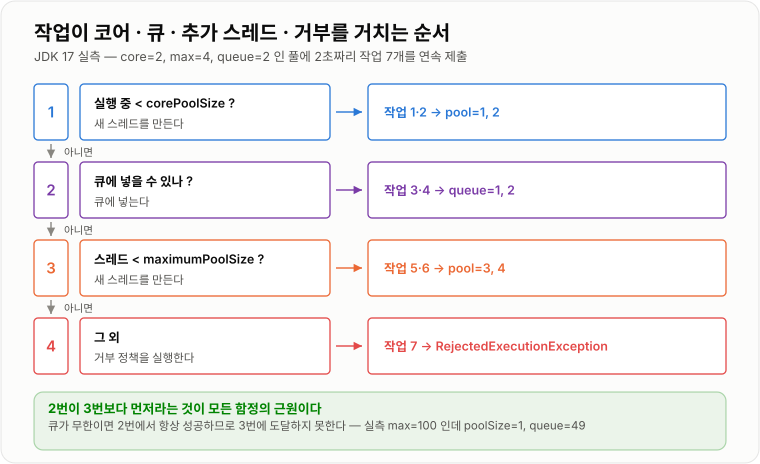
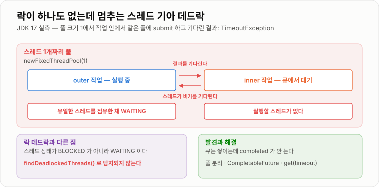
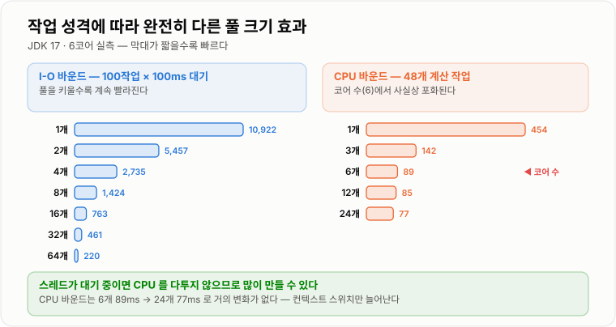

# ThreadPool과 Deadlock

> **`ThreadPoolExecutor`는 "스레드가 모자라면 늘린다"가 아니라 "큐가 가득 차야 늘린다". 이 순서를 모르면 `maximumPoolSize`를 100으로 줘도 스레드 하나로 돌고, 그 사실을 아무도 알려 주지 않는다.**

---

## 1. 핵심 요약

**스레드 풀은 "바쁘면 스레드를 늘린다"가 아니라 "큐가 넘쳐야 스레드를 늘린다"라서 무한 큐 하나가 `maximumPoolSize`를 통째로 무력화하고, 락을 하나도 쓰지 않아도 풀 안의 작업이 같은 풀의 작업을 기다리는 순간 탐지조차 되지 않는 교착이 생긴다.**

### 한눈에 보기

* 작업 처리 순서는 **코어 스레드 → 큐 → 추가 스레드 → 거부**다. 실측에서 `core=2, max=4, queue=2`일 때 작업 3·4가 큐로 갔고 **작업 5부터 스레드가 늘었다.**
* 그래서 **무한 큐를 쓰면 `maximumPoolSize`가 무시된다.** `core=1, max=100`에 무한 큐를 두고 50개를 던졌더니 `poolSize=1`, 큐에 49개가 쌓였다.
* `Executors.newFixedThreadPool`은 **무한 `LinkedBlockingQueue`** 를 쓴다. 소비가 느리면 큐가 무한정 쌓여 `OutOfMemoryError`로 간다.
* `Executors.newCachedThreadPool`은 `max=2,147,483,647`에 `SynchronousQueue`다. 요청이 몰리면 **스레드를 무제한으로 만든다.**
* 기본 거부 정책은 `AbortPolicy`(예외)다. 실측에서 `CallerRunsPolicy`만 작업 4개를 전부 실행했고, `DiscardOldestPolicy`는 **1번과 4번만 실행**됐다.
* `submit()`은 **예외를 삼킨다.** `execute()`는 `UncaughtExceptionHandler`를 호출했지만 `submit()`은 아무 로그도 남기지 않았고 `future.get()`을 해야 드러났다.
* 풀 크기 1에서 작업 안에서 같은 풀에 `submit` 후 기다리면 **스레드 기아 데드락**이 된다. 실측에서 `TimeoutException`이 났다.
* 적정 풀 크기는 작업 성격에 따라 완전히 다르다. 실측에서 **I/O 바운드는 풀 64개까지 계속 빨라졌고(10,922ms → 220ms), CPU 바운드는 코어 수(6)에서 사실상 포화**됐다(89ms → 24개에서 77ms).

### 무엇을 해결하는가

#### 해결하려는 문제

앞 노트에서 스레드 생성 비용을 측정했다.

```text
플랫폼 스레드 10,000개 생성 + 종료 = 1,471 ms   (개당 약 0.15 ms)
스레드당 스택 메모리                = 약 1 MB (64비트 HotSpot 기본)
```

요청마다 스레드를 만드는 서버를 생각해 보자.

```java
// 이렇게 만들면 안 된다
public void handleRequest(Request request) {
    new Thread(() -> process(request)).start();
}
```

문제가 셋이다.

* **생성·소멸 비용이 매 요청에 붙는다.** 작업 자체가 1ms인데 준비에 0.15ms를 쓴다.
* **동시 요청 수만큼 스레드가 생긴다.** 1만 명이 몰리면 스레드 1만 개이고 스택만 산술적으로 10GB다.
* **개수를 제한할 방법이 없다.** 부하가 오면 그대로 서버가 죽는다.

#### 이 개념이 없을 때

풀이 없다면 직접 만들어야 한다. 스레드를 미리 만들어 두고 큐에서 작업을 꺼내 쓰는 구조다.

```java
public class MyPool {

    private final BlockingQueue<Runnable> queue = new LinkedBlockingQueue<Runnable>();
    private final List<Thread> workers = new ArrayList<Thread>();
    private volatile boolean running = true;

    public MyPool(int size) {
        for (int i = 0; i < size; i++) {
            Thread w = new Thread(() -> {
                while (running) {
                    try {
                        queue.take().run();      // 큐에서 꺼내 실행
                    } catch (InterruptedException e) {
                        Thread.currentThread().interrupt();
                        return;
                    }
                }
            });
            w.start();
            workers.add(w);
        }
    }

    public void submit(Runnable task) {
        queue.add(task);
    }
}
```

돌아가긴 한다. 그런데 실무에서 필요한 것이 전부 빠져 있다.

* **큐가 무한이다.** 소비가 느리면 메모리가 터진다.
* **부하가 몰릴 때 스레드를 늘릴 수 없다.**
* **큐가 가득 찼을 때 어떻게 할지 정할 수 없다.**
* **작업에서 던진 예외가 워커 스레드를 죽인다.** 풀이 조용히 말라 간다.
* **종료 절차가 없다.** 진행 중 작업을 기다릴 방법이 없다.
* **결과를 받을 수 없다.** `Runnable`은 반환값이 없다.

`ThreadPoolExecutor`는 이 여섯 가지를 전부 다룬다. 그리고 **그만큼 설정이 까다롭다.**

---

## 2. 동작 원리

### 핵심 구성 요소

| 개념 | 설명 | 중요한 이유 |
| --- | --- | --- |
| **`Executor`** | `execute(Runnable)` 하나만 가진 최상위 인터페이스 | 작업 제출과 실행 방식을 분리한다. |
| **`ExecutorService`** | 종료·`submit`·`Future`를 추가한 인터페이스 | 실무에서 다루는 타입이다. |
| **`ThreadPoolExecutor`** | 실제 구현체. 7개 인자를 받는다 | 여기를 이해하는 것이 이 노트의 목적이다. |
| **`corePoolSize`** | 놀고 있어도 유지하는 스레드 수 | 큐가 차기 전까지는 이 수만 쓴다. |
| **`maximumPoolSize`** | 최대 스레드 수 | **큐가 가득 차야 비로소 의미가 생긴다.** |
| **`keepAliveTime`** | 코어를 넘는 스레드가 놀 때 유지 시간 | 부하가 빠지면 스레드를 줄인다. |
| **작업 큐** | 대기 중인 작업을 담는 `BlockingQueue` | 무한이면 `max`가 무시된다. |
| **거부 정책** | 큐도 스레드도 가득 찼을 때의 처리 | 기본은 예외를 던지는 것이다. |
| **`ThreadFactory`** | 스레드를 만드는 방법 | 이름과 데몬 여부를 정한다. |
| **`Future`** | 비동기 작업의 결과 핸들 | `get()`을 해야 예외가 드러난다. |
| **`shutdown`** | 새 작업을 안 받고 진행 중인 것은 끝낸다 | 정상 종료 절차다. |
| **`shutdownNow`** | 대기 작업을 회수하고 인터럽트를 건다 | 강제 종료다. |
| **스레드 기아 데드락** | 풀의 작업이 같은 풀의 작업을 기다려 생기는 교착 | 락이 없는데도 멈춘다. |
| **`ForkJoinPool`** | 작업 훔치기(work-stealing) 기반 풀 | 병렬 스트림의 기본 실행기다. |

#### 개념 간 관계

```text
작업 하나가 제출됐을 때 ThreadPoolExecutor 가 판단하는 순서

  1. 실행 중인 스레드 < corePoolSize     →  새 스레드를 만들어 실행
  2. 아니면 큐에 넣기를 시도             →  성공하면 끝
  3. 큐가 가득 찼고 스레드 < maximumPoolSize  →  새 스레드를 만들어 실행
  4. 그것도 안 되면                     →  거부 정책 실행

여기서 2번이 3번보다 먼저라는 것이 모든 함정의 근원이다
```

**"바쁘면 스레드를 늘린다"가 아니라 "큐가 넘쳐야 스레드를 늘린다".** 직관과 반대다.

### 내부 동작 과정

#### 작업 하나가 처리되는 경로

`core=2, max=4, queue=2`인 풀에 2초짜리 작업 7개를 연속 제출해 실제 상태를 관측했다.

```text
  작업1 제출 OK  → pool=1  queue=0  active=1     코어 스레드 생성
  작업2 제출 OK  → pool=2  queue=0  active=2     코어 스레드 생성 (core 도달)
  작업3 제출 OK  → pool=2  queue=1  active=2     큐로 간다
  작업4 제출 OK  → pool=2  queue=2  active=2     큐로 간다 (큐 가득)
  작업5 제출 OK  → pool=3  queue=2  active=3     ← 이제야 스레드가 는다
  작업6 제출 OK  → pool=4  queue=2  active=4     max 도달
  작업7 거부     → RejectedExecutionException    (pool=4 queue=2)
```



*작업 3·4가 큐에 들어간 뒤에야 스레드가 3·4번째로 늘었다 — 큐가 스레드보다 먼저다.*

**작업 3과 4가 즉시 실행되지 않았다는 점이 핵심이다.** 스레드를 4개까지 만들 수 있는데도 큐에 넣었다. `maximumPoolSize`는 **큐가 가득 찬 뒤에만** 쓰인다.

#### 무한 큐를 쓰면 `maximumPoolSize`가 죽는다

위 규칙의 직접적인 결과다. 큐가 절대 가득 차지 않으면 3번 조건이 성립할 수 없다.

```java
ThreadPoolExecutor pool = new ThreadPoolExecutor(
        1, 100,                                  // core=1, max=100
        0L, TimeUnit.SECONDS,
        new LinkedBlockingQueue<Runnable>());    // 무한 큐

for (int i = 0; i < 50; i++) {
    pool.execute(() -> Thread.sleep(1500));
}
```

```text
50개 제출 후:  poolSize = 1  (max=100 인데도)   queue = 49
```

**`maximumPoolSize=100`이 완전히 무의미하다.** 큐가 무한이라 2번에서 항상 성공하고, 3번에 도달할 일이 없다.

이것이 다음에 볼 `Executors` 팩토리 메서드들이 위험한 이유다.

#### `Executors` 팩토리의 실제 설정값

내부 값을 직접 꺼내 확인했다.

| 팩토리 메서드 | `core` | `max` | `keepAlive` | 큐 |
| --- | --- | --- | --- | --- |
| `newFixedThreadPool(3)` | 3 | 3 | 0초 | `LinkedBlockingQueue` (**무한**) |
| `newCachedThreadPool()` | 0 | **2,147,483,647** | 60초 | `SynchronousQueue` |
| `newScheduledThreadPool(2)` | 2 | **2,147,483,647** | — | `DelayedWorkQueue` |
| `newSingleThreadExecutor()` | 1 | 1 | 0초 | `LinkedBlockingQueue` (**무한**) |

각각의 위험이 다르다.

**`newFixedThreadPool` — 큐가 무한이다.**

```text
스레드 3개가 처리하는 속도보다 제출이 빠르면
  큐에 계속 쌓인다 → 힙을 다 먹는다 → OutOfMemoryError

거부도 없고 경고도 없다. 응답만 점점 느려지다 죽는다.
```

**`newCachedThreadPool` — 스레드가 무한이다.**

`SynchronousQueue`는 앞 노트에서 확인한 대로 **저장 공간이 0**이다.

```text
SynchronousQueue.offer(1)  (소비자 없을 때)  =  false, size = 0
```

큐에 넣기가 항상 실패하므로 **매번 3번 조건으로 넘어가 새 스레드를 만든다.** 요청이 몰리면 스레드가 그만큼 생긴다. 스레드당 스택 1MB를 감안하면 `OutOfMemoryError: unable to create new native thread`로 간다.

**`newSingleThreadExecutor` — 나중에 크기를 못 바꾼다.**

```text
실제 타입 = java.util.concurrent.Executors$FinalizableDelegatedExecutorService
```

`ThreadPoolExecutor`로 캐스팅할 수 없게 감싸 놓았다. `setCorePoolSize()`를 호출할 방법이 없다. 의도된 설계지만, **운영 중 조정이 불가능하다**는 뜻이기도 하다.

그래서 실무 권장은 하나다. **`ThreadPoolExecutor`를 직접 생성한다.**

```java
ThreadPoolExecutor pool = new ThreadPoolExecutor(
        10,                                       // corePoolSize
        50,                                       // maximumPoolSize
        60L, TimeUnit.SECONDS,                    // keepAliveTime
        new ArrayBlockingQueue<Runnable>(200),    // 반드시 크기를 지정한다
        new CustomThreadFactory("order-"),        // 이름을 붙인다
        new ThreadPoolExecutor.CallerRunsPolicy() // 거부 정책을 명시한다
);
```

#### 거부 정책 네 가지

`core=1, max=1, queue=1`인 풀에 작업 4개를 던져 각 정책의 결과를 관측했다.

| 정책 | 실행된 작업 | 예외 | 호출 스레드가 실행했나 |
| --- | --- | --- | --- |
| `AbortPolicy` (기본) | 1, 2 | **2회** | 아니오 |
| `CallerRunsPolicy` | **1, 2, 3, 4** | 0 | **예** |
| `DiscardPolicy` | 1, 2 | 0 | 아니오 |
| `DiscardOldestPolicy` | **1, 4** | 0 | 아니오 |

읽을 것이 두 가지다.

**`CallerRunsPolicy`만 작업을 하나도 잃지 않았다.** 제출한 스레드가 직접 실행하기 때문이다. 그동안 제출 스레드가 막히므로 **자연스러운 역압(back-pressure)** 이 걸린다. 웹 요청 스레드가 제출한다면 그 요청이 느려지는 대신 시스템이 무너지지는 않는다.

**`DiscardOldestPolicy`가 1번과 4번을 실행한 것**이 흥미롭다. 큐의 가장 오래된 것을 버리고 새 작업을 넣기 때문이다.

```text
작업1 → 스레드에서 실행 시작
작업2 → 큐에 들어감
작업3 → 큐가 가득 → 작업2를 버리고 작업3을 큐에      (작업2 소멸)
작업4 → 큐가 가득 → 작업3을 버리고 작업4를 큐에      (작업3 소멸)

결과: 1과 4만 실행된다
```

**먼저 온 작업이 나중 것에 밀려난다.** 순서가 중요한 업무에는 절대 쓸 수 없다.

`DiscardPolicy`는 **예외도 로그도 없이 사라진다.** 실무에서 가장 위험한 선택이다. 쓸 이유가 있다면 커스텀 핸들러로 최소한 로그는 남긴다.

```java
RejectedExecutionHandler handler = (task, executor) -> {
    log.warn("작업 거부됨. queue={}, active={}, completed={}",
            executor.getQueue().size(),
            executor.getActiveCount(),
            executor.getCompletedTaskCount());
    metrics.counter("pool.rejected").increment();
    throw new RejectedExecutionException("풀 포화");
};
```

#### `execute`와 `submit` — 예외 처리가 완전히 다르다

같은 예외를 던지는 작업을 두 방식으로 실행해 비교했다.

```text
-- execute --
  UncaughtExceptionHandler 호출됨: execute 예외        ← 로그가 남는다

-- submit --
  (아무 출력도 없다)
  future.isDone = true
  future.get() 해야 드러난다 → java.lang.RuntimeException: submit 예외
```

**`submit()`은 예외를 `Future` 안에 가둔다.** `get()`을 호출하지 않으면 예외가 있었다는 사실 자체를 알 수 없다.

```java
// 위험하다 — 예외가 조용히 사라진다
executor.submit(() -> {
    riskyOperation();          // 여기서 터져도 아무도 모른다
});

// 안전한 형태 1 — execute 를 쓴다
executor.execute(() -> {
    riskyOperation();          // UncaughtExceptionHandler 로 간다
});

// 안전한 형태 2 — submit 을 쓰되 안에서 잡는다
executor.submit(() -> {
    try {
        riskyOperation();
    } catch (Exception e) {
        log.error("작업 실패", e);
    }
});
```

`@Scheduled`나 `ScheduledExecutorService`에서는 이 문제가 더 심각하다. **주기 작업에서 예외가 나면 그 작업이 다시는 실행되지 않는다.** 스케줄 자체가 취소되기 때문이다. 로그도 없이 배치가 멈춘 것처럼 보인다.

#### 스레드 기아 데드락 — 락이 없는데 멈춘다

앞 노트의 데드락은 락 두 개가 얽힌 것이었다. 스레드 풀에는 **락 없이 생기는 교착**이 따로 있다.

```java
ExecutorService pool = Executors.newFixedThreadPool(1);   // 스레드 1개

Future<String> outer = pool.submit(() -> {
    Future<String> inner = pool.submit(() -> "inner");    // 같은 풀에 제출
    return inner.get(2, TimeUnit.SECONDS);                // 결과를 기다린다
});
```

```text
결과: TimeoutException
```



*바깥 작업이 유일한 스레드를 점유한 채 안쪽 작업의 결과를 기다리는데, 안쪽 작업은 그 스레드가 비어야 시작할 수 있다.*

```text
스레드 1개
  └─ outer 실행 중        ← 스레드를 점유하고 inner.get() 에서 대기
       inner 는 큐에 있음  ← 실행할 스레드가 없다

outer 는 inner 를 기다리고, inner 는 outer 가 끝나기를 기다린다
```

`synchronized`도 `ReentrantLock`도 없다. **자원이 스레드일 뿐 구조는 데드락과 같다.**

풀이 1개일 때만 생기는 문제가 아니다. **풀 크기가 N이면 N개의 작업이 동시에 내부 작업을 기다리는 순간 똑같이 멈춘다.** 부하가 낮을 때는 멀쩡하다가 트래픽이 오르면 갑자기 전체가 멈추는 형태로 나타나서 원인을 찾기 어렵다.

해결책은 셋이다.

| 방법 | 설명 |
| --- | --- |
| **풀을 분리한다** | 바깥 작업과 안쪽 작업이 다른 풀을 쓰면 서로 굶기지 않는다. |
| **중첩 제출을 없앤다** | 작업을 평평하게 편다. `CompletableFuture` 조합으로 대기 없이 잇는다. |
| **타임아웃을 건다** | `get(timeout)`으로 최소한 영원히 멈추지는 않게 한다. |

**풀 분리가 가장 확실하다.** 하나의 풀이 서로 의존하는 두 종류의 작업을 함께 처리하지 않게 한다.

#### 락 데드락과 함께 보기

풀 안에서 일어나는 일반 데드락도 여전히 가능하다. 앞 노트에서 실측한 탐지 방법이 그대로 쓰인다.

```text
findDeadlockedThreads() = [316, 317]

  deadlock-1  state=BLOCKED  대기중인 락=Object@1a18644   소유자=deadlock-2
  deadlock-2  state=BLOCKED  대기중인 락=Object@1af2d44a  소유자=deadlock-1
```

**두 데드락은 증상이 다르다.**

| 구분 | 락 데드락 | 스레드 기아 데드락 |
| --- | --- | --- |
| 원인 | 락 획득 순서의 순환 | 풀 작업이 같은 풀 작업을 대기 |
| 스레드 상태 | `BLOCKED` | `WAITING` (`Future.get()`) |
| `findDeadlockedThreads()` | **탐지된다** | **탐지되지 않는다** |
| 증상 | 특정 기능만 멈춤 | 풀 전체가 멈춤, 큐만 쌓임 |
| 발견 방법 | 스레드 덤프 | 큐 길이·활성 스레드 수 모니터링 |

**`findDeadlockedThreads()`가 기아 데드락을 못 잡는다**는 것이 중요하다. JVM 입장에서는 그냥 결과를 기다리는 정상 스레드로 보인다. 그래서 **큐 길이가 계속 늘고 완료 건수가 0인 상태**를 감시해야 발견할 수 있다.

#### 종료 절차

```text
shutdown()
  새 작업 거부 (RejectedExecutionException)
  큐에 있는 작업은 전부 실행한다
  isShutdown = true, isTerminated = false
  awaitTermination() 후 isTerminated = true

shutdownNow()
  새 작업 거부
  큐의 미실행 작업을 List 로 반환 (실측 1개 반환)
  실행 중인 스레드에 interrupt 를 건다 (실측 인터럽트 확인)
  ※ 인터럽트를 확인하지 않는 작업은 끝까지 돈다
```

`shutdownNow()`가 "즉시 중단"이 아니라는 점이 중요하다. **인터럽트는 요청일 뿐**이므로, 앞 노트에서 본 대로 플래그를 확인하지 않는 작업은 계속 실행된다.

표준 종료 절차다.

```java
public void shutdownGracefully(ExecutorService pool) {
    pool.shutdown();                                          // 새 작업 차단
    try {
        if (!pool.awaitTermination(30, TimeUnit.SECONDS)) {   // 30초 기다린다
            List<Runnable> pending = pool.shutdownNow();      // 강제 종료
            log.warn("미처리 작업 {}건", pending.size());
            if (!pool.awaitTermination(10, TimeUnit.SECONDS)) {
                log.error("풀이 종료되지 않았다");
            }
        }
    } catch (InterruptedException e) {
        pool.shutdownNow();
        Thread.currentThread().interrupt();                   // 플래그 복원
    }
}
```

**종료를 빠뜨리면 JVM이 죽지 않는다.** 기본 `ThreadFactory`가 만드는 스레드는 실측 결과 **데몬이 아니다.** non-daemon 스레드가 하나라도 살아 있으면 JVM은 종료되지 않는다.

---

## 3. 특징과 비교

| 구분          | 내용                                       |
| ----------- | ---------------------------------------- |
| **장점**      | 스레드 생성 비용을 없애고 동시 실행 수를 제한하며, 큐로 순간 폭주를 흡수하고 거부 정책으로 과부하에 대응한다. |
| **단점**      | **설정 규칙이 직관과 반대다(큐가 스레드보다 먼저).** 기아 데드락은 락 없이 발생해 `findDeadlockedThreads()`로 안 잡히고, `submit`은 예외를 삼키며, `ThreadLocal`이 다음 작업으로 샌다. |
| **적합한 상황**  | CPU 바운드는 코어 수(+1), I/O 바운드는 코어 수 × (1 + 대기/계산)으로 잡을 때. |
| **주의할 상황**  | 무한 큐(`newFixedThreadPool` 기본) — `maximumPoolSize`가 영원히 무시되고 OOM으로 간다. 부모 작업이 같은 풀의 자식 작업을 기다리는 것. |

### 성능 특성

#### 풀 크기에 따른 처리 시간

I/O 바운드 (100작업 × 100ms 대기, 6코어).

```text
풀  1개 = 10,922 ms
풀  2개 =  5,457 ms      1/2.0
풀  4개 =  2,735 ms      1/4.0
풀  8개 =  1,424 ms      1/7.7
풀 16개 =    763 ms      1/14.3
풀 32개 =    461 ms      1/23.7
풀 64개 =    220 ms      1/49.6
```

**거의 선형이다.** 이론적 하한은 100ms(전부 동시 실행)인데 64개에서 220ms까지 갔다.

CPU 바운드 (48개 계산 작업, 6코어).

```text
풀  1개 = 454 ms
풀  3개 = 142 ms      1/3.2
풀  6개 =  89 ms      1/5.1     ← 코어 수. 여기서 사실상 끝
풀 12개 =  85 ms      1/5.3
풀 24개 =  77 ms      1/5.9
```

**코어 수를 넘어서면 개선이 멈춘다.** 6개에서 24개로 4배 늘려도 89ms → 77ms다.

#### 스레드 생성 비용 대비 풀의 이득

```text
스레드 직접 생성 (앞 노트 실측)   개당 약 0.15 ms + 스택 약 1MB
풀에서 꺼내 쓰기                 큐 연산 한 번
```

작업 자체가 1ms 미만이면 **생성 비용이 작업보다 크다.** 짧고 많은 작업일수록 풀의 이득이 크다.

#### 큐 구현별 특성

| 큐 | 용량 | 락 구조 | 스레드 증가 | 주 용도 |
| --- | --- | --- | --- | --- |
| `ArrayBlockingQueue(n)` | 고정 | 락 하나 공유 | 큐가 차면 늘어난다 | **권장 기본값** |
| `LinkedBlockingQueue()` | 무한 | 넣기/꺼내기 분리 | **절대 안 는다** | 위험 |
| `LinkedBlockingQueue(n)` | 고정 | 넣기/꺼내기 분리 | 큐가 차면 늘어난다 | 처리량 우선 |
| `SynchronousQueue` | 0 | — | **매번 는다** | `newCachedThreadPool` |
| `PriorityBlockingQueue` | 무한 | 락 하나 | 절대 안 는다 | 우선순위 작업 |

`LinkedBlockingQueue`가 `ArrayBlockingQueue`보다 처리량이 높은 것은 **넣는 락과 꺼내는 락이 분리**되어 있기 때문이다. 다만 노드 객체를 매번 만들어 GC 부담이 있다.

#### 거부 정책의 성능 영향

`CallerRunsPolicy`는 작업을 잃지 않지만 **제출 스레드를 붙잡는다.**

```text
웹 요청 스레드가 제출한 경우
  → 그 요청의 응답이 작업 실행 시간만큼 느려진다
  → 대신 요청을 받는 속도가 자연히 줄어든다 (역압)
```

이것이 장점이자 단점이다. **시스템이 무너지는 대신 느려진다.** 대부분의 상황에서 옳은 선택이지만, 응답 시간 SLA가 엄격하면 `AbortPolicy` + 재시도가 나을 수 있다.

### 장점과 단점

#### 스레드 풀

| 장점 | 이유 |
| --- | --- |
| 생성·소멸 비용을 없앤다 | 개당 0.15ms + 스택 1MB를 매번 안 낸다. |
| 동시 실행 수를 제한할 수 있다 | 부하가 몰려도 스레드가 폭발하지 않는다. |
| 큐로 버퍼링한다 | 순간적인 폭주를 흡수한다. |
| 거부 정책으로 과부하를 다룬다 | 무너지는 대신 거부하거나 느려진다. |
| 작업 제출과 실행을 분리한다 | 실행 전략을 나중에 바꿀 수 있다. |
| 상태를 관측할 수 있다 | 큐 길이·활성 수로 병목을 본다. |

| 단점 | 이유 |
| --- | --- |
| **설정 규칙이 직관과 반대다** | 큐가 스레드보다 먼저다. `max`가 무시될 수 있다. |
| 기아 데드락이 생길 수 있다 | 락이 없는데 멈추고 `findDeadlockedThreads()`로 안 잡힌다. |
| `submit`이 예외를 삼킨다 | `get()`을 안 하면 실패를 알 수 없다. |
| `ThreadLocal`이 새어 나간다 | 스레드가 재사용되어 이전 요청의 값이 남는다. |
| 종료를 빠뜨리면 JVM이 안 죽는다 | 기본 스레드가 non-daemon이다. |
| 적정 크기를 정하기 어렵다 | 작업 성격·외부 자원 한도에 따라 다르다. |

#### `Executors` 팩토리

| 장점 | 이유 |
| --- | --- |
| 한 줄로 만들 수 있다 | 학습·테스트에 편하다. |
| 자주 쓰는 조합을 제공한다 | 고정·캐시·스케줄. |

| 단점 | 이유 |
| --- | --- |
| `newFixedThreadPool`은 큐가 무한이다 | `OutOfMemoryError`로 간다. |
| `newCachedThreadPool`은 스레드가 무한이다 | `max=2,147,483,647`. |
| `newSingleThreadExecutor`는 조정이 불가하다 | 래핑되어 캐스팅이 막혀 있다. |
| 거부 정책이 항상 `AbortPolicy`다 | 선택할 수 없다. |
| 스레드 이름이 `pool-1-thread-1`이다 | 덤프에서 구분이 안 된다. |

#### `CompletableFuture`

| 장점 | 이유 |
| --- | --- |
| 대기하지 않고 조합한다 | 기아 데드락을 원천적으로 피한다. |
| 병렬 호출을 자연스럽게 표현한다 | `thenCombine`·`allOf`. |
| 예외 처리를 체인에 넣을 수 있다 | `exceptionally`·`handle`. |

| 단점 | 이유 |
| --- | --- |
| 실행기를 안 주면 공용 풀을 쓴다 | 병렬 수 5(실측). 블로킹 작업을 넣으면 전역 영향. |
| 스택 트레이스가 끊긴다 | 비동기 경계에서 호출 흐름이 사라진다. |
| `ThreadLocal` 문제가 그대로다 | 단계마다 스레드가 바뀔 수 있다. |

### 어떤 상황에서 고르는가

#### 풀을 어떻게 설정할지 정하는 순서

```text
작업이 CPU 를 계속 쓰는가?
├─ 예 (계산·직렬화·암호화)
│    → 풀 크기 = 코어 수 (+1). 실측상 그 이상은 의미 없다
└─ 아니오 (DB·HTTP·파일 I/O)
     → 풀 크기 = 코어 수 x (1 + 대기/계산)
     → 단, DB 커넥션 풀·외부 API 한도를 넘지 않게 조정한다

큐 크기는?
  → 반드시 유한하게. 순간 폭주를 흡수할 만큼만 (수백 단위)
  → 큐가 크면 응답 지연이 길어지고, 작으면 거부가 늘어난다

거부 정책은?
  → 작업을 잃으면 안 된다  → CallerRunsPolicy
  → 빠른 실패가 낫다        → AbortPolicy + 재시도
  → 절대 DiscardPolicy 를 기본으로 쓰지 않는다
```

#### 사용하기 좋은 상황

* **비동기 알림·메일 발송** — 응답을 기다릴 필요가 없다.
* **배치 처리** — 대량 작업을 병렬로 나눈다.
* **외부 API 병렬 호출** — `CompletableFuture`로 묶는다.
* **주기 작업** — `ScheduledExecutorService`.
* **생산자-소비자** — 큐 기반 파이프라인.

#### 사용하지 않는 것이 좋은 상황

* **`Executors` 팩토리 메서드를 운영 코드에** — 큐 또는 스레드가 무한이다.
* **하나의 풀에 서로 의존하는 작업** — 기아 데드락이 난다.
* **`ForkJoinPool.commonPool()`에 블로킹 작업** — 병렬 수 5를 JVM 전체가 공유한다.
* **`submit()`으로 던지고 `get()`을 안 함** — 예외가 사라진다.
* **트랜잭션 안에서 비동기 작업 제출** — 트랜잭션은 스레드에 묶여 전파되지 않는다.
* **`ThreadLocal`을 정리하지 않는 작업** — 다음 요청이 남의 데이터를 본다.
* **풀 크기를 무작정 크게** — CPU 바운드는 코어 수에서 포화된다(실측).

#### 선택 기준

1. **CPU 바운드인가 I/O 바운드인가?** — 적정 크기가 10배 이상 차이 난다
2. **작업이 다른 작업을 기다리는가?** — 그렇다면 풀을 분리한다
3. **작업을 잃어도 되는가?** — 거부 정책이 여기서 갈린다
4. **큐에 얼마나 쌓여도 되는가?** — 응답 지연 허용치가 큐 크기를 정한다
5. **외부 자원의 한도는?** — 커넥션 풀·API 한도가 실질적 상한이다
6. **결과가 필요한가?** — 필요하면 `submit`/`CompletableFuture`, 아니면 `execute`

### 비슷한 기술과 비교

#### `execute`와 `submit`

| 비교 항목 | `execute(Runnable)` | `submit(Callable/Runnable)` |
| --- | --- | --- |
| 반환값 | 없음 | `Future` |
| 예외 발생 시 | `UncaughtExceptionHandler` 호출 (실측 로그 남음) | **`Future`에 갇힌다** (실측 무음) |
| 예외 확인 | 자동으로 로그 | `future.get()` 필요 |
| 작업 취소 | 불가 | `future.cancel(true)` |
| 선택 기준 | 결과가 필요 없을 때 | 결과나 취소가 필요할 때 |

#### `Executors` 팩토리 비교

| 비교 항목 | `newFixedThreadPool(n)` | `newCachedThreadPool()` | `newSingleThreadExecutor()` |
| --- | --- | --- | --- |
| core / max | n / n | 0 / **2,147,483,647** | 1 / 1 |
| 큐 | `LinkedBlockingQueue` **무한** | `SynchronousQueue` (용량 0) | `LinkedBlockingQueue` **무한** |
| `keepAlive` | 0초 | 60초 | 0초 |
| 위험 | 큐 폭발 → OOM | 스레드 폭발 → OOM | 큐 폭발 + 조정 불가 |
| 적합한 곳 | 학습·테스트 | 짧고 산발적인 작업 | 순서 보장이 필요한 단일 처리 |

#### 거부 정책 비교

| 비교 항목 | `AbortPolicy` | `CallerRunsPolicy` | `DiscardPolicy` | `DiscardOldestPolicy` |
| --- | --- | --- | --- | --- |
| 기본값 | **예** | 아니오 | 아니오 | 아니오 |
| 작업 손실 | 있다 (예외) | **없다** | 있다 (무음) | 있다 (무음) |
| 실측 실행된 작업 | 1, 2 | **1, 2, 3, 4** | 1, 2 | **1, 4** |
| 호출 스레드 영향 | 없음 | **막힌다** | 없음 | 없음 |
| 역압 효과 | 없음 | **있다** | 없음 | 없음 |
| 순서 보존 | — | 예 | 예 | **아니오** |
| 적합한 곳 | 빠른 실패 + 재시도 | 유실 불가 작업 | 버려도 되는 로그 | 최신 데이터만 필요 |

#### 락 데드락과 스레드 기아 데드락

| 비교 항목 | 락 데드락 | 스레드 기아 데드락 |
| --- | --- | --- |
| 원인 | 락 획득 순서의 순환 | 작업이 같은 풀의 작업을 대기 |
| 관련 자원 | 모니터·`Lock` | 풀의 스레드 |
| 스레드 상태 | `BLOCKED` | `WAITING` |
| `findDeadlockedThreads()` | 탐지된다 | **탐지 안 된다** |
| 발견 지표 | 스레드 덤프 | 큐 증가 + `completed` 정체 |
| 해결 | 락 순서 고정, `tryLock` | 풀 분리, 비동기 조합, 타임아웃 |

#### `Future`와 `CompletableFuture`

| 비교 항목 | `Future` | `CompletableFuture` |
| --- | --- | --- |
| 결과 대기 | `get()` — 스레드를 붙잡는다 | 콜백 등록 — 붙잡지 않는다 |
| 조합 | 불가 | `thenCombine`·`allOf`·`thenCompose` |
| 예외 처리 | `get()`에서 `ExecutionException` | `exceptionally`·`handle` |
| 기아 데드락 위험 | **있다** | 낮다 |
| 기본 실행기 | 명시한 풀 | **`ForkJoinPool.commonPool()`** (병렬 수 5) |
| 도입 | Java 5 | Java 8 |

#### 풀 크기와 작업 성격

| 비교 항목 | CPU 바운드 | I/O 바운드 |
| --- | --- | --- |
| 대표 작업 | 계산·암호화·직렬화 | DB 조회·HTTP 호출·파일 |
| 스레드 상태 | 대부분 `RUNNABLE` | 대부분 대기 |
| 적정 크기 | 코어 수 (+1) | 코어 수 × (1 + 대기/계산) |
| 실측 (6코어) | 6개에서 89ms, 24개에서 77ms | 64개까지 계속 개선 (220ms) |
| 더 늘리면 | 컨텍스트 스위치만 증가 | 메모리·외부 자원이 한계 |

---

## 4. 실무 주의사항

### 백엔드 실무 적용

#### Spring의 스레드 풀

Spring Boot는 `@Async`용 실행기를 자동 구성한다. **기본값을 반드시 확인해야 한다.**

```yaml
spring:
  task:
    execution:
      pool:
        core-size: 8              # 기본값 8
        max-size: 20              # 기본값은 Integer.MAX_VALUE
        queue-capacity: 200       # 기본값은 Integer.MAX_VALUE — 반드시 바꾼다
        keep-alive: 60s
      thread-name-prefix: async-
```

**`queue-capacity`가 기본적으로 무한**이라는 점이 앞서 본 함정 그대로다. 큐가 무한이면 `max-size`를 아무리 크게 줘도 스레드는 `core-size`인 8개에서 늘지 않는다.

직접 정의하는 편이 명확하다.

```java
@Configuration
@EnableAsync
public class AsyncConfig {

    @Bean("orderExecutor")
    public ThreadPoolTaskExecutor orderExecutor() {
        ThreadPoolTaskExecutor executor = new ThreadPoolTaskExecutor();
        executor.setCorePoolSize(10);
        executor.setMaxPoolSize(30);
        executor.setQueueCapacity(200);              // 반드시 지정
        executor.setThreadNamePrefix("order-async-");
        executor.setRejectedExecutionHandler(
                new ThreadPoolExecutor.CallerRunsPolicy());
        executor.setWaitForTasksToCompleteOnShutdown(true);   // 정상 종료
        executor.setAwaitTerminationSeconds(30);
        executor.initialize();
        return executor;
    }
}

@Service
public class OrderService {

    @Async("orderExecutor")                          // 풀 이름을 명시한다
    public void sendNotification(Long orderId) {
        // ...
    }
}
```

`setWaitForTasksToCompleteOnShutdown(true)`가 중요하다. **없으면 배포 시 진행 중이던 작업이 중간에 끊긴다.**

#### `@Async`가 동작하지 않는 경우

```java
@Service
public class OrderService {

    public void create(Order order) {
        save(order);
        sendNotification(order);       // 동기로 실행된다
    }

    @Async
    public void sendNotification(Order order) { }
}
```

**같은 클래스 안의 호출은 프록시를 거치지 않아 `@Async`가 무시된다.** `@Transactional`과 정확히 같은 문제다. 별도 빈으로 분리해야 한다.

#### 트랜잭션과 비동기

```java
@Transactional
public void createOrder(OrderRequest request) {
    Order order = orderRepository.save(request.toEntity());

    notificationService.sendAsync(order.getId());   // 다른 스레드로 넘어간다
    // 문제: 이 트랜잭션이 아직 커밋되지 않았다
    //       비동기 스레드가 조회하면 주문을 못 찾을 수 있다
}
```

**트랜잭션은 `ThreadLocal`에 묶여 있어 다른 스레드로 전파되지 않는다.** 비동기 작업은 아직 커밋 안 된 데이터를 볼 수 없다.

```java
// 커밋 이후에 실행되도록 한다
@TransactionalEventListener(phase = TransactionPhase.AFTER_COMMIT)
public void handleOrderCreated(OrderCreatedEvent event) {
    notificationService.sendAsync(event.getOrderId());
}
```

#### 컨텍스트 전파

```java
// 스레드가 바뀌면 사라지는 것들
//   - SecurityContext (로그인 정보)
//   - RequestContextHolder (요청 정보)
//   - MDC (로그 추적 ID)
//   - 트랜잭션

@Bean
public ThreadPoolTaskExecutor executor() {
    ThreadPoolTaskExecutor executor = new ThreadPoolTaskExecutor();
    // ...
    executor.setTaskDecorator(task -> {
        Map<String, String> mdc = MDC.getCopyOfContextMap();
        return () -> {
            if (mdc != null) {
                MDC.setContextMap(mdc);
            }
            try {
                task.run();
            } finally {
                MDC.clear();          // 스레드가 재사용되므로 반드시 정리한다
            }
        };
    });
    return executor;
}
```

**`finally`의 `MDC.clear()`를 빠뜨리면 다음 작업이 이전 요청의 추적 ID로 로그를 남긴다.** 로그인 정보라면 보안 사고다.

#### 톰캣 스레드 풀과의 관계

```yaml
server:
  tomcat:
    threads:
      max: 200                    # 기본값 200
      min-spare: 10
    accept-count: 100             # 대기 큐
    max-connections: 8192
```

```text
요청 처리 흐름

  네트워크 연결  →  max-connections (8192)
       ↓
  처리 대기 큐   →  accept-count (100)
       ↓
  워커 스레드    →  threads.max (200)
       ↓
  DB 접근       →  HikariCP maximum-pool-size (기본 10)
```

**가장 좁은 곳이 실질적 처리량을 정한다.** 톰캣 스레드가 200개여도 커넥션 풀이 10개면 190개가 커넥션을 기다린다. 스레드 풀만 키우면 대기 시간만 늘어난다.

앞서 측정한 I/O 바운드 곡선이 여기에 그대로 적용된다. **풀을 키워 얻는 이득은 그 뒤의 자원이 받쳐 줄 때만 실현된다.**

#### 운영 중 겪는 전형적인 장애

**증상 1 — 응답이 점점 느려지다 OOM**

```text
원인:  newFixedThreadPool 의 무한 큐에 작업이 쌓임
확인:  힙 덤프에 LinkedBlockingQueue$Node 가 대량
해결:  ArrayBlockingQueue 로 크기를 제한하고 거부 정책을 명시
```

**증상 2 — 특정 기능만 완전히 멈춤, CPU는 낮음**

```text
원인:  락 데드락
확인:  jstack 에 BLOCKED + "Found one Java-level deadlock"
해결:  락 획득 순서 고정, tryLock(timeout)
```

**증상 3 — 큐는 쌓이는데 완료 건수가 0**

```text
원인:  스레드 기아 데드락 (풀 작업이 같은 풀 작업을 대기)
확인:  findDeadlockedThreads() 는 null.
       스레드 덤프에서 풀 스레드가 전부 Future.get() 에서 WAITING
해결:  풀 분리, CompletableFuture 조합, get(timeout)
```

**증상 4 — 비동기 작업이 소리 없이 사라짐**

```text
원인:  submit() 이 예외를 Future 에 가둠 (실측 확인)
확인:  로그에 아무 흔적이 없다
해결:  execute() 를 쓰거나 작업 안에서 try-catch
```

**증상 5 — 배포할 때마다 일부 작업이 유실**

```text
원인:  shutdown 없이 종료. 또는 setWaitForTasksToCompleteOnShutdown 미설정
해결:  shutdown() → awaitTermination() → shutdownNow() 순서
```

### 자주 하는 오해

| 잘못된 이해 | 올바른 이해 |
| --- | --- |
| 작업이 밀리면 `maximumPoolSize`까지 스레드가 늘어난다 | **큐가 가득 차야** 늘어난다. 실측에서 작업 3·4는 큐로 갔고 5부터 스레드가 늘었다. |
| `maximumPoolSize`를 크게 주면 부하에 잘 견딘다 | 무한 큐면 완전히 무시된다. 실측 `max=100`인데 `poolSize=1`이었다. |
| `newFixedThreadPool`은 크기가 고정이라 안전하다 | 큐가 무한이라 메모리가 터진다. |
| `newCachedThreadPool`은 캐시라서 스레드를 재사용한다 | 재사용도 하지만 `max=2,147,483,647`이라 필요하면 무제한으로 만든다. |
| `SynchronousQueue`도 작업을 저장한다 | 용량이 0이다. 실측 `offer` = `false`, `size` = 0. |
| 기본 거부 정책은 작업을 큐에 다시 넣는다 | `AbortPolicy`다. `RejectedExecutionException`을 던진다. |
| `DiscardOldestPolicy`는 오래 기다린 작업을 우선 처리한다 | 반대다. 오래된 것을 버린다. 실측에서 1과 4만 실행됐다. |
| `CallerRunsPolicy`는 작업을 버린다 | 제출한 스레드가 직접 실행한다. 실측에서 4개 모두 실행됐다. |
| `submit()`으로 던지면 예외가 로그에 남는다 | `Future`에 갇힌다. 실측에서 아무 출력도 없었다. |
| `Future.get()`의 `ExecutionException`이 원래 예외다 | 껍데기다. `getCause()`가 원인이다. |
| 데드락은 락을 써야만 생긴다 | 풀 작업이 같은 풀 작업을 기다리면 락 없이도 생긴다. 실측 `TimeoutException`. |
| `findDeadlockedThreads()`가 모든 교착을 잡는다 | 기아 데드락은 `WAITING`이라 탐지되지 않는다. |
| `shutdownNow()`는 작업을 즉시 중단시킨다 | 인터럽트를 걸 뿐이다. 플래그를 안 보는 작업은 끝까지 돈다. |
| `shutdown()` 후에는 큐의 작업도 버려진다 | 큐에 있는 것은 전부 실행한다. |
| 풀을 안 닫아도 GC가 정리해 준다 | 기본 스레드가 non-daemon이라 JVM이 종료되지 않는다 (실측 확인). |
| 스레드를 많이 만들수록 빨라진다 | CPU 바운드는 코어 수에서 포화된다. 실측 6개 89ms, 24개 77ms. |
| I/O 작업도 코어 수만큼만 쓰면 된다 | 실측에서 64개까지 계속 빨라졌다(10,922ms → 220ms). |
| `CompletableFuture`는 알아서 좋은 풀을 쓴다 | 실행기를 안 주면 공용 풀(병렬 수 5)이다. 블로킹 작업을 넣으면 전역 영향. |
| `@Async`는 붙이기만 하면 비동기가 된다 | 같은 클래스 내부 호출은 프록시를 안 거쳐 동기로 실행된다. |
| 비동기 작업도 트랜잭션이 이어진다 | 트랜잭션은 `ThreadLocal`이라 전파되지 않는다. |
| 스레드 풀을 키우면 처리량이 그만큼 는다 | DB 커넥션 풀 등 그 뒤의 자원이 상한이다. |
| `ThreadLocal`은 작업이 끝나면 정리된다 | 스레드가 재사용되므로 남는다. `finally`에서 지워야 한다. |

---

## 5. 예제

### `ThreadPoolExecutor` 직접 생성

```java
public class PoolConfig {

    public static ThreadPoolExecutor create() {
        ThreadFactory factory = new ThreadFactory() {
            private final AtomicInteger seq = new AtomicInteger(1);

            @Override
            public Thread newThread(Runnable r) {
                Thread t = new Thread(r, "order-worker-" + seq.getAndIncrement());
                t.setDaemon(false);          // 종료 시 작업을 마치도록
                t.setUncaughtExceptionHandler((thread, ex) ->
                        log.error("[{}] 처리되지 않은 예외", thread.getName(), ex));
                return t;
            }
        };

        return new ThreadPoolExecutor(
                10,                                        // core
                50,                                        // max
                60L, TimeUnit.SECONDS,                     // keepAlive
                new ArrayBlockingQueue<Runnable>(200),     // 유한 큐
                factory,
                new ThreadPoolExecutor.CallerRunsPolicy()  // 역압
        );
    }
}
```

**스레드 이름을 붙이는 것이 특히 중요하다.** 기본 이름은 `pool-1-thread-3` 같은 형태라 스레드 덤프에서 어느 풀인지 알 수 없다. 이름 하나로 장애 분석 시간이 크게 줄어든다.

### `Future`와 `CompletableFuture`

```java
// Future — 블로킹 대기
Future<Order> future = executor.submit(() -> orderService.create(request));
try {
    Order order = future.get(3, TimeUnit.SECONDS);     // 반드시 타임아웃을 준다
} catch (TimeoutException e) {
    future.cancel(true);                               // 인터럽트를 건다
    throw new OrderTimeoutException();
} catch (ExecutionException e) {
    throw new OrderFailedException(e.getCause());      // 원인은 getCause()
}
```

`ExecutionException`은 **껍데기다.** 실제 예외는 `getCause()`에 있다. 이걸 모르고 로그를 찍으면 원인이 안 보인다.

```java
// CompletableFuture — 블로킹 없이 조합한다
CompletableFuture<User> userFuture =
        CompletableFuture.supplyAsync(() -> userService.find(userId), executor);
CompletableFuture<List<Coupon>> couponFuture =
        CompletableFuture.supplyAsync(() -> couponService.find(userId), executor);

CompletableFuture<OrderPage> page = userFuture
        .thenCombine(couponFuture, (user, coupons) -> new OrderPage(user, coupons))
        .exceptionally(ex -> {
            log.error("주문 페이지 조회 실패", ex);
            return OrderPage.empty();
        });
```

**`CompletableFuture`가 기아 데드락을 피하는 방식**이 여기 드러난다. `get()`으로 스레드를 붙잡고 기다리는 대신, 완료되면 이어서 실행할 함수를 등록한다. 대기하는 스레드가 없으므로 풀이 굶지 않는다.

`supplyAsync`에 실행기를 넘기지 않으면 **`ForkJoinPool.commonPool()`이 쓰인다.** 이 풀의 병렬 수를 확인했다.

```text
availableProcessors      = 6
commonPool 병렬수        = 5      ← 코어 수 - 1
```

**공용 풀은 JVM 전체가 공유한다.** 여기에 블로킹 작업(DB 조회, HTTP 호출)을 넣으면 병렬 스트림을 포함한 다른 모든 코드가 함께 느려진다. 반드시 전용 실행기를 넘긴다.

### 풀 크기 정하기

작업 성격에 따라 완전히 다르다는 것을 실측으로 확인했다.

```java
// I/O 대기 작업 100개, 각 100ms 대기
ExecutorService pool = Executors.newFixedThreadPool(size);
```

| 풀 크기 | I/O 바운드 (100개 × 100ms) | CPU 바운드 (48개 계산 작업) |
| --- | --- | --- |
| 1 | 10,922 ms | 454 ms |
| 2 | 5,457 ms | — |
| 3 | — | 142 ms |
| 4 | 2,735 ms | — |
| 6 (코어 수) | — | **89 ms** |
| 8 | 1,424 ms | — |
| 12 | — | 85 ms |
| 16 | 763 ms | — |
| 24 | — | 77 ms |
| 32 | 461 ms | — |
| 64 | **220 ms** | — |



*I/O 바운드는 풀을 키울수록 계속 빨라지지만, CPU 바운드는 코어 수를 넘기면 더 이상 좋아지지 않는다.*

**I/O 바운드는 풀 크기에 거의 선형으로 빨라진다.** 스레드가 대부분 대기 상태라 CPU를 놓고 다투지 않기 때문이다. 6코어인데 64개 스레드가 이득이다.

**CPU 바운드는 코어 수(6)에서 사실상 포화된다.** 89ms → 85ms → 77ms로 더 늘려도 미미하다. 스레드를 늘려도 CPU가 6개뿐이라 컨텍스트 스위치만 늘어난다.

관례적인 공식이다.

```text
CPU 바운드    스레드 수 = 코어 수 (+1)
I/O 바운드    스레드 수 = 코어 수 x (1 + 대기시간 / 계산시간)

예: 6코어, 응답 시간 100ms 중 계산이 5ms
    6 x (1 + 95/5) = 6 x 20 = 120
```

**공식은 출발점일 뿐이다.** 실제로는 DB 커넥션 풀 크기, 외부 API의 한도, 메모리 여유가 상한을 정한다. 스레드를 200개로 늘려도 커넥션 풀이 20개면 180개는 커넥션을 기다린다.

### 스레드 풀 상태 모니터링

```java
@Scheduled(fixedRate = 10_000)
public void logPoolStatus() {
    log.info("풀 상태 active={}/{} queue={} completed={} rejected={}",
            executor.getActiveCount(),        // 실행 중인 작업 수
            executor.getPoolSize(),           // 현재 스레드 수
            executor.getQueue().size(),       // 대기 중인 작업 수
            executor.getCompletedTaskCount(), // 완료한 작업 수
            rejectedCounter.sum());
}
```

이 지표들이 장애를 미리 알려 준다.

| 관측되는 상태 | 의미 |
| --- | --- |
| 큐가 계속 늘어난다 | 처리량 부족. 풀을 키우거나 작업을 가볍게 한다. |
| `active` == `poolSize`가 지속된다 | 포화 상태. 곧 거부가 시작된다. |
| **큐는 쌓이는데 `completed`가 안 는다** | **기아 데드락 의심.** 스레드 덤프를 확인한다. |
| `poolSize`가 `core`에서 안 늘어난다 | 큐가 무한이거나 충분히 크다. |
| 거부가 발생한다 | 용량 초과. 정책이 무엇인지 확인한다. |

세 번째가 앞서 본 기아 데드락의 시그니처다. **`findDeadlockedThreads()`로는 안 잡히므로 이 지표로 발견해야 한다.**

---

## 6. 면접 정리

### 자주 나오는 질문

#### 기본 질문

1. **`ThreadPoolExecutor`의 주요 인자를 설명해 주세요.**

    * 핵심 키워드: `corePoolSize`, `maximumPoolSize`, `keepAliveTime`, 작업 큐, `ThreadFactory`, 거부 정책

2. **작업이 제출되면 어떤 순서로 처리되나요?**

    * 핵심 키워드: 코어 → 큐 → 추가 스레드 → 거부, 실측 작업 3·4가 큐로 감

3. **`newFixedThreadPool`을 운영에서 쓰면 안 되는 이유는 무엇인가요?**

    * 핵심 키워드: 무한 `LinkedBlockingQueue`, 큐 폭발, OOM, 거부 없이 지연만 증가

4. **거부 정책 네 가지를 설명해 주세요.**

    * 핵심 키워드: `AbortPolicy`(기본·예외), `CallerRunsPolicy`(역압), `DiscardPolicy`(무음), `DiscardOldestPolicy`(오래된 것 제거)

5. **스레드 풀 크기는 어떻게 정하나요?**

    * 핵심 키워드: CPU 바운드는 코어 수, I/O 바운드는 코어 수 × (1 + 대기/계산), 실측 곡선, 외부 자원 상한

6. **`execute`와 `submit`의 차이는 무엇인가요?**

    * 핵심 키워드: 반환값, 예외 처리 차이, `Future`에 갇힘, `get()` 필요

7. **`shutdown`과 `shutdownNow`의 차이는 무엇인가요?**

    * 핵심 키워드: 큐 작업 실행 여부, 인터럽트, 미실행 작업 반환, `awaitTermination`

8. **데드락을 어떻게 예방하나요?**

    * 핵심 키워드: 락 순서 고정, `tryLock(timeout)`, 락 범위 축소, 풀 분리

#### 꼬리 질문

1. **`maximumPoolSize`를 100으로 줬는데 스레드가 안 늘어납니다. 왜인가요?**

    * 핵심 키워드: 무한 큐, 큐가 스레드보다 먼저, 실측 `poolSize`=1 / `queue`=49

2. **`newCachedThreadPool`은 왜 위험한가요?**

    * 핵심 키워드: `max`=2,147,483,647, `SynchronousQueue` 용량 0, 매번 새 스레드, native thread OOM

3. **비동기 작업이 실패했는데 로그가 없습니다.**

    * 핵심 키워드: `submit`이 예외를 `Future`에 가둠, `get()` 미호출, `execute` 또는 내부 `try-catch`

4. **락을 하나도 안 썼는데 스레드 풀이 멈췄습니다.**

    * 핵심 키워드: 스레드 기아 데드락, 같은 풀에 중첩 `submit`, `Future.get()` 대기, 실측 `TimeoutException`

5. **기아 데드락은 어떻게 발견하나요?**

    * 핵심 키워드: `findDeadlockedThreads()`로 안 잡힘, `WAITING` 상태, 큐 증가 + `completed` 정체

6. **`CallerRunsPolicy`를 쓰면 무엇이 좋고 무엇이 나쁜가요?**

    * 핵심 키워드: 작업 무손실, 역압 효과, 제출 스레드가 막힘, 응답 시간 증가

7. **`DiscardOldestPolicy`가 순서를 뒤집는다는 게 무슨 뜻인가요?**

    * 핵심 키워드: 큐 맨 앞을 버리고 새 작업 삽입, 실측 1과 4만 실행

8. **`CompletableFuture`에 실행기를 안 넘기면 어떻게 되나요?**

    * 핵심 키워드: `ForkJoinPool.commonPool()`, 병렬 수 코어−1(실측 5), JVM 전역 공유, 블로킹 금지

9. **`@Async`를 붙였는데 동기로 실행됩니다.**

    * 핵심 키워드: 같은 클래스 내부 호출, 프록시 미경유, 별도 빈으로 분리

10. **비동기 작업에서 방금 저장한 데이터를 못 찾습니다.**

    * 핵심 키워드: 트랜잭션이 `ThreadLocal`, 커밋 전 조회, `@TransactionalEventListener(AFTER_COMMIT)`

11. **스레드 풀에서 로그의 추적 ID가 뒤섞입니다.**

    * 핵심 키워드: 스레드 재사용, `ThreadLocal`/MDC 잔존, `TaskDecorator`, `finally`에서 `clear()`

12. **톰캣 스레드를 500개로 늘렸는데 처리량이 그대로입니다.**

    * 핵심 키워드: DB 커넥션 풀이 실질 상한, 가장 좁은 지점, 대기 시간만 증가

### 30초 답변

> ThreadPool은 **스레드를 미리 만들어 두고 재사용하면서 동시 실행 수를 제한하는 장치**입니다. 요청마다 스레드를 만들면 생성 비용도 크고 폭주할 때 서버가 죽기 때문에 씁니다. 동작에서 가장 중요한 건 `ThreadPoolExecutor`의 판단 순서가 **코어 스레드 → 큐 → 추가 스레드 → 거부**라는 점, 즉 **큐가 스레드보다 먼저**라는 것입니다. 이 순서를 모르면 `maximumPoolSize`를 키워도 아무 효과가 없습니다.

#### 이어서 더 물으면

`core=2, max=4, queue=2`인 풀에 작업을 순서대로 넣어 관측해 보면, 작업 1·2가 코어 스레드에서 실행되고 **작업 3·4는 스레드를 더 만들 수 있는데도 큐로 갑니다.** 큐가 가득 찬 뒤인 작업 5부터 스레드가 3개, 4개로 늘고, 작업 7에서 `RejectedExecutionException`이 발생했습니다.

이 순서 때문에 **무한 큐를 쓰면 `maximumPoolSize`가 완전히 무시됩니다.** `core=1, max=100`에 `LinkedBlockingQueue`를 두고 50개를 던졌더니 `poolSize`가 1로 고정되고 큐에 49개가 쌓였습니다. 문제는 `Executors.newFixedThreadPool`이 바로 이 무한 큐를 쓴다는 것입니다. 소비보다 제출이 빠르면 큐가 무한정 자라 `OutOfMemoryError`가 납니다. `newCachedThreadPool`은 반대로 `max`가 `Integer.MAX_VALUE`이고 `SynchronousQueue`라 요청이 몰리면 스레드를 무제한 만듭니다. 그래서 운영 코드에서는 `ThreadPoolExecutor`를 직접 만들고 **유한 큐와 거부 정책을 명시**합니다.

풀 크기는 작업 성격에 따라 완전히 다릅니다. 6코어 환경에서 100ms 대기 작업 100개를 처리했을 때 **I/O 바운드는 풀 1개 10,922ms에서 64개 220ms까지 계속 빨라졌습니다.** 반면 CPU 바운드 작업은 코어 수인 6개에서 89ms로 사실상 포화됐고, 24개로 늘려도 77ms에 그쳤습니다. 스레드가 대기 중이면 CPU를 다투지 않으니 많이 만들 수 있고, 계산 중이면 코어 수가 상한이라는 뜻입니다.

데드락은 두 종류를 구분해야 합니다. 락 데드락은 스레드가 `BLOCKED`가 되고 `findDeadlockedThreads()`로 탐지됩니다. 반면 **스레드 기아 데드락은 락이 하나도 없는데 발생**합니다. 풀 크기 1에서 작업 안에서 같은 풀에 `submit`하고 결과를 기다리게 했더니 `TimeoutException`이 났습니다. 바깥 작업이 유일한 스레드를 점유한 채 안쪽 작업을 기다리는데, 안쪽 작업은 그 스레드가 비어야 시작할 수 있기 때문입니다. 이 경우 스레드가 `WAITING`이라 **`findDeadlockedThreads()`로 탐지되지 않습니다.** 큐는 쌓이는데 완료 건수가 늘지 않는 지표로 발견해야 합니다.

#### 답변 구조

1. **정의** — 스레드를 미리 만들어 재사용하고 작업을 큐로 버퍼링하는 구조. `corePoolSize`·`maximumPoolSize`·큐·거부 정책이 핵심 인자다
2. **내부 원리** — 코어 → 큐 → 추가 스레드 → 거부 순으로 판단한다. 큐가 스레드보다 먼저이므로 무한 큐면 `max`가 무시된다. `submit`은 예외를 `Future`에 가두고 `execute`는 `UncaughtExceptionHandler`로 넘긴다
3. **복잡도**
    * 스레드 직접 생성은 개당 약 0.15ms + 스택 약 1MB
    * I/O 바운드 100작업×100ms: 풀 1개 10,922ms → 64개 220ms (거의 선형)
    * CPU 바운드 48작업: 풀 6개(코어 수) 89ms → 24개 77ms (포화)
    * `ForkJoinPool.commonPool()` 병렬 수는 코어 수 − 1 (6코어에서 5)
4. **장점** — 생성 비용 제거, 동시 실행 수 제한, 큐로 폭주 흡수, 거부 정책으로 과부하 대응, 상태 관측 가능
5. **단점** — **설정 규칙이 직관과 반대다.** 기아 데드락이 락 없이 발생하고 `findDeadlockedThreads()`로 안 잡힌다. `submit`이 예외를 삼킨다. `ThreadLocal`이 다음 작업으로 샌다. 종료를 빠뜨리면 non-daemon이라 JVM이 안 죽는다
6. **사용 기준** — CPU 바운드는 코어 수(+1), I/O 바운드는 코어 수 × (1 + 대기/계산). 큐는 반드시 유한하게. 유실 불가 작업은 `CallerRunsPolicy`, 빠른 실패가 나으면 `AbortPolicy` + 재시도. 서로 의존하는 작업은 풀을 분리한다
7. **대안과 비교** — `Executors` 팩토리는 큐 또는 스레드가 무한이라 운영에 부적합하다. `Future.get()`은 스레드를 붙잡아 기아 데드락 위험이 있어 `CompletableFuture` 조합이 낫다. 거부 정책 중 `DiscardPolicy`는 무음 유실이라 피한다
8. **실무 적용 사례** — Spring `spring.task.execution.pool.queue-capacity` 기본값이 무한이라 반드시 지정한다. `@Async`는 같은 클래스 내부 호출에서 동작하지 않고 트랜잭션도 전파되지 않아 `@TransactionalEventListener(AFTER_COMMIT)`을 쓴다. `TaskDecorator`로 MDC를 옮기고 `finally`에서 지운다. 톰캣 200스레드여도 HikariCP 10개가 실질 상한이므로 가장 좁은 곳을 먼저 본다

### 핵심 키워드

`Executor` · `ExecutorService` · `ThreadPoolExecutor` · `corePoolSize` · `maximumPoolSize` · `keepAliveTime` · `작업 큐` · `거부 정책` · `ThreadFactory` · `Future` · `shutdown` · `shutdownNow`

### 이어서 볼 주제

#### 바로 이어서 공부

| 키워드 | 연결되는 이유 |
| --- | --- |
| **Thread와 동기화** | 락 데드락과 인터럽트 개념이 이 노트의 전제다. |
| **Atomic과 Concurrent Collection** | `BlockingQueue`가 풀의 핵심 부품이다. |
| **`CompletableFuture`** | `Future.get()` 대기를 없애 기아 데드락을 피하는 방법이다. |
| **`ForkJoinPool`과 작업 훔치기** | 병렬 스트림의 기본 실행기 구조다. |
| **`ScheduledExecutorService`** | 주기 작업에서 예외가 스케줄을 죽이는 문제를 다룬다. |

#### 실무 확장

| 키워드 | 연결되는 이유 |
| --- | --- |
| **Spring `@Async`와 `TaskExecutor`** | 실무에서 실제로 다루는 설정 지점이다. |
| **톰캣·HikariCP 풀 설정** | 스레드 풀만으로는 처리량이 안 오르는 이유를 안다. |
| **스레드 덤프 분석 (`jstack`)** | 두 종류의 데드락을 구분해 찾는다. |
| **Micrometer + Actuator** | 큐 길이·활성 스레드를 지표로 노출한다. |
| **Resilience4j** | Bulkhead·CircuitBreaker로 풀 격리를 선언적으로 한다. |

#### 심화 학습

| 키워드 | 연결되는 이유 |
| --- | --- |
| **가상 스레드 (JDK 21)** | 풀 크기 고민 자체를 바꾼다. I/O 바운드에서 특히 크다. |
| **리액티브 프로그래밍 (WebFlux)** | 스레드를 붙잡지 않는 모델의 극단이다. |
| **Little's Law** | 처리량·대기 시간·동시 실행 수의 관계를 수식으로 본다. |
| **Bulkhead 패턴** | 풀을 나눠 장애가 번지지 않게 한다. |
| **백프레셔 (back-pressure)** | `CallerRunsPolicy`가 하는 일의 일반화된 개념이다. |

### 최종 체크리스트

* [ ] 작업 제출 시 코어 → 큐 → 추가 스레드 → 거부 순서를 설명할 수 있다
* [ ] 무한 큐가 `maximumPoolSize`를 무력화하는 이유를 안다
* [ ] `Executors` 팩토리 세 가지의 실제 설정값과 위험을 말할 수 있다
* [ ] 거부 정책 네 가지의 동작 차이를 설명할 수 있다
* [ ] `execute`와 `submit`의 예외 처리 차이를 안다
* [ ] CPU 바운드와 I/O 바운드의 적정 풀 크기가 다른 이유를 설명할 수 있다
* [ ] 스레드 기아 데드락이 왜 락 없이 생기는지 설명할 수 있다
* [ ] 기아 데드락이 `findDeadlockedThreads()`로 안 잡히는 이유와 발견 방법을 안다
* [ ] `shutdown`과 `shutdownNow`의 차이와 표준 종료 절차를 안다
* [ ] 스레드 풀에서 `ThreadLocal`을 정리해야 하는 이유를 말할 수 있다
* [ ] `@Async`가 동작하지 않는 경우와 트랜잭션 전파 문제를 설명할 수 있다
* [ ] 스레드 풀을 키워도 처리량이 안 오르는 상황을 설명할 수 있다
