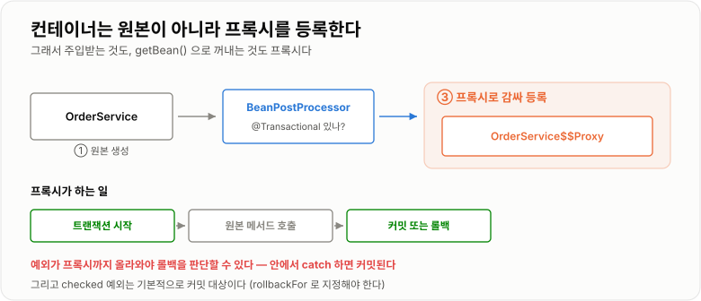
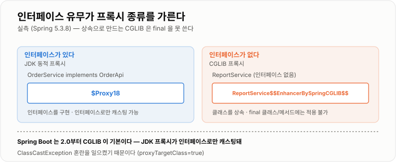
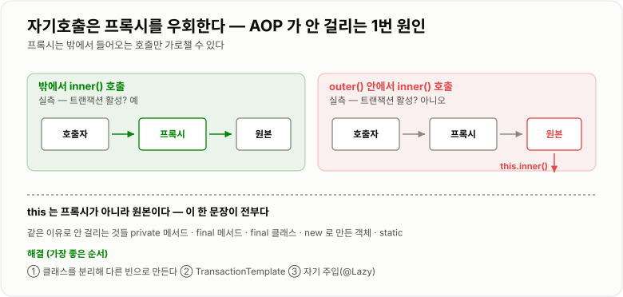

# AOP · Proxy와 Transactional

> **`@Transactional`은 마법이 아니라 프록시다. Spring이 원본 빈을 대신할 가짜 객체를 만들어 컨테이너에 넣어 두고, 그 가짜가 "트랜잭션 시작 → 원본 호출 → 커밋/롤백"을 해 준다. 이 구조를 알면 "왜 안 걸리는지"가 전부 설명된다.**

---

## 1. 핵심 요약

**`@Transactional`이 동작하지 않는 사고는 거의 전부 "프록시를 거치지 않았다"는 한 가지 원인에서 나온다. 자기 자신을 호출했거나, `new`로 만든 객체이거나, `private` 메서드이거나 — 전부 같은 이야기다.**

### 한눈에 보기

* **AOP는 "여러 곳에 흩어지는 공통 관심사(트랜잭션·로깅·보안)를 한곳에 모으는" 기법**이고, Spring은 이것을 **프록시**로 구현한다.
* 컨테이너는 `@Transactional`이 붙은 빈을 **원본이 아니라 프록시로 바꿔서** 등록한다. 주입받는 것은 프록시다.
* **인터페이스가 있으면 JDK 동적 프록시, 없으면 CGLIB** 프록시가 만들어진다(실측 `$Proxy18` vs `$$EnhancerBySpringCGLIB$$`).
* **자기 자신을 호출하면 AOP가 걸리지 않는다.** 실측에서 밖에서 `inner()`를 부르면 트랜잭션이 **활성**이었지만, `outer()` 안에서 `inner()`를 부르면 **비활성**이었다.
* 원인은 단순하다. **`this.inner()`는 프록시가 아니라 원본 객체를 직접 부르기 때문**이다.
* **`@Transactional`은 기본적으로 `RuntimeException`과 `Error`에만 롤백한다.** Checked 예외는 **커밋된다.**
* **예외를 `catch`해서 삼키면 롤백되지 않는다.** 프록시는 예외가 밖으로 나와야 롤백 여부를 판단한다.
* `private`·`final` 메서드, `final` 클래스에는 AOP가 걸리지 않는다. **프록시가 재정의할 수 없기 때문**이다.
* 프록시 호출 비용은 실측 **16.8배**지만 절대값은 호출당 약 **31 ns**라 실무에서 무시할 수준이다.
* 전파 속성 중 실무에서 쓰는 것은 사실상 **`REQUIRED`(기본)** 와 **`REQUIRES_NEW`** 둘뿐이다.

> 이 노트의 동작 확인은 **Spring Framework 5.3.8 + JDK 17.0.12**에서 `AnnotationConfigApplicationContext`에 `@EnableTransactionManagement`를 켜고 직접 실행한 결과다.

### 무엇을 해결하는가

#### AOP가 없을 때

트랜잭션을 직접 다루면 모든 서비스 메서드가 이렇게 된다.

```java
public void placeOrder(Order order) {
    Connection conn = null;
    try {
        conn = dataSource.getConnection();
        conn.setAutoCommit(false);          // 트랜잭션 시작

        orderRepository.save(conn, order);
        stockRepository.decrease(conn, order.getProductId());

        conn.commit();                      // 커밋
    } catch (Exception e) {
        if (conn != null) {
            try { conn.rollback(); } catch (SQLException ignored) { }
        }
        throw new RuntimeException(e);
    } finally {
        if (conn != null) {
            try { conn.close(); } catch (SQLException ignored) { }
        }
    }
}
```

**진짜 비즈니스 로직은 가운데 두 줄뿐인데 나머지 전부가 트랜잭션 처리다.**

```text
문제 1  같은 코드가 서비스 메서드마다 반복된다
문제 2  비즈니스 로직이 기술 코드에 묻혀 안 읽힌다
문제 3  실수하기 쉽다 — rollback 을 빠뜨리거나 close 를 놓친다
문제 4  Connection 을 메서드마다 넘겨야 해서 시그니처가 오염된다
문제 5  트랜잭션 정책을 바꾸려면 모든 메서드를 고쳐야 한다
```

이런 **"여러 곳에 흩어지지만 본질이 같은 관심사"** 를 횡단 관심사(cross-cutting concern)라 한다. 트랜잭션 말고도 로깅, 성능 측정, 보안 검사, 캐싱이 전부 여기 해당한다.

#### AOP로 걷어내면

```java
@Transactional
public void placeOrder(Order order) {
    orderRepository.save(order);
    stockRepository.decrease(order.getProductId());
}
```

```text
비즈니스 로직만 남았다.
트랜잭션 시작·커밋·롤백·자원 정리는 전부 프록시가 한다.

  대가: "프록시를 거쳐야만 동작한다"는 제약이 생긴다
        → 이 제약을 모르면 하루종일 원인을 못 찾는다
```

---

## 2. 동작 원리

### 핵심 구성 요소

| 개념                    | 한 문장 정의                              | 왜 중요한가                         |
| --------------------- | ------------------------------------ | ------------------------------ |
| **횡단 관심사**            | 여러 클래스에 흩어지지만 본질이 같은 기능              | AOP가 존재하는 이유                   |
| **Aspect**            | 횡단 관심사를 모아 놓은 모듈                     | "무엇을 언제 끼울지"의 묶음               |
| **Advice**            | 실제로 끼워 넣을 동작 (`Before`·`Around` 등)   | 트랜잭션은 `Around` advice다         |
| **Pointcut**          | 어디에 끼울지 고르는 조건                       | `@Transactional`이 붙은 메서드 등     |
| **Join Point**        | 끼워 넣을 수 있는 지점                        | Spring AOP에서는 **메서드 실행만** 가능   |
| **프록시**               | 원본을 대신하는 가짜 객체                       | **Spring AOP의 전부**             |
| **JDK 동적 프록시**        | 인터페이스를 구현한 프록시                       | 인터페이스가 있을 때 기본                 |
| **CGLIB 프록시**         | 클래스를 상속한 프록시                         | 인터페이스가 없을 때                    |
| **`@Transactional`**  | 메서드를 트랜잭션으로 감싸는 표시                   | 가장 많이 쓰는 AOP                   |
| **전파(propagation)**   | 이미 트랜잭션이 있을 때 어떻게 할지                 | `REQUIRED`(기본) / `REQUIRES_NEW` |
| **자기호출**              | 같은 객체의 다른 메서드를 `this`로 부르는 것         | **AOP가 안 걸리는 1번 원인**           |

### 내부 동작 과정

#### 프록시가 만들어지는 시점과 모습

```text
① 컨테이너가 OrderService 인스턴스를 만든다      (원본)
② BeanPostProcessor 가 "이 빈에 @Transactional 이 있네?" 판단
③ 원본을 감싸는 프록시 객체를 만든다
④ 컨테이너에는 원본이 아니라 프록시를 등록한다

  → 다른 빈이 주입받는 것도, getBean() 으로 꺼내는 것도 전부 프록시다
```



*주입받은 것은 원본이 아니라 프록시다 — 이 사실이 모든 동작과 함정의 출발점이다.*

**프록시가 하는 일**

```java
// 프록시의 내부 동작을 코드로 옮기면
public void placeOrder(Order order) {
    TransactionStatus tx = txManager.getTransaction(definition);   // 시작
    try {
        target.placeOrder(order);                                  // 원본 호출
        txManager.commit(tx);                                      // 커밋
    } catch (RuntimeException | Error e) {
        txManager.rollback(tx);                                    // 롤백
        throw e;
    } catch (Exception e) {
        txManager.commit(tx);       // checked 예외는 커밋한다!
        throw e;
    }
}
```

**여기에 두 가지 중요한 사실이 이미 다 들어 있다.**

```text
① 예외가 프록시까지 올라와야 롤백을 판단할 수 있다
   → 안에서 catch 하면 프록시는 성공한 줄 알고 커밋한다

② catch 블록이 RuntimeException/Error 와 Exception 으로 나뉘어 있다
   → checked 예외는 기본적으로 커밋된다
```

#### 두 가지 프록시

**실측 결과**

```text
OrderService (인터페이스 OrderApi 구현)
    JDK 동적 프록시? true
    CGLIB 프록시?   false
    실제 클래스: $Proxy18

ReportService (인터페이스 없음)
    CGLIB 프록시? true
    실제 클래스: ReportService$$EnhancerBySpringCGLIB$$30f407ab
```



*JDK 프록시는 인터페이스를 구현하고, CGLIB 프록시는 클래스를 상속한다 — 상속이라는 점이 제약을 만든다.*

| 항목            | JDK 동적 프록시                | CGLIB 프록시                     |
| ------------- | ------------------------- | ----------------------------- |
| **방식**        | 인터페이스를 구현한 새 클래스를 만든다     | **대상 클래스를 상속**한다              |
| **조건**        | 인터페이스가 있어야 한다             | 아무 클래스나 가능                    |
| **캐스팅**       | **인터페이스로만** 가능            | 구체 클래스로 가능                    |
| **못 하는 것**    | 인터페이스에 없는 메서드는 프록시 안 됨    | **`final` 클래스·`final` 메서드 불가** |
| **기본값**       | Spring Framework 기본       | **Spring Boot 기본**            |

> Spring Boot는 **2.0부터 CGLIB를 기본**으로 쓴다. 인터페이스로만 캐스팅되는 JDK 프록시 때문에 생기는 혼란(`ClassCastException`)을 줄이기 위해서다.

#### 자기호출 — AOP가 안 걸리는 1번 원인

**실측으로 확인한 결과**

```java
@Service
public class OrderService implements OrderApi {

    public void outer() {
        // 트랜잭션 활성? 아니오
        inner();              // 자기 자신 호출
    }

    @Transactional
    public void inner() {
        // 여기 트랜잭션이 걸릴까?
    }
}
```

```text
[A] 밖에서 order.inner() 를 직접 호출
      inner  트랜잭션 활성? 예          ← 프록시를 거쳤다

[B] order.outer() 를 호출 → 안에서 inner() 호출
      outer  트랜잭션 활성? 아니오       ← outer 에는 @Transactional 이 없으니 당연
      inner  트랜잭션 활성? 아니오       ← @Transactional 이 붙어 있는데도 안 걸렸다!
```



*프록시는 밖에서 들어오는 호출만 가로챌 수 있다 — 객체 안에서 안으로 가는 화살표는 프록시를 지나지 않는다.*

**왜 이렇게 되는가**

```text
외부 호출
    호출자 → [프록시] → 원본.inner()
             ↑ 여기서 트랜잭션을 연다

자기호출
    호출자 → [프록시] → 원본.outer()
                          ↓
                       this.inner()      ← this 는 원본이다!
                          ↓
                       프록시를 거치지 않았으므로 아무 일도 안 일어난다
```

**`this`가 프록시가 아니라 원본이라는 것** — 이 한 문장이 전부다.

#### AOP가 안 걸리는 나머지 경우들

전부 "프록시가 그 메서드를 가로챌 수 없다"는 같은 이유다.

```text
① 자기호출 (this.method())          → 프록시를 안 거친다
② private 메서드                    → 프록시가 재정의할 수 없다
③ final 메서드 / final 클래스        → CGLIB이 상속·재정의할 수 없다
④ new 로 만든 객체                   → 애초에 빈이 아니라 프록시가 없다
⑤ static 메서드                     → 오버라이딩 대상이 아니다
⑥ 같은 클래스의 @Transactional 끼리     → ①과 같은 문제
```

**해결 방법**

```text
가장 좋은 방법: 클래스를 분리한다
    outer 와 inner 를 다른 빈으로 나누면 프록시를 거치게 된다
    대개 책임이 섞여 있다는 신호이기도 하다

차선: 자기 자신을 주입받는다 (@Lazy 필요)
    순환 참조가 되므로 @Lazy 를 붙여야 한다. 읽기 나쁘다.

권하지 않음: AopContext.currentProxy()
    exposeProxy = true 설정이 필요하고 코드가 프레임워크에 묶인다
```

#### 롤백 규칙

**기본 규칙은 직관과 다르다.**

```text
RuntimeException, Error   →  롤백
Checked Exception         →  커밋!
```

```java
@Transactional
public void process() throws IOException {
    orderRepository.save(order);
    throw new IOException("파일 실패");     // 저장이 커밋된다!
}
```

**왜 이런 기본값인가**

```text
설계 의도: checked 예외는 "예상하고 선언한, 처리 가능한 상황"이므로
          호출자가 알아서 처리할 것이라고 본 것이다

  하지만 실무 감각과 어긋나서 사고가 자주 난다
  → rollbackFor = Exception.class 를 명시하거나
  → 애초에 unchecked 예외를 쓴다 (더 흔한 선택)
```

```java
@Transactional(rollbackFor = Exception.class)
public void process() throws IOException { ... }
```

#### 전파 속성

이미 트랜잭션이 진행 중일 때 어떻게 할지 정한다.

| 속성                | 트랜잭션이 없으면 | 이미 있으면          | 실무 용도                     |
| ----------------- | --------- | --------------- | ------------------------- |
| **`REQUIRED`**    | 새로 시작     | **참여**(합류)      | **기본값. 99%가 이것**          |
| **`REQUIRES_NEW`** | 새로 시작     | **잠시 멈추고 새로 시작** | 실패해도 남겨야 하는 로그·이력         |
| `SUPPORTS`        | 없이 실행     | 참여              | 드물다                       |
| `NOT_SUPPORTED`   | 없이 실행     | 잠시 멈춤           | 긴 조회를 트랜잭션 밖으로 뺄 때        |
| `MANDATORY`       | **예외**    | 참여              | 반드시 트랜잭션 안에서만 부르게 강제      |
| `NEVER`           | 없이 실행     | **예외**          | 드물다                       |
| `NESTED`          | 새로 시작     | 세이브포인트 생성       | JDBC만 지원, JPA에서는 잘 안 쓴다   |

**`REQUIRED`의 중요한 성질**

```text
A(@Transactional) → B(@Transactional) 를 호출하면
  B 는 새 트랜잭션이 아니라 A 의 트랜잭션에 "참여"한다
  → 물리적으로 커넥션도 트랜잭션도 하나다

  그래서 B 안에서 예외가 나 롤백 표시가 되면
  A 가 그 예외를 catch 해도 전체가 롤백된다
  → UnexpectedRollbackException: Transaction rolled back because
     it has been marked as rollback-only
```

이것이 **"예외를 잡았는데도 롤백되는"** 두 번째로 흔한 사고다. 앞의 것(잡아서 커밋됨)과 방향이 정반대라 헷갈린다.

```text
정리
  같은 트랜잭션 안(REQUIRED)에서 안쪽이 실패 → 밖에서 잡아도 전체 롤백
  트랜잭션 경계 자체에서 예외를 잡음        → 롤백 안 되고 커밋
```

---

## 3. 특징과 비교

| 구분          | 내용                                       |
| ----------- | ---------------------------------------- |
| **장점**      | 트랜잭션·로깅·보안 코드를 비즈니스 로직에서 완전히 걷어내 **본문이 두세 줄로 줄고**, 정책을 애너테이션 한 줄로 바꿀 수 있다. 원본 코드를 전혀 수정하지 않고 기능을 덧붙인다(OCP). |
| **단점**      | **프록시를 거치지 않으면 조용히 동작하지 않는다.** 자기호출·`private`·`new` 객체에서 아무 경고 없이 무시된다. 코드만 봐서는 무엇이 끼어드는지 알 수 없고 디버깅 스택이 깊어진다. |
| **적합한 상황**  | 트랜잭션 경계, 실행 시간 측정, 권한 검사, 캐싱, 재시도 — **여러 곳에서 똑같이 반복되는 기술적 관심사**. |
| **주의할 상황**  | **같은 클래스 안에서 트랜잭션 메서드를 부르는 것**, checked 예외에 롤백을 기대하는 것, 트랜잭션 안에서 외부 API를 호출하는 것. |

### 성능 특성

| 항목                | 비용                                    |
| ----------------- | ------------------------------------- |
| 프록시 생성            | 기동 시점에 한 번. 빈 개수만큼                    |
| **프록시 경유 호출**     | 실측 **16.8배** (1,000만 회 19.9 ms → 333.9 ms) |
| **호출당 절대 비용**     | **약 31 ns**                           |
| 트랜잭션 시작·커밋        | 커넥션 획득 + `setAutoCommit(false)` + 커밋 왕복 |

**16.8배라는 숫자를 오해하면 안 된다.**

```text
16.8배는 "메서드가 거의 아무것도 안 할 때"의 비율이다.

  호출당 31 ns
  DB 조회 한 번   약 1 ms = 1,000,000 ns

  → 프록시 비용은 DB 한 번 가는 비용의 0.003%
  → 성능 때문에 AOP를 피할 일은 없다
```

**정작 비싼 것은 프록시가 아니라 트랜잭션 자체다.**

```text
트랜잭션을 여는 순간
  · 커넥션을 풀에서 빌린다 → 반납할 때까지 다른 요청이 못 쓴다
  · 커밋 시점까지 락과 언두 로그를 붙잡는다

  → 트랜잭션 범위를 좁게 유지하는 것이 성능의 핵심이다
  → 프록시 오버헤드는 여기 비하면 아무것도 아니다
```

### 장점과 단점

| 장점                   | 이유                                  |
| -------------------- | ----------------------------------- |
| 비즈니스 로직만 남는다         | 20줄짜리 메서드가 2줄이 된다.                  |
| 정책을 한 줄로 바꾼다         | `readOnly`, 전파, 격리 수준을 애너테이션으로 조정.  |
| 원본을 수정하지 않는다         | OCP를 지키면서 기능을 덧붙인다.                 |
| 실수를 원천 차단한다          | `rollback`·`close` 누락이 불가능하다.       |
| 어디에 적용할지 일괄 지정 가능    | 포인트컷으로 "서비스 패키지 전체" 같은 지정이 된다.      |

| 단점                        | 이유 및 주의점                                    |
| ------------------------- | ------------------------------------------- |
| **자기호출에서 조용히 무시된다**       | 경고도 예외도 없다. 실측에서 트랜잭션이 비활성이었다.              |
| **checked 예외는 롤백되지 않는다**  | 직관과 반대다. `rollbackFor`를 명시해야 한다.            |
| **예외를 잡으면 롤백되지 않는다**      | 프록시까지 예외가 올라와야 판단할 수 있다.                    |
| 반대로 안쪽 실패는 밖에서 잡아도 롤백된다   | `REQUIRED` 참여 시 `UnexpectedRollbackException`. |
| `private`·`final`에 안 걸린다  | 프록시가 재정의할 수 없다.                             |
| 코드만 봐서는 무엇이 끼는지 모른다       | 애너테이션 하나 뒤에 트랜잭션 관리 전체가 숨어 있다.              |
| 스택트레이스가 깊어진다              | 프록시·인터셉터 프레임이 잔뜩 낀다.                        |

### 어떤 상황에서 고르는가

#### 트랜잭션 경계를 어디에 둘까

```text
Controller   ✗  트랜잭션을 걸지 않는다 (뷰 렌더링까지 붙잡게 된다)
Service      ✓  여기가 표준. 하나의 업무 단위와 일치한다
Repository   ✗  메서드 하나하나가 트랜잭션이 되면 묶을 수가 없다
```

#### `REQUIRES_NEW`를 언제 쓰는가

```text
"본 작업이 실패해도 이건 남아야 한다"

  · 실패 이력 로그
  · 감사(audit) 기록
  · 외부 요청 기록

  주의: 커넥션을 하나 더 쓴다
        본 트랜잭션이 커넥션을 쥔 채 새로 빌리므로,
        풀 크기가 작으면 자기 자신을 기다리는 데드락이 생긴다
```

#### 트랜잭션 안에 넣지 말아야 할 것

```text
✗ 외부 API 호출        롤백이 안 걸리고 커넥션만 오래 잡는다
✗ 파일 쓰기            같은 이유
✗ 메일·알림 발송        롤백돼도 이미 나갔다
✗ 대용량 조회·집계       커넥션과 언두를 오래 붙잡는다
✗ Thread.sleep         말할 것도 없다

  → 트랜잭션 커밋 후에 실행되게 뺀다
     @TransactionalEventListener(phase = AFTER_COMMIT)
```

### 비슷한 기술과 비교

#### JDK 동적 프록시 vs CGLIB

| 기준           | JDK 동적 프록시           | CGLIB                    |
| ------------ | -------------------- | ------------------------ |
| **동작 방식**    | 인터페이스를 구현한 클래스 생성    | **대상 클래스를 상속**           |
| **필요 조건**    | 인터페이스 필수             | 없음 (기본 생성자 권장)           |
| **`final`**  | 상관없다                 | **`final` 클래스·메서드 불가**   |
| **캐스팅**      | 인터페이스로만              | 구체 클래스로 가능               |
| **장점**       | JDK 표준, 가볍다          | 인터페이스 없이도 된다             |
| **단점**       | 인터페이스가 없으면 못 쓴다      | 상속 제약, 생성자가 두 번 호출될 수 있음 |
| **선택 기준**    | Spring Framework 기본  | **Spring Boot 기본**       |

#### 선언적 트랜잭션 vs 프로그래밍 방식

| 기준        | `@Transactional`   | `TransactionTemplate`       |
| --------- | ------------------ | --------------------------- |
| **동작 방식** | 프록시가 메서드 전체를 감싼다   | 코드에서 직접 범위를 지정한다            |
| **범위**    | 메서드 단위 (전부 아니면 전무) | **원하는 블록만**                 |
| **장점**    | 코드가 깨끗하다           | **자기호출 문제가 없다.** 범위를 좁힐 수 있다 |
| **단점**    | 자기호출·롤백 규칙 함정      | 코드가 지저분해진다                  |
| **선택 기준** | **기본**             | 트랜잭션 범위를 정밀하게 좁혀야 할 때       |

```java
// 자기호출 문제를 피하는 실용적인 방법이기도 하다
transactionTemplate.execute(status -> {
    orderRepository.save(order);
    return null;
});
```

#### Spring AOP vs AspectJ

| 기준         | Spring AOP        | AspectJ                    |
| ---------- | ----------------- | -------------------------- |
| **동작 방식**  | 실행 시점 프록시         | 컴파일·로드 시점 **바이트코드 조작**     |
| **적용 대상**  | **스프링 빈의 메서드만**   | 모든 객체, 필드 접근, 생성자까지        |
| **자기호출**   | **안 걸린다**         | **걸린다**                    |
| **설정**     | 별도 설정 없음          | 위빙 설정 필요                   |
| **성능**     | 호출당 약 31 ns       | 거의 0 (코드에 직접 박힌다)          |
| **선택 기준**  | **거의 모든 경우**      | 자기호출까지 잡아야 하는 특수한 요구       |

---

## 4. 실무 주의사항

### 백엔드 실무 적용

#### 자기호출 사고의 실제 모습

```java
// 실제로 자주 보는 형태 — 동작하지 않는다
@Service
public class OrderService {

    public void placeAll(List<Order> orders) {
        for (Order order : orders) {
            placeOne(order);          // 자기호출! 트랜잭션이 안 걸린다
        }
    }

    @Transactional
    public void placeOne(Order order) {
        orderRepository.save(order);
        stockRepository.decrease(order.getProductId());
    }
}
```

```text
의도: 주문 하나씩 독립적으로 트랜잭션 처리, 하나 실패해도 나머지는 진행
실제: 트랜잭션이 아예 없다. 중간에 실패하면 앞의 것도 롤백 안 되고
      뒤의 것도 안 되는 어중간한 상태가 된다
```

**해결 — 클래스를 나눈다**

```java
@Service
public class OrderService {

    private final OrderProcessor processor;   // 다른 빈을 주입받는다

    public OrderService(OrderProcessor processor) {
        this.processor = processor;
    }

    public void placeAll(List<Order> orders) {
        for (Order order : orders) {
            processor.placeOne(order);        // 프록시를 거친다
        }
    }
}
```

```java
@Component
public class OrderProcessor {

    private final OrderRepository orderRepository;
    private final StockRepository stockRepository;

    public OrderProcessor(OrderRepository orderRepository, StockRepository stockRepository) {
        this.orderRepository = orderRepository;
        this.stockRepository = stockRepository;
    }

    @Transactional
    public void placeOne(Order order) {
        orderRepository.save(order);
        stockRepository.decrease(order.getProductId());
    }
}
```

#### 예외를 잡으면 롤백이 안 된다

```java
// 롤백되지 않는다
@Transactional
public void placeOrder(Order order) {
    orderRepository.save(order);
    try {
        paymentService.pay(order);
    } catch (Exception e) {
        log.error("결제 실패", e);       // 예외가 프록시까지 안 올라간다
    }
    // → 프록시는 성공한 줄 알고 커밋한다. 결제 안 된 주문이 남는다.
}
```

```java
// 방법 1 — 다시 던진다 (가장 명확하다)
@Transactional
public void placeOrder(Order order) {
    orderRepository.save(order);
    try {
        paymentService.pay(order);
    } catch (PaymentException e) {
        log.error("결제 실패: orderId={}", order.getId(), e);
        throw e;                       // 프록시가 롤백을 판단할 수 있게 한다
    }
}
```

```java
// 방법 2 — 롤백만 표시하고 흐름은 계속한다
@Transactional
public void placeOrder(Order order) {
    orderRepository.save(order);
    try {
        paymentService.pay(order);
    } catch (PaymentException e) {
        log.error("결제 실패", e);
        TransactionAspectSupport.currentTransactionStatus().setRollbackOnly();
    }
}
```

#### 외부 호출을 트랜잭션 밖으로 빼기

```java
// 나쁜 예 — 외부 API가 느리면 커넥션을 그동안 붙잡는다
@Transactional
public void placeOrder(Order order) {
    orderRepository.save(order);
    mailClient.send(order.getUserEmail());   // 3초 걸리면 3초 동안 커넥션 점유
}
```

```java
// 좋은 예 — 커밋 후에 실행한다
@Service
public class OrderService {

    private final ApplicationEventPublisher publisher;
    private final OrderRepository orderRepository;

    public OrderService(ApplicationEventPublisher publisher, OrderRepository orderRepository) {
        this.publisher = publisher;
        this.orderRepository = orderRepository;
    }

    @Transactional
    public void placeOrder(Order order) {
        orderRepository.save(order);
        publisher.publishEvent(new OrderPlacedEvent(order.getId(), order.getUserEmail()));
    }
}
```

```java
@Component
public class OrderPlacedListener {

    private final MailClient mailClient;

    public OrderPlacedListener(MailClient mailClient) {
        this.mailClient = mailClient;
    }

    /** 커밋이 끝난 뒤에 호출된다 — 롤백되면 아예 호출되지 않는다. */
    @TransactionalEventListener(phase = TransactionPhase.AFTER_COMMIT)
    public void sendMail(OrderPlacedEvent event) {
        mailClient.send(event.getEmail());
    }
}
```

**이 패턴의 핵심 이득**

```text
① 트랜잭션이 DB 작업만 감싸므로 커넥션 점유 시간이 짧아진다
② 롤백되면 메일이 아예 안 나간다 (커밋 후에만 실행되므로)
③ 메일 실패가 주문 롤백으로 번지지 않는다
```

#### `readOnly = true`를 습관으로

```java
@Service
@Transactional(readOnly = true)          // 클래스 기본값을 읽기 전용으로
public class OrderQueryService {

    public Order findById(long id) { ... }        // readOnly

    @Transactional                                 // 쓰기 메서드만 재정의
    public void updateMemo(long id, String memo) { ... }
}
```

```text
readOnly = true 의 이득
  · JPA 가 변경 감지(dirty checking) 스냅숏을 만들지 않아 메모리·CPU 절약
  · flush 를 건너뛴다
  · DB·드라이버에 따라 읽기 전용 최적화나 읽기 복제본 라우팅에 쓰인다
  · 실수로 쓰기가 들어가면 드러난다
```

#### 직접 만드는 AOP — 실행 시간 로깅

```java
@Aspect
@Component
public class ExecutionTimeAspect {

    private static final Logger log = LoggerFactory.getLogger(ExecutionTimeAspect.class);
    private static final long SLOW_THRESHOLD_MS = 500;

    @Around("@annotation(org.springframework.transaction.annotation.Transactional)")
    public Object measure(ProceedingJoinPoint joinPoint) throws Throwable {
        long start = System.nanoTime();
        try {
            return joinPoint.proceed();
        } finally {
            long elapsedMs = (System.nanoTime() - start) / 1_000_000;
            if (elapsedMs >= SLOW_THRESHOLD_MS) {
                log.warn("느린 트랜잭션 {} ms — {}", elapsedMs, joinPoint.getSignature());
            }
        }
    }
}
```

`finally`에 두었기 때문에 예외가 나도 측정된다. **다만 `finally`에서 `return`하거나 예외를 던지지 않는다** — 원본 예외가 삼켜진다.

### 자주 하는 오해

| 잘못된 이해                            | 올바른 이해                                                          |
| --------------------------------- | --------------------------------------------------------------- |
| `@Transactional`은 메서드에 직접 코드를 넣는다  | **프록시가 감싸는 것**이다. 그래서 프록시를 안 거치면 아무 일도 안 일어난다.                  |
| 같은 클래스 안에서 불러도 트랜잭션이 걸린다          | **안 걸린다.** 실측에서 밖에서 부르면 "활성", 자기호출이면 "비활성"이었다. `this`가 원본이기 때문. |
| 예외가 나면 무조건 롤백된다                   | **checked 예외는 커밋된다.** `rollbackFor = Exception.class`가 필요하다.    |
| 예외를 `catch`해도 롤백은 된다              | **안 된다.** 프록시까지 예외가 올라와야 판단한다. 다시 던지거나 `setRollbackOnly()`를 쓴다. |
| 예외를 잡았으면 절대 롤백되지 않는다              | 반대 경우도 있다. `REQUIRED`로 참여한 안쪽이 롤백 표시하면 **밖에서 잡아도 전체가 롤백**된다.    |
| `private` 메서드에도 `@Transactional`이 걸린다 | **안 걸린다.** 프록시가 재정의할 수 없다. `final`도 마찬가지다.                      |
| 프록시 때문에 성능이 크게 나빠진다               | 호출당 약 **31 ns**다(실측). 정작 비싼 것은 **트랜잭션이 커넥션을 붙잡는 시간**이다.         |
| `REQUIRES_NEW`를 쓰면 항상 안전하다        | 커넥션을 **하나 더** 쓴다. 풀이 작으면 자기 자신을 기다리는 데드락이 난다.                   |
| Spring AOP로 필드 접근도 가로챌 수 있다       | **메서드 실행만** 가능하다. 필드·생성자까지 하려면 AspectJ가 필요하다.                   |
| 인터페이스가 있으면 항상 JDK 프록시다            | Spring Boot는 **2.0부터 CGLIB이 기본**이다(`proxyTargetClass=true`).     |

---

## 5. 예제

### 프록시 동작을 눈으로 확인하는 코드

```java
@Service
public class ProxyInspector {

    private final OrderService orderService;

    public ProxyInspector(OrderService orderService) {
        this.orderService = orderService;
    }

    public void inspect() {
        System.out.println("주입받은 클래스: " + orderService.getClass().getName());
        System.out.println("AOP 프록시?    " + AopUtils.isAopProxy(orderService));
        System.out.println("JDK 동적 프록시? " + AopUtils.isJdkDynamicProxy(orderService));
        System.out.println("CGLIB 프록시?   " + AopUtils.isCglibProxy(orderService));
    }
}
```

```text
실측 출력 (Spring 5.3.8)

  인터페이스가 있는 빈
    주입받은 클래스: $Proxy18
    JDK 동적 프록시? true

  인터페이스가 없는 빈
    주입받은 클래스: ReportService$$EnhancerBySpringCGLIB$$30f407ab
    CGLIB 프록시?   true
```

### 트랜잭션이 실제로 걸렸는지 확인하는 방법

```java
@Service
public class TransactionChecker {

    public void printStatus(String where) {
        boolean active = TransactionSynchronizationManager.isActualTransactionActive();
        String name = TransactionSynchronizationManager.getCurrentTransactionName();
        boolean readOnly = TransactionSynchronizationManager.isCurrentTransactionReadOnly();

        System.out.printf("%s  활성=%s  이름=%s  읽기전용=%s%n",
                where, active, name, readOnly);
    }
}
```

**디버깅할 때 이것보다 확실한 방법이 없다.** "트랜잭션이 안 걸리는 것 같다"는 의심이 들면 이 한 줄로 끝난다.

### 자기호출 문제 재현과 해결

```java
// 문제 — 하나의 클래스에 다 넣었다
@Service
public class BatchService {

    @Transactional
    public void processAll(List<Item> items) {
        for (Item item : items) {
            processOne(item);        // 자기호출 — REQUIRES_NEW 가 무시된다
        }
    }

    @Transactional(propagation = Propagation.REQUIRES_NEW)
    public void processOne(Item item) {
        itemRepository.save(item);
    }
}
```

```text
의도: 항목 하나가 실패해도 나머지는 커밋되게 하고 싶다
실제: 자기호출이라 REQUIRES_NEW 가 무시되고 전부 하나의 트랜잭션이 된다
      → 하나 실패하면 전부 롤백된다
```

```java
// 해결 — 별도 빈으로 분리한다
@Service
public class BatchService {

    private final ItemProcessor processor;

    public BatchService(ItemProcessor processor) {
        this.processor = processor;
    }

    /** 전체를 감싸는 트랜잭션은 두지 않는다. */
    public BatchResult processAll(List<Item> items) {
        int success = 0;
        List<Long> failedIds = new ArrayList<Long>();

        for (Item item : items) {
            try {
                processor.processOne(item);     // 프록시 경유 — 항목마다 독립 트랜잭션
                success++;
            } catch (Exception e) {
                log.warn("항목 처리 실패: id={}", item.getId(), e);
                failedIds.add(item.getId());
            }
        }
        return new BatchResult(success, failedIds);
    }
}
```

```java
@Component
public class ItemProcessor {

    private final ItemRepository itemRepository;

    public ItemProcessor(ItemRepository itemRepository) {
        this.itemRepository = itemRepository;
    }

    @Transactional
    public void processOne(Item item) {
        itemRepository.save(item);
    }
}
```

### 실패해도 남겨야 하는 이력 — `REQUIRES_NEW`

```java
@Service
public class PaymentService {

    private final PaymentHistoryWriter historyWriter;
    private final PaymentRepository paymentRepository;

    public PaymentService(PaymentHistoryWriter historyWriter,
                          PaymentRepository paymentRepository) {
        this.historyWriter = historyWriter;
        this.paymentRepository = paymentRepository;
    }

    @Transactional
    public void pay(PaymentRequest request) {
        historyWriter.writeAttempt(request);      // 별도 트랜잭션으로 즉시 커밋

        Payment payment = paymentRepository.save(Payment.from(request));
        if (payment.getAmount() <= 0) {
            throw new IllegalArgumentException("결제 금액 오류");
            // 이 롤백이 시도 이력에는 영향을 주지 않는다
        }
    }
}
```

```java
@Component
public class PaymentHistoryWriter {

    private final PaymentHistoryRepository repository;

    public PaymentHistoryWriter(PaymentHistoryRepository repository) {
        this.repository = repository;
    }

    /** 바깥 트랜잭션이 롤백돼도 이 기록은 남는다. */
    @Transactional(propagation = Propagation.REQUIRES_NEW)
    public void writeAttempt(PaymentRequest request) {
        repository.save(PaymentHistory.attempt(request));
    }
}
```

```text
주의: 이 시점에 커넥션을 두 개 쓴다
      바깥 트랜잭션이 하나를 쥔 채로 새 커넥션을 빌리기 때문이다

  풀 크기가 작으면 → 바깥이 안쪽을 기다리고
                     안쪽은 커넥션을 못 받아 기다리는 데드락
  → 커넥션 풀 크기를 정할 때 이 중첩을 계산에 넣어야 한다
```

---

## 6. 면접 정리

### 자주 나오는 질문

#### 기본 질문

1. **AOP가 무엇인가요?**

    * 핵심 키워드: 여러 곳에 흩어지는 **횡단 관심사**를 한곳에 모으는 기법, 트랜잭션·로깅·보안

2. **Spring AOP는 어떻게 구현되어 있나요?**

    * 핵심 키워드: **프록시**, 컨테이너가 원본 대신 프록시를 등록, 주입받는 것도 프록시

3. **`@Transactional`은 내부적으로 어떻게 동작하나요?**

    * 핵심 키워드: 프록시가 **트랜잭션 시작 → 원본 호출 → 커밋/롤백**을 감싼다

4. **JDK 동적 프록시와 CGLIB의 차이는 무엇인가요?**

    * 핵심 키워드: 인터페이스 구현 vs **클래스 상속**, `final` 제약, 실측 `$Proxy18` vs `$$EnhancerBySpringCGLIB$$`

5. **같은 클래스 안에서 `@Transactional` 메서드를 부르면 어떻게 되나요?**

    * 핵심 키워드: **안 걸린다.** 실측에서 외부 호출은 "활성", 자기호출은 "비활성". `this`가 원본이기 때문

6. **`@Transactional`은 어떤 예외에 롤백하나요?**

    * 핵심 키워드: **`RuntimeException`·`Error`만.** checked 예외는 **커밋**, `rollbackFor`로 지정

7. **전파 속성에는 무엇이 있나요?**

    * 핵심 키워드: `REQUIRED`(기본, 참여)·`REQUIRES_NEW`(새로), 실무는 사실상 이 둘

8. **트랜잭션 경계는 어느 계층에 두나요?**

    * 핵심 키워드: **Service**, Controller는 뷰까지 붙잡고 Repository는 묶을 수 없음

#### 꼬리 질문

1. **자기호출에서 왜 AOP가 안 걸리는지 설명해 주세요.**

    * 핵심 키워드: **`this`는 프록시가 아니라 원본**, 프록시는 외부 진입만 가로챔

2. **자기호출 문제를 어떻게 해결하시겠어요?**

    * 핵심 키워드: **클래스 분리(최선)**, `TransactionTemplate`, 자기 주입 `@Lazy`, `AopContext`(권장 안 함)

3. **AOP가 안 걸리는 다른 경우도 있나요?**

    * 핵심 키워드: `private`·`final` 메서드, `final` 클래스, **`new`로 만든 객체**, `static` — 전부 "프록시가 못 가로챈다"

4. **예외를 `catch`하면 롤백되나요?**

    * 핵심 키워드: **안 된다.** 프록시까지 올라와야 판단. 다시 던지거나 `setRollbackOnly()`

5. **그런데 예외를 잡았는데 `UnexpectedRollbackException`이 났습니다. 왜죠?**

    * 핵심 키워드: `REQUIRED`로 **참여한 안쪽이 rollback-only 표시**, 물리적으로 같은 트랜잭션이라 전체 롤백

6. **checked 예외가 기본 롤백 대상이 아닌 이유는 무엇일까요?**

    * 핵심 키워드: "예상하고 선언한 처리 가능한 상황"으로 본 설계 의도, 실무 감각과 어긋나 사고 유발

7. **`REQUIRES_NEW`를 쓸 때 주의할 점은 무엇인가요?**

    * 핵심 키워드: **커넥션을 하나 더 쓴다**, 풀이 작으면 자기 자신을 기다리는 데드락

8. **프록시 때문에 성능이 나빠지지 않나요?**

    * 핵심 키워드: 호출당 약 **31 ns**(실측 16.8배지만 절대값 미미), 정작 비싼 건 **커넥션 점유 시간**

9. **트랜잭션 안에서 외부 API를 호출하면 왜 안 되나요?**

    * 핵심 키워드: 롤백이 안 걸리고 **커넥션을 그 시간만큼 점유**, `@TransactionalEventListener(AFTER_COMMIT)`로 뺀다

10. **`readOnly = true`는 무슨 효과가 있나요?**

    * 핵심 키워드: JPA 변경 감지 스냅숏 생략, flush 생략, 읽기 복제본 라우팅, 실수 방지

11. **Spring AOP와 AspectJ는 무엇이 다른가요?**

    * 핵심 키워드: 프록시 vs **바이트코드 조작**, 메서드만 vs 필드·생성자까지, **자기호출이 AspectJ에서는 걸린다**

12. **Spring Boot는 왜 CGLIB을 기본으로 쓰나요?**

    * 핵심 키워드: JDK 프록시는 **인터페이스로만 캐스팅**되어 `ClassCastException` 혼란, 2.0부터 변경

### 30초 답변

> `@Transactional`은 마법이 아니라 **프록시**입니다. 컨테이너가 원본 빈을 감싸는 가짜 객체를 만들어 대신 등록하고, 그 프록시가 **트랜잭션 시작 → 원본 호출 → 커밋 또는 롤백**을 해 줍니다. 이 구조 하나를 알면 실무 사고가 전부 설명되는데, **프록시를 거치지 않는 호출에는 아무 일도 일어나지 않기 때문**입니다. 자기호출, `private` 메서드, `new`로 만든 객체가 전부 같은 이유로 안 걸립니다.

#### 이어서 더 물으면

자기호출 문제를 직접 재현해 봤습니다. `@Transactional`이 붙은 `inner()`를 **밖에서 부르면 트랜잭션이 활성**인데, `outer()` 안에서 `inner()`를 부르면 **비활성**이었습니다. 이유는 `this.inner()`의 `this`가 프록시가 아니라 원본 객체이기 때문입니다. 프록시는 밖에서 들어오는 호출만 가로챌 수 있어서, 객체 내부에서 내부로 가는 호출은 지나가지 못합니다. 해결은 **클래스를 나눠 다른 빈으로 만드는 것**이 가장 좋고, 대개 책임이 섞여 있다는 신호이기도 합니다.

롤백 규칙도 직관과 다릅니다. **기본적으로 `RuntimeException`과 `Error`만 롤백하고 checked 예외는 커밋**됩니다. 그리고 더 자주 겪는 건 **예외를 `catch`해서 로그만 남기면 롤백이 안 되는 것**인데, 프록시까지 예외가 올라와야 롤백 여부를 판단할 수 있기 때문입니다. 반대 방향 사고도 있습니다. `REQUIRED`로 참여한 안쪽 메서드가 실패해 rollback-only 표시가 되면, 바깥에서 그 예외를 잡아도 **전체가 롤백되면서 `UnexpectedRollbackException`** 이 납니다. 물리적으로는 같은 트랜잭션 하나라서 그렇습니다.

프록시 종류는 인터페이스 유무로 갈립니다. 확인해 보니 인터페이스가 있으면 `$Proxy18` 같은 JDK 동적 프록시, 없으면 `$$EnhancerBySpringCGLIB$$`가 붙은 CGLIB 프록시가 만들어졌습니다. CGLIB은 상속으로 동작하기 때문에 `final` 클래스나 `final` 메서드에는 적용할 수 없습니다. Spring Boot는 2.0부터 CGLIB을 기본으로 쓰는데, JDK 프록시가 인터페이스로만 캐스팅돼서 생기는 혼란을 줄이기 위해서입니다.

성능은 걱정할 필요가 없었습니다. 프록시 경유가 직접 호출보다 실측 16.8배였지만 **호출당 약 31 나노초**라, DB를 한 번만 가도 그 비용의 0.003%입니다. 정작 비싼 건 **트랜잭션이 커넥션을 붙잡는 시간**이라, 외부 API 호출이나 메일 발송은 트랜잭션 안에 두지 않고 `@TransactionalEventListener(AFTER_COMMIT)`으로 커밋 뒤에 실행되게 뺍니다. 롤백되면 메일이 아예 안 나가는 이점도 같이 얻습니다.

#### 답변 구조

1. **정의** — AOP는 여러 클래스에 흩어지는 횡단 관심사를 한곳에 모으는 기법이고, Spring은 이를 프록시로 구현한다. `@Transactional`은 그 프록시가 메서드를 트랜잭션으로 감싸도록 하는 표시다
2. **내부 원리** — 컨테이너가 빈을 만든 뒤 `BeanPostProcessor`가 원본을 감싸는 프록시를 만들어 대신 등록한다. 프록시는 트랜잭션을 시작하고 원본을 호출한 뒤 예외 종류를 보고 커밋하거나 롤백한다. 인터페이스가 있으면 JDK 동적 프록시, 없으면 CGLIB이 클래스를 상속해 만든다
3. **복잡도**
    * 자기호출: 외부 호출 시 트랜잭션 **활성**, `this` 호출 시 **비활성**(실측)
    * 프록시 타입: 인터페이스 有 → `$Proxy18`, 無 → `$$EnhancerBySpringCGLIB$$`(실측)
    * 프록시 호출: 1,000만 회에 19.9 ms → 333.9 ms(**16.8배**, 호출당 약 **31 ns**)
    * 롤백 규칙: `RuntimeException`·`Error`만 롤백, checked는 **커밋**
    * `REQUIRES_NEW`는 커넥션을 **하나 더** 점유
4. **장점** — 트랜잭션 관리 코드 20줄이 애너테이션 한 줄이 되어 비즈니스 로직만 남고, `rollback`·`close` 누락이 구조적으로 불가능해진다. 원본을 수정하지 않고 기능을 덧붙여 OCP를 지키며, 정책 변경이 애너테이션 속성 수정으로 끝난다
5. **단점** — 프록시를 거치지 않으면 경고 없이 조용히 무시된다(자기호출·`private`·`final`·`new`). checked 예외가 롤백되지 않고 예외를 잡으면 커밋되는 등 롤백 규칙이 직관과 어긋나며, 반대로 참여한 안쪽 실패는 잡아도 전체 롤백된다. 코드만 봐서는 무엇이 끼어드는지 알 수 없다
6. **사용 기준** — 트랜잭션 경계는 Service에 두고 Controller·Repository에는 두지 않는다. 전파는 `REQUIRED`를 기본으로 하고 실패해도 남겨야 하는 이력에만 `REQUIRES_NEW`를 쓰되 커넥션 중첩을 풀 크기 계산에 넣는다. 조회 서비스는 클래스 단위로 `readOnly = true`를 건다. 외부 API·메일·파일은 트랜잭션 밖으로 뺀다
7. **대안과 비교** — `TransactionTemplate`은 코드가 지저분하지만 자기호출 문제가 없고 범위를 정밀하게 좁힐 수 있다. AspectJ는 바이트코드를 직접 조작해 자기호출과 필드 접근까지 잡지만 위빙 설정이 필요해 특수한 경우에만 쓴다. JDK 프록시는 인터페이스가 필요하고 CGLIB은 `final`을 못 쓴다
8. **실무 적용 사례** — 배치에서 항목별 독립 트랜잭션이 필요하면 처리 로직을 별도 빈으로 분리해 프록시를 거치게 한다. 결제 시도 이력은 `REQUIRES_NEW`로 남겨 본 트랜잭션 롤백과 분리하고, 메일 발송은 `@TransactionalEventListener(AFTER_COMMIT)`으로 커밋 후에 보낸다. 트랜잭션이 안 걸리는 것 같으면 `TransactionSynchronizationManager.isActualTransactionActive()`로 즉시 확인한다

### 핵심 키워드

`AOP` · `횡단 관심사` · `프록시` · `JDK 동적 프록시` · `CGLIB` · `BeanPostProcessor` · `자기호출` · `@Transactional` · `전파 속성` · `REQUIRES_NEW` · `rollbackFor` · `rollback-only` · `readOnly` · `TransactionTemplate`

### 이어서 볼 주제

* **[IoC · DI와 Bean](../IoC-DI와-Bean/IoC-DI와-Bean.md)** — 프록시가 만들어지는 `BeanPostProcessor` 단계가 어디인지. 이 노트의 앞 편이다.
* **[ACID와 격리 수준](../../07-트랜잭션-데이터접근/ACID-격리수준/ACID-격리수준.md)** — 프록시가 여는 "트랜잭션"이 DB에서 실제로 무엇을 보장하는지.
* **[Connection Pool과 쿼리 튜닝](../../06-데이터베이스/ConnectionPool과-쿼리튜닝/ConnectionPool과-쿼리튜닝.md)** — 트랜잭션이 커넥션을 붙잡는다는 말의 실제 비용과 `REQUIRES_NEW` 데드락.
* **[객체지향과 SOLID](../../03-Java/객체지향-SOLID/객체지향-SOLID.md)** — 프록시는 다형성으로 원본을 대체하는 것이다. 데코레이터 패턴과 같은 구조다.
* **[JDBC · MyBatis · JPA](../../07-트랜잭션-데이터접근/JDBC-MyBatis-JPA/JDBC-MyBatis-JPA.md)** — 트랜잭션 경계가 영속성 컨텍스트 수명과 어떻게 맞물리는지.
* **`@Async`와 `@Cacheable`** — 같은 프록시 구조라 자기호출 문제가 똑같이 발생한다.
* **AspectJ 로드타임 위빙** — 자기호출까지 잡아야 할 때의 선택지.

### 최종 체크리스트

* [ ] AOP가 해결하는 문제를 **횡단 관심사**로 설명할 수 있다.
* [ ] Spring AOP가 **프록시로 구현**되어 있고 주입받는 것이 프록시라는 것을 안다.
* [ ] 프록시가 만들어지는 시점이 **`BeanPostProcessor` 단계**임을 안다.
* [ ] 프록시가 하는 일을 코드로 옮겨 설명할 수 있다.
* [ ] JDK 동적 프록시와 CGLIB의 차이와 각각의 제약을 말할 수 있다.
* [ ] **자기호출에서 AOP가 안 걸리는 이유**를 `this`가 원본이라는 것으로 설명할 수 있다.
* [ ] 자기호출 문제의 해결책을 세 가지 이상 말하고 어느 것이 최선인지 안다.
* [ ] AOP가 안 걸리는 경우 다섯 가지를 말할 수 있다.
* [ ] **checked 예외가 롤백되지 않는다**는 것과 `rollbackFor`를 안다.
* [ ] **예외를 잡으면 롤백되지 않는다**는 것과 두 가지 해결책을 안다.
* [ ] 반대로 **`UnexpectedRollbackException`이 나는 상황**을 설명할 수 있다.
* [ ] `REQUIRED`와 `REQUIRES_NEW`의 차이와 각각의 용도를 말할 수 있다.
* [ ] `REQUIRES_NEW`가 **커넥션을 하나 더 쓴다**는 것과 그 위험을 안다.
* [ ] 트랜잭션 경계를 Service에 두는 이유를 설명할 수 있다.
* [ ] 트랜잭션 안에 넣지 말아야 할 것을 네 가지 이상 말할 수 있다.
* [ ] `@TransactionalEventListener(AFTER_COMMIT)`가 주는 이득 세 가지를 안다.
* [ ] `readOnly = true`의 효과를 설명할 수 있다.
* [ ] **프록시 비용이 실무에서 무시할 수준**임을 수치로 말할 수 있다.
* [ ] 트랜잭션이 걸렸는지 **코드로 확인하는 방법**을 안다.
