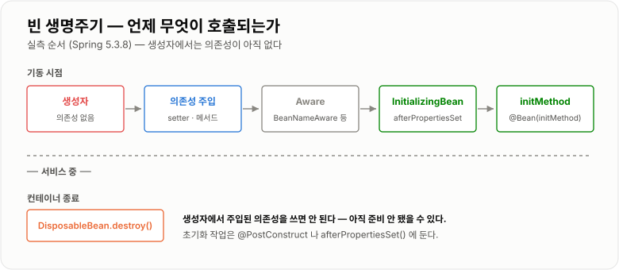
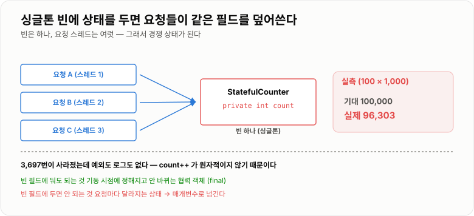

# IoC · DI와 Bean

> **IoC는 "객체를 만들고 연결하는 일을 내가 아니라 컨테이너가 한다"는 뒤집힘이고, DI는 그 뒤집힘을 실제로 구현하는 방법이다. 그 결과 내 코드는 `new`를 쓰지 않고 인터페이스만 알면 된다.**

---

## 1. 핵심 요약

**Spring이 해 주는 일은 결국 하나다. "무엇을 만들지"만 알려 주면 "언제 만들고 누구에게 넣어 줄지"를 대신 처리한다. 그래서 코드가 구현체를 몰라도 되고, 그것이 [객체지향과 SOLID](../../03-Java/객체지향-SOLID/객체지향-SOLID.md)의 DIP를 강제로 지키게 만든다.**

### 한눈에 보기

* **IoC(제어의 역전)** 는 원칙이고 **DI(의존성 주입)** 는 그 원칙을 구현하는 방법이다. 둘은 같은 말이 아니다.
* **빈(Bean)** 은 "컨테이너가 만들고 관리하는 객체"다. 내가 `new`로 만든 객체는 빈이 아니다.
* **빈은 기본이 싱글톤**이다. 두 번 꺼내도 같은 객체다(`==` 비교 `true`).
* **싱글톤이라는 사실이 가장 중요한 실무 함정을 만든다.** 빈에 상태를 두면 여러 요청이 그 상태를 공유한다.
* 실측으로 확인했다. 싱글톤 빈의 `count++`를 100스레드 × 1,000회 = **100,000번 실행했더니 96,303**이 나왔다.
* **생성자 주입을 쓴다.** `final`로 선언할 수 있고, 누락을 기동 시점에 잡고, 스프링 없이 테스트할 수 있다.
* **순환 참조는 주입 방식에 따라 다르게 나타난다.** 생성자 주입은 **기동 시점에 `UnsatisfiedDependencyException`으로 즉시 실패**하고, setter 주입은 **기동이 성공해 문제가 숨는다**.
* 빈 생명주기 순서는 **생성자 → 의존성 주입 → `Aware` → `InitializingBean` → `initMethod` → (종료 시) `DisposableBean`** 이다.
* 구현체가 여러 개면 `@Qualifier`보다 **`Map<String, 인터페이스>`로 전부 주입받아 실행 시점에 고르는 방식**이 OCP에 더 가깝다.

> 이 노트의 동작 확인은 **Spring Framework 5.3.8 + JDK 17.0.12**에서 `AnnotationConfigApplicationContext`를 직접 띄워 실행한 결과다.

### 무엇을 해결하는가

#### DI가 없을 때

객체가 필요한 것을 스스로 만들면 이렇게 된다.

```java
public class OrderService {

    private final DiscountPolicy policy = new FixDiscountPolicy();   // 직접 만든다

    public int calculate(int price) {
        return price - policy.discountAmount(price);
    }
}
```

인터페이스를 썼는데도 문제가 남는다.

```text
OrderService 가 FixDiscountPolicy 라는 구체 클래스를 알고 있다
   ↓
정률 할인으로 바꾸려면 OrderService 를 수정해야 한다
   ↓
"인터페이스에 의존하라"(DIP)를 지키려 했는데 결국 못 지켰다
```

더 아픈 것은 **테스트**다.

```java
// OrderService 를 테스트하고 싶은데
OrderService service = new OrderService();
// 안에서 FixDiscountPolicy 를 직접 만들어 버리므로
// 가짜 정책으로 바꿔 끼울 방법이 없다
```

그리고 **의존성이 깊어지면 조립 코드가 폭발한다.**

```java
// OrderService 하나를 만들려면
OrderService service = new OrderService(
        new RateDiscountPolicy(10),
        new JdbcOrderRepository(
                new HikariDataSource(
                        new HikariConfig("jdbc:...", "user", "pw"))),
        new SmtpNotifier(new MailProperties("smtp.example.com", 587)));
```

이 조립 코드가 **필요한 곳마다 반복**되고, 구현체 하나만 바뀌어도 전부 고쳐야 한다.

#### 컨테이너가 대신 하면

```java
public class OrderService {

    private final DiscountPolicy policy;

    public OrderService(DiscountPolicy policy) {   // 밖에서 넣어 준다
        this.policy = policy;
    }
}
```

```text
OrderService 는 이제
  · 어떤 구현체인지 모른다
  · 그것을 어떻게 만드는지도 모른다
  · 그냥 "DiscountPolicy 하나 주세요"라고만 선언한다

  누가 넣어 주는가 → 컨테이너
  이 뒤집힘이 IoC 이고, 넣어 주는 행위가 DI 다
```

---

## 2. 동작 원리

### 핵심 구성 요소

| 개념                     | 한 문장 정의                                | 왜 중요한가                          |
| ---------------------- | -------------------------------------- | ------------------------------- |
| **IoC**                | 객체 생성·연결의 주도권이 내 코드에서 컨테이너로 넘어간 것      | 원칙 이름이다. DI는 그 구현이다             |
| **DI**                 | 필요한 객체를 밖에서 넣어 주는 것                    | IoC를 실제로 실현하는 방법                |
| **컨테이너**               | 빈을 만들고 연결하고 생명주기를 관리하는 주체              | `ApplicationContext`가 그것이다      |
| **빈**                  | **컨테이너가 관리하는 객체**                      | `new`로 만든 것은 빈이 아니다 (AOP도 안 걸린다) |
| **빈 정의(BeanDefinition)** | "이 클래스를 이런 이름·스코프로 만들라"는 설계도           | 컨테이너는 객체가 아니라 이 설계도를 먼저 읽는다     |
| **싱글톤 스코프**            | 컨테이너당 인스턴스 하나 (기본값)                    | **상태를 두면 안 되는 이유**             |
| **프로토타입 스코프**          | 요청할 때마다 새 인스턴스                         | 생성만 관리하고 소멸은 관리하지 않는다           |
| **생성자 주입**             | 생성자 매개변수로 의존성을 받는 것                    | **권장 방식.** `final` 가능, 누락을 즉시 발견 |
| **`@Qualifier`**       | 같은 타입 빈이 여럿일 때 이름으로 고르는 것              | 구현체가 둘 이상이면 필요하다                |
| **순환 참조**              | A가 B를, B가 A를 필요로 하는 상태                 | **주입 방식에 따라 드러나는 시점이 다르다**      |

### 내부 동작 과정

#### 컨테이너가 기동할 때 하는 일

```text
① 빈 정의 읽기
   @Configuration, @Component 스캔 → BeanDefinition 목록을 만든다
   (아직 객체는 하나도 안 만들었다)

② 빈 정의 후처리
   BeanFactoryPostProcessor 가 정의 자체를 손본다
   예: ${...} 프로퍼티 치환

③ 싱글톤 빈 생성
   각 정의마다 인스턴스를 만들고 의존성을 주입한다
   → 여기서 순환 참조가 문제가 된다

④ 빈 후처리
   BeanPostProcessor 가 각 빈을 감싸거나 바꾼다
   → @Transactional 프록시가 여기서 만들어진다

⑤ 기동 완료
   이제 getBean() 하면 이미 만들어진 것을 돌려준다
```

**④가 중요하다.** `@Transactional`이나 `@Async`가 붙은 빈은 **원본이 아니라 프록시로 교체되어** 컨테이너에 등록된다. 자세한 것은 [AOP · Proxy와 Transactional](../AOP-Proxy-Transactional/AOP-Proxy-Transactional.md) 노트에서 다룬다.

#### 빈 생명주기 콜백 순서

직접 실행해서 확인한 순서다.

```text
1. 생성자
2. 의존성 주입 (setter · 메서드 주입)
3. BeanNameAware 등 Aware 인터페이스
4. InitializingBean.afterPropertiesSet()
5. @Bean(initMethod = "...")
   ── 여기까지가 기동, 이제 서비스 중 ──
6. DisposableBean.destroy()   (컨테이너 종료 시)
```



*생성자에서는 의존성이 아직 없다 — 초기화 로직을 생성자에 두면 안 되는 이유다.*

**여기서 나오는 실무 규칙이 하나 있다.**

```text
생성자에서는 주입된 의존성을 "쓰면" 안 된다.
  · 생성자 주입이라면 값은 들어와 있지만
  · 그 의존성이 프록시라면 아직 완전히 준비되지 않았을 수 있다
  · 다른 빈이 아직 안 만들어졌을 수도 있다

  초기화 작업은 @PostConstruct 나 afterPropertiesSet() 에 둔다
```

#### 싱글톤이 만드는 문제

**빈이 싱글톤이라는 것은 "모든 요청이 같은 객체를 쓴다"는 뜻이다.**

```java
@Component
public class StatefulCounter {
    private int count = 0;          // 공유 상태!
    public void increment() { count++; }
}
```

**실측 결과**

```text
100 스레드 × 1,000회 = 100,000 번 증가시켰더니

  기대  100,000
  실제   96,303        ← 3,697번이 사라졌다
```



*웹 서버는 요청마다 스레드가 다르고 빈은 하나다 — 상태를 두는 순간 경쟁 상태가 된다.*

`count++`가 원자적이지 않기 때문인데, 자세한 원리는 [Thread와 동기화](../../04-동시성/Thread-동기화/Thread-동기화.md)에 있다. 여기서 기억할 것은 **"Spring 빈에는 상태를 두지 않는다"** 는 규칙이 왜 생겼는지다.

```text
안전한 것 (상태가 없다)
  · final 로 주입받은 다른 빈
  · 설정값 (한 번 정해지고 안 바뀜)
  · 메서드 안의 지역 변수  ← 스레드마다 스택이 따로다

위험한 것 (상태가 있다)
  · 요청마다 바뀌는 필드
  · 누적 카운터, 임시 목록
  · 로그인 사용자 정보를 담아 둔 필드   ← 다른 사용자에게 보인다
```

#### 순환 참조 — 주입 방식이 결정한다

A가 B를 필요로 하고 B가 A를 필요로 하면 어떻게 될까. **주입 방식에 따라 결과가 완전히 다르다.**

**생성자 주입 — 실측 결과**

```text
UnsatisfiedDependencyException 발생 → 애플리케이션이 아예 안 뜬다
```

```text
왜 실패하는가

  A 를 만들려면 생성자에 B 가 필요하다
  B 를 만들려면 생성자에 A 가 필요하다
  A 는 아직 만들어지지 않았다
     → 어느 쪽도 먼저 만들 수 없다 → 즉시 실패
```

**setter 주입 — 실측 결과**

```text
기동 성공. a.b.a == a  →  true

  순환이 그대로 남은 채로 서비스가 시작된다
```

```text
왜 성공하는가

  ① A 를 일단 만든다 (의존성 없이)
  ② B 를 만든다
  ③ B 에 A 를 넣는다      ← A 는 이미 있으므로 가능
  ④ A 에 B 를 넣는다
     → 순환이 완성된 채로 동작한다
```

**어느 쪽이 나은가?** 생성자 주입이다.

```text
setter 주입은 "문제를 숨긴다"
  · 기동은 되지만 설계가 잘못됐다는 신호를 못 받는다
  · 나중에 초기화 순서 문제나 프록시 문제로 엉뚱하게 터진다

생성자 주입은 "문제를 즉시 드러낸다"
  · 배포 전에, 기동 단계에서 잡힌다
  · 순환 참조는 대개 책임 분리가 잘못됐다는 뜻이므로 고치는 게 맞다
```

> Spring Boot 2.6부터는 **순환 참조가 기본적으로 금지**된다. 굳이 허용하려면 `spring.main.allow-circular-references=true`를 켜야 하는데, 이는 임시방편이고 설계를 고치는 것이 정답이다.

#### 프로퍼티 우선순위

`Environment`는 여러 `PropertySource`를 **순서대로** 뒤져서 **처음 찾은 값**을 쓴다.

**실측으로 확인한 순서**

```text
같은 키 app.name 을 두 곳에 두고 조회했더니 → "높은-우선순위"

PropertySource 순서
  1. high                  ← addFirst 로 넣은 것
  2. systemProperties      (-Dkey=value)
  3. systemEnvironment     (환경 변수)
  4. low                   ← addLast 로 넣은 것
```

**앞에 있을수록 이긴다.** Spring Boot는 여기에 커맨드라인 인자, `application-{profile}.yml`, `application.yml` 등을 정해진 순서로 끼워 넣는다. 자세한 것은 [Spring Boot와 예외 처리](../Spring-Boot와-예외처리/Spring-Boot와-예외처리.md)에서 다룬다.

---

## 3. 특징과 비교

| 구분          | 내용                                       |
| ----------- | ---------------------------------------- |
| **장점**      | 구현체를 몰라도 되어 **DIP를 강제로 지키게 되고**, 가짜 구현체를 끼워 스프링 없이 단위 테스트할 수 있다. 조립 코드가 한곳(설정)에 모여 중복이 사라지고, 싱글톤 재사용으로 객체 생성 비용도 줄어든다. |
| **단점**      | **빈이 싱글톤이라 상태를 두면 조용히 깨진다**(96,303/100,000). 실행 시점에 어떤 구현이 주입됐는지 코드만 봐서는 모르고, 기동 시점 오류 메시지가 길어 원인 찾기가 어렵다. |
| **적합한 상황**  | 구현이 바뀔 수 있는 것(리포지토리·외부 연동·정책), 여러 곳에서 공유하는 것(설정·커넥션 풀), 테스트에서 바꿔 끼워야 하는 것. |
| **주의할 상황**  | **요청마다 값이 달라지는 상태를 빈 필드에 두는 것.** 프로토타입 빈을 싱글톤에 주입하는 것. 구현체가 하나뿐인데 인터페이스를 만드는 것. |

### 성능 특성

| 항목             | 비용                                       |
| -------------- | ---------------------------------------- |
| 빈 조회(`getBean`) | 이미 만들어진 것을 맵에서 꺼내므로 사실상 무료               |
| 싱글톤 생성          | 기동 시점에 한 번. 요청 처리 중에는 비용 없음              |
| 프로토타입 생성        | 요청할 때마다 `new` + 주입. 잦으면 무시할 수 없다         |
| **프록시 경유 호출**   | 메서드 본문이 거의 없을 때 **16.8배**. 다만 절대값은 호출당 약 31 ns |
| 기동 시간          | 빈 개수와 컴포넌트 스캔 범위에 비례. 수백 개면 수 초          |

**프록시 비용을 오해하지 않는 것이 중요하다.**

```text
실측: 1,000만 회 호출에 직접 19.9 ms vs 프록시 333.9 ms (16.8배)

  16.8배는 무서워 보이지만
    · 메서드가 hashCode() 처럼 거의 아무것도 안 할 때의 비율이다
    · 호출당으로 환산하면 약 31 나노초다
    · 실제 서비스 메서드는 DB 한 번만 가도 수 밀리초다
      → 31 ns 는 그 안에서 0.001% 도 안 된다

  결론: 프록시 비용 때문에 설계를 바꿀 일은 없다
```

### 장점과 단점

| 장점                  | 이유                                    |
| ------------------- | ------------------------------------- |
| DIP를 자연스럽게 지키게 된다   | 구현체를 직접 만들 수 없으므로 인터페이스에 의존하게 된다.     |
| 테스트가 쉬워진다           | 생성자에 가짜 객체를 넣으면 스프링 없이 단위 테스트가 된다.    |
| 조립 코드가 한곳에 모인다      | 설정만 바꾸면 전체 연결이 바뀐다.                   |
| 객체를 재사용한다           | 싱글톤이라 요청마다 새로 만들지 않는다.                |
| 생명주기를 맡길 수 있다       | 초기화·종료 콜백을 컨테이너가 정해진 시점에 호출한다.        |
| AOP를 끼울 자리가 생긴다     | 빈이기 때문에 프록시로 감쌀 수 있다.                 |

| 단점                       | 이유 및 주의점                                   |
| ------------------------ | ------------------------------------------ |
| **싱글톤 상태가 조용히 깨진다**      | 예외도 로그도 없다. 실측에서 3,697번이 사라졌다.             |
| 실행 시점 구현을 코드로 알 수 없다     | 인터페이스에서 "구현으로 이동"을 눌러야 한다.                 |
| 기동 오류 메시지가 길다            | 원인 한 줄을 찾으려면 스택을 한참 내려가야 한다.               |
| **`new`로 만든 객체는 빈이 아니다** | AOP·트랜잭션·주입이 전부 안 걸린다. 초보자가 가장 많이 겪는 함정이다. |
| 프로토타입은 소멸을 관리하지 않는다      | `@PreDestroy`가 호출되지 않는다. 자원을 쥐면 누수가 된다.    |
| 순환 참조가 설계 문제를 가린다        | setter 주입이면 기동이 되어 버려 문제를 늦게 발견한다.         |

### 어떤 상황에서 고르는가

#### 주입 방식 선택

```text
거의 항상 → 생성자 주입
  · final 로 선언할 수 있어 불변이 보장된다
  · 의존성이 빠지면 기동 시점에 즉시 실패한다
  · 스프링 없이 new 로 테스트할 수 있다
  · 순환 참조를 기동 단계에서 잡아 준다

예외적으로 → setter 주입
  · 선택적 의존성 (없어도 동작해야 하는 것)

쓰지 않는다 → 필드 주입 (@Autowired private Foo foo)
  · final 을 못 쓴다
  · 스프링 없이는 값을 넣을 방법이 없어 테스트가 어렵다
  · 의존성이 몇 개인지 눈에 안 띄어 무한정 늘어난다
```

#### 스코프 선택

```text
상태가 없다              → 싱글톤 (기본값, 99%의 경우)
요청마다 다른 상태가 필요하다  → 애초에 빈으로 만들지 말고 지역 변수로
                          또는 @RequestScope
매번 새 객체가 꼭 필요하다   → 프로토타입 (드물다)
```

**프로토타입을 싱글톤에 주입하면 의도대로 안 된다.**

```text
싱글톤 빈이 프로토타입 빈을 필드로 받으면
   → 주입은 기동 시점에 딱 한 번 일어난다
   → 그 뒤로는 계속 같은 인스턴스를 쓴다
   → 프로토타입인 의미가 사라진다

  해결: ObjectProvider<T> 로 받아 필요할 때마다 getObject() 를 부른다
```

#### 구현체가 여러 개일 때

```text
① @Primary        기본으로 쓸 것 하나를 정한다
② @Qualifier      쓰는 쪽에서 이름으로 지정한다
③ Map 으로 전부 받기  실행 시점에 키로 고른다   ← OCP에 가장 가깝다
④ List 로 전부 받기   전부에게 순서대로 시킨다 (@Order 로 정렬)
```

### 비슷한 기술과 비교

#### 생성자 주입 vs setter 주입 vs 필드 주입

| 기준          | 생성자 주입              | setter 주입          | 필드 주입             |
| ----------- | ------------------- | ------------------ | ----------------- |
| **동작 방식**   | 생성자 매개변수로 받는다       | setter로 나중에 넣는다    | 리플렉션으로 필드에 직접 꽂는다 |
| **`final`** | **가능**              | 불가                 | 불가                |
| **누락 발견 시점** | **기동 시점**           | 실행 중 NPE           | 실행 중 NPE          |
| **순환 참조**   | **기동 시점에 실패로 드러남**  | 기동 성공 (숨는다)        | 기동 성공 (숨는다)       |
| **테스트**     | **`new`로 주입 가능**    | setter 호출 필요       | **리플렉션 없이는 불가**   |
| **장점**      | 불변·명시적·테스트 용이       | 선택적 의존성에 적합        | 코드가 짧다            |
| **단점**      | 의존성이 많으면 생성자가 길어진다  | 불변이 아니다            | 거의 모든 면에서 나쁘다     |
| **선택 기준**   | **기본값**             | 선택적 의존성            | **쓰지 않는다**        |

> 생성자가 길어지는 것은 단점이 아니라 **신호**다. 의존성이 5개를 넘으면 그 클래스가 너무 많은 일을 한다는 뜻이므로(SRP 위반) 쪼개는 것이 맞다.

#### 싱글톤 스코프 vs 싱글톤 패턴

| 기준        | Spring 싱글톤 스코프          | GoF 싱글톤 패턴             |
| --------- | ----------------------- | ---------------------- |
| **범위**    | **컨테이너당 하나**            | JVM당 하나                |
| **구현**    | 클래스는 평범하다               | `private` 생성자 + `static` 필드 |
| **테스트**   | **가짜로 바꿔 끼울 수 있다**      | 바꾸기 매우 어렵다             |
| **상속·구현** | 자유롭다                    | 제약이 많다                 |
| **선택 기준** | **Spring을 쓰면 이쪽**       | 프레임워크 없는 환경            |

Spring 싱글톤은 **패턴의 이점(재사용)만 취하고 단점(테스트 불가·강한 결합)은 피한** 형태다.

#### `@Qualifier` vs `Map` 주입

| 기준        | `@Qualifier`         | `Map<String, T>` 주입     |
| --------- | -------------------- | ---------------------- |
| **동작 방식** | 쓰는 쪽이 이름을 지정한다       | 전부 주입받아 실행 시점에 고른다     |
| **구현체 추가 시** | **쓰는 쪽 코드를 고쳐야 한다** | **`@Component`만 붙이면 끝** |
| **장점**    | 명시적이라 읽기 쉽다          | OCP를 지킨다               |
| **단점**    | 분기가 코드에 남는다          | 어떤 키가 오는지 코드에 안 보인다    |
| **선택 기준** | 구현체가 고정되어 있을 때       | **구현체가 계속 늘어날 때**      |

---

## 4. 실무 주의사항

### 백엔드 실무 적용

#### 스프링 빈에는 상태를 두지 않는다

```java
// 위험 — 요청마다 다른 값이 필드에 쌓인다
@Service
public class OrderService {

    private String currentUserId;          // 절대 하면 안 된다

    public void process(String userId, Order order) {
        this.currentUserId = userId;       // 다른 요청이 덮어쓴다
        validate();                        // 엉뚱한 사용자로 검증될 수 있다
    }
}
```

```java
// 안전 — 값을 넘겨서 쓴다 (지역 변수는 스레드마다 따로다)
@Service
public class OrderService {

    private final OrderRepository repository;   // 상태가 아니라 협력 객체

    public OrderService(OrderRepository repository) {
        this.repository = repository;
    }

    public void process(String userId, Order order) {
        validate(userId, order);           // 매개변수로 전달한다
        repository.save(order);
    }
}
```

**"협력 객체"와 "상태"를 구분하는 것이 핵심이다.**

```text
협력 객체 — 기동 시점에 한 번 정해지고 안 바뀐다  → final 필드로 OK
상태     — 요청마다 달라진다                    → 필드에 두면 안 된다
```

#### 구현체가 늘어나는 곳은 Map으로 받는다

```java
public interface PaymentGateway {
    String name();
    PaymentResult pay(PaymentRequest request);
}
```

```java
@Component
public class TossGateway implements PaymentGateway {

    @Override
    public String name() {
        return "TOSS";
    }

    @Override
    public PaymentResult pay(PaymentRequest request) {
        // ...
        return PaymentResult.success();
    }
}
```

```java
@Service
public class PaymentService {

    private final Map<String, PaymentGateway> gateways;

    /** Spring이 PaymentGateway 구현 빈을 전부 모아 넣어 준다. */
    public PaymentService(List<PaymentGateway> gatewayList) {
        Map<String, PaymentGateway> map = new HashMap<String, PaymentGateway>();
        for (PaymentGateway gateway : gatewayList) {
            map.put(gateway.name(), gateway);
        }
        this.gateways = Collections.unmodifiableMap(map);
    }

    public PaymentResult pay(String type, PaymentRequest request) {
        PaymentGateway gateway = gateways.get(type);
        if (gateway == null) {
            throw new IllegalArgumentException("지원하지 않는 결제 수단: " + type);
        }
        return gateway.pay(request);
    }
}
```

**결제 수단을 추가할 때 이 클래스는 열지 않는다.** 새 구현체에 `@Component`만 붙이면 된다.

#### `new`로 만든 객체는 빈이 아니다

가장 자주 겪는 함정이다.

```java
@Service
public class OrderService {

    public void process() {
        PaymentService payment = new PaymentService();   // 직접 만들었다
        payment.pay();      // @Transactional 이 붙어 있어도 안 걸린다!
    }
}
```

```text
컨테이너가 만든 것이 아니므로
  · 의존성이 주입되지 않는다 (필드가 전부 null)
  · @Transactional, @Async, @Cacheable 이 동작하지 않는다
  · @PostConstruct 도 호출되지 않는다

  → 주입받아 쓴다. 예외는 없다.
```

#### 프로토타입 빈이 필요할 때

```java
@Service
public class ReportService {

    private final ObjectProvider<ReportContext> contextProvider;

    public ReportService(ObjectProvider<ReportContext> contextProvider) {
        this.contextProvider = contextProvider;
    }

    public Report generate(ReportRequest request) {
        ReportContext context = contextProvider.getObject();   // 호출할 때마다 새로
        context.load(request);
        return context.build();
    }
}
```

필드로 직접 주입받으면 **기동 시점에 한 번 주입된 그 인스턴스를 계속 쓰게 되어** 프로토타입인 의미가 사라진다.

#### 순환 참조를 만났을 때

```text
① 왜 서로 필요한지 본다 — 대개 한쪽이 너무 많은 일을 한다 (SRP 위반)
② 공통 로직을 제3의 클래스로 뽑는다        ← 가장 좋은 해법
③ 이벤트로 끊는다 (ApplicationEventPublisher)
④ 정말 어쩔 수 없으면 ObjectProvider 로 늦게 가져온다
⑤ allow-circular-references=true 는 마지막 수단이다 (설계를 미룬 것)
```

### 자주 하는 오해

| 잘못된 이해                         | 올바른 이해                                                          |
| ------------------------------ | --------------------------------------------------------------- |
| IoC와 DI는 같은 말이다                | **IoC는 원칙, DI는 그 구현 방법**이다. DI 없이도(서비스 로케이터 등) IoC는 가능하다.       |
| 빈은 요청마다 새로 만들어진다               | **기본은 싱글톤**이다. 두 번 꺼내도 같은 객체다(`true`).                       |
| 싱글톤이니까 스레드 안전하다                | **정반대다.** 하나를 공유하므로 상태를 두면 깨진다. 실측에서 100,000이 **96,303**이 됐다.  |
| `@Autowired`를 필드에 붙이는 게 제일 깔끔하다 | `final`을 못 쓰고 **스프링 없이 테스트가 불가능**하다. 생성자 주입을 쓴다.                |
| 순환 참조는 어떤 주입 방식이든 실패한다         | **생성자 주입만 실패한다.** setter 주입은 **기동에 성공해 문제가 숨는다**.           |
| 생성자가 길어지는 건 생성자 주입의 단점이다       | 단점이 아니라 **신호**다. 의존성이 많다는 것은 그 클래스가 너무 많은 일을 한다는 뜻이다.           |
| `new`로 만들어도 `@Transactional`은 동작한다 | **동작하지 않는다.** 빈이 아니면 프록시가 없다. 주입도 안 되어 필드가 전부 `null`이다.         |
| 프로토타입 빈은 다 쓰면 컨테이너가 정리해 준다     | **소멸은 관리하지 않는다.** `@PreDestroy`가 호출되지 않으므로 자원은 직접 닫아야 한다.       |
| 프록시 때문에 성능이 크게 떨어진다            | 호출당 약 **31 ns**다. DB 한 번 가는 비용의 0.001%도 안 된다.               |
| 생성자에서 초기화 작업을 해도 된다            | 생성자 시점에는 다른 빈이 준비 안 됐을 수 있다. **`@PostConstruct`** 에 둔다(순서 참고). |

---

## 5. 예제

### 빈 등록과 주입의 최소 형태

```java
public interface DiscountPolicy {
    int discountAmount(int price);
}
```

```java
@Component
public class RateDiscountPolicy implements DiscountPolicy {

    private final int percent;

    public RateDiscountPolicy(@Value("${discount.percent:10}") int percent) {
        this.percent = percent;
    }

    @Override
    public int discountAmount(int price) {
        return price * percent / 100;
    }
}
```

```java
@Service
public class OrderService {

    private final DiscountPolicy discountPolicy;
    private final OrderRepository orderRepository;

    /** 생성자가 하나면 @Autowired 를 생략할 수 있다 (Spring 4.3+). */
    public OrderService(DiscountPolicy discountPolicy, OrderRepository orderRepository) {
        this.discountPolicy = discountPolicy;
        this.orderRepository = orderRepository;
    }

    public Order place(long userId, int price) {
        int finalPrice = price - discountPolicy.discountAmount(price);
        return orderRepository.save(new Order(userId, finalPrice));
    }
}
```

### 스프링 없이 테스트하기 — 생성자 주입의 진짜 이득

```java
class OrderServiceTest {

    @Test
    void 정률_할인이_적용된다() {
        // 가짜 구현을 직접 넣는다. 스프링 컨텍스트가 필요 없다.
        DiscountPolicy fixed10Percent = price -> price / 10;
        OrderRepository memoryRepository = new MemoryOrderRepository();

        OrderService service = new OrderService(fixed10Percent, memoryRepository);

        Order order = service.place(1L, 10000);

        assertThat(order.getPrice()).isEqualTo(9000);
    }
}
```

```text
이 테스트는 수 밀리초에 끝난다.
@SpringBootTest 를 붙였다면 컨텍스트를 띄우느라 수 초가 걸린다.

  → 생성자 주입을 쓰는 가장 실질적인 이유다
```

### 빈 생명주기 콜백 사용하기

```java
@Component
public class ConnectionWarmer {

    private final DataSource dataSource;

    public ConnectionWarmer(DataSource dataSource) {
        this.dataSource = dataSource;
        // 여기서 dataSource 를 쓰지 않는다 — 아직 준비가 안 됐을 수 있다
    }

    /** 의존성이 모두 주입된 뒤에 호출된다. */
    @PostConstruct
    public void warmUp() {
        try (Connection connection = dataSource.getConnection()) {
            connection.isValid(1000);
        } catch (SQLException e) {
            throw new IllegalStateException("DB 연결 확인 실패", e);
        }
    }

    /** 컨테이너 종료 시 호출된다. */
    @PreDestroy
    public void shutdown() {
        // 자원 정리
    }
}
```

### 싱글톤 빈에서 요청별 상태를 다루는 법

```java
// 나쁜 예 — 필드에 담는다
@Service
public class BadAuditService {

    private String currentUser;                  // 요청들이 서로 덮어쓴다

    public void audit(String user, String action) {
        this.currentUser = user;
        write(action);
    }

    private void write(String action) {
        log.info("{} 가 {}", currentUser, action);   // 다른 사용자일 수 있다
    }
}
```

```java
// 좋은 예 1 — 매개변수로 넘긴다
@Service
public class AuditService {

    public void audit(String user, String action) {
        write(user, action);
    }

    private void write(String user, String action) {
        log.info("{} 가 {}", user, action);
    }
}
```

```java
// 좋은 예 2 — 요청 범위 컨텍스트를 따로 둔다
@Component
@RequestScope
public class RequestContext {

    private String userId;

    public String getUserId() {
        return userId;
    }

    public void setUserId(String userId) {
        this.userId = userId;
    }
}
```

```text
@RequestScope 빈을 싱글톤에 주입하면
Spring 이 프록시를 넣어 주고, 호출 시점의 요청에 맞는 인스턴스로 위임한다.

  다만 이것도 남용하면 "어디서 값이 설정됐는지" 추적이 어려워지므로
  매개변수로 넘기는 쪽을 먼저 고려한다.
```

### 순환 참조를 이벤트로 끊기

```java
// Before — 서로를 필요로 한다 (순환)
@Service
public class OrderService {
    private final NotificationService notification;   // 주문 → 알림
}

@Service
public class NotificationService {
    private final OrderService orderService;          // 알림 → 주문 (순환!)
}
```

```java
// After — 이벤트로 방향을 한쪽으로 만든다
@Service
public class OrderService {

    private final ApplicationEventPublisher publisher;

    public OrderService(ApplicationEventPublisher publisher) {
        this.publisher = publisher;
    }

    public void place(Order order) {
        // ... 주문 저장 ...
        publisher.publishEvent(new OrderPlacedEvent(order.getId()));
    }
}
```

```java
@Component
public class OrderPlacedListener {

    private final NotificationService notification;

    public OrderPlacedListener(NotificationService notification) {
        this.notification = notification;
    }

    @EventListener
    public void handle(OrderPlacedEvent event) {
        notification.notifyOrderPlaced(event.getOrderId());
    }
}
```

**의존 방향이 `OrderService → 이벤트 → Listener → NotificationService`로 한 방향이 됐다.**

---

## 6. 면접 정리

### 자주 나오는 질문

#### 기본 질문

1. **IoC가 무엇인가요?**

    * 핵심 키워드: 객체 생성·연결의 **주도권이 내 코드에서 컨테이너로** 넘어간 것, 제어의 역전

2. **IoC와 DI는 어떤 관계인가요?**

    * 핵심 키워드: **IoC는 원칙, DI는 구현 방법**, DI 말고 서비스 로케이터로도 IoC 가능

3. **빈이 무엇인가요?**

    * 핵심 키워드: **컨테이너가 만들고 관리하는 객체**, `new`로 만든 것은 빈이 아님

4. **빈의 기본 스코프는 무엇인가요?**

    * 핵심 키워드: **싱글톤**, 컨테이너당 하나, 두 번 꺼내도 같은 객체(`true`)

5. **빈 생명주기를 설명해 주세요.**

    * 핵심 키워드: 생성자 → 의존성 주입 → `Aware` → `InitializingBean` → `initMethod` → `DisposableBean`

6. **의존성 주입 방식에는 무엇이 있나요?**

    * 핵심 키워드: 생성자·setter·필드, **생성자 주입이 기본**

7. **왜 생성자 주입을 권장하나요?**

    * 핵심 키워드: `final` 가능, **누락을 기동 시점에 발견**, 스프링 없이 테스트, 순환 참조 조기 발견

8. **같은 타입 빈이 여러 개면 어떻게 고르나요?**

    * 핵심 키워드: `@Primary`·`@Qualifier`, 또는 **`Map`/`List`로 전부 받아 실행 시점 선택**(OCP)

#### 꼬리 질문

1. **빈이 싱글톤이면 스레드 안전한가요?**

    * 핵심 키워드: **정반대다.** 하나를 공유하므로 상태를 두면 깨짐. 실측 100,000 → **96,303**

2. **그럼 빈에 무엇을 두고 무엇을 두면 안 되나요?**

    * 핵심 키워드: **협력 객체(`final`)는 OK, 요청마다 바뀌는 상태는 금지**, 지역 변수는 스레드마다 따로라 안전

3. **순환 참조가 생기면 어떻게 되나요?**

    * 핵심 키워드: **생성자 주입은 기동 시점 `UnsatisfiedDependencyException`**, setter는 **기동 성공해 숨음**

4. **그럼 setter 주입이 더 좋은 것 아닌가요?**

    * 핵심 키워드: **아니다.** 문제를 숨기는 것일 뿐. 순환 참조는 대개 SRP 위반 신호라 고쳐야 함

5. **순환 참조를 어떻게 해결하시겠어요?**

    * 핵심 키워드: 공통 로직을 제3 클래스로, **이벤트로 방향 단일화**, `ObjectProvider`, 설정 플래그는 최후

6. **필드 주입은 왜 쓰면 안 되나요?**

    * 핵심 키워드: `final` 불가, **리플렉션 없이 테스트 불가**, 의존성이 몇 개인지 안 보여 무한정 늘어남

7. **생성자 파라미터가 너무 많아지면 어떻게 하나요?**

    * 핵심 키워드: **단점이 아니라 신호.** SRP 위반이므로 클래스를 쪼갠다

8. **`new`로 만든 객체에 `@Transactional`이 동작하나요?**

    * 핵심 키워드: **안 된다.** 빈이 아니면 프록시가 없고 주입도 안 되어 필드가 `null`

9. **프로토타입 빈을 싱글톤에 주입하면 어떻게 되나요?**

    * 핵심 키워드: **기동 시점에 한 번 주입되어 계속 같은 인스턴스**, `ObjectProvider`로 해결

10. **프로토타입 빈은 언제 소멸되나요?**

    * 핵심 키워드: **컨테이너가 소멸을 관리하지 않는다.** `@PreDestroy` 미호출, 자원은 직접 닫아야 함

11. **프록시 때문에 성능이 떨어지지 않나요?**

    * 핵심 키워드: 호출당 약 **31 ns**(16.8배지만 절대값이 미미), DB 한 번 비용의 0.001% 미만

12. **초기화 로직을 생성자에 두면 안 되나요?**

    * 핵심 키워드: 생성자 시점엔 다른 빈이 준비 안 됐을 수 있음, **`@PostConstruct`** 에 둔다

13. **프로퍼티가 여러 곳에 같은 키로 있으면 무엇이 이기나요?**

    * 핵심 키워드: **`PropertySource` 순서상 앞선 것**, 실측에서 `addFirst`한 것이 이김

### 30초 답변

> IoC는 **객체를 만들고 연결하는 주도권이 내 코드에서 컨테이너로 넘어간 것**이고, DI는 그걸 실제로 구현하는 방법입니다. 덕분에 `OrderService`가 어떤 할인 정책 구현체인지 몰라도 되고, 그게 곧 DIP를 강제로 지키게 만듭니다. 실무에서 가장 중요한 건 **빈이 기본적으로 싱글톤**이라는 사실인데, 모든 요청이 같은 객체를 쓰기 때문에 **빈에 상태를 두면 안 된다**는 규칙이 여기서 나옵니다.

### 핵심 키워드

`IoC` · `DI` · `ApplicationContext` · `빈` · `BeanDefinition` · `싱글톤 스코프` · `프로토타입 스코프` · `생성자 주입` · `순환 참조` · `@Qualifier` · `@Primary` · `ObjectProvider` · `BeanPostProcessor` · `@PostConstruct`

### 이어서 볼 주제

* **[AOP · Proxy와 Transactional](../AOP-Proxy-Transactional/AOP-Proxy-Transactional.md)** — 컨테이너가 빈을 프록시로 바꿔치기하는 단계(`BeanPostProcessor`)의 실체다. 이 노트의 다음 편이다.
* **[객체지향과 SOLID](../../03-Java/객체지향-SOLID/객체지향-SOLID.md)** — DIP가 왜 필요한지. 이 노트가 "어떻게"라면 그 노트는 "왜"다.
* **[Thread와 동기화](../../04-동시성/Thread-동기화/Thread-동기화.md)** — 싱글톤 빈의 상태가 왜 96,303으로 깨지는지의 원리.
* **[Spring Boot와 예외 처리](../Spring-Boot와-예외처리/Spring-Boot와-예외처리.md)** — 자동 설정이 조건에 따라 빈을 등록하는 방식과 프로퍼티 우선순위.
* **`@Configuration`의 프록시 동작** — `@Bean` 메서드를 직접 호출해도 싱글톤이 유지되는 이유(CGLIB 프록시).
* **컴포넌트 스캔과 기동 시간** — 스캔 범위가 넓으면 기동이 느려진다. `@ComponentScan` 범위 제한과 지연 초기화.
