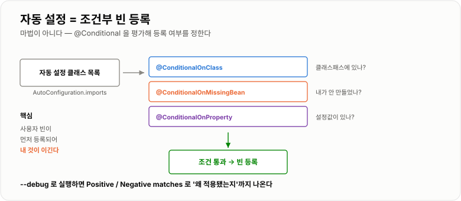
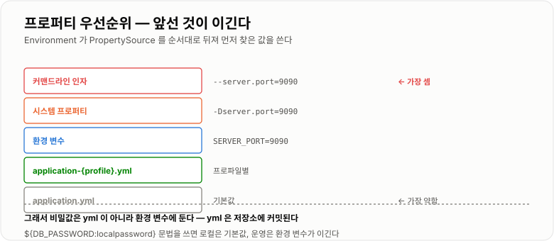

# Spring Boot와 예외 처리

> **Spring Boot는 "클래스패스에 무엇이 있는지 보고 설정을 대신 해 주는" 자동 설정 덩어리다. 그리고 그렇게 만든 애플리케이션에서 실패를 클라이언트에게 어떻게 전달할지가 예외 처리다. 둘 다 "규칙을 알면 예측 가능하고, 모르면 마법처럼 보인다"는 공통점이 있다.**

---

## 1. 핵심 요약

**자동 설정은 `@Conditional`로 된 조건부 빈 등록일 뿐이고, 예외 처리는 `@RestControllerAdvice` 한곳에 모으는 것이 전부다. 중요한 것은 두 가지다 — 설정값이 어디서 왔는지 추적할 수 있어야 하고, 예상한 실패와 예상 못 한 실패를 구분해서 다뤄야 한다.**

### 한눈에 보기

* **자동 설정은 마법이 아니다.** `spring.factories`(Boot 2.7+는 `AutoConfiguration.imports`)에 나열된 설정 클래스를 조건에 따라 적용할 뿐이다.
* 조건은 `@ConditionalOnClass`(클래스가 있으면), `@ConditionalOnMissingBean`(내가 안 만들었으면), `@ConditionalOnProperty`(설정값이 있으면) 등이다.
* **`@ConditionalOnMissingBean` 덕분에 "내가 만들면 내 것이 이긴다".** 자동 설정을 덮어쓰는 표준 방법이다.
* **프로퍼티는 `PropertySource` 목록을 순서대로 뒤져 먼저 찾은 값을 쓴다.** 앞에 있을수록 이긴다.
* 실측한 기본 순서는 **`systemProperties`(-D) → `systemEnvironment`(환경 변수)** 순이고, Boot는 여기에 커맨드라인 인자와 `application.yml`을 정해진 자리에 끼워 넣는다.
* **예외 처리는 `@RestControllerAdvice` 한곳에 모은다.** 컨트롤러마다 `try-catch`를 두지 않는다.
* **예상된 실패와 예상 못 한 실패의 로그 레벨을 반드시 나눈다.** 재고 부족을 `error`로 찍으면 진짜 장애가 묻힌다.
* **내부 예외 메시지를 그대로 클라이언트에 주지 않는다.** SQL·테이블명·스택이 노출된다.
* **Filter에서 난 예외는 `@RestControllerAdvice`가 못 잡는다.** `DispatcherServlet` 바깥이기 때문이다.
* 에러 응답은 **형식을 하나로 고정**한다. 클라이언트가 분기할 수 있는 **코드(문자열)** 를 반드시 넣는다.

> 프로퍼티 우선순위 동작은 **Spring Framework 5.3.8 + JDK 17.0.12**에서 `ConfigurableEnvironment`에 `PropertySource`를 직접 등록해 확인한 결과다.

### 무엇을 해결하는가

#### Boot가 없을 때

Spring MVC + JPA 애플리케이션 하나를 띄우려면 이런 설정이 필요했다.

```java
@Configuration
@EnableWebMvc
@EnableTransactionManagement
@EnableJpaRepositories(basePackages = "com.example.repository")
public class AppConfig {

    @Bean
    public DataSource dataSource() {
        HikariConfig config = new HikariConfig();
        config.setJdbcUrl("jdbc:mysql://localhost:3306/app");
        config.setUsername("root");
        config.setPassword("password");
        config.setMaximumPoolSize(10);
        return new HikariDataSource(config);
    }

    @Bean
    public LocalContainerEntityManagerFactoryBean entityManagerFactory(DataSource ds) {
        LocalContainerEntityManagerFactoryBean factory =
                new LocalContainerEntityManagerFactoryBean();
        factory.setDataSource(ds);
        factory.setPackagesToScan("com.example.domain");
        factory.setJpaVendorAdapter(new HibernateJpaVendorAdapter());
        // ... Hibernate 속성 20줄 ...
        return factory;
    }

    @Bean
    public PlatformTransactionManager transactionManager(EntityManagerFactory emf) {
        return new JpaTransactionManager(emf);
    }

    @Bean
    public MessageConverter jacksonConverter() { ... }
    // ... 그리고 계속 ...
}
```

```text
문제 1  프로젝트마다 거의 똑같은 설정을 복사한다
문제 2  라이브러리 버전 조합을 직접 맞춰야 한다 (호환성 지옥)
문제 3  WAR 로 말아서 톰캣에 배포해야 한다
문제 4  설정 하나 빠뜨리면 기동은 되는데 런타임에 터진다
```

#### Boot가 하는 일

```yaml
spring:
  datasource:
    url: jdbc:mysql://localhost:3306/app
    username: root
    password: password
```

```text
이것만 쓰면
  · HikariCP DataSource 가 만들어지고
  · EntityManagerFactory 가 만들어지고
  · JpaTransactionManager 가 등록되고
  · Jackson MessageConverter 가 등록되고
  · 내장 톰캣이 8080 에 뜬다

  "관례를 따르면 설정을 생략할 수 있게" 만든 것이다
```

Boot가 실제로 해 주는 것은 네 가지다.

```text
① 자동 설정   클래스패스를 보고 필요한 빈을 조건부로 등록
② 의존성 관리  spring-boot-starter-* 로 검증된 버전 조합 제공
③ 내장 서버   톰캣을 안에 품어 java -jar 로 실행
④ 외부 설정   application.yml, 환경 변수, 커맨드라인을 일관된 규칙으로 병합
```

---

## 2. 동작 원리

### 핵심 구성 요소

| 개념                            | 한 문장 정의                        | 왜 중요한가                     |
| ----------------------------- | ------------------------------ | -------------------------- |
| **`@SpringBootApplication`**  | 세 애너테이션의 묶음                    | 시작점이자 스캔 기준점               |
| **`@EnableAutoConfiguration`** | 자동 설정 클래스들을 불러오는 스위치           | Boot의 핵심                   |
| **`@Conditional...`**         | 조건이 맞을 때만 빈을 등록                | **자동 설정의 실제 구현 방식**        |
| **`@ConditionalOnMissingBean`** | 같은 타입 빈이 없을 때만 등록              | **내가 만들면 내 것이 이긴다**        |
| **`PropertySource`**          | 설정값 하나의 출처                     | 우선순위가 여기서 결정된다             |
| **`Environment`**             | 모든 `PropertySource`를 순서대로 뒤지는 창구 | 설정값 조회의 단일 입구              |
| **`@ConfigurationProperties`** | 설정값 묶음을 객체로 바인딩                | 타입 안전한 설정                  |
| **프로파일**                      | 환경별로 다른 설정을 고르는 스위치            | `local`/`dev`/`prod` 분리    |
| **`@RestControllerAdvice`**   | 예외를 HTTP 응답으로 바꾸는 전역 처리기       | 예외 처리를 한곳에 모으는 자리          |
| **`@ExceptionHandler`**       | 특정 예외를 처리할 메서드                 | 예외 종류별 응답 정의               |

### 내부 동작 과정

#### `@SpringBootApplication`이 하는 일

```java
@SpringBootApplication
public class Application {
    public static void main(String[] args) {
        SpringApplication.run(Application.class, args);
    }
}
```

```text
@SpringBootApplication = 세 개의 묶음

  @SpringBootConfiguration   이 클래스가 설정 클래스다
  @ComponentScan             이 패키지 아래를 스캔한다   ← 위치가 중요하다
  @EnableAutoConfiguration   자동 설정을 켠다
```

**`@ComponentScan`의 기준점이 이 클래스가 있는 패키지**라는 점이 실무 함정을 만든다.

```text
com.example
  ├─ Application.java          ← 여기 있으면 com.example 아래를 전부 스캔
  ├─ controller/
  ├─ service/
  └─ repository/

com.example.web
  └─ Application.java          ← 여기 있으면 com.example.web 아래만 스캔
                                  service, repository 빈을 못 찾는다!
```

#### 자동 설정이 적용되는 과정

```text
① @EnableAutoConfiguration 이 자동 설정 클래스 목록을 읽는다
     Boot 2.7 미만  META-INF/spring.factories
     Boot 2.7 이상  META-INF/spring/...AutoConfiguration.imports

② 각 설정 클래스의 @Conditional 조건을 평가한다
     @ConditionalOnClass(DataSource.class)        클래스패스에 있나?
     @ConditionalOnMissingBean(DataSource.class)  내가 직접 만든 게 있나?
     @ConditionalOnProperty("spring.datasource.url")  설정값이 있나?

③ 조건을 통과한 것만 빈으로 등록한다

④ 사용자가 만든 빈이 먼저 등록되고, 자동 설정은 그 뒤에 평가된다
     → @ConditionalOnMissingBean 이 "내 것이 이긴다"를 보장한다
```



*자동 설정은 조건부 빈 등록일 뿐이다 — 조건을 알면 왜 등록됐는지/안 됐는지 설명할 수 있다.*

**실제 자동 설정 클래스는 이렇게 생겼다.**

```java
@Configuration
@ConditionalOnClass({DataSource.class, EmbeddedDatabaseType.class})
@ConditionalOnMissingBean(type = "io.r2dbc.spi.ConnectionFactory")
@EnableConfigurationProperties(DataSourceProperties.class)
public class DataSourceAutoConfiguration {

    @Bean
    @ConditionalOnMissingBean(DataSource.class)     // ← 내가 만들면 이건 건너뛴다
    public DataSource dataSource(DataSourceProperties properties) {
        return properties.initializeDataSourceBuilder().build();
    }
}
```

#### 무엇이 왜 설정됐는지 확인하는 방법

**"마법처럼 보이는" 상태를 벗어나는 가장 실용적인 도구다.**

```bash
java -jar app.jar --debug
```

```text
출력에 자동 설정 보고서가 찍힌다

  Positive matches:      적용된 것과 그 이유
     DataSourceAutoConfiguration matched:
        - @ConditionalOnClass found required classes ...

  Negative matches:      적용 안 된 것과 그 이유
     RedisAutoConfiguration:
        Did not match: @ConditionalOnClass did not find required class
        'org.springframework.data.redis.core.RedisOperations'

  Exclusions:            명시적으로 제외한 것
```

"왜 이 빈이 안 만들어졌지?"는 거의 항상 **Negative matches**에서 답이 나온다.

#### 프로퍼티 우선순위

`Environment`는 `PropertySource` 목록을 **순서대로** 뒤져 **처음 찾은 값**을 쓴다.

**실측으로 확인한 결과**

```text
같은 키 app.name 을 두 곳에 넣고 조회 → "높은-우선순위"

PropertySource 순서 (앞에 있을수록 이긴다)
  1. high                 ← addFirst 로 넣은 것
  2. systemProperties     ← -Dapp.name=... (JVM 옵션)
  3. systemEnvironment    ← APP_NAME=... (환경 변수)
  4. low                  ← addLast 로 넣은 것
```



*설정이 "왜 저 값이 나오지?"일 때는 이 순서를 위에서부터 확인하면 된다.*

**Spring Boot의 실제 순서(높은 것부터, 자주 쓰는 것만)**

```text
1. 커맨드라인 인자          --server.port=9090
2. SPRING_APPLICATION_JSON
3. 시스템 프로퍼티            -Dserver.port=9090
4. 환경 변수                 SERVER_PORT=9090
5. application-{profile}.yml   (프로파일별)
6. application.yml             (기본)
7. @PropertySource
8. 기본값 (SpringApplication.setDefaultProperties)
```

**여기서 나오는 실무 규칙**

```text
비밀번호·API 키를 application.yml 에 쓰지 않는다
   → 환경 변수나 시크릿 매니저가 yml 을 이긴다
   → yml 에는 로컬 개발용 기본값만 두고, 운영은 환경 변수로 덮어쓴다

환경 변수 이름 규칙
   spring.datasource.url  →  SPRING_DATASOURCE_URL
   (점을 밑줄로, 대문자로)
```

#### 예외가 응답으로 바뀌는 경로

```text
컨트롤러에서 예외 발생
   ↓
DispatcherServlet 이 잡는다
   ↓
HandlerExceptionResolver 체인
   ├─ ExceptionHandlerExceptionResolver   ← @ExceptionHandler / @RestControllerAdvice
   ├─ ResponseStatusExceptionResolver     ← @ResponseStatus, ResponseStatusException
   └─ DefaultHandlerExceptionResolver     ← Spring 표준 예외 (400, 405, 415 등)
   ↓
아무도 처리 못 하면
   → /error 로 포워딩 → BasicErrorController → 기본 에러 응답
```

**중요한 경계가 하나 있다.**

```text
Filter 에서 난 예외는 이 경로를 타지 않는다
   → DispatcherServlet 바깥이기 때문이다
   → 톰캣 기본 오류 페이지(HTML)가 나간다
   → API 클라이언트는 JSON 을 기대했는데 HTML 을 받는다
```

이 경계는 [Spring MVC 요청 흐름](../Spring-MVC-요청흐름/Spring-MVC-요청흐름.md)에서 자세히 다룬다.

---

## 3. 특징과 비교

| 구분          | 내용                                       |
| ----------- | ---------------------------------------- |
| **장점**      | 설정 수백 줄이 `application.yml` 몇 줄로 줄고, 검증된 버전 조합과 내장 서버로 **`java -jar` 하나로 배포**된다. 예외 처리를 `@RestControllerAdvice` 한곳에 모아 컨트롤러에서 `try-catch`가 사라진다. |
| **단점**      | **무엇이 왜 설정됐는지 코드에 안 보인다.** 설정값 출처가 여러 곳이라 "왜 저 값이지?"를 추적해야 하고, 자동 설정을 덮어쓸 때 조건을 알아야 한다. 예외를 한곳에 모으면 개별 맥락이 흐려질 수 있다. |
| **적합한 상황**  | 관례를 따르는 일반적인 웹 애플리케이션·배치. 팀이 여러 프로젝트를 비슷한 구조로 운영할 때. |
| **주의할 상황**  | **비밀값을 `application.yml`에 두는 것**, 예상된 실패를 `error`로 로깅하는 것, 내부 예외 메시지를 그대로 응답하는 것, `@ExceptionHandler(Exception.class)`만 두는 것. |

### 성능 특성

| 항목               | 특성                                    |
| ---------------- | ------------------------------------- |
| 기동 시간            | 자동 설정 평가 + 빈 생성. 수백 개 빈이면 수 초         |
| 자동 설정 평가         | 조건 평가는 기동 시점 1회. 런타임 비용 없음            |
| 예외 객체 생성         | **스택트레이스 수집이 비싸다** (`fillInStackTrace`) |
| `@ExceptionHandler` 조회 | 캐시되므로 사실상 무료                          |

**예외를 정상 흐름에 쓰면 안 되는 성능 근거**

```text
예외 비용의 대부분은 스택트레이스를 뜨는 것이다.

  "조회 결과 없음"을 예외로 처리하면
    → 초당 수천 번 스택을 뜨게 된다
    → 눈에 띄게 느려진다

  결과 없음은 Optional 이나 빈 컬렉션으로 돌려준다
```

**기동 시간을 줄이는 방법**

```text
· 컴포넌트 스캔 범위를 좁힌다
· 안 쓰는 자동 설정을 제외한다  @SpringBootApplication(exclude = ...)
· 필요하면 지연 초기화  spring.main.lazy-initialization=true
     (다만 문제를 첫 요청 시점으로 미루는 것이라 운영에서는 신중하게)
```

### 장점과 단점

| 장점                  | 이유                                   |
| ------------------- | ------------------------------------ |
| 설정이 극적으로 줄어든다       | 관례 기반 자동 설정.                         |
| 버전 충돌이 사라진다         | starter가 검증된 조합을 준다.                 |
| 배포가 단순해진다           | 내장 서버 + `java -jar`.                 |
| 환경별 설정이 깔끔하다        | 프로파일과 우선순위 규칙.                       |
| 예외 처리가 한곳에 모인다      | `@RestControllerAdvice`.             |
| 응답 형식을 통일할 수 있다     | 클라이언트가 분기하기 쉬워진다.                    |

| 단점                        | 이유 및 주의점                                    |
| ------------------------- | ------------------------------------------- |
| **무엇이 설정됐는지 안 보인다**       | `--debug` 보고서를 봐야 안다.                       |
| **설정값 출처 추적이 어렵다**        | 여러 `PropertySource`가 겹친다.                   |
| 자동 설정을 덮어쓰려면 조건을 알아야 한다   | `@ConditionalOnMissingBean` 규칙을 모르면 헤맨다.    |
| 기동이 느려질 수 있다              | 빈이 많고 스캔 범위가 넓으면.                           |
| **Filter 예외를 Advice가 못 잡는다** | 경계 밖이라 HTML 오류 페이지가 나간다.                    |
| 예외를 한곳에 모으면 맥락이 흐려진다      | 어떤 상황에서 난 예외인지 정보를 예외 객체에 담아야 한다.           |

### 어떤 상황에서 고르는가

#### 자동 설정을 덮어쓰는 방법

```text
① 프로퍼티로 조정한다            ← 가장 먼저 시도. 대부분 여기서 끝난다
     spring.datasource.hikari.maximum-pool-size: 20

② 같은 타입 빈을 직접 등록한다     ← @ConditionalOnMissingBean 이 비켜 준다
     @Bean public DataSource dataSource() { ... }

③ 자동 설정을 제외한다           ← 최후의 수단
     @SpringBootApplication(exclude = DataSourceAutoConfiguration.class)
```

#### 예외를 어디서 처리할까

```text
Repository   기술 예외(SQLException)를 도메인 예외로 감싼다 (cause 필수)
     ↓
Service      비즈니스 규칙 위반은 직접 정의한 예외를 던진다
     ↓
Controller   잡지 않는다. 그대로 흘려보낸다
     ↓
@RestControllerAdvice   여기서 HTTP 응답으로 바꾼다
```

#### 어떤 상태 코드를 쓸까

| 상황                 | 코드      | 예                     |
| ------------------ | ------- | --------------------- |
| 요청 값이 잘못됨          | **400** | 수량이 0, 필수값 누락         |
| 인증 안 됨             | 401     | 토큰 없음·만료              |
| 인증은 됐는데 권한 없음      | 403     | 남의 주문 조회 시도           |
| 대상이 없음             | 404     | 존재하지 않는 주문 ID         |
| **상태 충돌**          | **409** | 재고 부족, 이미 취소된 주문      |
| 검증 실패(의미는 맞으나 처리 불가) | 422     | (409로 통일하는 팀도 많다)     |
| 요청이 너무 많음          | 429     | Rate limit            |
| **서버 잘못**          | **500** | 예상 못 한 모든 것           |

```text
핵심 구분
  4xx  클라이언트가 고쳐서 다시 보내면 되는 것   → warn 로그
  5xx  서버가 고쳐야 하는 것                  → error 로그 + 알람
```

### 비슷한 기술과 비교

#### `@RestControllerAdvice` vs `@ExceptionHandler` vs `@ResponseStatus`

| 기준        | `@RestControllerAdvice`  | 컨트롤러 내 `@ExceptionHandler` | `@ResponseStatus`     |
| --------- | ------------------------ | -------------------------- | --------------------- |
| **범위**    | **전역**                   | 그 컨트롤러만                    | 그 예외 클래스              |
| **응답 본문** | 자유롭게 구성                  | 자유롭게 구성                    | 기본 형식만                |
| **장점**    | 한곳에 모임, 형식 통일            | 특정 컨트롤러 전용 처리              | 가장 간단                 |
| **단점**    | 개별 맥락이 흐려짐               | 중복되기 쉬움                    | 본문을 못 꾸민다             |
| **선택 기준** | **기본**                   | 그 컨트롤러에만 있는 특수 예외          | 간단한 내부 API            |

#### 도메인 예외 vs `ResponseStatusException`

| 기준        | 직접 정의한 예외            | `ResponseStatusException`  |
| --------- | -------------------- | -------------------------- |
| **정의 위치** | 도메인 계층               | 던지는 자리에서 바로                |
| **HTTP 의존** | **없다** (도메인이 웹을 모른다) | 있다 (도메인이 HTTP를 안다)         |
| **장점**    | 계층 분리, 정보를 담을 수 있음   | 코드가 짧다                     |
| **단점**    | 클래스가 늘어난다            | 도메인이 웹에 묶인다                |
| **선택 기준** | **서비스 계층 이하**        | 컨트롤러에서 간단히 끝낼 때            |

#### `application.yml` vs 환경 변수 vs 커맨드라인

| 기준        | `application.yml` | 환경 변수                | 커맨드라인 인자     |
| --------- | ----------------- | -------------------- | ------------ |
| **우선순위**  | 낮음                | 중간                   | **가장 높음**    |
| **버전 관리** | **된다**            | 안 된다                 | 안 된다         |
| **비밀값**   | **두면 안 된다**       | **적합**               | 프로세스 목록에 노출됨 |
| **선택 기준** | 기본값·구조적 설정        | **운영 환경별 값·비밀값**     | 일회성 오버라이드    |

---

## 4. 실무 주의사항

### 백엔드 실무 적용

#### 에러 응답 형식을 하나로 고정한다

```java
public class ErrorResponse {

    private final String code;
    private final String message;
    private final String requestId;
    private final List<FieldError> errors;

    public ErrorResponse(String code, String message, String requestId,
                         List<FieldError> errors) {
        this.code = code;
        this.message = message;
        this.requestId = requestId;
        this.errors = errors == null ? Collections.emptyList() : errors;
    }

    public static ErrorResponse of(String code, String message) {
        return new ErrorResponse(code, message, MDC.get("requestId"), null);
    }

    public String getCode()      { return code; }
    public String getMessage()   { return message; }
    public String getRequestId() { return requestId; }
    public List<FieldError> getErrors() { return errors; }

    public static class FieldError {
        private final String field;
        private final String reason;

        public FieldError(String field, String reason) {
            this.field = field;
            this.reason = reason;
        }

        public String getField()  { return field; }
        public String getReason() { return reason; }
    }
}
```

**세 가지가 반드시 들어가야 한다.**

```text
code       클라이언트가 분기할 수 있는 문자열 상수
           → 메시지 문구가 바뀌어도 클라이언트가 안 깨진다
message    사람이 읽을 설명 (내부 정보 금지)
requestId  로그와 대조할 수 있는 추적 ID
           → 사용자가 "에러 났어요" 할 때 이 값만 받으면 로그를 찾을 수 있다
```

#### 전역 예외 처리기

```java
@RestControllerAdvice
public class GlobalExceptionHandler {

    private static final Logger log = LoggerFactory.getLogger(GlobalExceptionHandler.class);

    /** 검증 실패 — 어떤 필드가 왜 틀렸는지 돌려준다. */
    @ExceptionHandler(MethodArgumentNotValidException.class)
    @ResponseStatus(HttpStatus.BAD_REQUEST)
    public ErrorResponse handleValidation(MethodArgumentNotValidException e) {
        List<ErrorResponse.FieldError> fieldErrors = new ArrayList<ErrorResponse.FieldError>();
        for (org.springframework.validation.FieldError error : e.getBindingResult().getFieldErrors()) {
            fieldErrors.add(new ErrorResponse.FieldError(
                    error.getField(), error.getDefaultMessage()));
        }
        log.warn("검증 실패: {}", fieldErrors);          // warn — 클라이언트가 고칠 문제
        return new ErrorResponse("VALIDATION_ERROR", "입력값을 확인해 주세요",
                MDC.get("requestId"), fieldErrors);
    }

    /** 비즈니스 규칙 위반 — 예상된 실패다. */
    @ExceptionHandler(BusinessException.class)
    public ResponseEntity<ErrorResponse> handleBusiness(BusinessException e) {
        log.warn("비즈니스 예외: code={}, message={}", e.getCode(), e.getMessage());
        return ResponseEntity.status(e.getStatus())
                .body(ErrorResponse.of(e.getCode(), e.getMessage()));
    }

    /** 대상 없음. */
    @ExceptionHandler(NotFoundException.class)
    @ResponseStatus(HttpStatus.NOT_FOUND)
    public ErrorResponse handleNotFound(NotFoundException e) {
        log.warn("대상 없음: {}", e.getMessage());
        return ErrorResponse.of("NOT_FOUND", e.getMessage());
    }

    /** 예상 못 한 모든 것 — 여기만 error 로 찍고 알람을 건다. */
    @ExceptionHandler(Exception.class)
    @ResponseStatus(HttpStatus.INTERNAL_SERVER_ERROR)
    public ErrorResponse handleUnexpected(Exception e) {
        log.error("처리되지 않은 예외", e);                // 스택트레이스를 반드시 남긴다
        return ErrorResponse.of("INTERNAL_ERROR", "잠시 후 다시 시도해 주세요");
        //                                        ↑ 내부 메시지를 절대 노출하지 않는다
    }
}
```

**로그 레벨을 나누는 것이 핵심이다.**

```text
재고 부족을 error 로 찍으면
   → 하루에 수천 건이 error 로 쌓인다
   → 진짜 장애(NPE, DB 커넥션 실패)가 그 안에 묻힌다
   → 알람이 울려도 아무도 안 본다

  4xx 로 나갈 것  → warn (또는 info)
  5xx 로 나갈 것  → error + 스택트레이스 + 알람
```

#### 도메인 예외에 정보를 담는다

```java
public class BusinessException extends RuntimeException {

    private final String code;
    private final HttpStatus status;

    protected BusinessException(String code, HttpStatus status, String message) {
        super(message);
        this.code = code;
        this.status = status;
    }

    public String getCode()      { return code; }
    public HttpStatus getStatus() { return status; }
}
```

```java
public class InsufficientStockException extends BusinessException {

    private final long productId;
    private final int requested;
    private final int available;

    public InsufficientStockException(long productId, int requested, int available) {
        super("OUT_OF_STOCK", HttpStatus.CONFLICT,
                String.format("재고가 부족합니다 (요청 %d, 재고 %d)", requested, available));
        this.productId = productId;
        this.requested = requested;
        this.available = available;
    }

    public long getProductId() { return productId; }
    public int getRequested()  { return requested; }
    public int getAvailable()  { return available; }
}
```

```text
예외에 데이터를 담아 두면
  · 로그에 구조적으로 남길 수 있다 (productId 로 검색 가능)
  · Advice 에서 응답을 풍부하게 만들 수 있다
  · "재고 부족" 이라는 문자열만 있는 것보다 훨씬 쓸모 있다
```

#### 설정을 타입 안전하게 묶는다

```java
@ConfigurationProperties(prefix = "app.order")
@Validated
public class OrderProperties {

    /** 주문 한 건의 최대 수량. */
    @Min(1)
    private int maxQuantity = 100;

    /** 주문 취소 가능 시간. */
    @NotNull
    private Duration cancelWindow = Duration.ofHours(24);

    public int getMaxQuantity() {
        return maxQuantity;
    }

    public void setMaxQuantity(int maxQuantity) {
        this.maxQuantity = maxQuantity;
    }

    public Duration getCancelWindow() {
        return cancelWindow;
    }

    public void setCancelWindow(Duration cancelWindow) {
        this.cancelWindow = cancelWindow;
    }
}
```

```yaml
app:
  order:
    max-quantity: 50
    cancel-window: 12h        # Duration 으로 자동 변환된다
```

```text
@Value("${app.order.max-quantity}") 보다 나은 이유

  · 오타를 기동 시점에 잡는다 (@Validated)
  · 관련 설정이 한 객체에 모인다
  · IDE 자동완성이 된다
  · 기본값을 필드 초기화로 명시할 수 있다
```

#### 비밀값은 yml에 두지 않는다

```yaml
# application.yml — 로컬 기본값만
spring:
  datasource:
    url: jdbc:mysql://localhost:3306/app
    username: root
    password: ${DB_PASSWORD:localpassword}    # 환경 변수가 있으면 그것을 쓴다
```

```bash
# 운영 — 환경 변수가 yml 을 이긴다
export SPRING_DATASOURCE_URL=jdbc:mysql://prod-db:3306/app
export DB_PASSWORD=$(aws secretsmanager get-secret-value ...)
java -jar app.jar
```

**`${VAR:기본값}` 문법**을 쓰면 로컬에서는 기본값으로 돌아가고 운영에서는 환경 변수가 이긴다.

#### 헬스 체크와 관측

```yaml
management:
  endpoints:
    web:
      exposure:
        include: health,info,metrics,prometheus     # 필요한 것만 연다
  endpoint:
    health:
      show-details: when-authorized                 # 상세는 인증된 경우만
```

```text
주의: Actuator 를 전부 열면 안 된다
  /actuator/env      환경 변수와 설정값이 그대로 보인다
  /actuator/heapdump 힙 덤프가 다운로드된다

  → include 로 필요한 것만 열고, 별도 포트나 내부망으로 분리한다
```

### 자주 하는 오해

| 잘못된 이해                                | 올바른 이해                                                            |
| ------------------------------------- | ----------------------------------------------------------------- |
| 자동 설정은 마법이라 알 수 없다                    | **`@Conditional` 기반 조건부 빈 등록**일 뿐이다. `--debug`로 이유까지 볼 수 있다.      |
| 자동 설정을 바꾸려면 제외(exclude)해야 한다          | 대부분 **프로퍼티나 같은 타입 빈 등록**으로 끝난다. `@ConditionalOnMissingBean` 덕분이다. |
| `application.yml`이 가장 우선한다            | **가장 낮은 편이다.** 커맨드라인·시스템 프로퍼티·환경 변수가 모두 이긴다(순서).               |
| 비밀번호를 yml에 써도 프로파일로 나누면 안전하다          | **저장소에 커밋된다.** 환경 변수나 시크릿 매니저를 쓴다.                                |
| `@SpringBootApplication` 위치는 아무래도 상관없다 | **`@ComponentScan`의 기준점**이다. 하위 패키지 밖의 빈은 안 찾는다.                  |
| 예외를 컨트롤러마다 `try-catch`로 잡아야 한다        | **`@RestControllerAdvice` 한곳**에 모은다. 컨트롤러는 흘려보낸다.                 |
| 모든 예외를 `error`로 로깅해야 한다               | **4xx는 `warn`, 5xx만 `error`.** 안 그러면 진짜 장애가 묻힌다.                   |
| 에러 메시지를 자세히 줄수록 친절하다                  | **내부 정보(SQL·테이블명·스택)는 공격 정보가 된다.** 5xx는 일반 메시지 + `requestId`.      |
| 조회 결과가 없으면 예외를 던져야 한다                 | **예외가 아니다.** `Optional`이나 빈 컬렉션. 예외는 스택트레이스 수집 비용이 크다.            |
| Filter에서 던진 예외도 Advice가 잡는다           | **못 잡는다.** `DispatcherServlet` 바깥이라 HTML 오류 페이지가 나간다.             |
| `@ExceptionHandler(Exception.class)` 하나면 충분하다 | 전부 500이 된다. **예외별로 상태 코드와 로그 레벨을 나눠야** 한다.                        |

---

## 5. 예제

### 자동 설정을 덮어쓰는 세 가지 방법

```java
// 방법 2 — 같은 타입 빈을 직접 등록한다
@Configuration
public class DataSourceConfig {

    /**
     * DataSourceAutoConfiguration 의 @ConditionalOnMissingBean 이
     * 이 빈을 보고 자기 것을 등록하지 않는다.
     */
    @Bean
    public DataSource dataSource(DataSourceProperties properties) {
        HikariDataSource dataSource = properties
                .initializeDataSourceBuilder()
                .type(HikariDataSource.class)
                .build();
        dataSource.setPoolName("custom-pool");
        dataSource.setLeakDetectionThreshold(5000);   // 자동 설정에 없는 값
        return dataSource;
    }
}
```

```java
// 방법 3 — 아예 제외한다 (최후의 수단)
@SpringBootApplication(exclude = {
        DataSourceAutoConfiguration.class,
        SecurityAutoConfiguration.class
})
public class Application {
    public static void main(String[] args) {
        SpringApplication.run(Application.class, args);
    }
}
```

### 환경별 설정 분리

```yaml
# application.yml — 공통 + 로컬 기본값
spring:
  profiles:
    active: local
  jpa:
    open-in-view: false            # 항상 끄는 것을 권장한다

app:
  order:
    max-quantity: 100

---
# application-local.yml
spring:
  config:
    activate:
      on-profile: local
  datasource:
    url: jdbc:h2:mem:local
  jpa:
    show-sql: true
logging:
  level:
    com.example: DEBUG

---
# application-prod.yml
spring:
  config:
    activate:
      on-profile: prod
  datasource:
    url: ${SPRING_DATASOURCE_URL}
    username: ${DB_USERNAME}
    password: ${DB_PASSWORD}
    hikari:
      maximum-pool-size: 20
      connection-timeout: 3000
  jpa:
    show-sql: false
logging:
  level:
    com.example: INFO
```

```text
open-in-view: false 를 권장하는 이유
  기본값(true)은 요청이 끝날 때까지 영속성 컨텍스트와 커넥션을 유지한다
     → 뷰 렌더링·직렬화 시간 동안 커넥션을 붙잡는다
     → 커넥션 풀이 금방 마른다
  끄면 지연 로딩이 트랜잭션 밖에서 터지는데, 그게 오히려 문제를 드러내 준다
```

### 커스텀 자동 설정 만들기

사내 공통 라이브러리를 만들 때 쓰는 형태다.

```java
@Configuration
@ConditionalOnClass(RestTemplate.class)
@EnableConfigurationProperties(ApiClientProperties.class)
public class ApiClientAutoConfiguration {

    /** 사용자가 직접 만들지 않았을 때만 등록한다. */
    @Bean
    @ConditionalOnMissingBean
    public ApiClient apiClient(ApiClientProperties properties) {
        RestTemplate restTemplate = new RestTemplateBuilder()
                .setConnectTimeout(properties.getConnectTimeout())
                .setReadTimeout(properties.getReadTimeout())
                .build();
        return new ApiClient(restTemplate, properties.getBaseUrl());
    }

    /** 설정으로 켜고 끌 수 있게 한다. */
    @Bean
    @ConditionalOnProperty(prefix = "app.api-client", name = "logging", havingValue = "true")
    public ApiCallLogger apiCallLogger() {
        return new ApiCallLogger();
    }
}
```

```text
등록 위치 (Boot 2.7+)
  src/main/resources/META-INF/spring/
      org.springframework.boot.autoconfigure.AutoConfiguration.imports

  파일 안에 클래스 전체 이름을 한 줄씩 적는다
```

### 검증 실패 응답을 유용하게 만들기

```java
public class OrderCreateRequest {

    @NotNull(message = "상품 ID는 필수입니다")
    private Long productId;

    @Min(value = 1, message = "수량은 1개 이상이어야 합니다")
    @Max(value = 100, message = "수량은 100개를 넘을 수 없습니다")
    private int quantity;

    // 기본 생성자와 getter/setter 생략
}
```

```json
// 응답 — 어떤 필드가 왜 틀렸는지 그대로 알려준다
{
  "code": "VALIDATION_ERROR",
  "message": "입력값을 확인해 주세요",
  "requestId": "a3f9c1d2",
  "errors": [
    { "field": "productId", "reason": "상품 ID는 필수입니다" },
    { "field": "quantity",  "reason": "수량은 1개 이상이어야 합니다" }
  ]
}
```

**클라이언트가 필드별로 오류를 표시할 수 있게 된다.** `"입력값이 잘못되었습니다"` 한 줄만 주는 것과 사용성이 완전히 다르다.

### 예외 처리 테스트

```java
@WebMvcTest(OrderController.class)
class GlobalExceptionHandlerTest {

    @Autowired
    private MockMvc mockMvc;

    @MockBean
    private OrderService orderService;

    @Test
    void 재고가_부족하면_409와_OUT_OF_STOCK() throws Exception {
        given(orderService.place(any()))
                .willThrow(new InsufficientStockException(1L, 10, 3));

        mockMvc.perform(post("/api/orders")
                        .contentType(MediaType.APPLICATION_JSON)
                        .content("{\"productId\":1,\"quantity\":10}"))
                .andExpect(status().isConflict())
                .andExpect(jsonPath("$.code").value("OUT_OF_STOCK"));
    }

    @Test
    void 예상하지_못한_예외는_500이고_내부정보를_노출하지_않는다() throws Exception {
        given(orderService.place(any()))
                .willThrow(new IllegalStateException("SELECT * FROM orders 실패"));

        mockMvc.perform(post("/api/orders")
                        .contentType(MediaType.APPLICATION_JSON)
                        .content("{\"productId\":1,\"quantity\":1}"))
                .andExpect(status().isInternalServerError())
                .andExpect(jsonPath("$.code").value("INTERNAL_ERROR"))
                .andExpect(jsonPath("$.message").value("잠시 후 다시 시도해 주세요"));
        // 내부 SQL 문자열이 응답에 없다는 것이 이 테스트의 핵심이다
    }
}
```

---

## 6. 면접 정리

### 자주 나오는 질문

#### 기본 질문

1. **Spring Boot가 Spring과 다른 점은 무엇인가요?**

    * 핵심 키워드: **자동 설정 · 의존성 관리(starter) · 내장 서버 · 외부 설정**, 관례를 따르면 설정 생략

2. **자동 설정은 어떻게 동작하나요?**

    * 핵심 키워드: `AutoConfiguration.imports` 목록 → **`@Conditional` 평가** → 조건 통과 시 빈 등록

3. **`@SpringBootApplication`은 무엇의 묶음인가요?**

    * 핵심 키워드: `@SpringBootConfiguration` + **`@ComponentScan`** + `@EnableAutoConfiguration`

4. **자동 설정을 덮어쓰려면 어떻게 하나요?**

    * 핵심 키워드: **프로퍼티 → 같은 타입 빈 직접 등록 → exclude** 순, `@ConditionalOnMissingBean`

5. **설정값 우선순위를 설명해 주세요.**

    * 핵심 키워드: 커맨드라인 > 시스템 프로퍼티 > 환경 변수 > `application-{profile}.yml` > `application.yml`

6. **예외 처리는 어디에 두나요?**

    * 핵심 키워드: **`@RestControllerAdvice` 한곳**, 컨트롤러는 잡지 않고 흘려보냄

7. **`@ExceptionHandler`는 무엇을 하나요?**

    * 핵심 키워드: 특정 예외를 처리할 메서드 지정, `ExceptionHandlerExceptionResolver`가 호출

8. **어떤 상황에 어떤 상태 코드를 쓰나요?**

    * 핵심 키워드: 400 입력 오류, 401/403 인증·인가, 404 없음, **409 상태 충돌(재고 부족)**, 500 서버 잘못

#### 꼬리 질문

1. **어떤 자동 설정이 왜 적용됐는지 어떻게 확인하나요?**

    * 핵심 키워드: **`--debug`** 실행 시 자동 설정 보고서, Positive/Negative matches에 이유가 나옴

2. **`@ConditionalOnMissingBean`이 왜 중요한가요?**

    * 핵심 키워드: 사용자 빈이 먼저 등록되고 자동 설정이 나중에 평가되어 **내 것이 이긴다**

3. **`@SpringBootApplication` 위치가 왜 중요한가요?**

    * 핵심 키워드: **`@ComponentScan` 기준점**, 하위 패키지 밖 빈은 못 찾음

4. **비밀번호는 어디에 두시겠어요?**

    * 핵심 키워드: **환경 변수·시크릿 매니저**, yml은 저장소에 커밋됨, `${VAR:기본값}` 문법

5. **모든 예외를 `error`로 로깅하면 안 되나요?**

    * 핵심 키워드: **4xx는 `warn`, 5xx만 `error`.** 안 그러면 진짜 장애가 수천 건에 묻힘

6. **에러 응답에 무엇을 담아야 하나요?**

    * 핵심 키워드: **`code`(클라이언트 분기용) · `message` · `requestId`(로그 추적)**, 필드 오류 목록

7. **5xx 응답에 예외 메시지를 그대로 주면 안 되나요?**

    * 핵심 키워드: SQL·테이블명·스택이 **공격 정보**가 됨, 일반 메시지 + `requestId`로 대체

8. **조회 결과가 없으면 예외를 던지나요?**

    * 핵심 키워드: **아니다.** `Optional`이나 빈 컬렉션. 예외는 **스택트레이스 수집 비용**이 큼

9. **Filter에서 난 예외는 `@RestControllerAdvice`가 잡나요?**

    * 핵심 키워드: **못 잡는다.** `DispatcherServlet` 바깥, HTML 오류 페이지, `HandlerExceptionResolver`에 위임

10. **`@Value`와 `@ConfigurationProperties` 중 무엇을 쓰나요?**

    * 핵심 키워드: `@ConfigurationProperties` — **오타를 기동 시점에 잡고**, 관련 설정이 한 객체에 모임, 자동완성

11. **`open-in-view`를 왜 끄나요?**

    * 핵심 키워드: 요청 끝까지 **커넥션을 붙잡아** 풀이 마름, 끄면 지연 로딩 문제가 드러나 오히려 낫다

12. **Actuator를 전부 열면 안 되는 이유는?**

    * 핵심 키워드: `/actuator/env`는 **설정값 노출**, `/heapdump`는 힙 덤프 다운로드, `include`로 최소화 + 내부망 분리

### 30초 답변

> Spring Boot의 자동 설정은 마법이 아니라 **`@Conditional`을 이용한 조건부 빈 등록**입니다. 클래스패스에 그 클래스가 있는지, 내가 같은 타입 빈을 이미 만들었는지를 보고 등록 여부를 정합니다. 그래서 **`@ConditionalOnMissingBean` 덕분에 내가 직접 만들면 내 것이 이기고**, `--debug`로 실행하면 무엇이 왜 적용됐는지 보고서로 확인할 수 있습니다. 예외 처리는 `@RestControllerAdvice` 한곳에 모아 컨트롤러에서 `try-catch`를 없애는 것이 기본입니다.

### 핵심 키워드

`자동 설정` · `@Conditional` · `@ConditionalOnMissingBean` · `AutoConfiguration.imports` · `PropertySource` · `프로퍼티 우선순위` · `프로파일` · `@ConfigurationProperties` · `@RestControllerAdvice` · `@ExceptionHandler` · `HandlerExceptionResolver` · `에러 코드` · `requestId` · `Actuator`

### 이어서 볼 주제

* **[Spring MVC 요청 흐름](../Spring-MVC-요청흐름/Spring-MVC-요청흐름.md)** — 예외가 `HandlerExceptionResolver`까지 도달하는 경로와 Filter 경계.
* **[IoC · DI와 Bean](../IoC-DI와-Bean/IoC-DI와-Bean.md)** — 자동 설정도 결국 빈 등록이다. `@Conditional`이 끼어드는 지점.
* **[AOP · Proxy와 Transactional](../AOP-Proxy-Transactional/AOP-Proxy-Transactional.md)** — 예외 종류에 따라 롤백이 갈리는 규칙. 예외 설계와 직결된다.
* **[Generic · Exception · Stream](../../03-Java/Generic-Exception-Stream/Generic-Exception-Stream.md)** — checked/unchecked 구분과 `cause` 보존 등 예외의 기본기.
* **[Connection Pool과 쿼리 튜닝](../../06-데이터베이스/ConnectionPool과-쿼리튜닝/ConnectionPool과-쿼리튜닝.md)** — `open-in-view`와 `connection-timeout` 설정이 실제로 무엇을 바꾸는지.
* **10-테스트·운영의 로그·메트릭·트레이싱** — `requestId`를 분산 환경까지 확장하는 방법.
* **Spring Boot Actuator와 Micrometer** — 헬스 체크·메트릭을 안전하게 노출하는 설정.
