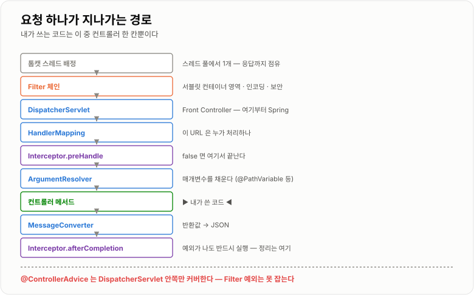
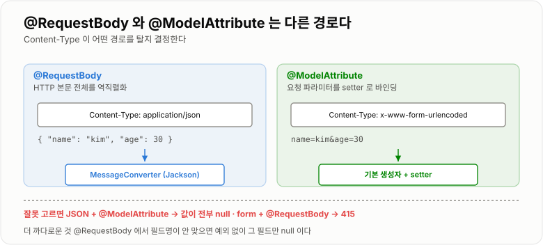

# Spring MVC 요청 흐름

> **HTTP 요청 하나가 톰캣 스레드에 실려 들어와 `DispatcherServlet`을 거쳐 컨트롤러 메서드까지 도달하고, 반환값이 다시 JSON으로 바뀌어 나가는 과정이다. 이 경로를 알면 "왜 그 필터가 안 타는지", "왜 값이 안 바인딩되는지"가 전부 설명된다.**

---

## 1. 핵심 요약

**Spring MVC의 핵심은 `DispatcherServlet`이라는 단일 창구다. 모든 요청이 여기로 들어오고, 이 서블릿이 "누가 처리할지 찾고 → 시키고 → 결과를 변환"하는 세 가지 일을 위임한다. 그래서 컨트롤러는 HTTP를 거의 모르는 채로 값만 받고 값만 돌려주면 된다.**

### 한눈에 보기

* **요청은 톰캣 스레드 풀에서 스레드 하나를 배정받아** 처리된다. 그 스레드가 응답을 다 쓸 때까지 다른 요청에 쓰이지 않는다.
* **`DispatcherServlet`은 Front Controller**다. 모든 요청을 받아 적절한 핸들러에게 넘긴다.
* 핵심 협력자는 넷이다. **`HandlerMapping`(누가 처리하나) → `HandlerAdapter`(어떻게 부르나) → `ArgumentResolver`(무엇을 넣나) → `MessageConverter`(어떻게 변환하나)**.
* **`@RequestBody`와 `@ModelAttribute`는 전혀 다른 경로로 값을 채운다.** 전자는 본문을 통째로 역직렬화하고, 후자는 요청 파라미터를 setter로 바인딩한다.
* **Filter는 서블릿 컨테이너 영역, Interceptor는 Spring 영역**이다. 이 경계가 "예외를 누가 잡는가"를 가른다.
* **`@ControllerAdvice`는 Interceptor 안쪽에서만 동작한다.** Filter에서 난 예외는 잡지 못한다.
* 컨트롤러는 **싱글톤 빈**이므로 필드에 요청별 상태를 두면 안 된다. [IoC · DI와 Bean](../IoC-DI와-Bean/IoC-DI와-Bean.md)에서 실측한 96,303 문제와 같은 이야기다.
* **스레드 풀이 요청 처리량의 상한**이다. 톰캣 기본 `max-threads`는 200이고, 이 스레드가 DB를 기다리면 그동안 놀고 있는 것이다.
* 그래서 **커넥션 풀 크기와 스레드 풀 크기는 함께 정해야 한다.** 스레드 200개가 커넥션 10개를 두고 다투면 190개는 대기한다.

> 이 노트의 스레드 풀 관련 수치는 [ThreadPool과 Deadlock](../../04-동시성/ThreadPool-Deadlock/ThreadPool-Deadlock.md), 커넥션 풀 수치는 [Connection Pool과 쿼리 튜닝](../../06-데이터베이스/ConnectionPool과-쿼리튜닝/ConnectionPool과-쿼리튜닝.md)에서 직접 측정한 값을 참조한 것이다.

### 무엇을 해결하는가

#### 서블릿만 있을 때

Spring MVC 없이 서블릿으로 API를 만들면 이렇게 된다.

```java
public class OrderServlet extends HttpServlet {

    @Override
    protected void doGet(HttpServletRequest req, HttpServletResponse resp)
            throws IOException {

        // ① URL 파싱을 직접 한다
        String path = req.getRequestURI();          // "/orders/42"
        String idText = path.substring(path.lastIndexOf('/') + 1);

        // ② 타입 변환을 직접 한다
        long id;
        try {
            id = Long.parseLong(idText);
        } catch (NumberFormatException e) {
            resp.setStatus(400);
            return;
        }

        // ③ 비즈니스 로직 (진짜 하고 싶었던 것)
        Order order = orderService.findById(id);

        // ④ 직렬화를 직접 한다
        resp.setContentType("application/json;charset=UTF-8");
        resp.getWriter().write(
                "{\"id\":" + order.getId() + ",\"price\":" + order.getPrice() + "}");
    }
}
```

```text
문제 1  URL마다 서블릿을 하나씩 만들고 web.xml에 등록해야 한다
문제 2  파싱·타입 변환·검증·직렬화가 모든 서블릿에 반복된다
문제 3  진짜 로직은 한 줄인데 나머지가 전부 배관 코드다
문제 4  JSON 문자열을 손으로 조립하다 보면 반드시 깨진다
문제 5  공통 처리(인증·로깅)를 넣을 자리가 마땅치 않다
```

#### DispatcherServlet이 대신하면

```java
@RestController
@RequestMapping("/orders")
public class OrderController {

    private final OrderService orderService;

    public OrderController(OrderService orderService) {
        this.orderService = orderService;
    }

    @GetMapping("/{id}")
    public OrderResponse findOne(@PathVariable long id) {
        return OrderResponse.from(orderService.findById(id));
    }
}
```

```text
URL 매칭        → HandlerMapping 이 한다
타입 변환        → ArgumentResolver 가 한다 (String "42" → long 42)
JSON 직렬화     → MessageConverter 가 한다
공통 처리        → Filter / Interceptor 자리가 마련되어 있다

  컨트롤러에는 "무엇을 받아 무엇을 돌려줄지"만 남는다
```

---

## 2. 동작 원리

### 핵심 구성 요소

| 구성 요소                    | 역할                            | 없으면                     |
| ------------------------ | ----------------------------- | ----------------------- |
| **`DispatcherServlet`**  | 모든 요청을 받는 단일 창구 (Front Controller) | URL마다 서블릿을 만들어야 한다      |
| **`HandlerMapping`**     | **어떤 URL을 누가 처리할지** 찾는다       | 매핑을 직접 `if`로 분기해야 한다    |
| **`HandlerAdapter`**     | 찾아낸 핸들러를 **어떻게 호출할지** 안다      | 핸들러 종류마다 호출 코드가 달라진다    |
| **`ArgumentResolver`**   | 메서드 매개변수에 **무엇을 넣을지** 만들어 준다  | `request`에서 직접 꺼내 변환해야 한다 |
| **`MessageConverter`**   | 본문 ↔ 객체 **변환**을 담당한다          | JSON을 손으로 만들어야 한다       |
| **`ReturnValueHandler`** | 반환값을 **응답으로 바꾸는** 방법을 정한다     | —                       |
| **`ViewResolver`**       | 뷰 이름을 실제 템플릿으로 바꾼다            | (REST API에서는 안 쓴다)      |
| **Filter**               | **서블릿 컨테이너** 수준의 전처리·후처리      | 인코딩·보안을 매번 넣어야 한다       |
| **Interceptor**          | **Spring MVC** 수준의 전처리·후처리    | 핸들러 정보를 못 본다            |

### 내부 동작 과정

#### 요청 하나가 지나가는 전체 경로

```text
클라이언트
   │  HTTP 요청
   ▼
톰캣 (서블릿 컨테이너)
   │  스레드 풀에서 스레드 하나 배정   ← 여기서 처리량 상한이 정해진다
   ▼
Filter 체인                          ← 서블릿 스펙 영역
   │  인코딩, CORS, 보안(Spring Security)
   ▼
DispatcherServlet                    ← Spring 영역 시작
   │
   ├─ ① HandlerMapping 에게 묻는다  "이 URL은 누가 처리하나?"
   │      → HandlerMethod (컨트롤러 + 메서드) 를 돌려받는다
   │
   ├─ ② Interceptor.preHandle()     ← false 를 반환하면 여기서 끝난다
   │
   ├─ ③ HandlerAdapter 가 핸들러를 호출한다
   │      ├─ ArgumentResolver 들이 매개변수를 채운다
   │      │     @PathVariable, @RequestParam, @RequestBody ...
   │      ├─ 검증 (@Valid)
   │      └─ ▶ 컨트롤러 메서드 실행 ◀   ← 내가 쓴 코드는 여기뿐이다
   │
   ├─ ④ ReturnValueHandler 가 반환값을 처리한다
   │      @ResponseBody 면 → MessageConverter 로 JSON 직렬화
   │      뷰 이름이면      → ViewResolver → 템플릿 렌더링
   │
   ├─ ⑤ Interceptor.postHandle()
   │
   ├─ (예외 발생 시) HandlerExceptionResolver
   │      → @ControllerAdvice / @ExceptionHandler 가 여기서 동작한다
   │
   └─ ⑥ Interceptor.afterCompletion()   ← 예외가 나도 반드시 실행된다
   ▼
Filter 체인 (역순으로 빠져나간다)
   ▼
클라이언트
```



*내가 작성하는 코드는 이 긴 경로 중 컨트롤러 메서드 한 칸뿐이다.*

#### 매개변수는 어떻게 채워지는가

**`ArgumentResolver`가 매개변수마다 "내가 처리할 수 있는지" 확인하고 값을 만든다.**

| 애너테이션                | 값의 출처                       | 변환 방식                  |
| -------------------- | --------------------------- | ---------------------- |
| `@PathVariable`      | URL 경로 (`/orders/42`)       | 타입 변환                  |
| `@RequestParam`      | 쿼리 스트링, form 데이터            | 타입 변환                  |
| **`@ModelAttribute`** | **요청 파라미터**                 | **기본 생성자 + setter 바인딩** |
| **`@RequestBody`**   | **HTTP 본문 전체**              | **`MessageConverter` 역직렬화** |
| `@RequestHeader`     | 헤더                          | 타입 변환                  |
| (애너테이션 없는 객체)        | 요청 파라미터 (`@ModelAttribute` 취급) | setter 바인딩             |

**`@RequestBody`와 `@ModelAttribute`를 헷갈리면 값이 전부 `null`이 된다.**

```text
JSON 본문을 보냈는데 @ModelAttribute 를 쓰면
    Content-Type: application/json
    { "name": "kim", "age": 30 }
       ↓
    요청 파라미터를 찾는데 없다  →  전부 null

form 데이터를 보냈는데 @RequestBody 를 쓰면
    Content-Type: application/x-www-form-urlencoded
    name=kim&age=30
       ↓
    JSON 파서가 읽으려다 실패  →  415 Unsupported Media Type
```



*Content-Type이 어떤 경로를 탈지 결정한다 — 애너테이션을 잘못 고르면 값이 조용히 비거나 415가 난다.*

**바인딩 방식의 차이가 만드는 실무 함정**

```text
@ModelAttribute (setter 바인딩)
  · 기본 생성자가 필요하다
  · setter 가 있어야 값이 들어간다
  · 일부만 실패해도 나머지는 채워진다 (BindingResult 에 오류가 쌓인다)

@RequestBody (Jackson 역직렬화)
  · 기본 생성자 + setter 또는 @JsonCreator 필요
  · 필드 이름이 안 맞으면 그 필드만 null (예외가 안 난다!)
  · record 나 final 필드는 별도 설정이 필요할 수 있다
```

#### Filter와 Interceptor — 경계가 중요하다

```text
     ┌─────────────────────────────────────────┐
     │  서블릿 컨테이너 (톰캣)                    │
     │                                         │
     │   Filter                                │
     │     ┌─────────────────────────────────┐ │
     │     │  Spring (DispatcherServlet)     │ │
     │     │                                 │ │
     │     │    Interceptor                  │ │
     │     │      ┌───────────────────────┐  │ │
     │     │      │  컨트롤러              │  │ │
     │     │      └───────────────────────┘  │ │
     │     │    @ControllerAdvice 의 범위 ──┘ │ │
     │     └─────────────────────────────────┘ │
     └─────────────────────────────────────────┘
```

| 항목            | Filter                     | Interceptor                     |
| ------------- | -------------------------- | ------------------------------- |
| **소속**        | 서블릿 스펙 (톰캣)                | Spring MVC                      |
| **실행 위치**     | `DispatcherServlet` **바깥** | `DispatcherServlet` **안**       |
| **핸들러 정보**    | 모른다                        | **안다** (어느 컨트롤러 메서드인지)          |
| **`request` 교체** | **가능** (`Wrapper`로 감싸기)    | 불가                              |
| **예외 처리**     | **`@ControllerAdvice`가 못 잡는다** | `@ControllerAdvice`가 잡는다        |
| **주 용도**      | 인코딩, CORS, 인증(Security), 본문 캐싱 | 인증·인가 확인, 로깅, `ThreadLocal` 정리  |

**이 경계가 실무에서 결정적인 이유**

```text
JWT 검증을 Filter 에서 하고 예외를 던지면
   → @RestControllerAdvice 가 못 잡는다
   → 톰캣 기본 오류 페이지(HTML)가 나간다
   → API 클라이언트가 JSON 을 기대했는데 HTML 을 받는다

  해결: Filter 안에서 직접 응답을 써 주거나
        HandlerExceptionResolver 를 주입받아 위임한다
```

#### 스레드 모델 — 처리량의 상한

```text
톰캣 스레드 풀 (기본 max-threads = 200)

  요청 1개 = 스레드 1개 점유
  응답을 다 쓸 때까지 그 스레드는 다른 요청에 못 쓰인다

  컨트롤러가 DB 를 기다리는 동안에도 스레드는 붙잡혀 있다
     → CPU 는 놀고 스레드만 소진된다
     → 200개가 다 차면 그 뒤 요청은 큐에서 대기
     → 큐(accept-count, 기본 100)도 차면 연결이 거부된다
```

**여기서 커넥션 풀과의 관계가 나온다.**

```text
톰캣 스레드 200개  +  커넥션 풀 10개

  동시에 DB 를 쓰는 요청이 200개면
    10개만 일하고 190개는 커넥션을 기다린다
    → 커넥션 획득 타임아웃이 나기 시작한다

  반대로 커넥션을 200개로 늘리면?
    DB 쪽이 못 버틴다
    → 실측에서 풀 크기를 20 이상 늘려도 처리량이 안 늘었다
       (Connection Pool 노트 참조)

  → 두 값을 함께 봐야 한다. 한쪽만 늘리는 것은 의미가 없다
```

---

## 3. 특징과 비교

| 구분          | 내용                                       |
| ----------- | ---------------------------------------- |
| **장점**      | 파싱·타입 변환·검증·직렬화를 프레임워크가 처리해 **컨트롤러에 비즈니스 의도만 남는다.** 확장 지점(Filter·Interceptor·Resolver·Converter)이 표준화되어 공통 처리를 한곳에 넣을 수 있다. |
| **단점**      | **경로가 길어 어디서 문제가 생겼는지 찾기 어렵다.** 요청 하나에 스레드 하나를 붙잡는 모델이라 I/O 대기가 길면 스레드가 놀면서 소진된다. 애너테이션 뒤에 동작이 숨어 있어 학습 곡선이 있다. |
| **적합한 상황**  | 일반적인 REST API와 웹 애플리케이션. 요청당 처리 시간이 짧고 동시 접속이 스레드 풀로 감당되는 규모. |
| **주의할 상황**  | **컨트롤러 필드에 요청별 상태를 두는 것**, 외부 API 호출이 길어 스레드를 오래 붙잡는 경우, Filter에서 던진 예외를 `@ControllerAdvice`가 잡을 거라고 기대하는 것. |

### 성능 특성

| 항목                 | 특성                                     |
| ------------------ | -------------------------------------- |
| 요청당 스레드            | **1개 점유** (응답 완료까지)                    |
| 톰캣 기본 `max-threads` | 200                                    |
| 톰캣 기본 `accept-count` | 100 (대기 큐)                             |
| 핸들러 조회             | 캐시되므로 사실상 무료                           |
| JSON 직렬화           | 응답 크기에 비례. 큰 목록에서는 무시할 수 없다            |
| **실질적 병목**         | **거의 항상 DB·외부 API 대기** (프레임워크 오버헤드가 아니다) |

**어디를 튜닝해야 하는가**

```text
느리다는 신고가 들어왔을 때 의심 순서

  1. 쿼리          — 인덱스, N+1  ← 대부분 여기다
  2. 외부 API 대기   — 타임아웃, 커넥션 재사용
  3. 커넥션 풀 고갈   — 풀 크기, 트랜잭션 길이
  4. 스레드 풀 고갈   — max-threads
  5. 직렬화         — 응답 크기, 불필요한 필드
  ─────────────────────────────────
  X. DispatcherServlet 자체  ← 여기가 문제인 경우는 사실상 없다
```

### 장점과 단점

| 장점                    | 이유                                  |
| --------------------- | ----------------------------------- |
| 컨트롤러에 배관 코드가 사라진다     | 파싱·변환·직렬화를 프레임워크가 한다.               |
| 공통 처리 자리가 표준화되어 있다    | Filter·Interceptor·Advice로 계층별 분리.  |
| 확장 지점이 열려 있다          | `ArgumentResolver`·`MessageConverter`를 직접 추가할 수 있다. |
| 예외 처리를 한곳에 모을 수 있다    | `@RestControllerAdvice`.            |
| 테스트가 쉽다               | `MockMvc`로 서버 없이 요청 흐름을 검증한다.       |

| 단점                          | 이유 및 주의점                                     |
| --------------------------- | -------------------------------------------- |
| **경로가 길어 디버깅이 어렵다**         | 어느 단계에서 값이 비었는지 추적하려면 구조를 알아야 한다.            |
| **요청당 스레드 1개**              | I/O 대기가 길면 스레드가 놀면서 소진된다.                    |
| Filter 예외를 Advice가 못 잡는다    | 경계 밖이라 HTML 오류 페이지가 나간다.                     |
| 바인딩 실패가 조용하다                | `@RequestBody`에서 필드명이 안 맞으면 **예외 없이 `null`** 이다. |
| 컨트롤러 싱글톤 함정                 | 필드에 상태를 두면 요청끼리 덮어쓴다.                        |
| 애너테이션 뒤에 동작이 숨는다            | 무엇이 어떤 순서로 도는지 코드에 안 보인다.                    |

### 어떤 상황에서 고르는가

#### Filter와 Interceptor 중 무엇을 쓸까

```text
요청/응답 자체를 바꿔야 한다 (본문 캐싱, 압축, 인코딩)
   → Filter (Wrapper 로 감쌀 수 있는 유일한 자리)

Spring Security 관련
   → Filter (Security 자체가 필터 체인이다)

어떤 컨트롤러 메서드인지 알아야 한다 (메서드 애너테이션 검사)
   → Interceptor (handler 객체를 받는다)

예외를 @ControllerAdvice 로 처리하고 싶다
   → Interceptor (Filter 는 경계 밖이다)

ThreadLocal 정리
   → Interceptor.afterCompletion (예외가 나도 실행된다)
```

#### `@RequestBody`와 `@ModelAttribute`

```text
Content-Type: application/json          → @RequestBody
Content-Type: x-www-form-urlencoded     → @ModelAttribute
쿼리 스트링 (GET 검색 조건 등)             → @ModelAttribute 또는 @RequestParam
파일 업로드 (multipart)                  → @RequestPart / MultipartFile
```

#### 비동기를 고려할 때

```text
요청당 스레드 모델이 한계에 부딪히는 경우
  · 외부 API 대기가 길다 (수 초)
  · 동시 접속이 스레드 수를 크게 넘는다
  · SSE·롱폴링처럼 연결을 오래 유지한다

선택지
  · DeferredResult / Callable  — 대기 중 톰캣 스레드를 반납한다
  · WebFlux                    — 아예 논블로킹 모델로 간다 (학습·생태계 비용 큼)

  다만 대부분의 서비스는 스레드 풀과 커넥션 풀을 제대로 맞추는 것으로 충분하다
```

### 비슷한 기술과 비교

#### Filter vs Interceptor vs AOP

| 기준         | Filter          | Interceptor         | AOP (`@Around`)      |
| ---------- | --------------- | ------------------- | -------------------- |
| **소속**     | 서블릿 컨테이너        | Spring MVC          | Spring AOP           |
| **적용 대상**  | 모든 요청           | 핸들러 매핑된 요청          | **모든 스프링 빈 메서드**     |
| **알 수 있는 것** | `request`/`response` | + 핸들러 정보            | + 매개변수 값, 반환값        |
| **장점**     | 요청 자체를 교체 가능    | 핸들러를 알고 Advice와 연동됨 | 계층 무관하게 적용           |
| **단점**     | Advice가 예외를 못 잡음 | 요청 교체 불가            | 자기호출에 안 걸림           |
| **선택 기준**  | 인코딩·보안·본문 캐싱    | 인증 확인·로깅·`ThreadLocal` | 트랜잭션·서비스 계층 공통 처리    |

#### `@Controller` vs `@RestController`

| 기준        | `@Controller`            | `@RestController`         |
| --------- | ------------------------ | ------------------------- |
| **반환값 해석** | 뷰 이름 → `ViewResolver`    | **본문** → `MessageConverter` |
| **정체**    | —                        | `@Controller` + `@ResponseBody` |
| **선택 기준** | 서버 렌더링(Thymeleaf 등)      | **REST API**              |

> `@Controller`에서 `String`을 반환하면 **뷰 이름으로 해석**된다. REST API를 만들면서 `@Controller`를 쓰면 "템플릿을 찾을 수 없다"는 오류가 나는 이유다.

#### 동기 MVC vs WebFlux

| 기준         | Spring MVC          | WebFlux              |
| ---------- | ------------------- | -------------------- |
| **모델**     | 요청당 스레드 1개          | 이벤트 루프 + 논블로킹        |
| **대기 중**   | 스레드가 붙잡힘            | **스레드를 반납**          |
| **장점**     | 단순하고 디버깅이 쉽다        | 적은 스레드로 많은 동시 연결     |
| **단점**     | 동시 연결이 스레드 수에 묶인다   | 학습 곡선, 블로킹 코드 하나가 전체를 망침 |
| **선택 기준**  | **대부분의 서비스**        | 대기가 길고 동시 연결이 매우 많을 때 |

---

## 4. 실무 주의사항

### 백엔드 실무 적용

#### 컨트롤러는 얇게 유지한다

```java
// 나쁜 예 — 컨트롤러에 로직이 들어왔다
@PostMapping("/orders")
public OrderResponse create(@RequestBody OrderRequest request) {
    if (request.getQuantity() <= 0) {
        throw new IllegalArgumentException("수량 오류");
    }
    Product product = productRepository.findById(request.getProductId())
            .orElseThrow(() -> new NotFoundException("상품 없음"));
    int price = product.getPrice() * request.getQuantity();
    // ... 할인 계산, 재고 차감 ...
    return OrderResponse.from(orderRepository.save(order));
}
```

```java
// 좋은 예 — 변환과 위임만 한다
@PostMapping("/orders")
public OrderResponse create(@RequestBody @Valid OrderRequest request) {
    Order order = orderService.place(request.toCommand());
    return OrderResponse.from(order);
}
```

```text
컨트롤러의 책임은 세 가지뿐이다
  ① HTTP 요청을 애플리케이션 입력(Command/DTO)으로 바꾼다
  ② 서비스에 위임한다
  ③ 결과를 HTTP 응답으로 바꾼다

  이렇게 두면 트랜잭션 경계가 Service 에 정확히 놓이고
  컨트롤러를 안 거치는 테스트가 쉬워진다
```

#### 컨트롤러 필드에 상태를 두지 않는다

```java
// 위험 — 컨트롤러도 싱글톤이다
@RestController
public class OrderController {

    private long currentUserId;              // 요청들이 서로 덮어쓴다

    @GetMapping("/orders")
    public List<OrderResponse> list(@RequestHeader("X-User-Id") long userId) {
        this.currentUserId = userId;         // 다른 요청이 바꿔 놓을 수 있다
        return orderService.findByUser(currentUserId);   // 남의 주문이 나갈 수 있다
    }
}
```

**정보 유출로 이어지는 사고**다. [IoC · DI와 Bean](../IoC-DI와-Bean/IoC-DI와-Bean.md)에서 100,000이 96,303이 된 것과 같은 원인이고, 여기서는 값이 틀리는 정도가 아니라 **다른 사용자의 데이터가 나간다.**

#### 요청 ID를 심어 로그를 추적한다

```java
@Component
public class RequestIdFilter extends OncePerRequestFilter {

    private static final String REQUEST_ID = "requestId";
    private static final String HEADER = "X-Request-Id";

    @Override
    protected void doFilterInternal(HttpServletRequest request,
                                    HttpServletResponse response,
                                    FilterChain chain) throws ServletException, IOException {
        String requestId = request.getHeader(HEADER);
        if (requestId == null || requestId.isEmpty()) {
            requestId = UUID.randomUUID().toString().substring(0, 8);
        }

        MDC.put(REQUEST_ID, requestId);
        response.setHeader(HEADER, requestId);
        try {
            chain.doFilter(request, response);
        } finally {
            MDC.remove(REQUEST_ID);          // 반드시 지운다 — 스레드가 재사용된다
        }
    }
}
```

**`finally`에서 `MDC.remove()`를 빠뜨리면** 톰캣 스레드가 재사용될 때 **이전 요청의 ID가 다음 요청 로그에 찍힌다.** `ThreadLocal` 누수와 정확히 같은 문제다.

#### Interceptor에서 컨텍스트를 정리한다

```java
@Component
public class UserContextInterceptor implements HandlerInterceptor {

    @Override
    public boolean preHandle(HttpServletRequest request,
                             HttpServletResponse response,
                             Object handler) {
        String userId = request.getHeader("X-User-Id");
        if (userId == null) {
            response.setStatus(HttpServletResponse.SC_UNAUTHORIZED);
            return false;                    // false 를 반환하면 컨트롤러로 안 간다
        }
        UserContextHolder.set(userId);
        return true;
    }

    @Override
    public void afterCompletion(HttpServletRequest request,
                                HttpServletResponse response,
                                Object handler,
                                Exception ex) {
        UserContextHolder.clear();           // 예외가 나도 반드시 실행된다
    }
}
```

```text
postHandle 이 아니라 afterCompletion 에 두는 이유

  postHandle    — 컨트롤러가 예외를 던지면 호출되지 않는다
  afterCompletion — 예외가 나도 반드시 호출된다

  정리 코드는 언제나 afterCompletion 이다
```

#### Filter에서 난 예외를 JSON으로 응답하기

```java
@Component
public class JwtFilter extends OncePerRequestFilter {

    private final HandlerExceptionResolver resolver;

    public JwtFilter(@Qualifier("handlerExceptionResolver") HandlerExceptionResolver resolver) {
        this.resolver = resolver;
    }

    @Override
    protected void doFilterInternal(HttpServletRequest request,
                                    HttpServletResponse response,
                                    FilterChain chain) throws ServletException, IOException {
        try {
            // ... 토큰 검증 ...
            chain.doFilter(request, response);
        } catch (JwtException e) {
            // @RestControllerAdvice 로 위임한다
            resolver.resolveException(request, response, null, e);
        }
    }
}
```

이렇게 하지 않으면 **톰캣 기본 HTML 오류 페이지**가 나가서, JSON을 기대한 클라이언트가 파싱에 실패한다.

#### 스레드 풀과 커넥션 풀을 함께 설정한다

```yaml
server:
  tomcat:
    threads:
      max: 200            # 동시에 처리할 요청 수
      min-spare: 20
    accept-count: 100     # 스레드가 다 찼을 때 대기 큐

spring:
  datasource:
    hikari:
      maximum-pool-size: 20        # DB 동시 접근 수
      connection-timeout: 3000     # 3초 안에 못 받으면 실패시킨다
```

```text
왜 스레드 200 인데 커넥션 20 인가

  · 모든 요청이 동시에 DB 를 쓰지는 않는다
  · 커넥션을 늘려도 DB 가 못 버티면 소용없다
    (실측: 풀 20 → 50 으로 늘려도 처리량이 안 늘었다)
  · connection-timeout 을 짧게 두어 "빨리 실패"시키는 것이
    무한정 대기하다 스레드까지 다 소진되는 것보다 낫다
```

### 자주 하는 오해

| 잘못된 이해                                  | 올바른 이해                                                              |
| --------------------------------------- | ------------------------------------------------------------------- |
| 컨트롤러는 요청마다 새로 만들어진다                     | **싱글톤 빈이다.** 필드에 상태를 두면 요청끼리 덮어쓰고 **다른 사용자 데이터가 나갈 수 있다.**         |
| `@RequestBody`와 `@ModelAttribute`는 비슷하다 | **완전히 다른 경로다.** 전자는 본문 역직렬화, 후자는 요청 파라미터 setter 바인딩.                |
| JSON 필드명이 안 맞으면 예외가 난다                  | **예외 없이 `null`** 이다. 조용히 비어서 나중에 NPE로 터진다.                          |
| Filter에서 던진 예외도 `@ControllerAdvice`가 잡는다 | **못 잡는다.** Filter는 `DispatcherServlet` 바깥이라 톰캣 HTML 오류 페이지가 나간다.    |
| Interceptor의 `postHandle`은 항상 실행된다      | 컨트롤러가 예외를 던지면 **호출되지 않는다.** 정리는 `afterCompletion`에 둔다.              |
| 요청이 오면 스레드가 새로 만들어진다                    | **풀에서 빌려 쓴다.** 그래서 `ThreadLocal`·MDC를 안 지우면 다음 요청에 샌다.              |
| DB를 기다리는 동안 스레드는 다른 일을 한다               | **아니다.** 붙잡힌 채 블로킹된다. 이것이 요청당 스레드 모델의 한계다.                          |
| 톰캣 스레드를 늘리면 처리량이 는다                     | 병목이 DB면 소용없다. **커넥션 풀과 함께** 봐야 한다.                                  |
| `@Controller`로 REST API를 만들어도 된다        | 반환 `String`이 **뷰 이름**으로 해석된다. `@RestController`나 `@ResponseBody`가 필요하다. |
| Spring MVC 자체가 느려서 응답이 느리다              | 거의 항상 **쿼리·외부 API**가 원인이다. 프레임워크 오버헤드가 병목인 경우는 사실상 없다.              |

---

## 5. 예제

### 표준적인 REST 컨트롤러

```java
@RestController
@RequestMapping("/api/orders")
public class OrderController {

    private final OrderService orderService;

    public OrderController(OrderService orderService) {
        this.orderService = orderService;
    }

    @GetMapping("/{id}")
    public OrderResponse findOne(@PathVariable long id) {
        return OrderResponse.from(orderService.findById(id));
    }

    /** 검색 조건은 쿼리 스트링 → @ModelAttribute */
    @GetMapping
    public PageResponse<OrderResponse> search(@ModelAttribute OrderSearchCondition condition) {
        return PageResponse.from(orderService.search(condition));
    }

    /** 생성은 JSON 본문 → @RequestBody */
    @PostMapping
    @ResponseStatus(HttpStatus.CREATED)
    public OrderResponse create(@RequestBody @Valid OrderCreateRequest request) {
        return OrderResponse.from(orderService.place(request.toCommand()));
    }

    @DeleteMapping("/{id}")
    @ResponseStatus(HttpStatus.NO_CONTENT)
    public void cancel(@PathVariable long id) {
        orderService.cancel(id);
    }
}
```

### 요청 DTO와 검증

```java
public class OrderCreateRequest {

    @NotNull(message = "상품 ID는 필수입니다")
    private Long productId;

    @Min(value = 1, message = "수량은 1 이상이어야 합니다")
    private int quantity;

    /** Jackson 역직렬화와 @ModelAttribute 바인딩에 모두 필요하다. */
    public OrderCreateRequest() {
    }

    public Long getProductId() {
        return productId;
    }

    public void setProductId(Long productId) {
        this.productId = productId;
    }

    public int getQuantity() {
        return quantity;
    }

    public void setQuantity(int quantity) {
        this.quantity = quantity;
    }

    /** 컨트롤러 밖으로는 요청 DTO를 넘기지 않는다. */
    public OrderCommand toCommand() {
        return new OrderCommand(productId, quantity);
    }
}
```

**`@Valid`를 붙이면** 바인딩 후 검증이 실행되고, 실패하면 `MethodArgumentNotValidException`이 던져져 `@RestControllerAdvice`가 잡는다.

### Interceptor 등록

```java
@Configuration
public class WebConfig implements WebMvcConfigurer {

    private final UserContextInterceptor userContextInterceptor;

    public WebConfig(UserContextInterceptor userContextInterceptor) {
        this.userContextInterceptor = userContextInterceptor;
    }

    @Override
    public void addInterceptors(InterceptorRegistry registry) {
        registry.addInterceptor(userContextInterceptor)
                .order(1)
                .addPathPatterns("/api/**")
                .excludePathPatterns("/api/health", "/api/login");
    }
}
```

### 커스텀 ArgumentResolver — 반복되는 헤더 추출 없애기

```java
@Target(ElementType.PARAMETER)
@Retention(RetentionPolicy.RUNTIME)
public @interface LoginUser {
}
```

```java
@Component
public class LoginUserArgumentResolver implements HandlerMethodArgumentResolver {

    /** 이 매개변수를 내가 처리할지 판단한다. */
    @Override
    public boolean supportsParameter(MethodParameter parameter) {
        return parameter.hasParameterAnnotation(LoginUser.class)
                && parameter.getParameterType().equals(Long.class);
    }

    /** 실제 값을 만들어 준다. */
    @Override
    public Object resolveArgument(MethodParameter parameter,
                                  ModelAndViewContainer container,
                                  NativeWebRequest webRequest,
                                  WebDataBinderFactory binderFactory) {
        String userId = webRequest.getHeader("X-User-Id");
        if (userId == null) {
            throw new UnauthorizedException("인증 정보가 없습니다");
        }
        return Long.valueOf(userId);
    }
}
```

```java
// 등록한 뒤에는 컨트롤러가 깔끔해진다
@GetMapping("/me/orders")
public List<OrderResponse> myOrders(@LoginUser Long userId) {
    return orderService.findByUser(userId).stream()
            .map(OrderResponse::from)
            .collect(Collectors.toList());
}
```

**모든 컨트롤러에서 `request.getHeader("X-User-Id")`를 반복하고 `null` 검사를 하던 것이 사라진다.**

### MockMvc로 요청 흐름 검증하기

```java
@WebMvcTest(OrderController.class)
class OrderControllerTest {

    @Autowired
    private MockMvc mockMvc;

    @MockBean
    private OrderService orderService;

    @Test
    void 주문_조회() throws Exception {
        given(orderService.findById(1L))
                .willReturn(new Order(1L, 10000));

        mockMvc.perform(get("/api/orders/1"))
                .andExpect(status().isOk())
                .andExpect(jsonPath("$.id").value(1))
                .andExpect(jsonPath("$.price").value(10000));
    }

    @Test
    void 수량이_0이면_400() throws Exception {
        String body = "{\"productId\":1,\"quantity\":0}";

        mockMvc.perform(post("/api/orders")
                        .contentType(MediaType.APPLICATION_JSON)
                        .content(body))
                .andExpect(status().isBadRequest());
    }
}
```

`@WebMvcTest`는 **컨트롤러 계층만 띄운다.** 서비스·리포지토리 빈은 만들지 않으므로 `@SpringBootTest`보다 훨씬 빠르다.

---

## 6. 면접 정리

### 자주 나오는 질문

#### 기본 질문

1. **HTTP 요청 하나가 어떤 순서로 처리되나요?**

    * 핵심 키워드: 톰캣 스레드 → Filter → `DispatcherServlet` → `HandlerMapping` → Interceptor → `HandlerAdapter`/`ArgumentResolver` → 컨트롤러 → `MessageConverter`

2. **`DispatcherServlet`은 무엇을 하나요?**

    * 핵심 키워드: **Front Controller**, 모든 요청의 단일 창구, 찾고·시키고·변환하는 일을 위임

3. **`HandlerMapping`과 `HandlerAdapter`는 무엇이 다른가요?**

    * 핵심 키워드: **누가 처리할지 찾기** vs **어떻게 호출할지 알기**

4. **`@RequestBody`와 `@ModelAttribute`의 차이는 무엇인가요?**

    * 핵심 키워드: **본문 역직렬화(`MessageConverter`)** vs **요청 파라미터 setter 바인딩**

5. **Filter와 Interceptor의 차이는 무엇인가요?**

    * 핵심 키워드: **서블릿 컨테이너 vs Spring MVC**, 핸들러 정보 유무, `request` 교체 가능 여부

6. **컨트롤러는 요청마다 새로 만들어지나요?**

    * 핵심 키워드: **싱글톤이다.** 필드에 상태를 두면 요청끼리 덮어쓴다

7. **요청 하나에 스레드는 몇 개 쓰이나요?**

    * 핵심 키워드: **1개**, 응답 완료까지 점유, 톰캣 기본 `max-threads` 200

8. **`@Controller`와 `@RestController`는 무엇이 다른가요?**

    * 핵심 키워드: 반환값을 **뷰 이름**으로 vs **본문**으로, `@RestController = @Controller + @ResponseBody`

#### 꼬리 질문

1. **Filter에서 예외를 던지면 `@RestControllerAdvice`가 잡나요?**

    * 핵심 키워드: **못 잡는다.** `DispatcherServlet` 바깥이라 톰캣 HTML 오류 페이지가 나감. `HandlerExceptionResolver`에 위임

2. **`ThreadLocal`이나 MDC는 어디서 정리해야 하나요?**

    * 핵심 키워드: **`afterCompletion`** (예외가 나도 실행됨), `postHandle`은 예외 시 호출 안 됨

3. **정리를 안 하면 무슨 일이 생기나요?**

    * 핵심 키워드: **톰캣 스레드가 재사용**되므로 이전 요청 정보가 다음 요청에 샌다 (로그 오염·정보 유출)

4. **JSON 필드명이 DTO와 안 맞으면 어떻게 되나요?**

    * 핵심 키워드: **예외 없이 `null`**, 나중에 엉뚱한 곳에서 NPE

5. **컨트롤러 필드에 상태를 두면 정확히 어떤 사고가 나나요?**

    * 핵심 키워드: 싱글톤 공유, **다른 사용자 데이터 노출**, 96,303 실측과 같은 원인

6. **톰캣 스레드를 늘리면 처리량이 느나요?**

    * 핵심 키워드: **병목이 DB면 소용없다.** 커넥션 풀과 함께 봐야 함. 실측상 풀 20 이상은 이득 없었음

7. **스레드 풀과 커넥션 풀은 어떤 관계인가요?**

    * 핵심 키워드: 스레드 200 + 커넥션 20이면 **180개는 대기**, `connection-timeout`으로 빨리 실패시키는 게 낫다

8. **DB를 기다리는 동안 톰캣 스레드는 무엇을 하나요?**

    * 핵심 키워드: **블로킹된 채 붙잡혀 있다.** CPU는 놀고 스레드만 소진 — 요청당 스레드 모델의 한계

9. **그럼 WebFlux를 써야 하나요?**

    * 핵심 키워드: 대기가 길고 동시 연결이 매우 많을 때만. **대부분은 두 풀을 맞추면 충분**, 블로킹 코드 하나가 전체를 망침

10. **`ArgumentResolver`를 직접 만들어 본 적 있나요?**

    * 핵심 키워드: `supportsParameter` + `resolveArgument`, 반복되는 헤더 추출·인증 정보 주입 제거

11. **Interceptor의 `preHandle`이 `false`를 반환하면?**

    * 핵심 키워드: **컨트롤러로 가지 않는다**, 응답을 직접 써야 함

12. **`@WebMvcTest`와 `@SpringBootTest`는 무엇이 다른가요?**

    * 핵심 키워드: **컨트롤러 계층만** vs 전체 컨텍스트, 속도 차이가 크다

### 30초 답변

> 요청은 먼저 **톰캣 스레드 풀에서 스레드 하나를 배정받고**, Filter 체인을 지나 `DispatcherServlet`에 도착합니다. `DispatcherServlet`은 Front Controller로서 **`HandlerMapping`에게 누가 처리할지 묻고, `HandlerAdapter`가 `ArgumentResolver`로 매개변수를 채워 컨트롤러를 호출하고, 반환값을 `MessageConverter`가 JSON으로 바꿉니다.** 그래서 컨트롤러는 HTTP를 거의 모른 채 값만 받고 값만 돌려주면 됩니다.

#### 이어서 더 물으면

실무에서 이 흐름을 알아야 하는 이유는 **경계 때문**입니다. Filter는 서블릿 컨테이너 영역이고 Interceptor는 Spring 영역인데, `@RestControllerAdvice`는 `DispatcherServlet` 안쪽만 커버합니다. 그래서 **JWT 검증을 Filter에서 하고 예외를 던지면 Advice가 못 잡아서** 톰캣 기본 HTML 오류 페이지가 나가고, JSON을 기대한 클라이언트가 파싱에 실패합니다. 이럴 땐 `HandlerExceptionResolver`를 주입받아 위임합니다.

바인딩도 자주 문제가 됩니다. **`@RequestBody`는 본문을 통째로 역직렬화하고 `@ModelAttribute`는 요청 파라미터를 setter로 바인딩**하는 완전히 다른 경로인데, JSON을 보내면서 `@ModelAttribute`를 쓰면 값이 전부 `null`이 되고 form 데이터에 `@RequestBody`를 쓰면 415가 납니다. 더 까다로운 건 **JSON 필드명이 DTO와 안 맞으면 예외 없이 그냥 `null`** 이라는 점입니다. 조용히 비어 있다가 나중에 엉뚱한 곳에서 NPE로 터집니다.

또 하나 중요한 건 **컨트롤러도 싱글톤 빈**이라는 사실입니다. 필드에 사용자 ID 같은 걸 담으면 요청끼리 덮어쓰는데, 이건 값이 틀리는 정도가 아니라 **다른 사용자의 데이터가 응답으로 나가는 사고**가 됩니다. 같은 이유로 `ThreadLocal`이나 MDC는 반드시 `afterCompletion`에서 정리해야 합니다. 톰캣 스레드가 재사용되기 때문에 안 지우면 다음 요청 로그에 이전 요청 ID가 찍힙니다. `postHandle`이 아니라 `afterCompletion`인 이유는 **컨트롤러가 예외를 던지면 `postHandle`은 호출되지 않기 때문**입니다.

성능 쪽에서는 **요청당 스레드 하나**라는 모델을 이해하는 게 핵심입니다. 컨트롤러가 DB를 기다리는 동안에도 그 스레드는 블로킹된 채 붙잡혀 있어서, CPU는 놀고 스레드만 소진됩니다. 그래서 **톰캣 스레드 풀과 커넥션 풀을 함께 봐야** 합니다. 스레드 200개에 커넥션 20개면 나머지는 대기하는데, 커넥션을 무작정 늘리는 것도 답이 아닙니다. 실제로 재 봤을 때 풀 크기를 20에서 50으로 늘려도 처리량이 늘지 않았습니다. `connection-timeout`을 짧게 걸어 **빨리 실패시키는 것**이 무한정 대기하다 스레드까지 다 소진되는 것보다 낫습니다.

#### 답변 구조

1. **정의** — Spring MVC는 `DispatcherServlet`을 단일 창구로 두고 요청 처리에 필요한 일(핸들러 탐색·호출·값 변환)을 표준화된 협력자에게 위임하는 웹 프레임워크다
2. **내부 원리** — 톰캣이 스레드를 배정하고 Filter 체인을 거쳐 `DispatcherServlet`에 도달한다. `HandlerMapping`이 핸들러를 찾고 Interceptor `preHandle`을 거쳐 `HandlerAdapter`가 `ArgumentResolver`로 매개변수를 채워 컨트롤러를 호출한다. 반환값은 `ReturnValueHandler`와 `MessageConverter`가 응답으로 바꾸고, 예외는 `HandlerExceptionResolver`가 `@ControllerAdvice`로 넘긴다
3. **복잡도**
    * 요청당 스레드 **1개** 점유, 톰캣 기본 `max-threads` **200**, `accept-count` **100**
    * 핸들러 조회는 캐시되어 사실상 무료
    * 실질 병목은 프레임워크가 아니라 **DB·외부 API 대기**
    * 커넥션 풀은 실측상 **20을 넘겨도 처리량이 늘지 않았다**
4. **장점** — 파싱·타입 변환·검증·직렬화를 프레임워크가 처리해 컨트롤러에 비즈니스 의도만 남는다. Filter·Interceptor·`ArgumentResolver`·`MessageConverter`라는 확장 지점이 표준화되어 공통 처리를 한곳에 넣을 수 있고, `MockMvc`로 서버 없이 흐름을 검증할 수 있다
5. **단점** — 경로가 길어 어느 단계에서 값이 비었는지 추적하기 어렵고, 요청당 스레드 모델이라 I/O 대기가 길면 스레드가 놀면서 소진된다. Filter 예외를 Advice가 못 잡고, `@RequestBody` 바인딩 실패가 예외 없이 `null`이 되며, 컨트롤러 싱글톤 함정이 있다
6. **사용 기준** — 요청/응답 자체를 바꾸거나 Security 관련이면 Filter, 핸들러 정보가 필요하거나 Advice로 예외를 처리하려면 Interceptor를 쓴다. JSON이면 `@RequestBody`, 쿼리 스트링·form이면 `@ModelAttribute`를 쓴다. 정리 코드는 항상 `afterCompletion`에 둔다. 스레드 풀과 커넥션 풀은 함께 정하고 `connection-timeout`으로 빨리 실패시킨다
7. **대안과 비교** — Filter는 요청 교체가 가능하지만 Advice 밖이고, Interceptor는 핸들러를 알지만 요청을 못 바꾸며, AOP는 계층 무관하게 걸리지만 자기호출에 약하다. WebFlux는 대기 중 스레드를 반납해 적은 스레드로 많은 연결을 처리하지만 학습 비용이 크고 블로킹 코드 하나가 전체를 망친다
8. **실무 적용 사례** — 컨트롤러는 DTO 변환과 위임만 하도록 얇게 유지해 트랜잭션 경계를 Service에 정확히 놓는다. `OncePerRequestFilter`로 요청 ID를 MDC에 심고 `finally`에서 제거해 로그를 추적하며, 인증 컨텍스트는 Interceptor `preHandle`에서 설정하고 `afterCompletion`에서 정리한다. 반복되는 헤더 추출은 `@LoginUser` 같은 커스텀 `ArgumentResolver`로 걷어내고, 컨트롤러 테스트는 `@WebMvcTest`로 계층만 띄운다

### 핵심 키워드

`DispatcherServlet` · `Front Controller` · `HandlerMapping` · `HandlerAdapter` · `ArgumentResolver` · `MessageConverter` · `ViewResolver` · `Filter` · `Interceptor` · `HandlerExceptionResolver` · `요청당 스레드` · `max-threads` · `@RequestBody` · `@ModelAttribute` · `MDC`

### 이어서 볼 주제

* **[Spring Boot와 예외 처리](../Spring-Boot와-예외처리/Spring-Boot와-예외처리.md)** — `HandlerExceptionResolver` 자리에서 `@RestControllerAdvice`가 어떻게 응답을 만드는지.
* **[IoC · DI와 Bean](../IoC-DI와-Bean/IoC-DI와-Bean.md)** — 컨트롤러가 싱글톤이라 상태를 두면 안 되는 이유의 실측 근거.
* **[ThreadPool과 Deadlock](../../04-동시성/ThreadPool-Deadlock/ThreadPool-Deadlock.md)** — 톰캣 스레드 풀도 같은 원리로 동작한다. 큐가 스레드보다 먼저라는 규칙 포함.
* **[Connection Pool과 쿼리 튜닝](../../06-데이터베이스/ConnectionPool과-쿼리튜닝/ConnectionPool과-쿼리튜닝.md)** — 스레드 풀과 함께 정해야 하는 나머지 반쪽.
* **[JVM 메모리와 GC](../../03-Java/JVM-메모리-GC/JVM-메모리-GC.md)** — `ThreadLocal`·MDC 누수가 왜 스레드 풀에서만 문제가 되는지.
* **Spring Security 필터 체인** — 인증·인가가 Filter 영역에서 어떤 순서로 도는지.
* **`DeferredResult`와 WebFlux** — 요청당 스레드 모델을 벗어나는 선택지.

### 최종 체크리스트

* [ ] 요청 하나가 지나가는 전체 경로를 순서대로 말할 수 있다.
* [ ] `DispatcherServlet`이 **Front Controller**로서 하는 일을 설명할 수 있다.
* [ ] `HandlerMapping`과 `HandlerAdapter`의 역할을 구분할 수 있다.
* [ ] `ArgumentResolver`가 무엇을 하는지 알고 직접 만드는 방법을 안다.
* [ ] **`@RequestBody`와 `@ModelAttribute`의 경로 차이**를 설명할 수 있다.
* [ ] JSON 필드명이 안 맞으면 **예외 없이 `null`** 이 된다는 것을 안다.
* [ ] Filter와 Interceptor의 경계와 그것이 예외 처리에 미치는 영향을 안다.
* [ ] **Filter 예외를 `@ControllerAdvice`가 못 잡는 이유**와 해결책을 안다.
* [ ] 정리 코드를 `postHandle`이 아니라 **`afterCompletion`** 에 두는 이유를 설명할 수 있다.
* [ ] `ThreadLocal`·MDC를 안 지우면 무슨 일이 생기는지 안다.
* [ ] **컨트롤러가 싱글톤**이라는 것과 그것이 만드는 보안 사고를 안다.
* [ ] 요청당 스레드 모델과 그 한계를 설명할 수 있다.
* [ ] **스레드 풀과 커넥션 풀을 함께 봐야 하는 이유**를 설명할 수 있다.
* [ ] 느린 응답의 원인을 의심하는 순서를 말할 수 있다.
* [ ] `@Controller`로 REST API를 만들면 무엇이 문제인지 안다.
* [ ] `@WebMvcTest`와 `@SpringBootTest`의 차이를 안다.
