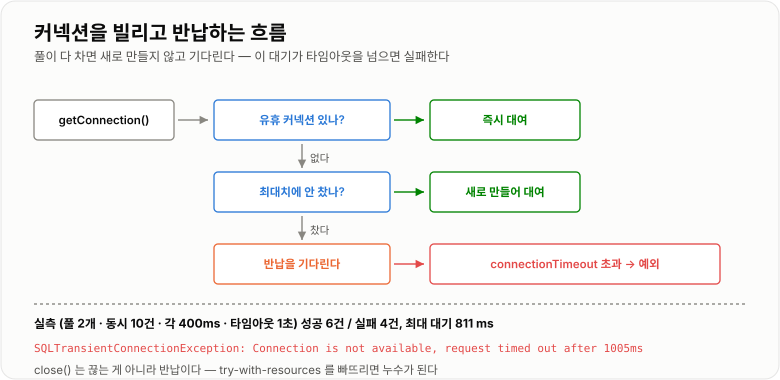
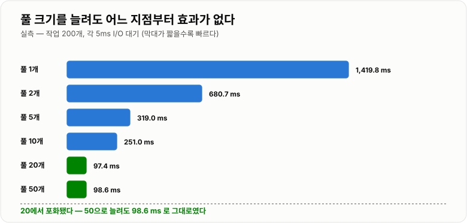
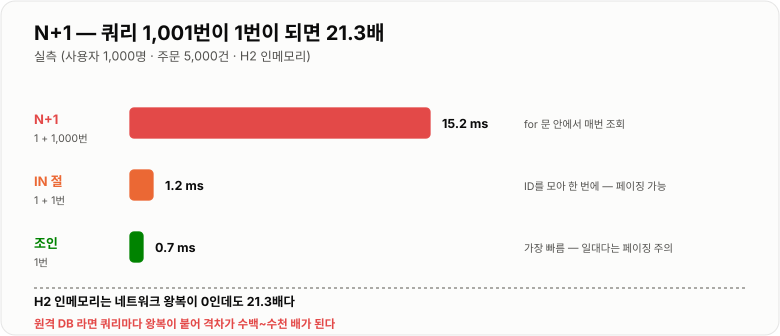

# Connection Pool과 쿼리 튜닝

> **커넥션은 만들기 비싼 자원이라 미리 만들어 두고 빌려 쓴다. 그래서 풀 크기가 곧 DB 동시 접근 수의 상한이고, 커넥션을 오래 붙잡는 코드 한 줄이 전체 서비스를 멈춘다. 튜닝의 대상은 풀 크기가 아니라 "커넥션을 얼마나 짧게 쓰는가"다.**

---

## 1. 핵심 요약

**풀 크기를 키우는 것은 거의 항상 틀린 해법이다. 실측에서 풀을 20에서 50으로 늘려도 처리량이 전혀 늘지 않았다. 정작 효과가 큰 것은 커넥션을 붙잡는 시간을 줄이는 것 — 트랜잭션을 짧게 하고, N+1을 없애고, 외부 API를 트랜잭션 밖으로 빼는 일이다.**

### 한눈에 보기

* **커넥션 풀은 커넥션을 미리 만들어 두고 빌려주는 구조**다. 애플리케이션은 만들지 않고 **빌리고 반납**만 한다.
* 커넥션 하나를 새로 여는 데 실측 **약 0.5 ms**가 걸렸다. 이건 H2 인메모리 기준이고, **네트워크 DB는 TCP 핸드셰이크와 인증 때문에 훨씬 크다.**
* **풀이 고갈되면 요청이 실패한다.** 풀 2개에 동시 10개를 던졌더니 **6건 성공, 4건이 `SQLTransientConnectionException`** 으로 실패했다.
* 실패 메시지는 `Connection is not available, request timed out after 1005ms`다. **이 메시지를 보면 풀 고갈**이다.
* **풀 크기를 늘려도 어느 지점부터는 효과가 없다.** 실측에서 1→1,419 ms, 5→319 ms, **20→97 ms, 50→98 ms**로 20에서 포화됐다.
* **커넥션을 반납하지 않으면 풀이 완전히 막힌다.** 3개짜리 풀에서 3개를 빌리고 안 닫자 네 번째부터 아무도 못 쓰게 됐다.
* **`connection-timeout`을 짧게 거는 것이 중요하다.** 무한정 기다리면 스레드까지 다 소진되어 서비스 전체가 멈춘다.
* 쿼리 쪽에서 가장 효과가 큰 것은 **N+1 제거**다. 실측에서 1,000명의 주문을 읽을 때 N+1이 **15.2 ms**, 조인 한 번이 **0.7 ms**로 **21.3배** 차이가 났다.
* **`PreparedStatement` 재사용이 4.9배 빨랐다**(2,000회에 53.5 ms → 11.0 ms). 성능뿐 아니라 SQL 인젝션 방어이기도 하다.

> 이 노트의 수치는 **H2 1.4.200 + HikariCP 4.0.3 + JDK 17.0.12(6코어)** 에서 직접 실행해 측정했다. **H2는 인메모리라 네트워크 왕복이 없으므로, 실제 원격 DB에서는 커넥션 생성 비용과 N+1 격차가 훨씬 커진다.** 절대값이 아니라 경향으로 읽어야 한다.

### 무엇을 해결하는가

#### 커넥션 풀이 없을 때

요청마다 커넥션을 새로 만들면 이렇게 된다.

```java
public Order findById(long id) {
    // 요청마다 새 커넥션
    try (Connection conn = DriverManager.getConnection(url, user, password);
         PreparedStatement ps = conn.prepareStatement("SELECT * FROM orders WHERE id = ?")) {
        ps.setLong(1, id);
        // ...
    }
}
```

**커넥션 하나를 여는 동안 실제로 벌어지는 일**

```text
① TCP 3-way handshake        네트워크 왕복 1회
② TLS 핸드셰이크 (쓴다면)      왕복 2회 이상
③ DB 인증 (사용자·비밀번호)     왕복 1~2회
④ 세션 초기화 (문자셋, 타임존)   왕복 1회

  → 로컬 DB라도 수 밀리초, 원격이면 수십 밀리초
  → 정작 쿼리 자체는 1 ms 도 안 걸리는데
```

**실측 결과 (H2 인메모리)**

```text
커넥션 하나 여는 데 평균 0.496 ms

  네트워크가 없는 인메모리 DB인데도 0.5 ms 다.
  원격 MySQL 이라면 여기에 왕복 4~6회가 더 붙는다.
```

더 심각한 문제는 **DB 쪽 부하**다.

```text
DB는 커넥션마다 세션과 메모리를 할당한다
   → 동시 접속이 수천 개가 되면 DB 가 먼저 죽는다
   → 애플리케이션 서버를 늘릴수록 DB 가 더 위험해진다

  즉 커넥션 수에 상한을 두는 것 자체가 목적이기도 하다
```

#### 풀을 쓰면

```text
기동 시점에 커넥션 N개를 미리 만들어 둔다
   ↓
요청이 오면 빌린다 (borrow)      ← 이미 만들어져 있으니 즉시
   ↓
쓰고 나면 반납한다 (return)      ← close() 가 "닫기"가 아니라 "반납"이 된다
   ↓
다음 요청이 그것을 다시 빌린다

  얻는 것 두 가지
    ① 생성 비용이 사라진다
    ② DB 동시 접속 수에 상한이 생긴다   ← 이게 더 중요할 때가 많다
```

---

## 2. 동작 원리

### 핵심 구성 요소

| 개념                       | 한 문장 정의                            | 왜 중요한가                        |
| ------------------------ | ---------------------------------- | ----------------------------- |
| **커넥션 풀**                | 커넥션을 미리 만들어 두고 빌려주는 저장소            | 생성 비용 제거 + **동시 접속 상한**       |
| **`maximumPoolSize`**    | 풀이 만들 수 있는 최대 커넥션 수                | **DB 동시 접근의 상한**              |
| **`minimumIdle`**        | 놀고 있어도 유지할 최소 개수                   | 보통 `maximumPoolSize`와 같게 둔다   |
| **`connectionTimeout`**  | 커넥션을 못 받았을 때 기다릴 시간                | **빨리 실패시키는 안전장치**             |
| **`idleTimeout`**        | 안 쓰는 커넥션을 정리하기까지의 시간               | —                             |
| **`maxLifetime`**        | 커넥션 하나의 최대 수명                      | **DB 쪽 타임아웃보다 짧아야 한다**        |
| **`leakDetectionThreshold`** | 이 시간을 넘게 빌려 가면 경고 로그               | 누수 추적의 핵심 도구                  |
| **반납(`close`)**          | 풀에서는 닫는 게 아니라 **돌려주는** 것           | 안 하면 풀이 마른다                   |
| **`PreparedStatement`**  | 미리 파싱된 SQL에 값만 바꿔 넣는 것             | 성능 + **SQL 인젝션 방어**           |
| **N+1**                  | 목록 1번 + 각 항목마다 1번씩 조회하는 패턴         | 실무에서 가장 흔한 성능 문제              |

### 내부 동작 과정

#### 커넥션을 빌리고 반납하는 과정

```text
① getConnection() 호출
      ↓
② 풀에 놀고 있는 커넥션이 있는가?
      ├─ 있다  → 즉시 준다
      └─ 없다  → ③으로
      ↓
③ 아직 maximumPoolSize 에 안 찼는가?
      ├─ 안 찼다 → 새로 만들어 준다
      └─ 찼다   → ④로
      ↓
④ 다른 요청이 반납할 때까지 기다린다
      ↓
⑤ connectionTimeout 안에 못 받으면
      → SQLTransientConnectionException
```



*풀이 다 차면 새로 만들지 않고 기다린다 — 이 대기가 타임아웃을 넘으면 요청이 실패한다.*

**`close()`가 "닫기"가 아니라는 것이 중요하다.**

```java
try (Connection conn = dataSource.getConnection()) {
    // ...
}   // close() 가 호출되지만 실제로는 풀에 반납된다
```

풀에서 받은 `Connection`은 **프록시**다. `close()`를 부르면 진짜 커넥션을 끊는 대신 풀로 돌려보낸다. 그래서 **`try-with-resources`를 반드시 써야 한다** — 안 쓰면 반납이 안 된다.

#### 풀이 고갈되면 무슨 일이 일어나는가

**실측: 풀 크기 2, 동시 요청 10개, 각 작업 400 ms, 타임아웃 1초**

```text
성공 6건, 실패 4건

실패한 4건의 예외
  SQLTransientConnectionException
  "Connection is not available, request timed out after 1005ms"

커넥션을 받기까지 최대 대기 시간: 811 ms
```

```text
왜 6건만 성공했나

  커넥션 2개로 400 ms 짜리 작업을 처리한다
    0~400ms    작업 1, 2 처리
    400~800ms  작업 3, 4 처리
    800~1200ms 작업 5, 6 처리
    → 1초 타임아웃 안에 6건까지만 커넥션을 잡을 수 있었다
    → 나머지 4건은 1005 ms 를 기다리다 포기
```

**이 실패 메시지를 기억하는 것이 중요하다.** 운영에서 이 예외가 보이면 원인은 셋 중 하나다.

```text
① 풀 크기가 너무 작다
② 커넥션을 오래 붙잡는 코드가 있다   ← 대부분 여기다
③ 커넥션을 반납하지 않는 누수가 있다
```

#### 풀 크기를 늘리면 정말 빨라지는가

**실측: 작업 200개, 각 5 ms I/O 대기, 스레드 50개**

| 풀 크기   | 소요 시간          | 이전 대비    |
| ------ | -------------- | -------- |
| 1      | 1,419.8 ms     | —        |
| 2      | 680.7 ms       | 2.1배 개선  |
| 5      | 319.0 ms       | 2.1배 개선  |
| 10     | 251.0 ms       | 1.3배 개선  |
| **20** | **97.4 ms**    | 2.6배 개선  |
| **50** | **98.6 ms**    | **효과 없음** |



*20에서 포화됐다 — 그 뒤로는 커넥션을 늘려도 처리량이 그대로다.*

**여기서 나오는 결론이 이 노트의 핵심이다.**

```text
풀 크기에는 "그 이상 늘려도 소용없는 지점"이 있다.

  이유
    · 작업이 I/O 대기 위주면 동시에 처리할 수 있는 양에 한계가 있다
    · DB 쪽 CPU·디스크가 병목이 되면 커넥션을 늘려도 줄만 길어진다
    · 커넥션이 많아지면 DB 의 컨텍스트 스위칭과 락 경합이 늘어난다

  → "느려서 풀을 늘렸다"는 대부분 잘못된 처방이다
  → 먼저 "왜 커넥션을 오래 붙잡는가"를 봐야 한다
```

**HikariCP 공식 문서가 권하는 계산식**

```text
pool size = Tn × (Cm - 1) + 1

  Tn = 최대 스레드 수
  Cm = 한 작업이 동시에 필요로 하는 커넥션 수 (보통 1)

  Cm 이 1이면 → pool size = 1 부터 시작해도 된다는 뜻
  실무에서는 "코어 수 × 2 + 디스크 수" 정도에서 시작해 측정한다

  핵심: 생각보다 훨씬 작아도 된다
```

#### 커넥션 누수

**실측: 풀 크기 3, 커넥션 3개를 빌리고 반납하지 않음**

```text
1번째 대여 — 반납 안 함 (활성 1/3)
2번째 대여 — 반납 안 함 (활성 2/3)
3번째 대여 — 반납 안 함 (활성 3/3)
4번째      → SQLTransientConnectionException (풀이 완전히 막혔다)
```

```text
누수가 위험한 이유

  · 서서히 진행된다 — 요청 100번에 한 번만 새면 며칠 뒤에 터진다
  · 재시작하면 잠시 괜찮아져서 원인을 못 찾는다
  · 결국 풀이 0이 되면 모든 요청이 실패한다 (서비스 전면 중단)

  → leakDetectionThreshold 를 반드시 켠다
```

#### N+1 문제

**목록을 읽고 각 항목마다 연관 데이터를 또 읽는 패턴**이다.

```text
사용자 1,000명의 주문을 읽는다

  ① SELECT id FROM users                      ← 1번
  ② for (각 사용자) {
        SELECT * FROM orders WHERE user_id = ?  ← 1,000번
     }

  총 1,001번의 쿼리
```

**실측 결과 (사용자 1,000명, 주문 5,000건)**

| 방식                   | 쿼리 수     | 시간          | 배수         |
| -------------------- | -------- | ----------- | ---------- |
| **N+1**              | 1 + 1,000 | **15.2 ms** | 기준         |
| **`IN` 절로 묶기**       | 1 + 1    | **1.2 ms**  | **12.5배**  |
| **조인 한 번**           | 1        | **0.7 ms**  | **21.3배**  |



*쿼리 1,001번이 1번이 되면서 21.3배가 빨라졌다 — 네트워크가 있는 실제 DB에서는 격차가 훨씬 커진다.*

**H2 인메모리에서 21.3배라는 점이 중요하다.**

```text
H2 인메모리는 네트워크 왕복이 0이다.
그런데도 21.3배 차이가 났다.

  원격 MySQL 이라면 쿼리마다 왕복 시간이 붙는다
    왕복 0.5 ms 라고 하면
    N+1  = 1,001 × 0.5 ms = 500 ms
    조인  =     1 × 0.5 ms =   0.5 ms
    → 1,000배 차이가 난다

  → 실제 운영에서 N+1 이 치명적인 이유
```

---

## 3. 특징과 비교

| 구분          | 내용                                       |
| ----------- | ---------------------------------------- |
| **장점**      | 커넥션 생성 비용(0.5 ms/개)을 없애고 **DB 동시 접속에 상한을 두어 DB를 보호**한다. 커넥션 상태를 관측·검증할 수 있고, 타임아웃으로 빨리 실패시켜 장애 확산을 막는다. |
| **단점**      | **풀 크기가 곧 병목의 상한**이 되어, 커넥션을 오래 쥐는 코드 하나가 전체를 멈춘다. 반납을 빠뜨리면 서서히 진행되는 누수가 되고, 풀 설정과 DB 쪽 타임아웃이 어긋나면 끊긴 커넥션을 빌려주게 된다. |
| **적합한 상황**  | **DB를 쓰는 모든 서버 애플리케이션.** 풀 없이 쓰는 선택지는 사실상 없다. |
| **주의할 상황**  | 느리다고 **풀 크기부터 늘리는 것**(20 이상은 효과 없음), 트랜잭션 안에서 외부 API를 호출하는 것, `try-with-resources`를 빠뜨리는 것. |

### 성능 특성

#### 커넥션 생성 비용

```text
실측 (H2 인메모리, 200회)
  매번 새 커넥션   99.2 ms   (커넥션당 0.496 ms)
  풀에서 대여      80.7 ms   (1.2배)

  H2 인메모리라 격차가 1.2배에 그쳤다.
  네트워크 DB 라면 TCP·TLS·인증 왕복이 붙어 훨씬 커진다.
```

**이 결과를 정직하게 읽는 것이 중요하다.** "풀을 쓰면 몇 배 빨라진다"는 환경에 따라 크게 달라지고, **풀의 더 큰 가치는 속도가 아니라 동시 접속 상한**에 있다.

#### 쿼리 성능

| 항목                             | 실측                                     |
| ------------------------------ | -------------------------------------- |
| **N+1 vs 조인** (1,000명)         | 15.2 ms → **0.7 ms (21.3배)**           |
| **N+1 vs `IN` 절**              | 15.2 ms → **1.2 ms (12.5배)**           |
| **`Statement` vs `PreparedStatement`** (2,000회) | 53.5 ms → **11.0 ms (4.9배)**           |
| **매번 커밋 vs 한 번 커밋** (1,000건 INSERT) | 24.4 ms → **6.8 ms (3.6배)**            |
| `addBatch` + 한 번 커밋            | 9.4 ms (H2 인메모리에서는 한 건씩보다 오히려 느렸다)     |

**배치 결과가 흥미롭다.**

```text
한 건씩 + 매번 커밋   24.4 ms
한 건씩 + 한 번 커밋    6.8 ms   ← 3.6배 개선
addBatch + 한 번 커밋   9.4 ms   ← 오히려 느려졌다?

  왜 배치가 더 느렸나
    addBatch 의 이득은 "네트워크 왕복 횟수를 줄이는 것"이다
    H2 인메모리는 왕복이 0이라 그 이득이 없고
    배치 버퍼를 쌓는 오버헤드만 남았다

  → 진짜 개선을 만든 것은 배치가 아니라 "커밋 횟수를 줄인 것"이었다
  → 원격 DB 에서는 배치가 확실히 유리하다 (왕복이 실제로 줄어드므로)
```

**이것이 "환경을 밝히지 않은 벤치마크를 믿으면 안 되는" 이유이기도 하다.**

### 장점과 단점

| 장점                    | 이유                                    |
| --------------------- | ------------------------------------- |
| 커넥션 생성 비용이 사라진다       | 미리 만들어 두고 재사용한다.                      |
| **DB 동시 접속에 상한이 생긴다** | 애플리케이션을 늘려도 DB가 보호된다.                 |
| 빨리 실패시킬 수 있다          | `connectionTimeout`으로 무한 대기를 막는다.     |
| 상태를 관측할 수 있다          | 활성·유휴·대기 수를 메트릭으로 노출한다.               |
| 끊긴 커넥션을 걸러 준다         | 검증 쿼리와 `maxLifetime`으로 죽은 커넥션을 정리한다.  |

| 단점                       | 이유 및 주의점                                       |
| ------------------------ | ---------------------------------------------- |
| **풀 크기가 동시성의 상한**        | 커넥션을 오래 쥐는 코드 하나가 전체를 막는다.                     |
| **반납 누락이 서서히 서비스를 죽인다**  | 실측에서 3개 누수로 풀이 완전히 막혔다.                        |
| 풀 크기를 늘려도 효과가 없을 수 있다    | 실측 20 → 50에서 처리량 변화 없음.                        |
| DB 쪽 타임아웃과 어긋날 수 있다      | `maxLifetime`이 더 길면 이미 끊긴 커넥션을 빌려준다.           |
| 트랜잭션이 길면 그대로 점유 시간이 된다   | 외부 API 한 번이 커넥션을 수 초 붙잡는다.                     |
| 설정 항목이 많아 잘못 잡기 쉽다       | 특히 `maxLifetime`·`idleTimeout`은 의미를 알고 잡아야 한다. |

### 어떤 상황에서 고르는가

#### 커넥션 풀 크기를 정하는 순서

```text
① 작게 시작한다 (10 ~ 20)
      "생각보다 작아도 된다"가 HikariCP 공식 입장이다

② 부하를 걸고 측정한다
      · 커넥션 대기 시간 (hikaricp_connections_pending)
      · 활성 커넥션 수
      · 응답 시간

③ 대기가 생기면 원인부터 본다
      대기 있음 → 왜 오래 붙잡는가?
                  ├─ 느린 쿼리 → 인덱스·N+1  ← 먼저 여기를 고친다
                  ├─ 긴 트랜잭션 → 범위 축소
                  └─ 외부 API → 트랜잭션 밖으로
      그래도 부족하면 → 그때 풀을 늘린다

④ DB 쪽 max_connections 를 넘지 않게 한다
      애플리케이션 인스턴스 수 × 풀 크기 < DB max_connections
```

#### 타임아웃 값 정하기

```text
connectionTimeout  3초       사용자 요청이면 이 이상 기다릴 이유가 없다
                             → 빨리 실패시켜 스레드를 돌려받는다

maxLifetime        30분      반드시 DB 의 wait_timeout 보다 짧게!
                             MySQL 기본 wait_timeout 은 8시간(28800초)
                             인프라(로드밸런서·방화벽)가 더 짧게 끊기도 한다

idleTimeout        10분      maxLifetime 보다 짧아야 의미가 있다

leakDetectionThreshold  5초  이보다 오래 빌려 가면 경고 로그
                             (운영에서 켜 두는 것을 권장)
```

**`maxLifetime`이 DB보다 길면 생기는 일**

```text
DB 가 8시간 뒤 커넥션을 끊는다
풀은 그 사실을 모르고 계속 들고 있다
   → 그 커넥션을 빌려간 요청이 "Connection reset" 으로 실패한다
   → 재현이 어렵고 간헐적이라 원인 찾기가 아주 어렵다

  → maxLifetime 을 DB 타임아웃보다 몇 분 짧게 잡는다
```

#### 쿼리 튜닝 우선순위

```text
1. N+1 제거              효과가 가장 크다 (21.3배)
2. 인덱스 확인            실행 계획으로 확인 (인덱스 노트 참조)
3. 필요한 컬럼만 조회       SELECT * 를 피한다
4. 페이지네이션 방식        OFFSET → 커서 (조인·페이지네이션 노트)
5. 커밋 묶기              실측 3.6배
6. PreparedStatement 재사용  실측 4.9배
```

### 비슷한 기술과 비교

#### 풀 사용 vs 매번 생성

| 기준         | 커넥션 풀              | 매번 `DriverManager`      |
| ---------- | ------------------ | ----------------------- |
| **생성 비용**  | 없다 (재사용)           | 요청마다 발생 (0.496 ms/개) |
| **DB 부하**  | **상한이 있다**         | 무제한 — DB가 먼저 죽는다        |
| **장애 대응**  | 타임아웃으로 빨리 실패       | 무한정 늘어남                 |
| **단점**     | 풀 크기가 상한, 누수 위험    | 사실상 운영 불가               |
| **선택 기준**  | **거의 모든 경우**       | 일회성 스크립트                |

#### HikariCP vs 다른 풀

| 기준         | HikariCP           | Tomcat JDBC Pool | Commons DBCP2 |
| ---------- | ------------------ | ---------------- | ------------- |
| **성능**     | **가장 빠름**          | 보통               | 보통            |
| **코드 크기**  | 작다 (단순함이 설계 목표)    | 중간               | 크다            |
| **기본 여부**  | **Spring Boot 기본** | —                | —             |
| **선택 기준**  | **기본값 그대로 쓴다**     | 레거시 호환           | 레거시 호환        |

#### N+1 해결 방법

| 기준         | 조인 (fetch join)     | `IN` 절 (batch fetch)  | 그대로 두기          |
| ---------- | ------------------- | -------------------- | --------------- |
| **쿼리 수**   | **1번**              | 1 + 1번               | 1 + N번          |
| **실측 시간**  | **0.7 ms**          | 1.2 ms               | 15.2 ms         |
| **장점**     | 가장 빠르다              | **페이지네이션과 함께 쓸 수 있다** | —               |
| **단점**     | **일대다 조인 시 페이징이 깨진다** | 쿼리가 두 번              | 느리다             |
| **선택 기준**  | 단건·소량 조회            | **목록 + 페이지네이션**      | N이 아주 작을 때만     |

> **일대다 조인에서 페이징이 깨지는 이유** — 조인하면 행이 뻥튀기되어 `LIMIT`이 원하는 만큼의 부모를 못 가져온다. 그래서 목록 조회에서는 `IN` 절 방식(JPA의 `batch_fetch_size`)이 정석이다.

---

## 4. 실무 주의사항

### 백엔드 실무 적용

#### 운영에 쓰는 HikariCP 설정

```yaml
spring:
  datasource:
    url: jdbc:mysql://db:3306/app?rewriteBatchedStatements=true
    hikari:
      maximum-pool-size: 20            # 작게 시작해서 측정 후 조정
      minimum-idle: 20                 # 최대와 같게 — 생성/파괴 반복을 없앤다
      connection-timeout: 3000         # 3초 안에 못 받으면 실패
      max-lifetime: 1740000            # 29분 — DB wait_timeout 보다 짧게
      idle-timeout: 600000             # 10분
      leak-detection-threshold: 5000   # 5초 넘게 빌려 가면 경고
      pool-name: app-pool              # 로그에서 구분하기 위해
```

```text
minimum-idle 을 maximum-pool-size 와 같게 두는 이유

  다르게 두면 트래픽이 오르내릴 때마다
  커넥션을 만들고 없애기를 반복한다
     → 정작 바쁠 때 생성 비용이 발생한다

  HikariCP 공식 문서도 고정 크기를 권장한다
```

#### 커넥션 누수를 잡는 법

```yaml
spring:
  datasource:
    hikari:
      leak-detection-threshold: 5000
```

```text
5초 넘게 반납 안 하면 이런 로그가 찍힌다

  Connection leak detection triggered for
  conn0: url=jdbc:mysql://... on thread http-nio-8080-exec-3,
  stack trace follows
      at com.example.OrderRepository.findAll(OrderRepository.java:42)
      ...

  → 스택트레이스에 누수 지점이 그대로 나온다
  → 이것보다 확실한 도구가 없다
```

**누수를 만드는 대표적인 코드**

```java
// 나쁜 예 — 예외가 나면 반납되지 않는다
public List<Order> findAll() {
    Connection conn = dataSource.getConnection();
    PreparedStatement ps = conn.prepareStatement("SELECT * FROM orders");
    ResultSet rs = ps.executeQuery();      // 여기서 예외가 나면?
    // ... conn.close() 에 도달하지 못한다
}
```

```java
// 좋은 예 — try-with-resources 가 역순으로 자동 반납한다
public List<Order> findAll() {
    try (Connection conn = dataSource.getConnection();
         PreparedStatement ps = conn.prepareStatement("SELECT * FROM orders");
         ResultSet rs = ps.executeQuery()) {

        List<Order> orders = new ArrayList<Order>();
        while (rs.next()) {
            orders.add(mapRow(rs));
        }
        return orders;

    } catch (SQLException e) {
        throw new DataAccessException("주문 조회 실패", e);
    }
}
```

#### 커넥션을 오래 붙잡지 않기

**이것이 풀 튜닝의 90%다.**

```java
// 나쁜 예 — 외부 API 가 3초 걸리면 커넥션을 3초 붙잡는다
@Transactional
public void placeOrder(Order order) {
    orderRepository.save(order);
    paymentClient.charge(order);         // 외부 API — 수 초가 걸릴 수 있다
    mailClient.send(order.getEmail());   // 또 외부 API
}
```

```text
동시 요청 20개 × 각 3초 점유
   → 풀 20개가 3초 동안 전부 묶인다
   → 21번째 요청부터 대기 → 타임아웃 → 장애

  풀을 40으로 늘리면?
     잠깐 버티다 트래픽이 조금만 늘면 똑같이 터진다
     → 근본 원인은 "3초 동안 커넥션을 쥐고 있는 것"이다
```

```java
// 좋은 예 — 트랜잭션은 DB 작업만 감싼다
@Service
public class OrderService {

    private final OrderRepository orderRepository;
    private final ApplicationEventPublisher publisher;

    public OrderService(OrderRepository orderRepository,
                        ApplicationEventPublisher publisher) {
        this.orderRepository = orderRepository;
        this.publisher = publisher;
    }

    @Transactional
    public void placeOrder(Order order) {
        orderRepository.save(order);                      // 커넥션 점유는 여기까지
        publisher.publishEvent(new OrderPlacedEvent(order.getId()));
    }
}
```

```java
@Component
public class OrderPlacedListener {

    /** 커밋 후에 실행된다 — 이 시점에는 커넥션이 이미 반납됐다. */
    @TransactionalEventListener(phase = TransactionPhase.AFTER_COMMIT)
    public void afterCommit(OrderPlacedEvent event) {
        paymentClient.charge(event.getOrderId());
        mailClient.send(event.getOrderId());
    }
}
```

#### N+1을 찾아내고 없애기

**먼저 보이게 만든다.**

```yaml
logging:
  level:
    org.hibernate.SQL: DEBUG
    org.hibernate.orm.jdbc.bind: TRACE      # 바인딩 파라미터까지
```

```text
로그에 같은 형태의 SELECT 가 수십 줄 반복되면 N+1 이다.

  운영에서는 이 로그를 켤 수 없으므로
  · p6spy 로 쿼리 수를 세거나
  · 테스트에서 쿼리 카운트를 검증하거나
  · APM 으로 요청당 쿼리 수를 본다
```

**JDBC/MyBatis에서 `IN` 절로 묶기**

```java
public Map<Long, List<Order>> findOrdersByUserIds(List<Long> userIds) {
    if (userIds.isEmpty()) {
        return Collections.emptyMap();
    }

    StringBuilder sql = new StringBuilder(
            "SELECT user_id, id, amount FROM orders WHERE user_id IN (");
    for (int i = 0; i < userIds.size(); i++) {
        sql.append(i == 0 ? "?" : ",?");
    }
    sql.append(")");

    Map<Long, List<Order>> result = new HashMap<Long, List<Order>>();
    try (Connection conn = dataSource.getConnection();
         PreparedStatement ps = conn.prepareStatement(sql.toString())) {

        for (int i = 0; i < userIds.size(); i++) {
            ps.setLong(i + 1, userIds.get(i));
        }
        try (ResultSet rs = ps.executeQuery()) {
            while (rs.next()) {
                long userId = rs.getLong("user_id");
                result.computeIfAbsent(userId, k -> new ArrayList<Order>())
                      .add(mapRow(rs));
            }
        }
    } catch (SQLException e) {
        throw new DataAccessException("주문 일괄 조회 실패", e);
    }
    return result;
}
```

```text
주의: IN 절에 넣는 개수를 제한한다
  수천 개를 한 번에 넣으면
    · SQL 길이 제한에 걸린다
    · 실행 계획이 나빠진다
    · MySQL 은 max_allowed_packet 을 넘길 수 있다

  → 500~1,000개씩 잘라서 여러 번 호출한다
```

#### `PreparedStatement`를 쓰는 진짜 이유

**성능도 있지만 보안이 더 중요하다.**

```java
String userInput = "user1' OR '1'='1";
```

**실측 결과**

```text
문자열 조립
  "SELECT COUNT(*) FROM users WHERE name = '" + userInput + "'"
     → 1000명 조회됨          ← 전체 테이블이 뚫렸다

PreparedStatement
  "SELECT COUNT(*) FROM users WHERE name = ?"  + setString(1, userInput)
     → 0명                    ← 값으로 취급되어 막혔다
```

```text
왜 막히는가

  PreparedStatement 는 SQL 구조를 먼저 DB 에 보내 파싱시킨다
     → 그 뒤에 넘긴 값은 "데이터"로만 취급된다
     → 값 안에 SQL 문법이 있어도 문자열일 뿐이다

  성능 이득(4.9배)은 부가적인 것이고
  진짜 이유는 이것이다
```

#### 커밋을 묶는다

```java
// 나쁜 예 — 1,000번 커밋
public void saveAll(List<Order> orders) {
    for (Order order : orders) {
        jdbcTemplate.update("INSERT INTO orders VALUES (?,?,?)", ...);
        // autoCommit=true 라 매번 커밋된다
    }
}
```

```java
// 좋은 예 — 한 번 커밋 + 배치
@Transactional
public void saveAll(List<Order> orders) {
    jdbcTemplate.batchUpdate("INSERT INTO orders VALUES (?,?,?)",
            orders, 500,                        // 500건씩 배치
            (ps, order) -> {
                ps.setLong(1, order.getId());
                ps.setLong(2, order.getUserId());
                ps.setInt(3, order.getAmount());
            });
}
```

```text
실측 (1,000건, H2 인메모리)
  매번 커밋      24.4 ms
  한 번 커밋       6.8 ms   ← 3.6배

  MySQL 에서는 rewriteBatchedStatements=true 를 함께 켠다
  이게 없으면 배치가 실제로는 한 건씩 나간다
```

#### 풀 상태를 모니터링한다

```yaml
management:
  endpoints:
    web:
      exposure:
        include: health,metrics,prometheus
```

```text
반드시 봐야 할 메트릭

  hikaricp_connections_active    사용 중
  hikaricp_connections_idle      놀고 있음
  hikaricp_connections_pending   대기 중   ← 0이 아니면 신호다!
  hikaricp_connections_timeout   타임아웃 발생 수
  hikaricp_connections_usage     빌려 쓴 시간 분포

  알람 기준
    pending > 0 이 지속되면 → 풀이 부족하거나 오래 붙잡는 코드가 있다
    timeout 이 발생하면    → 이미 요청이 실패하고 있다
```

### 자주 하는 오해

| 잘못된 이해                          | 올바른 이해                                                             |
| ------------------------------- | ------------------------------------------------------------------ |
| 느리면 커넥션 풀을 늘리면 된다               | **실측에서 20 → 50으로 늘려도 처리량이 그대로**였다. 먼저 "왜 오래 붙잡는가"를 봐야 한다.         |
| 풀은 클수록 좋다                       | DB 쪽 컨텍스트 스위칭과 락 경합이 늘어 **오히려 느려질 수 있다.** DB `max_connections`도 넘는다. |
| `connection.close()`는 커넥션을 끊는다  | **풀에 반납하는 것**이다. 받은 객체는 프록시다.                                      |
| `try-with-resources`는 선택 사항이다   | 안 쓰면 예외 시 반납이 안 되어 **누수**가 된다. 실측에서 3개 누수로 풀이 완전히 막혔다.            |
| 커넥션 누수는 금방 드러난다                 | **서서히 진행된다.** 100번에 한 번 새면 며칠 뒤에 터지고, 재시작하면 잠시 괜찮아져 원인을 놓친다.      |
| `maxLifetime`은 아무 값이나 괜찮다       | **DB `wait_timeout`보다 짧아야** 한다. 길면 이미 끊긴 커넥션을 빌려줘 간헐적 오류가 난다.     |
| N+1은 데이터가 적으면 괜찮다               | 목록이 커지면 **선형으로 나빠진다.** 실측 21.3배이고 원격 DB에서는 수백~수천 배가 된다.           |
| 배치 INSERT는 항상 빠르다               | **왕복이 없으면 이득이 없다.** 실측에서 H2 인메모리는 오히려 느렸다. 개선의 본체는 **커밋 횟수 감소**다. |
| `PreparedStatement`는 성능 때문에 쓴다  | 성능(4.9배)도 있지만 **SQL 인젝션 방어가 더 중요하다.** 실측에서 1,000명 vs 0명이었다.    |
| 트랜잭션 안에서 외부 API를 호출해도 된다        | 그 시간만큼 **커넥션을 점유**한다. 3초짜리 호출 20개면 풀 20개가 전부 묶인다.                 |
| `SELECT *`는 편하니까 써도 된다          | 불필요한 컬럼이 네트워크와 메모리를 쓰고 **커버링 인덱스를 못 타게** 만든다.                     |

---

## 5. 예제

### 풀 상태를 직접 관측하는 코드

```java
@Component
public class PoolMonitor {

    private static final Logger log = LoggerFactory.getLogger(PoolMonitor.class);

    private final HikariDataSource dataSource;

    public PoolMonitor(DataSource dataSource) {
        this.dataSource = (HikariDataSource) dataSource;
    }

    @Scheduled(fixedDelay = 10_000)
    public void logPoolStatus() {
        HikariPoolMXBean pool = dataSource.getHikariPoolMXBean();

        int active = pool.getActiveConnections();
        int idle = pool.getIdleConnections();
        int waiting = pool.getThreadsAwaitingConnection();
        int total = pool.getTotalConnections();

        if (waiting > 0) {
            log.warn("커넥션 대기 발생 — 사용중 {}/{}, 대기 {}", active, total, waiting);
        } else {
            log.debug("풀 상태 — 사용중 {}, 유휴 {}, 전체 {}", active, idle, total);
        }
    }
}
```

**`getThreadsAwaitingConnection()`이 0이 아니면 이미 문제가 시작된 것이다.**

### 풀 고갈을 재현하는 테스트

```java
public class PoolExhaustionTest {

    @Test
    void 풀이_고갈되면_타임아웃_예외가_난다() throws Exception {
        HikariConfig config = new HikariConfig();
        config.setJdbcUrl("jdbc:h2:mem:test;DB_CLOSE_DELAY=-1");
        config.setUsername("sa");
        config.setMaximumPoolSize(2);
        config.setConnectionTimeout(1000);

        try (HikariDataSource dataSource = new HikariDataSource(config)) {
            ExecutorService executor = Executors.newFixedThreadPool(10);
            AtomicInteger success = new AtomicInteger();
            AtomicInteger failure = new AtomicInteger();
            CountDownLatch latch = new CountDownLatch(10);

            for (int i = 0; i < 10; i++) {
                executor.submit(() -> {
                    try (Connection conn = dataSource.getConnection()) {
                        Thread.sleep(400);            // 400ms 짜리 작업
                        success.incrementAndGet();
                    } catch (SQLTransientConnectionException e) {
                        failure.incrementAndGet();    // 커넥션을 못 받았다
                    } catch (Exception ignored) {
                    } finally {
                        latch.countDown();
                    }
                });
            }
            latch.await();
            executor.shutdown();

            System.out.println("성공 " + success.get() + ", 실패 " + failure.get());
        }
    }
}
```

```text
실측 출력
  성공 6, 실패 4

  실패 메시지
  "Connection is not available, request timed out after 1005ms"
```

**이 테스트를 한 번 돌려 보면 운영에서 같은 로그를 봤을 때 즉시 원인을 알 수 있다.**

### N+1을 없애는 세 가지 방법

```java
// ① N+1 — 가장 느리다 (15.2 ms)
public List<UserOrders> loadNPlusOne(List<Long> userIds) {
    List<UserOrders> result = new ArrayList<UserOrders>();
    for (Long userId : userIds) {                       // N번 쿼리
        List<Order> orders = orderRepository.findByUserId(userId);
        result.add(new UserOrders(userId, orders));
    }
    return result;
}
```

```java
// ② IN 절로 묶기 — 페이지네이션과 함께 쓸 수 있다 (1.2 ms)
public List<UserOrders> loadWithInClause(List<Long> userIds) {
    List<Order> allOrders = orderRepository.findByUserIdIn(userIds);   // 1번

    Map<Long, List<Order>> grouped = allOrders.stream()
            .collect(Collectors.groupingBy(Order::getUserId));

    return userIds.stream()
            .map(id -> new UserOrders(id, grouped.getOrDefault(id, List.of())))
            .collect(Collectors.toList());
}
```

```java
// ③ 조인 한 번 — 가장 빠르다 (0.7 ms)
public List<UserOrders> loadWithJoin() {
    String sql = "SELECT u.id AS user_id, o.id AS order_id, o.amount "
               + "FROM users u LEFT JOIN orders o ON o.user_id = u.id";

    Map<Long, List<Order>> grouped = new LinkedHashMap<Long, List<Order>>();
    try (Connection conn = dataSource.getConnection();
         PreparedStatement ps = conn.prepareStatement(sql);
         ResultSet rs = ps.executeQuery()) {

        while (rs.next()) {
            long userId = rs.getLong("user_id");
            grouped.computeIfAbsent(userId, k -> new ArrayList<Order>());
            long orderId = rs.getLong("order_id");
            if (!rs.wasNull()) {                  // LEFT JOIN 이라 null 일 수 있다
                grouped.get(userId).add(new Order(orderId, rs.getInt("amount")));
            }
        }
    } catch (SQLException e) {
        throw new DataAccessException("조회 실패", e);
    }

    return grouped.entrySet().stream()
            .map(e -> new UserOrders(e.getKey(), e.getValue()))
            .collect(Collectors.toList());
}
```

**`rs.wasNull()` 검사를 빠뜨리면** `LEFT JOIN`에서 주문이 없는 사용자에게 `id=0`인 가짜 주문이 붙는다. 흔한 버그다.

### 쿼리 수를 테스트로 고정하기

```java
@SpringBootTest
class OrderQueryTest {

    @Autowired
    private OrderService orderService;

    @Autowired
    private DataSource dataSource;

    @Test
    void 주문_목록_조회는_쿼리가_2번_이하여야_한다() {
        QueryCountInspector inspector = QueryCountInspector.start(dataSource);

        orderService.findAllWithUsers();

        assertThat(inspector.getQueryCount())
                .as("N+1이 발생하면 이 테스트가 깨진다")
                .isLessThanOrEqualTo(2);
    }
}
```

```text
N+1 은 "코드를 조금 고쳤더니 다시 생기는" 종류의 문제다.
쿼리 수를 테스트로 고정해 두면 회귀를 막을 수 있다.

  실무에서는 datasource-proxy 나 p6spy 로 카운트를 센다
```

---

## 6. 면접 정리

### 자주 나오는 질문

#### 기본 질문

1. **커넥션 풀이 왜 필요한가요?**

    * 핵심 키워드: 생성 비용 제거(TCP·TLS·인증 왕복), **DB 동시 접속 상한**으로 DB 보호

2. **커넥션 하나를 만드는 데 무슨 일이 일어나나요?**

    * 핵심 키워드: TCP 3-way handshake → TLS → 인증 → 세션 초기화, 실측 **0.496 ms**(인메모리인데도)

3. **풀에서 받은 `Connection`의 `close()`는 무엇을 하나요?**

    * 핵심 키워드: **끊는 게 아니라 반납**한다, 받은 것은 프록시, `try-with-resources` 필수

4. **풀이 고갈되면 어떻게 되나요?**

    * 핵심 키워드: 대기 → `connectionTimeout` 초과 시 **`SQLTransientConnectionException`**, 실측 6성공/4실패

5. **풀 크기는 어떻게 정하나요?**

    * 핵심 키워드: **작게 시작해 측정**, 실측상 20에서 포화, `Tn × (Cm-1) + 1`, DB `max_connections` 고려

6. **`maxLifetime`은 무엇이고 왜 중요한가요?**

    * 핵심 키워드: 커넥션 최대 수명, **DB `wait_timeout`보다 짧게**, 안 그러면 끊긴 커넥션을 빌려줌

7. **N+1 문제가 무엇인가요?**

    * 핵심 키워드: 목록 1번 + 항목마다 1번, 실측 **15.2 ms vs 조인 0.7 ms(21.3배)**

8. **`PreparedStatement`를 쓰는 이유는 무엇인가요?**

    * 핵심 키워드: **SQL 인젝션 방어**(1,000명 vs 0명), 파싱 재사용(4.9배)

#### 꼬리 질문

1. **응답이 느려서 커넥션 풀을 늘렸는데 그대로입니다. 왜죠?**

    * 핵심 키워드: **실측에서 20 → 50이 효과 없었다.** 병목이 DB나 긴 트랜잭션이면 풀은 무관

2. **그럼 무엇부터 봐야 하나요?**

    * 핵심 키워드: **왜 오래 붙잡는가** — 느린 쿼리·N+1 → 트랜잭션 범위 → 외부 API, 그다음이 풀

3. **커넥션 누수는 어떻게 찾나요?**

    * 핵심 키워드: **`leakDetectionThreshold`** — 스택트레이스에 누수 지점이 그대로 찍힘

4. **누수가 왜 위험한가요?**

    * 핵심 키워드: **서서히 진행**, 재시작하면 잠시 괜찮아져 원인 놓침, 결국 풀 0으로 전면 중단

5. **트랜잭션 안에서 외부 API를 호출하면 왜 안 되나요?**

    * 핵심 키워드: 그 시간만큼 **커넥션 점유**, 3초 × 20개면 풀 전체가 묶임, `AFTER_COMMIT`으로 뺀다

6. **`minimum-idle`을 `maximum-pool-size`와 같게 두는 이유는?**

    * 핵심 키워드: 다르면 **생성/파괴를 반복**해 정작 바쁠 때 생성 비용 발생, 고정 크기 권장

7. **`connection-timeout`을 짧게 두는 게 낫나요?**

    * 핵심 키워드: **빨리 실패시켜 스레드를 돌려받는다.** 무한 대기하면 톰캣 스레드까지 소진

8. **N+1을 해결하는 방법과 각각의 트레이드오프는?**

    * 핵심 키워드: 조인은 가장 빠르지만 **일대다에서 페이징이 깨짐**, `IN` 절은 쿼리 2번이지만 **페이징 가능**

9. **배치 INSERT는 항상 빠른가요?**

    * 핵심 키워드: **아니다.** 실측 H2 인메모리에서 오히려 느렸다. 이득은 **왕복 감소**이고, 개선의 본체는 **커밋 횟수 감소**(3.6배)

10. **풀 모니터링에서 무엇을 봐야 하나요?**

    * 핵심 키워드: **`connections_pending`이 0이 아니면 신호**, `timeout` 발생 시 이미 요청 실패 중

11. **`SELECT *`가 왜 안 좋은가요?**

    * 핵심 키워드: 불필요한 네트워크·메모리, **커버링 인덱스를 못 탐**

12. **`IN` 절에 값을 몇 개까지 넣어도 되나요?**

    * 핵심 키워드: 500~1,000개씩 잘라서, SQL 길이 제한·실행 계획 악화·`max_allowed_packet`

### 30초 답변

> 커넥션은 TCP 핸드셰이크와 인증 때문에 만드는 게 비싸서, 미리 만들어 두고 **빌리고 반납**하는 것이 커넥션 풀입니다. 그런데 풀의 더 중요한 가치는 속도보다 **DB 동시 접속에 상한을 두는 것**입니다. 그래서 **풀 크기가 곧 동시성의 상한**이 되고, 커넥션을 오래 붙잡는 코드 하나가 전체 서비스를 멈춥니다. 튜닝의 대상은 풀 크기가 아니라 **커넥션을 얼마나 짧게 쓰는가**입니다.

### 핵심 키워드

`커넥션 풀` · `HikariCP` · `maximumPoolSize` · `connectionTimeout` · `maxLifetime` · `leakDetectionThreshold` · `커넥션 누수` · `SQLTransientConnectionException` · `connections_pending` · `N+1` · `fetch join` · `batch fetch` · `PreparedStatement` · `SQL 인젝션` · `배치 처리`

### 이어서 볼 주제

* **[인덱스와 실행 계획](../인덱스-실행계획/인덱스-실행계획.md)** — 커넥션을 오래 붙잡는 1번 원인인 느린 쿼리를 실제로 고치는 방법.
* **[조인과 페이지네이션](../조인-페이지네이션/조인-페이지네이션.md)** — N+1과 함께 목록 조회 성능을 결정하는 나머지 반쪽.
* **[JDBC · MyBatis · JPA](../../07-트랜잭션-데이터접근/JDBC-MyBatis-JPA/JDBC-MyBatis-JPA.md)** — JPA에서 N+1이 왜 자동으로 생기는지와 `batch_fetch_size`.
* **[AOP · Proxy와 Transactional](../../05-Spring/AOP-Proxy-Transactional/AOP-Proxy-Transactional.md)** — 트랜잭션 길이가 곧 커넥션 점유 시간이라는 연결 고리. `REQUIRES_NEW` 데드락 포함.
* **[Spring MVC 요청 흐름](../../05-Spring/Spring-MVC-요청흐름/Spring-MVC-요청흐름.md)** — 톰캣 스레드 풀과 커넥션 풀을 함께 정해야 하는 이유.
* **[ThreadPool과 Deadlock](../../04-동시성/ThreadPool-Deadlock/ThreadPool-Deadlock.md)** — 풀이라는 구조가 공유하는 문제(고갈·기아·데드락).
* **10-테스트·운영의 장애 분석과 성능 개선** — 실제 장애에서 풀 메트릭을 읽는 순서.
