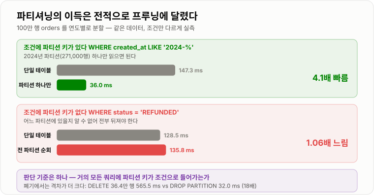
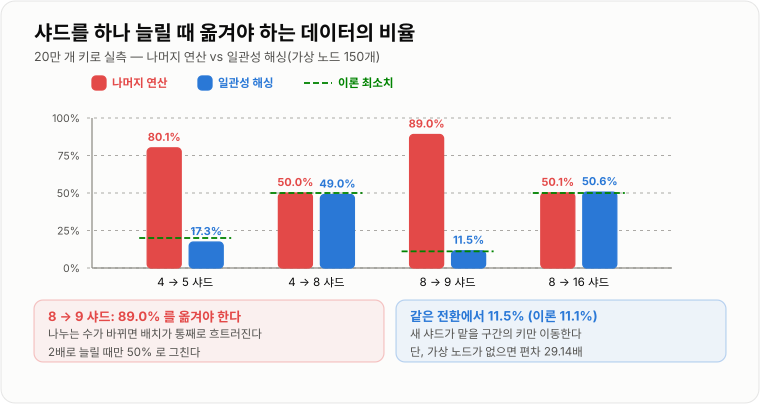
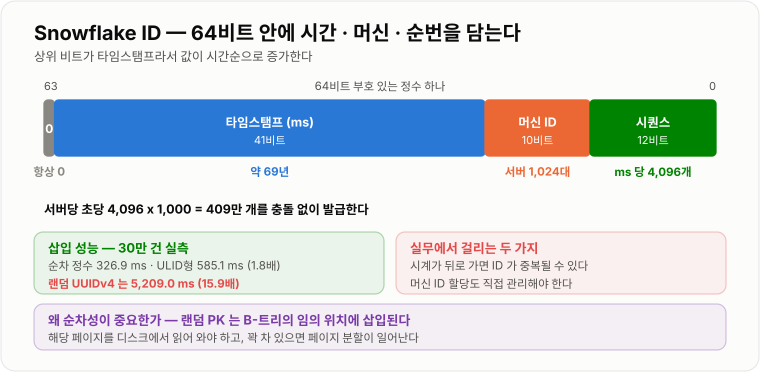

# 대용량 데이터 분할

> **데이터를 나누는 순간 조인·트랜잭션·정렬·유니크 제약이 전부 사라진다. 그래서 분할은 "성능이 부족할 때 하는 것"이 아니라 "다른 모든 수단을 쓴 뒤 마지막에 하는 것"이고, 샤드 키를 잘못 고르면 되돌리는 데 전체 데이터의 89%를 옮겨야 한다.**

---

## 1. 핵심 요약

**분할은 성능 문제를 애플리케이션 복잡도로 바꾸는 거래라서, 파티셔닝은 조건에 파티션 키가 있을 때만 4.1배 이득이고 없으면 손해이며, 샤딩은 조인·트랜잭션·페이지네이션을 통째로 내주는 대가로 확장성을 얻되 샤드 키를 잘못 고르면 되돌리는 데 데이터의 89%를 옮겨야 한다.**

### 한눈에 보기

* 분할에는 사다리가 있다. **인덱스 → 캐시 → 읽기 복제본 → 수직 분할 → 파티셔닝 → 샤딩** 순으로, 뒤로 갈수록 얻는 것보다 잃는 것이 많아진다.
* **파티셔닝은 조건에 파티션 키가 있을 때만 이득이다.** 연도별로 쪼갠 테이블에서 한 파티션만 읽으면 147.3 ms가 36.0 ms(4.1배)가 됐지만, **파티션 키가 조건에 없으면 오히려 1.06배 느렸다.**
* **오래된 데이터를 버릴 때 격차가 가장 크다.** 36.4만 행을 `DELETE`하면 565.5 ms, 파티션을 통째로 버리면 **32.0 ms(18배)** 였다.
* **샤드 키를 바꾸려면 데이터를 거의 다 옮겨야 한다.** 나머지 연산으로 샤드를 8개에서 9개로 늘리면 **89.0%** 가 이동한다.
* **일관성 해싱은 그걸 이론 최소치까지 줄인다.** 같은 8 → 9 전환에서 이동량이 **11.5%** 였다(이론 최소 11.1%).
* **일관성 해싱은 가상 노드가 있어야 쓸 만하다.** 가상 노드 1개면 샤드 간 편차가 **29.14배**, 150개면 **1.24배**였다.
* **해시가 균등해도 핫 샤드는 생긴다.** 단일 사용자가 트래픽의 30%를 차지하면 한 샤드가 평균의 **3.10배**를 받았다. 반면 상위 1,000명이 절반을 차지하는 분포는 **1.00배로 완전히 균등**했다.
* **랜덤 PK가 삽입을 15.9배 느리게 한다.** 30만 건 삽입이 순차 정수 326.9 ms, ULID형 585.1 ms, **랜덤 UUID 5,209.0 ms**였다.
* **샤딩하면 페이지네이션이 무너진다.** 4개 샤드에서 `OFFSET 10,000`을 처리하려면 각 샤드에서 10,020행씩 **총 40,080행을 받아 병합**해야 했고, 단일 DB 대비 **251배**였다.

> 수치는 **SQLite 3.50.4로 100만 행 데이터셋과 20만 개 키를 대상으로 직접 측정**했다. 파티션 프루닝·리밸런싱 이동량·핫 샤드·랜덤 PK 삽입 비용은 엔진과 무관한 구조적 성질이다. **MySQL 고유 제약(파티션 키와 유니크 키의 관계 등)은 본문에 따로 표시했다.**

### 무엇을 해결하는가

#### 해결하려는 문제

앞 두 노트에서 인덱스와 조인으로 할 수 있는 것을 봤다. 그런데 인덱스로 해결되지 않는 지점이 온다.

```text
주문 테이블이 5억 행이 됐을 때

  인덱스 탐색 자체는 여전히 빠르다        ← 앞 노트 실측: 500배 데이터에 1.2배
  그런데
    - 인덱스가 메모리(버퍼 풀)에 안 들어간다      → 디스크 I/O 가 급증한다
    - 백업이 8시간 걸린다                       → 복구 시간이 감당 안 된다
    - 스키마 변경(ALTER)이 수 시간 걸린다        → 배포가 불가능해진다
    - 단일 서버의 디스크·CPU 한계에 부딪힌다      → 더 큰 서버를 살 수 없다
```

**인덱스는 "읽을 행 수"를 줄이지만 "데이터의 총량"은 줄이지 못한다.** 총량 자체가 문제가 되는 지점부터가 이 노트의 영역이다.

#### 이 개념이 없을 때

분할 없이 버티려면 서버를 키우는 수밖에 없다(스케일 업).

```text
CPU 8코어 → 32코어      가능
메모리 64GB → 512GB     가능
디스크 1TB → 10TB       가능

그런데
  비용이 선형이 아니다 (성능 2배에 가격 4배)
  물리적 상한이 있다
  장애 시 전체가 멈춘다 (단일 실패 지점)
  백업·복구 시간은 데이터 양에 비례해서 계속 는다
```

그래서 나누게 된다. 그런데 **나누면 잃는 것이 크다.**

```java
// 단일 DB 라면 이 한 줄이면 끝난다
@Transactional
public void transfer(Long fromUserId, Long toUserId, int amount) {
    Account from = accountRepository.findById(fromUserId);
    Account to = accountRepository.findById(toUserId);
    from.withdraw(amount);
    to.deposit(amount);
}
```

`fromUserId`와 `toUserId`가 다른 샤드에 있으면 이 코드는 성립하지 않는다.

* **트랜잭션이 샤드를 넘지 못한다.** 한쪽만 성공하고 한쪽이 실패할 수 있다.
* **조인을 못 한다.** 두 테이블이 다른 서버에 있으면 `JOIN`이라는 문법 자체가 무의미하다.
* **유니크 제약이 전역으로 안 걸린다.** 샤드 안에서만 유일하다.
* **정렬과 페이지네이션이 무너진다.** 실측에서 4샤드 `OFFSET 10,000`이 251배였다.
* **`AUTO_INCREMENT`를 못 쓴다.** 샤드마다 같은 ID를 발급한다.
* **집계가 어려워진다.** `COUNT`, `SUM`을 샤드마다 구해 합쳐야 한다.

이 여섯 가지를 애플리케이션에서 직접 처리해야 한다는 뜻이다. **분할은 성능 문제를 애플리케이션 복잡도로 바꾸는 거래다.** 그래서 순서가 중요하다.

---

## 2. 동작 원리

### 핵심 구성 요소

| 개념 | 설명 | 중요한 이유 |
| --- | --- | --- |
| **스케일 업 / 아웃** | 서버를 키우기 / 서버 수를 늘리기 | 분할은 스케일 아웃의 전제다. |
| **읽기 복제본** | 읽기 전용 사본을 두는 것 | 분할 전에 먼저 시도할 수단이다. |
| **수직 분할** | 테이블을 컬럼 기준으로 쪼갠다 | 큰 컬럼을 떼어 행을 가볍게 만든다. |
| **수평 분할** | 테이블을 행 기준으로 쪼갠다 | 파티셔닝과 샤딩의 공통 개념이다. |
| **파티셔닝** | 한 DB 안에서 테이블을 물리적으로 나눈다 | 애플리케이션은 하나의 테이블로 본다. |
| **파티션 프루닝** | 조건에 맞는 파티션만 읽는 최적화 | **파티셔닝의 이득 전부가 여기서 나온다.** |
| **샤딩** | 여러 DB 서버로 데이터를 나눈다 | 진짜 스케일 아웃. 대신 잃는 것이 많다. |
| **샤드 키** | 어느 샤드로 갈지 정하는 컬럼 | **한 번 정하면 바꾸기 어렵다.** |
| **핫 샤드** | 특정 샤드에 부하가 몰리는 현상 | 해시가 균등해도 발생한다. |
| **일관성 해싱** | 샤드 수가 변해도 이동량을 최소화하는 배치 | 실측 89.0% → 11.5%. |
| **가상 노드** | 샤드 하나를 링 위 여러 지점에 배치 | 없으면 분포가 29배까지 치우친다. |
| **scatter-gather** | 여러 샤드에 질의해 결과를 합치는 것 | 정렬·페이징의 비용이 여기서 폭발한다. |
| **분산 ID** | 샤드를 넘어 유일한 식별자 | Snowflake·ULID. `AUTO_INCREMENT` 대체. |
| **리샤딩** | 샤드 수를 바꾸는 작업 | 가장 비싸고 위험한 운영 작업이다. |

#### 개념 간 관계

```text
데이터가 커졌을 때 밟는 사다리 — 위에서부터 시도한다

  1. 인덱스 · 쿼리 최적화       잃는 것 없음          앞 두 노트
  2. 캐시                     정합성 관리 필요
  3. 읽기 복제본               복제 지연 감수
  4. 아카이빙 · 오래된 데이터 분리  운영 절차 필요
  5. 수직 분할                 조인 1회 추가
  6. 파티셔닝                  파티션 키 제약        ← 한 DB 안
  ─────────────────────────────────────────────
  7. 샤딩                     조인·트랜잭션 상실     ← 여러 DB
```

**6번과 7번 사이에 굵은 선이 있다.** 파티셔닝까지는 한 데이터베이스 안이라 조인도 트랜잭션도 그대로 쓸 수 있다. **샤딩은 그 둘을 포기하는 것**이고, 그래서 앞의 여섯 가지를 다 해 본 뒤에 간다.

### 내부 동작 과정

#### 파티셔닝 — 프루닝이 되어야 이득이다

파티셔닝은 하나의 논리적 테이블을 여러 물리적 조각으로 나눈다. 애플리케이션은 여전히 `orders` 하나로 본다.

연도별로 나눈 테이블과 단일 테이블을 직접 비교했다.

```text
2024년 데이터 집계 (전체 100만 행, 2024년은 271,000 행)

  단일 테이블 전체 스캔          147.3 ms
  연도 파티션 하나만 스캔          36.0 ms      4.1배
```

**읽어야 할 물리적 데이터 자체가 27%로 줄었기 때문**이다. 이것이 파티션 프루닝이다.

그런데 **조건에 파티션 키가 없으면 정반대가 된다.**

```text
status='REFUNDED' 집계 (파티션 키인 연도가 조건에 없다)

  단일 테이블                    128.5 ms
  전 파티션을 순회                135.8 ms      1.06배 느리다
```

**모든 파티션을 다 뒤져야 하고, 파티션마다 열고 닫는 오버헤드가 추가로 붙는다.** 파티셔닝은 이득이 아니라 손해가 됐다.



*파티셔닝의 가치는 전적으로 프루닝에 달렸다. 조건에 파티션 키가 없는 쿼리가 많다면 파티셔닝을 하면 안 된다.*

**그래서 파티셔닝의 판단 기준은 하나다. "거의 모든 쿼리에 파티션 키가 조건으로 들어가는가?"**

#### 파티셔닝이 진짜로 빛나는 곳 — 데이터 폐기

조회 성능보다 **관리 편의**가 파티셔닝의 더 큰 이유인 경우가 많다.

```text
2022년 데이터 36.4만 행을 지울 때

  DELETE FROM orders WHERE created_at LIKE '2022-%'    565.5 ms
  파티션을 통째로 버린다                                  32.0 ms      18배
```

차이는 단순한 속도가 아니다.

```text
DELETE 의 실제 부담
  - 행마다 언두 로그를 남긴다
  - 인덱스에서도 하나씩 지운다
  - 지운 공간이 바로 반환되지 않는다 (단편화)
  - 긴 트랜잭션이 되어 락과 복제 지연을 만든다

ALTER TABLE ... DROP PARTITION
  - 파일 하나를 지우는 것에 가깝다
  - 언두 로그가 사실상 없다
  - 공간이 즉시 반환된다
```

**"3개월치만 보관한다" 같은 요구사항이 있으면 파티셔닝이 정답에 가깝다.** 매달 오래된 파티션을 하나씩 버리면 된다.

#### MySQL 파티셔닝의 제약

MySQL에서 파티셔닝을 쓸 때 반드시 알아야 하는 제약이 있다.

```sql
CREATE TABLE orders (
    id          BIGINT       NOT NULL AUTO_INCREMENT,
    user_id     BIGINT       NOT NULL,
    status      VARCHAR(20)  NOT NULL,
    amount      INT          NOT NULL,
    created_at  DATETIME     NOT NULL,
    PRIMARY KEY (id, created_at)      -- ← 파티션 키가 PK 에 포함되어야 한다
)
PARTITION BY RANGE (YEAR(created_at)) (
    PARTITION p2022 VALUES LESS THAN (2023),
    PARTITION p2023 VALUES LESS THAN (2024),
    PARTITION p2024 VALUES LESS THAN (2025),
    PARTITION pmax  VALUES LESS THAN MAXVALUE
);
```

**`PRIMARY KEY (id, created_at)`이 핵심이다.** MySQL은 **파티션 키가 모든 유니크 키(PK 포함)에 반드시 포함되어야 한다**고 요구한다. 파티션을 넘나드는 유일성을 보장할 방법이 없기 때문이다.

이 제약의 파급이 크다.

```text
- PK 가 복합키가 된다                     → 모든 보조 인덱스가 그만큼 커진다
- 다른 유니크 제약도 파티션 키를 포함해야 한다  → 사실상 전역 유니크를 못 건다
- 외래 키를 쓸 수 없다                     → 파티션 테이블은 FK 를 지원하지 않는다
```

파티션 종류는 네 가지다.

| 방식 | 기준 | 적합한 곳 |
| --- | --- | --- |
| **RANGE** | 값의 범위 | **날짜.** 가장 많이 쓴다. 오래된 파티션 폐기가 쉽다. |
| **LIST** | 값의 목록 | 지역·카테고리처럼 값이 정해져 있을 때. |
| **HASH** | 사용자 지정 식의 해시 | 균등 분산이 목적일 때. 폐기가 안 된다. |
| **KEY** | 엔진 내부 해시 함수 | HASH와 비슷하되 문자열 키도 된다. |

**실무에서는 RANGE가 압도적으로 많다.** 날짜 기준 조회가 대부분이고, 오래된 데이터 폐기가 쉽기 때문이다. HASH/KEY는 폐기 이점이 없어 파티셔닝의 주된 이유 하나가 빠진다.

#### 샤딩 — 데이터를 여러 서버로

파티셔닝이 한계에 부딪히는 지점이 있다. **파티셔닝은 여전히 한 서버 안이다.** 디스크도 CPU도 메모리도 그 서버의 것이다.

샤딩은 데이터를 **여러 DB 서버**로 나눈다. 그 순간 조인과 트랜잭션을 잃는다.

```text
샤드 4개, 샤드 키 = user_id

  user_id % 4 == 0  →  shard-0
  user_id % 4 == 1  →  shard-1
  user_id % 4 == 2  →  shard-2
  user_id % 4 == 3  →  shard-3
```

**샤드 키를 무엇으로 하느냐가 이후 모든 것을 결정한다.**

```text
쿼리 유형                    user_id 샤딩      order_id 샤딩
──────────────────────────────────────────────────────────
주문 ID로 단건 조회            8개 샤드 전부      1개 샤드
한 사용자의 주문 목록           1개 샤드          8개 샤드 전부
기간별 전체 집계               8개 샤드 전부      8개 샤드 전부
```

**어느 쪽을 골라도 만족시키지 못하는 쿼리가 남는다.** 그래서 "가장 자주 쓰는 조회 패턴"을 기준으로 고르고, 나머지는 별도 수단(검색 엔진, 매핑 테이블, 집계 테이블)으로 처리한다.

`order_id`로 샤딩하면서 사용자별 조회도 살리려면, **`order_id` 안에 `user_id` 정보를 심는** 방법을 쓴다.

```text
order_id = (user_id 의 해시 하위 비트) + (시퀀스)
→ 같은 사용자의 주문이 항상 같은 샤드로 간다
```

#### 핫 샤드 — 해시가 균등해도 생긴다

샤드 키를 해싱하면 분포가 균등해질 것 같지만, **분포와 부하는 다른 문제**다. 세 가지 트래픽 패턴으로 측정했다.

```text
샤드 8개, 요청 100만 건, 샤드 키 = user_id

  사용자가 고르게 분포           최대/평균 1.00배
  상위 1,000명이 트래픽의 절반    최대/평균 1.00배     ← 치우쳤는데 균등하다
  단일 사용자가 트래픽의 30%      최대/평균 3.10배     ← 여기서 무너진다
```

**두 번째가 중요하다.** 파레토 분포로 상위 1,000명이 절반을 차지해도 분포는 완벽히 균등했다. **1,000명이 8개 샤드에 흩어지기 때문**이다.

**문제는 "치우친 분포"가 아니라 "단일 키가 뜨거울 때"** 다. 하나의 키는 정의상 하나의 샤드로만 간다. 인플루언서 계정, 이벤트 상품, 인기 게시글이 여기 해당한다.

해결책은 샤딩 바깥에 있다.

```text
1. 캐시로 흡수한다              → 뜨거운 키일수록 캐시 적중률이 높다
2. 그 키만 따로 뺀다             → 전용 샤드 또는 전용 저장소
3. 키를 인위적으로 쪼갠다         → user_777 을 user_777_0 ~ user_777_9 로
                                   (읽을 때 10개를 합쳐야 한다)
```

#### 나머지 연산의 함정 — 샤드를 늘릴 때

`user_id % 4`는 단순하고 균등하다. 문제는 **샤드를 늘릴 때** 드러난다. 20만 개 키로 직접 측정했다.

```text
나머지 연산으로 샤드 수를 바꿀 때 이동해야 하는 키의 비율

   4 →  5 샤드:  80.1%   (이론 최소 20.0%)
   4 →  8 샤드:  50.0%   (이론 최소 50.0%)
   8 →  9 샤드:  89.0%   (이론 최소 11.1%)
   8 → 16 샤드:  50.1%   (이론 최소 50.0%)
```

**8개에서 9개로 하나만 늘리는데 데이터의 89%를 옮겨야 한다.** 이론적으로는 11.1%만 옮기면 되는데도 그렇다.

`user_id = 100`을 생각해 보면 명확하다. `100 % 8 = 4`, `100 % 9 = 1`이다. **나머지를 나누는 수가 바뀌면 결과가 거의 무관하게 바뀐다.**

**2배로 늘릴 때만 50%로 그친다.** `n % 8`이 4인 키는 `n % 16`에서 4 아니면 12이므로 절반은 제자리다. 그래서 나머지 연산을 쓸 거면 **처음부터 샤드 수를 2의 거듭제곱으로 잡고 2배씩만 늘린다.**

#### 일관성 해싱

키와 샤드를 **같은 해시 공간(링) 위에 올리고, 키에서 시계 방향으로 가장 가까운 샤드**에 배정하는 방식이다. 샤드를 하나 추가하면 **그 샤드가 맡게 될 구간의 키만** 이동한다.

같은 조건으로 측정했다.

```text
                     나머지 연산     일관성 해싱     이론 최소
──────────────────────────────────────────────────────────
 4 →  5 샤드           80.1%         17.3%         20.0%
 4 →  8 샤드           50.0%         49.0%         50.0%
 8 →  9 샤드           89.0%         11.5%         11.1%
 8 → 16 샤드           50.1%         50.6%         50.0%
```



*나머지 연산은 샤드 수가 바뀌면 배치가 통째로 흐트러지지만, 일관성 해싱은 새 샤드가 맡을 구간만 옮긴다.*

**8 → 9에서 89.0%가 11.5%로 줄었다.** 이론 최소치 11.1%에 거의 붙었다. 2배로 늘리는 경우는 어차피 절반이 이동해야 하므로 둘이 비슷하다.

#### 가상 노드가 없으면 일관성 해싱은 쓸모없다

일관성 해싱에는 함정이 하나 있다. **샤드를 링 위 한 지점에만 두면 구간 크기가 제멋대로**가 된다. 가상 노드 개수를 바꿔 가며 측정했다.

```text
샤드 8개, 키 20만 개

  가상 노드   1개:  최소  3,183  최대 92,760   최대/최소 29.14배
  가상 노드  10개:  최소 11,578  최대 39,455   최대/최소  3.41배
  가상 노드  50개:  최소 20,455  최대 32,178   최대/최소  1.57배
  가상 노드 150개:  최소 22,708  최대 28,156   최대/최소  1.24배
  가상 노드 500개:  최소 22,232  최대 28,413   최대/최소  1.28배
```

**가상 노드 1개면 어떤 샤드는 다른 샤드의 29배를 받는다.** 사실상 못 쓴다. 150개쯤에서 1.24배로 안정되고, **500개로 늘려도 더 좋아지지 않는다.** 실무에서 가상 노드를 100~200개로 잡는 이유가 여기 있다.

#### 샤드 키를 해싱해야 하는 이유

`user_id % 8`처럼 **원본 값을 그대로 쓰면** 데이터의 성질이 그대로 반영된다.

```text
짝수 ID 만 발급되는 시스템 (레거시에서 흔하다)

  user_id % 8       →  사용 샤드 [0, 2, 4, 6]      4/8 개만 쓴다
  md5(user_id) % 8  →  사용 샤드 [0..7]  최대/최소 1.018배
```

**절반의 샤드가 놀고 있다.** ID에 규칙성(짝수만, 특정 접두사, 지역 코드 등)이 있으면 나머지 연산이 그 규칙을 그대로 물려받는다. **먼저 해시 함수를 통과시키면** 원본의 규칙성이 사라진다.

#### 분산 환경의 기본 키

샤딩하면 `AUTO_INCREMENT`를 못 쓴다. 샤드마다 1, 2, 3을 발급해 충돌한다. 대안은 셋이다.

**첫째, UUID.** 생성이 간단하고 충돌이 사실상 없다. 그런데 **삽입 성능을 무너뜨린다.**

```text
30만 건 삽입

  순차 정수 PK        (INTEGER)    326.9 ms
  시간순 정렬 문자열 PK (ULID형)     585.1 ms      1.8배
  랜덤 UUID PK        (UUIDv4)   5,209.0 ms     15.9배
```

**15.9배다.** 이유는 앞 노트에서 본 클러스터형 인덱스 구조에 있다.

```text
순차 PK:  항상 B-트리의 오른쪽 끝에 붙는다
          → 마지막 페이지만 메모리에 있으면 된다

랜덤 PK:  매번 트리의 임의 위치에 삽입된다
          → 해당 페이지를 디스크에서 읽어 와야 한다
          → 페이지가 꽉 차 있으면 분할(page split)이 일어난다
          → 단편화가 쌓여 공간도 더 먹는다
```

**둘째, Snowflake ID.** 트위터가 만든 방식으로, 64비트 정수 안에 시간·머신·시퀀스를 담는다.

```text
 1비트    41비트              10비트        12비트
┌───┬──────────────────┬──────────┬──────────────┐
│ 0 │   타임스탬프(ms)    │  머신 ID  │   시퀀스     │
└───┴──────────────────┴──────────┴──────────────┘

  41비트 타임스탬프  →  약 69년치를 표현한다
  10비트 머신 ID    →  서버 1,024대
  12비트 시퀀스     →  같은 밀리초에 4,096개
                      = 서버당 초당 409만 개
```



*상위 비트가 타임스탬프라서 값이 시간순으로 증가한다. 그래서 랜덤 UUID와 달리 B-트리 오른쪽 끝에 붙는다.*

**타임스탬프가 상위 비트에 있어 값이 시간순으로 증가한다.** 그래서 실측에서 ULID형(같은 성질)이 1.8배에 그쳤다. 랜덤 UUID의 15.9배와 대조적이다.

**셋째, 별도 ID 발급 서버.** 티켓 서버나 Redis `INCR`로 중앙에서 발급한다. 단순하지만 **단일 실패 지점**이 되고 왕복이 추가된다.

| 방식 | 정렬 가능 | 삽입 성능 | 크기 | 외부 의존 | 정보 노출 |
| --- | --- | --- | --- | --- | --- |
| `AUTO_INCREMENT` | 예 | **기준(1.0배)** | 8B | 없음 | 총량 추정 가능 |
| UUIDv4 | 아니오 | **15.9배 느림** | 16B | 없음 | 없음 |
| UUIDv7 · ULID | 예 | 1.8배 | 16B | 없음 | 생성 시각 |
| Snowflake | 예 | 1.8배 수준 | 8B | 머신 ID 관리 | 생성 시각·순서 |
| 중앙 발급 | 예 | 왕복 추가 | 8B | **발급 서버** | 총량 추정 가능 |

> **PK가 커지면 모든 보조 인덱스가 커진다.** 앞 노트에서 본 대로 InnoDB 보조 인덱스 리프에는 PK 값이 들어간다. UUID를 문자열(36바이트)로 저장하면 인덱스 개수만큼 곱해져 붙는다. 꼭 UUID를 써야 한다면 **`BINARY(16)`으로 저장**한다.

#### 샤딩하면 페이지네이션이 무너진다

앞 노트에서 커서 페이지네이션으로 `OFFSET` 문제를 해결했다. **샤딩하면 그 문제가 다른 형태로 돌아온다.**

```text
4개 샤드(각 25만 행)에서 전체 정렬 결과의 한 페이지를 얻기

  단일 DB   ORDER BY ... LIMIT 20              0.05 ms   질의 1회
  4샤드     scatter-gather 1페이지              0.61 ms   질의 4회 + 병합

  단일 DB   OFFSET 10,000                      0.15 ms
  4샤드     scatter-gather OFFSET 10,000      37.32 ms   251배
                └ 각 샤드에서 10,020행씩, 총 40,080행을 받아 정렬
```

**이유는 명확하다.** 전체 순서로 10,001번째 행이 어느 샤드에 있는지 미리 알 수 없다. 최악의 경우 한 샤드에 다 몰려 있을 수 있으므로, **모든 샤드에서 `OFFSET + LIMIT`만큼을 다 받아 와야** 한다.

```text
샤드 4개, OFFSET 10,000, LIMIT 20 을 정확히 처리하려면

  각 샤드에 LIMIT 10,020 을 요청한다
  → 40,080 행을 네트워크로 받는다
  → 애플리케이션 메모리에서 정렬한다
  → 그중 20 행만 쓰고 40,060 행을 버린다
```

**샤드 수에 비례해 나빠진다.** 그래서 **샤딩 환경에서는 커서 페이지네이션이 선택이 아니라 필수**다. 커서 방식이면 각 샤드에 "이 값 다음 20건"을 요청해 80건만 받아 병합하면 되고, 이는 페이지 위치와 무관하다.

---

## 3. 특징과 비교

| 구분          | 내용                                       |
| ----------- | ---------------------------------------- |
| **장점**      | 파티셔닝은 코드 변경 없이 읽을 데이터를 줄이고 오래된 데이터 폐기를 18배 싸게 만들면서 조인·트랜잭션을 유지한다. 샤딩은 진짜 스케일 아웃이 되고 장애가 격리된다. |
| **단점**      | 파티셔닝은 프루닝이 안 되면 오히려 손해이고 파티션 키가 모든 유니크 키에 포함돼야 한다. 샤딩은 조인·트랜잭션·전역 유니크·페이지네이션을 잃고, **샤드 키를 바꾸려면 89%를 옮겨야 한다.** |
| **적합한 상황**  | 버퍼 풀 적중률 하락·백업 시간·`ALTER` 시간이 신호다. 앞 세 가지는 파티셔닝으로 해결되고, **샤딩은 단일 서버 쓰기 한계에 실제로 도달했을 때만** 간다. |
| **주의할 상황**  | 나머지 연산(`id % N`) 기반 샤딩 — 샤드 추가 시 89%가 이동한다. 일관성 해싱 + 가상 노드 150개를 쓴다. 랜덤 UUID를 PK로 쓰면 삽입이 15.9배 느려진다. |

### 성능 특성

#### 파티셔닝

```text
2024년 데이터 집계 (271,000 / 100만 행)
  단일 테이블 전체 스캔        147.3 ms
  파티션 하나만 스캔            36.0 ms      4.1배 빠름

파티션 키가 조건에 없을 때
  단일 테이블                  128.5 ms
  전 파티션 순회               135.8 ms      1.06배 느림

36.4만 행 폐기
  DELETE                     565.5 ms
  DROP PARTITION              32.0 ms      18배 빠름
```

**프루닝이 되면 4.1배, 안 되면 1.06배 손해다.** 폐기에서는 18배로 격차가 가장 크다.

#### 리밸런싱 이동량 (20만 키)

```text
                나머지 연산   일관성 해싱   이론 최소
 4 →  5 샤드      80.1%       17.3%      20.0%
 4 →  8 샤드      50.0%       49.0%      50.0%
 8 →  9 샤드      89.0%       11.5%      11.1%
 8 → 16 샤드      50.1%       50.6%      50.0%
```

**2배로 늘릴 때는 둘이 비슷하고, 그 외에는 일관성 해싱이 압도적**이다.

#### 가상 노드 개수 (샤드 8개, 키 20만 개)

```text
  1개    최대/최소 29.14배      쓸 수 없다
 10개    최대/최소  3.41배
 50개    최대/최소  1.57배
150개    최대/최소  1.24배      실무 권장 구간
500개    최대/최소  1.28배      더 좋아지지 않는다
```

#### 핫 샤드 (샤드 8개, 요청 100만 건)

```text
사용자가 고르게 분포            최대/평균 1.00배
상위 1,000명이 트래픽의 절반     최대/평균 1.00배
단일 사용자가 트래픽의 30%       최대/평균 3.10배

샤드 키 원본값의 규칙성
  짝수 ID 만 + user_id % 8      4/8 샤드만 사용
  짝수 ID 만 + md5 후 % 8       8/8 샤드, 편차 1.018배
```

#### 기본 키 방식별 삽입 성능 (30만 건)

```text
순차 정수 PK   (INTEGER)     326.9 ms      1.0배
ULID형 문자열 PK             585.1 ms      1.8배
랜덤 UUID PK  (UUIDv4)     5,209.0 ms     15.9배
```

#### 샤드 환경의 조회 (4샤드, 각 25만 행)

```text
                          단일 DB      4샤드 scatter-gather
1페이지 (LIMIT 20)         0.05 ms      0.61 ms   (질의 4회 + 병합)
OFFSET 10,000             0.15 ms     37.32 ms   251배
                                       └ 40,080 행 전송, 20행만 사용
```

**샤드 수에 비례해 나빠진다.** 8샤드면 80,160행이다.

### 장점과 단점

#### 파티셔닝

| 장점 | 이유 |
| --- | --- |
| 프루닝이 되면 읽을 데이터가 줄어든다 | 실측 4.1배. |
| **오래된 데이터 폐기가 압도적으로 싸다** | 실측 18배. 언두 로그도 단편화도 없다. |
| 애플리케이션 코드가 그대로다 | 여전히 하나의 테이블로 보인다. |
| 조인·트랜잭션이 유지된다 | **한 DB 안이기 때문이다.** |
| 파티션별로 백업·아카이빙할 수 있다 | 운영 유연성이 는다. |

| 단점 | 이유 |
| --- | --- |
| **프루닝이 안 되면 오히려 느리다** | 실측 1.06배. 파티션 오버헤드가 더해진다. |
| **파티션 키가 모든 유니크 키에 포함돼야 한다** | PK가 복합키가 되고 전역 유니크를 못 건다. |
| 외래 키를 쓸 수 없다 | MySQL 파티션 테이블의 제약이다. |
| 파티션 관리를 자동화해야 한다 | 안 하면 `MAXVALUE` 파티션에 다 쌓인다. |
| 단일 서버 한계는 그대로다 | 디스크·CPU는 여전히 한 대의 것이다. |

#### 샤딩

| 장점 | 이유 |
| --- | --- |
| 진짜 스케일 아웃이 된다 | 서버를 늘려 용량과 처리량을 함께 늘린다. |
| 샤드별로 장애가 격리된다 | 하나가 죽어도 나머지는 산다. |
| 테이블당 데이터가 작아진다 | 백업·복구·스키마 변경 시간이 줄어든다. |
| 인덱스가 메모리에 들어간다 | 버퍼 풀 적중률이 올라간다. |

| 단점 | 이유 |
| --- | --- |
| **조인을 잃는다** | 다른 서버의 테이블과는 조인할 수 없다. |
| **트랜잭션을 잃는다** | 샤드를 넘는 원자성이 없다. Saga가 필요하다. |
| **전역 유니크 제약을 잃는다** | 샤드 안에서만 유일하다. |
| **페이지네이션이 무너진다** | 실측 `OFFSET` 251배. 커서가 필수가 된다. |
| **샤드 키를 바꾸기 어렵다** | 나머지 연산이면 8 → 9에 89.0% 이동. |
| 핫 샤드가 생긴다 | 단일 키가 뜨거우면 실측 3.10배. |
| 운영 복잡도가 크게 는다 | 모니터링·백업·마이그레이션이 샤드 수만큼이다. |
| `AUTO_INCREMENT`를 못 쓴다 | 분산 ID 체계가 따로 필요하다. |

#### 일관성 해싱

| 장점 | 이유 |
| --- | --- |
| 샤드 증감 시 이동량이 최소다 | 실측 8 → 9에서 89.0% → 11.5%. |
| 무중단 리샤딩이 현실적이 된다 | 옮길 데이터가 적어 점진 이전이 가능하다. |
| 샤드 장애 시 영향 범위가 좁다 | 그 샤드 구간만 인접 샤드로 넘어간다. |

| 단점 | 이유 |
| --- | --- |
| **가상 노드가 없으면 분포가 망가진다** | 실측 29.14배 편차. |
| 구현과 이해가 복잡하다 | 링 관리·가상 노드 수 조정이 필요하다. |
| 링 정보를 모든 노드가 공유해야 한다 | 설정 배포·일관성 문제가 새로 생긴다. |
| 2배 확장에서는 이점이 없다 | 실측 4 → 8에서 50.0% vs 49.0%. |

### 어떤 상황에서 고르는가

#### 어디까지 갈지 정하는 순서

```text
쿼리와 인덱스를 다 최적화했는가?
├─ 아니오 → 거기부터 한다 (앞 두 노트. 1,200배 여지가 있다)
└─ 예
     ↓
   읽기가 병목인가 쓰기가 병목인가?
   ├─ 읽기 → 캐시 → 읽기 복제본  (복제 지연만 감수하면 된다)
   └─ 쓰기
        ↓
      오래된 데이터가 대부분인가?
      ├─ 예 → 아카이빙 · 파티셔닝  (폐기 18배)
      └─ 아니오
           ↓
         거의 모든 쿼리에 공통 조건 컬럼이 있는가?
         ├─ 예 → 파티셔닝 (프루닝 4.1배)
         └─ 아니오 → 파티셔닝은 손해다 (1.06배)
              ↓
            단일 서버 한계에 실제로 도달했는가?
            ├─ 아니오 → 스케일 업이 훨씬 싸고 안전하다
            └─ 예 → 샤딩. 조인·트랜잭션·페이지네이션을 포기할 준비를 한다
```

#### 샤드 키를 고르는 기준

```text
1. 가장 자주 나가는 조회가 이 키를 조건으로 갖는가?   ← 가장 중요하다
2. 값의 분포가 균등한가? (단일 키가 뜨겁지 않은가)
3. 함께 바뀌는 데이터가 같은 샤드로 가는가?          ← 트랜잭션 경계
4. 값이 변하지 않는가?                            ← 바뀌면 샤드 이동이 필요하다
5. 원본 값에 규칙성이 있으면 해시를 씌웠는가?         ← 실측 짝수 ID면 4/8만 사용
```

**대부분의 서비스에서 `user_id`가 답이다.** 사용자 기준 조회가 압도적으로 많고, 한 사용자의 데이터가 함께 바뀌기 때문이다.

#### 파티셔닝을 쓰기 좋은 상황

* **시계열 데이터** — 로그·이력·이벤트. 날짜 RANGE 파티션.
* **보관 기간이 정해진 데이터** — "3개월치만". 실측 폐기 18배.
* **거의 모든 쿼리에 날짜 조건이 붙을 때** — 프루닝이 항상 된다.
* **단일 테이블이 수억 행이지만 서버는 아직 여유가 있을 때.**

#### 파티셔닝을 피해야 하는 상황

* **파티션 키 없는 조회가 많을 때** — 실측 1.06배 손해.
* **전역 유니크 제약이 필요할 때** — 파티션 키를 포함해야 해서 사실상 불가.
* **외래 키가 필요할 때** — MySQL 파티션 테이블은 FK를 지원하지 않는다.
* **HASH 파티션으로 폐기 이점을 못 얻을 때** — 파티셔닝의 주된 이유 하나가 빠진다.

#### 샤딩을 쓰기 좋은 상황

* **단일 서버의 쓰기 처리량 한계에 실제로 도달했을 때.**
* **샤드 키로 대부분의 조회가 처리될 때** — 사용자 중심 서비스.
* **샤드 간 조인·트랜잭션이 거의 필요 없을 때** — 도메인이 자연히 나뉠 때.
* **데이터 격리가 요구사항일 때** — 멀티테넌트, 지역별 규제.

#### 샤딩을 피해야 하는 상황

* **아직 스케일 업 여지가 있을 때** — 훨씬 싸고 안전하다.
* **조인이 많은 도메인일 때** — 애플리케이션 조인은 앞 노트의 N+1을 다시 부른다.
* **전역 집계·검색이 핵심 기능일 때** — 검색 엔진이 더 맞다.
* **강한 일관성이 필수일 때** — Saga의 중간 상태를 허용할 수 없다면.
* **운영 인력이 부족할 때** — 샤드 수만큼 운영 부담이 곱해진다.

#### 선택 기준

1. **인덱스·캐시·복제본을 다 써 봤는가?** — 대개 여기서 해결된다
2. **읽기 병목인가 쓰기 병목인가?** — 읽기는 복제본으로 끝나는 경우가 많다
3. **거의 모든 쿼리에 공통 조건이 있는가?** — 파티션 키·샤드 키의 자격이다
4. **오래된 데이터를 버리는가?** — 파티셔닝의 가장 큰 이점이다
5. **조인과 트랜잭션을 포기할 수 있는가?** — 샤딩의 진입 조건이다
6. **샤드 수를 나중에 늘릴 계획이 있는가?** — 일관성 해싱을 처음부터 쓴다

### 비슷한 기술과 비교

#### 파티셔닝과 샤딩

| 비교 항목 | 파티셔닝 | 샤딩 |
| --- | --- | --- |
| 범위 | **한 DB 서버 안** | 여러 DB 서버 |
| 애플리케이션 인식 | 없음 (테이블 하나로 보인다) | **라우팅을 직접 해야 한다** |
| 조인 | **가능** | 불가 |
| 트랜잭션 | **가능** | 샤드 안에서만 |
| 유니크 제약 | 파티션 키 포함 시 가능 | 샤드 안에서만 |
| 해결하는 문제 | 읽을 데이터 양, 데이터 폐기 | **서버 용량·처리량 한계** |
| 운영 복잡도 | 낮다 | **매우 높다** |
| 되돌리기 | 비교적 쉽다 | **매우 어렵다** |

#### 수직 분할과 수평 분할

| 비교 항목 | 수직 분할 | 수평 분할 |
| --- | --- | --- |
| 나누는 기준 | **컬럼** | **행** |
| 목적 | 행을 가볍게, 접근 빈도 분리 | 데이터 양 자체를 나눔 |
| 결과 | 테이블 종류가 는다 | 같은 구조가 여러 곳에 |
| 추가 비용 | 조인 1회 | 라우팅 + scatter-gather |
| 난이도 | 낮다 | 높다 |
| 예 | `products` / `product_details` | 파티셔닝, 샤딩 |

#### 나머지 연산과 일관성 해싱

| 비교 항목 | 나머지 연산 | 일관성 해싱 |
| --- | --- | --- |
| 구현 | `hash % N` 한 줄 | 링 + 가상 노드 관리 |
| 분포 균등성 | 매우 좋다 | **가상 노드 수에 달렸다**(1개면 29.14배) |
| 8 → 9 샤드 이동량 | **89.0%** | **11.5%** |
| 4 → 8 샤드 이동량 | 50.0% | 49.0% (차이 없음) |
| 샤드 장애 시 | 전체 재배치 | 인접 구간만 |
| 적합한 곳 | 샤드 수를 안 바꿀 때, 2배씩만 늘릴 때 | 증감이 잦은 캐시·분산 저장소 |

#### 분산 ID 방식

| 비교 항목 | `AUTO_INCREMENT` | UUIDv4 | Snowflake · ULID | 중앙 발급 |
| --- | --- | --- | --- | --- |
| 샤드 환경 | **불가** | 가능 | 가능 | 가능 |
| 시간순 정렬 | 예 | **아니오** | 예 | 예 |
| 삽입 성능 | 1.0배 | **15.9배 느림** | 1.8배 | 왕복 추가 |
| 크기 | 8B | 16B (문자열 36B) | 8~16B | 8B |
| 단일 실패 지점 | 없음 | 없음 | 없음 | **있다** |
| 노출되는 정보 | 총 발급량 | 없음 | 생성 시각 | 총 발급량 |
| 추가 관리 | 없음 | 없음 | **머신 ID · 시계** | 발급 서버 운영 |

#### 읽기 복제본과 샤딩

| 비교 항목 | 읽기 복제본 | 샤딩 |
| --- | --- | --- |
| 해결하는 병목 | **읽기** | 읽기 + **쓰기** |
| 데이터 배치 | 전체 사본 | 나눠서 보관 |
| 애플리케이션 변경 | 라우팅 한 곳 | **전면적** |
| 조인·트랜잭션 | 그대로 | 상실 |
| 주요 문제 | **복제 지연** | 조인·트랜잭션·페이징 |
| 도입 난이도 | 낮다 | 매우 높다 |
| 순서 | **먼저 한다** | 마지막에 한다 |

---

## 4. 실무 주의사항

### 백엔드 실무 적용

#### 언제 분할을 검토할지 판단하는 지표

숫자로 판단해야 한다. "느린 것 같다"로 시작하면 안 된다.

```sql
-- 테이블별 크기와 인덱스 크기
SELECT table_name,
       table_rows                              AS 추정행수,
       ROUND(data_length/1024/1024/1024, 2)    AS 데이터GB,
       ROUND(index_length/1024/1024/1024, 2)   AS 인덱스GB
  FROM information_schema.tables
 WHERE table_schema = DATABASE()
 ORDER BY data_length + index_length DESC
 LIMIT 10;
```

```sql
-- 버퍼 풀 적중률 — 99% 아래면 인덱스가 메모리에 안 들어가고 있다
SELECT
    ROUND(100 * (1 - (
        SELECT variable_value FROM performance_schema.global_status
         WHERE variable_name = 'Innodb_buffer_pool_reads'
    ) / (
        SELECT variable_value FROM performance_schema.global_status
         WHERE variable_name = 'Innodb_buffer_pool_read_requests'
    )), 2) AS 버퍼풀_적중률;
```

**분할을 검토할 신호는 이런 것들이다.**

```text
- 버퍼 풀 적중률이 99% 아래로 떨어졌다        → 인덱스가 메모리에 안 들어간다
- 백업 시간이 유지보수 창을 넘었다            → 복구 시간이 감당 안 된다
- ALTER TABLE 이 수 시간 걸려 배포가 막힌다
- 단일 서버 CPU·디스크 IOPS 가 포화됐다
- 오래된 데이터가 전체의 70% 이상이다         → 아카이빙·파티셔닝부터
```

**앞의 세 가지는 파티셔닝으로도 해결된다.** 네 번째만이 샤딩의 근거다.

#### 아카이빙 — 샤딩 전에 반드시 해 볼 것

```java
@Component
public class OrderArchiveJob {

    // 매일 새벽: 2년 지난 주문을 아카이브 테이블로 옮긴다
    @Scheduled(cron = "0 0 4 * * *")
    public void archive() {
        LocalDateTime cutoff = LocalDateTime.now().minusYears(2);
        int moved;
        do {
            // 한 번에 다 옮기면 긴 트랜잭션이 되어 락과 복제 지연을 만든다
            moved = archiveRepository.moveBatch(cutoff, 1000);
            sleepQuietly(100);                 // 부하를 흘려 보낸다
        } while (moved > 0);
    }
}
```

**핵심은 배치 크기와 간격이다.** 100만 행을 한 트랜잭션으로 옮기면 언두 로그가 폭증하고 복제가 몇 분씩 밀린다. **1,000건씩 끊고 사이에 쉬는 것**이 실무 관행이다.

**이것만으로 해결되는 경우가 많다.** 활성 데이터가 전체의 10%라면 테이블이 1/10이 되고, 인덱스가 버퍼 풀에 들어가면서 앞 노트의 성능 특성이 되살아난다.

#### 샤딩 도입 — 점진적 이전

한 번에 바꾸는 것은 불가능에 가깝다. **단계를 나눈다.**

```text
1단계  라우팅 계층을 먼저 넣는다 (샤드는 1개, 실제로는 아무 일도 안 한다)
         → 모든 DB 접근이 라우터를 거치게 만든다
         → 이 단계에서 샤드 키 없는 쿼리가 전부 드러난다

2단계  샤드 키 없는 쿼리를 하나씩 없앤다
         → 대체 수단(검색 엔진, 매핑 테이블, 집계 테이블)을 마련한다

3단계  이중 쓰기를 시작한다
         → 기존 DB 와 새 샤드에 동시에 쓴다
         → 데이터 정합성을 배치로 검증한다

4단계  읽기를 샤드로 옮긴다 (일부 트래픽부터)
         → 문제가 있으면 즉시 되돌린다

5단계  기존 DB 쓰기를 중단한다
```

**2단계에서 대부분의 시간이 든다.** 샤드 키 없이 조회하는 코드가 생각보다 많고, 각각에 대안을 만들어야 한다.

```java
@Component
public class ShardRoutingInterceptor {

    @Around("execution(* com.example.repository..*(..))")
    public Object route(ProceedingJoinPoint pjp) throws Throwable {
        Long shardKey = ShardKeyHolder.get();

        if (shardKey == null) {
            // 1단계에서 이 로그가 샤드 키 없는 쿼리를 전부 찾아 준다
            log.warn("샤드 키 없는 쿼리: {}", pjp.getSignature());
            metrics.counter("shard.key.missing").increment();
        }
        return pjp.proceed();
    }
}
```

#### 샤드 키 없는 조회를 처리하는 방법

```text
1. 검색 엔진으로 넘긴다
     Elasticsearch 에 색인하고 조건 검색은 거기서 한다
     결과의 PK 로 각 샤드에서 상세를 가져온다

2. 매핑 테이블(글로벌 인덱스)을 둔다
     order_id → shard_id 매핑을 별도 저장소에 유지한다
     쓰기가 두 곳이 되어 정합성 관리가 필요하다

3. 집계 테이블을 따로 만든다
     통계·리포트는 별도 분석 DB 로 옮긴다 (CDC · 배치)

4. 샤드 키를 ID 에 심는다
     order_id 의 일부 비트에 샤드 번호를 넣으면
     order_id 만으로 샤드를 알 수 있다
```

**4번이 가장 우아하다.** 추가 저장소 없이 라우팅이 가능해진다.

```java
public class ShardAwareIdGenerator {

    // 하위 10비트에 샤드 번호를 심는다
    public long generate(long userId) {
        long shardId = shardRouter.shardOf(userId);
        long base = snowflake.nextId();
        return (base << 10) | shardId;
    }

    public int extractShard(long orderId) {
        return (int) (orderId & 0x3FF);       // 하위 10비트
    }
}
```

#### 리샤딩 — 가장 위험한 운영 작업

샤드를 늘려야 하는 순간이 온다. 실측에서 나머지 연산은 8 → 9에 **89.0%** 를 옮겨야 했다.

```text
준비 없이 리샤딩하면
  - 데이터의 89% 를 서비스 중에 옮겨야 한다
  - 옮기는 동안 어느 샤드가 진실인지 관리해야 한다
  - 수 일~수 주가 걸린다
```

**대비하는 방법이 셋 있다.**

```text
1. 처음부터 논리 샤드를 물리 샤드보다 많이 만든다  ← 가장 실용적이다
     논리 샤드 1,024개를 물리 서버 4대에 나눠 배치한다
     서버를 8대로 늘릴 때 논리 샤드 배치만 바꾸면 된다
     데이터를 재계산할 필요가 없다 (논리 샤드 단위로 옮긴다)

2. 일관성 해싱을 처음부터 쓴다
     실측 8 → 9 에서 89.0% → 11.5%

3. 2의 거듭제곱으로만 늘린다
     실측 4 → 8, 8 → 16 은 나머지 연산도 50% 다
```

**1번(논리 샤드)이 실무에서 가장 널리 쓰인다.** 일관성 해싱보다 단순하면서 이동량 문제를 근본적으로 없앤다.

```java
public class LogicalShardRouter {

    private static final int LOGICAL_SHARDS = 1024;      // 고정. 절대 안 바꾼다

    // 논리 샤드 → 물리 서버 매핑. 이것만 바꾸면 리샤딩이다
    private final Map<Integer, String> placement;

    public String route(Long userId) {
        int logical = Math.abs(Hashing.murmur3_32_fixed()
                                      .hashLong(userId)
                                      .asInt() % LOGICAL_SHARDS);
        return placement.get(logical);
    }
}
```

#### 샤드별 모니터링

```java
@Scheduled(fixedRate = 60_000)
public void reportShardMetrics() {
    for (ShardInfo shard : shardRouter.allShards()) {
        metrics.gauge("shard.rows", Tags.of("shard", shard.getId()),
                      shard.countRows());
        metrics.gauge("shard.qps", Tags.of("shard", shard.getId()),
                      shard.getQps());
        metrics.gauge("shard.size.gb", Tags.of("shard", shard.getId()),
                      shard.getSizeGb());
    }
}
```

**샤드 간 편차를 지표로 봐야 한다.** 실측에서 단일 사용자가 트래픽의 30%를 차지하면 한 샤드가 평균의 3.10배를 받았다. **평균만 보면 이 상태가 안 보인다.** 최대/평균 비율을 알람 조건으로 건다.

#### 운영에서 자주 겪는 상황

**증상 1 — 파티셔닝했는데 더 느려졌다**

```text
원인:  조건에 파티션 키가 없어 전 파티션을 순회한다 (1.06배 손해)
확인:  EXPLAIN 의 partitions 칼럼에 파티션이 전부 나오는지 본다
조치:  쿼리에 파티션 키 조건을 추가하거나, 파티셔닝을 되돌린다
```

**증상 2 — 특정 샤드만 CPU가 100%다**

```text
원인:  핫 샤드. 단일 키가 뜨겁다 (최대/평균 3.10배)
확인:  샤드별 QPS 와 상위 키의 요청 비율을 본다
조치:  그 키를 캐시로 흡수 → 안 되면 전용 샤드로 분리 → 키 자체를 쪼갠다
```

**증상 3 — 샤딩 후 목록 API가 느려졌다**

```text
원인:  scatter-gather + OFFSET (251배, 40,080행 전송)
조치:  커서 페이지네이션으로 전환한다
       각 샤드에 "이 값 다음 N건"만 요청하면 위치와 무관해진다
```

**증상 4 — 샤드를 늘리려는데 방법이 없다**

```text
원인:  나머지 연산 기반 라우팅 (8 → 9 에 89.0% 이동)
조치:  즉시 2배로 늘린다 (50% 이동) → 그다음 논리 샤드 구조로 전환한다
예방:  처음부터 논리 샤드를 1,024개 만들어 두거나 일관성 해싱을 쓴다
```

**증상 5 — 샤딩 후 INSERT가 급격히 느려졌다**

```text
원인 후보:
  PK 를 UUIDv4 로 바꿨다        → 실측 15.9배. UUIDv7·ULID·Snowflake 로 교체
  UUID 를 CHAR(36) 으로 저장     → BINARY(16) 으로 바꾸면 인덱스가 절반 이하
```

**증상 6 — 샤드 간 데이터가 안 맞는다**

```text
원인:  샤드를 넘는 트랜잭션이 중간에 실패했다
확인:  정합성 검증 배치를 주기적으로 돌려 불일치를 찾는다
조치:  Saga 보상 트랜잭션을 점검한다
       근본적으로는 함께 바뀌는 데이터를 같은 샤드에 두도록 재설계한다
```

### 자주 하는 오해

| 오해 | 실제 |
| --- | --- |
| 데이터가 많아지면 샤딩부터 검토한다 | 인덱스·캐시·복제본·아카이빙·파티셔닝을 먼저 한다. 대개 거기서 끝난다. |
| 파티셔닝하면 무조건 빨라진다 | 프루닝이 되면 4.1배, 안 되면 **1.06배 느리다.** |
| 파티셔닝은 샤딩의 작은 버전이다 | 파티셔닝은 한 DB 안이라 조인·트랜잭션이 그대로다. 성격이 다르다. |
| 파티션 테이블에 PK를 자유롭게 잡을 수 있다 | 파티션 키가 모든 유니크 키에 포함돼야 한다. |
| 파티션 테이블에도 외래 키를 쓸 수 있다 | MySQL 파티션 테이블은 FK를 지원하지 않는다. |
| 오래된 데이터는 `DELETE`로 지우면 된다 | 파티션 폐기가 실측 18배 빠르고 단편화도 없다. |
| 해시가 균등하면 부하도 균등하다 | 단일 키가 뜨거우면 실측 3.10배로 몰린다. |
| 상위 고객에 트래픽이 몰리면 핫 샤드가 된다 | 그 수가 샤드 수보다 많으면 흩어진다. 실측 상위 1,000명 집중은 1.00배. |
| `user_id % N`이면 균등하게 나뉜다 | ID에 규칙성이 있으면 아니다. 짝수 ID만 있으면 **4/8 샤드만** 쓴다. |
| 샤드 수는 나중에 쉽게 늘릴 수 있다 | 나머지 연산이면 8 → 9에 **89.0%** 를 옮겨야 한다. |
| 샤드를 2배로 늘리면 절반만 옮기면 된다 | 맞다. 다만 **2배일 때만** 그렇다. 1개 추가는 89%다. |
| 일관성 해싱을 쓰면 항상 이득이다 | 2배 확장에서는 차이가 없다(50.0% vs 49.0%). |
| 일관성 해싱은 링에 노드를 하나씩 놓으면 된다 | 가상 노드 없이는 편차가 **29.14배**다. |
| 가상 노드는 많을수록 좋다 | 150개에서 1.24배로 안정되고 500개는 1.28배로 더 나아지지 않는다. |
| UUID를 PK로 써도 성능은 비슷하다 | 실측 **15.9배** 느리다. 랜덤 삽입이 페이지 분할을 부른다. |
| UUID면 다 같다 | UUIDv4는 랜덤, UUIDv7·ULID는 시간순이다. 실측 15.9배 vs 1.8배. |
| 샤딩하면 조인은 애플리케이션에서 하면 된다 | 그게 앞 노트의 N+1이다. 왕복 1 ms면 136배가 된다. |
| 샤딩 후에도 페이지네이션은 그대로 쓸 수 있다 | `OFFSET`은 실측 251배가 된다. 커서가 필수다. |
| 2단계 커밋으로 분산 트랜잭션을 하면 된다 | 조정자가 단일 실패 지점이고 락으로 처리량이 급락한다. Saga를 쓴다. |
| 샤딩은 성능만 좋아지면 성공이다 | 운영 복잡도가 샤드 수만큼 곱해진다. 그 비용이 더 클 수 있다. |

---

## 5. 예제

### 1단계 — 읽기 복제본 (샤딩 전에 먼저)

```yaml
spring:
  datasource:
    write:
      jdbc-url: jdbc:mysql://primary:3306/shop
    read:
      jdbc-url: jdbc:mysql://replica:3306/shop
```

```java
public class RoutingDataSource extends AbstractRoutingDataSource {

    @Override
    protected Object determineCurrentLookupKey() {
        // 읽기 전용 트랜잭션이면 레플리카로 보낸다
        return TransactionSynchronizationManager.isCurrentTransactionReadOnly()
                ? "read" : "write";
    }
}
```

```java
@Transactional(readOnly = true)      // 이 한 줄로 레플리카로 간다
public List<OrderView> findOrders(Long userId) {
    return orderRepository.findByUserId(userId);
}
```

**복제 지연을 반드시 감안해야 한다.** 쓰기 직후 읽기는 아직 반영되지 않았을 수 있다.

```java
@Transactional                        // readOnly 아님 → 쓰기 DB 로 간다
public OrderResponse createOrder(OrderRequest request) {
    Order order = orderRepository.save(request.toEntity());
    return OrderResponse.from(order);  // 방금 저장한 것을 다시 조회하지 않는다
}
```

**"저장 후 조회"를 하지 않는 것**이 가장 단순한 대응이다. 저장한 엔티티를 그대로 반환하면 복제 지연과 무관해진다.

### 2단계 — 수직 분할

```sql
-- 이전: 자주 조회하는 컬럼과 큰 컬럼이 한 테이블에 있다
CREATE TABLE products (
    id          BIGINT PRIMARY KEY,
    name        VARCHAR(200),
    price       INT,
    stock       INT,
    description TEXT,          -- 평균 10KB, 상세 화면에서만 쓴다
    spec_json   JSON           -- 평균  5KB, 상세 화면에서만 쓴다
);

-- 이후: 큰 컬럼을 떼어 낸다
CREATE TABLE products (
    id     BIGINT PRIMARY KEY,
    name   VARCHAR(200),
    price  INT,
    stock  INT
);

CREATE TABLE product_details (
    product_id  BIGINT PRIMARY KEY,
    description TEXT,
    spec_json   JSON
);
```

**목록 조회에서 읽는 데이터가 크게 줄어든다.** 행이 가벼워지면 한 페이지에 더 많은 행이 들어가고, 같은 버퍼 풀에 더 많은 행이 캐시된다. 상세 화면에서만 조인을 한 번 더 하면 된다.

### 3단계 — 파티셔닝

```sql
CREATE TABLE order_logs (
    id          BIGINT       NOT NULL AUTO_INCREMENT,
    order_id    BIGINT       NOT NULL,
    action      VARCHAR(50)  NOT NULL,
    created_at  DATETIME     NOT NULL,
    PRIMARY KEY (id, created_at),      -- 파티션 키 포함 필수
    KEY idx_order (order_id)
)
PARTITION BY RANGE (TO_DAYS(created_at)) (
    PARTITION p202405 VALUES LESS THAN (TO_DAYS('2024-06-01')),
    PARTITION p202406 VALUES LESS THAN (TO_DAYS('2024-07-01')),
    PARTITION p202407 VALUES LESS THAN (TO_DAYS('2024-08-01')),
    PARTITION pmax    VALUES LESS THAN MAXVALUE
);
```

**파티션 관리를 자동화해야 한다.** 미리 만들어 두지 않으면 `pmax`에 전부 쌓인다.

```java
@Component
public class PartitionMaintenanceJob {

    // 매월 1일: 다음 달 파티션을 만들고 보관 기간이 지난 파티션을 버린다
    @Scheduled(cron = "0 0 3 1 * *")
    public void maintain() {
        YearMonth next = YearMonth.now().plusMonths(2);
        addPartition("p" + next.format(DateTimeFormatter.ofPattern("yyyyMM")),
                     next.atDay(1));

        YearMonth expired = YearMonth.now().minusMonths(13);
        dropPartition("p" + expired.format(DateTimeFormatter.ofPattern("yyyyMM")));
    }

    private void dropPartition(String name) {
        // 실측: DELETE 565.5 ms vs DROP PARTITION 32.0 ms (18배)
        jdbcTemplate.execute("ALTER TABLE order_logs DROP PARTITION " + name);
        log.info("파티션 폐기 완료: {}", name);
    }
}
```

```sql
-- 프루닝이 실제로 되는지 확인한다
EXPLAIN SELECT COUNT(*) FROM order_logs
 WHERE created_at >= '2024-06-01' AND created_at < '2024-07-01';
-- partitions 칼럼에 p202406 하나만 나와야 한다
```

**`partitions` 칼럼에 전체 파티션이 나온다면 프루닝이 안 되고 있다.** 실측에서 그 경우가 단일 테이블보다 1.06배 느렸다.

### 4단계 — 샤딩

```java
@Component
public class ShardRouter {

    private static final int SHARD_COUNT = 8;
    private final Map<Integer, DataSource> shards;

    public DataSource route(Long userId) {
        return shards.get(shardOf(userId));
    }

    private int shardOf(Long userId) {
        // 원본 값을 그대로 쓰지 않는다 — 실측: 짝수 ID 만 있으면 4/8 샤드만 사용
        int hash = Hashing.murmur3_32_fixed()
                          .hashLong(userId)
                          .asInt();
        return Math.abs(hash % SHARD_COUNT);
    }
}
```

일관성 해싱을 직접 구현하면 이런 모양이다.

```java
public class ConsistentHashRing {

    // 가상 노드 — 실측: 1개면 편차 29.14배, 150개면 1.24배
    private static final int VIRTUAL_NODES = 150;

    private final SortedMap<Integer, String> ring = new TreeMap<Integer, String>();

    public void addShard(String shardId) {
        for (int i = 0; i < VIRTUAL_NODES; i++) {
            ring.put(hash(shardId + "#" + i), shardId);
        }
    }

    public void removeShard(String shardId) {
        for (int i = 0; i < VIRTUAL_NODES; i++) {
            ring.remove(hash(shardId + "#" + i));
        }
    }

    public String locate(String key) {
        if (ring.isEmpty()) {
            throw new IllegalStateException("샤드가 없다");
        }
        int h = hash(key);
        SortedMap<Integer, String> tail = ring.tailMap(h);
        // 시계 방향으로 가장 가까운 샤드, 끝이면 처음으로 돌아간다
        Integer target = tail.isEmpty() ? ring.firstKey() : tail.firstKey();
        return ring.get(target);
    }

    private int hash(String key) {
        return Hashing.murmur3_32_fixed()
                      .hashString(key, StandardCharsets.UTF_8)
                      .asInt();
    }
}
```

`addShard` 하나로 **이동 대상이 11.5%로 제한된다**(8 → 9 샤드). 나머지 연산이었다면 89.0%다.

### Snowflake ID 생성기

```java
public class SnowflakeIdGenerator {

    private static final long EPOCH = 1704067200000L;   // 2024-01-01 기준

    private static final long MACHINE_ID_BITS = 10L;
    private static final long SEQUENCE_BITS   = 12L;

    private static final long MAX_MACHINE_ID = (1L << MACHINE_ID_BITS) - 1;   // 1,023
    private static final long MAX_SEQUENCE   = (1L << SEQUENCE_BITS) - 1;     // 4,095

    private final long machineId;
    private long lastTimestamp = -1L;
    private long sequence = 0L;

    public SnowflakeIdGenerator(long machineId) {
        if (machineId < 0 || machineId > MAX_MACHINE_ID) {
            throw new IllegalArgumentException("머신 ID 범위 초과: " + machineId);
        }
        this.machineId = machineId;
    }

    public synchronized long nextId() {
        long now = System.currentTimeMillis();

        if (now < lastTimestamp) {
            // 시계가 뒤로 갔다 — ID 중복 위험이 있으므로 진행하지 않는다
            throw new IllegalStateException(
                    "시계 역행 감지: " + (lastTimestamp - now) + "ms");
        }

        if (now == lastTimestamp) {
            sequence = (sequence + 1) & MAX_SEQUENCE;
            if (sequence == 0) {
                now = waitNextMillis(lastTimestamp);   // 이 밀리초의 4,096개를 다 썼다
            }
        } else {
            sequence = 0L;
        }

        lastTimestamp = now;

        return ((now - EPOCH) << (MACHINE_ID_BITS + SEQUENCE_BITS))
             | (machineId << SEQUENCE_BITS)
             | sequence;
    }

    private long waitNextMillis(long last) {
        long now = System.currentTimeMillis();
        while (now <= last) {
            now = System.currentTimeMillis();
        }
        return now;
    }
}
```

**시계 역행 처리가 실무에서 가장 중요하다.** NTP 동기화로 시간이 뒤로 가면 이미 발급한 ID를 다시 발급할 수 있다. **예외를 던져 멈추는 것이 중복 ID를 만드는 것보다 낫다.**

**머신 ID 할당도 문제다.** 쿠버네티스처럼 인스턴스가 수시로 뜨고 지는 환경에서는 고정 값을 줄 수 없다. `StatefulSet`의 서수를 쓰거나, ZooKeeper·Redis로 기동 시 할당받는다.

### 샤드에 걸친 조회 처리

```java
@Service
public class ShardedOrderService {

    // 1) 샤드 키가 있으면 단일 샤드 — 가장 좋은 경우
    public List<Order> findByUser(Long userId) {
        DataSource shard = shardRouter.route(userId);
        return orderRepository.findByUserId(shard, userId);
    }

    // 2) 샤드 키가 없으면 scatter-gather — 모든 샤드에 질의한다
    public List<Order> findByStatus(OrderStatus status, int limit) {
        List<CompletableFuture<List<Order>>> futures =
                new ArrayList<CompletableFuture<List<Order>>>();

        for (DataSource shard : shardRouter.allShards()) {
            futures.add(CompletableFuture.supplyAsync(
                    () -> orderRepository.findByStatus(shard, status, limit),
                    shardQueryExecutor));       // 전용 풀. 공용 풀을 쓰지 않는다
        }

        List<Order> merged = new ArrayList<Order>();
        for (CompletableFuture<List<Order>> f : futures) {
            merged.addAll(f.join());
        }
        Collections.sort(merged, Comparator.comparing(Order::getCreatedAt).reversed());
        return merged.subList(0, Math.min(limit, merged.size()));
    }
}
```

**샤드 질의는 병렬로 보낸다.** 순차로 보내면 샤드 수만큼 지연이 곱해진다. 다만 앞의 동시성 노트에서 본 대로 **`ForkJoinPool.commonPool()`이 아니라 전용 실행기**를 넘겨야 한다.

**그리고 `OFFSET`은 절대 쓰지 않는다.** 실측에서 4샤드 `OFFSET 10,000`이 251배였고 40,080행을 전송했다. 커서 방식으로 바꾼다.

```java
// 각 샤드에 "이 시각 이전 20건"을 요청한다 — 페이지 위치와 무관하다
public CursorPage<Order> findPage(LocalDateTime cursor, int size) {
    List<Order> merged = new ArrayList<Order>();
    for (DataSource shard : shardRouter.allShards()) {
        merged.addAll(orderRepository.findBefore(shard, cursor, size + 1));
    }
    Collections.sort(merged, Comparator.comparing(Order::getCreatedAt).reversed());

    boolean hasNext = merged.size() > size;
    List<Order> page = merged.subList(0, Math.min(size, merged.size()));
    LocalDateTime next = hasNext ? page.get(page.size() - 1).getCreatedAt() : null;
    return new CursorPage<Order>(page, next, hasNext);
}
```

샤드 4개면 **80건만 받아 20건을 고르면 된다.** 위치와 무관하게 일정하다.

### 샤드를 넘는 트랜잭션

```java
// 이렇게 하면 안 된다 — 다른 샤드는 같은 트랜잭션이 아니다
@Transactional
public void transfer(Long fromUserId, Long toUserId, int amount) {
    accountService.withdraw(fromUserId, amount);   // shard-1
    accountService.deposit(toUserId, amount);      // shard-3  ← 실패해도 롤백 안 된다
}
```

**2단계 커밋(2PC)은 실무에서 거의 쓰지 않는다.** 조정자가 단일 실패 지점이 되고, 락을 오래 잡아 처리량이 급락한다. 대신 **Saga 패턴**으로 보상 트랜잭션을 쓴다.

```java
@Service
public class TransferSaga {

    public void transfer(Long fromUserId, Long toUserId, int amount) {
        // 1) 출금 (샤드 A 안에서는 원자적이다)
        WithdrawResult withdrawn = accountService.withdraw(fromUserId, amount);

        try {
            // 2) 입금 (샤드 B)
            accountService.deposit(toUserId, amount);
        } catch (Exception e) {
            // 3) 실패하면 보상 트랜잭션으로 되돌린다
            accountService.compensateWithdraw(withdrawn.getTxId());
            throw new TransferFailedException(e);
        }
    }
}
```

**중간 상태가 외부에 보인다는 것을 받아들여야 한다.** 출금은 됐는데 입금 전인 순간이 존재한다. 최종적 일관성(eventual consistency)을 설계에 반영해야 한다는 뜻이다.

**가능하면 샤드를 넘지 않게 설계하는 것**이 먼저다. 함께 바뀌는 데이터는 같은 샤드에 두는 것(같은 샤드 키를 쓰는 것)이 근본적인 해법이다.

---

## 6. 면접 정리

### 자주 나오는 질문

#### 기본 질문

1. **파티셔닝과 샤딩의 차이는 무엇인가요?**

    * 핵심 키워드: 한 DB 안 vs 여러 서버, 조인·트랜잭션 유지 여부, 애플리케이션 인식

2. **수직 분할과 수평 분할의 차이는 무엇인가요?**

    * 핵심 키워드: 컬럼 기준 vs 행 기준, 행을 가볍게 vs 데이터 양 분산

3. **파티셔닝은 언제 효과가 있나요?**

    * 핵심 키워드: 파티션 프루닝, 조건에 파티션 키, 실측 4.1배 vs 1.06배 손해

4. **파티셔닝의 가장 큰 실무적 이점은 무엇인가요?**

    * 핵심 키워드: 데이터 폐기, `DROP PARTITION`, 실측 18배, 언두·단편화 없음

5. **샤드 키는 어떻게 고르나요?**

    * 핵심 키워드: 가장 잦은 조회의 조건, 균등 분포, 불변, 트랜잭션 경계

6. **샤딩하면 무엇을 잃나요?**

    * 핵심 키워드: 조인, 트랜잭션, 전역 유니크, 페이지네이션, `AUTO_INCREMENT`

7. **일관성 해싱이 무엇인가요?**

    * 핵심 키워드: 해시 링, 시계 방향 배정, 실측 89.0% → 11.5%, 가상 노드

8. **샤딩 환경에서 기본 키는 어떻게 만드나요?**

    * 핵심 키워드: Snowflake, ULID/UUIDv7, 중앙 발급, 시간순 정렬의 중요성

#### 꼬리 질문

1. **파티셔닝을 했는데 오히려 느려졌습니다.**

    * 핵심 키워드: 프루닝 실패, `EXPLAIN`의 `partitions` 칼럼, 실측 1.06배 손해

2. **파티션 테이블에서 PK를 왜 복합키로 잡아야 하나요?**

    * 핵심 키워드: 파티션 키가 모든 유니크 키에 포함, 파티션 간 유일성 보장 불가

3. **샤드를 8개에서 9개로 늘리면 어떻게 되나요?**

    * 핵심 키워드: 나머지 연산 89.0% 이동, 이론 최소 11.1%, 일관성 해싱 11.5%

4. **일관성 해싱에서 가상 노드가 왜 필요한가요?**

    * 핵심 키워드: 구간 크기 불균형, 실측 1개면 29.14배, 150개면 1.24배

5. **해시가 균등한데도 특정 샤드만 부하가 높습니다.**

    * 핵심 키워드: 핫 키, 단일 사용자 30%면 3.10배, 캐시·전용 샤드·키 분할

6. **`user_id % 8`로 샤딩했는데 절반의 샤드만 씁니다.**

    * 핵심 키워드: ID 규칙성(짝수만), 원본 값 사용, 해시 함수를 먼저 통과

7. **UUID를 PK로 쓰면 왜 느린가요?**

    * 핵심 키워드: 랜덤 삽입, 페이지 분할, 단편화, 실측 15.9배, 보조 인덱스 크기

8. **Snowflake ID의 구조를 설명해 주세요.**

    * 핵심 키워드: 64비트, 41비트 타임스탬프(69년), 10비트 머신, 12비트 시퀀스, 시계 역행

9. **샤딩 후 목록 조회 페이지네이션은 어떻게 하나요?**

    * 핵심 키워드: scatter-gather, `OFFSET`은 실측 251배, 커서 페이지네이션 필수

10. **샤드를 넘는 트랜잭션은 어떻게 처리하나요?**

    * 핵심 키워드: 2PC의 한계, Saga 보상 트랜잭션, 최종적 일관성, 같은 샤드 배치

11. **샤드 키가 없는 조회는 어떻게 하나요?**

    * 핵심 키워드: scatter-gather, 검색 엔진, 매핑 테이블, ID에 샤드 번호 심기

12. **나중에 샤드를 늘릴 것에 대비하려면 어떻게 설계하나요?**

    * 핵심 키워드: 논리 샤드 1,024개, 물리 매핑만 변경, 일관성 해싱, 2의 거듭제곱

13. **샤딩을 도입할지 어떻게 판단하나요?**

    * 핵심 키워드: 버퍼 풀 적중률, 백업·`ALTER` 시간, 쓰기 한계, 아카이빙 먼저

### 30초 답변

> 대용량 데이터를 다룰 때는 **사다리가 있습니다.** 인덱스·쿼리 최적화 → 캐시 → 읽기 복제본 → 아카이빙 → 수직 분할 → 파티셔닝 → 샤딩 순으로, 뒤로 갈수록 얻는 것보다 잃는 것이 많아집니다. **샤딩은 조인과 트랜잭션을 포기하는 결정**이라 마지막에 옵니다.

### 핵심 키워드

`스케일 업 / 아웃` · `읽기 복제본` · `수직 분할` · `수평 분할` · `파티셔닝` · `파티션 프루닝` · `샤딩` · `샤드 키` · `핫 샤드` · `일관성 해싱` · `가상 노드` · `scatter-gather`

### 이어서 볼 주제

* **[인덱스와 실행 계획](../인덱스-실행계획/인덱스-실행계획.md)** — 분할 전에 반드시 해야 할 첫 단계.
* **[조인과 페이지네이션](../조인-페이지네이션/조인-페이지네이션.md)** — 샤딩이 무너뜨리는 두 가지, 커서 방식이 필수가 되는 이유.
* **[해시와 트리 비교](../../01-복잡도-자료구조/해시-트리-비교/해시-트리-비교.md)** — 샤드 라우팅 해시와 파티션 프루닝의 기반.
* **[캐시 전략과 정합성](../../08-캐시-Redis/캐시-전략-정합성/캐시-전략-정합성.md)** — 핫 샤드를 흡수하는 가장 실용적인 수단.
* **[분산 락과 멱등성](../../08-캐시-Redis/분산락-멱등성/분산락-멱등성.md)** — 샤드를 넘는 트랜잭션(Saga·아웃박스)의 실무 표준.
