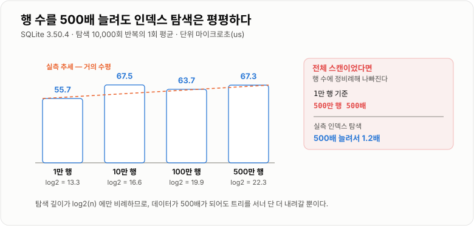
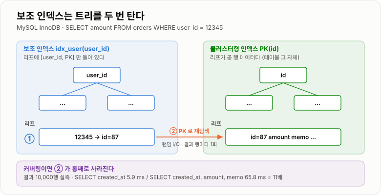
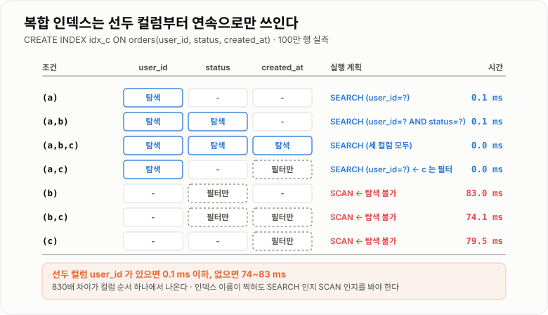
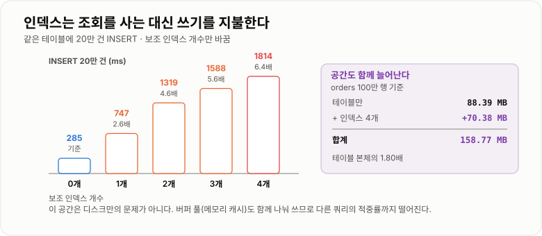

# 인덱스와 실행 계획

> **인덱스는 "붙이면 빨라지는 것"이 아니라 "정렬된 사본을 하나 더 두는 것"이다. 그래서 조회는 1,200배 빨라지고 쓰기는 6.4배 느려지며, 컬럼 순서를 한 칸 잘못 잡으면 있으나 마나 한 인덱스가 된다.**

---

## 1. 핵심 요약

* 100만 행에서 `user_id` 단건 조회는 인덱스 없이 **120.0 ms**, 인덱스를 붙이면 **0.1 ms**다. **약 1,200배** 차이다.
* 인덱스는 **공짜가 아니다.** 실측에서 보조 인덱스 4개를 붙이자 테이블 88.4 MB가 **158.8 MB(1.80배)** 로 늘었고, 20만 건 INSERT가 284.7 ms → **1,814.5 ms(6.4배)** 로 느려졌다.
* **선두 컬럼 규칙이 전부다.** `(user_id, status, created_at)` 인덱스에서 `user_id` 조건이 있으면 **0.1 ms**, `status`만 있으면 탐색이 안 되고 전체 훑기로 떨어져 **83.0 ms**가 됐다. **830배** 차이다.
* **범위 조건 하나가 뒤 컬럼을 전부 막는다.** `a=? AND b>? AND c=?`에서 실행 계획은 `(user_id=? AND status>?)`까지만 인덱스를 썼고 `c`는 필터로만 쓰였다.
* **커버링 인덱스**는 결과 행이 많을수록 효과가 크다. 1만 행 조회에서 인덱스만으로 끝내면 **5.9 ms**, 테이블을 다시 읽으면 **65.8 ms**로 **11배** 벌어졌다.
* 컬럼에 **함수·연산을 씌우면 인덱스가 죽는다.** `user_id = 7`은 0.1 ms, `user_id + 0 = 7`은 **48.0 ms**로 480배 느렸다.
* **같은 인덱스도 선택도에 따라 결과가 다르다.** `status` 인덱스로 1% 값(`REFUNDED`)을 뽑으면 4.3 ms, 70% 값(`PAID`)을 뽑으면 **391.5 ms**였다.
* **인덱스는 정렬 비용도 없앤다.** `ORDER BY created_at LIMIT 20`이 인덱스 없이 160.2 ms(`USE TEMP B-TREE FOR ORDER BY`), 인덱스가 있으면 **0.1 ms**였다.
* B-트리라서 **데이터가 늘어도 탐색 시간이 거의 안 는다.** 1만 → 500만 행으로 **500배** 키웠는데 탐색 1회는 55.7 μs → 67.3 μs로 **1.2배**만 늘었다.

> 이 노트의 수치는 **SQLite 3.50.4에 100만 행 `orders` / 10만 행 `users`를 넣고 직접 측정**한 것이다. B-트리·선두 컬럼 규칙·커버링·선택도는 MySQL InnoDB에서도 동일하게 성립한다. **엔진마다 다른 부분(클러스터형 인덱스 구조, `EXPLAIN` 표기, 접두 `LIKE` 최적화)은 본문에서 따로 표시했다.**

---

## 2. 등장 배경

### 해결하려는 문제

책 한 권에서 특정 단어를 찾는 두 가지 방법을 생각해 보자. 1쪽부터 넘기며 읽거나, 뒤쪽 색인에서 단어를 찾아 쪽수로 바로 가거나다. 데이터베이스도 똑같다.

100만 행짜리 주문 테이블에서 특정 회원의 주문을 찾는 데 걸리는 시간을 실제로 재 봤다.

```text
SELECT id, amount FROM orders WHERE user_id = 12345      (100만 행, 결과 10건)

  인덱스 없음   120.0 ms     실행 계획: SCAN orders
```

**10건을 찾으려고 100만 행을 전부 읽었다.** 결과의 10만 배를 읽은 셈이다.

문제는 이게 선형으로 나빠진다는 것이다. 행이 1,000만이면 1.2초, 1억이면 12초다. 그리고 **동시에 100명이 이 쿼리를 날리면 서버가 그대로 멈춘다.**

### 이 개념이 없을 때

인덱스가 없다면 직접 만들어야 한다. 애플리케이션에서 조회용 자료구조를 따로 들고 있는 방식이다.

```java
public class OrderIndex {

    // user_id → 주문 ID 목록
    private final Map<Long, List<Long>> byUser = new HashMap<Long, List<Long>>();

    public void onInsert(Order order) {
        List<Long> ids = byUser.get(order.getUserId());
        if (ids == null) {
            ids = new ArrayList<Long>();
            byUser.put(order.getUserId(), ids);
        }
        ids.add(order.getId());
    }

    public void onDelete(Order order) {
        List<Long> ids = byUser.get(order.getUserId());
        if (ids != null) {
            ids.remove(order.getId());
        }
    }

    public List<Long> findByUser(Long userId) {
        List<Long> ids = byUser.get(userId);
        return ids == null ? Collections.<Long>emptyList() : ids;
    }
}
```

조회는 빨라진다. 그런데 실무에 필요한 것이 전부 빠져 있다.

* **범위 조회를 못 한다.** `HashMap`은 "5월 1일부터 10일까지"를 못 뽑는다. 정렬된 구조가 필요하다.
* **정렬된 결과를 못 준다.** `ORDER BY created_at`을 하려면 전부 꺼내 다시 정렬해야 한다.
* **갱신 누락이 곧 데이터 오염이다.** `onInsert`를 한 군데서 빠뜨리면 조회 결과가 조용히 틀린다.
* **메모리에 다 안 들어간다.** 1억 행이면 이 `Map`이 힙을 통째로 먹는다.
* **여러 서버가 각자 다른 색인을 들고 있게 된다.** 동기화 문제가 새로 생긴다.
* **트랜잭션과 어긋난다.** 롤백된 주문이 색인에는 남는다.

데이터베이스 인덱스는 이 여섯 가지를 전부 다룬다. **B-트리를 쓰기 때문에 범위와 정렬이 되고, 엔진이 직접 갱신하므로 누락이 없고, 디스크에 두므로 메모리 한계가 없고, 트랜잭션 안에서 함께 롤백된다.**

대신 대가가 있다. 인덱스는 **정렬된 사본**이므로 저장 공간을 더 쓰고, 쓰기마다 사본도 갱신해야 한다. 이 노트의 나머지는 그 대가를 언제 지불할 가치가 있는지에 관한 것이다.

---

## 3. 핵심 개념

| 개념 | 설명 | 중요한 이유 |
| --- | --- | --- |
| **B-트리 / B+트리** | 균형 잡힌 다분기 트리. 리프에 실제 키가 정렬되어 있다 | 탐색·범위·정렬을 한 구조로 해결한다. |
| **클러스터형 인덱스** | 테이블 데이터 자체가 이 인덱스 순서로 저장된다 | InnoDB에서는 PK가 곧 데이터 저장 순서다. |
| **보조 인덱스** | 별도로 만드는 인덱스. 리프에 행을 찾을 위치가 들어 있다 | InnoDB에서는 그 위치가 **PK 값**이다. |
| **선택도(selectivity)** | 조건이 걸러 내는 비율. `고유값 수 / 전체 행 수` | 낮으면 인덱스를 타도 안 빨라진다. |
| **카디널리티** | 컬럼의 고유값 개수 | 옵티마이저가 인덱스를 고르는 근거다. |
| **복합 인덱스** | 여러 컬럼을 묶은 인덱스 | **컬럼 순서가 성능을 결정한다.** |
| **선두 컬럼 규칙** | 앞 컬럼부터 연속으로 써야 탐색이 된다 | 이 노트에서 가장 중요한 규칙이다. |
| **커버링 인덱스** | 쿼리에 필요한 컬럼을 인덱스가 전부 갖고 있는 상태 | 테이블을 아예 안 읽는다. |
| **인덱스 스캔 vs 탐색** | 인덱스를 처음부터 훑는가, 특정 위치로 바로 가는가 | 같은 "인덱스 사용"이라도 비용이 다르다. |
| **옵티마이저** | 실행 계획을 고르는 엔진 부품 | 통계에 근거해 비용을 추정한다. |
| **통계 정보** | 행 수·카디널리티·값 분포 | 낡으면 옵티마이저가 엉뚱한 계획을 고른다. |
| **실행 계획** | 쿼리를 실제로 어떻게 처리할지의 계획 | `EXPLAIN`으로 본다. **추정치다.** |
| **인덱스 무력화** | 조건 형태 때문에 인덱스를 못 쓰는 것 | 함수·연산·앞 `%`가 대표적이다. |

### 개념 간 관계

```text
쿼리가 들어오면

  파서 → 옵티마이저 → 실행기
           │
           ├─ 어떤 인덱스를 쓸까?          ← 통계 정보(카디널리티)를 본다
           ├─ 탐색(seek)이 되나 훑기(scan)만 되나?  ← 선두 컬럼 규칙
           ├─ 테이블을 다시 읽어야 하나?     ← 커버링 여부
           └─ 정렬을 따로 해야 하나?        ← 인덱스 순서와 ORDER BY 가 맞는가

  이 네 가지가 실행 시간의 대부분을 결정한다
```

**"인덱스를 탄다"는 말이 두 가지를 뭉뚱그린다는 점**을 먼저 짚어야 한다. 인덱스의 특정 위치로 바로 가는 **탐색(seek)** 과, 인덱스를 처음부터 끝까지 읽는 **훑기(scan)** 는 완전히 다르다. 실측에서 이 둘은 0.1 ms와 83.0 ms였다. 실행 계획에 인덱스 이름이 찍혔다고 안심하면 안 되는 이유다.

---

## 4. 구조와 동작 원리

### B-트리가 왜 안 느려지는가

인덱스가 B-트리인 이유는 **데이터가 늘어도 탐색 깊이가 거의 안 늘기 때문**이다. 실제로 재 봤다.

```text
행 수에 따른 인덱스 탐색 시간 (탐색 10,000회 반복)

  행     10,000개    557.4 ms   (1회 55.7 us)     log2(n) = 13.3
  행    100,000개    674.6 ms   (1회 67.5 us)     log2(n) = 16.6
  행  1,000,000개    637.0 ms   (1회 63.7 us)     log2(n) = 19.9
  행  5,000,000개    673.0 ms   (1회 67.3 us)     log2(n) = 22.3
```

**데이터를 500배 늘렸는데 탐색 시간은 1.2배다.** 전체 스캔이었다면 500배 느려졌을 것이다.



*전체 스캔은 행 수에 비례해 나빠지지만, B-트리 탐색은 트리 깊이에만 비례해 사실상 평평하다.*

이것이 O(n)과 O(log n)의 실제 차이다. 100만 행에서 인덱스가 1,200배 이득이었다면, 1억 행에서는 그 격차가 훨씬 커진다.

### 트리 깊이는 실제로 몇 단인가

MySQL InnoDB 기준으로 계산해 보면 감이 잡힌다. 페이지 크기는 기본 **16 KB**다.

```text
가정: PK 가 BIGINT(8바이트), 자식 페이지 포인터 6바이트

  중간 노드 한 페이지에 들어가는 항목 수
      16,384 / (8 + 6) ≈ 1,170 개

  리프 한 페이지에 들어가는 행 수 (행 크기 1KB 가정)
      16,384 / 1,024 = 16 행

  깊이 2 (루트 → 리프)          1,170 x 16        ≈ 1.9만 행
  깊이 3 (루트 → 중간 → 리프)    1,170 x 1,170 x 16 ≈ 2,190만 행
  깊이 4                       1,170^3 x 16      ≈ 256억 행
```

**수천만 행짜리 테이블도 3단이면 충분하다.** 인덱스 탐색이 디스크 접근 3~4번으로 끝난다는 뜻이고, 그중 위쪽 단은 거의 항상 메모리(버퍼 풀)에 올라와 있다.

### 클러스터형 인덱스와 보조 인덱스 (MySQL InnoDB)

InnoDB에서는 **테이블 데이터 자체가 PK 순서로 정렬되어 저장된다.** 이걸 클러스터형 인덱스라고 한다. 보조 인덱스는 별도의 B-트리이고, **리프에 PK 값이 들어 있다.**



*보조 인덱스 조회는 트리를 두 번 탄다. 필요한 컬럼이 인덱스에 다 있으면(커버링) 두 번째 탐색이 사라진다.*

```text
SELECT amount FROM orders WHERE user_id = 12345

  1) 보조 인덱스 idx_user 를 탐색  →  user_id=12345 인 항목들
  2) 각 항목에서 PK(id) 를 꺼낸다
  3) PK 로 클러스터형 인덱스를 다시 탐색  →  amount 를 읽는다   ← 이게 추가 비용
```

3번을 **랜덤 I/O**라고 부른다. 결과 행마다 한 번씩 일어난다. 그래서 결과 행이 많아질수록 이 비용이 지배적이 된다. 실측으로 확인했다.

```text
created_at 범위 조회 (결과 10,000행)

  SELECT created_at             →   5.9 ms   plan: SEARCH ... USING COVERING INDEX
  SELECT created_at, amount, memo →  65.8 ms   plan: SEARCH ... USING INDEX
```

**같은 인덱스, 같은 조건, 같은 결과 건수인데 11배 차이가 난다.** 차이는 SELECT 목록뿐이다. 첫 번째는 인덱스만 읽고 끝났고, 두 번째는 1만 번의 테이블 접근이 추가됐다.

여기서 두 가지가 따라 나온다.

**첫째, PK를 무겁게 잡으면 모든 보조 인덱스가 무거워진다.** 보조 인덱스 리프마다 PK 값이 들어가기 때문이다. PK가 `BIGINT`(8바이트)면 8바이트가, `UUID` 문자열(36바이트)이면 36바이트가 인덱스 개수만큼 곱해져 붙는다.

**둘째, `SELECT *`는 커버링 인덱스를 원천적으로 불가능하게 만든다.** 필요한 컬럼만 적는 것이 단순한 스타일 문제가 아니다.

### 복합 인덱스 — 선두 컬럼 규칙

이 노트에서 가장 중요한 부분이다. `(user_id, status, created_at)` 인덱스를 만들고 조건 조합을 바꿔 가며 전부 측정했다.

```text
CREATE INDEX idx_c ON orders(user_id, status, created_at)

조건 조합                            시간      실행 계획
────────────────────────────────────────────────────────────────────────────
(a)     user_id=?                    0.1 ms   SEARCH (user_id=?)
(a,b)   user_id=? status=?           0.1 ms   SEARCH (user_id=? AND status=?)
(a,b,c) user_id=? status=? created=?  0.0 ms   SEARCH (user_id=? AND status=? AND created_at=?)
(a,c)   user_id=? created=?           0.0 ms   SEARCH (user_id=?)          ← c 는 못 쓴다
(b)     status=?                     83.0 ms   SCAN                        ← 탐색 불가
(b,c)   status=? created=?           74.1 ms   SCAN                        ← 탐색 불가
(c)     created=?                    79.5 ms   SCAN                        ← 탐색 불가
```



*선두 컬럼 `user_id`가 조건에 있는 위 세 줄은 0.1 ms 이하, 없는 아래 세 줄은 74~83 ms다. 830배 차이가 컬럼 순서 하나에서 나온다.*

읽을 것이 셋이다.

**첫째, 선두 컬럼이 없으면 탐색이 불가능하다.** `(b)`, `(b,c)`, `(c)` 세 경우 모두 실행 계획이 `SEARCH`가 아니라 `SCAN`이다. 인덱스 이름은 찍혀 있지만 **처음부터 끝까지 훑고 있다.** 0.1 ms가 83.0 ms가 됐다.

전화번호부를 생각하면 명확하다. `(성, 이름)` 순으로 정렬된 명부에서 "김"으로 시작하는 사람은 바로 찾지만, **이름이 "철수"인 사람은 전부 넘겨 봐야 한다.**

**둘째, 중간 컬럼을 건너뛰면 그 뒤는 못 쓴다.** `(a,c)` 케이스의 실행 계획이 `SEARCH (user_id=?)`까지만이다. `created_at` 조건은 인덱스로 좁히지 못하고 읽어 온 뒤 걸러 내는 데만 쓰였다. `(user_id, status, created_at)`에서 `status`가 빠지면 **`created_at`은 정렬되어 있지 않기 때문**이다.

**셋째, 그래도 "인덱스를 탄다"고 표시된다.** 실행 계획에 인덱스 이름이 있다는 이유로 넘어가면 안 된다. **`SEARCH`인지 `SCAN`인지를 봐야 한다.**

> **MySQL 8.0.13부터는 예외가 하나 생겼다.** 인덱스 스킵 스캔(index skip scan)이 도입되어, **선두 컬럼의 고유값이 아주 적으면** 옵티마이저가 그 값들을 하나씩 돌며 뒤 컬럼으로 탐색할 수 있다. 다만 선두 컬럼 카디널리티가 낮을 때만 쓰이는 제한적 최적화이고, **선두 컬럼 규칙을 대체하지는 않는다.** 설계는 여전히 규칙대로 해야 한다.

### 범위 조건은 그 뒤를 전부 막는다

등호 조건은 뒤 컬럼을 살리지만, **범위 조건(`>`, `<`, `BETWEEN`, `LIKE 'x%'`)은 거기서 끝낸다.**

```text
a=? AND b=? AND c>?    plan: SEARCH (user_id=? AND status=? AND created_at>?)   ← c 까지 쓴다
a=? AND b>? AND c=?    plan: SEARCH (user_id=? AND status>?)                    ← c 를 못 쓴다
```

**범위 조건이 마지막에 오면 세 컬럼을 다 쓰고, 가운데 오면 그 뒤가 죽는다.** 이유는 정렬 구조에 있다.

```text
(user_id, status, created_at) 로 정렬된 인덱스

  user_id=7, status='PAID'    → created_at 이 정렬되어 있다   ✓ 범위 탐색 가능
  user_id=7, status>'A'       → status 가 여러 값에 걸친다
                                 각 status 안에서만 created_at 이 정렬
                                 전체로 보면 created_at 은 뒤죽박죽  ✗
```

여기서 **복합 인덱스 컬럼 순서의 실용 원칙**이 나온다.

```text
1. 등호(=) 조건 컬럼을 앞에
2. 범위(>, <, BETWEEN) 조건 컬럼을 뒤에
3. ORDER BY 컬럼은 범위 조건 뒤에 붙여도 정렬을 못 없앤다 — 등호 조건 뒤에 둔다
4. 같은 조건이면 카디널리티(고유값 수)가 높은 것을 앞에
```

### 선택도 — 인덱스를 타도 안 빨라지는 경우

인덱스가 있고 탐색도 되는데 느린 경우가 있다. **조건이 데이터를 별로 안 걸러 낼 때**다.

```text
status 컬럼 분포 (100만 행)
  PAID       699,836  (70.0%)
  SHIPPED    200,245  (20.0%)
  CANCELLED   90,143  ( 9.0%)
  REFUNDED     9,776  ( 1.0%)

idx_status 인덱스로 조회
  status='REFUNDED'  (1%)     4.3 ms    9,776 행
  status='PAID'     (70%)   391.5 ms  699,836 행     ← 91배
```

**같은 인덱스인데 91배 차이다.** 70%를 뽑아야 한다면 인덱스를 타나 전체를 읽으나 결국 대부분을 읽는다.

MySQL InnoDB에서는 이게 더 심각하다. 앞서 본 대로 **보조 인덱스 조회는 행마다 클러스터형 인덱스를 한 번 더 탐색**한다. 70만 번의 랜덤 I/O는 순차적으로 100만 행을 읽는 것보다 **오히려 느리다.** 그래서 MySQL 옵티마이저는 이런 경우 인덱스를 무시하고 전체 스캔(`type: ALL`)을 고른다. 통계상 대략 **전체의 20~30%를 넘게 읽어야 하면** 인덱스를 버리는 쪽으로 판단한다.

> 위 실측에서 SQLite가 70% 조건에도 인덱스를 쓴 이유는 **그 인덱스가 커버링이라 테이블 접근이 없었기 때문**이다(`USING COVERING INDEX`). 커버링이 아니었다면 전체 스캔이 유리했을 것이다. **선택도가 낮아도 커버링이면 인덱스가 살아남는다**는 점을 함께 기억하면 좋다.

여기서 실용 결론이 나온다. **성별·상태·삭제 플래그처럼 값이 몇 개뿐인 컬럼은 단독 인덱스로 가치가 낮다.** 다만 `(status, created_at)`처럼 **선택도 높은 컬럼과 묶으면** 쓸모가 생긴다.

### 인덱스를 못 쓰게 만드는 조건들

전부 직접 측정했다. 좌변에 손을 대는 순간 인덱스가 죽는다.

```text
조건                                     시간       실행 계획
────────────────────────────────────────────────────────────────────
user_id = 7                              0.1 ms    SEARCH (user_id=?)
user_id + 0 = 7                         48.0 ms    SCAN            ← 480배
user_id != 7                            48.1 ms    SCAN
email = 'user012345@example.com'         0.0 ms    SEARCH (email=?)
substr(email,1,10) = 'user012345'       11.9 ms    SCAN
email LIKE 'user0123%'   (뒤 %)          0.1 ms    SEARCH (email>? AND email<?)
email LIKE '%345@example.com' (앞 %)    11.1 ms    SCAN            ← 110배
```

이유는 하나로 설명된다. **인덱스는 컬럼의 원래 값으로 정렬되어 있다.** `user_id`로 정렬된 인덱스는 `user_id + 0`으로는 정렬되어 있지 않고, `email`로 정렬된 인덱스는 `substr(email,1,10)`으로는 정렬되어 있지 않다. **정렬되어 있지 않으면 이분 탐색을 할 수 없다.**

`LIKE`도 같은 원리다. `'user0123%'`는 **접두사가 고정**이라 정렬된 인덱스에서 연속된 구간이다. `'%345@example.com'`는 시작이 뭔지 모르니 전부 봐야 한다.

고치는 방법은 언제나 **좌변을 원래 컬럼으로 되돌리는 것**이다.

```sql
-- 나쁨: 컬럼에 함수를 씌운다
WHERE DATE(created_at) = '2024-05-01'
WHERE YEAR(created_at) = 2024
WHERE SUBSTRING(phone, 1, 3) = '010'
WHERE amount * 1.1 > 10000

-- 좋음: 우변을 바꾼다
WHERE created_at >= '2024-05-01' AND created_at < '2024-05-02'
WHERE created_at >= '2024-01-01' AND created_at < '2025-01-01'
WHERE phone LIKE '010%'
WHERE amount > 10000 / 1.1
```

> **함수를 꼭 써야 한다면** MySQL 8.0.13부터 함수 기반 인덱스(functional index)를 만들 수 있다. `CREATE INDEX idx_d ON orders((DATE(created_at)))`처럼 표현식 자체를 인덱싱한다. 다만 **조건의 표현식이 인덱스 정의와 정확히 일치해야** 쓰인다. 그 전 버전에서는 생성 컬럼(generated column)을 만들고 거기에 인덱스를 거는 방법을 썼다.

암묵적 타입 변환도 같은 함정이다. **문자열 컬럼에 숫자를 비교하면 엔진이 컬럼 쪽을 숫자로 변환**하므로 결과적으로 함수를 씌운 것과 같아진다.

```sql
-- user_code 가 VARCHAR 인 경우
WHERE user_code = 12345      -- 인덱스를 못 탄다 (컬럼이 변환된다)
WHERE user_code = '12345'    -- 인덱스를 탄다
```

반대로 **숫자 컬럼에 문자열을 넣으면 상수 쪽이 변환**되므로 인덱스가 살아 있다. 어느 쪽이 변환되는지가 갈림길이다.

> **접두 `LIKE`는 엔진 설정에 따라 다르다.** 위 실측에서 `LIKE 'user0123%'`가 인덱스를 타려면 SQLite에서 `PRAGMA case_sensitive_like=ON`이 필요했다. 기본값(대소문자 무시)에서는 인덱스의 이진 정렬 순서와 비교 규칙이 어긋나 탐색이 안 됐다(9.7 ms). MySQL은 컬럼의 콜레이션이 인덱스에도 그대로 적용되므로 **대소문자 무시 콜레이션에서도 접두 `LIKE`가 인덱스를 탄다.** 원리는 같다 — **비교 규칙과 인덱스 정렬 순서가 일치해야 탐색이 된다.**

### 정렬 — 인덱스는 `ORDER BY` 비용도 없앤다

인덱스가 이미 정렬된 구조라는 사실에서 나오는 두 번째 이득이다.

```text
SELECT id FROM orders ORDER BY created_at LIMIT 20

  인덱스 없음   160.2 ms    plan: SCAN orders / USE TEMP B-TREE FOR ORDER BY
  인덱스 있음     0.1 ms    plan: SCAN orders USING COVERING INDEX idx_created
  DESC 로 역순    0.1 ms    plan: SCAN orders USING COVERING INDEX idx_created
```

**1,600배 차이다.** 인덱스가 없으면 20건을 얻으려고 100만 행을 전부 읽어 정렬한 뒤 앞 20개만 남긴다. 인덱스가 있으면 **이미 정렬된 순서로 앞에서 20개만 읽고 멈춘다.**

`DESC`도 같은 시간이라는 점이 중요하다. B-트리는 **양방향으로 읽을 수 있다.** 그래서 오름차순 인덱스 하나로 내림차순 정렬도 처리된다.

> **다만 컬럼마다 방향이 섞이면 다르다.** `ORDER BY a ASC, b DESC`는 단일 방향 인덱스로 처리할 수 없다. MySQL은 **8.0부터 내림차순 인덱스**(`CREATE INDEX ... ON t(a ASC, b DESC)`)를 실제로 지원한다. 그 전 버전에서는 `DESC` 키워드를 문법상 받아들이기만 하고 무시했다.

실행 계획에서 이걸 확인하는 표시가 엔진마다 있다. SQLite는 `USE TEMP B-TREE FOR ORDER BY`, **MySQL은 `Extra` 칸의 `Using filesort`** 다. 이게 보이면 정렬을 따로 하고 있다는 뜻이다.

### 인덱스가 쓰기에 물리는 비용

여기까지가 이득이고, 이제 대가다. 인덱스는 **정렬된 사본**이므로 데이터가 바뀔 때마다 사본도 고쳐야 한다.

```text
같은 테이블에 20만 건 INSERT (보조 인덱스 개수만 바꿈)

  보조 인덱스 0개      284.7 ms      기준
  보조 인덱스 1개      747.1 ms      2.6배
  보조 인덱스 2개    1,319.2 ms      4.6배
  보조 인덱스 3개    1,587.5 ms      5.6배
  보조 인덱스 4개    1,814.5 ms      6.4배
```



*보조 인덱스 하나만 붙여도 INSERT가 2.6배 느려지고, 네 개면 6.4배가 된다.*

공간도 마찬가지다.

```text
orders 100만 행 (테이블만)                     88.39 MB
  + orders(user_id)                            +11.16 MB
  + orders(created_at)                         +18.17 MB
  + orders(status)                             +13.47 MB
  + orders(user_id, status, created_at)        +27.58 MB
                                          ─────────────
  인덱스 4개 포함                              158.77 MB   (테이블의 1.80배)
```

**인덱스 네 개가 테이블 본체의 80%에 해당하는 공간을 더 썼다.** 그리고 이 공간은 디스크만의 문제가 아니다. **버퍼 풀(메모리 캐시)도 함께 나눠 쓴다.** 인덱스가 많으면 캐시 적중률이 떨어져 다른 쿼리까지 느려진다.

인덱스 생성 자체의 비용도 있다.

```text
100만 행 테이블에 CREATE INDEX
  orders(user_id)      563.3 ms
  orders(created_at)   637.6 ms
```

실측은 1초 미만이지만, 이건 로컬 SQLite에 100만 행 기준이다. **운영 중인 MySQL에서 수천만 행 테이블에 인덱스를 걸면 수 분에서 수십 분이 걸릴 수 있다.** MySQL 5.6부터 온라인 DDL로 대부분의 인덱스 추가가 테이블을 잠그지 않고 진행되지만, **부하와 복제 지연은 여전히 발생한다.** 트래픽이 적은 시간을 고르는 이유다.

### 실행 계획 읽기 (MySQL `EXPLAIN`)

지금까지 본 것을 실무에서 확인하는 도구다. **가장 먼저 보는 것은 `type`과 `Extra`** 다.

```sql
EXPLAIN SELECT id, amount FROM orders WHERE user_id = 12345;
```

`type` — 접근 방식이다. **위쪽이 좋다.**

| `type` | 의미 | 판단 |
| --- | --- | --- |
| `const` | PK/유니크로 딱 한 행 | 최상 |
| `eq_ref` | 조인에서 상대 행마다 정확히 하나 | 최상 |
| `ref` | 인덱스로 여러 행 탐색 | 좋음 |
| `range` | 인덱스 범위 탐색 | 좋음 |
| `index` | **인덱스 전체 훑기** | 주의 — 앞서 본 `SCAN`이 여기다 |
| `ALL` | **테이블 전체 훑기** | 나쁨 |

**`index`와 `ALL`이 위험 신호다.** 특히 `index`는 인덱스를 쓰고 있어서 언뜻 괜찮아 보이지만, 실측에서 83 ms가 나온 그 상태다.

`Extra` — 추가 동작이다.

| `Extra` | 의미 | 판단 |
| --- | --- | --- |
| `Using index` | **커버링 인덱스.** 테이블을 안 읽는다 | 최상 |
| `Using index condition` | 인덱스 조건 푸시다운(ICP). 테이블 접근 전에 거른다 | 좋음 |
| `Using where` | 읽어 온 뒤 걸러 낸다 | 보통 |
| `Using filesort` | **정렬을 따로 한다** | 주의 |
| `Using temporary` | **임시 테이블을 만든다** | 주의 |

`rows`는 **읽을 것으로 추정하는 행 수**다. 실제가 아니라 통계 기반 추정치다. 실제 값을 보려면 **MySQL 8.0.18부터 `EXPLAIN ANALYZE`** 를 쓴다. 쿼리를 실제로 실행하고 단계별 실제 시간·행 수를 보여준다.

```sql
EXPLAIN ANALYZE SELECT id FROM orders WHERE user_id = 12345;
-- 추정(cost=..., rows=...) 과 실제(actual time=..., rows=...) 를 함께 보여준다
```

**추정과 실제가 크게 다르면 통계가 낡은 것**이다. `ANALYZE TABLE orders;`로 갱신한다.

---

## 5. 코드 또는 사용 예시

### 인덱스 설계 — 조회 패턴에서 출발한다

인덱스는 컬럼을 보고 만드는 게 아니라 **쿼리를 보고 만든다.**

```sql
-- 실제로 나가는 쿼리들
-- 1) SELECT * FROM orders WHERE user_id = ? ORDER BY created_at DESC LIMIT 20
-- 2) SELECT * FROM orders WHERE user_id = ? AND status = ?
-- 3) SELECT COUNT(*) FROM orders WHERE created_at >= ? AND created_at < ?

-- 1) 과 2) 를 하나로 덮는다: 등호 조건 먼저, 정렬 컬럼을 뒤에
CREATE INDEX idx_user_status_created ON orders (user_id, status, created_at);

-- 3) 은 선두 컬럼이 다르므로 별도로 필요하다
CREATE INDEX idx_created ON orders (created_at);
```

첫 번째 인덱스가 쿼리 1과 2를 모두 처리한다는 점이 핵심이다. **`(user_id, status, created_at)` 인덱스는 `(user_id)`와 `(user_id, status)` 인덱스를 포함한다.** 실측에서 세 조합 모두 0.1 ms 이하였다.

그래서 **이미 있는 복합 인덱스의 접두사와 같은 인덱스를 따로 만들면 순수한 낭비**다.

```sql
-- 중복이다. (user_id, status, created_at) 이 이미 덮는다
CREATE INDEX idx_user ON orders (user_id);              -- 불필요
CREATE INDEX idx_user_status ON orders (user_id, status); -- 불필요
```

앞서 본 대로 인덱스 하나가 INSERT를 2.6배 느리게 하고 11~28 MB를 먹는다. **쓸모없는 인덱스는 비용만 낸다.**

### 정렬까지 인덱스로 처리하기

```sql
-- 나쁨: user_id 로 좁힌 뒤 정렬을 따로 한다 (Using filesort)
CREATE INDEX idx_a ON orders (user_id);
SELECT * FROM orders WHERE user_id = 100 ORDER BY created_at DESC LIMIT 20;

-- 좋음: 인덱스 순서대로 읽으면 이미 정렬되어 있다
CREATE INDEX idx_b ON orders (user_id, created_at);
SELECT * FROM orders WHERE user_id = 100 ORDER BY created_at DESC LIMIT 20;
```

실측에서 이 차이가 160.2 ms와 0.1 ms였다. **`WHERE` 컬럼과 `ORDER BY` 컬럼을 한 인덱스에 묶는 것**이 정렬을 없애는 방법이다.

단, 앞서 본 범위 조건 규칙이 여기에도 걸린다.

```sql
-- created_at 이 범위 조건이면 그 뒤 amount 로는 정렬을 못 없앤다
CREATE INDEX idx_c ON orders (user_id, created_at, amount);
SELECT * FROM orders
 WHERE user_id = 100 AND created_at >= '2024-01-01'
 ORDER BY amount DESC;        -- Using filesort 가 남는다
```

### 커버링 인덱스 만들기

```sql
-- 자주 나가는 목록 쿼리
SELECT id, status, amount FROM orders WHERE user_id = ? ORDER BY created_at DESC;

-- SELECT 컬럼까지 인덱스에 넣으면 테이블을 안 읽는다
CREATE INDEX idx_cover ON orders (user_id, created_at, status, amount);
```

실측에서 커버링 여부가 5.9 ms와 65.8 ms를 갈랐다(1만 행 기준, 11배).

**다만 무한정 넣으면 안 된다.** 컬럼을 더할수록 인덱스가 커지고, 인덱스가 커지면 버퍼 풀을 더 먹고 쓰기가 더 느려진다. **결과 행이 많은 목록 쿼리에만** 쓰는 것이 맞다. 단건 조회는 테이블 접근이 한 번뿐이라 커버링의 이득이 거의 없다(실측 0.1 ms vs 0.1 ms).

### JPA에서 인덱스 선언

```java
@Entity
@Table(
    name = "orders",
    indexes = {
        @Index(name = "idx_user_status_created", columnList = "user_id, status, created_at"),
        @Index(name = "idx_created", columnList = "created_at")
    }
)
public class Order {

    @Id
    @GeneratedValue(strategy = GenerationType.IDENTITY)
    private Long id;

    @Column(name = "user_id", nullable = false)
    private Long userId;

    @Enumerated(EnumType.STRING)
    @Column(nullable = false, length = 20)
    private OrderStatus status;

    @Column(name = "created_at", nullable = false)
    private LocalDateTime createdAt;
}
```

`@Index`는 **`ddl-auto`로 스키마를 생성할 때만 반영된다.** 운영에서는 Flyway나 Liquibase로 관리하고, `@Index` 선언은 **"이 인덱스가 있어야 한다"는 문서 역할**로 남긴다.

### 조건절에서 인덱스를 살리는 형태

```java
// 나쁨: 컬럼에 함수를 씌운다
@Query("SELECT o FROM Order o WHERE FUNCTION('DATE', o.createdAt) = :date")
List<Order> findByDate(@Param("date") LocalDate date);

// 좋음: 범위로 바꾼다
@Query("SELECT o FROM Order o WHERE o.createdAt >= :start AND o.createdAt < :end")
List<Order> findByDateRange(@Param("start") LocalDateTime start,
                            @Param("end") LocalDateTime end);
```

메서드 이름 규칙으로도 같은 결과를 얻는다.

```java
public interface OrderRepository extends JpaRepository<Order, Long> {

    // (user_id, status, created_at) 인덱스를 그대로 탄다
    List<Order> findByUserIdAndStatusOrderByCreatedAtDesc(Long userId, OrderStatus status);

    // created_at 을 범위로 다룬다 — 인덱스가 살아 있다
    List<Order> findByCreatedAtBetween(LocalDateTime start, LocalDateTime end);
}
```

### 안 쓰는 인덱스 찾기

```sql
-- MySQL: 한 번도 사용되지 않은 인덱스
SELECT object_schema, object_name, index_name
  FROM performance_schema.table_io_waits_summary_by_index_usage
 WHERE index_name IS NOT NULL
   AND count_star = 0
   AND object_schema NOT IN ('mysql', 'performance_schema')
 ORDER BY object_schema, object_name;
```

**바로 지우지 말고 먼저 안 보이게 만든다.** MySQL 8.0의 invisible index를 쓰면 옵티마이저에게만 숨긴 채 실제로는 유지된다.

```sql
ALTER TABLE orders ALTER INDEX idx_old INVISIBLE;   -- 옵티마이저가 무시한다
-- 며칠 관찰해서 문제가 없으면
DROP INDEX idx_old ON orders;
-- 문제가 생기면 즉시 되돌린다 (재생성 비용 없음)
ALTER TABLE orders ALTER INDEX idx_old VISIBLE;
```

수천만 행 테이블의 인덱스를 재생성하는 데는 수 분이 걸린다. **되돌리는 비용이 0인 방법이 있는데 굳이 위험을 질 이유가 없다.**

---

## 6. 성능 특성

### 인덱스 유무 (100만 행)

```text
쿼리                                인덱스 없음    인덱스 있음    배수
──────────────────────────────────────────────────────────────────
user_id = 12345 (결과 10건)          120.0 ms       0.1 ms      1,200배
created_at 범위 (결과 1만 건)         151.0 ms       4.5 ms         34배
ORDER BY created_at LIMIT 20         160.2 ms       0.1 ms      1,600배
```

**결과 행이 적을수록 배수가 크다.** 10건을 뽑을 때 1,200배, 1만 건을 뽑을 때 34배다. 인덱스의 이득은 **읽지 않아도 되는 행의 수**에서 나오기 때문이다.

### 탐색(seek)과 훑기(scan)

같은 인덱스라도 접근 방식에 따라 다르다.

```text
(user_id, status, created_at) 인덱스

  SEARCH (선두 컬럼 있음)      0.1 ms 이하
  SCAN   (선두 컬럼 없음)      74.1 ~ 83.0 ms       ← 830배
```

### 커버링 여부 (결과 1만 행)

```text
SELECT created_at              (커버링)         5.9 ms
SELECT created_at, amount, memo (테이블 접근)   65.8 ms      11배
SELECT created_at, amount      (인덱스 확장 후)  7.1 ms
```

**인덱스에 컬럼 하나를 추가해 65.8 ms를 7.1 ms로 줄였다.** 단, 단건 조회에서는 차이가 없었다(0.1 ms vs 0.1 ms). 커버링은 **결과 행이 많을 때 쓰는 카드**다.

### 선택도

```text
같은 idx_status 인덱스
  1%  (REFUNDED,   9,776행)     4.3 ms
  70% (PAID,     699,836행)   391.5 ms      91배
```

### 조건 형태

```text
user_id = 7                      0.1 ms
user_id + 0 = 7                 48.0 ms       480배
user_id != 7                    48.1 ms
email = '...'                    0.0 ms
substr(email,1,10) = '...'      11.9 ms
email LIKE 'user0123%'           0.1 ms
email LIKE '%345@example.com'   11.1 ms       110배
```

### 확장성 — 행 수를 늘렸을 때

```text
행 수        인덱스 탐색 1회      전체 스캔 예상
─────────────────────────────────────────────
     1만        55.7 us            (기준)
    10만        67.5 us            10배
   100만        63.7 us           100배
   500만        67.3 us           500배
```

**데이터가 500배 늘어도 인덱스 탐색은 1.2배**다. 이게 인덱스를 쓰는 근본적인 이유다.

### 쓰기 비용과 공간

```text
20만 건 INSERT
  인덱스 0개    284.7 ms
  인덱스 1개    747.1 ms    2.6배
  인덱스 4개  1,814.5 ms    6.4배

공간 (100만 행)
  테이블만        88.39 MB
  인덱스 4개 포함 158.77 MB   1.80배
```

**조회 1,200배 이득과 쓰기 6.4배 손해의 교환**이다. 읽기가 압도적으로 많은 일반적인 웹 서비스에서는 남는 장사지만, 로그 적재처럼 쓰기가 지배적인 테이블에서는 계산이 달라진다.

---

## 7. 장점과 단점

### 인덱스

| 장점 | 이유 |
| --- | --- |
| 조회가 극적으로 빨라진다 | 실측 1,200배. 결과 행이 적을수록 이득이 크다. |
| 데이터가 늘어도 안 느려진다 | B-트리 깊이는 로그로 는다. 500배 데이터에 1.2배. |
| 범위 조회를 처리한다 | 정렬 구조라 연속 구간을 한 번에 읽는다. |
| 정렬 비용을 없앤다 | 실측 160.2 ms → 0.1 ms. `LIMIT`과 궁합이 좋다. |
| 테이블을 아예 안 읽을 수 있다 | 커버링 인덱스. 실측 11배. |
| 유니크 제약을 강제한다 | 중복을 DB 차원에서 막는다. |
| 조인 성능의 전제가 된다 | 조인 키에 인덱스가 없으면 조인이 무너진다. |

| 단점 | 이유 |
| --- | --- |
| **쓰기가 느려진다** | 실측 4개에 6.4배. 사본을 함께 고쳐야 한다. |
| **공간을 먹는다** | 실측 테이블의 1.80배. 버퍼 풀도 나눠 쓴다. |
| **컬럼 순서에 민감하다** | 선두 컬럼이 빠지면 830배 느려진다. |
| **조건 형태에 민감하다** | 함수 하나에 480배. 코드 리뷰로만 잡힌다. |
| 선택도가 낮으면 무용지물 | 70% 조건에서는 인덱스가 이득을 못 준다. |
| 생성에 시간이 걸린다 | 대형 테이블은 수 분~수십 분. 복제 지연을 만든다. |
| 통계가 낡으면 오판한다 | 옵티마이저가 잘못된 인덱스를 고른다. |

### 커버링 인덱스

| 장점 | 이유 |
| --- | --- |
| 테이블 접근이 사라진다 | 랜덤 I/O가 통째로 없어진다. 실측 11배. |
| 결과가 많을수록 이득이 크다 | 행마다 발생하던 비용이 없어지기 때문이다. |

| 단점 | 이유 |
| --- | --- |
| 인덱스가 뚱뚱해진다 | 컬럼을 더할수록 공간·쓰기 비용이 는다. |
| `SELECT *`면 무의미하다 | 모든 컬럼을 넣을 수는 없다. |
| 단건 조회에는 효과가 거의 없다 | 실측 0.1 ms vs 0.1 ms. |

### 복합 인덱스

| 장점 | 이유 |
| --- | --- |
| 여러 쿼리를 하나로 덮는다 | `(a,b,c)`는 `(a)`, `(a,b)`도 처리한다. |
| 인덱스 개수를 줄인다 | 쓰기 비용과 공간을 아낀다. |
| 커버링을 만들기 쉽다 | 컬럼이 이미 여럿이다. |

| 단점 | 이유 |
| --- | --- |
| **순서를 바꾸려면 재생성해야 한다** | 대형 테이블에서 비싼 작업이다. |
| 선두 컬럼이 없으면 못 쓴다 | 실측 830배 차이. |
| 범위 조건 뒤가 죽는다 | `a=? AND b>? AND c=?`에서 `c`를 못 쓴다. |

---

## 8. 사용 기준

### 인덱스를 만들지 판단하는 순서

```text
이 컬럼이 WHERE / JOIN / ORDER BY 에 자주 등장하는가?
├─ 아니오  →  만들지 않는다
└─ 예
     ↓
   조건이 데이터를 충분히 걸러 내는가? (선택도)
   ├─ 아니오 (전체의 20% 이상이 걸림)
   │    →  단독으로는 의미 없다. 선택도 높은 컬럼과 묶는다
   └─ 예
        ↓
      이미 있는 복합 인덱스의 접두사인가?
      ├─ 예   →  이미 덮인다. 만들지 않는다
      └─ 아니오
           ↓
         쓰기 빈도가 조회 빈도보다 압도적인가?
         ├─ 예   →  신중하게. 인덱스 1개당 INSERT 2.6배(실측)
         └─ 아니오 →  만든다
```

### 복합 인덱스 컬럼 순서를 정하는 순서

```text
1. 등호(=) 조건 컬럼을 앞에 놓는다
2. 그중 카디널리티가 높은 것을 더 앞에
3. 범위(>, <, BETWEEN, LIKE 'x%') 조건 컬럼은 마지막 하나만
4. ORDER BY 컬럼은 등호 조건 바로 뒤에 (범위 뒤에 두면 정렬을 못 없앤다)
5. 결과 행이 많은 목록 쿼리면 SELECT 컬럼까지 붙여 커버링으로 만든다
```

### 인덱스를 만드는 것이 좋은 상황

* **PK와 유니크 제약** — 자동으로 만들어진다.
* **외래 키·조인 키** — 조인 성능의 전제다.
* **자주 조회하는 조건 컬럼** — 선택도가 높을 때.
* **`ORDER BY` + `LIMIT` 조합** — 실측 1,600배 이득.
* **범위 조회 컬럼** — `created_at` 같은 시간 컬럼.
* **결과 행이 많은 목록 쿼리** — 커버링으로 만든다.

### 인덱스를 만들지 않는 것이 좋은 상황

* **고유값이 몇 개뿐인 컬럼 단독** — 성별·삭제 플래그·상태. 실측 70% 조건에서 391.5 ms.
* **자주 갱신되는 컬럼** — 값이 바뀔 때마다 인덱스도 재배치된다.
* **이미 있는 복합 인덱스의 접두사** — `(a,b,c)`가 있으면 `(a)`, `(a,b)`는 낭비다.
* **행이 몇천 개뿐인 테이블** — 전체를 읽어도 빠르다. 옵티마이저가 인덱스를 무시한다.
* **쓰기가 지배적인 테이블** — 로그·이벤트 적재. 인덱스 4개면 INSERT 6.4배(실측).
* **`SELECT *` 만 나가는 곳에 커버링 목적으로** — 애초에 커버링이 성립하지 않는다.

### 선택 기준

1. **어떤 쿼리를 위한 인덱스인가?** — 컬럼이 아니라 쿼리에서 출발한다
2. **조건이 몇 %를 걸러 내는가?** — 20%를 못 넘기면 이득이 없다
3. **`SEARCH`인가 `SCAN`인가?** — 실행 계획에서 반드시 확인한다
4. **정렬까지 덮을 수 있는가?** — `Using filesort`가 없어지는지 본다
5. **이미 있는 인덱스로 충분한가?** — 접두사 중복을 먼저 확인한다
6. **이 테이블의 읽기/쓰기 비율은?** — 쓰기가 많으면 개수를 줄인다

---

## 9. 비슷한 개념 비교

### 탐색(`SEARCH`/`ref`)과 훑기(`SCAN`/`index`)

| 비교 항목 | 인덱스 탐색 | 인덱스 훑기 |
| --- | --- | --- |
| 동작 | 특정 위치로 바로 간다 | 인덱스를 처음부터 끝까지 읽는다 |
| 조건 | 선두 컬럼이 조건에 있다 | 선두 컬럼이 없다 |
| 실측 | **0.1 ms 이하** | **74.1 ~ 83.0 ms** |
| MySQL `type` | `const`·`eq_ref`·`ref`·`range` | `index` |
| 실행 계획 표시 | 인덱스 이름 + 조건이 함께 | 인덱스 이름만 |
| 데이터 증가 영향 | 거의 없음 (로그) | 비례해서 나빠짐 |

### 클러스터형 인덱스와 보조 인덱스 (MySQL InnoDB)

| 비교 항목 | 클러스터형 인덱스 | 보조 인덱스 |
| --- | --- | --- |
| 개수 | 테이블당 하나 (PK) | 여러 개 |
| 리프에 있는 것 | **행 데이터 전체** | 인덱스 컬럼 + **PK 값** |
| 조회 경로 | 트리 한 번 | 트리 두 번 (커버링이면 한 번) |
| PK 크기의 영향 | — | **모든 보조 인덱스가 함께 커진다** |
| 정렬 순서 | 테이블 저장 순서 그 자체 | 별도 |

### 단일 인덱스와 복합 인덱스

| 비교 항목 | `(a)`, `(b)` 따로 | `(a, b)` 하나 |
| --- | --- | --- |
| `WHERE a=?` | 사용 | 사용 |
| `WHERE b=?` | 사용 | **탐색 불가** (실측 83.0 ms) |
| `WHERE a=? AND b=?` | 하나만 쓰거나 인덱스 병합 | **한 번에 처리** |
| `ORDER BY a, b` | 정렬 필요 | 정렬 불필요 |
| 인덱스 개수 | 2개 | 1개 |
| 쓰기 비용 | 2배 부담 | 1배 부담 |

### 커버링 인덱스와 일반 인덱스

| 비교 항목 | 커버링 | 일반 |
| --- | --- | --- |
| 테이블 접근 | **없다** | 결과 행마다 발생 |
| MySQL `Extra` | `Using index` | `Using where` 등 |
| 실측 (1만 행) | **5.9 ms** | 65.8 ms |
| 실측 (10행) | 0.1 ms | 0.1 ms (차이 없음) |
| 인덱스 크기 | 크다 | 작다 |
| `SELECT *` | 성립 불가 | — |

### 인덱스가 사는 조건과 죽는 조건

| 비교 항목 | 인덱스를 탄다 | 인덱스가 죽는다 |
| --- | --- | --- |
| 컬럼 그대로 | `user_id = 7` (0.1 ms) | `user_id + 0 = 7` (48.0 ms) |
| 함수 | `email = '...'` (0.0 ms) | `substr(email,1,10) = '...'` (11.9 ms) |
| `LIKE` | `'user0123%'` (0.1 ms) | `'%345@example.com'` (11.1 ms) |
| 비교 연산 | `=`, `>`, `BETWEEN`, `IN` | `!=`, `NOT IN`, `IS NOT NULL` |
| 타입 | 타입이 일치 | 암묵적 변환이 컬럼 쪽에 일어남 |
| `OR` | 각 조건에 모두 인덱스가 있을 때 | 한쪽에 없을 때 |

### 인덱스와 애플리케이션 캐시

| 비교 항목 | DB 인덱스 | 애플리케이션 캐시 |
| --- | --- | --- |
| 목적 | 읽을 행 수를 줄인다 | DB 호출 자체를 없앤다 |
| 정확성 | 항상 최신 (트랜잭션에 참여) | 만료 전까지 낡을 수 있다 |
| 범위·정렬 | 지원 | 직접 구현해야 한다 |
| 비용 | 쓰기 지연 + 저장 공간 | 메모리 + 무효화 복잡도 |
| 적용 순서 | **먼저 한다** | 인덱스로 안 될 때 |

**인덱스로 해결할 수 있는 것을 캐시로 덮으면 안 된다.** 캐시는 정합성 문제를 새로 만든다.

---

## 10. 백엔드 실무 적용

### 느린 쿼리를 찾는 것부터

```sql
-- MySQL: 느린 쿼리 로그 켜기
SET GLOBAL slow_query_log = 'ON';
SET GLOBAL long_query_time = 1;          -- 1초 이상
SET GLOBAL log_queries_not_using_indexes = 'ON';
```

```sql
-- performance_schema 로 부하가 큰 쿼리 상위 10개
SELECT digest_text,
       count_star                      AS 실행횟수,
       ROUND(avg_timer_wait/1e9, 2)    AS 평균ms,
       ROUND(sum_timer_wait/1e12, 2)   AS 총초,
       sum_rows_examined / count_star  AS 평균검사행수,
       sum_rows_sent / count_star      AS 평균반환행수
  FROM performance_schema.events_statements_summary_by_digest
 ORDER BY sum_timer_wait DESC
 LIMIT 10;
```

**`평균검사행수 / 평균반환행수` 비율이 핵심 지표다.** 10건을 반환하려고 100만 행을 검사하고 있다면 비율이 10만이다. 실측에서 인덱스 없는 조회가 정확히 그 상태였다(100만 행 검사, 10행 반환).

**평균 시간보다 총 시간을 먼저 본다.** 5초짜리 쿼리가 하루 3번 나가는 것보다, 50 ms짜리가 초당 100번 나가는 것이 시스템에 훨씬 큰 부담이다.

### 실행 계획을 확인하는 습관

```sql
EXPLAIN ANALYZE
SELECT o.id, o.amount
  FROM orders o
 WHERE o.user_id = 12345
   AND o.status = 'PAID'
 ORDER BY o.created_at DESC
 LIMIT 20;
```

확인 순서는 정해져 있다.

```text
1. type 이 ALL 이나 index 인가?        → 인덱스가 없거나 선두 컬럼이 안 맞는다
2. key 가 의도한 인덱스인가?            → 아니면 통계나 조건 형태를 의심한다
3. Extra 에 Using filesort 가 있는가?   → ORDER BY 컬럼을 인덱스에 넣는다
4. Extra 에 Using temporary 가 있는가?  → GROUP BY / DISTINCT 를 점검한다
5. rows 추정치가 실제와 크게 다른가?     → ANALYZE TABLE 로 통계를 갱신한다
```

### 인덱스를 추가할 때의 절차

운영 중인 테이블에 인덱스를 거는 것은 **배포에 준하는 작업**이다.

```sql
-- 1) 대상 테이블 크기와 기존 인덱스를 먼저 본다
SELECT table_rows,
       ROUND(data_length/1024/1024, 1)  AS 데이터MB,
       ROUND(index_length/1024/1024, 1) AS 인덱스MB
  FROM information_schema.tables
 WHERE table_schema = DATABASE() AND table_name = 'orders';

SHOW INDEX FROM orders;

-- 2) 중복이 아닌지 확인한다 (접두사가 겹치는 인덱스가 있는가)

-- 3) 온라인 DDL 로 추가한다 (MySQL 5.6+)
ALTER TABLE orders
  ADD INDEX idx_user_status_created (user_id, status, created_at),
  ALGORITHM=INPLACE, LOCK=NONE;

-- 4) 통계를 갱신하고 실행 계획을 다시 확인한다
ANALYZE TABLE orders;
```

`ALGORITHM=INPLACE, LOCK=NONE`을 **명시하는 것**이 중요하다. 이 조합이 불가능한 작업이면 MySQL이 에러를 내고 멈춘다. 명시하지 않으면 **테이블을 통째로 잠그는 방식으로 조용히 진행될 수 있다.**

**복제 지연을 반드시 고려한다.** 소스에서 인덱스를 만드는 동안 레플리카도 같은 작업을 하며, 그 시간만큼 복제가 밀린다. 읽기를 레플리카로 보내고 있다면 **그동안 낡은 데이터가 조회된다.** 대형 테이블은 트래픽이 적은 시간에, 또는 `gh-ost`·`pt-online-schema-change` 같은 도구로 처리한다.

### JPA에서 자주 만드는 문제

**첫째, `LIKE` 검색이 앞 `%`로 나가는 경우.**

```java
// Containing 은 LIKE '%값%' 로 번역된다 — 인덱스를 못 탄다 (실측 110배)
List<User> findByEmailContaining(String keyword);

// StartingWith 는 LIKE '값%' — 인덱스를 탄다
List<User> findByEmailStartingWith(String prefix);
```

전문 검색이 정말 필요하면 **`FULLTEXT` 인덱스나 Elasticsearch**로 간다. 앞 `%` LIKE를 인덱스로 해결할 방법은 없다.

**둘째, 페이징에서 정렬 컬럼이 인덱스에 없는 경우.**

```java
// created_at 이 인덱스에 없으면 100만 행을 정렬한다 (실측 160.2 ms)
Page<Order> findByStatus(OrderStatus status, Pageable pageable);
// → (status, created_at) 인덱스가 필요하다
```

**셋째, `Enum`을 `ORDINAL`로 저장하는 경우.**

```java
@Enumerated(EnumType.ORDINAL)     // 0, 1, 2 로 저장된다
private OrderStatus status;
```

인덱스 자체는 동작하지만 **Enum 상수 순서를 바꾸면 기존 데이터의 의미가 통째로 달라진다.** 반드시 `EnumType.STRING`을 쓴다.

### 소프트 딜리트와 인덱스

```sql
-- deleted = false 조건이 거의 모든 쿼리에 붙는다
SELECT * FROM orders WHERE user_id = ? AND deleted = false;
```

`deleted` 단독 인덱스는 의미가 없다. 값이 둘뿐이고 대부분 `false`이기 때문이다. 실측에서 70% 선택도 조건이 391.5 ms였던 것과 같은 이유다.

**해법은 복합 인덱스의 선두에 두지 않는 것이다.**

```sql
CREATE INDEX idx_user_deleted ON orders (user_id, deleted);
```

`user_id`로 먼저 좁힌 뒤 `deleted`로 거르므로 둘 다 인덱스 안에서 처리된다.

### 페이징에서 인덱스가 하는 일

```sql
-- 인덱스 없이: 100만 행을 정렬해 20건만 남긴다
SELECT * FROM orders ORDER BY created_at DESC LIMIT 20;      -- 160.2 ms

-- 인덱스로: 정렬된 순서로 앞에서 20건만 읽는다
CREATE INDEX idx_created ON orders (created_at);             --   0.1 ms
```

**다만 `OFFSET`이 커지면 인덱스가 있어도 느려진다.** 인덱스를 앞에서부터 `OFFSET`만큼 세어 나가야 하기 때문이다. 이건 인덱스로 해결되지 않는 별도의 문제이고, 다음 노트에서 다룬다.

### 운영에서 자주 겪는 상황

**증상 1 — 어제까지 빠르던 쿼리가 갑자기 느려졌다**

```text
원인 후보:
  데이터가 늘어 옵티마이저가 다른 인덱스를 고르기 시작했다
  통계가 낡아 실제 분포와 어긋난다
  누군가 인덱스를 지웠거나 컬럼 타입을 바꿨다

확인:  EXPLAIN 으로 key 가 바뀌었는지 본다
조치:  ANALYZE TABLE 로 통계 갱신 → 그래도 안 되면 인덱스 힌트 검토
```

**증상 2 — 조회는 빠른데 INSERT가 느리다**

```text
원인:  인덱스가 너무 많다 (실측 4개면 6.4배)
확인:  SHOW INDEX + performance_schema 로 안 쓰는 인덱스를 찾는다
조치:  INVISIBLE 로 먼저 숨기고 관찰한 뒤 삭제
```

**증상 3 — 인덱스를 만들었는데 안 쓴다**

```text
원인 후보:
  선두 컬럼이 조건에 없다                    → 컬럼 순서를 다시 본다
  조건에 함수·연산이 붙어 있다                → 좌변을 원래 컬럼으로 되돌린다
  타입이 달라 암묵적 변환이 일어난다            → 파라미터 타입을 맞춘다
  선택도가 낮아 옵티마이저가 전체 스캔을 택했다   → 정상 판단일 수 있다
  통계가 낡았다                             → ANALYZE TABLE
```

---

## 11. 자주 하는 오해

| 오해 | 실제 |
| --- | --- |
| 인덱스를 많이 만들수록 좋다 | 실측 4개면 INSERT 6.4배, 공간 1.80배. 안 쓰는 인덱스는 손해만 준다. |
| 인덱스를 만들면 모든 쿼리가 빨라진다 | 조건 형태가 맞아야 한다. `user_id + 0 = 7`은 480배 느렸다. |
| 실행 계획에 인덱스 이름이 있으면 잘 타는 것이다 | `SEARCH`와 `SCAN`은 다르다. 실측 0.1 ms vs 83.0 ms. |
| `(a,b,c)` 인덱스는 `b`나 `c` 조건에도 쓸 수 있다 | 탐색이 안 되고 전체 훑기로 떨어진다(실측 83.0 ms). |
| 컬럼마다 인덱스를 하나씩 만들면 복합 인덱스와 같다 | `WHERE a=? AND b=?`에서 보통 하나만 쓰인다. 정렬도 못 없앤다. |
| `(a)` 인덱스와 `(a,b)` 인덱스를 둘 다 만들어야 한다 | `(a,b)`가 `(a)`를 포함한다. `(a)`는 순수한 낭비다. |
| 복합 인덱스 컬럼 순서는 상관없다 | **830배 차이가 난다.** 이 노트에서 가장 큰 격차다. |
| 등호 조건이면 컬럼 순서가 상관없다 | 등호끼리는 순서가 유연하지만, 범위 조건이 섞이면 순서가 결정적이다. |
| 범위 조건도 뒤 컬럼을 살린다 | 범위 조건에서 인덱스 탐색이 끝난다. `a=? AND b>? AND c=?`에서 `c`가 죽는다. |
| `LIKE`는 인덱스를 못 쓴다 | 접두 `LIKE 'x%'`는 쓴다(0.1 ms). 앞 `%`만 못 쓴다(11.1 ms). |
| 인덱스가 있으면 `ORDER BY`가 항상 공짜다 | 정렬 컬럼이 인덱스 순서와 맞아야 한다. 아니면 `Using filesort`. |
| `DESC` 정렬은 인덱스를 못 쓴다 | B-트리는 양방향이다. 실측 `ASC` 0.1 ms, `DESC` 0.1 ms. |
| 인덱스를 타면 항상 전체 스캔보다 빠르다 | 선택도가 낮으면 아니다. 70% 조건에서 391.5 ms였다. |
| `SELECT *`와 컬럼 지정은 성능이 같다 | `SELECT *`는 커버링 인덱스를 불가능하게 만든다(실측 11배). |
| 데이터가 많아질수록 인덱스가 느려진다 | 500배 데이터에 탐색 시간 1.2배다. B-트리 깊이는 로그로 는다. |
| PK 타입은 성능과 무관하다 | InnoDB 보조 인덱스 리프에 PK가 들어간다. PK가 크면 모든 인덱스가 커진다. |
| 카디널리티가 낮은 컬럼도 인덱스를 걸면 낫다 | 단독으로는 이득이 거의 없다. 선택도 높은 컬럼과 묶어야 한다. |
| 인덱스는 언제든 부담 없이 추가할 수 있다 | 대형 테이블은 생성에 수 분~수십 분이 걸리고 복제가 밀린다. |
| 인덱스를 지우고 문제가 생기면 바로 되돌리면 된다 | 재생성에 시간이 걸린다. `INVISIBLE`로 먼저 확인한다. |

---

## 12. 면접 답변

### 기본 답변

인덱스는 **테이블의 특정 컬럼을 정렬해 둔 별도의 자료구조**입니다. B-트리를 쓰기 때문에 탐색·범위 조회·정렬을 한 구조로 처리합니다. 100만 행 테이블에서 직접 측정해 보면 `user_id`로 10건을 찾을 때 인덱스 없이 **120 ms(전체 스캔)**, 인덱스가 있으면 **0.1 ms**로 약 **1,200배** 차이가 났습니다. 데이터가 늘어도 탐색 깊이가 로그로만 늘기 때문에 **행을 1만에서 500만으로 500배 키웠는데 탐색 시간은 55.7 μs에서 67.3 μs로 1.2배**만 늘었습니다.

대신 인덱스는 **정렬된 사본**이라 대가가 있습니다. 같은 실측에서 보조 인덱스를 4개 붙이자 **20만 건 INSERT가 284.7 ms에서 1,814.5 ms로 6.4배** 느려졌고, 테이블 88 MB가 **158 MB로 1.80배** 커졌습니다. 그래서 인덱스는 컬럼을 보고 만드는 게 아니라 **실제로 나가는 쿼리를 보고** 만들어야 합니다.

실무에서 가장 자주 실수하는 지점은 **복합 인덱스의 컬럼 순서**입니다. `(user_id, status, created_at)` 인덱스에서 `user_id` 조건이 있으면 0.1 ms지만, `status`만으로 조회하면 탐색이 안 되고 인덱스를 처음부터 끝까지 훑어서 **83 ms**가 됐습니다. **830배 차이가 컬럼 순서 하나에서 납니다.** 전화번호부가 성 기준으로 정렬돼 있으면 이름만으로는 못 찾는 것과 같습니다. 실행 계획에 인덱스 이름이 찍혀 있어도 안심하면 안 되고, **탐색(`SEARCH`/`ref`)인지 훑기(`SCAN`/`index`)인지**를 확인해야 합니다.

인덱스가 죽는 경우도 원리는 하나입니다. **인덱스는 컬럼의 원래 값으로 정렬돼 있으므로, 좌변에 함수나 연산을 씌우면 그 값으로는 정렬돼 있지 않아 이분 탐색을 할 수 없습니다.** 실측에서 `user_id = 7`은 0.1 ms인데 `user_id + 0 = 7`은 **48 ms(480배)** 였고, `LIKE 'user0123%'`는 0.1 ms인데 앞에 `%`가 붙은 `LIKE '%345@...'`는 **11.1 ms(110배)** 였습니다. 그래서 `DATE(created_at) = '2024-05-01'` 같은 조건은 항상 `created_at >= '2024-05-01' AND created_at < '2024-05-02'` 형태의 범위 조건으로 바꿔 씁니다.

### 답변 구조

1. **정의** — 특정 컬럼을 정렬해 둔 별도의 B-트리 자료구조. 조회 속도를 위해 저장 공간과 쓰기 성능을 내주는 교환이다. InnoDB에서는 PK가 클러스터형 인덱스로 테이블 저장 순서 자체를 결정하고, 보조 인덱스 리프에는 PK 값이 들어간다
2. **내부 원리** — B-트리라 탐색 깊이가 로그로 늘고 리프가 정렬돼 있어 범위·정렬을 함께 처리한다. 복합 인덱스는 선두 컬럼부터 연속으로 써야 탐색이 되고(선두 컬럼 규칙), 범위 조건이 나오면 그 뒤 컬럼은 탐색에 못 쓴다. 필요한 컬럼이 인덱스에 다 있으면(커버링) 테이블 접근이 사라진다
3. **복잡도**
    * 인덱스 탐색 O(log n), 전체 스캔 O(n) — 실측 100만 행 단건 조회 120.0 ms → 0.1 ms (1,200배)
    * 행 1만 → 500만(500배)에서 탐색 1회 55.7 μs → 67.3 μs (1.2배)
    * 선두 컬럼 유무: 0.1 ms vs 83.0 ms (830배)
    * 커버링 여부(1만 행): 5.9 ms vs 65.8 ms (11배)
    * 조건에 함수·연산: 0.1 ms vs 48.0 ms (480배)
    * 정렬: 160.2 ms vs 0.1 ms (1,600배)
    * 쓰기 대가: 보조 인덱스 4개면 INSERT 6.4배, 공간 1.80배
4. **장점** — 조회 시간이 극적으로 줄고, 데이터가 늘어도 거의 안 느려지며, 범위 조회와 정렬 비용까지 함께 없앤다. 커버링이면 테이블을 아예 안 읽는다. 조인 성능의 전제이기도 하다
5. **단점** — **쓰기가 느려지고 공간을 먹는다.** 컬럼 순서와 조건 형태에 민감해서 설계를 한 칸 틀리면 있으나 마나 하다. 선택도가 낮으면 이득이 없고(70% 조건 391.5 ms), 대형 테이블은 생성에 시간이 걸려 복제가 밀린다
6. **사용 기준** — 등호 조건 컬럼을 앞, 범위 조건 컬럼을 뒤에 둔다. 카디널리티가 낮은 컬럼은 단독으로 걸지 않고 선택도 높은 컬럼과 묶는다. 이미 있는 복합 인덱스의 접두사는 만들지 않는다. 결과 행이 많은 목록 쿼리면 커버링까지 고려하고, 단건 조회면 커버링 이득이 거의 없다
7. **대안과 비교** — 앞 `%` LIKE는 인덱스로 해결이 안 되므로 `FULLTEXT`나 Elasticsearch로 간다. 함수를 꼭 써야 하면 MySQL 8.0.13+ 함수 기반 인덱스나 생성 컬럼을 쓴다. 인덱스로 해결되는 것을 애플리케이션 캐시로 덮으면 정합성 문제만 새로 생긴다. `OFFSET`이 큰 페이징은 인덱스로 해결되지 않아 커서 방식이 필요하다
8. **실무 적용 사례** — `performance_schema`에서 검사 행수/반환 행수 비율이 큰 쿼리부터 잡는다. `EXPLAIN`에서 `type`이 `ALL`·`index`인지, `Extra`에 `Using filesort`가 있는지를 본다. 인덱스 추가는 `ALGORITHM=INPLACE, LOCK=NONE`을 명시하고 복제 지연을 감안해 트래픽이 적은 시간에 한다. 삭제는 8.0의 `INVISIBLE`로 먼저 숨겨 관찰한 뒤 진행한다. JPA에서는 `Containing`(앞 `%`)과 `StartingWith`를 구분하고 `Enum`은 `STRING`으로 저장한다

---

## 13. 예상 면접 질문

### 기본 질문

1. **인덱스가 무엇이고 왜 빠른가요?**

    * 핵심 키워드: 정렬된 별도 자료구조, B-트리, O(log n), 실측 1,200배

2. **인덱스의 단점은 무엇인가요?**

    * 핵심 키워드: 쓰기 지연(실측 6.4배), 공간(1.80배), 버퍼 풀 경합, 생성 시간

3. **B-트리를 쓰는 이유는 무엇인가요?**

    * 핵심 키워드: 균형 트리, 깊이가 로그, 리프가 정렬되어 범위·정렬 지원, 페이지 단위 I/O

4. **클러스터형 인덱스와 보조 인덱스의 차이는 무엇인가요?**

    * 핵심 키워드: 테이블당 하나 vs 여러 개, 리프에 행 데이터 vs PK, 트리 두 번 탐색

5. **복합 인덱스의 컬럼 순서는 어떻게 정하나요?**

    * 핵심 키워드: 등호 먼저 범위 나중, 카디널리티 높은 것 앞, `ORDER BY`는 등호 뒤

6. **커버링 인덱스가 무엇인가요?**

    * 핵심 키워드: 필요한 컬럼을 인덱스가 다 가짐, 테이블 접근 제거, 실측 11배, `Using index`

7. **어떤 컬럼에 인덱스를 걸면 안 되나요?**

    * 핵심 키워드: 낮은 카디널리티, 자주 갱신되는 컬럼, 기존 인덱스의 접두사, 작은 테이블

8. **`EXPLAIN`에서 무엇을 먼저 보나요?**

    * 핵심 키워드: `type`(`ALL`·`index` 경계), `key`, `rows`, `Extra`(`Using filesort`·`Using temporary`)

### 꼬리 질문

1. **`(a, b, c)` 인덱스가 있는데 `WHERE b = ?`로 조회하면 어떻게 되나요?**

    * 핵심 키워드: 선두 컬럼 없음, 탐색 불가, 전체 인덱스 훑기, 실측 0.1 ms → 83.0 ms

2. **인덱스를 만들었는데 실행 계획에서 안 씁니다. 왜인가요?**

    * 핵심 키워드: 함수·연산, 암묵적 타입 변환, 낮은 선택도, 낡은 통계, 선두 컬럼 불일치

3. **`WHERE a = ? AND b > ? AND c = ?`에서 `(a, b, c)` 인덱스는 어디까지 쓰이나요?**

    * 핵심 키워드: 범위 조건에서 탐색 종료, `c`는 필터로만, 실측 실행 계획 `(user_id=? AND status>?)`

4. **`LIKE '%검색어%'`를 빠르게 하려면 어떻게 하나요?**

    * 핵심 키워드: 인덱스로는 불가(실측 110배), `FULLTEXT`, Elasticsearch, n-gram

5. **인덱스를 탔는데도 느립니다.**

    * 핵심 키워드: 선택도(70% 조건 391.5 ms), 테이블 재접근 랜덤 I/O, 커버링으로 전환

6. **`DATE(created_at) = '2024-05-01'`을 어떻게 고치나요?**

    * 핵심 키워드: 좌변 함수 제거, `>= AND <` 범위로 변환, 함수 기반 인덱스(8.0.13+)

7. **`SELECT *`가 왜 문제가 되나요?**

    * 핵심 키워드: 커버링 불가, 실측 5.9 ms vs 65.8 ms, 불필요한 I/O와 네트워크 전송

8. **PK를 `UUID`로 잡으면 어떤 영향이 있나요?**

    * 핵심 키워드: 보조 인덱스 리프마다 PK 저장, 모든 인덱스가 커짐, 랜덤 삽입으로 페이지 분할

9. **`ORDER BY`에서 `Using filesort`를 없애려면 어떻게 하나요?**

    * 핵심 키워드: `WHERE` 컬럼 + 정렬 컬럼을 한 인덱스로, 범위 조건 뒤에 두지 않기

10. **`ASC`/`DESC`가 섞인 정렬은 인덱스로 처리되나요?**

    * 핵심 키워드: 단일 방향 인덱스로는 불가, MySQL 8.0 내림차순 인덱스, 그 전엔 무시됨

11. **인덱스를 지워도 되는지 어떻게 판단하나요?**

    * 핵심 키워드: `performance_schema` 사용 횟수 0, `INVISIBLE`로 먼저 숨김, 재생성 비용

12. **운영 중인 대형 테이블에 인덱스를 어떻게 추가하나요?**

    * 핵심 키워드: 온라인 DDL, `ALGORITHM=INPLACE, LOCK=NONE` 명시, 복제 지연, `gh-ost`

13. **인덱스가 있는데 데이터가 커지니 느려졌습니다.**

    * 핵심 키워드: 탐색 자체는 로그(실측 1.2배), 버퍼 풀 초과·통계 변화·결과 행 증가를 의심

---

## 14. 추가 학습 방향

### 바로 이어서 공부

| 키워드 | 연결되는 이유 |
| --- | --- |
| **조인과 페이지네이션** | 조인 성능은 조인 키 인덱스가 결정한다. 다음 노트다. |
| **해시와 트리 비교** | B-트리를 왜 해시 대신 쓰는지가 범위·정렬에서 갈린다. |
| **시간 복잡도와 공간 복잡도** | O(log n)과 O(n)의 실제 격차를 여기서 확인했다. |
| **`EXPLAIN ANALYZE`** | 추정치가 아닌 실제 실행 시간을 단계별로 본다. |
| **옵티마이저 통계와 히스토그램** | 왜 인덱스를 고르거나 버리는지의 근거다. |

### 실무 확장

| 키워드 | 연결되는 이유 |
| --- | --- |
| **온라인 DDL과 `gh-ost`** | 서비스를 멈추지 않고 인덱스를 추가하는 방법이다. |
| **`performance_schema` 활용** | 느린 쿼리와 안 쓰는 인덱스를 지표로 찾는다. |
| **InnoDB 버퍼 풀 튜닝** | 인덱스가 메모리에 올라와 있는지가 실제 속도를 정한다. |
| **`FULLTEXT` 인덱스** | 앞 `%` LIKE를 대체하는 정공법이다. |
| **함수 기반 인덱스 · 생성 컬럼** | 함수를 꼭 써야 하는 조건을 인덱스로 살린다. |

### 심화 학습

| 키워드 | 연결되는 이유 |
| --- | --- |
| **B+트리와 LSM 트리** | RocksDB·Cassandra가 쓰기 우위를 얻는 다른 선택지다. |
| **인덱스 조건 푸시다운(ICP)과 MRR** | 랜덤 I/O를 줄이는 엔진 차원의 최적화다. |
| **인덱스 병합(index merge)** | 단일 인덱스 여러 개를 한 쿼리에서 합쳐 쓰는 방식이다. |
| **비트맵 인덱스 · GIN · GiST** | 카디널리티가 낮은 컬럼과 배열·JSON을 다루는 다른 인덱스다. |
| **쿼리 옵티마이저 비용 모델** | 왜 그 계획을 골랐는지 근본을 이해한다. |

---

## 15. 최종 체크리스트

* [ ] 인덱스가 왜 빠른지 B-트리 구조로 설명할 수 있다
* [ ] 데이터가 늘어도 인덱스 탐색이 거의 안 느려지는 이유를 안다
* [ ] 인덱스가 쓰기·공간에 물리는 대가를 수치로 말할 수 있다
* [ ] 클러스터형 인덱스와 보조 인덱스의 차이와 두 번 탐색을 설명할 수 있다
* [ ] 복합 인덱스의 선두 컬럼 규칙을 예시로 설명할 수 있다
* [ ] 범위 조건이 뒤 컬럼을 막는 이유를 정렬 구조로 설명할 수 있다
* [ ] 커버링 인덱스가 언제 효과가 크고 언제 없는지 안다
* [ ] 선택도가 낮으면 인덱스가 무의미해지는 이유를 안다
* [ ] 인덱스를 무력화하는 조건 형태를 다섯 가지 이상 말할 수 있다
* [ ] `EXPLAIN`에서 `type`과 `Extra`를 읽고 문제를 진단할 수 있다
* [ ] 탐색(`SEARCH`/`ref`)과 훑기(`SCAN`/`index`)를 구분할 수 있다
* [ ] `ORDER BY`의 `Using filesort`를 없애는 인덱스를 설계할 수 있다
* [ ] 운영 중인 대형 테이블에 인덱스를 안전하게 추가하는 절차를 안다
* [ ] 안 쓰는 인덱스를 찾아 안전하게 제거하는 방법을 안다

---

## 16. 한 줄 결론

**인덱스는 정렬된 사본이라서 조회를 1,200배 빠르게 하는 대신 쓰기를 6.4배 느리게 하고, "정렬되어 있어야 탐색할 수 있다"는 단 하나의 원리에서 선두 컬럼 규칙(830배)·범위 조건의 차단·함수를 씌우면 죽는 현상(480배)이 전부 따라 나온다.**
