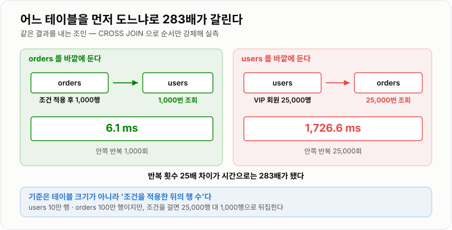
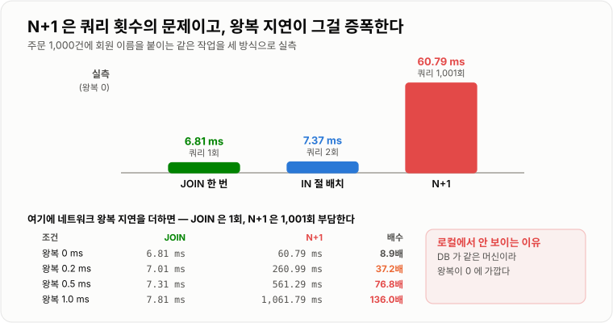
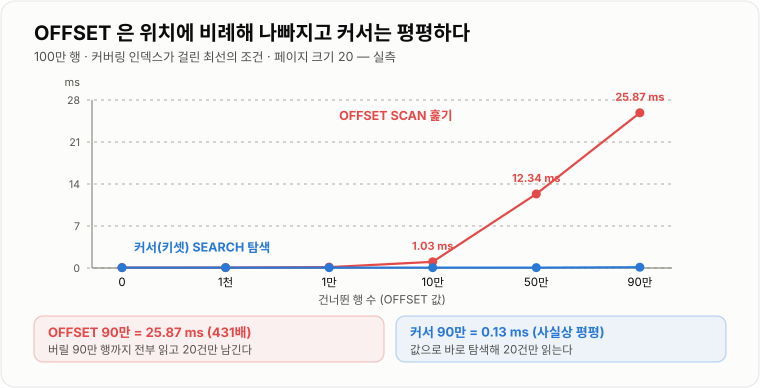

# 조인과 페이지네이션

> **조인은 "두 테이블을 합치는 것"이 아니라 "한 테이블을 돌면서 다른 테이블을 반복 조회하는 것"이다. 그래서 어느 쪽을 먼저 도느냐로 280배가 갈리고, `LIMIT 20`을 붙였는데도 100만 행을 읽는 페이지네이션이 나온다.**

---

## 1. 핵심 요약

**조인은 안쪽 테이블을 바깥 행 수만큼 반복 조회하는 연산이라 어느 쪽을 먼저 도느냐로 283배가 갈리고, `OFFSET`은 "그 위치부터"가 아니라 "앞을 다 읽고 버려라"라서 인덱스를 걸어도 431배 느려지지만, 마지막 행의 값으로 탐색하는 커서 방식으로 바꾸면 어느 페이지든 같은 시간에 끝난다.**

### 한눈에 보기

* 조인은 기본적으로 **중첩 루프**다. 바깥 테이블을 한 행씩 돌며 안쪽 테이블을 반복 조회한다. **그래서 조인 키 인덱스가 없으면 무너진다.**
* **어느 쪽을 먼저 도느냐가 결정적이다.** 같은 결과를 내는 조인에서 순서를 강제해 재 봤더니 **6.1 ms와 1,726.6 ms**로 **283배** 차이가 났다.
* **N+1은 쿼리 횟수의 문제다.** 같은 프로세스 안 SQLite로도 JOIN 6.81 ms vs N+1 60.79 ms(8.9배)였고, **왕복 지연 0.5 ms를 더하면 76.8배, 1 ms면 136배**가 된다.
* `IN` 절로 모아 조회하면 쿼리 2번으로 끝난다. 실측 **7.37 ms**로 JOIN과 거의 같았다.
* **`OFFSET` 페이지네이션은 뒤로 갈수록 느려진다.** 커버링 인덱스가 걸린 최선의 조건에서도 `OFFSET 0`은 0.06 ms, `OFFSET 900,000`은 **25.87 ms로 431배**였다.
* **커서(키셋) 페이지네이션은 위치와 무관하다.** 같은 위치를 키셋으로 읽으면 첫 페이지도 90만 번째도 **0.06 ms**로 평평했다.
* **`LIMIT`이 있어도 정렬 대상이 조인 결과면 소용없다.** 드라이빙 테이블 컬럼으로 정렬하면 0.1 ms, 피조인 테이블 컬럼으로 정렬하면 **119.7 ms(1,197배)** 였다.
* **전체 건수 `COUNT(*)`가 페이지 조회보다 비싸다.** 100만 행 전체 `COUNT(*)`가 10.1 ms, 70% 조건이면 143.2 ms인데 **"다음 페이지 있음"만 확인하면 1.0 ms**다.
* `LEFT JOIN`에 오른쪽 테이블 조건을 `WHERE`에 걸면 **`INNER JOIN`으로 격하된다.** 실행 계획에서 `LEFT-JOIN` 표시가 사라지는 것을 확인했다.

> 수치는 **SQLite 3.50.4에 100만 행 `orders` / 10만 행 `users`를 넣고 직접 측정**했다. 중첩 루프·드라이빙 테이블·`OFFSET` 누적 스캔·N+1은 MySQL에서도 동일하게 성립한다. **엔진마다 다른 부분(해시 조인 지원 시점, `EXPLAIN` 표기)은 본문에 따로 표시했다.**

### 무엇을 해결하는가

#### 해결하려는 문제

정규화된 데이터베이스에서 주문 목록 화면 하나를 그리려면 여러 테이블이 필요하다.

```text
orders  (주문)          users (회원)
  id                      id
  user_id  ──────────→    name
  amount                  grade
  created_at              city
```

화면에는 "주문 번호 / 금액 / **주문자 이름**"이 함께 나와야 한다. 이름은 `users`에 있다. **두 테이블을 어떻게 합칠 것인가**가 조인 문제다.

그리고 주문이 100만 건이면 한 화면에 다 못 보여준다. **어떻게 잘라서 보여줄 것인가**가 페이지네이션 문제다. 두 문제가 한 노트에 있는 이유는, 실무에서 **목록 화면 하나가 이 둘을 동시에 요구**하기 때문이다.

#### 이 개념이 없을 때

조인이 없다면 애플리케이션에서 직접 합쳐야 한다.

```java
public List<OrderView> findOrderPage(int page, int size) {
    // 1) 주문을 가져온다
    List<Order> orders = orderRepository.findPage(page, size);

    // 2) 주문마다 회원을 조회한다
    List<OrderView> result = new ArrayList<OrderView>();
    for (Order order : orders) {
        User user = userRepository.findById(order.getUserId());   // 여기가 문제다
        result.add(new OrderView(order, user.getName()));
    }
    return result;
}
```

돌아가긴 한다. 그런데 문제가 여럿이다.

* **쿼리가 1 + N번 나간다.** 주문 20건이면 21번, 1,000건이면 1,001번이다. 이게 N+1 문제다.
* **왕복 지연이 그대로 곱해진다.** DB가 다른 서버에 있으면 왕복 1 ms만 잡아도 1,001 ms가 순수 대기다.
* **필터링을 애플리케이션에서 해야 한다.** "VIP 회원의 주문만"을 하려면 전부 가져와 걸러야 한다.
* **정렬을 애플리케이션에서 해야 한다.** "회원 이름순 정렬"이면 전부 가져와야 한다.
* **페이지 자르기가 어긋난다.** 조인 후 조건이 걸리면 20건을 요청해도 5건만 남을 수 있다.

조인은 이걸 **DB 안에서 한 번에** 처리한다. 데이터가 있는 곳에서 합치고 거르고 정렬하므로 네트워크로 오가는 양도 최소가 된다.

**대신 조인은 공짜가 아니다.** 다음 절에서 보듯 조인은 내부적으로 반복 조회이고, **그 반복이 인덱스를 못 타면 애플리케이션에서 도는 것보다 나을 게 없다.**

---

## 2. 동작 원리

### 핵심 구성 요소

| 개념 | 설명 | 중요한 이유 |
| --- | --- | --- |
| **`INNER JOIN`** | 양쪽에 다 있는 행만 | 가장 흔하다. 옵티마이저가 순서를 자유롭게 정한다. |
| **`LEFT JOIN`** | 왼쪽은 전부, 오른쪽은 있으면 | 순서가 고정되므로 최적화 여지가 줄어든다. |
| **중첩 루프 조인 (NLJ)** | 바깥 행마다 안쪽을 조회 | 조인의 기본 알고리즘이다. |
| **해시 조인** | 한쪽으로 해시 테이블을 만들고 다른 쪽을 훑는다 | 인덱스가 없을 때의 대안. MySQL 8.0.18+. |
| **드라이빙 테이블** | 먼저 읽는 바깥 테이블 | **여기서 성능이 갈린다.** |
| **조인 키 인덱스** | 안쪽 테이블의 조인 컬럼 인덱스 | 없으면 중첩 루프가 O(n×m)이 된다. |
| **N+1 문제** | 1번 조회 후 결과마다 추가 조회 | ORM에서 가장 흔한 성능 사고다. |
| **`OFFSET` 페이지네이션** | `LIMIT n OFFSET m` | 구현이 쉽고 **뒤로 갈수록 느려진다.** |
| **커서(키셋) 페이지네이션** | 마지막 행의 값을 기준으로 다음을 읽는다 | 위치와 무관하게 일정하다. |
| **커서 안정성** | 페이지를 넘기는 중 데이터가 바뀌어도 누락·중복이 없는가 | `OFFSET`은 보장하지 못한다. |
| **`COUNT` 비용** | 전체 건수를 세는 비용 | 페이지 조회보다 비쌀 수 있다. |
| **지연 조인(deferred join)** | PK만 먼저 페이징하고 나중에 조인 | `OFFSET`을 줄이는 실무 기법이다. |

#### 개념 간 관계

```text
목록 화면 쿼리 하나에 세 가지가 동시에 걸린다

  SELECT o.id, o.amount, u.name          ← 어떤 컬럼을 가져오나 (커버링 여부)
    FROM orders o JOIN users u           ← 어느 쪽을 먼저 도나 (드라이빙 테이블)
      ON u.id = o.user_id                ← 여기 인덱스가 있나 (조인 키)
   WHERE o.created_at >= ?               ← 얼마나 걸러지나 (선택도)
   ORDER BY o.created_at DESC            ← 정렬을 인덱스로 없앨 수 있나
   LIMIT 20 OFFSET 100000;               ← 뒤 페이지가 느려지지 않나

  이 다섯 줄이 서로 얽혀 있다
```

**핵심은 `ORDER BY`와 `LIMIT`이 어느 테이블 기준이냐**다. 드라이빙 테이블 기준이면 인덱스 순서대로 20건만 읽고 멈출 수 있고, 피조인 테이블 기준이면 **전부 조인한 뒤 정렬해야 한다.** 실측에서 이 차이가 0.1 ms와 119.7 ms였다.

### 내부 동작 과정

#### 조인은 반복 조회다

조인의 기본 알고리즘은 **중첩 루프(Nested Loop Join)** 다. 이름 그대로 이중 반복문이다.

```text
for (바깥 테이블의 각 행 r) {                 ← 드라이빙 테이블
    for (안쪽 테이블에서 r 과 매칭되는 행 s) {   ← 피조인 테이블
        결과에 (r, s) 추가
    }
}
```

**안쪽 반복이 바깥 행마다 실행된다.** 바깥이 1,000행이면 안쪽 조회가 1,000번 일어난다. 여기서 두 가지가 따라 나온다.

**첫째, 안쪽 테이블의 조인 키에 인덱스가 있어야 한다.**

```text
1,000건의 주문을 users 와 조인 (users 10만 행)

  피조인 테이블에 인덱스 없음     46.3 ms
  피조인 테이블에 인덱스 추가 후    6.2 ms      7.5배
```

인덱스가 없으면 안쪽 조회 한 번이 O(n)이 되고, 그게 바깥 행 수만큼 반복되어 **O(바깥 × 안쪽)** 이 된다.

> 위 실측에서 인덱스가 없는데도 46.3 ms에 그친 이유는 SQLite가 **임시 인덱스를 즉석에서 만들었기 때문**이다(실행 계획 `AUTOMATIC COVERING INDEX` + `BLOOM FILTER`). 엔진이 "이대로는 못 쓰겠다"고 판단해 스스로 보완한 것이고, **그 보완 비용이 곧 7.5배의 정체**다. MySQL에는 이런 자동 인덱스가 없고, 대신 8.0.18부터 해시 조인으로 처리한다.

**둘째, 바깥 테이블을 최대한 좁혀야 한다.** 바깥이 100행이면 안쪽 조회가 100번, 10,000행이면 10,000번이다.

```text
같은 조인, 바깥 조건에만 인덱스를 붙였을 때

  orders.created_at 인덱스 없음   141.8 ms      (100만 행을 훑어 1,000행을 고른다)
  orders.created_at 인덱스 있음     5.8 ms      24배
```

#### 드라이빙 테이블 — 조인의 성패

옵티마이저가 하는 가장 중요한 결정이 **어느 테이블을 바깥으로 둘 것인가**다. 순서를 강제해 직접 비교했다.

```sql
SELECT COUNT(*) FROM users u JOIN orders o ON o.user_id = u.id
 WHERE u.grade = 'VIP' AND o.created_at = '2023-05-03'
```

```text
옵티마이저 자동 선택                       5.5 ms
CROSS JOIN 으로 orders 먼저 강제           6.1 ms
CROSS JOIN 으로 users 먼저 강제        1,726.6 ms      ← 283배
```



*바깥 테이블이 몇 행이냐가 안쪽 조회 횟수를 그대로 결정한다. 같은 결과, 같은 인덱스인데 283배가 갈린다.*

이유는 반복 횟수에 있다.

```text
users 를 바깥으로:   VIP 회원 25,000명  →  orders 조회 25,000번
orders 를 바깥으로:  해당 날짜 주문 1,000건  →  users 조회 1,000번
```

**25배 적게 도는 쪽이 283배 빨랐다.** 반복 횟수 자체보다 격차가 큰 이유는, 반복이 늘면 캐시 적중률까지 함께 떨어지기 때문이다.

원칙은 하나다. **결과 행이 적은 쪽을 바깥에 둔다.** 여기서 "적은 쪽"은 테이블 크기가 아니라 **조건을 적용한 뒤의 행 수**다. `users`가 10만 행이고 `orders`가 100만 행이지만, 조건을 걸면 25,000행 대 1,000행으로 뒤집힌다.

보통은 옵티마이저가 알아서 고른다(실측에서 자동 선택이 5.5 ms로 가장 빨랐다). **통계가 낡았을 때만 오판한다.**

> **순서를 강제해야 한다면** MySQL은 `STRAIGHT_JOIN`(적은 쪽부터 명시)이나 `JOIN_ORDER` 힌트를 제공한다. SQLite는 `CROSS JOIN`이 순서 강제 역할을 한다. **다만 힌트는 최후 수단이다.** 데이터 분포가 바뀌면 오히려 발목을 잡으므로, 먼저 `ANALYZE TABLE`로 통계를 갱신해 본다.

#### 조인 알고리즘 세 가지 (MySQL)

중첩 루프가 전부는 아니다. MySQL이 쓰는 방식은 버전에 따라 달라졌다.

| 알고리즘 | 동작 | 조건 | MySQL 지원 |
| --- | --- | --- | --- |
| **중첩 루프 (NLJ)** | 바깥 행마다 안쪽을 인덱스로 조회 | 조인 키에 인덱스가 있을 때 | 항상 |
| **블록 중첩 루프 (BNL)** | 바깥 행을 조인 버퍼에 모아 한 번에 비교 | 인덱스가 없을 때 | **8.0.20에서 제거** |
| **해시 조인** | 작은 쪽으로 해시 테이블을 만들고 큰 쪽을 훑는다 | 등가 조인(`=`)일 때 | **8.0.18부터** |

**MySQL 8.0.18부터는 인덱스가 없는 등가 조인을 해시 조인으로 처리한다.** 8.0.20에서는 BNL이 제거되고 그 자리를 해시 조인이 대체했으며, 외부 조인·세미 조인·안티 조인까지 확대됐다.

```text
해시 조인이 유리한 상황
  - 두 테이블이 모두 크고
  - 조인 결과도 크고
  - 조인 키에 인덱스가 없다 (배치·분석 쿼리)

중첩 루프가 유리한 상황
  - 바깥 테이블이 작고
  - 조인 키에 인덱스가 있다 (OLTP 목록 조회)
```

**실무의 목록 조회는 거의 항상 중첩 루프가 맞다.** 조건으로 좁힌 소수의 행에 대해서만 인덱스로 조회하기 때문이다. 해시 조인이 나온다면 대개 **인덱스가 빠졌다는 신호**다.

#### `LEFT JOIN`의 함정

`LEFT JOIN`은 왼쪽을 전부 살리므로 **드라이빙 테이블이 왼쪽으로 고정된다.** 옵티마이저가 순서를 바꿀 수 없다. 그런데 여기 흔한 실수가 있다.

```sql
-- 의도: 회원이 없는 주문도 포함해서 보고 싶다
SELECT COUNT(*) FROM orders o
  LEFT JOIN users u ON u.id = o.user_id
 WHERE o.created_at = '2023-05-03'
   AND u.grade = 'VIP';           -- ← 이 줄이 LEFT JOIN 을 무효로 만든다
```

실행 계획을 직접 비교했다.

```text
LEFT JOIN              plan: SEARCH o ...  |  SEARCH u USING INTEGER PRIMARY KEY (rowid=?) LEFT-JOIN
LEFT JOIN + WHERE u.grade  plan: SEARCH o ...  |  SEARCH u USING COVERING INDEX idx_grade (grade=? AND rowid=?)
```

**두 번째에서 `LEFT-JOIN` 표시가 사라졌다.** 옵티마이저가 이 쿼리를 `INNER JOIN`으로 바꿔 실행한 것이다.

이유는 논리적으로 당연하다. `LEFT JOIN`에서 짝이 없는 행은 오른쪽 컬럼이 전부 `NULL`인데, `WHERE u.grade = 'VIP'`는 `NULL`을 걸러 낸다. **결국 짝이 있는 행만 남으므로 `INNER JOIN`과 결과가 같다.**

고치려면 조건을 `ON` 절로 옮긴다.

```sql
-- 짝이 없는 주문도 남긴다
SELECT COUNT(*) FROM orders o
  LEFT JOIN users u ON u.id = o.user_id AND u.grade = 'VIP'
 WHERE o.created_at = '2023-05-03';
```

**`ON`은 조인 조건이고 `WHERE`는 조인 결과에 대한 필터다.** `INNER JOIN`에서는 둘이 같은 결과를 내지만 `LEFT JOIN`에서는 완전히 다르다.

#### N+1 — 쿼리 횟수가 만드는 비용

같은 결과를 세 가지 방식으로 얻어 비교했다. 주문 1,000건에 회원 이름을 붙이는 작업이다.

```text
1) JOIN 한 번                    6.81 ms     쿼리 1회
2) N+1 (1 + 1,000회)            60.79 ms     쿼리 1,001회      8.9배
3) IN 절로 모아 조회 (1 + 1회)     7.37 ms     쿼리 2회
```



*JOIN과 IN 배치는 쿼리 1~2회로 끝나고, N+1은 1,001회를 날린다.*

**8.9배도 크지만, 이건 최선의 조건에서 나온 수치다.** SQLite는 같은 프로세스 안에 있어 왕복 지연이 0이다. 실제 서버는 다르다.

```text
왕복 지연을 더하면 (JOIN 은 1회, N+1 은 1,001회 부담)

  왕복 0.2 ms:  JOIN    7.01 ms  vs  N+1    260.99 ms    37.2배
  왕복 0.5 ms:  JOIN    7.31 ms  vs  N+1    561.29 ms    76.8배
  왕복 1.0 ms:  JOIN    7.81 ms  vs  N+1  1,061.79 ms   136.0배
```

**같은 데이터센터 안이라도 왕복 0.5 ms는 흔하다. 그러면 76배다.** N+1이 로컬 테스트에서는 멀쩡하다가 운영에서 터지는 이유가 여기 있다. 로컬은 DB가 같은 머신에 있어 왕복이 거의 0이다.

**3번(`IN` 절 배치)이 JOIN과 거의 같다는 점**이 실무적으로 중요하다. JPA에서 조인이 어려운 상황에도 **쿼리를 2회로 묶는 것만으로 문제가 사라진다.**

#### `OFFSET` 페이지네이션이 느려지는 이유

```sql
SELECT id, created_at FROM orders ORDER BY created_at, id LIMIT 20 OFFSET 500000;
```

**`OFFSET 500000`은 "500,000번째부터 읽어라"가 아니라 "500,020행을 읽고 앞의 500,000개를 버려라"** 다. DB는 몇 번째 행인지를 미리 알 수 없으므로 세면서 가야 한다.

`(created_at, id)` 커버링 인덱스가 걸린 최선의 조건에서 측정했다.

```text
OFFSET        0  =   0.06 ms      1.0배
OFFSET    1,000  =   0.07 ms      1.1배
OFFSET   10,000  =   0.15 ms      2.6배
OFFSET  100,000  =   1.03 ms     17.1배
OFFSET  500,000  =  12.34 ms    205.7배
OFFSET  900,000  =  25.87 ms    431.2배
```



*`OFFSET`은 버릴 행까지 전부 읽으므로 위치에 비례해 나빠진다. 커서 방식은 어디를 읽든 20행만 읽는다.*

**인덱스가 있어도 해결되지 않는다.** 인덱스를 앞에서부터 순서대로 세어 나가는 것이기 때문이다. 그리고 위 수치는 **커버링 인덱스라 테이블 접근이 없는 최선의 경우**다. `SELECT *`처럼 테이블을 읽어야 하면 버릴 50만 행에 대해서도 테이블 접근이 일어나 훨씬 나빠진다.

#### 커서(키셋) 페이지네이션

**"몇 번째부터"가 아니라 "이 값 다음부터"로 바꾸면** 세어 나갈 필요가 없다.

```sql
-- OFFSET 방식: 세면서 간다
SELECT id, created_at FROM orders
 ORDER BY created_at, id LIMIT 20 OFFSET 500000;

-- 커서 방식: 바로 그 위치로 간다
SELECT id, created_at FROM orders
 WHERE (created_at, id) > ('2023-05-03', 501234)     -- 이전 페이지 마지막 행
 ORDER BY created_at, id LIMIT 20;
```

같은 위치를 두 방식으로 읽어 비교했다.

```text
위치          OFFSET 방식    커서 방식
──────────────────────────────────────
        0       0.06 ms      0.06 ms
    1,000       0.07 ms      0.06 ms
   10,000       0.15 ms      0.06 ms
  100,000       1.03 ms      0.06 ms
  500,000      12.34 ms      0.06 ms
  900,000      25.87 ms      0.13 ms
```

**커서 방식은 완전히 평평하다.** 실행 계획도 다르다.

```text
OFFSET 방식   plan: SCAN orders USING COVERING INDEX      ← 훑는다
커서 방식     plan: SEARCH orders USING COVERING INDEX (created_at>?)   ← 탐색한다
```

앞 노트에서 본 **탐색(`SEARCH`)과 훑기(`SCAN`)의 차이가 여기서 그대로 나타난다.**

**정렬 키가 유일해야 한다는 점이 중요하다.** `created_at`만으로는 같은 시각의 주문을 구분할 수 없어 페이지 경계에서 누락·중복이 생긴다. 그래서 항상 **PK를 마지막 정렬 키로 붙인다.**

```sql
ORDER BY created_at DESC, id DESC     -- id 로 동점을 깬다
WHERE (created_at, id) < (?, ?)       -- 복합 비교
```

MySQL은 **행 값 비교**(row value comparison)를 지원하므로 `(a, b) < (?, ?)` 형태를 그대로 쓸 수 있고, 이 형태가 인덱스를 탄다. 지원하지 않는 환경이라면 풀어 써야 한다.

```sql
WHERE created_at < ?
   OR (created_at = ? AND id < ?)
```

**커서 방식은 데이터가 바뀌어도 안전하다**는 부수적 이점이 있다. `OFFSET` 방식은 1페이지를 본 뒤 새 주문이 하나 들어오면 **2페이지 첫 행이 1페이지 마지막 행과 겹친다.** 반대로 삭제되면 한 건이 통째로 누락된다. 커서 방식은 값 기준이라 이런 어긋남이 없다.

#### 조인 결과에 `LIMIT`을 걸 때

`LIMIT 20`을 붙였는데도 100만 행을 읽는 경우가 있다. **정렬 대상이 어느 테이블이냐**에 달렸다.

```text
SELECT o.id, u.name FROM orders o JOIN users u ON u.id = o.user_id

  ORDER BY o.created_at, o.id LIMIT 20      0.1 ms
    plan: SCAN o USING INDEX idx_cr  |  SEARCH u USING INTEGER PRIMARY KEY

  ORDER BY u.name LIMIT 20                119.7 ms      ← 1,197배
    plan: SCAN u  |  SEARCH o USING COVERING INDEX  |  USE TEMP B-TREE FOR ORDER BY
```

**드라이빙 테이블 컬럼으로 정렬하면** 인덱스 순서대로 읽다가 20건을 채우면 멈출 수 있다. **피조인 테이블 컬럼으로 정렬하면** 정렬을 하려고 전부 조인한 뒤에야 앞 20건을 고를 수 있다. `LIMIT`이 아무 일도 못 한다.

실무 규칙이 나온다. **목록 화면의 정렬 기준은 주 테이블(드라이빙 테이블) 컬럼으로 잡는다.** 상대 테이블 컬럼으로 정렬해야 한다면 비정규화를 검토한다.

#### 지연 조인 — `OFFSET`을 줄이는 실무 기법

커서 방식으로 못 바꾸는 경우(페이지 번호를 직접 눌러야 하는 관리자 화면 등)가 있다. 그럴 때 쓰는 절충안이다.

```sql
-- 느림: 버릴 100,000행에 대해서도 조인과 테이블 접근이 일어난다
SELECT o.*, u.name
  FROM orders o JOIN users u ON u.id = o.user_id
 ORDER BY o.created_at DESC
 LIMIT 20 OFFSET 100000;

-- 빠름: 커버링 인덱스만으로 PK 20개를 먼저 고르고, 그 20개만 조인한다
SELECT o.*, u.name
  FROM (SELECT id FROM orders
         ORDER BY created_at DESC
         LIMIT 20 OFFSET 100000) AS t          -- 여기는 인덱스만 읽는다
  JOIN orders o ON o.id = t.id
  JOIN users  u ON u.id = o.user_id;
```

**`OFFSET`을 없애지는 못하지만, 버리는 행의 단가를 낮춘다.** 안쪽 서브쿼리가 `(created_at, id)` 커버링 인덱스만 읽으므로 테이블 접근과 조인이 20건에 대해서만 일어난다.

#### `COUNT`의 비용

페이지네이션에는 보통 "전체 1,234건 중 1페이지"가 따라붙는다. **그 숫자를 구하는 것이 페이지를 읽는 것보다 비싸다.**

```text
COUNT(*) 전체 (100만 행)                    10.1 ms
COUNT(*) WHERE status='PAID' (70%, 인덱스 없음)  143.2 ms
COUNT(*) WHERE status='PAID' (인덱스 있음)       32.9 ms
COUNT(*) WHERE status='REFUNDED' (1%)           0.4 ms
'다음 페이지 있음' 만 확인 (LIMIT 21)             1.0 ms
```

**조건이 많이 걸러 낼수록 싸고, 안 걸러 낼수록 비싸다.** 70% 조건에서 143.2 ms는 페이지 한 장 읽는 0.06 ms의 2,000배가 넘는다.

`COUNT`를 피하는 방법이 여럿 있다.

```text
1. 무한 스크롤이면 총 건수 자체가 필요 없다
     → LIMIT 21 로 21건을 요청해 "다음 페이지 있음"만 판단한다 (실측 1.0 ms)

2. 근사치로 충분하다면
     → information_schema.tables 의 table_rows (InnoDB 는 추정치다)
     → "약 100만 건" 으로 표시한다

3. 정확한 값이 꼭 필요하면
     → 카운터 테이블이나 캐시에 따로 관리한다
     → 첫 페이지에서만 세고 이후 페이지는 재사용한다
```

> **`SQL_CALC_FOUND_ROWS`는 쓰지 않는다.** 페이지 조회와 총 건수를 한 번에 얻는 MySQL 전용 기능이었지만, **8.0.17부터 deprecated**됐다. 별도 `COUNT` 쿼리를 두 번 날리는 것이 대부분 더 빠르다는 것이 이유다.

---

## 3. 특징과 비교

| 구분          | 내용                                       |
| ----------- | ---------------------------------------- |
| **장점**      | 조인은 왕복 한 번으로 필터링·정렬까지 DB에서 끝내 전송량을 최소화한다. 커서 페이지네이션은 위치와 무관하게 일정하고 데이터가 바뀌어도 누락·중복이 없다. |
| **단점**      | 조인은 인덱스가 없으면 무너지고 드라이빙 테이블 오판에 취약하며(실측 283배) 샤딩 환경에서는 쓸 수 없다. 커서 방식은 페이지 번호로 이동할 수 없고 정렬 키가 유일해야 한다. |
| **적합한 상황**  | 무한 스크롤·공개 API는 커서 방식. 페이지 번호가 꼭 필요하면 `OFFSET` + 지연 조인 + 최대 페이지 제한. |
| **주의할 상황**  | 반복문 안에서 연관 데이터를 조회하는 N+1. `created_at`처럼 중복되는 값만으로 커서를 만드는 것 — `(created_at, id)` 복합 커서를 쓴다. |

### 성능 특성

#### 조인

```text
1,000건의 주문에 회원 정보를 붙이는 조인

  드라이빙 테이블 조건에 인덱스 없음        141.8 ms
  드라이빙 테이블 조건에 인덱스 있음          5.8 ms      24배

  피조인 테이블 조인 키에 인덱스 없음         46.3 ms
  피조인 테이블 조인 키에 인덱스 있음          6.2 ms      7.5배
```

#### 드라이빙 테이블 선택

```text
같은 결과를 내는 조인, 순서만 다름

  orders 먼저 (바깥 1,000행)          6.1 ms
  users  먼저 (바깥 25,000행)     1,726.6 ms      283배
  옵티마이저 자동 선택                 5.5 ms      (가장 빠르다)
```

**반복 횟수가 25배인데 시간은 283배 차이가 났다.** 반복이 늘면 캐시 적중률이 함께 떨어지기 때문이다.

#### N+1

```text
주문 1,000건 + 회원 이름

  JOIN 한 번              6.81 ms   쿼리    1회
  IN 절 배치              7.37 ms   쿼리    2회
  N+1                   60.79 ms   쿼리 1,001회      8.9배

왕복 지연을 더하면
  0.2 ms →  37.2배
  0.5 ms →  76.8배
  1.0 ms → 136.0배
```

#### 페이지네이션

```text
위치           OFFSET      커서
──────────────────────────────────
      0       0.06 ms    0.06 ms
  1,000       0.07 ms    0.06 ms
 10,000       0.15 ms    0.06 ms
100,000       1.03 ms    0.06 ms
500,000      12.34 ms    0.06 ms
900,000      25.87 ms    0.13 ms

OFFSET:  431배까지 나빠진다 (선형)
커서:    사실상 평평하다
```

**`OFFSET` 1,000까지는 차이가 없다.** 페이지 크기 20 기준 50페이지다. 대부분의 사용자용 목록은 여기까지도 안 간다. **문제가 되는 것은 크롤러·배치·관리자 화면**이다.

#### 정렬 대상 테이블

```text
조인 후 LIMIT 20

  ORDER BY 드라이빙 테이블 컬럼     0.1 ms
  ORDER BY 피조인 테이블 컬럼     119.7 ms      1,197배
```

#### `COUNT`

```text
COUNT(*) 전체                        10.1 ms
COUNT(*) 70% 조건 (인덱스 없음)      143.2 ms
COUNT(*) 70% 조건 (인덱스 있음)       32.9 ms
COUNT(*)  1% 조건                     0.4 ms
LIMIT 21 로 존재 여부만 확인            1.0 ms
```

**페이지 한 장(0.06 ms)보다 `COUNT`(최대 143.2 ms)가 2,000배 이상 비싸다.** 페이지네이션을 최적화할 때 `COUNT`를 빼놓으면 절반만 고친 것이다.

### 장점과 단점

#### 조인

| 장점 | 이유 |
| --- | --- |
| 왕복 한 번으로 끝난다 | N+1 대비 실측 8.9배, 왕복 1 ms 환경에서 136배. |
| DB가 필터링·정렬을 대신한다 | 애플리케이션으로 오는 데이터가 최소가 된다. |
| 옵티마이저가 순서를 정해 준다 | 실측에서 자동 선택이 가장 빨랐다. |
| 정규화를 유지할 수 있다 | 중복 저장 없이 데이터를 합친다. |

| 단점 | 이유 |
| --- | --- |
| **조인 키 인덱스가 없으면 무너진다** | 중첩 루프가 O(바깥×안쪽)이 된다. |
| **드라이빙 테이블을 잘못 고르면 283배** | 통계가 낡으면 오판한다. |
| 정렬 대상이 피조인 테이블이면 `LIMIT`이 무력화된다 | 실측 1,197배. |
| 테이블이 늘수록 계획이 복잡해진다 | 조인 순서 경우의 수가 팩토리얼로 는다. |
| 샤딩 환경에서는 쓸 수 없다 | 테이블이 다른 서버에 있으면 조인 자체가 불가능하다. |

#### `OFFSET` 페이지네이션

| 장점 | 이유 |
| --- | --- |
| 구현이 단순하다 | `LIMIT`/`OFFSET` 두 개면 끝난다. |
| 페이지 번호로 바로 이동할 수 있다 | "5페이지"를 누를 수 있다. |
| 총 페이지 수를 보여줄 수 있다 | `COUNT`와 조합된다. |
| 정렬 기준이 자유롭다 | 유일성 제약이 없다. |

| 단점 | 이유 |
| --- | --- |
| **뒤로 갈수록 느려진다** | 버릴 행까지 전부 읽는다. 실측 431배. |
| **데이터가 바뀌면 누락·중복이 생긴다** | 위치 기준이라 삽입·삭제에 밀린다. |
| `COUNT`가 따라붙는다 | 실측 최대 143.2 ms. |

#### 커서(키셋) 페이지네이션

| 장점 | 이유 |
| --- | --- |
| **위치와 무관하게 일정하다** | 실측 전 구간 0.06 ms. |
| 데이터가 바뀌어도 안전하다 | 값 기준이라 밀리지 않는다. |
| 무한 스크롤과 잘 맞는다 | "다음 20건"이 그대로 대응된다. |
| `COUNT`가 필요 없다 | `LIMIT n+1`로 존재 여부만 본다. |

| 단점 | 이유 |
| --- | --- |
| **페이지 번호로 못 간다** | 순차 탐색만 가능하다. |
| 정렬 키가 유일해야 한다 | PK를 마지막 키로 붙여야 한다. |
| 정렬 기준을 바꾸면 커서가 무효다 | 커서에 정렬 기준이 묶여 있다. |
| 구현이 복잡하다 | 커서 인코딩·복합 비교가 필요하다. |
| 이전 페이지 이동이 번거롭다 | 역방향 커서를 따로 관리해야 한다. |

### 어떤 상황에서 고르는가

#### 페이지네이션 방식을 고르는 순서

```text
페이지 번호를 직접 눌러야 하는가?
├─ 아니오 (무한 스크롤·모바일 피드·API)
│    → 커서 페이지네이션. 실측 전 구간 0.06 ms
└─ 예
     ↓
   데이터가 얼마나 되는가?
   ├─ 수만 건 이하   → OFFSET 으로 충분하다 (실측 OFFSET 10,000 까지 0.15 ms)
   └─ 수십만 건 이상
        ↓
      뒤 페이지까지 실제로 가는가?
      ├─ 아니오 → OFFSET + 최대 페이지 제한
      └─ 예    → 지연 조인(deferred join) + 최대 페이지 제한
                 그래도 부족하면 검색 조건을 좁히도록 UI 를 바꾼다
```

#### 조인을 쓰기 좋은 상황

* **목록에 상대 테이블 컬럼이 필요할 때** — 주문 목록의 회원 이름.
* **상대 테이블 조건으로 걸러야 할 때** — VIP 회원의 주문만.
* **드라이빙 테이블이 조건으로 충분히 좁혀질 때** — 하루치 주문 1,000건.
* **조인 키에 인덱스가 있을 때** — 대개 PK나 FK다.

#### 조인을 피하는 것이 좋은 상황

* **테이블이 다른 샤드·다른 DB에 있을 때** — 조인 자체가 불가능하다.
* **정렬 기준이 피조인 테이블 컬럼일 때** — 실측 1,197배. 비정규화를 검토한다.
* **일대다 조인에 페이징이 필요할 때** — 행이 뻥튀기되어 `LIMIT`이 어긋난다. 배치 조회로 나눈다.
* **조인 테이블이 4~5개를 넘을 때** — 계획이 불안정해진다. 쿼리를 나누거나 비정규화한다.
* **상대 테이블이 거의 안 바뀌는 소량 코드 테이블일 때** — 애플리케이션 캐시가 낫다.

#### `OFFSET`을 써도 되는 상황

* **총 데이터가 수만 건 이하** — 실측 `OFFSET 10,000`까지 0.15 ms.
* **관리자 화면처럼 호출 빈도가 낮을 때.**
* **페이지 번호가 요구사항일 때** — 지연 조인과 최대 페이지 제한을 함께 건다.

#### 선택 기준

1. **드라이빙 테이블이 조건으로 얼마나 좁혀지는가?** — 조인 성능의 8할이다
2. **조인 키에 인덱스가 있는가?** — 없으면 중첩 루프가 무너진다
3. **정렬 기준이 어느 테이블 컬럼인가?** — 피조인 테이블이면 `LIMIT`이 죽는다
4. **쿼리가 몇 번 나가는가?** — N+1은 왕복 지연에 곱해진다
5. **몇 페이지까지 실제로 가는가?** — `OFFSET 1,000`까지는 문제없다
6. **총 건수가 정말 필요한가?** — `COUNT`가 페이지 조회보다 비싸다

### 비슷한 기술과 비교

#### `INNER JOIN`과 `LEFT JOIN`

| 비교 항목 | `INNER JOIN` | `LEFT JOIN` |
| --- | --- | --- |
| 결과 | 양쪽에 다 있는 행 | 왼쪽 전부 + 짝이 있으면 오른쪽 |
| 드라이빙 테이블 | 옵티마이저가 자유롭게 정한다 | **왼쪽으로 고정** |
| 최적화 여지 | 크다 | 작다 |
| `WHERE`에 오른쪽 조건 | 영향 없음 | **`INNER JOIN`으로 격하된다**(실측 확인) |
| 짝 없는 행을 남기려면 | 불가 | 조건을 `ON`에 둔다 |

#### 중첩 루프 조인과 해시 조인

| 비교 항목 | 중첩 루프 (NLJ) | 해시 조인 |
| --- | --- | --- |
| 동작 | 바깥 행마다 안쪽을 조회 | 한쪽으로 해시 테이블을 만든 뒤 훑는다 |
| 인덱스 | **필수** | 불필요 |
| 유리한 상황 | 바깥이 작고 인덱스가 있을 때 | 양쪽이 크고 인덱스가 없을 때 |
| 메모리 | 거의 안 쓴다 | 해시 테이블만큼 쓴다 |
| 조인 조건 | 모든 조건 | **등가(`=`)만** |
| MySQL 지원 | 항상 | **8.0.18부터** |
| 실무 목록 조회 | **이쪽이 맞다** | 나오면 인덱스 누락 신호 |

#### N+1 해결 방법

| 비교 항목 | `JOIN FETCH` | 배치 조회 (`IN`) | `EAGER` |
| --- | --- | --- | --- |
| 쿼리 횟수 | 1회 | 2회 | **1 + N회** |
| 실측 | **6.81 ms** | 7.37 ms | 60.79 ms |
| 페이징 | **컬렉션과 함께 쓰면 위험** | 안전 | 위험 |
| 설정 | 쿼리마다 명시 | `default_batch_fetch_size` 한 줄 | 엔티티 전역 |
| 권장도 | 단일 연관에 좋다 | **컬렉션에 좋다** | **쓰지 않는다** |

#### `OFFSET`과 커서 페이지네이션

| 비교 항목 | `OFFSET` | 커서(키셋) |
| --- | --- | --- |
| 원리 | 앞의 N개를 읽고 버린다 | 값 기준으로 바로 탐색한다 |
| 실행 계획 | `SCAN` (훑기) | **`SEARCH` (탐색)** |
| 1페이지 | 0.06 ms | 0.06 ms |
| 90만 번째 | **25.87 ms** | **0.13 ms** |
| 페이지 번호 이동 | **가능** | 불가 |
| 데이터 변경 시 | **누락·중복 발생** | 안전 |
| 총 건수 | `COUNT` 필요 | `LIMIT n+1`로 대체 |
| 정렬 키 | 자유 | **유일해야 한다** |
| 구현 난이도 | 낮다 | 높다 |

#### 총 건수를 구하는 방법

| 비교 항목 | `COUNT(*)` | `LIMIT n+1` | `table_rows` | 카운터 테이블 |
| --- | --- | --- | --- | --- |
| 정확도 | 정확 | 존재 여부만 | **추정치** | 정확(관리하기 나름) |
| 실측 | 10.1~143.2 ms | **1.0 ms** | 즉시 | 즉시 |
| 조건 지원 | 가능 | 가능 | 불가 | 조건별로 따로 관리 |
| 적합한 곳 | 정확한 값이 필수일 때 | **무한 스크롤** | "약 N건" 표시 | 조회가 매우 잦을 때 |

---

## 4. 실무 주의사항

### 백엔드 실무 적용

#### 목록 API 설계

```java
@RestController
@RequestMapping("/api/orders")
public class OrderController {

    // 사용자용 — 커서 방식
    @GetMapping
    public CursorPage<OrderView> list(
            @RequestParam(required = false) String cursor,
            @RequestParam(defaultValue = "20") int size) {
        return orderQueryService.getPage(cursor, Math.min(size, 100));
    }

    // 관리자용 — 페이지 번호가 필요하므로 OFFSET, 대신 상한을 건다
    @GetMapping("/admin")
    public Page<OrderView> adminList(
            @RequestParam(defaultValue = "0") int page,
            @RequestParam(defaultValue = "20") int size,
            OrderSearchCondition condition) {
        if (page > 500) {
            throw new TooDeepPageException("검색 조건을 좁혀 주세요");
        }
        return orderQueryService.search(condition, PageRequest.of(page, size));
    }
}
```

**`size`에 상한을 두는 것**을 빠뜨리면 안 된다. `size=1000000`으로 요청하면 서버가 그대로 죽는다.

#### QueryDSL로 커서 페이지네이션

```java
@Repository
public class OrderQueryRepository {

    private final JPAQueryFactory query;

    public List<Order> findPage(LocalDateTime cursorTime, Long cursorId, int size) {
        QOrder o = QOrder.order;

        return query.selectFrom(o)
                .where(cursorCondition(o, cursorTime, cursorId))
                .orderBy(o.createdAt.desc(), o.id.desc())
                .limit(size + 1)                  // 다음 페이지 확인용 한 건
                .fetch();
    }

    private BooleanExpression cursorCondition(QOrder o,
                                              LocalDateTime time, Long id) {
        if (time == null) {
            return null;                          // 첫 페이지
        }
        return o.createdAt.lt(time)
                .or(o.createdAt.eq(time).and(o.id.lt(id)));
    }
}
```

`cursorCondition`이 `null`을 반환하면 QueryDSL이 해당 조건을 무시한다. **첫 페이지와 다음 페이지를 한 메서드로 처리하는 관용구다.**

#### 검색 조건이 있는 관리자 목록

```java
public Page<OrderView> search(OrderSearchCondition cond, Pageable pageable) {
    QOrder o = QOrder.order;
    QUser u = QUser.user;

    // 1) 지연 조인 — PK 만 먼저 페이징한다 (인덱스만 읽는다)
    List<Long> ids = query
            .select(o.id)
            .from(o)
            .where(statusEq(cond.getStatus()), createdBetween(cond))
            .orderBy(o.createdAt.desc(), o.id.desc())
            .offset(pageable.getOffset())
            .limit(pageable.getPageSize())
            .fetch();

    if (ids.isEmpty()) {
        return Page.empty(pageable);
    }

    // 2) 그 PK 들에 대해서만 조인한다
    List<OrderView> content = query
            .select(Projections.constructor(OrderView.class,
                    o.id, o.amount, o.createdAt, u.name))
            .from(o)
            .join(u).on(u.id.eq(o.userId))
            .where(o.id.in(ids))
            .orderBy(o.createdAt.desc(), o.id.desc())
            .fetch();

    // 3) COUNT 는 필요할 때만 실행한다
    JPAQuery<Long> countQuery = query
            .select(o.count())
            .from(o)
            .where(statusEq(cond.getStatus()), createdBetween(cond));

    return PageableExecutionUtils.getPage(content, pageable, countQuery::fetchOne);
}
```

**`PageableExecutionUtils.getPage`가 `COUNT` 쿼리를 지연 실행한다.** 첫 페이지이면서 결과가 페이지 크기보다 적으면 `COUNT`를 아예 실행하지 않는다. 실측에서 `COUNT`가 최대 143.2 ms였으니 의미 있는 절약이다.

#### N+1을 잡는 절차

**먼저 보이게 만든다.**

```yaml
spring:
  jpa:
    properties:
      hibernate:
        format_sql: true
logging:
  level:
    org.hibernate.SQL: debug
    org.hibernate.orm.jdbc.bind: trace     # 바인딩 파라미터까지
```

로그에 같은 형태의 `SELECT`가 반복되면 N+1이다. 운영에서는 로그를 켤 수 없으므로 **P6Spy나 `datasource-proxy`로 요청당 쿼리 수를 세어 임계치를 넘으면 경고**를 남긴다.

```java
@Component
public class QueryCountInspector implements QueryExecutionListener {

    private static final int THRESHOLD = 20;

    @Override
    public void afterQuery(ExecutionInfo info, List<QueryInfo> queries) {
        int count = QueryCountHolder.increment();
        if (count == THRESHOLD) {
            log.warn("요청당 쿼리 {}건 초과 — N+1 의심: {}",
                    THRESHOLD, MDC.get("requestUri"));
        }
    }
}
```

**해결 순서는 정해져 있다.**

```text
1. 모든 연관을 FetchType.LAZY 로 바꾼다          ← 전제 조건
2. default_batch_fetch_size 를 설정한다          ← 대부분 여기서 끝난다
3. 단일 연관(@ManyToOne)은 JOIN FETCH 로 묶는다
4. 컬렉션은 JOIN FETCH + 페이징을 함께 쓰지 않는다
5. 그래도 복잡하면 DTO 프로젝션으로 필요한 컬럼만 조회한다
```

#### 무한 스크롤 API

```json
GET /api/orders?size=20

{
  "content": [ ... ],
  "nextCursor": "MjAyNC0wNS0wMVQxMDozMHwxMjM0NQ",
  "hasNext": true
}
```

```json
GET /api/orders?cursor=MjAyNC0wNS0wMVQxMDozMHwxMjM0NQ&size=20
```

**총 건수를 응답에 넣지 않는다.** 실측에서 `COUNT`가 최대 143.2 ms였고 `hasNext` 판단은 1.0 ms였다. 무한 스크롤 UI에는 총 건수가 표시되지도 않는다.

#### 운영에서 자주 겪는 상황

**증상 1 — 목록 첫 페이지는 빠른데 뒤로 갈수록 느려진다**

```text
원인:  OFFSET 누적 스캔 (실측 431배)
확인:  OFFSET 값과 응답 시간의 상관관계를 본다
조치:  커서 방식 전환 → 어려우면 지연 조인 + 최대 페이지 제한
```

**증상 2 — 로컬은 빠른데 운영이 느리다**

```text
원인:  N+1. 로컬은 DB 가 같은 머신이라 왕복 지연이 0 에 가깝다
       실측: 왕복 0 이면 8.9배, 0.5 ms 면 76.8배, 1 ms 면 136배
확인:  요청당 쿼리 수를 센다
조치:  default_batch_fetch_size → JOIN FETCH → DTO 프로젝션
```

**증상 3 — 조인 쿼리가 어느 날 갑자기 느려졌다**

```text
원인:  데이터가 늘어 옵티마이저가 드라이빙 테이블을 바꿨다 (실측 283배 격차)
확인:  EXPLAIN 에서 테이블 순서가 바뀌었는지 본다
조치:  ANALYZE TABLE 로 통계 갱신 → 그래도 안 되면 STRAIGHT_JOIN 검토
```

**증상 4 — `LIMIT 20`인데 응답이 느리다**

```text
원인 후보:
  정렬 기준이 피조인 테이블 컬럼이다        → 실측 1,197배. 정렬 기준을 바꾸거나 비정규화
  정렬 컬럼에 인덱스가 없다                → Using filesort 확인
  COUNT 쿼리가 함께 나가고 있다            → 실측 최대 143.2 ms. 지연 실행하거나 제거
```

**증상 5 — 페이지를 넘기는데 같은 항목이 또 보인다**

```text
원인:  OFFSET 방식 + 그 사이 새 데이터 삽입
       1페이지를 본 뒤 새 주문이 하나 들어오면 2페이지 첫 행이 밀려 겹친다
조치:  커서 페이지네이션. 값 기준이라 밀리지 않는다
```

### 자주 하는 오해

| 오해 | 실제 |
| --- | --- |
| 조인은 두 테이블을 한 번에 합치는 연산이다 | 기본은 중첩 루프다. 바깥 행마다 안쪽을 반복 조회한다. |
| 조인 순서는 결과가 같으니 성능도 같다 | 실측 6.1 ms vs 1,726.6 ms. **283배** 차이다. |
| 작은 테이블을 바깥에 두면 된다 | 테이블 크기가 아니라 **조건 적용 후 행 수**가 기준이다. |
| 조인 키에 인덱스는 한쪽만 있으면 된다 | 안쪽(피조인) 테이블에 반드시 필요하다. 실측 7.5배. |
| 조인이 여러 번 쿼리하는 것보다 항상 빠르다 | 인덱스가 없으면 O(바깥×안쪽)이라 더 나쁠 수 있다. |
| `LEFT JOIN`에 `WHERE`로 오른쪽 조건을 걸어도 된다 | `INNER JOIN`으로 격하된다. `ON`에 넣어야 한다. |
| `ON`과 `WHERE`는 같다 | `INNER JOIN`에서만 같다. `LEFT JOIN`에서는 결과가 다르다. |
| MySQL도 `FULL OUTER JOIN`을 지원한다 | 지원하지 않는다. `LEFT`와 `RIGHT`를 `UNION`으로 합쳐야 한다. |
| N+1은 쿼리가 많아서 느린 것뿐이다 | 왕복 지연이 곱해진다. 실측 왕복 1 ms면 136배. |
| `FetchType.EAGER`로 하면 N+1이 없어진다 | 오히려 목록 조회에서 N+1을 만든다. `LAZY` + 배치가 답이다. |
| `JOIN FETCH`는 항상 안전하다 | 컬렉션 + 페이징이면 전체를 메모리에 올린다. `OutOfMemoryError` 위험. |
| `OFFSET`은 그 위치부터 읽는다 | 앞의 행을 전부 읽고 버린다. 실측 90만이면 431배. |
| 인덱스를 걸면 `OFFSET`이 빨라진다 | 인덱스를 앞에서부터 세어 나가는 것이라 해결되지 않는다. |
| 커버링 인덱스면 `OFFSET`이 괜찮다 | 위 실측이 이미 커버링 조건이었다. 그래도 431배다. |
| `LIMIT 20`이면 20행만 읽는다 | 정렬 대상이 조인 결과면 전부 읽는다. 실측 1,197배. |
| 커서 페이지네이션은 정렬 컬럼 하나면 된다 | 유일해야 한다. PK를 마지막 정렬 키로 붙인다. |
| `COUNT(*)`는 가벼운 쿼리다 | 조건에 따라 최대 143.2 ms. 페이지 조회의 2,000배가 넘는다. |
| `COUNT(*)`보다 `COUNT(1)`이 빠르다 | 같다. 옵티마이저가 동일하게 처리한다. |
| `SQL_CALC_FOUND_ROWS`가 `COUNT` 두 번보다 낫다 | MySQL 8.0.17부터 deprecated다. 대개 별도 `COUNT`가 빠르다. |
| 페이지네이션은 화면이 바뀌어도 결과가 같다 | `OFFSET` 방식은 삽입·삭제에 밀려 누락·중복이 생긴다. |

---

## 5. 예제

### 조인 쿼리와 인덱스

```sql
-- 조인의 전제: 양쪽에 인덱스가 있어야 한다
CREATE INDEX idx_orders_created ON orders (created_at);   -- 드라이빙 테이블 조건
-- users.id 는 PK 라 이미 클러스터형 인덱스가 있다

SELECT o.id, o.amount, u.name
  FROM orders o
  JOIN users u ON u.id = o.user_id
 WHERE o.created_at >= '2024-05-01'
   AND o.created_at <  '2024-05-02'
 ORDER BY o.created_at DESC, o.id DESC
 LIMIT 20;
```

이 쿼리가 빠른 이유를 실측으로 확인한 순서대로 정리하면 이렇다.

```text
1. WHERE 가 orders 를 하루치로 좁힌다        → 드라이빙 테이블이 작아진다 (실측 24배)
2. 그 인덱스로 정렬까지 처리된다             → filesort 가 없다
3. LIMIT 20 에서 멈출 수 있다               → 드라이빙 테이블 컬럼 정렬 (실측 1,197배)
4. users 는 PK 로 조회한다                  → 안쪽 반복이 O(log n)
```

### JPA에서 N+1 해결

```java
@Entity
public class Order {

    @Id
    @GeneratedValue(strategy = GenerationType.IDENTITY)
    private Long id;

    @ManyToOne(fetch = FetchType.LAZY)     // EAGER 는 절대 쓰지 않는다
    @JoinColumn(name = "user_id")
    private User user;

    private Integer amount;
    private LocalDateTime createdAt;
}
```

**`FetchType.EAGER`가 N+1의 주범이다.** 목록 조회 시 주문 20건을 가져오면 회원을 20번 더 조회한다. `LAZY`로 두고 필요한 곳에서만 함께 가져온다.

```java
public interface OrderRepository extends JpaRepository<Order, Long> {

    // 1) fetch join — 쿼리 1번. 실측 JOIN 6.81 ms 에 해당한다
    @Query("SELECT o FROM Order o JOIN FETCH o.user u WHERE o.createdAt >= :from")
    List<Order> findWithUser(@Param("from") LocalDateTime from);

    // 2) EntityGraph — 같은 일을 어노테이션으로
    @EntityGraph(attributePaths = {"user"})
    List<Order> findByCreatedAtGreaterThanEqual(LocalDateTime from);
}
```

**컬렉션에 `JOIN FETCH`와 페이징을 함께 쓰면 안 된다.**

```java
// 위험하다 — 하이버네이트가 전체를 메모리에 올린 뒤 자른다
@Query("SELECT o FROM Order o JOIN FETCH o.items WHERE o.userId = :id")
Page<Order> findWithItems(@Param("id") Long userId, Pageable pageable);
```

일대다 조인은 결과 행이 뻥튀기되어 DB의 `LIMIT`으로는 원하는 개수를 자를 수 없다. 하이버네이트는 이때 **경고 로그(`HHH000104: firstResult/maxResults specified with collection fetch; applying in memory`)를 남기고 전체를 메모리로 가져온다.** 데이터가 커지면 `OutOfMemoryError`다.

**해법은 배치 조회다.** 앞 실측에서 `IN` 절 배치가 JOIN과 거의 같은 성능(7.37 ms vs 6.81 ms)이었던 그 방식이다.

```yaml
spring:
  jpa:
    properties:
      hibernate:
        default_batch_fetch_size: 100      # 지연 로딩을 IN 절로 묶는다
```

```text
설정 전:  SELECT * FROM items WHERE order_id = 1
          SELECT * FROM items WHERE order_id = 2
          ... 100번

설정 후:  SELECT * FROM items WHERE order_id IN (1, 2, ..., 100)     ← 1번
```

**`default_batch_fetch_size`는 사실상 필수 설정이다.** 페이징을 유지하면서 N+1을 없애는 가장 단순한 방법이다.

### 커서 페이지네이션 구현

```java
public class CursorPage<T> {
    private final List<T> content;
    private final String nextCursor;     // 없으면 마지막 페이지
    private final boolean hasNext;
}
```

```java
public interface OrderRepository extends JpaRepository<Order, Long> {

    // 첫 페이지
    @Query("SELECT o FROM Order o ORDER BY o.createdAt DESC, o.id DESC")
    List<Order> findFirstPage(Pageable pageable);

    // 다음 페이지 — 이전 페이지 마지막 행의 값을 기준으로 한다
    @Query("SELECT o FROM Order o "
         + "WHERE o.createdAt < :cursorTime "
         + "   OR (o.createdAt = :cursorTime AND o.id < :cursorId) "
         + "ORDER BY o.createdAt DESC, o.id DESC")
    List<Order> findNextPage(@Param("cursorTime") LocalDateTime cursorTime,
                             @Param("cursorId") Long cursorId,
                             Pageable pageable);
}
```

```java
@Service
public class OrderQueryService {

    private static final int PAGE_SIZE = 20;

    public CursorPage<OrderView> getPage(String cursor) {
        // 한 건 더 요청해서 다음 페이지 존재 여부를 판단한다 (COUNT 를 대신한다)
        Pageable limit = PageRequest.of(0, PAGE_SIZE + 1);

        List<Order> rows;
        if (cursor == null) {
            rows = orderRepository.findFirstPage(limit);
        } else {
            Cursor c = Cursor.decode(cursor);
            rows = orderRepository.findNextPage(c.getCreatedAt(), c.getId(), limit);
        }

        boolean hasNext = rows.size() > PAGE_SIZE;
        if (hasNext) {
            rows = rows.subList(0, PAGE_SIZE);
        }

        String next = null;
        if (hasNext) {
            Order last = rows.get(rows.size() - 1);
            next = Cursor.encode(last.getCreatedAt(), last.getId());
        }
        return new CursorPage<OrderView>(toViews(rows), next, hasNext);
    }
}
```

두 가지가 핵심이다.

**`PAGE_SIZE + 1`건을 요청하는 것**이 `COUNT` 쿼리를 대체한다. 실측에서 이 방식이 1.0 ms였고, 조건부 `COUNT(*)`는 32.9~143.2 ms였다.

**커서는 인코딩해서 노출한다.** 내부 값을 그대로 드러내면 클라이언트가 임의로 조작할 수 있다.

```java
public class Cursor {

    public static String encode(LocalDateTime time, Long id) {
        String raw = time.toString() + "|" + id;
        return Base64.getUrlEncoder().withoutPadding()
                     .encodeToString(raw.getBytes(StandardCharsets.UTF_8));
    }

    public static Cursor decode(String encoded) {
        String raw = new String(Base64.getUrlDecoder().decode(encoded),
                                StandardCharsets.UTF_8);
        String[] parts = raw.split("\\|");
        return new Cursor(LocalDateTime.parse(parts[0]), Long.valueOf(parts[1]));
    }
}
```

### 관리자 화면 — 페이지 번호가 필요할 때

커서 방식은 "5페이지로 바로 가기"를 못 한다. 페이지 번호가 꼭 필요하면 지연 조인으로 완화한다.

```java
@Query(value =
    "SELECT o.* FROM orders o "
  + "JOIN (SELECT id FROM orders "
  + "       WHERE status = :status "
  + "       ORDER BY created_at DESC, id DESC "
  + "       LIMIT :size OFFSET :offset) AS t ON t.id = o.id",
    nativeQuery = true)
List<Order> findPageDeferred(@Param("status") String status,
                             @Param("size") int size,
                             @Param("offset") int offset);
```

여기에 **최대 페이지 제한**을 두는 것이 현실적인 마무리다.

```java
private static final int MAX_PAGE = 500;      // 그 이상은 검색 조건을 좁히게 유도한다

if (page > MAX_PAGE) {
    throw new TooDeepPageException("검색 조건을 좁혀 주세요");
}
```

실측에서 `OFFSET 900,000`이 431배였다. **아무도 안 보는 페이지를 위해 그 비용을 감당할 이유가 없다.**

---

## 6. 면접 정리

### 자주 나오는 질문

#### 기본 질문

1. **조인이 내부적으로 어떻게 동작하나요?**

    * 핵심 키워드: 중첩 루프, 드라이빙 테이블, 바깥 행마다 안쪽 조회, 조인 키 인덱스

2. **드라이빙 테이블이 무엇이고 왜 중요한가요?**

    * 핵심 키워드: 먼저 읽는 테이블, 안쪽 반복 횟수를 결정, 실측 283배, 조건 적용 후 행 수

3. **`INNER JOIN`과 `LEFT JOIN`의 차이는 무엇인가요?**

    * 핵심 키워드: 짝 없는 행 포함 여부, 드라이빙 테이블 고정, 최적화 여지

4. **N+1 문제가 무엇이고 어떻게 해결하나요?**

    * 핵심 키워드: 1 + N회 쿼리, 왕복 지연 곱셈, `LAZY`, `JOIN FETCH`, `default_batch_fetch_size`

5. **`OFFSET` 페이지네이션의 문제는 무엇인가요?**

    * 핵심 키워드: 버릴 행까지 읽음, 실측 431배, 데이터 변경 시 누락·중복

6. **커서 페이지네이션이 무엇인가요?**

    * 핵심 키워드: 마지막 행 값 기준, `SEARCH`로 탐색, 실측 전 구간 0.06 ms, 유일한 정렬 키

7. **`COUNT(*)`가 왜 비싼가요?**

    * 핵심 키워드: 조건에 걸리는 행을 전부 세야 함, 실측 최대 143.2 ms, `LIMIT n+1` 대안

8. **조인 성능을 올리려면 무엇을 봐야 하나요?**

    * 핵심 키워드: 조인 키 인덱스, 드라이빙 테이블 축소, 정렬 대상 테이블, 커버링

#### 꼬리 질문

1. **`LEFT JOIN`을 썼는데 짝 없는 행이 안 나옵니다.**

    * 핵심 키워드: `WHERE`에 오른쪽 테이블 조건, `INNER JOIN`으로 격하, `ON`으로 이동

2. **조인 순서를 강제하려면 어떻게 하나요?**

    * 핵심 키워드: `STRAIGHT_JOIN`, 조인 힌트, 최후 수단, 먼저 `ANALYZE TABLE`

3. **`LIMIT 20`인데 왜 느린가요?**

    * 핵심 키워드: 피조인 테이블 컬럼 정렬, 전부 조인 후 정렬, 실측 1,197배

4. **`OFFSET`에 인덱스를 걸면 해결되나요?**

    * 핵심 키워드: 안 된다, 앞에서부터 세어 나감, 커버링이어도 431배

5. **커서 페이지네이션에서 정렬 키가 중복되면 어떻게 되나요?**

    * 핵심 키워드: 페이지 경계 누락·중복, PK를 마지막 정렬 키로, 행 값 비교

6. **관리자 화면에서 페이지 번호가 꼭 필요하면 어떻게 하나요?**

    * 핵심 키워드: 지연 조인(PK만 먼저 페이징), 최대 페이지 제한, 검색 조건 강화

7. **`JOIN FETCH`와 페이징을 함께 쓰면 왜 위험한가요?**

    * 핵심 키워드: 일대다 행 뻥튀기, `HHH000104` 경고, 메모리 페이징, OOM

8. **`default_batch_fetch_size`는 어떻게 동작하나요?**

    * 핵심 키워드: 지연 로딩을 `IN` 절로 묶음, N회 → 1회, 실측 7.37 ms

9. **해시 조인은 언제 쓰이나요?**

    * 핵심 키워드: 등가 조인 + 인덱스 없음, MySQL 8.0.18+, 8.0.20에서 BNL 대체, 목록 조회엔 부적합

10. **N+1이 로컬에서는 안 보이는 이유가 무엇인가요?**

    * 핵심 키워드: 왕복 지연 0, 실측 왕복 0.5 ms면 76.8배, 1 ms면 136배

11. **총 건수를 안 보여줘도 되는 화면은 어떻게 처리하나요?**

    * 핵심 키워드: `LIMIT n+1`로 `hasNext` 판단, 실측 1.0 ms, 무한 스크롤

12. **페이지를 넘기는데 같은 데이터가 또 나옵니다.**

    * 핵심 키워드: `OFFSET` 위치 기준, 그 사이 삽입으로 밀림, 커서 방식 전환

13. **샤딩된 환경에서 조인은 어떻게 하나요?**

    * 핵심 키워드: 크로스 샤드 조인 불가, 애플리케이션 조인, 비정규화, 같은 샤드에 배치

### 30초 답변

> 조인은 개념적으로 두 테이블을 합치는 연산이지만, **실행은 중첩 루프**입니다. 바깥 테이블(드라이빙 테이블)을 한 행씩 돌면서 안쪽 테이블을 반복 조회합니다. 그래서 **안쪽 테이블의 조인 키에 인덱스가 있어야 하고, 바깥 테이블은 조건으로 최대한 좁혀야** 합니다. 실측에서 바깥 조건에 인덱스를 붙였을 때 141.8 ms가 5.8 ms로 24배 빨라졌습니다.

#### 이어서 더 물으면

가장 큰 변수는 **어느 쪽을 바깥에 두느냐**입니다. 같은 결과를 내는 조인에서 순서만 강제로 바꿔 재 봤더니 **6.1 ms와 1,726.6 ms로 283배** 차이가 났습니다. VIP 회원 25,000명을 바깥에 두면 안쪽 조회가 25,000번, 특정 날짜 주문 1,000건을 바깥에 두면 1,000번이기 때문입니다. **테이블 크기가 아니라 조건을 적용한 뒤의 행 수**가 기준이고, 보통은 옵티마이저가 통계로 알아서 고르므로 **통계가 낡았을 때만 오판**합니다.

ORM에서 가장 흔한 문제는 N+1입니다. 주문 1,000건에 회원 이름을 붙일 때 JOIN은 6.81 ms인데 개별 조회는 60.79 ms로 8.9배였습니다. **그런데 이건 같은 프로세스 안 SQLite라 왕복 지연이 0인 최선의 조건입니다.** 실제 서버처럼 왕복 0.5 ms를 더하면 76.8배, 1 ms면 136배가 됩니다. **N+1이 로컬에서는 멀쩡하다가 운영에서 터지는 이유**가 여기 있습니다. 해결은 `LAZY`로 두고 `default_batch_fetch_size`를 설정하는 것이 우선입니다. `IN` 절로 묶은 배치 조회가 실측 7.37 ms로 JOIN과 거의 같았습니다.

페이지네이션에서는 **`OFFSET`이 "그 위치부터 읽어라"가 아니라 "앞의 행을 다 읽고 버려라"** 라는 점이 핵심입니다. 커버링 인덱스가 걸린 최선의 조건에서도 `OFFSET 0`은 0.06 ms, `OFFSET 900,000`은 **25.87 ms로 431배**였습니다. 인덱스로 해결되지 않습니다. 반면 마지막 행의 값을 기준으로 읽는 **커서 방식은 전 구간 0.06 ms로 평평**했습니다. 실행 계획도 `SCAN`에서 `SEARCH`로 바뀝니다. 다만 커서 방식은 페이지 번호로 바로 갈 수 없어서, 관리자 화면처럼 페이지 번호가 필요하면 **지연 조인과 최대 페이지 제한**으로 완화합니다.

#### 답변 구조

1. **정의** — 조인은 두 테이블의 행을 조인 조건으로 연결하는 연산이며 실행은 중첩 루프다. 페이지네이션은 큰 결과를 잘라 내는 방식으로, 위치 기준(`OFFSET`)과 값 기준(커서) 두 가지가 있다
2. **내부 원리** — 중첩 루프는 바깥 행마다 안쪽을 조회하므로 안쪽 조인 키 인덱스와 바깥 행 수가 성능을 정한다. `OFFSET n`은 n개를 읽고 버리므로 n에 비례해 나빠지고, 커서는 값으로 인덱스를 탐색하므로 위치와 무관하다. `ORDER BY` 대상이 피조인 테이블이면 전부 조인한 뒤 정렬해야 해서 `LIMIT`이 무력화된다
3. **복잡도**
    * 조인 키 인덱스 유무: 46.3 ms → 6.2 ms (7.5배)
    * 드라이빙 테이블 선택: 6.1 ms vs 1,726.6 ms (283배)
    * N+1: JOIN 6.81 ms vs N+1 60.79 ms (8.9배), 왕복 0.5 ms 더하면 76.8배, 1 ms면 136배
    * `IN` 배치: 7.37 ms (JOIN과 거의 동등)
    * `OFFSET`: 0 → 0.06 ms, 900,000 → 25.87 ms (431배, 선형)
    * 커서: 전 구간 0.06 ms (평평)
    * 정렬 대상 테이블: 0.1 ms vs 119.7 ms (1,197배)
    * `COUNT(*)`: 조건에 따라 0.4~143.2 ms, `LIMIT n+1` 존재 확인은 1.0 ms
4. **장점** — 조인은 왕복 한 번으로 필터링·정렬까지 DB에서 끝내 전송량을 최소화한다. 커서 페이지네이션은 위치와 무관하게 일정하고 데이터가 바뀌어도 누락·중복이 없으며 `COUNT`가 필요 없다
5. **단점** — 조인은 인덱스가 없으면 O(바깥×안쪽)으로 무너지고 드라이빙 테이블 오판에 283배 취약하며 샤딩 환경에서는 쓸 수 없다. 커서 방식은 페이지 번호로 못 가고 정렬 키가 유일해야 하며 구현이 복잡하다. `OFFSET`은 단순한 대신 뒤로 갈수록 선형으로 나빠진다
6. **사용 기준** — 무한 스크롤·API는 커서, 페이지 번호가 필요하면 `OFFSET` + 지연 조인 + 최대 페이지 제한. 데이터가 수만 건 이하면 `OFFSET`으로 충분하다(실측 `OFFSET 10,000`까지 0.15 ms). 정렬 기준은 드라이빙 테이블 컬럼으로 잡는다
7. **대안과 비교** — N+1 해결은 `JOIN FETCH`(단일 연관)와 배치 조회(컬렉션)를 구분해서 쓴다. 컬렉션에 `JOIN FETCH` + 페이징은 전체를 메모리에 올려 위험하다. 인덱스 없는 대량 조인은 MySQL 8.0.18+ 해시 조인이 맡지만, 목록 조회에서 해시 조인이 나오면 인덱스 누락 신호다. 총 건수는 `COUNT` 대신 `LIMIT n+1`이나 근사치를 검토한다
8. **실무 적용 사례** — 사용자 API는 커서 + `hasNext`, 관리자 화면은 지연 조인 + 500페이지 상한. `default_batch_fetch_size`를 기본 설정으로 두고 `PageableExecutionUtils.getPage`로 `COUNT`를 지연 실행한다. 요청당 쿼리 수를 세어 임계치를 넘으면 경고를 남겨 N+1을 운영에서도 감지한다. `LEFT JOIN` 조건은 `ON`과 `WHERE`를 구분해서 넣는다

### 핵심 키워드

`INNER JOIN` · `LEFT JOIN` · `중첩 루프 조인 (NLJ)` · `해시 조인` · `드라이빙 테이블` · `조인 키 인덱스` · `N+1 문제` · `OFFSET 페이지네이션` · `커서(키셋) 페이지네이션` · `커서 안정성` · `COUNT 비용` · `지연 조인(deferred join)`

### 이어서 볼 주제

* **[인덱스와 실행 계획](../인덱스-실행계획/인덱스-실행계획.md)** — 조인 키 인덱스와 커버링이 이 노트의 전제다.
* **[대용량 데이터 분할](../대용량-데이터-분할/대용량-데이터-분할.md)** — 샤딩하면 조인과 페이지네이션이 통째로 달라진다.
* **[JDBC · MyBatis · JPA](../../07-트랜잭션-데이터접근/JDBC-MyBatis-JPA/JDBC-MyBatis-JPA.md)** — 영속성 컨텍스트와 N+1이 왜 생기는지의 근본.
* **[Spring MVC 요청 흐름](../../05-Spring/Spring-MVC-요청흐름/Spring-MVC-요청흐름.md)** — QueryDSL 동적 쿼리로 검색 조건 여러 개를 다루는 실무 표준.

### 최종 체크리스트

* [ ] 조인이 중첩 루프로 동작한다는 것을 설명할 수 있다
* [ ] 드라이빙 테이블이 무엇이고 왜 성능을 좌우하는지 수치로 말할 수 있다
* [ ] 조인 키 인덱스가 어느 쪽 테이블에 필요한지 안다
* [ ] `LEFT JOIN`이 `INNER JOIN`으로 격하되는 조건을 설명할 수 있다
* [ ] `ON`과 `WHERE`의 차이를 `LEFT JOIN` 기준으로 설명할 수 있다
* [ ] N+1이 왜 운영에서 더 심각한지 왕복 지연으로 설명할 수 있다
* [ ] N+1 해결 방법 세 가지와 각각의 적용 대상을 안다
* [ ] `JOIN FETCH`와 페이징을 함께 쓰면 안 되는 이유를 안다
* [ ] `OFFSET`이 느려지는 이유와 인덱스로 해결되지 않는 이유를 안다
* [ ] 커서 페이지네이션의 원리와 정렬 키 유일성 요구를 설명할 수 있다
* [ ] 커서 방식으로 못 갈 때의 대안(지연 조인·페이지 상한)을 안다
* [ ] `LIMIT`이 무력화되는 조건(정렬 대상 테이블)을 설명할 수 있다
* [ ] `COUNT(*)`를 대체하는 방법을 세 가지 이상 말할 수 있다
