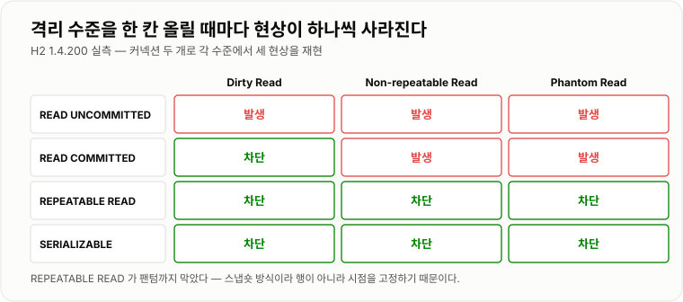
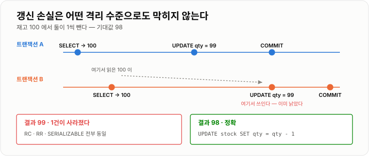
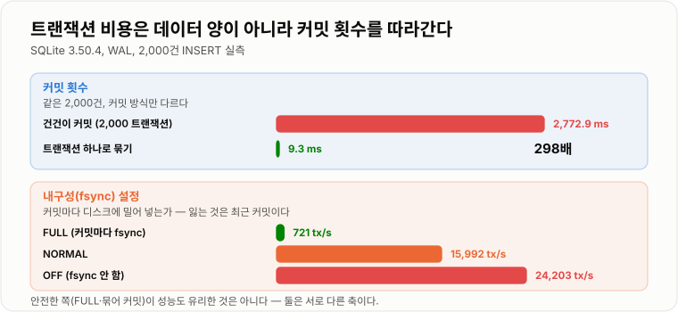

# ACID와 격리 수준

> **트랜잭션은 "여러 문장을 한 덩어리로 묶는 기능"이 아니라 "실패와 동시성이라는 두 현실로부터 데이터를 지키는 계약"이다. ACID의 A·C·D가 실패를 막고, I 하나가 동시성을 막는다. 그리고 격리 수준은 그 I를 얼마나 포기할지 고르는 손잡이다.**

---

## 1. 핵심 요약

**ACID의 A·C·D는 실패로부터 데이터를 지키고 I 하나만 동시 실행으로부터 지키는데, 그 I조차 "읽기가 무엇을 보는가"만 정할 뿐이라 읽고 계산해서 쓰는 갱신 손실은 `SERIALIZABLE`로도 막히지 않는다 — 정확성이 필요하면 격리 수준을 올릴 것이 아니라 원자적 `UPDATE`나 락으로 가야 한다.**

### 한눈에 보기

* 트랜잭션은 **전부 반영되거나 전혀 반영되지 않는 작업 단위**다. 중간 상태가 밖에서 보이지 않는 것이 핵심이다.
* ACID 중 **A·C·D는 "실패"에 대한 보장**이고, **I만 "동시 실행"에 대한 보장**이다. 격리 수준으로 조절할 수 있는 것은 I 하나뿐이다.
* **격리 수준은 성능과 정확성의 거래다.** 실측에서 `READ UNCOMMITTED`는 커밋되지 않은 `2000`을 그대로 읽었고, `READ COMMITTED`는 `1000`을 읽었다.
* **3대 이상 현상은 격리 수준을 한 단계씩 올릴 때마다 하나씩 사라진다.** H2 실측으로 4단계 × 3현상을 전부 확인했다 (아래 표).
* **`REPEATABLE READ`가 팬텀까지 막았다.** 스냅숏 기반 MVCC 엔진에서는 흔한 일이고 MySQL InnoDB도 같다. **"RR은 팬텀을 못 막는다"는 교과서 설명은 표준 SQL 기준이지 실제 엔진 기준이 아니다.**
* **격리 수준을 아무리 올려도 갱신 손실(Lost Update)은 안 막힌다.** `READ COMMITTED`·`REPEATABLE READ`·`SERIALIZABLE` 전부에서 재고가 98이 아니라 **99**가 됐다. 애플리케이션이 읽고 계산해서 쓰기 때문이다.
* 같은 작업을 **`UPDATE stock SET qty = qty - 1` 한 문장으로 바꾸면 정확히 98**이 된다. 갱신 손실은 격리 수준이 아니라 **쿼리 작성 방식**의 문제다.
* **내구성(D)은 공짜가 아니다.** 커밋마다 디스크에 밀어 넣으면 초당 **721건**, 안 하면 **24,203건**으로 **33.6배** 차이가 났다.
* **커밋 횟수가 곧 비용이다.** 2,000건을 건건이 커밋하면 2,772.9 ms, 트랜잭션 하나로 묶으면 **9.3 ms**로 **298배** 빨랐다.
* MySQL의 기본 격리 수준은 **`REPEATABLE READ`**, PostgreSQL·Oracle·SQL Server는 **`READ COMMITTED`** 다. **DB를 옮기면 동작이 조용히 달라진다.**

> 이 노트의 수치는 **H2 1.4.200(MVStore, 인메모리)** 과 **SQLite 3.50.4**, **JDK 17.0.12**에서 직접 측정한 것이다. 이상 현상의 정의, 격리 수준의 계단 구조, 갱신 손실이 격리 수준으로 안 막힌다는 점은 엔진과 무관하게 성립한다. **엔진마다 다른 부분(각 수준의 실제 구현, 팬텀 차단 여부, 기본값)은 본문에서 따로 표시했다.**

### 무엇을 해결하는가

#### 해결하려는 문제

계좌 이체를 생각해 보자. 출금과 입금은 **반드시 함께 성공하거나 함께 실패해야 한다.**

```java
// 트랜잭션이 없다면
accountDao.withdraw(fromId, 10000);   // 성공
// ← 여기서 서버가 죽으면?
accountDao.deposit(toId, 10000);      // 실행되지 않음
```

돈 10,000원이 **세상에서 사라진다.** 어느 쪽도 잘못된 코드를 쓰지 않았는데도 그렇다.

문제는 이것만이 아니다. 두 사람이 **동시에** 같은 계좌에서 출금하면 어떻게 되는가?

```java
// 스레드 A                          // 스레드 B
int balance = read(1);   // 10000    int balance = read(1);   // 10000
write(1, balance - 8000);            write(1, balance - 8000);
// 결과: 2000. 16,000원을 뽑았는데 8,000원만 빠졌다.
```

**첫 번째는 "실패"의 문제이고 두 번째는 "동시 실행"의 문제다.** 트랜잭션은 이 둘을 한꺼번에 다룬다.

#### 이 개념이 없을 때

트랜잭션이 없으면 이 보장을 **전부 직접 만들어야 한다.**

```java
public void transfer(long fromId, long toId, int amount) {
    // 1) 동시 실행을 막으려면 직접 잠가야 한다
    lockManager.lock(fromId);
    lockManager.lock(toId);          // 순서를 안 맞추면 데드락이 난다

    // 2) 실패에 대비해 원래 값을 직접 백업해야 한다
    int fromBefore = accountDao.findBalance(fromId);
    int toBefore = accountDao.findBalance(toId);

    try {
        accountDao.updateBalance(fromId, fromBefore - amount);
        accountDao.updateBalance(toId, toBefore + amount);
    } catch (Exception e) {
        // 3) 되돌리기도 직접 해야 한다 — 이 되돌리기가 실패하면?
        accountDao.updateBalance(fromId, fromBefore);
        accountDao.updateBalance(toId, toBefore);
        throw e;
    } finally {
        lockManager.unlock(toId);
        lockManager.unlock(fromId);
    }
}
```

문제가 겹겹이다.

* **되돌리기 자체가 실패할 수 있다.** 보상 코드에는 보상 코드가 없다.
* **되돌리는 중에 서버가 죽으면** 반쯤 되돌아간 상태로 남는다.
* 백업한 값을 쓰는 순간 **다른 트랜잭션이 그 사이에 바꾼 값을 덮어쓴다.**
* 락 순서를 코드마다 통일해야 하는데, 개발자가 늘어나면 반드시 어긋난다.
* 무엇보다 **커밋 직후 정전이 나면** 디스크에 안 갔을 수 있다. 이건 애플리케이션이 손댈 수 없는 영역이다.

트랜잭션이 있으면 위 코드는 이렇게 된다.

```java
connection.setAutoCommit(false);
try {
    accountDao.withdraw(fromId, amount);
    accountDao.deposit(toId, amount);
    connection.commit();
} catch (Exception e) {
    connection.rollback();
    throw e;
}
```

**되돌리기·잠금·디스크 보장을 전부 DB가 맡는다.** ACID는 이 위임 계약의 이름이다.

---

## 2. 동작 원리

### 핵심 구성 요소

| 개념 | 설명 | 중요한 이유 |
| --- | --- | --- |
| **트랜잭션** | 전부 되거나 전혀 안 되는 작업 단위 | 중간 상태가 없다는 것이 전부다. |
| **원자성 (Atomicity)** | 부분 성공이 없다 | 실패 시 되돌리기를 DB가 책임진다. |
| **일관성 (Consistency)** | 제약 조건을 지킨 상태에서 지킨 상태로 | DB가 아니라 **제약과 애플리케이션**이 지킨다. |
| **격리성 (Isolation)** | 동시 실행이 순차 실행처럼 보인다 | **ACID 중 유일하게 등급이 있다.** |
| **내구성 (Durability)** | 커밋된 것은 장애가 나도 남는다 | 로그를 디스크에 쓰는 비용이 든다. |
| **커밋 (COMMIT)** | 변경을 확정한다 | 이 시점부터 남에게 보인다. |
| **롤백 (ROLLBACK)** | 변경을 전부 취소한다 | 언두 정보가 있어야 가능하다. |
| **오토커밋** | 문장 하나가 곧 트랜잭션 하나 | JDBC 기본값이다. **모르면 롤백이 안 된다.** |
| **Dirty Read** | 커밋 안 된 값을 읽는다 | 롤백되면 **존재한 적 없는 값**을 읽은 것이다. |
| **Non-repeatable Read** | 같은 행을 두 번 읽었는데 값이 다르다 | 한 트랜잭션 안에서 계산이 어긋난다. |
| **Phantom Read** | 같은 조건을 두 번 셌는데 행 수가 다르다 | 집계·검증 로직이 깨진다. |
| **Lost Update** | 두 갱신 중 하나가 조용히 사라진다 | **격리 수준으로 안 막힌다.** |
| **격리 수준** | 어떤 이상 현상을 허용할지 고르는 4단계 | 위로 갈수록 안전하고 느리다. |
| **WAL (Write-Ahead Log)** | 데이터보다 로그를 먼저 쓴다 | 내구성과 롤백이 여기서 나온다. |

#### ACID를 두 덩어리로 나눠 보기

이 구분이 격리 수준을 이해하는 열쇠다.

```text
                        ACID

  ┌─ 실패에 대한 보장 ─────────┐   ┌─ 동시성에 대한 보장 ─┐
  │  A  원자성                 │   │  I  격리성           │
  │  C  일관성                 │   │                      │
  │  D  내구성                 │   │                      │
  └────────────────────────────┘   └──────────────────────┘
           끄고 켤 수 없다              4단계로 조절한다
      (트랜잭션을 쓰면 항상 켜짐)      (성능과 맞바꾼다)
```

**"격리 수준을 낮춘다"는 말은 원자성이나 내구성을 포기한다는 뜻이 아니다.** 롤백은 그대로 되고 커밋은 그대로 남는다. 다만 **남이 하는 일이 내 눈에 더 많이 보일 뿐**이다.

### 내부 동작 과정

#### 원자성 — 되돌리기는 어떻게 가능한가

DB는 데이터를 바꾸기 **전에** 원래 값을 언두 로그에 적어 둔다.

```text
UPDATE account SET balance = 900 WHERE id = 1;   (원래 1000)

  1. 언두 로그에 적는다        [id=1, balance was 1000]
  2. 데이터 페이지를 고친다     balance = 900
  3-a. COMMIT   → 언두 로그를 버려도 된다고 표시
  3-b. ROLLBACK → 언두 로그를 거꾸로 적용해 1000 으로 되돌린다
```

**롤백이 "안 한 일로 만드는 것"이 아니라 "반대로 한 번 더 하는 것"** 이라는 점이 중요하다. 그래서 롤백에도 시간이 걸리고, 큰 트랜잭션의 롤백은 원래 작업보다 오래 걸리기도 한다.

#### 내구성 — 커밋은 왜 느린가

커밋 시점에 데이터 파일 전체를 디스크에 쓰는 것은 너무 비싸다. 그래서 **변경 내역(로그)만 순차로 디스크에 쓰고** 데이터 파일은 나중에 천천히 반영한다. 이것이 WAL이다.

```text
COMMIT

   메모리                          디스크
  ┌──────────────┐               ┌──────────────────┐
  │ 데이터 페이지 │  ─ 나중에 ─→  │ 데이터 파일       │
  │ (수정됨)      │               └──────────────────┘
  └──────────────┘
  ┌──────────────┐   지금 당장    ┌──────────────────┐
  │ 로그 버퍼     │  ──fsync──→   │ 로그 파일 (순차)  │  ← 여기까지 가야 커밋 완료
  └──────────────┘               └──────────────────┘
```

**커밋이 기다리는 것은 이 `fsync` 하나다.** 그래서 커밋 비용은 데이터 양이 아니라 **커밋 횟수**에 비례한다. 실측에서 `fsync`를 켜고 끄는 것만으로 33.6배가 갈렸다.

#### 격리성 — 동시에 실행하면 무엇이 깨지는가

두 트랜잭션이 겹쳐 실행되면 세 가지 현상이 나타난다. **읽는 대상이 무엇이냐**로 구분하면 헷갈리지 않는다.

```text
Dirty Read            아직 커밋 안 된 값을 읽는다
                      → 남의 "확정되지 않은" 것을 본다

Non-repeatable Read   같은 행을 두 번 읽었는데 값이 다르다
                      → 이미 있던 행의 "값"이 바뀐다   (UPDATE / DELETE)

Phantom Read          같은 조건을 두 번 읽었는데 행 수가 다르다
                      → 없던 행이 "생긴다"             (INSERT)
```

세 현상을 시간 순으로 보면 이렇다.

```text
[Dirty Read]
  A: ─────── SELECT balance ──────────────────────  2000 을 읽음 (!)
  B: ── UPDATE 2000 ────────── ROLLBACK ──────────  없던 일이 됨
                                    ↑ A는 존재한 적 없는 값으로 계산했다

[Non-repeatable Read]
  A: ─ SELECT 1000 ─────────────────── SELECT 2000 ─── COMMIT
  B: ────────── UPDATE 2000 ─ COMMIT ──
                                    ↑ 한 트랜잭션 안에서 값이 변했다

[Phantom Read]
  A: ─ COUNT 3행 ───────────────────── COUNT 4행 ──── COMMIT
  B: ────────── INSERT ────── COMMIT ──
                                    ↑ 한 트랜잭션 안에서 행이 늘었다
```

#### 격리 수준 4단계

표준 SQL은 **"어떤 현상을 허용하는가"** 로 4단계를 정의한다.

| 격리 수준 | Dirty Read | Non-repeatable Read | Phantom Read |
| --- | --- | --- | --- |
| `READ UNCOMMITTED` | 허용 | 허용 | 허용 |
| `READ COMMITTED` | 차단 | 허용 | 허용 |
| `REPEATABLE READ` | 차단 | 차단 | 허용 |
| `SERIALIZABLE` | 차단 | 차단 | 차단 |

**중요한 것은 이 표가 "허용 여부"이지 "발생 여부"가 아니라는 점이다.** 표준은 "이 수준에서는 이 현상이 일어나도 규격 위반이 아니다"라고 말할 뿐, 엔진이 더 강하게 막는 것은 자유다. 실제로 그렇게 하는 엔진이 많다.

#### 실측 — 4단계 × 3현상을 전부 돌려 봤다

H2 1.4.200에서 커넥션 두 개를 열고 각 격리 수준에서 세 현상을 재현했다.

```text
격리 수준            Dirty Read              Non-repeatable Read     Phantom Read
────────────────────────────────────────────────────────────────────────────────────
READ UNCOMMITTED    발생 (2000 을 읽음)      발생 (1000 → 2000)      발생 (3행 → 4행)
READ COMMITTED      차단 (1000 을 읽음)      발생 (1000 → 2000)      발생 (3행 → 4행)
REPEATABLE READ     차단 (1000 을 읽음)      차단 (1000 → 1000)      차단 (3행 → 3행)
SERIALIZABLE        차단 (1000 을 읽음)      차단 (1000 → 1000)      차단 (3행 → 3행)
```

앞의 두 줄은 표준 표와 정확히 일치한다. **세 번째 줄이 표준과 다르다.** `REPEATABLE READ`가 팬텀까지 막았다.

이유는 H2가 **MVCC(스냅숏) 방식**이기 때문이다. 트랜잭션 시작 시점의 스냅숏을 계속 보므로, 값이 바뀌든 행이 생기든 **내 눈에는 아무것도 안 변한다.** 행 단위로 막는 것이 아니라 시점 자체를 고정하기 때문에 팬텀도 자동으로 막힌다.

**MySQL InnoDB도 같은 이유로 `REPEATABLE READ`에서 팬텀이 거의 안 보인다.** 다만 InnoDB는 `SELECT ... FOR UPDATE` 같은 **잠금 읽기**를 쓸 때는 스냅숏이 아니라 최신 데이터를 보는데, 이때는 갭 락(next-key lock)으로 그 구간에 `INSERT` 자체를 막아서 또 팬텀을 방지한다. **두 가지 다른 방법으로 같은 결과를 낸다.**



*수준을 한 칸 올릴 때마다 현상이 하나씩 사라진다. 다만 세 번째 줄이 표준 표와 다르다.*

#### 엔진별 기본값 — 옮기면 동작이 달라진다

| DB | 기본 격리 수준 | 비고 |
| --- | --- | --- |
| **MySQL (InnoDB)** | `REPEATABLE READ` | 표준 DB 중 유일하게 RR이 기본이다. |
| **PostgreSQL** | `READ COMMITTED` | `READ UNCOMMITTED`를 지정해도 RC로 동작한다. |
| **Oracle** | `READ COMMITTED` | `REPEATABLE READ`를 아예 지원하지 않는다. |
| **SQL Server** | `READ COMMITTED` | 기본은 락 기반. 스냅숏은 옵션으로 켠다. |
| **H2 1.4.200** | `READ COMMITTED` | 실측 확인 (`getTransactionIsolation()` = 2). |

**MySQL로 개발하고 PostgreSQL로 옮기면 RR → RC로 내려간다.** 한 트랜잭션 안에서 두 번 읽던 값이 갑자기 달라질 수 있다는 뜻이다. 반대로 PostgreSQL에서 MySQL로 오면 안 보이던 락 대기가 생긴다.

#### 격리 수준으로는 막지 못하는 것 — 갱신 손실

가장 중요한 실측 결과다. 재고 100에서 두 트랜잭션이 각각 1씩 빼면 98이 되어야 한다.

```text
격리 수준            결과
──────────────────────────────────────────────────
READ COMMITTED      99   ← 갱신 손실 발생
REPEATABLE READ     99   ← 갱신 손실 발생
SERIALIZABLE        99   ← 갱신 손실 발생
```

**`SERIALIZABLE`에서도 손실이 났다.** 왜인가?

```text
A: SELECT qty → 100
B: SELECT qty → 100
A: UPDATE qty = 99   COMMIT
B: UPDATE qty = 99   COMMIT      ← 100-1 을 계산했는데 A는 이미 99로 만들었다
```

**B는 "99로 만들어라"라고 말했을 뿐, "1을 빼라"라고 말하지 않았다.** DB 입장에서 B의 요청은 아무 모순이 없다. 격리 수준은 **읽기가 무엇을 보는가**를 정하는 장치이지, **읽은 값으로 애플리케이션이 무슨 계산을 하는가**에는 관여하지 않는다.

> H2 1.4.200의 `SERIALIZABLE`은 완전한 직렬화를 구현하지 않는다. **PostgreSQL의 `SERIALIZABLE`(SSI)은 이 경우를 직렬화 실패로 잡아낸다.** 하지만 MySQL InnoDB의 `SERIALIZABLE`은 모든 `SELECT`를 잠금 읽기로 바꾸는 방식이라, 위 순서라면(A가 커밋한 뒤 B가 UPDATE) 역시 막지 못한다. **"제일 높은 수준을 쓰면 다 해결된다"가 성립하는 엔진은 많지 않다.**

해결책은 격리 수준이 아니라 **쿼리를 바꾸는 것**이다.

```text
UPDATE stock SET qty = qty - 1 WHERE id = 1;   →  결과 98
```

읽기와 쓰기를 한 문장으로 합치면 DB가 그 행을 잠그고 원자적으로 처리한다. 애플리케이션이 읽은 값이 끼어들 틈이 없다. 이 방법을 쓸 수 없을 때(중간에 검증·외부 호출이 필요할 때) 등장하는 것이 낙관적 락과 비관적 락이다.



*B가 읽은 100이 뒤늦게 쓰인다. 격리 수준은 이 간극에 관여하지 않는다.*

---

## 3. 특징과 비교

| 구분          | 내용                                       |
| ----------- | ---------------------------------------- |
| **장점**      | 부분 실패와 보상 코드가 사라지고, 장애가 나도 커밋된 것은 남는다. 동시성 정책을 선언 한 줄로 바꿀 수 있고, 묶어서 커밋하면 크게 빨라진다(298배). |
| **단점**      | 커밋마다 디스크를 기다리고, 트랜잭션이 길어지면 옛 버전·커넥션·락을 붙잡는다. **갱신 손실은 어떤 격리 수준으로도 못 막는다.** |
| **적합한 상황**  | 같은 데이터를 트랜잭션 안에서 두 번 이상 읽고 값이 같아야 하면 `REPEATABLE READ`, 아니면 `READ COMMITTED`로 충분하다. |
| **주의할 상황**  | 외부 API 호출·파일 쓰기·메일 발송을 트랜잭션 안에 넣는 것 — 롤백이 안 걸리고 커넥션만 오래 잡는다. |

### 성능 특성

#### 내구성(D)의 값 — 커밋마다 fsync 하는 비용

SQLite 3.50.4, WAL 모드, 2,000건 단건 커밋.

```text
설정                       2,000 커밋      처리량        FULL 대비
──────────────────────────────────────────────────────────────────
synchronous = FULL         2,772.9 ms       721 tx/s      1.0배
synchronous = NORMAL         125.1 ms    15,992 tx/s     22.2배
synchronous = OFF             82.6 ms    24,203 tx/s     33.6배
```

**`FULL`은 커밋마다 디스크에 물리적으로 밀어 넣는다.** 나머지 둘은 OS 캐시까지만 보내고 돌아온다. 정전이 나면 최근 커밋이 날아갈 수 있다는 뜻이다.

MySQL에서 이 손잡이는 `innodb_flush_log_at_trx_commit`이다.

| 값 | 동작 | 사고 시 손실 |
| --- | --- | --- |
| `1` (기본) | 커밋마다 로그를 쓰고 `fsync` | 없다 |
| `2` | 커밋마다 로그를 쓰지만 `fsync`는 1초에 한 번 | OS/서버 장애 시 최대 1초 |
| `0` | 1초에 한 번 쓰고 `fsync` | MySQL 프로세스만 죽어도 최대 1초 |

**금융·주문은 `1`에서 내리면 안 된다.** 조회수·로그 적재처럼 1초를 잃어도 되는 데이터에만 `2`를 고려한다.

#### 커밋 횟수 — 가장 큰 단일 변수

```text
2,000건 INSERT, synchronous = FULL

  건건이 커밋 (2,000 트랜잭션)      2,772.9 ms
  하나로 묶기 (1 트랜잭션)              9.3 ms      298배
```

**데이터 양이 같아도 298배가 갈렸다.** 트랜잭션 비용은 처리한 행 수가 아니라 커밋 횟수를 따라간다.



*커밋 횟수(298배)와 fsync 설정(33.6배)은 서로 다른 축이다. 안전한 쪽이 늘 느린 것도 아니다.*

#### 격리 수준의 비용

격리 수준 자체의 오버헤드는 **엔진 구현 방식에 따라 완전히 다르다.**

| 구현 방식 | 높은 격리 수준의 비용 | 대표 엔진 |
| --- | --- | --- |
| **MVCC(스냅숏)** | 읽기는 거의 공짜. 대신 **옛 버전을 오래 보관**해야 한다 | MySQL InnoDB, PostgreSQL, Oracle, H2 |
| **락 기반** | 읽기도 락을 잡는다. **대기와 데드락이 늘어난다** | SQL Server 기본 모드, SQLite 롤백 저널 |

MVCC 엔진에서 `READ COMMITTED` → `REPEATABLE READ`는 **읽기 성능 차이가 사실상 없다.** 둘 다 스냅숏을 읽을 뿐이고, 스냅숏을 언제 뜨느냐(문장마다 vs 트랜잭션 시작 시)만 다르다.

**진짜 비용은 다른 곳에서 나온다.** 트랜잭션이 길어지면 그동안의 옛 버전을 전부 들고 있어야 한다. SQLite WAL로 이 비용을 직접 쟀다.

```text
20,000행에 30회 갱신 + 매번 체크포인트

  오래된 읽기 트랜잭션 없음        WAL 파일  0.21 MB
  오래된 읽기 트랜잭션 하나 유지    WAL 파일  6.02 MB      28.7배
```

**읽기 트랜잭션 하나를 안 닫았을 뿐인데 저장 공간이 28.7배가 됐다.** MySQL InnoDB에서 언두 테이블스페이스가 부풀고 `History list length`가 치솟는 현상이 정확히 이것이다.

#### `SERIALIZABLE`의 비용

락 기반 엔진에서 `SERIALIZABLE`은 읽기까지 잠근다. SQLite 롤백 저널 모드로 확인했다.

```text
읽기 트랜잭션이 열린 상태에서 쓰기를 시도

  WAL (MVCC)             쓰기 성공        17.2 ms
  롤백 저널 (락 기반)     쓰기 차단     3,348.1 ms   → "database is locked"
```

**락 기반에서는 읽는 사람이 쓰는 사람을 완전히 막는다.** 3.3초를 기다리다 실패했다. 이것이 MVCC가 등장한 이유다.

#### 정리

| 항목 | 비용의 원천 | 실측 |
| --- | --- | --- |
| 내구성 | 커밋마다 `fsync` | 33.6배 (FULL vs OFF) |
| 커밋 횟수 | 트랜잭션 시작·종료 오버헤드 | 298배 (건건이 vs 묶기) |
| 긴 트랜잭션 | 옛 버전 보관 | 28.7배 (저장 공간) |
| 락 기반 격리 | 읽기가 쓰기를 막음 | 차단 (3,348 ms 후 실패) |
| MVCC 격리 수준 | 거의 없음 | RC ≈ RR |

### 장점과 단점

#### 트랜잭션의 장점

| 장점 | 근거 |
| --- | --- |
| **부분 실패가 사라진다** | 되돌리기를 DB가 책임진다. 보상 코드를 짤 필요가 없다. |
| **장애에도 커밋이 남는다** | WAL 덕분에 프로세스가 죽어도 복구된다. |
| **동시성 문제를 선언적으로 다룬다** | 격리 수준 한 줄로 정책을 바꾼다. |
| **중간 상태가 밖에 안 보인다** | 이체 도중의 "돈이 사라진 순간"이 남에게 노출되지 않는다. |
| **묶으면 훨씬 빠르다** | 커밋 횟수가 줄어든다. 실측 298배. |

#### 트랜잭션의 단점

| 단점 | 근거 |
| --- | --- |
| **커밋에 디스크 대기가 있다** | `fsync` 때문에 실측 33.6배 차이가 난다. |
| **길어지면 자원을 붙잡는다** | 옛 버전 보관으로 실측 28.7배. 커넥션도 그동안 점유한다. |
| **락 대기와 데드락이 생긴다** | 락 기반 격리에서는 읽기도 막힌다. |
| **갱신 손실은 못 막는다** | 격리 수준 최고 단계에서도 실측 99가 나왔다. |
| **DB 경계를 못 넘는다** | 외부 API·다른 DB·메시지 큐에는 롤백이 안 걸린다. |

#### 격리 수준을 올렸을 때

| 얻는 것 | 잃는 것 |
| --- | --- |
| 이상 현상이 하나씩 사라진다 | 락 기반이면 대기·데드락이 늘어난다 |
| 계산 결과가 재현 가능해진다 | MVCC면 옛 버전을 더 오래 들고 있어야 한다 |
| 집계·검증 로직이 안전해진다 | 트랜잭션 하나가 오래 살아 다른 트랜잭션에 영향을 준다 |

### 어떤 상황에서 고르는가

#### 격리 수준 선택

```text
이 트랜잭션 안에서 같은 데이터를 두 번 이상 읽는가?
   │
   ├─ 아니오 (읽고 바로 쓴다)
   │      → READ COMMITTED 로 충분하다.
   │        MySQL 기본값 RR 을 굳이 내릴 필요도 없다.
   │
   └─ 예 (읽고, 계산하고, 또 읽는다)
          │
          ├─ 두 번의 값이 달라도 되는가?
          │      → READ COMMITTED
          │
          └─ 반드시 같아야 하는가? (정산·집계·검증)
                 → REPEATABLE READ
                    │
                    └─ 그 사이 남이 INSERT 하는 것도 막아야 하는가?
                           → 엔진이 MVCC 면 RR 로 이미 막힌다
                           → 락 기반이면 SERIALIZABLE. 대기 비용을 각오한다
```

**결론부터 말하면, 실무에서 격리 수준을 직접 만지는 일은 드물다.** 대부분 기본값으로 두고, 정확성이 필요한 지점은 격리 수준이 아니라 **락이나 원자적 UPDATE로** 해결한다.

#### 격리 수준을 올려서 해결하려 들면 안 되는 것

| 문제 | 격리 수준으로? | 실제 해법 |
| --- | --- | --- |
| 재고가 마이너스가 된다 | **안 된다** | `UPDATE ... WHERE qty > 0` 또는 락 |
| 쿠폰이 초과 발급된다 | **안 된다** | 낙관적 락 / 분산 락 / Redis 원자 연산 |
| 중복 주문이 들어온다 | **안 된다** | 유니크 제약 + 멱등성 키 |
| 두 집계 시점이 다르다 | **된다** | `REPEATABLE READ` |
| 롤백될 값을 읽는다 | **된다** | `READ COMMITTED` 이상 |

#### 트랜잭션 범위를 정하는 기준

```text
트랜잭션 안에 넣어야 하는 것          트랜잭션 밖으로 빼야 하는 것
─────────────────────────────       ────────────────────────────────
같은 DB 의 관련 쓰기                  외부 API 호출 (결제·알림·SMS)
정합성이 걸린 읽기·쓰기               파일 업로드 / 이미지 변환
                                     메일·푸시 발송
                                     오래 걸리는 계산
                                     사용자 입력 대기
```

**기준은 하나다. "이것 때문에 트랜잭션이 길어지는가, 그리고 이것은 롤백이 되는가."** 외부 결제 API는 둘 다 아니다. 느리고, 롤백도 안 된다.

#### 커밋 단위

| 상황 | 권장 | 이유 |
| --- | --- | --- |
| 사용자 요청 처리 | 요청 하나 = 트랜잭션 하나 | 경계가 명확하다 |
| 대량 배치 삽입 | 1,000~5,000건 묶기 | 커밋 비용과 롤백 비용의 타협점 |
| 100만 건 마이그레이션 | 절대 하나로 묶지 않는다 | 언두가 폭증하고 실패 시 전부 재시작 |

### 비슷한 기술과 비교

#### 격리 수준 4단계

| 기준 | READ UNCOMMITTED | READ COMMITTED | REPEATABLE READ | SERIALIZABLE |
| --- | --- | --- | --- | --- |
| Dirty Read | 허용 | 차단 | 차단 | 차단 |
| Non-repeatable Read | 허용 | 허용 | 차단 | 차단 |
| Phantom Read | 허용 | 허용 | 표준은 허용 (**MVCC 엔진은 차단**) | 차단 |
| Lost Update | 허용 | 허용 | **허용** | **엔진에 따라 허용** |
| 스냅숏 시점 | 없음 | **문장마다** | **트랜잭션 시작 시** | 트랜잭션 시작 시 |
| 기본값인 DB | 없음 | PostgreSQL, Oracle, SQL Server | **MySQL** | 없음 |
| 실무 사용 | 거의 안 씀 | 가장 흔함 | MySQL 기본이라 흔함 | 특수 상황만 |

#### 원자성(A) vs 일관성(C) — 가장 헷갈리는 한 쌍

| 기준 | 원자성 | 일관성 |
| --- | --- | --- |
| 무엇을 보장하나 | **전부 또는 전무** | **규칙을 지킨 상태 유지** |
| 누가 책임지나 | **DB** (언두 로그) | **개발자 + 제약 조건** |
| 위반 예시 | 출금만 되고 입금이 안 됨 | 이체 후 총액이 달라짐 |
| 검증 방법 | 롤백이 되는가 | 제약·비즈니스 규칙이 지켜지는가 |

**"DB가 일관성을 보장한다"는 말은 반쯤만 맞다.** DB는 유니크·외래 키·`CHECK` 같은 **선언된 제약**만 지킨다. "출금액과 입금액이 같아야 한다" 같은 규칙은 개발자가 지켜야 한다. 원자성이 그 지킴을 **가능하게** 해 줄 뿐이다.

#### 격리성(I) vs 락

| 기준 | 격리성 | 락 |
| --- | --- | --- |
| 층위 | **무엇을 보장할지** (정책) | **어떻게 보장할지** (구현) |
| 표현 | `READ COMMITTED` 등 4단계 | 공유 락, 배타 락, 갭 락 |
| 개발자 제어 | 트랜잭션 단위 설정 | `FOR UPDATE` 등으로 직접 지정 |
| MVCC 엔진에서 | 스냅숏으로 대부분 달성 | 쓰기와 잠금 읽기에만 사용 |

#### 트랜잭션 vs `synchronized`

| 기준 | DB 트랜잭션 | `synchronized` |
| --- | --- | --- |
| 범위 | **DB 한 대** | **JVM 하나** |
| 서버 여러 대 | 동작한다 | **동작하지 않는다** |
| 실패 시 되돌리기 | 자동 | 없다 |
| 내구성 | 있다 | 없다 |
| 비용 | 디스크 `fsync` | 메모리 배리어 |

**서버를 2대로 늘리는 순간 `synchronized`는 무력해지지만 트랜잭션은 그대로 동작한다.** 재고·쿠폰 같은 정합성 문제를 애플리케이션 락으로 풀면 안 되는 이유다.

#### `@Transactional` vs `START TRANSACTION`

| 기준 | `@Transactional` | `START TRANSACTION` |
| --- | --- | --- |
| 경계 | 메서드 진입·종료 | 명시적 문장 |
| 롤백 조건 | `RuntimeException`만 (기본) | 명시적 `ROLLBACK` |
| 전파 옵션 | 있다 (`REQUIRED` 등 7종) | 없다 |
| 함정 | **자기 호출 시 프록시 우회** | 없다 |

---

## 4. 실무 주의사항

### 백엔드 실무 적용

#### 트랜잭션 범위에 외부 호출을 넣지 않는다

```java
// 나쁜 예 — 결제 API 응답이 3초 걸리면 그동안 락과 커넥션을 붙잡는다
@Transactional
public void placeOrder(OrderRequest request) {
    Order order = orderRepository.save(request.toOrder());
    PaymentResult result = paymentClient.pay(request.getCard(), order.getAmount());  // ← 3초
    order.markPaid(result.getTransactionId());
}
```

문제가 셋이다.

1. **커넥션 풀이 마른다.** 요청 100개면 커넥션 100개가 3초씩 묶인다.
2. **락을 3초간 쥔다.** 같은 행을 노리는 다른 요청이 전부 대기한다.
3. **롤백해도 결제는 취소되지 않는다.** 외부 시스템에는 트랜잭션이 안 걸린다.

```java
// 좋은 예 — 외부 호출을 트랜잭션 밖으로 뺀다
public void placeOrder(OrderRequest request) {
    Order order = orderService.createPending(request);              // 트랜잭션 1 (짧다)

    PaymentResult result;
    try {
        result = paymentClient.pay(request.getCard(), order.getAmount());   // 트랜잭션 밖
    } catch (PaymentException e) {
        orderService.markFailed(order.getId(), e.getMessage());     // 트랜잭션 2
        throw e;
    }

    orderService.markPaid(order.getId(), result.getTransactionId());        // 트랜잭션 3
}
```

트랜잭션이 세 개로 늘었지만 **각각이 짧다.** 대신 "결제는 됐는데 `markPaid`가 실패한" 상태가 생길 수 있으므로 **멱등성 키와 상태 복구 배치**가 필요해진다. 이것이 실무의 진짜 트레이드오프다.

#### 배치는 반드시 나눠 커밋한다

```java
@Service
public class SettlementBatch {

    private static final int CHUNK = 1000;

    private final PlatformTransactionManager txManager;
    private final SettlementRepository repository;

    public SettlementBatch(PlatformTransactionManager txManager,
                           SettlementRepository repository) {
        this.txManager = txManager;
        this.repository = repository;
    }

    public void run(List<Settlement> targets) {
        for (int start = 0; start < targets.size(); start += CHUNK) {
            int end = Math.min(start + CHUNK, targets.size());
            List<Settlement> chunk = targets.subList(start, end);

            TransactionTemplate template = new TransactionTemplate(txManager);
            template.executeWithoutResult(status -> repository.saveAll(chunk));
        }
    }
}
```

**100만 건을 트랜잭션 하나로 처리하면** 언두 로그가 수 GB가 되고, 99% 지점에서 실패하면 롤백에만 원래 시간의 몇 배가 걸린다. 실측 28.7배 저장 공간 증가가 이 현상의 축소판이다.

#### 읽기 전용 트랜잭션을 표시한다

```java
@Transactional(readOnly = true)
public List<OrderResponse> findOrders(long userId) {
    return orderRepository.findByUserId(userId);
}
```

`readOnly = true`는 두 가지를 한다.

* **JPA 영속성 컨텍스트가 변경 감지(dirty checking)를 건너뛴다.** 스냅숏을 안 떠서 메모리와 CPU를 아낀다.
* **읽기 복제본으로 라우팅할 수 있는 힌트가 된다.** `LazyConnectionDataSourceProxy`와 함께 쓰면 조회를 복제본으로 보낸다.

#### 긴 트랜잭션을 감시한다

```sql
-- MySQL: 오래 살아 있는 트랜잭션 찾기
SELECT trx_id,
       trx_started,
       TIMESTAMPDIFF(SECOND, trx_started, NOW()) AS running_sec,
       trx_rows_locked,
       trx_query
  FROM information_schema.innodb_trx
 ORDER BY trx_started;

-- 언두가 얼마나 쌓였는지
SHOW ENGINE INNODB STATUS;   -- 출력에서 "History list length" 를 본다
```

**`History list length`가 수십만 이상으로 계속 오르면 어딘가 트랜잭션이 안 닫히고 있다는 뜻이다.** 실측에서 확인한 28.7배 공간 증가가 운영에서는 디스크 부족과 조회 성능 저하로 나타난다.

#### 롤백 규칙과 자기 호출을 팀 규칙으로 못 박는다

```java
// 규칙 1 — 체크 예외에도 롤백이 필요하면 반드시 명시한다
@Transactional(rollbackFor = Exception.class)

// 규칙 2 — 같은 클래스 안에서 @Transactional 메서드를 호출하지 않는다
//          필요하면 별도 빈으로 분리한다
@Service
public class OrderFacade {
    private final OrderService orderService;   // 다른 빈이므로 프록시를 거친다

    public OrderFacade(OrderService orderService) {
        this.orderService = orderService;
    }

    public void process(long orderId) {
        orderService.markPaid(orderId);        // REQUIRES_NEW 가 제대로 동작한다
    }
}
```

#### 커넥션 풀 크기와 트랜잭션 길이

```text
필요 커넥션 수 ≈ 초당 요청 수 × 트랜잭션 평균 유지 시간

  100 req/s × 0.05초 =   5개
  100 req/s × 3초    = 300개   ← 외부 API 를 트랜잭션에 넣은 경우
```

**트랜잭션을 짧게 만드는 것이 커넥션 풀을 키우는 것보다 언제나 먼저다.** 풀을 300개로 늘리면 DB 쪽 컨텍스트 스위칭이 늘어 전체가 더 느려진다.

### 자주 하는 오해

| 오해 | 사실 |
| --- | --- |
| "격리 수준을 `SERIALIZABLE`로 올리면 동시성 문제가 다 해결된다" | **갱신 손실은 안 막힌다.** 실측에서 세 수준 모두 99가 나왔다. |
| "`REPEATABLE READ`는 팬텀을 못 막는다" | **표준 기준일 뿐이다.** MVCC 엔진에서는 막힌다. H2 실측으로 확인했고 MySQL InnoDB도 같다. |
| "일관성(C)은 DB가 보장한다" | DB는 **선언된 제약**만 지킨다. 업무 규칙은 개발자 몫이다. |
| "롤백은 아무 일도 안 한 것과 같다" | **언두 로그를 거꾸로 적용하는 작업**이다. 시간이 걸리고 실패도 가능하다. |
| "트랜잭션을 크게 잡으면 빠르다" | 커밋 횟수만 놓고 보면 맞지만(298배), 언두·락·롤백 비용이 함께 커진다. |
| "`@Transactional`을 붙였으니 롤백된다" | 체크 예외는 **롤백되지 않는다.** 자기 호출이면 **아예 적용도 안 된다.** |
| "격리 수준이 높으면 무조건 느리다" | **MVCC 엔진에서 RC와 RR은 읽기 성능 차이가 사실상 없다.** 비용은 옛 버전 보관에서 나온다. |
| "커밋은 메모리에만 쓰니 빠르다" | 커밋은 로그의 `fsync`를 기다린다. 실측 33.6배 차이의 원인이다. |
| "MySQL도 `READ COMMITTED`가 기본이겠지" | **MySQL만 `REPEATABLE READ`가 기본**이다. DB를 옮기면 동작이 달라진다. |
| "트랜잭션 안에 외부 API를 넣어도 롤백되니 안전하다" | 외부 시스템에는 롤백이 안 걸린다. **결제는 됐는데 주문은 사라진 상태**가 만들어진다. |
| "`READ UNCOMMITTED`는 빠르니 조회에 쓰자" | 롤백될 값을 읽는다. **존재한 적 없는 숫자로 만든 리포트**가 나간다. |

---

## 5. 예제

### JDBC — 트랜잭션의 밑바닥

```java
public void transfer(long fromId, long toId, int amount) throws SQLException {
    Connection conn = dataSource.getConnection();
    try {
        conn.setAutoCommit(false);                     // 여기서 트랜잭션이 시작된다
        conn.setTransactionIsolation(Connection.TRANSACTION_READ_COMMITTED);

        withdraw(conn, fromId, amount);
        deposit(conn, toId, amount);

        conn.commit();
    } catch (SQLException e) {
        conn.rollback();
        throw e;
    } finally {
        conn.setAutoCommit(true);                      // 커넥션 풀에 돌려주기 전에 복구
        conn.close();
    }
}
```

**`setAutoCommit(false)`를 빼먹으면 문장마다 자동으로 커밋된다.** 롤백을 호출해도 이미 확정된 뒤라 아무 일도 일어나지 않는다. 실무에서 가장 흔한 사고다.

### 갱신 손실을 만드는 코드와 막는 코드

```java
// 나쁜 예 — 읽고, 계산하고, 쓴다. 격리 수준을 아무리 올려도 손실이 난다
public void decreaseStock(Connection conn, long itemId) throws SQLException {
    PreparedStatement select = conn.prepareStatement(
            "SELECT qty FROM stock WHERE id = ?");
    select.setLong(1, itemId);
    ResultSet rs = select.executeQuery();
    rs.next();
    int qty = rs.getInt("qty");                        // ← 여기서 읽은 값이

    if (qty <= 0) {
        throw new IllegalStateException("재고 없음");
    }

    PreparedStatement update = conn.prepareStatement(
            "UPDATE stock SET qty = ? WHERE id = ?");
    update.setInt(1, qty - 1);                         // ← 여기 쓰일 때는 이미 낡았다
    update.setLong(2, itemId);
    update.executeUpdate();
}
```

```java
// 좋은 예 — 읽기와 쓰기를 한 문장으로 합친다
public void decreaseStock(Connection conn, long itemId) throws SQLException {
    PreparedStatement update = conn.prepareStatement(
            "UPDATE stock SET qty = qty - 1 WHERE id = ? AND qty > 0");
    update.setLong(1, itemId);
    int affected = update.executeUpdate();

    if (affected == 0) {
        throw new IllegalStateException("재고 없음");   // 조건 검사까지 DB가 했다
    }
}
```

**`AND qty > 0`이 검증까지 원자적으로 처리한다.** 영향받은 행이 0이면 재고가 없었다는 뜻이다. 실측에서 이 방식은 정확히 98을 만들었다.

### Spring `@Transactional`

```java
@Service
public class TransferService {

    private final AccountRepository accountRepository;

    public TransferService(AccountRepository accountRepository) {
        this.accountRepository = accountRepository;
    }

    @Transactional
    public void transfer(long fromId, long toId, int amount) {
        Account from = accountRepository.findById(fromId).orElseThrow();
        Account to = accountRepository.findById(toId).orElseThrow();

        from.withdraw(amount);
        to.deposit(amount);
    }
}
```

`@Transactional`은 프록시가 앞뒤로 `setAutoCommit(false)` / `commit()` / `rollback()`을 감싸 주는 것이다. **동작 원리를 알아야 하는 이유는 프록시가 안 걸리는 경우가 있기 때문이다.**

```java
@Service
public class OrderService {

    @Transactional
    public void outer() {
        inner();            // ← 프록시를 거치지 않는다. inner 의 @Transactional 은 무시된다
    }

    @Transactional(propagation = Propagation.REQUIRES_NEW)
    public void inner() {
        // 새 트랜잭션이 시작될 것 같지만, 위처럼 호출하면 시작되지 않는다
    }
}
```

**같은 클래스 안에서 자기 메서드를 호출하면 프록시를 우회한다.** `private` 메서드도, `final` 메서드도 마찬가지다.

### 롤백 규칙 — 가장 자주 물리는 함정

```java
@Transactional
public void register(SignupRequest request) {
    memberRepository.save(request.toMember());
    try {
        mailSender.send(request.getEmail());
    } catch (MailException e) {
        log.warn("메일 발송 실패", e);      // 잡아서 삼켰다 → 롤백되지 않는다 (의도한 대로)
    }
}
```

Spring의 기본 롤백 규칙은 **`RuntimeException`과 `Error`만 롤백**이다. `IOException` 같은 체크 예외는 **던져도 커밋된다.**

```java
@Transactional(rollbackFor = Exception.class)   // 체크 예외도 롤백하려면 명시해야 한다
public void importFile(Path path) throws IOException {
    ...
}
```

### 격리 수준 지정

```java
@Transactional(isolation = Isolation.REPEATABLE_READ)
public Report buildReport(long shopId) {
    long orderCount = orderRepository.countByShopId(shopId);
    long itemCount = orderItemRepository.countByShopId(shopId);
    // 두 집계가 같은 시점을 보게 하고 싶다
    return new Report(orderCount, itemCount);
}
```

```sql
-- SQL 로 직접 지정할 때
SET SESSION TRANSACTION ISOLATION LEVEL READ COMMITTED;

START TRANSACTION;
SELECT qty FROM stock WHERE id = 1;
UPDATE stock SET qty = qty - 1 WHERE id = 1;
COMMIT;
```

### 커밋 횟수가 곧 비용이다

```java
// 나쁜 예 — 20만 건을 건건이 커밋한다
for (int i = 0; i < rows.size(); i++) {
    conn.setAutoCommit(true);
    insert(conn, rows.get(i));           // 커밋 20만 번 = fsync 20만 번
}

// 좋은 예 — 배치 단위로 묶는다
conn.setAutoCommit(false);
for (int i = 0; i < rows.size(); i++) {
    insert(conn, rows.get(i));
    if (i % 1000 == 0) {
        conn.commit();                   // 커밋 200번
    }
}
conn.commit();
```

실측에서 2,000건 기준 **2,772.9 ms 대 9.3 ms(298배)** 였다.

**다만 무한정 묶으면 안 된다.** 트랜잭션이 길어지면 언두 로그가 쌓이고 락을 오래 쥐며 롤백 비용도 커진다. **1,000~5,000건 단위가 실무의 타협점**이다.

---

## 6. 면접 정리

### 자주 나오는 질문

#### 기본 질문

1. **트랜잭션이 무엇인가요?**

    * 핵심 키워드: 전부 또는 전무, 작업 단위, 중간 상태가 보이지 않음

2. **ACID를 설명해 주세요.**

    * 핵심 키워드: 원자성·일관성·격리성·내구성, **A·C·D는 실패 보장 / I는 동시성 보장**

3. **원자성과 일관성의 차이는 무엇인가요?**

    * 핵심 키워드: 전부 또는 전무 vs 규칙 준수, DB 책임 vs 개발자 책임

4. **격리 수준 4단계를 설명해 주세요.**

    * 핵심 키워드: RU·RC·RR·SERIALIZABLE, 이상 현상이 하나씩 사라지는 계단 구조

5. **Dirty Read, Non-repeatable Read, Phantom Read의 차이는 무엇인가요?**

    * 핵심 키워드: 커밋 안 된 값 / 같은 행의 값 변화(UPDATE) / 행 수 변화(INSERT)

6. **MySQL의 기본 격리 수준은 무엇인가요? 다른 DB와 다른가요?**

    * 핵심 키워드: MySQL은 `REPEATABLE READ`, PostgreSQL·Oracle·SQL Server는 `READ COMMITTED`

7. **내구성은 어떻게 보장되나요?**

    * 핵심 키워드: WAL, 데이터보다 로그를 먼저, 커밋 시 `fsync`, 실측 33.6배

8. **격리 수준을 올리면 왜 느려질 수 있나요?**

    * 핵심 키워드: 락 기반이면 대기·데드락, MVCC면 옛 버전 보관, **RC와 RR은 읽기 성능이 사실상 같음**

#### 꼬리 질문

1. **`SERIALIZABLE`로 올리면 동시성 문제가 다 해결되나요?**

    * 핵심 키워드: **갱신 손실은 안 막힘**, 실측 세 수준 모두 99, 애플리케이션이 계산해서 쓰기 때문

2. **그러면 재고 차감은 어떻게 해야 하나요?**

    * 핵심 키워드: `UPDATE stock SET qty = qty - 1 WHERE id = ? AND qty > 0`, 영향 행 수로 검증, 실측 98

3. **`REPEATABLE READ`는 팬텀을 못 막는다고 배웠는데, MySQL은 왜 막나요?**

    * 핵심 키워드: 표준의 "허용" ≠ 엔진의 "발생", 스냅숏 MVCC, 잠금 읽기는 갭 락으로 별도 차단

4. **커밋이 왜 느린가요?**

    * 핵심 키워드: 로그 `fsync` 대기, 데이터 양이 아니라 커밋 횟수, 실측 298배

5. **`innodb_flush_log_at_trx_commit`을 2로 내려도 되나요?**

    * 핵심 키워드: 장애 시 최대 1초 손실, 조회수·로그는 가능, **주문·결제는 안 됨**

6. **트랜잭션이 길면 무엇이 문제인가요?**

    * 핵심 키워드: 옛 버전 보관(28.7배), 커넥션 점유, 락 유지, 롤백 비용 증가

7. **`@Transactional`을 붙였는데 롤백이 안 됩니다. 왜일까요?**

    * 핵심 키워드: 체크 예외는 기본 롤백 대상이 아님(`rollbackFor`), 자기 호출 시 프록시 우회, 예외를 잡아서 삼킴

8. **트랜잭션 안에서 결제 API를 호출하면 안 되는 이유는 무엇인가요?**

    * 핵심 키워드: 커넥션·락을 응답 시간만큼 점유, **외부 시스템에는 롤백이 안 걸림**, 상태 분리와 멱등성 키

9. **100만 건을 넣어야 하는데 트랜잭션을 어떻게 잡을까요?**

    * 핵심 키워드: 1,000~5,000건씩 나눠 커밋, 하나로 묶으면 언두 폭증·롤백 지옥

10. **여러 서버에서 재고를 차감하는데 `synchronized`로 막으면 안 되나요?**

    * 핵심 키워드: JVM 하나에만 적용, 서버가 2대면 무력, DB 락이나 분산 락 필요

### 30초 답변

> 트랜잭션은 **여러 작업을 전부 되거나 전혀 안 되게 묶는 단위**이고, 그 보장을 정리한 것이 ACID입니다. 여기서 중요한 구분이 하나 있는데, **A·C·D는 "실패"에 대한 보장이고 I만 "동시 실행"에 대한 보장**이라는 점입니다. 그래서 등급이 있는 것도 I 하나뿐입니다.

### 핵심 키워드

`트랜잭션` · `원자성 (Atomicity)` · `일관성 (Consistency)` · `격리성 (Isolation)` · `내구성 (Durability)` · `커밋 (COMMIT)` · `롤백 (ROLLBACK)` · `오토커밋` · `Dirty Read` · `Non-repeatable Read` · `Phantom Read` · `Lost Update`

### 이어서 볼 주제

* **MVCC** — `REPEATABLE READ`가 팬텀까지 막은 이유를 스냅숏과 언두 체인 수준에서 본다. 이 노트에서 관찰만 한 현상의 내부 구조다.
* **낙관적 락 · 비관적 락** — 이 노트에서 "격리 수준으로 못 막는다"고 결론 낸 갱신 손실을 실제로 막는 방법이다.
* **InnoDB의 락 종류** — 레코드 락, 갭 락, 넥스트 키 락, 인텐션 락. `REPEATABLE READ`에서 잠금 읽기가 팬텀을 막는 원리다.
* **`SHOW ENGINE INNODB STATUS` 읽는 법** — `History list length`, 락 대기, 최근 데드락 정보를 실제 출력에서 찾아본다.
* **Spring 트랜잭션 전파 7종** — `REQUIRED`, `REQUIRES_NEW`, `NESTED`, `SUPPORTS`, `NOT_SUPPORTED`, `MANDATORY`, `NEVER`. 특히 `NESTED`와 세이브포인트.
* **PostgreSQL의 SSI** — 진짜 직렬화 가능 격리를 락 없이 구현한 방식. 직렬화 실패 시 재시도가 필요하다.
* **2PC와 Saga** — DB 경계를 넘는 정합성. 트랜잭션이 못 하는 일을 애플리케이션이 어떻게 대신하는가.
* **Outbox 패턴** — DB 커밋과 메시지 발행을 원자적으로 묶는 실무 기법.
