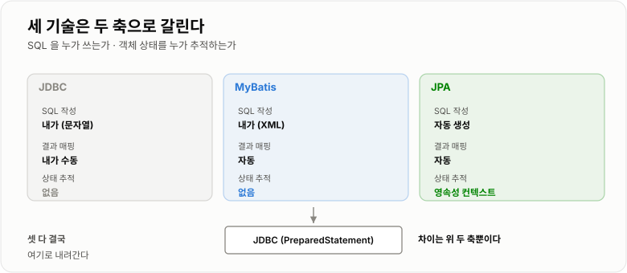
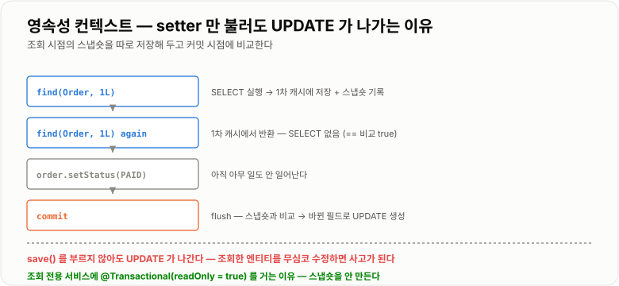
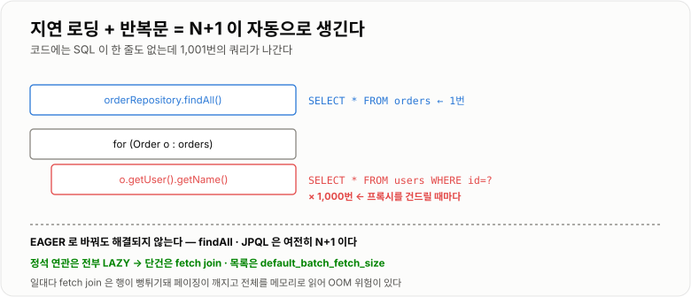

# JDBC · MyBatis · JPA

> **셋 다 결국 JDBC로 SQL을 보낸다. 차이는 "SQL을 누가 쓰는가"와 "객체 상태를 누가 추적하는가"뿐이다. JPA가 편한 이유와 위험한 이유가 모두 영속성 컨텍스트라는 한 가지 장치에서 나온다.**

---

## 1. 핵심 요약

**JPA를 쓰면 SQL이 눈에 안 보이는데, 안 보인다고 없는 게 아니다. 영속성 컨텍스트가 언제 SQL을 만들어 보내는지 모르면 N+1과 예상 못 한 UPDATE가 그대로 성능 사고가 된다.**

### 한눈에 보기

* **셋 다 바닥은 JDBC다.** MyBatis와 JPA는 JDBC 위에 얹힌 층이고, 결국 `PreparedStatement`로 SQL을 보낸다.
* **차이는 두 가지뿐이다.** SQL을 **내가 쓰는가(JDBC·MyBatis)** vs **자동 생성하는가(JPA)**, 그리고 **객체 상태를 추적하는가(JPA만)**.
* **영속성 컨텍스트는 "1차 캐시 + 변경 추적 장부"** 다. JPA의 편리함과 함정이 전부 여기서 나온다.
* **`setter`만 불러도 UPDATE가 나간다(변경 감지).** 조회한 엔티티를 무심코 수정하면 의도치 않은 UPDATE가 발생한다.
* **JPA의 N+1은 자동으로 생긴다.** 지연 로딩된 연관을 반복문에서 건드리면 조회할 때마다 쿼리가 나간다.
* 실측에서 사용자 1,000명의 주문을 읽을 때 **N+1이 15.2 ms, 조인 한 번이 0.7 ms로 21.3배** 차이가 났다.
* **`IN` 절로 묶으면 1.2 ms(12.5배)** 다. JPA의 `batch_fetch_size`가 이 방식이고, **페이징과 함께 쓸 수 있어** 목록 조회의 정석이다.
* **`PreparedStatement` 재사용이 4.9배 빨랐고**(53.5 ms → 11.0 ms), 무엇보다 **SQL 인젝션을 막는다**(실측 1,000명 노출 vs 0명).
* **벌크 연산은 영속성 컨텍스트를 우회한다.** `UPDATE ... SET`을 JPQL로 날리면 1차 캐시의 엔티티는 옛날 값을 그대로 들고 있다.
* **커밋 횟수를 줄이는 것이 배치보다 효과가 컸다**(24.4 ms → 6.8 ms, 3.6배).

> 이 노트의 수치는 **H2 1.4.200 + JDK 17.0.12**에서 JDBC 수준으로 직접 측정했다. JPA의 N+1도 결국 이 JDBC 왕복이므로 같은 성질이다. **H2는 인메모리라 네트워크 왕복이 없어, 실제 원격 DB에서는 격차가 훨씬 커진다.**

### 무엇을 해결하는가

#### JDBC만 있을 때

```java
public Order findById(long id) {
    String sql = "SELECT id, user_id, amount, status FROM orders WHERE id = ?";
    try (Connection conn = dataSource.getConnection();
         PreparedStatement ps = conn.prepareStatement(sql)) {

        ps.setLong(1, id);
        try (ResultSet rs = ps.executeQuery()) {
            if (!rs.next()) {
                return null;
            }
            Order order = new Order();
            order.setId(rs.getLong("id"));            // 컬럼 하나하나
            order.setUserId(rs.getLong("user_id"));   // 직접 꺼내서
            order.setAmount(rs.getInt("amount"));     // 직접 넣는다
            order.setStatus(OrderStatus.valueOf(rs.getString("status")));
            return order;
        }
    } catch (SQLException e) {
        throw new DataAccessException("주문 조회 실패", e);
    }
}
```

```text
문제 1  ResultSet → 객체 변환 코드가 테이블마다, 쿼리마다 반복된다
문제 2  컬럼을 하나 추가하면 관련 코드를 전부 찾아 고쳐야 한다
문제 3  SQLException 이 checked 라 try-catch 가 사방에 생긴다
문제 4  컬럼명을 문자열로 쓰므로 오타가 컴파일 시점에 안 잡힌다
문제 5  단순 CRUD 도 20줄씩 든다
```

#### MyBatis가 걷어내는 것

```xml
<select id="findById" resultType="Order">
    SELECT id, user_id AS userId, amount, status
    FROM orders WHERE id = #{id}
</select>
```

```java
Order order = orderMapper.findById(id);
```

```text
해결: 매핑 코드와 자원 관리, 예외 변환이 사라진다
유지: SQL 은 여전히 내가 쓴다   ← 이게 장점이자 단점이다
```

#### JPA가 더 걷어내는 것

```java
Order order = orderRepository.findById(id).orElseThrow();
order.setStatus(OrderStatus.PAID);      // UPDATE 문을 쓰지 않았는데
// 트랜잭션이 끝나면 UPDATE 가 나간다
```

```text
해결: SQL 자체를 안 쓴다. 객체를 다루면 JPA 가 SQL 로 번역한다
대가: "언제 어떤 SQL 이 나가는지" 를 알아야 한다
      → 모르면 N+1 과 의도치 않은 UPDATE 가 그대로 사고가 된다
```

---

## 2. 동작 원리

### 핵심 구성 요소

| 개념                    | 한 문장 정의                            | 왜 중요한가                       |
| --------------------- | ---------------------------------- | ---------------------------- |
| **JDBC**              | 자바 표준 DB 접근 API                    | 셋 다 결국 이것으로 내려간다             |
| **`PreparedStatement`** | 미리 파싱된 SQL에 값만 바인딩                 | 성능 + **SQL 인젝션 방어**          |
| **MyBatis Mapper**    | SQL과 자바 메서드를 연결한 것                 | SQL을 내가 통제한다                 |
| **`EntityManager`**   | JPA의 작업 창구                         | 영속성 컨텍스트를 다루는 손잡이            |
| **영속성 컨텍스트**          | **엔티티를 보관하며 상태를 추적하는 공간**          | **JPA의 모든 것이 여기서 나온다**       |
| **1차 캐시**             | 같은 트랜잭션에서 같은 ID는 DB를 다시 안 간다       | 동일성 보장                       |
| **변경 감지**             | 스냅숏과 비교해 바뀐 필드를 UPDATE로 만드는 것      | **setter만 불러도 UPDATE가 나간다**  |
| **쓰기 지연**             | SQL을 모아 뒀다 flush 시점에 보내는 것         | 배치가 가능해지는 근거                 |
| **flush**             | 쌓인 변경을 DB에 반영하는 것 (커밋 아님)          | 커밋·JPQL 실행 전에 자동 발생          |
| **지연 로딩**             | 연관 객체를 실제로 쓸 때 조회하는 것              | **N+1의 직접 원인**               |
| **fetch join**        | 연관을 한 번의 조인으로 함께 읽는 것              | N+1 해결책 (단, 페이징 주의)          |
| **`batch_fetch_size`** | 지연 로딩을 `IN` 절로 묶어서 읽는 것            | **페이징과 함께 쓸 수 있는 해결책**       |
| **벌크 연산**             | JPQL `UPDATE`/`DELETE`로 한 번에 처리    | **영속성 컨텍스트를 우회한다**           |

### 내부 동작 과정

#### 세 가지가 어디에 위치하는가

```text
      내 코드
         │
    ┌────┴─────┬──────────┐
    │          │          │
  JDBC      MyBatis      JPA
    │          │          │
    │          └──────────┤   MyBatis·JPA 는 결국
    │                     │   JDBC 로 내려간다
    └─────────┬───────────┘
              ▼
         JDBC (PreparedStatement)
              ▼
         커넥션 풀 → DB
```



*SQL을 누가 쓰는가와 객체 상태를 누가 추적하는가 — 이 두 축이 셋을 가른다.*

| 축              | JDBC   | MyBatis    | JPA           |
| -------------- | ------ | ---------- | ------------- |
| **SQL 작성**     | 내가     | 내가         | **JPA가 생성**   |
| **결과 매핑**      | 내가     | **자동**     | **자동**        |
| **객체 상태 추적**   | 없음     | 없음         | **영속성 컨텍스트**  |
| **DB 방언 대응**   | 내가     | 내가         | **자동**        |

#### 영속성 컨텍스트 — JPA의 심장

```text
트랜잭션 시작
   │
   ├─ find(Order, 1L)
   │     ① 1차 캐시에 있나?  없다 → SELECT 실행
   │     ② 엔티티를 1차 캐시에 넣는다
   │     ③ 이때의 값을 스냅숏으로 따로 저장한다   ← 변경 감지의 근거
   │
   ├─ find(Order, 1L)   다시 호출
   │     → 1차 캐시에 있다 → SELECT 안 나간다
   │     → 같은 인스턴스를 준다 (order1 == order2 가 true)
   │
   ├─ order.setStatus(PAID)
   │     → 아무 일도 안 일어난다 (아직)
   │
   └─ 커밋
         ① flush — 스냅숏과 현재 값을 비교한다
         ② 다른 필드를 찾으면 UPDATE 문을 만든다
         ③ 쌓아 둔 SQL 을 한꺼번에 보낸다
         ④ 커밋
```



*`setter`를 부른 것만으로 UPDATE가 나가는 이유는 조회 시점의 스냅숏과 비교하기 때문이다.*

**변경 감지가 만드는 실무 함정**

```java
@Transactional
public OrderResponse findOrder(long id) {
    Order order = orderRepository.findById(id).orElseThrow();
    order.setViewCount(order.getViewCount() + 1);   // 조회수만 올리려 했는데
    return OrderResponse.from(order);
    // 트랜잭션 커밋 시 UPDATE 가 나간다 — 의도한 것이면 OK
}
```

```java
@Transactional
public OrderResponse findOrder(long id) {
    Order order = orderRepository.findById(id).orElseThrow();
    order.setStatus(calculateDisplayStatus(order));  // 화면 표시용으로만 바꿨는데
    return OrderResponse.from(order);
    // → DB 의 status 가 실제로 바뀐다!  의도치 않은 UPDATE
}
```

**조회 전용 메서드에 `@Transactional(readOnly = true)`를 거는 이유**가 이것이다. 읽기 전용이면 스냅숏을 만들지 않아 변경 감지가 동작하지 않고, 메모리도 아낀다.

#### flush는 커밋이 아니다

```text
flush   쌓인 SQL 을 DB 로 보낸다      (아직 커밋 안 됨, 롤백 가능)
commit  트랜잭션을 확정한다           (flush 를 먼저 하고 커밋)

flush 가 자동으로 일어나는 시점
  ① 트랜잭션 커밋 직전
  ② JPQL·네이티브 쿼리 실행 직전   ← 이게 중요하다
  ③ 명시적 flush() 호출
```

**② 때문에 헷갈리는 상황이 생긴다.**

```java
Order order = new Order(...);
em.persist(order);                        // 아직 INSERT 안 나감 (쓰기 지연)

// JPQL 실행 → 그 전에 flush 가 자동 발생 → INSERT 가 먼저 나간다
List<Order> orders = em.createQuery("SELECT o FROM Order o", Order.class)
                       .getResultList();
// 방금 persist 한 것도 조회된다
```

JPA가 **JPQL 실행 전에 flush를 하는 이유**는, 안 하면 방금 저장한 데이터가 조회 결과에서 빠져 결과가 어긋나기 때문이다.

#### N+1은 왜 자동으로 생기는가

```java
@Entity
public class Order {
    @ManyToOne(fetch = FetchType.LAZY)     // 지연 로딩
    private User user;
}
```

```java
List<Order> orders = orderRepository.findAll();      // ① SELECT * FROM orders
for (Order order : orders) {
    System.out.println(order.getUser().getName());   // ② 여기서 매번 SELECT!
}
```

```text
① 주문 1,000건 조회             SELECT 1번
② 각 주문의 user 를 처음 건드릴 때  SELECT 1,000번

  총 1,001번

  지연 로딩이라 프록시만 들고 있다가
  실제로 필드를 읽는 순간 DB 를 다녀오기 때문이다
```

**실측 결과 (사용자 1,000명, 주문 5,000건 — JDBC 수준)**

| 방식               | 쿼리 수      | 시간          | 배수         |
| ---------------- | --------- | ----------- | ---------- |
| **N+1**          | 1 + 1,000 | **15.2 ms** | 기준         |
| **`IN` 절로 묶기**   | 1 + 1     | **1.2 ms**  | **12.5배**  |
| **조인 한 번**       | 1         | **0.7 ms**  | **21.3배**  |



*프록시를 건드릴 때마다 DB를 다녀온다 — 코드에는 SQL이 한 줄도 없는데 1,001번의 쿼리가 나간다.*

**즉시 로딩(EAGER)으로 바꾸면 해결되는가? 아니다.**

```text
FetchType.EAGER 로 바꾸면
  · findById() 는 조인으로 한 번에 가져온다  → 해결된 것처럼 보인다
  · 하지만 findAll() 이나 JPQL 은 여전히 N+1 이 난다
  · 게다가 항상 연관을 가져오므로 안 쓸 때도 조인 비용을 낸다

  → 연관관계는 전부 LAZY 로 두고, 필요할 때 fetch join 이나
    batch_fetch_size 로 해결하는 것이 정석이다
```

#### fetch join과 batch fetch — 어느 쪽을 쓸까

```java
// fetch join — 조인 한 번으로 함께 읽는다
@Query("SELECT o FROM Order o JOIN FETCH o.user")
List<Order> findAllWithUser();
```

```text
장점  쿼리 1번. 가장 빠르다 (실측 0.7 ms)
단점  일대다(컬렉션) fetch join 은 페이징이 깨진다
```

**일대다 fetch join에서 페이징이 깨지는 이유**

```text
User 1명에 Order 5건이면 조인 결과는 5행이 된다
   ↓
LIMIT 10 을 걸면 User 2명분만 나온다
   ↓
"사용자 10명" 을 원했는데 2명만 온다
   ↓
Hibernate 는 이걸 알기 때문에 경고를 남기고
   전체를 메모리로 읽어 애플리케이션에서 페이징한다
   → firstResult/maxResults specified with collection fetch; applying in memory
   → 데이터가 많으면 그대로 OutOfMemoryError
```

```yaml
# batch fetch — 지연 로딩을 IN 절로 묶는다
spring:
  jpa:
    properties:
      hibernate:
        default_batch_fetch_size: 500
```

```text
효과
  SELECT * FROM users WHERE id = ?     × 1,000번
     ↓
  SELECT * FROM users WHERE id IN (?, ?, ... )   × 2번 (500개씩)

장점  페이징과 함께 쓸 수 있다. 실측 12.5배 개선
단점  쿼리가 2번 나간다 (fetch join 보다는 느리다)

  → 목록 조회의 정석은 이쪽이다
```

#### 벌크 연산은 영속성 컨텍스트를 우회한다

```java
@Modifying
@Query("UPDATE Order o SET o.status = 'CANCELED' WHERE o.createdAt < :date")
int cancelOldOrders(@Param("date") LocalDateTime date);
```

```text
이 SQL 은 DB 로 바로 나간다.
영속성 컨텍스트는 이 사실을 모른다.

  Order order = repository.findById(1L).get();   // status = PAID, 1차 캐시에 저장
  repository.cancelOldOrders(어제);               // DB 에서는 CANCELED 로 바뀜
  order.getStatus();                             // 여전히 PAID!  (1차 캐시의 옛 값)

  → @Modifying(clearAutomatically = true) 로 영속성 컨텍스트를 비운다
```

---

## 3. 특징과 비교

| 구분          | 내용                                       |
| ----------- | ---------------------------------------- |
| **장점**      | JDBC는 완전한 통제, MyBatis는 **SQL 통제 + 매핑 자동화**, JPA는 **SQL 자체를 안 써도 되고** 변경 감지·1차 캐시로 코드가 크게 준다. |
| **단점**      | JDBC는 배관 코드가 많고, MyBatis는 SQL이 늘수록 XML이 방대해지며, JPA는 **어떤 SQL이 언제 나가는지 안 보여** N+1과 의도치 않은 UPDATE가 사고가 된다. |
| **적합한 상황**  | 단순 CRUD가 많고 도메인 중심이면 **JPA**, 복잡한 통계·튜닝이 중요하면 **MyBatis**, 극한의 제어가 필요하면 **JDBC**. 섞어 쓰는 것이 실무 표준이다. |
| **주의할 상황**  | **JPA로 복잡한 통계 쿼리를 짜는 것**, 조회 메서드에 `readOnly`를 안 거는 것, 벌크 연산 후 영속성 컨텍스트를 안 비우는 것. |

### 성능 특성

| 항목                                | 실측                          |
| --------------------------------- | --------------------------- |
| **N+1 vs 조인** (1,000명)            | 15.2 ms → **0.7 ms (21.3배)** |
| **N+1 vs `IN` 절**                 | 15.2 ms → **1.2 ms (12.5배)** |
| **`Statement` vs `PreparedStatement`** | 53.5 ms → **11.0 ms (4.9배)** |
| **매번 커밋 vs 한 번 커밋** (1,000건)      | 24.4 ms → **6.8 ms (3.6배)** |
| `addBatch` + 한 번 커밋               | 9.4 ms (인메모리라 배치 이득 없음)     |

**두 가지를 정직하게 짚어야 한다.**

```text
① H2 인메모리라 네트워크 왕복이 0이다
   원격 MySQL 이면 쿼리마다 왕복이 붙어 N+1 격차가 수백~수천 배가 된다
   → 21.3배는 "가장 관대한 조건에서의 최소치"다

② 배치가 오히려 느렸다 (6.8 ms → 9.4 ms)
   배치의 이득은 왕복 횟수 감소인데 인메모리는 왕복이 없다
   → 개선의 본체는 배치가 아니라 커밋 횟수 감소였다
   → 원격 DB 에서는 배치도 확실히 유리하다
```

**JPA 고유의 성능 특성**

```text
1차 캐시    같은 트랜잭션에서 같은 ID 는 SELECT 를 다시 안 한다
쓰기 지연    SQL 을 모았다 한 번에 보내 왕복이 준다
변경 감지    스냅숏 비교 비용이 든다 → readOnly 면 스냅숏을 안 만든다
프록시      지연 로딩 객체는 실제 클래스가 아니다 (== 비교 주의)
```

### 장점과 단점

| 장점                        | 이유                                    |
| ------------------------- | ------------------------------------- |
| 매핑 코드가 사라진다 (MyBatis·JPA) | `ResultSet` → 객체 변환을 프레임워크가 한다.       |
| SQL을 안 써도 된다 (JPA)        | 기본 CRUD와 조건 조회를 메서드 이름으로 만든다.         |
| 1차 캐시로 중복 조회가 없다 (JPA)    | 같은 트랜잭션에서 같은 ID는 한 번만 읽는다.            |
| 변경 감지로 UPDATE가 자동이다 (JPA) | 바뀐 필드만 골라 UPDATE를 만든다.                |
| DB를 바꿔도 코드가 안 바뀐다 (JPA)   | 방언(dialect)이 흡수한다.                    |
| SQL을 완전히 통제한다 (MyBatis)   | 복잡한 통계·힌트·DB 고유 기능을 그대로 쓴다.           |

| 단점                        | 이유 및 주의점                                    |
| ------------------------- | ------------------------------------------ |
| **어떤 SQL이 나가는지 안 보인다**    | JPA에서 N+1이 자동으로 생긴다. 실측 21.3배 손해.          |
| **의도치 않은 UPDATE가 나간다**    | 조회한 엔티티를 수정하면 커밋 시 반영된다.                   |
| 지연 로딩이 트랜잭션 밖에서 터진다       | `LazyInitializationException`.             |
| **벌크 연산이 1차 캐시와 어긋난다**    | DB는 바뀌었는데 엔티티는 옛 값을 들고 있다.                 |
| 일대다 fetch join은 페이징이 깨진다  | 전체를 메모리로 읽어 OOM 위험.                        |
| 복잡한 통계 쿼리에 약하다 (JPA)      | JPQL로 표현이 어렵거나 비효율적이다.                     |
| SQL이 늘면 XML이 방대해진다 (MyBatis) | 동적 SQL이 복잡해지면 읽기 어려워진다.                    |
| 컴파일 시점 검증이 약하다 (MyBatis)  | SQL 오타를 실행해 봐야 안다.                         |

### 어떤 상황에서 고르는가

#### 무엇을 쓸까

```text
도메인 로직이 중심이고 CRUD 가 많다      → JPA
복잡한 통계·집계·리포트가 중심이다         → MyBatis (또는 JPA + 네이티브 쿼리)
DB 고유 기능·힌트를 정밀하게 써야 한다      → MyBatis / JDBC
대량 배치 처리                          → JDBC (JdbcTemplate.batchUpdate)

  실무 표준은 "섞어 쓰기"다
    · 기본 CRUD·도메인 조작 → JPA
    · 복잡한 조회 → QueryDSL 이나 MyBatis
    · 대량 처리 → JdbcTemplate
```

#### N+1 해결책 고르기

```text
단건 또는 소량 조회         → fetch join (가장 빠르다)
목록 + 페이징              → batch_fetch_size (IN 절)   ← 정석
컬렉션이 여러 개            → batch_fetch_size (fetch join 은 하나만 가능)
조회 전용 화면              → DTO 프로젝션 (엔티티를 아예 안 만든다)
```

#### 트랜잭션과 조회 설계

```text
조회 전용 서비스는 클래스 단위로 readOnly = true
   → 변경 감지 스냅숏을 안 만들어 메모리·CPU 절약
   → 실수로 쓰기가 들어가면 드러난다

open-in-view 는 false 로 둔다
   → 기본값 true 는 요청 끝까지 커넥션을 붙잡는다
   → 끄면 지연 로딩이 트랜잭션 밖에서 터지는데
     그게 오히려 "여기서 이미 로딩했어야 한다"는 신호가 된다
```

### 비슷한 기술과 비교

#### JDBC vs MyBatis vs JPA

| 기준            | JDBC             | MyBatis           | JPA                |
| ------------- | ---------------- | ----------------- | ------------------ |
| **SQL 작성**    | 내가 (문자열)         | **내가 (XML/애너테이션)** | **자동 생성**          |
| **결과 매핑**     | 내가 수동            | 자동                | 자동                 |
| **상태 추적**     | 없음               | 없음                | **영속성 컨텍스트**       |
| **학습 곡선**     | 낮다               | 낮다                | **높다**             |
| **성능 통제**     | **완전하다**         | **거의 완전하다**       | 제한적 (튜닝 지식 필요)     |
| **장점**        | 제어가 완전하다         | SQL 통제 + 매핑 자동화   | 코드가 극적으로 줄고 DB 독립적 |
| **단점**        | 배관 코드가 많다        | SQL 관리 부담         | **SQL이 안 보여 사고가 남** |
| **선택 기준**     | 대량 배치, 극한의 제어    | 복잡한 조회·통계         | **도메인 중심 CRUD**    |

#### fetch join vs batch fetch vs DTO 프로젝션

| 기준         | fetch join      | `batch_fetch_size` | DTO 프로젝션         |
| ---------- | --------------- | ------------------ | ---------------- |
| **쿼리 수**   | **1번**          | 1 + 1번             | **1번**           |
| **실측 시간**  | **0.7 ms**      | 1.2 ms             | (조인과 유사)         |
| **페이징**    | **일대다에서 깨진다**   | **가능**             | **가능**           |
| **엔티티 관리** | 영속 상태 (수정 가능)   | 영속 상태              | **비영속 (읽기 전용)**  |
| **장점**     | 가장 빠르다          | 페이징과 양립            | 필요한 컬럼만 읽는다      |
| **단점**     | 컬렉션은 하나만, 페이징 X | 쿼리 2번              | 수정 불가            |
| **선택 기준**  | 단건·소량           | **목록 + 페이징**       | **조회 전용 화면**     |

#### 지연 로딩 vs 즉시 로딩

| 기준        | `LAZY` (지연)              | `EAGER` (즉시)         |
| --------- | ------------------------ | -------------------- |
| **조회 시점** | 실제로 쓸 때                  | 엔티티 조회 시 함께          |
| **장점**    | 안 쓰면 조회 안 한다             | 단건 조회 시 N+1이 없다      |
| **단점**    | **반복문에서 N+1**            | **JPQL에서는 여전히 N+1**, 항상 조인 비용 |
| **선택 기준** | **전부 LAZY로 두고 필요할 때 해결** | 쓰지 않는다               |

---

## 4. 실무 주의사항

### 백엔드 실무 적용

#### 조회 전용에는 반드시 `readOnly`

```java
@Service
@Transactional(readOnly = true)          // 클래스 기본값
public class OrderQueryService {

    private final OrderRepository orderRepository;

    public OrderQueryService(OrderRepository orderRepository) {
        this.orderRepository = orderRepository;
    }

    public OrderResponse findOne(long id) {
        Order order = orderRepository.findById(id)
                .orElseThrow(() -> new NotFoundException("주문 없음: " + id));
        return OrderResponse.from(order);
        // readOnly 라 스냅숏이 없다 → 실수로 setter 를 불러도 UPDATE 가 안 나간다
    }

    @Transactional                        // 쓰기 메서드만 재정의
    public void updateMemo(long id, String memo) {
        Order order = orderRepository.findById(id).orElseThrow();
        order.updateMemo(memo);           // 변경 감지로 UPDATE
    }
}
```

#### N+1을 없애는 실제 코드

```java
public interface OrderRepository extends JpaRepository<Order, Long> {

    /** 단건·소량 — fetch join 이 가장 빠르다. */
    @Query("SELECT o FROM Order o JOIN FETCH o.user WHERE o.id = :id")
    Optional<Order> findByIdWithUser(@Param("id") long id);

    /**
     * 목록 + 페이징 — 컬렉션은 fetch join 하지 않는다.
     * 연관은 default_batch_fetch_size 가 IN 절로 묶어 준다.
     */
    @Query("SELECT o FROM Order o JOIN FETCH o.user")
    Page<Order> findAllWithUser(Pageable pageable);
}
```

```yaml
spring:
  jpa:
    properties:
      hibernate:
        default_batch_fetch_size: 500     # 이것 하나로 대부분의 N+1이 해결된다
    open-in-view: false
```

```text
default_batch_fetch_size 는
"거의 공짜로 얻는 성능 개선"이라 기본으로 켜 두기를 권한다.

  없으면   SELECT ... WHERE id = ?   × 1,000
  있으면   SELECT ... WHERE id IN (?, ...)  × 2
  실측 기준 12.5배
```

#### 조회 전용은 DTO로 바로 받는다

```java
public class OrderSummary {

    private final long orderId;
    private final String userName;
    private final int amount;

    public OrderSummary(long orderId, String userName, int amount) {
        this.orderId = orderId;
        this.userName = userName;
        this.amount = amount;
    }

    public long getOrderId()    { return orderId; }
    public String getUserName() { return userName; }
    public int getAmount()      { return amount; }
}
```

```java
public interface OrderRepository extends JpaRepository<Order, Long> {

    @Query("SELECT new com.example.dto.OrderSummary(o.id, o.user.name, o.amount) "
         + "FROM Order o")
    List<OrderSummary> findSummaries();
}
```

```text
이점
  · 필요한 컬럼만 읽는다 (SELECT * 를 안 한다)
  · 엔티티를 만들지 않아 1차 캐시·스냅숏 비용이 없다
  · 비영속이라 실수로 수정해도 UPDATE 가 안 나간다
  · N+1 이 원천적으로 없다

  → 조회 전용 화면은 이 방식이 가장 안전하고 빠르다
```

#### 벌크 연산 후에는 반드시 컨텍스트를 비운다

```java
public interface OrderRepository extends JpaRepository<Order, Long> {

    /**
     * clearAutomatically = true 가 없으면
     * 1차 캐시의 엔티티가 옛 값을 그대로 들고 있게 된다.
     */
    @Modifying(clearAutomatically = true)
    @Query("UPDATE Order o SET o.status = 'CANCELED' "
         + "WHERE o.status = 'PENDING' AND o.createdAt < :threshold")
    int cancelStaleOrders(@Param("threshold") LocalDateTime threshold);
}
```

```text
clearAutomatically 를 켜면 영속성 컨텍스트가 비워진다
   → 그 뒤에 쓰던 엔티티 참조는 준영속 상태가 된다
   → 벌크 연산은 트랜잭션의 마지막에 두는 것이 안전하다
```

#### 대량 처리는 JPA로 하지 않는다

```java
// 나쁜 예 — 10만 건을 JPA 로
@Transactional
public void importAll(List<OrderData> data) {
    for (OrderData d : data) {
        orderRepository.save(new Order(d));     // 영속성 컨텍스트에 10만 개가 쌓인다
    }
    // → 메모리 폭증, flush 시 스냅숏 비교도 10만 번
}
```

```java
// 좋은 예 — JdbcTemplate 배치
@Service
public class OrderBatchImporter {

    private final JdbcTemplate jdbcTemplate;

    public OrderBatchImporter(JdbcTemplate jdbcTemplate) {
        this.jdbcTemplate = jdbcTemplate;
    }

    @Transactional
    public void importAll(List<OrderData> data) {
        jdbcTemplate.batchUpdate(
                "INSERT INTO orders (user_id, amount, status) VALUES (?, ?, ?)",
                data,
                500,                                  // 500건씩 나눠 보낸다
                (ps, item) -> {
                    ps.setLong(1, item.getUserId());
                    ps.setInt(2, item.getAmount());
                    ps.setString(3, item.getStatus());
                });
    }
}
```

```text
MySQL 이면 URL 에 rewriteBatchedStatements=true 를 반드시 붙인다
  이게 없으면 addBatch 를 써도 실제로는 한 건씩 나간다

실측 (1,000건, H2)
  매번 커밋 24.4 ms → 한 번 커밋 6.8 ms  (3.6배)
```

#### 문자열 조립을 하지 않는다

**실측으로 확인한 SQL 인젝션**

```text
입력값:  user1' OR '1'='1

문자열 조립       → 1000명 조회됨   ← 전체 테이블이 뚫렸다
PreparedStatement → 0명            ← 값으로 취급되어 막혔다
```

```java
// MyBatis — ${} 와 #{} 를 구분한다
```

```xml
<!-- 위험 — ${} 는 문자열을 그대로 끼워 넣는다 -->
<select id="findByName" resultType="User">
    SELECT * FROM users WHERE name = '${name}'
</select>

<!-- 안전 — #{} 는 PreparedStatement 파라미터가 된다 -->
<select id="findByName" resultType="User">
    SELECT * FROM users WHERE name = #{name}
</select>
```

```text
${} 를 써야만 하는 경우 (컬럼명·정렬 방향 등 값이 아닌 것)
  → 반드시 허용 목록(whitelist)으로 검증한다

  private static final Set<String> SORTABLE =
          Set.of("created_at", "amount", "id");

  if (!SORTABLE.contains(sortColumn)) {
      throw new IllegalArgumentException("정렬 불가 컬럼: " + sortColumn);
  }
```

#### `LazyInitializationException` 다루기

```java
// 문제 — 트랜잭션 밖에서 지연 로딩을 건드린다
@Transactional
public Order find(long id) {
    return orderRepository.findById(id).orElseThrow();
}

// 컨트롤러에서
Order order = orderService.find(1L);
order.getUser().getName();      // LazyInitializationException!
```

```java
// 해결 — 트랜잭션 안에서 DTO 로 변환해 내보낸다
@Transactional(readOnly = true)
public OrderResponse find(long id) {
    Order order = orderRepository.findByIdWithUser(id)     // fetch join
            .orElseThrow(() -> new NotFoundException("주문 없음"));
    return OrderResponse.from(order);                       // 여기서 필요한 값을 다 꺼낸다
}
```

**`open-in-view: true`로 두면 이 예외가 안 나지만**, 요청이 끝날 때까지 커넥션을 붙잡는 대가를 치른다. **예외가 나는 편이 낫다** — "여기서 이미 로딩했어야 한다"는 신호이기 때문이다.

### 자주 하는 오해

| 잘못된 이해                              | 올바른 이해                                                             |
| ----------------------------------- | ------------------------------------------------------------------ |
| JPA를 쓰면 SQL을 몰라도 된다                 | **정반대다.** SQL이 안 보이기 때문에 오히려 더 잘 알아야 N+1과 의도치 않은 UPDATE를 잡는다.     |
| `setter`를 불러도 `save()`를 안 하면 안 바뀐다  | **변경 감지로 UPDATE가 나간다.** 조회한 엔티티를 수정하면 커밋 시 반영된다.                  |
| N+1은 코드를 잘못 짜서 생긴다                  | 지연 로딩 + 반복문이면 **자동으로 생긴다.** 코드에 SQL이 한 줄도 없는데 1,001번이 나간다.        |
| `EAGER`로 바꾸면 N+1이 해결된다              | `findById`만 해결된다. **`findAll`·JPQL은 여전히 N+1**이고 항상 조인 비용을 낸다.     |
| fetch join이 항상 최선이다                 | **일대다에서 페이징이 깨진다.** 전체를 메모리로 읽어 OOM 위험. 목록은 `batch_fetch_size`.   |
| 벌크 연산도 1차 캐시에 반영된다                  | **우회한다.** DB는 바뀌었는데 엔티티는 옛 값을 들고 있다. `clearAutomatically` 필요.     |
| `flush()`는 커밋이다                     | **아니다.** SQL을 보낼 뿐 아직 롤백할 수 있다. JPQL 실행 전에도 자동 발생한다.              |
| JPA로 대량 INSERT를 해도 된다               | 영속성 컨텍스트에 전부 쌓여 **메모리가 터진다.** `JdbcTemplate.batchUpdate`를 쓴다.      |
| `open-in-view: true`가 편하니 켜 두면 된다   | 요청 끝까지 **커넥션을 붙잡아** 풀이 마른다. 끄면 문제가 드러나 오히려 낫다.                    |
| MyBatis의 `${}`와 `#{}`는 비슷하다         | **`${}`는 문자열을 그대로 끼워 넣어 SQL 인젝션에 뚫린다**(실측 1,000명 노출). `#{}`를 쓴다.  |
| 배치 INSERT는 항상 빠르다                   | 왕복이 없으면 이득이 없다(실측 인메모리에서 오히려 느림). 개선의 본체는 **커밋 횟수 감소**(3.6배).     |
| 조회 전용에 `readOnly`를 안 걸어도 상관없다       | 스냅숏 생성 비용이 들고, **실수로 부른 `setter`가 그대로 UPDATE**가 된다.                |

---

## 5. 예제

### 같은 조회를 세 가지로 구현하기

```java
// ① JDBC — 전부 직접 한다
public List<Order> findByUserId(long userId) {
    String sql = "SELECT id, user_id, amount, status FROM orders WHERE user_id = ?";
    List<Order> orders = new ArrayList<Order>();

    try (Connection conn = dataSource.getConnection();
         PreparedStatement ps = conn.prepareStatement(sql)) {

        ps.setLong(1, userId);
        try (ResultSet rs = ps.executeQuery()) {
            while (rs.next()) {
                Order order = new Order();
                order.setId(rs.getLong("id"));
                order.setUserId(rs.getLong("user_id"));
                order.setAmount(rs.getInt("amount"));
                order.setStatus(OrderStatus.valueOf(rs.getString("status")));
                orders.add(order);
            }
        }
    } catch (SQLException e) {
        throw new DataAccessException("주문 조회 실패: userId=" + userId, e);
    }
    return orders;
}
```

```xml
<!-- ② MyBatis — SQL 은 내가, 매핑은 자동 -->
<select id="findByUserId" resultType="com.example.domain.Order">
    SELECT id, user_id AS userId, amount, status
    FROM orders
    WHERE user_id = #{userId}
</select>
```

```java
// ③ JPA — 메서드 이름으로 SQL 이 만들어진다
public interface OrderRepository extends JpaRepository<Order, Long> {
    List<Order> findByUserId(long userId);
}
```

### 영속성 컨텍스트 동작 확인하기

```java
@SpringBootTest
class PersistenceContextTest {

    @Autowired
    private EntityManager em;

    @Test
    @Transactional
    void 같은_ID는_같은_인스턴스다() {
        Order first = em.find(Order.class, 1L);     // SELECT 발생
        Order second = em.find(Order.class, 1L);    // 1차 캐시 — SELECT 없음

        assertThat(first).isSameAs(second);          // == 비교가 참이다
    }

    @Test
    @Transactional
    void setter만_불러도_UPDATE가_나간다() {
        Order order = em.find(Order.class, 1L);
        order.setStatus(OrderStatus.PAID);           // save() 를 부르지 않았다

        em.flush();                                  // 여기서 UPDATE 가 나간다

        // 로그에서 update orders set status=? where id=? 를 확인할 수 있다
    }

    @Test
    @Transactional
    void 벌크연산은_1차캐시를_모른다() {
        Order order = em.find(Order.class, 1L);
        assertThat(order.getStatus()).isEqualTo(OrderStatus.PENDING);

        em.createQuery("UPDATE Order o SET o.status = 'CANCELED' WHERE o.id = 1")
          .executeUpdate();                          // DB 는 CANCELED

        assertThat(order.getStatus()).isEqualTo(OrderStatus.PENDING);   // 여전히 옛 값!

        em.clear();                                  // 컨텍스트를 비우면
        Order reloaded = em.find(Order.class, 1L);   // 다시 읽는다
        assertThat(reloaded.getStatus()).isEqualTo(OrderStatus.CANCELED);
    }
}
```

**이 세 테스트를 한 번 돌려 보면 JPA의 동작이 손에 잡힌다.**

### N+1을 테스트로 막기

```java
@SpringBootTest
class OrderRepositoryTest {

    @Autowired
    private OrderRepository orderRepository;

    @Autowired
    private EntityManager em;

    @Test
    @Transactional
    void 주문_목록_조회에_N_플러스_1이_없어야_한다() {
        SessionStatistics before = statistics();

        List<Order> orders = orderRepository.findAllWithUser();
        for (Order order : orders) {
            order.getUser().getName();               // 연관을 건드린다
        }

        long queryCount = statistics().getQueryCount() - before.getQueryCount();

        assertThat(queryCount)
                .as("N+1이 생기면 이 테스트가 깨진다")
                .isLessThanOrEqualTo(2);
    }
}
```

```text
Hibernate 의 Statistics 를 켜면 쿼리 수를 셀 수 있다

  spring.jpa.properties.hibernate.generate_statistics: true

  N+1 은 "고쳤는데 다시 생기는" 종류의 문제라
  테스트로 고정해 두는 것이 실질적이다
```

### 엔티티를 안전하게 설계하기

```java
@Entity
@Table(name = "orders")
public class Order {

    @Id
    @GeneratedValue(strategy = GenerationType.IDENTITY)
    private Long id;

    /** 연관관계는 전부 LAZY 로 둔다. */
    @ManyToOne(fetch = FetchType.LAZY)
    @JoinColumn(name = "user_id")
    private User user;

    @Column(nullable = false)
    private int amount;

    @Enumerated(EnumType.STRING)          // ORDINAL 은 순서가 바뀌면 데이터가 깨진다
    @Column(nullable = false)
    private OrderStatus status;

    /** JPA 가 요구하는 기본 생성자 — 외부에서 못 쓰게 protected. */
    protected Order() {
    }

    public Order(User user, int amount) {
        this.user = user;
        this.amount = amount;
        this.status = OrderStatus.PENDING;
    }

    /** setter 를 열지 않고 의미 있는 메서드를 준다. */
    public void pay() {
        if (status != OrderStatus.PENDING) {
            throw new IllegalStateException("결제할 수 없는 상태: " + status);
        }
        this.status = OrderStatus.PAID;
    }

    public void cancel() {
        if (status == OrderStatus.SHIPPED) {
            throw new IllegalStateException("배송 후에는 취소할 수 없습니다");
        }
        this.status = OrderStatus.CANCELED;
    }

    public Long getId()          { return id; }
    public User getUser()        { return user; }
    public int getAmount()       { return amount; }
    public OrderStatus getStatus() { return status; }
}
```

**`setter`를 열지 않는 것이 핵심이다.**

```text
public setter 를 열어 두면
  · 아무 데서나 상태를 바꿀 수 있다
  · 변경 감지 때문에 그게 곧바로 UPDATE 가 된다
  · "어디서 이 값이 바뀌었지?" 를 추적할 수 없다

  pay(), cancel() 처럼 의미 있는 메서드만 열면
  상태 전이 규칙이 엔티티 안에 모이고 검증도 함께 들어간다
```

### `@Enumerated(EnumType.ORDINAL)`의 함정

```java
// 위험 — 기본값이 ORDINAL 이다
@Enumerated                                   // = EnumType.ORDINAL
private OrderStatus status;
```

```text
ORDINAL 은 enum 의 순서(0, 1, 2)를 저장한다

  enum OrderStatus { PENDING, PAID, SHIPPED }
     PENDING=0, PAID=1, SHIPPED=2

  나중에 CANCELED 를 앞에 추가하면
  enum OrderStatus { CANCELED, PENDING, PAID, SHIPPED }
     CANCELED=0, PENDING=1, PAID=2, SHIPPED=3

  → DB 에 저장된 0 이 PENDING 이었는데 이제 CANCELED 로 읽힌다
  → 기존 데이터 전체가 조용히 틀어진다

  반드시 @Enumerated(EnumType.STRING) 을 쓴다
```

---

## 6. 면접 정리

### 자주 나오는 질문

#### 기본 질문

1. **JDBC, MyBatis, JPA는 무엇이 다른가요?**

    * 핵심 키워드: **SQL을 누가 쓰는가**(내가/내가/자동)와 **상태 추적 여부**(없음/없음/영속성 컨텍스트)

2. **영속성 컨텍스트가 무엇인가요?**

    * 핵심 키워드: **1차 캐시 + 변경 추적 장부**, 엔티티를 보관하며 스냅숏과 비교

3. **1차 캐시는 무엇을 해 주나요?**

    * 핵심 키워드: 같은 트랜잭션에서 같은 ID는 SELECT를 다시 안 함, **동일성 보장**(`==` 참)

4. **변경 감지가 무엇인가요?**

    * 핵심 키워드: 조회 시점 **스냅숏과 비교**해 바뀐 필드로 UPDATE 생성, **`save()` 없이도 나간다**

5. **`flush()`와 `commit()`은 무엇이 다른가요?**

    * 핵심 키워드: flush는 **SQL 전송**(롤백 가능), commit은 확정. **JPQL 실행 전에도 자동 flush**

6. **N+1 문제가 무엇인가요?**

    * 핵심 키워드: 목록 1번 + 연관마다 1번, **지연 로딩 + 반복문이면 자동 발생**, 실측 21.3배

7. **N+1을 어떻게 해결하나요?**

    * 핵심 키워드: **fetch join**(가장 빠름), **`batch_fetch_size`**(페이징 가능), **DTO 프로젝션**

8. **지연 로딩과 즉시 로딩 중 무엇을 쓰나요?**

    * 핵심 키워드: **전부 `LAZY`**, `EAGER`는 JPQL에서 여전히 N+1이고 항상 조인 비용

#### 꼬리 질문

1. **`EAGER`로 바꾸면 N+1이 해결되지 않나요?**

    * 핵심 키워드: **`findById`만 해결.** `findAll`·JPQL은 그대로 N+1, 게다가 안 쓸 때도 조인

2. **fetch join으로 페이징하면 어떻게 되나요?**

    * 핵심 키워드: **일대다는 행이 뻥튀기돼 깨진다.** Hibernate가 전체를 메모리로 읽어 **OOM 위험**

3. **그럼 목록 조회는 어떻게 하나요?**

    * 핵심 키워드: **`default_batch_fetch_size`** 로 `IN` 절 묶기(실측 12.5배), 페이징과 양립

4. **조회만 했는데 UPDATE가 나갔습니다. 왜죠?**

    * 핵심 키워드: **변경 감지.** 조회한 엔티티의 `setter`를 부르면 커밋 시 UPDATE. `readOnly = true`로 방지

5. **`readOnly = true`가 정확히 무엇을 하나요?**

    * 핵심 키워드: **스냅숏을 안 만든다**(메모리·CPU 절약), flush 생략, 실수 방지

6. **벌크 연산 후에 엔티티 값이 안 바뀌어 있습니다.**

    * 핵심 키워드: 벌크는 **영속성 컨텍스트를 우회**한다. `@Modifying(clearAutomatically = true)`

7. **`LazyInitializationException`은 왜 나나요?**

    * 핵심 키워드: 트랜잭션(영속성 컨텍스트) 밖에서 프록시를 건드림. **트랜잭션 안에서 DTO로 변환**

8. **`open-in-view`를 왜 끄나요?**

    * 핵심 키워드: 요청 끝까지 **커넥션 점유** → 풀이 마름. 끄면 문제가 드러나 **오히려 낫다**

9. **대량 INSERT를 JPA로 해도 되나요?**

    * 핵심 키워드: 영속성 컨텍스트에 전부 쌓여 **메모리 폭증**. `JdbcTemplate.batchUpdate` + `rewriteBatchedStatements`

10. **MyBatis의 `${}`와 `#{}`는 무엇이 다른가요?**

    * 핵심 키워드: `${}`는 **문자열 그대로 삽입 → SQL 인젝션**(실측 1,000명 노출), `#{}`는 파라미터 바인딩(0명)

11. **`@Enumerated` 기본값이 왜 위험한가요?**

    * 핵심 키워드: 기본이 **`ORDINAL`(순서 저장)**, enum에 값을 끼워 넣으면 **기존 데이터가 조용히 틀어진다**. `STRING` 필수

12. **엔티티에 `setter`를 열지 않는 이유는?**

    * 핵심 키워드: 변경 감지 때문에 **아무 데서나 부른 setter가 UPDATE**가 됨, 상태 전이 규칙을 엔티티 안에 모은다

13. **셋 중 실무에서 무엇을 쓰시겠어요?**

    * 핵심 키워드: **섞어 쓴다** — CRUD·도메인은 JPA, 복잡한 조회는 QueryDSL/MyBatis, 대량은 JdbcTemplate

### 30초 답변

> 셋 다 결국 JDBC로 SQL을 보내고, 차이는 **SQL을 내가 쓰는지 자동 생성되는지**와 **객체 상태를 추적하는지** 두 가지입니다. JPA만 **영속성 컨텍스트**를 갖는데, 여기에 엔티티를 보관하면서 조회 시점의 스냅숏과 비교하기 때문에 `setter`만 불러도 UPDATE가 나갑니다. JPA의 편리함과 위험이 전부 이 하나에서 나옵니다.

#### 이어서 더 물으면

실무에서 가장 자주 겪는 건 **N+1**입니다. 지연 로딩된 연관을 반복문에서 건드리면 코드에는 SQL이 한 줄도 없는데 **1 + N번의 쿼리**가 나갑니다. 직접 재 봤을 때 사용자 1,000명의 주문을 읽는데 N+1이 15.2 ms, `IN` 절로 묶으면 1.2 ms, 조인 한 번이면 0.7 ms로 **21.3배** 차이가 났습니다. 그런데 이건 H2 인메모리라 네트워크 왕복이 0인 조건이고, **원격 MySQL이면 쿼리마다 왕복이 붙어서 수백 배까지** 벌어집니다.

해결책을 고를 때 기준이 있습니다. **fetch join이 가장 빠르지만 일대다에서는 페이징이 깨집니다.** 조인하면 행이 뻥튀기돼서 `LIMIT 10`을 걸어도 원하는 만큼의 부모가 안 나오는데, Hibernate가 이걸 알고 전체를 메모리로 읽어서 애플리케이션에서 페이징합니다. 데이터가 많으면 그대로 OOM입니다. 그래서 **목록 조회는 `default_batch_fetch_size`로 `IN` 절 묶기**를 씁니다. 쿼리가 2번 나가지만 페이징과 양립하고, 설정 한 줄로 대부분의 N+1이 해결돼서 기본으로 켜 둡니다.

두 번째로 자주 겪는 건 **의도치 않은 UPDATE**입니다. 조회한 엔티티의 `setter`를 화면 표시용으로 불렀는데 커밋 시점에 실제 DB가 바뀌는 경우입니다. 그래서 **조회 전용 서비스에는 클래스 단위로 `readOnly = true`** 를 겁니다. 스냅숏을 안 만들어서 변경 감지가 동작하지 않고 메모리도 아낍니다. 그리고 **엔티티에 public setter를 열지 않고** `pay()`, `cancel()` 같은 의미 있는 메서드만 두면, 상태 전이 규칙이 엔티티 안에 모이고 "어디서 바뀌었지?"를 추적할 수 있습니다.

한 가지 더 조심하는 건 **벌크 연산이 영속성 컨텍스트를 우회한다**는 점입니다. JPQL로 `UPDATE`를 날리면 DB는 바뀌는데 1차 캐시의 엔티티는 옛 값을 그대로 들고 있어서, `@Modifying(clearAutomatically = true)`로 컨텍스트를 비워야 합니다. 그리고 **대량 INSERT는 JPA로 하지 않습니다.** 영속성 컨텍스트에 전부 쌓여 메모리가 터지기 때문에 `JdbcTemplate.batchUpdate`를 쓰는데, 실측에서 커밋을 한 번으로 묶는 것만으로 24.4 ms가 6.8 ms로 3.6배 좋아졌습니다.

#### 답변 구조

1. **정의** — JDBC는 자바 표준 DB 접근 API이고, MyBatis는 SQL은 개발자가 쓰되 매핑을 자동화한 SQL 매퍼, JPA는 SQL 자체를 생성하고 객체 상태를 영속성 컨텍스트로 추적하는 ORM이다
2. **내부 원리** — 셋 다 최종적으로 `PreparedStatement`로 SQL을 보낸다. JPA는 조회한 엔티티를 1차 캐시에 넣고 그 시점의 값을 스냅숏으로 저장한 뒤, flush 시점에 스냅숏과 비교해 바뀐 필드로 UPDATE를 만든다. flush는 커밋 직전과 JPQL 실행 직전에 자동 발생한다. 지연 로딩은 프록시를 넣어 두고 실제 접근 시 조회하므로 반복문에서 N+1이 된다
3. **복잡도**
    * N+1 **15.2 ms** vs `IN` 절 **1.2 ms(12.5배)** vs 조인 **0.7 ms(21.3배)**
    * `Statement` 53.5 ms vs `PreparedStatement` **11.0 ms(4.9배)**
    * 매번 커밋 24.4 ms vs 한 번 커밋 **6.8 ms(3.6배)**
    * SQL 인젝션: 문자열 조립 **1,000명 노출** vs 바인딩 **0명**
    * 수치는 H2 인메모리 기준 — **원격 DB는 왕복 때문에 격차가 훨씬 크다**
4. **장점** — MyBatis·JPA는 매핑 코드와 자원 관리를 없애고, JPA는 SQL 자체를 안 써도 되며 1차 캐시로 중복 조회를 막고 변경 감지로 UPDATE를 자동화한다. DB 방언을 흡수해 이식성도 높다. MyBatis는 SQL을 완전히 통제해 복잡한 통계와 DB 고유 기능을 그대로 쓸 수 있다
5. **단점** — JPA는 어떤 SQL이 언제 나가는지 안 보여 N+1과 의도치 않은 UPDATE가 사고가 되고, 지연 로딩이 트랜잭션 밖에서 터지며, 벌크 연산이 1차 캐시와 어긋난다. 일대다 fetch join은 페이징이 깨져 OOM 위험이 있고 복잡한 통계에 약하다. MyBatis는 SQL이 늘수록 관리 부담이 커지고 오타를 실행해야 안다
6. **사용 기준** — 도메인 중심 CRUD는 JPA, 복잡한 통계·리포트는 MyBatis나 QueryDSL, 대량 배치는 `JdbcTemplate`으로 **섞어 쓴다**. 연관은 전부 `LAZY`로 두고 단건은 fetch join, 목록은 `batch_fetch_size`, 조회 전용 화면은 DTO 프로젝션으로 해결한다. 조회 서비스는 `readOnly = true`, `open-in-view`는 `false`로 둔다
7. **대안과 비교** — fetch join은 가장 빠르지만 일대다 페이징이 불가하고, `batch_fetch_size`는 쿼리가 두 번이지만 페이징과 양립하며, DTO 프로젝션은 필요한 컬럼만 읽고 비영속이라 실수로 수정될 일이 없다. `EAGER`는 단건만 해결하고 JPQL에서는 여전히 N+1이라 쓰지 않는다
8. **실무 적용 사례** — `default_batch_fetch_size: 500`을 기본으로 켜 대부분의 N+1을 없애고, 조회 전용 서비스는 클래스 단위 `readOnly = true`를 건다. 엔티티는 `setter`를 열지 않고 `pay()`·`cancel()` 같은 의미 메서드만 두어 상태 전이 규칙을 안에 모으며, `@Enumerated(EnumType.STRING)`으로 순서 변경에 대비한다. 벌크 연산은 `clearAutomatically = true`와 함께 트랜잭션 마지막에 두고, 대량 처리는 `JdbcTemplate.batchUpdate` + `rewriteBatchedStatements=true`로 처리한다. 쿼리 수를 테스트로 고정해 N+1 회귀를 막는다

### 핵심 키워드

`JDBC` · `PreparedStatement` · `MyBatis` · `JPA` · `영속성 컨텍스트` · `1차 캐시` · `변경 감지` · `쓰기 지연` · `flush` · `지연 로딩` · `프록시` · `N+1` · `fetch join` · `batch_fetch_size` · `DTO 프로젝션` · `벌크 연산` · `LazyInitializationException` · `open-in-view`

### 이어서 볼 주제

* **[Connection Pool과 쿼리 튜닝](../../06-데이터베이스/ConnectionPool과-쿼리튜닝/ConnectionPool과-쿼리튜닝.md)** — N+1이 커넥션 점유 시간으로 이어지는 경로와 풀 고갈.
* **[AOP · Proxy와 Transactional](../../05-Spring/AOP-Proxy-Transactional/AOP-Proxy-Transactional.md)** — 트랜잭션 경계가 곧 영속성 컨텍스트의 수명이다. `readOnly`와 자기호출 문제.
* **[ACID와 격리 수준](../ACID-격리수준/ACID-격리수준.md)** — flush와 commit이 DB에서 실제로 무엇을 보장하는지.
* **[MVCC](../MVCC/MVCC.md)** — 1차 캐시와 DB 스냅숏은 다른 층위의 "옛 값"이다. 둘을 구분해야 한다.
* **[낙관적 락 · 비관적 락](../낙관적-비관적-락/낙관적-비관적-락.md)** — JPA `@Version`이 낙관적 락을 어떻게 구현하는지.
* **[조인과 페이지네이션](../../06-데이터베이스/조인-페이지네이션/조인-페이지네이션.md)** — 일대다 fetch join의 페이징 문제를 SQL 관점에서.
* **[equals · hashCode](../../03-Java/equals-hashCode/equals-hashCode.md)** — JPA 엔티티에서 `equals`·`hashCode` 구현이 왜 까다로운지.
* **QueryDSL** — JPQL을 타입 안전하게 쓰는 방법. 복잡한 동적 조회의 현실적인 답.

### 최종 체크리스트

* [ ] JDBC·MyBatis·JPA를 **SQL 작성 주체와 상태 추적 여부**로 구분해 설명할 수 있다.
* [ ] 셋 다 결국 JDBC로 내려간다는 것을 안다.
* [ ] 영속성 컨텍스트가 **1차 캐시 + 변경 추적**임을 설명할 수 있다.
* [ ] 1차 캐시가 동일성(`==`)을 보장한다는 것을 안다.
* [ ] **변경 감지가 스냅숏 비교**로 동작한다는 것과 `save()` 없이 UPDATE가 나가는 이유를 안다.
* [ ] `flush`와 `commit`을 구분하고 **JPQL 실행 전 자동 flush**를 안다.
* [ ] **N+1이 지연 로딩 + 반복문에서 자동으로 생긴다**는 것을 설명할 수 있다.
* [ ] N+1 실측 격차(21.3배)와 **원격 DB에서 더 커지는 이유**를 안다.
* [ ] `EAGER`가 N+1의 해결책이 아닌 이유를 설명할 수 있다.
* [ ] **일대다 fetch join에서 페이징이 깨지는 이유**와 OOM 위험을 안다.
* [ ] `default_batch_fetch_size`가 목록 조회의 정석인 이유를 안다.
* [ ] DTO 프로젝션이 조회 전용에서 가장 안전한 이유 네 가지를 말할 수 있다.
* [ ] `readOnly = true`가 정확히 무엇을 하는지 설명할 수 있다.
* [ ] **벌크 연산이 영속성 컨텍스트를 우회한다**는 것과 대응책을 안다.
* [ ] `LazyInitializationException`의 원인과 올바른 해결책을 안다.
* [ ] `open-in-view: false`를 권장하는 이유를 안다.
* [ ] 대량 INSERT를 JPA로 하면 안 되는 이유와 대안을 안다.
* [ ] MyBatis **`${}`와 `#{}`의 차이**를 SQL 인젝션 실측과 함께 설명할 수 있다.
* [ ] `@Enumerated` 기본값이 위험한 이유를 안다.
* [ ] 엔티티에 `setter`를 열지 않는 이유를 변경 감지와 연결해 설명할 수 있다.
